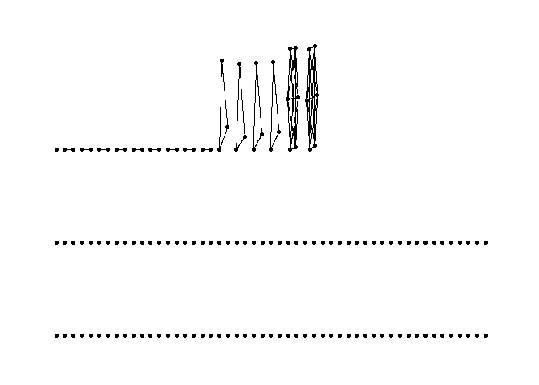

Exercise 1
================

## Load the data

``` r
connections_fixed <- read_csv("Connections.csv")
```

    ## Rows: 145 Columns: 6

    ## -- Column specification --------------------------------------------------------
    ## Delimiter: ","
    ## chr (6): First Name, Last Name, Email Address, Company, Position, Connected On

    ## 
    ## i Use `spec()` to retrieve the full column specification for this data.
    ## i Specify the column types or set `show_col_types = FALSE` to quiet this message.

``` r
view(connections_fixed)
```

## Get count of contacts by current employers

``` r
relations = connections_fixed %>% 
  count(Company) %>% 
  arrange(-n)
relations
```

    ## # A tibble: 117 x 2
    ##    Company                                                 n
    ##    <chr>                                               <int>
    ##  1 McGill University - Desautels Faculty of Management     6
    ##  2 Verint                                                  6
    ##  3 Air Transat                                             3
    ##  4 Metrolinx                                               3
    ##  5 Rogers Communications                                   3
    ##  6 University of Michigan                                  3
    ##  7 Capital One                                             2
    ##  8 DHL eCommerce Solutions                                 2
    ##  9 McGill University                                       2
    ## 10 Michigan Medicine                                       2
    ## # ... with 107 more rows

## Create the nodes dataframe

``` r
connections_fixed$Name <- paste(connections_fixed$`First Name`, substring(connections_fixed$`Last Name`,0,1))
nodes <- data.frame(connections_fixed$Name)
colnames(nodes) <- c('node_key')
head(nodes, 3)
```

    ##          node_key
    ## 1 Anqi (Angela) C
    ## 2       Xintong L
    ## 3         Sunny W

## Create the edges dataframe

``` r
# add first row to remove later
from <- c(".")
to <- c(".")
edges <- data.frame(from, to)

count = nrow(connections_fixed)-1
for(row in 1:count){
  hasbeenconnection = 0
  comp1 = connections_fixed[[row, "Company"]]
  if (!is.na(comp1)){
    startnum = row+1
    for (row2 in startnum:nrow(connections_fixed)){
      comp2 = connections_fixed[[row2, "Company"]]
      if (!is.na(comp2)){
        if (comp1 == comp2){
          col <- c(connections_fixed[row, "Name"], connections_fixed[row2, "Name"])
          edges[nrow(edges) + 1,] <- col
          hasbeenconnection = 1
        }
      }
    }
  }
  # if (hasbeenconnection == 0){
  #   col <- c(connections_fixed[row, "Name"], "")
  #   edges[nrow(edges) + 1,] <- col
  # }
}

# delete first row
edges = edges[-1,]
rownames(edges) <- 1:nrow(edges)
head(edges, 3)
```

    ##        from                   to
    ## 1 Xintong L Cheok Ieng (Betty) A
    ## 2 Xintong L              Senan A
    ## 3   Vahid H              Tehut B

## Form the network

``` r
network_tidy <- tbl_graph(nodes = nodes, edges = edges, directed = FALSE)
network_tidy
```

    ## # A tbl_graph: 145 nodes and 51 edges
    ## #
    ## # An undirected simple graph with 118 components
    ## #
    ## # Node Data: 145 x 1 (active)
    ##   node_key       
    ##   <chr>          
    ## 1 Anqi (Angela) C
    ## 2 Xintong L      
    ## 3 Sunny W        
    ## 4 Ziye Z         
    ## 5 Uzair A        
    ## 6 Sandy V        
    ## # ... with 139 more rows
    ## #
    ## # Edge Data: 51 x 2
    ##    from    to
    ##   <int> <int>
    ## 1     2    17
    ## 2     2    72
    ## 3     7    34
    ## # ... with 48 more rows

## Plot the graph

``` r
ggraph(network_tidy) + geom_edge_link() + geom_node_point() + theme_graph()
```

    ## Using `stress` as default layout

<!-- -->
