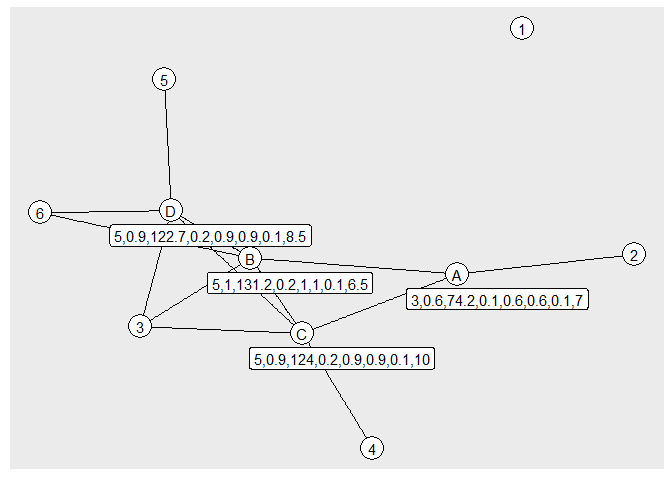

Exercise 2
================

# 1. Import edges data and create nodes data

``` r
edges <- read_csv("fakebook.csv")
```

    ## Rows: 13 Columns: 2

    ## -- Column specification --------------------------------------------------------
    ## Delimiter: ","
    ## chr (2): from, to

    ## 
    ## i Use `spec()` to retrieve the full column specification for this data.
    ## i Specify the column types or set `show_col_types = FALSE` to quiet this message.

``` r
edges
```

    ## # A tibble: 13 x 2
    ##    from  to   
    ##    <chr> <chr>
    ##  1 A     2    
    ##  2 A     B    
    ##  3 A     C    
    ##  4 B     3    
    ##  5 B     6    
    ##  6 B     C    
    ##  7 B     D    
    ##  8 C     3    
    ##  9 C     4    
    ## 10 C     D    
    ## 11 D     3    
    ## 12 D     5    
    ## 13 D     6

``` r
name <- c(1, 2, 3, 4, 5, 6, 'A', 'B', 'C', 'D')
id <- c(1, 2, 3, 4, 5, 6, 7, 8, 9, 10)
nodes <- data.frame(name, id)
nodes
```

    ##    name id
    ## 1     1  1
    ## 2     2  2
    ## 3     3  3
    ## 4     4  4
    ## 5     5  5
    ## 6     6  6
    ## 7     A  7
    ## 8     B  8
    ## 9     C  9
    ## 10    D 10

# 2. Calculate 8 node centrality measures

``` r
g <- tbl_graph(nodes = nodes, edges = edges, directed = FALSE)
g
```

    ## # A tbl_graph: 10 nodes and 13 edges
    ## #
    ## # An undirected simple graph with 2 components
    ## #
    ## # Node Data: 10 x 2 (active)
    ##   name     id
    ##   <chr> <dbl>
    ## 1 1         1
    ## 2 2         2
    ## 3 3         3
    ## 4 4         4
    ## 5 5         5
    ## 6 6         6
    ## # ... with 4 more rows
    ## #
    ## # Edge Data: 13 x 2
    ##    from    to
    ##   <int> <int>
    ## 1     2     7
    ## 2     7     8
    ## 3     7     9
    ## # ... with 10 more rows

``` r
g <- g %>%
  mutate(degree = round(centrality_degree(), 1)) %>%
  mutate(eigen = round(centrality_eigen(), 1)) %>%
  mutate(katz = round(centrality_katz(), 1)) %>%
  mutate(pagerank = round(centrality_pagerank(), 1)) %>%
  mutate(authority = round(centrality_authority(), 1)) %>%
  mutate(hub = round(centrality_hub(), 1)) %>%
  mutate(closeness = round(centrality_closeness(), 1)) %>%
  mutate(betweenness = round(centrality_betweenness(), 2))
```

    ## Warning in betweenness(graph = graph, v = V(graph), directed = directed, :
    ## 'nobigint' is deprecated since igraph 1.3 and will be removed in igraph 1.4

``` r
g
```

    ## # A tbl_graph: 10 nodes and 13 edges
    ## #
    ## # An undirected simple graph with 2 components
    ## #
    ## # Node Data: 10 x 10 (active)
    ##   name     id degree eigen  katz pagerank authority   hub closeness betweenness
    ##   <chr> <dbl>  <dbl> <dbl> <dbl>    <dbl>     <dbl> <dbl>     <dbl>       <dbl>
    ## 1 1         1      0   0     1        0         0     0       NaN             0
    ## 2 2         2      1   0.2  20.7      0.1       0.2   0.2       0             0
    ## 3 3         3      3   0.8 101.       0.1       0.8   0.8       0.1           0
    ## 4 4         4      1   0.3  33.9      0         0.3   0.3       0.1           0
    ## 5 5         5      1   0.3  33.6      0         0.3   0.3       0.1           0
    ## 6 6         6      2   0.5  68.4      0.1       0.5   0.5       0.1           0
    ## # ... with 4 more rows
    ## #
    ## # Edge Data: 13 x 2
    ##    from    to
    ##   <int> <int>
    ## 1     2     7
    ## 2     7     8
    ## 3     7     9
    ## # ... with 10 more rows

``` r
node_info <- g %>%
  activate(nodes) %>%
  data.frame()
node_info
```

    ##    name id degree eigen  katz pagerank authority hub closeness betweenness
    ## 1     1  1      0   0.0   1.0      0.0       0.0 0.0       NaN         0.0
    ## 2     2  2      1   0.2  20.7      0.1       0.2 0.2       0.0         0.0
    ## 3     3  3      3   0.8 101.3      0.1       0.8 0.8       0.1         0.0
    ## 4     4  4      1   0.3  33.9      0.0       0.3 0.3       0.1         0.0
    ## 5     5  5      1   0.3  33.6      0.0       0.3 0.3       0.1         0.0
    ## 6     6  6      2   0.5  68.4      0.1       0.5 0.5       0.1         0.0
    ## 7     A  7      3   0.6  74.2      0.1       0.6 0.6       0.1         7.0
    ## 8     B  8      5   1.0 131.2      0.2       1.0 1.0       0.1         6.5
    ## 9     C  9      5   0.9 124.0      0.2       0.9 0.9       0.1        10.0
    ## 10    D 10      5   0.9 122.7      0.2       0.9 0.9       0.1         8.5

# 3. Discuss possible consequences of your choice of a seat. When would this choice be beneficial? When would it be not so beneficial?

Seats B, C and D all have a degree centrality of 5. However, if we take
all the centrality scores into account, seat B seems to be the ideal
choice for almost all the measures except betweenness centrality for
which C shows a higher score. In this case, betweenness centrality is
not too important as the goal is to form relationships with other
co-workers not be a middle man.

# 4. Plot the network graph with labels and centrality values

### Labels numbers represent (in order): degree, eigen, katz, pagerank, authority, hub, closeness and betweenness centrality

``` r
ggraph(g, layout = 'fr') + 
  geom_edge_link() + 
  geom_node_point(fill = "white", shape = 21, size = 8, color = "black") +
  geom_node_text(aes(label = name)) +
  geom_node_label(aes(filter= name %in% c('A', 'B', 'C', 'D'), label = paste(degree, eigen, katz, pagerank, authority, hub, closeness, betweenness, sep=",")), nudge_x = 0.25, nudge_y = -0.25,)
```

<!-- -->
