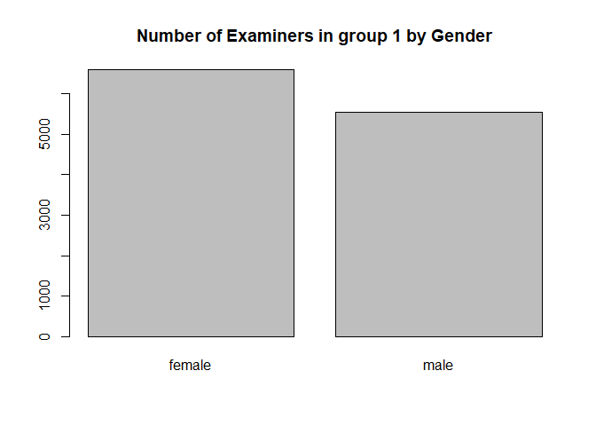

Exercise 3
================

# Import data

``` r
data_path <- "uspto_data/"
applications <- read_parquet(paste0(data_path,"app_data_sample.parquet"))
edges <- read_csv(paste0(data_path,"edges_sample.csv"))
```

    ## Rows: 32906 Columns: 4

    ## -- Column specification --------------------------------------------------------
    ## Delimiter: ","
    ## chr  (1): application_number
    ## dbl  (2): ego_examiner_id, alter_examiner_id
    ## date (1): advice_date

    ## 
    ## i Use `spec()` to retrieve the full column specification for this data.
    ## i Specify the column types or set `show_col_types = FALSE` to quiet this message.

``` r
head(applications, 5)
```

    ## # A tibble: 5 x 16
    ##   application_number filing_date examiner_name_last examiner_name_first
    ##   <chr>              <date>      <chr>              <chr>              
    ## 1 08284457           2000-01-26  HOWARD             JACQUELINE         
    ## 2 08413193           2000-10-11  YILDIRIM           BEKIR              
    ## 3 08531853           2000-05-17  HAMILTON           CYNTHIA            
    ## 4 08637752           2001-07-20  MOSHER             MARY               
    ## 5 08682726           2000-04-10  BARR               MICHAEL            
    ## # ... with 12 more variables: examiner_name_middle <chr>, examiner_id <dbl>,
    ## #   examiner_art_unit <dbl>, uspc_class <chr>, uspc_subclass <chr>,
    ## #   patent_number <chr>, patent_issue_date <date>, abandon_date <date>,
    ## #   disposal_type <chr>, appl_status_code <dbl>, appl_status_date <chr>,
    ## #   tc <dbl>

``` r
head(edges, 5)
```

    ## # A tibble: 5 x 4
    ##   application_number advice_date ego_examiner_id alter_examiner_id
    ##   <chr>              <date>                <dbl>             <dbl>
    ## 1 09402488           2008-11-17            84356             66266
    ## 2 09402488           2008-11-17            84356             63519
    ## 3 09402488           2008-11-17            84356             98531
    ## 4 09445135           2008-08-21            92953             71313
    ## 5 09445135           2008-08-21            92953             93865

# 1. Data Pre-Processing

## Get examiner gender

``` r
# get a list of first names without repetitions
examiner_names <- applications %>% 
  distinct(examiner_name_first)
examiner_names
```

    ## # A tibble: 2,595 x 1
    ##    examiner_name_first
    ##    <chr>              
    ##  1 JACQUELINE         
    ##  2 BEKIR              
    ##  3 CYNTHIA            
    ##  4 MARY               
    ##  5 MICHAEL            
    ##  6 LINDA              
    ##  7 KARA               
    ##  8 VANESSA            
    ##  9 TERESA             
    ## 10 SUN                
    ## # ... with 2,585 more rows

``` r
# get a table of names and gender
examiner_names_gender <- examiner_names %>% 
  do(results = gender(.$examiner_name_first, method = "ssa")) %>% 
  unnest(cols = c(results), keep_empty = TRUE) %>% 
  select(
    examiner_name_first = name,
    gender,
    proportion_female
  )
examiner_names_gender
```

    ## # A tibble: 1,822 x 3
    ##    examiner_name_first gender proportion_female
    ##    <chr>               <chr>              <dbl>
    ##  1 AARON               male              0.0082
    ##  2 ABDEL               male              0     
    ##  3 ABDOU               male              0     
    ##  4 ABDUL               male              0     
    ##  5 ABDULHAKIM          male              0     
    ##  6 ABDULLAH            male              0     
    ##  7 ABDULLAHI           male              0     
    ##  8 ABIGAIL             female            0.998 
    ##  9 ABIMBOLA            female            0.944 
    ## 10 ABRAHAM             male              0.0031
    ## # ... with 1,812 more rows

``` r
# remove extra colums from the gender table
examiner_names_gender <- examiner_names_gender %>% 
  select(examiner_name_first, gender)
# joining gender back to the dataset
applications <- applications %>% 
  left_join(examiner_names_gender, by = "examiner_name_first")
# cleaning up
rm(examiner_names)
rm(examiner_names_gender)
gc()
```

    ##            used  (Mb) gc trigger  (Mb) max used  (Mb)
    ## Ncells  4672063 249.6    8086375 431.9  5001677 267.2
    ## Vcells 49693553 379.2   95643299 729.8 80009128 610.5

## Get examiner race

``` r
examiner_surnames <- applications %>% 
  select(surname = examiner_name_last) %>% 
  distinct()
examiner_surnames
```

    ## # A tibble: 3,806 x 1
    ##    surname   
    ##    <chr>     
    ##  1 HOWARD    
    ##  2 YILDIRIM  
    ##  3 HAMILTON  
    ##  4 MOSHER    
    ##  5 BARR      
    ##  6 GRAY      
    ##  7 MCMILLIAN 
    ##  8 FORD      
    ##  9 STRZELECKA
    ## 10 KIM       
    ## # ... with 3,796 more rows

``` r
examiner_race <- predict_race(voter.file = examiner_surnames, surname.only = T) %>% 
  as_tibble()
```

    ## [1] "Proceeding with surname-only predictions..."

    ## Warning in merge_surnames(voter.file): Probabilities were imputed for 698
    ## surnames that could not be matched to Census list.

``` r
examiner_race
```

    ## # A tibble: 3,806 x 6
    ##    surname    pred.whi pred.bla pred.his pred.asi pred.oth
    ##    <chr>         <dbl>    <dbl>    <dbl>    <dbl>    <dbl>
    ##  1 HOWARD       0.643   0.295    0.0237   0.005     0.0333
    ##  2 YILDIRIM     0.861   0.0271   0.0609   0.0135    0.0372
    ##  3 HAMILTON     0.702   0.237    0.0245   0.0054    0.0309
    ##  4 MOSHER       0.947   0.00410  0.0241   0.00640   0.0185
    ##  5 BARR         0.827   0.117    0.0226   0.00590   0.0271
    ##  6 GRAY         0.687   0.251    0.0241   0.0054    0.0324
    ##  7 MCMILLIAN    0.359   0.574    0.0189   0.00260   0.0463
    ##  8 FORD         0.620   0.32     0.0237   0.0045    0.0313
    ##  9 STRZELECKA   0.666   0.0853   0.137    0.0797    0.0318
    ## 10 KIM          0.0252  0.00390  0.00650  0.945     0.0198
    ## # ... with 3,796 more rows

``` r
examiner_race <- examiner_race %>% 
  mutate(max_race_p = pmax(pred.asi, pred.bla, pred.his, pred.oth, pred.whi)) %>% 
  mutate(race = case_when(
    max_race_p == pred.asi ~ "asian",
    max_race_p == pred.bla ~ "black",
    max_race_p == pred.his ~ "hispanic",
    max_race_p == pred.oth ~ "other",
    max_race_p == pred.whi ~ "white",
    TRUE ~ NA_character_
  ))
examiner_race
```

    ## # A tibble: 3,806 x 8
    ##    surname    pred.whi pred.bla pred.his pred.asi pred.oth max_race_p race 
    ##    <chr>         <dbl>    <dbl>    <dbl>    <dbl>    <dbl>      <dbl> <chr>
    ##  1 HOWARD       0.643   0.295    0.0237   0.005     0.0333      0.643 white
    ##  2 YILDIRIM     0.861   0.0271   0.0609   0.0135    0.0372      0.861 white
    ##  3 HAMILTON     0.702   0.237    0.0245   0.0054    0.0309      0.702 white
    ##  4 MOSHER       0.947   0.00410  0.0241   0.00640   0.0185      0.947 white
    ##  5 BARR         0.827   0.117    0.0226   0.00590   0.0271      0.827 white
    ##  6 GRAY         0.687   0.251    0.0241   0.0054    0.0324      0.687 white
    ##  7 MCMILLIAN    0.359   0.574    0.0189   0.00260   0.0463      0.574 black
    ##  8 FORD         0.620   0.32     0.0237   0.0045    0.0313      0.620 white
    ##  9 STRZELECKA   0.666   0.0853   0.137    0.0797    0.0318      0.666 white
    ## 10 KIM          0.0252  0.00390  0.00650  0.945     0.0198      0.945 asian
    ## # ... with 3,796 more rows

``` r
# removing extra columns
examiner_race <- examiner_race %>% 
  select(surname,race)
applications <- applications %>% 
  left_join(examiner_race, by = c("examiner_name_last" = "surname"))
rm(examiner_race)
rm(examiner_surnames)
gc()
```

    ##            used  (Mb) gc trigger  (Mb) max used  (Mb)
    ## Ncells  5011277 267.7    8086375 431.9  5988619 319.9
    ## Vcells 53378268 407.3   95643299 729.8 94375002 720.1

## Get examiner tenure

``` r
examiner_dates <- applications %>% 
  select(examiner_id, filing_date, appl_status_date) 
examiner_dates
```

    ## # A tibble: 2,018,477 x 3
    ##    examiner_id filing_date appl_status_date  
    ##          <dbl> <date>      <chr>             
    ##  1       96082 2000-01-26  30jan2003 00:00:00
    ##  2       87678 2000-10-11  27sep2010 00:00:00
    ##  3       63213 2000-05-17  30mar2009 00:00:00
    ##  4       73788 2001-07-20  07sep2009 00:00:00
    ##  5       77294 2000-04-10  19apr2001 00:00:00
    ##  6       68606 2000-04-28  16jul2001 00:00:00
    ##  7       89557 2004-01-26  15may2017 00:00:00
    ##  8       97543 2000-06-23  03apr2002 00:00:00
    ##  9       98714 2000-02-04  27nov2002 00:00:00
    ## 10       65530 2002-02-20  23mar2009 00:00:00
    ## # ... with 2,018,467 more rows

``` r
examiner_dates <- examiner_dates %>% 
  mutate(start_date = ymd(filing_date), end_date = as_date(dmy_hms(appl_status_date)))
```

``` r
examiner_dates <- examiner_dates %>% 
  group_by(examiner_id) %>% 
  summarise(
    earliest_date = min(start_date, na.rm = TRUE), 
    latest_date = max(end_date, na.rm = TRUE),
    tenure_days = interval(earliest_date, latest_date) %/% days(1)
    ) %>% 
  filter(year(latest_date)<2018)
examiner_dates
```

    ## # A tibble: 5,625 x 4
    ##    examiner_id earliest_date latest_date tenure_days
    ##          <dbl> <date>        <date>            <dbl>
    ##  1       59012 2004-07-28    2015-07-24         4013
    ##  2       59025 2009-10-26    2017-05-18         2761
    ##  3       59030 2005-12-12    2017-05-22         4179
    ##  4       59040 2007-09-11    2017-05-23         3542
    ##  5       59052 2001-08-21    2007-02-28         2017
    ##  6       59054 2000-11-10    2016-12-23         5887
    ##  7       59055 2004-11-02    2007-12-26         1149
    ##  8       59056 2000-03-24    2017-05-22         6268
    ##  9       59074 2000-01-31    2017-03-17         6255
    ## 10       59081 2011-04-21    2017-05-19         2220
    ## # ... with 5,615 more rows

``` r
applications <- applications %>% 
  left_join(examiner_dates, by = "examiner_id")
rm(examiner_dates)
gc()
```

    ##            used  (Mb) gc trigger   (Mb)  max used   (Mb)
    ## Ncells  5025022 268.4   14600788  779.8  14600788  779.8
    ## Vcells 65756457 501.7  137902349 1052.2 137814432 1051.5

``` r
applications$tenure_years = applications$tenure_days / 365
head(applications, 5)
```

    ## # A tibble: 5 x 22
    ##   application_number filing_date examiner_name_last examiner_name_first
    ##   <chr>              <date>      <chr>              <chr>              
    ## 1 08284457           2000-01-26  HOWARD             JACQUELINE         
    ## 2 08413193           2000-10-11  YILDIRIM           BEKIR              
    ## 3 08531853           2000-05-17  HAMILTON           CYNTHIA            
    ## 4 08637752           2001-07-20  MOSHER             MARY               
    ## 5 08682726           2000-04-10  BARR               MICHAEL            
    ## # ... with 18 more variables: examiner_name_middle <chr>, examiner_id <dbl>,
    ## #   examiner_art_unit <dbl>, uspc_class <chr>, uspc_subclass <chr>,
    ## #   patent_number <chr>, patent_issue_date <date>, abandon_date <date>,
    ## #   disposal_type <chr>, appl_status_code <dbl>, appl_status_date <chr>,
    ## #   tc <dbl>, gender <chr>, race <chr>, earliest_date <date>,
    ## #   latest_date <date>, tenure_days <dbl>, tenure_years <dbl>

# 2. Workgroups - 168 and 215

-   Examiners’ demographics
-   Summary statistics and plots

## Select the 2 workgroups

``` r
applications$workgroup = round(applications$examiner_art_unit / 10, 0)
head(applications, 5)
```

    ## # A tibble: 5 x 23
    ##   application_number filing_date examiner_name_last examiner_name_first
    ##   <chr>              <date>      <chr>              <chr>              
    ## 1 08284457           2000-01-26  HOWARD             JACQUELINE         
    ## 2 08413193           2000-10-11  YILDIRIM           BEKIR              
    ## 3 08531853           2000-05-17  HAMILTON           CYNTHIA            
    ## 4 08637752           2001-07-20  MOSHER             MARY               
    ## 5 08682726           2000-04-10  BARR               MICHAEL            
    ## # ... with 19 more variables: examiner_name_middle <chr>, examiner_id <dbl>,
    ## #   examiner_art_unit <dbl>, uspc_class <chr>, uspc_subclass <chr>,
    ## #   patent_number <chr>, patent_issue_date <date>, abandon_date <date>,
    ## #   disposal_type <chr>, appl_status_code <dbl>, appl_status_date <chr>,
    ## #   tc <dbl>, gender <chr>, race <chr>, earliest_date <date>,
    ## #   latest_date <date>, tenure_days <dbl>, tenure_years <dbl>, workgroup <dbl>

``` r
applications %>% count(workgroup, sort = TRUE)
```

    ## # A tibble: 42 x 2
    ##    workgroup      n
    ##        <dbl>  <int>
    ##  1       162 143718
    ##  2       176 108000
    ##  3       163  99474
    ##  4       164  98385
    ##  5       179  89960
    ##  6       165  87749
    ##  7       172  79568
    ##  8       174  72723
    ##  9       173  71981
    ## 10       180  69103
    ## # ... with 32 more rows

``` r
tc_168 = applications[which(applications$workgroup==168),]
tc_215 = applications[which(applications$workgroup==215),]
tc_168
```

    ## # A tibble: 14,379 x 23
    ##    application_number filing_date examiner_name_last examiner_name_first
    ##    <chr>              <date>      <chr>              <chr>              
    ##  1 09463800           2000-06-12  CHIN               CHRISTOPHER        
    ##  2 09479498           2000-01-07  COOK               LISA               
    ##  3 09480846           2000-01-10  CHIN               CHRISTOPHER        
    ##  4 09482460           2000-01-13  CHIN               CHRISTOPHER        
    ##  5 09482604           2000-01-14  CHEU               CHANGHWA           
    ##  6 09483019           2000-01-13  GABEL              GAILENE            
    ##  7 09483540           2000-01-14  LAM                ANN                
    ##  8 09486362           2000-02-28  COUNTS             GARY               
    ##  9 09486640           2000-02-29  DO                 PENSEE             
    ## 10 09486970           2000-05-23  RUSSEL             JEFFREY            
    ## # ... with 14,369 more rows, and 19 more variables: examiner_name_middle <chr>,
    ## #   examiner_id <dbl>, examiner_art_unit <dbl>, uspc_class <chr>,
    ## #   uspc_subclass <chr>, patent_number <chr>, patent_issue_date <date>,
    ## #   abandon_date <date>, disposal_type <chr>, appl_status_code <dbl>,
    ## #   appl_status_date <chr>, tc <dbl>, gender <chr>, race <chr>,
    ## #   earliest_date <date>, latest_date <date>, tenure_days <dbl>,
    ## #   tenure_years <dbl>, workgroup <dbl>

``` r
tc_215
```

    ## # A tibble: 14,503 x 23
    ##    application_number filing_date examiner_name_last examiner_name_first
    ##    <chr>              <date>      <chr>              <chr>              
    ##  1 09224808           2001-06-18  COURTENAY III      ST JOHN            
    ##  2 09230391           2000-02-23  EL HADY            NABIL              
    ##  3 09270600           2002-07-08  FLYNN              KIMBERLY           
    ##  4 09402633           2000-05-25  DINH               KHANH              
    ##  5 09402931           2000-01-24  CHANG              JUNGWON            
    ##  6 09403813           2000-03-20  WHIPPLE            BRIAN              
    ##  7 09424397           2000-04-05  CALDWELL           ANDREW             
    ##  8 09445033           2000-01-18  PARTON             KEVIN              
    ##  9 09445639           2000-04-14  HU                 JINSONG            
    ## 10 09445843           2001-06-22  FLYNN              KIMBERLY           
    ## # ... with 14,493 more rows, and 19 more variables: examiner_name_middle <chr>,
    ## #   examiner_id <dbl>, examiner_art_unit <dbl>, uspc_class <chr>,
    ## #   uspc_subclass <chr>, patent_number <chr>, patent_issue_date <date>,
    ## #   abandon_date <date>, disposal_type <chr>, appl_status_code <dbl>,
    ## #   appl_status_date <chr>, tc <dbl>, gender <chr>, race <chr>,
    ## #   earliest_date <date>, latest_date <date>, tenure_days <dbl>,
    ## #   tenure_years <dbl>, workgroup <dbl>

## Demographics summary statistics and plots

``` r
table(tc_168$race)
```

    ## 
    ##    asian    black hispanic    white 
    ##     3133      396     1111     9739

``` r
table(tc_215$race)
```

    ## 
    ##    asian    black hispanic    white 
    ##     6326      410       51     7716

``` r
barplot(table(tc_168$race), main="Number of Examiners in TC 1600 by Race")
```

<!-- -->

``` r
barplot(table(tc_215$race), main="Number of Examiners in TC 1700 by Race")
```

<!-- -->

``` r
summary(tc_168$tenure_years)
```

    ##    Min. 1st Qu.  Median    Mean 3rd Qu.    Max.    NA's 
    ##   6.578  11.671  15.729  14.501  17.230  17.395     132

``` r
summary(tc_215$tenure_years)
```

    ##    Min. 1st Qu.  Median    Mean 3rd Qu.    Max.    NA's 
    ##   1.877  16.312  17.282  16.029  17.282  17.395      73

``` r
v <- tc_168 %>% select(tenure_years)
ggplot(data = v, mapping = aes(x=tenure_years)) + 
  geom_histogram(aes(y=..count..),fill="bisque",color="white",alpha=0.7) + 
  geom_density() +
  labs(x='Tenure in years for workgroup 168') +
  theme_minimal()
```

    ## `stat_bin()` using `bins = 30`. Pick better value with `binwidth`.

    ## Warning: Removed 132 rows containing non-finite values (stat_bin).

    ## Warning: Removed 132 rows containing non-finite values (stat_density).

<!-- -->

``` r
v <- tc_215 %>% select(tenure_years)
ggplot(data = v, mapping = aes(x=tenure_years)) + 
  geom_histogram(aes(y=..count..),fill="bisque",color="white",alpha=0.7) + 
  geom_density() +
  labs(x='Tenure in years for workgroup 215') +
  theme_minimal()
```

    ## `stat_bin()` using `bins = 30`. Pick better value with `binwidth`.

    ## Warning: Removed 73 rows containing non-finite values (stat_bin).

    ## Warning: Removed 73 rows containing non-finite values (stat_density).

<!-- -->

# 3. Advice networks and centrality scores

-   Pick measure(s) of centrality you want to use and justify your
    choice
-   Characterize and discuss the relationship between centrality and
    other examiners’ characteristics

``` r
head(edges)
```

    ## # A tibble: 6 x 4
    ##   application_number advice_date ego_examiner_id alter_examiner_id
    ##   <chr>              <date>                <dbl>             <dbl>
    ## 1 09402488           2008-11-17            84356             66266
    ## 2 09402488           2008-11-17            84356             63519
    ## 3 09402488           2008-11-17            84356             98531
    ## 4 09445135           2008-08-21            92953             71313
    ## 5 09445135           2008-08-21            92953             93865
    ## 6 09445135           2008-08-21            92953             91818

``` r
edges2 <- edges[c('ego_examiner_id', 'alter_examiner_id')]
colnames(edges2) <- c("from", "to")
edges2 <- na.omit(edges2)
head(edges2)
```

    ## # A tibble: 6 x 2
    ##    from    to
    ##   <dbl> <dbl>
    ## 1 84356 66266
    ## 2 84356 63519
    ## 3 84356 98531
    ## 4 92953 71313
    ## 5 92953 93865
    ## 6 92953 91818

``` r
id <- edges2$from
id <- append(id, edges2$to)
id <- unique(id)
name <- seq(1:length(id))
nodes <- data.frame(name, id)
nodes <- na.omit(nodes)
head(nodes)
```

    ##   name    id
    ## 1    1 84356
    ## 2    2 92953
    ## 3    3 61767
    ## 4    4 72253
    ## 5    5 67078
    ## 6    6 91688

``` r
# g <- tbl_graph(nodes = nodes, edges = edges2)
# g <- graph_from_data_frame(edges2, vertices=nodes)
# g
```
