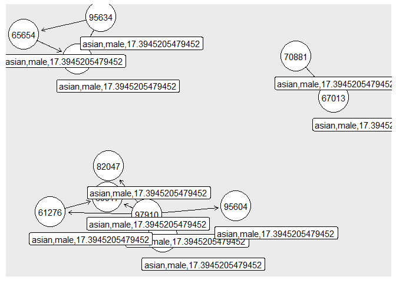

Exercise 3
================

# 1. Data Pre-Processing

## Import data

``` r
data_path <- "uspto_data/"
applications <- read_parquet(paste0(data_path,"app_data_sample.parquet"))
edges_sample <- read_csv(paste0(data_path,"edges_sample.csv"))
```

    ## Rows: 32906 Columns: 4

    ## -- Column specification --------------------------------------------------------
    ## Delimiter: ","
    ## chr  (1): application_number
    ## dbl  (2): ego_examiner_id, alter_examiner_id
    ## date (1): advice_date

    ## 
    ## i Use `spec()` to retrieve the full column specification for this data.
    ## i Specify the column types or set `show_col_types = FALSE` to quiet this message.

``` r
head(applications)
```

    ## # A tibble: 6 x 16
    ##   application_number filing_date examiner_name_last examiner_name_first
    ##   <chr>              <date>      <chr>              <chr>              
    ## 1 08284457           2000-01-26  HOWARD             JACQUELINE         
    ## 2 08413193           2000-10-11  YILDIRIM           BEKIR              
    ## 3 08531853           2000-05-17  HAMILTON           CYNTHIA            
    ## 4 08637752           2001-07-20  MOSHER             MARY               
    ## 5 08682726           2000-04-10  BARR               MICHAEL            
    ## 6 08687412           2000-04-28  GRAY               LINDA              
    ## # ... with 12 more variables: examiner_name_middle <chr>, examiner_id <dbl>,
    ## #   examiner_art_unit <dbl>, uspc_class <chr>, uspc_subclass <chr>,
    ## #   patent_number <chr>, patent_issue_date <date>, abandon_date <date>,
    ## #   disposal_type <chr>, appl_status_code <dbl>, appl_status_date <chr>,
    ## #   tc <dbl>

``` r
head(edges_sample)
```

    ## # A tibble: 6 x 4
    ##   application_number advice_date ego_examiner_id alter_examiner_id
    ##   <chr>              <date>                <dbl>             <dbl>
    ## 1 09402488           2008-11-17            84356             66266
    ## 2 09402488           2008-11-17            84356             63519
    ## 3 09402488           2008-11-17            84356             98531
    ## 4 09445135           2008-08-21            92953             71313
    ## 5 09445135           2008-08-21            92953             93865
    ## 6 09445135           2008-08-21            92953             91818

## Get examiner gender

``` r
# get a list of first names without repetitions
examiner_names <- applications %>% 
  distinct(examiner_name_first)
head(examiner_names)
```

    ## # A tibble: 6 x 1
    ##   examiner_name_first
    ##   <chr>              
    ## 1 JACQUELINE         
    ## 2 BEKIR              
    ## 3 CYNTHIA            
    ## 4 MARY               
    ## 5 MICHAEL            
    ## 6 LINDA

``` r
# get a table of names and gender
examiner_names_gender <- examiner_names %>% 
  do(results = gender(.$examiner_name_first, method = "ssa")) %>% 
  unnest(cols = c(results), keep_empty = TRUE) %>% 
  select(
    examiner_name_first = name,
    gender,
    proportion_female
  )
head(examiner_names_gender)
```

    ## # A tibble: 6 x 3
    ##   examiner_name_first gender proportion_female
    ##   <chr>               <chr>              <dbl>
    ## 1 AARON               male              0.0082
    ## 2 ABDEL               male              0     
    ## 3 ABDOU               male              0     
    ## 4 ABDUL               male              0     
    ## 5 ABDULHAKIM          male              0     
    ## 6 ABDULLAH            male              0

``` r
# remove extra colums from the gender table
examiner_names_gender <- examiner_names_gender %>% 
  select(examiner_name_first, gender)
# joining gender back to the dataset
applications <- applications %>% 
  left_join(examiner_names_gender, by = "examiner_name_first")
# cleaning up
rm(examiner_names)
rm(examiner_names_gender)
gc()
```

    ##            used  (Mb) gc trigger  (Mb) max used  (Mb)
    ## Ncells  4672167 249.6    8096218 432.4  4994535 266.8
    ## Vcells 49694295 379.2   95644190 729.8 80009870 610.5

## Get examiner race

``` r
examiner_surnames <- applications %>% 
  select(surname = examiner_name_last) %>% 
  distinct()
head(examiner_surnames)
```

    ## # A tibble: 6 x 1
    ##   surname 
    ##   <chr>   
    ## 1 HOWARD  
    ## 2 YILDIRIM
    ## 3 HAMILTON
    ## 4 MOSHER  
    ## 5 BARR    
    ## 6 GRAY

``` r
examiner_race <- predict_race(voter.file = examiner_surnames, surname.only = T) %>% 
  as_tibble()
```

    ## [1] "Proceeding with surname-only predictions..."

    ## Warning in merge_surnames(voter.file): Probabilities were imputed for 698
    ## surnames that could not be matched to Census list.

``` r
head(examiner_race)
```

    ## # A tibble: 6 x 6
    ##   surname  pred.whi pred.bla pred.his pred.asi pred.oth
    ##   <chr>       <dbl>    <dbl>    <dbl>    <dbl>    <dbl>
    ## 1 HOWARD      0.643  0.295     0.0237  0.005     0.0333
    ## 2 YILDIRIM    0.861  0.0271    0.0609  0.0135    0.0372
    ## 3 HAMILTON    0.702  0.237     0.0245  0.0054    0.0309
    ## 4 MOSHER      0.947  0.00410   0.0241  0.00640   0.0185
    ## 5 BARR        0.827  0.117     0.0226  0.00590   0.0271
    ## 6 GRAY        0.687  0.251     0.0241  0.0054    0.0324

``` r
examiner_race <- examiner_race %>% 
  mutate(max_race_p = pmax(pred.asi, pred.bla, pred.his, pred.oth, pred.whi)) %>% 
  mutate(race = case_when(
    max_race_p == pred.asi ~ "asian",
    max_race_p == pred.bla ~ "black",
    max_race_p == pred.his ~ "hispanic",
    max_race_p == pred.oth ~ "other",
    max_race_p == pred.whi ~ "white",
    TRUE ~ NA_character_
  ))
head(examiner_race)
```

    ## # A tibble: 6 x 8
    ##   surname  pred.whi pred.bla pred.his pred.asi pred.oth max_race_p race 
    ##   <chr>       <dbl>    <dbl>    <dbl>    <dbl>    <dbl>      <dbl> <chr>
    ## 1 HOWARD      0.643  0.295     0.0237  0.005     0.0333      0.643 white
    ## 2 YILDIRIM    0.861  0.0271    0.0609  0.0135    0.0372      0.861 white
    ## 3 HAMILTON    0.702  0.237     0.0245  0.0054    0.0309      0.702 white
    ## 4 MOSHER      0.947  0.00410   0.0241  0.00640   0.0185      0.947 white
    ## 5 BARR        0.827  0.117     0.0226  0.00590   0.0271      0.827 white
    ## 6 GRAY        0.687  0.251     0.0241  0.0054    0.0324      0.687 white

``` r
# removing extra columns
examiner_race <- examiner_race %>% 
  select(surname,race)
applications <- applications %>% 
  left_join(examiner_race, by = c("examiner_name_last" = "surname"))
rm(examiner_race)
rm(examiner_surnames)
gc()
```

    ##            used  (Mb) gc trigger  (Mb) max used  (Mb)
    ## Ncells  5011383 267.7    8096218 432.4  5956875 318.2
    ## Vcells 53378918 407.3   95644190 729.8 94336569 719.8

## Get examiner tenure

``` r
examiner_dates <- applications %>% 
  select(examiner_id, filing_date, appl_status_date) 
head(examiner_dates)
```

    ## # A tibble: 6 x 3
    ##   examiner_id filing_date appl_status_date  
    ##         <dbl> <date>      <chr>             
    ## 1       96082 2000-01-26  30jan2003 00:00:00
    ## 2       87678 2000-10-11  27sep2010 00:00:00
    ## 3       63213 2000-05-17  30mar2009 00:00:00
    ## 4       73788 2001-07-20  07sep2009 00:00:00
    ## 5       77294 2000-04-10  19apr2001 00:00:00
    ## 6       68606 2000-04-28  16jul2001 00:00:00

``` r
examiner_dates <- examiner_dates %>% 
  mutate(start_date = ymd(filing_date), end_date = as_date(dmy_hms(appl_status_date)))
```

``` r
examiner_dates <- examiner_dates %>% 
  group_by(examiner_id) %>% 
  summarise(
    earliest_date = min(start_date, na.rm = TRUE), 
    latest_date = max(end_date, na.rm = TRUE),
    tenure_days = interval(earliest_date, latest_date) %/% days(1)
    ) %>% 
  filter(year(latest_date)<2018)
head(examiner_dates)
```

    ## # A tibble: 6 x 4
    ##   examiner_id earliest_date latest_date tenure_days
    ##         <dbl> <date>        <date>            <dbl>
    ## 1       59012 2004-07-28    2015-07-24         4013
    ## 2       59025 2009-10-26    2017-05-18         2761
    ## 3       59030 2005-12-12    2017-05-22         4179
    ## 4       59040 2007-09-11    2017-05-23         3542
    ## 5       59052 2001-08-21    2007-02-28         2017
    ## 6       59054 2000-11-10    2016-12-23         5887

``` r
applications <- applications %>% 
  left_join(examiner_dates, by = "examiner_id")
rm(examiner_dates)
gc()
```

    ##            used  (Mb) gc trigger   (Mb)  max used   (Mb)
    ## Ncells  5025129 268.4   14623201  781.0  14623201  781.0
    ## Vcells 65757038 501.7  137903633 1052.2 137815054 1051.5

``` r
applications$tenure_years = applications$tenure_days / 365
head(applications)
```

    ## # A tibble: 6 x 22
    ##   application_number filing_date examiner_name_last examiner_name_first
    ##   <chr>              <date>      <chr>              <chr>              
    ## 1 08284457           2000-01-26  HOWARD             JACQUELINE         
    ## 2 08413193           2000-10-11  YILDIRIM           BEKIR              
    ## 3 08531853           2000-05-17  HAMILTON           CYNTHIA            
    ## 4 08637752           2001-07-20  MOSHER             MARY               
    ## 5 08682726           2000-04-10  BARR               MICHAEL            
    ## 6 08687412           2000-04-28  GRAY               LINDA              
    ## # ... with 18 more variables: examiner_name_middle <chr>, examiner_id <dbl>,
    ## #   examiner_art_unit <dbl>, uspc_class <chr>, uspc_subclass <chr>,
    ## #   patent_number <chr>, patent_issue_date <date>, abandon_date <date>,
    ## #   disposal_type <chr>, appl_status_code <dbl>, appl_status_date <chr>,
    ## #   tc <dbl>, gender <chr>, race <chr>, earliest_date <date>,
    ## #   latest_date <date>, tenure_days <dbl>, tenure_years <dbl>

# 2. Workgroups

## Select the 2 workgroups

``` r
applications$workgroup = round(applications$examiner_art_unit / 10, 0)
head(applications)
```

    ## # A tibble: 6 x 23
    ##   application_number filing_date examiner_name_last examiner_name_first
    ##   <chr>              <date>      <chr>              <chr>              
    ## 1 08284457           2000-01-26  HOWARD             JACQUELINE         
    ## 2 08413193           2000-10-11  YILDIRIM           BEKIR              
    ## 3 08531853           2000-05-17  HAMILTON           CYNTHIA            
    ## 4 08637752           2001-07-20  MOSHER             MARY               
    ## 5 08682726           2000-04-10  BARR               MICHAEL            
    ## 6 08687412           2000-04-28  GRAY               LINDA              
    ## # ... with 19 more variables: examiner_name_middle <chr>, examiner_id <dbl>,
    ## #   examiner_art_unit <dbl>, uspc_class <chr>, uspc_subclass <chr>,
    ## #   patent_number <chr>, patent_issue_date <date>, abandon_date <date>,
    ## #   disposal_type <chr>, appl_status_code <dbl>, appl_status_date <chr>,
    ## #   tc <dbl>, gender <chr>, race <chr>, earliest_date <date>,
    ## #   latest_date <date>, tenure_days <dbl>, tenure_years <dbl>, workgroup <dbl>

``` r
applications %>% 
  count(workgroup, sort = TRUE) 
```

    ## # A tibble: 42 x 2
    ##    workgroup      n
    ##        <dbl>  <int>
    ##  1       162 143718
    ##  2       176 108000
    ##  3       163  99474
    ##  4       164  98385
    ##  5       179  89960
    ##  6       165  87749
    ##  7       172  79568
    ##  8       174  72723
    ##  9       173  71981
    ## 10       180  69103
    ## # ... with 32 more rows

The 2 work groups have approximately the same number of examiners.

``` r
group1 = applications[which(applications$workgroup==168),]
group2 = applications[which(applications$workgroup==220),]
head(group1)
```

    ## # A tibble: 6 x 23
    ##   application_number filing_date examiner_name_last examiner_name_first
    ##   <chr>              <date>      <chr>              <chr>              
    ## 1 09463800           2000-06-12  CHIN               CHRISTOPHER        
    ## 2 09479498           2000-01-07  COOK               LISA               
    ## 3 09480846           2000-01-10  CHIN               CHRISTOPHER        
    ## 4 09482460           2000-01-13  CHIN               CHRISTOPHER        
    ## 5 09482604           2000-01-14  CHEU               CHANGHWA           
    ## 6 09483019           2000-01-13  GABEL              GAILENE            
    ## # ... with 19 more variables: examiner_name_middle <chr>, examiner_id <dbl>,
    ## #   examiner_art_unit <dbl>, uspc_class <chr>, uspc_subclass <chr>,
    ## #   patent_number <chr>, patent_issue_date <date>, abandon_date <date>,
    ## #   disposal_type <chr>, appl_status_code <dbl>, appl_status_date <chr>,
    ## #   tc <dbl>, gender <chr>, race <chr>, earliest_date <date>,
    ## #   latest_date <date>, tenure_days <dbl>, tenure_years <dbl>, workgroup <dbl>

``` r
head(group2)
```

    ## # A tibble: 6 x 23
    ##   application_number filing_date examiner_name_last examiner_name_first
    ##   <chr>              <date>      <chr>              <chr>              
    ## 1 09475092           2000-08-09  BULLOCK JR         LEWIS              
    ## 2 09477101           2000-01-04  BULLOCK JR         LEWIS              
    ## 3 09477688           2000-01-06  ALI                SYED               
    ## 4 09480309           2000-01-10  BULLOCK JR         LEWIS              
    ## 5 09484549           2000-01-18  TO                 JENNIFER           
    ## 6 09484865           2000-01-18  TANG               KENNETH            
    ## # ... with 19 more variables: examiner_name_middle <chr>, examiner_id <dbl>,
    ## #   examiner_art_unit <dbl>, uspc_class <chr>, uspc_subclass <chr>,
    ## #   patent_number <chr>, patent_issue_date <date>, abandon_date <date>,
    ## #   disposal_type <chr>, appl_status_code <dbl>, appl_status_date <chr>,
    ## #   tc <dbl>, gender <chr>, race <chr>, earliest_date <date>,
    ## #   latest_date <date>, tenure_days <dbl>, tenure_years <dbl>, workgroup <dbl>

## Demographics summary statistics and plots

``` r
table(group1$race)
```

    ## 
    ##    asian    black hispanic    white 
    ##     3133      396     1111     9739

``` r
table(group2$race)
```

    ## 
    ##    asian    black hispanic    white 
    ##    10293      196     1750     6109

``` r
barplot(table(group1$race), main="Number of Examiners in group 1 by Race")
```

<!-- -->

``` r
barplot(table(group2$race), main="Number of Examiners in group 2 by Race")
```

<!-- -->

``` r
table(group1$gender)
```

    ## 
    ## female   male 
    ##   6597   5554

``` r
table(group2$gender)
```

    ## 
    ## female   male 
    ##   3117  10998

``` r
barplot(table(group1$gender), main="Number of Examiners in group 1 by Gender")
```

<!-- -->

``` r
barplot(table(group2$gender), main="Number of Examiners in group 2 by Gender")
```

<!-- -->

``` r
summary(group2$tenure_years)
```

    ##    Min. 1st Qu.  Median    Mean 3rd Qu.    Max.    NA's 
    ##   2.247  10.493  12.627  13.032  16.474  17.395      17

``` r
summary(group2$tenure_years)
```

    ##    Min. 1st Qu.  Median    Mean 3rd Qu.    Max.    NA's 
    ##   2.247  10.493  12.627  13.032  16.474  17.395      17

``` r
v <- group1 %>% select(tenure_years)
ggplot(data = v, mapping = aes(x=tenure_years)) + 
  geom_histogram(aes(y=..count..),fill="bisque",color="white",alpha=0.7) + 
  geom_density() +
  labs(x='Tenure in years for workgroup 1') +
  theme_minimal()
```

    ## `stat_bin()` using `bins = 30`. Pick better value with `binwidth`.

    ## Warning: Removed 132 rows containing non-finite values (stat_bin).

    ## Warning: Removed 132 rows containing non-finite values (stat_density).

<!-- -->

``` r
v <- group2 %>% select(tenure_years)
ggplot(data = v, mapping = aes(x=tenure_years)) + 
  geom_histogram(aes(y=..count..),fill="bisque",color="white",alpha=0.7) + 
  geom_density() +
  labs(x='Tenure in years for workgroup 2') +
  theme_minimal()
```

    ## `stat_bin()` using `bins = 30`. Pick better value with `binwidth`.

    ## Warning: Removed 17 rows containing non-finite values (stat_bin).

    ## Warning: Removed 17 rows containing non-finite values (stat_density).

<!-- -->

# 3. Advice networks and centrality scores

``` r
head(edges_sample)
```

    ## # A tibble: 6 x 4
    ##   application_number advice_date ego_examiner_id alter_examiner_id
    ##   <chr>              <date>                <dbl>             <dbl>
    ## 1 09402488           2008-11-17            84356             66266
    ## 2 09402488           2008-11-17            84356             63519
    ## 3 09402488           2008-11-17            84356             98531
    ## 4 09445135           2008-08-21            92953             71313
    ## 5 09445135           2008-08-21            92953             93865
    ## 6 09445135           2008-08-21            92953             91818

``` r
from <- edges_sample['ego_examiner_id']
to <- edges_sample['alter_examiner_id']
edges <- data.frame(from, to)
colnames(edges) <- c("from", "to")
edges <- na.omit(edges)
head(edges)
```

    ##    from    to
    ## 1 84356 66266
    ## 2 84356 63519
    ## 3 84356 98531
    ## 4 92953 71313
    ## 5 92953 93865
    ## 6 92953 91818

## Create advice networks for workgroup 1

``` r
edges_subset <- edges[which(edges$from %in% group1$examiner_id & edges$to %in% group1$examiner_id),]
edges_subset
```

    ##        from    to
    ## 752   97910 85987
    ## 2951  97910 69917
    ## 5966  97910 85987
    ## 6231  97910 69917
    ## 6242  70881 67013
    ## 16399 82047 69917
    ## 16400 82047 69917
    ## 16412 82047 69917
    ## 17280 97910 85987
    ## 21081 97910 69917
    ## 21886 61276 69917
    ## 21891 61276 69917
    ## 21892 61276 69917
    ## 22478 97910 85987
    ## 22479 97910 69917
    ## 23169 97910 85987
    ## 23322 82047 69917
    ## 24527 97910 85987
    ## 24528 97910 69917
    ## 24529 97910 69917
    ## 25001 65654 70858
    ## 25101 97910 85987
    ## 25265 97910 85987
    ## 25266 97910 85987
    ## 25510 97910 95604
    ## 25511 97910 95604
    ## 26066 97910 85987
    ## 26067 97910 61276
    ## 26362 97910 69917
    ## 26363 97910 69917
    ## 26721 97910 69917
    ## 28445 97910 85987
    ## 29017 97910 85987
    ## 30027 97910 85987
    ## 30028 97910 85987
    ## 31052 82047 69917
    ## 31200 82047 69917
    ## 31267 95604 95604
    ## 31268 95604 95604
    ## 31319 97910 85987
    ## 31423 82047 69917
    ## 31778 97910 82047
    ## 32271 97910 85987
    ## 32311 95634 65654
    ## 32312 95634 70858
    ## 32554 97910 69917

``` r
g1 <- graph_from_data_frame(edges_subset, vertices = NULL) %>% as_tbl_graph()
g1
```

    ## # A tbl_graph: 11 nodes and 46 edges
    ## #
    ## # A directed multigraph with 3 components
    ## #
    ## # Node Data: 11 x 1 (active)
    ##   name 
    ##   <chr>
    ## 1 97910
    ## 2 70881
    ## 3 82047
    ## 4 61276
    ## 5 65654
    ## 6 95604
    ## # ... with 5 more rows
    ## #
    ## # Edge Data: 46 x 2
    ##    from    to
    ##   <int> <int>
    ## 1     1     8
    ## 2     1     9
    ## 3     1     8
    ## # ... with 43 more rows

## Create advice networks for workgroup 2

``` r
edges_subset <- edges[which(edges$from %in% group2$examiner_id & edges$to %in% group2$examiner_id),]
edges_subset
```

    ##        from    to
    ## 15    67078 97328
    ## 725   67078 72089
    ## 880   73150 63657
    ## 1384  76935 59491
    ## 1439  76935 67226
    ## 1592  61980 72089
    ## 1593  59491 72089
    ## 1656  75940 97328
    ## 2031  76935 72089
    ## 2648  59491 97328
    ## 4334  98228 97328
    ## 4420  98228 72089
    ## 4650  75431 97328
    ## 4651  98228 97328
    ## 4678  98228 97328
    ## 6854  59491 97328
    ## 9162  65554 67226
    ## 9914  98228 97328
    ## 10252 97673 97328
    ## 10258 75431 97328
    ## 10259 98228 97328
    ## 10302 98228 97328
    ## 10303 59491 97328
    ## 11122 59491 97328
    ## 12126 98228 97328
    ## 12394 98228 97328
    ## 32327 67226 97328

``` r
g2 <- graph_from_data_frame(edges_subset, vertices = NULL) %>% as_tbl_graph()
g2
```

    ## # A tbl_graph: 14 nodes and 27 edges
    ## #
    ## # A directed acyclic multigraph with 2 components
    ## #
    ## # Node Data: 14 x 1 (active)
    ##   name 
    ##   <chr>
    ## 1 67078
    ## 2 73150
    ## 3 76935
    ## 4 61980
    ## 5 59491
    ## 6 75940
    ## # ... with 8 more rows
    ## #
    ## # Edge Data: 27 x 2
    ##    from    to
    ##   <int> <int>
    ## 1     1    12
    ## 2     1    13
    ## 3     2    14
    ## # ... with 24 more rows

## Pick measure(s) of centrality you want to use and justify your choice.

-   Degree centrality because it is the most basic measure of
    centrality. It shows how connected each examiner in the group is.
-   Eigenvector centrality because it shows which nodes are popular and
    which nodes are isolated.
-   Authorities because we want to know which nodes give more advice and
    which nodes seek more advice.
-   Closeness centrality because it shows which nodes are closer to
    other nodes and which nodes are isolated.

``` r
return_race <- function(data, id) {
  val <- data[id[3]==data$examiner_id,]$race[1]
  return(val)
}
```

``` r
g1 <- g1 %>%
  mutate(race = return_race(group1, name)) %>%
  mutate(gender = group1[name==group1$examiner_id,]$gender[1]) %>%
  mutate(tenure = group1[name==group1$examiner_id,]$tenure_years[1]) %>%
  mutate(degree = round(centrality_degree(), 1)) %>%
  mutate(eigen = round(centrality_eigen(), 1)) %>%
  mutate(authority = round(centrality_authority(), 1)) %>%
  mutate(closeness = round(centrality_closeness(), 1))
```

    ## Warning in name == group1$examiner_id: longer object length is not a multiple of
    ## shorter object length

    ## Warning in name == group1$examiner_id: longer object length is not a multiple of
    ## shorter object length

``` r
g1
```

    ## # A tbl_graph: 11 nodes and 46 edges
    ## #
    ## # A directed multigraph with 3 components
    ## #
    ## # Node Data: 11 x 8 (active)
    ##   name  race  gender tenure degree eigen authority closeness
    ##   <chr> <chr> <chr>   <dbl>  <dbl> <dbl>     <dbl>     <dbl>
    ## 1 97910 asian male     17.4     30   1         0         0.2
    ## 2 70881 asian male     17.4      1   0         0         1  
    ## 3 82047 asian male     17.4      7   0.3       0.1       1  
    ## 4 61276 asian male     17.4      3   0.1       0.1       1  
    ## 5 65654 asian male     17.4      1   0         0         1  
    ## 6 95604 asian male     17.4      2   0.1       0.1     NaN  
    ## # ... with 5 more rows
    ## #
    ## # Edge Data: 46 x 2
    ##    from    to
    ##   <int> <int>
    ## 1     1     8
    ## 2     1     9
    ## 3     1     8
    ## # ... with 43 more rows

``` r
ggraph(g1, layout = 'fr') + 
  geom_edge_link(arrow = arrow(length = unit(2, 'mm')), end_cap = circle(8, 'mm')) + 
  geom_node_point(fill = "white", shape = 21, size = 18, color = "black") +
  geom_node_text(aes(label = name)) +  
  geom_node_label(aes(label = paste(race, gender, tenure, sep=",")), nudge_x = 0.5, nudge_y = -0.5,)
```

<!-- -->

Please note, I ran out of time to fix the issue with race, gender and
tenure.

``` r
g2 <- g2 %>%
  mutate(race = return_race(group1, name)) %>%
  mutate(gender = group2[name==group2$examiner_id,]$gender[1]) %>%
  mutate(tenure = group1[name==group1$examiner_id,]$tenure_years[1]) %>%
  mutate(degree = round(centrality_degree(), 1)) %>%
  mutate(eigen = round(centrality_eigen(), 1)) %>%
  mutate(authority = round(centrality_authority(), 1)) %>%
  mutate(closeness = round(centrality_closeness(), 1))
```

    ## Warning in name == group2$examiner_id: longer object length is not a multiple of
    ## shorter object length

    ## Warning in name == group1$examiner_id: longer object length is not a multiple of
    ## shorter object length

``` r
g2
```

    ## # A tbl_graph: 14 nodes and 27 edges
    ## #
    ## # A directed acyclic multigraph with 2 components
    ## #
    ## # Node Data: 14 x 8 (active)
    ##   name  race  gender tenure degree eigen authority closeness
    ##   <chr> <chr> <chr>   <dbl>  <dbl> <dbl>     <dbl>     <dbl>
    ## 1 67078 <NA>  male       NA      2   0.1         0       0.5
    ## 2 73150 <NA>  male       NA      1   0           0       1  
    ## 3 76935 <NA>  male       NA      3   0.1         0       0.2
    ## 4 61980 <NA>  male       NA      1   0           0       1  
    ## 5 59491 <NA>  male       NA      5   0.4         0       0.5
    ## 6 75940 <NA>  male       NA      1   0.1         0       1  
    ## # ... with 8 more rows
    ## #
    ## # Edge Data: 27 x 2
    ##    from    to
    ##   <int> <int>
    ## 1     1    12
    ## 2     1    13
    ## 3     2    14
    ## # ... with 24 more rows

``` r
ggraph(g2, layout = 'fr') + 
  geom_edge_link(arrow = arrow(length = unit(2, 'mm')), end_cap = circle(8, 'mm')) + 
  geom_node_point(fill = "white", shape = 21, size = 18, color = "black") +
  geom_node_text(aes(label = name)) + 
  geom_node_label(aes(label = paste(degree, eigen, authority, sep=",")), nudge_x = 0.5, nudge_y = -0.5,)
```

<!-- -->

Characterize and discuss the relationship between centrality and other
examiners’ characteristics.

Tenure is the most important characteristic to define centrality: the
higher the tenure the higher the degree and authority centrality in
principle. And most likely than not, people for cliques with other
people within the same demographics attributes.
