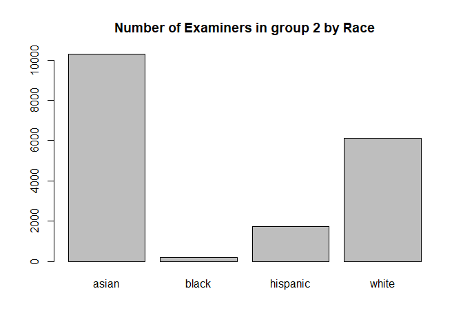
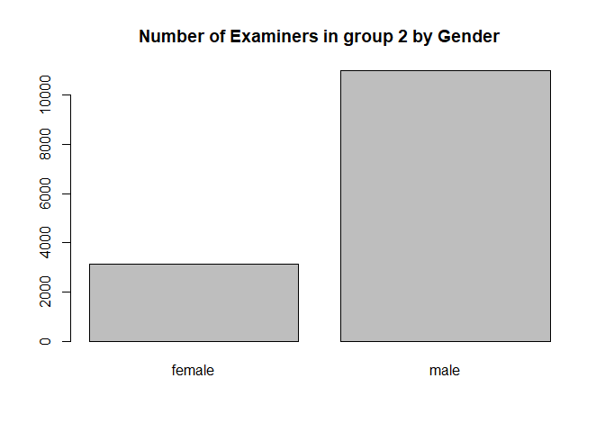

Exercise 3
================

# 1. Data Pre-Processing

## Import data

``` r
data_path <- "uspto_data/"
applications <- read_parquet(paste0(data_path,"app_data_sample.parquet"))
edges_sample <- read_csv(paste0(data_path,"edges_sample.csv"))
```

    ## Rows: 32906 Columns: 4

    ## -- Column specification --------------------------------------------------------
    ## Delimiter: ","
    ## chr  (1): application_number
    ## dbl  (2): ego_examiner_id, alter_examiner_id
    ## date (1): advice_date

    ## 
    ## i Use `spec()` to retrieve the full column specification for this data.
    ## i Specify the column types or set `show_col_types = FALSE` to quiet this message.

``` r
head(applications)
```

    ## # A tibble: 6 x 16
    ##   application_number filing_date examiner_name_last examiner_name_first
    ##   <chr>              <date>      <chr>              <chr>              
    ## 1 08284457           2000-01-26  HOWARD             JACQUELINE         
    ## 2 08413193           2000-10-11  YILDIRIM           BEKIR              
    ## 3 08531853           2000-05-17  HAMILTON           CYNTHIA            
    ## 4 08637752           2001-07-20  MOSHER             MARY               
    ## 5 08682726           2000-04-10  BARR               MICHAEL            
    ## 6 08687412           2000-04-28  GRAY               LINDA              
    ## # ... with 12 more variables: examiner_name_middle <chr>, examiner_id <dbl>,
    ## #   examiner_art_unit <dbl>, uspc_class <chr>, uspc_subclass <chr>,
    ## #   patent_number <chr>, patent_issue_date <date>, abandon_date <date>,
    ## #   disposal_type <chr>, appl_status_code <dbl>, appl_status_date <chr>,
    ## #   tc <dbl>

``` r
head(edges_sample)
```

    ## # A tibble: 6 x 4
    ##   application_number advice_date ego_examiner_id alter_examiner_id
    ##   <chr>              <date>                <dbl>             <dbl>
    ## 1 09402488           2008-11-17            84356             66266
    ## 2 09402488           2008-11-17            84356             63519
    ## 3 09402488           2008-11-17            84356             98531
    ## 4 09445135           2008-08-21            92953             71313
    ## 5 09445135           2008-08-21            92953             93865
    ## 6 09445135           2008-08-21            92953             91818

## Get examiner gender

``` r
# get a list of first names without repetitions
examiner_names <- applications %>% 
  distinct(examiner_name_first)
head(examiner_names)
```

    ## # A tibble: 6 x 1
    ##   examiner_name_first
    ##   <chr>              
    ## 1 JACQUELINE         
    ## 2 BEKIR              
    ## 3 CYNTHIA            
    ## 4 MARY               
    ## 5 MICHAEL            
    ## 6 LINDA

``` r
# get a table of names and gender
examiner_names_gender <- examiner_names %>% 
  do(results = gender(.$examiner_name_first, method = "ssa")) %>% 
  unnest(cols = c(results), keep_empty = TRUE) %>% 
  select(
    examiner_name_first = name,
    gender,
    proportion_female
  )
head(examiner_names_gender)
```

    ## # A tibble: 6 x 3
    ##   examiner_name_first gender proportion_female
    ##   <chr>               <chr>              <dbl>
    ## 1 AARON               male              0.0082
    ## 2 ABDEL               male              0     
    ## 3 ABDOU               male              0     
    ## 4 ABDUL               male              0     
    ## 5 ABDULHAKIM          male              0     
    ## 6 ABDULLAH            male              0

``` r
# remove extra colums from the gender table
examiner_names_gender <- examiner_names_gender %>% 
  select(examiner_name_first, gender)
# joining gender back to the dataset
applications <- applications %>% 
  left_join(examiner_names_gender, by = "examiner_name_first")
# cleaning up
rm(examiner_names)
rm(examiner_names_gender)
gc()
```

    ##            used  (Mb) gc trigger  (Mb) max used  (Mb)
    ## Ncells  4672490 249.6    8091097 432.2  4994858 266.8
    ## Vcells 49695199 379.2   95645274 729.8 80010774 610.5

## Get examiner race

``` r
examiner_surnames <- applications %>% 
  select(surname = examiner_name_last) %>% 
  distinct()
head(examiner_surnames)
```

    ## # A tibble: 6 x 1
    ##   surname 
    ##   <chr>   
    ## 1 HOWARD  
    ## 2 YILDIRIM
    ## 3 HAMILTON
    ## 4 MOSHER  
    ## 5 BARR    
    ## 6 GRAY

``` r
examiner_race <- predict_race(voter.file = examiner_surnames, surname.only = T) %>% 
  as_tibble()
```

    ## [1] "Proceeding with surname-only predictions..."

    ## Warning in merge_surnames(voter.file): Probabilities were imputed for 698
    ## surnames that could not be matched to Census list.

``` r
head(examiner_race)
```

    ## # A tibble: 6 x 6
    ##   surname  pred.whi pred.bla pred.his pred.asi pred.oth
    ##   <chr>       <dbl>    <dbl>    <dbl>    <dbl>    <dbl>
    ## 1 HOWARD      0.643  0.295     0.0237  0.005     0.0333
    ## 2 YILDIRIM    0.861  0.0271    0.0609  0.0135    0.0372
    ## 3 HAMILTON    0.702  0.237     0.0245  0.0054    0.0309
    ## 4 MOSHER      0.947  0.00410   0.0241  0.00640   0.0185
    ## 5 BARR        0.827  0.117     0.0226  0.00590   0.0271
    ## 6 GRAY        0.687  0.251     0.0241  0.0054    0.0324

``` r
examiner_race <- examiner_race %>% 
  mutate(max_race_p = pmax(pred.asi, pred.bla, pred.his, pred.oth, pred.whi)) %>% 
  mutate(race = case_when(
    max_race_p == pred.asi ~ "asian",
    max_race_p == pred.bla ~ "black",
    max_race_p == pred.his ~ "hispanic",
    max_race_p == pred.oth ~ "other",
    max_race_p == pred.whi ~ "white",
    TRUE ~ NA_character_
  ))
head(examiner_race)
```

    ## # A tibble: 6 x 8
    ##   surname  pred.whi pred.bla pred.his pred.asi pred.oth max_race_p race 
    ##   <chr>       <dbl>    <dbl>    <dbl>    <dbl>    <dbl>      <dbl> <chr>
    ## 1 HOWARD      0.643  0.295     0.0237  0.005     0.0333      0.643 white
    ## 2 YILDIRIM    0.861  0.0271    0.0609  0.0135    0.0372      0.861 white
    ## 3 HAMILTON    0.702  0.237     0.0245  0.0054    0.0309      0.702 white
    ## 4 MOSHER      0.947  0.00410   0.0241  0.00640   0.0185      0.947 white
    ## 5 BARR        0.827  0.117     0.0226  0.00590   0.0271      0.827 white
    ## 6 GRAY        0.687  0.251     0.0241  0.0054    0.0324      0.687 white

``` r
# removing extra columns
examiner_race <- examiner_race %>% 
  select(surname,race)
applications <- applications %>% 
  left_join(examiner_race, by = c("examiner_name_last" = "surname"))
rm(examiner_race)
rm(examiner_surnames)
gc()
```

    ##            used  (Mb) gc trigger  (Mb) max used  (Mb)
    ## Ncells  5011706 267.7    8091097 432.2  5957198 318.2
    ## Vcells 53379822 407.3   95645274 729.8 94337494 719.8

## Get examiner tenure

``` r
examiner_dates <- applications %>% 
  select(examiner_id, filing_date, appl_status_date) 
head(examiner_dates)
```

    ## # A tibble: 6 x 3
    ##   examiner_id filing_date appl_status_date  
    ##         <dbl> <date>      <chr>             
    ## 1       96082 2000-01-26  30jan2003 00:00:00
    ## 2       87678 2000-10-11  27sep2010 00:00:00
    ## 3       63213 2000-05-17  30mar2009 00:00:00
    ## 4       73788 2001-07-20  07sep2009 00:00:00
    ## 5       77294 2000-04-10  19apr2001 00:00:00
    ## 6       68606 2000-04-28  16jul2001 00:00:00

``` r
examiner_dates <- examiner_dates %>% 
  mutate(start_date = ymd(filing_date), end_date = as_date(dmy_hms(appl_status_date)))
```

``` r
examiner_dates <- examiner_dates %>% 
  group_by(examiner_id) %>% 
  summarise(
    earliest_date = min(start_date, na.rm = TRUE), 
    latest_date = max(end_date, na.rm = TRUE),
    tenure_days = interval(earliest_date, latest_date) %/% days(1)
    ) %>% 
  filter(year(latest_date)<2018)
head(examiner_dates)
```

    ## # A tibble: 6 x 4
    ##   examiner_id earliest_date latest_date tenure_days
    ##         <dbl> <date>        <date>            <dbl>
    ## 1       59012 2004-07-28    2015-07-24         4013
    ## 2       59025 2009-10-26    2017-05-18         2761
    ## 3       59030 2005-12-12    2017-05-22         4179
    ## 4       59040 2007-09-11    2017-05-23         3542
    ## 5       59052 2001-08-21    2007-02-28         2017
    ## 6       59054 2000-11-10    2016-12-23         5887

``` r
applications <- applications %>% 
  left_join(examiner_dates, by = "examiner_id")
rm(examiner_dates)
gc()
```

    ##            used  (Mb) gc trigger   (Mb)  max used   (Mb)
    ## Ncells  5025452 268.4   14611127  780.4  14611127  780.4
    ## Vcells 65757950 501.7  137905193 1052.2 137815958 1051.5

``` r
applications$tenure_years = applications$tenure_days / 365
head(applications)
```

    ## # A tibble: 6 x 22
    ##   application_number filing_date examiner_name_last examiner_name_first
    ##   <chr>              <date>      <chr>              <chr>              
    ## 1 08284457           2000-01-26  HOWARD             JACQUELINE         
    ## 2 08413193           2000-10-11  YILDIRIM           BEKIR              
    ## 3 08531853           2000-05-17  HAMILTON           CYNTHIA            
    ## 4 08637752           2001-07-20  MOSHER             MARY               
    ## 5 08682726           2000-04-10  BARR               MICHAEL            
    ## 6 08687412           2000-04-28  GRAY               LINDA              
    ## # ... with 18 more variables: examiner_name_middle <chr>, examiner_id <dbl>,
    ## #   examiner_art_unit <dbl>, uspc_class <chr>, uspc_subclass <chr>,
    ## #   patent_number <chr>, patent_issue_date <date>, abandon_date <date>,
    ## #   disposal_type <chr>, appl_status_code <dbl>, appl_status_date <chr>,
    ## #   tc <dbl>, gender <chr>, race <chr>, earliest_date <date>,
    ## #   latest_date <date>, tenure_days <dbl>, tenure_years <dbl>

# 2. Workgroups

## Select the 2 workgroups

``` r
applications$workgroup = round(applications$examiner_art_unit / 10, 0)
head(applications)
```

    ## # A tibble: 6 x 23
    ##   application_number filing_date examiner_name_last examiner_name_first
    ##   <chr>              <date>      <chr>              <chr>              
    ## 1 08284457           2000-01-26  HOWARD             JACQUELINE         
    ## 2 08413193           2000-10-11  YILDIRIM           BEKIR              
    ## 3 08531853           2000-05-17  HAMILTON           CYNTHIA            
    ## 4 08637752           2001-07-20  MOSHER             MARY               
    ## 5 08682726           2000-04-10  BARR               MICHAEL            
    ## 6 08687412           2000-04-28  GRAY               LINDA              
    ## # ... with 19 more variables: examiner_name_middle <chr>, examiner_id <dbl>,
    ## #   examiner_art_unit <dbl>, uspc_class <chr>, uspc_subclass <chr>,
    ## #   patent_number <chr>, patent_issue_date <date>, abandon_date <date>,
    ## #   disposal_type <chr>, appl_status_code <dbl>, appl_status_date <chr>,
    ## #   tc <dbl>, gender <chr>, race <chr>, earliest_date <date>,
    ## #   latest_date <date>, tenure_days <dbl>, tenure_years <dbl>, workgroup <dbl>

``` r
applications %>% 
  count(workgroup, sort = TRUE) 
```

    ## # A tibble: 42 x 2
    ##    workgroup      n
    ##        <dbl>  <int>
    ##  1       162 143718
    ##  2       176 108000
    ##  3       163  99474
    ##  4       164  98385
    ##  5       179  89960
    ##  6       165  87749
    ##  7       172  79568
    ##  8       174  72723
    ##  9       173  71981
    ## 10       180  69103
    ## # ... with 32 more rows

The 2 work groups have approximately the same number of examiners.

``` r
group1 = applications[which(applications$workgroup==168),]
group2 = applications[which(applications$workgroup==220),]
head(group1)
```

    ## # A tibble: 6 x 23
    ##   application_number filing_date examiner_name_last examiner_name_first
    ##   <chr>              <date>      <chr>              <chr>              
    ## 1 09463800           2000-06-12  CHIN               CHRISTOPHER        
    ## 2 09479498           2000-01-07  COOK               LISA               
    ## 3 09480846           2000-01-10  CHIN               CHRISTOPHER        
    ## 4 09482460           2000-01-13  CHIN               CHRISTOPHER        
    ## 5 09482604           2000-01-14  CHEU               CHANGHWA           
    ## 6 09483019           2000-01-13  GABEL              GAILENE            
    ## # ... with 19 more variables: examiner_name_middle <chr>, examiner_id <dbl>,
    ## #   examiner_art_unit <dbl>, uspc_class <chr>, uspc_subclass <chr>,
    ## #   patent_number <chr>, patent_issue_date <date>, abandon_date <date>,
    ## #   disposal_type <chr>, appl_status_code <dbl>, appl_status_date <chr>,
    ## #   tc <dbl>, gender <chr>, race <chr>, earliest_date <date>,
    ## #   latest_date <date>, tenure_days <dbl>, tenure_years <dbl>, workgroup <dbl>

``` r
head(group2)
```

    ## # A tibble: 6 x 23
    ##   application_number filing_date examiner_name_last examiner_name_first
    ##   <chr>              <date>      <chr>              <chr>              
    ## 1 09475092           2000-08-09  BULLOCK JR         LEWIS              
    ## 2 09477101           2000-01-04  BULLOCK JR         LEWIS              
    ## 3 09477688           2000-01-06  ALI                SYED               
    ## 4 09480309           2000-01-10  BULLOCK JR         LEWIS              
    ## 5 09484549           2000-01-18  TO                 JENNIFER           
    ## 6 09484865           2000-01-18  TANG               KENNETH            
    ## # ... with 19 more variables: examiner_name_middle <chr>, examiner_id <dbl>,
    ## #   examiner_art_unit <dbl>, uspc_class <chr>, uspc_subclass <chr>,
    ## #   patent_number <chr>, patent_issue_date <date>, abandon_date <date>,
    ## #   disposal_type <chr>, appl_status_code <dbl>, appl_status_date <chr>,
    ## #   tc <dbl>, gender <chr>, race <chr>, earliest_date <date>,
    ## #   latest_date <date>, tenure_days <dbl>, tenure_years <dbl>, workgroup <dbl>

## Demographics summary statistics and plots

``` r
table(group1$race)
```

    ## 
    ##    asian    black hispanic    white 
    ##     3133      396     1111     9739

``` r
table(group2$race)
```

    ## 
    ##    asian    black hispanic    white 
    ##    10293      196     1750     6109

``` r
barplot(table(group1$race), main="Number of Examiners in group 1 by Race")
```

<!-- -->

``` r
barplot(table(group2$race), main="Number of Examiners in group 2 by Race")
```

<!-- -->

``` r
table(group1$gender)
```

    ## 
    ## female   male 
    ##   6597   5554

``` r
table(group2$gender)
```

    ## 
    ## female   male 
    ##   3117  10998

``` r
barplot(table(group1$gender), main="Number of Examiners in group 1 by Gender")
```

<!-- -->

``` r
barplot(table(group2$gender), main="Number of Examiners in group 2 by Gender")
```

<!-- -->

``` r
summary(group2$tenure_years)
```

    ##    Min. 1st Qu.  Median    Mean 3rd Qu.    Max.    NA's 
    ##   2.247  10.493  12.627  13.032  16.474  17.395      17

``` r
summary(group2$tenure_years)
```

    ##    Min. 1st Qu.  Median    Mean 3rd Qu.    Max.    NA's 
    ##   2.247  10.493  12.627  13.032  16.474  17.395      17

``` r
v <- group1 %>% select(tenure_years)
ggplot(data = v, mapping = aes(x=tenure_years)) + 
  geom_histogram(aes(y=..count..),fill="bisque",color="white",alpha=0.7) + 
  geom_density() +
  labs(x='Tenure in years for workgroup 1') +
  theme_minimal()
```

    ## `stat_bin()` using `bins = 30`. Pick better value with `binwidth`.

    ## Warning: Removed 132 rows containing non-finite values (stat_bin).

    ## Warning: Removed 132 rows containing non-finite values (stat_density).

<!-- -->

``` r
v <- group2 %>% select(tenure_years)
ggplot(data = v, mapping = aes(x=tenure_years)) + 
  geom_histogram(aes(y=..count..),fill="bisque",color="white",alpha=0.7) + 
  geom_density() +
  labs(x='Tenure in years for workgroup 2') +
  theme_minimal()
```

    ## `stat_bin()` using `bins = 30`. Pick better value with `binwidth`.

    ## Warning: Removed 17 rows containing non-finite values (stat_bin).

    ## Warning: Removed 17 rows containing non-finite values (stat_density).

<!-- -->

# 3. Advice networks and centrality scores

``` r
head(edges_sample)
```

    ## # A tibble: 6 x 4
    ##   application_number advice_date ego_examiner_id alter_examiner_id
    ##   <chr>              <date>                <dbl>             <dbl>
    ## 1 09402488           2008-11-17            84356             66266
    ## 2 09402488           2008-11-17            84356             63519
    ## 3 09402488           2008-11-17            84356             98531
    ## 4 09445135           2008-08-21            92953             71313
    ## 5 09445135           2008-08-21            92953             93865
    ## 6 09445135           2008-08-21            92953             91818

``` r
from <- edges_sample['ego_examiner_id']
to <- edges_sample['alter_examiner_id']
edges <- data.frame(from, to)
colnames(edges) <- c("from", "to")
edges <- na.omit(edges)
head(edges)
```

    ##    from    to
    ## 1 84356 66266
    ## 2 84356 63519
    ## 3 84356 98531
    ## 4 92953 71313
    ## 5 92953 93865
    ## 6 92953 91818

## Create advice networks for workgroup 1

``` r
edges_subset <- edges[which(edges$from %in% group1$examiner_id & edges$to %in% group1$examiner_id),]
edges_subset
```

    ##        from    to
    ## 752   97910 85987
    ## 2951  97910 69917
    ## 5966  97910 85987
    ## 6231  97910 69917
    ## 6242  70881 67013
    ## 16399 82047 69917
    ## 16400 82047 69917
    ## 16412 82047 69917
    ## 17280 97910 85987
    ## 21081 97910 69917
    ## 21886 61276 69917
    ## 21891 61276 69917
    ## 21892 61276 69917
    ## 22478 97910 85987
    ## 22479 97910 69917
    ## 23169 97910 85987
    ## 23322 82047 69917
    ## 24527 97910 85987
    ## 24528 97910 69917
    ## 24529 97910 69917
    ## 25001 65654 70858
    ## 25101 97910 85987
    ## 25265 97910 85987
    ## 25266 97910 85987
    ## 25510 97910 95604
    ## 25511 97910 95604
    ## 26066 97910 85987
    ## 26067 97910 61276
    ## 26362 97910 69917
    ## 26363 97910 69917
    ## 26721 97910 69917
    ## 28445 97910 85987
    ## 29017 97910 85987
    ## 30027 97910 85987
    ## 30028 97910 85987
    ## 31052 82047 69917
    ## 31200 82047 69917
    ## 31267 95604 95604
    ## 31268 95604 95604
    ## 31319 97910 85987
    ## 31423 82047 69917
    ## 31778 97910 82047
    ## 32271 97910 85987
    ## 32311 95634 65654
    ## 32312 95634 70858
    ## 32554 97910 69917

``` r
g1 <- graph_from_data_frame(edges_subset, vertices = NULL) %>% as_tbl_graph()
g1
```

    ## # A tbl_graph: 11 nodes and 46 edges
    ## #
    ## # A directed multigraph with 3 components
    ## #
    ## # Node Data: 11 x 1 (active)
    ##   name 
    ##   <chr>
    ## 1 97910
    ## 2 70881
    ## 3 82047
    ## 4 61276
    ## 5 65654
    ## 6 95604
    ## # ... with 5 more rows
    ## #
    ## # Edge Data: 46 x 2
    ##    from    to
    ##   <int> <int>
    ## 1     1     8
    ## 2     1     9
    ## 3     1     8
    ## # ... with 43 more rows

## Create advice networks for workgroup 2

``` r
edges_subset <- edges[which(edges$from %in% group2$examiner_id & edges$to %in% group2$examiner_id),]
edges_subset
```

    ##        from    to
    ## 15    67078 97328
    ## 725   67078 72089
    ## 880   73150 63657
    ## 1384  76935 59491
    ## 1439  76935 67226
    ## 1592  61980 72089
    ## 1593  59491 72089
    ## 1656  75940 97328
    ## 2031  76935 72089
    ## 2648  59491 97328
    ## 4334  98228 97328
    ## 4420  98228 72089
    ## 4650  75431 97328
    ## 4651  98228 97328
    ## 4678  98228 97328
    ## 6854  59491 97328
    ## 9162  65554 67226
    ## 9914  98228 97328
    ## 10252 97673 97328
    ## 10258 75431 97328
    ## 10259 98228 97328
    ## 10302 98228 97328
    ## 10303 59491 97328
    ## 11122 59491 97328
    ## 12126 98228 97328
    ## 12394 98228 97328
    ## 32327 67226 97328

``` r
g2 <- graph_from_data_frame(edges_subset, vertices = NULL) %>% as_tbl_graph()
g2
```

    ## # A tbl_graph: 14 nodes and 27 edges
    ## #
    ## # A directed acyclic multigraph with 2 components
    ## #
    ## # Node Data: 14 x 1 (active)
    ##   name 
    ##   <chr>
    ## 1 67078
    ## 2 73150
    ## 3 76935
    ## 4 61980
    ## 5 59491
    ## 6 75940
    ## # ... with 8 more rows
    ## #
    ## # Edge Data: 27 x 2
    ##    from    to
    ##   <int> <int>
    ## 1     1    12
    ## 2     1    13
    ## 3     2    14
    ## # ... with 24 more rows

## Pick measure(s) of centrality you want to use and justify your choice.

-   Degree centrality because it is the most basic measure of
    centrality. It shows how connected each examiner in the group is.
-   Eigenvector centrality because it shows which nodes are popular and
    which nodes are isolated.
-   Authorities because we want to know which nodes give more advice and
    which nodes seek more advice.
-   Closeness centrality because it shows which nodes are closer to
    other nodes and which nodes are isolated.

``` r
return_race <- function(data, id) {
  val <- data[id[3]==data$examiner_id,]$race[1]
  return(val)
}
```

``` r
g1 <- g1 %>%
  mutate(race = return_race(group1, name)) %>%
  mutate(gender = group1[name==group1$examiner_id,]$gender[1]) %>%
  mutate(tenure = group1[name==group1$examiner_id,]$tenure_years[1]) %>%
  mutate(degree = round(centrality_degree(), 1)) %>%
  mutate(eigen = round(centrality_eigen(), 1)) %>%
  # mutate(katz = round(centrality_katz(), 1)) %>%
  mutate(pagerank = round(centrality_pagerank(), 1)) %>%
  mutate(authority = round(centrality_authority(), 1)) %>%
  mutate(hub = round(centrality_hub(), 1)) %>%
  mutate(closeness = round(centrality_closeness(), 1)) %>%
  mutate(betweenness = round(centrality_betweenness(), 2))
```

    ## Warning in name == group1$examiner_id: longer object length is not a multiple of
    ## shorter object length

    ## Warning in name == group1$examiner_id: longer object length is not a multiple of
    ## shorter object length

    ## Warning in betweenness(graph = graph, v = V(graph), directed = directed, :
    ## 'nobigint' is deprecated since igraph 1.3 and will be removed in igraph 1.4

``` r
g1
```

    ## # A tbl_graph: 11 nodes and 46 edges
    ## #
    ## # A directed multigraph with 3 components
    ## #
    ## # Node Data: 11 x 11 (active)
    ##   name  race  gender tenure degree eigen pagerank authority   hub closeness
    ##   <chr> <chr> <chr>   <dbl>  <dbl> <dbl>    <dbl>     <dbl> <dbl>     <dbl>
    ## 1 97910 asian male     17.4     30   1        0         0     1         0.2
    ## 2 70881 asian male     17.4      1   0        0         0     0         1  
    ## 3 82047 asian male     17.4      7   0.3      0         0.1   0.2       1  
    ## 4 61276 asian male     17.4      3   0.1      0         0.1   0.1       1  
    ## 5 65654 asian male     17.4      1   0        0.1       0     0         1  
    ## 6 95604 asian male     17.4      2   0.1      0.3       0.1   0       NaN  
    ## # ... with 5 more rows, and 1 more variable: betweenness <dbl>
    ## #
    ## # Edge Data: 46 x 2
    ##    from    to
    ##   <int> <int>
    ## 1     1     8
    ## 2     1     9
    ## 3     1     8
    ## # ... with 43 more rows

``` r
ggraph(g1, layout = 'fr') + 
  geom_edge_link(arrow = arrow(length = unit(2, 'mm')), end_cap = circle(8, 'mm')) + 
  geom_node_point(fill = "white", shape = 21, size = 18, color = "black") +
  geom_node_text(aes(label = name)) +  
  geom_node_label(aes(label = paste(race, gender, tenure, sep=",")), nudge_x = 0.5, nudge_y = -0.5,)
```

<!-- -->

Please note, I ran out of time to fix the issue with race, gender and
tenure.

``` r
g2 <- g2 %>%
  mutate(race = return_race(group1, name)) %>%
  mutate(gender = group2[name==group2$examiner_id,]$gender[1]) %>%
  mutate(tenure = group1[name==group1$examiner_id,]$tenure_years[1]) %>%
  mutate(degree = round(centrality_degree(), 1)) %>%
  mutate(eigen = round(centrality_eigen(), 1)) %>%
  # mutate(katz = round(centrality_katz(), 1)) %>%
  mutate(pagerank = round(centrality_pagerank(), 1)) %>%
  mutate(authority = round(centrality_authority(), 1)) %>%
  mutate(hub = round(centrality_hub(), 1)) %>%
  mutate(closeness = round(centrality_closeness(), 1)) %>%
  mutate(betweenness = round(centrality_betweenness(), 2))
```

    ## Warning in name == group2$examiner_id: longer object length is not a multiple of
    ## shorter object length

    ## Warning in name == group1$examiner_id: longer object length is not a multiple of
    ## shorter object length

    ## Warning in betweenness(graph = graph, v = V(graph), directed = directed, :
    ## 'nobigint' is deprecated since igraph 1.3 and will be removed in igraph 1.4

``` r
g2
```

    ## # A tbl_graph: 14 nodes and 27 edges
    ## #
    ## # A directed acyclic multigraph with 2 components
    ## #
    ## # Node Data: 14 x 11 (active)
    ##   name  race  gender tenure degree eigen pagerank authority   hub closeness
    ##   <chr> <chr> <chr>   <dbl>  <dbl> <dbl>    <dbl>     <dbl> <dbl>     <dbl>
    ## 1 67078 <NA>  male       NA      2   0.1      0           0   0.1       0.5
    ## 2 73150 <NA>  male       NA      1   0        0           0   0         1  
    ## 3 76935 <NA>  male       NA      3   0.1      0           0   0         0.2
    ## 4 61980 <NA>  male       NA      1   0        0           0   0         1  
    ## 5 59491 <NA>  male       NA      5   0.4      0.1         0   0.5       0.5
    ## 6 75940 <NA>  male       NA      1   0.1      0           0   0.1       1  
    ## # ... with 8 more rows, and 1 more variable: betweenness <dbl>
    ## #
    ## # Edge Data: 27 x 2
    ##    from    to
    ##   <int> <int>
    ## 1     1    12
    ## 2     1    13
    ## 3     2    14
    ## # ... with 24 more rows

``` r
ggraph(g2, layout = 'fr') + 
  geom_edge_link(arrow = arrow(length = unit(2, 'mm')), end_cap = circle(8, 'mm')) + 
  geom_node_point(fill = "white", shape = 21, size = 18, color = "black") +
  geom_node_text(aes(label = name)) + 
  geom_node_label(aes(label = paste(degree, eigen, authority, sep=",")), nudge_x = 0.5, nudge_y = -0.5,)
```

<!-- -->

Characterize and discuss the relationship between centrality and other
examiners’ characteristics.

Tenure is the most important characteristic to define centrality: the
higher the tenure the higher the degree and authority centrality in
principle. And most likely than not, people for cliques with other
people within the same demographics attributes.

## Pre Exercise 4

Add centrality to the final data frame.

``` r
edges_subset <- edges[which(edges$from %in% group1$examiner_id | edges$to %in% group1$examiner_id),]
edges_subset
```

    ##        from    to
    ## 66    82105 70571
    ## 67    82105 76964
    ## 68    97910 59738
    ## 69    97910 99004
    ## 70    97910 67669
    ## 395   97910 65790
    ## 396   97910 59738
    ## 397   97910 99004
    ## 582   96697 92464
    ## 583   96697 95972
    ## 584   96697 67389
    ## 585   96697 67389
    ## 586   96697 70835
    ## 587   96697 76536
    ## 752   97910 85987
    ## 753   97910 59738
    ## 754   97910 99004
    ## 871   95604 70435
    ## 997   97910 59738
    ## 998   97910 99004
    ## 999   97910 96738
    ## 1552  95604 71087
    ## 1779  61276 99254
    ## 1780  61276 60423
    ## 1781  61276 59738
    ## 1782  61276 99004
    ## 1796  85987 87486
    ## 1876  85987 99254
    ## 1877  85987 60423
    ## 1878  85987 88924
    ## 1880  85987 72178
    ## 2036  97910 69583
    ## 2037  97910 72882
    ## 2038  97910 59738
    ## 2039  97910 99004
    ## 2040  97910 94285
    ## 2415  97910 72882
    ## 2416  97910 59738
    ## 2417  97910 99004
    ## 2532  82047 97470
    ## 2533  82047 99413
    ## 2534  82047 95212
    ## 2535  82047 67634
    ## 2536  82047 72579
    ## 2758  97910 90331
    ## 2759  97910 90331
    ## 2760  97910 62397
    ## 2761  97910 62397
    ## 2765  85987 90287
    ## 2766  85987 81014
    ## 2767  85987 88924
    ## 2769  85987 63127
    ## 2770  85987 72178
    ## 2802  97910 71946
    ## 2803  97910 59738
    ## 2804  97910 99004
    ## 2872  82047 97470
    ## 2873  82047 99413
    ## 2874  82047 95212
    ## 2875  82047 67634
    ## 2876  82047 72579
    ## 2944  82047 82244
    ## 2945  82047 97470
    ## 2946  97910 66266
    ## 2947  97910 66266
    ## 2948  97910 99254
    ## 2949  97910 60423
    ## 2950  97910 65790
    ## 2951  97910 69917
    ## 2952  97910 88567
    ## 2953  97910 88567
    ## 2964  61276 65024
    ## 2965  61276 59738
    ## 2966  61276 99004
    ## 3031  82047 97470
    ## 3032  82047 99413
    ## 3033  82047 95212
    ## 3034  82047 67634
    ## 3035  82047 72579
    ## 3091  98114 96697
    ## 3101  75036 82105
    ## 3134  82105 76964
    ## 3315  62397 69917
    ## 3450  61276 72882
    ## 3451  61276 59738
    ## 3452  61276 99004
    ## 3529  98114 96697
    ## 3543  82105 67581
    ## 3650  98114 96697
    ## 3675  66336 70858
    ## 3970  97910 59738
    ## 3971  97910 99004
    ## 4044  97910 59738
    ## 4045  97910 99004
    ## 4088  82105 76964
    ## 4161  70881 82244
    ## 4162  70881 70191
    ## 4163  70881 70624
    ## 4253  65654 66266
    ## 4332  82105 76964
    ## 4535  60575 96697
    ## 4658  82105 76964
    ## 4827  62397 69917
    ## 4840  65654 67669
    ## 5017  82047 97470
    ## 5018  82047 99413
    ## 5019  82047 95212
    ## 5020  82047 67634
    ## 5021  82047 72579
    ## 5368  95604 70435
    ## 5378  97910 91232
    ## 5536  71861 82244
    ## 5537  71861 95316
    ## 5538  71861 92569
    ## 5540  71861 65482
    ## 5700  60067 69917
    ## 5966  97910 85987
    ## 5967  97910 59738
    ## 5968  97910 99004
    ## 6230  97910 69583
    ## 6231  97910 69917
    ## 6242  70881 67013
    ## 6846  82105 76964
    ## 6871  82105 70571
    ## 6872  82105 76964
    ## 7060  82105 76964
    ## 7229  82105 76964
    ## 7276  90331 69917
    ## 7286  82105 67581
    ## 7309  82105 97402
    ## 7310  82105 76964
    ## 7454  98114 96697
    ## 7557  90956 65805
    ## 7603  95604 96963
    ## 8277  97910 72882
    ## 8278  97910 59738
    ## 8279  97910 99004
    ## 8320  82105 76964
    ## 8477  82047 97470
    ## 8478  82047 99413
    ## 8479  82047 95212
    ## 8480  82047 67634
    ## 8481  82047 72579
    ## 8814  71861 92874
    ## 8815  71861 82997
    ## 8919  73898 96697
    ## 9005  61276 59803
    ## 9050  98114 96697
    ## 9352  82105 67581
    ## 9399  66525 96697
    ## 9726  82105 67581
    ## 9727  82105 70571
    ## 9865  76580 70881
    ## 9965  82105 96070
    ## 9966  82105 76964
    ## 10066 97910 59738
    ## 10067 97910 59738
    ## 10068 97910 99004
    ## 10069 97910 99004
    ## 10250 82105 70571
    ## 10251 82105 76964
    ## 10953 97910 59738
    ## 10954 97910 99004
    ## 11851 82105 76964
    ## 11855 82105 70571
    ## 11856 82105 76964
    ## 12195 97910 72882
    ## 12196 97910 59738
    ## 12197 97910 99004
    ## 12322 82105 76964
    ## 12464 82047 97470
    ## 12465 82047 99413
    ## 12466 82047 95212
    ## 12467 82047 67634
    ## 12468 82047 72579
    ## 12698 95604 70435
    ## 12806 62397 69917
    ## 12817 82105 76964
    ## 12856 82105 76964
    ## 12984 82105 76964
    ## 13108 82047 97470
    ## 13109 82047 99413
    ## 13110 82047 95212
    ## 13111 82047 67634
    ## 13112 82047 72579
    ## 13424 59428 82105
    ## 13426 97910 72882
    ## 13427 97910 59738
    ## 13428 97910 99004
    ## 13509 75568 70858
    ## 14023 97910 59738
    ## 14024 97910 99004
    ## 14209 71861 92569
    ## 14472 82105 70571
    ## 14473 82105 76964
    ## 14474 82105 76964
    ## 14590 82105 76964
    ## 14713 95604 70435
    ## 14714 95604 62947
    ## 14822 70881 82244
    ## 14823 70881 70624
    ## 14922 82105 70571
    ## 14923 82105 70571
    ## 14924 82105 76964
    ## 14925 82105 76964
    ## 15180 97072 67013
    ## 15181 86403 67013
    ## 15576 82047 97470
    ## 15577 82047 99413
    ## 15578 82047 95212
    ## 15579 82047 67634
    ## 15580 82047 72579
    ## 15902 82105 76964
    ## 16189 75568 95784
    ## 16399 82047 69917
    ## 16400 82047 69917
    ## 16401 82047 97470
    ## 16402 82047 97470
    ## 16412 82047 69917
    ## 16413 82047 97470
    ## 16599 93968 96697
    ## 17278 97910 60045
    ## 17279 97910 70164
    ## 17280 97910 85987
    ## 17281 97910 72882
    ## 17282 97910 59738
    ## 17283 97910 99004
    ## 17284 97910 95084
    ## 17685 70881 82244
    ## 17686 70881 70624
    ## 18170 82105 71087
    ## 18405 82105 59650
    ## 18406 82105 97402
    ## 18645 93968 96697
    ## 18884 60067 69917
    ## 20930 95604 66266
    ## 20931 95604 70435
    ## 20932 95604 96963
    ## 21076 97910 61105
    ## 21077 97910 65131
    ## 21078 97910 72882
    ## 21079 97910 72882
    ## 21080 97910 70142
    ## 21081 97910 69917
    ## 21237 60067 69917
    ## 21884 61276 99254
    ## 21885 61276 60423
    ## 21886 61276 69917
    ## 21887 61276 99254
    ## 21888 61276 99254
    ## 21889 61276 60423
    ## 21890 61276 60423
    ## 21891 61276 69917
    ## 21892 61276 69917
    ## 22209 71861 92874
    ## 22210 71861 82997
    ## 22211 71861 92569
    ## 22254 97910 72912
    ## 22255 97910 59738
    ## 22256 97910 99004
    ## 22336 60575 96697
    ## 22478 97910 85987
    ## 22479 97910 69917
    ## 22485 97910 72882
    ## 22486 97910 59738
    ## 22487 97910 99004
    ## 22998 62397 69917
    ## 23169 97910 85987
    ## 23300 97910 60045
    ## 23301 97910 72814
    ## 23302 97910 59738
    ## 23303 97910 99004
    ## 23304 97910 83794
    ## 23305 97910 95084
    ## 23322 82047 69917
    ## 23323 82047 96963
    ## 23324 82047 97470
    ## 23378 71861 97402
    ## 23677 97910 72882
    ## 23678 97910 59738
    ## 23679 97910 99004
    ## 23828 70881 82244
    ## 23829 70881 91016
    ## 23830 70881 70624
    ## 23838 82047 97470
    ## 23839 82047 99413
    ## 23840 82047 95212
    ## 23841 82047 67634
    ## 23842 82047 72579
    ## 23979 82047 97470
    ## 24311 97910 72882
    ## 24312 97910 59738
    ## 24313 97910 99004
    ## 24339 62397 69917
    ## 24527 97910 85987
    ## 24528 97910 69917
    ## 24529 97910 69917
    ## 25001 65654 70858
    ## 25002 65654 67701
    ## 25003 65654 64507
    ## 25101 97910 85987
    ## 25139 82105 97402
    ## 25140 82105 70598
    ## 25265 97910 85987
    ## 25266 97910 85987
    ## 25333 97910 99254
    ## 25334 97910 60423
    ## 25335 97910 64507
    ## 25508 97910 99254
    ## 25509 97910 60423
    ## 25510 97910 95604
    ## 25511 97910 95604
    ## 26065 97910 64507
    ## 26066 97910 85987
    ## 26067 97910 61276
    ## 26353 97910 69902
    ## 26354 97910 66266
    ## 26355 97910 99340
    ## 26356 97910 99340
    ## 26357 97910 99906
    ## 26358 97910 59738
    ## 26359 97910 59738
    ## 26360 97910 99004
    ## 26361 97910 99004
    ## 26362 97910 69917
    ## 26363 97910 69917
    ## 26364 97910 67321
    ## 26416 60067 69917
    ## 26719 97910 59738
    ## 26720 97910 99004
    ## 26721 97910 69917
    ## 27116 82047 97470
    ## 27117 82047 99413
    ## 27118 82047 95212
    ## 27119 82047 67634
    ## 27120 82047 72579
    ## 27159 65121 97910
    ## 27382 62397 69917
    ## 27383 62397 69917
    ## 27426 70881 82244
    ## 27427 70881 82339
    ## 27428 70881 60331
    ## 27443 82105 76964
    ## 27620 97910 72882
    ## 27621 97910 59738
    ## 27622 97910 99004
    ## 27735 97910 71946
    ## 27736 97910 72882
    ## 28042 95604 70435
    ## 28217 80167 91747
    ## 28218 80167 82244
    ## 28445 97910 85987
    ## 28490 95604 72912
    ## 28491 95604 72912
    ## 28500 82047 97470
    ## 28501 82047 99413
    ## 28502 82047 95212
    ## 28503 82047 67634
    ## 28504 82047 72579
    ## 28695 80167 91747
    ## 29015 97910 99254
    ## 29016 97910 60423
    ## 29017 97910 85987
    ## 29165 97910 71946
    ## 29166 97910 59738
    ## 29167 97910 99004
    ## 29296 97910 59738
    ## 29297 97910 99004
    ## 29298 97910 64004
    ## 29713 70881 82244
    ## 29714 70881 70191
    ## 29715 70881 70624
    ## 30027 97910 85987
    ## 30028 97910 85987
    ## 30029 97910 59738
    ## 30030 97910 59738
    ## 30031 97910 99004
    ## 30032 97910 99004
    ## 30177 97910 60045
    ## 30178 97910 72882
    ## 30179 97910 92569
    ## 30180 97910 95084
    ## 30258 82047 72882
    ## 30259 82047 99413
    ## 30260 82047 95212
    ## 30261 82047 67634
    ## 30262 82047 72579
    ## 31051 82047 65790
    ## 31052 82047 69917
    ## 31053 82047 97470
    ## 31156 97910 72882
    ## 31157 97910 59738
    ## 31158 97910 59738
    ## 31159 97910 99004
    ## 31160 97910 99004
    ## 31199 82047 91747
    ## 31200 82047 69917
    ## 31264 75568 69917
    ## 31265 95604 72814
    ## 31266 95604 72814
    ## 31267 95604 95604
    ## 31268 95604 95604
    ## 31269 95604 96339
    ## 31270 95604 96339
    ## 31271 95604 77063
    ## 31272 95604 77063
    ## 31319 97910 85987
    ## 31322 82105 76964
    ## 31323 82105 67256
    ## 31423 82047 69917
    ## 31424 82047 97470
    ## 31441 82105 97402
    ## 31442 97910 72882
    ## 31443 97910 59738
    ## 31444 97910 99004
    ## 31462 97910 59738
    ## 31463 97910 59738
    ## 31464 97910 99004
    ## 31476 73920 63316
    ## 31621 97910 66266
    ## 31622 97910 59738
    ## 31623 97910 99004
    ## 31624 97910 67669
    ## 31662 82105 76964
    ## 31713 82105 71059
    ## 31714 82105 76964
    ## 31720 97910 71946
    ## 31721 97910 59738
    ## 31722 97910 99004
    ## 31733 97910 59738
    ## 31734 97910 99004
    ## 31776 97910 59738
    ## 31777 97910 99004
    ## 31778 97910 82047
    ## 31852 97910 59738
    ## 31853 97910 99004
    ## 31854 97910 62397
    ## 31855 97910 62397
    ## 31925 97910 59738
    ## 31926 97910 99004
    ## 31972 97910 61925
    ## 31973 97910 68977
    ## 31974 97910 72882
    ## 31975 97910 59738
    ## 31976 97910 99004
    ## 32079 95604 73239
    ## 32262 97910 72882
    ## 32263 97910 59738
    ## 32264 97910 99004
    ## 32271 97910 85987
    ## 32311 95634 65654
    ## 32312 95634 70858
    ## 32313 95634 67701
    ## 32386 95604 67669
    ## 32393 71861 74027
    ## 32554 97910 69917
    ## 32848 70881 82244
    ## 32850 70881 66225
    ## 32851 70881 60791
    ## 32852 70881 59908
    ## 32853 70881 76423
    ## 32854 70881 71087
    ## 32855 70881 94770
    ## 32856 70881 76309
    ## 32857 70881 91849
    ## 32858 70881 69467
    ## 32859 70881 70892
    ## 32860 70881 97332
    ## 32861 70881 90288
    ## 32862 70881 86743
    ## 32863 70881 61388
    ## 32864 70881 95253
    ## 32865 70881 68813
    ## 32866 70881 97610
    ## 32867 70881 93800
    ## 32868 70881 94355
    ## 32869 70881 80910
    ## 32870 70881 60266
    ## 32871 70881 71528
    ## 32872 70881 59868
    ## 32873 70881 79106
    ## 32874 70881 82244
    ## 32876 70881 66225
    ## 32877 70881 60791
    ## 32878 70881 59908
    ## 32879 70881 76423
    ## 32880 70881 71087
    ## 32881 70881 94770
    ## 32882 70881 76309
    ## 32883 70881 91849
    ## 32884 70881 69467
    ## 32885 70881 70892
    ## 32886 70881 97332
    ## 32887 70881 90288
    ## 32888 70881 86743
    ## 32889 70881 61388
    ## 32890 70881 95253
    ## 32891 70881 68813
    ## 32892 70881 97610
    ## 32893 70881 93800
    ## 32894 70881 94355
    ## 32895 70881 80910
    ## 32896 70881 60266
    ## 32897 70881 71528
    ## 32898 70881 59868
    ## 32899 70881 79106

``` r
g <- graph_from_data_frame(edges_subset, vertices = NULL) %>% as_tbl_graph()
g
```

    ## # A tbl_graph: 138 nodes and 506 edges
    ## #
    ## # A directed multigraph with 4 components
    ## #
    ## # Node Data: 138 x 1 (active)
    ##   name 
    ##   <chr>
    ## 1 82105
    ## 2 97910
    ## 3 96697
    ## 4 95604
    ## 5 61276
    ## 6 85987
    ## # ... with 132 more rows
    ## #
    ## # Edge Data: 506 x 2
    ##    from    to
    ##   <int> <int>
    ## 1     1    31
    ## 2     1    32
    ## 3     2    33
    ## # ... with 503 more rows

``` r
g <- g %>%
  mutate(degree = round(centrality_degree(), 1)) %>%
  mutate(eigen = round(centrality_eigen(), 1)) %>%
  # mutate(katz = round(centrality_katz(), 1)) %>%
  mutate(pagerank = round(centrality_pagerank(), 1)) %>%
  mutate(authority = round(centrality_authority(), 1)) %>%
  mutate(hub = round(centrality_hub(), 1)) %>%
  mutate(closeness = round(centrality_closeness(), 1)) %>%
  mutate(betweenness = round(centrality_betweenness(), 2))
```

    ## Warning in betweenness(graph = graph, v = V(graph), directed = directed, :
    ## 'nobigint' is deprecated since igraph 1.3 and will be removed in igraph 1.4

``` r
g
```

    ## # A tbl_graph: 138 nodes and 506 edges
    ## #
    ## # A directed multigraph with 4 components
    ## #
    ## # Node Data: 138 x 8 (active)
    ##   name  degree eigen pagerank authority   hub closeness betweenness
    ##   <chr>  <dbl> <dbl>    <dbl>     <dbl> <dbl>     <dbl>       <dbl>
    ## 1 82105     51   0          0       0     0         0.1        20  
    ## 2 97910    192   1          0       0     1         0          61  
    ## 3 96697      6   0          0       0     0         0.2        25  
    ## 4 95604     23   0          0       0     0         0.1        13.6
    ## 5 61276     20   0.1        0       0     0.1       0.1         4  
    ## 6 85987     10   0.2        0       0.4   0         0.1        12  
    ## # ... with 132 more rows
    ## #
    ## # Edge Data: 506 x 2
    ##    from    to
    ##   <int> <int>
    ## 1     1    31
    ## 2     1    32
    ## 3     2    33
    ## # ... with 503 more rows

``` r
gdata <- g %>%
  activate(nodes) %>%
  data.frame() %>%
  rename(examiner_id = name)
gdata
```

    ##     examiner_id degree eigen pagerank authority hub closeness betweenness
    ## 1         82105     51   0.0        0       0.0 0.0       0.1        20.0
    ## 2         97910    192   1.0        0       0.0 1.0       0.0        61.0
    ## 3         96697      6   0.0        0       0.0 0.0       0.2        25.0
    ## 4         95604     23   0.0        0       0.0 0.0       0.1        13.6
    ## 5         61276     20   0.1        0       0.0 0.1       0.1         4.0
    ## 6         85987     10   0.2        0       0.4 0.0       0.1        12.0
    ## 7         82047     79   0.0        0       0.0 0.0       0.1        14.4
    ## 8         98114      5   0.0        0       0.0 0.0       0.1         0.0
    ## 9         75036      1   0.0        0       0.0 0.0       0.0         0.0
    ## 10        62397      7   0.1        0       0.1 0.0       1.0         0.0
    ## 11        66336      1   0.0        0       0.0 0.0       1.0         0.0
    ## 12        70881     67   0.0        0       0.0 0.0       0.0        31.0
    ## 13        65654      5   0.0        0       0.0 0.0       0.2         3.0
    ## 14        60575      2   0.0        0       0.0 0.0       0.1         0.0
    ## 15        71861     12   0.0        0       0.0 0.0       0.1         0.0
    ## 16        60067      4   0.0        0       0.0 0.0       1.0         0.0
    ## 17        90331      1   0.0        0       0.0 0.0       1.0         0.0
    ## 18        90956      1   0.0        0       0.0 0.0       1.0         0.0
    ## 19        73898      1   0.0        0       0.0 0.0       0.1         0.0
    ## 20        66525      1   0.0        0       0.0 0.0       0.1         0.0
    ## 21        76580      1   0.0        0       0.0 0.0       0.0         0.0
    ## 22        59428      1   0.0        0       0.0 0.0       0.0         0.0
    ## 23        75568      3   0.0        0       0.0 0.0       0.3         0.0
    ## 24        97072      1   0.0        0       0.0 0.0       1.0         0.0
    ## 25        86403      1   0.0        0       0.0 0.0       1.0         0.0
    ## 26        93968      2   0.0        0       0.0 0.0       0.1         0.0
    ## 27        65121      1   0.0        0       0.0 0.0       0.0         0.0
    ## 28        80167      3   0.0        0       0.0 0.0       0.5         0.0
    ## 29        73920      1   0.0        0       0.0 0.0       1.0         0.0
    ## 30        95634      3   0.0        0       0.0 0.0       0.1         0.0
    ## 31        70571      0   0.0        0       0.0 0.0       NaN         0.0
    ## 32        76964      0   0.0        0       0.0 0.0       NaN         0.0
    ## 33        59738      0   0.6        0       1.0 0.0       NaN         0.0
    ## 34        99004      0   0.6        0       1.0 0.0       NaN         0.0
    ## 35        67669      0   0.0        0       0.0 0.0       NaN         0.0
    ## 36        65790      0   0.0        0       0.0 0.0       NaN         0.0
    ## 37        92464      0   0.0        0       0.0 0.0       NaN         0.0
    ## 38        95972      0   0.0        0       0.0 0.0       NaN         0.0
    ## 39        67389      0   0.0        0       0.0 0.0       NaN         0.0
    ## 40        70835      0   0.0        0       0.0 0.0       NaN         0.0
    ## 41        76536      0   0.0        0       0.0 0.0       NaN         0.0
    ## 42        70435      0   0.0        0       0.0 0.0       NaN         0.0
    ## 43        96738      0   0.0        0       0.0 0.0       NaN         0.0
    ## 44        71087      0   0.0        0       0.0 0.0       NaN         0.0
    ## 45        99254      0   0.1        0       0.1 0.0       NaN         0.0
    ## 46        60423      0   0.1        0       0.1 0.0       NaN         0.0
    ## 47        87486      0   0.0        0       0.0 0.0       NaN         0.0
    ## 48        88924      0   0.0        0       0.0 0.0       NaN         0.0
    ## 49        72178      0   0.0        0       0.0 0.0       NaN         0.0
    ## 50        69583      0   0.0        0       0.0 0.0       NaN         0.0
    ## 51        72882      0   0.3        0       0.4 0.0       NaN         0.0
    ## 52        94285      0   0.0        0       0.0 0.0       NaN         0.0
    ## 53        97470      0   0.0        0       0.0 0.0       NaN         0.0
    ## 54        99413      0   0.0        0       0.0 0.0       NaN         0.0
    ## 55        95212      0   0.0        0       0.0 0.0       NaN         0.0
    ## 56        67634      0   0.0        0       0.0 0.0       NaN         0.0
    ## 57        72579      0   0.0        0       0.0 0.0       NaN         0.0
    ## 58        90287      0   0.0        0       0.0 0.0       NaN         0.0
    ## 59        81014      0   0.0        0       0.0 0.0       NaN         0.0
    ## 60        63127      0   0.0        0       0.0 0.0       NaN         0.0
    ## 61        71946      0   0.1        0       0.1 0.0       NaN         0.0
    ## 62        82244      0   0.0        0       0.0 0.0       NaN         0.0
    ## 63        66266      0   0.1        0       0.1 0.0       NaN         0.0
    ## 64        69917      0   0.2        0       0.2 0.0       NaN         0.0
    ## 65        88567      0   0.0        0       0.0 0.0       NaN         0.0
    ## 66        65024      0   0.0        0       0.0 0.0       NaN         0.0
    ## 67        67581      0   0.0        0       0.0 0.0       NaN         0.0
    ## 68        70858      0   0.0        0       0.0 0.0       NaN         0.0
    ## 69        70191      0   0.0        0       0.0 0.0       NaN         0.0
    ## 70        70624      0   0.0        0       0.0 0.0       NaN         0.0
    ## 71        91232      0   0.0        0       0.0 0.0       NaN         0.0
    ## 72        95316      0   0.0        0       0.0 0.0       NaN         0.0
    ## 73        92569      0   0.0        0       0.0 0.0       NaN         0.0
    ## 74        65482      0   0.0        0       0.0 0.0       NaN         0.0
    ## 75        67013      0   0.0        0       0.0 0.0       NaN         0.0
    ## 76        97402      0   0.0        0       0.0 0.0       NaN         0.0
    ## 77        65805      0   0.0        0       0.0 0.0       NaN         0.0
    ## 78        96963      0   0.0        0       0.0 0.0       NaN         0.0
    ## 79        92874      0   0.0        0       0.0 0.0       NaN         0.0
    ## 80        82997      0   0.0        0       0.0 0.0       NaN         0.0
    ## 81        59803      0   0.0        0       0.0 0.0       NaN         0.0
    ## 82        96070      0   0.0        0       0.0 0.0       NaN         0.0
    ## 83        62947      0   0.0        0       0.0 0.0       NaN         0.0
    ## 84        95784      0   0.0        0       0.0 0.0       NaN         0.0
    ## 85        60045      0   0.0        0       0.1 0.0       NaN         0.0
    ## 86        70164      0   0.0        0       0.0 0.0       NaN         0.0
    ## 87        95084      0   0.0        0       0.1 0.0       NaN         0.0
    ## 88        59650      0   0.0        0       0.0 0.0       NaN         0.0
    ## 89        61105      0   0.0        0       0.0 0.0       NaN         0.0
    ## 90        65131      0   0.0        0       0.0 0.0       NaN         0.0
    ## 91        70142      0   0.0        0       0.0 0.0       NaN         0.0
    ## 92        72912      0   0.0        0       0.0 0.0       NaN         0.0
    ## 93        72814      0   0.0        0       0.0 0.0       NaN         0.0
    ## 94        83794      0   0.0        0       0.0 0.0       NaN         0.0
    ## 95        91016      0   0.0        0       0.0 0.0       NaN         0.0
    ## 96        67701      0   0.0        0       0.0 0.0       NaN         0.0
    ## 97        64507      0   0.0        0       0.0 0.0       NaN         0.0
    ## 98        70598      0   0.0        0       0.0 0.0       NaN         0.0
    ## 99        69902      0   0.0        0       0.0 0.0       NaN         0.0
    ## 100       99340      0   0.0        0       0.0 0.0       NaN         0.0
    ## 101       99906      0   0.0        0       0.0 0.0       NaN         0.0
    ## 102       67321      0   0.0        0       0.0 0.0       NaN         0.0
    ## 103       82339      0   0.0        0       0.0 0.0       NaN         0.0
    ## 104       60331      0   0.0        0       0.0 0.0       NaN         0.0
    ## 105       91747      0   0.0        0       0.0 0.0       NaN         0.0
    ## 106       64004      0   0.0        0       0.0 0.0       NaN         0.0
    ## 107       96339      0   0.0        0       0.0 0.0       NaN         0.0
    ## 108       77063      0   0.0        0       0.0 0.0       NaN         0.0
    ## 109       67256      0   0.0        0       0.0 0.0       NaN         0.0
    ## 110       63316      0   0.0        0       0.0 0.0       NaN         0.0
    ## 111       71059      0   0.0        0       0.0 0.0       NaN         0.0
    ## 112       61925      0   0.0        0       0.0 0.0       NaN         0.0
    ## 113       68977      0   0.0        0       0.0 0.0       NaN         0.0
    ## 114       73239      0   0.0        0       0.0 0.0       NaN         0.0
    ## 115       74027      0   0.0        0       0.0 0.0       NaN         0.0
    ## 116       66225      0   0.0        0       0.0 0.0       NaN         0.0
    ## 117       60791      0   0.0        0       0.0 0.0       NaN         0.0
    ## 118       59908      0   0.0        0       0.0 0.0       NaN         0.0
    ## 119       76423      0   0.0        0       0.0 0.0       NaN         0.0
    ## 120       94770      0   0.0        0       0.0 0.0       NaN         0.0
    ## 121       76309      0   0.0        0       0.0 0.0       NaN         0.0
    ## 122       91849      0   0.0        0       0.0 0.0       NaN         0.0
    ## 123       69467      0   0.0        0       0.0 0.0       NaN         0.0
    ## 124       70892      0   0.0        0       0.0 0.0       NaN         0.0
    ## 125       97332      0   0.0        0       0.0 0.0       NaN         0.0
    ## 126       90288      0   0.0        0       0.0 0.0       NaN         0.0
    ## 127       86743      0   0.0        0       0.0 0.0       NaN         0.0
    ## 128       61388      0   0.0        0       0.0 0.0       NaN         0.0
    ## 129       95253      0   0.0        0       0.0 0.0       NaN         0.0
    ## 130       68813      0   0.0        0       0.0 0.0       NaN         0.0
    ## 131       97610      0   0.0        0       0.0 0.0       NaN         0.0
    ## 132       93800      0   0.0        0       0.0 0.0       NaN         0.0
    ## 133       94355      0   0.0        0       0.0 0.0       NaN         0.0
    ## 134       80910      0   0.0        0       0.0 0.0       NaN         0.0
    ## 135       60266      0   0.0        0       0.0 0.0       NaN         0.0
    ## 136       71528      0   0.0        0       0.0 0.0       NaN         0.0
    ## 137       59868      0   0.0        0       0.0 0.0       NaN         0.0
    ## 138       79106      0   0.0        0       0.0 0.0       NaN         0.0

``` r
df_merge <- merge(group1, gdata, by = c("examiner_id"))
df_merge
```

    ##      examiner_id application_number filing_date examiner_name_last
    ## 1          61276           12380877  2009-03-03                 DO
    ## 2          61276           12499548  2009-07-08                 DO
    ## 3          61276           13032316  2011-02-22                 DO
    ## 4          61276           10726337  2003-11-30                 DO
    ## 5          61276           10160575  2002-05-31                 DO
    ## 6          61276           13098932  2011-05-02                 DO
    ## 7          61276           13385427  2012-02-21                 DO
    ## 8          61276           13115230  2011-05-25                 DO
    ## 9          61276           12571004  2009-09-30                 DO
    ## 10         61276           13566195  2012-08-03                 DO
    ## 11         61276           12772449  2010-05-03                 DO
    ## 12         61276           09731428  2000-12-06                 DO
    ## 13         61276           10519167  2006-03-21                 DO
    ## 14         61276           14019829  2013-09-06                 DO
    ## 15         61276           13740763  2013-01-14                 DO
    ## 16         61276           13160985  2011-06-15                 DO
    ## 17         61276           13116659  2011-05-26                 DO
    ## 18         61276           13266351  2012-01-10                 DO
    ## 19         61276           11761789  2007-06-12                 DO
    ## 20         61276           13664953  2012-10-31                 DO
    ## 21         61276           13502966  2012-07-17                 DO
    ## 22         61276           13839392  2013-03-15                 DO
    ## 23         61276           13890715  2013-05-09                 DO
    ## 24         61276           13060882  2011-04-14                 DO
    ## 25         61276           14600245  2015-01-20                 DO
    ## 26         61276           12722255  2010-03-11                 DO
    ## 27         61276           12863219  2010-07-16                 DO
    ## 28         61276           14181028  2014-02-14                 DO
    ## 29         61276           13837227  2013-03-15                 DO
    ## 30         61276           11360072  2006-02-23                 DO
    ## 31         61276           10927780  2004-08-27                 DO
    ## 32         61276           13257188  2011-12-06                 DO
    ## 33         61276           09486640  2000-02-29                 DO
    ## 34         61276           13779465  2013-02-27                 DO
    ## 35         61276           12679830  2010-03-24                 DO
    ## 36         61276           10029541  2001-12-21                 DO
    ## 37         61276           12551333  2009-08-31                 DO
    ## 38         61276           10566555  2006-01-27                 DO
    ## 39         61276           09995304  2001-11-27                 DO
    ## 40         61276           09614834  2000-07-12                 DO
    ## 41         61276           13336774  2011-12-23                 DO
    ## 42         61276           10226049  2002-08-23                 DO
    ## 43         61276           13308751  2011-12-01                 DO
    ## 44         61276           11121937  2005-05-05                 DO
    ## 45         61276           09491139  2000-01-26                 DO
    ## 46         61276           13877774  2013-04-04                 DO
    ## 47         61276           12513348  2010-02-08                 DO
    ## 48         61276           12508128  2009-07-23                 DO
    ## 49         61276           12905994  2010-10-15                 DO
    ## 50         61276           13025352  2011-02-11                 DO
    ## 51         61276           13634627  2013-04-22                 DO
    ## 52         61276           13391108  2012-04-26                 DO
    ## 53         61276           12305943  2010-08-18                 DO
    ## 54         61276           09989259  2001-11-20                 DO
    ## 55         61276           12278118  2009-02-10                 DO
    ## 56         61276           09621341  2000-07-21                 DO
    ## 57         61276           13911683  2013-06-06                 DO
    ## 58         61276           13791969  2013-03-09                 DO
    ## 59         61276           13388980  2012-03-21                 DO
    ## 60         61276           09715172  2000-11-20                 DO
    ## 61         61276           10105050  2002-03-21                 DO
    ## 62         61276           10633382  2003-08-01                 DO
    ## 63         61276           12746033  2010-06-18                 DO
    ## 64         61276           12745619  2010-09-02                 DO
    ## 65         61276           13332715  2011-12-21                 DO
    ## 66         61276           12689730  2010-01-19                 DO
    ## 67         61276           10600815  2003-06-20                 DO
    ## 68         61276           12900316  2010-10-07                 DO
    ## 69         61276           12971968  2010-12-17                 DO
    ## 70         61276           13056374  2011-05-20                 DO
    ## 71         61276           12759584  2010-04-13                 DO
    ## 72         61276           12578484  2009-10-13                 DO
    ## 73         61276           13943510  2013-07-16                 DO
    ## 74         61276           13763236  2013-02-08                 DO
    ## 75         61276           13703054  2013-05-07                 DO
    ## 76         61276           12340018  2008-12-19                 DO
    ## 77         61276           12674944  2010-02-24                 DO
    ## 78         61276           13284482  2011-10-28                 DO
    ## 79         61276           13199563  2011-09-03                 DO
    ## 80         61276           11715411  2007-03-08                 DO
    ## 81         61276           13204172  2011-08-05                 DO
    ## 82         61276           13881237  2013-07-01                 DO
    ## 83         61276           14035669  2013-09-24                 DO
    ## 84         61276           13543488  2012-07-06                 DO
    ## 85         61276           11148623  2005-06-09                 DO
    ## 86         61276           12214325  2008-06-18                 DO
    ## 87         61276           12704678  2010-02-12                 DO
    ## 88         61276           11130306  2005-05-16                 DO
    ## 89         61276           14253555  2014-04-15                 DO
    ## 90         61276           13633626  2012-10-02                 DO
    ## 91         61276           09631630  2000-08-04                 DO
    ## 92         61276           11718681  2009-02-17                 DO
    ## 93         61276           12746379  2010-09-24                 DO
    ## 94         61276           11715916  2007-03-09                 DO
    ## 95         61276           13803632  2013-03-14                 DO
    ## 96         61276           12562879  2009-09-18                 DO
    ## 97         61276           12167292  2008-07-03                 DO
    ## 98         61276           12742301  2010-05-11                 DO
    ## 99         61276           12781473  2010-05-17                 DO
    ## 100        61276           13980649  2013-07-19                 DO
    ## 101        61276           13909109  2013-06-04                 DO
    ## 102        61276           11302240  2005-12-14                 DO
    ## 103        61276           10450109  2003-07-15                 DO
    ## 104        61276           12865063  2010-07-28                 DO
    ## 105        61276           10208939  2002-07-31                 DO
    ## 106        61276           12888394  2010-09-22                 DO
    ## 107        61276           13742174  2013-01-15                 DO
    ## 108        61276           11751108  2007-05-21                 DO
    ## 109        61276           13854339  2013-04-01                 DO
    ## 110        61276           12837308  2010-07-15                 DO
    ## 111        61276           12970688  2010-12-16                 DO
    ## 112        61276           12810038  2010-09-13                 DO
    ## 113        61276           12524779  2009-10-02                 DO
    ## 114        61276           10547794  2005-09-06                 DO
    ## 115        61276           13883213  2013-05-02                 DO
    ## 116        61276           11211325  2005-08-24                 DO
    ## 117        61276           12865056  2010-08-17                 DO
    ## 118        61276           10270408  2002-10-10                 DO
    ## 119        61276           12160200  2008-07-07                 DO
    ## 120        63316           09807980  2001-07-02             RUSSEL
    ## 121        63316           14209610  2014-03-13             RUSSEL
    ## 122        63316           14775895  2015-09-14             RUSSEL
    ## 123        63316           13295750  2011-11-14             RUSSEL
    ## 124        63316           10142303  2002-05-10             RUSSEL
    ## 125        63316           11388542  2006-03-24             RUSSEL
    ## 126        63316           13110619  2011-05-18             RUSSEL
    ## 127        63316           10712985  2003-11-13             RUSSEL
    ## 128        63316           13957796  2013-08-02             RUSSEL
    ## 129        63316           13957886  2013-08-02             RUSSEL
    ## 130        63316           14099783  2013-12-06             RUSSEL
    ## 131        63316           13994707  2014-02-05             RUSSEL
    ## 132        63316           14700390  2015-04-30             RUSSEL
    ## 133        63316           13647302  2012-10-08             RUSSEL
    ## 134        63316           14116947  2014-01-02             RUSSEL
    ## 135        63316           14600635  2015-01-20             RUSSEL
    ## 136        63316           13957772  2013-08-02             RUSSEL
    ## 137        63316           15109249  2016-06-30             RUSSEL
    ## 138        63316           14466699  2014-08-22             RUSSEL
    ## 139        63316           14383682  2014-09-08             RUSSEL
    ## 140        63316           13771722  2013-02-20             RUSSEL
    ## 141        63316           14646407  2015-05-21             RUSSEL
    ## 142        63316           14245663  2014-04-04             RUSSEL
    ## 143        63316           13191992  2011-07-27             RUSSEL
    ## 144        63316           14766933  2015-08-10             RUSSEL
    ## 145        63316           14797860  2015-07-13             RUSSEL
    ## 146        63316           13966888  2013-08-14             RUSSEL
    ## 147        63316           14939169  2015-11-12             RUSSEL
    ## 148        63316           13993180  2013-06-11             RUSSEL
    ## 149        63316           13980166  2013-09-20             RUSSEL
    ## 150        63316           14322077  2014-07-02             RUSSEL
    ## 151        63316           10502617  2005-03-16             RUSSEL
    ## 152        63316           13821195  2013-05-28             RUSSEL
    ## 153        63316           13739321  2013-01-11             RUSSEL
    ## 154        63316           13828581  2013-03-14             RUSSEL
    ## 155        63316           14175499  2014-02-07             RUSSEL
    ## 156        63316           13421663  2012-03-15             RUSSEL
    ## 157        63316           10134754  2002-04-30             RUSSEL
    ## 158        63316           13461155  2012-05-01             RUSSEL
    ## 159        63316           10072419  2002-02-07             RUSSEL
    ## 160        63316           10994215  2004-11-19             RUSSEL
    ## 161        63316           12647622  2009-12-28             RUSSEL
    ## 162        63316           13383910  2012-04-02             RUSSEL
    ## 163        63316           13063753  2011-05-12             RUSSEL
    ## 164        63316           14324924  2014-07-07             RUSSEL
    ## 165        63316           10996848  2004-11-24             RUSSEL
    ## 166        63316           14113296  2014-01-16             RUSSEL
    ## 167        63316           13253485  2011-10-05             RUSSEL
    ## 168        63316           13823187  2013-06-03             RUSSEL
    ## 169        63316           14403979  2014-11-25             RUSSEL
    ## 170        63316           14123024  2014-03-21             RUSSEL
    ## 171        63316           14338554  2014-07-23             RUSSEL
    ## 172        63316           14002459  2013-11-04             RUSSEL
    ## 173        63316           15333503  2016-10-25             RUSSEL
    ## 174        63316           09537088  2000-03-29             RUSSEL
    ## 175        63316           13957858  2013-08-02             RUSSEL
    ## 176        63316           13966925  2013-08-14             RUSSEL
    ## 177        63316           10901065  2004-07-29             RUSSEL
    ## 178        63316           13217534  2011-08-25             RUSSEL
    ## 179        63316           14783943  2015-10-12             RUSSEL
    ## 180        63316           13980147  2013-10-28             RUSSEL
    ## 181        63316           13056616  2011-03-22             RUSSEL
    ## 182        63316           13777680  2013-02-26             RUSSEL
    ## 183        63316           13928157  2013-06-26             RUSSEL
    ## 184        63316           13982872  2013-08-22             RUSSEL
    ## 185        63316           14413685  2015-01-08             RUSSEL
    ## 186        63316           10451897  2003-06-26             RUSSEL
    ## 187        63316           14429819  2015-03-20             RUSSEL
    ## 188        63316           14819486  2015-08-06             RUSSEL
    ## 189        63316           13063318  2011-08-04             RUSSEL
    ## 190        63316           14291713  2014-05-30             RUSSEL
    ## 191        63316           13544851  2012-07-09             RUSSEL
    ## 192        63316           10220610  2002-10-21             RUSSEL
    ## 193        63316           10961982  2004-10-08             RUSSEL
    ## 194        63316           11587444  2009-09-09             RUSSEL
    ## 195        63316           13884775  2013-05-10             RUSSEL
    ## 196        63316           13129349  2011-09-02             RUSSEL
    ## 197        63316           15310287  2016-11-10             RUSSEL
    ## 198        63316           14346275  2014-03-20             RUSSEL
    ## 199        63316           13134547  2011-06-09             RUSSEL
    ## 200        63316           14338567  2014-07-23             RUSSEL
    ## 201        63316           13933954  2013-07-02             RUSSEL
    ## 202        63316           14773227  2015-09-04             RUSSEL
    ## 203        63316           09773512  2001-02-02             RUSSEL
    ## 204        63316           14891604  2015-11-16             RUSSEL
    ## 205        63316           14392185  2015-12-23             RUSSEL
    ## 206        63316           14047846  2013-10-07             RUSSEL
    ## 207        63316           14910317  2016-02-05             RUSSEL
    ## 208        63316           13724605  2012-12-21             RUSSEL
    ## 209        63316           14713944  2015-05-15             RUSSEL
    ## 210        63316           13637038  2013-01-23             RUSSEL
    ## 211        63316           14466461  2014-08-22             RUSSEL
    ## 212        63316           11190487  2005-07-27             RUSSEL
    ## 213        63316           14930041  2015-11-02             RUSSEL
    ## 214        63316           14383843  2014-09-08             RUSSEL
    ## 215        63316           15295617  2016-10-17             RUSSEL
    ## 216        63316           11570743  2008-03-24             RUSSEL
    ## 217        63316           10437435  2003-05-14             RUSSEL
    ## 218        63316           13499270  2012-04-25             RUSSEL
    ## 219        63316           11453504  2006-06-15             RUSSEL
    ## 220        63316           14971931  2015-12-16             RUSSEL
    ## 221        63316           10556175  2006-06-05             RUSSEL
    ## 222        63316           15230918  2016-08-08             RUSSEL
    ## 223        63316           10107543  2002-03-25             RUSSEL
    ## 224        63316           11031031  2005-01-07             RUSSEL
    ## 225        63316           10312637  2002-12-30             RUSSEL
    ## 226        63316           14542929  2014-11-17             RUSSEL
    ## 227        63316           10515248  2005-09-26             RUSSEL
    ## 228        63316           10517803  2004-12-10             RUSSEL
    ## 229        63316           10606574  2003-06-26             RUSSEL
    ## 230        63316           15313800  2016-11-23             RUSSEL
    ## 231        63316           13063313  2011-08-19             RUSSEL
    ## 232        63316           10125222  2002-04-18             RUSSEL
    ## 233        63316           10123396  2002-04-16             RUSSEL
    ## 234        63316           14101334  2013-12-09             RUSSEL
    ## 235        63316           15103183  2016-06-09             RUSSEL
    ## 236        63316           13566392  2012-08-03             RUSSEL
    ## 237        63316           10481662  2004-08-24             RUSSEL
    ## 238        63316           14438479  2015-04-24             RUSSEL
    ## 239        63316           13993198  2013-08-12             RUSSEL
    ## 240        63316           13952411  2013-07-26             RUSSEL
    ## 241        63316           14631762  2015-02-25             RUSSEL
    ## 242        63316           13184955  2011-07-18             RUSSEL
    ## 243        63316           13898181  2013-05-20             RUSSEL
    ## 244        63316           14392205  2015-12-23             RUSSEL
    ## 245        63316           13825779  2013-08-02             RUSSEL
    ## 246        63316           09486970  2000-05-23             RUSSEL
    ## 247        63316           12896640  2010-10-01             RUSSEL
    ## 248        63316           10997821  2004-11-24             RUSSEL
    ## 249        63316           11683734  2007-03-08             RUSSEL
    ## 250        63316           14673146  2015-03-30             RUSSEL
    ## 251        63316           14403775  2014-11-25             RUSSEL
    ## 252        63316           14428249  2015-03-13             RUSSEL
    ## 253        63316           14373107  2014-11-07             RUSSEL
    ## 254        63316           09805016  2001-03-12             RUSSEL
    ## 255        63316           09530123  2000-07-06             RUSSEL
    ## 256        63316           13767852  2013-02-14             RUSSEL
    ## 257        63316           13975847  2013-08-26             RUSSEL
    ## 258        63316           14159973  2014-01-21             RUSSEL
    ## 259        63316           14931384  2015-11-03             RUSSEL
    ## 260        63316           12789215  2010-05-27             RUSSEL
    ## 261        63316           14112444  2013-12-20             RUSSEL
    ## 262        63316           14256323  2014-04-18             RUSSEL
    ## 263        63316           11209185  2005-08-22             RUSSEL
    ## 264        63316           14344425  2014-03-12             RUSSEL
    ## 265        63316           13287211  2011-11-02             RUSSEL
    ## 266        63316           09830741  2001-06-21             RUSSEL
    ## 267        63316           14334095  2014-07-17             RUSSEL
    ## 268        63316           14638888  2015-03-04             RUSSEL
    ## 269        63316           10517079  2005-08-11             RUSSEL
    ## 270        63316           12602590  2009-12-22             RUSSEL
    ## 271        63316           13031295  2011-02-21             RUSSEL
    ## 272        63316           14258418  2014-04-22             RUSSEL
    ## 273        63316           15126937  2016-09-16             RUSSEL
    ## 274        63316           09840014  2001-04-19             RUSSEL
    ## 275        63316           12943717  2010-11-10             RUSSEL
    ## 276        63316           14009902  2013-12-04             RUSSEL
    ## 277        63316           09948374  2001-09-06             RUSSEL
    ## 278        63316           14908927  2016-01-29             RUSSEL
    ## 279        63316           10038612  2002-01-08             RUSSEL
    ## 280        63316           15038495  2016-05-23             RUSSEL
    ## 281        63316           13675240  2012-11-13             RUSSEL
    ## 282        63316           14094147  2013-12-02             RUSSEL
    ## 283        63316           09763114  2001-05-24             RUSSEL
    ## 284        63316           13746843  2013-01-22             RUSSEL
    ## 285        63316           14388771  2014-09-26             RUSSEL
    ## 286        63316           10676575  2003-09-30             RUSSEL
    ## 287        63316           14086908  2013-11-21             RUSSEL
    ## 288        63316           15293262  2016-10-13             RUSSEL
    ## 289        63316           13864955  2013-04-17             RUSSEL
    ## 290        63316           15306572  2016-10-25             RUSSEL
    ## 291        63316           15089568  2016-04-03             RUSSEL
    ## 292        63316           14929177  2015-10-30             RUSSEL
    ## 293        63316           09878792  2001-06-11             RUSSEL
    ## 294        63316           13449984  2012-04-18             RUSSEL
    ## 295        63316           15230186  2016-08-05             RUSSEL
    ## 296        63316           13557044  2012-07-24             RUSSEL
    ## 297        63316           14377536  2014-08-08             RUSSEL
    ## 298        63316           10283675  2002-10-29             RUSSEL
    ## 299        63316           09674526  2001-02-13             RUSSEL
    ## 300        63316           15315985  2016-12-02             RUSSEL
    ## 301        63316           14807804  2015-07-23             RUSSEL
    ## 302        63316           09667036  2000-09-21             RUSSEL
    ## 303        63316           14655662  2015-06-25             RUSSEL
    ## 304        63316           13715768  2012-12-14             RUSSEL
    ## 305        63316           10312484  2002-12-23             RUSSEL
    ## 306        63316           11387145  2006-03-21             RUSSEL
    ## 307        63316           11476524  2006-06-28             RUSSEL
    ## 308        63316           09914424  2002-01-14             RUSSEL
    ## 309        63316           15317208  2016-12-08             RUSSEL
    ## 310        63316           13582795  2013-04-17             RUSSEL
    ## 311        63316           10332385  2003-01-08             RUSSEL
    ## 312        63316           14208235  2014-03-13             RUSSEL
    ## 313        63316           11497277  2006-08-02             RUSSEL
    ## 314        63316           13198229  2011-08-04             RUSSEL
    ## 315        63316           13781015  2013-02-28             RUSSEL
    ## 316        63316           10335057  2002-12-30             RUSSEL
    ## 317        63316           14021399  2013-09-09             RUSSEL
    ## 318        63316           14367197  2014-06-19             RUSSEL
    ## 319        63316           14496200  2014-09-25             RUSSEL
    ## 320        63316           15029876  2016-04-15             RUSSEL
    ## 321        63316           14728592  2015-06-02             RUSSEL
    ## 322        63316           14547801  2014-11-19             RUSSEL
    ## 323        63316           12439221  2009-07-14             RUSSEL
    ## 324        63316           14739312  2015-06-15             RUSSEL
    ## 325        63316           10677076  2003-09-30             RUSSEL
    ## 326        63316           14654283  2015-06-19             RUSSEL
    ## 327        63316           14765375  2015-08-03             RUSSEL
    ## 328        63316           14905629  2016-01-15             RUSSEL
    ## 329        63316           14358050  2014-05-14             RUSSEL
    ## 330        63316           14087142  2013-11-22             RUSSEL
    ## 331        63316           13857532  2013-04-05             RUSSEL
    ## 332        63316           13654703  2012-10-18             RUSSEL
    ## 333        63316           14859839  2015-09-21             RUSSEL
    ## 334        63316           10270707  2002-10-11             RUSSEL
    ## 335        63316           10882085  2004-06-29             RUSSEL
    ## 336        63316           14608343  2015-01-29             RUSSEL
    ## 337        63316           14361787  2014-05-30             RUSSEL
    ## 338        63316           15307642  2016-10-28             RUSSEL
    ## 339        63316           13966744  2013-08-14             RUSSEL
    ## 340        63316           13287102  2011-11-01             RUSSEL
    ## 341        63316           13215883  2011-08-23             RUSSEL
    ## 342        63316           10442848  2003-05-21             RUSSEL
    ## 343        63316           13861030  2013-04-11             RUSSEL
    ## 344        63316           13808524  2013-06-27             RUSSEL
    ## 345        63316           14700951  2015-04-30             RUSSEL
    ## 346        63316           10741205  2003-12-19             RUSSEL
    ## 347        63316           09700932  2000-12-13             RUSSEL
    ## 348        63316           14116623  2014-07-07             RUSSEL
    ## 349        63316           13680905  2012-11-19             RUSSEL
    ## 350        63316           10113426  2002-03-29             RUSSEL
    ## 351        63316           14947261  2015-11-20             RUSSEL
    ## 352        63316           15313673  2016-11-23             RUSSEL
    ## 353        63316           13825245  2013-03-20             RUSSEL
    ## 354        63316           13951060  2013-07-25             RUSSEL
    ## 355        63316           15106263  2016-06-17             RUSSEL
    ## 356        63316           14119854  2013-11-22             RUSSEL
    ## 357        63316           11739368  2007-04-24             RUSSEL
    ## 358        63316           14209546  2014-03-13             RUSSEL
    ## 359        63316           14494990  2014-09-24             RUSSEL
    ## 360        63316           14764455  2015-07-29             RUSSEL
    ## 361        63316           10978319  2004-10-28             RUSSEL
    ## 362        63316           14403177  2014-11-22             RUSSEL
    ## 363        63316           14201872  2014-03-09             RUSSEL
    ## 364        63316           14346268  2014-03-20             RUSSEL
    ## 365        63316           13378178  2012-03-12             RUSSEL
    ## 366        63316           13981668  2013-07-25             RUSSEL
    ## 367        63316           09620249  2000-07-20             RUSSEL
    ## 368        63316           13794978  2013-03-12             RUSSEL
    ## 369        63316           13327378  2011-12-15             RUSSEL
    ## 370        63316           10369226  2003-02-13             RUSSEL
    ## 371        63316           13328315  2011-12-16             RUSSEL
    ## 372        63316           14783625  2015-10-09             RUSSEL
    ## 373        63316           09783248  2001-02-14             RUSSEL
    ## 374        63316           14454059  2014-08-07             RUSSEL
    ## 375        63316           12970196  2010-12-16             RUSSEL
    ## 376        63316           10399542  2004-07-19             RUSSEL
    ## 377        63316           14682456  2015-04-09             RUSSEL
    ## 378        63316           13944193  2013-07-17             RUSSEL
    ## 379        63316           09991286  2001-11-16             RUSSEL
    ## 380        63316           13768510  2013-02-15             RUSSEL
    ## 381        63316           10096525  2002-03-11             RUSSEL
    ## 382        63316           13202112  2011-10-17             RUSSEL
    ## 383        63316           09895443  2001-06-29             RUSSEL
    ## 384        63316           10195698  2002-07-15             RUSSEL
    ## 385        63316           10705857  2003-11-13             RUSSEL
    ## 386        63316           12745562  2011-04-28             RUSSEL
    ## 387        63316           15187169  2016-06-20             RUSSEL
    ## 388        63316           13982874  2013-08-22             RUSSEL
    ## 389        63316           12865311  2010-11-17             RUSSEL
    ## 390        63316           14344660  2014-03-13             RUSSEL
    ## 391        63316           09929014  2001-08-15             RUSSEL
    ## 392        63316           13124196  2011-06-07             RUSSEL
    ## 393        63316           14004122  2013-11-06             RUSSEL
    ## 394        63316           14711032  2015-05-13             RUSSEL
    ## 395        63316           09568403  2000-05-10             RUSSEL
    ## 396        63316           13458014  2012-04-27             RUSSEL
    ## 397        63316           10562079  2005-12-22             RUSSEL
    ## 398        63316           14855128  2015-09-15             RUSSEL
    ## 399        63316           13772292  2013-02-20             RUSSEL
    ## 400        63316           13933110  2013-07-01             RUSSEL
    ## 401        63316           14768357  2015-08-17             RUSSEL
    ## 402        63316           10822661  2004-04-13             RUSSEL
    ## 403        63316           15018965  2016-02-09             RUSSEL
    ## 404        63316           09744658  2001-05-30             RUSSEL
    ## 405        63316           09962967  2001-09-24             RUSSEL
    ## 406        63316           13247689  2011-09-28             RUSSEL
    ## 407        63316           14427459  2015-03-11             RUSSEL
    ## 408        63316           10381112  2003-03-20             RUSSEL
    ## 409        63316           13446734  2012-04-13             RUSSEL
    ## 410        63316           13389180  2012-03-16             RUSSEL
    ## 411        63316           13320408  2012-02-03             RUSSEL
    ## 412        63316           14775272  2015-09-11             RUSSEL
    ## 413        63316           13449966  2012-04-18             RUSSEL
    ## 414        63316           15391614  2016-12-27             RUSSEL
    ## 415        63316           14097215  2013-12-04             RUSSEL
    ## 416        63316           13055871  2011-05-26             RUSSEL
    ## 417        63316           14024230  2013-09-11             RUSSEL
    ## 418        63316           12188109  2008-08-07             RUSSEL
    ## 419        63316           10426968  2003-05-01             RUSSEL
    ## 420        63316           09647372  2000-10-26             RUSSEL
    ## 421        63316           10278060  2002-10-21             RUSSEL
    ## 422        63316           15186571  2016-06-20             RUSSEL
    ## 423        63316           14683196  2015-04-10             RUSSEL
    ## 424        63316           13957722  2013-08-02             RUSSEL
    ## 425        63316           14017637  2013-09-04             RUSSEL
    ## 426        63316           13058002  2011-02-07             RUSSEL
    ## 427        63316           14771408  2015-08-28             RUSSEL
    ## 428        63316           13543128  2012-07-06             RUSSEL
    ## 429        63316           09699946  2000-10-30             RUSSEL
    ## 430        63316           09691523  2000-10-18             RUSSEL
    ## 431        63316           10312698  2003-06-18             RUSSEL
    ## 432        63316           14128447  2014-07-29             RUSSEL
    ## 433        63316           13239662  2011-09-22             RUSSEL
    ## 434        63316           15287513  2016-10-06             RUSSEL
    ## 435        63316           15188579  2016-06-21             RUSSEL
    ## 436        63316           14101618  2013-12-10             RUSSEL
    ## 437        63316           10607595  2003-06-27             RUSSEL
    ## 438        63316           10032330  2001-12-31             RUSSEL
    ## 439        63316           14900867  2015-12-22             RUSSEL
    ## 440        63316           14292511  2014-05-30             RUSSEL
    ## 441        63316           09601124  2000-10-13             RUSSEL
    ## 442        63316           09747408  2000-12-22             RUSSEL
    ## 443        63316           13674578  2012-11-12             RUSSEL
    ## 444        63316           13920903  2013-06-18             RUSSEL
    ## 445        63316           14641061  2015-03-06             RUSSEL
    ## 446        63316           14758965  2015-07-02             RUSSEL
    ## 447        63316           15097922  2016-04-13             RUSSEL
    ## 448        63316           14385517  2014-09-16             RUSSEL
    ## 449        63316           13912637  2013-06-07             RUSSEL
    ## 450        63316           10384121  2003-03-07             RUSSEL
    ## 451        63316           14343003  2014-07-16             RUSSEL
    ## 452        63316           10122246  2002-04-11             RUSSEL
    ## 453        63316           10259366  2002-09-17             RUSSEL
    ## 454        63316           09972809  2001-10-05             RUSSEL
    ## 455        63316           14068844  2013-10-31             RUSSEL
    ## 456        63316           09623506  2000-09-19             RUSSEL
    ## 457        63316           15335776  2016-10-27             RUSSEL
    ## 458        63316           15424311  2017-02-03             RUSSEL
    ## 459        63316           15315755  2016-12-02             RUSSEL
    ## 460        63316           13385181  2012-02-06             RUSSEL
    ## 461        63316           09786702  2001-03-07             RUSSEL
    ## 462        63316           09658517  2000-09-08             RUSSEL
    ## 463        63316           13966770  2013-08-14             RUSSEL
    ## 464        63316           15041816  2016-02-11             RUSSEL
    ## 465        63316           13982149  2013-10-15             RUSSEL
    ## 466        63316           13884750  2013-05-10             RUSSEL
    ## 467        63316           14730277  2015-06-04             RUSSEL
    ## 468        63316           14481533  2014-09-09             RUSSEL
    ## 469        63316           10209011  2002-08-01             RUSSEL
    ## 470        63316           13608975  2012-09-10             RUSSEL
    ## 471        63316           15358100  2016-11-21             RUSSEL
    ## 472        63316           09578363  2000-05-25             RUSSEL
    ## 473        63316           10782268  2004-02-19             RUSSEL
    ## 474        63316           14505101  2014-10-02             RUSSEL
    ## 475        63316           14358988  2014-05-16             RUSSEL
    ## 476        63316           14110477  2013-11-13             RUSSEL
    ## 477        63316           13896863  2013-05-17             RUSSEL
    ## 478        63316           09904756  2001-07-13             RUSSEL
    ## 479        63316           13942028  2013-07-15             RUSSEL
    ## 480        63316           10487750  2004-09-29             RUSSEL
    ## 481        63316           15191067  2016-06-23             RUSSEL
    ## 482        63316           14065865  2013-10-29             RUSSEL
    ## 483        63316           11124490  2005-05-06             RUSSEL
    ## 484        63316           10366686  2003-02-13             RUSSEL
    ## 485        63316           10632240  2003-08-01             RUSSEL
    ## 486        63316           14443143  2015-05-15             RUSSEL
    ## 487        63316           15146451  2016-05-04             RUSSEL
    ## 488        63316           14849836  2015-09-10             RUSSEL
    ## 489        63316           14935906  2015-11-09             RUSSEL
    ## 490        63316           14498063  2014-09-26             RUSSEL
    ## 491        63316           09835001  2001-04-13             RUSSEL
    ## 492        63316           13519795  2012-10-08             RUSSEL
    ## 493        63316           10487025  2004-07-15             RUSSEL
    ## 494        63316           14697240  2015-04-27             RUSSEL
    ## 495        63316           14961064  2015-12-07             RUSSEL
    ## 496        63316           15302589  2016-10-07             RUSSEL
    ## 497        63316           15230166  2016-08-05             RUSSEL
    ## 498        63316           14432977  2015-04-01             RUSSEL
    ## 499        63316           09804484  2001-03-12             RUSSEL
    ## 500        63316           11338914  2006-01-25             RUSSEL
    ## 501        63316           13320737  2011-11-15             RUSSEL
    ## 502        63316           14006341  2013-10-17             RUSSEL
    ## 503        63316           09674519  2001-01-08             RUSSEL
    ## 504        63316           14326939  2014-07-09             RUSSEL
    ## 505        63316           10486310  2004-07-21             RUSSEL
    ## 506        63316           11131478  2005-05-17             RUSSEL
    ## 507        63316           10147908  2002-05-20             RUSSEL
    ## 508        63316           14378199  2014-08-12             RUSSEL
    ## 509        63316           15031660  2016-04-22             RUSSEL
    ## 510        63316           14433573  2015-04-03             RUSSEL
    ## 511        63316           13608617  2012-09-10             RUSSEL
    ## 512        63316           14100626  2013-12-09             RUSSEL
    ## 513        63316           14100820  2013-12-09             RUSSEL
    ## 514        63316           14378522  2014-08-13             RUSSEL
    ## 515        63316           13515653  2013-09-19             RUSSEL
    ## 516        63316           14933532  2015-11-05             RUSSEL
    ## 517        63316           13903227  2013-05-28             RUSSEL
    ## 518        63316           11371241  2006-03-09             RUSSEL
    ## 519        63316           09928117  2001-08-10             RUSSEL
    ## 520        63316           14928885  2015-10-30             RUSSEL
    ## 521        63316           10945402  2004-09-21             RUSSEL
    ## 522        63316           14941910  2015-11-16             RUSSEL
    ## 523        63316           14385137  2014-09-12             RUSSEL
    ## 524        63316           10236136  2002-09-06             RUSSEL
    ## 525        63316           15282251  2016-09-30             RUSSEL
    ## 526        63316           14228867  2014-03-28             RUSSEL
    ## 527        63316           09801964  2001-03-08             RUSSEL
    ## 528        63316           15156020  2016-05-16             RUSSEL
    ## 529        63316           12280268  2010-08-02             RUSSEL
    ## 530        63316           15000551  2016-01-19             RUSSEL
    ## 531        63316           14113057  2013-12-05             RUSSEL
    ## 532        63316           13263070  2011-11-29             RUSSEL
    ## 533        63316           12950616  2010-11-19             RUSSEL
    ## 534        63316           10632951  2003-08-04             RUSSEL
    ## 535        63316           14649095  2015-06-02             RUSSEL
    ## 536        63316           10031505  2002-07-02             RUSSEL
    ## 537        63316           13876734  2013-03-28             RUSSEL
    ## 538        63316           14787677  2015-10-28             RUSSEL
    ## 539        63316           13884686  2013-05-10             RUSSEL
    ## 540        63316           12941907  2010-11-08             RUSSEL
    ## 541        63316           15321247  2016-12-22             RUSSEL
    ## 542        63316           13097930  2011-04-29             RUSSEL
    ## 543        63316           14463689  2014-08-20             RUSSEL
    ## 544        63316           09865989  2001-05-25             RUSSEL
    ## 545        63316           09852741  2001-05-11             RUSSEL
    ## 546        63316           14896019  2015-12-04             RUSSEL
    ## 547        63316           13703115  2013-04-22             RUSSEL
    ## 548        63316           13794031  2013-03-11             RUSSEL
    ## 549        63316           15132475  2016-04-19             RUSSEL
    ## 550        63316           14955412  2015-12-01             RUSSEL
    ## 551        63316           13805461  2013-07-08             RUSSEL
    ## 552        63316           09980943  2002-02-22             RUSSEL
    ## 553        63316           14358986  2014-05-16             RUSSEL
    ## 554        63316           10879479  2004-06-28             RUSSEL
    ## 555        63316           15346323  2016-11-08             RUSSEL
    ## 556        63316           14677679  2015-04-02             RUSSEL
    ## 557        63316           13686245  2012-11-27             RUSSEL
    ## 558        63316           13578684  2013-02-12             RUSSEL
    ## 559        63316           15037199  2016-05-17             RUSSEL
    ## 560        63316           09857580  2001-06-07             RUSSEL
    ## 561        63316           15278501  2016-09-28             RUSSEL
    ## 562        63316           09873757  2001-06-04             RUSSEL
    ## 563        63316           14433570  2015-04-03             RUSSEL
    ## 564        63316           14535945  2014-11-07             RUSSEL
    ## 565        63316           13370057  2012-02-09             RUSSEL
    ## 566        63316           10362266  2003-06-11             RUSSEL
    ## 567        63316           10582115  2008-10-06             RUSSEL
    ## 568        63316           12391157  2009-02-23             RUSSEL
    ## 569        63316           14414773  2015-01-14             RUSSEL
    ## 570        63316           15317188  2016-12-08             RUSSEL
    ## 571        63316           13080051  2011-04-05             RUSSEL
    ## 572        63316           12922159  2011-02-04             RUSSEL
    ## 573        63316           14406399  2014-12-08             RUSSEL
    ## 574        63316           10648854  2003-08-25             RUSSEL
    ## 575        63316           10210660  2002-07-31             RUSSEL
    ## 576        63316           13769130  2013-02-15             RUSSEL
    ## 577        63316           12937957  2011-06-06             RUSSEL
    ## 578        65654           12118530  2008-05-09             FOSTER
    ## 579        65654           12254478  2008-10-20             FOSTER
    ## 580        65654           12402922  2009-03-12             FOSTER
    ## 581        65654           15167533  2016-05-27             FOSTER
    ## 582        65654           15303521  2016-10-11             FOSTER
    ## 583        65654           10999102  2004-11-30             FOSTER
    ## 584        65654           12402980  2009-03-12             FOSTER
    ## 585        65654           12040089  2008-02-29             FOSTER
    ## 586        65654           12394731  2009-02-27             FOSTER
    ## 587        65654           13499678  2012-03-30             FOSTER
    ## 588        65654           15121915  2016-08-26             FOSTER
    ## 589        65654           14312221  2014-06-23             FOSTER
    ## 590        65654           13744784  2013-01-18             FOSTER
    ## 591        65654           12294854  2010-05-19             FOSTER
    ## 592        65654           12306670  2009-03-09             FOSTER
    ## 593        65654           15029980  2016-04-15             FOSTER
    ## 594        65654           14867353  2015-09-28             FOSTER
    ## 595        65654           12343047  2008-12-23             FOSTER
    ## 596        65654           13122930  2011-04-06             FOSTER
    ## 597        65654           14702372  2015-05-01             FOSTER
    ## 598        65654           14907686  2016-01-26             FOSTER
    ## 599        65654           14160130  2014-01-21             FOSTER
    ## 600        65654           14982153  2015-12-29             FOSTER
    ## 601        65654           12936886  2010-12-28             FOSTER
    ## 602        65654           14276957  2014-05-13             FOSTER
    ## 603        65654           14778444  2015-09-18             FOSTER
    ## 604        65654           12855147  2010-08-12             FOSTER
    ## 605        65654           14536796  2014-11-10             FOSTER
    ## 606        65654           11632808  2009-03-25             FOSTER
    ## 607        65654           13748838  2013-01-24             FOSTER
    ## 608        65654           13364979  2012-02-02             FOSTER
    ## 609        65654           15039531  2016-05-26             FOSTER
    ## 610        65654           10596968  2006-06-30             FOSTER
    ## 611        65654           13968304  2013-08-15             FOSTER
    ## 612        65654           13368849  2012-02-08             FOSTER
    ## 613        65654           13680637  2012-11-19             FOSTER
    ## 614        65654           15277510  2016-09-27             FOSTER
    ## 615        65654           13600873  2012-08-31             FOSTER
    ## 616        65654           15277487  2016-09-27             FOSTER
    ## 617        65654           14916183  2016-03-03             FOSTER
    ## 618        65654           15054654  2016-02-26             FOSTER
    ## 619        65654           15206751  2016-07-11             FOSTER
    ## 620        65654           11793980  2007-06-25             FOSTER
    ## 621        65654           13638562  2013-05-10             FOSTER
    ## 622        65654           15022354  2016-03-16             FOSTER
    ## 623        65654           14359653  2014-05-21             FOSTER
    ## 624        65654           14802023  2015-07-17             FOSTER
    ## 625        65654           13408757  2012-02-29             FOSTER
    ## 626        65654           14772657  2015-09-03             FOSTER
    ## 627        65654           13781078  2013-02-28             FOSTER
    ## 628        65654           14923071  2015-10-26             FOSTER
    ## 629        65654           11499261  2006-08-03             FOSTER
    ## 630        65654           11998735  2007-11-30             FOSTER
    ## 631        65654           11284009  2005-11-21             FOSTER
    ## 632        65654           12437893  2009-05-08             FOSTER
    ## 633        65654           15048974  2016-02-19             FOSTER
    ## 634        65654           12606818  2009-10-27             FOSTER
    ## 635        65654           12302931  2009-03-01             FOSTER
    ## 636        65654           14553317  2014-11-25             FOSTER
    ## 637        65654           14353281  2014-04-21             FOSTER
    ## 638        65654           14911426  2016-02-10             FOSTER
    ## 639        65654           12394682  2009-02-27             FOSTER
    ## 640        65654           11935669  2007-11-06             FOSTER
    ## 641        65654           12394637  2009-02-27             FOSTER
    ## 642        65654           12596479  2009-12-21             FOSTER
    ## 643        65654           12118396  2008-05-09             FOSTER
    ## 644        65654           13118938  2011-05-31             FOSTER
    ## 645        65654           12613891  2009-11-06             FOSTER
    ## 646        65654           12861395  2010-08-23             FOSTER
    ## 647        65654           12563330  2009-09-21             FOSTER
    ## 648        65654           12998080  2011-08-30             FOSTER
    ## 649        65654           13362299  2012-01-31             FOSTER
    ## 650        65654           13692938  2012-12-03             FOSTER
    ## 651        65654           14686190  2015-04-14             FOSTER
    ## 652        65654           12516333  2009-05-26             FOSTER
    ## 653        65654           13514689  2012-06-08             FOSTER
    ## 654        65654           11465191  2006-08-17             FOSTER
    ## 655        65654           13218498  2011-08-26             FOSTER
    ## 656        65654           11632872  2008-02-06             FOSTER
    ## 657        65654           11029224  2005-01-04             FOSTER
    ## 658        65654           12122244  2008-05-16             FOSTER
    ## 659        65654           11388156  2006-03-23             FOSTER
    ## 660        65654           14988643  2016-01-05             FOSTER
    ## 661        65654           10774325  2004-07-12             FOSTER
    ## 662        65654           15004570  2016-01-22             FOSTER
    ## 663        65654           12425605  2009-04-17             FOSTER
    ## 664        65654           13668556  2012-11-05             FOSTER
    ## 665        65654           13650270  2012-10-12             FOSTER
    ## 666        65654           14482193  2014-09-10             FOSTER
    ## 667        65654           11096113  2005-03-31             FOSTER
    ## 668        65654           14694981  2015-04-23             FOSTER
    ## 669        65654           14088638  2013-11-25             FOSTER
    ## 670        65654           14756545  2015-09-15             FOSTER
    ## 671        65654           12161409  2008-09-09             FOSTER
    ## 672        65654           13266594  2012-01-27             FOSTER
    ## 673        65654           11996810  2008-01-25             FOSTER
    ## 674        65654           14748889  2015-06-24             FOSTER
    ## 675        65654           15025274  2016-03-26             FOSTER
    ## 676        65654           14689486  2015-04-17             FOSTER
    ## 677        65654           13377509  2012-03-09             FOSTER
    ## 678        65654           14786751  2015-10-23             FOSTER
    ## 679        65654           12554042  2009-09-04             FOSTER
    ## 680        65654           12168739  2008-07-07             FOSTER
    ## 681        65654           13912531  2013-06-07             FOSTER
    ## 682        65654           13680645  2012-11-19             FOSTER
    ## 683        65654           13756135  2013-01-31             FOSTER
    ## 684        65654           13149056  2011-05-31             FOSTER
    ## 685        65654           12282046  2008-09-08             FOSTER
    ## 686        65654           14478979  2014-09-05             FOSTER
    ## 687        65654           14355705  2014-05-01             FOSTER
    ## 688        65654           14714593  2015-05-18             FOSTER
    ## 689        65654           10880388  2004-06-29             FOSTER
    ## 690        65654           13215686  2011-08-23             FOSTER
    ## 691        65654           15158234  2016-05-18             FOSTER
    ## 692        65654           13804824  2013-03-14             FOSTER
    ## 693        65654           14138885  2013-12-23             FOSTER
    ## 694        65654           14008677  2013-09-30             FOSTER
    ## 695        65654           15132731  2016-04-19             FOSTER
    ## 696        65654           14592016  2015-01-08             FOSTER
    ## 697        65654           13583125  2013-01-16             FOSTER
    ## 698        65654           13979843  2013-07-15             FOSTER
    ## 699        65654           15036340  2016-05-12             FOSTER
    ## 700        65654           14433370  2015-04-02             FOSTER
    ## 701        65654           13948052  2013-07-22             FOSTER
    ## 702        65654           14395547  2014-10-20             FOSTER
    ## 703        65654           13853514  2013-03-29             FOSTER
    ## 704        65654           13377510  2012-03-09             FOSTER
    ## 705        65654           13798790  2013-03-13             FOSTER
    ## 706        65654           13760498  2013-02-06             FOSTER
    ## 707        65654           13562123  2012-07-30             FOSTER
    ## 708        65654           15021061  2016-03-10             FOSTER
    ## 709        65654           11750507  2007-05-18             FOSTER
    ## 710        65654           14500651  2014-09-29             FOSTER
    ## 711        65654           14324620  2014-07-07             FOSTER
    ## 712        65654           14855587  2015-09-16             FOSTER
    ## 713        65654           10983780  2004-11-09             FOSTER
    ## 714        65654           13255873  2011-11-18             FOSTER
    ## 715        65654           14992370  2016-01-11             FOSTER
    ## 716        65654           12299282  2009-11-16             FOSTER
    ## 717        65654           12987826  2011-01-10             FOSTER
    ## 718        65654           12595463  2009-10-09             FOSTER
    ## 719        65654           13284255  2011-10-28             FOSTER
    ## 720        65654           14597999  2015-01-15             FOSTER
    ## 721        65654           11722025  2008-01-11             FOSTER
    ## 722        65654           12289291  2008-10-24             FOSTER
    ## 723        65654           13990992  2013-08-13             FOSTER
    ## 724        65654           12353013  2009-01-13             FOSTER
    ## 725        65654           14127656  2014-06-24             FOSTER
    ## 726        65654           15183974  2016-06-16             FOSTER
    ## 727        65654           13640286  2012-12-14             FOSTER
    ## 728        65654           11817209  2007-08-27             FOSTER
    ## 729        65654           13819398  2013-05-09             FOSTER
    ## 730        65654           14587713  2014-12-31             FOSTER
    ## 731        65654           11568832  2007-09-20             FOSTER
    ## 732        65654           13758221  2013-02-04             FOSTER
    ## 733        65654           10098739  2002-03-14             FOSTER
    ## 734        65654           14819195  2015-08-05             FOSTER
    ## 735        65654           14849755  2015-09-10             FOSTER
    ## 736        65654           12440504  2009-03-09             FOSTER
    ## 737        65654           12860600  2010-08-20             FOSTER
    ## 738        65654           14336944  2014-07-21             FOSTER
    ## 739        65654           12999408  2011-03-17             FOSTER
    ## 740        65654           13061849  2011-03-02             FOSTER
    ## 741        65654           14693094  2015-04-22             FOSTER
    ## 742        65654           15331081  2016-10-21             FOSTER
    ## 743        65654           12961280  2010-12-06             FOSTER
    ## 744        65654           12935960  2011-01-03             FOSTER
    ## 745        65654           10563820  2006-01-06             FOSTER
    ## 746        65654           14711228  2015-05-13             FOSTER
    ## 747        65654           14326718  2014-07-09             FOSTER
    ## 748        65654           13061072  2011-02-25             FOSTER
    ## 749        65654           13701433  2012-11-30             FOSTER
    ## 750        65654           15026904  2016-04-01             FOSTER
    ## 751        65654           12785139  2010-05-21             FOSTER
    ## 752        65654           14935655  2015-11-09             FOSTER
    ## 753        65654           12329331  2008-12-05             FOSTER
    ## 754        65654           10968597  2004-10-19             FOSTER
    ## 755        65654           13403493  2012-02-23             FOSTER
    ## 756        65654           13510105  2012-07-05             FOSTER
    ## 757        65654           15410930  2017-01-20             FOSTER
    ## 758        65654           13231280  2011-09-13             FOSTER
    ## 759        65654           13059444  2011-02-17             FOSTER
    ## 760        65654           13985521  2013-10-25             FOSTER
    ## 761        65654           14019119  2013-09-05             FOSTER
    ## 762        65654           14909449  2016-02-01             FOSTER
    ## 763        65654           12299806  2008-11-06             FOSTER
    ## 764        65654           15274012  2016-09-23             FOSTER
    ## 765        65654           11939471  2007-11-13             FOSTER
    ## 766        65654           10539797  2005-12-19             FOSTER
    ## 767        65654           13167478  2011-06-23             FOSTER
    ## 768        65654           10551298  2005-09-23             FOSTER
    ## 769        65654           12874305  2010-09-02             FOSTER
    ## 770        65654           14263703  2014-04-28             FOSTER
    ## 771        65654           13170387  2011-06-28             FOSTER
    ## 772        65654           15377212  2016-12-13             FOSTER
    ## 773        65654           12488390  2009-06-19             FOSTER
    ## 774        65654           15235316  2016-08-12             FOSTER
    ## 775        65654           12040492  2008-02-29             FOSTER
    ## 776        65654           12670720  2010-01-26             FOSTER
    ## 777        65654           13025272  2011-02-11             FOSTER
    ## 778        65654           13857326  2013-04-05             FOSTER
    ## 779        65654           13087987  2011-04-15             FOSTER
    ## 780        65654           14541746  2014-11-14             FOSTER
    ## 781        65654           13812163  2013-01-25             FOSTER
    ## 782        65654           11989565  2008-01-28             FOSTER
    ## 783        65654           11079162  2005-03-14             FOSTER
    ## 784        65654           12796676  2010-06-09             FOSTER
    ## 785        65654           13470250  2012-05-11             FOSTER
    ## 786        65654           15412648  2017-01-23             FOSTER
    ## 787        65654           14852526  2015-09-12             FOSTER
    ## 788        65654           12850203  2010-08-04             FOSTER
    ## 789        65654           14346262  2014-03-20             FOSTER
    ## 790        65654           10506877  2005-07-29             FOSTER
    ## 791        65654           11968078  2007-12-31             FOSTER
    ## 792        65654           13489321  2012-06-05             FOSTER
    ## 793        65654           15181283  2016-06-13             FOSTER
    ## 794        65654           14517504  2014-10-17             FOSTER
    ## 795        65654           14712323  2015-05-14             FOSTER
    ## 796        65654           14679430  2015-04-06             FOSTER
    ## 797        65654           14658685  2015-03-16             FOSTER
    ## 798        65654           14396793  2014-10-24             FOSTER
    ## 799        65654           11968111  2007-12-31             FOSTER
    ## 800        65654           13698624  2013-01-17             FOSTER
    ## 801        65654           11314323  2005-12-21             FOSTER
    ## 802        65654           13189685  2011-07-25             FOSTER
    ## 803        65654           14997924  2016-01-18             FOSTER
    ## 804        65654           12175674  2008-07-18             FOSTER
    ## 805        65654           12860311  2010-08-20             FOSTER
    ## 806        65654           12394592  2009-02-27             FOSTER
    ## 807        65654           13772887  2013-02-21             FOSTER
    ## 808        65654           12422632  2009-04-13             FOSTER
    ## 809        65654           13139045  2011-08-29             FOSTER
    ## 810        65654           15100226  2016-05-27             FOSTER
    ## 811        65654           15229849  2016-08-05             FOSTER
    ## 812        65654           13140370  2011-09-16             FOSTER
    ## 813        65654           15012348  2016-02-01             FOSTER
    ## 814        65654           13029902  2011-02-17             FOSTER
    ## 815        65654           15401698  2017-01-09             FOSTER
    ## 816        65654           13778825  2013-02-27             FOSTER
    ## 817        65654           14441606  2015-05-08             FOSTER
    ## 818        65654           14239660  2014-02-19             FOSTER
    ## 819        65654           14775987  2015-09-14             FOSTER
    ## 820        65654           13392749  2012-03-30             FOSTER
    ## 821        65654           13460324  2012-04-30             FOSTER
    ## 822        65654           15101450  2016-06-03             FOSTER
    ## 823        65654           14174750  2014-02-06             FOSTER
    ## 824        65654           13091527  2011-04-21             FOSTER
    ## 825        65654           13720771  2012-12-19             FOSTER
    ## 826        65654           15331632  2016-10-21             FOSTER
    ## 827        65654           13460917  2012-05-01             FOSTER
    ## 828        65654           13225087  2011-09-02             FOSTER
    ## 829        65654           14452122  2014-08-05             FOSTER
    ## 830        65654           13747646  2013-01-23             FOSTER
    ## 831        65654           14655748  2015-06-26             FOSTER
    ## 832        65654           13344183  2012-01-05             FOSTER
    ## 833        65654           13980656  2013-09-16             FOSTER
    ## 834        65654           14364698  2014-06-12             FOSTER
    ## 835        65654           13969116  2013-08-16             FOSTER
    ## 836        65654           14991160  2016-01-08             FOSTER
    ## 837        65654           13028309  2011-02-16             FOSTER
    ## 838        65654           14508993  2014-10-07             FOSTER
    ## 839        65654           10208560  2002-07-29             FOSTER
    ## 840        65654           10348621  2003-01-29             FOSTER
    ## 841        65654           13319054  2011-11-04             FOSTER
    ## 842        65654           11585577  2006-08-07             FOSTER
    ## 843        65654           13657625  2012-10-22             FOSTER
    ## 844        65654           13091518  2011-04-21             FOSTER
    ## 845        65654           14019150  2013-09-05             FOSTER
    ## 846        65654           13383565  2012-02-02             FOSTER
    ## 847        65654           15401652  2017-01-09             FOSTER
    ## 848        65654           14102861  2013-12-11             FOSTER
    ## 849        65805           12883002  2010-09-15                LAM
    ## 850        65805           12936954  2011-01-03                LAM
    ## 851        65805           12446115  2010-11-09                LAM
    ## 852        65805           14863332  2015-09-23                LAM
    ## 853        65805           15007585  2016-01-27                LAM
    ## 854        65805           12793552  2010-06-03                LAM
    ## 855        65805           12734589  2010-05-11                LAM
    ## 856        65805           09910226  2001-07-20                LAM
    ## 857        65805           15160491  2016-05-20                LAM
    ## 858        65805           12898307  2010-10-05                LAM
    ## 859        65805           13334319  2011-12-22                LAM
    ## 860        65805           15313018  2016-11-21                LAM
    ## 861        65805           14952263  2015-11-25                LAM
    ## 862        65805           14753131  2015-06-29                LAM
    ## 863        65805           12938740  2010-11-03                LAM
    ## 864        65805           13175659  2011-07-01                LAM
    ## 865        65805           14774578  2015-09-10                LAM
    ## 866        65805           14776163  2015-09-14                LAM
    ## 867        65805           15045241  2016-02-16                LAM
    ## 868        65805           12682036  2010-04-07                LAM
    ## 869        65805           12526394  2010-09-24                LAM
    ## 870        65805           14609744  2015-01-30                LAM
    ## 871        65805           13618772  2012-09-14                LAM
    ## 872        65805           12793577  2010-06-03                LAM
    ## 873        65805           15160578  2016-05-20                LAM
    ## 874        65805           12443072  2009-03-26                LAM
    ## 875        65805           12860669  2010-08-20                LAM
    ## 876        65805           13251891  2011-10-03                LAM
    ## 877        65805           12899007  2010-10-06                LAM
    ## 878        65805           14180093  2014-02-13                LAM
    ## 879        65805           15004248  2016-01-22                LAM
    ## 880        65805           12556912  2009-09-10                LAM
    ## 881        65805           13348495  2012-01-11                LAM
    ## 882        65805           14882377  2015-10-13                LAM
    ## 883        65805           14854382  2015-09-15                LAM
    ## 884        65805           13450297  2012-04-18                LAM
    ## 885        65805           12877237  2010-09-08                LAM
    ## 886        65805           09907888  2001-07-13                LAM
    ## 887        65805           13317063  2011-10-06                LAM
    ## 888        65805           13350132  2012-01-13                LAM
    ## 889        65805           15218625  2016-07-25                LAM
    ## 890        65805           15217360  2016-07-22                LAM
    ## 891        65805           09483540  2000-01-14                LAM
    ## 892        65805           14503400  2014-10-01                LAM
    ## 893        65805           13218846  2011-08-26                LAM
    ## 894        65805           13768843  2013-02-15                LAM
    ## 895        65805           12522756  2009-07-10                LAM
    ## 896        65805           12678016  2010-09-27                LAM
    ## 897        65805           15217207  2016-07-22                LAM
    ## 898        65805           12615666  2009-11-10                LAM
    ## 899        65805           14682996  2015-04-09                LAM
    ## 900        65805           12672852  2010-12-03                LAM
    ## 901        65805           11026764  2004-12-31                LAM
    ## 902        65805           13843460  2013-03-15                LAM
    ## 903        65805           13251920  2011-10-03                LAM
    ## 904        65805           12371470  2009-02-13                LAM
    ## 905        65805           13054292  2011-05-12                LAM
    ## 906        65805           13552312  2012-07-18                LAM
    ## 907        65805           09978883  2001-10-17                LAM
    ## 908        65805           12815832  2010-06-15                LAM
    ## 909        65805           15167495  2016-05-27                LAM
    ## 910        65805           14417006  2015-09-22                LAM
    ## 911        65805           12962825  2010-12-08                LAM
    ## 912        65805           13332411  2011-12-21                LAM
    ## 913        65805           12998991  2011-08-22                LAM
    ## 914        65805           14963030  2015-12-08                LAM
    ## 915        65805           10277524  2002-10-22                LAM
    ## 916        65805           14436168  2015-04-16                LAM
    ## 917        65805           14185033  2014-02-20                LAM
    ## 918        65805           14128298  2014-04-16                LAM
    ## 919        65805           13916553  2013-06-12                LAM
    ## 920        65805           14358375  2014-05-15                LAM
    ## 921        65805           13014056  2011-01-26                LAM
    ## 922        65805           14155129  2014-01-14                LAM
    ## 923        65805           09917181  2001-07-26                LAM
    ## 924        65805           14286300  2014-05-23                LAM
    ## 925        65805           12971627  2010-12-17                LAM
    ## 926        65805           12143272  2008-06-20                LAM
    ## 927        65805           13203701  2011-12-06                LAM
    ## 928        65805           14285900  2014-05-23                LAM
    ## 929        65805           12919655  2011-01-05                LAM
    ## 930        65805           14170381  2014-01-31                LAM
    ## 931        65805           13633075  2012-10-01                LAM
    ## 932        65805           13230036  2011-09-12                LAM
    ## 933        65805           15323007  2016-12-29                LAM
    ## 934        65805           09622603  2000-10-23                LAM
    ## 935        65805           12475141  2009-05-29                LAM
    ## 936        65805           10092285  2002-03-05                LAM
    ## 937        65805           14827815  2015-08-17                LAM
    ## 938        65805           13333876  2011-12-21                LAM
    ## 939        65805           14358280  2014-05-15                LAM
    ## 940        65805           14339946  2014-07-24                LAM
    ## 941        65805           14275135  2014-05-12                LAM
    ## 942        65805           14644806  2015-03-11                LAM
    ## 943        65805           12734586  2010-05-11                LAM
    ## 944        65805           13480917  2012-05-25                LAM
    ## 945        65805           12900561  2010-10-08                LAM
    ## 946        65805           12936783  2010-10-07                LAM
    ## 947        65805           13326023  2011-12-14                LAM
    ## 948        65805           10566532  2007-03-12                LAM
    ## 949        65805           12096342  2008-09-09                LAM
    ## 950        65805           12670172  2010-01-22                LAM
    ## 951        65805           12893166  2010-09-29                LAM
    ## 952        65805           13503391  2012-04-23                LAM
    ## 953        65805           12747074  2010-10-12                LAM
    ## 954        65805           11579383  2010-09-23                LAM
    ## 955        65805           10763810  2004-01-23                LAM
    ## 956        65805           15099147  2016-04-14                LAM
    ## 957        65805           13463507  2012-05-03                LAM
    ## 958        65805           14848032  2015-09-08                LAM
    ## 959        65805           14872718  2015-10-01                LAM
    ## 960        65805           12992262  2011-02-14                LAM
    ## 961        65805           13794352  2013-03-11                LAM
    ## 962        65805           13733302  2013-01-03                LAM
    ## 963        65805           13272980  2011-10-13                LAM
    ## 964        65805           13889674  2013-05-08                LAM
    ## 965        65805           14226173  2014-03-26                LAM
    ## 966        65805           12223316  2010-11-01                LAM
    ## 967        65805           10252342  2002-09-23                LAM
    ## 968        65805           13531061  2012-06-22                LAM
    ## 969        65805           13654005  2012-10-17                LAM
    ## 970        65805           10488374  2004-05-21                LAM
    ## 971        65805           12917706  2010-11-02                LAM
    ## 972        65805           13963952  2013-08-09                LAM
    ## 973        65805           15000749  2016-01-19                LAM
    ## 974        65805           13280158  2011-10-24                LAM
    ## 975        65805           12936086  2010-11-30                LAM
    ## 976        65805           13489324  2012-06-05                LAM
    ## 977        65805           13153046  2011-06-03                LAM
    ## 978        65805           14025235  2013-09-12                LAM
    ## 979        65805           14329387  2014-07-11                LAM
    ## 980        65805           13214860  2011-08-22                LAM
    ## 981        65805           13073834  2011-03-28                LAM
    ## 982        65805           14446080  2014-07-29                LAM
    ## 983        65805           12992593  2011-02-16                LAM
    ## 984        65805           14694340  2015-04-23                LAM
    ## 985        65805           13051219  2011-03-18                LAM
    ## 986        65805           13763446  2013-02-08                LAM
    ## 987        65805           09994320  2001-11-26                LAM
    ## 988        65805           12777837  2010-05-11                LAM
    ## 989        65805           13323813  2011-12-12                LAM
    ## 990        65805           13618515  2012-09-14                LAM
    ## 991        65805           13001632  2010-12-28                LAM
    ## 992        65805           11202231  2005-08-12                LAM
    ## 993        65805           13262542  2011-12-08                LAM
    ## 994        65805           14504898  2014-10-02                LAM
    ## 995        65805           13797865  2013-03-12                LAM
    ## 996        65805           12848983  2010-08-02                LAM
    ## 997        65805           10247840  2002-09-20                LAM
    ## 998        65805           10827919  2004-04-19                LAM
    ## 999        65805           13108713  2011-05-16                LAM
    ## 1000       65805           13550131  2012-07-16                LAM
    ## 1001       65805           13476809  2012-05-21                LAM
    ## 1002       65805           12579484  2009-10-15                LAM
    ## 1003       65805           15278333  2016-09-28                LAM
    ## 1004       65805           12175803  2008-07-18                LAM
    ## 1005       65805           12996312  2010-12-03                LAM
    ## 1006       65805           14831734  2015-08-20                LAM
    ## 1007       65805           15128479  2016-09-23                LAM
    ## 1008       65805           13444503  2012-04-11                LAM
    ## 1009       65805           10233281  2002-08-30                LAM
    ## 1010       65805           14359343  2014-05-20                LAM
    ## 1011       65805           13049316  2011-03-16                LAM
    ## 1012       65805           14496699  2014-09-25                LAM
    ## 1013       65805           13275521  2011-10-18                LAM
    ## 1014       65805           15359464  2016-11-22                LAM
    ## 1015       65805           12665521  2010-06-18                LAM
    ## 1016       65805           09972520  2001-10-05                LAM
    ## 1017       65805           14670200  2015-03-26                LAM
    ## 1018       65805           13040537  2011-03-04                LAM
    ## 1019       65805           12659422  2010-03-09                LAM
    ## 1020       65805           13144761  2011-07-15                LAM
    ## 1021       65805           13187791  2011-07-21                LAM
    ## 1022       65805           14065169  2013-10-28                LAM
    ## 1023       65805           12731135  2010-03-24                LAM
    ## 1024       65805           13529355  2012-06-21                LAM
    ## 1025       65805           13124931  2011-07-01                LAM
    ## 1026       65805           13489161  2012-06-05                LAM
    ## 1027       65805           13247078  2011-09-28                LAM
    ## 1028       65805           13049813  2011-03-16                LAM
    ## 1029       65805           13239985  2011-09-22                LAM
    ## 1030       65805           10560584  2006-05-23                LAM
    ## 1031       65805           11899599  2007-09-05                LAM
    ## 1032       65805           12984993  2011-01-05                LAM
    ## 1033       65805           12222776  2008-08-15                LAM
    ## 1034       65805           13893258  2013-05-13                LAM
    ## 1035       65805           12586109  2009-09-17                LAM
    ## 1036       65805           14644075  2015-03-10                LAM
    ## 1037       65805           10228756  2002-08-26                LAM
    ## 1038       65805           14414945  2015-01-15                LAM
    ## 1039       65805           13623662  2012-09-20                LAM
    ## 1040       65805           15069843  2016-03-14                LAM
    ## 1041       65805           13527210  2012-06-19                LAM
    ## 1042       65805           13562589  2012-07-31                LAM
    ## 1043       65805           12928872  2010-12-20                LAM
    ## 1044       65805           10821471  2004-04-08                LAM
    ## 1045       65805           14816426  2015-08-03                LAM
    ## 1046       65805           13489594  2012-06-06                LAM
    ## 1047       65805           13896765  2013-05-17                LAM
    ## 1048       65805           10541013  2005-06-28                LAM
    ## 1049       65805           15122470  2016-08-30                LAM
    ## 1050       65805           13530979  2012-06-22                LAM
    ## 1051       65805           12520018  2010-01-21                LAM
    ## 1052       65805           14811083  2015-07-28                LAM
    ## 1053       65805           13037987  2011-03-01                LAM
    ## 1054       65805           13282290  2011-10-26                LAM
    ## 1055       65805           13267105  2011-10-06                LAM
    ## 1056       65805           13369062  2012-02-08                LAM
    ## 1057       65805           14848084  2015-09-08                LAM
    ## 1058       67013           13139487  2011-08-15              HEARD
    ## 1059       67013           14401773  2014-11-17              HEARD
    ## 1060       67013           11832387  2007-08-01              HEARD
    ## 1061       67013           14090158  2013-11-26              HEARD
    ## 1062       67013           15264315  2016-09-13              HEARD
    ## 1063       67013           13195317  2011-08-01              HEARD
    ## 1064       67013           14853335  2015-09-14              HEARD
    ## 1065       67013           13006949  2011-01-14              HEARD
    ## 1066       67013           15174306  2016-06-06              HEARD
    ## 1067       67013           13139493  2011-08-15              HEARD
    ## 1068       67013           14438473  2015-04-24              HEARD
    ## 1069       67013           14852619  2015-09-13              HEARD
    ## 1070       67013           13318272  2012-03-23              HEARD
    ## 1071       67013           12328628  2008-12-04              HEARD
    ## 1072       67013           14180125  2014-02-13              HEARD
    ## 1073       67013           13547430  2012-07-12              HEARD
    ## 1074       67013           14517497  2014-10-17              HEARD
    ## 1075       67013           14051547  2013-10-11              HEARD
    ## 1076       67013           14768229  2015-08-17              HEARD
    ## 1077       67013           13971421  2013-08-20              HEARD
    ## 1078       67013           14089603  2013-11-25              HEARD
    ## 1079       67013           14211510  2014-03-14              HEARD
    ## 1080       67013           13254596  2011-11-17              HEARD
    ## 1081       67013           14468672  2014-08-26              HEARD
    ## 1082       67013           14357702  2014-05-12              HEARD
    ## 1083       67013           14170199  2014-01-31              HEARD
    ## 1084       67013           15044043  2016-02-15              HEARD
    ## 1085       67013           15362233  2016-11-28              HEARD
    ## 1086       67013           14052442  2013-10-11              HEARD
    ## 1087       67013           13932945  2013-07-01              HEARD
    ## 1088       67013           15086121  2016-03-31              HEARD
    ## 1089       67013           14240829  2015-02-18              HEARD
    ## 1090       67013           13738911  2013-01-10              HEARD
    ## 1091       67013           15198152  2016-06-30              HEARD
    ## 1092       67013           09830019  2001-09-21              HEARD
    ## 1093       67013           14146396  2014-01-02              HEARD
    ## 1094       67013           15147609  2016-05-05              HEARD
    ## 1095       67013           14774109  2015-09-09              HEARD
    ## 1096       67013           13394194  2012-03-05              HEARD
    ## 1097       67013           14109631  2013-12-17              HEARD
    ## 1098       67013           15121525  2016-08-25              HEARD
    ## 1099       67013           13987887  2013-09-12              HEARD
    ## 1100       67013           14692055  2015-04-21              HEARD
    ## 1101       67013           13237120  2011-09-20              HEARD
    ## 1102       67013           14789819  2015-07-01              HEARD
    ## 1103       67013           15009492  2016-01-28              HEARD
    ## 1104       67013           15202501  2016-07-05              HEARD
    ## 1105       67013           11767698  2007-06-25              HEARD
    ## 1106       67013           14824353  2015-08-12              HEARD
    ## 1107       67013           14632522  2015-02-26              HEARD
    ## 1108       67013           15318683  2016-12-14              HEARD
    ## 1109       67013           13934090  2013-07-02              HEARD
    ## 1110       67013           14987717  2016-01-04              HEARD
    ## 1111       67013           14211948  2014-03-14              HEARD
    ## 1112       67013           12904942  2010-10-14              HEARD
    ## 1113       67013           14037644  2013-09-26              HEARD
    ## 1114       67013           14948876  2015-11-23              HEARD
    ## 1115       67013           14293444  2014-06-02              HEARD
    ## 1116       67013           13692565  2012-12-03              HEARD
    ## 1117       67013           14951703  2015-11-25              HEARD
    ## 1118       67013           13321785  2012-06-06              HEARD
    ## 1119       67013           13960343  2013-08-06              HEARD
    ## 1120       67013           13389231  2012-04-12              HEARD
    ## 1121       67013           12308449  2010-09-08              HEARD
    ## 1122       67013           15030353  2016-04-18              HEARD
    ## 1123       67013           13093734  2011-04-25              HEARD
    ## 1124       67013           14299095  2014-06-09              HEARD
    ## 1125       67013           13800190  2013-03-13              HEARD
    ## 1126       67013           13851303  2013-03-27              HEARD
    ## 1127       67013           14717872  2015-05-20              HEARD
    ## 1128       67013           15196973  2016-06-29              HEARD
    ## 1129       67013           14735738  2015-06-10              HEARD
    ## 1130       67013           14523692  2014-10-24              HEARD
    ## 1131       67013           13642349  2013-02-13              HEARD
    ## 1132       67013           14129734  2014-01-03              HEARD
    ## 1133       67013           13366036  2012-02-03              HEARD
    ## 1134       67013           15183031  2016-06-15              HEARD
    ## 1135       67013           14368465  2014-06-24              HEARD
    ## 1136       67013           13944319  2013-07-17              HEARD
    ## 1137       67013           14190817  2014-02-26              HEARD
    ## 1138       67013           13876908  2013-06-26              HEARD
    ## 1139       67013           14898237  2015-12-14              HEARD
    ## 1140       67013           14348322  2014-03-28              HEARD
    ## 1141       67013           15280953  2016-09-29              HEARD
    ## 1142       67013           14864687  2015-09-24              HEARD
    ## 1143       67013           15225323  2016-08-01              HEARD
    ## 1144       67013           14428501  2015-03-16              HEARD
    ## 1145       67013           13060243  2011-04-15              HEARD
    ## 1146       67013           13966676  2013-08-14              HEARD
    ## 1147       67013           11759080  2007-06-06              HEARD
    ## 1148       67013           14252928  2014-04-15              HEARD
    ## 1149       67013           14632554  2015-02-26              HEARD
    ## 1150       67013           14814891  2015-07-31              HEARD
    ## 1151       67013           15034731  2016-05-05              HEARD
    ## 1152       67013           13634528  2012-12-20              HEARD
    ## 1153       67013           15140607  2016-04-28              HEARD
    ## 1154       67013           12086888  2008-09-22              HEARD
    ## 1155       67013           14520995  2014-10-22              HEARD
    ## 1156       67013           14778151  2015-09-18              HEARD
    ## 1157       67013           13541185  2012-07-03              HEARD
    ## 1158       67013           14112720  2013-10-18              HEARD
    ## 1159       67013           12572651  2009-10-02              HEARD
    ## 1160       67013           15287042  2016-10-06              HEARD
    ## 1161       67013           13237655  2011-09-20              HEARD
    ## 1162       67013           14446384  2014-07-30              HEARD
    ## 1163       67013           12613855  2009-11-06              HEARD
    ## 1164       67013           14892973  2015-11-20              HEARD
    ## 1165       67013           14471636  2014-08-28              HEARD
    ## 1166       67013           14904048  2016-01-08              HEARD
    ## 1167       67013           10129421  2002-09-06              HEARD
    ## 1168       67013           14362157  2014-06-02              HEARD
    ## 1169       67013           14412781  2015-01-05              HEARD
    ## 1170       67013           11093884  2005-03-29              HEARD
    ## 1171       67013           15170362  2016-06-01              HEARD
    ## 1172       67013           14113768  2014-01-08              HEARD
    ## 1173       67013           12641996  2009-12-18              HEARD
    ## 1174       67013           15107575  2016-06-23              HEARD
    ## 1175       67013           13378061  2011-12-14              HEARD
    ## 1176       67013           14843047  2015-09-02              HEARD
    ## 1177       67013           10795128  2004-03-04              HEARD
    ## 1178       67013           15318627  2016-12-13              HEARD
    ## 1179       67013           15318607  2016-12-13              HEARD
    ## 1180       67013           14584481  2014-12-29              HEARD
    ## 1181       67013           12752451  2010-04-01              HEARD
    ## 1182       67013           13910647  2013-06-05              HEARD
    ## 1183       67013           13704299  2013-03-06              HEARD
    ## 1184       67013           13858398  2013-04-08              HEARD
    ## 1185       67013           14130336  2014-03-03              HEARD
    ## 1186       67013           13738057  2013-01-10              HEARD
    ## 1187       67013           14732454  2015-06-05              HEARD
    ## 1188       67013           14365329  2014-06-13              HEARD
    ## 1189       67013           15315770  2016-12-02              HEARD
    ## 1190       67013           15034385  2016-09-30              HEARD
    ## 1191       67013           14112016  2013-12-30              HEARD
    ## 1192       67013           14467217  2014-08-25              HEARD
    ## 1193       67013           14567274  2014-12-11              HEARD
    ## 1194       67013           15125309  2016-09-12              HEARD
    ## 1195       67013           14210870  2014-03-14              HEARD
    ## 1196       67013           14394203  2014-10-13              HEARD
    ## 1197       67013           14915997  2016-03-02              HEARD
    ## 1198       67013           14996961  2016-01-15              HEARD
    ## 1199       67013           15241308  2016-08-19              HEARD
    ## 1200       67013           13891439  2013-05-10              HEARD
    ## 1201       67013           13154721  2011-06-07              HEARD
    ## 1202       67013           14128800  2013-12-23              HEARD
    ## 1203       67013           15004862  2016-01-22              HEARD
    ## 1204       67013           14236694  2014-03-21              HEARD
    ## 1205       67013           13319052  2012-01-18              HEARD
    ## 1206       67013           13995797  2013-06-19              HEARD
    ## 1207       67013           15379047  2016-12-14              HEARD
    ## 1208       67013           14412449  2015-01-01              HEARD
    ## 1209       67013           14406091  2014-12-05              HEARD
    ## 1210       67013           14384737  2014-09-12              HEARD
    ## 1211       67013           15096418  2016-04-12              HEARD
    ## 1212       67013           14968033  2015-12-14              HEARD
    ## 1213       67013           14336427  2014-07-21              HEARD
    ## 1214       67013           15181825  2016-06-14              HEARD
    ## 1215       67013           14899821  2015-12-18              HEARD
    ## 1216       67013           15182429  2016-06-14              HEARD
    ## 1217       67013           15226425  2016-08-02              HEARD
    ## 1218       67013           15026061  2016-06-17              HEARD
    ## 1219       67013           14166007  2014-01-28              HEARD
    ## 1220       67013           14415431  2015-01-16              HEARD
    ## 1221       67013           13743714  2013-01-17              HEARD
    ## 1222       67013           12225367  2010-05-05              HEARD
    ## 1223       67013           13260902  2011-09-28              HEARD
    ## 1224       67013           13143785  2011-10-14              HEARD
    ## 1225       67013           14815717  2015-07-31              HEARD
    ## 1226       67013           13599768  2012-08-30              HEARD
    ## 1227       67013           14815690  2015-07-31              HEARD
    ## 1228       67013           13122435  2011-04-26              HEARD
    ## 1229       67013           13827125  2013-03-14              HEARD
    ## 1230       67013           15216870  2016-07-22              HEARD
    ## 1231       67013           14588805  2015-01-02              HEARD
    ## 1232       67013           15194712  2016-06-28              HEARD
    ## 1233       67013           14386589  2014-09-19              HEARD
    ## 1234       67013           14355906  2014-05-02              HEARD
    ## 1235       67013           12999149  2010-12-15              HEARD
    ## 1236       67013           12680955  2010-03-31              HEARD
    ## 1237       67013           14436479  2015-04-16              HEARD
    ## 1238       67013           12955413  2010-11-29              HEARD
    ## 1239       67013           12445039  2009-04-09              HEARD
    ## 1240       67013           14340942  2014-07-25              HEARD
    ## 1241       67013           10554875  2006-09-19              HEARD
    ## 1242       67013           14025809  2013-09-12              HEARD
    ## 1243       67013           14358983  2014-05-16              HEARD
    ## 1244       67013           13519336  2012-06-27              HEARD
    ## 1245       67013           13486548  2012-06-01              HEARD
    ## 1246       67013           14898991  2015-12-16              HEARD
    ## 1247       67013           15023913  2016-03-22              HEARD
    ## 1248       67013           14763308  2015-07-24              HEARD
    ## 1249       67013           14073378  2013-11-06              HEARD
    ## 1250       67013           13897529  2013-05-20              HEARD
    ## 1251       67013           14864540  2015-09-24              HEARD
    ## 1252       67013           13339440  2011-12-29              HEARD
    ## 1253       67013           14803234  2015-07-20              HEARD
    ## 1254       67013           13383673  2012-03-06              HEARD
    ## 1255       67013           13184518  2011-07-16              HEARD
    ## 1256       67013           15108045  2016-06-24              HEARD
    ## 1257       67013           14914094  2016-02-24              HEARD
    ## 1258       67013           14474595  2014-09-02              HEARD
    ## 1259       67013           14144796  2013-12-31              HEARD
    ## 1260       67013           14777237  2015-09-15              HEARD
    ## 1261       67013           14146161  2014-01-02              HEARD
    ## 1262       67013           11144223  2005-06-02              HEARD
    ## 1263       67013           11941857  2007-11-16              HEARD
    ## 1264       67013           14415399  2015-01-16              HEARD
    ## 1265       67013           11941356  2007-11-16              HEARD
    ## 1266       67013           14659609  2015-03-16              HEARD
    ## 1267       67013           14795974  2015-07-10              HEARD
    ## 1268       67013           12016659  2008-01-18              HEARD
    ## 1269       67013           14539540  2014-11-12              HEARD
    ## 1270       67013           11817628  2008-09-23              HEARD
    ## 1271       67013           14195533  2014-03-03              HEARD
    ## 1272       67013           13858118  2013-04-08              HEARD
    ## 1273       67013           13465933  2012-05-07              HEARD
    ## 1274       67013           14436835  2015-04-17              HEARD
    ## 1275       67013           14663915  2015-03-20              HEARD
    ## 1276       67013           14491661  2014-09-19              HEARD
    ## 1277       67013           15149975  2016-05-09              HEARD
    ## 1278       67013           14513900  2014-10-14              HEARD
    ## 1279       67013           10732900  2003-12-09              HEARD
    ## 1280       67013           14897757  2015-12-11              HEARD
    ## 1281       67013           13492982  2012-06-11              HEARD
    ## 1282       67013           14353681  2014-04-23              HEARD
    ## 1283       67013           14009462  2013-11-04              HEARD
    ## 1284       67013           14946866  2015-11-20              HEARD
    ## 1285       67013           15028879  2016-04-12              HEARD
    ## 1286       67013           14334861  2014-07-18              HEARD
    ## 1287       67013           13322120  2012-02-24              HEARD
    ## 1288       67013           13387542  2012-01-27              HEARD
    ## 1289       67013           14342392  2014-03-03              HEARD
    ## 1290       67013           13731989  2012-12-31              HEARD
    ## 1291       67013           13420121  2012-03-14              HEARD
    ## 1292       67013           15024600  2016-03-24              HEARD
    ## 1293       67013           13780373  2013-02-28              HEARD
    ## 1294       67013           13255729  2011-09-09              HEARD
    ## 1295       67013           10477985  2003-11-17              HEARD
    ## 1296       67013           14473305  2014-08-29              HEARD
    ## 1297       67013           14843079  2015-09-02              HEARD
    ## 1298       67013           13260334  2011-09-25              HEARD
    ## 1299       67013           12996492  2010-12-06              HEARD
    ## 1300       67013           13383783  2012-03-27              HEARD
    ## 1301       67013           14626126  2015-02-19              HEARD
    ## 1302       67013           14007739  2013-12-13              HEARD
    ## 1303       67013           11434008  2006-05-15              HEARD
    ## 1304       67013           13130019  2011-06-22              HEARD
    ## 1305       67013           14386269  2014-09-18              HEARD
    ## 1306       67013           15185273  2016-06-17              HEARD
    ## 1307       67013           14016636  2013-09-03              HEARD
    ## 1308       67013           15214845  2016-07-20              HEARD
    ## 1309       67013           12016599  2008-01-18              HEARD
    ## 1310       67013           10844195  2004-05-12              HEARD
    ## 1311       67013           14397635  2014-10-28              HEARD
    ## 1312       67013           15021948  2016-03-15              HEARD
    ## 1313       67013           11568102  2007-07-31              HEARD
    ## 1314       67013           14008681  2013-09-30              HEARD
    ## 1315       67013           13640657  2012-10-11              HEARD
    ## 1316       67013           15125725  2016-09-13              HEARD
    ## 1317       67013           14784017  2015-10-12              HEARD
    ## 1318       67013           14428843  2015-03-17              HEARD
    ## 1319       67013           13620573  2012-09-14              HEARD
    ## 1320       67013           13349251  2012-01-12              HEARD
    ## 1321       67013           12327538  2008-12-03              HEARD
    ## 1322       67013           14638208  2015-03-04              HEARD
    ## 1323       67013           13220356  2011-08-29              HEARD
    ## 1324       67013           14001237  2013-08-23              HEARD
    ## 1325       67013           14533531  2014-11-05              HEARD
    ## 1326       67013           13868959  2013-04-23              HEARD
    ## 1327       67013           60714512  2004-05-05              HEARD
    ## 1328       67013           13985897  2014-03-28              HEARD
    ## 1329       67013           12518624  2009-08-12              HEARD
    ## 1330       67013           14781247  2015-09-29              HEARD
    ## 1331       67013           14442387  2015-05-12              HEARD
    ## 1332       67013           14594744  2015-01-12              HEARD
    ## 1333       67013           13439551  2012-04-04              HEARD
    ## 1334       67013           14273343  2014-05-08              HEARD
    ## 1335       67013           14728535  2015-06-02              HEARD
    ## 1336       67013           10945153  2004-09-20              HEARD
    ## 1337       67013           14379445  2014-08-18              HEARD
    ## 1338       67013           14913550  2016-02-22              HEARD
    ## 1339       67013           15117993  2016-08-10              HEARD
    ## 1340       67013           14166148  2014-01-28              HEARD
    ## 1341       67013           13794389  2013-03-11              HEARD
    ## 1342       67013           13497740  2012-06-07              HEARD
    ## 1343       67013           14671902  2015-03-27              HEARD
    ## 1344       67013           15235778  2016-08-12              HEARD
    ## 1345       67013           14857067  2015-09-17              HEARD
    ## 1346       67013           14263101  2014-04-28              HEARD
    ## 1347       67013           13944599  2013-07-17              HEARD
    ## 1348       67013           14355363  2014-04-30              HEARD
    ## 1349       67013           12676783  2010-03-23              HEARD
    ## 1350       67013           14124508  2014-03-18              HEARD
    ## 1351       67013           14346421  2014-03-21              HEARD
    ## 1352       67013           15023805  2016-03-22              HEARD
    ## 1353       67013           13815664  2013-03-14              HEARD
    ## 1354       67013           14077342  2013-11-12              HEARD
    ## 1355       67013           12359892  2009-01-26              HEARD
    ## 1356       67013           14682721  2015-04-09              HEARD
    ## 1357       67013           12661319  2010-03-15              HEARD
    ## 1358       67013           13767577  2013-02-14              HEARD
    ## 1359       67013           15514833  2017-03-28              HEARD
    ## 1360       67013           14378805  2014-08-14              HEARD
    ## 1361       67013           15383598  2016-12-19              HEARD
    ## 1362       67013           14331301  2014-07-15              HEARD
    ## 1363       67013           11213443  2005-08-26              HEARD
    ## 1364       67013           13673327  2012-11-09              HEARD
    ## 1365       67013           14201523  2014-03-07              HEARD
    ## 1366       67013           14420521  2015-02-09              HEARD
    ## 1367       67013           13224151  2011-09-01              HEARD
    ## 1368       67013           12890475  2010-09-24              HEARD
    ## 1369       67013           10469131  2003-08-27              HEARD
    ## 1370       67013           14864256  2015-09-24              HEARD
    ## 1371       67013           15305617  2016-10-20              HEARD
    ## 1372       67013           14101234  2013-12-09              HEARD
    ## 1373       67013           13210117  2011-08-15              HEARD
    ## 1374       67013           14914787  2016-02-26              HEARD
    ## 1375       67013           14240420  2014-02-24              HEARD
    ## 1376       67013           13443706  2012-04-10              HEARD
    ## 1377       67013           14959639  2015-12-04              HEARD
    ## 1378       67013           13812221  2013-04-02              HEARD
    ## 1379       67013           15038236  2016-05-20              HEARD
    ## 1380       67013           15244926  2016-08-23              HEARD
    ## 1381       67013           15239154  2016-08-17              HEARD
    ## 1382       67013           12104318  2008-04-16              HEARD
    ## 1383       67013           14029529  2013-09-17              HEARD
    ## 1384       67013           13014993  2011-01-27              HEARD
    ## 1385       67013           10654062  2003-09-03              HEARD
    ## 1386       67013           11768723  2007-06-26              HEARD
    ## 1387       67013           14874657  2015-10-05              HEARD
    ## 1388       67013           14234305  2014-10-06              HEARD
    ## 1389       67013           13980087  2013-09-24              HEARD
    ## 1390       67013           10308259  2002-11-25              HEARD
    ## 1391       67013           15318030  2016-12-12              HEARD
    ## 1392       67013           14009459  2013-12-09              HEARD
    ## 1393       67013           14354031  2014-04-24              HEARD
    ## 1394       67013           12264508  2008-11-04              HEARD
    ## 1395       67013           14466709  2014-08-22              HEARD
    ## 1396       67013           15166524  2016-05-27              HEARD
    ## 1397       67013           15150018  2016-05-09              HEARD
    ## 1398       67013           14026377  2013-09-13              HEARD
    ## 1399       67013           15309195  2016-11-06              HEARD
    ## 1400       67013           13810593  2013-01-16              HEARD
    ## 1401       67013           14399291  2014-11-06              HEARD
    ## 1402       67013           13063548  2011-04-13              HEARD
    ## 1403       67013           13319262  2012-04-30              HEARD
    ## 1404       67013           14363565  2014-06-06              HEARD
    ## 1405       67013           15029689  2016-04-15              HEARD
    ## 1406       67013           14201593  2014-03-07              HEARD
    ## 1407       67013           14144263  2013-12-30              HEARD
    ## 1408       67013           14390663  2014-12-10              HEARD
    ## 1409       67013           14611742  2015-02-02              HEARD
    ## 1410       67013           15322605  2016-12-28              HEARD
    ## 1411       67013           14312612  2014-06-23              HEARD
    ## 1412       67013           14821184  2015-08-07              HEARD
    ## 1413       67013           14890059  2015-11-09              HEARD
    ## 1414       67013           14095415  2013-12-03              HEARD
    ## 1415       67013           14305233  2014-06-16              HEARD
    ## 1416       67013           13720041  2012-12-19              HEARD
    ## 1417       67013           13339448  2011-12-29              HEARD
    ## 1418       67013           14515807  2014-10-16              HEARD
    ## 1419       67013           13274118  2011-10-14              HEARD
    ## 1420       67013           13778725  2013-02-27              HEARD
    ## 1421       67013           14606369  2015-01-27              HEARD
    ## 1422       67013           14804011  2015-07-20              HEARD
    ## 1423       67013           15155933  2016-05-16              HEARD
    ## 1424       67013           13877490  2013-06-18              HEARD
    ## 1425       67013           15280969  2016-09-29              HEARD
    ## 1426       67013           14111274  2013-11-12              HEARD
    ## 1427       67013           13246512  2011-09-27              HEARD
    ## 1428       67013           14296549  2014-06-05              HEARD
    ## 1429       67013           14209683  2014-03-13              HEARD
    ## 1430       67013           15101221  2016-06-02              HEARD
    ## 1431       67013           13515967  2012-08-06              HEARD
    ## 1432       67013           12339770  2008-12-19              HEARD
    ## 1433       67013           15135060  2016-04-21              HEARD
    ## 1434       67013           14246588  2014-04-07              HEARD
    ## 1435       67013           15057742  2016-03-01              HEARD
    ## 1436       67013           14377475  2014-08-07              HEARD
    ## 1437       67013           13575377  2012-10-16              HEARD
    ## 1438       67013           14331161  2014-07-14              HEARD
    ## 1439       67013           12739353  2010-07-28              HEARD
    ## 1440       67013           13996186  2013-10-02              HEARD
    ## 1441       67013           13386696  2012-02-29              HEARD
    ## 1442       67013           14939293  2015-11-12              HEARD
    ## 1443       67013           13196658  2011-08-02              HEARD
    ## 1444       67013           12066822  2008-09-12              HEARD
    ## 1445       67013           14433203  2015-04-02              HEARD
    ## 1446       67013           13983747  2013-08-05              HEARD
    ## 1447       67013           14781229  2015-09-29              HEARD
    ## 1448       67013           14469403  2014-08-26              HEARD
    ## 1449       67013           14894043  2015-11-25              HEARD
    ## 1450       67013           14399261  2014-11-06              HEARD
    ## 1451       67013           14897901  2015-12-11              HEARD
    ## 1452       67013           15248195  2016-08-26              HEARD
    ## 1453       67013           13119400  2011-04-27              HEARD
    ## 1454       69917           15028421  2016-04-08            SHIBUYA
    ## 1455       69917           13881828  2013-12-05            SHIBUYA
    ## 1456       69917           13838753  2013-03-15            SHIBUYA
    ## 1457       69917           13625261  2012-09-24            SHIBUYA
    ## 1458       69917           13265078  2011-12-07            SHIBUYA
    ## 1459       69917           15241503  2016-08-19            SHIBUYA
    ## 1460       69917           14903399  2016-01-07            SHIBUYA
    ## 1461       69917           15289675  2016-10-10            SHIBUYA
    ## 1462       69917           14891616  2015-11-16            SHIBUYA
    ## 1463       69917           13310251  2011-12-02            SHIBUYA
    ## 1464       69917           15202854  2016-07-06            SHIBUYA
    ## 1465       69917           15153447  2016-05-12            SHIBUYA
    ## 1466       69917           13755613  2013-01-31            SHIBUYA
    ## 1467       69917           14003600  2013-09-06            SHIBUYA
    ## 1468       69917           10233334  2002-08-30            SHIBUYA
    ## 1469       69917           13862176  2013-04-12            SHIBUYA
    ## 1470       69917           12914312  2010-10-28            SHIBUYA
    ## 1471       69917           12608821  2009-10-29            SHIBUYA
    ## 1472       69917           15187660  2016-06-20            SHIBUYA
    ## 1473       69917           14537153  2014-11-10            SHIBUYA
    ## 1474       69917           14909697  2016-02-02            SHIBUYA
    ## 1475       69917           13266753  2011-12-02            SHIBUYA
    ## 1476       69917           15125822  2016-09-13            SHIBUYA
    ## 1477       69917           13497813  2012-03-23            SHIBUYA
    ## 1478       69917           13263725  2011-10-07            SHIBUYA
    ## 1479       69917           12666132  2010-07-08            SHIBUYA
    ## 1480       69917           14972857  2015-12-17            SHIBUYA
    ## 1481       69917           15210158  2016-07-14            SHIBUYA
    ## 1482       69917           14070276  2013-11-01            SHIBUYA
    ## 1483       69917           15029523  2016-04-14            SHIBUYA
    ## 1484       69917           10823097  2004-04-13            SHIBUYA
    ## 1485       69917           13580083  2013-02-27            SHIBUYA
    ## 1486       69917           11433069  2006-05-12            SHIBUYA
    ## 1487       69917           15247633  2016-08-25            SHIBUYA
    ## 1488       69917           14964275  2015-12-09            SHIBUYA
    ## 1489       69917           14360798  2014-05-27            SHIBUYA
    ## 1490       69917           15230876  2016-08-08            SHIBUYA
    ## 1491       69917           10433093  2003-05-30            SHIBUYA
    ## 1492       69917           14872576  2015-10-01            SHIBUYA
    ## 1493       69917           15226419  2016-08-02            SHIBUYA
    ## 1494       69917           12563091  2009-09-18            SHIBUYA
    ## 1495       69917           12997817  2011-07-22            SHIBUYA
    ## 1496       69917           14773244  2015-09-04            SHIBUYA
    ## 1497       69917           12442314  2009-08-05            SHIBUYA
    ## 1498       69917           14256804  2014-04-18            SHIBUYA
    ## 1499       69917           12931864  2011-02-11            SHIBUYA
    ## 1500       69917           14196459  2014-03-04            SHIBUYA
    ## 1501       69917           12965257  2010-12-10            SHIBUYA
    ## 1502       69917           14885425  2015-10-16            SHIBUYA
    ## 1503       69917           14123665  2014-01-14            SHIBUYA
    ## 1504       69917           12879810  2010-09-10            SHIBUYA
    ## 1505       69917           14015116  2013-08-30            SHIBUYA
    ## 1506       69917           13359276  2012-01-26            SHIBUYA
    ## 1507       69917           14113805  2014-02-13            SHIBUYA
    ## 1508       69917           15064403  2016-03-08            SHIBUYA
    ## 1509       69917           14810216  2015-07-27            SHIBUYA
    ## 1510       69917           15251159  2016-08-30            SHIBUYA
    ## 1511       69917           13825108  2013-05-03            SHIBUYA
    ## 1512       69917           15081070  2016-03-25            SHIBUYA
    ## 1513       69917           15231489  2016-08-08            SHIBUYA
    ## 1514       69917           14679668  2015-04-06            SHIBUYA
    ## 1515       69917           12425751  2009-04-17            SHIBUYA
    ## 1516       69917           14052652  2013-10-11            SHIBUYA
    ## 1517       69917           14818412  2015-08-05            SHIBUYA
    ## 1518       69917           13955041  2013-07-31            SHIBUYA
    ## 1519       69917           11784475  2007-04-06            SHIBUYA
    ## 1520       69917           13991472  2013-06-04            SHIBUYA
    ## 1521       69917           14345660  2014-03-19            SHIBUYA
    ## 1522       69917           14624223  2015-02-17            SHIBUYA
    ## 1523       69917           13142754  2011-06-29            SHIBUYA
    ## 1524       69917           13744641  2013-01-18            SHIBUYA
    ## 1525       69917           15293487  2016-10-14            SHIBUYA
    ## 1526       69917           13096510  2011-04-28            SHIBUYA
    ## 1527       69917           12564750  2009-09-22            SHIBUYA
    ## 1528       69917           13978854  2013-07-09            SHIBUYA
    ## 1529       69917           15216775  2016-07-22            SHIBUYA
    ## 1530       69917           12751574  2010-03-31            SHIBUYA
    ## 1531       69917           15148124  2016-05-06            SHIBUYA
    ## 1532       69917           15175434  2016-06-07            SHIBUYA
    ## 1533       69917           14404210  2014-11-26            SHIBUYA
    ## 1534       69917           13973298  2013-08-22            SHIBUYA
    ## 1535       69917           13378302  2011-12-14            SHIBUYA
    ## 1536       69917           13080544  2011-04-05            SHIBUYA
    ## 1537       69917           14917525  2016-03-08            SHIBUYA
    ## 1538       69917           13690779  2012-11-30            SHIBUYA
    ## 1539       70858           13265674  2011-12-21               CHIN
    ## 1540       70858           10767464  2004-01-28               CHIN
    ## 1541       70858           13497871  2012-05-03               CHIN
    ## 1542       70858           14345269  2014-04-21               CHIN
    ## 1543       70858           13061424  2011-05-19               CHIN
    ## 1544       70858           09540030  2000-03-31               CHIN
    ## 1545       70858           13843857  2013-03-15               CHIN
    ## 1546       70858           10002402  2001-10-25               CHIN
    ## 1547       70858           13140175  2011-08-18               CHIN
    ## 1548       70858           13504592  2012-06-11               CHIN
    ## 1549       70858           13692464  2012-12-03               CHIN
    ## 1550       70858           13749148  2013-01-24               CHIN
    ## 1551       70858           13985509  2013-08-14               CHIN
    ## 1552       70858           11259632  2005-10-25               CHIN
    ## 1553       70858           13522230  2012-07-13               CHIN
    ## 1554       70858           15141141  2016-04-28               CHIN
    ## 1555       70858           09895643  2001-06-28               CHIN
    ## 1556       70858           14378084  2014-08-11               CHIN
    ## 1557       70858           09680949  2000-10-10               CHIN
    ## 1558       70858           13524865  2012-06-15               CHIN
    ## 1559       70858           11997778  2009-08-28               CHIN
    ## 1560       70858           12963040  2010-12-08               CHIN
    ## 1561       70858           14417397  2015-01-26               CHIN
    ## 1562       70858           11395938  2006-03-31               CHIN
    ## 1563       70858           12975471  2010-12-22               CHIN
    ## 1564       70858           13917107  2013-06-13               CHIN
    ## 1565       70858           12900160  2010-10-07               CHIN
    ## 1566       70858           15141196  2016-04-28               CHIN
    ## 1567       70858           12940973  2010-11-05               CHIN
    ## 1568       70858           10304934  2002-11-26               CHIN
    ## 1569       70858           13332571  2011-12-21               CHIN
    ## 1570       70858           09507300  2000-02-18               CHIN
    ## 1571       70858           15318538  2016-12-13               CHIN
    ## 1572       70858           13796560  2013-03-12               CHIN
    ## 1573       70858           13202016  2011-08-17               CHIN
    ## 1574       70858           12536243  2009-08-05               CHIN
    ## 1575       70858           14485283  2014-09-12               CHIN
    ## 1576       70858           13970342  2013-08-19               CHIN
    ## 1577       70858           13390834  2013-03-04               CHIN
    ## 1578       70858           15149843  2016-05-09               CHIN
    ## 1579       70858           11485867  2006-07-13               CHIN
    ## 1580       70858           13454604  2012-04-24               CHIN
    ## 1581       70858           13740334  2013-01-14               CHIN
    ## 1582       70858           15121803  2016-08-26               CHIN
    ## 1583       70858           12480091  2009-06-08               CHIN
    ## 1584       70858           09526703  2000-03-15               CHIN
    ## 1585       70858           13969631  2013-08-19               CHIN
    ## 1586       70858           13030466  2011-02-18               CHIN
    ## 1587       70858           14538271  2014-11-11               CHIN
    ## 1588       70858           10500225  2004-09-03               CHIN
    ## 1589       70858           13796471  2013-03-12               CHIN
    ## 1590       70858           12192321  2008-08-15               CHIN
    ## 1591       70858           11943064  2007-11-20               CHIN
    ## 1592       70858           14372707  2014-07-16               CHIN
    ## 1593       70858           13254765  2012-01-13               CHIN
    ## 1594       70858           13568803  2012-08-07               CHIN
    ## 1595       70858           09885538  2001-06-21               CHIN
    ## 1596       70858           15514534  2017-03-27               CHIN
    ## 1597       70858           14128824  2013-12-23               CHIN
    ## 1598       70858           15030004  2016-04-15               CHIN
    ## 1599       70858           14241333  2014-08-26               CHIN
    ## 1600       70858           14017342  2013-09-04               CHIN
    ## 1601       70858           13511962  2012-05-24               CHIN
    ## 1602       70858           10770914  2004-02-02               CHIN
    ## 1603       70858           12935322  2010-12-22               CHIN
    ## 1604       70858           15217093  2016-07-22               CHIN
    ## 1605       70858           13318177  2011-10-31               CHIN
    ## 1606       70858           12641848  2009-12-18               CHIN
    ## 1607       70858           09880019  2001-06-14               CHIN
    ## 1608       70858           15100997  2016-06-02               CHIN
    ## 1609       70858           14125618  2013-12-12               CHIN
    ## 1610       70858           12786248  2010-05-24               CHIN
    ## 1611       70858           13615124  2012-09-13               CHIN
    ## 1612       70858           15186140  2016-06-17               CHIN
    ## 1613       70858           14006805  2013-09-25               CHIN
    ## 1614       70858           12641903  2009-12-18               CHIN
    ## 1615       70858           13662553  2012-10-29               CHIN
    ## 1616       70858           13373485  2011-11-16               CHIN
    ## 1617       70858           14073048  2013-11-06               CHIN
    ## 1618       70858           09875297  2001-06-07               CHIN
    ## 1619       70858           14699063  2015-04-29               CHIN
    ## 1620       70858           10182354  2006-12-15               CHIN
    ## 1621       70858           14367323  2014-06-20               CHIN
    ## 1622       70858           15312365  2016-11-18               CHIN
    ## 1623       70858           11065347  2005-02-25               CHIN
    ## 1624       70858           12480882  2009-06-09               CHIN
    ## 1625       70858           13824679  2013-07-03               CHIN
    ## 1626       70858           13309852  2011-12-02               CHIN
    ## 1627       70858           14929832  2015-11-02               CHIN
    ## 1628       70858           12974715  2010-12-21               CHIN
    ## 1629       70858           11820068  2007-06-18               CHIN
    ## 1630       70858           13858794  2013-04-08               CHIN
    ## 1631       70858           11774034  2007-07-06               CHIN
    ## 1632       70858           14112161  2013-10-16               CHIN
    ## 1633       70858           10192996  2002-07-09               CHIN
    ## 1634       70858           09482460  2000-01-13               CHIN
    ## 1635       70858           14541093  2014-11-13               CHIN
    ## 1636       70858           13427857  2012-03-22               CHIN
    ## 1637       70858           13039780  2011-03-03               CHIN
    ## 1638       70858           13209878  2011-08-15               CHIN
    ## 1639       70858           13807744  2013-03-12               CHIN
    ## 1640       70858           13255071  2012-01-17               CHIN
    ## 1641       70858           13353508  2012-01-19               CHIN
    ## 1642       70858           14141268  2013-12-26               CHIN
    ## 1643       70858           09919062  2001-07-30               CHIN
    ## 1644       70858           14747495  2015-06-23               CHIN
    ## 1645       70858           13800114  2013-03-13               CHIN
    ## 1646       70858           11891650  2007-08-09               CHIN
    ## 1647       70858           13828601  2013-03-14               CHIN
    ## 1648       70858           13920881  2013-06-18               CHIN
    ## 1649       70858           12369568  2009-02-11               CHIN
    ## 1650       70858           13789002  2013-03-07               CHIN
    ## 1651       70858           13187587  2011-07-21               CHIN
    ## 1652       70858           13305086  2011-11-28               CHIN
    ## 1653       70858           12641878  2009-12-18               CHIN
    ## 1654       70858           15283027  2016-09-30               CHIN
    ## 1655       70858           10570654  2006-03-03               CHIN
    ## 1656       70858           13355794  2012-01-23               CHIN
    ## 1657       70858           15109079  2016-08-17               CHIN
    ## 1658       70858           14500230  2014-09-29               CHIN
    ## 1659       70858           13654686  2012-10-18               CHIN
    ## 1660       70858           15124743  2016-09-09               CHIN
    ## 1661       70858           10149866  2002-10-28               CHIN
    ## 1662       70858           14211253  2014-03-14               CHIN
    ## 1663       70858           14220341  2014-03-20               CHIN
    ## 1664       70858           13859984  2013-04-10               CHIN
    ## 1665       70858           14942890  2015-11-16               CHIN
    ## 1666       70858           13343854  2012-01-05               CHIN
    ## 1667       70858           14099398  2013-12-06               CHIN
    ## 1668       70858           14059387  2013-10-21               CHIN
    ## 1669       70858           12241583  2008-09-30               CHIN
    ## 1670       70858           14962967  2015-12-08               CHIN
    ## 1671       70858           15158364  2016-05-18               CHIN
    ## 1672       70858           13379558  2011-12-20               CHIN
    ## 1673       70858           09910628  2001-07-20               CHIN
    ## 1674       70858           14358639  2014-05-15               CHIN
    ## 1675       70858           14540273  2014-11-13               CHIN
    ## 1676       70858           12043481  2008-03-06               CHIN
    ## 1677       70858           09628339  2000-07-28               CHIN
    ## 1678       70858           12008309  2008-01-10               CHIN
    ## 1679       70858           12478895  2009-06-05               CHIN
    ## 1680       70858           12718739  2010-03-05               CHIN
    ## 1681       70858           14924080  2015-10-27               CHIN
    ## 1682       70858           15309077  2016-11-04               CHIN
    ## 1683       70858           09680950  2000-10-10               CHIN
    ## 1684       70858           12265129  2008-11-05               CHIN
    ## 1685       70858           13869780  2013-04-24               CHIN
    ## 1686       70858           09930563  2001-08-15               CHIN
    ## 1687       70858           13625608  2012-09-24               CHIN
    ## 1688       70858           13930628  2013-06-28               CHIN
    ## 1689       70858           13932711  2013-07-01               CHIN
    ## 1690       70858           13289424  2011-11-04               CHIN
    ## 1691       70858           14691495  2015-04-20               CHIN
    ## 1692       70858           15048180  2016-02-19               CHIN
    ## 1693       70858           14250054  2014-04-10               CHIN
    ## 1694       70858           10046442  2001-10-27               CHIN
    ## 1695       70858           09463800  2000-06-12               CHIN
    ## 1696       70858           13281089  2011-10-25               CHIN
    ## 1697       70858           13810925  2013-01-18               CHIN
    ## 1698       70858           14432139  2015-03-27               CHIN
    ## 1699       70858           12743069  2010-07-14               CHIN
    ## 1700       70858           15124076  2016-09-07               CHIN
    ## 1701       70858           13598019  2012-08-29               CHIN
    ## 1702       70858           13095196  2011-04-27               CHIN
    ## 1703       70858           13724619  2012-12-21               CHIN
    ## 1704       70858           09599499  2000-06-23               CHIN
    ## 1705       70858           13360528  2012-01-27               CHIN
    ## 1706       70858           13887264  2013-05-03               CHIN
    ## 1707       70858           15283723  2016-10-03               CHIN
    ## 1708       70858           13776172  2013-02-25               CHIN
    ## 1709       70858           14479284  2014-09-06               CHIN
    ## 1710       70858           13819316  2013-08-16               CHIN
    ## 1711       70858           13320476  2011-11-14               CHIN
    ## 1712       70858           15196459  2016-06-29               CHIN
    ## 1713       70858           11690033  2007-03-22               CHIN
    ## 1714       70858           09895892  2001-06-29               CHIN
    ## 1715       70858           09813538  2001-05-08               CHIN
    ## 1716       70858           09825572  2001-04-03               CHIN
    ## 1717       70858           11434063  2006-05-16               CHIN
    ## 1718       70858           12364825  2009-02-03               CHIN
    ## 1719       70858           10093347  2002-03-07               CHIN
    ## 1720       70858           13436568  2012-03-30               CHIN
    ## 1721       70858           13306924  2011-11-29               CHIN
    ## 1722       70858           13438988  2012-04-04               CHIN
    ## 1723       70858           09837898  2001-04-18               CHIN
    ## 1724       70858           13558908  2012-07-26               CHIN
    ## 1725       70858           12978148  2010-12-23               CHIN
    ## 1726       70858           14718464  2015-05-21               CHIN
    ## 1727       70858           10793945  2004-03-08               CHIN
    ## 1728       70858           10226794  2002-08-23               CHIN
    ## 1729       70858           13177971  2011-07-07               CHIN
    ## 1730       70858           13410719  2012-03-02               CHIN
    ## 1731       70858           15161690  2016-05-23               CHIN
    ## 1732       70858           15314297  2016-11-28               CHIN
    ## 1733       70858           13311519  2011-12-05               CHIN
    ## 1734       70858           10240652  2003-02-03               CHIN
    ## 1735       70858           13487205  2012-06-03               CHIN
    ## 1736       70858           14959699  2015-12-04               CHIN
    ## 1737       70858           14452082  2014-08-05               CHIN
    ## 1738       70858           09619230  2000-07-19               CHIN
    ## 1739       70858           14058946  2013-10-21               CHIN
    ## 1740       70858           13882611  2013-08-29               CHIN
    ## 1741       70858           14730437  2015-06-04               CHIN
    ## 1742       70858           13802036  2013-03-13               CHIN
    ## 1743       70858           13331509  2011-12-20               CHIN
    ## 1744       70858           11527727  2006-09-27               CHIN
    ## 1745       70858           15392895  2016-12-28               CHIN
    ## 1746       70858           11327119  2006-01-06               CHIN
    ## 1747       70858           14023266  2013-09-10               CHIN
    ## 1748       70858           13213735  2011-08-19               CHIN
    ## 1749       70858           13712425  2012-12-12               CHIN
    ## 1750       70858           14239132  2014-07-28               CHIN
    ## 1751       70858           15352690  2016-11-16               CHIN
    ## 1752       70858           14003277  2013-11-05               CHIN
    ## 1753       70858           14041714  2013-09-30               CHIN
    ## 1754       70858           13788616  2013-03-07               CHIN
    ## 1755       70858           15353641  2016-11-16               CHIN
    ## 1756       70858           15035518  2016-05-10               CHIN
    ## 1757       70858           12641803  2009-12-18               CHIN
    ## 1758       70858           13522391  2012-10-10               CHIN
    ## 1759       70858           14875015  2015-10-05               CHIN
    ## 1760       70858           15161753  2016-05-23               CHIN
    ## 1761       70858           10560138  2007-03-07               CHIN
    ## 1762       70858           13717412  2012-12-17               CHIN
    ## 1763       70858           14954628  2015-11-30               CHIN
    ## 1764       70858           11989420  2008-01-25               CHIN
    ## 1765       70858           14718479  2015-05-21               CHIN
    ## 1766       70858           14904039  2016-01-08               CHIN
    ## 1767       70858           11673626  2007-02-12               CHIN
    ## 1768       70858           14582003  2014-12-23               CHIN
    ## 1769       70858           14534064  2014-11-05               CHIN
    ## 1770       70858           09780351  2001-02-12               CHIN
    ## 1771       70858           14720263  2015-05-22               CHIN
    ## 1772       70858           13629905  2012-09-28               CHIN
    ## 1773       70858           11814826  2007-07-26               CHIN
    ## 1774       70858           12752680  2010-04-01               CHIN
    ## 1775       70858           09764826  2001-01-17               CHIN
    ## 1776       70858           13520484  2012-11-07               CHIN
    ## 1777       70858           13209573  2011-08-15               CHIN
    ## 1778       70858           13505429  2012-05-01               CHIN
    ## 1779       70858           15301538  2016-10-03               CHIN
    ## 1780       70858           15323101  2017-03-13               CHIN
    ## 1781       70858           13462196  2012-05-02               CHIN
    ## 1782       70858           14156836  2014-01-16               CHIN
    ## 1783       70858           13574135  2012-10-17               CHIN
    ## 1784       70858           14407945  2014-12-13               CHIN
    ## 1785       70858           10095733  2002-03-12               CHIN
    ## 1786       70858           15244468  2016-08-23               CHIN
    ## 1787       70858           13256879  2011-09-15               CHIN
    ## 1788       70858           14805708  2015-07-22               CHIN
    ## 1789       70858           10838706  2004-05-03               CHIN
    ## 1790       70858           13465574  2012-05-07               CHIN
    ## 1791       70858           13675613  2012-11-13               CHIN
    ## 1792       70858           13902468  2013-05-24               CHIN
    ## 1793       70858           10415306  2003-07-28               CHIN
    ## 1794       70858           11443531  2006-05-30               CHIN
    ## 1795       70858           13500997  2012-06-26               CHIN
    ## 1796       70858           10008090  2001-11-13               CHIN
    ## 1797       70858           13565705  2012-08-02               CHIN
    ## 1798       70858           12378368  2009-02-12               CHIN
    ## 1799       70858           13498846  2012-06-13               CHIN
    ## 1800       70858           14595206  2015-01-12               CHIN
    ## 1801       70858           10443613  2003-05-21               CHIN
    ## 1802       70858           12451243  2010-03-26               CHIN
    ## 1803       70858           13258468  2011-10-18               CHIN
    ## 1804       70858           14905069  2016-01-14               CHIN
    ## 1805       70858           12069273  2008-02-07               CHIN
    ## 1806       70858           10115275  2002-04-02               CHIN
    ## 1807       70858           14190768  2014-02-26               CHIN
    ## 1808       70858           09853244  2001-05-11               CHIN
    ## 1809       70858           14928119  2015-10-30               CHIN
    ## 1810       70858           13834958  2013-03-15               CHIN
    ## 1811       70858           13463126  2012-05-03               CHIN
    ## 1812       70858           12380603  2009-02-27               CHIN
    ## 1813       70858           13387389  2012-01-27               CHIN
    ## 1814       70858           14719972  2015-05-22               CHIN
    ## 1815       70858           13945206  2013-07-18               CHIN
    ## 1816       70858           12435607  2009-05-05               CHIN
    ## 1817       70858           09592861  2000-06-13               CHIN
    ## 1818       70858           13663376  2012-10-29               CHIN
    ## 1819       70858           13035887  2011-02-25               CHIN
    ## 1820       70858           14113964  2013-10-25               CHIN
    ## 1821       70858           14707237  2015-05-08               CHIN
    ## 1822       70858           12217558  2008-07-07               CHIN
    ## 1823       70858           11024571  2004-12-28               CHIN
    ## 1824       70858           09735550  2000-12-14               CHIN
    ## 1825       70858           13165134  2011-06-21               CHIN
    ## 1826       70858           13862313  2013-04-12               CHIN
    ## 1827       70858           12871402  2010-08-30               CHIN
    ## 1828       70858           13225074  2011-09-02               CHIN
    ## 1829       70858           14848204  2015-09-08               CHIN
    ## 1830       70858           15018761  2016-02-08               CHIN
    ## 1831       70858           14207927  2014-03-13               CHIN
    ## 1832       70858           11134821  2005-05-20               CHIN
    ## 1833       70858           14317378  2014-06-27               CHIN
    ## 1834       70858           13262623  2012-05-15               CHIN
    ## 1835       70858           14039288  2013-09-27               CHIN
    ## 1836       70858           14942218  2015-11-16               CHIN
    ## 1837       70858           10614963  2003-07-08               CHIN
    ## 1838       70858           13124758  2011-07-01               CHIN
    ## 1839       70858           13895708  2013-05-16               CHIN
    ## 1840       70858           12159391  2008-06-26               CHIN
    ## 1841       70858           14834024  2015-08-24               CHIN
    ## 1842       70858           09586162  2000-06-02               CHIN
    ## 1843       70858           11497581  2006-08-02               CHIN
    ## 1844       70858           14380732  2014-08-25               CHIN
    ## 1845       70858           10345532  2003-01-16               CHIN
    ## 1846       70858           12427710  2009-04-21               CHIN
    ## 1847       70858           13129892  2011-05-18               CHIN
    ## 1848       70858           09960165  2001-09-20               CHIN
    ## 1849       70858           13199894  2011-09-12               CHIN
    ## 1850       70858           13511805  2012-09-27               CHIN
    ## 1851       70858           13400021  2012-02-17               CHIN
    ## 1852       70858           13291741  2011-11-08               CHIN
    ## 1853       70858           13706450  2012-12-06               CHIN
    ## 1854       70858           12924929  2010-10-08               CHIN
    ## 1855       70858           12497486  2009-07-02               CHIN
    ## 1856       70858           12315413  2008-12-03               CHIN
    ## 1857       70858           13763924  2013-02-11               CHIN
    ## 1858       70858           10121331  2002-04-11               CHIN
    ## 1859       70858           11284155  2005-11-21               CHIN
    ## 1860       70858           14325014  2014-07-07               CHIN
    ## 1861       70858           14004808  2013-12-20               CHIN
    ## 1862       70858           12906797  2010-10-18               CHIN
    ## 1863       70858           14359957  2014-05-22               CHIN
    ## 1864       70858           12867160  2011-01-31               CHIN
    ## 1865       70858           13663553  2012-10-30               CHIN
    ## 1866       70858           13562260  2012-07-30               CHIN
    ## 1867       70858           13862301  2013-04-12               CHIN
    ## 1868       70858           14119996  2013-11-25               CHIN
    ## 1869       70858           12221129  2008-07-30               CHIN
    ## 1870       70858           15103866  2016-06-11               CHIN
    ## 1871       70858           09480846  2000-01-10               CHIN
    ## 1872       70858           12917661  2010-11-02               CHIN
    ## 1873       70858           11301720  2005-12-13               CHIN
    ## 1874       70881           15036849  2016-05-16                 HA
    ## 1875       70881           13920393  2013-06-18                 HA
    ## 1876       70881           14156350  2014-01-15                 HA
    ## 1877       70881           13805758  2013-03-11                 HA
    ## 1878       70881           11630847  2008-01-03                 HA
    ## 1879       70881           14746656  2015-06-22                 HA
    ## 1880       70881           14763589  2015-07-27                 HA
    ## 1881       70881           12602002  2010-02-11                 HA
    ## 1882       70881           12497305  2009-07-02                 HA
    ## 1883       70881           14176759  2014-02-10                 HA
    ## 1884       70881           11267063  2005-11-04                 HA
    ## 1885       70881           13542747  2012-07-06                 HA
    ## 1886       70881           15124764  2016-11-10                 HA
    ## 1887       70881           14080440  2013-11-14                 HA
    ## 1888       70881           14134370  2013-12-19                 HA
    ## 1889       70881           15175011  2016-06-06                 HA
    ## 1890       70881           14783569  2015-10-09                 HA
    ## 1891       70881           14378715  2014-08-14                 HA
    ## 1892       70881           13766266  2013-02-13                 HA
    ## 1893       70881           13521645  2012-11-12                 HA
    ## 1894       70881           13187117  2011-07-20                 HA
    ## 1895       70881           13936882  2013-07-08                 HA
    ## 1896       70881           14830572  2015-08-19                 HA
    ## 1897       70881           15165754  2016-05-26                 HA
    ## 1898       70881           13702490  2013-02-20                 HA
    ## 1899       70881           13576882  2012-08-02                 HA
    ## 1900       70881           13722495  2012-12-20                 HA
    ## 1901       70881           13705010  2012-12-04                 HA
    ## 1902       70881           13044618  2011-03-10                 HA
    ## 1903       70881           14628644  2015-02-23                 HA
    ## 1904       70881           13321176  2011-11-28                 HA
    ## 1905       70881           15005566  2016-01-25                 HA
    ## 1906       70881           12066657  2008-11-11                 HA
    ## 1907       70881           14200958  2014-03-07                 HA
    ## 1908       70881           12500230  2009-07-09                 HA
    ## 1909       70881           13576892  2012-08-02                 HA
    ## 1910       70881           14567758  2014-12-11                 HA
    ## 1911       70881           15264035  2016-09-13                 HA
    ## 1912       70881           12884927  2010-09-17                 HA
    ## 1913       70881           14323408  2014-07-03                 HA
    ## 1914       70881           14774163  2015-09-10                 HA
    ## 1915       70881           14081427  2013-11-15                 HA
    ## 1916       70881           14144938  2013-12-31                 HA
    ## 1917       70881           11794245  2007-07-16                 HA
    ## 1918       70881           13824789  2013-03-18                 HA
    ## 1919       70881           11680247  2007-02-28                 HA
    ## 1920       70881           15311445  2016-11-15                 HA
    ## 1921       70881           14785538  2015-10-19                 HA
    ## 1922       70881           14079464  2013-11-13                 HA
    ## 1923       70881           14622660  2015-02-13                 HA
    ## 1924       70881           12913174  2010-10-27                 HA
    ## 1925       70881           13800553  2013-03-13                 HA
    ## 1926       70881           14395807  2014-10-20                 HA
    ## 1927       70881           14236504  2014-04-30                 HA
    ## 1928       70881           13264082  2011-10-12                 HA
    ## 1929       70881           13903662  2013-05-28                 HA
    ## 1930       70881           15307587  2016-10-28                 HA
    ## 1931       70881           15207158  2016-07-11                 HA
    ## 1932       70881           11449211  2006-06-08                 HA
    ## 1933       70881           13890039  2013-05-08                 HA
    ## 1934       70881           13818876  2013-05-06                 HA
    ## 1935       70881           13006350  2011-01-13                 HA
    ## 1936       70881           11910719  2008-06-11                 HA
    ## 1937       70881           13703565  2012-12-11                 HA
    ## 1938       70881           13047993  2011-03-15                 HA
    ## 1939       70881           11915239  2008-05-21                 HA
    ## 1940       70881           15270186  2016-09-20                 HA
    ## 1941       70881           14718288  2015-05-21                 HA
    ## 1942       70881           15152220  2016-05-11                 HA
    ## 1943       70881           14125826  2014-06-19                 HA
    ## 1944       70881           10934693  2004-09-07                 HA
    ## 1945       70881           14044692  2013-10-02                 HA
    ## 1946       70881           14620349  2015-02-12                 HA
    ## 1947       70881           14055971  2013-10-17                 HA
    ## 1948       70881           14345603  2014-03-18                 HA
    ## 1949       70881           14353531  2014-04-23                 HA
    ## 1950       70881           14492713  2014-09-22                 HA
    ## 1951       70881           13129118  2011-11-01                 HA
    ## 1952       70881           13992564  2013-08-09                 HA
    ## 1953       70881           13995404  2013-06-18                 HA
    ## 1954       70881           14776601  2015-09-14                 HA
    ## 1955       70881           11432605  2006-05-11                 HA
    ## 1956       70881           15361801  2016-11-28                 HA
    ## 1957       70881           15164028  2016-05-25                 HA
    ## 1958       70881           14400321  2015-03-02                 HA
    ## 1959       70881           13570146  2012-08-08                 HA
    ## 1960       70881           14422643  2015-02-19                 HA
    ## 1961       70881           14776379  2015-09-14                 HA
    ## 1962       70881           13881639  2013-08-05                 HA
    ## 1963       70881           14120259  2014-05-14                 HA
    ## 1964       70881           13736374  2013-01-08                 HA
    ## 1965       70881           14870271  2015-09-30                 HA
    ## 1966       70881           15234036  2016-08-11                 HA
    ## 1967       70881           13643659  2012-10-26                 HA
    ## 1968       70881           15022093  2016-03-15                 HA
    ## 1969       70881           15031135  2016-04-21                 HA
    ## 1970       70881           13264035  2011-10-12                 HA
    ## 1971       70881           13302588  2011-11-22                 HA
    ## 1972       70881           12680013  2010-06-28                 HA
    ## 1973       70881           14401353  2014-11-14                 HA
    ## 1974       70881           14814982  2015-07-31                 HA
    ## 1975       70881           15103804  2016-06-10                 HA
    ## 1976       70881           13963537  2013-08-09                 HA
    ## 1977       70881           12737122  2011-03-04                 HA
    ## 1978       70881           13467689  2012-05-09                 HA
    ## 1979       70881           15295979  2016-10-17                 HA
    ## 1980       70881           15151093  2016-05-10                 HA
    ## 1981       70881           14569144  2014-12-12                 HA
    ## 1982       70881           15082172  2016-03-28                 HA
    ## 1983       70881           15231839  2016-08-09                 HA
    ## 1984       70881           13483926  2012-05-30                 HA
    ## 1985       70881           14112929  2013-11-25                 HA
    ## 1986       70881           11992158  2009-10-13                 HA
    ## 1987       70881           13336340  2011-12-23                 HA
    ## 1988       70881           14442737  2015-05-14                 HA
    ## 1989       70881           15067522  2016-03-11                 HA
    ## 1990       70881           11803304  2007-05-14                 HA
    ## 1991       70881           12603064  2009-10-21                 HA
    ## 1992       70881           14249621  2014-04-10                 HA
    ## 1993       70881           15181284  2016-06-13                 HA
    ## 1994       70881           14756169  2015-08-11                 HA
    ## 1995       70881           10481006  2004-08-16                 HA
    ## 1996       70881           12603135  2009-10-21                 HA
    ## 1997       70881           14614337  2015-02-04                 HA
    ## 1998       70881           14614771  2015-02-05                 HA
    ## 1999       70881           14435711  2015-04-14                 HA
    ## 2000       70881           12099074  2008-04-07                 HA
    ## 2001       70881           15291519  2016-10-12                 HA
    ## 2002       70881           13920322  2013-06-18                 HA
    ## 2003       70881           14877348  2015-10-07                 HA
    ## 2004       70881           14486317  2014-09-15                 HA
    ## 2005       70881           12557638  2009-09-11                 HA
    ## 2006       70881           14491479  2014-09-19                 HA
    ## 2007       70881           14844007  2015-09-03                 HA
    ## 2008       70881           15307248  2016-10-27                 HA
    ## 2009       70881           12525480  2010-02-11                 HA
    ## 2010       70881           14114965  2013-10-31                 HA
    ## 2011       70881           14195527  2014-03-03                 HA
    ## 2012       70881           13935620  2013-07-05                 HA
    ## 2013       70881           13828022  2013-03-14                 HA
    ## 2014       70881           10553669  2006-08-09                 HA
    ## 2015       70881           15137281  2016-04-25                 HA
    ## 2016       70881           13333570  2011-12-21                 HA
    ## 2017       70881           14366199  2014-06-17                 HA
    ## 2018       70881           13740836  2013-01-14                 HA
    ## 2019       70881           12056506  2008-03-27                 HA
    ## 2020       70881           13829220  2013-03-14                 HA
    ## 2021       70881           14903827  2016-01-08                 HA
    ## 2022       70881           14853894  2015-09-14                 HA
    ## 2023       70881           14290797  2014-05-29                 HA
    ## 2024       70881           14366504  2014-06-18                 HA
    ## 2025       70881           13508786  2012-05-09                 HA
    ## 2026       70881           14410227  2014-12-22                 HA
    ## 2027       70881           10944117  2004-09-17                 HA
    ## 2028       70881           14101084  2013-12-09                 HA
    ## 2029       70881           13222495  2011-08-31                 HA
    ## 2030       70881           14890415  2015-11-10                 HA
    ## 2031       70881           14561413  2014-12-05                 HA
    ## 2032       70881           14991531  2016-01-08                 HA
    ## 2033       70881           15103092  2016-06-09                 HA
    ## 2034       70881           13855022  2013-04-02                 HA
    ## 2035       70881           10967703  2004-10-14                 HA
    ## 2036       70881           14117595  2014-03-21                 HA
    ## 2037       70881           12642984  2009-12-21                 HA
    ## 2038       70881           13229581  2011-09-09                 HA
    ## 2039       70881           15025239  2016-03-25                 HA
    ## 2040       70881           13066700  2011-04-22                 HA
    ## 2041       70881           14400291  2015-03-02                 HA
    ## 2042       70881           13054738  2011-05-24                 HA
    ## 2043       70881           13981940  2013-10-15                 HA
    ## 2044       70881           15051067  2016-02-23                 HA
    ## 2045       70881           13943337  2013-07-16                 HA
    ## 2046       70881           14713477  2015-05-15                 HA
    ## 2047       70881           15003882  2016-01-22                 HA
    ## 2048       70881           14501764  2014-09-30                 HA
    ## 2049       70881           14892087  2015-11-18                 HA
    ## 2050       70881           15026574  2016-03-31                 HA
    ## 2051       70881           13097680  2011-04-29                 HA
    ## 2052       70881           11547967  2007-09-28                 HA
    ## 2053       70881           14733621  2015-06-08                 HA
    ## 2054       70881           14938529  2015-11-11                 HA
    ## 2055       70881           13979560  2013-11-01                 HA
    ## 2056       70881           13957667  2013-08-02                 HA
    ## 2057       70881           15043951  2016-02-15                 HA
    ## 2058       70881           14766375  2015-08-06                 HA
    ## 2059       70881           11034404  2005-01-12                 HA
    ## 2060       70881           12959153  2010-12-02                 HA
    ## 2061       70881           13937010  2013-07-08                 HA
    ## 2062       70881           14390372  2014-10-02                 HA
    ## 2063       70881           13176085  2011-07-05                 HA
    ## 2064       70881           15028592  2016-04-11                 HA
    ## 2065       70881           13195665  2011-08-01                 HA
    ## 2066       70881           14153191  2014-01-13                 HA
    ## 2067       70881           12665089  2010-02-05                 HA
    ## 2068       70881           13983101  2013-11-14                 HA
    ## 2069       70881           15179900  2016-06-10                 HA
    ## 2070       70881           14894417  2015-11-27                 HA
    ## 2071       70881           14351525  2014-04-11                 HA
    ## 2072       70881           14819971  2015-08-06                 HA
    ## 2073       70881           11107814  2005-04-18                 HA
    ## 2074       70881           14009961  2013-11-01                 HA
    ## 2075       70881           15309781  2016-11-08                 HA
    ## 2076       70881           15234396  2016-08-11                 HA
    ## 2077       70881           14775103  2015-09-11                 HA
    ## 2078       70881           11894542  2007-08-20                 HA
    ## 2079       70881           14422358  2015-02-19                 HA
    ## 2080       70881           14866445  2015-09-25                 HA
    ## 2081       70881           15292009  2016-10-12                 HA
    ## 2082       70881           15504635  2017-02-16                 HA
    ## 2083       70881           13687796  2012-11-28                 HA
    ## 2084       70881           15064285  2016-03-08                 HA
    ## 2085       70881           13984568  2013-08-09                 HA
    ## 2086       70881           11529541  2006-09-29                 HA
    ## 2087       70881           14111470  2013-10-21                 HA
    ## 2088       70881           13168889  2011-06-24                 HA
    ## 2089       70881           14852240  2015-09-11                 HA
    ## 2090       70881           13765526  2013-02-12                 HA
    ## 2091       70881           15368016  2016-12-02                 HA
    ## 2092       70881           13643811  2012-12-26                 HA
    ## 2093       70881           13796392  2013-03-12                 HA
    ## 2094       70881           14774155  2015-09-10                 HA
    ## 2095       70881           13006335  2011-01-13                 HA
    ## 2096       70881           15015360  2016-02-04                 HA
    ## 2097       70881           15241209  2016-08-19                 HA
    ## 2098       70881           14187354  2014-02-24                 HA
    ## 2099       70881           14131364  2014-04-10                 HA
    ## 2100       70881           14221346  2014-03-21                 HA
    ## 2101       70881           14725383  2015-05-29                 HA
    ## 2102       70881           14394927  2015-01-28                 HA
    ## 2103       70881           14646999  2015-05-22                 HA
    ## 2104       70881           13869093  2013-04-24                 HA
    ## 2105       70881           14062768  2013-10-24                 HA
    ## 2106       70881           13255059  2011-11-17                 HA
    ## 2107       70881           14354092  2014-04-24                 HA
    ## 2108       70881           14200915  2014-03-07                 HA
    ## 2109       70881           15250459  2016-08-29                 HA
    ## 2110       70881           13743611  2013-01-17                 HA
    ## 2111       70881           15017153  2016-02-05                 HA
    ## 2112       70881           14603770  2015-01-23                 HA
    ## 2113       70881           14603792  2015-01-23                 HA
    ## 2114       70881           13754105  2013-01-30                 HA
    ## 2115       70881           13813356  2013-02-19                 HA
    ## 2116       70881           14942307  2015-11-16                 HA
    ## 2117       70881           11994032  2007-12-27                 HA
    ## 2118       70881           12521533  2009-06-26                 HA
    ## 2119       70881           14418809  2015-01-30                 HA
    ## 2120       70881           13921998  2013-06-19                 HA
    ## 2121       70881           10530125  2005-10-27                 HA
    ## 2122       70881           14885673  2015-10-16                 HA
    ## 2123       70881           14418827  2015-01-30                 HA
    ## 2124       70881           13404689  2012-02-24                 HA
    ## 2125       70881           15341949  2016-11-02                 HA
    ## 2126       70881           14005442  2013-09-16                 HA
    ## 2127       70881           13876604  2013-08-01                 HA
    ## 2128       70881           15417671  2017-01-27                 HA
    ## 2129       70881           14887592  2015-10-20                 HA
    ## 2130       70881           15315209  2016-11-30                 HA
    ## 2131       70881           14195373  2014-03-03                 HA
    ## 2132       70881           14770067  2015-08-24                 HA
    ## 2133       70881           13982386  2013-07-29                 HA
    ## 2134       70881           13672637  2012-11-08                 HA
    ## 2135       70881           14070367  2013-11-01                 HA
    ## 2136       70881           14806901  2015-07-23                 HA
    ## 2137       70881           14016900  2013-09-03                 HA
    ## 2138       70881           15071178  2016-03-15                 HA
    ## 2139       70881           14963635  2015-12-09                 HA
    ## 2140       70881           15125384  2016-09-12                 HA
    ## 2141       70881           13123424  2011-07-05                 HA
    ## 2142       70881           14939364  2015-11-12                 HA
    ## 2143       70881           13884412  2013-05-09                 HA
    ## 2144       70881           13560753  2012-07-27                 HA
    ## 2145       70881           15045058  2016-02-16                 HA
    ## 2146       70881           14762407  2015-07-21                 HA
    ## 2147       70881           12830557  2010-07-06                 HA
    ## 2148       70881           14593385  2015-01-09                 HA
    ## 2149       70881           14267395  2014-05-01                 HA
    ## 2150       70881           13258808  2011-09-22                 HA
    ## 2151       70881           13636498  2012-09-21                 HA
    ## 2152       70881           13673749  2012-11-09                 HA
    ## 2153       70881           15410014  2017-01-19                 HA
    ## 2154       70881           14748185  2015-06-23                 HA
    ## 2155       70881           15103130  2016-06-09                 HA
    ## 2156       70881           14657899  2015-03-13                 HA
    ## 2157       70881           15030739  2016-04-20                 HA
    ## 2158       70881           15103389  2016-06-10                 HA
    ## 2159       70881           10569920  2006-08-31                 HA
    ## 2160       70881           13428419  2012-03-23                 HA
    ## 2161       70881           14391665  2014-10-09                 HA
    ## 2162       70881           14671246  2015-03-27                 HA
    ## 2163       70881           14463457  2014-08-19                 HA
    ## 2164       70881           15354139  2016-11-17                 HA
    ## 2165       70881           14789041  2015-07-01                 HA
    ## 2166       70881           14777321  2015-09-15                 HA
    ## 2167       70881           15236691  2016-08-15                 HA
    ## 2168       70881           14782961  2015-10-07                 HA
    ## 2169       70881           13973104  2013-08-22                 HA
    ## 2170       70881           14692476  2015-04-21                 HA
    ## 2171       70881           14649747  2015-06-04                 HA
    ## 2172       70881           15205689  2016-07-08                 HA
    ## 2173       70881           14911939  2016-02-12                 HA
    ## 2174       70881           14655885  2015-06-26                 HA
    ## 2175       70881           14852368  2015-09-11                 HA
    ## 2176       70881           14424981  2015-02-27                 HA
    ## 2177       70881           13695116  2012-12-10                 HA
    ## 2178       70881           10628792  2003-07-28                 HA
    ## 2179       70881           13006361  2011-01-13                 HA
    ## 2180       70881           12197106  2008-08-22                 HA
    ## 2181       70881           13868725  2013-04-23                 HA
    ## 2182       70881           14441377  2015-05-07                 HA
    ## 2183       70881           60813629  2005-12-19                 HA
    ## 2184       70881           13797657  2013-03-12                 HA
    ## 2185       70881           15210323  2016-07-14                 HA
    ## 2186       70881           15323055  2016-12-29                 HA
    ## 2187       70881           11129941  2005-05-16                 HA
    ## 2188       70881           15348676  2016-11-10                 HA
    ## 2189       70881           14002283  2013-08-29                 HA
    ## 2190       70881           14831747  2015-08-20                 HA
    ## 2191       70881           14759277  2015-07-06                 HA
    ## 2192       70881           14908481  2016-01-28                 HA
    ## 2193       70881           11740284  2007-04-25                 HA
    ## 2194       70881           13770657  2013-02-19                 HA
    ## 2195       70881           14384901  2014-09-12                 HA
    ## 2196       70881           14888017  2015-10-29                 HA
    ## 2197       70881           14365565  2014-06-13                 HA
    ## 2198       70881           15103169  2016-06-09                 HA
    ## 2199       70881           14897891  2015-12-11                 HA
    ## 2200       70881           13962383  2013-08-08                 HA
    ## 2201       70881           12138681  2008-06-13                 HA
    ## 2202       70881           14901517  2015-12-28                 HA
    ## 2203       70881           14321624  2014-07-01                 HA
    ## 2204       70881           15093335  2016-04-07                 HA
    ## 2205       70881           13975168  2013-08-23                 HA
    ## 2206       70881           13972167  2013-08-21                 HA
    ## 2207       70881           15021366  2016-07-27                 HA
    ## 2208       70881           15064371  2016-03-08                 HA
    ## 2209       70881           12883369  2010-09-16                 HA
    ## 2210       70881           13265034  2011-10-18                 HA
    ## 2211       70881           14285841  2014-05-23                 HA
    ## 2212       70881           14137462  2013-12-20                 HA
    ## 2213       70881           13980305  2013-07-17                 HA
    ## 2214       70881           14346087  2014-03-20                 HA
    ## 2215       70881           13147805  2011-08-04                 HA
    ## 2216       70881           11749944  2007-05-17                 HA
    ## 2217       70881           11395784  2006-03-31                 HA
    ## 2218       70881           14800627  2015-07-15                 HA
    ## 2219       70881           14674418  2015-03-31                 HA
    ## 2220       70881           14554387  2014-11-26                 HA
    ## 2221       70881           14043444  2013-10-01                 HA
    ## 2222       70881           11407387  2006-04-18                 HA
    ## 2223       70881           13551878  2012-07-18                 HA
    ## 2224       70881           15343502  2016-11-04                 HA
    ## 2225       70881           12087763  2008-10-27                 HA
    ## 2226       70881           14344398  2014-03-12                 HA
    ## 2227       70881           15038269  2016-05-20                 HA
    ## 2228       70881           11418004  2006-05-03                 HA
    ## 2229       70881           14899607  2015-12-18                 HA
    ## 2230       70881           13035588  2011-02-25                 HA
    ## 2231       70881           14750095  2015-06-25                 HA
    ## 2232       70881           13486035  2012-06-01                 HA
    ## 2233       70881           11796132  2007-04-25                 HA
    ## 2234       70881           15233794  2016-08-10                 HA
    ## 2235       70881           15371683  2016-12-07                 HA
    ## 2236       70881           14288342  2014-05-27                 HA
    ## 2237       70881           13666579  2012-11-01                 HA
    ## 2238       70881           14383801  2014-09-08                 HA
    ## 2239       70881           14386675  2014-09-19                 HA
    ## 2240       70881           14449214  2014-08-01                 HA
    ## 2241       70881           12959589  2010-12-03                 HA
    ## 2242       70881           13828318  2013-03-14                 HA
    ## 2243       70881           14598478  2015-01-16                 HA
    ## 2244       70881           13766561  2013-02-13                 HA
    ## 2245       70881           15104719  2016-06-15                 HA
    ## 2246       70881           14774457  2015-09-10                 HA
    ## 2247       70881           15222237  2016-07-28                 HA
    ## 2248       70881           12304023  2008-12-09                 HA
    ## 2249       70881           11922650  2007-12-20                 HA
    ## 2250       70881           14323576  2014-07-03                 HA
    ## 2251       70881           15308138  2016-11-01                 HA
    ## 2252       70881           13782782  2013-03-01                 HA
    ## 2253       70881           15304179  2016-10-14                 HA
    ## 2254       70881           15066976  2016-03-10                 HA
    ## 2255       70881           14407244  2014-12-11                 HA
    ## 2256       70881           15066818  2016-03-10                 HA
    ## 2257       70881           14140698  2013-12-26                 HA
    ## 2258       70881           13528723  2012-06-20                 HA
    ## 2259       70881           14608514  2015-01-29                 HA
    ## 2260       70881           12615080  2009-11-09                 HA
    ## 2261       70881           14343850  2014-06-09                 HA
    ## 2262       70881           15093373  2016-04-07                 HA
    ## 2263       70881           14791622  2015-07-06                 HA
    ## 2264       70881           13819669  2013-04-22                 HA
    ## 2265       71861           14299596  2014-06-09              AUDET
    ## 2266       71861           14322416  2014-07-02              AUDET
    ## 2267       71861           13161926  2011-06-16              AUDET
    ## 2268       71861           13130963  2011-05-24              AUDET
    ## 2269       71861           12664326  2010-05-17              AUDET
    ## 2270       71861           13056909  2011-04-27              AUDET
    ## 2271       71861           14650277  2015-06-05              AUDET
    ## 2272       71861           14700908  2015-04-30              AUDET
    ## 2273       71861           13481741  2012-05-25              AUDET
    ## 2274       71861           10168119  2002-10-08              AUDET
    ## 2275       71861           12794132  2010-06-04              AUDET
    ## 2276       71861           13866135  2013-04-19              AUDET
    ## 2277       71861           15325218  2017-01-10              AUDET
    ## 2278       71861           13993214  2013-08-27              AUDET
    ## 2279       71861           13289924  2011-11-04              AUDET
    ## 2280       71861           12991330  2011-01-24              AUDET
    ## 2281       71861           14945461  2015-11-19              AUDET
    ## 2282       71861           11068298  2005-02-28              AUDET
    ## 2283       71861           13828877  2013-03-14              AUDET
    ## 2284       71861           11781888  2007-07-23              AUDET
    ## 2285       71861           13524381  2012-06-15              AUDET
    ## 2286       71861           13881867  2013-07-15              AUDET
    ## 2287       71861           15103696  2016-06-10              AUDET
    ## 2288       71861           12566162  2009-09-24              AUDET
    ## 2289       71861           14579046  2014-12-22              AUDET
    ## 2290       71861           14312506  2014-06-23              AUDET
    ## 2291       71861           14592750  2015-01-08              AUDET
    ## 2292       71861           13971423  2013-08-20              AUDET
    ## 2293       71861           12727653  2010-03-19              AUDET
    ## 2294       71861           13720621  2012-12-19              AUDET
    ## 2295       71861           10168540  2002-07-02              AUDET
    ## 2296       71861           13664699  2012-10-31              AUDET
    ## 2297       71861           15165389  2016-05-26              AUDET
    ## 2298       71861           15289205  2016-10-10              AUDET
    ## 2299       71861           12438414  2009-02-23              AUDET
    ## 2300       71861           60966529  2006-09-16              AUDET
    ## 2301       71861           11093637  2005-03-30              AUDET
    ## 2302       71861           09937484  2002-01-23              AUDET
    ## 2303       71861           12444941  2009-12-01              AUDET
    ## 2304       71861           12793653  2010-06-03              AUDET
    ## 2305       71861           14415957  2015-01-20              AUDET
    ## 2306       71861           13973185  2013-08-22              AUDET
    ## 2307       71861           13252952  2011-10-04              AUDET
    ## 2308       71861           12993015  2011-02-23              AUDET
    ## 2309       71861           11632024  2007-12-12              AUDET
    ## 2310       71861           13724266  2012-12-21              AUDET
    ## 2311       71861           12127917  2008-05-28              AUDET
    ## 2312       71861           14592757  2015-01-08              AUDET
    ## 2313       71861           11579615  2009-02-09              AUDET
    ## 2314       71861           09776266  2001-02-02              AUDET
    ## 2315       71861           14931805  2015-11-03              AUDET
    ## 2316       71861           10132567  2002-04-26              AUDET
    ## 2317       71861           14747926  2015-06-23              AUDET
    ## 2318       71861           12049190  2008-03-14              AUDET
    ## 2319       71861           14394321  2014-10-14              AUDET
    ## 2320       71861           13829249  2013-03-14              AUDET
    ## 2321       71861           10596077  2006-08-04              AUDET
    ## 2322       71861           13906074  2013-05-30              AUDET
    ## 2323       71861           13254393  2011-10-14              AUDET
    ## 2324       71861           14193284  2014-02-28              AUDET
    ## 2325       71861           09544664  2000-04-06              AUDET
    ## 2326       71861           13823728  2013-06-03              AUDET
    ## 2327       71861           15268761  2016-09-19              AUDET
    ## 2328       71861           14113085  2013-10-21              AUDET
    ## 2329       71861           12086528  2009-10-13              AUDET
    ## 2330       71861           10497909  2004-06-07              AUDET
    ## 2331       71861           14237890  2014-03-31              AUDET
    ## 2332       71861           09942435  2001-08-29              AUDET
    ## 2333       71861           13684101  2012-11-21              AUDET
    ## 2334       71861           12806004  2010-08-02              AUDET
    ## 2335       71861           14776855  2015-09-15              AUDET
    ## 2336       71861           14135608  2013-12-20              AUDET
    ## 2337       71861           14392278  2015-12-23              AUDET
    ## 2338       71861           14237694  2014-02-07              AUDET
    ## 2339       71861           14442603  2015-05-13              AUDET
    ## 2340       71861           13806510  2013-05-10              AUDET
    ## 2341       71861           12869477  2010-08-26              AUDET
    ## 2342       71861           14249535  2014-04-10              AUDET
    ## 2343       71861           14458446  2014-08-13              AUDET
    ## 2344       71861           14615355  2015-02-05              AUDET
    ## 2345       71861           14465835  2014-08-22              AUDET
    ## 2346       71861           14415946  2015-01-20              AUDET
    ## 2347       71861           15146835  2016-05-04              AUDET
    ## 2348       71861           15091435  2016-04-05              AUDET
    ## 2349       71861           13201480  2011-08-15              AUDET
    ## 2350       71861           12674573  2011-02-28              AUDET
    ## 2351       71861           12987409  2011-01-10              AUDET
    ## 2352       71861           13185737  2011-07-19              AUDET
    ## 2353       71861           14911225  2016-02-09              AUDET
    ## 2354       71861           13768441  2013-02-15              AUDET
    ## 2355       71861           15100785  2016-06-01              AUDET
    ## 2356       71861           12423975  2009-04-15              AUDET
    ## 2357       71861           13777391  2013-02-26              AUDET
    ## 2358       71861           14664910  2015-03-22              AUDET
    ## 2359       71861           15398627  2017-01-04              AUDET
    ## 2360       71861           12993603  2011-06-01              AUDET
    ## 2361       71861           14198956  2014-03-06              AUDET
    ## 2362       71861           14903837  2016-01-08              AUDET
    ## 2363       71861           13998148  2013-10-07              AUDET
    ## 2364       71861           14169672  2014-01-31              AUDET
    ## 2365       71861           10290814  2002-11-08              AUDET
    ## 2366       71861           13610375  2012-09-11              AUDET
    ## 2367       71861           11993978  2008-06-04              AUDET
    ## 2368       71861           12495313  2009-06-30              AUDET
    ## 2369       71861           11781885  2007-07-23              AUDET
    ## 2370       71861           13142414  2011-08-30              AUDET
    ## 2371       71861           12215568  2008-06-28              AUDET
    ## 2372       71861           10031764  2002-09-30              AUDET
    ## 2373       71861           13090416  2011-04-20              AUDET
    ## 2374       71861           11890248  2007-08-02              AUDET
    ## 2375       71861           15162563  2016-05-23              AUDET
    ## 2376       71861           13734314  2013-01-04              AUDET
    ## 2377       71861           10986000  2004-11-12              AUDET
    ## 2378       71861           15331348  2016-10-21              AUDET
    ## 2379       71861           10988628  2004-11-16              AUDET
    ## 2380       71861           12224543  2008-08-29              AUDET
    ## 2381       71861           12223654  2009-03-23              AUDET
    ## 2382       71861           13659782  2012-10-24              AUDET
    ## 2383       71861           12735070  2010-10-06              AUDET
    ## 2384       71861           13690211  2012-11-30              AUDET
    ## 2385       71861           12756126  2010-04-07              AUDET
    ## 2386       71861           12350901  2009-01-08              AUDET
    ## 2387       71861           13252421  2011-10-04              AUDET
    ## 2388       71861           13697050  2013-01-28              AUDET
    ## 2389       71861           15026560  2016-03-31              AUDET
    ## 2390       71861           14575944  2014-12-18              AUDET
    ## 2391       71861           12162256  2008-11-25              AUDET
    ## 2392       71861           14592489  2015-01-08              AUDET
    ## 2393       71861           12305588  2009-08-11              AUDET
    ## 2394       71861           12920241  2010-09-17              AUDET
    ## 2395       71861           14358340  2014-05-15              AUDET
    ## 2396       71861           13262067  2011-09-29              AUDET
    ## 2397       71861           12087296  2008-06-30              AUDET
    ## 2398       71861           10506952  2004-09-08              AUDET
    ## 2399       71861           12713820  2010-02-26              AUDET
    ## 2400       71861           13714853  2012-12-14              AUDET
    ## 2401       71861           12793666  2010-06-03              AUDET
    ## 2402       71861           10103132  2002-03-22              AUDET
    ## 2403       71861           15168745  2016-05-31              AUDET
    ## 2404       71861           15315207  2016-11-30              AUDET
    ## 2405       71861           12211668  2008-09-16              AUDET
    ## 2406       71861           11079139  2005-03-15              AUDET
    ## 2407       71861           12322371  2009-01-29              AUDET
    ## 2408       71861           14990529  2016-01-07              AUDET
    ## 2409       71861           14409909  2014-12-19              AUDET
    ## 2410       71861           10470112  2003-07-24              AUDET
    ## 2411       71861           12727637  2010-03-19              AUDET
    ## 2412       71861           14719232  2015-05-21              AUDET
    ## 2413       71861           14768207  2015-08-14              AUDET
    ## 2414       71861           10802919  2004-03-18              AUDET
    ## 2415       71861           12727758  2010-03-19              AUDET
    ## 2416       71861           10041244  2002-01-08              AUDET
    ## 2417       71861           14803426  2015-07-20              AUDET
    ## 2418       71861           11429202  2006-05-04              AUDET
    ## 2419       71861           13745706  2013-01-18              AUDET
    ## 2420       71861           13122156  2011-08-19              AUDET
    ## 2421       71861           13212661  2011-08-18              AUDET
    ## 2422       71861           13886864  2013-05-03              AUDET
    ## 2423       71861           12513950  2009-09-22              AUDET
    ## 2424       71861           14521075  2014-10-22              AUDET
    ## 2425       71861           13114872  2011-05-24              AUDET
    ## 2426       71861           12734475  2010-06-04              AUDET
    ## 2427       71861           11943845  2007-11-21              AUDET
    ## 2428       71861           13934933  2013-07-03              AUDET
    ## 2429       71861           14626188  2015-02-19              AUDET
    ## 2430       71861           13879205  2013-07-30              AUDET
    ## 2431       71861           15258425  2016-09-07              AUDET
    ## 2432       71861           13640498  2012-11-27              AUDET
    ## 2433       71861           13364667  2012-02-02              AUDET
    ## 2434       71861           14220562  2014-03-20              AUDET
    ## 2435       71861           10295652  2002-11-15              AUDET
    ## 2436       71861           13904109  2013-05-29              AUDET
    ## 2437       71861           11973902  2007-10-09              AUDET
    ## 2438       71861           15022993  2016-03-18              AUDET
    ## 2439       71861           13985369  2013-08-14              AUDET
    ## 2440       71861           13985321  2014-03-21              AUDET
    ## 2441       71861           15101118  2016-06-02              AUDET
    ## 2442       71861           14880238  2015-10-11              AUDET
    ## 2443       71861           14523842  2014-10-24              AUDET
    ## 2444       71861           13579030  2012-08-14              AUDET
    ## 2445       71861           12747139  2010-09-02              AUDET
    ## 2446       71861           12672647  2011-10-10              AUDET
    ## 2447       71861           14180281  2014-02-13              AUDET
    ## 2448       71861           14904077  2016-01-08              AUDET
    ## 2449       71861           15321893  2016-12-23              AUDET
    ## 2450       71861           14092020  2013-11-27              AUDET
    ## 2451       71861           14305399  2014-06-16              AUDET
    ## 2452       71861           15280722  2016-09-29              AUDET
    ## 2453       71861           14132415  2013-12-18              AUDET
    ## 2454       71861           14890859  2015-11-12              AUDET
    ## 2455       71861           15301081  2016-09-30              AUDET
    ## 2456       71861           13594572  2012-08-24              AUDET
    ## 2457       71861           13497522  2012-12-05              AUDET
    ## 2458       71861           10528542  2005-11-28              AUDET
    ## 2459       71861           10363701  2003-10-10              AUDET
    ## 2460       71861           13784087  2013-03-04              AUDET
    ## 2461       71861           11429204  2006-05-04              AUDET
    ## 2462       71861           14452143  2014-08-05              AUDET
    ## 2463       71861           14368972  2014-06-26              AUDET
    ## 2464       71861           13148376  2011-08-08              AUDET
    ## 2465       71861           14146345  2014-01-02              AUDET
    ## 2466       71861           13879169  2013-07-15              AUDET
    ## 2467       71861           12083222  2008-04-08              AUDET
    ## 2468       71861           11543316  2006-10-03              AUDET
    ## 2469       71861           15216414  2016-07-21              AUDET
    ## 2470       71861           12610967  2009-11-02              AUDET
    ## 2471       71861           13618273  2012-09-14              AUDET
    ## 2472       71861           13071112  2011-03-24              AUDET
    ## 2473       71861           15065758  2016-03-09              AUDET
    ## 2474       71861           14286391  2014-05-23              AUDET
    ## 2475       71861           13467736  2012-05-09              AUDET
    ## 2476       71861           14592623  2015-01-08              AUDET
    ## 2477       71861           12620890  2009-11-18              AUDET
    ## 2478       71861           14204074  2014-03-11              AUDET
    ## 2479       71861           11663445  2008-03-12              AUDET
    ## 2480       71861           11842752  2007-08-21              AUDET
    ## 2481       71861           14952613  2015-11-25              AUDET
    ## 2482       71861           14125804  2014-01-24              AUDET
    ## 2483       71861           13123784  2011-04-12              AUDET
    ## 2484       71861           13880943  2013-10-14              AUDET
    ## 2485       71861           14592739  2015-01-08              AUDET
    ## 2486       71861           12533876  2009-07-31              AUDET
    ## 2487       71861           14736331  2015-06-11              AUDET
    ## 2488       71861           14237833  2014-05-13              AUDET
    ## 2489       71861           15016959  2016-02-05              AUDET
    ## 2490       71861           15024229  2016-03-24              AUDET
    ## 2491       71861           13128661  2011-05-11              AUDET
    ## 2492       71861           10488084  2004-08-06              AUDET
    ## 2493       71861           12215504  2008-06-27              AUDET
    ## 2494       71861           14559963  2014-12-04              AUDET
    ## 2495       71861           10619256  2003-07-14              AUDET
    ## 2496       71861           13182895  2011-07-14              AUDET
    ## 2497       71861           11927536  2007-10-29              AUDET
    ## 2498       71861           13053120  2011-03-21              AUDET
    ## 2499       71861           13162010  2011-06-16              AUDET
    ## 2500       71861           10529157  2005-10-13              AUDET
    ## 2501       71861           12002972  2007-12-19              AUDET
    ## 2502       71861           12609599  2009-10-30              AUDET
    ## 2503       71861           11547072  2007-06-29              AUDET
    ## 2504       71861           13786067  2013-03-05              AUDET
    ## 2505       71861           14274735  2014-05-11              AUDET
    ## 2506       71861           13997015  2013-09-23              AUDET
    ## 2507       71861           13955282  2013-07-31              AUDET
    ## 2508       71861           15391979  2016-12-28              AUDET
    ## 2509       71861           14124561  2014-04-15              AUDET
    ## 2510       71861           12610885  2009-11-02              AUDET
    ## 2511       71861           14445541  2014-07-29              AUDET
    ## 2512       71861           10400980  2003-03-27              AUDET
    ## 2513       71861           15391167  2016-12-27              AUDET
    ## 2514       71861           14901249  2015-12-28              AUDET
    ## 2515       71861           14024081  2013-09-11              AUDET
    ## 2516       71861           14424617  2015-02-27              AUDET
    ## 2517       71861           11450502  2006-06-09              AUDET
    ## 2518       71861           14162539  2014-01-23              AUDET
    ## 2519       71861           13471083  2012-05-14              AUDET
    ## 2520       71861           14973837  2015-12-18              AUDET
    ## 2521       71861           10302811  2002-11-21              AUDET
    ## 2522       71861           14441562  2015-05-08              AUDET
    ## 2523       71861           13811745  2013-01-23              AUDET
    ## 2524       71861           13622978  2012-09-19              AUDET
    ## 2525       71861           12422625  2009-04-13              AUDET
    ## 2526       71861           13824674  2013-08-21              AUDET
    ## 2527       71861           13861959  2013-04-12              AUDET
    ## 2528       71861           14819075  2015-08-05              AUDET
    ## 2529       71861           13082334  2011-04-07              AUDET
    ## 2530       71861           12726571  2010-03-18              AUDET
    ## 2531       71861           14235349  2014-01-27              AUDET
    ## 2532       71861           13818620  2013-04-10              AUDET
    ## 2533       71861           14154729  2014-01-14              AUDET
    ## 2534       71861           10562998  2006-05-02              AUDET
    ## 2535       71861           14218445  2014-03-18              AUDET
    ## 2536       71861           13120341  2011-06-06              AUDET
    ## 2537       71861           09736076  2000-12-13              AUDET
    ## 2538       71861           10240944  2002-10-03              AUDET
    ## 2539       71861           10367599  2003-02-14              AUDET
    ## 2540       71861           14917915  2016-03-09              AUDET
    ## 2541       71861           13818444  2013-09-10              AUDET
    ## 2542       71861           15033731  2016-05-02              AUDET
    ## 2543       71861           12742377  2010-09-14              AUDET
    ## 2544       71861           12563009  2009-09-18              AUDET
    ## 2545       71861           15101304  2016-06-02              AUDET
    ## 2546       71861           14105040  2013-12-12              AUDET
    ## 2547       71861           13230670  2011-09-12              AUDET
    ## 2548       71861           12411772  2009-03-26              AUDET
    ## 2549       71861           11328405  2006-01-09              AUDET
    ## 2550       71861           10251018  2002-09-20              AUDET
    ## 2551       71861           11315390  2005-12-22              AUDET
    ## 2552       71861           10540803  2005-12-14              AUDET
    ## 2553       71861           13879178  2014-02-18              AUDET
    ## 2554       71861           14510188  2014-10-09              AUDET
    ## 2555       71861           15302519  2016-10-07              AUDET
    ## 2556       71861           14505169  2014-10-02              AUDET
    ## 2557       71861           10215168  2002-08-08              AUDET
    ## 2558       71861           14477484  2014-09-04              AUDET
    ## 2559       71861           13177140  2011-07-06              AUDET
    ## 2560       71861           13061233  2011-04-18              AUDET
    ## 2561       71861           14894711  2015-11-30              AUDET
    ## 2562       71861           14903010  2016-01-05              AUDET
    ## 2563       71861           12199670  2008-08-27              AUDET
    ## 2564       71861           12663628  2010-09-15              AUDET
    ## 2565       71861           10311446  2003-02-20              AUDET
    ## 2566       71861           13980701  2013-09-26              AUDET
    ## 2567       71861           13693804  2012-12-04              AUDET
    ## 2568       71861           11241443  2005-09-30              AUDET
    ## 2569       71861           14641143  2015-03-06              AUDET
    ## 2570       71861           12223003  2009-01-23              AUDET
    ## 2571       71861           09787164  2001-04-09              AUDET
    ## 2572       71861           12280376  2008-12-29              AUDET
    ## 2573       71861           13049825  2011-03-16              AUDET
    ## 2574       71861           14624575  2015-02-17              AUDET
    ## 2575       71861           12225842  2009-11-23              AUDET
    ## 2576       71861           13879151  2015-10-14              AUDET
    ## 2577       71861           13760900  2013-02-06              AUDET
    ## 2578       71861           11421548  2006-06-01              AUDET
    ## 2579       71861           13206690  2011-08-10              AUDET
    ## 2580       71861           11283405  2005-11-17              AUDET
    ## 2581       71861           13001929  2011-04-01              AUDET
    ## 2582       71861           12610918  2009-11-02              AUDET
    ## 2583       71861           13817374  2013-07-26              AUDET
    ## 2584       71861           12063956  2008-02-15              AUDET
    ## 2585       71861           15233057  2016-08-10              AUDET
    ## 2586       71861           14877228  2015-10-07              AUDET
    ## 2587       71861           14390559  2014-10-03              AUDET
    ## 2588       71861           15186261  2016-06-17              AUDET
    ## 2589       71861           10900220  2004-07-27              AUDET
    ## 2590       71861           13923617  2013-06-21              AUDET
    ## 2591       71861           13267977  2011-10-07              AUDET
    ## 2592       71861           14095816  2013-12-03              AUDET
    ## 2593       71861           15099371  2016-04-14              AUDET
    ## 2594       71861           15249598  2016-08-29              AUDET
    ## 2595       71861           13829333  2013-03-14              AUDET
    ## 2596       71861           11411745  2006-04-25              AUDET
    ## 2597       71861           13673871  2012-11-09              AUDET
    ## 2598       71861           14238088  2014-05-13              AUDET
    ## 2599       71861           13146220  2011-07-26              AUDET
    ## 2600       71861           12610490  2009-11-02              AUDET
    ## 2601       71861           11602402  2006-11-21              AUDET
    ## 2602       71861           15114037  2016-07-25              AUDET
    ## 2603       71861           11200591  2005-08-10              AUDET
    ## 2604       71861           14125733  2014-01-27              AUDET
    ## 2605       71861           10736793  2003-12-16              AUDET
    ## 2606       71861           12421601  2009-04-09              AUDET
    ## 2607       71861           13509547  2012-05-11              AUDET
    ## 2608       71861           13110568  2011-05-18              AUDET
    ## 2609       71861           14188676  2014-02-24              AUDET
    ## 2610       71861           14256492  2014-04-18              AUDET
    ## 2611       71861           13970137  2013-08-19              AUDET
    ## 2612       71861           09876304  2001-06-07              AUDET
    ## 2613       71861           13119926  2011-09-06              AUDET
    ## 2614       71861           11917503  2008-06-09              AUDET
    ## 2615       71861           13984523  2013-08-08              AUDET
    ## 2616       71861           12932304  2011-02-23              AUDET
    ## 2617       71861           14132169  2013-12-18              AUDET
    ## 2618       71861           10526367  2005-11-30              AUDET
    ## 2619       71861           13818062  2013-04-04              AUDET
    ## 2620       71861           13310118  2011-12-02              AUDET
    ## 2621       71861           13578574  2012-10-29              AUDET
    ## 2622       71861           14842332  2015-09-01              AUDET
    ## 2623       71861           14156119  2014-01-15              AUDET
    ## 2624       71861           11658803  2009-11-17              AUDET
    ## 2625       71861           13877561  2013-07-01              AUDET
    ## 2626       71861           13066620  2011-04-19              AUDET
    ## 2627       71861           15203956  2016-07-07              AUDET
    ## 2628       71861           14157385  2014-01-16              AUDET
    ## 2629       71861           09889178  2002-01-15              AUDET
    ## 2630       71861           12591086  2009-11-06              AUDET
    ## 2631       71861           15388157  2016-12-22              AUDET
    ## 2632       71861           13825775  2013-12-23              AUDET
    ## 2633       71861           15123295  2016-09-02              AUDET
    ## 2634       71861           12991658  2011-06-15              AUDET
    ## 2635       71861           14172151  2014-02-04              AUDET
    ## 2636       71861           10559996  2006-10-04              AUDET
    ## 2637       71861           15160259  2016-05-20              AUDET
    ## 2638       71861           14981337  2015-12-28              AUDET
    ## 2639       71861           12375010  2009-07-30              AUDET
    ## 2640       71861           13145906  2011-10-10              AUDET
    ## 2641       71861           13176333  2011-07-05              AUDET
    ## 2642       71861           13755310  2013-01-31              AUDET
    ## 2643       71861           10148552  2002-11-06              AUDET
    ## 2644       71861           15327353  2017-01-18              AUDET
    ## 2645       71861           13852114  2013-03-28              AUDET
    ## 2646       71861           13812149  2013-01-25              AUDET
    ## 2647       71861           14941984  2015-11-16              AUDET
    ## 2648       71861           14065401  2013-10-28              AUDET
    ## 2649       71861           15384170  2016-12-19              AUDET
    ## 2650       71861           14683392  2015-04-10              AUDET
    ## 2651       71861           13742636  2013-01-16              AUDET
    ## 2652       71861           13852899  2013-03-28              AUDET
    ## 2653       71861           13996978  2013-09-05              AUDET
    ## 2654       71861           13174262  2011-06-30              AUDET
    ## 2655       71861           14876311  2015-10-06              AUDET
    ## 2656       71861           12781037  2010-05-17              AUDET
    ## 2657       71861           13636185  2012-09-20              AUDET
    ## 2658       71861           12593495  2009-09-28              AUDET
    ## 2659       71861           14876413  2015-10-06              AUDET
    ## 2660       71861           15056473  2016-02-29              AUDET
    ## 2661       71861           15023555  2016-03-21              AUDET
    ## 2662       71861           11597805  2008-09-24              AUDET
    ## 2663       71861           10485682  2004-02-03              AUDET
    ## 2664       71861           13058796  2011-05-04              AUDET
    ## 2665       80167           15109602  2016-07-01     CORDERO GARCIA
    ## 2666       80167           14394947  2014-10-16     CORDERO GARCIA
    ## 2667       80167           15287228  2016-10-06     CORDERO GARCIA
    ## 2668       80167           14390447  2014-10-03     CORDERO GARCIA
    ## 2669       80167           10130836  2002-05-21     CORDERO GARCIA
    ## 2670       80167           14080400  2013-11-14     CORDERO GARCIA
    ## 2671       80167           14370114  2014-07-01     CORDERO GARCIA
    ## 2672       80167           14946186  2015-11-19     CORDERO GARCIA
    ## 2673       80167           14504476  2014-10-02     CORDERO GARCIA
    ## 2674       80167           14243923  2014-04-03     CORDERO GARCIA
    ## 2675       80167           14391416  2014-10-09     CORDERO GARCIA
    ## 2676       80167           14342360  2014-05-28     CORDERO GARCIA
    ## 2677       80167           13996583  2013-06-21     CORDERO GARCIA
    ## 2678       80167           13685150  2012-11-26     CORDERO GARCIA
    ## 2679       80167           14692518  2015-04-21     CORDERO GARCIA
    ## 2680       80167           15171592  2016-06-02     CORDERO GARCIA
    ## 2681       80167           14129474  2014-02-10     CORDERO GARCIA
    ## 2682       80167           14555316  2014-11-26     CORDERO GARCIA
    ## 2683       80167           11007910  2004-12-09     CORDERO GARCIA
    ## 2684       80167           10388322  2003-03-14     CORDERO GARCIA
    ## 2685       80167           13061598  2011-03-28     CORDERO GARCIA
    ## 2686       80167           14436172  2015-04-16     CORDERO GARCIA
    ## 2687       80167           14111118  2013-12-23     CORDERO GARCIA
    ## 2688       80167           14483083  2014-09-10     CORDERO GARCIA
    ## 2689       80167           14350634  2014-04-09     CORDERO GARCIA
    ## 2690       80167           14084132  2013-11-19     CORDERO GARCIA
    ## 2691       80167           14112670  2014-01-24     CORDERO GARCIA
    ## 2692       80167           14502520  2014-09-30     CORDERO GARCIA
    ## 2693       80167           14910424  2016-02-05     CORDERO GARCIA
    ## 2694       80167           14426832  2015-03-09     CORDERO GARCIA
    ## 2695       80167           13148950  2011-08-11     CORDERO GARCIA
    ## 2696       80167           13847290  2013-03-19     CORDERO GARCIA
    ## 2697       80167           15228689  2016-08-04     CORDERO GARCIA
    ## 2698       80167           10179795  2002-06-24     CORDERO GARCIA
    ## 2699       80167           14177376  2014-02-11     CORDERO GARCIA
    ## 2700       80167           13471688  2012-05-15     CORDERO GARCIA
    ## 2701       80167           14385416  2014-09-15     CORDERO GARCIA
    ## 2702       80167           14948032  2015-11-20     CORDERO GARCIA
    ## 2703       80167           14317606  2014-06-27     CORDERO GARCIA
    ## 2704       80167           14895880  2015-12-03     CORDERO GARCIA
    ## 2705       80167           15302814  2016-10-07     CORDERO GARCIA
    ## 2706       80167           14350005  2014-04-04     CORDERO GARCIA
    ## 2707       80167           13752069  2013-01-28     CORDERO GARCIA
    ## 2708       80167           12528465  2009-08-25     CORDERO GARCIA
    ## 2709       80167           14678558  2015-04-03     CORDERO GARCIA
    ## 2710       80167           13719678  2012-12-19     CORDERO GARCIA
    ## 2711       80167           14273064  2014-05-08     CORDERO GARCIA
    ## 2712       80167           13967189  2013-08-14     CORDERO GARCIA
    ## 2713       80167           14052367  2013-10-11     CORDERO GARCIA
    ## 2714       80167           13858545  2013-04-08     CORDERO GARCIA
    ## 2715       80167           14675248  2015-03-31     CORDERO GARCIA
    ## 2716       80167           13787160  2013-03-06     CORDERO GARCIA
    ## 2717       80167           13149716  2011-05-31     CORDERO GARCIA
    ## 2718       80167           15006832  2016-01-26     CORDERO GARCIA
    ## 2719       80167           15322838  2016-12-29     CORDERO GARCIA
    ## 2720       80167           13293993  2011-11-10     CORDERO GARCIA
    ## 2721       80167           14389722  2014-09-30     CORDERO GARCIA
    ## 2722       80167           13109186  2011-05-17     CORDERO GARCIA
    ## 2723       80167           15118884  2016-08-14     CORDERO GARCIA
    ## 2724       80167           15105486  2016-06-16     CORDERO GARCIA
    ## 2725       80167           13705770  2012-12-05     CORDERO GARCIA
    ## 2726       80167           13799982  2013-03-13     CORDERO GARCIA
    ## 2727       80167           13145532  2011-07-20     CORDERO GARCIA
    ## 2728       80167           14281970  2014-05-20     CORDERO GARCIA
    ## 2729       80167           13682304  2012-11-20     CORDERO GARCIA
    ## 2730       80167           13468071  2012-05-10     CORDERO GARCIA
    ## 2731       80167           13772543  2013-02-21     CORDERO GARCIA
    ## 2732       80167           15370128  2016-12-06     CORDERO GARCIA
    ## 2733       80167           13635668  2012-10-04     CORDERO GARCIA
    ## 2734       80167           14866266  2015-09-25     CORDERO GARCIA
    ## 2735       80167           14713379  2015-05-15     CORDERO GARCIA
    ## 2736       80167           15331478  2016-10-21     CORDERO GARCIA
    ## 2737       80167           13649287  2012-10-11     CORDERO GARCIA
    ## 2738       80167           14598902  2015-01-16     CORDERO GARCIA
    ## 2739       80167           10681827  2003-10-07     CORDERO GARCIA
    ## 2740       80167           13847243  2013-03-19     CORDERO GARCIA
    ## 2741       80167           13428907  2012-03-23     CORDERO GARCIA
    ## 2742       80167           14235522  2014-09-18     CORDERO GARCIA
    ## 2743       80167           13866063  2013-04-19     CORDERO GARCIA
    ## 2744       80167           12988269  2011-01-07     CORDERO GARCIA
    ## 2745       80167           13725098  2012-12-21     CORDERO GARCIA
    ## 2746       80167           11632734  2011-08-10     CORDERO GARCIA
    ## 2747       80167           15005588  2016-01-25     CORDERO GARCIA
    ## 2748       80167           14024162  2013-09-11     CORDERO GARCIA
    ## 2749       80167           14689542  2015-04-17     CORDERO GARCIA
    ## 2750       80167           14202682  2014-03-10     CORDERO GARCIA
    ## 2751       80167           15094413  2016-04-08     CORDERO GARCIA
    ## 2752       80167           13131205  2011-08-15     CORDERO GARCIA
    ## 2753       80167           14322200  2014-07-02     CORDERO GARCIA
    ## 2754       80167           15110758  2016-07-11     CORDERO GARCIA
    ## 2755       80167           15319858  2016-12-19     CORDERO GARCIA
    ## 2756       80167           12088119  2008-10-29     CORDERO GARCIA
    ## 2757       80167           13716946  2012-12-17     CORDERO GARCIA
    ## 2758       80167           14889604  2015-11-06     CORDERO GARCIA
    ## 2759       80167           14242626  2014-04-01     CORDERO GARCIA
    ## 2760       80167           13255033  2011-09-06     CORDERO GARCIA
    ## 2761       80167           13215109  2011-08-22     CORDERO GARCIA
    ## 2762       80167           13270980  2011-10-11     CORDERO GARCIA
    ## 2763       80167           13000934  2011-01-13     CORDERO GARCIA
    ## 2764       80167           15331094  2016-10-21     CORDERO GARCIA
    ## 2765       80167           14916800  2016-03-04     CORDERO GARCIA
    ## 2766       80167           13830656  2013-03-14     CORDERO GARCIA
    ## 2767       80167           14356868  2014-05-07     CORDERO GARCIA
    ## 2768       80167           14233592  2014-01-17     CORDERO GARCIA
    ## 2769       80167           15213872  2016-07-19     CORDERO GARCIA
    ## 2770       80167           13734074  2013-01-04     CORDERO GARCIA
    ## 2771       80167           13772510  2013-02-21     CORDERO GARCIA
    ## 2772       80167           13821936  2013-03-08     CORDERO GARCIA
    ## 2773       80167           13497967  2012-11-14     CORDERO GARCIA
    ## 2774       80167           15254539  2016-09-01     CORDERO GARCIA
    ## 2775       80167           13063537  2011-05-31     CORDERO GARCIA
    ## 2776       80167           13993511  2013-08-21     CORDERO GARCIA
    ## 2777       80167           14453414  2014-08-06     CORDERO GARCIA
    ## 2778       80167           14970574  2015-12-16     CORDERO GARCIA
    ## 2779       80167           13446638  2012-04-13     CORDERO GARCIA
    ## 2780       80167           14777032  2015-09-15     CORDERO GARCIA
    ## 2781       80167           14649902  2015-06-04     CORDERO GARCIA
    ## 2782       80167           14490336  2014-09-18     CORDERO GARCIA
    ## 2783       80167           15137942  2016-04-25     CORDERO GARCIA
    ## 2784       80167           13601258  2012-08-31     CORDERO GARCIA
    ## 2785       80167           13943597  2013-07-16     CORDERO GARCIA
    ## 2786       80167           14031678  2013-09-19     CORDERO GARCIA
    ## 2787       80167           14626435  2015-02-19     CORDERO GARCIA
    ## 2788       80167           14004942  2013-11-15     CORDERO GARCIA
    ## 2789       80167           15259942  2016-09-08     CORDERO GARCIA
    ## 2790       80167           14708276  2015-05-10     CORDERO GARCIA
    ## 2791       80167           14398402  2014-10-31     CORDERO GARCIA
    ## 2792       80167           13027088  2011-02-14     CORDERO GARCIA
    ## 2793       80167           14903231  2016-01-06     CORDERO GARCIA
    ## 2794       80167           14457064  2014-08-11     CORDERO GARCIA
    ## 2795       80167           13797461  2013-03-12     CORDERO GARCIA
    ## 2796       80167           12671694  2011-07-27     CORDERO GARCIA
    ## 2797       80167           13907090  2013-05-31     CORDERO GARCIA
    ## 2798       80167           14425140  2015-08-25     CORDERO GARCIA
    ## 2799       80167           12672384  2010-04-27     CORDERO GARCIA
    ## 2800       80167           13128138  2011-05-06     CORDERO GARCIA
    ## 2801       80167           14907102  2016-01-22     CORDERO GARCIA
    ## 2802       80167           12672976  2012-04-06     CORDERO GARCIA
    ## 2803       80167           11921064  2009-06-12     CORDERO GARCIA
    ## 2804       80167           14223408  2014-03-24     CORDERO GARCIA
    ## 2805       80167           14908262  2016-01-28     CORDERO GARCIA
    ## 2806       80167           14494622  2014-09-24     CORDERO GARCIA
    ## 2807       80167           14342359  2014-05-29     CORDERO GARCIA
    ## 2808       80167           13146798  2011-08-18     CORDERO GARCIA
    ## 2809       80167           14111072  2013-12-13     CORDERO GARCIA
    ## 2810       80167           15301084  2016-09-30     CORDERO GARCIA
    ## 2811       80167           13255551  2011-09-09     CORDERO GARCIA
    ## 2812       80167           15097340  2016-04-13     CORDERO GARCIA
    ## 2813       80167           14376656  2014-08-05     CORDERO GARCIA
    ## 2814       80167           13133883  2011-11-04     CORDERO GARCIA
    ## 2815       80167           15191584  2016-06-24     CORDERO GARCIA
    ## 2816       80167           11307490  2006-02-09     CORDERO GARCIA
    ## 2817       80167           14376714  2014-08-05     CORDERO GARCIA
    ## 2818       80167           13360751  2012-01-29     CORDERO GARCIA
    ## 2819       80167           13319682  2012-06-08     CORDERO GARCIA
    ## 2820       80167           12103514  2008-04-15     CORDERO GARCIA
    ## 2821       80167           14228192  2014-03-27     CORDERO GARCIA
    ## 2822       80167           14122672  2015-09-17     CORDERO GARCIA
    ## 2823       80167           10494634  2004-05-27     CORDERO GARCIA
    ## 2824       80167           10581296  2006-06-01     CORDERO GARCIA
    ## 2825       80167           15303172  2016-10-10     CORDERO GARCIA
    ## 2826       80167           15336212  2016-10-27     CORDERO GARCIA
    ## 2827       80167           13003539  2011-04-25     CORDERO GARCIA
    ## 2828       80167           14565805  2014-12-10     CORDERO GARCIA
    ## 2829       80167           14008262  2014-04-16     CORDERO GARCIA
    ## 2830       80167           15079852  2016-03-24     CORDERO GARCIA
    ## 2831       80167           13967179  2013-08-14     CORDERO GARCIA
    ## 2832       80167           14779114  2015-09-22     CORDERO GARCIA
    ## 2833       80167           13026858  2011-02-14     CORDERO GARCIA
    ## 2834       80167           14778624  2015-09-21     CORDERO GARCIA
    ## 2835       80167           14347602  2014-03-26     CORDERO GARCIA
    ## 2836       80167           14187594  2014-02-24     CORDERO GARCIA
    ## 2837       80167           13621880  2012-09-18     CORDERO GARCIA
    ## 2838       80167           15094400  2016-04-08     CORDERO GARCIA
    ## 2839       80167           12480675  2009-06-08     CORDERO GARCIA
    ## 2840       80167           14290845  2014-05-29     CORDERO GARCIA
    ## 2841       80167           14350912  2014-04-10     CORDERO GARCIA
    ## 2842       80167           12739459  2011-01-10     CORDERO GARCIA
    ## 2843       80167           12149542  2008-05-05     CORDERO GARCIA
    ## 2844       80167           13938482  2013-07-10     CORDERO GARCIA
    ## 2845       80167           12600830  2011-05-10     CORDERO GARCIA
    ## 2846       80167           14384646  2014-09-11     CORDERO GARCIA
    ## 2847       80167           13705069  2012-12-04     CORDERO GARCIA
    ## 2848       80167           14020566  2013-09-06     CORDERO GARCIA
    ## 2849       80167           12227552  2009-07-22     CORDERO GARCIA
    ## 2850       80167           15096101  2016-04-11     CORDERO GARCIA
    ## 2851       80167           14604479  2015-01-23     CORDERO GARCIA
    ## 2852       80167           15059247  2016-03-02     CORDERO GARCIA
    ## 2853       80167           14475319  2014-09-02     CORDERO GARCIA
    ## 2854       80167           14614406  2015-02-04     CORDERO GARCIA
    ## 2855       80167           14261080  2014-04-24     CORDERO GARCIA
    ## 2856       80167           14357084  2014-05-08     CORDERO GARCIA
    ## 2857       80167           12988116  2010-11-19     CORDERO GARCIA
    ## 2858       80167           13794692  2013-03-11     CORDERO GARCIA
    ## 2859       80167           14598036  2015-01-15     CORDERO GARCIA
    ## 2860       80167           14382428  2014-09-02     CORDERO GARCIA
    ## 2861       80167           14416022  2015-01-20     CORDERO GARCIA
    ## 2862       80167           13056434  2011-04-22     CORDERO GARCIA
    ## 2863       80167           12226668  2008-10-24     CORDERO GARCIA
    ## 2864       80167           13913084  2013-06-07     CORDERO GARCIA
    ## 2865       80167           14203479  2014-03-10     CORDERO GARCIA
    ## 2866       80167           14765626  2015-08-04     CORDERO GARCIA
    ## 2867       80167           14750709  2015-06-25     CORDERO GARCIA
    ## 2868       80167           13139458  2011-08-30     CORDERO GARCIA
    ## 2869       80167           13850746  2013-03-26     CORDERO GARCIA
    ## 2870       80167           13055715  2011-01-25     CORDERO GARCIA
    ## 2871       80167           14138521  2013-12-23     CORDERO GARCIA
    ## 2872       80167           13692490  2012-12-03     CORDERO GARCIA
    ## 2873       80167           14609127  2015-01-29     CORDERO GARCIA
    ## 2874       80167           10296102  2004-03-26     CORDERO GARCIA
    ## 2875       80167           14671538  2015-03-27     CORDERO GARCIA
    ## 2876       80167           14852636  2015-09-14     CORDERO GARCIA
    ## 2877       80167           14071193  2013-11-04     CORDERO GARCIA
    ## 2878       80167           13805017  2013-01-14     CORDERO GARCIA
    ## 2879       80167           14449957  2014-08-01     CORDERO GARCIA
    ## 2880       80167           13671667  2012-11-08     CORDERO GARCIA
    ## 2881       80167           14188899  2014-02-25     CORDERO GARCIA
    ## 2882       80167           14063792  2013-10-25     CORDERO GARCIA
    ## 2883       80167           15094452  2016-04-08     CORDERO GARCIA
    ## 2884       80167           14009801  2013-11-18     CORDERO GARCIA
    ## 2885       80167           13641959  2012-12-24     CORDERO GARCIA
    ## 2886       80167           14222387  2014-03-21     CORDERO GARCIA
    ## 2887       80167           15132773  2016-04-19     CORDERO GARCIA
    ## 2888       80167           13145762  2011-09-28     CORDERO GARCIA
    ## 2889       80167           13130259  2011-05-19     CORDERO GARCIA
    ## 2890       80167           14356692  2014-05-07     CORDERO GARCIA
    ## 2891       80167           14738146  2015-06-12     CORDERO GARCIA
    ## 2892       80167           13897070  2013-05-17     CORDERO GARCIA
    ## 2893       80167           14111083  2013-10-10     CORDERO GARCIA
    ## 2894       80167           14250419  2014-04-11     CORDERO GARCIA
    ## 2895       80167           14843119  2015-09-02     CORDERO GARCIA
    ## 2896       80167           12593550  2010-04-05     CORDERO GARCIA
    ## 2897       80167           14498386  2014-09-26     CORDERO GARCIA
    ## 2898       80167           14729699  2015-06-03     CORDERO GARCIA
    ## 2899       80167           15011159  2016-01-29     CORDERO GARCIA
    ## 2900       80167           15172397  2016-06-03     CORDERO GARCIA
    ## 2901       80167           11992347  2010-07-08     CORDERO GARCIA
    ## 2902       80167           14724363  2015-05-28     CORDERO GARCIA
    ## 2903       80167           14030719  2013-09-18     CORDERO GARCIA
    ## 2904       80167           14843586  2015-09-02     CORDERO GARCIA
    ## 2905       80167           14910372  2016-02-05     CORDERO GARCIA
    ## 2906       80167           10699449  2003-10-31     CORDERO GARCIA
    ## 2907       80167           13888812  2013-05-07     CORDERO GARCIA
    ## 2908       80167           14241696  2014-02-27     CORDERO GARCIA
    ## 2909       80167           12355777  2009-01-17     CORDERO GARCIA
    ## 2910       80167           12785861  2010-05-24     CORDERO GARCIA
    ## 2911       80167           15352466  2016-11-15     CORDERO GARCIA
    ## 2912       80167           13804161  2013-03-14     CORDERO GARCIA
    ## 2913       80167           13967163  2013-08-14     CORDERO GARCIA
    ## 2914       80167           14066987  2013-10-30     CORDERO GARCIA
    ## 2915       80167           13863294  2013-04-15     CORDERO GARCIA
    ## 2916       80167           12999343  2011-01-19     CORDERO GARCIA
    ## 2917       80167           15319917  2016-12-19     CORDERO GARCIA
    ## 2918       80167           13679335  2012-11-16     CORDERO GARCIA
    ## 2919       80167           15017856  2016-02-08     CORDERO GARCIA
    ## 2920       80167           14350598  2014-04-09     CORDERO GARCIA
    ## 2921       80167           15094423  2016-04-08     CORDERO GARCIA
    ## 2922       80167           14493876  2014-09-23     CORDERO GARCIA
    ## 2923       80167           12091978  2008-04-29     CORDERO GARCIA
    ## 2924       80167           12851600  2010-08-06     CORDERO GARCIA
    ## 2925       80167           15122269  2016-08-29     CORDERO GARCIA
    ## 2926       80167           14375414  2014-07-29     CORDERO GARCIA
    ## 2927       80167           13264687  2011-10-14     CORDERO GARCIA
    ## 2928       80167           14212833  2014-03-14     CORDERO GARCIA
    ## 2929       80167           13375301  2011-11-30     CORDERO GARCIA
    ## 2930       80167           14059214  2013-10-21     CORDERO GARCIA
    ## 2931       80167           13998040  2013-09-24     CORDERO GARCIA
    ## 2932       80167           12707942  2010-02-18     CORDERO GARCIA
    ## 2933       80167           13873289  2013-04-30     CORDERO GARCIA
    ## 2934       80167           14294630  2014-06-03     CORDERO GARCIA
    ## 2935       80167           15363626  2016-11-29     CORDERO GARCIA
    ## 2936       80167           12931445  2011-02-01     CORDERO GARCIA
    ## 2937       80167           14605549  2015-01-26     CORDERO GARCIA
    ## 2938       80167           14283902  2014-05-21     CORDERO GARCIA
    ## 2939       80167           15097979  2016-04-13     CORDERO GARCIA
    ## 2940       80167           12447136  2009-09-16     CORDERO GARCIA
    ## 2941       80167           11661521  2007-09-28     CORDERO GARCIA
    ## 2942       80167           14365851  2014-06-16     CORDERO GARCIA
    ## 2943       80167           14944726  2015-11-18     CORDERO GARCIA
    ## 2944       80167           14186973  2014-02-21     CORDERO GARCIA
    ## 2945       80167           13393470  2012-05-14     CORDERO GARCIA
    ## 2946       80167           14219872  2014-03-19     CORDERO GARCIA
    ## 2947       80167           14489718  2014-09-18     CORDERO GARCIA
    ## 2948       80167           10166461  2002-06-10     CORDERO GARCIA
    ## 2949       80167           13139154  2011-09-23     CORDERO GARCIA
    ## 2950       80167           14070212  2013-11-01     CORDERO GARCIA
    ## 2951       80167           15056798  2016-02-29     CORDERO GARCIA
    ## 2952       80167           14442376  2015-05-12     CORDERO GARCIA
    ## 2953       80167           14648970  2015-06-02     CORDERO GARCIA
    ## 2954       80167           13202474  2011-08-19     CORDERO GARCIA
    ## 2955       80167           13840758  2013-03-15     CORDERO GARCIA
    ## 2956       80167           15049353  2016-02-22     CORDERO GARCIA
    ## 2957       80167           13267798  2011-10-06     CORDERO GARCIA
    ## 2958       80167           15110000  2016-07-06     CORDERO GARCIA
    ## 2959       80167           14686417  2015-04-14     CORDERO GARCIA
    ## 2960       80167           15094438  2016-04-08     CORDERO GARCIA
    ## 2961       80167           12999654  2011-03-02     CORDERO GARCIA
    ## 2962       80167           13397205  2012-02-15     CORDERO GARCIA
    ## 2963       80167           14123679  2014-04-10     CORDERO GARCIA
    ## 2964       80167           14122182  2014-02-18     CORDERO GARCIA
    ## 2965       80167           14360162  2014-05-22     CORDERO GARCIA
    ## 2966       80167           13124838  2011-07-12     CORDERO GARCIA
    ## 2967       80167           14110258  2013-10-29     CORDERO GARCIA
    ## 2968       80167           13890042  2013-05-08     CORDERO GARCIA
    ## 2969       80167           13967168  2013-08-14     CORDERO GARCIA
    ## 2970       80167           12955575  2010-11-29     CORDERO GARCIA
    ## 2971       80167           12989059  2011-01-26     CORDERO GARCIA
    ## 2972       80167           14896168  2015-12-04     CORDERO GARCIA
    ## 2973       80167           14516992  2014-10-17     CORDERO GARCIA
    ## 2974       80167           14293729  2014-06-02     CORDERO GARCIA
    ## 2975       80167           15113450  2016-07-22     CORDERO GARCIA
    ## 2976       80167           14658358  2015-03-16     CORDERO GARCIA
    ## 2977       80167           14906799  2016-01-21     CORDERO GARCIA
    ## 2978       80167           15285818  2016-10-05     CORDERO GARCIA
    ## 2979       80167           12741964  2010-05-26     CORDERO GARCIA
    ## 2980       80167           14648182  2015-05-28     CORDERO GARCIA
    ## 2981       80167           15105762  2016-06-17     CORDERO GARCIA
    ## 2982       80167           11813264  2008-04-02     CORDERO GARCIA
    ## 2983       80167           14502252  2014-09-30     CORDERO GARCIA
    ## 2984       80167           12680141  2010-06-23     CORDERO GARCIA
    ## 2985       80167           12441064  2010-01-04     CORDERO GARCIA
    ## 2986       80167           15352375  2016-11-15     CORDERO GARCIA
    ## 2987       80167           15312086  2016-11-17     CORDERO GARCIA
    ## 2988       80167           14858874  2015-09-18     CORDERO GARCIA
    ## 2989       80167           15040004  2016-02-10     CORDERO GARCIA
    ## 2990       80167           14398886  2014-11-04     CORDERO GARCIA
    ## 2991       80167           11298443  2005-12-10     CORDERO GARCIA
    ## 2992       80167           15101214  2016-06-02     CORDERO GARCIA
    ## 2993       80167           15068454  2016-03-11     CORDERO GARCIA
    ## 2994       80167           13850968  2013-03-26     CORDERO GARCIA
    ## 2995       80167           14436628  2015-04-17     CORDERO GARCIA
    ## 2996       80167           15295482  2016-10-17     CORDERO GARCIA
    ## 2997       80167           14924180  2015-10-27     CORDERO GARCIA
    ## 2998       80167           15295061  2016-10-17     CORDERO GARCIA
    ## 2999       80167           10153555  2002-05-22     CORDERO GARCIA
    ## 3000       80167           13671034  2012-11-07     CORDERO GARCIA
    ## 3001       80167           10353549  2003-01-29     CORDERO GARCIA
    ## 3002       80167           14291021  2014-05-30     CORDERO GARCIA
    ## 3003       80167           13032942  2011-02-23     CORDERO GARCIA
    ## 3004       80167           12374291  2011-06-23     CORDERO GARCIA
    ## 3005       80167           14215187  2014-03-17     CORDERO GARCIA
    ## 3006       80167           13961828  2013-08-07     CORDERO GARCIA
    ## 3007       80167           14222478  2014-03-21     CORDERO GARCIA
    ## 3008       80167           13057295  2011-04-15     CORDERO GARCIA
    ## 3009       80167           14582866  2014-12-24     CORDERO GARCIA
    ## 3010       80167           15250038  2016-08-29     CORDERO GARCIA
    ## 3011       80167           15312590  2016-11-18     CORDERO GARCIA
    ## 3012       80167           12996649  2011-01-07     CORDERO GARCIA
    ## 3013       80167           12990334  2011-03-11     CORDERO GARCIA
    ## 3014       80167           14111707  2013-12-31     CORDERO GARCIA
    ## 3015       80167           14046350  2013-10-04     CORDERO GARCIA
    ## 3016       80167           14069013  2013-10-31     CORDERO GARCIA
    ## 3017       80167           15103420  2016-06-10     CORDERO GARCIA
    ## 3018       80167           15034784  2016-05-05     CORDERO GARCIA
    ## 3019       80167           14995345  2016-01-14     CORDERO GARCIA
    ## 3020       80167           14995460  2016-01-14     CORDERO GARCIA
    ## 3021       80167           14677051  2015-04-02     CORDERO GARCIA
    ## 3022       80167           10257058  2002-10-07     CORDERO GARCIA
    ## 3023       80167           14731016  2015-06-04     CORDERO GARCIA
    ## 3024       80167           15034778  2016-05-05     CORDERO GARCIA
    ## 3025       80167           13709883  2012-12-10     CORDERO GARCIA
    ## 3026       80167           13132991  2011-08-23     CORDERO GARCIA
    ## 3027       80167           13122241  2011-10-25     CORDERO GARCIA
    ## 3028       80167           14885813  2015-10-16     CORDERO GARCIA
    ## 3029       80167           14445856  2014-07-29     CORDERO GARCIA
    ## 3030       80167           15293324  2016-10-14     CORDERO GARCIA
    ## 3031       80167           14787138  2015-10-26     CORDERO GARCIA
    ## 3032       82047           15168018  2016-05-28                HAQ
    ## 3033       82047           14938710  2015-11-11                HAQ
    ## 3034       82047           14911778  2016-02-12                HAQ
    ## 3035       82047           14932080  2015-11-04                HAQ
    ## 3036       82047           13478295  2012-05-23                HAQ
    ## 3037       82047           14170078  2014-01-31                HAQ
    ## 3038       82047           12767034  2010-04-26                HAQ
    ## 3039       82047           13149586  2011-05-31                HAQ
    ## 3040       82047           14042656  2013-09-30                HAQ
    ## 3041       82047           12709020  2010-02-19                HAQ
    ## 3042       82047           14447179  2014-07-30                HAQ
    ## 3043       82047           15360610  2016-11-23                HAQ
    ## 3044       82047           11471716  2006-06-21                HAQ
    ## 3045       82047           12845433  2010-07-28                HAQ
    ## 3046       82047           10835533  2004-04-28                HAQ
    ## 3047       82047           14416052  2015-01-20                HAQ
    ## 3048       82047           10172944  2002-06-17                HAQ
    ## 3049       82047           12993071  2010-11-16                HAQ
    ## 3050       82047           13837783  2013-03-15                HAQ
    ## 3051       82047           15319221  2016-12-15                HAQ
    ## 3052       82047           15376496  2016-12-12                HAQ
    ## 3053       82047           15245678  2016-08-24                HAQ
    ## 3054       82047           15103830  2016-06-10                HAQ
    ## 3055       82047           13195747  2011-08-01                HAQ
    ## 3056       82047           14008168  2013-11-20                HAQ
    ## 3057       82047           14981181  2015-12-28                HAQ
    ## 3058       82047           13252778  2011-10-04                HAQ
    ## 3059       82047           15165823  2016-05-26                HAQ
    ## 3060       82047           15198823  2016-06-30                HAQ
    ## 3061       82047           14770284  2015-08-25                HAQ
    ## 3062       82047           13808922  2013-04-10                HAQ
    ## 3063       82047           15230238  2016-08-05                HAQ
    ## 3064       82047           12861453  2010-08-23                HAQ
    ## 3065       82047           13260671  2011-12-16                HAQ
    ## 3066       82047           14906264  2016-01-20                HAQ
    ## 3067       82047           12845417  2010-07-28                HAQ
    ## 3068       82047           14457099  2014-08-11                HAQ
    ## 3069       82047           14492411  2014-09-22                HAQ
    ## 3070       82047           12249584  2008-10-10                HAQ
    ## 3071       82047           11385277  2006-03-20                HAQ
    ## 3072       82047           13483840  2012-05-30                HAQ
    ## 3073       82047           14910374  2016-02-05                HAQ
    ## 3074       82047           15308458  2016-11-02                HAQ
    ## 3075       82047           13638826  2012-10-01                HAQ
    ## 3076       82047           14252970  2014-04-15                HAQ
    ## 3077       82047           15333871  2016-10-25                HAQ
    ## 3078       82047           14299166  2014-06-09                HAQ
    ## 3079       82047           15100563  2016-05-31                HAQ
    ## 3080       82047           14777264  2015-09-15                HAQ
    ## 3081       82047           15319235  2016-12-15                HAQ
    ## 3082       82047           12280538  2009-09-09                HAQ
    ## 3083       82047           15289783  2016-10-10                HAQ
    ## 3084       82047           13576880  2012-08-02                HAQ
    ## 3085       82047           12381638  2009-03-13                HAQ
    ## 3086       82047           15263221  2016-09-12                HAQ
    ## 3087       82047           14958730  2015-12-03                HAQ
    ## 3088       82047           13571858  2012-08-10                HAQ
    ## 3089       82047           12109408  2008-04-25                HAQ
    ## 3090       82047           15307011  2016-10-27                HAQ
    ## 3091       82047           11595833  2006-11-10                HAQ
    ## 3092       82047           14632517  2015-02-26                HAQ
    ## 3093       82047           14213204  2014-03-14                HAQ
    ## 3094       82047           13139873  2011-12-19                HAQ
    ## 3095       82047           10590045  2007-07-17                HAQ
    ## 3096       82047           13835210  2013-03-15                HAQ
    ## 3097       82047           11755699  2007-05-30                HAQ
    ## 3098       82047           14491705  2014-09-19                HAQ
    ## 3099       82047           12660017  2010-02-17                HAQ
    ## 3100       82047           14146389  2014-01-02                HAQ
    ## 3101       82047           14826573  2015-08-14                HAQ
    ## 3102       82047           10594075  2007-08-14                HAQ
    ## 3103       82047           15287301  2016-10-06                HAQ
    ## 3104       82047           13315078  2011-12-08                HAQ
    ## 3105       82047           12032528  2008-02-15                HAQ
    ## 3106       82047           14047742  2013-10-07                HAQ
    ## 3107       82047           15164856  2016-05-25                HAQ
    ## 3108       82047           13158780  2011-06-13                HAQ
    ## 3109       82047           15115579  2016-07-29                HAQ
    ## 3110       82047           13508432  2012-06-26                HAQ
    ## 3111       82047           12270408  2008-11-13                HAQ
    ## 3112       82047           15120965  2016-08-23                HAQ
    ## 3113       82047           14798145  2015-07-13                HAQ
    ## 3114       82047           13971429  2013-08-20                HAQ
    ## 3115       82047           13971416  2013-08-20                HAQ
    ## 3116       82047           14431723  2015-03-26                HAQ
    ## 3117       82047           14605205  2015-01-26                HAQ
    ## 3118       82047           15103534  2016-06-10                HAQ
    ## 3119       82047           12354565  2009-01-15                HAQ
    ## 3120       82047           12468939  2009-05-20                HAQ
    ## 3121       82047           15319186  2016-12-15                HAQ
    ## 3122       82047           15349832  2016-11-11                HAQ
    ## 3123       82047           12990622  2010-11-01                HAQ
    ## 3124       82047           15349368  2016-11-11                HAQ
    ## 3125       82047           14875553  2015-10-05                HAQ
    ## 3126       82047           13765314  2013-02-12                HAQ
    ## 3127       82047           14723724  2015-05-28                HAQ
    ## 3128       82047           13148680  2011-08-10                HAQ
    ## 3129       82047           13510976  2013-02-12                HAQ
    ## 3130       82047           14915325  2016-02-29                HAQ
    ## 3131       82047           14274521  2014-05-09                HAQ
    ## 3132       82047           14367573  2014-06-20                HAQ
    ## 3133       82047           14900196  2016-03-04                HAQ
    ## 3134       82047           13843005  2013-03-15                HAQ
    ## 3135       82047           10507303  2004-10-07                HAQ
    ## 3136       82047           14971161  2015-12-16                HAQ
    ## 3137       82047           14425114  2015-03-02                HAQ
    ## 3138       82047           12134594  2008-06-06                HAQ
    ## 3139       82047           15092715  2016-04-07                HAQ
    ## 3140       82047           12845177  2010-07-28                HAQ
    ## 3141       82047           12687564  2010-01-14                HAQ
    ## 3142       82047           14602616  2015-01-22                HAQ
    ## 3143       82047           13606178  2012-09-07                HAQ
    ## 3144       82047           12486590  2009-06-17                HAQ
    ## 3145       82047           10588339  2007-06-18                HAQ
    ## 3146       82047           13502727  2012-07-09                HAQ
    ## 3147       82047           13222706  2011-08-31                HAQ
    ## 3148       82047           10936343  2004-09-08                HAQ
    ## 3149       82047           10590686  2007-06-15                HAQ
    ## 3150       82047           12295189  2008-09-29                HAQ
    ## 3151       82047           14774958  2015-09-11                HAQ
    ## 3152       82047           15143552  2016-04-30                HAQ
    ## 3153       82047           14181391  2014-02-14                HAQ
    ## 3154       82047           12095013  2008-05-27                HAQ
    ## 3155       82047           15254215  2016-09-01                HAQ
    ## 3156       82047           10629749  2003-07-30                HAQ
    ## 3157       82047           11126837  2005-05-11                HAQ
    ## 3158       82047           14679513  2015-04-06                HAQ
    ## 3159       82047           13121124  2011-07-13                HAQ
    ## 3160       82047           14891262  2015-11-13                HAQ
    ## 3161       82047           10573165  2006-11-22                HAQ
    ## 3162       82047           14598719  2015-01-16                HAQ
    ## 3163       82047           11148945  2005-06-09                HAQ
    ## 3164       82047           13971562  2013-08-20                HAQ
    ## 3165       82047           14455502  2014-08-08                HAQ
    ## 3166       82047           15004339  2016-01-22                HAQ
    ## 3167       82047           14228158  2014-03-27                HAQ
    ## 3168       82047           10089776  2002-06-21                HAQ
    ## 3169       82047           14318425  2014-06-27                HAQ
    ## 3170       82047           15417847  2017-01-27                HAQ
    ## 3171       82047           12179887  2008-07-25                HAQ
    ## 3172       82047           14914994  2016-02-26                HAQ
    ## 3173       82047           12678937  2010-07-12                HAQ
    ## 3174       82047           14837663  2015-08-27                HAQ
    ## 3175       82047           14576877  2014-12-19                HAQ
    ## 3176       82047           14655258  2015-06-24                HAQ
    ## 3177       82047           14170121  2014-01-31                HAQ
    ## 3178       82047           14299284  2014-06-09                HAQ
    ## 3179       82047           14903228  2016-11-21                HAQ
    ## 3180       82047           14531556  2014-11-03                HAQ
    ## 3181       82047           12250953  2008-10-14                HAQ
    ## 3182       82047           14691826  2015-04-21                HAQ
    ## 3183       82047           10732767  2003-12-10                HAQ
    ## 3184       82047           11724837  2007-03-16                HAQ
    ## 3185       82047           14677595  2015-04-02                HAQ
    ## 3186       82047           14898209  2016-02-09                HAQ
    ## 3187       82047           14934425  2015-11-06                HAQ
    ## 3188       82047           14036968  2013-09-25                HAQ
    ## 3189       82047           13159339  2011-06-13                HAQ
    ## 3190       82047           10326771  2002-12-20                HAQ
    ## 3191       82047           13821090  2013-10-10                HAQ
    ## 3192       82047           12299079  2009-01-29                HAQ
    ## 3193       82047           14026184  2013-09-13                HAQ
    ## 3194       82047           15318104  2016-12-12                HAQ
    ## 3195       82047           13651120  2012-10-12                HAQ
    ## 3196       82047           13707514  2012-12-06                HAQ
    ## 3197       82047           13392202  2012-03-23                HAQ
    ## 3198       82047           14891269  2015-11-13                HAQ
    ## 3199       82047           13806447  2012-12-21                HAQ
    ## 3200       82047           14067752  2013-10-30                HAQ
    ## 3201       82047           12008117  2008-01-08                HAQ
    ## 3202       82047           15103572  2016-06-10                HAQ
    ## 3203       82047           13643168  2012-10-24                HAQ
    ## 3204       82047           15255704  2016-09-02                HAQ
    ## 3205       82047           15323873  2017-01-04                HAQ
    ## 3206       82047           10494999  2004-10-29                HAQ
    ## 3207       82047           13018073  2011-01-31                HAQ
    ## 3208       82047           14158775  2014-01-17                HAQ
    ## 3209       82047           10551929  2006-10-10                HAQ
    ## 3210       82047           13580866  2012-11-05                HAQ
    ## 3211       82047           14411356  2014-12-24                HAQ
    ## 3212       82047           15004553  2016-01-22                HAQ
    ## 3213       82047           13409818  2012-03-01                HAQ
    ## 3214       82047           11718090  2009-03-13                HAQ
    ## 3215       82047           14662174  2015-03-18                HAQ
    ## 3216       82047           11913673  2008-08-25                HAQ
    ## 3217       82047           13236211  2011-09-19                HAQ
    ## 3218       82047           13006022  2011-01-13                HAQ
    ## 3219       82047           14006387  2013-09-20                HAQ
    ## 3220       82047           14787844  2015-10-29                HAQ
    ## 3221       82047           14770985  2015-08-27                HAQ
    ## 3222       82047           13890137  2013-05-08                HAQ
    ## 3223       82047           12060834  2008-04-01                HAQ
    ## 3224       82047           13061507  2011-06-08                HAQ
    ## 3225       82047           14847539  2015-09-08                HAQ
    ## 3226       82047           13519696  2012-11-16                HAQ
    ## 3227       82047           13160370  2011-06-14                HAQ
    ## 3228       82047           14966437  2015-12-11                HAQ
    ## 3229       82047           12448238  2009-12-15                HAQ
    ## 3230       82047           14190054  2014-02-25                HAQ
    ## 3231       82047           13266090  2011-11-15                HAQ
    ## 3232       82047           15309744  2016-11-08                HAQ
    ## 3233       82047           14459888  2014-08-14                HAQ
    ## 3234       82047           14679048  2015-04-06                HAQ
    ## 3235       82047           13160486  2011-06-14                HAQ
    ## 3236       82047           15318086  2016-12-12                HAQ
    ## 3237       82047           10524207  2005-02-10                HAQ
    ## 3238       82047           11587232  2006-10-23                HAQ
    ## 3239       82047           15254317  2016-09-01                HAQ
    ## 3240       82047           15191632  2016-06-24                HAQ
    ## 3241       82047           13510158  2012-05-16                HAQ
    ## 3242       82047           13312285  2011-12-06                HAQ
    ## 3243       82047           10152745  2002-05-22                HAQ
    ## 3244       82047           11755352  2007-05-30                HAQ
    ## 3245       82047           11940417  2007-11-15                HAQ
    ## 3246       82047           15137345  2016-04-25                HAQ
    ## 3247       82047           13786747  2013-03-06                HAQ
    ## 3248       82047           12393877  2009-02-26                HAQ
    ## 3249       82047           12084636  2009-01-05                HAQ
    ## 3250       82047           15052768  2016-02-24                HAQ
    ## 3251       82047           14574854  2014-12-18                HAQ
    ## 3252       82047           13491168  2012-06-07                HAQ
    ## 3253       82047           11818695  2007-06-15                HAQ
    ## 3254       82047           14346967  2014-03-25                HAQ
    ## 3255       82047           13555484  2012-07-23                HAQ
    ## 3256       82047           11568673  2007-10-17                HAQ
    ## 3257       82047           14651450  2015-06-11                HAQ
    ## 3258       82047           13693229  2012-12-04                HAQ
    ## 3259       82047           14321770  2014-07-01                HAQ
    ## 3260       82047           14708677  2015-05-11                HAQ
    ## 3261       82047           12055337  2008-03-26                HAQ
    ## 3262       82047           12529824  2009-12-18                HAQ
    ## 3263       82047           15159650  2016-05-19                HAQ
    ## 3264       82047           15187543  2016-06-20                HAQ
    ## 3265       82047           15116501  2016-08-03                HAQ
    ## 3266       82047           14312341  2014-06-23                HAQ
    ## 3267       82047           13884614  2013-07-18                HAQ
    ## 3268       82047           13578848  2012-08-14                HAQ
    ## 3269       82047           12091792  2008-09-03                HAQ
    ## 3270       82047           14366863  2014-06-19                HAQ
    ## 3271       82047           10313109  2002-10-04                HAQ
    ## 3272       82047           15101516  2016-06-03                HAQ
    ## 3273       82047           14581603  2014-12-23                HAQ
    ## 3274       82047           11674136  2007-02-12                HAQ
    ## 3275       82047           13525784  2012-06-18                HAQ
    ## 3276       82047           14561664  2014-12-05                HAQ
    ## 3277       82047           15306195  2016-10-24                HAQ
    ## 3278       82047           14891242  2015-11-13                HAQ
    ## 3279       82047           15162436  2016-05-23                HAQ
    ## 3280       82047           13638780  2012-10-01                HAQ
    ## 3281       82047           15155308  2016-05-16                HAQ
    ## 3282       82047           11674947  2007-02-14                HAQ
    ## 3283       82047           14307258  2014-06-17                HAQ
    ## 3284       82047           11754340  2007-05-28                HAQ
    ## 3285       82047           14970376  2015-12-15                HAQ
    ## 3286       82047           13388671  2012-02-03                HAQ
    ## 3287       82047           10149508  2002-10-28                HAQ
    ## 3288       82047           13639279  2013-01-15                HAQ
    ## 3289       82047           13690332  2012-11-30                HAQ
    ## 3290       82047           14070138  2013-11-01                HAQ
    ## 3291       82047           14095928  2013-12-03                HAQ
    ## 3292       82047           14454541  2014-08-07                HAQ
    ## 3293       82047           12708776  2010-02-19                HAQ
    ## 3294       82047           15157620  2016-05-18                HAQ
    ## 3295       82047           14310242  2014-06-20                HAQ
    ## 3296       82047           13835537  2013-03-15                HAQ
    ## 3297       82047           13678805  2012-11-16                HAQ
    ## 3298       82047           12900913  2010-10-08                HAQ
    ## 3299       82047           13172140  2011-06-29                HAQ
    ## 3300       82047           12763937  2010-04-20                HAQ
    ## 3301       82047           15246771  2016-08-25                HAQ
    ## 3302       82047           14658164  2015-03-14                HAQ
    ## 3303       82047           15186578  2016-06-20                HAQ
    ## 3304       82047           14531517  2014-11-03                HAQ
    ## 3305       82047           12417784  2009-04-03                HAQ
    ## 3306       82047           13829506  2013-03-14                HAQ
    ## 3307       82047           13456179  2012-04-25                HAQ
    ## 3308       82047           10560210  2006-05-05                HAQ
    ## 3309       82047           14780210  2015-09-25                HAQ
    ## 3310       82047           14056145  2013-10-17                HAQ
    ## 3311       82047           15045969  2016-02-17                HAQ
    ## 3312       82047           14747181  2015-06-23                HAQ
    ## 3313       82047           10467612  2003-12-08                HAQ
    ## 3314       82047           13146335  2011-07-26                HAQ
    ## 3315       82047           14705238  2015-05-06                HAQ
    ## 3316       82047           12427242  2009-04-21                HAQ
    ## 3317       82047           13971387  2013-08-20                HAQ
    ## 3318       82047           14010889  2013-08-27                HAQ
    ## 3319       82047           13872265  2013-04-29                HAQ
    ## 3320       82047           13629121  2012-09-27                HAQ
    ## 3321       82047           12984948  2011-02-04                HAQ
    ## 3322       82047           14659224  2015-03-16                HAQ
    ## 3323       82047           13505474  2012-06-20                HAQ
    ## 3324       82047           15113920  2016-07-25                HAQ
    ## 3325       82047           15172860  2016-06-03                HAQ
    ## 3326       82047           14439749  2015-04-30                HAQ
    ## 3327       82047           13267127  2011-10-06                HAQ
    ## 3328       82047           15026670  2016-04-01                HAQ
    ## 3329       82047           14218928  2014-03-18                HAQ
    ## 3330       82047           14218439  2014-03-18                HAQ
    ## 3331       82047           10536306  2006-02-21                HAQ
    ## 3332       82047           14346615  2014-08-18                HAQ
    ## 3333       82047           14732775  2015-06-07                HAQ
    ##      examiner_name_first examiner_name_middle examiner_art_unit uspc_class
    ## 1                 PENSEE                    T              1677        435
    ## 2                 PENSEE                    T              1677        435
    ## 3                 PENSEE                    T              1677        436
    ## 4                 PENSEE                    T              1677        436
    ## 5                 PENSEE                    T              1677        436
    ## 6                 PENSEE                    T              1677        435
    ## 7                 PENSEE                    T              1677        435
    ## 8                 PENSEE                    T              1677        436
    ## 9                 PENSEE                    T              1677        436
    ## 10                PENSEE                    T              1677        424
    ## 11                PENSEE                    T              1677        435
    ## 12                PENSEE                    T              1677        435
    ## 13                PENSEE                    T              1677        436
    ## 14                PENSEE                    T              1677        435
    ## 15                PENSEE                    T              1677        436
    ## 16                PENSEE                    T              1677        436
    ## 17                PENSEE                    T              1677        435
    ## 18                PENSEE                    T              1677        435
    ## 19                PENSEE                    T              1677        436
    ## 20                PENSEE                    T              1677        436
    ## 21                PENSEE                    T              1677        436
    ## 22                PENSEE                    T              1677        435
    ## 23                PENSEE                    T              1677        436
    ## 24                PENSEE                    T              1677        436
    ## 25                PENSEE                    T              1677        436
    ## 26                PENSEE                    T              1677        422
    ## 27                PENSEE                    T              1677        436
    ## 28                PENSEE                    T              1677        436
    ## 29                PENSEE                    T              1677        435
    ## 30                PENSEE                    T              1677        436
    ## 31                PENSEE                    T              1677        436
    ## 32                PENSEE                    T              1677        436
    ## 33                PENSEE                    T              1677        436
    ## 34                PENSEE                    T              1677        435
    ## 35                PENSEE                    T              1677        436
    ## 36                PENSEE                    T              1677        436
    ## 37                PENSEE                    T              1677        435
    ## 38                PENSEE                    T              1677        436
    ## 39                PENSEE                    T              1677        435
    ## 40                PENSEE                    T              1677        422
    ## 41                PENSEE                    T              1677        435
    ## 42                PENSEE                    T              1677        436
    ## 43                PENSEE                    T              1677        436
    ## 44                PENSEE                    T              1677        436
    ## 45                PENSEE                    T              1677        436
    ## 46                PENSEE                    T              1677        436
    ## 47                PENSEE                    T              1677        436
    ## 48                PENSEE                    T              1677        435
    ## 49                PENSEE                    T              1677        436
    ## 50                PENSEE                    T              1677        436
    ## 51                PENSEE                    T              1677        436
    ## 52                PENSEE                    T              1677        436
    ## 53                PENSEE                    T              1677        436
    ## 54                PENSEE                    T              1677        422
    ## 55                PENSEE                    T              1677        436
    ## 56                PENSEE                    T              1677        436
    ## 57                PENSEE                    T              1677        436
    ## 58                PENSEE                    T              1677        436
    ## 59                PENSEE                    T              1677        436
    ## 60                PENSEE                    T              1677        435
    ## 61                PENSEE                    T              1677        435
    ## 62                PENSEE                    T              1677        435
    ## 63                PENSEE                    T              1677        436
    ## 64                PENSEE                    T              1677        436
    ## 65                PENSEE                    T              1677        436
    ## 66                PENSEE                    T              1677        436
    ## 67                PENSEE                    T              1677        435
    ## 68                PENSEE                    T              1677        436
    ## 69                PENSEE                    T              1677        436
    ## 70                PENSEE                    T              1677        422
    ## 71                PENSEE                    T              1677        436
    ## 72                PENSEE                    T              1677        436
    ## 73                PENSEE                    T              1677        422
    ## 74                PENSEE                    T              1677        436
    ## 75                PENSEE                    T              1677        436
    ## 76                PENSEE                    T              1677        436
    ## 77                PENSEE                    T              1677        436
    ## 78                PENSEE                    T              1677        436
    ## 79                PENSEE                    T              1677        435
    ## 80                PENSEE                    T              1677        436
    ## 81                PENSEE                    T              1677        436
    ## 82                PENSEE                    T              1677        436
    ## 83                PENSEE                    T              1677        436
    ## 84                PENSEE                    T              1677        436
    ## 85                PENSEE                    T              1677        436
    ## 86                PENSEE                    T              1677        436
    ## 87                PENSEE                    T              1677        436
    ## 88                PENSEE                    T              1677        436
    ## 89                PENSEE                    T              1677        436
    ## 90                PENSEE                    T              1677        436
    ## 91                PENSEE                    T              1677        436
    ## 92                PENSEE                    T              1677        436
    ## 93                PENSEE                    T              1677        436
    ## 94                PENSEE                    T              1677        422
    ## 95                PENSEE                    T              1677        436
    ## 96                PENSEE                    T              1677        436
    ## 97                PENSEE                    T              1677        435
    ## 98                PENSEE                    T              1677        436
    ## 99                PENSEE                    T              1677        436
    ## 100               PENSEE                    T              1677        435
    ## 101               PENSEE                    T              1677        436
    ## 102               PENSEE                    T              1677        435
    ## 103               PENSEE                    T              1677        436
    ## 104               PENSEE                    T              1677        436
    ## 105               PENSEE                    T              1677        436
    ## 106               PENSEE                    T              1677        436
    ## 107               PENSEE                    T              1677        422
    ## 108               PENSEE                    T              1677        435
    ## 109               PENSEE                    T              1677        436
    ## 110               PENSEE                    T              1677        436
    ## 111               PENSEE                    T              1677        435
    ## 112               PENSEE                    T              1677        436
    ## 113               PENSEE                    T              1677        436
    ## 114               PENSEE                    T              1677        436
    ## 115               PENSEE                    T              1677        436
    ## 116               PENSEE                    T              1677        436
    ## 117               PENSEE                    T              1677        436
    ## 118               PENSEE                    T              1677        436
    ## 119               PENSEE                    T              1677        435
    ## 120              JEFFREY                    E              1675        514
    ## 121              JEFFREY                    E              1675        424
    ## 122              JEFFREY                    E              1675        514
    ## 123              JEFFREY                    E              1675        530
    ## 124              JEFFREY                    E              1675        435
    ## 125              JEFFREY                    E              1675        514
    ## 126              JEFFREY                    E              1675        514
    ## 127              JEFFREY                    E              1675        514
    ## 128              JEFFREY                    E              1675        424
    ## 129              JEFFREY                    E              1675        424
    ## 130              JEFFREY                    E              1675        310
    ## 131              JEFFREY                    E              1675        514
    ## 132              JEFFREY                    E              1675        530
    ## 133              JEFFREY                    E              1675        504
    ## 134              JEFFREY                    E              1675        530
    ## 135              JEFFREY                    E              1675        530
    ## 136              JEFFREY                    E              1675        424
    ## 137              JEFFREY                    E              1675        514
    ## 138              JEFFREY                    E              1675        514
    ## 139              JEFFREY                    E              1675        514
    ## 140              JEFFREY                    E              1675        424
    ## 141              JEFFREY                    E              1675        514
    ## 142              JEFFREY                    E              1675        514
    ## 143              JEFFREY                    E              1675        530
    ## 144              JEFFREY                    E              1675        514
    ## 145              JEFFREY                    E              1675        514
    ## 146              JEFFREY                    E              1675        424
    ## 147              JEFFREY                    E              1675        514
    ## 148              JEFFREY                    E              1675        514
    ## 149              JEFFREY                    E              1675        514
    ## 150              JEFFREY                    E              1675        514
    ## 151              JEFFREY                    E              1675        514
    ## 152              JEFFREY                    E              1675        514
    ## 153              JEFFREY                    E              1675        514
    ## 154              JEFFREY                    E              1675        514
    ## 155              JEFFREY                    E              1675        514
    ## 156              JEFFREY                    E              1675        514
    ## 157              JEFFREY                    E              1675        514
    ## 158              JEFFREY                    E              1675        514
    ## 159              JEFFREY                    E              1675        514
    ## 160              JEFFREY                    E              1675        424
    ## 161              JEFFREY                    E              1675        514
    ## 162              JEFFREY                    E              1675        514
    ## 163              JEFFREY                    E              1675        424
    ## 164              JEFFREY                    E              1675        514
    ## 165              JEFFREY                    E              1675        514
    ## 166              JEFFREY                    E              1675        514
    ## 167              JEFFREY                    E              1675        530
    ## 168              JEFFREY                    E              1675        514
    ## 169              JEFFREY                    E              1675        514
    ## 170              JEFFREY                    E              1675        514
    ## 171              JEFFREY                    E              1675        514
    ## 172              JEFFREY                    E              1675        514
    ## 173              JEFFREY                    E              1675        514
    ## 174              JEFFREY                    E              1675        514
    ## 175              JEFFREY                    E              1675        424
    ## 176              JEFFREY                    E              1675        514
    ## 177              JEFFREY                    E              1675        514
    ## 178              JEFFREY                    E              1675        514
    ## 179              JEFFREY                    E              1675        514
    ## 180              JEFFREY                    E              1675        514
    ## 181              JEFFREY                    E              1675        514
    ## 182              JEFFREY                    E              1675        435
    ## 183              JEFFREY                    E              1675        424
    ## 184              JEFFREY                    E              1675        514
    ## 185              JEFFREY                    E              1675        514
    ## 186              JEFFREY                    E              1675        435
    ## 187              JEFFREY                    E              1675        530
    ## 188              JEFFREY                    E              1675        514
    ## 189              JEFFREY                    E              1675        530
    ## 190              JEFFREY                    E              1675        514
    ## 191              JEFFREY                    E              1675        424
    ## 192              JEFFREY                    E              1675        514
    ## 193              JEFFREY                    E              1675        530
    ## 194              JEFFREY                    E              1675        514
    ## 195              JEFFREY                    E              1675        514
    ## 196              JEFFREY                    E              1675        424
    ## 197              JEFFREY                    E              1675        514
    ## 198              JEFFREY                    E              1675        514
    ## 199              JEFFREY                    E              1675        514
    ## 200              JEFFREY                    E              1675        514
    ## 201              JEFFREY                    E              1675        514
    ## 202              JEFFREY                    E              1675        514
    ## 203              JEFFREY                    E              1675        514
    ## 204              JEFFREY                    E              1675        514
    ## 205              JEFFREY                    E              1675        530
    ## 206              JEFFREY                    E              1675        530
    ## 207              JEFFREY                    E              1675        514
    ## 208              JEFFREY                    E              1675        514
    ## 209              JEFFREY                    E              1675        424
    ## 210              JEFFREY                    E              1675        514
    ## 211              JEFFREY                    E              1675        514
    ## 212              JEFFREY                    E              1675        514
    ## 213              JEFFREY                    E              1675        514
    ## 214              JEFFREY                    E              1675        514
    ## 215              JEFFREY                    E              1675        514
    ## 216              JEFFREY                    E              1675        514
    ## 217              JEFFREY                    E              1675        514
    ## 218              JEFFREY                    E              1675        514
    ## 219              JEFFREY                    E              1675        514
    ## 220              JEFFREY                    E              1675        424
    ## 221              JEFFREY                    E              1675        514
    ## 222              JEFFREY                    E              1675        514
    ## 223              JEFFREY                    E              1675        514
    ## 224              JEFFREY                    E              1675        514
    ## 225              JEFFREY                    E              1675        514
    ## 226              JEFFREY                    E              1675        514
    ## 227              JEFFREY                    E              1675        514
    ## 228              JEFFREY                    E              1675        514
    ## 229              JEFFREY                    E              1675        514
    ## 230              JEFFREY                    E              1675        530
    ## 231              JEFFREY                    E              1675        530
    ## 232              JEFFREY                    E              1675        514
    ## 233              JEFFREY                    E              1675        424
    ## 234              JEFFREY                    E              1675        424
    ## 235              JEFFREY                    E              1675        514
    ## 236              JEFFREY                    E              1675        424
    ## 237              JEFFREY                    E              1675        530
    ## 238              JEFFREY                    E              1675        514
    ## 239              JEFFREY                    E              1675        514
    ## 240              JEFFREY                    E              1675        514
    ## 241              JEFFREY                    E              1675        514
    ## 242              JEFFREY                    E              1675        514
    ## 243              JEFFREY                    E              1675        530
    ## 244              JEFFREY                    E              1675        514
    ## 245              JEFFREY                    E              1675        514
    ## 246              JEFFREY                    E              1675        514
    ## 247              JEFFREY                    E              1675        514
    ## 248              JEFFREY                    E              1675        514
    ## 249              JEFFREY                    E              1675        424
    ## 250              JEFFREY                    E              1675        514
    ## 251              JEFFREY                    E              1675        514
    ## 252              JEFFREY                    E              1675        514
    ## 253              JEFFREY                    E              1675        514
    ## 254              JEFFREY                    E              1675        514
    ## 255              JEFFREY                    E              1675        514
    ## 256              JEFFREY                    E              1675        514
    ## 257              JEFFREY                    E              1675        514
    ## 258              JEFFREY                    E              1675        514
    ## 259              JEFFREY                    E              1675        514
    ## 260              JEFFREY                    E              1675        530
    ## 261              JEFFREY                    E              1675        514
    ## 262              JEFFREY                    E              1675        514
    ## 263              JEFFREY                    E              1675        436
    ## 264              JEFFREY                    E              1675        530
    ## 265              JEFFREY                    E              1675        514
    ## 266              JEFFREY                    E              1675        514
    ## 267              JEFFREY                    E              1675        514
    ## 268              JEFFREY                    E              1675        514
    ## 269              JEFFREY                    E              1675        514
    ## 270              JEFFREY                    E              1675        514
    ## 271              JEFFREY                    E              1675        514
    ## 272              JEFFREY                    E              1675        514
    ## 273              JEFFREY                    E              1675        514
    ## 274              JEFFREY                    E              1675        514
    ## 275              JEFFREY                    E              1675        514
    ## 276              JEFFREY                    E              1675        514
    ## 277              JEFFREY                    E              1675        514
    ## 278              JEFFREY                    E              1675        514
    ## 279              JEFFREY                    E              1675        435
    ## 280              JEFFREY                    E              1675        530
    ## 281              JEFFREY                    E              1675        514
    ## 282              JEFFREY                    E              1675        514
    ## 283              JEFFREY                    E              1675        530
    ## 284              JEFFREY                    E              1675        514
    ## 285              JEFFREY                    E              1675        514
    ## 286              JEFFREY                    E              1675        530
    ## 287              JEFFREY                    E              1675        514
    ## 288              JEFFREY                    E              1675        514
    ## 289              JEFFREY                    E              1675        514
    ## 290              JEFFREY                    E              1675        514
    ## 291              JEFFREY                    E              1675        514
    ## 292              JEFFREY                    E              1675        514
    ## 293              JEFFREY                    E              1675        514
    ## 294              JEFFREY                    E              1675        424
    ## 295              JEFFREY                    E              1675        514
    ## 296              JEFFREY                    E              1675        514
    ## 297              JEFFREY                    E              1675        530
    ## 298              JEFFREY                    E              1675        514
    ## 299              JEFFREY                    E              1675        530
    ## 300              JEFFREY                    E              1675        514
    ## 301              JEFFREY                    E              1675        514
    ## 302              JEFFREY                    E              1675        514
    ## 303              JEFFREY                    E              1675        514
    ## 304              JEFFREY                    E              1675        514
    ## 305              JEFFREY                    E              1675        514
    ## 306              JEFFREY                    E              1675        514
    ## 307              JEFFREY                    E              1675        514
    ## 308              JEFFREY                    E              1675        514
    ## 309              JEFFREY                    E              1675        530
    ## 310              JEFFREY                    E              1675        514
    ## 311              JEFFREY                    E              1675        530
    ## 312              JEFFREY                    E              1675        514
    ## 313              JEFFREY                    E              1675        514
    ## 314              JEFFREY                    E              1675        514
    ## 315              JEFFREY                    E              1675        514
    ## 316              JEFFREY                    E              1675        435
    ## 317              JEFFREY                    E              1675        546
    ## 318              JEFFREY                    E              1675        514
    ## 319              JEFFREY                    E              1675        514
    ## 320              JEFFREY                    E              1675        530
    ## 321              JEFFREY                    E              1675        514
    ## 322              JEFFREY                    E              1675        514
    ## 323              JEFFREY                    E              1675        514
    ## 324              JEFFREY                    E              1675        514
    ## 325              JEFFREY                    E              1675        514
    ## 326              JEFFREY                    E              1675        530
    ## 327              JEFFREY                    E              1675        514
    ## 328              JEFFREY                    E              1675        514
    ## 329              JEFFREY                    E              1675        514
    ## 330              JEFFREY                    E              1675        514
    ## 331              JEFFREY                    E              1675        514
    ## 332              JEFFREY                    E              1675        424
    ## 333              JEFFREY                    E              1675        514
    ## 334              JEFFREY                    E              1675        530
    ## 335              JEFFREY                    E              1675        514
    ## 336              JEFFREY                    E              1675        424
    ## 337              JEFFREY                    E              1675        514
    ## 338              JEFFREY                    E              1675        514
    ## 339              JEFFREY                    E              1675        424
    ## 340              JEFFREY                    E              1675        424
    ## 341              JEFFREY                    E              1675        424
    ## 342              JEFFREY                    E              1675        435
    ## 343              JEFFREY                    E              1675        514
    ## 344              JEFFREY                    E              1675        514
    ## 345              JEFFREY                    E              1675        514
    ## 346              JEFFREY                    E              1675        514
    ## 347              JEFFREY                    E              1675        424
    ## 348              JEFFREY                    E              1675        530
    ## 349              JEFFREY                    E              1675        530
    ## 350              JEFFREY                    E              1675        514
    ## 351              JEFFREY                    E              1675        514
    ## 352              JEFFREY                    E              1675        514
    ## 353              JEFFREY                    E              1675        514
    ## 354              JEFFREY                    E              1675        514
    ## 355              JEFFREY                    E              1675        514
    ## 356              JEFFREY                    E              1675        514
    ## 357              JEFFREY                    E              1675        424
    ## 358              JEFFREY                    E              1675        424
    ## 359              JEFFREY                    E              1675        424
    ## 360              JEFFREY                    E              1675        514
    ## 361              JEFFREY                    E              1675        514
    ## 362              JEFFREY                    E              1675        514
    ## 363              JEFFREY                    E              1675        514
    ## 364              JEFFREY                    E              1675        514
    ## 365              JEFFREY                    E              1675        514
    ## 366              JEFFREY                    E              1675        514
    ## 367              JEFFREY                    E              1675        514
    ## 368              JEFFREY                    E              1675        514
    ## 369              JEFFREY                    E              1675        514
    ## 370              JEFFREY                    E              1675        514
    ## 371              JEFFREY                    E              1675        514
    ## 372              JEFFREY                    E              1675        514
    ## 373              JEFFREY                    E              1675        514
    ## 374              JEFFREY                    E              1675        514
    ## 375              JEFFREY                    E              1675        514
    ## 376              JEFFREY                    E              1675        530
    ## 377              JEFFREY                    E              1675        530
    ## 378              JEFFREY                    E              1675        514
    ## 379              JEFFREY                    E              1675        514
    ## 380              JEFFREY                    E              1675        604
    ## 381              JEFFREY                    E              1675        514
    ## 382              JEFFREY                    E              1675        514
    ## 383              JEFFREY                    E              1675        514
    ## 384              JEFFREY                    E              1675        514
    ## 385              JEFFREY                    E              1675        514
    ## 386              JEFFREY                    E              1675        514
    ## 387              JEFFREY                    E              1675        530
    ## 388              JEFFREY                    E              1675        514
    ## 389              JEFFREY                    E              1675        424
    ## 390              JEFFREY                    E              1675        530
    ## 391              JEFFREY                    E              1675        514
    ## 392              JEFFREY                    E              1675        514
    ## 393              JEFFREY                    E              1675        530
    ## 394              JEFFREY                    E              1675        514
    ## 395              JEFFREY                    E              1675        514
    ## 396              JEFFREY                    E              1675        530
    ## 397              JEFFREY                    E              1675        514
    ## 398              JEFFREY                    E              1675        514
    ## 399              JEFFREY                    E              1675        514
    ## 400              JEFFREY                    E              1675        514
    ## 401              JEFFREY                    E              1675        514
    ## 402              JEFFREY                    E              1675        514
    ## 403              JEFFREY                    E              1675        514
    ## 404              JEFFREY                    E              1675        514
    ## 405              JEFFREY                    E              1675        514
    ## 406              JEFFREY                    E              1675        514
    ## 407              JEFFREY                    E              1675        530
    ## 408              JEFFREY                    E              1675        435
    ## 409              JEFFREY                    E              1675        435
    ## 410              JEFFREY                    E              1675        514
    ## 411              JEFFREY                    E              1675        514
    ## 412              JEFFREY                    E              1675        514
    ## 413              JEFFREY                    E              1675        436
    ## 414              JEFFREY                    E              1675        514
    ## 415              JEFFREY                    E              1675        514
    ## 416              JEFFREY                    E              1675        530
    ## 417              JEFFREY                    E              1675        514
    ## 418              JEFFREY                    E              1675        514
    ## 419              JEFFREY                    E              1675        514
    ## 420              JEFFREY                    E              1675        530
    ## 421              JEFFREY                    E              1675        530
    ## 422              JEFFREY                    E              1675        514
    ## 423              JEFFREY                    E              1675        514
    ## 424              JEFFREY                    E              1675        424
    ## 425              JEFFREY                    E              1675        504
    ## 426              JEFFREY                    E              1675        530
    ## 427              JEFFREY                    E              1675        514
    ## 428              JEFFREY                    E              1675        514
    ## 429              JEFFREY                    E              1675        430
    ## 430              JEFFREY                    E              1675        514
    ## 431              JEFFREY                    E              1675        514
    ## 432              JEFFREY                    E              1675        514
    ## 433              JEFFREY                    E              1675        514
    ## 434              JEFFREY                    E              1675        562
    ## 435              JEFFREY                    E              1675        514
    ## 436              JEFFREY                    E              1675        514
    ## 437              JEFFREY                    E              1675        514
    ## 438              JEFFREY                    E              1675        435
    ## 439              JEFFREY                    E              1675        530
    ## 440              JEFFREY                    E              1675        514
    ## 441              JEFFREY                    E              1675        514
    ## 442              JEFFREY                    E              1675        424
    ## 443              JEFFREY                    E              1675        514
    ## 444              JEFFREY                    E              1675        514
    ## 445              JEFFREY                    E              1675        514
    ## 446              JEFFREY                    E              1675        514
    ## 447              JEFFREY                    E              1675        514
    ## 448              JEFFREY                    E              1675        514
    ## 449              JEFFREY                    E              1675        514
    ## 450              JEFFREY                    E              1675        514
    ## 451              JEFFREY                    E              1675        514
    ## 452              JEFFREY                    E              1675        514
    ## 453              JEFFREY                    E              1675        435
    ## 454              JEFFREY                    E              1675        514
    ## 455              JEFFREY                    E              1675        562
    ## 456              JEFFREY                    E              1675        514
    ## 457              JEFFREY                    E              1675        514
    ## 458              JEFFREY                    E              1675        514
    ## 459              JEFFREY                    E              1675        514
    ## 460              JEFFREY                    E              1675        514
    ## 461              JEFFREY                    E              1675        514
    ## 462              JEFFREY                    E              1675        530
    ## 463              JEFFREY                    E              1675        514
    ## 464              JEFFREY                    E              1675        514
    ## 465              JEFFREY                    E              1675        514
    ## 466              JEFFREY                    E              1675        530
    ## 467              JEFFREY                    E              1675        514
    ## 468              JEFFREY                    E              1675        530
    ## 469              JEFFREY                    E              1675        514
    ## 470              JEFFREY                    E              1675        514
    ## 471              JEFFREY                    E              1675        514
    ## 472              JEFFREY                    E              1675        514
    ## 473              JEFFREY                    E              1675        530
    ## 474              JEFFREY                    E              1675        514
    ## 475              JEFFREY                    E              1675        514
    ## 476              JEFFREY                    E              1675        530
    ## 477              JEFFREY                    E              1675        514
    ## 478              JEFFREY                    E              1675        514
    ## 479              JEFFREY                    E              1675        514
    ## 480              JEFFREY                    E              1675        514
    ## 481              JEFFREY                    E              1675        514
    ## 482              JEFFREY                    E              1675        424
    ## 483              JEFFREY                    E              1675        514
    ## 484              JEFFREY                    E              1675        514
    ## 485              JEFFREY                    E              1675        435
    ## 486              JEFFREY                    E              1675        514
    ## 487              JEFFREY                    E              1675        514
    ## 488              JEFFREY                    E              1675        514
    ## 489              JEFFREY                    E              1675        514
    ## 490              JEFFREY                    E              1675        514
    ## 491              JEFFREY                    E              1675        514
    ## 492              JEFFREY                    E              1675        514
    ## 493              JEFFREY                    E              1675        514
    ## 494              JEFFREY                    E              1675        424
    ## 495              JEFFREY                    E              1675        514
    ## 496              JEFFREY                    E              1675        514
    ## 497              JEFFREY                    E              1675        514
    ## 498              JEFFREY                    E              1675        514
    ## 499              JEFFREY                    E              1675        514
    ## 500              JEFFREY                    E              1675        514
    ## 501              JEFFREY                    E              1675        514
    ## 502              JEFFREY                    E              1675        514
    ## 503              JEFFREY                    E              1675        424
    ## 504              JEFFREY                    E              1675        514
    ## 505              JEFFREY                    E              1675        514
    ## 506              JEFFREY                    E              1675        514
    ## 507              JEFFREY                    E              1675        514
    ## 508              JEFFREY                    E              1675        514
    ## 509              JEFFREY                    E              1675        514
    ## 510              JEFFREY                    E              1675        424
    ## 511              JEFFREY                    E              1675        514
    ## 512              JEFFREY                    E              1675        514
    ## 513              JEFFREY                    E              1675        514
    ## 514              JEFFREY                    E              1675        514
    ## 515              JEFFREY                    E              1675        530
    ## 516              JEFFREY                    E              1675        514
    ## 517              JEFFREY                    E              1675        514
    ## 518              JEFFREY                    E              1675        424
    ## 519              JEFFREY                    E              1675        514
    ## 520              JEFFREY                    E              1675        514
    ## 521              JEFFREY                    E              1675        530
    ## 522              JEFFREY                    E              1675        514
    ## 523              JEFFREY                    E              1675        530
    ## 524              JEFFREY                    E              1675        514
    ## 525              JEFFREY                    E              1675        530
    ## 526              JEFFREY                    E              1675        514
    ## 527              JEFFREY                    E              1675        514
    ## 528              JEFFREY                    E              1675        514
    ## 529              JEFFREY                    E              1675        530
    ## 530              JEFFREY                    E              1675        530
    ## 531              JEFFREY                    E              1675        514
    ## 532              JEFFREY                    E              1675        514
    ## 533              JEFFREY                    E              1675        514
    ## 534              JEFFREY                    E              1675        514
    ## 535              JEFFREY                    E              1675        530
    ## 536              JEFFREY                    E              1675        514
    ## 537              JEFFREY                    E              1675        530
    ## 538              JEFFREY                    E              1675        514
    ## 539              JEFFREY                    E              1675        530
    ## 540              JEFFREY                    E              1675        514
    ## 541              JEFFREY                    E              1675        514
    ## 542              JEFFREY                    E              1675        552
    ## 543              JEFFREY                    E              1675        514
    ## 544              JEFFREY                    E              1675        514
    ## 545              JEFFREY                    E              1675        514
    ## 546              JEFFREY                    E              1675        530
    ## 547              JEFFREY                    E              1675        514
    ## 548              JEFFREY                    E              1675        514
    ## 549              JEFFREY                    E              1675        514
    ## 550              JEFFREY                    E              1675        514
    ## 551              JEFFREY                    E              1675        514
    ## 552              JEFFREY                    E              1675        514
    ## 553              JEFFREY                    E              1675        514
    ## 554              JEFFREY                    E              1675        514
    ## 555              JEFFREY                    E              1675        514
    ## 556              JEFFREY                    E              1675        530
    ## 557              JEFFREY                    E              1675        514
    ## 558              JEFFREY                    E              1675        514
    ## 559              JEFFREY                    E              1675        514
    ## 560              JEFFREY                    E              1675        530
    ## 561              JEFFREY                    E              1675        514
    ## 562              JEFFREY                    E              1675        514
    ## 563              JEFFREY                    E              1675        424
    ## 564              JEFFREY                    E              1675        514
    ## 565              JEFFREY                    E              1675        530
    ## 566              JEFFREY                    E              1675        435
    ## 567              JEFFREY                    E              1675        514
    ## 568              JEFFREY                    E              1675        514
    ## 569              JEFFREY                    E              1675        514
    ## 570              JEFFREY                    E              1675        514
    ## 571              JEFFREY                    E              1675        530
    ## 572              JEFFREY                    E              1675        514
    ## 573              JEFFREY                    E              1675        424
    ## 574              JEFFREY                    E              1675        424
    ## 575              JEFFREY                    E              1675        514
    ## 576              JEFFREY                    E              1675        514
    ## 577              JEFFREY                    E              1675        514
    ## 578            CHRISTINE                    E              1678        436
    ## 579            CHRISTINE                    E              1678        436
    ## 580            CHRISTINE                    E              1678        424
    ## 581            CHRISTINE                    E              1678        436
    ## 582            CHRISTINE                    E              1678        435
    ## 583            CHRISTINE                    E              1678        435
    ## 584            CHRISTINE                    E              1678        530
    ## 585            CHRISTINE                    E              1678        436
    ## 586            CHRISTINE                    E              1678        435
    ## 587            CHRISTINE                    E              1678        435
    ## 588            CHRISTINE                    E              1678        436
    ## 589            CHRISTINE                    E              1678        435
    ## 590            CHRISTINE                    E              1678        436
    ## 591            CHRISTINE                    E              1678        506
    ## 592            CHRISTINE                    E              1678        435
    ## 593            CHRISTINE                    E              1678        436
    ## 594            CHRISTINE                    E              1678        436
    ## 595            CHRISTINE                    E              1678        436
    ## 596            CHRISTINE                    E              1678        435
    ## 597            CHRISTINE                    E              1678        506
    ## 598            CHRISTINE                    E              1678        435
    ## 599            CHRISTINE                    E              1678        514
    ## 600            CHRISTINE                    E              1678        436
    ## 601            CHRISTINE                    E              1678        436
    ## 602            CHRISTINE                    E              1678        435
    ## 603            CHRISTINE                    E              1678        435
    ## 604            CHRISTINE                    E              1678        436
    ## 605            CHRISTINE                    E              1678        435
    ## 606            CHRISTINE                    E              1678        514
    ## 607            CHRISTINE                    E              1678        422
    ## 608            CHRISTINE                    E              1678        435
    ## 609            CHRISTINE                    E              1678        435
    ## 610            CHRISTINE                    E              1678        436
    ## 611            CHRISTINE                    E              1678        436
    ## 612            CHRISTINE                    E              1678        436
    ## 613            CHRISTINE                    E              1678        436
    ## 614            CHRISTINE                    E              1678        435
    ## 615            CHRISTINE                    E              1678        435
    ## 616            CHRISTINE                    E              1678        436
    ## 617            CHRISTINE                    E              1678        435
    ## 618            CHRISTINE                    E              1678        436
    ## 619            CHRISTINE                    E              1678        436
    ## 620            CHRISTINE                    E              1678        436
    ## 621            CHRISTINE                    E              1678        435
    ## 622            CHRISTINE                    E              1678        435
    ## 623            CHRISTINE                    E              1678        435
    ## 624            CHRISTINE                    E              1678        435
    ## 625            CHRISTINE                    E              1678        435
    ## 626            CHRISTINE                    E              1678        435
    ## 627            CHRISTINE                    E              1678        435
    ## 628            CHRISTINE                    E              1678        435
    ## 629            CHRISTINE                    E              1678        530
    ## 630            CHRISTINE                    E              1678        435
    ## 631            CHRISTINE                    E              1678        435
    ## 632            CHRISTINE                    E              1678        435
    ## 633            CHRISTINE                    E              1678        436
    ## 634            CHRISTINE                    E              1678        435
    ## 635            CHRISTINE                    E              1678        435
    ## 636            CHRISTINE                    E              1678        436
    ## 637            CHRISTINE                    E              1678        435
    ## 638            CHRISTINE                    E              1678        435
    ## 639            CHRISTINE                    E              1678        435
    ## 640            CHRISTINE                    E              1678        435
    ## 641            CHRISTINE                    E              1678        436
    ## 642            CHRISTINE                    E              1678        514
    ## 643            CHRISTINE                    E              1678        436
    ## 644            CHRISTINE                    E              1678        435
    ## 645            CHRISTINE                    E              1678        435
    ## 646            CHRISTINE                    E              1678        435
    ## 647            CHRISTINE                    E              1678        435
    ## 648            CHRISTINE                    E              1678        435
    ## 649            CHRISTINE                    E              1678        436
    ## 650            CHRISTINE                    E              1678        435
    ## 651            CHRISTINE                    E              1678        435
    ## 652            CHRISTINE                    E              1678        435
    ## 653            CHRISTINE                    E              1678        435
    ## 654            CHRISTINE                    E              1678        435
    ## 655            CHRISTINE                    E              1678        435
    ## 656            CHRISTINE                    E              1678        506
    ## 657            CHRISTINE                    E              1678        514
    ## 658            CHRISTINE                    E              1678        435
    ## 659            CHRISTINE                    E              1678        435
    ## 660            CHRISTINE                    E              1678        435
    ## 661            CHRISTINE                    E              1678        436
    ## 662            CHRISTINE                    E              1678        436
    ## 663            CHRISTINE                    E              1678        435
    ## 664            CHRISTINE                    E              1678        435
    ## 665            CHRISTINE                    E              1678        435
    ## 666            CHRISTINE                    E              1678        435
    ## 667            CHRISTINE                    E              1678        435
    ## 668            CHRISTINE                    E              1678        506
    ## 669            CHRISTINE                    E              1678        435
    ## 670            CHRISTINE                    E              1678        435
    ## 671            CHRISTINE                    E              1678        435
    ## 672            CHRISTINE                    E              1678        435
    ## 673            CHRISTINE                    E              1678        435
    ## 674            CHRISTINE                    E              1678        435
    ## 675            CHRISTINE                    E              1678        435
    ## 676            CHRISTINE                    E              1678        435
    ## 677            CHRISTINE                    E              1678        435
    ## 678            CHRISTINE                    E              1678        436
    ## 679            CHRISTINE                    E              1678        435
    ## 680            CHRISTINE                    E              1678        435
    ## 681            CHRISTINE                    E              1678        435
    ## 682            CHRISTINE                    E              1678        435
    ## 683            CHRISTINE                    E              1678        506
    ## 684            CHRISTINE                    E              1678        435
    ## 685            CHRISTINE                    E              1678        435
    ## 686            CHRISTINE                    E              1678        435
    ## 687            CHRISTINE                    E              1678        435
    ## 688            CHRISTINE                    E              1678        435
    ## 689            CHRISTINE                    E              1678        435
    ## 690            CHRISTINE                    E              1678        435
    ## 691            CHRISTINE                    E              1678        435
    ## 692            CHRISTINE                    E              1678        435
    ## 693            CHRISTINE                    E              1678        435
    ## 694            CHRISTINE                    E              1678        435
    ## 695            CHRISTINE                    E              1678        435
    ## 696            CHRISTINE                    E              1678        435
    ## 697            CHRISTINE                    E              1678        435
    ## 698            CHRISTINE                    E              1678        436
    ## 699            CHRISTINE                    E              1678        435
    ## 700            CHRISTINE                    E              1678        506
    ## 701            CHRISTINE                    E              1678        435
    ## 702            CHRISTINE                    E              1678        436
    ## 703            CHRISTINE                    E              1678        435
    ## 704            CHRISTINE                    E              1678        435
    ## 705            CHRISTINE                    E              1678        435
    ## 706            CHRISTINE                    E              1678        435
    ## 707            CHRISTINE                    E              1678        435
    ## 708            CHRISTINE                    E              1678        435
    ## 709            CHRISTINE                    E              1678        435
    ## 710            CHRISTINE                    E              1678        530
    ## 711            CHRISTINE                    E              1678        435
    ## 712            CHRISTINE                    E              1678        435
    ## 713            CHRISTINE                    E              1678        435
    ## 714            CHRISTINE                    E              1678        435
    ## 715            CHRISTINE                    E              1678        435
    ## 716            CHRISTINE                    E              1678        435
    ## 717            CHRISTINE                    E              1678        435
    ## 718            CHRISTINE                    E              1678        435
    ## 719            CHRISTINE                    E              1678        436
    ## 720            CHRISTINE                    E              1678        435
    ## 721            CHRISTINE                    E              1678        435
    ## 722            CHRISTINE                    E              1678        436
    ## 723            CHRISTINE                    E              1678        435
    ## 724            CHRISTINE                    E              1678        436
    ## 725            CHRISTINE                    E              1678        436
    ## 726            CHRISTINE                    E              1678        436
    ## 727            CHRISTINE                    E              1678        435
    ## 728            CHRISTINE                    E              1678        435
    ## 729            CHRISTINE                    E              1678        435
    ## 730            CHRISTINE                    E              1678        435
    ## 731            CHRISTINE                    E              1678        435
    ## 732            CHRISTINE                    E              1678        514
    ## 733            CHRISTINE                    E              1678        435
    ## 734            CHRISTINE                    E              1678        436
    ## 735            CHRISTINE                    E              1678        436
    ## 736            CHRISTINE                    E              1678        436
    ## 737            CHRISTINE                    E              1678        436
    ## 738            CHRISTINE                    E              1678        435
    ## 739            CHRISTINE                    E              1678        436
    ## 740            CHRISTINE                    E              1678        436
    ## 741            CHRISTINE                    E              1678        506
    ## 742            CHRISTINE                    E              1678        435
    ## 743            CHRISTINE                    E              1678        435
    ## 744            CHRISTINE                    E              1678        436
    ## 745            CHRISTINE                    E              1678        435
    ## 746            CHRISTINE                    E              1678        435
    ## 747            CHRISTINE                    E              1678        422
    ## 748            CHRISTINE                    E              1678        436
    ## 749            CHRISTINE                    E              1678        435
    ## 750            CHRISTINE                    E              1678        435
    ## 751            CHRISTINE                    E              1678        530
    ## 752            CHRISTINE                    E              1678        435
    ## 753            CHRISTINE                    E              1678        435
    ## 754            CHRISTINE                    E              1678        436
    ## 755            CHRISTINE                    E              1678        436
    ## 756            CHRISTINE                    E              1678        436
    ## 757            CHRISTINE                    E              1678        435
    ## 758            CHRISTINE                    E              1678        435
    ## 759            CHRISTINE                    E              1678        435
    ## 760            CHRISTINE                    E              1678        436
    ## 761            CHRISTINE                    E              1678        435
    ## 762            CHRISTINE                    E              1678        435
    ## 763            CHRISTINE                    E              1678        436
    ## 764            CHRISTINE                    E              1678        436
    ## 765            CHRISTINE                    E              1678        435
    ## 766            CHRISTINE                    E              1678        436
    ## 767            CHRISTINE                    E              1678        435
    ## 768            CHRISTINE                    E              1678        435
    ## 769            CHRISTINE                    E              1678        435
    ## 770            CHRISTINE                    E              1678        435
    ## 771            CHRISTINE                    E              1678        436
    ## 772            CHRISTINE                    E              1678        435
    ## 773            CHRISTINE                    E              1678        435
    ## 774            CHRISTINE                    E              1678        435
    ## 775            CHRISTINE                    E              1678        435
    ## 776            CHRISTINE                    E              1678        514
    ## 777            CHRISTINE                    E              1678        435
    ## 778            CHRISTINE                    E              1678        435
    ## 779            CHRISTINE                    E              1678        435
    ## 780            CHRISTINE                    E              1678        435
    ## 781            CHRISTINE                    E              1678        435
    ## 782            CHRISTINE                    E              1678        436
    ## 783            CHRISTINE                    E              1678        435
    ## 784            CHRISTINE                    E              1678        435
    ## 785            CHRISTINE                    E              1678        506
    ## 786            CHRISTINE                    E              1678        435
    ## 787            CHRISTINE                    E              1678        435
    ## 788            CHRISTINE                    E              1678        436
    ## 789            CHRISTINE                    E              1678        435
    ## 790            CHRISTINE                    E              1678        436
    ## 791            CHRISTINE                    E              1678        436
    ## 792            CHRISTINE                    E              1678        435
    ## 793            CHRISTINE                    E              1678        435
    ## 794            CHRISTINE                    E              1678        436
    ## 795            CHRISTINE                    E              1678        435
    ## 796            CHRISTINE                    E              1678        435
    ## 797            CHRISTINE                    E              1678        514
    ## 798            CHRISTINE                    E              1678        435
    ## 799            CHRISTINE                    E              1678        436
    ## 800            CHRISTINE                    E              1678        435
    ## 801            CHRISTINE                    E              1678        435
    ## 802            CHRISTINE                    E              1678        435
    ## 803            CHRISTINE                    E              1678        436
    ## 804            CHRISTINE                    E              1678        435
    ## 805            CHRISTINE                    E              1678        435
    ## 806            CHRISTINE                    E              1678        435
    ## 807            CHRISTINE                    E              1678        435
    ## 808            CHRISTINE                    E              1678        435
    ## 809            CHRISTINE                    E              1678        435
    ## 810            CHRISTINE                    E              1678        436
    ## 811            CHRISTINE                    E              1678        436
    ## 812            CHRISTINE                    E              1678        435
    ## 813            CHRISTINE                    E              1678        435
    ## 814            CHRISTINE                    E              1678        435
    ## 815            CHRISTINE                    E              1678        435
    ## 816            CHRISTINE                    E              1678        435
    ## 817            CHRISTINE                    E              1678        506
    ## 818            CHRISTINE                    E              1678        435
    ## 819            CHRISTINE                    E              1678        435
    ## 820            CHRISTINE                    E              1678        435
    ## 821            CHRISTINE                    E              1678        435
    ## 822            CHRISTINE                    E              1678        435
    ## 823            CHRISTINE                    E              1678        435
    ## 824            CHRISTINE                    E              1678        436
    ## 825            CHRISTINE                    E              1678        436
    ## 826            CHRISTINE                    E              1678        435
    ## 827            CHRISTINE                    E              1678        435
    ## 828            CHRISTINE                    E              1678        435
    ## 829            CHRISTINE                    E              1678        436
    ## 830            CHRISTINE                    E              1678        435
    ## 831            CHRISTINE                    E              1678        436
    ## 832            CHRISTINE                    E              1678        436
    ## 833            CHRISTINE                    E              1678        435
    ## 834            CHRISTINE                    E              1678        435
    ## 835            CHRISTINE                    E              1678        435
    ## 836            CHRISTINE                    E              1678        435
    ## 837            CHRISTINE                    E              1678        435
    ## 838            CHRISTINE                    E              1678        436
    ## 839            CHRISTINE                    E              1678        436
    ## 840            CHRISTINE                    E              1678        436
    ## 841            CHRISTINE                    E              1678        436
    ## 842            CHRISTINE                    E              1678        435
    ## 843            CHRISTINE                    E              1678        435
    ## 844            CHRISTINE                    E              1678        435
    ## 845            CHRISTINE                    E              1678        435
    ## 846            CHRISTINE                    E              1678        435
    ## 847            CHRISTINE                    E              1678        435
    ## 848            CHRISTINE                    E              1678        436
    ## 849                  ANN                    Y              1677        435
    ## 850                  ANN                    Y              1677        435
    ## 851                  ANN                    Y              1677        435
    ## 852                  ANN                    Y              1677        435
    ## 853                  ANN                    Y              1677        435
    ## 854                  ANN                    Y              1677        435
    ## 855                  ANN                    Y              1677        435
    ## 856                  ANN                    Y              1677        435
    ## 857                  ANN                    Y              1677        435
    ## 858                  ANN                    Y              1677        435
    ## 859                  ANN                    Y              1677        435
    ## 860                  ANN                    Y              1677        435
    ## 861                  ANN                    Y              1677        436
    ## 862                  ANN                    Y              1677        435
    ## 863                  ANN                    Y              1677        435
    ## 864                  ANN                    Y              1677        435
    ## 865                  ANN                    Y              1677        435
    ## 866                  ANN                    Y              1677        436
    ## 867                  ANN                    Y              1677        436
    ## 868                  ANN                    Y              1677        436
    ## 869                  ANN                    Y              1677        435
    ## 870                  ANN                    Y              1677        435
    ## 871                  ANN                    Y              1677        435
    ## 872                  ANN                    Y              1677        435
    ## 873                  ANN                    Y              1677        435
    ## 874                  ANN                    Y              1677        422
    ## 875                  ANN                    Y              1677        435
    ## 876                  ANN                    Y              1677        604
    ## 877                  ANN                    Y              1677        435
    ## 878                  ANN                    Y              1677        436
    ## 879                  ANN                    Y              1677        215
    ## 880                  ANN                    Y              1677        422
    ## 881                  ANN                    Y              1677        422
    ## 882                  ANN                    Y              1677        435
    ## 883                  ANN                    Y              1677        435
    ## 884                  ANN                    Y              1677        435
    ## 885                  ANN                    Y              1677        436
    ## 886                  ANN                    Y              1677        436
    ## 887                  ANN                    Y              1677        436
    ## 888                  ANN                    Y              1677        436
    ## 889                  ANN                    Y              1677        435
    ## 890                  ANN                    Y              1677        435
    ## 891                  ANN                    Y              1677        604
    ## 892                  ANN                    Y              1677        436
    ## 893                  ANN                    Y              1677        436
    ## 894                  ANN                    Y              1677        436
    ## 895                  ANN                    Y              1677        435
    ## 896                  ANN                    Y              1677        436
    ## 897                  ANN                    Y              1677        435
    ## 898                  ANN                    Y              1677        435
    ## 899                  ANN                    Y              1677        435
    ## 900                  ANN                    Y              1677        424
    ## 901                  ANN                    Y              1677        435
    ## 902                  ANN                    Y              1677        435
    ## 903                  ANN                    Y              1677        604
    ## 904                  ANN                    Y              1677        435
    ## 905                  ANN                    Y              1677        435
    ## 906                  ANN                    Y              1677        506
    ## 907                  ANN                    Y              1677        604
    ## 908                  ANN                    Y              1677        435
    ## 909                  ANN                    Y              1677        436
    ## 910                  ANN                    Y              1677        435
    ## 911                  ANN                    Y              1677        435
    ## 912                  ANN                    Y              1677        436
    ## 913                  ANN                    Y              1677        436
    ## 914                  ANN                    Y              1677        435
    ## 915                  ANN                    Y              1677        604
    ## 916                  ANN                    Y              1677        435
    ## 917                  ANN                    Y              1677        436
    ## 918                  ANN                    Y              1677        436
    ## 919                  ANN                    Y              1677        435
    ## 920                  ANN                    Y              1677        435
    ## 921                  ANN                    Y              1677        422
    ## 922                  ANN                    Y              1677        435
    ## 923                  ANN                    Y              1677        604
    ## 924                  ANN                    Y              1677        436
    ## 925                  ANN                    Y              1677        436
    ## 926                  ANN                    Y              1677        435
    ## 927                  ANN                    Y              1677        436
    ## 928                  ANN                    Y              1677        435
    ## 929                  ANN                    Y              1677        435
    ## 930                  ANN                    Y              1677        435
    ## 931                  ANN                    Y              1677        435
    ## 932                  ANN                    Y              1677        436
    ## 933                  ANN                    Y              1677        436
    ## 934                  ANN                    Y              1677        604
    ## 935                  ANN                    Y              1677        435
    ## 936                  ANN                    Y              1677        435
    ## 937                  ANN                    Y              1677        422
    ## 938                  ANN                    Y              1677        435
    ## 939                  ANN                    Y              1677        436
    ## 940                  ANN                    Y              1677        435
    ## 941                  ANN                    Y              1677        435
    ## 942                  ANN                    Y              1677        436
    ## 943                  ANN                    Y              1677        435
    ## 944                  ANN                    Y              1677        436
    ## 945                  ANN                    Y              1677        435
    ## 946                  ANN                    Y              1677        436
    ## 947                  ANN                    Y              1677        435
    ## 948                  ANN                    Y              1677        435
    ## 949                  ANN                    Y              1677        436
    ## 950                  ANN                    Y              1677        435
    ## 951                  ANN                    Y              1677        436
    ## 952                  ANN                    Y              1677        436
    ## 953                  ANN                    Y              1677        436
    ## 954                  ANN                    Y              1677        435
    ## 955                  ANN                    Y              1677        436
    ## 956                  ANN                    Y              1677        435
    ## 957                  ANN                    Y              1677        436
    ## 958                  ANN                    Y              1677        435
    ## 959                  ANN                    Y              1677        435
    ## 960                  ANN                    Y              1677        435
    ## 961                  ANN                    Y              1677        435
    ## 962                  ANN                    Y              1677        435
    ## 963                  ANN                    Y              1677        436
    ## 964                  ANN                    Y              1677        435
    ## 965                  ANN                    Y              1677        436
    ## 966                  ANN                    Y              1677        436
    ## 967                  ANN                    Y              1677        436
    ## 968                  ANN                    Y              1677        436
    ## 969                  ANN                    Y              1677        436
    ## 970                  ANN                    Y              1677        436
    ## 971                  ANN                    Y              1677        435
    ## 972                  ANN                    Y              1677        422
    ## 973                  ANN                    Y              1677        435
    ## 974                  ANN                    Y              1677        436
    ## 975                  ANN                    Y              1677        436
    ## 976                  ANN                    Y              1677        435
    ## 977                  ANN                    Y              1677        435
    ## 978                  ANN                    Y              1677        436
    ## 979                  ANN                    Y              1677        435
    ## 980                  ANN                    Y              1677        435
    ## 981                  ANN                    Y              1677        436
    ## 982                  ANN                    Y              1677        436
    ## 983                  ANN                    Y              1677        435
    ## 984                  ANN                    Y              1677        435
    ## 985                  ANN                    Y              1677        436
    ## 986                  ANN                    Y              1677        435
    ## 987                  ANN                    Y              1677        604
    ## 988                  ANN                    Y              1677        435
    ## 989                  ANN                    Y              1677        436
    ## 990                  ANN                    Y              1677        435
    ## 991                  ANN                    Y              1677        435
    ## 992                  ANN                    Y              1677        435
    ## 993                  ANN                    Y              1677        435
    ## 994                  ANN                    Y              1677        435
    ## 995                  ANN                    Y              1677        422
    ## 996                  ANN                    Y              1677        435
    ## 997                  ANN                    Y              1677        435
    ## 998                  ANN                    Y              1677        435
    ## 999                  ANN                    Y              1677        435
    ## 1000                 ANN                    Y              1677        435
    ## 1001                 ANN                    Y              1677        435
    ## 1002                 ANN                    Y              1677        422
    ## 1003                 ANN                    Y              1677        435
    ## 1004                 ANN                    Y              1677        600
    ## 1005                 ANN                    Y              1677        436
    ## 1006                 ANN                    Y              1677        435
    ## 1007                 ANN                    Y              1677        436
    ## 1008                 ANN                    Y              1677        435
    ## 1009                 ANN                    Y              1677        604
    ## 1010                 ANN                    Y              1677        436
    ## 1011                 ANN                    Y              1677        436
    ## 1012                 ANN                    Y              1677        436
    ## 1013                 ANN                    Y              1677        435
    ## 1014                 ANN                    Y              1677        435
    ## 1015                 ANN                    Y              1677        435
    ## 1016                 ANN                    Y              1677        435
    ## 1017                 ANN                    Y              1677        435
    ## 1018                 ANN                    Y              1677        215
    ## 1019                 ANN                    Y              1677        435
    ## 1020                 ANN                    Y              1677        435
    ## 1021                 ANN                    Y              1677        436
    ## 1022                 ANN                    Y              1677        435
    ## 1023                 ANN                    Y              1677        436
    ## 1024                 ANN                    Y              1677        422
    ## 1025                 ANN                    Y              1677        435
    ## 1026                 ANN                    Y              1677        435
    ## 1027                 ANN                    Y              1677        435
    ## 1028                 ANN                    Y              1677        435
    ## 1029                 ANN                    Y              1677        436
    ## 1030                 ANN                    Y              1677        436
    ## 1031                 ANN                    Y              1677        435
    ## 1032                 ANN                    Y              1677        436
    ## 1033                 ANN                    Y              1677        436
    ## 1034                 ANN                    Y              1677        435
    ## 1035                 ANN                    Y              1677        435
    ## 1036                 ANN                    Y              1677        436
    ## 1037                 ANN                    Y              1677        604
    ## 1038                 ANN                    Y              1677        436
    ## 1039                 ANN                    Y              1677        436
    ## 1040                 ANN                    Y              1677        435
    ## 1041                 ANN                    Y              1677        436
    ## 1042                 ANN                    Y              1677        435
    ## 1043                 ANN                    Y              1677        435
    ## 1044                 ANN                    Y              1677        436
    ## 1045                 ANN                    Y              1677        435
    ## 1046                 ANN                    Y              1677        435
    ## 1047                 ANN                    Y              1677        435
    ## 1048                 ANN                    Y              1677        435
    ## 1049                 ANN                    Y              1677        436
    ## 1050                 ANN                    Y              1677        436
    ## 1051                 ANN                    Y              1677        435
    ## 1052                 ANN                    Y              1677        435
    ## 1053                 ANN                    Y              1677        422
    ## 1054                 ANN                    Y              1677        436
    ## 1055                 ANN                    Y              1677        435
    ## 1056                 ANN                    Y              1677        435
    ## 1057                 ANN                    Y              1677        435
    ## 1058              THOMAS              SWEENEY              1675        514
    ## 1059              THOMAS              SWEENEY              1675        514
    ## 1060              THOMAS              SWEENEY              1675        514
    ## 1061              THOMAS              SWEENEY              1675        528
    ## 1062              THOMAS              SWEENEY              1675        514
    ## 1063              THOMAS              SWEENEY              1675        514
    ## 1064              THOMAS              SWEENEY              1675        514
    ## 1065              THOMAS              SWEENEY              1675        514
    ## 1066              THOMAS              SWEENEY              1675        530
    ## 1067              THOMAS              SWEENEY              1675        514
    ## 1068              THOMAS              SWEENEY              1675        514
    ## 1069              THOMAS              SWEENEY              1675        530
    ## 1070              THOMAS              SWEENEY              1675        514
    ## 1071              THOMAS              SWEENEY              1675        514
    ## 1072              THOMAS              SWEENEY              1675        514
    ## 1073              THOMAS              SWEENEY              1675        514
    ## 1074              THOMAS              SWEENEY              1675        514
    ## 1075              THOMAS              SWEENEY              1675        514
    ## 1076              THOMAS              SWEENEY              1675        530
    ## 1077              THOMAS              SWEENEY              1675        514
    ## 1078              THOMAS              SWEENEY              1675        514
    ## 1079              THOMAS              SWEENEY              1675        530
    ## 1080              THOMAS              SWEENEY              1675        514
    ## 1081              THOMAS              SWEENEY              1675        514
    ## 1082              THOMAS              SWEENEY              1675        514
    ## 1083              THOMAS              SWEENEY              1675        514
    ## 1084              THOMAS              SWEENEY              1675        530
    ## 1085              THOMAS              SWEENEY              1675        514
    ## 1086              THOMAS              SWEENEY              1675        514
    ## 1087              THOMAS              SWEENEY              1675        514
    ## 1088              THOMAS              SWEENEY              1675        514
    ## 1089              THOMAS              SWEENEY              1675        514
    ## 1090              THOMAS              SWEENEY              1675        514
    ## 1091              THOMAS              SWEENEY              1675        530
    ## 1092              THOMAS              SWEENEY              1675        530
    ## 1093              THOMAS              SWEENEY              1675        514
    ## 1094              THOMAS              SWEENEY              1675        514
    ## 1095              THOMAS              SWEENEY              1675        514
    ## 1096              THOMAS              SWEENEY              1675        514
    ## 1097              THOMAS              SWEENEY              1675        514
    ## 1098              THOMAS              SWEENEY              1675        514
    ## 1099              THOMAS              SWEENEY              1675        530
    ## 1100              THOMAS              SWEENEY              1675        530
    ## 1101              THOMAS              SWEENEY              1675        514
    ## 1102              THOMAS              SWEENEY              1675        514
    ## 1103              THOMAS              SWEENEY              1675        514
    ## 1104              THOMAS              SWEENEY              1675        514
    ## 1105              THOMAS              SWEENEY              1675        514
    ## 1106              THOMAS              SWEENEY              1675        530
    ## 1107              THOMAS              SWEENEY              1675        514
    ## 1108              THOMAS              SWEENEY              1675        514
    ## 1109              THOMAS              SWEENEY              1675        514
    ## 1110              THOMAS              SWEENEY              1675        514
    ## 1111              THOMAS              SWEENEY              1675        514
    ## 1112              THOMAS              SWEENEY              1675        530
    ## 1113              THOMAS              SWEENEY              1675        514
    ## 1114              THOMAS              SWEENEY              1675        514
    ## 1115              THOMAS              SWEENEY              1675        514
    ## 1116              THOMAS              SWEENEY              1675        530
    ## 1117              THOMAS              SWEENEY              1675        514
    ## 1118              THOMAS              SWEENEY              1675        514
    ## 1119              THOMAS              SWEENEY              1675        514
    ## 1120              THOMAS              SWEENEY              1675        514
    ## 1121              THOMAS              SWEENEY              1675        525
    ## 1122              THOMAS              SWEENEY              1675        514
    ## 1123              THOMAS              SWEENEY              1675        435
    ## 1124              THOMAS              SWEENEY              1675        514
    ## 1125              THOMAS              SWEENEY              1675        514
    ## 1126              THOMAS              SWEENEY              1675        514
    ## 1127              THOMAS              SWEENEY              1675        514
    ## 1128              THOMAS              SWEENEY              1675        424
    ## 1129              THOMAS              SWEENEY              1675        514
    ## 1130              THOMAS              SWEENEY              1675        514
    ## 1131              THOMAS              SWEENEY              1675        514
    ## 1132              THOMAS              SWEENEY              1675        514
    ## 1133              THOMAS              SWEENEY              1675        514
    ## 1134              THOMAS              SWEENEY              1675        514
    ## 1135              THOMAS              SWEENEY              1675        530
    ## 1136              THOMAS              SWEENEY              1675        514
    ## 1137              THOMAS              SWEENEY              1675        514
    ## 1138              THOMAS              SWEENEY              1675        514
    ## 1139              THOMAS              SWEENEY              1675        514
    ## 1140              THOMAS              SWEENEY              1675        424
    ## 1141              THOMAS              SWEENEY              1675        514
    ## 1142              THOMAS              SWEENEY              1675        514
    ## 1143              THOMAS              SWEENEY              1675        514
    ## 1144              THOMAS              SWEENEY              1675        514
    ## 1145              THOMAS              SWEENEY              1675        514
    ## 1146              THOMAS              SWEENEY              1675        514
    ## 1147              THOMAS              SWEENEY              1675        514
    ## 1148              THOMAS              SWEENEY              1675        514
    ## 1149              THOMAS              SWEENEY              1675        514
    ## 1150              THOMAS              SWEENEY              1675        514
    ## 1151              THOMAS              SWEENEY              1675        514
    ## 1152              THOMAS              SWEENEY              1675        514
    ## 1153              THOMAS              SWEENEY              1675        514
    ## 1154              THOMAS              SWEENEY              1675        514
    ## 1155              THOMAS              SWEENEY              1675        514
    ## 1156              THOMAS              SWEENEY              1675        514
    ## 1157              THOMAS              SWEENEY              1675        514
    ## 1158              THOMAS              SWEENEY              1675        514
    ## 1159              THOMAS              SWEENEY              1675        514
    ## 1160              THOMAS              SWEENEY              1675        514
    ## 1161              THOMAS              SWEENEY              1675        514
    ## 1162              THOMAS              SWEENEY              1675        514
    ## 1163              THOMAS              SWEENEY              1675        514
    ## 1164              THOMAS              SWEENEY              1675        514
    ## 1165              THOMAS              SWEENEY              1675        514
    ## 1166              THOMAS              SWEENEY              1675        514
    ## 1167              THOMAS              SWEENEY              1675        514
    ## 1168              THOMAS              SWEENEY              1675        514
    ## 1169              THOMAS              SWEENEY              1675        514
    ## 1170              THOMAS              SWEENEY              1675        530
    ## 1171              THOMAS              SWEENEY              1675        530
    ## 1172              THOMAS              SWEENEY              1675        514
    ## 1173              THOMAS              SWEENEY              1675        528
    ## 1174              THOMAS              SWEENEY              1675        514
    ## 1175              THOMAS              SWEENEY              1675        514
    ## 1176              THOMAS              SWEENEY              1675        514
    ## 1177              THOMAS              SWEENEY              1675        514
    ## 1178              THOMAS              SWEENEY              1675        514
    ## 1179              THOMAS              SWEENEY              1675        514
    ## 1180              THOMAS              SWEENEY              1675        514
    ## 1181              THOMAS              SWEENEY              1675        530
    ## 1182              THOMAS              SWEENEY              1675        514
    ## 1183              THOMAS              SWEENEY              1675        514
    ## 1184              THOMAS              SWEENEY              1675        514
    ## 1185              THOMAS              SWEENEY              1675        514
    ## 1186              THOMAS              SWEENEY              1675        514
    ## 1187              THOMAS              SWEENEY              1675        514
    ## 1188              THOMAS              SWEENEY              1675        514
    ## 1189              THOMAS              SWEENEY              1675        530
    ## 1190              THOMAS              SWEENEY              1675        424
    ## 1191              THOMAS              SWEENEY              1675        514
    ## 1192              THOMAS              SWEENEY              1675        424
    ## 1193              THOMAS              SWEENEY              1675        514
    ## 1194              THOMAS              SWEENEY              1675        514
    ## 1195              THOMAS              SWEENEY              1675        514
    ## 1196              THOMAS              SWEENEY              1675        514
    ## 1197              THOMAS              SWEENEY              1675        514
    ## 1198              THOMAS              SWEENEY              1675        514
    ## 1199              THOMAS              SWEENEY              1675        514
    ## 1200              THOMAS              SWEENEY              1675        514
    ## 1201              THOMAS              SWEENEY              1675        514
    ## 1202              THOMAS              SWEENEY              1675        514
    ## 1203              THOMAS              SWEENEY              1675        514
    ## 1204              THOMAS              SWEENEY              1675        514
    ## 1205              THOMAS              SWEENEY              1675        514
    ## 1206              THOMAS              SWEENEY              1675        514
    ## 1207              THOMAS              SWEENEY              1675        424
    ## 1208              THOMAS              SWEENEY              1675        514
    ## 1209              THOMAS              SWEENEY              1675        514
    ## 1210              THOMAS              SWEENEY              1675        514
    ## 1211              THOMAS              SWEENEY              1675        514
    ## 1212              THOMAS              SWEENEY              1675        530
    ## 1213              THOMAS              SWEENEY              1675        514
    ## 1214              THOMAS              SWEENEY              1675        514
    ## 1215              THOMAS              SWEENEY              1675        514
    ## 1216              THOMAS              SWEENEY              1675        514
    ## 1217              THOMAS              SWEENEY              1675        514
    ## 1218              THOMAS              SWEENEY              1675        514
    ## 1219              THOMAS              SWEENEY              1675        530
    ## 1220              THOMAS              SWEENEY              1675        514
    ## 1221              THOMAS              SWEENEY              1675        514
    ## 1222              THOMAS              SWEENEY              1675        514
    ## 1223              THOMAS              SWEENEY              1675        514
    ## 1224              THOMAS              SWEENEY              1675        514
    ## 1225              THOMAS              SWEENEY              1675        514
    ## 1226              THOMAS              SWEENEY              1675        514
    ## 1227              THOMAS              SWEENEY              1675        514
    ## 1228              THOMAS              SWEENEY              1675        514
    ## 1229              THOMAS              SWEENEY              1675        514
    ## 1230              THOMAS              SWEENEY              1675        514
    ## 1231              THOMAS              SWEENEY              1675        514
    ## 1232              THOMAS              SWEENEY              1675        424
    ## 1233              THOMAS              SWEENEY              1675        514
    ## 1234              THOMAS              SWEENEY              1675        514
    ## 1235              THOMAS              SWEENEY              1675        514
    ## 1236              THOMAS              SWEENEY              1675        514
    ## 1237              THOMAS              SWEENEY              1675        514
    ## 1238              THOMAS              SWEENEY              1675        514
    ## 1239              THOMAS              SWEENEY              1675        514
    ## 1240              THOMAS              SWEENEY              1675        514
    ## 1241              THOMAS              SWEENEY              1675        514
    ## 1242              THOMAS              SWEENEY              1675        514
    ## 1243              THOMAS              SWEENEY              1675        514
    ## 1244              THOMAS              SWEENEY              1675        514
    ## 1245              THOMAS              SWEENEY              1675        514
    ## 1246              THOMAS              SWEENEY              1675        530
    ## 1247              THOMAS              SWEENEY              1675        514
    ## 1248              THOMAS              SWEENEY              1675        514
    ## 1249              THOMAS              SWEENEY              1675        514
    ## 1250              THOMAS              SWEENEY              1675        530
    ## 1251              THOMAS              SWEENEY              1675        514
    ## 1252              THOMAS              SWEENEY              1675        514
    ## 1253              THOMAS              SWEENEY              1675        530
    ## 1254              THOMAS              SWEENEY              1675        514
    ## 1255              THOMAS              SWEENEY              1675        424
    ## 1256              THOMAS              SWEENEY              1675        514
    ## 1257              THOMAS              SWEENEY              1675        530
    ## 1258              THOMAS              SWEENEY              1675        514
    ## 1259              THOMAS              SWEENEY              1675        514
    ## 1260              THOMAS              SWEENEY              1675        514
    ## 1261              THOMAS              SWEENEY              1675        514
    ## 1262              THOMAS              SWEENEY              1675        514
    ## 1263              THOMAS              SWEENEY              1675        514
    ## 1264              THOMAS              SWEENEY              1675        514
    ## 1265              THOMAS              SWEENEY              1675        514
    ## 1266              THOMAS              SWEENEY              1675        514
    ## 1267              THOMAS              SWEENEY              1675        514
    ## 1268              THOMAS              SWEENEY              1675        514
    ## 1269              THOMAS              SWEENEY              1675        514
    ## 1270              THOMAS              SWEENEY              1675        514
    ## 1271              THOMAS              SWEENEY              1675        514
    ## 1272              THOMAS              SWEENEY              1675        530
    ## 1273              THOMAS              SWEENEY              1675        530
    ## 1274              THOMAS              SWEENEY              1675        530
    ## 1275              THOMAS              SWEENEY              1675        514
    ## 1276              THOMAS              SWEENEY              1675        514
    ## 1277              THOMAS              SWEENEY              1675        514
    ## 1278              THOMAS              SWEENEY              1675        514
    ## 1279              THOMAS              SWEENEY              1675        514
    ## 1280              THOMAS              SWEENEY              1675        530
    ## 1281              THOMAS              SWEENEY              1675        514
    ## 1282              THOMAS              SWEENEY              1675        530
    ## 1283              THOMAS              SWEENEY              1675        530
    ## 1284              THOMAS              SWEENEY              1675        514
    ## 1285              THOMAS              SWEENEY              1675        514
    ## 1286              THOMAS              SWEENEY              1675        514
    ## 1287              THOMAS              SWEENEY              1675        514
    ## 1288              THOMAS              SWEENEY              1675        514
    ## 1289              THOMAS              SWEENEY              1675        514
    ## 1290              THOMAS              SWEENEY              1675        530
    ## 1291              THOMAS              SWEENEY              1675        514
    ## 1292              THOMAS              SWEENEY              1675        514
    ## 1293              THOMAS              SWEENEY              1675        514
    ## 1294              THOMAS              SWEENEY              1675        530
    ## 1295              THOMAS              SWEENEY              1675        530
    ## 1296              THOMAS              SWEENEY              1675        514
    ## 1297              THOMAS              SWEENEY              1675        514
    ## 1298              THOMAS              SWEENEY              1675        514
    ## 1299              THOMAS              SWEENEY              1675        424
    ## 1300              THOMAS              SWEENEY              1675        514
    ## 1301              THOMAS              SWEENEY              1675        514
    ## 1302              THOMAS              SWEENEY              1675        514
    ## 1303              THOMAS              SWEENEY              1675        514
    ## 1304              THOMAS              SWEENEY              1675        424
    ## 1305              THOMAS              SWEENEY              1675        530
    ## 1306              THOMAS              SWEENEY              1675        514
    ## 1307              THOMAS              SWEENEY              1675        514
    ## 1308              THOMAS              SWEENEY              1675        514
    ## 1309              THOMAS              SWEENEY              1675        514
    ## 1310              THOMAS              SWEENEY              1675        435
    ## 1311              THOMAS              SWEENEY              1675        530
    ## 1312              THOMAS              SWEENEY              1675        514
    ## 1313              THOMAS              SWEENEY              1675        514
    ## 1314              THOMAS              SWEENEY              1675        514
    ## 1315              THOMAS              SWEENEY              1675        514
    ## 1316              THOMAS              SWEENEY              1675        514
    ## 1317              THOMAS              SWEENEY              1675        514
    ## 1318              THOMAS              SWEENEY              1675        514
    ## 1319              THOMAS              SWEENEY              1675        514
    ## 1320              THOMAS              SWEENEY              1675        544
    ## 1321              THOMAS              SWEENEY              1675        514
    ## 1322              THOMAS              SWEENEY              1675        514
    ## 1323              THOMAS              SWEENEY              1675        514
    ## 1324              THOMAS              SWEENEY              1675        530
    ## 1325              THOMAS              SWEENEY              1675        514
    ## 1326              THOMAS              SWEENEY              1675        514
    ## 1327              THOMAS              SWEENEY              1675        514
    ## 1328              THOMAS              SWEENEY              1675        514
    ## 1329              THOMAS              SWEENEY              1675        514
    ## 1330              THOMAS              SWEENEY              1675        514
    ## 1331              THOMAS              SWEENEY              1675        530
    ## 1332              THOMAS              SWEENEY              1675        514
    ## 1333              THOMAS              SWEENEY              1675        514
    ## 1334              THOMAS              SWEENEY              1675        514
    ## 1335              THOMAS              SWEENEY              1675        514
    ## 1336              THOMAS              SWEENEY              1675        514
    ## 1337              THOMAS              SWEENEY              1675        514
    ## 1338              THOMAS              SWEENEY              1675        514
    ## 1339              THOMAS              SWEENEY              1675        514
    ## 1340              THOMAS              SWEENEY              1675        530
    ## 1341              THOMAS              SWEENEY              1675        514
    ## 1342              THOMAS              SWEENEY              1675        514
    ## 1343              THOMAS              SWEENEY              1675        514
    ## 1344              THOMAS              SWEENEY              1675        514
    ## 1345              THOMAS              SWEENEY              1675        514
    ## 1346              THOMAS              SWEENEY              1675        514
    ## 1347              THOMAS              SWEENEY              1675        514
    ## 1348              THOMAS              SWEENEY              1675        514
    ## 1349              THOMAS              SWEENEY              1675        530
    ## 1350              THOMAS              SWEENEY              1675        514
    ## 1351              THOMAS              SWEENEY              1675        424
    ## 1352              THOMAS              SWEENEY              1675        514
    ## 1353              THOMAS              SWEENEY              1675        514
    ## 1354              THOMAS              SWEENEY              1675        514
    ## 1355              THOMAS              SWEENEY              1675        514
    ## 1356              THOMAS              SWEENEY              1675        514
    ## 1357              THOMAS              SWEENEY              1675        514
    ## 1358              THOMAS              SWEENEY              1675        530
    ## 1359              THOMAS              SWEENEY              1675        530
    ## 1360              THOMAS              SWEENEY              1675        514
    ## 1361              THOMAS              SWEENEY              1675        530
    ## 1362              THOMAS              SWEENEY              1675        514
    ## 1363              THOMAS              SWEENEY              1675        435
    ## 1364              THOMAS              SWEENEY              1675        514
    ## 1365              THOMAS              SWEENEY              1675        435
    ## 1366              THOMAS              SWEENEY              1675        514
    ## 1367              THOMAS              SWEENEY              1675        514
    ## 1368              THOMAS              SWEENEY              1675        514
    ## 1369              THOMAS              SWEENEY              1675        514
    ## 1370              THOMAS              SWEENEY              1675        514
    ## 1371              THOMAS              SWEENEY              1675        514
    ## 1372              THOMAS              SWEENEY              1675        514
    ## 1373              THOMAS              SWEENEY              1675        514
    ## 1374              THOMAS              SWEENEY              1675        514
    ## 1375              THOMAS              SWEENEY              1675        514
    ## 1376              THOMAS              SWEENEY              1675        530
    ## 1377              THOMAS              SWEENEY              1675        514
    ## 1378              THOMAS              SWEENEY              1675        514
    ## 1379              THOMAS              SWEENEY              1675        514
    ## 1380              THOMAS              SWEENEY              1675        514
    ## 1381              THOMAS              SWEENEY              1675        514
    ## 1382              THOMAS              SWEENEY              1675        514
    ## 1383              THOMAS              SWEENEY              1675        514
    ## 1384              THOMAS              SWEENEY              1675        514
    ## 1385              THOMAS              SWEENEY              1675        530
    ## 1386              THOMAS              SWEENEY              1675        514
    ## 1387              THOMAS              SWEENEY              1675        514
    ## 1388              THOMAS              SWEENEY              1675        514
    ## 1389              THOMAS              SWEENEY              1675        514
    ## 1390              THOMAS              SWEENEY              1675        424
    ## 1391              THOMAS              SWEENEY              1675        514
    ## 1392              THOMAS              SWEENEY              1675        514
    ## 1393              THOMAS              SWEENEY              1675        514
    ## 1394              THOMAS              SWEENEY              1675        514
    ## 1395              THOMAS              SWEENEY              1675        514
    ## 1396              THOMAS              SWEENEY              1675        530
    ## 1397              THOMAS              SWEENEY              1675        514
    ## 1398              THOMAS              SWEENEY              1675        514
    ## 1399              THOMAS              SWEENEY              1675        514
    ## 1400              THOMAS              SWEENEY              1675        424
    ## 1401              THOMAS              SWEENEY              1675        530
    ## 1402              THOMAS              SWEENEY              1675        530
    ## 1403              THOMAS              SWEENEY              1675        514
    ## 1404              THOMAS              SWEENEY              1675        514
    ## 1405              THOMAS              SWEENEY              1675        514
    ## 1406              THOMAS              SWEENEY              1675        530
    ## 1407              THOMAS              SWEENEY              1675        514
    ## 1408              THOMAS              SWEENEY              1675        530
    ## 1409              THOMAS              SWEENEY              1675        514
    ## 1410              THOMAS              SWEENEY              1675        514
    ## 1411              THOMAS              SWEENEY              1675        514
    ## 1412              THOMAS              SWEENEY              1675        514
    ## 1413              THOMAS              SWEENEY              1675        424
    ## 1414              THOMAS              SWEENEY              1675        514
    ## 1415              THOMAS              SWEENEY              1675        514
    ## 1416              THOMAS              SWEENEY              1675        514
    ## 1417              THOMAS              SWEENEY              1675        514
    ## 1418              THOMAS              SWEENEY              1675        530
    ## 1419              THOMAS              SWEENEY              1675        514
    ## 1420              THOMAS              SWEENEY              1675        514
    ## 1421              THOMAS              SWEENEY              1675        514
    ## 1422              THOMAS              SWEENEY              1675        424
    ## 1423              THOMAS              SWEENEY              1675        514
    ## 1424              THOMAS              SWEENEY              1675        514
    ## 1425              THOMAS              SWEENEY              1675        514
    ## 1426              THOMAS              SWEENEY              1675        514
    ## 1427              THOMAS              SWEENEY              1675        514
    ## 1428              THOMAS              SWEENEY              1675        514
    ## 1429              THOMAS              SWEENEY              1675        514
    ## 1430              THOMAS              SWEENEY              1675        514
    ## 1431              THOMAS              SWEENEY              1675        514
    ## 1432              THOMAS              SWEENEY              1675        514
    ## 1433              THOMAS              SWEENEY              1675        514
    ## 1434              THOMAS              SWEENEY              1675        514
    ## 1435              THOMAS              SWEENEY              1675        514
    ## 1436              THOMAS              SWEENEY              1675        514
    ## 1437              THOMAS              SWEENEY              1675        514
    ## 1438              THOMAS              SWEENEY              1675        514
    ## 1439              THOMAS              SWEENEY              1675        514
    ## 1440              THOMAS              SWEENEY              1675        530
    ## 1441              THOMAS              SWEENEY              1675        514
    ## 1442              THOMAS              SWEENEY              1675        514
    ## 1443              THOMAS              SWEENEY              1675        514
    ## 1444              THOMAS              SWEENEY              1675        530
    ## 1445              THOMAS              SWEENEY              1675        514
    ## 1446              THOMAS              SWEENEY              1675        514
    ## 1447              THOMAS              SWEENEY              1675        514
    ## 1448              THOMAS              SWEENEY              1675        514
    ## 1449              THOMAS              SWEENEY              1675        514
    ## 1450              THOMAS              SWEENEY              1675        530
    ## 1451              THOMAS              SWEENEY              1675        530
    ## 1452              THOMAS              SWEENEY              1675        424
    ## 1453              THOMAS              SWEENEY              1675        514
    ## 1454                MARK                LANCE              1677        436
    ## 1455                MARK                LANCE              1677        435
    ## 1456                MARK                LANCE              1677        435
    ## 1457                MARK                LANCE              1677        435
    ## 1458                MARK                LANCE              1677        436
    ## 1459                MARK                LANCE              1677        435
    ## 1460                MARK                LANCE              1677        506
    ## 1461                MARK                LANCE              1677        436
    ## 1462                MARK                LANCE              1677        435
    ## 1463                MARK                LANCE              1677        436
    ## 1464                MARK                LANCE              1677        506
    ## 1465                MARK                LANCE              1677        506
    ## 1466                MARK                LANCE              1677        424
    ## 1467                MARK                LANCE              1677        435
    ## 1468                MARK                LANCE              1677        436
    ## 1469                MARK                LANCE              1677        435
    ## 1470                MARK                LANCE              1677        435
    ## 1471                MARK                LANCE              1677        435
    ## 1472                MARK                LANCE              1677        436
    ## 1473                MARK                LANCE              1677        436
    ## 1474                MARK                LANCE              1677        435
    ## 1475                MARK                LANCE              1677        436
    ## 1476                MARK                LANCE              1677        435
    ## 1477                MARK                LANCE              1677        436
    ## 1478                MARK                LANCE              1677        436
    ## 1479                MARK                LANCE              1677        436
    ## 1480                MARK                LANCE              1677        436
    ## 1481                MARK                LANCE              1677        435
    ## 1482                MARK                LANCE              1677        506
    ## 1483                MARK                LANCE              1677        435
    ## 1484                MARK                LANCE              1677        436
    ## 1485                MARK                LANCE              1677        436
    ## 1486                MARK                LANCE              1677        436
    ## 1487                MARK                LANCE              1677        506
    ## 1488                MARK                LANCE              1677        436
    ## 1489                MARK                LANCE              1677        436
    ## 1490                MARK                LANCE              1677        506
    ## 1491                MARK                LANCE              1677        435
    ## 1492                MARK                LANCE              1677        436
    ## 1493                MARK                LANCE              1677        506
    ## 1494                MARK                LANCE              1677        435
    ## 1495                MARK                LANCE              1677        436
    ## 1496                MARK                LANCE              1677        435
    ## 1497                MARK                LANCE              1677        436
    ## 1498                MARK                LANCE              1677        436
    ## 1499                MARK                LANCE              1677        436
    ## 1500                MARK                LANCE              1677        436
    ## 1501                MARK                LANCE              1677        436
    ## 1502                MARK                LANCE              1677        436
    ## 1503                MARK                LANCE              1677        436
    ## 1504                MARK                LANCE              1677        435
    ## 1505                MARK                LANCE              1677        435
    ## 1506                MARK                LANCE              1677        435
    ## 1507                MARK                LANCE              1677        435
    ## 1508                MARK                LANCE              1677        506
    ## 1509                MARK                LANCE              1677        436
    ## 1510                MARK                LANCE              1677        436
    ## 1511                MARK                LANCE              1677        435
    ## 1512                MARK                LANCE              1677        435
    ## 1513                MARK                LANCE              1677        506
    ## 1514                MARK                LANCE              1677        530
    ## 1515                MARK                LANCE              1677        435
    ## 1516                MARK                LANCE              1677        436
    ## 1517                MARK                LANCE              1677        435
    ## 1518                MARK                LANCE              1677        436
    ## 1519                MARK                LANCE              1678        436
    ## 1520                MARK                LANCE              1677        436
    ## 1521                MARK                LANCE              1677        436
    ## 1522                MARK                LANCE              1677        506
    ## 1523                MARK                LANCE              1677        436
    ## 1524                MARK                LANCE              1677        435
    ## 1525                MARK                LANCE              1677        435
    ## 1526                MARK                LANCE              1677        435
    ## 1527                MARK                LANCE              1677        435
    ## 1528                MARK                LANCE              1677        435
    ## 1529                MARK                LANCE              1677        436
    ## 1530                MARK                LANCE              1677        436
    ## 1531                MARK                LANCE              1677        436
    ## 1532                MARK                LANCE              1677        435
    ## 1533                MARK                LANCE              1677        435
    ## 1534                MARK                LANCE              1677        435
    ## 1535                MARK                LANCE              1677        436
    ## 1536                MARK                LANCE              1677        436
    ## 1537                MARK                LANCE              1677        506
    ## 1538                MARK                LANCE              1677        435
    ## 1539         CHRISTOPHER                    L              1677        436
    ## 1540         CHRISTOPHER                    L              1677        435
    ## 1541         CHRISTOPHER                    L              1677        435
    ## 1542         CHRISTOPHER                    L              1677        435
    ## 1543         CHRISTOPHER                    L              1677        436
    ## 1544         CHRISTOPHER                    L              1677        435
    ## 1545         CHRISTOPHER                    L              1677        435
    ## 1546         CHRISTOPHER                    L              1677        436
    ## 1547         CHRISTOPHER                    L              1677        435
    ## 1548         CHRISTOPHER                    L              1677        436
    ## 1549         CHRISTOPHER                    L              1677        435
    ## 1550         CHRISTOPHER                    L              1677        436
    ## 1551         CHRISTOPHER                    L              1677        436
    ## 1552         CHRISTOPHER                    L              1677        435
    ## 1553         CHRISTOPHER                    L              1677        435
    ## 1554         CHRISTOPHER                    L              1677        436
    ## 1555         CHRISTOPHER                    L              1677        436
    ## 1556         CHRISTOPHER                    L              1677        435
    ## 1557         CHRISTOPHER                    L              1677        435
    ## 1558         CHRISTOPHER                    L              1677        436
    ## 1559         CHRISTOPHER                    L              1677        436
    ## 1560         CHRISTOPHER                    L              1677        436
    ## 1561         CHRISTOPHER                    L              1677        436
    ## 1562         CHRISTOPHER                    L              1677        435
    ## 1563         CHRISTOPHER                    L              1677        435
    ## 1564         CHRISTOPHER                    L              1677        436
    ## 1565         CHRISTOPHER                    L              1677        436
    ## 1566         CHRISTOPHER                    L              1677        435
    ## 1567         CHRISTOPHER                    L              1677        436
    ## 1568         CHRISTOPHER                    L              1677        435
    ## 1569         CHRISTOPHER                    L              1677        436
    ## 1570         CHRISTOPHER                    L              1677        436
    ## 1571         CHRISTOPHER                    L              1677        436
    ## 1572         CHRISTOPHER                    L              1677        436
    ## 1573         CHRISTOPHER                    L              1677        436
    ## 1574         CHRISTOPHER                    L              1677        435
    ## 1575         CHRISTOPHER                    L              1677        436
    ## 1576         CHRISTOPHER                    L              1677        435
    ## 1577         CHRISTOPHER                    L              1677        435
    ## 1578         CHRISTOPHER                    L              1677        436
    ## 1579         CHRISTOPHER                    L              1677        435
    ## 1580         CHRISTOPHER                    L              1677        435
    ## 1581         CHRISTOPHER                    L              1677        435
    ## 1582         CHRISTOPHER                    L              1677        436
    ## 1583         CHRISTOPHER                    L              1677        436
    ## 1584         CHRISTOPHER                    L              1677        436
    ## 1585         CHRISTOPHER                    L              1677        436
    ## 1586         CHRISTOPHER                    L              1677        436
    ## 1587         CHRISTOPHER                    L              1677        436
    ## 1588         CHRISTOPHER                    L              1677        435
    ## 1589         CHRISTOPHER                    L              1677        422
    ## 1590         CHRISTOPHER                    L              1677        435
    ## 1591         CHRISTOPHER                    L              1677        435
    ## 1592         CHRISTOPHER                    L              1677        436
    ## 1593         CHRISTOPHER                    L              1677        436
    ## 1594         CHRISTOPHER                    L              1677        435
    ## 1595         CHRISTOPHER                    L              1677        436
    ## 1596         CHRISTOPHER                    L              1677        435
    ## 1597         CHRISTOPHER                    L              1677        436
    ## 1598         CHRISTOPHER                    L              1677        436
    ## 1599         CHRISTOPHER                    L              1677        435
    ## 1600         CHRISTOPHER                    L              1677        436
    ## 1601         CHRISTOPHER                    L              1677        435
    ## 1602         CHRISTOPHER                    L              1677        435
    ## 1603         CHRISTOPHER                    L              1677        436
    ## 1604         CHRISTOPHER                    L              1677        436
    ## 1605         CHRISTOPHER                    L              1677        436
    ## 1606         CHRISTOPHER                    L              1677        436
    ## 1607         CHRISTOPHER                    L              1677        435
    ## 1608         CHRISTOPHER                    L              1677        436
    ## 1609         CHRISTOPHER                    L              1677        436
    ## 1610         CHRISTOPHER                    L              1677        436
    ## 1611         CHRISTOPHER                    L              1677        435
    ## 1612         CHRISTOPHER                    L              1677        436
    ## 1613         CHRISTOPHER                    L              1677        422
    ## 1614         CHRISTOPHER                    L              1677        435
    ## 1615         CHRISTOPHER                    L              1677        436
    ## 1616         CHRISTOPHER                    L              1677        436
    ## 1617         CHRISTOPHER                    L              1677        436
    ## 1618         CHRISTOPHER                    L              1677        436
    ## 1619         CHRISTOPHER                    L              1677        436
    ## 1620         CHRISTOPHER                    L              1677        436
    ## 1621         CHRISTOPHER                    L              1677        436
    ## 1622         CHRISTOPHER                    L              1677        436
    ## 1623         CHRISTOPHER                    L              1677        435
    ## 1624         CHRISTOPHER                    L              1677        435
    ## 1625         CHRISTOPHER                    L              1677        435
    ## 1626         CHRISTOPHER                    L              1677        436
    ## 1627         CHRISTOPHER                    L              1677        436
    ## 1628         CHRISTOPHER                    L              1677        436
    ## 1629         CHRISTOPHER                    L              1677        436
    ## 1630         CHRISTOPHER                    L              1677        436
    ## 1631         CHRISTOPHER                    L              1677        436
    ## 1632         CHRISTOPHER                    L              1677        435
    ## 1633         CHRISTOPHER                    L              1677        435
    ## 1634         CHRISTOPHER                    L              1677        436
    ## 1635         CHRISTOPHER                    L              1677        436
    ## 1636         CHRISTOPHER                    L              1677        435
    ## 1637         CHRISTOPHER                    L              1677        436
    ## 1638         CHRISTOPHER                    L              1677        435
    ## 1639         CHRISTOPHER                    L              1677        435
    ## 1640         CHRISTOPHER                    L              1677        436
    ## 1641         CHRISTOPHER                    L              1677        436
    ## 1642         CHRISTOPHER                    L              1677        436
    ## 1643         CHRISTOPHER                    L              1677        435
    ## 1644         CHRISTOPHER                    L              1677        435
    ## 1645         CHRISTOPHER                    L              1677        436
    ## 1646         CHRISTOPHER                    L              1677        422
    ## 1647         CHRISTOPHER                    L              1677        436
    ## 1648         CHRISTOPHER                    L              1677        436
    ## 1649         CHRISTOPHER                    L              1677        436
    ## 1650         CHRISTOPHER                    L              1677        436
    ## 1651         CHRISTOPHER                    L              1677        435
    ## 1652         CHRISTOPHER                    L              1677        436
    ## 1653         CHRISTOPHER                    L              1677        436
    ## 1654         CHRISTOPHER                    L              1677        435
    ## 1655         CHRISTOPHER                    L              1677        436
    ## 1656         CHRISTOPHER                    L              1677        436
    ## 1657         CHRISTOPHER                    L              1677        436
    ## 1658         CHRISTOPHER                    L              1677        436
    ## 1659         CHRISTOPHER                    L              1677        436
    ## 1660         CHRISTOPHER                    L              1677        436
    ## 1661         CHRISTOPHER                    L              1677        436
    ## 1662         CHRISTOPHER                    L              1677        436
    ## 1663         CHRISTOPHER                    L              1677        435
    ## 1664         CHRISTOPHER                    L              1677        436
    ## 1665         CHRISTOPHER                    L              1677        436
    ## 1666         CHRISTOPHER                    L              1677        436
    ## 1667         CHRISTOPHER                    L              1677        435
    ## 1668         CHRISTOPHER                    L              1677        436
    ## 1669         CHRISTOPHER                    L              1677        436
    ## 1670         CHRISTOPHER                    L              1677        436
    ## 1671         CHRISTOPHER                    L              1677        435
    ## 1672         CHRISTOPHER                    L              1677        436
    ## 1673         CHRISTOPHER                    L              1677        435
    ## 1674         CHRISTOPHER                    L              1677        436
    ## 1675         CHRISTOPHER                    L              1677        436
    ## 1676         CHRISTOPHER                    L              1677        436
    ## 1677         CHRISTOPHER                    L              1677        435
    ## 1678         CHRISTOPHER                    L              1677        435
    ## 1679         CHRISTOPHER                    L              1677        436
    ## 1680         CHRISTOPHER                    L              1677        436
    ## 1681         CHRISTOPHER                    L              1677        436
    ## 1682         CHRISTOPHER                    L              1677        436
    ## 1683         CHRISTOPHER                    L              1677        435
    ## 1684         CHRISTOPHER                    L              1677        435
    ## 1685         CHRISTOPHER                    L              1677        436
    ## 1686         CHRISTOPHER                    L              1677        436
    ## 1687         CHRISTOPHER                    L              1677        435
    ## 1688         CHRISTOPHER                    L              1677        436
    ## 1689         CHRISTOPHER                    L              1677        436
    ## 1690         CHRISTOPHER                    L              1677        435
    ## 1691         CHRISTOPHER                    L              1677        435
    ## 1692         CHRISTOPHER                    L              1677        436
    ## 1693         CHRISTOPHER                    L              1677        435
    ## 1694         CHRISTOPHER                    L              1677        436
    ## 1695         CHRISTOPHER                    L              1677        436
    ## 1696         CHRISTOPHER                    L              1677        435
    ## 1697         CHRISTOPHER                    L              1677        435
    ## 1698         CHRISTOPHER                    L              1677        435
    ## 1699         CHRISTOPHER                    L              1677        436
    ## 1700         CHRISTOPHER                    L              1677        435
    ## 1701         CHRISTOPHER                    L              1677        435
    ## 1702         CHRISTOPHER                    L              1677        436
    ## 1703         CHRISTOPHER                    L              1677        436
    ## 1704         CHRISTOPHER                    L              1677        436
    ## 1705         CHRISTOPHER                    L              1677        436
    ## 1706         CHRISTOPHER                    L              1677        436
    ## 1707         CHRISTOPHER                    L              1677        436
    ## 1708         CHRISTOPHER                    L              1677        435
    ## 1709         CHRISTOPHER                    L              1677        435
    ## 1710         CHRISTOPHER                    L              1677        436
    ## 1711         CHRISTOPHER                    L              1677        436
    ## 1712         CHRISTOPHER                    L              1677        436
    ## 1713         CHRISTOPHER                    L              1677        435
    ## 1714         CHRISTOPHER                    L              1677        435
    ## 1715         CHRISTOPHER                    L              1677        436
    ## 1716         CHRISTOPHER                    L              1677        435
    ## 1717         CHRISTOPHER                    L              1677        436
    ## 1718         CHRISTOPHER                    L              1677        435
    ## 1719         CHRISTOPHER                    L              1677        435
    ## 1720         CHRISTOPHER                    L              1677        436
    ## 1721         CHRISTOPHER                    L              1677        436
    ## 1722         CHRISTOPHER                    L              1677        436
    ## 1723         CHRISTOPHER                    L              1677        436
    ## 1724         CHRISTOPHER                    L              1677        435
    ## 1725         CHRISTOPHER                    L              1677        436
    ## 1726         CHRISTOPHER                    L              1677        422
    ## 1727         CHRISTOPHER                    L              1677        436
    ## 1728         CHRISTOPHER                    L              1677        435
    ## 1729         CHRISTOPHER                    L              1677        436
    ## 1730         CHRISTOPHER                    L              1677        436
    ## 1731         CHRISTOPHER                    L              1677        436
    ## 1732         CHRISTOPHER                    L              1677        436
    ## 1733         CHRISTOPHER                    L              1677        435
    ## 1734         CHRISTOPHER                    L              1677        435
    ## 1735         CHRISTOPHER                    L              1677        436
    ## 1736         CHRISTOPHER                    L              1677        435
    ## 1737         CHRISTOPHER                    L              1677        436
    ## 1738         CHRISTOPHER                    L              1677        436
    ## 1739         CHRISTOPHER                    L              1677        435
    ## 1740         CHRISTOPHER                    L              1677        436
    ## 1741         CHRISTOPHER                    L              1677        436
    ## 1742         CHRISTOPHER                    L              1677        436
    ## 1743         CHRISTOPHER                    L              1677        436
    ## 1744         CHRISTOPHER                    L              1677        436
    ## 1745         CHRISTOPHER                    L              1677        436
    ## 1746         CHRISTOPHER                    L              1677        435
    ## 1747         CHRISTOPHER                    L              1677        435
    ## 1748         CHRISTOPHER                    L              1677        436
    ## 1749         CHRISTOPHER                    L              1677        436
    ## 1750         CHRISTOPHER                    L              1677        435
    ## 1751         CHRISTOPHER                    L              1677        435
    ## 1752         CHRISTOPHER                    L              1677        435
    ## 1753         CHRISTOPHER                    L              1677        436
    ## 1754         CHRISTOPHER                    L              1677        436
    ## 1755         CHRISTOPHER                    L              1677        435
    ## 1756         CHRISTOPHER                    L              1677        435
    ## 1757         CHRISTOPHER                    L              1677        436
    ## 1758         CHRISTOPHER                    L              1677        435
    ## 1759         CHRISTOPHER                    L              1677        435
    ## 1760         CHRISTOPHER                    L              1677        436
    ## 1761         CHRISTOPHER                    L              1677        435
    ## 1762         CHRISTOPHER                    L              1677        436
    ## 1763         CHRISTOPHER                    L              1677        436
    ## 1764         CHRISTOPHER                    L              1677        436
    ## 1765         CHRISTOPHER                    L              1677        436
    ## 1766         CHRISTOPHER                    L              1677        436
    ## 1767         CHRISTOPHER                    L              1677        435
    ## 1768         CHRISTOPHER                    L              1677        435
    ## 1769         CHRISTOPHER                    L              1677        435
    ## 1770         CHRISTOPHER                    L              1677        436
    ## 1771         CHRISTOPHER                    L              1677        436
    ## 1772         CHRISTOPHER                    L              1677        435
    ## 1773         CHRISTOPHER                    L              1677        436
    ## 1774         CHRISTOPHER                    L              1677        436
    ## 1775         CHRISTOPHER                    L              1677        436
    ## 1776         CHRISTOPHER                    L              1677        436
    ## 1777         CHRISTOPHER                    L              1677        435
    ## 1778         CHRISTOPHER                    L              1677        436
    ## 1779         CHRISTOPHER                    L              1677        435
    ## 1780         CHRISTOPHER                    L              1677        436
    ## 1781         CHRISTOPHER                    L              1677        435
    ## 1782         CHRISTOPHER                    L              1677        436
    ## 1783         CHRISTOPHER                    L              1677        435
    ## 1784         CHRISTOPHER                    L              1677        435
    ## 1785         CHRISTOPHER                    L              1677        436
    ## 1786         CHRISTOPHER                    L              1677        436
    ## 1787         CHRISTOPHER                    L              1677        435
    ## 1788         CHRISTOPHER                    L              1677        436
    ## 1789         CHRISTOPHER                    L              1677        436
    ## 1790         CHRISTOPHER                    L              1677        436
    ## 1791         CHRISTOPHER                    L              1677        435
    ## 1792         CHRISTOPHER                    L              1677        436
    ## 1793         CHRISTOPHER                    L              1677        436
    ## 1794         CHRISTOPHER                    L              1677        435
    ## 1795         CHRISTOPHER                    L              1677        435
    ## 1796         CHRISTOPHER                    L              1677        435
    ## 1797         CHRISTOPHER                    L              1677        435
    ## 1798         CHRISTOPHER                    L              1677        436
    ## 1799         CHRISTOPHER                    L              1677        436
    ## 1800         CHRISTOPHER                    L              1677        435
    ## 1801         CHRISTOPHER                    L              1677        436
    ## 1802         CHRISTOPHER                    L              1677        435
    ## 1803         CHRISTOPHER                    L              1677        436
    ## 1804         CHRISTOPHER                    L              1677        435
    ## 1805         CHRISTOPHER                    L              1677        435
    ## 1806         CHRISTOPHER                    L              1677        435
    ## 1807         CHRISTOPHER                    L              1677        436
    ## 1808         CHRISTOPHER                    L              1677        436
    ## 1809         CHRISTOPHER                    L              1677        436
    ## 1810         CHRISTOPHER                    L              1677        436
    ## 1811         CHRISTOPHER                    L              1677        436
    ## 1812         CHRISTOPHER                    L              1677        435
    ## 1813         CHRISTOPHER                    L              1677        436
    ## 1814         CHRISTOPHER                    L              1677        436
    ## 1815         CHRISTOPHER                    L              1677        436
    ## 1816         CHRISTOPHER                    L              1677        435
    ## 1817         CHRISTOPHER                    L              1677        436
    ## 1818         CHRISTOPHER                    L              1677        424
    ## 1819         CHRISTOPHER                    L              1677        436
    ## 1820         CHRISTOPHER                    L              1677        436
    ## 1821         CHRISTOPHER                    L              1677        435
    ## 1822         CHRISTOPHER                    L              1677        435
    ## 1823         CHRISTOPHER                    L              1677        436
    ## 1824         CHRISTOPHER                    L              1677        435
    ## 1825         CHRISTOPHER                    L              1677        436
    ## 1826         CHRISTOPHER                    L              1677        436
    ## 1827         CHRISTOPHER                    L              1677        435
    ## 1828         CHRISTOPHER                    L              1677        435
    ## 1829         CHRISTOPHER                    L              1677        436
    ## 1830         CHRISTOPHER                    L              1677        436
    ## 1831         CHRISTOPHER                    L              1677        435
    ## 1832         CHRISTOPHER                    L              1677        435
    ## 1833         CHRISTOPHER                    L              1677        436
    ## 1834         CHRISTOPHER                    L              1677        436
    ## 1835         CHRISTOPHER                    L              1677        436
    ## 1836         CHRISTOPHER                    L              1677        436
    ## 1837         CHRISTOPHER                    L              1677        435
    ## 1838         CHRISTOPHER                    L              1677        435
    ## 1839         CHRISTOPHER                    L              1677        436
    ## 1840         CHRISTOPHER                    L              1677        436
    ## 1841         CHRISTOPHER                    L              1677        435
    ## 1842         CHRISTOPHER                    L              1677        436
    ## 1843         CHRISTOPHER                    L              1677        435
    ## 1844         CHRISTOPHER                    L              1677        436
    ## 1845         CHRISTOPHER                    L              1677        435
    ## 1846         CHRISTOPHER                    L              1677        436
    ## 1847         CHRISTOPHER                    L              1677        435
    ## 1848         CHRISTOPHER                    L              1677        435
    ## 1849         CHRISTOPHER                    L              1677        436
    ## 1850         CHRISTOPHER                    L              1677        436
    ## 1851         CHRISTOPHER                    L              1677        436
    ## 1852         CHRISTOPHER                    L              1677        435
    ## 1853         CHRISTOPHER                    L              1677        436
    ## 1854         CHRISTOPHER                    L              1677        435
    ## 1855         CHRISTOPHER                    L              1677        436
    ## 1856         CHRISTOPHER                    L              1677        436
    ## 1857         CHRISTOPHER                    L              1677        436
    ## 1858         CHRISTOPHER                    L              1677        436
    ## 1859         CHRISTOPHER                    L              1677        436
    ## 1860         CHRISTOPHER                    L              1677        436
    ## 1861         CHRISTOPHER                    L              1677        436
    ## 1862         CHRISTOPHER                    L              1677        435
    ## 1863         CHRISTOPHER                    L              1677        436
    ## 1864         CHRISTOPHER                    L              1677        436
    ## 1865         CHRISTOPHER                    L              1677        435
    ## 1866         CHRISTOPHER                    L              1677        436
    ## 1867         CHRISTOPHER                    L              1677        436
    ## 1868         CHRISTOPHER                    L              1677        435
    ## 1869         CHRISTOPHER                    L              1677        482
    ## 1870         CHRISTOPHER                    L              1677        435
    ## 1871         CHRISTOPHER                    L              1677        435
    ## 1872         CHRISTOPHER                    L              1677        435
    ## 1873         CHRISTOPHER                    L              1677        435
    ## 1874               JULIE                 <NA>              1675        514
    ## 1875               JULIE                 <NA>              1675        514
    ## 1876               JULIE                 <NA>              1675        530
    ## 1877               JULIE                 <NA>              1675        530
    ## 1878               JULIE                 <NA>              1675        530
    ## 1879               JULIE                 <NA>              1675        514
    ## 1880               JULIE                 <NA>              1675        530
    ## 1881               JULIE                 <NA>              1675        514
    ## 1882               JULIE                 <NA>              1675        514
    ## 1883               JULIE                 <NA>              1675        435
    ## 1884               JULIE                 <NA>              1675        514
    ## 1885               JULIE                 <NA>              1675        514
    ## 1886               JULIE                 <NA>              1675        530
    ## 1887               JULIE                 <NA>              1675        514
    ## 1888               JULIE                 <NA>              1675        514
    ## 1889               JULIE                 <NA>              1675        514
    ## 1890               JULIE                 <NA>              1675        514
    ## 1891               JULIE                 <NA>              1675        514
    ## 1892               JULIE                 <NA>              1675        514
    ## 1893               JULIE                 <NA>              1675        514
    ## 1894               JULIE                 <NA>              1675        514
    ## 1895               JULIE                 <NA>              1675        530
    ## 1896               JULIE                 <NA>              1675        514
    ## 1897               JULIE                 <NA>              1675        514
    ## 1898               JULIE                 <NA>              1675        514
    ## 1899               JULIE                 <NA>              1675        530
    ## 1900               JULIE                 <NA>              1675        514
    ## 1901               JULIE                 <NA>              1675        514
    ## 1902               JULIE                 <NA>              1675        435
    ## 1903               JULIE                 <NA>              1675        514
    ## 1904               JULIE                 <NA>              1675        530
    ## 1905               JULIE                 <NA>              1675        514
    ## 1906               JULIE                 <NA>              1675        514
    ## 1907               JULIE                 <NA>              1675        424
    ## 1908               JULIE                 <NA>              1675        530
    ## 1909               JULIE                 <NA>              1675        514
    ## 1910               JULIE                 <NA>              1675        530
    ## 1911               JULIE                 <NA>              1675        530
    ## 1912               JULIE                 <NA>              1675        530
    ## 1913               JULIE                 <NA>              1675        514
    ## 1914               JULIE                 <NA>              1675        514
    ## 1915               JULIE                 <NA>              1675        514
    ## 1916               JULIE                 <NA>              1675        514
    ## 1917               JULIE                 <NA>              1675        514
    ## 1918               JULIE                 <NA>              1675        514
    ## 1919               JULIE                 <NA>              1675        514
    ## 1920               JULIE                 <NA>              1675        514
    ## 1921               JULIE                 <NA>              1675        514
    ## 1922               JULIE                 <NA>              1675        514
    ## 1923               JULIE                 <NA>              1675        514
    ## 1924               JULIE                 <NA>              1675        514
    ## 1925               JULIE                 <NA>              1675        530
    ## 1926               JULIE                 <NA>              1675        530
    ## 1927               JULIE                 <NA>              1675        514
    ## 1928               JULIE                 <NA>              1675        514
    ## 1929               JULIE                 <NA>              1675        514
    ## 1930               JULIE                 <NA>              1675        514
    ## 1931               JULIE                 <NA>              1675        514
    ## 1932               JULIE                 <NA>              1675        530
    ## 1933               JULIE                 <NA>              1675        514
    ## 1934               JULIE                 <NA>              1675        514
    ## 1935               JULIE                 <NA>              1675        560
    ## 1936               JULIE                 <NA>              1675        514
    ## 1937               JULIE                 <NA>              1675        514
    ## 1938               JULIE                 <NA>              1675        424
    ## 1939               JULIE                 <NA>              1675        514
    ## 1940               JULIE                 <NA>              1675        514
    ## 1941               JULIE                 <NA>              1675        530
    ## 1942               JULIE                 <NA>              1675        514
    ## 1943               JULIE                 <NA>              1675        514
    ## 1944               JULIE                 <NA>              1675        435
    ## 1945               JULIE                 <NA>              1675        514
    ## 1946               JULIE                 <NA>              1675        514
    ## 1947               JULIE                 <NA>              1675        514
    ## 1948               JULIE                 <NA>              1675        514
    ## 1949               JULIE                 <NA>              1675        514
    ## 1950               JULIE                 <NA>              1675        514
    ## 1951               JULIE                 <NA>              1675        514
    ## 1952               JULIE                 <NA>              1675        514
    ## 1953               JULIE                 <NA>              1675        514
    ## 1954               JULIE                 <NA>              1675        514
    ## 1955               JULIE                 <NA>              1675        435
    ## 1956               JULIE                 <NA>              1675        514
    ## 1957               JULIE                 <NA>              1675        514
    ## 1958               JULIE                 <NA>              1675        514
    ## 1959               JULIE                 <NA>              1675        530
    ## 1960               JULIE                 <NA>              1675        514
    ## 1961               JULIE                 <NA>              1675        514
    ## 1962               JULIE                 <NA>              1675        514
    ## 1963               JULIE                 <NA>              1675        530
    ## 1964               JULIE                 <NA>              1675        514
    ## 1965               JULIE                 <NA>              1675        514
    ## 1966               JULIE                 <NA>              1675        514
    ## 1967               JULIE                 <NA>              1675        514
    ## 1968               JULIE                 <NA>              1675        514
    ## 1969               JULIE                 <NA>              1675        530
    ## 1970               JULIE                 <NA>              1675        530
    ## 1971               JULIE                 <NA>              1675        514
    ## 1972               JULIE                 <NA>              1675        424
    ## 1973               JULIE                 <NA>              1675        530
    ## 1974               JULIE                 <NA>              1675        514
    ## 1975               JULIE                 <NA>              1675        514
    ## 1976               JULIE                 <NA>              1675        514
    ## 1977               JULIE                 <NA>              1675        514
    ## 1978               JULIE                 <NA>              1675        530
    ## 1979               JULIE                 <NA>              1675        514
    ## 1980               JULIE                 <NA>              1675        514
    ## 1981               JULIE                 <NA>              1675        514
    ## 1982               JULIE                 <NA>              1675        514
    ## 1983               JULIE                 <NA>              1675        514
    ## 1984               JULIE                 <NA>              1675        530
    ## 1985               JULIE                 <NA>              1675        530
    ## 1986               JULIE                 <NA>              1675        530
    ## 1987               JULIE                 <NA>              1675        424
    ## 1988               JULIE                 <NA>              1675        514
    ## 1989               JULIE                 <NA>              1675        530
    ## 1990               JULIE                 <NA>              1675        514
    ## 1991               JULIE                 <NA>              1675        514
    ## 1992               JULIE                 <NA>              1675        514
    ## 1993               JULIE                 <NA>              1675        514
    ## 1994               JULIE                 <NA>              1675        514
    ## 1995               JULIE                 <NA>              1675        424
    ## 1996               JULIE                 <NA>              1675        514
    ## 1997               JULIE                 <NA>              1675        530
    ## 1998               JULIE                 <NA>              1675        514
    ## 1999               JULIE                 <NA>              1675        514
    ## 2000               JULIE                 <NA>              1675        514
    ## 2001               JULIE                 <NA>              1675        530
    ## 2002               JULIE                 <NA>              1675        514
    ## 2003               JULIE                 <NA>              1675        514
    ## 2004               JULIE                 <NA>              1675        530
    ## 2005               JULIE                 <NA>              1675        514
    ## 2006               JULIE                 <NA>              1675        514
    ## 2007               JULIE                 <NA>              1675        514
    ## 2008               JULIE                 <NA>              1675        514
    ## 2009               JULIE                 <NA>              1675        514
    ## 2010               JULIE                 <NA>              1675        514
    ## 2011               JULIE                 <NA>              1675        514
    ## 2012               JULIE                 <NA>              1675        514
    ## 2013               JULIE                 <NA>              1675        530
    ## 2014               JULIE                 <NA>              1675        514
    ## 2015               JULIE                 <NA>              1675        514
    ## 2016               JULIE                 <NA>              1675        514
    ## 2017               JULIE                 <NA>              1675        530
    ## 2018               JULIE                 <NA>              1675        424
    ## 2019               JULIE                 <NA>              1675        514
    ## 2020               JULIE                 <NA>              1675        530
    ## 2021               JULIE                 <NA>              1675        514
    ## 2022               JULIE                 <NA>              1675        514
    ## 2023               JULIE                 <NA>              1675        530
    ## 2024               JULIE                 <NA>              1675        514
    ## 2025               JULIE                 <NA>              1675        530
    ## 2026               JULIE                 <NA>              1675        514
    ## 2027               JULIE                 <NA>              1675        530
    ## 2028               JULIE                 <NA>              1675        514
    ## 2029               JULIE                 <NA>              1675        514
    ## 2030               JULIE                 <NA>              1675        514
    ## 2031               JULIE                 <NA>              1675        521
    ## 2032               JULIE                 <NA>              1675        514
    ## 2033               JULIE                 <NA>              1675        514
    ## 2034               JULIE                 <NA>              1675        514
    ## 2035               JULIE                 <NA>              1675        435
    ## 2036               JULIE                 <NA>              1675        514
    ## 2037               JULIE                 <NA>              1675        514
    ## 2038               JULIE                 <NA>              1675        514
    ## 2039               JULIE                 <NA>              1675        514
    ## 2040               JULIE                 <NA>              1675        514
    ## 2041               JULIE                 <NA>              1675        514
    ## 2042               JULIE                 <NA>              1675        514
    ## 2043               JULIE                 <NA>              1675        514
    ## 2044               JULIE                 <NA>              1675        530
    ## 2045               JULIE                 <NA>              1675        514
    ## 2046               JULIE                 <NA>              1675        514
    ## 2047               JULIE                 <NA>              1675        514
    ## 2048               JULIE                 <NA>              1675        530
    ## 2049               JULIE                 <NA>              1675        514
    ## 2050               JULIE                 <NA>              1675        514
    ## 2051               JULIE                 <NA>              1675        514
    ## 2052               JULIE                 <NA>              1675        514
    ## 2053               JULIE                 <NA>              1675        514
    ## 2054               JULIE                 <NA>              1675        514
    ## 2055               JULIE                 <NA>              1675        514
    ## 2056               JULIE                 <NA>              1675        514
    ## 2057               JULIE                 <NA>              1675        514
    ## 2058               JULIE                 <NA>              1675        514
    ## 2059               JULIE                 <NA>              1675        514
    ## 2060               JULIE                 <NA>              1675        514
    ## 2061               JULIE                 <NA>              1675        514
    ## 2062               JULIE                 <NA>              1675        514
    ## 2063               JULIE                 <NA>              1675        514
    ## 2064               JULIE                 <NA>              1675        514
    ## 2065               JULIE                 <NA>              1675        530
    ## 2066               JULIE                 <NA>              1675        514
    ## 2067               JULIE                 <NA>              1675        524
    ## 2068               JULIE                 <NA>              1675        514
    ## 2069               JULIE                 <NA>              1675        514
    ## 2070               JULIE                 <NA>              1675        514
    ## 2071               JULIE                 <NA>              1675        514
    ## 2072               JULIE                 <NA>              1675        530
    ## 2073               JULIE                 <NA>              1675        514
    ## 2074               JULIE                 <NA>              1675        514
    ## 2075               JULIE                 <NA>              1675        514
    ## 2076               JULIE                 <NA>              1675        530
    ## 2077               JULIE                 <NA>              1675        514
    ## 2078               JULIE                 <NA>              1675        530
    ## 2079               JULIE                 <NA>              1675        530
    ## 2080               JULIE                 <NA>              1675        514
    ## 2081               JULIE                 <NA>              1675        514
    ## 2082               JULIE                 <NA>              1675        530
    ## 2083               JULIE                 <NA>              1675        514
    ## 2084               JULIE                 <NA>              1675        514
    ## 2085               JULIE                 <NA>              1675        514
    ## 2086               JULIE                 <NA>              1675        530
    ## 2087               JULIE                 <NA>              1675        514
    ## 2088               JULIE                 <NA>              1675        514
    ## 2089               JULIE                 <NA>              1675        514
    ## 2090               JULIE                 <NA>              1675        514
    ## 2091               JULIE                 <NA>              1675        514
    ## 2092               JULIE                 <NA>              1675        530
    ## 2093               JULIE                 <NA>              1675        514
    ## 2094               JULIE                 <NA>              1675        424
    ## 2095               JULIE                 <NA>              1675        530
    ## 2096               JULIE                 <NA>              1675        514
    ## 2097               JULIE                 <NA>              1675        514
    ## 2098               JULIE                 <NA>              1675        514
    ## 2099               JULIE                 <NA>              1675        514
    ## 2100               JULIE                 <NA>              1675        514
    ## 2101               JULIE                 <NA>              1675        514
    ## 2102               JULIE                 <NA>              1675        514
    ## 2103               JULIE                 <NA>              1675        514
    ## 2104               JULIE                 <NA>              1675        530
    ## 2105               JULIE                 <NA>              1675        514
    ## 2106               JULIE                 <NA>              1675        514
    ## 2107               JULIE                 <NA>              1675        514
    ## 2108               JULIE                 <NA>              1675        424
    ## 2109               JULIE                 <NA>              1675        514
    ## 2110               JULIE                 <NA>              1675        514
    ## 2111               JULIE                 <NA>              1675        514
    ## 2112               JULIE                 <NA>              1675        514
    ## 2113               JULIE                 <NA>              1675        514
    ## 2114               JULIE                 <NA>              1675        514
    ## 2115               JULIE                 <NA>              1675        514
    ## 2116               JULIE                 <NA>              1675        514
    ## 2117               JULIE                 <NA>              1675        514
    ## 2118               JULIE                 <NA>              1675        514
    ## 2119               JULIE                 <NA>              1675        514
    ## 2120               JULIE                 <NA>              1675        514
    ## 2121               JULIE                 <NA>              1675        514
    ## 2122               JULIE                 <NA>              1675        514
    ## 2123               JULIE                 <NA>              1675        514
    ## 2124               JULIE                 <NA>              1675        514
    ## 2125               JULIE                 <NA>              1675        514
    ## 2126               JULIE                 <NA>              1675        514
    ## 2127               JULIE                 <NA>              1675        514
    ## 2128               JULIE                 <NA>              1675        514
    ## 2129               JULIE                 <NA>              1675        514
    ## 2130               JULIE                 <NA>              1675        514
    ## 2131               JULIE                 <NA>              1675        514
    ## 2132               JULIE                 <NA>              1675        514
    ## 2133               JULIE                 <NA>              1675        514
    ## 2134               JULIE                 <NA>              1675        514
    ## 2135               JULIE                 <NA>              1675        530
    ## 2136               JULIE                 <NA>              1675        514
    ## 2137               JULIE                 <NA>              1675        514
    ## 2138               JULIE                 <NA>              1675        514
    ## 2139               JULIE                 <NA>              1675        530
    ## 2140               JULIE                 <NA>              1675        514
    ## 2141               JULIE                 <NA>              1675        514
    ## 2142               JULIE                 <NA>              1675        514
    ## 2143               JULIE                 <NA>              1675        514
    ## 2144               JULIE                 <NA>              1675        514
    ## 2145               JULIE                 <NA>              1675        514
    ## 2146               JULIE                 <NA>              1675        514
    ## 2147               JULIE                 <NA>              1675        514
    ## 2148               JULIE                 <NA>              1675        424
    ## 2149               JULIE                 <NA>              1675        514
    ## 2150               JULIE                 <NA>              1675        514
    ## 2151               JULIE                 <NA>              1675        530
    ## 2152               JULIE                 <NA>              1675        514
    ## 2153               JULIE                 <NA>              1675        514
    ## 2154               JULIE                 <NA>              1675        514
    ## 2155               JULIE                 <NA>              1675        514
    ## 2156               JULIE                 <NA>              1675        514
    ## 2157               JULIE                 <NA>              1675        530
    ## 2158               JULIE                 <NA>              1675        514
    ## 2159               JULIE                 <NA>              1675        424
    ## 2160               JULIE                 <NA>              1675        514
    ## 2161               JULIE                 <NA>              1675        530
    ## 2162               JULIE                 <NA>              1675        530
    ## 2163               JULIE                 <NA>              1675        514
    ## 2164               JULIE                 <NA>              1675        514
    ## 2165               JULIE                 <NA>              1675        514
    ## 2166               JULIE                 <NA>              1675        514
    ## 2167               JULIE                 <NA>              1675        514
    ## 2168               JULIE                 <NA>              1675        530
    ## 2169               JULIE                 <NA>              1675        424
    ## 2170               JULIE                 <NA>              1675        514
    ## 2171               JULIE                 <NA>              1675        514
    ## 2172               JULIE                 <NA>              1675        514
    ## 2173               JULIE                 <NA>              1675        514
    ## 2174               JULIE                 <NA>              1675        530
    ## 2175               JULIE                 <NA>              1675        530
    ## 2176               JULIE                 <NA>              1675        514
    ## 2177               JULIE                 <NA>              1675        424
    ## 2178               JULIE                 <NA>              1675        514
    ## 2179               JULIE                 <NA>              1675        530
    ## 2180               JULIE                 <NA>              1675        514
    ## 2181               JULIE                 <NA>              1675        514
    ## 2182               JULIE                 <NA>              1675        530
    ## 2183               JULIE                 <NA>              1675        435
    ## 2184               JULIE                 <NA>              1675        530
    ## 2185               JULIE                 <NA>              1675        514
    ## 2186               JULIE                 <NA>              1675        514
    ## 2187               JULIE                 <NA>              1675        514
    ## 2188               JULIE                 <NA>              1675        514
    ## 2189               JULIE                 <NA>              1675        530
    ## 2190               JULIE                 <NA>              1675        514
    ## 2191               JULIE                 <NA>              1675        514
    ## 2192               JULIE                 <NA>              1675        514
    ## 2193               JULIE                 <NA>              1675        514
    ## 2194               JULIE                 <NA>              1675        514
    ## 2195               JULIE                 <NA>              1675        514
    ## 2196               JULIE                 <NA>              1675        514
    ## 2197               JULIE                 <NA>              1675        514
    ## 2198               JULIE                 <NA>              1675        514
    ## 2199               JULIE                 <NA>              1675        514
    ## 2200               JULIE                 <NA>              1675        514
    ## 2201               JULIE                 <NA>              1675        435
    ## 2202               JULIE                 <NA>              1675        514
    ## 2203               JULIE                 <NA>              1675        514
    ## 2204               JULIE                 <NA>              1675        514
    ## 2205               JULIE                 <NA>              1675        514
    ## 2206               JULIE                 <NA>              1675        435
    ## 2207               JULIE                 <NA>              1675        530
    ## 2208               JULIE                 <NA>              1675        514
    ## 2209               JULIE                 <NA>              1675        514
    ## 2210               JULIE                 <NA>              1675        514
    ## 2211               JULIE                 <NA>              1675        514
    ## 2212               JULIE                 <NA>              1675        530
    ## 2213               JULIE                 <NA>              1675        514
    ## 2214               JULIE                 <NA>              1675        514
    ## 2215               JULIE                 <NA>              1675        514
    ## 2216               JULIE                 <NA>              1675        424
    ## 2217               JULIE                 <NA>              1675        514
    ## 2218               JULIE                 <NA>              1675        514
    ## 2219               JULIE                 <NA>              1675        514
    ## 2220               JULIE                 <NA>              1675        530
    ## 2221               JULIE                 <NA>              1675        514
    ## 2222               JULIE                 <NA>              1675        435
    ## 2223               JULIE                 <NA>              1675        514
    ## 2224               JULIE                 <NA>              1675        514
    ## 2225               JULIE                 <NA>              1675        424
    ## 2226               JULIE                 <NA>              1675        514
    ## 2227               JULIE                 <NA>              1675        514
    ## 2228               JULIE                 <NA>              1675        514
    ## 2229               JULIE                 <NA>              1675        514
    ## 2230               JULIE                 <NA>              1675        514
    ## 2231               JULIE                 <NA>              1675        514
    ## 2232               JULIE                 <NA>              1675        514
    ## 2233               JULIE                 <NA>              1675        514
    ## 2234               JULIE                 <NA>              1675        514
    ## 2235               JULIE                 <NA>              1675        514
    ## 2236               JULIE                 <NA>              1675        514
    ## 2237               JULIE                 <NA>              1675        514
    ## 2238               JULIE                 <NA>              1675        514
    ## 2239               JULIE                 <NA>              1675        530
    ## 2240               JULIE                 <NA>              1675        424
    ## 2241               JULIE                 <NA>              1675        514
    ## 2242               JULIE                 <NA>              1675        530
    ## 2243               JULIE                 <NA>              1675        514
    ## 2244               JULIE                 <NA>              1675        514
    ## 2245               JULIE                 <NA>              1675        530
    ## 2246               JULIE                 <NA>              1675        514
    ## 2247               JULIE                 <NA>              1675        514
    ## 2248               JULIE                 <NA>              1675        514
    ## 2249               JULIE                 <NA>              1675        514
    ## 2250               JULIE                 <NA>              1675        514
    ## 2251               JULIE                 <NA>              1675        514
    ## 2252               JULIE                 <NA>              1675        514
    ## 2253               JULIE                 <NA>              1675        514
    ## 2254               JULIE                 <NA>              1675        530
    ## 2255               JULIE                 <NA>              1675        514
    ## 2256               JULIE                 <NA>              1675        514
    ## 2257               JULIE                 <NA>              1675        514
    ## 2258               JULIE                 <NA>              1675        530
    ## 2259               JULIE                 <NA>              1675        514
    ## 2260               JULIE                 <NA>              1675        530
    ## 2261               JULIE                 <NA>              1675        514
    ## 2262               JULIE                 <NA>              1675        514
    ## 2263               JULIE                 <NA>              1675        514
    ## 2264               JULIE                 <NA>              1675        514
    ## 2265               MAURY                    A              1675        514
    ## 2266               MAURY                    A              1675        514
    ## 2267               MAURY                    A              1675        530
    ## 2268               MAURY                    A              1675        514
    ## 2269               MAURY                    A              1675        514
    ## 2270               MAURY                    A              1675        530
    ## 2271               MAURY                    A              1675        514
    ## 2272               MAURY                    A              1675        514
    ## 2273               MAURY                    A              1675        514
    ## 2274               MAURY                    A              1675        514
    ## 2275               MAURY                    A              1675        514
    ## 2276               MAURY                    A              1675        514
    ## 2277               MAURY                    A              1675        530
    ## 2278               MAURY                    A              1675        514
    ## 2279               MAURY                    A              1675        514
    ## 2280               MAURY                    A              1675        514
    ## 2281               MAURY                    A              1675        514
    ## 2282               MAURY                    A              1675        514
    ## 2283               MAURY                    A              1675        514
    ## 2284               MAURY                    A              1675        514
    ## 2285               MAURY                    A              1675        514
    ## 2286               MAURY                    A              1675        514
    ## 2287               MAURY                    A              1675        514
    ## 2288               MAURY                    A              1675        514
    ## 2289               MAURY                    A              1675        514
    ## 2290               MAURY                    A              1675        514
    ## 2291               MAURY                    A              1675        514
    ## 2292               MAURY                    A              1675        530
    ## 2293               MAURY                    A              1675        514
    ## 2294               MAURY                    A              1675        530
    ## 2295               MAURY                    A              1675        514
    ## 2296               MAURY                    A              1675        514
    ## 2297               MAURY                    A              1675        514
    ## 2298               MAURY                    A              1675        514
    ## 2299               MAURY                    A              1675        530
    ## 2300               MAURY                    A              1675        514
    ## 2301               MAURY                    A              1675        514
    ## 2302               MAURY                    A              1675        530
    ## 2303               MAURY                    A              1675        514
    ## 2304               MAURY                    A              1675        427
    ## 2305               MAURY                    A              1675        514
    ## 2306               MAURY                    A              1675        514
    ## 2307               MAURY                    A              1675        514
    ## 2308               MAURY                    A              1675        530
    ## 2309               MAURY                    A              1675        424
    ## 2310               MAURY                    A              1675        514
    ## 2311               MAURY                    A              1675        514
    ## 2312               MAURY                    A              1675        514
    ## 2313               MAURY                    A              1675        514
    ## 2314               MAURY                    A              1675        514
    ## 2315               MAURY                    A              1675        530
    ## 2316               MAURY                    A              1675        514
    ## 2317               MAURY                    A              1675        514
    ## 2318               MAURY                    A              1675        514
    ## 2319               MAURY                    A              1675        435
    ## 2320               MAURY                    A              1675        514
    ## 2321               MAURY                    A              1675        435
    ## 2322               MAURY                    A              1675        514
    ## 2323               MAURY                    A              1675        514
    ## 2324               MAURY                    A              1675        514
    ## 2325               MAURY                    A              1675        435
    ## 2326               MAURY                    A              1675        530
    ## 2327               MAURY                    A              1675        514
    ## 2328               MAURY                    A              1675        514
    ## 2329               MAURY                    A              1675        514
    ## 2330               MAURY                    A              1675        530
    ## 2331               MAURY                    A              1675        514
    ## 2332               MAURY                    A              1675        514
    ## 2333               MAURY                    A              1675        530
    ## 2334               MAURY                    A              1675        514
    ## 2335               MAURY                    A              1675        514
    ## 2336               MAURY                    A              1675        530
    ## 2337               MAURY                    A              1675        514
    ## 2338               MAURY                    A              1675        530
    ## 2339               MAURY                    A              1675        514
    ## 2340               MAURY                    A              1675        514
    ## 2341               MAURY                    A              1675        514
    ## 2342               MAURY                    A              1675        530
    ## 2343               MAURY                    A              1675        530
    ## 2344               MAURY                    A              1675        530
    ## 2345               MAURY                    A              1675        530
    ## 2346               MAURY                    A              1675        514
    ## 2347               MAURY                    A              1675        514
    ## 2348               MAURY                    A              1675        514
    ## 2349               MAURY                    A              1675        514
    ## 2350               MAURY                    A              1675        530
    ## 2351               MAURY                    A              1675        514
    ## 2352               MAURY                    A              1675        514
    ## 2353               MAURY                    A              1675        514
    ## 2354               MAURY                    A              1675        514
    ## 2355               MAURY                    A              1675        514
    ## 2356               MAURY                    A              1675        514
    ## 2357               MAURY                    A              1675        424
    ## 2358               MAURY                    A              1675        514
    ## 2359               MAURY                    A              1675        514
    ## 2360               MAURY                    A              1675        514
    ## 2361               MAURY                    A              1675        514
    ## 2362               MAURY                    A              1675        530
    ## 2363               MAURY                    A              1675        514
    ## 2364               MAURY                    A              1675        514
    ## 2365               MAURY                    A              1675        514
    ## 2366               MAURY                    A              1675        424
    ## 2367               MAURY                    A              1675        514
    ## 2368               MAURY                    A              1675        514
    ## 2369               MAURY                    A              1675        514
    ## 2370               MAURY                    A              1675        514
    ## 2371               MAURY                    A              1675        514
    ## 2372               MAURY                    A              1675        514
    ## 2373               MAURY                    A              1675        528
    ## 2374               MAURY                    A              1675        514
    ## 2375               MAURY                    A              1675        514
    ## 2376               MAURY                    A              1675        514
    ## 2377               MAURY                    A              1675        514
    ## 2378               MAURY                    A              1675        514
    ## 2379               MAURY                    A              1675        514
    ## 2380               MAURY                    A              1675        514
    ## 2381               MAURY                    A              1675        530
    ## 2382               MAURY                    A              1675        514
    ## 2383               MAURY                    A              1675        514
    ## 2384               MAURY                    A              1675        514
    ## 2385               MAURY                    A              1675        514
    ## 2386               MAURY                    A              1675        514
    ## 2387               MAURY                    A              1675        514
    ## 2388               MAURY                    A              1675        530
    ## 2389               MAURY                    A              1675        514
    ## 2390               MAURY                    A              1675        514
    ## 2391               MAURY                    A              1675        514
    ## 2392               MAURY                    A              1675        530
    ## 2393               MAURY                    A              1675        530
    ## 2394               MAURY                    A              1675        424
    ## 2395               MAURY                    A              1675        514
    ## 2396               MAURY                    A              1675        514
    ## 2397               MAURY                    A              1675        530
    ## 2398               MAURY                    A              1675        424
    ## 2399               MAURY                    A              1675        530
    ## 2400               MAURY                    A              1675        514
    ## 2401               MAURY                    A              1675        514
    ## 2402               MAURY                    A              1675        514
    ## 2403               MAURY                    A              1675        514
    ## 2404               MAURY                    A              1675        514
    ## 2405               MAURY                    A              1675        530
    ## 2406               MAURY                    A              1675        514
    ## 2407               MAURY                    A              1675        530
    ## 2408               MAURY                    A              1675        514
    ## 2409               MAURY                    A              1675        514
    ## 2410               MAURY                    A              1675        435
    ## 2411               MAURY                    A              1675        514
    ## 2412               MAURY                    A              1675        530
    ## 2413               MAURY                    A              1675        514
    ## 2414               MAURY                    A              1675        514
    ## 2415               MAURY                    A              1675        514
    ## 2416               MAURY                    A              1675        514
    ## 2417               MAURY                    A              1675        514
    ## 2418               MAURY                    A              1675        514
    ## 2419               MAURY                    A              1675        530
    ## 2420               MAURY                    A              1675        514
    ## 2421               MAURY                    A              1675        424
    ## 2422               MAURY                    A              1675        530
    ## 2423               MAURY                    A              1675        514
    ## 2424               MAURY                    A              1675        435
    ## 2425               MAURY                    A              1675        514
    ## 2426               MAURY                    A              1675        530
    ## 2427               MAURY                    A              1675        514
    ## 2428               MAURY                    A              1675        514
    ## 2429               MAURY                    A              1675        530
    ## 2430               MAURY                    A              1675        530
    ## 2431               MAURY                    A              1675        514
    ## 2432               MAURY                    A              1675        530
    ## 2433               MAURY                    A              1675        530
    ## 2434               MAURY                    A              1675        514
    ## 2435               MAURY                    A              1675        514
    ## 2436               MAURY                    A              1675        514
    ## 2437               MAURY                    A              1675        424
    ## 2438               MAURY                    A              1675        514
    ## 2439               MAURY                    A              1675        530
    ## 2440               MAURY                    A              1675        514
    ## 2441               MAURY                    A              1675        514
    ## 2442               MAURY                    A              1675        530
    ## 2443               MAURY                    A              1675        514
    ## 2444               MAURY                    A              1675        530
    ## 2445               MAURY                    A              1675        514
    ## 2446               MAURY                    A              1675        514
    ## 2447               MAURY                    A              1675        514
    ## 2448               MAURY                    A              1675        530
    ## 2449               MAURY                    A              1675        514
    ## 2450               MAURY                    A              1675        514
    ## 2451               MAURY                    A              1675        514
    ## 2452               MAURY                    A              1675        514
    ## 2453               MAURY                    A              1675        514
    ## 2454               MAURY                    A              1675        514
    ## 2455               MAURY                    A              1675        514
    ## 2456               MAURY                    A              1675        514
    ## 2457               MAURY                    A              1675        530
    ## 2458               MAURY                    A              1675        530
    ## 2459               MAURY                    A              1675        514
    ## 2460               MAURY                    A              1675        514
    ## 2461               MAURY                    A              1675        514
    ## 2462               MAURY                    A              1675        514
    ## 2463               MAURY                    A              1675        514
    ## 2464               MAURY                    A              1675        530
    ## 2465               MAURY                    A              1675        514
    ## 2466               MAURY                    A              1675        514
    ## 2467               MAURY                    A              1675        424
    ## 2468               MAURY                    A              1675        435
    ## 2469               MAURY                    A              1675        514
    ## 2470               MAURY                    A              1675        514
    ## 2471               MAURY                    A              1675        530
    ## 2472               MAURY                    A              1675        530
    ## 2473               MAURY                    A              1675        514
    ## 2474               MAURY                    A              1675        514
    ## 2475               MAURY                    A              1675        424
    ## 2476               MAURY                    A              1675        514
    ## 2477               MAURY                    A              1675        514
    ## 2478               MAURY                    A              1675        514
    ## 2479               MAURY                    A              1675        514
    ## 2480               MAURY                    A              1675        514
    ## 2481               MAURY                    A              1675        514
    ## 2482               MAURY                    A              1675        530
    ## 2483               MAURY                    A              1675        530
    ## 2484               MAURY                    A              1675        514
    ## 2485               MAURY                    A              1675        514
    ## 2486               MAURY                    A              1675        530
    ## 2487               MAURY                    A              1675        424
    ## 2488               MAURY                    A              1675        514
    ## 2489               MAURY                    A              1675        530
    ## 2490               MAURY                    A              1675        514
    ## 2491               MAURY                    A              1675        514
    ## 2492               MAURY                    A              1675        514
    ## 2493               MAURY                    A              1675        436
    ## 2494               MAURY                    A              1675        514
    ## 2495               MAURY                    A              1675        530
    ## 2496               MAURY                    A              1675        530
    ## 2497               MAURY                    A              1675        435
    ## 2498               MAURY                    A              1675        514
    ## 2499               MAURY                    A              1675        514
    ## 2500               MAURY                    A              1675        514
    ## 2501               MAURY                    A              1675        514
    ## 2502               MAURY                    A              1675        514
    ## 2503               MAURY                    A              1675        514
    ## 2504               MAURY                    A              1675        530
    ## 2505               MAURY                    A              1675        530
    ## 2506               MAURY                    A              1675        530
    ## 2507               MAURY                    A              1675        514
    ## 2508               MAURY                    A              1675        530
    ## 2509               MAURY                    A              1675        514
    ## 2510               MAURY                    A              1675        514
    ## 2511               MAURY                    A              1675        530
    ## 2512               MAURY                    A              1675        514
    ## 2513               MAURY                    A              1675        514
    ## 2514               MAURY                    A              1675        514
    ## 2515               MAURY                    A              1675        424
    ## 2516               MAURY                    A              1675        514
    ## 2517               MAURY                    A              1675        514
    ## 2518               MAURY                    A              1675        530
    ## 2519               MAURY                    A              1675        424
    ## 2520               MAURY                    A              1675        514
    ## 2521               MAURY                    A              1675        514
    ## 2522               MAURY                    A              1675        530
    ## 2523               MAURY                    A              1675        530
    ## 2524               MAURY                    A              1675        514
    ## 2525               MAURY                    A              1675        514
    ## 2526               MAURY                    A              1675        514
    ## 2527               MAURY                    A              1675        530
    ## 2528               MAURY                    A              1675        514
    ## 2529               MAURY                    A              1675        514
    ## 2530               MAURY                    A              1675        530
    ## 2531               MAURY                    A              1675        530
    ## 2532               MAURY                    A              1675        514
    ## 2533               MAURY                    A              1675        530
    ## 2534               MAURY                    A              1675        530
    ## 2535               MAURY                    A              1675        514
    ## 2536               MAURY                    A              1675        514
    ## 2537               MAURY                    A              1675        530
    ## 2538               MAURY                    A              1675        530
    ## 2539               MAURY                    A              1675        514
    ## 2540               MAURY                    A              1675        514
    ## 2541               MAURY                    A              1675        514
    ## 2542               MAURY                    A              1675        530
    ## 2543               MAURY                    A              1675        530
    ## 2544               MAURY                    A              1675        530
    ## 2545               MAURY                    A              1675        514
    ## 2546               MAURY                    A              1675        514
    ## 2547               MAURY                    A              1675        435
    ## 2548               MAURY                    A              1675        514
    ## 2549               MAURY                    A              1675        514
    ## 2550               MAURY                    A              1675        514
    ## 2551               MAURY                    A              1675        514
    ## 2552               MAURY                    A              1675        514
    ## 2553               MAURY                    A              1675        514
    ## 2554               MAURY                    A              1675        514
    ## 2555               MAURY                    A              1675        514
    ## 2556               MAURY                    A              1675        530
    ## 2557               MAURY                    A              1675        514
    ## 2558               MAURY                    A              1675        530
    ## 2559               MAURY                    A              1675        435
    ## 2560               MAURY                    A              1675        514
    ## 2561               MAURY                    A              1675        514
    ## 2562               MAURY                    A              1675        514
    ## 2563               MAURY                    A              1675        514
    ## 2564               MAURY                    A              1675        514
    ## 2565               MAURY                    A              1675        514
    ## 2566               MAURY                    A              1675        514
    ## 2567               MAURY                    A              1675        514
    ## 2568               MAURY                    A              1675        424
    ## 2569               MAURY                    A              1675        514
    ## 2570               MAURY                    A              1675        424
    ## 2571               MAURY                    A              1675        514
    ## 2572               MAURY                    A              1675        514
    ## 2573               MAURY                    A              1675        514
    ## 2574               MAURY                    A              1675        514
    ## 2575               MAURY                    A              1675        514
    ## 2576               MAURY                    A              1675        514
    ## 2577               MAURY                    A              1675        514
    ## 2578               MAURY                    A              1675        514
    ## 2579               MAURY                    A              1675        514
    ## 2580               MAURY                    A              1675        514
    ## 2581               MAURY                    A              1675        514
    ## 2582               MAURY                    A              1675        514
    ## 2583               MAURY                    A              1675        514
    ## 2584               MAURY                    A              1675        514
    ## 2585               MAURY                    A              1675        514
    ## 2586               MAURY                    A              1675        530
    ## 2587               MAURY                    A              1675        546
    ## 2588               MAURY                    A              1675        514
    ## 2589               MAURY                    A              1675        514
    ## 2590               MAURY                    A              1675        514
    ## 2591               MAURY                    A              1675        514
    ## 2592               MAURY                    A              1675        530
    ## 2593               MAURY                    A              1675        514
    ## 2594               MAURY                    A              1675        514
    ## 2595               MAURY                    A              1675        514
    ## 2596               MAURY                    A              1675        514
    ## 2597               MAURY                    A              1675        530
    ## 2598               MAURY                    A              1675        514
    ## 2599               MAURY                    A              1675        514
    ## 2600               MAURY                    A              1675        435
    ## 2601               MAURY                    A              1675        514
    ## 2602               MAURY                    A              1675        514
    ## 2603               MAURY                    A              1675        424
    ## 2604               MAURY                    A              1675        530
    ## 2605               MAURY                    A              1675        435
    ## 2606               MAURY                    A              1675        514
    ## 2607               MAURY                    A              1675        514
    ## 2608               MAURY                    A              1675        514
    ## 2609               MAURY                    A              1675        514
    ## 2610               MAURY                    A              1675        530
    ## 2611               MAURY                    A              1675        530
    ## 2612               MAURY                    A              1675        530
    ## 2613               MAURY                    A              1675        514
    ## 2614               MAURY                    A              1675        530
    ## 2615               MAURY                    A              1675        530
    ## 2616               MAURY                    A              1675        436
    ## 2617               MAURY                    A              1675        530
    ## 2618               MAURY                    A              1675        530
    ## 2619               MAURY                    A              1675        514
    ## 2620               MAURY                    A              1675        514
    ## 2621               MAURY                    A              1675        514
    ## 2622               MAURY                    A              1675        530
    ## 2623               MAURY                    A              1675        514
    ## 2624               MAURY                    A              1675        530
    ## 2625               MAURY                    A              1675        514
    ## 2626               MAURY                    A              1675        514
    ## 2627               MAURY                    A              1675        514
    ## 2628               MAURY                    A              1675        514
    ## 2629               MAURY                    A              1675        530
    ## 2630               MAURY                    A              1675        514
    ## 2631               MAURY                    A              1675        514
    ## 2632               MAURY                    A              1675        514
    ## 2633               MAURY                    A              1675        530
    ## 2634               MAURY                    A              1675        514
    ## 2635               MAURY                    A              1675        514
    ## 2636               MAURY                    A              1675        514
    ## 2637               MAURY                    A              1675        514
    ## 2638               MAURY                    A              1675        514
    ## 2639               MAURY                    A              1675        514
    ## 2640               MAURY                    A              1675        514
    ## 2641               MAURY                    A              1675        514
    ## 2642               MAURY                    A              1675        424
    ## 2643               MAURY                    A              1675        514
    ## 2644               MAURY                    A              1675        514
    ## 2645               MAURY                    A              1675        514
    ## 2646               MAURY                    A              1675        530
    ## 2647               MAURY                    A              1675        514
    ## 2648               MAURY                    A              1675        530
    ## 2649               MAURY                    A              1675        424
    ## 2650               MAURY                    A              1675        514
    ## 2651               MAURY                    A              1675        514
    ## 2652               MAURY                    A              1675        514
    ## 2653               MAURY                    A              1675        530
    ## 2654               MAURY                    A              1675        530
    ## 2655               MAURY                    A              1675        514
    ## 2656               MAURY                    A              1675        530
    ## 2657               MAURY                    A              1675        514
    ## 2658               MAURY                    A              1675        514
    ## 2659               MAURY                    A              1675        514
    ## 2660               MAURY                    A              1675        514
    ## 2661               MAURY                    A              1675        514
    ## 2662               MAURY                    A              1675        530
    ## 2663               MAURY                    A              1675        530
    ## 2664               MAURY                    A              1675        514
    ## 2665             MARCELA                    M              1676        514
    ## 2666             MARCELA                    M              1676        514
    ## 2667             MARCELA                    M              1676        514
    ## 2668             MARCELA                    M              1676        530
    ## 2669             MARCELA                    M              1676        514
    ## 2670             MARCELA                    M              1676        514
    ## 2671             MARCELA                    M              1676        514
    ## 2672             MARCELA                    M              1676        514
    ## 2673             MARCELA                    M              1676        514
    ## 2674             MARCELA                    M              1676        514
    ## 2675             MARCELA                    M              1676        514
    ## 2676             MARCELA                    M              1676        514
    ## 2677             MARCELA                    M              1676        530
    ## 2678             MARCELA                    M              1676        530
    ## 2679             MARCELA                    M              1676        514
    ## 2680             MARCELA                    M              1676        514
    ## 2681             MARCELA                    M              1676        514
    ## 2682             MARCELA                    M              1676        514
    ## 2683             MARCELA                    M              1676        514
    ## 2684             MARCELA                    M              1676        514
    ## 2685             MARCELA                    M              1676        424
    ## 2686             MARCELA                    M              1676        514
    ## 2687             MARCELA                    M              1676        514
    ## 2688             MARCELA                    M              1676        514
    ## 2689             MARCELA                    M              1676        514
    ## 2690             MARCELA                    M              1676        514
    ## 2691             MARCELA                    M              1676        530
    ## 2692             MARCELA                    M              1676        530
    ## 2693             MARCELA                    M              1676        514
    ## 2694             MARCELA                    M              1676        514
    ## 2695             MARCELA                    M              1676        514
    ## 2696             MARCELA                    M              1676        530
    ## 2697             MARCELA                    M              1676        530
    ## 2698             MARCELA                    M              1676        435
    ## 2699             MARCELA                    M              1676        514
    ## 2700             MARCELA                    M              1676        530
    ## 2701             MARCELA                    M              1676        514
    ## 2702             MARCELA                    M              1676        514
    ## 2703             MARCELA                    M              1676        530
    ## 2704             MARCELA                    M              1676        514
    ## 2705             MARCELA                    M              1676        514
    ## 2706             MARCELA                    M              1676        514
    ## 2707             MARCELA                    M              1676        530
    ## 2708             MARCELA                    M              1676        514
    ## 2709             MARCELA                    M              1676        514
    ## 2710             MARCELA                    M              1676        562
    ## 2711             MARCELA                    M              1676        514
    ## 2712             MARCELA                    M              1676        514
    ## 2713             MARCELA                    M              1676        530
    ## 2714             MARCELA                    M              1676        514
    ## 2715             MARCELA                    M              1676        514
    ## 2716             MARCELA                    M              1676        514
    ## 2717             MARCELA                    M              1676        506
    ## 2718             MARCELA                    M              1676        514
    ## 2719             MARCELA                    M              1676        514
    ## 2720             MARCELA                    M              1676        514
    ## 2721             MARCELA                    M              1676        514
    ## 2722             MARCELA                    M              1676        530
    ## 2723             MARCELA                    M              1676        514
    ## 2724             MARCELA                    M              1676        514
    ## 2725             MARCELA                    M              1676        514
    ## 2726             MARCELA                    M              1676        514
    ## 2727             MARCELA                    M              1676        514
    ## 2728             MARCELA                    M              1676        514
    ## 2729             MARCELA                    M              1676        530
    ## 2730             MARCELA                    M              1676        514
    ## 2731             MARCELA                    M              1676        606
    ## 2732             MARCELA                    M              1676        530
    ## 2733             MARCELA                    M              1676        506
    ## 2734             MARCELA                    M              1676        435
    ## 2735             MARCELA                    M              1676        514
    ## 2736             MARCELA                    M              1676        514
    ## 2737             MARCELA                    M              1676        514
    ## 2738             MARCELA                    M              1676        514
    ## 2739             MARCELA                    M              1676        514
    ## 2740             MARCELA                    M              1676        514
    ## 2741             MARCELA                    M              1676        530
    ## 2742             MARCELA                    M              1676        514
    ## 2743             MARCELA                    M              1676        530
    ## 2744             MARCELA                    M              1676        514
    ## 2745             MARCELA                    M              1676        435
    ## 2746             MARCELA                    M              1676        514
    ## 2747             MARCELA                    M              1676        530
    ## 2748             MARCELA                    M              1676        514
    ## 2749             MARCELA                    M              1676        514
    ## 2750             MARCELA                    M              1676        514
    ## 2751             MARCELA                    M              1676        514
    ## 2752             MARCELA                    M              1676        514
    ## 2753             MARCELA                    M              1676        530
    ## 2754             MARCELA                    M              1676        514
    ## 2755             MARCELA                    M              1676        530
    ## 2756             MARCELA                    M              1676        530
    ## 2757             MARCELA                    M              1676        514
    ## 2758             MARCELA                    M              1676        514
    ## 2759             MARCELA                    M              1676        514
    ## 2760             MARCELA                    M              1676        514
    ## 2761             MARCELA                    M              1676        530
    ## 2762             MARCELA                    M              1676        514
    ## 2763             MARCELA                    M              1676        514
    ## 2764             MARCELA                    M              1676        514
    ## 2765             MARCELA                    M              1676        514
    ## 2766             MARCELA                    M              1676        514
    ## 2767             MARCELA                    M              1676        514
    ## 2768             MARCELA                    M              1676        530
    ## 2769             MARCELA                    M              1676        514
    ## 2770             MARCELA                    M              1676        514
    ## 2771             MARCELA                    M              1676        424
    ## 2772             MARCELA                    M              1676        514
    ## 2773             MARCELA                    M              1676        530
    ## 2774             MARCELA                    M              1676        514
    ## 2775             MARCELA                    M              1676        514
    ## 2776             MARCELA                    M              1676        514
    ## 2777             MARCELA                    M              1676        514
    ## 2778             MARCELA                    M              1676        514
    ## 2779             MARCELA                    M              1676        514
    ## 2780             MARCELA                    M              1676        514
    ## 2781             MARCELA                    M              1676        514
    ## 2782             MARCELA                    M              1676        514
    ## 2783             MARCELA                    M              1676        514
    ## 2784             MARCELA                    M              1676        514
    ## 2785             MARCELA                    M              1676        514
    ## 2786             MARCELA                    M              1676        514
    ## 2787             MARCELA                    M              1676        435
    ## 2788             MARCELA                    M              1676        530
    ## 2789             MARCELA                    M              1676        514
    ## 2790             MARCELA                    M              1676        530
    ## 2791             MARCELA                    M              1676        514
    ## 2792             MARCELA                    M              1676        530
    ## 2793             MARCELA                    M              1676        530
    ## 2794             MARCELA                    M              1676        424
    ## 2795             MARCELA                    M              1676        536
    ## 2796             MARCELA                    M              1676        514
    ## 2797             MARCELA                    M              1676        514
    ## 2798             MARCELA                    M              1676        514
    ## 2799             MARCELA                    M              1676        514
    ## 2800             MARCELA                    M              1676        514
    ## 2801             MARCELA                    M              1676        514
    ## 2802             MARCELA                    M              1676        530
    ## 2803             MARCELA                    M              1676        514
    ## 2804             MARCELA                    M              1676        514
    ## 2805             MARCELA                    M              1676        514
    ## 2806             MARCELA                    M              1676        530
    ## 2807             MARCELA                    M              1676        514
    ## 2808             MARCELA                    M              1676        514
    ## 2809             MARCELA                    M              1676        514
    ## 2810             MARCELA                    M              1676        514
    ## 2811             MARCELA                    M              1676        514
    ## 2812             MARCELA                    M              1676        514
    ## 2813             MARCELA                    M              1676        514
    ## 2814             MARCELA                    M              1676        514
    ## 2815             MARCELA                    M              1676        514
    ## 2816             MARCELA                    M              1676        530
    ## 2817             MARCELA                    M              1676        530
    ## 2818             MARCELA                    M              1676        514
    ## 2819             MARCELA                    M              1676        514
    ## 2820             MARCELA                    M              1676        426
    ## 2821             MARCELA                    M              1676        514
    ## 2822             MARCELA                    M              1676        530
    ## 2823             MARCELA                    M              1676        514
    ## 2824             MARCELA                    M              1676        530
    ## 2825             MARCELA                    M              1676        514
    ## 2826             MARCELA                    M              1676        514
    ## 2827             MARCELA                    M              1676        514
    ## 2828             MARCELA                    M              1676        530
    ## 2829             MARCELA                    M              1676        514
    ## 2830             MARCELA                    M              1676        514
    ## 2831             MARCELA                    M              1676        514
    ## 2832             MARCELA                    M              1676        530
    ## 2833             MARCELA                    M              1676        514
    ## 2834             MARCELA                    M              1676        514
    ## 2835             MARCELA                    M              1676        514
    ## 2836             MARCELA                    M              1676        514
    ## 2837             MARCELA                    M              1676        435
    ## 2838             MARCELA                    M              1676        514
    ## 2839             MARCELA                    M              1676        530
    ## 2840             MARCELA                    M              1676        514
    ## 2841             MARCELA                    M              1676        530
    ## 2842             MARCELA                    M              1676        514
    ## 2843             MARCELA                    M              1676        514
    ## 2844             MARCELA                    M              1676        250
    ## 2845             MARCELA                    M              1676        514
    ## 2846             MARCELA                    M              1676        514
    ## 2847             MARCELA                    M              1676        250
    ## 2848             MARCELA                    M              1676        530
    ## 2849             MARCELA                    M              1676        514
    ## 2850             MARCELA                    M              1676        530
    ## 2851             MARCELA                    M              1676        514
    ## 2852             MARCELA                    M              1676        530
    ## 2853             MARCELA                    M              1676        514
    ## 2854             MARCELA                    M              1676        530
    ## 2855             MARCELA                    M              1676        514
    ## 2856             MARCELA                    M              1676        514
    ## 2857             MARCELA                    M              1676        530
    ## 2858             MARCELA                    M              1676        530
    ## 2859             MARCELA                    M              1676        514
    ## 2860             MARCELA                    M              1676        514
    ## 2861             MARCELA                    M              1676        514
    ## 2862             MARCELA                    M              1676        530
    ## 2863             MARCELA                    M              1676        424
    ## 2864             MARCELA                    M              1676        530
    ## 2865             MARCELA                    M              1676        514
    ## 2866             MARCELA                    M              1676        514
    ## 2867             MARCELA                    M              1676        514
    ## 2868             MARCELA                    M              1676        514
    ## 2869             MARCELA                    M              1676        514
    ## 2870             MARCELA                    M              1676        514
    ## 2871             MARCELA                    M              1676        514
    ## 2872             MARCELA                    M              1676        530
    ## 2873             MARCELA                    M              1676        514
    ## 2874             MARCELA                    M              1676        514
    ## 2875             MARCELA                    M              1676        514
    ## 2876             MARCELA                    M              1676        514
    ## 2877             MARCELA                    M              1676        514
    ## 2878             MARCELA                    M              1676        435
    ## 2879             MARCELA                    M              1676        514
    ## 2880             MARCELA                    M              1676        530
    ## 2881             MARCELA                    M              1676        514
    ## 2882             MARCELA                    M              1676        514
    ## 2883             MARCELA                    M              1676        514
    ## 2884             MARCELA                    M              1676        530
    ## 2885             MARCELA                    M              1676        514
    ## 2886             MARCELA                    M              1676        530
    ## 2887             MARCELA                    M              1676        514
    ## 2888             MARCELA                    M              1676        514
    ## 2889             MARCELA                    M              1676        514
    ## 2890             MARCELA                    M              1676        514
    ## 2891             MARCELA                    M              1676        435
    ## 2892             MARCELA                    M              1676        514
    ## 2893             MARCELA                    M              1676        530
    ## 2894             MARCELA                    M              1676        424
    ## 2895             MARCELA                    M              1676        530
    ## 2896             MARCELA                    M              1676        514
    ## 2897             MARCELA                    M              1676        514
    ## 2898             MARCELA                    M              1676        530
    ## 2899             MARCELA                    M              1676        514
    ## 2900             MARCELA                    M              1676        514
    ## 2901             MARCELA                    M              1676        514
    ## 2902             MARCELA                    M              1676        514
    ## 2903             MARCELA                    M              1676        514
    ## 2904             MARCELA                    M              1676        424
    ## 2905             MARCELA                    M              1676        514
    ## 2906             MARCELA                    M              1676        530
    ## 2907             MARCELA                    M              1676        514
    ## 2908             MARCELA                    M              1676        514
    ## 2909             MARCELA                    M              1676        424
    ## 2910             MARCELA                    M              1676        514
    ## 2911             MARCELA                    M              1676        530
    ## 2912             MARCELA                    M              1676        514
    ## 2913             MARCELA                    M              1676        514
    ## 2914             MARCELA                    M              1676        514
    ## 2915             MARCELA                    M              1676        514
    ## 2916             MARCELA                    M              1676        514
    ## 2917             MARCELA                    M              1676        530
    ## 2918             MARCELA                    M              1676        435
    ## 2919             MARCELA                    M              1676        514
    ## 2920             MARCELA                    M              1676        514
    ## 2921             MARCELA                    M              1676        514
    ## 2922             MARCELA                    M              1676        530
    ## 2923             MARCELA                    M              1676        514
    ## 2924             MARCELA                    M              1676        424
    ## 2925             MARCELA                    M              1676        514
    ## 2926             MARCELA                    M              1676        514
    ## 2927             MARCELA                    M              1676        514
    ## 2928             MARCELA                    M              1676        435
    ## 2929             MARCELA                    M              1676        514
    ## 2930             MARCELA                    M              1676        514
    ## 2931             MARCELA                    M              1676        424
    ## 2932             MARCELA                    M              1676        514
    ## 2933             MARCELA                    M              1676        514
    ## 2934             MARCELA                    M              1676        514
    ## 2935             MARCELA                    M              1676        514
    ## 2936             MARCELA                    M              1676        435
    ## 2937             MARCELA                    M              1676        514
    ## 2938             MARCELA                    M              1676        530
    ## 2939             MARCELA                    M              1676        514
    ## 2940             MARCELA                    M              1676        424
    ## 2941             MARCELA                    M              1676        530
    ## 2942             MARCELA                    M              1676        514
    ## 2943             MARCELA                    M              1676        530
    ## 2944             MARCELA                    M              1676        424
    ## 2945             MARCELA                    M              1676        514
    ## 2946             MARCELA                    M              1676        514
    ## 2947             MARCELA                    M              1676        514
    ## 2948             MARCELA                    M              1676        435
    ## 2949             MARCELA                    M              1676        514
    ## 2950             MARCELA                    M              1676        514
    ## 2951             MARCELA                    M              1676        506
    ## 2952             MARCELA                    M              1676        514
    ## 2953             MARCELA                    M              1676        514
    ## 2954             MARCELA                    M              1676        436
    ## 2955             MARCELA                    M              1676        514
    ## 2956             MARCELA                    M              1676        530
    ## 2957             MARCELA                    M              1676        514
    ## 2958             MARCELA                    M              1676        514
    ## 2959             MARCELA                    M              1676        514
    ## 2960             MARCELA                    M              1676        514
    ## 2961             MARCELA                    M              1676        514
    ## 2962             MARCELA                    M              1676        514
    ## 2963             MARCELA                    M              1676        530
    ## 2964             MARCELA                    M              1676        514
    ## 2965             MARCELA                    M              1676        514
    ## 2966             MARCELA                    M              1676        514
    ## 2967             MARCELA                    M              1676        530
    ## 2968             MARCELA                    M              1676        514
    ## 2969             MARCELA                    M              1676        514
    ## 2970             MARCELA                    M              1676        424
    ## 2971             MARCELA                    M              1676        530
    ## 2972             MARCELA                    M              1676        514
    ## 2973             MARCELA                    M              1676        514
    ## 2974             MARCELA                    M              1676        424
    ## 2975             MARCELA                    M              1676        514
    ## 2976             MARCELA                    M              1676        514
    ## 2977             MARCELA                    M              1676        530
    ## 2978             MARCELA                    M              1676        514
    ## 2979             MARCELA                    M              1676        514
    ## 2980             MARCELA                    M              1676        514
    ## 2981             MARCELA                    M              1676        514
    ## 2982             MARCELA                    M              1676        514
    ## 2983             MARCELA                    M              1676        514
    ## 2984             MARCELA                    M              1676        514
    ## 2985             MARCELA                    M              1676        514
    ## 2986             MARCELA                    M              1676        514
    ## 2987             MARCELA                    M              1676        530
    ## 2988             MARCELA                    M              1676        514
    ## 2989             MARCELA                    M              1676        514
    ## 2990             MARCELA                    M              1676        514
    ## 2991             MARCELA                    M              1676        514
    ## 2992             MARCELA                    M              1676        514
    ## 2993             MARCELA                    M              1676        514
    ## 2994             MARCELA                    M              1676        424
    ## 2995             MARCELA                    M              1676        530
    ## 2996             MARCELA                    M              1676        514
    ## 2997             MARCELA                    M              1676        514
    ## 2998             MARCELA                    M              1676        514
    ## 2999             MARCELA                    M              1676        530
    ## 3000             MARCELA                    M              1676        514
    ## 3001             MARCELA                    M              1676        514
    ## 3002             MARCELA                    M              1676        514
    ## 3003             MARCELA                    M              1676        514
    ## 3004             MARCELA                    M              1676        514
    ## 3005             MARCELA                    M              1676        530
    ## 3006             MARCELA                    M              1676        514
    ## 3007             MARCELA                    M              1676        514
    ## 3008             MARCELA                    M              1676        514
    ## 3009             MARCELA                    M              1676        514
    ## 3010             MARCELA                    M              1676        424
    ## 3011             MARCELA                    M              1676        514
    ## 3012             MARCELA                    M              1676        530
    ## 3013             MARCELA                    M              1676        514
    ## 3014             MARCELA                    M              1676        514
    ## 3015             MARCELA                    M              1676        514
    ## 3016             MARCELA                    M              1676        514
    ## 3017             MARCELA                    M              1676        514
    ## 3018             MARCELA                    M              1676        514
    ## 3019             MARCELA                    M              1676        514
    ## 3020             MARCELA                    M              1676        514
    ## 3021             MARCELA                    M              1676        514
    ## 3022             MARCELA                    M              1676        514
    ## 3023             MARCELA                    M              1676        514
    ## 3024             MARCELA                    M              1676        514
    ## 3025             MARCELA                    M              1676        514
    ## 3026             MARCELA                    M              1676        514
    ## 3027             MARCELA                    M              1676        514
    ## 3028             MARCELA                    M              1676        514
    ## 3029             MARCELA                    M              1676        530
    ## 3030             MARCELA                    M              1676        514
    ## 3031             MARCELA                    M              1676        514
    ## 3032            SHAFIQUL                 <NA>              1678        436
    ## 3033            SHAFIQUL                 <NA>              1678        435
    ## 3034            SHAFIQUL                 <NA>              1678        435
    ## 3035            SHAFIQUL                 <NA>              1678        422
    ## 3036            SHAFIQUL                 <NA>              1678        436
    ## 3037            SHAFIQUL                 <NA>              1678        436
    ## 3038            SHAFIQUL                 <NA>              1678        530
    ## 3039            SHAFIQUL                 <NA>              1678        432
    ## 3040            SHAFIQUL                 <NA>              1678        436
    ## 3041            SHAFIQUL                 <NA>              1678        436
    ## 3042            SHAFIQUL                 <NA>              1678        435
    ## 3043            SHAFIQUL                 <NA>              1678        530
    ## 3044            SHAFIQUL                 <NA>              1678        436
    ## 3045            SHAFIQUL                 <NA>              1678        435
    ## 3046            SHAFIQUL                 <NA>              1678        424
    ## 3047            SHAFIQUL                 <NA>              1678        424
    ## 3048            SHAFIQUL                 <NA>              1678        436
    ## 3049            SHAFIQUL                 <NA>              1678        435
    ## 3050            SHAFIQUL                 <NA>              1678        424
    ## 3051            SHAFIQUL                 <NA>              1678        435
    ## 3052            SHAFIQUL                 <NA>              1678        435
    ## 3053            SHAFIQUL                 <NA>              1678        424
    ## 3054            SHAFIQUL                 <NA>              1678        435
    ## 3055            SHAFIQUL                 <NA>              1678        436
    ## 3056            SHAFIQUL                 <NA>              1678        436
    ## 3057            SHAFIQUL                 <NA>              1678        435
    ## 3058            SHAFIQUL                 <NA>              1678        436
    ## 3059            SHAFIQUL                 <NA>              1678        435
    ## 3060            SHAFIQUL                 <NA>              1678        435
    ## 3061            SHAFIQUL                 <NA>              1678        424
    ## 3062            SHAFIQUL                 <NA>              1678        436
    ## 3063            SHAFIQUL                 <NA>              1678        435
    ## 3064            SHAFIQUL                 <NA>              1678        436
    ## 3065            SHAFIQUL                 <NA>              1678        435
    ## 3066            SHAFIQUL                 <NA>              1678        436
    ## 3067            SHAFIQUL                 <NA>              1678        435
    ## 3068            SHAFIQUL                 <NA>              1678        435
    ## 3069            SHAFIQUL                 <NA>              1678        436
    ## 3070            SHAFIQUL                 <NA>              1678        435
    ## 3071            SHAFIQUL                 <NA>              1678        439
    ## 3072            SHAFIQUL                 <NA>              1678        436
    ## 3073            SHAFIQUL                 <NA>              1678        435
    ## 3074            SHAFIQUL                 <NA>              1678        436
    ## 3075            SHAFIQUL                 <NA>              1678        436
    ## 3076            SHAFIQUL                 <NA>              1678        436
    ## 3077            SHAFIQUL                 <NA>              1678        435
    ## 3078            SHAFIQUL                 <NA>              1678        435
    ## 3079            SHAFIQUL                 <NA>              1678        435
    ## 3080            SHAFIQUL                 <NA>              1678        436
    ## 3081            SHAFIQUL                 <NA>              1678        436
    ## 3082            SHAFIQUL                 <NA>              1678        530
    ## 3083            SHAFIQUL                 <NA>              1678        435
    ## 3084            SHAFIQUL                 <NA>              1678        435
    ## 3085            SHAFIQUL                 <NA>              1678        435
    ## 3086            SHAFIQUL                 <NA>              1678        436
    ## 3087            SHAFIQUL                 <NA>              1678        435
    ## 3088            SHAFIQUL                 <NA>              1678        435
    ## 3089            SHAFIQUL                 <NA>              1678        600
    ## 3090            SHAFIQUL                 <NA>              1678        435
    ## 3091            SHAFIQUL                 <NA>              1678        436
    ## 3092            SHAFIQUL                 <NA>              1678        435
    ## 3093            SHAFIQUL                 <NA>              1678        436
    ## 3094            SHAFIQUL                 <NA>              1678        436
    ## 3095            SHAFIQUL                 <NA>              1678        435
    ## 3096            SHAFIQUL                 <NA>              1678        435
    ## 3097            SHAFIQUL                 <NA>              1678        435
    ## 3098            SHAFIQUL                 <NA>              1678        435
    ## 3099            SHAFIQUL                 <NA>              1678        435
    ## 3100            SHAFIQUL                 <NA>              1678        435
    ## 3101            SHAFIQUL                 <NA>              1678        436
    ## 3102            SHAFIQUL                 <NA>              1678        436
    ## 3103            SHAFIQUL                 <NA>              1678        435
    ## 3104            SHAFIQUL                 <NA>              1678        435
    ## 3105            SHAFIQUL                 <NA>              1678        435
    ## 3106            SHAFIQUL                 <NA>              1678        435
    ## 3107            SHAFIQUL                 <NA>              1678        435
    ## 3108            SHAFIQUL                 <NA>              1678        530
    ## 3109            SHAFIQUL                 <NA>              1678        435
    ## 3110            SHAFIQUL                 <NA>              1678        435
    ## 3111            SHAFIQUL                 <NA>              1678        436
    ## 3112            SHAFIQUL                 <NA>              1678        436
    ## 3113            SHAFIQUL                 <NA>              1678        436
    ## 3114            SHAFIQUL                 <NA>              1678        435
    ## 3115            SHAFIQUL                 <NA>              1678        435
    ## 3116            SHAFIQUL                 <NA>              1678        436
    ## 3117            SHAFIQUL                 <NA>              1678        436
    ## 3118            SHAFIQUL                 <NA>              1678        435
    ## 3119            SHAFIQUL                 <NA>              1678        524
    ## 3120            SHAFIQUL                 <NA>              1678        436
    ## 3121            SHAFIQUL                 <NA>              1678        436
    ## 3122            SHAFIQUL                 <NA>              1678        435
    ## 3123            SHAFIQUL                 <NA>              1678        435
    ## 3124            SHAFIQUL                 <NA>              1678        435
    ## 3125            SHAFIQUL                 <NA>              1678        436
    ## 3126            SHAFIQUL                 <NA>              1678        435
    ## 3127            SHAFIQUL                 <NA>              1678        435
    ## 3128            SHAFIQUL                 <NA>              1678        436
    ## 3129            SHAFIQUL                 <NA>              1678        435
    ## 3130            SHAFIQUL                 <NA>              1678        435
    ## 3131            SHAFIQUL                 <NA>              1678        435
    ## 3132            SHAFIQUL                 <NA>              1678        436
    ## 3133            SHAFIQUL                 <NA>              1678        436
    ## 3134            SHAFIQUL                 <NA>              1678        435
    ## 3135            SHAFIQUL                 <NA>              1678        436
    ## 3136            SHAFIQUL                 <NA>              1678        436
    ## 3137            SHAFIQUL                 <NA>              1678        424
    ## 3138            SHAFIQUL                 <NA>              1678        436
    ## 3139            SHAFIQUL                 <NA>              1678        435
    ## 3140            SHAFIQUL                 <NA>              1678        436
    ## 3141            SHAFIQUL                 <NA>              1678        530
    ## 3142            SHAFIQUL                 <NA>              1678        436
    ## 3143            SHAFIQUL                 <NA>              1678        530
    ## 3144            SHAFIQUL                 <NA>              1678        436
    ## 3145            SHAFIQUL                 <NA>              1678        435
    ## 3146            SHAFIQUL                 <NA>              1678        435
    ## 3147            SHAFIQUL                 <NA>              1678        435
    ## 3148            SHAFIQUL                 <NA>              1678        436
    ## 3149            SHAFIQUL                 <NA>              1678        436
    ## 3150            SHAFIQUL                 <NA>              1678        436
    ## 3151            SHAFIQUL                 <NA>              1678        435
    ## 3152            SHAFIQUL                 <NA>              1678        435
    ## 3153            SHAFIQUL                 <NA>              1678        530
    ## 3154            SHAFIQUL                 <NA>              1678        435
    ## 3155            SHAFIQUL                 <NA>              1678        424
    ## 3156            SHAFIQUL                 <NA>              1678        530
    ## 3157            SHAFIQUL                 <NA>              1678        436
    ## 3158            SHAFIQUL                 <NA>              1678        436
    ## 3159            SHAFIQUL                 <NA>              1678        530
    ## 3160            SHAFIQUL                 <NA>              1678        436
    ## 3161            SHAFIQUL                 <NA>              1678        436
    ## 3162            SHAFIQUL                 <NA>              1678        422
    ## 3163            SHAFIQUL                 <NA>              1678        435
    ## 3164            SHAFIQUL                 <NA>              1678        435
    ## 3165            SHAFIQUL                 <NA>              1678        436
    ## 3166            SHAFIQUL                 <NA>              1678        435
    ## 3167            SHAFIQUL                 <NA>              1678        436
    ## 3168            SHAFIQUL                 <NA>              1678        435
    ## 3169            SHAFIQUL                 <NA>              1678        424
    ## 3170            SHAFIQUL                 <NA>              1678        435
    ## 3171            SHAFIQUL                 <NA>              1678        435
    ## 3172            SHAFIQUL                 <NA>              1678        435
    ## 3173            SHAFIQUL                 <NA>              1678        435
    ## 3174            SHAFIQUL                 <NA>              1678        530
    ## 3175            SHAFIQUL                 <NA>              1678        530
    ## 3176            SHAFIQUL                 <NA>              1678        435
    ## 3177            SHAFIQUL                 <NA>              1678        436
    ## 3178            SHAFIQUL                 <NA>              1678        436
    ## 3179            SHAFIQUL                 <NA>              1678        436
    ## 3180            SHAFIQUL                 <NA>              1678        436
    ## 3181            SHAFIQUL                 <NA>              1678        436
    ## 3182            SHAFIQUL                 <NA>              1678        436
    ## 3183            SHAFIQUL                 <NA>              1678        530
    ## 3184            SHAFIQUL                 <NA>              1678        424
    ## 3185            SHAFIQUL                 <NA>              1678        506
    ## 3186            SHAFIQUL                 <NA>              1678        424
    ## 3187            SHAFIQUL                 <NA>              1678        435
    ## 3188            SHAFIQUL                 <NA>              1678        424
    ## 3189            SHAFIQUL                 <NA>              1678        435
    ## 3190            SHAFIQUL                 <NA>              1678        435
    ## 3191            SHAFIQUL                 <NA>              1678        506
    ## 3192            SHAFIQUL                 <NA>              1678        436
    ## 3193            SHAFIQUL                 <NA>              1678        436
    ## 3194            SHAFIQUL                 <NA>              1678        435
    ## 3195            SHAFIQUL                 <NA>              1678        436
    ## 3196            SHAFIQUL                 <NA>              1678        435
    ## 3197            SHAFIQUL                 <NA>              1678        435
    ## 3198            SHAFIQUL                 <NA>              1678        435
    ## 3199            SHAFIQUL                 <NA>              1678        435
    ## 3200            SHAFIQUL                 <NA>              1678        530
    ## 3201            SHAFIQUL                 <NA>              1678        530
    ## 3202            SHAFIQUL                 <NA>              1678        435
    ## 3203            SHAFIQUL                 <NA>              1678        530
    ## 3204            SHAFIQUL                 <NA>              1678        435
    ## 3205            SHAFIQUL                 <NA>              1678        435
    ## 3206            SHAFIQUL                 <NA>              1678        435
    ## 3207            SHAFIQUL                 <NA>              1678        436
    ## 3208            SHAFIQUL                 <NA>              1678        435
    ## 3209            SHAFIQUL                 <NA>              1678        435
    ## 3210            SHAFIQUL                 <NA>              1678        435
    ## 3211            SHAFIQUL                 <NA>              1678        530
    ## 3212            SHAFIQUL                 <NA>              1678        436
    ## 3213            SHAFIQUL                 <NA>              1678        436
    ## 3214            SHAFIQUL                 <NA>              1678        436
    ## 3215            SHAFIQUL                 <NA>              1678        436
    ## 3216            SHAFIQUL                 <NA>              1678        436
    ## 3217            SHAFIQUL                 <NA>              1678        436
    ## 3218            SHAFIQUL                 <NA>              1678        422
    ## 3219            SHAFIQUL                 <NA>              1678        435
    ## 3220            SHAFIQUL                 <NA>              1678        436
    ## 3221            SHAFIQUL                 <NA>              1678        435
    ## 3222            SHAFIQUL                 <NA>              1678        436
    ## 3223            SHAFIQUL                 <NA>              1678        435
    ## 3224            SHAFIQUL                 <NA>              1678        436
    ## 3225            SHAFIQUL                 <NA>              1678        436
    ## 3226            SHAFIQUL                 <NA>              1678        435
    ## 3227            SHAFIQUL                 <NA>              1678        530
    ## 3228            SHAFIQUL                 <NA>              1678        435
    ## 3229            SHAFIQUL                 <NA>              1678        436
    ## 3230            SHAFIQUL                 <NA>              1678        436
    ## 3231            SHAFIQUL                 <NA>              1678        435
    ## 3232            SHAFIQUL                 <NA>              1678        435
    ## 3233            SHAFIQUL                 <NA>              1678        435
    ## 3234            SHAFIQUL                 <NA>              1678        435
    ## 3235            SHAFIQUL                 <NA>              1678        435
    ## 3236            SHAFIQUL                 <NA>              1678        435
    ## 3237            SHAFIQUL                 <NA>              1678        436
    ## 3238            SHAFIQUL                 <NA>              1678        436
    ## 3239            SHAFIQUL                 <NA>              1678        435
    ## 3240            SHAFIQUL                 <NA>              1678        435
    ## 3241            SHAFIQUL                 <NA>              1678        435
    ## 3242            SHAFIQUL                 <NA>              1678        435
    ## 3243            SHAFIQUL                 <NA>              1678        435
    ## 3244            SHAFIQUL                 <NA>              1678        530
    ## 3245            SHAFIQUL                 <NA>              1678        435
    ## 3246            SHAFIQUL                 <NA>              1678        436
    ## 3247            SHAFIQUL                 <NA>              1678        435
    ## 3248            SHAFIQUL                 <NA>              1678        600
    ## 3249            SHAFIQUL                 <NA>              1678        435
    ## 3250            SHAFIQUL                 <NA>              1678        530
    ## 3251            SHAFIQUL                 <NA>              1678        436
    ## 3252            SHAFIQUL                 <NA>              1678        436
    ## 3253            SHAFIQUL                 <NA>              1678        436
    ## 3254            SHAFIQUL                 <NA>              1678        435
    ## 3255            SHAFIQUL                 <NA>              1678        436
    ## 3256            SHAFIQUL                 <NA>              1678        424
    ## 3257            SHAFIQUL                 <NA>              1678        506
    ## 3258            SHAFIQUL                 <NA>              1678        435
    ## 3259            SHAFIQUL                 <NA>              1678        435
    ## 3260            SHAFIQUL                 <NA>              1678        548
    ## 3261            SHAFIQUL                 <NA>              1678        073
    ## 3262            SHAFIQUL                 <NA>              1678        435
    ## 3263            SHAFIQUL                 <NA>              1678        506
    ## 3264            SHAFIQUL                 <NA>              1678        435
    ## 3265            SHAFIQUL                 <NA>              1678        435
    ## 3266            SHAFIQUL                 <NA>              1678        435
    ## 3267            SHAFIQUL                 <NA>              1678        435
    ## 3268            SHAFIQUL                 <NA>              1678        435
    ## 3269            SHAFIQUL                 <NA>              1678        436
    ## 3270            SHAFIQUL                 <NA>              1678        436
    ## 3271            SHAFIQUL                 <NA>              1678        436
    ## 3272            SHAFIQUL                 <NA>              1678        436
    ## 3273            SHAFIQUL                 <NA>              1678        436
    ## 3274            SHAFIQUL                 <NA>              1678        436
    ## 3275            SHAFIQUL                 <NA>              1678        530
    ## 3276            SHAFIQUL                 <NA>              1678        530
    ## 3277            SHAFIQUL                 <NA>              1678        436
    ## 3278            SHAFIQUL                 <NA>              1678        435
    ## 3279            SHAFIQUL                 <NA>              1678        436
    ## 3280            SHAFIQUL                 <NA>              1678        436
    ## 3281            SHAFIQUL                 <NA>              1678        435
    ## 3282            SHAFIQUL                 <NA>              1678        436
    ## 3283            SHAFIQUL                 <NA>              1678        436
    ## 3284            SHAFIQUL                 <NA>              1678        436
    ## 3285            SHAFIQUL                 <NA>              1678        435
    ## 3286            SHAFIQUL                 <NA>              1678        435
    ## 3287            SHAFIQUL                 <NA>              1678        436
    ## 3288            SHAFIQUL                 <NA>              1678        436
    ## 3289            SHAFIQUL                 <NA>              1678        436
    ## 3290            SHAFIQUL                 <NA>              1678        435
    ## 3291            SHAFIQUL                 <NA>              1678        436
    ## 3292            SHAFIQUL                 <NA>              1678        436
    ## 3293            SHAFIQUL                 <NA>              1678        424
    ## 3294            SHAFIQUL                 <NA>              1678        436
    ## 3295            SHAFIQUL                 <NA>              1678        435
    ## 3296            SHAFIQUL                 <NA>              1678        424
    ## 3297            SHAFIQUL                 <NA>              1678        530
    ## 3298            SHAFIQUL                 <NA>              1678        436
    ## 3299            SHAFIQUL                 <NA>              1678        436
    ## 3300            SHAFIQUL                 <NA>              1678        436
    ## 3301            SHAFIQUL                 <NA>              1678        436
    ## 3302            SHAFIQUL                 <NA>              1678        435
    ## 3303            SHAFIQUL                 <NA>              1678        435
    ## 3304            SHAFIQUL                 <NA>              1678        436
    ## 3305            SHAFIQUL                 <NA>              1678        436
    ## 3306            SHAFIQUL                 <NA>              1678        436
    ## 3307            SHAFIQUL                 <NA>              1678        435
    ## 3308            SHAFIQUL                 <NA>              1678        435
    ## 3309            SHAFIQUL                 <NA>              1678        436
    ## 3310            SHAFIQUL                 <NA>              1678        436
    ## 3311            SHAFIQUL                 <NA>              1678        435
    ## 3312            SHAFIQUL                 <NA>              1678        530
    ## 3313            SHAFIQUL                 <NA>              1678        435
    ## 3314            SHAFIQUL                 <NA>              1678        436
    ## 3315            SHAFIQUL                 <NA>              1678        436
    ## 3316            SHAFIQUL                 <NA>              1678        435
    ## 3317            SHAFIQUL                 <NA>              1678        435
    ## 3318            SHAFIQUL                 <NA>              1678        435
    ## 3319            SHAFIQUL                 <NA>              1678        435
    ## 3320            SHAFIQUL                 <NA>              1678        435
    ## 3321            SHAFIQUL                 <NA>              1678        435
    ## 3322            SHAFIQUL                 <NA>              1678        436
    ## 3323            SHAFIQUL                 <NA>              1678        436
    ## 3324            SHAFIQUL                 <NA>              1678        436
    ## 3325            SHAFIQUL                 <NA>              1678        436
    ## 3326            SHAFIQUL                 <NA>              1678        436
    ## 3327            SHAFIQUL                 <NA>              1678        436
    ## 3328            SHAFIQUL                 <NA>              1678        435
    ## 3329            SHAFIQUL                 <NA>              1678        435
    ## 3330            SHAFIQUL                 <NA>              1678        436
    ## 3331            SHAFIQUL                 <NA>              1678        436
    ## 3332            SHAFIQUL                 <NA>              1678        435
    ## 3333            SHAFIQUL                 <NA>              1678        435
    ##      uspc_subclass patent_number patent_issue_date abandon_date disposal_type
    ## 1           007100       8679764        2014-03-25         <NA>           ISS
    ## 2           040500          <NA>              <NA>   2014-08-13           ABN
    ## 3           526000       9500644        2016-11-22         <NA>           ISS
    ## 4           518000       6953550        2005-10-11         <NA>           ISS
    ## 5           526000       6841393        2005-01-11         <NA>           ISS
    ## 6           007200       9115384        2015-08-25         <NA>           ISS
    ## 7           007250       9518984        2016-12-13         <NA>           ISS
    ## 8           501000          <NA>              <NA>   2014-09-02           ABN
    ## 9           525000          <NA>              <NA>   2015-11-02           ABN
    ## 10          133100          <NA>              <NA>   2014-06-11           ABN
    ## 11          007100       9475046        2016-10-25         <NA>           ISS
    ## 12          007100       6630311        2003-10-07         <NA>           ISS
    ## 13          526000          <NA>              <NA>   2015-07-29           ABN
    ## 14          007100          <NA>              <NA>   2016-06-27           ABN
    ## 15          526000          <NA>              <NA>   2014-09-26           ABN
    ## 16          526000       9097675        2015-08-04         <NA>           ISS
    ## 17          006100          <NA>              <NA>   2015-03-17           ABN
    ## 18          007100       9528919        2016-12-27         <NA>           ISS
    ## 19          526000       9436088        2016-09-06         <NA>           ISS
    ## 20          518000       8691594        2014-04-08         <NA>           ISS
    ## 21          525000       9575061        2017-02-21         <NA>           ISS
    ## 22          007940          <NA>              <NA>   2015-04-21           ABN
    ## 23          526000       9476856        2016-10-25         <NA>           ISS
    ## 24          526000       9494580        2016-11-15         <NA>           ISS
    ## 25          526000       9448236        2016-09-20         <NA>           ISS
    ## 26          050000       8865068        2014-10-21         <NA>           ISS
    ## 27          526000       9588112        2017-03-07         <NA>           ISS
    ## 28          518000       9400259        2016-07-26         <NA>           ISS
    ## 29          007210          <NA>              <NA>   2015-01-27           ABN
    ## 30          518000          <NA>              <NA>   2013-10-02           ABN
    ## 31          526000          <NA>              <NA>   2014-03-11           ABN
    ## 32          501000       9518983        2016-12-13         <NA>           ISS
    ## 33          518000       6753190        2004-06-22         <NA>           ISS
    ## 34          007920       9063044        2015-06-23         <NA>           ISS
    ## 35          526000       8642356        2014-02-04         <NA>           ISS
    ## 36          052000       6756234        2004-06-29         <NA>           ISS
    ## 37          007200          <NA>              <NA>   2014-03-11           ABN
    ## 38          526000          <NA>              <NA>   2014-01-09           ABN
    ## 39          006000       7232691        2007-06-19         <NA>           ISS
    ## 40          063000       6319468        2001-11-20         <NA>           ISS
    ## 41          007100          <NA>              <NA>   2014-08-21           ABN
    ## 42          526000       6844202        2005-01-18         <NA>           ISS
    ## 43          526000       9394511        2016-07-19         <NA>           ISS
    ## 44          526000          <NA>              <NA>   2014-09-08           ABN
    ## 45          526000       6461874        2002-10-08         <NA>           ISS
    ## 46          501000       9395372        2016-07-19         <NA>           ISS
    ## 47          526000          <NA>              <NA>   2016-11-05           ABN
    ## 48          007400          <NA>              <NA>   2016-06-23           ABN
    ## 49          526000       8815610        2014-08-26         <NA>           ISS
    ## 50          526000          <NA>              <NA>   2014-10-31           ABN
    ## 51          526000       9494524        2016-11-15         <NA>           ISS
    ## 52          526000          <NA>              <NA>   2014-03-03           ABN
    ## 53          526000          <NA>              <NA>   2013-12-23           ABN
    ## 54          063000       6656430        2003-12-02         <NA>           ISS
    ## 55          526000          <NA>              <NA>   2014-02-07           ABN
    ## 56          526000       6770489        2004-08-03         <NA>           ISS
    ## 57          525000       9482616        2016-11-01         <NA>           ISS
    ## 58          526000          <NA>              <NA>   2014-03-05           ABN
    ## 59          526000          <NA>              <NA>   2016-01-20           ABN
    ## 60          007100       6767709        2004-07-27         <NA>           ISS
    ## 61          007900          <NA>              <NA>   2015-02-09           ABN
    ## 62          007200       7083936        2006-08-01         <NA>           ISS
    ## 63          524000          <NA>              <NA>   2013-12-30           ABN
    ## 64          526000          <NA>              <NA>   2016-01-25           ABN
    ## 65          525000       8999731        2015-04-07         <NA>           ISS
    ## 66          525000       9562895        2017-02-07         <NA>           ISS
    ## 67          007400       6818413        2004-11-16         <NA>           ISS
    ## 68          526000          <NA>              <NA>   2014-09-18           ABN
    ## 69          518000          <NA>              <NA>   2016-02-22           ABN
    ## 70          050000       9557259        2017-01-31         <NA>           ISS
    ## 71          526000       9506919        2016-11-29         <NA>           ISS
    ## 72          526000       9068978        2015-06-30         <NA>           ISS
    ## 73          063000       9267868        2016-02-23         <NA>           ISS
    ## 74          525000       9447232        2016-09-20         <NA>           ISS
    ## 75          526000          <NA>              <NA>   2015-03-20           ABN
    ## 76          526000       8999732        2015-04-07         <NA>           ISS
    ## 77          501000       9439630        2016-09-13         <NA>           ISS
    ## 78          518000       9267943        2016-02-23         <NA>           ISS
    ## 79          100000       9297801        2016-03-29         <NA>           ISS
    ## 80          526000       9488665        2016-11-08         <NA>           ISS
    ## 81          526000       9329175        2016-05-03         <NA>           ISS
    ## 82          518000       9389224        2016-07-12         <NA>           ISS
    ## 83          501000       9354145        2016-05-31         <NA>           ISS
    ## 84          526000       8664008        2014-03-04         <NA>           ISS
    ## 85          514000          <NA>              <NA>   2014-10-22           ABN
    ## 86          526000       8936946        2015-01-20         <NA>           ISS
    ## 87          524000       8883519        2014-11-11         <NA>           ISS
    ## 88          526000          <NA>              <NA>   2013-12-30           ABN
    ## 89          501000       9464974        2016-10-11         <NA>           ISS
    ## 90          526000          <NA>              <NA>   2014-10-17           ABN
    ## 91          526000       6979574        2005-12-27         <NA>           ISS
    ## 92          526000       8623668        2014-01-07         <NA>           ISS
    ## 93          518000       9389226        2016-07-12         <NA>           ISS
    ## 94          050000       8945469        2015-02-03         <NA>           ISS
    ## 95          525000       9448204        2016-09-20         <NA>           ISS
    ## 96          526000          <NA>              <NA>   2014-10-02           ABN
    ## 97          007100       8658093        2014-02-25         <NA>           ISS
    ## 98          514000          <NA>              <NA>   2016-02-02           ABN
    ## 99          526000       9442109        2016-09-13         <NA>           ISS
    ## 100         007100          <NA>              <NA>   2016-02-09           ABN
    ## 101         518000       9575068        2017-02-21         <NA>           ISS
    ## 102         006000       9494593        2016-11-15         <NA>           ISS
    ## 103         518000       6964872        2005-11-15         <NA>           ISS
    ## 104         526000          <NA>              <NA>   2015-03-20           ABN
    ## 105         100000       9435799        2016-09-06         <NA>           ISS
    ## 106         526000          <NA>              <NA>   2016-03-31           ABN
    ## 107         050000       8696988        2014-04-15         <NA>           ISS
    ## 108         007100          <NA>              <NA>   2013-10-22           ABN
    ## 109         501000          <NA>              <NA>   2016-05-03           ABN
    ## 110         526000       9442110        2016-09-13         <NA>           ISS
    ## 111         006000       9512001        2016-12-06         <NA>           ISS
    ## 112         526000       9372187        2016-06-21         <NA>           ISS
    ## 113         526000          <NA>              <NA>   2015-02-25           ABN
    ## 114         526000          <NA>              <NA>   2014-02-25           ABN
    ## 115         501000       9360431        2016-06-07         <NA>           ISS
    ## 116         526000       9494581        2016-11-15         <NA>           ISS
    ## 117         525000       8889429        2014-11-18         <NA>           ISS
    ## 118         526000       6764861        2004-07-20         <NA>           ISS
    ## 119         007200          <NA>              <NA>   2014-02-14           ABN
    ## 120         008000       6811996        2004-11-02         <NA>           ISS
    ## 121         001690          <NA>              <NA>         <NA>          PEND
    ## 122         021700       9630990        2017-04-25         <NA>           ISS
    ## 123         300000       8957028        2015-02-17         <NA>           ISS
    ## 124         068100       6767718        2004-07-27         <NA>           ISS
    ## 125         002000       7368425        2008-05-06         <NA>           ISS
    ## 126         006900       8802624        2014-08-12         <NA>           ISS
    ## 127         012000       6960565        2005-11-01         <NA>           ISS
    ## 128         133100          <NA>              <NA>   2014-10-27           ABN
    ## 129         133100          <NA>              <NA>   2014-10-24           ABN
    ## 130         364000          <NA>              <NA>         <NA>          PEND
    ## 131         003800       9200038        2015-12-01         <NA>           ISS
    ## 132         300000          <NA>              <NA>         <NA>          PEND
    ## 133         359000          <NA>              <NA>   2016-02-18           ABN
    ## 134         317000       9115177        2015-08-25         <NA>           ISS
    ## 135         300000       9500641        2016-11-22         <NA>           ISS
    ## 136         133100          <NA>              <NA>   2014-10-24           ABN
    ## 137         004800          <NA>              <NA>         <NA>          PEND
    ## 138         001100       9339476        2016-05-17         <NA>           ISS
    ## 139         001100       9526803        2016-12-27         <NA>           ISS
    ## 140         085400          <NA>              <NA>   2014-01-13           ABN
    ## 141         001100       9434764        2016-09-06         <NA>           ISS
    ## 142         016400          <NA>              <NA>   2016-02-17           ABN
    ## 143         416000       9029517        2015-05-12         <NA>           ISS
    ## 144         006800       9446095        2016-09-20         <NA>           ISS
    ## 145         002800       9468601        2016-10-18         <NA>           ISS
    ## 146         133100          <NA>              <NA>   2013-12-23           ABN
    ## 147         006500          <NA>              <NA>         <NA>          PEND
    ## 148         018900          <NA>              <NA>   2015-01-22           ABN
    ## 149         011000          <NA>              <NA>   2015-12-30           ABN
    ## 150         001900       9498534        2016-11-22         <NA>           ISS
    ## 151         002000       7351693        2008-04-01         <NA>           ISS
    ## 152         002600       9187524        2015-11-17         <NA>           ISS
    ## 153         001100       9644011        2017-05-09         <NA>           ISS
    ## 154         003700       8999925        2015-04-07         <NA>           ISS
    ## 155         001100       9393347        2016-07-19         <NA>           ISS
    ## 156         019300          <NA>              <NA>   2014-05-07           ABN
    ## 157         019000       6787522        2004-09-07         <NA>           ISS
    ## 158         006900       9012398        2015-04-21         <NA>           ISS
    ## 159         013000       6852693        2005-02-08         <NA>           ISS
    ## 160         164100       7455840        2008-11-25         <NA>           ISS
    ## 161         018000          <NA>              <NA>   2014-03-06           ABN
    ## 162         018800       9168215        2015-10-27         <NA>           ISS
    ## 163         009100       8658135        2014-02-25         <NA>           ISS
    ## 164         003100       9095545        2015-08-04         <NA>           ISS
    ## 165         002000       7153946        2006-12-26         <NA>           ISS
    ## 166         003300       9446091        2016-09-20         <NA>           ISS
    ## 167         345000       8916683        2014-12-23         <NA>           ISS
    ## 168         002800       9403818        2016-08-02         <NA>           ISS
    ## 169         001300          <NA>              <NA>         <NA>          PEND
    ## 170         002300          <NA>              <NA>   2016-08-22           ABN
    ## 171         010900          <NA>              <NA>         <NA>          PEND
    ## 172         001100       9290531        2016-03-22         <NA>           ISS
    ## 173         006900          <NA>              <NA>         <NA>          PEND
    ## 174         017000       6740639        2004-05-25         <NA>           ISS
    ## 175         133100          <NA>              <NA>         <NA>          PEND
    ## 176         020500          <NA>              <NA>   2014-02-04           ABN
    ## 177         019000       7148198        2006-12-12         <NA>           ISS
    ## 178         001400       9187550        2015-11-17         <NA>           ISS
    ## 179         020900          <NA>              <NA>         <NA>          PEND
    ## 180         011700          <NA>              <NA>   2015-10-23           ABN
    ## 181         001700          <NA>              <NA>   2015-10-30           ABN
    ## 182         188500          <NA>              <NA>   2014-11-07           ABN
    ## 183         437000       9066855        2015-06-30         <NA>           ISS
    ## 184         003600       8980827        2015-03-17         <NA>           ISS
    ## 185         001100       9492502        2016-11-15         <NA>           ISS
    ## 186         006000       7179885        2007-02-20         <NA>           ISS
    ## 187         324000          <NA>              <NA>         <NA>          PEND
    ## 188         013000          <NA>              <NA>   2016-06-21           ABN
    ## 189         350000          <NA>              <NA>   2014-12-30           ABN
    ## 190         001100       9249210        2016-02-02         <NA>           ISS
    ## 191         141100       8846044        2014-09-30         <NA>           ISS
    ## 192         008000       6926884        2005-08-09         <NA>           ISS
    ## 193         350000       7153836        2006-12-26         <NA>           ISS
    ## 194         015000       9012407        2015-04-21         <NA>           ISS
    ## 195         003600       8981048        2015-03-17         <NA>           ISS
    ## 196         499000       8734853        2014-05-27         <NA>           ISS
    ## 197         011600          <NA>              <NA>         <NA>          PEND
    ## 198         003600       9149435        2015-10-06         <NA>           ISS
    ## 199         001100       9364449        2016-06-14         <NA>           ISS
    ## 200         010900          <NA>              <NA>         <NA>          PEND
    ## 201         001100          <NA>              <NA>   2016-04-21           ABN
    ## 202         004400          <NA>              <NA>   2016-12-07           ABN
    ## 203         275000       6521632        2003-02-18         <NA>           ISS
    ## 204         017200       9585984        2017-03-07         <NA>           ISS
    ## 205         300000          <NA>              <NA>         <NA>          PEND
    ## 206         321000          <NA>              <NA>   2015-12-29           ABN
    ## 207         001100          <NA>              <NA>         <NA>          PEND
    ## 208         002800       8937040        2015-01-20         <NA>           ISS
    ## 209         437000          <NA>              <NA>         <NA>          PEND
    ## 210         018600       9272013        2016-03-01         <NA>           ISS
    ## 211         001100       9173924        2015-11-03         <NA>           ISS
    ## 212         002000       7265118        2007-09-04         <NA>           ISS
    ## 213         001100          <NA>              <NA>         <NA>          PEND
    ## 214         001100       9669111        2017-06-06         <NA>           ISS
    ## 215         002800          <NA>              <NA>         <NA>          PEND
    ## 216         019300       8748389        2014-06-10         <NA>           ISS
    ## 217         011000       6855692        2005-02-15         <NA>           ISS
    ## 218         003100       8772242        2014-07-08         <NA>           ISS
    ## 219         011000       7511014        2009-03-31         <NA>           ISS
    ## 220         094600          <NA>              <NA>         <NA>          PEND
    ## 221         575000       7504436        2009-03-17         <NA>           ISS
    ## 222         001100          <NA>              <NA>         <NA>          PEND
    ## 223         100000       6825166        2004-11-30         <NA>           ISS
    ## 224         003000       7192919        2007-03-20         <NA>           ISS
    ## 225         014000       7381706        2008-06-03         <NA>           ISS
    ## 226         013100       9340583        2016-05-17         <NA>           ISS
    ## 227         008000       7344699        2008-03-18         <NA>           ISS
    ## 228         170000       7541339        2009-06-02         <NA>           ISS
    ## 229         019000       6933282        2005-08-23         <NA>           ISS
    ## 230         323000          <NA>              <NA>         <NA>          PEND
    ## 231         350000          <NA>              <NA>   2014-07-17           ABN
    ## 232         018000       6656911        2003-12-02         <NA>           ISS
    ## 233         140100       6723831        2004-04-20         <NA>           ISS
    ## 234         130100          <NA>              <NA>   2015-09-09           ABN
    ## 235         014100          <NA>              <NA>         <NA>          PEND
    ## 236         486000       9011918        2015-04-21         <NA>           ISS
    ## 237         330000       7173012        2007-02-06         <NA>           ISS
    ## 238         001100          <NA>              <NA>         <NA>          PEND
    ## 239         018900       8993523        2015-03-31         <NA>           ISS
    ## 240         007200       9090664        2015-07-28         <NA>           ISS
    ## 241         003000          <NA>              <NA>         <NA>          PEND
    ## 242         002000          <NA>              <NA>   2014-04-30           ABN
    ## 243         300000          <NA>              <NA>   2014-07-01           ABN
    ## 244         021500          <NA>              <NA>         <NA>          PEND
    ## 245         020400       9504736        2016-11-29         <NA>           ISS
    ## 246         002000       6583110        2003-06-24         <NA>           ISS
    ## 247         005900       8772231        2014-07-08         <NA>           ISS
    ## 248         019000       7144856        2006-12-05         <NA>           ISS
    ## 249         001410       7541018        2009-06-02         <NA>           ISS
    ## 250         001100          <NA>              <NA>   2016-02-26           ABN
    ## 251         009700       9592266        2017-03-14         <NA>           ISS
    ## 252         001000          <NA>              <NA>         <NA>          PEND
    ## 253         001100          <NA>              <NA>         <NA>          PEND
    ## 254         200000       6764993        2004-07-20         <NA>           ISS
    ## 255         011000       6566327        2003-05-20         <NA>           ISS
    ## 256         018900       8927500        2015-01-06         <NA>           ISS
    ## 257         002000          <NA>              <NA>   2014-03-31           ABN
    ## 258         001100          <NA>              <NA>   2016-08-26           ABN
    ## 259         003700       9669095        2017-06-06         <NA>           ISS
    ## 260         350000       8841414        2014-09-23         <NA>           ISS
    ## 261         017200       9040484        2015-05-26         <NA>           ISS
    ## 262         002700       9597367        2017-03-21         <NA>           ISS
    ## 263         501000       7410806        2008-08-12         <NA>           ISS
    ## 264         305000       9370766        2016-06-21         <NA>           ISS
    ## 265         001700       8741835        2014-06-03         <NA>           ISS
    ## 266         006000       6750202        2004-06-15         <NA>           ISS
    ## 267         005100          <NA>              <NA>         <NA>          PEND
    ## 268         001100          <NA>              <NA>   2015-12-22           ABN
    ## 269         011000          <NA>              <NA>   2013-09-04           ABN
    ## 270         019000       9051595        2015-06-09         <NA>           ISS
    ## 271         013000          <NA>              <NA>   2015-08-11           ABN
    ## 272         018900       9447158        2016-09-20         <NA>           ISS
    ## 273         021500          <NA>              <NA>         <NA>          PEND
    ## 274         003000       6774128        2004-08-10         <NA>           ISS
    ## 275         014700          <NA>              <NA>         <NA>          PEND
    ## 276         006900       9266940        2016-02-23         <NA>           ISS
    ## 277         009000       6716962        2004-04-06         <NA>           ISS
    ## 278         021910          <NA>              <NA>         <NA>          PEND
    ## 279         004000       6723830        2004-04-20         <NA>           ISS
    ## 280         304000          <NA>              <NA>         <NA>          PEND
    ## 281         003800          <NA>              <NA>   2013-12-02           ABN
    ## 282         001100          <NA>              <NA>   2016-10-28           ABN
    ## 283         350000       6653281        2003-11-25         <NA>           ISS
    ## 284         019500       8703715        2014-04-22         <NA>           ISS
    ## 285         017200       9180082        2015-11-10         <NA>           ISS
    ## 286         317000       6939946        2005-09-06         <NA>           ISS
    ## 287         002600       9309285        2016-04-12         <NA>           ISS
    ## 288         002000          <NA>              <NA>         <NA>          PEND
    ## 289         001100          <NA>              <NA>   2015-03-03           ABN
    ## 290         001200          <NA>              <NA>         <NA>          PEND
    ## 291         044000          <NA>              <NA>         <NA>          PEND
    ## 292         001100          <NA>              <NA>         <NA>          PEND
    ## 293         190000       6770628        2004-08-03         <NA>           ISS
    ## 294         185100       8715682        2014-05-06         <NA>           ISS
    ## 295         021200          <NA>              <NA>         <NA>          PEND
    ## 296         019200          <NA>              <NA>   2015-01-06           ABN
    ## 297         308000          <NA>              <NA>   2016-08-11           ABN
    ## 298         001000       6949507        2005-09-27         <NA>           ISS
    ## 299         402000       6835807        2004-12-28         <NA>           ISS
    ## 300         011700          <NA>              <NA>         <NA>          PEND
    ## 301         017800       9468663        2016-10-18         <NA>           ISS
    ## 302         002000       6528489        2003-03-04         <NA>           ISS
    ## 303         020500          <NA>              <NA>         <NA>          PEND
    ## 304         04400A       9220785        2015-12-29         <NA>           ISS
    ## 305         017000       6878689        2005-04-12         <NA>           ISS
    ## 306         013000       7435721        2008-10-14         <NA>           ISS
    ## 307         012000       7282484        2007-10-16         <NA>           ISS
    ## 308         002000       6790438        2004-09-14         <NA>           ISS
    ## 309         334000          <NA>              <NA>         <NA>          PEND
    ## 310         001100       9402709        2016-08-02         <NA>           ISS
    ## 311         351000       7118737        2006-10-10         <NA>           ISS
    ## 312         021800          <NA>              <NA>         <NA>          PEND
    ## 313         002000       7323448        2008-01-29         <NA>           ISS
    ## 314         001100          <NA>              <NA>   2014-06-02           ABN
    ## 315         001200          <NA>              <NA>   2014-05-28           ABN
    ## 316         006000       7067487        2006-06-27         <NA>           ISS
    ## 317         048000       8937180        2015-01-20         <NA>           ISS
    ## 318         021300          <NA>              <NA>   2016-07-28           ABN
    ## 319         044000       9339461        2016-05-17         <NA>           ISS
    ## 320         330000          <NA>              <NA>         <NA>          PEND
    ## 321         003700          <NA>              <NA>   2016-10-28           ABN
    ## 322         002000          <NA>              <NA>   2016-10-14           ABN
    ## 323         008000          <NA>              <NA>   2015-11-10           ABN
    ## 324         007200       9657078        2017-05-23         <NA>           ISS
    ## 325         017000       7175828        2007-02-13         <NA>           ISS
    ## 326         344000          <NA>              <NA>         <NA>          PEND
    ## 327         021100       9616125        2017-04-11         <NA>           ISS
    ## 328         003800          <NA>              <NA>         <NA>          PEND
    ## 329         004300       9328138        2016-05-03         <NA>           ISS
    ## 330         004700          <NA>              <NA>   2015-04-22           ABN
    ## 331         563000       8680145        2014-03-25         <NA>           ISS
    ## 332         009100       8734760        2014-05-27         <NA>           ISS
    ## 333         019300          <NA>              <NA>         <NA>          PEND
    ## 334         350000       6740638        2004-05-25         <NA>           ISS
    ## 335         016000       7135548        2006-11-14         <NA>           ISS
    ## 336         443000       9352026        2016-05-31         <NA>           ISS
    ## 337         001100       9623087        2017-04-18         <NA>           ISS
    ## 338         017200          <NA>              <NA>         <NA>          PEND
    ## 339         278100          <NA>              <NA>   2014-03-14           ABN
    ## 340         130100          <NA>              <NA>   2013-12-10           ABN
    ## 341         184100          <NA>              <NA>   2013-08-12           ABN
    ## 342         006000       7041649        2006-05-09         <NA>           ISS
    ## 343         055000          <NA>              <NA>   2014-06-17           ABN
    ## 344         013600       8921319        2014-12-30         <NA>           ISS
    ## 345         017200       9403895        2016-08-02         <NA>           ISS
    ## 346         002000       7067273        2006-06-27         <NA>           ISS
    ## 347         450000       6576254        2003-06-10         <NA>           ISS
    ## 348         324000       9309278        2016-04-12         <NA>           ISS
    ## 349         345000       8895699        2014-11-25         <NA>           ISS
    ## 350         002000       6783539        2004-08-31         <NA>           ISS
    ## 351         006900       9504647        2016-11-29         <NA>           ISS
    ## 352         019300          <NA>              <NA>         <NA>          PEND
    ## 353         004300          <NA>              <NA>   2015-01-12           ABN
    ## 354         007200       9044424        2015-06-02         <NA>           ISS
    ## 355         001700          <NA>              <NA>         <NA>          PEND
    ## 356         018800       9359401        2016-06-07         <NA>           ISS
    ## 357         439000       7597904        2009-10-06         <NA>           ISS
    ## 358         001690          <NA>              <NA>         <NA>          PEND
    ## 359         141100       9446134        2016-09-20         <NA>           ISS
    ## 360         001100          <NA>              <NA>         <NA>          PEND
    ## 361         002000       7258996        2007-08-21         <NA>           ISS
    ## 362         006400          <NA>              <NA>   2016-07-21           ABN
    ## 363         011000          <NA>              <NA>   2015-03-10           ABN
    ## 364         003600       9149502        2015-10-06         <NA>           ISS
    ## 365         001300       8853151        2014-10-07         <NA>           ISS
    ## 366         001100       9243034        2016-01-26         <NA>           ISS
    ## 367         008000       6586403        2003-07-01         <NA>           ISS
    ## 368         015200       8859499        2014-10-14         <NA>           ISS
    ## 369         002000       9061067        2015-06-23         <NA>           ISS
    ## 370         011000       7063842        2006-06-20         <NA>           ISS
    ## 371         017800       8697651        2014-04-15         <NA>           ISS
    ## 372         001900       9629896        2017-04-25         <NA>           ISS
    ## 373         019000       6989139        2006-01-24         <NA>           ISS
    ## 374         015200       9498537        2016-11-22         <NA>           ISS
    ## 375         007200       8648041        2014-02-11         <NA>           ISS
    ## 376         300000       7241737        2007-07-10         <NA>           ISS
    ## 377         416000          <NA>              <NA>         <NA>          PEND
    ## 378         020900       8859506        2014-10-14         <NA>           ISS
    ## 379         018000       6608175        2003-08-19         <NA>           ISS
    ## 380         020000       9375530        2016-06-28         <NA>           ISS
    ## 381         013000       6930091        2005-08-16         <NA>           ISS
    ## 382         011000       8758730        2014-06-24         <NA>           ISS
    ## 383         017000       6689752        2004-02-10         <NA>           ISS
    ## 384         018000       6737409        2004-05-18         <NA>           ISS
    ## 385         014000       7071167        2006-07-04         <NA>           ISS
    ## 386         001100          <NA>              <NA>   2013-12-05           ABN
    ## 387         333000          <NA>              <NA>         <NA>          PEND
    ## 388         003600          <NA>              <NA>   2015-12-29           ABN
    ## 389         401000       8815266        2014-08-26         <NA>           ISS
    ## 390         344000       9260474        2016-02-16         <NA>           ISS
    ## 391         002000       6740635        2004-05-25         <NA>           ISS
    ## 392         006500          <NA>              <NA>   2015-11-13           ABN
    ## 393         322000       9073978        2015-07-07         <NA>           ISS
    ## 394         007200          <NA>              <NA>   2016-09-30           ABN
    ## 395         002000       6562782        2003-05-13         <NA>           ISS
    ## 396         300000       8716440        2014-05-06         <NA>           ISS
    ## 397         011000       7446094        2008-11-04         <NA>           ISS
    ## 398         006500       9642874        2017-05-09         <NA>           ISS
    ## 399         013600       9212215        2015-12-15         <NA>           ISS
    ## 400         044000       8877729        2014-11-04         <NA>           ISS
    ## 401         021400          <NA>              <NA>         <NA>          PEND
    ## 402         008000       7041818        2006-05-09         <NA>           ISS
    ## 403         020900       9675667        2017-06-13         <NA>           ISS
    ## 404         017000       6979697        2005-12-27         <NA>           ISS
    ## 405         012000       6867186        2005-03-15         <NA>           ISS
    ## 406         001100          <NA>              <NA>   2013-09-20           ABN
    ## 407         300000       9657064        2017-05-23         <NA>           ISS
    ## 408         006000       7101851        2006-09-05         <NA>           ISS
    ## 409         396000          <NA>              <NA>         <NA>          PEND
    ## 410         005100       8841249        2014-09-23         <NA>           ISS
    ## 411         004800       8883721        2014-11-11         <NA>           ISS
    ## 412         021400          <NA>              <NA>         <NA>          PEND
    ## 413         506000       8716030        2014-05-06         <NA>           ISS
    ## 414         001100          <NA>              <NA>         <NA>          PEND
    ## 415         001100       9155796        2015-10-13         <NA>           ISS
    ## 416         381000       8865868        2014-10-21         <NA>           ISS
    ## 417         001100       9358206        2016-06-07         <NA>           ISS
    ## 418         018900       8741849        2014-06-03         <NA>           ISS
    ## 419         017000       7074765        2006-07-11         <NA>           ISS
    ## 420         328000       6673770        2004-01-06         <NA>           ISS
    ## 421         350000       6818623        2004-11-16         <NA>           ISS
    ## 422         013000          <NA>              <NA>         <NA>          PEND
    ## 423         001100       9427479        2016-08-30         <NA>           ISS
    ## 424         133100          <NA>              <NA>   2014-10-22           ABN
    ## 425         116100          <NA>              <NA>         <NA>          PEND
    ## 426         335000       8664357        2014-03-04         <NA>           ISS
    ## 427         021900          <NA>              <NA>         <NA>          PEND
    ## 428         004700          <NA>              <NA>   2013-11-26           ABN
    ## 429         350000       6605590        2003-08-12         <NA>           ISS
    ## 430         008000       6552166        2003-04-22         <NA>           ISS
    ## 431         012000       7579315        2009-08-25         <NA>           ISS
    ## 432         001700          <NA>              <NA>         <NA>          PEND
    ## 433         002300       9115169        2015-08-25         <NA>           ISS
    ## 434         553000          <NA>              <NA>         <NA>          PEND
    ## 435         001100          <NA>              <NA>         <NA>          PEND
    ## 436         007200       9556250        2017-01-31         <NA>           ISS
    ## 437         002000       6933281        2005-08-23         <NA>           ISS
    ## 438         004000       6770626        2004-08-03         <NA>           ISS
    ## 439         300000          <NA>              <NA>         <NA>          PEND
    ## 440         001100          <NA>              <NA>   2015-06-05           ABN
    ## 441         012000       6638531        2003-10-28         <NA>           ISS
    ## 442         450000       6670399        2003-12-30         <NA>           ISS
    ## 443         003000          <NA>              <NA>   2013-11-19           ABN
    ## 444         002800       9078853        2015-07-14         <NA>           ISS
    ## 445         018900       9381225        2016-07-05         <NA>           ISS
    ## 446         001100       9591853        2017-03-14         <NA>           ISS
    ## 447         002800          <NA>              <NA>         <NA>          PEND
    ## 448         002700       9278994        2016-03-08         <NA>           ISS
    ## 449         003700          <NA>              <NA>   2015-06-03           ABN
    ## 450         012000       6949514        2005-09-27         <NA>           ISS
    ## 451         021100       9630992        2017-04-25         <NA>           ISS
    ## 452         002000       6767897        2004-07-27         <NA>           ISS
    ## 453         006000       6818224        2004-11-16         <NA>           ISS
    ## 454         210000       6916790        2005-07-12         <NA>           ISS
    ## 455         553000       9505801        2016-11-29         <NA>           ISS
    ## 456         018000       6753316        2004-06-22         <NA>           ISS
    ## 457         003700          <NA>              <NA>         <NA>          PEND
    ## 458         002700          <NA>              <NA>         <NA>          PEND
    ## 459         021100          <NA>              <NA>         <NA>          PEND
    ## 460         003700          <NA>              <NA>   2014-12-30           ABN
    ## 461         019000       6770627        2004-08-03         <NA>           ISS
    ## 462         332000       6559279        2003-05-06         <NA>           ISS
    ## 463         020500          <NA>              <NA>   2014-02-25           ABN
    ## 464         016400          <NA>              <NA>         <NA>          PEND
    ## 465         001100          <NA>              <NA>   2016-12-05           ABN
    ## 466         317000       8969513        2015-03-03         <NA>           ISS
    ## 467         003700       9556237        2017-01-31         <NA>           ISS
    ## 468         300000          <NA>              <NA>         <NA>          PEND
    ## 469         012000       6806261        2004-10-19         <NA>           ISS
    ## 470         001200       8729010        2014-05-20         <NA>           ISS
    ## 471         002300          <NA>              <NA>         <NA>          PEND
    ## 472         012000       6890904        2005-05-10         <NA>           ISS
    ## 473         351000       7094872        2006-08-22         <NA>           ISS
    ## 474         004800          <NA>              <NA>         <NA>          PEND
    ## 475         020100          <NA>              <NA>   2015-07-08           ABN
    ## 476         329000       9132163        2015-09-15         <NA>           ISS
    ## 477         011000          <NA>              <NA>   2014-06-17           ABN
    ## 478         011000       6750199        2004-06-15         <NA>           ISS
    ## 479         018900       9006183        2015-04-14         <NA>           ISS
    ## 480         019000       7589065        2009-09-15         <NA>           ISS
    ## 481         002800          <NA>              <NA>         <NA>          PEND
    ## 482         059000       9241891        2016-01-26         <NA>           ISS
    ## 483         009000       7326683        2008-02-05         <NA>           ISS
    ## 484         312000       6881553        2005-04-19         <NA>           ISS
    ## 485         006000       6841659        2005-01-11         <NA>           ISS
    ## 486         021500          <NA>              <NA>         <NA>          PEND
    ## 487         019400          <NA>              <NA>         <NA>          PEND
    ## 488         004300          <NA>              <NA>   2016-11-22           ABN
    ## 489         008000          <NA>              <NA>         <NA>          PEND
    ## 490         018900       9505804        2016-11-29         <NA>           ISS
    ## 491         012000       6558702        2003-05-06         <NA>           ISS
    ## 492         016400          <NA>              <NA>   2014-04-11           ABN
    ## 493         007000       7186797        2007-03-06         <NA>           ISS
    ## 494         130100          <NA>              <NA>   2016-10-03           ABN
    ## 495         006900       9527900        2016-12-27         <NA>           ISS
    ## 496         021500          <NA>              <NA>         <NA>          PEND
    ## 497         021100          <NA>              <NA>         <NA>          PEND
    ## 498         021300          <NA>              <NA>         <NA>          PEND
    ## 499         002000       6852688        2005-02-08         <NA>           ISS
    ## 500         002000       7341999        2008-03-11         <NA>           ISS
    ## 501         002300       8697635        2014-04-15         <NA>           ISS
    ## 502         003800       9139613        2015-09-22         <NA>           ISS
    ## 503         043000       6623732        2003-09-23         <NA>           ISS
    ## 504         006900       9220747        2015-12-29         <NA>           ISS
    ## 505         900000       7192570        2007-03-20         <NA>           ISS
    ## 506         012000       7259138        2007-08-21         <NA>           ISS
    ## 507         019000       6888007        2005-05-03         <NA>           ISS
    ## 508         021500          <NA>              <NA>   2016-07-12           ABN
    ## 509         001100          <NA>              <NA>         <NA>          PEND
    ## 510         009100       9598465        2017-03-21         <NA>           ISS
    ## 511         001100          <NA>              <NA>         <NA>          PEND
    ## 512         177000       9623069        2017-04-18         <NA>           ISS
    ## 513         001300       9029317        2015-05-12         <NA>           ISS
    ## 514         013500          <NA>              <NA>         <NA>          PEND
    ## 515         387300       9061267        2015-06-23         <NA>           ISS
    ## 516         013600          <NA>              <NA>         <NA>          PEND
    ## 517         013100       8916523        2014-12-23         <NA>           ISS
    ## 518         001690       7481993        2009-01-27         <NA>           ISS
    ## 519         018000       6656910        2003-12-02         <NA>           ISS
    ## 520         003800          <NA>              <NA>         <NA>          PEND
    ## 521         327000       7101966        2006-09-05         <NA>           ISS
    ## 522         04400A          <NA>              <NA>         <NA>          PEND
    ## 523         300000          <NA>              <NA>   2016-02-24           ABN
    ## 524         019000       6844316        2005-01-18         <NA>           ISS
    ## 525         300000          <NA>              <NA>         <NA>          PEND
    ## 526         002000          <NA>              <NA>   2014-10-22           ABN
    ## 527         019000       6531449        2003-03-11         <NA>           ISS
    ## 528         001100          <NA>              <NA>         <NA>          PEND
    ## 529         328000       8759483        2014-06-24         <NA>           ISS
    ## 530         300000       9675629        2017-06-13         <NA>           ISS
    ## 531         021910       9328137        2016-05-03         <NA>           ISS
    ## 532         001100          <NA>              <NA>   2014-09-03           ABN
    ## 533         001100          <NA>              <NA>   2013-09-27           ABN
    ## 534         002000       6916785        2005-07-12         <NA>           ISS
    ## 535         300000          <NA>              <NA>         <NA>          PEND
    ## 536         012000       6821948        2004-11-23         <NA>           ISS
    ## 537         329000       8883968        2014-11-11         <NA>           ISS
    ## 538         021100       9650415        2017-05-16         <NA>           ISS
    ## 539         317000       8912309        2014-12-16         <NA>           ISS
    ## 540         011000          <NA>              <NA>   2014-03-11           ABN
    ## 541         019300          <NA>              <NA>         <NA>          PEND
    ## 542         012000       8637686        2014-01-28         <NA>           ISS
    ## 543         001100       9637542        2017-05-02         <NA>           ISS
    ## 544         012000       6734169        2004-05-11         <NA>           ISS
    ## 545         019000       6562789        2003-05-13         <NA>           ISS
    ## 546         326000          <NA>              <NA>         <NA>          PEND
    ## 547         021500          <NA>              <NA>   2015-01-09           ABN
    ## 548         006900       9096541        2015-08-04         <NA>           ISS
    ## 549         013100          <NA>              <NA>         <NA>          PEND
    ## 550         177000          <NA>              <NA>         <NA>          PEND
    ## 551         007200       9234023        2016-01-12         <NA>           ISS
    ## 552         009000       6864234        2005-03-08         <NA>           ISS
    ## 553         020300          <NA>              <NA>   2015-06-16           ABN
    ## 554         019000       7067489        2006-06-27         <NA>           ISS
    ## 555         006900          <NA>              <NA>         <NA>          PEND
    ## 556         333000       9493509        2016-11-15         <NA>           ISS
    ## 557         002000          <NA>              <NA>   2013-12-26           ABN
    ## 558         015200          <NA>              <NA>   2014-04-01           ABN
    ## 559         021300          <NA>              <NA>         <NA>          PEND
    ## 560         320000       6800486        2004-10-05         <NA>           ISS
    ## 561         001900          <NA>              <NA>         <NA>          PEND
    ## 562         002000       6828305        2004-12-07         <NA>           ISS
    ## 563         009600       9579395        2017-02-28         <NA>           ISS
    ## 564         021500          <NA>              <NA>   2016-02-18           ABN
    ## 565         333000       9023988        2015-05-05         <NA>           ISS
    ## 566         006000       7112570        2006-09-26         <NA>           ISS
    ## 567         012000          <NA>              <NA>   2015-07-07           ABN
    ## 568         002000          <NA>              <NA>   2014-11-20           ABN
    ## 569         001100          <NA>              <NA>         <NA>          PEND
    ## 570         001700          <NA>              <NA>         <NA>          PEND
    ## 571         333000       8759291        2014-06-24         <NA>           ISS
    ## 572         001100       8883718        2014-11-11         <NA>           ISS
    ## 573         009600       9371364        2016-06-21         <NA>           ISS
    ## 574         184100       7326686        2008-02-05         <NA>           ISS
    ## 575         012000       6992169        2006-01-31         <NA>           ISS
    ## 576         002400       8999922        2015-04-07         <NA>           ISS
    ## 577         001100       9549991        2017-01-24         <NA>           ISS
    ## 578         172000          <NA>              <NA>   2015-07-09           ABN
    ## 579         501000          <NA>              <NA>   2014-12-09           ABN
    ## 580         179100          <NA>              <NA>   2013-07-16           ABN
    ## 581         501000          <NA>              <NA>         <NA>          PEND
    ## 582         007940          <NA>              <NA>         <NA>          PEND
    ## 583         040500       8632994        2014-01-21         <NA>           ISS
    ## 584         300000          <NA>              <NA>   2015-01-09           ABN
    ## 585         501000          <NA>              <NA>         <NA>          PEND
    ## 586         007920          <NA>              <NA>   2016-11-04           ABN
    ## 587         007920       9221881        2015-12-29         <NA>           ISS
    ## 588         501000          <NA>              <NA>         <NA>          PEND
    ## 589         007100          <NA>              <NA>         <NA>          PEND
    ## 590         501000          <NA>              <NA>   2015-10-09           ABN
    ## 591         009000          <NA>              <NA>   2015-02-27           ABN
    ## 592         287200          <NA>              <NA>   2015-06-29           ABN
    ## 593         518000          <NA>              <NA>         <NA>          PEND
    ## 594         526000          <NA>              <NA>         <NA>          PEND
    ## 595         518000          <NA>              <NA>   2016-10-27           ABN
    ## 596         007920       9476891        2016-10-25         <NA>           ISS
    ## 597         009000          <NA>              <NA>         <NA>          PEND
    ## 598         007920          <NA>              <NA>         <NA>          PEND
    ## 599         128000          <NA>              <NA>   2016-04-26           ABN
    ## 600         501000          <NA>              <NA>         <NA>          PEND
    ## 601         501000          <NA>              <NA>         <NA>          PEND
    ## 602         007100          <NA>              <NA>   2015-01-06           ABN
    ## 603         007920          <NA>              <NA>         <NA>          PEND
    ## 604         526000       9389225        2016-07-12         <NA>           ISS
    ## 605         007100          <NA>              <NA>   2015-07-28           ABN
    ## 606         002000          <NA>              <NA>         <NA>          PEND
    ## 607         073000          <NA>              <NA>         <NA>          PEND
    ## 608         007930          <NA>              <NA>   2013-12-26           ABN
    ## 609         287200          <NA>              <NA>         <NA>          PEND
    ## 610         086000       8628973        2014-01-14         <NA>           ISS
    ## 611         518000          <NA>              <NA>         <NA>          PEND
    ## 612         501000          <NA>              <NA>   2016-06-22           ABN
    ## 613         086000          <NA>              <NA>   2014-05-07           ABN
    ## 614         007100          <NA>              <NA>         <NA>          PEND
    ## 615         007940       9034592        2015-05-19         <NA>           ISS
    ## 616         501000          <NA>              <NA>         <NA>          PEND
    ## 617         007920          <NA>              <NA>         <NA>          PEND
    ## 618         518000          <NA>              <NA>         <NA>          PEND
    ## 619         526000          <NA>              <NA>         <NA>          PEND
    ## 620         501000          <NA>              <NA>   2015-07-28           ABN
    ## 621         007100          <NA>              <NA>   2016-06-15           ABN
    ## 622         007100          <NA>              <NA>         <NA>          PEND
    ## 623         007100          <NA>              <NA>         <NA>          PEND
    ## 624         007100          <NA>              <NA>         <NA>          PEND
    ## 625         007920          <NA>              <NA>   2015-05-27           ABN
    ## 626         007100          <NA>              <NA>         <NA>          PEND
    ## 627         007100          <NA>              <NA>         <NA>          PEND
    ## 628         007100          <NA>              <NA>   2016-02-12           ABN
    ## 629         388100          <NA>              <NA>   2014-09-30           ABN
    ## 630         007200          <NA>              <NA>   2015-02-09           ABN
    ## 631         007100          <NA>              <NA>   2014-03-19           ABN
    ## 632         287200          <NA>              <NA>   2013-09-16           ABN
    ## 633         501000          <NA>              <NA>         <NA>          PEND
    ## 634         007230          <NA>              <NA>         <NA>          PEND
    ## 635         007100          <NA>              <NA>   2014-11-13           ABN
    ## 636         501000          <NA>              <NA>         <NA>          PEND
    ## 637         007920          <NA>              <NA>         <NA>          PEND
    ## 638         007920          <NA>              <NA>         <NA>          PEND
    ## 639         007920          <NA>              <NA>   2015-06-17           ABN
    ## 640         007400          <NA>              <NA>   2014-06-25           ABN
    ## 641         086000       9005984        2015-04-14         <NA>           ISS
    ## 642         008900       8969296        2015-03-03         <NA>           ISS
    ## 643         501000          <NA>              <NA>         <NA>          PEND
    ## 644         007100          <NA>              <NA>   2014-05-22           ABN
    ## 645         007100          <NA>              <NA>         <NA>          PEND
    ## 646         007920          <NA>              <NA>   2015-01-28           ABN
    ## 647         007100          <NA>              <NA>         <NA>          PEND
    ## 648         007920          <NA>              <NA>   2015-04-15           ABN
    ## 649         526000          <NA>              <NA>         <NA>          PEND
    ## 650         007920          <NA>              <NA>         <NA>          PEND
    ## 651         007920          <NA>              <NA>         <NA>          PEND
    ## 652         007100       8663928        2014-03-04         <NA>           ISS
    ## 653         007100          <NA>              <NA>         <NA>          PEND
    ## 654         007100          <NA>              <NA>   2014-12-31           ABN
    ## 655         007400       8673583        2014-03-18         <NA>           ISS
    ## 656         032000          <NA>              <NA>         <NA>          PEND
    ## 657         128000          <NA>              <NA>   2014-03-27           ABN
    ## 658         007400          <NA>              <NA>   2014-07-02           ABN
    ## 659         007100          <NA>              <NA>   2015-02-18           ABN
    ## 660         287100          <NA>              <NA>         <NA>          PEND
    ## 661         518000       7335401        2008-02-26         <NA>           ISS
    ## 662         501000          <NA>              <NA>         <NA>          PEND
    ## 663         007920          <NA>              <NA>   2017-01-24           ABN
    ## 664         007100          <NA>              <NA>         <NA>          PEND
    ## 665         007100          <NA>              <NA>   2013-11-26           ABN
    ## 666         007100          <NA>              <NA>         <NA>          PEND
    ## 667         007100          <NA>              <NA>   2016-04-14           ABN
    ## 668         009000          <NA>              <NA>         <NA>          PEND
    ## 669         007100          <NA>              <NA>   2015-07-31           ABN
    ## 670         007930          <NA>              <NA>         <NA>          PEND
    ## 671         007100          <NA>              <NA>         <NA>          PEND
    ## 672         007100          <NA>              <NA>   2016-08-23           ABN
    ## 673         007100          <NA>              <NA>         <NA>          PEND
    ## 674         007210          <NA>              <NA>         <NA>          PEND
    ## 675         007100          <NA>              <NA>         <NA>          PEND
    ## 676         007940       9145459        2015-09-29         <NA>           ISS
    ## 677         007920          <NA>              <NA>   2016-11-10           ABN
    ## 678         501000          <NA>              <NA>         <NA>          PEND
    ## 679         007100       9267954        2016-02-23         <NA>           ISS
    ## 680         007920       8852879        2014-10-07         <NA>           ISS
    ## 681         007920       9442120        2016-09-13         <NA>           ISS
    ## 682         007500          <NA>              <NA>   2016-02-17           ABN
    ## 683         007000          <NA>              <NA>         <NA>          PEND
    ## 684         007100          <NA>              <NA>         <NA>          PEND
    ## 685         007920          <NA>              <NA>   2015-05-19           ABN
    ## 686         287200          <NA>              <NA>         <NA>          PEND
    ## 687         007100          <NA>              <NA>         <NA>          PEND
    ## 688         007920          <NA>              <NA>         <NA>          PEND
    ## 689         007100       9157875        2015-10-13         <NA>           ISS
    ## 690         007920          <NA>              <NA>   2014-04-29           ABN
    ## 691         007210          <NA>              <NA>         <NA>          PEND
    ## 692         287100          <NA>              <NA>         <NA>          PEND
    ## 693         287200          <NA>              <NA>         <NA>          PEND
    ## 694         007920       9458210        2016-10-04         <NA>           ISS
    ## 695         007100          <NA>              <NA>         <NA>          PEND
    ## 696         018000          <NA>              <NA>   2015-07-17           ABN
    ## 697         007920          <NA>              <NA>   2015-11-24           ABN
    ## 698         501000          <NA>              <NA>         <NA>          PEND
    ## 699         287900          <NA>              <NA>         <NA>          PEND
    ## 700         009000          <NA>              <NA>         <NA>          PEND
    ## 701         006000          <NA>              <NA>   2014-05-13           ABN
    ## 702         518000          <NA>              <NA>         <NA>          PEND
    ## 703         007940          <NA>              <NA>         <NA>          PEND
    ## 704         007900          <NA>              <NA>   2016-11-14           ABN
    ## 705         007920          <NA>              <NA>   2015-03-10           ABN
    ## 706         007100          <NA>              <NA>   2013-10-11           ABN
    ## 707         007920       9005912        2015-04-14         <NA>           ISS
    ## 708         007100          <NA>              <NA>         <NA>          PEND
    ## 709         007400          <NA>              <NA>   2014-07-02           ABN
    ## 710         388100          <NA>              <NA>         <NA>          PEND
    ## 711         007930       9541549        2017-01-10         <NA>           ISS
    ## 712         018000          <NA>              <NA>         <NA>          PEND
    ## 713         007100       7166472        2007-01-23         <NA>           ISS
    ## 714         007920          <NA>              <NA>         <NA>          PEND
    ## 715         006100       9528985        2016-12-27         <NA>           ISS
    ## 716         007100          <NA>              <NA>   2014-05-28           ABN
    ## 717         007920          <NA>              <NA>   2013-08-15           ABN
    ## 718         007940       9034591        2015-05-19         <NA>           ISS
    ## 719         173000          <NA>              <NA>         <NA>          PEND
    ## 720         287200          <NA>              <NA>         <NA>          PEND
    ## 721         018000          <NA>              <NA>   2015-01-13           ABN
    ## 722         505000       9140710        2015-09-22         <NA>           ISS
    ## 723         005000          <NA>              <NA>         <NA>          PEND
    ## 724         518000          <NA>              <NA>   2014-12-01           ABN
    ## 725         501000          <NA>              <NA>         <NA>          PEND
    ## 726         501000          <NA>              <NA>         <NA>          PEND
    ## 727         007920       9322828        2016-04-26         <NA>           ISS
    ## 728         007100          <NA>              <NA>   2015-02-17           ABN
    ## 729         007920          <NA>              <NA>         <NA>          PEND
    ## 730         007100          <NA>              <NA>   2015-11-02           ABN
    ## 731         288700       9023641        2015-05-05         <NA>           ISS
    ## 732         183000          <NA>              <NA>   2015-03-17           ABN
    ## 733         007900          <NA>              <NA>   2014-02-28           ABN
    ## 734         526000          <NA>              <NA>         <NA>          PEND
    ## 735         506000          <NA>              <NA>         <NA>          PEND
    ## 736         518000          <NA>              <NA>   2014-08-06           ABN
    ## 737         501000          <NA>              <NA>         <NA>          PEND
    ## 738         007500          <NA>              <NA>   2016-07-21           ABN
    ## 739         501000          <NA>              <NA>         <NA>          PEND
    ## 740         518000          <NA>              <NA>   2016-05-10           ABN
    ## 741         009000          <NA>              <NA>         <NA>          PEND
    ## 742         007920          <NA>              <NA>         <NA>          PEND
    ## 743         007920          <NA>              <NA>   2014-02-06           ABN
    ## 744         501000          <NA>              <NA>   2017-01-12           ABN
    ## 745         007200          <NA>              <NA>   2014-11-18           ABN
    ## 746         007100          <NA>              <NA>         <NA>          PEND
    ## 747         068100          <NA>              <NA>         <NA>          PEND
    ## 748         501000       9322825        2016-04-26         <NA>           ISS
    ## 749         007940          <NA>              <NA>         <NA>          PEND
    ## 750         007920          <NA>              <NA>         <NA>          PEND
    ## 751         300000          <NA>              <NA>   2013-12-03           ABN
    ## 752         007920          <NA>              <NA>         <NA>          PEND
    ## 753         006000          <NA>              <NA>   2017-01-04           ABN
    ## 754         174000          <NA>              <NA>   2014-05-20           ABN
    ## 755         518000          <NA>              <NA>   2013-10-16           ABN
    ## 756         501000          <NA>              <NA>   2016-06-17           ABN
    ## 757         007920          <NA>              <NA>         <NA>          PEND
    ## 758         007920       8945860        2015-02-03         <NA>           ISS
    ## 759         007920          <NA>              <NA>   2014-08-11           ABN
    ## 760         526000          <NA>              <NA>         <NA>          PEND
    ## 761         004000       9085796        2015-07-21         <NA>           ISS
    ## 762         040500          <NA>              <NA>         <NA>          PEND
    ## 763         526000          <NA>              <NA>         <NA>          PEND
    ## 764         518000          <NA>              <NA>         <NA>          PEND
    ## 765         287200       9146233        2015-09-29         <NA>           ISS
    ## 766         518000          <NA>              <NA>         <NA>          PEND
    ## 767         007920       9057731        2015-06-16         <NA>           ISS
    ## 768         007930          <NA>              <NA>         <NA>          PEND
    ## 769         007100          <NA>              <NA>   2015-02-20           ABN
    ## 770         007100          <NA>              <NA>         <NA>          PEND
    ## 771         518000          <NA>              <NA>   2015-05-13           ABN
    ## 772         007940          <NA>              <NA>         <NA>          PEND
    ## 773         007100          <NA>              <NA>   2014-04-15           ABN
    ## 774         007940          <NA>              <NA>         <NA>          PEND
    ## 775         007930          <NA>              <NA>   2015-08-20           ABN
    ## 776         021500          <NA>              <NA>   2013-09-03           ABN
    ## 777         007100          <NA>              <NA>   2014-10-15           ABN
    ## 778         007100          <NA>              <NA>   2016-02-26           ABN
    ## 779         007100          <NA>              <NA>   2014-02-19           ABN
    ## 780         007200          <NA>              <NA>         <NA>          PEND
    ## 781         007900          <NA>              <NA>   2016-12-06           ABN
    ## 782         161000       8889423        2014-11-18         <NA>           ISS
    ## 783         007100          <NA>              <NA>   2013-12-19           ABN
    ## 784         007900          <NA>              <NA>   2013-09-04           ABN
    ## 785         007000          <NA>              <NA>         <NA>          PEND
    ## 786         007100          <NA>              <NA>         <NA>          PEND
    ## 787         007100          <NA>              <NA>         <NA>          PEND
    ## 788         526000          <NA>              <NA>         <NA>          PEND
    ## 789         287200          <NA>              <NA>         <NA>          PEND
    ## 790         173000       8669116        2014-03-11         <NA>           ISS
    ## 791         518000          <NA>              <NA>         <NA>          PEND
    ## 792         007100          <NA>              <NA>   2014-04-30           ABN
    ## 793         007950          <NA>              <NA>         <NA>          PEND
    ## 794         161000          <NA>              <NA>   2016-08-30           ABN
    ## 795         007920          <NA>              <NA>         <NA>          PEND
    ## 796         288700          <NA>              <NA>         <NA>          PEND
    ## 797         183000          <NA>              <NA>   2015-06-02           ABN
    ## 798         007100          <NA>              <NA>         <NA>          PEND
    ## 799         518000          <NA>              <NA>         <NA>          PEND
    ## 800         007920       9518084        2016-12-13         <NA>           ISS
    ## 801         007100          <NA>              <NA>         <NA>          PEND
    ## 802         007920          <NA>              <NA>   2015-08-11           ABN
    ## 803         518000          <NA>              <NA>         <NA>          PEND
    ## 804         007920          <NA>              <NA>   2014-09-19           ABN
    ## 805         007100          <NA>              <NA>   2017-03-03           ABN
    ## 806         006000       9605068        2017-03-28         <NA>           ISS
    ## 807         007940          <NA>              <NA>         <NA>          PEND
    ## 808         007100          <NA>              <NA>         <NA>          PEND
    ## 809         007400       8748115        2014-06-10         <NA>           ISS
    ## 810         501000          <NA>              <NA>         <NA>          PEND
    ## 811         518000          <NA>              <NA>         <NA>          PEND
    ## 812         007940          <NA>              <NA>   2014-11-03           ABN
    ## 813         287200          <NA>              <NA>         <NA>          PEND
    ## 814         007500       8815528        2014-08-26         <NA>           ISS
    ## 815         007920          <NA>              <NA>         <NA>          PEND
    ## 816         007940          <NA>              <NA>   2017-04-04           ABN
    ## 817         009000          <NA>              <NA>         <NA>          PEND
    ## 818         287200          <NA>              <NA>         <NA>          PEND
    ## 819         007240          <NA>              <NA>         <NA>          PEND
    ## 820         007940          <NA>              <NA>   2016-04-06           ABN
    ## 821         007210          <NA>              <NA>   2016-01-12           ABN
    ## 822         007100          <NA>              <NA>         <NA>          PEND
    ## 823         287200          <NA>              <NA>         <NA>          PEND
    ## 824         526000          <NA>              <NA>         <NA>          PEND
    ## 825         526000          <NA>              <NA>         <NA>          PEND
    ## 826         007940          <NA>              <NA>         <NA>          PEND
    ## 827         007100          <NA>              <NA>   2015-12-29           ABN
    ## 828         007920          <NA>              <NA>   2015-06-22           ABN
    ## 829         518000          <NA>              <NA>         <NA>          PEND
    ## 830         007100          <NA>              <NA>   2014-09-11           ABN
    ## 831         501000          <NA>              <NA>         <NA>          PEND
    ## 832         518000          <NA>              <NA>   2013-06-25           ABN
    ## 833         007900          <NA>              <NA>         <NA>          PEND
    ## 834         287200          <NA>              <NA>         <NA>          PEND
    ## 835         007100       9523696        2016-12-20         <NA>           ISS
    ## 836         007400          <NA>              <NA>         <NA>          PEND
    ## 837         007100          <NA>              <NA>   2014-07-31           ABN
    ## 838         087000          <NA>              <NA>         <NA>          PEND
    ## 839         100000          <NA>              <NA>   2014-04-16           ABN
    ## 840         510000       7090802        2006-08-15         <NA>           ISS
    ## 841         087000       8871518        2014-10-28         <NA>           ISS
    ## 842         001100          <NA>              <NA>   2014-05-06           ABN
    ## 843         007930          <NA>              <NA>         <NA>          PEND
    ## 844         007100          <NA>              <NA>         <NA>          PEND
    ## 845         006190          <NA>              <NA>   2016-10-31           ABN
    ## 846         007920       9377470        2016-06-28         <NA>           ISS
    ## 847         007900          <NA>              <NA>         <NA>          PEND
    ## 848         526000          <NA>              <NA>         <NA>          PEND
    ## 849         007100       9410965        2016-08-09         <NA>           ISS
    ## 850         287200       9121847        2015-09-01         <NA>           ISS
    ## 851         006190          <NA>              <NA>   2013-12-10           ABN
    ## 852         287100          <NA>              <NA>         <NA>          PEND
    ## 853         007920       9588109        2017-03-07         <NA>           ISS
    ## 854         287100       8623635        2014-01-07         <NA>           ISS
    ## 855         287600       8790917        2014-07-29         <NA>           ISS
    ## 856         007100       6821738        2004-11-23         <NA>           ISS
    ## 857         007920          <NA>              <NA>         <NA>          PEND
    ## 858         287200          <NA>              <NA>         <NA>          PEND
    ## 859         287100          <NA>              <NA>   2015-03-10           ABN
    ## 860         007200          <NA>              <NA>         <NA>          PEND
    ## 861         518000          <NA>              <NA>         <NA>          PEND
    ## 862         007100          <NA>              <NA>         <NA>          PEND
    ## 863         287100          <NA>              <NA>   2015-03-03           ABN
    ## 864         289100          <NA>              <NA>   2013-09-04           ABN
    ## 865         007920          <NA>              <NA>         <NA>          PEND
    ## 866         518000          <NA>              <NA>         <NA>          PEND
    ## 867         518000          <NA>              <NA>         <NA>          PEND
    ## 868         518000          <NA>              <NA>   2013-10-08           ABN
    ## 869         007240          <NA>              <NA>         <NA>          PEND
    ## 870         004000          <NA>              <NA>         <NA>          PEND
    ## 871         287200          <NA>              <NA>   2017-01-17           ABN
    ## 872         287100       8722395        2014-05-13         <NA>           ISS
    ## 873         007920          <NA>              <NA>         <NA>          PEND
    ## 874         050000       8758682        2014-06-24         <NA>           ISS
    ## 875         040500       9110053        2015-08-18         <NA>           ISS
    ## 876         019000       9572969        2017-02-21         <NA>           ISS
    ## 877         287900       8669098        2014-03-11         <NA>           ISS
    ## 878         518000          <NA>              <NA>   2016-11-29           ABN
    ## 879         019000          <NA>              <NA>         <NA>          PEND
    ## 880         068100          <NA>              <NA>   2014-02-10           ABN
    ## 881         534000       9212994        2015-12-15         <NA>           ISS
    ## 882         007100          <NA>              <NA>         <NA>          PEND
    ## 883         287100          <NA>              <NA>         <NA>          PEND
    ## 884         283100       9157839        2015-10-13         <NA>           ISS
    ## 885         518000       8753898        2014-06-17         <NA>           ISS
    ## 886         518000       6808937        2004-10-26         <NA>           ISS
    ## 887         513000       9329179        2016-05-03         <NA>           ISS
    ## 888         501000       9121850        2015-09-01         <NA>           ISS
    ## 889         287200          <NA>              <NA>         <NA>          PEND
    ## 890         007920          <NA>              <NA>         <NA>          PEND
    ## 891         338000       6679866        2004-01-20         <NA>           ISS
    ## 892         518000          <NA>              <NA>         <NA>          PEND
    ## 893         501000          <NA>              <NA>         <NA>          PEND
    ## 894         518000       9551663        2017-01-24         <NA>           ISS
    ## 895         287200       8877484        2014-11-04         <NA>           ISS
    ## 896         518000       8835184        2014-09-16         <NA>           ISS
    ## 897         007920          <NA>              <NA>         <NA>          PEND
    ## 898         004000       8951721        2015-02-10         <NA>           ISS
    ## 899         007100          <NA>              <NA>         <NA>          PEND
    ## 900         130100          <NA>              <NA>   2015-03-03           ABN
    ## 901         287200       7344877        2008-03-18         <NA>           ISS
    ## 902         007200       9657327        2017-05-23         <NA>           ISS
    ## 903         019000          <NA>              <NA>         <NA>          PEND
    ## 904         006100          <NA>              <NA>         <NA>          PEND
    ## 905         287900       9279133        2016-03-08         <NA>           ISS
    ## 906         009000          <NA>              <NA>   2015-10-27           ABN
    ## 907         020000       6795727        2004-09-21         <NA>           ISS
    ## 908         287100          <NA>              <NA>   2014-12-31           ABN
    ## 909         501000          <NA>              <NA>         <NA>          PEND
    ## 910         007500          <NA>              <NA>         <NA>          PEND
    ## 911         007100       8877485        2014-11-04         <NA>           ISS
    ## 912         518000       9175421        2015-11-03         <NA>           ISS
    ## 913         518000          <NA>              <NA>   2014-08-21           ABN
    ## 914         007920          <NA>              <NA>         <NA>          PEND
    ## 915         181000       6830563        2004-12-14         <NA>           ISS
    ## 916         287200          <NA>              <NA>         <NA>          PEND
    ## 917         518000          <NA>              <NA>         <NA>          PEND
    ## 918         518000          <NA>              <NA>         <NA>          PEND
    ## 919         007920       8697377        2014-04-15         <NA>           ISS
    ## 920         287200          <NA>              <NA>         <NA>          PEND
    ## 921         415000       9157055        2015-10-13         <NA>           ISS
    ## 922         004000       9638698        2017-05-02         <NA>           ISS
    ## 923         096010       7438701        2008-10-21         <NA>           ISS
    ## 924         518000          <NA>              <NA>         <NA>          PEND
    ## 925         518000       8993347        2015-03-31         <NA>           ISS
    ## 926         287200          <NA>              <NA>         <NA>          PEND
    ## 927         536000          <NA>              <NA>         <NA>          PEND
    ## 928         287200          <NA>              <NA>         <NA>          PEND
    ## 929         007100       8969010        2015-03-03         <NA>           ISS
    ## 930         004000          <NA>              <NA>         <NA>          PEND
    ## 931         007100          <NA>              <NA>         <NA>          PEND
    ## 932         518000       9150646        2015-10-06         <NA>           ISS
    ## 933         526000          <NA>              <NA>         <NA>          PEND
    ## 934         253000       6736801        2004-05-18         <NA>           ISS
    ## 935         004000       8632964        2014-01-21         <NA>           ISS
    ## 936         007900       7294478        2007-11-13         <NA>           ISS
    ## 937         057000          <NA>              <NA>         <NA>          PEND
    ## 938         287100       9162884        2015-10-20         <NA>           ISS
    ## 939         518000          <NA>              <NA>         <NA>          PEND
    ## 940         007920       9012163        2015-04-21         <NA>           ISS
    ## 941         287100          <NA>              <NA>         <NA>          PEND
    ## 942         518000          <NA>              <NA>         <NA>          PEND
    ## 943         287200       8633014        2014-01-21         <NA>           ISS
    ## 944         501000       9182394        2015-11-10         <NA>           ISS
    ## 945         007200       8815523        2014-08-26         <NA>           ISS
    ## 946         533000       9182391        2015-11-10         <NA>           ISS
    ## 947         007920       9435793        2016-09-06         <NA>           ISS
    ## 948         287200       7604982        2009-10-20         <NA>           ISS
    ## 949         518000          <NA>              <NA>   2015-07-02           ABN
    ## 950         040500       8652802        2014-02-18         <NA>           ISS
    ## 951         518000          <NA>              <NA>   2014-06-16           ABN
    ## 952         501000       8921120        2014-12-30         <NA>           ISS
    ## 953         501000          <NA>              <NA>   2013-10-16           ABN
    ## 954         007250       8889368        2014-11-18         <NA>           ISS
    ## 955         524000          <NA>              <NA>         <NA>          PEND
    ## 956         004000          <NA>              <NA>         <NA>          PEND
    ## 957         518000       9244069        2016-01-26         <NA>           ISS
    ## 958         007920          <NA>              <NA>         <NA>          PEND
    ## 959         007920          <NA>              <NA>         <NA>          PEND
    ## 960         007100       9182417        2015-11-10         <NA>           ISS
    ## 961         006000       9681809        2017-06-20         <NA>           ISS
    ## 962         287200       9493823        2016-11-15         <NA>           ISS
    ## 963         518000          <NA>              <NA>   2015-01-07           ABN
    ## 964         007920       8822167        2014-09-02         <NA>           ISS
    ## 965         525000          <NA>              <NA>         <NA>          PEND
    ## 966         518000       9012238        2015-04-21         <NA>           ISS
    ## 967         518000       7456028        2008-11-25         <NA>           ISS
    ## 968         518000       9310360        2016-04-12         <NA>           ISS
    ## 969         525000       8759116        2014-06-24         <NA>           ISS
    ## 970         525000       7368295        2008-05-06         <NA>           ISS
    ## 971         007100       8785136        2014-07-22         <NA>           ISS
    ## 972         050000          <NA>              <NA>         <NA>          PEND
    ## 973         287900          <NA>              <NA>         <NA>          PEND
    ## 974         526000       8852958        2014-10-07         <NA>           ISS
    ## 975         515000          <NA>              <NA>   2015-02-04           ABN
    ## 976         007900          <NA>              <NA>   2016-06-24           ABN
    ## 977         287900       9567378        2017-02-14         <NA>           ISS
    ## 978         518000          <NA>              <NA>         <NA>          PEND
    ## 979         007200          <NA>              <NA>         <NA>          PEND
    ## 980         287100       8940522        2015-01-27         <NA>           ISS
    ## 981         501000          <NA>              <NA>   2016-04-14           ABN
    ## 982         518000          <NA>              <NA>         <NA>          PEND
    ## 983         007100       9387000        2016-07-12         <NA>           ISS
    ## 984         287200          <NA>              <NA>         <NA>          PEND
    ## 985         518000       9005992        2015-04-14         <NA>           ISS
    ## 986         007200       8895255        2014-11-25         <NA>           ISS
    ## 987         272000       6902547        2005-06-07         <NA>           ISS
    ## 988         007100       8759008        2014-06-24         <NA>           ISS
    ## 989         514000       8859296        2014-10-14         <NA>           ISS
    ## 990         287200          <NA>              <NA>   2016-08-22           ABN
    ## 991         007210          <NA>              <NA>   2014-05-28           ABN
    ## 992         007100       8202697        2012-06-19         <NA>           ISS
    ## 993         007100          <NA>              <NA>         <NA>          PEND
    ## 994         007100          <NA>              <NA>         <NA>          PEND
    ## 995         082010          <NA>              <NA>         <NA>          PEND
    ## 996         287200       8735142        2014-05-27         <NA>           ISS
    ## 997         007100       7312040        2007-12-25         <NA>           ISS
    ## 998         007100       7341838        2008-03-11         <NA>           ISS
    ## 999         006100       9377388        2016-06-28         <NA>           ISS
    ## 1000        007100       9274094        2016-03-01         <NA>           ISS
    ## 1001        287100          <NA>              <NA>   2015-10-16           ABN
    ## 1002        426000       8652416        2014-02-18         <NA>           ISS
    ## 1003        007210          <NA>              <NA>         <NA>          PEND
    ## 1004        486000       9265428        2016-02-23         <NA>           ISS
    ## 1005        518000          <NA>              <NA>   2014-04-08           ABN
    ## 1006        007920       9581588        2017-02-28         <NA>           ISS
    ## 1007        501000          <NA>              <NA>         <NA>          PEND
    ## 1008        287200          <NA>              <NA>   2016-04-15           ABN
    ## 1009        110000       7326185        2008-02-05         <NA>           ISS
    ## 1010        172000          <NA>              <NA>         <NA>          PEND
    ## 1011        518000       8709828        2014-04-29         <NA>           ISS
    ## 1012        514000          <NA>              <NA>         <NA>          PEND
    ## 1013        004000       8859196        2014-10-14         <NA>           ISS
    ## 1014        287200          <NA>              <NA>         <NA>          PEND
    ## 1015        004000       8669044        2014-03-11         <NA>           ISS
    ## 1016        007100       6979545        2005-12-27         <NA>           ISS
    ## 1017        007920       9285366        2016-03-15         <NA>           ISS
    ## 1018        019000       9274097        2016-03-01         <NA>           ISS
    ## 1019        287100       9086409        2015-07-21         <NA>           ISS
    ## 1020        007900          <NA>              <NA>   2015-02-20           ABN
    ## 1021        518000       9523701        2016-12-20         <NA>           ISS
    ## 1022        287200          <NA>              <NA>   2016-11-16           ABN
    ## 1023        518000       9678068        2017-06-13         <NA>           ISS
    ## 1024        050000          <NA>              <NA>   2017-05-10           ABN
    ## 1025        287700          <NA>              <NA>   2015-04-29           ABN
    ## 1026        004000       8632965        2014-01-21         <NA>           ISS
    ## 1027        287200          <NA>              <NA>   2015-09-04           ABN
    ## 1028        287200       9131884        2015-09-15         <NA>           ISS
    ## 1029        518000       9297800        2016-03-29         <NA>           ISS
    ## 1030        518000       7541195        2009-06-02         <NA>           ISS
    ## 1031        007100          <NA>              <NA>   2015-05-07           ABN
    ## 1032        518000          <NA>              <NA>   2014-11-10           ABN
    ## 1033        526000          <NA>              <NA>   2015-09-03           ABN
    ## 1034        007930       9121851        2015-09-01         <NA>           ISS
    ## 1035        007100       8969009        2015-03-03         <NA>           ISS
    ## 1036        518000          <NA>              <NA>         <NA>          PEND
    ## 1037        165020       6695816        2004-02-24         <NA>           ISS
    ## 1038        501000          <NA>              <NA>         <NA>          PEND
    ## 1039        518000       9364601        2016-06-14         <NA>           ISS
    ## 1040        007920          <NA>              <NA>         <NA>          PEND
    ## 1041        518000       8846415        2014-09-30         <NA>           ISS
    ## 1042        287100          <NA>              <NA>   2013-12-31           ABN
    ## 1043        004000       8628913        2014-01-14         <NA>           ISS
    ## 1044        514000       7297552        2007-11-20         <NA>           ISS
    ## 1045        287200          <NA>              <NA>         <NA>          PEND
    ## 1046        007900          <NA>              <NA>   2016-07-20           ABN
    ## 1047        007100          <NA>              <NA>         <NA>          PEND
    ## 1048        006000       7344832        2008-03-18         <NA>           ISS
    ## 1049        501000          <NA>              <NA>         <NA>          PEND
    ## 1050        518000       9482662        2016-11-01         <NA>           ISS
    ## 1051        040520          <NA>              <NA>         <NA>          PEND
    ## 1052        287100          <NA>              <NA>         <NA>          PEND
    ## 1053        057000       9110025        2015-08-18         <NA>           ISS
    ## 1054        518000          <NA>              <NA>   2016-04-07           ABN
    ## 1055        040520       8778630        2014-07-15         <NA>           ISS
    ## 1056        287100       9103794        2015-08-11         <NA>           ISS
    ## 1057        007920          <NA>              <NA>         <NA>          PEND
    ## 1058        004800       8680049        2014-03-25         <NA>           ISS
    ## 1059        001000          <NA>              <NA>         <NA>          PEND
    ## 1060        006000          <NA>              <NA>   2014-08-25           ABN
    ## 1061        203000       9233192        2016-01-12         <NA>           ISS
    ## 1062        001100          <NA>              <NA>         <NA>          PEND
    ## 1063        004300          <NA>              <NA>   2014-04-29           ABN
    ## 1064        001900          <NA>              <NA>         <NA>          PEND
    ## 1065        002000       9433702        2016-09-06         <NA>           ISS
    ## 1066        333000          <NA>              <NA>         <NA>          PEND
    ## 1067        004800       8685919        2014-04-01         <NA>           ISS
    ## 1068        019400          <NA>              <NA>         <NA>          PEND
    ## 1069        324000       9518099        2016-12-13         <NA>           ISS
    ## 1070        015200       8946145        2015-02-03         <NA>           ISS
    ## 1071        004300       8940688        2015-01-27         <NA>           ISS
    ## 1072        001100          <NA>              <NA>         <NA>          PEND
    ## 1073        018000       9173917        2015-11-03         <NA>           ISS
    ## 1074        011700          <NA>              <NA>         <NA>          PEND
    ## 1075        019300          <NA>              <NA>         <NA>          PEND
    ## 1076        317000       9580463        2017-02-28         <NA>           ISS
    ## 1077        004800          <NA>              <NA>   2014-12-02           ABN
    ## 1078        001100       9227917        2016-01-05         <NA>           ISS
    ## 1079        331000       9115175        2015-08-25         <NA>           ISS
    ## 1080        013500       8846619        2014-09-30         <NA>           ISS
    ## 1081        006900       9119883        2015-09-01         <NA>           ISS
    ## 1082        011800          <NA>              <NA>   2016-03-03           ABN
    ## 1083        004300       9309279        2016-04-12         <NA>           ISS
    ## 1084        323000          <NA>              <NA>   2017-01-17           ABN
    ## 1085        001100          <NA>              <NA>         <NA>          PEND
    ## 1086        013500       8791070        2014-07-29         <NA>           ISS
    ## 1087        004300       8809267        2014-08-19         <NA>           ISS
    ## 1088        004300          <NA>              <NA>         <NA>          PEND
    ## 1089        004900          <NA>              <NA>         <NA>          PEND
    ## 1090        001200       9463216        2016-10-11         <NA>           ISS
    ## 1091        327000          <NA>              <NA>         <NA>          PEND
    ## 1092        387300          <NA>              <NA>         <NA>          PEND
    ## 1093        006900       8877709        2014-11-04         <NA>           ISS
    ## 1094        019900       9573977        2017-02-21         <NA>           ISS
    ## 1095        006200          <NA>              <NA>         <NA>          PEND
    ## 1096        020800       8865654        2014-10-21         <NA>           ISS
    ## 1097        001100          <NA>              <NA>   2014-10-28           ABN
    ## 1098        019300          <NA>              <NA>         <NA>          PEND
    ## 1099        337000          <NA>              <NA>   2015-01-15           ABN
    ## 1100        317000       9371361        2016-06-21         <NA>           ISS
    ## 1101        004300       8648037        2014-02-11         <NA>           ISS
    ## 1102        002600       9402878        2016-08-02         <NA>           ISS
    ## 1103        015100          <NA>              <NA>         <NA>          PEND
    ## 1104        004300          <NA>              <NA>         <NA>          PEND
    ## 1105        005900          <NA>              <NA>   2014-11-25           ABN
    ## 1106        323000          <NA>              <NA>         <NA>          PEND
    ## 1107        004300          <NA>              <NA>   2015-09-21           ABN
    ## 1108        010900          <NA>              <NA>         <NA>          PEND
    ## 1109        004300       9296782        2016-03-29         <NA>           ISS
    ## 1110        001100       9439968        2016-09-13         <NA>           ISS
    ## 1111        001100       9227952        2016-01-05         <NA>           ISS
    ## 1112        333000       8664356        2014-03-04         <NA>           ISS
    ## 1113        430000       9072696        2015-07-07         <NA>           ISS
    ## 1114        205000       9616099        2017-04-11         <NA>           ISS
    ## 1115        004300          <NA>              <NA>   2016-07-07           ABN
    ## 1116        330000          <NA>              <NA>   2014-09-03           ABN
    ## 1117        001100       9540346        2017-01-10         <NA>           ISS
    ## 1118        004300          <NA>              <NA>   2014-06-24           ABN
    ## 1119        004300       8987195        2015-03-24         <NA>           ISS
    ## 1120        001100          <NA>              <NA>   2013-10-30           ABN
    ## 1121        418000          <NA>              <NA>   2015-06-18           ABN
    ## 1122        001100          <NA>              <NA>         <NA>          PEND
    ## 1123        069100          <NA>              <NA>   2014-01-17           ABN
    ## 1124        004300       9493506        2016-11-15         <NA>           ISS
    ## 1125        004300          <NA>              <NA>   2014-08-19           ABN
    ## 1126        003700          <NA>              <NA>   2014-03-18           ABN
    ## 1127        430000       9566312        2017-02-14         <NA>           ISS
    ## 1128        402000          <NA>              <NA>         <NA>          PEND
    ## 1129        001900       9649362        2017-05-16         <NA>           ISS
    ## 1130        249000          <NA>              <NA>   2016-11-21           ABN
    ## 1131        001900       9089538        2015-07-28         <NA>           ISS
    ## 1132        001100       9072738        2015-07-07         <NA>           ISS
    ## 1133        183000          <NA>              <NA>   2013-11-12           ABN
    ## 1134        002600          <NA>              <NA>         <NA>          PEND
    ## 1135        345000          <NA>              <NA>   2016-12-20           ABN
    ## 1136        013800       8716226        2014-05-06         <NA>           ISS
    ## 1137        002900          <NA>              <NA>   2015-06-22           ABN
    ## 1138        403000          <NA>              <NA>   2016-04-12           ABN
    ## 1139        006500          <NA>              <NA>         <NA>          PEND
    ## 1140        009100       9404097        2016-08-02         <NA>           ISS
    ## 1141        001900          <NA>              <NA>         <NA>          PEND
    ## 1142        021100          <NA>              <NA>         <NA>          PEND
    ## 1143        001100          <NA>              <NA>         <NA>          PEND
    ## 1144        001300          <NA>              <NA>         <NA>          PEND
    ## 1145        004300       8765667        2014-07-01         <NA>           ISS
    ## 1146        017100       8940698        2015-01-27         <NA>           ISS
    ## 1147        011000       9526769        2016-12-27         <NA>           ISS
    ## 1148        021700          <NA>              <NA>   2015-06-24           ABN
    ## 1149        004300          <NA>              <NA>   2016-04-05           ABN
    ## 1150        004300          <NA>              <NA>         <NA>          PEND
    ## 1151        006700          <NA>              <NA>         <NA>          PEND
    ## 1152        001100          <NA>              <NA>   2014-06-11           ABN
    ## 1153        403000          <NA>              <NA>   2016-09-09           ABN
    ## 1154        001100          <NA>              <NA>   2014-11-21           ABN
    ## 1155        003800       9233138        2016-01-12         <NA>           ISS
    ## 1156        017200          <NA>              <NA>         <NA>          PEND
    ## 1157        007200       8791066        2014-07-29         <NA>           ISS
    ## 1158        002900       9090667        2015-07-28         <NA>           ISS
    ## 1159        001100          <NA>              <NA>   2014-09-18           ABN
    ## 1160        004300          <NA>              <NA>         <NA>          PEND
    ## 1161        365000       8822512        2014-09-02         <NA>           ISS
    ## 1162        004300          <NA>              <NA>   2014-12-29           ABN
    ## 1163        001100          <NA>              <NA>         <NA>          PEND
    ## 1164        001000          <NA>              <NA>         <NA>          PEND
    ## 1165        056000          <NA>              <NA>         <NA>          PEND
    ## 1166        001400          <NA>              <NA>   2017-03-02           ABN
    ## 1167        018000       6995177        2006-02-07         <NA>           ISS
    ## 1168        015600       9359404        2016-06-07         <NA>           ISS
    ## 1169        021100          <NA>              <NA>         <NA>          PEND
    ## 1170        317000       7491794        2009-02-17         <NA>           ISS
    ## 1171        300000       9682140        2017-06-20         <NA>           ISS
    ## 1172        001100          <NA>              <NA>         <NA>          PEND
    ## 1173        203000       8629233        2014-01-14         <NA>           ISS
    ## 1174        002300          <NA>              <NA>         <NA>          PEND
    ## 1175        001100       9427456        2016-08-30         <NA>           ISS
    ## 1176        007200          <NA>              <NA>         <NA>          PEND
    ## 1177        012000          <NA>              <NA>         <NA>          PEND
    ## 1178        001300          <NA>              <NA>         <NA>          PEND
    ## 1179        001300          <NA>              <NA>         <NA>          PEND
    ## 1180        006900          <NA>              <NA>         <NA>          PEND
    ## 1181        326000          <NA>              <NA>   2014-08-05           ABN
    ## 1182        005100       8993515        2015-03-31         <NA>           ISS
    ## 1183        001900       9169310        2015-10-27         <NA>           ISS
    ## 1184        004800       8906849        2014-12-09         <NA>           ISS
    ## 1185        006900       9243038        2016-01-26         <NA>           ISS
    ## 1186        001100          <NA>              <NA>   2015-01-23           ABN
    ## 1187        003800       9556231        2017-01-31         <NA>           ISS
    ## 1188        004300       9040479        2015-05-26         <NA>           ISS
    ## 1189        322000          <NA>              <NA>         <NA>          PEND
    ## 1190        094640          <NA>              <NA>         <NA>          PEND
    ## 1191        001100       9265774        2016-02-23         <NA>           ISS
    ## 1192        093700       9550807        2017-01-24         <NA>           ISS
    ## 1193        021400       9650416        2017-05-16         <NA>           ISS
    ## 1194        003700          <NA>              <NA>         <NA>          PEND
    ## 1195        001100          <NA>              <NA>   2016-02-26           ABN
    ## 1196        019900       9365621        2016-06-14         <NA>           ISS
    ## 1197        003600       9556233        2017-01-31         <NA>           ISS
    ## 1198        004300          <NA>              <NA>   2016-07-12           ABN
    ## 1199        001100          <NA>              <NA>         <NA>          PEND
    ## 1200        018800          <NA>              <NA>   2016-09-20           ABN
    ## 1201        004300       8748374        2014-06-10         <NA>           ISS
    ## 1202        008300       9045526        2015-06-02         <NA>           ISS
    ## 1203        006900       9610322        2017-04-04         <NA>           ISS
    ## 1204        020900       9127038        2015-09-08         <NA>           ISS
    ## 1205        021100       8865656        2014-10-21         <NA>           ISS
    ## 1206        004300          <NA>              <NA>   2014-10-16           ABN
    ## 1207        093700          <NA>              <NA>         <NA>          PEND
    ## 1208        006900          <NA>              <NA>         <NA>          PEND
    ## 1209        019600       9198949        2015-12-01         <NA>           ISS
    ## 1210        110000       9351960        2016-05-31         <NA>           ISS
    ## 1211        015200          <NA>              <NA>         <NA>          PEND
    ## 1212        300000          <NA>              <NA>         <NA>          PEND
    ## 1213        004300       9233136        2016-01-12         <NA>           ISS
    ## 1214        001000          <NA>              <NA>         <NA>          PEND
    ## 1215        006500          <NA>              <NA>         <NA>          PEND
    ## 1216        001000          <NA>              <NA>         <NA>          PEND
    ## 1217        014900          <NA>              <NA>         <NA>          PEND
    ## 1218        001000          <NA>              <NA>         <NA>          PEND
    ## 1219        333000       9382291        2016-07-05         <NA>           ISS
    ## 1220        019300          <NA>              <NA>   2016-03-07           ABN
    ## 1221        021400       8927501        2015-01-06         <NA>           ISS
    ## 1222        001100          <NA>              <NA>   2014-08-21           ABN
    ## 1223        003700          <NA>              <NA>   2013-09-10           ABN
    ## 1224        019300       8796218        2014-08-05         <NA>           ISS
    ## 1225        018600       9458192        2016-10-04         <NA>           ISS
    ## 1226        001100          <NA>              <NA>         <NA>          PEND
    ## 1227        001900       9458193        2016-10-04         <NA>           ISS
    ## 1228        018600       8710010        2014-04-29         <NA>           ISS
    ## 1229        004300          <NA>              <NA>   2014-09-09           ABN
    ## 1230        006900          <NA>              <NA>         <NA>          PEND
    ## 1231        004300          <NA>              <NA>   2016-02-08           ABN
    ## 1232        009100          <NA>              <NA>         <NA>          PEND
    ## 1233        001100          <NA>              <NA>         <NA>          PEND
    ## 1234        001900       9259477        2016-02-16         <NA>           ISS
    ## 1235        001100          <NA>              <NA>   2015-04-09           ABN
    ## 1236        008000          <NA>              <NA>   2014-07-17           ABN
    ## 1237        001100          <NA>              <NA>         <NA>          PEND
    ## 1238        004300       8785378        2014-07-22         <NA>           ISS
    ## 1239        004300          <NA>              <NA>   2014-02-21           ABN
    ## 1240        001000          <NA>              <NA>         <NA>          PEND
    ## 1241        002000          <NA>              <NA>         <NA>          PEND
    ## 1242        094000       9308240        2016-04-12         <NA>           ISS
    ## 1243        020300          <NA>              <NA>   2015-08-11           ABN
    ## 1244        001100          <NA>              <NA>         <NA>          PEND
    ## 1245        021100          <NA>              <NA>         <NA>          PEND
    ## 1246        300000          <NA>              <NA>         <NA>          PEND
    ## 1247        001100          <NA>              <NA>         <NA>          PEND
    ## 1248        020900          <NA>              <NA>         <NA>          PEND
    ## 1249        004300          <NA>              <NA>   2016-04-05           ABN
    ## 1250        300000          <NA>              <NA>   2014-03-17           ABN
    ## 1251        001900          <NA>              <NA>         <NA>          PEND
    ## 1252        004300       8937041        2015-01-20         <NA>           ISS
    ## 1253        331000       9481708        2016-11-01         <NA>           ISS
    ## 1254        016200          <NA>              <NA>   2014-09-03           ABN
    ## 1255        093700       8846617        2014-09-30         <NA>           ISS
    ## 1256        001100          <NA>              <NA>         <NA>          PEND
    ## 1257        300000       9624266        2017-04-18         <NA>           ISS
    ## 1258        019300       9314497        2016-04-19         <NA>           ISS
    ## 1259        002900          <NA>              <NA>   2015-01-06           ABN
    ## 1260        020800          <NA>              <NA>         <NA>          PEND
    ## 1261        004300       9220748        2015-12-29         <NA>           ISS
    ## 1262        007700       8633157        2014-01-21         <NA>           ISS
    ## 1263        011800       8987200        2015-03-24         <NA>           ISS
    ## 1264        021500          <NA>              <NA>         <NA>          PEND
    ## 1265        001100          <NA>              <NA>   2015-07-15           ABN
    ## 1266        002900       9539305        2017-01-10         <NA>           ISS
    ## 1267        006900       9433683        2016-09-06         <NA>           ISS
    ## 1268        011000       8785377        2014-07-22         <NA>           ISS
    ## 1269        004800          <NA>              <NA>   2016-03-15           ABN
    ## 1270        018900       8835392        2014-09-16         <NA>           ISS
    ## 1271        004800          <NA>              <NA>   2016-01-12           ABN
    ## 1272        317000          <NA>              <NA>   2015-05-12           ABN
    ## 1273        300000          <NA>              <NA>   2014-05-15           ABN
    ## 1274        200000       9409943        2016-08-09         <NA>           ISS
    ## 1275        001100          <NA>              <NA>   2016-07-13           ABN
    ## 1276        021100       9346866        2016-05-24         <NA>           ISS
    ## 1277        019400          <NA>              <NA>         <NA>          PEND
    ## 1278        004300       9452154        2016-09-27         <NA>           ISS
    ## 1279        018000       7129214        2006-10-31         <NA>           ISS
    ## 1280        300000          <NA>              <NA>         <NA>          PEND
    ## 1281        003700       8691757        2014-04-08         <NA>           ISS
    ## 1282        317000          <NA>              <NA>         <NA>          PEND
    ## 1283        333000       8981055        2015-03-17         <NA>           ISS
    ## 1284        004300          <NA>              <NA>   2016-10-07           ABN
    ## 1285        001100          <NA>              <NA>   2016-09-09           ABN
    ## 1286        020800       9254306        2016-02-09         <NA>           ISS
    ## 1287        004300       8703700        2014-04-22         <NA>           ISS
    ## 1288        003700       8828930        2014-09-09         <NA>           ISS
    ## 1289        001100          <NA>              <NA>         <NA>          PEND
    ## 1290        300000       8735350        2014-05-27         <NA>           ISS
    ## 1291        002000          <NA>              <NA>   2016-11-22           ABN
    ## 1292        001100          <NA>              <NA>         <NA>          PEND
    ## 1293        018000          <NA>              <NA>   2014-08-19           ABN
    ## 1294        350000          <NA>              <NA>   2014-05-13           ABN
    ## 1295        326000       7314861        2008-01-01         <NA>           ISS
    ## 1296        019900       9186391        2015-11-17         <NA>           ISS
    ## 1297        013300          <NA>              <NA>         <NA>          PEND
    ## 1298        037000       8709999        2014-04-29         <NA>           ISS
    ## 1299        487000          <NA>              <NA>   2014-09-19           ABN
    ## 1300        007200       9156901        2015-10-13         <NA>           ISS
    ## 1301        015100       9248118        2016-02-02         <NA>           ISS
    ## 1302        002900          <NA>              <NA>   2015-03-25           ABN
    ## 1303        004300       8691758        2014-04-08         <NA>           ISS
    ## 1304        402000       9387192        2016-07-12         <NA>           ISS
    ## 1305        300000          <NA>              <NA>         <NA>          PEND
    ## 1306        004300       9655944        2017-05-23         <NA>           ISS
    ## 1307        004300       8815796        2014-08-26         <NA>           ISS
    ## 1308        001100          <NA>              <NA>         <NA>          PEND
    ## 1309        009000          <NA>              <NA>   2014-01-06           ABN
    ## 1310        119000       7316917        2008-01-08         <NA>           ISS
    ## 1311        326000       9556229        2017-01-31         <NA>           ISS
    ## 1312        001000          <NA>              <NA>         <NA>          PEND
    ## 1313        003100       8623812        2014-01-07         <NA>           ISS
    ## 1314        403000          <NA>              <NA>   2016-05-03           ABN
    ## 1315        001100          <NA>              <NA>   2016-07-21           ABN
    ## 1316        018800          <NA>              <NA>         <NA>          PEND
    ## 1317        021400          <NA>              <NA>         <NA>          PEND
    ## 1318        020700          <NA>              <NA>         <NA>          PEND
    ## 1319        004300       8741837        2014-06-03         <NA>           ISS
    ## 1320        001000          <NA>              <NA>   2014-11-07           ABN
    ## 1321        004300       8962551        2015-02-24         <NA>           ISS
    ## 1322        001100          <NA>              <NA>         <NA>          PEND
    ## 1323        021200       8906862        2014-12-09         <NA>           ISS
    ## 1324        391900          <NA>              <NA>         <NA>          PEND
    ## 1325        210200       9637524        2017-05-02         <NA>           ISS
    ## 1326        002900       9221871        2015-12-29         <NA>           ISS
    ## 1327        016000          <NA>              <NA>         <NA>          PEND
    ## 1328        003700          <NA>              <NA>   2015-08-07           ABN
    ## 1329        016400       9012404        2015-04-21         <NA>           ISS
    ## 1330        002800          <NA>              <NA>         <NA>          PEND
    ## 1331        355000          <NA>              <NA>         <NA>          PEND
    ## 1332        001100       9655896        2017-05-23         <NA>           ISS
    ## 1333        004300       8642538        2014-02-04         <NA>           ISS
    ## 1334        015100       8993512        2015-03-31         <NA>           ISS
    ## 1335        001100          <NA>              <NA>         <NA>          PEND
    ## 1336        002000       7084248        2006-08-01         <NA>           ISS
    ## 1337        001300       9452225        2016-09-27         <NA>           ISS
    ## 1338        001000          <NA>              <NA>         <NA>          PEND
    ## 1339        006800          <NA>              <NA>         <NA>          PEND
    ## 1340        333000       8791236        2014-07-29         <NA>           ISS
    ## 1341        003700       8809266        2014-08-19         <NA>           ISS
    ## 1342        001100          <NA>              <NA>   2014-04-08           ABN
    ## 1343        016400          <NA>              <NA>         <NA>          PEND
    ## 1344        001000          <NA>              <NA>         <NA>          PEND
    ## 1345        001900          <NA>              <NA>   2016-11-09           ABN
    ## 1346        004300          <NA>              <NA>   2015-08-05           ABN
    ## 1347        021910       9085606        2015-07-21         <NA>           ISS
    ## 1348        004300          <NA>              <NA>   2015-04-23           ABN
    ## 1349        300000       9217011        2015-12-22         <NA>           ISS
    ## 1350        003800       9079939        2015-07-14         <NA>           ISS
    ## 1351        001690          <NA>              <NA>   2015-04-13           ABN
    ## 1352        001100          <NA>              <NA>         <NA>          PEND
    ## 1353        001100          <NA>              <NA>   2016-05-20           ABN
    ## 1354        021700       8748399        2014-06-10         <NA>           ISS
    ## 1355        001100       8999915        2015-04-07         <NA>           ISS
    ## 1356        011700       9334316        2016-05-10         <NA>           ISS
    ## 1357        001100       8637457        2014-01-28         <NA>           ISS
    ## 1358        333000       8871904        2014-10-28         <NA>           ISS
    ## 1359        335000          <NA>              <NA>         <NA>          PEND
    ## 1360        001100          <NA>              <NA>   2016-12-21           ABN
    ## 1361        345000          <NA>              <NA>         <NA>          PEND
    ## 1362        110000          <NA>              <NA>         <NA>          PEND
    ## 1363        007100       8748105        2014-06-10         <NA>           ISS
    ## 1364        018000          <NA>              <NA>         <NA>          PEND
    ## 1365        007100       9176127        2015-11-03         <NA>           ISS
    ## 1366        002400          <NA>              <NA>   2015-09-25           ABN
    ## 1367        210200       8906863        2014-12-09         <NA>           ISS
    ## 1368        004300          <NA>              <NA>   2014-05-28           ABN
    ## 1369        015000       7205383        2007-04-17         <NA>           ISS
    ## 1370        011700          <NA>              <NA>         <NA>          PEND
    ## 1371        001100          <NA>              <NA>         <NA>          PEND
    ## 1372        016700       9233088        2016-01-12         <NA>           ISS
    ## 1373        007300       8680047        2014-03-25         <NA>           ISS
    ## 1374        021400          <NA>              <NA>         <NA>          PEND
    ## 1375        001100          <NA>              <NA>         <NA>          PEND
    ## 1376        323000       8742070        2014-06-03         <NA>           ISS
    ## 1377        004300       9610317        2017-04-04         <NA>           ISS
    ## 1378        004300          <NA>              <NA>   2014-09-10           ABN
    ## 1379        001000          <NA>              <NA>         <NA>          PEND
    ## 1380        004300          <NA>              <NA>         <NA>          PEND
    ## 1381        001900          <NA>              <NA>         <NA>          PEND
    ## 1382        007100       8691761        2014-04-08         <NA>           ISS
    ## 1383        011700       9180169        2015-11-10         <NA>           ISS
    ## 1384        003700       8653025        2014-02-18         <NA>           ISS
    ## 1385        408000       7101968        2006-09-05         <NA>           ISS
    ## 1386        004300       8809264        2014-08-19         <NA>           ISS
    ## 1387        019600          <NA>              <NA>         <NA>          PEND
    ## 1388        001100       9650427        2017-05-16         <NA>           ISS
    ## 1389        001900          <NA>              <NA>   2015-09-25           ABN
    ## 1390        725000          <NA>              <NA>   2016-08-30           ABN
    ## 1391        001100          <NA>              <NA>         <NA>          PEND
    ## 1392        006900       9150613        2015-10-06         <NA>           ISS
    ## 1393        021700          <NA>              <NA>         <NA>          PEND
    ## 1394        011000          <NA>              <NA>   2015-04-08           ABN
    ## 1395        021100       9284352        2016-03-15         <NA>           ISS
    ## 1396        317000          <NA>              <NA>   2016-11-28           ABN
    ## 1397        403000          <NA>              <NA>   2016-09-07           ABN
    ## 1398        019200       8951971        2015-02-10         <NA>           ISS
    ## 1399        014700          <NA>              <NA>         <NA>          PEND
    ## 1400        133100       9220771        2015-12-29         <NA>           ISS
    ## 1401        300000          <NA>              <NA>   2016-07-12           ABN
    ## 1402        399000       8637647        2014-01-28         <NA>           ISS
    ## 1403        002400       9056081        2015-06-16         <NA>           ISS
    ## 1404        019300          <NA>              <NA>   2016-05-12           ABN
    ## 1405        006900          <NA>              <NA>   2016-11-29           ABN
    ## 1406        323000          <NA>              <NA>   2014-12-29           ABN
    ## 1407        021100          <NA>              <NA>   2015-11-25           ABN
    ## 1408        316000       9511120        2016-12-06         <NA>           ISS
    ## 1409        015200       9371365        2016-06-21         <NA>           ISS
    ## 1410        002700          <NA>              <NA>         <NA>          PEND
    ## 1411        003700          <NA>              <NA>   2015-02-19           ABN
    ## 1412        006900          <NA>              <NA>         <NA>          PEND
    ## 1413        001690          <NA>              <NA>         <NA>          PEND
    ## 1414        002600       9163065        2015-10-20         <NA>           ISS
    ## 1415        019400          <NA>              <NA>   2016-02-23           ABN
    ## 1416        001900          <NA>              <NA>   2016-08-18           ABN
    ## 1417        004300       8951964        2015-02-10         <NA>           ISS
    ## 1418        323000       9260478        2016-02-16         <NA>           ISS
    ## 1419        019300       8822421        2014-09-02         <NA>           ISS
    ## 1420        004300          <NA>              <NA>   2014-06-11           ABN
    ## 1421        021900          <NA>              <NA>   2016-12-19           ABN
    ## 1422        178100          <NA>              <NA>         <NA>          PEND
    ## 1423        001100          <NA>              <NA>         <NA>          PEND
    ## 1424        013300       9487559        2016-11-08         <NA>           ISS
    ## 1425        018600          <NA>              <NA>         <NA>          PEND
    ## 1426        001100          <NA>              <NA>         <NA>          PEND
    ## 1427        013500       8853161        2014-10-07         <NA>           ISS
    ## 1428        007100       8940692        2015-01-27         <NA>           ISS
    ## 1429        001100          <NA>              <NA>         <NA>          PEND
    ## 1430        001100          <NA>              <NA>         <NA>          PEND
    ## 1431        004300          <NA>              <NA>   2014-12-30           ABN
    ## 1432        018000       8778877        2014-07-15         <NA>           ISS
    ## 1433        021100          <NA>              <NA>         <NA>          PEND
    ## 1434        017100       8791071        2014-07-29         <NA>           ISS
    ## 1435        011800          <NA>              <NA>         <NA>          PEND
    ## 1436        006700          <NA>              <NA>         <NA>          PEND
    ## 1437        021100       9102710        2015-08-11         <NA>           ISS
    ## 1438        018000       9676785        2017-06-13         <NA>           ISS
    ## 1439        003100       8637455        2014-01-28         <NA>           ISS
    ## 1440        321000       9035022        2015-05-19         <NA>           ISS
    ## 1441        020800       8940702        2015-01-27         <NA>           ISS
    ## 1442        001100          <NA>              <NA>         <NA>          PEND
    ## 1443        021500       8642560        2014-02-04         <NA>           ISS
    ## 1444        300000          <NA>              <NA>         <NA>          PEND
    ## 1445        001100          <NA>              <NA>         <NA>          PEND
    ## 1446        002400       8933018        2015-01-13         <NA>           ISS
    ## 1447        002300          <NA>              <NA>         <NA>          PEND
    ## 1448        205000       9221878        2015-12-29         <NA>           ISS
    ## 1449        002400          <NA>              <NA>   2016-05-10           ABN
    ## 1450        327000          <NA>              <NA>   2016-07-01           ABN
    ## 1451        833000          <NA>              <NA>         <NA>          PEND
    ## 1452        725000          <NA>              <NA>         <NA>          PEND
    ## 1453        017800       8946165        2015-02-03         <NA>           ISS
    ## 1454        526000          <NA>              <NA>         <NA>          PEND
    ## 1455        079000          <NA>              <NA>   2015-10-16           ABN
    ## 1456        007100          <NA>              <NA>   2015-12-29           ABN
    ## 1457        007100          <NA>              <NA>   2016-08-03           ABN
    ## 1458        518000          <NA>              <NA>         <NA>          PEND
    ## 1459        007920          <NA>              <NA>         <NA>          PEND
    ## 1460        009000          <NA>              <NA>         <NA>          PEND
    ## 1461        501000          <NA>              <NA>         <NA>          PEND
    ## 1462        007920          <NA>              <NA>         <NA>          PEND
    ## 1463        518000          <NA>              <NA>   2016-02-08           ABN
    ## 1464        009000          <NA>              <NA>         <NA>          PEND
    ## 1465        009000          <NA>              <NA>         <NA>          PEND
    ## 1466        009600          <NA>              <NA>         <NA>          PEND
    ## 1467        007920          <NA>              <NA>   2016-10-18           ABN
    ## 1468        100000          <NA>              <NA>         <NA>          PEND
    ## 1469        006100          <NA>              <NA>         <NA>          PEND
    ## 1470        007100          <NA>              <NA>   2016-08-03           ABN
    ## 1471        007940          <NA>              <NA>   2017-02-08           ABN
    ## 1472        526000          <NA>              <NA>         <NA>          PEND
    ## 1473        526000          <NA>              <NA>         <NA>          PEND
    ## 1474        007940          <NA>              <NA>         <NA>          PEND
    ## 1475        510000          <NA>              <NA>         <NA>          PEND
    ## 1476        007920          <NA>              <NA>         <NA>          PEND
    ## 1477        501000          <NA>              <NA>         <NA>          PEND
    ## 1478        518000          <NA>              <NA>         <NA>          PEND
    ## 1479        526000       9551706        2017-01-24         <NA>           ISS
    ## 1480        526000          <NA>              <NA>         <NA>          PEND
    ## 1481        007100          <NA>              <NA>         <NA>          PEND
    ## 1482        009000          <NA>              <NA>         <NA>          PEND
    ## 1483        007210          <NA>              <NA>         <NA>          PEND
    ## 1484        524000          <NA>              <NA>         <NA>          PEND
    ## 1485        518000          <NA>              <NA>         <NA>          PEND
    ## 1486        518000          <NA>              <NA>   2017-01-04           ABN
    ## 1487        009000          <NA>              <NA>         <NA>          PEND
    ## 1488        524000          <NA>              <NA>         <NA>          PEND
    ## 1489        518000          <NA>              <NA>   2016-05-05           ABN
    ## 1490        009000          <NA>              <NA>         <NA>          PEND
    ## 1491        007100          <NA>              <NA>         <NA>          PEND
    ## 1492        525000          <NA>              <NA>         <NA>          PEND
    ## 1493        009000          <NA>              <NA>         <NA>          PEND
    ## 1494        287200          <NA>              <NA>         <NA>          PEND
    ## 1495        526000          <NA>              <NA>   2015-10-09           ABN
    ## 1496        007100          <NA>              <NA>         <NA>          PEND
    ## 1497        526000          <NA>              <NA>         <NA>          PEND
    ## 1498        526000          <NA>              <NA>   2015-12-07           ABN
    ## 1499        526000          <NA>              <NA>   2016-11-21           ABN
    ## 1500        526000          <NA>              <NA>   2016-11-03           ABN
    ## 1501        501000          <NA>              <NA>   2016-04-12           ABN
    ## 1502        518000          <NA>              <NA>         <NA>          PEND
    ## 1503        518000          <NA>              <NA>   2016-03-01           ABN
    ## 1504        006100          <NA>              <NA>         <NA>          PEND
    ## 1505        007920          <NA>              <NA>   2016-08-03           ABN
    ## 1506        007920          <NA>              <NA>         <NA>          PEND
    ## 1507        007100          <NA>              <NA>   2016-04-18           ABN
    ## 1508        032000          <NA>              <NA>         <NA>          PEND
    ## 1509        526000          <NA>              <NA>         <NA>          PEND
    ## 1510        526000          <NA>              <NA>         <NA>          PEND
    ## 1511        007100          <NA>              <NA>   2015-11-20           ABN
    ## 1512        007500          <NA>              <NA>         <NA>          PEND
    ## 1513        009000          <NA>              <NA>         <NA>          PEND
    ## 1514        391100          <NA>              <NA>   2016-08-23           ABN
    ## 1515        007100          <NA>              <NA>         <NA>          PEND
    ## 1516        501000          <NA>              <NA>   2016-09-20           ABN
    ## 1517        007500          <NA>              <NA>   2016-07-14           ABN
    ## 1518        518000          <NA>              <NA>         <NA>          PEND
    ## 1519        148000          <NA>              <NA>   2013-12-25           ABN
    ## 1520        501000          <NA>              <NA>   2015-10-21           ABN
    ## 1521        518000          <NA>              <NA>   2016-03-23           ABN
    ## 1522        018000          <NA>              <NA>         <NA>          PEND
    ## 1523        526000          <NA>              <NA>   2016-11-21           ABN
    ## 1524        007920          <NA>              <NA>   2015-12-08           ABN
    ## 1525        006000          <NA>              <NA>         <NA>          PEND
    ## 1526        287200          <NA>              <NA>   2016-01-07           ABN
    ## 1527        006000          <NA>              <NA>   2017-02-08           ABN
    ## 1528        007920          <NA>              <NA>         <NA>          PEND
    ## 1529        518000          <NA>              <NA>         <NA>          PEND
    ## 1530        526000          <NA>              <NA>         <NA>          PEND
    ## 1531        526000          <NA>              <NA>         <NA>          PEND
    ## 1532        007100          <NA>              <NA>         <NA>          PEND
    ## 1533        007250          <NA>              <NA>   2016-05-10           ABN
    ## 1534        007920          <NA>              <NA>         <NA>          PEND
    ## 1535        501000          <NA>              <NA>   2015-12-28           ABN
    ## 1536        526000          <NA>              <NA>         <NA>          PEND
    ## 1537        009000          <NA>              <NA>         <NA>          PEND
    ## 1538        287200          <NA>              <NA>         <NA>          PEND
    ## 1539        526000          <NA>              <NA>   2017-01-06           ABN
    ## 1540        007930       7226753        2007-06-05         <NA>           ISS
    ## 1541        007100       9242245        2016-01-26         <NA>           ISS
    ## 1542        287100       8969069        2015-03-03         <NA>           ISS
    ## 1543        524000       9658221        2017-05-23         <NA>           ISS
    ## 1544        007100       6635430        2003-10-21         <NA>           ISS
    ## 1545        287200          <NA>              <NA>         <NA>          PEND
    ## 1546        518000       6867052        2005-03-15         <NA>           ISS
    ## 1547        287200       9040285        2015-05-26         <NA>           ISS
    ## 1548        524000       8932880        2015-01-13         <NA>           ISS
    ## 1549        004000       8940478        2015-01-27         <NA>           ISS
    ## 1550        514000       8835182        2014-09-16         <NA>           ISS
    ## 1551        525000       9518926        2016-12-13         <NA>           ISS
    ## 1552        006000       7220550        2007-05-22         <NA>           ISS
    ## 1553        007100       9470681        2016-10-18         <NA>           ISS
    ## 1554        514000          <NA>              <NA>         <NA>          PEND
    ## 1555        518000       6680210        2004-01-20         <NA>           ISS
    ## 1556        287200          <NA>              <NA>         <NA>          PEND
    ## 1557        072000       6589749        2003-07-08         <NA>           ISS
    ## 1558        501000          <NA>              <NA>   2016-05-10           ABN
    ## 1559        525000       8987004        2015-03-24         <NA>           ISS
    ## 1560        514000       9034657        2015-05-19         <NA>           ISS
    ## 1561        524000          <NA>              <NA>         <NA>          PEND
    ## 1562        288600       7449329        2008-11-11         <NA>           ISS
    ## 1563        287700       8940527        2015-01-27         <NA>           ISS
    ## 1564        501000          <NA>              <NA>   2016-06-27           ABN
    ## 1565        524000       8722427        2014-05-13         <NA>           ISS
    ## 1566        007920          <NA>              <NA>         <NA>          PEND
    ## 1567        514000       9207236        2015-12-08         <NA>           ISS
    ## 1568        007100       6887671        2005-05-03         <NA>           ISS
    ## 1569        510000       8999728        2015-04-07         <NA>           ISS
    ## 1570        518000       6458599        2002-10-01         <NA>           ISS
    ## 1571        501000          <NA>              <NA>         <NA>          PEND
    ## 1572        514000          <NA>              <NA>         <NA>          PEND
    ## 1573        514000          <NA>              <NA>   2015-05-12           ABN
    ## 1574        287200          <NA>              <NA>   2015-02-24           ABN
    ## 1575        514000       9599615        2017-03-21         <NA>           ISS
    ## 1576        007100       9494596        2016-11-15         <NA>           ISS
    ## 1577        006100       9261502        2016-02-16         <NA>           ISS
    ## 1578        514000          <NA>              <NA>         <NA>          PEND
    ## 1579        004000       7615339        2009-11-10         <NA>           ISS
    ## 1580        007200       9291549        2016-03-22         <NA>           ISS
    ## 1581        287200       9562266        2017-02-07         <NA>           ISS
    ## 1582        501000          <NA>              <NA>         <NA>          PEND
    ## 1583        514000       9128085        2015-09-08         <NA>           ISS
    ## 1584        518000       6413784        2002-07-02         <NA>           ISS
    ## 1585        518000          <NA>              <NA>   2016-01-05           ABN
    ## 1586        526000       8936947        2015-01-20         <NA>           ISS
    ## 1587        172000          <NA>              <NA>         <NA>          PEND
    ## 1588        007200       7470550        2008-12-30         <NA>           ISS
    ## 1589        069000          <NA>              <NA>         <NA>          PEND
    ## 1590        287200          <NA>              <NA>   2014-06-30           ABN
    ## 1591        007400       7534578        2009-05-19         <NA>           ISS
    ## 1592        501000          <NA>              <NA>         <NA>          PEND
    ## 1593        531000       9250235        2016-02-02         <NA>           ISS
    ## 1594        007100          <NA>              <NA>         <NA>          PEND
    ## 1595        518000       6692974        2004-02-17         <NA>           ISS
    ## 1596        007100          <NA>              <NA>         <NA>          PEND
    ## 1597        171000          <NA>              <NA>         <NA>          PEND
    ## 1598        501000          <NA>              <NA>         <NA>          PEND
    ## 1599        287200          <NA>              <NA>         <NA>          PEND
    ## 1600        514000       8703504        2014-04-22         <NA>           ISS
    ## 1601        287700       9588111        2017-03-07         <NA>           ISS
    ## 1602        006000       6979544        2005-12-27         <NA>           ISS
    ## 1603        524000       9057723        2015-06-16         <NA>           ISS
    ## 1604        514000          <NA>              <NA>         <NA>          PEND
    ## 1605        527000       9023659        2015-05-05         <NA>           ISS
    ## 1606        514000       8722424        2014-05-13         <NA>           ISS
    ## 1607        006000       6887701        2005-05-03         <NA>           ISS
    ## 1608        501000          <NA>              <NA>         <NA>          PEND
    ## 1609        501000          <NA>              <NA>         <NA>          PEND
    ## 1610        518000       9052255        2015-06-09         <NA>           ISS
    ## 1611        288700       9528939        2016-12-27         <NA>           ISS
    ## 1612        501000          <NA>              <NA>         <NA>          PEND
    ## 1613        502000       9651542        2017-05-16         <NA>           ISS
    ## 1614        288700       8722425        2014-05-13         <NA>           ISS
    ## 1615        518000          <NA>              <NA>         <NA>          PEND
    ## 1616        524000       9103748        2015-08-11         <NA>           ISS
    ## 1617        501000          <NA>              <NA>         <NA>          PEND
    ## 1618        518000       6780651        2004-08-24         <NA>           ISS
    ## 1619        514000       9678070        2017-06-13         <NA>           ISS
    ## 1620        514000       9335328        2016-05-10         <NA>           ISS
    ## 1621        501000          <NA>              <NA>         <NA>          PEND
    ## 1622        514000          <NA>              <NA>         <NA>          PEND
    ## 1623        007900       7604956        2009-10-20         <NA>           ISS
    ## 1624        287700       8802427        2014-08-12         <NA>           ISS
    ## 1625        004000          <NA>              <NA>         <NA>          PEND
    ## 1626        524000       9410949        2016-08-09         <NA>           ISS
    ## 1627        518000       9360477        2016-06-07         <NA>           ISS
    ## 1628        528000          <NA>              <NA>   2014-03-20           ABN
    ## 1629        164000       7582486        2009-09-01         <NA>           ISS
    ## 1630        526000       9568415        2017-02-14         <NA>           ISS
    ## 1631        525000       7517700        2009-04-14         <NA>           ISS
    ## 1632        287900          <NA>              <NA>         <NA>          PEND
    ## 1633        004000       7138269        2006-11-21         <NA>           ISS
    ## 1634        518000       6713309        2004-03-30         <NA>           ISS
    ## 1635        514000       9557329        2017-01-31         <NA>           ISS
    ## 1636        288500       9216412        2015-12-22         <NA>           ISS
    ## 1637        172000       9005989        2015-04-14         <NA>           ISS
    ## 1638        400000       8846310        2014-09-30         <NA>           ISS
    ## 1639        287100       8940523        2015-01-27         <NA>           ISS
    ## 1640        525000       9658163        2017-05-23         <NA>           ISS
    ## 1641        525000       9335324        2016-05-10         <NA>           ISS
    ## 1642        524000       9075017        2015-07-07         <NA>           ISS
    ## 1643        006000       7008788        2006-03-07         <NA>           ISS
    ## 1644        288400          <NA>              <NA>   2016-07-08           ABN
    ## 1645        514000       9250236        2016-02-02         <NA>           ISS
    ## 1646        082050          <NA>              <NA>   2015-05-28           ABN
    ## 1647        172000          <NA>              <NA>         <NA>          PEND
    ## 1648        518000          <NA>              <NA>   2016-12-06           ABN
    ## 1649        514000          <NA>              <NA>   2015-04-30           ABN
    ## 1650        514000       9347938        2016-05-24         <NA>           ISS
    ## 1651        288700       8841119        2014-09-23         <NA>           ISS
    ## 1652        047000       9052297        2015-06-09         <NA>           ISS
    ## 1653        514000       8778698        2014-07-15         <NA>           ISS
    ## 1654        007100          <NA>              <NA>         <NA>          PEND
    ## 1655        525000       7312069        2007-12-25         <NA>           ISS
    ## 1656        525000       9217746        2015-12-22         <NA>           ISS
    ## 1657        501000          <NA>              <NA>         <NA>          PEND
    ## 1658        514000       9414813        2016-08-16         <NA>           ISS
    ## 1659        164000       9066021        2015-06-23         <NA>           ISS
    ## 1660        524000          <NA>              <NA>         <NA>          PEND
    ## 1661        005000       7354776        2008-04-08         <NA>           ISS
    ## 1662        514000       9207241        2015-12-08         <NA>           ISS
    ## 1663        007210          <NA>              <NA>         <NA>          PEND
    ## 1664        524000       9151752        2015-10-06         <NA>           ISS
    ## 1665        518000          <NA>              <NA>         <NA>          PEND
    ## 1666        514000       9005991        2015-04-14         <NA>           ISS
    ## 1667        007100          <NA>              <NA>         <NA>          PEND
    ## 1668        518000       9176142        2015-11-03         <NA>           ISS
    ## 1669        514000       9594078        2017-03-14         <NA>           ISS
    ## 1670        514000          <NA>              <NA>         <NA>          PEND
    ## 1671        007100          <NA>              <NA>         <NA>          PEND
    ## 1672        514000       9151753        2015-10-06         <NA>           ISS
    ## 1673        007100       6962808        2005-11-08         <NA>           ISS
    ## 1674        501000          <NA>              <NA>         <NA>          PEND
    ## 1675        172000          <NA>              <NA>   2015-12-29           ABN
    ## 1676        526000       9068977        2015-06-30         <NA>           ISS
    ## 1677        006000       6846635        2005-01-25         <NA>           ISS
    ## 1678        007200          <NA>              <NA>   2013-09-23           ABN
    ## 1679        524000       9164034        2015-10-20         <NA>           ISS
    ## 1680        514000       8722426        2014-05-13         <NA>           ISS
    ## 1681        524000          <NA>              <NA>         <NA>          PEND
    ## 1682        514000          <NA>              <NA>         <NA>          PEND
    ## 1683        007200       6509164        2003-01-21         <NA>           ISS
    ## 1684        007210          <NA>              <NA>   2016-02-22           ABN
    ## 1685        501000          <NA>              <NA>         <NA>          PEND
    ## 1686        518000       6841392        2005-01-11         <NA>           ISS
    ## 1687        287200       9462998        2016-10-11         <NA>           ISS
    ## 1688        514000       9341624        2016-05-17         <NA>           ISS
    ## 1689        524000       8703505        2014-04-22         <NA>           ISS
    ## 1690        007100          <NA>              <NA>   2015-02-06           ABN
    ## 1691        287200          <NA>              <NA>         <NA>          PEND
    ## 1692        524000          <NA>              <NA>         <NA>          PEND
    ## 1693        004000          <NA>              <NA>         <NA>          PEND
    ## 1694        518000       6897073        2005-05-24         <NA>           ISS
    ## 1695        518000       6511854        2003-01-28         <NA>           ISS
    ## 1696        006000          <NA>              <NA>   2013-07-22           ABN
    ## 1697        007250       9618518        2017-04-11         <NA>           ISS
    ## 1698        007920          <NA>              <NA>         <NA>          PEND
    ## 1699        531000          <NA>              <NA>   2013-11-12           ABN
    ## 1700        287200          <NA>              <NA>         <NA>          PEND
    ## 1701        287200          <NA>              <NA>   2013-11-04           ABN
    ## 1702        514000          <NA>              <NA>   2015-12-11           ABN
    ## 1703        514000       9274105        2016-03-01         <NA>           ISS
    ## 1704        514000       6737277        2004-05-18         <NA>           ISS
    ## 1705        514000       9475049        2016-10-25         <NA>           ISS
    ## 1706        526000          <NA>              <NA>         <NA>          PEND
    ## 1707        514000          <NA>              <NA>         <NA>          PEND
    ## 1708        287100       8865458        2014-10-21         <NA>           ISS
    ## 1709        288500          <NA>              <NA>         <NA>          PEND
    ## 1710        541000          <NA>              <NA>         <NA>          PEND
    ## 1711        534000       9101664        2015-08-11         <NA>           ISS
    ## 1712        501000       9535061        2017-01-03         <NA>           ISS
    ## 1713        287200       7396674        2008-07-08         <NA>           ISS
    ## 1714        287200       7138268        2006-11-21         <NA>           ISS
    ## 1715        518000       6514772        2003-02-04         <NA>           ISS
    ## 1716        007100       6730487        2004-05-04         <NA>           ISS
    ## 1717        518000       7560288        2009-07-14         <NA>           ISS
    ## 1718        006000       8628949        2014-01-14         <NA>           ISS
    ## 1719        006000       7060487        2006-06-13         <NA>           ISS
    ## 1720        518000       8883518        2014-11-11         <NA>           ISS
    ## 1721        525000       8790934        2014-07-29         <NA>           ISS
    ## 1722        518000       9651489        2017-05-16         <NA>           ISS
    ## 1723        536000       6627461        2003-09-30         <NA>           ISS
    ## 1724        007230          <NA>              <NA>   2016-09-06           ABN
    ## 1725        518000       8637326        2014-01-28         <NA>           ISS
    ## 1726        082080          <NA>              <NA>         <NA>          PEND
    ## 1727        518000       7060505        2006-06-13         <NA>           ISS
    ## 1728        006000       7083985        2006-08-01         <NA>           ISS
    ## 1729        514000       8877515        2014-11-04         <NA>           ISS
    ## 1730        518000       9234891        2016-01-12         <NA>           ISS
    ## 1731        514000          <NA>              <NA>         <NA>          PEND
    ## 1732        526000          <NA>              <NA>         <NA>          PEND
    ## 1733        287200          <NA>              <NA>   2014-11-19           ABN
    ## 1734        007700       7250308        2007-07-31         <NA>           ISS
    ## 1735        524000       9316592        2016-04-19         <NA>           ISS
    ## 1736        287100          <NA>              <NA>         <NA>          PEND
    ## 1737        514000       9429571        2016-08-30         <NA>           ISS
    ## 1738        518000       6391653        2002-05-21         <NA>           ISS
    ## 1739        007240          <NA>              <NA>   2016-01-05           ABN
    ## 1740        501000       9638616        2017-05-02         <NA>           ISS
    ## 1741        164000          <NA>              <NA>         <NA>          PEND
    ## 1742        514000          <NA>              <NA>         <NA>          PEND
    ## 1743        514000       9207248        2015-12-08         <NA>           ISS
    ## 1744        531000       9005996        2015-04-14         <NA>           ISS
    ## 1745        526000          <NA>              <NA>         <NA>          PEND
    ## 1746        287200       7179640        2007-02-20         <NA>           ISS
    ## 1747        005000       9423399        2016-08-23         <NA>           ISS
    ## 1748        514000       9429580        2016-08-30         <NA>           ISS
    ## 1749        524000       9176059        2015-11-03         <NA>           ISS
    ## 1750        007100          <NA>              <NA>         <NA>          PEND
    ## 1751        007100          <NA>              <NA>         <NA>          PEND
    ## 1752        288500       9547004        2017-01-17         <NA>           ISS
    ## 1753        501000          <NA>              <NA>   2016-12-07           ABN
    ## 1754        514000       8815609        2014-08-26         <NA>           ISS
    ## 1755        288700          <NA>              <NA>         <NA>          PEND
    ## 1756        287200          <NA>              <NA>         <NA>          PEND
    ## 1757        514000       8822230        2014-09-02         <NA>           ISS
    ## 1758        007210       9005994        2015-04-14         <NA>           ISS
    ## 1759        287200          <NA>              <NA>         <NA>          PEND
    ## 1760        514000          <NA>              <NA>         <NA>          PEND
    ## 1761        287100       9056318        2015-06-16         <NA>           ISS
    ## 1762        526000       9194921        2015-11-24         <NA>           ISS
    ## 1763        518000          <NA>              <NA>         <NA>          PEND
    ## 1764        518000          <NA>              <NA>   2013-12-11           ABN
    ## 1765        518000          <NA>              <NA>         <NA>          PEND
    ## 1766        501000          <NA>              <NA>         <NA>          PEND
    ## 1767        004000       7611836        2009-11-03         <NA>           ISS
    ## 1768        004000       9415369        2016-08-16         <NA>           ISS
    ## 1769        288500       9575058        2017-02-21         <NA>           ISS
    ## 1770        514000       7109042        2006-09-19         <NA>           ISS
    ## 1771        525000          <NA>              <NA>         <NA>          PEND
    ## 1772        288400       8759081        2014-06-24         <NA>           ISS
    ## 1773        526000       8828740        2014-09-09         <NA>           ISS
    ## 1774        514000       9459251        2016-10-04         <NA>           ISS
    ## 1775        518000       6787324        2004-09-07         <NA>           ISS
    ## 1776        524000          <NA>              <NA>   2016-01-08           ABN
    ## 1777        287700       8956859        2015-02-17         <NA>           ISS
    ## 1778        524000          <NA>              <NA>   2016-03-03           ABN
    ## 1779        007920          <NA>              <NA>         <NA>          PEND
    ## 1780        524000          <NA>              <NA>         <NA>          PEND
    ## 1781        287200       8642319        2014-02-04         <NA>           ISS
    ## 1782        501000       9464985        2016-10-11         <NA>           ISS
    ## 1783        007100       9312811        2016-04-12         <NA>           ISS
    ## 1784        007920          <NA>              <NA>         <NA>          PEND
    ## 1785        527000       6924138        2005-08-02         <NA>           ISS
    ## 1786        514000       9684003        2017-06-20         <NA>           ISS
    ## 1787        288500       9140697        2015-09-22         <NA>           ISS
    ## 1788        514000          <NA>              <NA>         <NA>          PEND
    ## 1789        518000       7074621        2006-07-11         <NA>           ISS
    ## 1790        501000       9658218        2017-05-23         <NA>           ISS
    ## 1791        007100       9568479        2017-02-14         <NA>           ISS
    ## 1792        501000       9658158        2017-05-23         <NA>           ISS
    ## 1793        532000       7229840        2007-06-12         <NA>           ISS
    ## 1794        287200       7579184        2009-08-25         <NA>           ISS
    ## 1795        007100       9557330        2017-01-31         <NA>           ISS
    ## 1796        006000       6713260        2004-03-30         <NA>           ISS
    ## 1797        287100       9352323        2016-05-31         <NA>           ISS
    ## 1798        514000          <NA>              <NA>   2011-08-30           ABN
    ## 1799        514000          <NA>              <NA>         <NA>          PEND
    ## 1800        287700          <NA>              <NA>         <NA>          PEND
    ## 1801        518000       7288415        2007-10-30         <NA>           ISS
    ## 1802        287200       8633013        2014-01-21         <NA>           ISS
    ## 1803        534000       8940549        2015-01-27         <NA>           ISS
    ## 1804        287100          <NA>              <NA>         <NA>          PEND
    ## 1805        287200       8673626        2014-03-18         <NA>           ISS
    ## 1806        007920       7041509        2006-05-09         <NA>           ISS
    ## 1807        526000       9157841        2015-10-13         <NA>           ISS
    ## 1808        514000       6716640        2004-04-06         <NA>           ISS
    ## 1809        514000          <NA>              <NA>         <NA>          PEND
    ## 1810        501000          <NA>              <NA>         <NA>          PEND
    ## 1811        514000          <NA>              <NA>         <NA>          PEND
    ## 1812        007200       8722347        2014-05-13         <NA>           ISS
    ## 1813        501000          <NA>              <NA>   2015-06-16           ABN
    ## 1814        525000          <NA>              <NA>         <NA>          PEND
    ## 1815        501000          <NA>              <NA>         <NA>          PEND
    ## 1816        007920       9513300        2016-12-06         <NA>           ISS
    ## 1817        518000       6558958        2003-05-06         <NA>           ISS
    ## 1818        729000       9557271        2017-01-31         <NA>           ISS
    ## 1819        524000       8841137        2014-09-23         <NA>           ISS
    ## 1820        501000          <NA>              <NA>         <NA>          PEND
    ## 1821        287200       9475024        2016-10-25         <NA>           ISS
    ## 1822        288600       8772018        2014-07-08         <NA>           ISS
    ## 1823        518000       7371585        2008-05-13         <NA>           ISS
    ## 1824        007200       RE39457        2007-01-02         <NA>           ISS
    ## 1825        514000       8999729        2015-04-07         <NA>           ISS
    ## 1826        514000          <NA>              <NA>         <NA>          PEND
    ## 1827        288700       8697435        2014-04-15         <NA>           ISS
    ## 1828        287100          <NA>              <NA>   2014-07-28           ABN
    ## 1829        526000       9354148        2016-05-31         <NA>           ISS
    ## 1830        524000          <NA>              <NA>   2017-04-18           ABN
    ## 1831        007100          <NA>              <NA>         <NA>          PEND
    ## 1832        287200       7473551        2009-01-06         <NA>           ISS
    ## 1833        524000       9255923        2016-02-09         <NA>           ISS
    ## 1834        501000          <NA>              <NA>   2016-02-23           ABN
    ## 1835        501000          <NA>              <NA>         <NA>          PEND
    ## 1836        514000          <NA>              <NA>         <NA>          PEND
    ## 1837        287100       6884615        2005-04-26         <NA>           ISS
    ## 1838        288400       9086410        2015-07-21         <NA>           ISS
    ## 1839        524000       9442115        2016-09-13         <NA>           ISS
    ## 1840        525000       8835185        2014-09-16         <NA>           ISS
    ## 1841        288500          <NA>              <NA>         <NA>          PEND
    ## 1842        514000       6656745        2003-12-02         <NA>           ISS
    ## 1843        287200       9012207        2015-04-21         <NA>           ISS
    ## 1844        501000          <NA>              <NA>         <NA>          PEND
    ## 1845        007100       6974706        2005-12-13         <NA>           ISS
    ## 1846        514000       9404911        2016-08-02         <NA>           ISS
    ## 1847        288700       8796012        2014-08-05         <NA>           ISS
    ## 1848        006000       6699667        2004-03-02         <NA>           ISS
    ## 1849        514000       8900881        2014-12-02         <NA>           ISS
    ## 1850        514000       9452927        2016-09-27         <NA>           ISS
    ## 1851        524000       9162885        2015-10-20         <NA>           ISS
    ## 1852        007200          <NA>              <NA>   2014-08-19           ABN
    ## 1853        524000       9593808        2017-03-14         <NA>           ISS
    ## 1854        288700       8859268        2014-10-14         <NA>           ISS
    ## 1855        518000       9285361        2016-03-15         <NA>           ISS
    ## 1856        514000       9274056        2016-03-01         <NA>           ISS
    ## 1857        501000       9360398        2016-06-07         <NA>           ISS
    ## 1858        530000       7105289        2006-09-12         <NA>           ISS
    ## 1859        524000       7572643        2009-08-11         <NA>           ISS
    ## 1860        527000       9587009        2017-03-07         <NA>           ISS
    ## 1861        501000          <NA>              <NA>   2017-01-10           ABN
    ## 1862        288500       8716008        2014-05-06         <NA>           ISS
    ## 1863        501000          <NA>              <NA>         <NA>          PEND
    ## 1864        514000       8921122        2014-12-30         <NA>           ISS
    ## 1865        007200          <NA>              <NA>   2013-10-29           ABN
    ## 1866        518000       8628980        2014-01-14         <NA>           ISS
    ## 1867        514000          <NA>              <NA>         <NA>          PEND
    ## 1868        007100       9417240        2016-08-16         <NA>           ISS
    ## 1869        124000          <NA>              <NA>   2015-07-13           ABN
    ## 1870        288400          <NA>              <NA>         <NA>          PEND
    ## 1871        006000       6376258        2002-04-23         <NA>           ISS
    ## 1872        004000       8722323        2014-05-13         <NA>           ISS
    ## 1873        007900       7405054        2008-07-29         <NA>           ISS
    ## 1874        001200          <NA>              <NA>         <NA>          PEND
    ## 1875        021500       8741852        2014-06-03         <NA>           ISS
    ## 1876        345000          <NA>              <NA>   2015-05-27           ABN
    ## 1877        324000       8981052        2015-03-17         <NA>           ISS
    ## 1878        319000       8889826        2014-11-18         <NA>           ISS
    ## 1879        011300       9446001        2016-09-20         <NA>           ISS
    ## 1880        324000       9605029        2017-03-28         <NA>           ISS
    ## 1881        011000          <NA>              <NA>   2013-10-08           ABN
    ## 1882        016100       8735354        2014-05-27         <NA>           ISS
    ## 1883        165000       9670509        2017-06-06         <NA>           ISS
    ## 1884        009000       7531507        2009-05-12         <NA>           ISS
    ## 1885        002300          <NA>              <NA>   2013-09-09           ABN
    ## 1886        300000          <NA>              <NA>         <NA>          PEND
    ## 1887        017700       9095557        2015-08-04         <NA>           ISS
    ## 1888        006500          <NA>              <NA>   2015-03-11           ABN
    ## 1889        002700          <NA>              <NA>         <NA>          PEND
    ## 1890        013300          <NA>              <NA>   2016-09-22           ABN
    ## 1891        003800       9522943        2016-12-20         <NA>           ISS
    ## 1892        006800       8623819        2014-01-07         <NA>           ISS
    ## 1893        021800       8765689        2014-07-01         <NA>           ISS
    ## 1894        020800       8946170        2015-02-03         <NA>           ISS
    ## 1895        327000       8940866        2015-01-27         <NA>           ISS
    ## 1896        010700          <NA>              <NA>         <NA>          PEND
    ## 1897        021500       9644001        2017-05-09         <NA>           ISS
    ## 1898        001500       9012403        2015-04-21         <NA>           ISS
    ## 1899        317000       9006392        2015-04-14         <NA>           ISS
    ## 1900        006500       8653026        2014-02-18         <NA>           ISS
    ## 1901        023000       RE45003        2014-07-08         <NA>           ISS
    ## 1902        143000          <NA>              <NA>   2013-08-29           ABN
    ## 1903        001400       9518107        2016-12-13         <NA>           ISS
    ## 1904        326000       8772449        2014-07-08         <NA>           ISS
    ## 1905        008000          <NA>              <NA>   2016-08-24           ABN
    ## 1906        021400       8748395        2014-06-10         <NA>           ISS
    ## 1907        078310          <NA>              <NA>   2015-10-21           ABN
    ## 1908        300000          <NA>              <NA>   2013-12-09           ABN
    ## 1909        021400          <NA>              <NA>   2016-06-08           ABN
    ## 1910        327000       9222119        2015-12-29         <NA>           ISS
    ## 1911        300000          <NA>              <NA>         <NA>          PEND
    ## 1912        381000       9023992        2015-05-05         <NA>           ISS
    ## 1913        018700       9346854        2016-05-24         <NA>           ISS
    ## 1914        019400       9572855        2017-02-21         <NA>           ISS
    ## 1915        014200       9206246        2015-12-08         <NA>           ISS
    ## 1916        021200       9290538        2016-03-22         <NA>           ISS
    ## 1917        020500       8889629        2014-11-18         <NA>           ISS
    ## 1918        013300       9121015        2015-09-01         <NA>           ISS
    ## 1919        110000          <NA>              <NA>   2016-02-26           ABN
    ## 1920        020700          <NA>              <NA>         <NA>          PEND
    ## 1921        012100          <NA>              <NA>         <NA>          PEND
    ## 1922        015400       8865650        2014-10-21         <NA>           ISS
    ## 1923        001100       9610351        2017-04-04         <NA>           ISS
    ## 1924        021700          <NA>              <NA>         <NA>          PEND
    ## 1925        324000       8674065        2014-03-18         <NA>           ISS
    ## 1926        327000          <NA>              <NA>   2016-08-12           ABN
    ## 1927        018600       9295629        2016-03-29         <NA>           ISS
    ## 1928        018600       8685927        2014-04-01         <NA>           ISS
    ## 1929        007200          <NA>              <NA>   2015-07-01           ABN
    ## 1930        018600          <NA>              <NA>         <NA>          PEND
    ## 1931        326000          <NA>              <NA>         <NA>          PEND
    ## 1932        317000       7371724        2008-05-13         <NA>           ISS
    ## 1933        010700       9115174        2015-08-25         <NA>           ISS
    ## 1934        002300       9102712        2015-08-11         <NA>           ISS
    ## 1935        158000       8859802        2014-10-14         <NA>           ISS
    ## 1936        021600       9079048        2015-07-14         <NA>           ISS
    ## 1937        021500       8980844        2015-03-17         <NA>           ISS
    ## 1938        401000       8956632        2015-02-17         <NA>           ISS
    ## 1939        008000          <NA>              <NA>   2013-10-22           ABN
    ## 1940        018800          <NA>              <NA>         <NA>          PEND
    ## 1941        345000          <NA>              <NA>   2017-01-25           ABN
    ## 1942        012400          <NA>              <NA>         <NA>          PEND
    ## 1943        001100          <NA>              <NA>   2016-03-18           ABN
    ## 1944        004000       7407743        2008-08-05         <NA>           ISS
    ## 1945        007600       9101581        2015-08-11         <NA>           ISS
    ## 1946        013000       9546201        2017-01-17         <NA>           ISS
    ## 1947        008000          <NA>              <NA>   2015-01-21           ABN
    ## 1948        019300       9365851        2016-06-14         <NA>           ISS
    ## 1949        002100       9273096        2016-03-01         <NA>           ISS
    ## 1950        021400       9399667        2016-07-26         <NA>           ISS
    ## 1951        003700       9175047        2015-11-03         <NA>           ISS
    ## 1952        018800       9290553        2016-03-22         <NA>           ISS
    ## 1953        001100          <NA>              <NA>   2014-09-26           ABN
    ## 1954        016300          <NA>              <NA>         <NA>          PEND
    ## 1955        029000          <NA>              <NA>   2013-09-25           ABN
    ## 1956        017200          <NA>              <NA>         <NA>          PEND
    ## 1957        021400       9475843        2016-10-25         <NA>           ISS
    ## 1958        001900       9527888        2016-12-27         <NA>           ISS
    ## 1959        345000          <NA>              <NA>   2013-10-16           ABN
    ## 1960        018800       9464112        2016-10-11         <NA>           ISS
    ## 1961        019300       9663562        2017-05-30         <NA>           ISS
    ## 1962        020500          <NA>              <NA>   2015-07-09           ABN
    ## 1963        326000       9320791        2016-04-26         <NA>           ISS
    ## 1964        020700       8999939        2015-04-07         <NA>           ISS
    ## 1965        019300       9610319        2017-04-04         <NA>           ISS
    ## 1966        018600       9663555        2017-05-30         <NA>           ISS
    ## 1967        001100       8815814        2014-08-26         <NA>           ISS
    ## 1968        018700       9624286        2017-04-18         <NA>           ISS
    ## 1969        330000          <NA>              <NA>         <NA>          PEND
    ## 1970        329000       8674072        2014-03-18         <NA>           ISS
    ## 1971        291000       9149470        2015-10-06         <NA>           ISS
    ## 1972        070100       9040028        2015-05-26         <NA>           ISS
    ## 1973        327000       9499585        2016-11-22         <NA>           ISS
    ## 1974        002300          <NA>              <NA>   2016-05-11           ABN
    ## 1975        001000          <NA>              <NA>         <NA>          PEND
    ## 1976        021900       8802635        2014-08-12         <NA>           ISS
    ## 1977        019300       8791075        2014-07-29         <NA>           ISS
    ## 1978        329000       8993721        2015-03-31         <NA>           ISS
    ## 1979        001400          <NA>              <NA>         <NA>          PEND
    ## 1980        001000       9593149        2017-03-14         <NA>           ISS
    ## 1981        018800       9364414        2016-06-14         <NA>           ISS
    ## 1982        018600          <NA>              <NA>   2016-10-26           ABN
    ## 1983        021400          <NA>              <NA>         <NA>          PEND
    ## 1984        317000       8629241        2014-01-14         <NA>           ISS
    ## 1985        324000       9133246        2015-09-15         <NA>           ISS
    ## 1986        344000       8633298        2014-01-21         <NA>           ISS
    ## 1987        078310       8709395        2014-04-29         <NA>           ISS
    ## 1988        006900       9428552        2016-08-30         <NA>           ISS
    ## 1989        327000          <NA>              <NA>         <NA>          PEND
    ## 1990        019300       8754045        2014-06-17         <NA>           ISS
    ## 1991        013500          <NA>              <NA>   2015-11-17           ABN
    ## 1992        001100       9283193        2016-03-15         <NA>           ISS
    ## 1993        291000          <NA>              <NA>         <NA>          PEND
    ## 1994        002300          <NA>              <NA>         <NA>          PEND
    ## 1995        443000       7524513        2009-04-28         <NA>           ISS
    ## 1996        006900       8895504        2014-11-25         <NA>           ISS
    ## 1997        326000       9624267        2017-04-18         <NA>           ISS
    ## 1998        326000       9388232        2016-07-12         <NA>           ISS
    ## 1999        019200       9587001        2017-03-07         <NA>           ISS
    ## 2000        002000          <NA>              <NA>   2014-09-30           ABN
    ## 2001        327000          <NA>              <NA>         <NA>          PEND
    ## 2002        021500       8741851        2014-06-03         <NA>           ISS
    ## 2003        021300          <NA>              <NA>   2016-08-03           ABN
    ## 2004        327000       9447157        2016-09-20         <NA>           ISS
    ## 2005        018000          <NA>              <NA>   2017-04-05           ABN
    ## 2006        274000       9592231        2017-03-14         <NA>           ISS
    ## 2007        021600          <NA>              <NA>         <NA>          PEND
    ## 2008        004900          <NA>              <NA>         <NA>          PEND
    ## 2009        018200       8664181        2014-03-04         <NA>           ISS
    ## 2010        021800       8809279        2014-08-19         <NA>           ISS
    ## 2011        021800       9187527        2015-11-17         <NA>           ISS
    ## 2012        017200       8969523        2015-03-03         <NA>           ISS
    ## 2013        324000       8674066        2014-03-18         <NA>           ISS
    ## 2014        002000          <NA>              <NA>   2014-02-10           ABN
    ## 2015        002700          <NA>              <NA>         <NA>          PEND
    ## 2016        007700          <NA>              <NA>   2014-06-25           ABN
    ## 2017        327000       9353155        2016-05-31         <NA>           ISS
    ## 2018        401000       8962002        2015-02-24         <NA>           ISS
    ## 2019        021910       9023809        2015-05-05         <NA>           ISS
    ## 2020        324000       8674068        2014-03-18         <NA>           ISS
    ## 2021        001200          <NA>              <NA>         <NA>          PEND
    ## 2022        003700          <NA>              <NA>         <NA>          PEND
    ## 2023        399000       9637441        2017-05-02         <NA>           ISS
    ## 2024        018900       9364514        2016-06-14         <NA>           ISS
    ## 2025        317000          <NA>              <NA>   2014-01-17           ABN
    ## 2026        020200       9580464        2017-02-28         <NA>           ISS
    ## 2027        409000       7335632        2008-02-26         <NA>           ISS
    ## 2028        008300       9012400        2015-04-21         <NA>           ISS
    ## 2029        025000       8796229        2014-08-05         <NA>           ISS
    ## 2030        002400       9562085        2017-02-07         <NA>           ISS
    ## 2031        183000          <NA>              <NA>         <NA>          PEND
    ## 2032        021400          <NA>              <NA>         <NA>          PEND
    ## 2033        006800          <NA>              <NA>         <NA>          PEND
    ## 2034        017400       9056889        2015-06-16         <NA>           ISS
    ## 2035        029000       7276367        2007-10-02         <NA>           ISS
    ## 2036        021400       9290555        2016-03-22         <NA>           ISS
    ## 2037        001100          <NA>              <NA>   2017-03-30           ABN
    ## 2038        019200       8859502        2014-10-14         <NA>           ISS
    ## 2039        001600          <NA>              <NA>         <NA>          PEND
    ## 2040        017700       9486472        2016-11-08         <NA>           ISS
    ## 2041        001500       9540419        2017-01-10         <NA>           ISS
    ## 2042        021400       8815813        2014-08-26         <NA>           ISS
    ## 2043        003800          <NA>              <NA>   2014-12-19           ABN
    ## 2044        328000       9605024        2017-03-28         <NA>           ISS
    ## 2045        003800          <NA>              <NA>   2015-02-11           ABN
    ## 2046        003800          <NA>              <NA>         <NA>          PEND
    ## 2047        019200          <NA>              <NA>         <NA>          PEND
    ## 2048        326000       9464109        2016-10-11         <NA>           ISS
    ## 2049        021400          <NA>              <NA>         <NA>          PEND
    ## 2050        015100          <NA>              <NA>         <NA>          PEND
    ## 2051        020900       9119869        2015-09-01         <NA>           ISS
    ## 2052        011000          <NA>              <NA>   2014-08-13           ABN
    ## 2053        020500          <NA>              <NA>   2016-08-17           ABN
    ## 2054        256000          <NA>              <NA>         <NA>          PEND
    ## 2055        019300       9580468        2017-02-28         <NA>           ISS
    ## 2056        021100       9175045        2015-11-03         <NA>           ISS
    ## 2057        019300          <NA>              <NA>         <NA>          PEND
    ## 2058        021300       9624272        2017-04-18         <NA>           ISS
    ## 2059        014000       7491701        2009-02-17         <NA>           ISS
    ## 2060        175000          <NA>              <NA>   2014-04-29           ABN
    ## 2061        007200          <NA>              <NA>   2014-09-22           ABN
    ## 2062        003800          <NA>              <NA>   2016-06-24           ABN
    ## 2063        021900          <NA>              <NA>   2013-11-07           ABN
    ## 2064        021700          <NA>              <NA>         <NA>          PEND
    ## 2065        329000       8669346        2014-03-11         <NA>           ISS
    ## 2066        016400       9238055        2016-01-19         <NA>           ISS
    ## 2067        797000       9181404        2015-11-10         <NA>           ISS
    ## 2068        004200          <NA>              <NA>   2016-03-09           ABN
    ## 2069        021400          <NA>              <NA>         <NA>          PEND
    ## 2070        002800          <NA>              <NA>         <NA>          PEND
    ## 2071        017700       9193766        2015-11-24         <NA>           ISS
    ## 2072        330000          <NA>              <NA>   2016-10-12           ABN
    ## 2073        012000       7498306        2009-03-03         <NA>           ISS
    ## 2074        019800          <NA>              <NA>   2016-03-09           ABN
    ## 2075        004800          <NA>              <NA>         <NA>          PEND
    ## 2076        327000          <NA>              <NA>         <NA>          PEND
    ## 2077        004800          <NA>              <NA>         <NA>          PEND
    ## 2078        387900       9580515        2017-02-28         <NA>           ISS
    ## 2079        326000          <NA>              <NA>   2016-07-08           ABN
    ## 2080        021100          <NA>              <NA>   2016-09-07           ABN
    ## 2081        001800          <NA>              <NA>         <NA>          PEND
    ## 2082        308000          <NA>              <NA>         <NA>          PEND
    ## 2083        034000       8703725        2014-04-22         <NA>           ISS
    ## 2084        004200          <NA>              <NA>         <NA>          PEND
    ## 2085        186000       8809276        2014-08-19         <NA>           ISS
    ## 2086        352000       8859734        2014-10-14         <NA>           ISS
    ## 2087        013700       9243044        2016-01-26         <NA>           ISS
    ## 2088        001400       8846606        2014-09-30         <NA>           ISS
    ## 2089        021400       9675672        2017-06-13         <NA>           ISS
    ## 2090        013500          <NA>              <NA>   2014-06-17           ABN
    ## 2091        274000          <NA>              <NA>         <NA>          PEND
    ## 2092        324000          <NA>              <NA>   2015-02-10           ABN
    ## 2093        020500       8969305        2015-03-03         <NA>           ISS
    ## 2094        133100          <NA>              <NA>         <NA>          PEND
    ## 2095        421000       8809511        2014-08-19         <NA>           ISS
    ## 2096        021400          <NA>              <NA>         <NA>          PEND
    ## 2097        008000          <NA>              <NA>   2017-01-31           ABN
    ## 2098        019300          <NA>              <NA>   2016-03-16           ABN
    ## 2099        013500       9217021        2015-12-22         <NA>           ISS
    ## 2100        021300       9181300        2015-11-10         <NA>           ISS
    ## 2101        017400       9511011        2016-12-06         <NA>           ISS
    ## 2102        018300       9422336        2016-08-23         <NA>           ISS
    ## 2103        017200       9534015        2017-01-03         <NA>           ISS
    ## 2104        328000       8927688        2015-01-06         <NA>           ISS
    ## 2105        016500       9193764        2015-11-24         <NA>           ISS
    ## 2106        019300       8658599        2014-02-25         <NA>           ISS
    ## 2107        018400       9233159        2016-01-12         <NA>           ISS
    ## 2108        422000       9295691        2016-03-29         <NA>           ISS
    ## 2109        006200          <NA>              <NA>         <NA>          PEND
    ## 2110        019300          <NA>              <NA>   2015-04-14           ABN
    ## 2111        001100          <NA>              <NA>         <NA>          PEND
    ## 2112        013500       9493507        2016-11-15         <NA>           ISS
    ## 2113        021900       9499582        2016-11-22         <NA>           ISS
    ## 2114        013300       9115170        2015-08-25         <NA>           ISS
    ## 2115        003700       8765686        2014-07-01         <NA>           ISS
    ## 2116        013500          <NA>              <NA>         <NA>          PEND
    ## 2117        011700       8975227        2015-03-10         <NA>           ISS
    ## 2118        019300       8653038        2014-02-18         <NA>           ISS
    ## 2119        001900          <NA>              <NA>         <NA>          PEND
    ## 2120        003800       9056071        2015-06-16         <NA>           ISS
    ## 2121        002000       7291594        2007-11-06         <NA>           ISS
    ## 2122        002000          <NA>              <NA>         <NA>          PEND
    ## 2123        001900          <NA>              <NA>         <NA>          PEND
    ## 2124        013000       8957185        2015-02-17         <NA>           ISS
    ## 2125        013700          <NA>              <NA>         <NA>          PEND
    ## 2126        021400       9273101        2016-03-01         <NA>           ISS
    ## 2127        004400          <NA>              <NA>   2014-09-04           ABN
    ## 2128        001000          <NA>              <NA>         <NA>          PEND
    ## 2129        016500       9630991        2017-04-25         <NA>           ISS
    ## 2130        005600          <NA>              <NA>         <NA>          PEND
    ## 2131        001300       9446138        2016-09-20         <NA>           ISS
    ## 2132        011700          <NA>              <NA>         <NA>          PEND
    ## 2133        018800       8962565        2015-02-24         <NA>           ISS
    ## 2134        018900       8765681        2014-07-01         <NA>           ISS
    ## 2135        326000       9175056        2015-11-03         <NA>           ISS
    ## 2136        020900          <NA>              <NA>         <NA>          PEND
    ## 2137        256000       9227968        2016-01-05         <NA>           ISS
    ## 2138        019300       9498510        2016-11-22         <NA>           ISS
    ## 2139        324000          <NA>              <NA>         <NA>          PEND
    ## 2140        019400          <NA>              <NA>         <NA>          PEND
    ## 2141        019800       8637467        2014-01-28         <NA>           ISS
    ## 2142        013500          <NA>              <NA>         <NA>          PEND
    ## 2143        021800       8778891        2014-07-15         <NA>           ISS
    ## 2144        021400          <NA>              <NA>   2014-08-22           ABN
    ## 2145        021200          <NA>              <NA>         <NA>          PEND
    ## 2146        018800       9487558        2016-11-08         <NA>           ISS
    ## 2147        001100       8729019        2014-05-20         <NA>           ISS
    ## 2148        401000          <NA>              <NA>   2015-11-17           ABN
    ## 2149        019300          <NA>              <NA>   2017-02-07           ABN
    ## 2150        021300       8796226        2014-08-05         <NA>           ISS
    ## 2151        308000          <NA>              <NA>   2015-04-16           ABN
    ## 2152        002400       8933017        2015-01-13         <NA>           ISS
    ## 2153        008000          <NA>              <NA>         <NA>          PEND
    ## 2154        013700       9511113        2016-12-06         <NA>           ISS
    ## 2155        007200          <NA>              <NA>         <NA>          PEND
    ## 2156        008300       9434777        2016-09-06         <NA>           ISS
    ## 2157        326000          <NA>              <NA>         <NA>          PEND
    ## 2158        019600          <NA>              <NA>         <NA>          PEND
    ## 2159        130100       7615210        2009-11-10         <NA>           ISS
    ## 2160        017700       8828943        2014-09-09         <NA>           ISS
    ## 2161        330000          <NA>              <NA>   2015-08-11           ABN
    ## 2162        300000       9670467        2017-06-06         <NA>           ISS
    ## 2163        021400          <NA>              <NA>   2015-07-14           ABN
    ## 2164        001900          <NA>              <NA>         <NA>          PEND
    ## 2165        002400       9463214        2016-10-11         <NA>           ISS
    ## 2166        003400       9556226        2017-01-31         <NA>           ISS
    ## 2167        001300          <NA>              <NA>         <NA>          PEND
    ## 2168        300000          <NA>              <NA>         <NA>          PEND
    ## 2169        009100          <NA>              <NA>   2015-07-15           ABN
    ## 2170        015100       9617301        2017-04-11         <NA>           ISS
    ## 2171        001100       9511010        2016-12-06         <NA>           ISS
    ## 2172        004900          <NA>              <NA>         <NA>          PEND
    ## 2173        003800          <NA>              <NA>         <NA>          PEND
    ## 2174        324000       9359409        2016-06-07         <NA>           ISS
    ## 2175        326000       9675661        2017-06-13         <NA>           ISS
    ## 2176        019300       9683016        2017-06-20         <NA>           ISS
    ## 2177        078310       8815228        2014-08-26         <NA>           ISS
    ## 2178        002000       7589059        2009-09-15         <NA>           ISS
    ## 2179        300000       8791231        2014-07-29         <NA>           ISS
    ## 2180        291000          <NA>              <NA>   2013-12-17           ABN
    ## 2181        021400       9133243        2015-09-15         <NA>           ISS
    ## 2182        322000       9669104        2017-06-06         <NA>           ISS
    ## 2183        375000          <NA>              <NA>         <NA>          PEND
    ## 2184        387100       9066881        2015-06-30         <NA>           ISS
    ## 2185        018300          <NA>              <NA>         <NA>          PEND
    ## 2186        021800          <NA>              <NA>         <NA>          PEND
    ## 2187        019100       8791073        2014-07-29         <NA>           ISS
    ## 2188        003800          <NA>              <NA>         <NA>          PEND
    ## 2189        324000          <NA>              <NA>   2014-11-05           ABN
    ## 2190        291000          <NA>              <NA>   2016-05-17           ABN
    ## 2191        018800       9493528        2016-11-15         <NA>           ISS
    ## 2192        001100          <NA>              <NA>         <NA>          PEND
    ## 2193        002000       9162005        2015-10-20         <NA>           ISS
    ## 2194        002300       9079937        2015-07-14         <NA>           ISS
    ## 2195        003700       9388217        2016-07-12         <NA>           ISS
    ## 2196        016400       9637519        2017-05-02         <NA>           ISS
    ## 2197        001700          <NA>              <NA>   2015-11-24           ABN
    ## 2198        006800          <NA>              <NA>         <NA>          PEND
    ## 2199        006800          <NA>              <NA>         <NA>          PEND
    ## 2200        013300       9187544        2015-11-17         <NA>           ISS
    ## 2201        162000       8772001        2014-07-08         <NA>           ISS
    ## 2202        014200          <NA>              <NA>         <NA>          PEND
    ## 2203        020800       9221875        2015-12-29         <NA>           ISS
    ## 2204        003700          <NA>              <NA>         <NA>          PEND
    ## 2205        013300       9187539        2015-11-17         <NA>           ISS
    ## 2206        191000       9017980        2015-04-28         <NA>           ISS
    ## 2207        300000          <NA>              <NA>         <NA>          PEND
    ## 2208        019800          <NA>              <NA>         <NA>          PEND
    ## 2209        011300       9089497        2015-07-28         <NA>           ISS
    ## 2210        018800       8722627        2014-05-13         <NA>           ISS
    ## 2211        021900       9365614        2016-06-14         <NA>           ISS
    ## 2212        344000       9284348        2016-03-15         <NA>           ISS
    ## 2213        018600       9133244        2015-09-15         <NA>           ISS
    ## 2214        004300       8957019        2015-02-17         <NA>           ISS
    ## 2215        021400       8729031        2014-05-20         <NA>           ISS
    ## 2216        094630       8772240        2014-07-08         <NA>           ISS
    ## 2217        003000       7524813        2009-04-28         <NA>           ISS
    ## 2218        013200       9624268        2017-04-18         <NA>           ISS
    ## 2219        017700       9446011        2016-09-20         <NA>           ISS
    ## 2220        328000       9303065        2016-04-05         <NA>           ISS
    ## 2221        001100       9144595        2015-09-29         <NA>           ISS
    ## 2222        006000       7291591        2007-11-06         <NA>           ISS
    ## 2223        021400       9101687        2015-08-11         <NA>           ISS
    ## 2224        001500          <NA>              <NA>         <NA>          PEND
    ## 2225        093700          <NA>              <NA>   2013-10-03           ABN
    ## 2226        003800       9156881        2015-10-13         <NA>           ISS
    ## 2227        021400          <NA>              <NA>         <NA>          PEND
    ## 2228        004000       7402565        2008-07-22         <NA>           ISS
    ## 2229        004800          <NA>              <NA>         <NA>          PEND
    ## 2230        001100          <NA>              <NA>   2014-10-21           ABN
    ## 2231        007200          <NA>              <NA>         <NA>          PEND
    ## 2232        001900          <NA>              <NA>   2014-01-14           ABN
    ## 2233        021400       9084837        2015-07-21         <NA>           ISS
    ## 2234        011300          <NA>              <NA>         <NA>          PEND
    ## 2235        002700          <NA>              <NA>         <NA>          PEND
    ## 2236        020900       9512172        2016-12-06         <NA>           ISS
    ## 2237        021400          <NA>              <NA>   2013-11-21           ABN
    ## 2238        021400          <NA>              <NA>   2016-01-11           ABN
    ## 2239        329000       9260482        2016-02-16         <NA>           ISS
    ## 2240        078310          <NA>              <NA>   2015-08-19           ABN
    ## 2241        002400          <NA>              <NA>   2015-09-04           ABN
    ## 2242        324000       8674067        2014-03-18         <NA>           ISS
    ## 2243        008000          <NA>              <NA>   2016-01-26           ABN
    ## 2244        326000       8993597        2015-03-31         <NA>           ISS
    ## 2245        300000          <NA>              <NA>         <NA>          PEND
    ## 2246        001700          <NA>              <NA>         <NA>          PEND
    ## 2247        013300          <NA>              <NA>         <NA>          PEND
    ## 2248        017700       8735356        2014-05-27         <NA>           ISS
    ## 2249        001100          <NA>              <NA>   2015-11-24           ABN
    ## 2250        015100       9034824        2015-05-19         <NA>           ISS
    ## 2251        006300          <NA>              <NA>         <NA>          PEND
    ## 2252        065000          <NA>              <NA>   2014-08-12           ABN
    ## 2253        002900          <NA>              <NA>         <NA>          PEND
    ## 2254        300000          <NA>              <NA>         <NA>          PEND
    ## 2255        019300       9586993        2017-03-07         <NA>           ISS
    ## 2256        018600       9447151        2016-09-20         <NA>           ISS
    ## 2257        019200       9272026        2016-03-01         <NA>           ISS
    ## 2258        391700       8846876        2014-09-30         <NA>           ISS
    ## 2259        020800       9480646        2016-11-01         <NA>           ISS
    ## 2260        344000       8907059        2014-12-09         <NA>           ISS
    ## 2261        018600       9303064        2016-04-05         <NA>           ISS
    ## 2262        003700          <NA>              <NA>         <NA>          PEND
    ## 2263        021400       9315550        2016-04-19         <NA>           ISS
    ## 2264        001400          <NA>              <NA>   2014-11-25           ABN
    ## 2265        011100       9579364        2017-02-28         <NA>           ISS
    ## 2266        020900          <NA>              <NA>   2016-06-10           ABN
    ## 2267        327000          <NA>              <NA>   2013-11-05           ABN
    ## 2268        001300          <NA>              <NA>         <NA>          PEND
    ## 2269        011900       9464128        2016-10-11         <NA>           ISS
    ## 2270        327000       8946383        2015-02-03         <NA>           ISS
    ## 2271        020800          <NA>              <NA>         <NA>          PEND
    ## 2272        002300          <NA>              <NA>         <NA>          PEND
    ## 2273        001100       8653237        2014-02-18         <NA>           ISS
    ## 2274        014000       7049295        2006-05-23         <NA>           ISS
    ## 2275        020900       9296800        2016-03-29         <NA>           ISS
    ## 2276        013000          <NA>              <NA>   2016-03-11           ABN
    ## 2277        330000          <NA>              <NA>         <NA>          PEND
    ## 2278        006200          <NA>              <NA>   2013-10-22           ABN
    ## 2279        001100       8796201        2014-08-05         <NA>           ISS
    ## 2280        001100          <NA>              <NA>         <NA>          PEND
    ## 2281        006200          <NA>              <NA>         <NA>          PEND
    ## 2282        001100       8815793        2014-08-26         <NA>           ISS
    ## 2283        001300       9492560        2016-11-15         <NA>           ISS
    ## 2284        001100       9187532        2015-11-17         <NA>           ISS
    ## 2285        021300       9102753        2015-08-11         <NA>           ISS
    ## 2286        011000       8946160        2015-02-03         <NA>           ISS
    ## 2287        002700          <NA>              <NA>         <NA>          PEND
    ## 2288        327000       8987306        2015-03-24         <NA>           ISS
    ## 2289        011000          <NA>              <NA>   2016-01-26           ABN
    ## 2290        005500          <NA>              <NA>   2015-07-10           ABN
    ## 2291        006400          <NA>              <NA>         <NA>          PEND
    ## 2292        300000          <NA>              <NA>   2015-07-10           ABN
    ## 2293        001100          <NA>              <NA>   2016-10-31           ABN
    ## 2294        326000       8859727        2014-10-14         <NA>           ISS
    ## 2295        016000       6951843        2005-10-04         <NA>           ISS
    ## 2296        003800       8933019        2015-01-13         <NA>           ISS
    ## 2297        003600          <NA>              <NA>   2016-11-09           ABN
    ## 2298        001100          <NA>              <NA>         <NA>          PEND
    ## 2299        326000       8940864        2015-01-27         <NA>           ISS
    ## 2300        002000          <NA>              <NA>         <NA>          PEND
    ## 2301        002000       7368529        2008-05-06         <NA>           ISS
    ## 2302        325000       7208466        2007-04-24         <NA>           ISS
    ## 2303        011000          <NA>              <NA>   2014-04-22           ABN
    ## 2304        402000       8911831        2014-12-16         <NA>           ISS
    ## 2305        011600          <NA>              <NA>   2016-10-11           ABN
    ## 2306        020900          <NA>              <NA>   2014-07-11           ABN
    ## 2307        101000       8710196        2014-04-29         <NA>           ISS
    ## 2308        300000          <NA>              <NA>   2014-11-07           ABN
    ## 2309        093210          <NA>              <NA>   2013-08-29           ABN
    ## 2310        003600       9636407        2017-05-02         <NA>           ISS
    ## 2311        012000       9029324        2015-05-12         <NA>           ISS
    ## 2312        006600          <NA>              <NA>         <NA>          PEND
    ## 2313        014000       9109041        2015-08-18         <NA>           ISS
    ## 2314        009000       6949509        2005-09-27         <NA>           ISS
    ## 2315        300000          <NA>              <NA>         <NA>          PEND
    ## 2316        002000       6852687        2005-02-08         <NA>           ISS
    ## 2317        002000          <NA>              <NA>         <NA>          PEND
    ## 2318        002000       9415084        2016-08-16         <NA>           ISS
    ## 2319        006000          <NA>              <NA>         <NA>          PEND
    ## 2320        020900       9677105        2017-06-13         <NA>           ISS
    ## 2321        132000       9045595        2015-06-02         <NA>           ISS
    ## 2322        015400          <NA>              <NA>         <NA>          PEND
    ## 2323        001100          <NA>              <NA>   2014-09-09           ABN
    ## 2324        001100       9101593        2015-08-11         <NA>           ISS
    ## 2325        069100       6713280        2004-03-30         <NA>           ISS
    ## 2326        324000          <NA>              <NA>   2014-05-28           ABN
    ## 2327        021100          <NA>              <NA>         <NA>          PEND
    ## 2328        006500          <NA>              <NA>   2015-02-26           ABN
    ## 2329        014000          <NA>              <NA>   2015-12-15           ABN
    ## 2330        326000       7449545        2008-11-11         <NA>           ISS
    ## 2331        001100       9504759        2016-11-29         <NA>           ISS
    ## 2332        009000       6821951        2004-11-23         <NA>           ISS
    ## 2333        326000          <NA>              <NA>   2013-10-23           ABN
    ## 2334        013700          <NA>              <NA>   2013-09-24           ABN
    ## 2335        001100          <NA>              <NA>         <NA>          PEND
    ## 2336        326000          <NA>              <NA>         <NA>          PEND
    ## 2337        001400          <NA>              <NA>         <NA>          PEND
    ## 2338        324000          <NA>              <NA>   2015-10-09           ABN
    ## 2339        019300          <NA>              <NA>         <NA>          PEND
    ## 2340        011100       9040482        2015-05-26         <NA>           ISS
    ## 2341        020900          <NA>              <NA>   2015-09-08           ABN
    ## 2342        324000          <NA>              <NA>   2015-03-31           ABN
    ## 2343        300000          <NA>              <NA>   2015-10-16           ABN
    ## 2344        324000          <NA>              <NA>         <NA>          PEND
    ## 2345        327000          <NA>              <NA>         <NA>          PEND
    ## 2346        011600          <NA>              <NA>         <NA>          PEND
    ## 2347        001100       9669076        2017-06-06         <NA>           ISS
    ## 2348        002000          <NA>              <NA>         <NA>          PEND
    ## 2349        001100       9351514        2016-05-31         <NA>           ISS
    ## 2350        327000       8816047        2014-08-26         <NA>           ISS
    ## 2351        019500       8669231        2014-03-11         <NA>           ISS
    ## 2352        007400          <NA>              <NA>   2014-08-11           ABN
    ## 2353        001100          <NA>              <NA>         <NA>          PEND
    ## 2354        020500          <NA>              <NA>         <NA>          PEND
    ## 2355        017200          <NA>              <NA>         <NA>          PEND
    ## 2356        002000       9073963        2015-07-07         <NA>           ISS
    ## 2357        093700          <NA>              <NA>         <NA>          PEND
    ## 2358        021800          <NA>              <NA>         <NA>          PEND
    ## 2359        004800          <NA>              <NA>         <NA>          PEND
    ## 2360        001400          <NA>              <NA>   2014-02-03           ABN
    ## 2361        002400       9161990        2015-10-20         <NA>           ISS
    ## 2362        324000          <NA>              <NA>         <NA>          PEND
    ## 2363        020100       9593138        2017-03-14         <NA>           ISS
    ## 2364        002000          <NA>              <NA>   2015-04-14           ABN
    ## 2365        002000       7291587        2007-11-06         <NA>           ISS
    ## 2366        093700          <NA>              <NA>         <NA>          PEND
    ## 2367        002000          <NA>              <NA>   2013-09-24           ABN
    ## 2368        009000          <NA>              <NA>   2016-02-17           ABN
    ## 2369        006000          <NA>              <NA>   2016-12-09           ABN
    ## 2370        019300          <NA>              <NA>   2014-04-16           ABN
    ## 2371        012000          <NA>              <NA>   2014-06-18           ABN
    ## 2372        009000       7166572        2007-01-23         <NA>           ISS
    ## 2373        350000       9012594        2015-04-21         <NA>           ISS
    ## 2374        002000          <NA>              <NA>   2013-10-22           ABN
    ## 2375        006500          <NA>              <NA>         <NA>          PEND
    ## 2376        017000       8859729        2014-10-14         <NA>           ISS
    ## 2377        002000          <NA>              <NA>   2014-12-23           ABN
    ## 2378        001100          <NA>              <NA>         <NA>          PEND
    ## 2379        012000       7160860        2007-01-09         <NA>           ISS
    ## 2380        002000       8716439        2014-05-06         <NA>           ISS
    ## 2381        328000       8883965        2014-11-11         <NA>           ISS
    ## 2382        001100          <NA>              <NA>   2014-03-06           ABN
    ## 2383        007500       9187535        2015-11-17         <NA>           ISS
    ## 2384        008800          <NA>              <NA>   2015-02-20           ABN
    ## 2385        001100          <NA>              <NA>   2014-04-25           ABN
    ## 2386        018000          <NA>              <NA>   2017-01-23           ABN
    ## 2387        021910       8962572        2015-02-24         <NA>           ISS
    ## 2388        300000          <NA>              <NA>   2016-02-09           ABN
    ## 2389        001700          <NA>              <NA>         <NA>          PEND
    ## 2390        002000          <NA>              <NA>   2016-01-21           ABN
    ## 2391        002000       8669345        2014-03-11         <NA>           ISS
    ## 2392        327000       9566349        2017-02-14         <NA>           ISS
    ## 2393        327000       8658763        2014-02-25         <NA>           ISS
    ## 2394        401000       9315564        2016-04-19         <NA>           ISS
    ## 2395        002300       9580472        2017-02-28         <NA>           ISS
    ## 2396        019600       8957184        2015-02-17         <NA>           ISS
    ## 2397        324000       8993719        2015-03-31         <NA>           ISS
    ## 2398        489000       8802148        2014-08-12         <NA>           ISS
    ## 2399        300000          <NA>              <NA>   2015-04-07           ABN
    ## 2400        001100          <NA>              <NA>   2013-11-05           ABN
    ## 2401        002700       9352015        2016-05-31         <NA>           ISS
    ## 2402        012000       6815421        2004-11-09         <NA>           ISS
    ## 2403        014800          <NA>              <NA>         <NA>          PEND
    ## 2404        021800          <NA>              <NA>         <NA>          PEND
    ## 2405        300000       9206233        2015-12-08         <NA>           ISS
    ## 2406        350000       7402599        2008-07-22         <NA>           ISS
    ## 2407        328000       8637635        2014-01-28         <NA>           ISS
    ## 2408        011600       9629894        2017-04-25         <NA>           ISS
    ## 2409        475000          <NA>              <NA>         <NA>          PEND
    ## 2410        006000       7385024        2008-06-10         <NA>           ISS
    ## 2411        001100       8748368        2014-06-10         <NA>           ISS
    ## 2412        328000          <NA>              <NA>         <NA>          PEND
    ## 2413        021300          <NA>              <NA>         <NA>          PEND
    ## 2414        002000       7612033        2009-11-03         <NA>           ISS
    ## 2415        001100          <NA>              <NA>   2016-11-03           ABN
    ## 2416        012000       6809079        2004-10-26         <NA>           ISS
    ## 2417        021300          <NA>              <NA>         <NA>          PEND
    ## 2418        012000          <NA>              <NA>   2015-10-16           ABN
    ## 2419        327000       8829158        2014-09-09         <NA>           ISS
    ## 2420        002300       9556223        2017-01-31         <NA>           ISS
    ## 2421        093700       8821857        2014-09-02         <NA>           ISS
    ## 2422        328000       9040663        2015-05-26         <NA>           ISS
    ## 2423        001100       9326950        2016-05-03         <NA>           ISS
    ## 2424        006100          <NA>              <NA>         <NA>          PEND
    ## 2425        021400          <NA>              <NA>         <NA>          PEND
    ## 2426        311000       8937152        2015-01-20         <NA>           ISS
    ## 2427        019000          <NA>              <NA>   2013-10-18           ABN
    ## 2428        002000       9493508        2016-11-15         <NA>           ISS
    ## 2429        327000          <NA>              <NA>         <NA>          PEND
    ## 2430        327000       8791234        2014-07-29         <NA>           ISS
    ## 2431        002400          <NA>              <NA>         <NA>          PEND
    ## 2432        350000       8865867        2014-10-21         <NA>           ISS
    ## 2433        326000       8937154        2015-01-20         <NA>           ISS
    ## 2434        006500       9345750        2016-05-24         <NA>           ISS
    ## 2435        019000       6960567        2005-11-01         <NA>           ISS
    ## 2436        411000          <NA>              <NA>   2014-05-28           ABN
    ## 2437        093700          <NA>              <NA>   2014-11-14           ABN
    ## 2438        019900          <NA>              <NA>         <NA>          PEND
    ## 2439        339000          <NA>              <NA>         <NA>          PEND
    ## 2440        507000          <NA>              <NA>   2015-10-07           ABN
    ## 2441        015400          <NA>              <NA>         <NA>          PEND
    ## 2442        300000       9567371        2017-02-14         <NA>           ISS
    ## 2443        006300          <NA>              <NA>         <NA>          PEND
    ## 2444        315000       9434767        2016-09-06         <NA>           ISS
    ## 2445        005500          <NA>              <NA>   2014-06-25           ABN
    ## 2446        001700          <NA>              <NA>   2015-01-13           ABN
    ## 2447        002000          <NA>              <NA>   2014-12-02           ABN
    ## 2448        324000       9663558        2017-05-30         <NA>           ISS
    ## 2449        015400          <NA>              <NA>         <NA>          PEND
    ## 2450        021800       8987213        2015-03-24         <NA>           ISS
    ## 2451        012000          <NA>              <NA>   2016-05-03           ABN
    ## 2452        002000       9649354        2017-05-16         <NA>           ISS
    ## 2453        013700          <NA>              <NA>   2014-10-21           ABN
    ## 2454        021600          <NA>              <NA>         <NA>          PEND
    ## 2455        019300          <NA>              <NA>         <NA>          PEND
    ## 2456        001100          <NA>              <NA>   2015-02-25           ABN
    ## 2457        317000          <NA>              <NA>   2016-11-15           ABN
    ## 2458        327000       7423114        2008-09-09         <NA>           ISS
    ## 2459        002000       7091174        2006-08-15         <NA>           ISS
    ## 2460        001100       9629921        2017-04-25         <NA>           ISS
    ## 2461        012000          <NA>              <NA>   2016-08-16           ABN
    ## 2462        006500       9359339        2016-06-07         <NA>           ISS
    ## 2463        017200          <NA>              <NA>         <NA>          PEND
    ## 2464        300000       9155780        2015-10-13         <NA>           ISS
    ## 2465        002000       9228015        2016-01-05         <NA>           ISS
    ## 2466        002800          <NA>              <NA>         <NA>          PEND
    ## 2467        400000          <NA>              <NA>         <NA>          PEND
    ## 2468        069100       9605039        2017-03-28         <NA>           ISS
    ## 2469        002000          <NA>              <NA>         <NA>          PEND
    ## 2470        001100          <NA>              <NA>   2013-12-17           ABN
    ## 2471        334000          <NA>              <NA>   2014-01-28           ABN
    ## 2472        324000       8691943        2014-04-08         <NA>           ISS
    ## 2473        013000          <NA>              <NA>         <NA>          PEND
    ## 2474        001100       9352027        2016-05-31         <NA>           ISS
    ## 2475        093700       8877180        2014-11-04         <NA>           ISS
    ## 2476        021700          <NA>              <NA>   2016-05-23           ABN
    ## 2477        001100          <NA>              <NA>   2014-09-05           ABN
    ## 2478        002000       9346850        2016-05-24         <NA>           ISS
    ## 2479        002000          <NA>              <NA>   2013-10-18           ABN
    ## 2480        012000          <NA>              <NA>   2014-01-09           ABN
    ## 2481        002000          <NA>              <NA>   2017-01-10           ABN
    ## 2482        338000          <NA>              <NA>   2014-11-18           ABN
    ## 2483        330000       8691949        2014-04-08         <NA>           ISS
    ## 2484        011900          <NA>              <NA>   2015-10-08           ABN
    ## 2485        006400          <NA>              <NA>         <NA>          PEND
    ## 2486        300000          <NA>              <NA>   2014-01-07           ABN
    ## 2487        401000       9469545        2016-10-18         <NA>           ISS
    ## 2488        001300          <NA>              <NA>         <NA>          PEND
    ## 2489        300000          <NA>              <NA>         <NA>          PEND
    ## 2490        018700          <NA>              <NA>         <NA>          PEND
    ## 2491        002900       8921309        2014-12-30         <NA>           ISS
    ## 2492        017000       9056087        2015-06-16         <NA>           ISS
    ## 2493        514000       8709827        2014-04-29         <NA>           ISS
    ## 2494        001100          <NA>              <NA>   2016-01-08           ABN
    ## 2495        329000       7544773        2009-06-09         <NA>           ISS
    ## 2496        327000       9000124        2015-04-07         <NA>           ISS
    ## 2497        183000          <NA>              <NA>   2017-01-27           ABN
    ## 2498        001100       8962545        2015-02-24         <NA>           ISS
    ## 2499        015400       9255931        2016-02-09         <NA>           ISS
    ## 2500        002000          <NA>              <NA>   2016-01-05           ABN
    ## 2501        021300       8937047        2015-01-20         <NA>           ISS
    ## 2502        001100          <NA>              <NA>   2013-12-17           ABN
    ## 2503        001100       8703693        2014-04-22         <NA>           ISS
    ## 2504        300000          <NA>              <NA>         <NA>          PEND
    ## 2505        327000          <NA>              <NA>   2015-12-01           ABN
    ## 2506        324000       9051375        2015-06-09         <NA>           ISS
    ## 2507        006500          <NA>              <NA>   2014-07-28           ABN
    ## 2508        300000          <NA>              <NA>         <NA>          PEND
    ## 2509        001100          <NA>              <NA>         <NA>          PEND
    ## 2510        001100          <NA>              <NA>   2015-03-20           ABN
    ## 2511        327000          <NA>              <NA>   2015-10-15           ABN
    ## 2512        002000          <NA>              <NA>   2014-02-14           ABN
    ## 2513        002300          <NA>              <NA>         <NA>          PEND
    ## 2514        021300          <NA>              <NA>         <NA>          PEND
    ## 2515        093700          <NA>              <NA>         <NA>          PEND
    ## 2516        002400          <NA>              <NA>         <NA>          PEND
    ## 2517        002000          <NA>              <NA>   2014-12-12           ABN
    ## 2518        327000       9006394        2015-04-14         <NA>           ISS
    ## 2519        465000          <NA>              <NA>   2015-11-20           ABN
    ## 2520        012000          <NA>              <NA>   2016-08-30           ABN
    ## 2521        002000       6911426        2005-06-28         <NA>           ISS
    ## 2522        300000          <NA>              <NA>         <NA>          PEND
    ## 2523        303000       8933207        2015-01-13         <NA>           ISS
    ## 2524        001100          <NA>              <NA>   2015-02-10           ABN
    ## 2525        002000       9133262        2015-09-15         <NA>           ISS
    ## 2526        018800          <NA>              <NA>         <NA>          PEND
    ## 2527        328000       9035024        2015-05-19         <NA>           ISS
    ## 2528        015400          <NA>              <NA>         <NA>          PEND
    ## 2529        002500       8703699        2014-04-22         <NA>           ISS
    ## 2530        333000       8729229        2014-05-20         <NA>           ISS
    ## 2531        329000       9156885        2015-10-13         <NA>           ISS
    ## 2532        001400          <NA>              <NA>   2013-10-08           ABN
    ## 2533        327000       9670249        2017-06-06         <NA>           ISS
    ## 2534        333000          <NA>              <NA>   2013-10-21           ABN
    ## 2535        101000          <NA>              <NA>         <NA>          PEND
    ## 2536        020900          <NA>              <NA>         <NA>          PEND
    ## 2537        326000       6833436        2004-12-21         <NA>           ISS
    ## 2538        322000       7173107        2007-02-06         <NA>           ISS
    ## 2539        015000       6846805        2005-01-25         <NA>           ISS
    ## 2540        019400          <NA>              <NA>         <NA>          PEND
    ## 2541        003700       9073975        2015-07-07         <NA>           ISS
    ## 2542        322000          <NA>              <NA>         <NA>          PEND
    ## 2543        344000       9329186        2016-05-03         <NA>           ISS
    ## 2544        327000       8648170        2014-02-11         <NA>           ISS
    ## 2545        001900          <NA>              <NA>         <NA>          PEND
    ## 2546        001100          <NA>              <NA>         <NA>          PEND
    ## 2547        006140       8703425        2014-04-22         <NA>           ISS
    ## 2548        002000          <NA>              <NA>   2014-02-25           ABN
    ## 2549        002000          <NA>              <NA>   2015-03-05           ABN
    ## 2550        016000       6794364        2004-09-21         <NA>           ISS
    ## 2551        002000       7402654        2008-07-22         <NA>           ISS
    ## 2552        003000       7314859        2008-01-01         <NA>           ISS
    ## 2553        001100          <NA>              <NA>         <NA>          PEND
    ## 2554        017000       9409948        2016-08-09         <NA>           ISS
    ## 2555        017200          <NA>              <NA>         <NA>          PEND
    ## 2556        350000       9481717        2016-11-01         <NA>           ISS
    ## 2557        012000       6790833        2004-09-14         <NA>           ISS
    ## 2558        327000          <NA>              <NA>   2015-10-06           ABN
    ## 2559        006100       8883413        2014-11-11         <NA>           ISS
    ## 2560        002900          <NA>              <NA>   2015-10-14           ABN
    ## 2561        013200          <NA>              <NA>         <NA>          PEND
    ## 2562        011100          <NA>              <NA>         <NA>          PEND
    ## 2563        002000       9364513        2016-06-14         <NA>           ISS
    ## 2564        007200       9353170        2016-05-31         <NA>           ISS
    ## 2565        193000       7078397        2006-07-18         <NA>           ISS
    ## 2566        019300       9408888        2016-08-09         <NA>           ISS
    ## 2567        019100       8871718        2014-10-28         <NA>           ISS
    ## 2568        450000       7229638        2007-06-12         <NA>           ISS
    ## 2569        020500          <NA>              <NA>         <NA>          PEND
    ## 2570        134100          <NA>              <NA>   2013-10-23           ABN
    ## 2571        021000       6833358        2004-12-21         <NA>           ISS
    ## 2572        004900          <NA>              <NA>   2014-02-11           ABN
    ## 2573        020900       9526693        2016-12-27         <NA>           ISS
    ## 2574        005900          <NA>              <NA>   2015-10-08           ABN
    ## 2575        011000          <NA>              <NA>   2013-10-08           ABN
    ## 2576        002700          <NA>              <NA>         <NA>          PEND
    ## 2577        001100       8765665        2014-07-01         <NA>           ISS
    ## 2578        193000       7241756        2007-07-10         <NA>           ISS
    ## 2579        002400          <NA>              <NA>   2014-05-13           ABN
    ## 2580        002000          <NA>              <NA>   2014-02-03           ABN
    ## 2581        001100          <NA>              <NA>   2013-11-21           ABN
    ## 2582        001100          <NA>              <NA>   2015-03-20           ABN
    ## 2583        015400          <NA>              <NA>         <NA>          PEND
    ## 2584        002000          <NA>              <NA>   2014-04-17           ABN
    ## 2585        020500          <NA>              <NA>         <NA>          PEND
    ## 2586        324000          <NA>              <NA>         <NA>          PEND
    ## 2587        184000          <NA>              <NA>         <NA>          PEND
    ## 2588        014100          <NA>              <NA>         <NA>          PEND
    ## 2589        016000       7005420        2006-02-28         <NA>           ISS
    ## 2590        001100       9241979        2016-01-26         <NA>           ISS
    ## 2591        028000       8669226        2014-03-11         <NA>           ISS
    ## 2592        330000          <NA>              <NA>         <NA>          PEND
    ## 2593        002400          <NA>              <NA>         <NA>          PEND
    ## 2594        012000          <NA>              <NA>         <NA>          PEND
    ## 2595        020900       9217168        2015-12-22         <NA>           ISS
    ## 2596        002000       9327010        2016-05-03         <NA>           ISS
    ## 2597        334000          <NA>              <NA>         <NA>          PEND
    ## 2598        011200          <NA>              <NA>         <NA>          PEND
    ## 2599        006500          <NA>              <NA>   2014-08-11           ABN
    ## 2600        007100          <NA>              <NA>   2013-12-17           ABN
    ## 2601        002000       9234903        2016-01-12         <NA>           ISS
    ## 2602        002800          <NA>              <NA>         <NA>          PEND
    ## 2603        401000       9278866        2016-03-08         <NA>           ISS
    ## 2604        324000          <NA>              <NA>   2014-11-18           ABN
    ## 2605        183000       7176008        2007-02-13         <NA>           ISS
    ## 2606        001100       8785370        2014-07-22         <NA>           ISS
    ## 2607        019300       9066906        2015-06-30         <NA>           ISS
    ## 2608        006500          <NA>              <NA>   2014-03-21           ABN
    ## 2609        002000       9222117        2015-12-29         <NA>           ISS
    ## 2610        305000          <NA>              <NA>         <NA>          PEND
    ## 2611        300000          <NA>              <NA>   2015-09-17           ABN
    ## 2612        415000       6849722        2005-02-01         <NA>           ISS
    ## 2613        019800          <NA>              <NA>   2013-09-23           ABN
    ## 2614        324000          <NA>              <NA>   2014-04-14           ABN
    ## 2615        327000       8748575        2014-06-10         <NA>           ISS
    ## 2616        501000       8703503        2014-04-22         <NA>           ISS
    ## 2617        328000       9150615        2015-10-06         <NA>           ISS
    ## 2618        325000       7507790        2009-03-24         <NA>           ISS
    ## 2619        001700       9546221        2017-01-17         <NA>           ISS
    ## 2620        005900          <NA>              <NA>   2015-06-26           ABN
    ## 2621        001100       9284350        2016-03-15         <NA>           ISS
    ## 2622        329000          <NA>              <NA>         <NA>          PEND
    ## 2623        028000       9556224        2017-01-31         <NA>           ISS
    ## 2624        300000          <NA>              <NA>   2014-08-26           ABN
    ## 2625        004900       9629890        2017-04-25         <NA>           ISS
    ## 2626        001300       9023788        2015-05-05         <NA>           ISS
    ## 2627        017000          <NA>              <NA>         <NA>          PEND
    ## 2628        001100          <NA>              <NA>         <NA>          PEND
    ## 2629        300000       7199215        2007-04-03         <NA>           ISS
    ## 2630        001100          <NA>              <NA>   2014-12-05           ABN
    ## 2631        011600          <NA>              <NA>         <NA>          PEND
    ## 2632        021400          <NA>              <NA>   2016-04-05           ABN
    ## 2633        317000          <NA>              <NA>         <NA>          PEND
    ## 2634        021700       8957032        2015-02-17         <NA>           ISS
    ## 2635        006400          <NA>              <NA>         <NA>          PEND
    ## 2636        019000          <NA>              <NA>   2014-04-01           ABN
    ## 2637        021700          <NA>              <NA>         <NA>          PEND
    ## 2638        002000          <NA>              <NA>   2016-08-22           ABN
    ## 2639        005900          <NA>              <NA>         <NA>          PEND
    ## 2640        011000          <NA>              <NA>   2014-04-23           ABN
    ## 2641        021300       8859494        2014-10-14         <NA>           ISS
    ## 2642        094620          <NA>              <NA>   2015-03-19           ABN
    ## 2643        006000       7169753        2007-01-30         <NA>           ISS
    ## 2644        019300          <NA>              <NA>         <NA>          PEND
    ## 2645        011100          <NA>              <NA>   2015-04-15           ABN
    ## 2646        303000          <NA>              <NA>   2015-05-28           ABN
    ## 2647        020900       9663810        2017-05-30         <NA>           ISS
    ## 2648        324000          <NA>              <NA>         <NA>          PEND
    ## 2649        093700          <NA>              <NA>         <NA>          PEND
    ## 2650        012000          <NA>              <NA>   2015-12-30           ABN
    ## 2651        001100       9034816        2015-05-19         <NA>           ISS
    ## 2652        004800       9593154        2017-03-14         <NA>           ISS
    ## 2653        324000       9040661        2015-05-26         <NA>           ISS
    ## 2654        330000       8877891        2014-11-04         <NA>           ISS
    ## 2655        002900          <NA>              <NA>         <NA>          PEND
    ## 2656        300000          <NA>              <NA>   2014-01-08           ABN
    ## 2657        001100          <NA>              <NA>   2014-05-28           ABN
    ## 2658        001100          <NA>              <NA>   2017-01-23           ABN
    ## 2659        507000          <NA>              <NA>         <NA>          PEND
    ## 2660        005600          <NA>              <NA>         <NA>          PEND
    ## 2661        001400          <NA>              <NA>         <NA>          PEND
    ## 2662        344000          <NA>              <NA>   2015-07-13           ABN
    ## 2663        317000       7335723        2008-02-26         <NA>           ISS
    ## 2664        001100          <NA>              <NA>         <NA>          PEND
    ## 2665        001700          <NA>              <NA>         <NA>          PEND
    ## 2666        002300       9452198        2016-09-27         <NA>           ISS
    ## 2667        263210          <NA>              <NA>         <NA>          PEND
    ## 2668        300000          <NA>              <NA>   2016-11-28           ABN
    ## 2669        012000       7022674        2006-04-04         <NA>           ISS
    ## 2670        019800       9018171        2015-04-28         <NA>           ISS
    ## 2671        013300       9266933        2016-02-23         <NA>           ISS
    ## 2672        002400          <NA>              <NA>         <NA>          PEND
    ## 2673        001100       9427475        2016-08-30         <NA>           ISS
    ## 2674        001200       9315547        2016-04-19         <NA>           ISS
    ## 2675        011100       9333234        2016-05-10         <NA>           ISS
    ## 2676        011100       9441024        2016-09-13         <NA>           ISS
    ## 2677        328000       9290537        2016-03-22         <NA>           ISS
    ## 2678        382000          <NA>              <NA>   2014-12-22           ABN
    ## 2679        002600       9163064        2015-10-20         <NA>           ISS
    ## 2680        001100          <NA>              <NA>         <NA>          PEND
    ## 2681        021910       9303062        2016-04-05         <NA>           ISS
    ## 2682        018600       9567368        2017-02-14         <NA>           ISS
    ## 2683        018000       7485625        2009-02-03         <NA>           ISS
    ## 2684        008000       7462596        2008-12-09         <NA>           ISS
    ## 2685        085600       8673288        2014-03-18         <NA>           ISS
    ## 2686        001300          <NA>              <NA>   2016-09-22           ABN
    ## 2687        001100       9506932        2016-11-29         <NA>           ISS
    ## 2688        002600       9029319        2015-05-12         <NA>           ISS
    ## 2689        016800       8980834        2015-03-17         <NA>           ISS
    ## 2690        020100          <NA>              <NA>   2016-11-01           ABN
    ## 2691        300000          <NA>              <NA>   2016-06-30           ABN
    ## 2692        317000       9145442        2015-09-29         <NA>           ISS
    ## 2693        007400          <NA>              <NA>         <NA>          PEND
    ## 2694        001100       9572872        2017-02-21         <NA>           ISS
    ## 2695        018700          <NA>              <NA>   2013-09-23           ABN
    ## 2696        350000          <NA>              <NA>   2013-12-27           ABN
    ## 2697        330000          <NA>              <NA>         <NA>          PEND
    ## 2698        173600       6977172        2005-12-20         <NA>           ISS
    ## 2699        001100       8980824        2015-03-17         <NA>           ISS
    ## 2700        327000       9073967        2015-07-07         <NA>           ISS
    ## 2701        001100       9610461        2017-04-04         <NA>           ISS
    ## 2702        011900          <NA>              <NA>   2016-12-06           ABN
    ## 2703        300000       9284594        2016-03-15         <NA>           ISS
    ## 2704        001100          <NA>              <NA>         <NA>          PEND
    ## 2705        019400          <NA>              <NA>         <NA>          PEND
    ## 2706        193000       9234005        2016-01-12         <NA>           ISS
    ## 2707        300000       9145575        2015-09-29         <NA>           ISS
    ## 2708        001200       8748371        2014-06-10         <NA>           ISS
    ## 2709        002600       9273097        2016-03-01         <NA>           ISS
    ## 2710        553000       8779189        2014-07-15         <NA>           ISS
    ## 2711        002300          <NA>              <NA>         <NA>          PEND
    ## 2712        020500       8642556        2014-02-04         <NA>           ISS
    ## 2713        328000       9550805        2017-01-24         <NA>           ISS
    ## 2714        001100          <NA>              <NA>   2013-09-20           ABN
    ## 2715        001100       9545383        2017-01-17         <NA>           ISS
    ## 2716        017400       9061071        2015-06-23         <NA>           ISS
    ## 2717        012000       8835361        2014-09-16         <NA>           ISS
    ## 2718        001100       9371367        2016-06-21         <NA>           ISS
    ## 2719        002800          <NA>              <NA>         <NA>          PEND
    ## 2720        016400       8673854        2014-03-18         <NA>           ISS
    ## 2721        004800       9572862        2017-02-21         <NA>           ISS
    ## 2722        300000       8940858        2015-01-27         <NA>           ISS
    ## 2723        002400          <NA>              <NA>         <NA>          PEND
    ## 2724        001100          <NA>              <NA>         <NA>          PEND
    ## 2725        001100          <NA>              <NA>   2015-12-17           ABN
    ## 2726        021100          <NA>              <NA>   2014-05-20           ABN
    ## 2727        006600       9050370        2015-06-09         <NA>           ISS
    ## 2728        110000          <NA>              <NA>   2015-10-15           ABN
    ## 2729        324000       8916680        2014-12-23         <NA>           ISS
    ## 2730        013300       8741843        2014-06-03         <NA>           ISS
    ## 2731        214000       8632565        2014-01-21         <NA>           ISS
    ## 2732        300000          <NA>              <NA>         <NA>          PEND
    ## 2733        012000       9274124        2016-03-01         <NA>           ISS
    ## 2734        013000          <NA>              <NA>         <NA>          PEND
    ## 2735        001400       9505816        2016-11-29         <NA>           ISS
    ## 2736        001100          <NA>              <NA>         <NA>          PEND
    ## 2737        019900          <NA>              <NA>   2014-02-21           ABN
    ## 2738        001300          <NA>              <NA>   2016-01-25           ABN
    ## 2739        019000       7087576        2006-08-08         <NA>           ISS
    ## 2740        210020       9034863        2015-05-19         <NA>           ISS
    ## 2741        300000       9603898        2017-03-28         <NA>           ISS
    ## 2742        001100       9278144        2016-03-08         <NA>           ISS
    ## 2743        333000       8846862        2014-09-30         <NA>           ISS
    ## 2744        019300       8710013        2014-04-29         <NA>           ISS
    ## 2745        023000       9091651        2015-07-28         <NA>           ISS
    ## 2746        015400       9006181        2015-04-14         <NA>           ISS
    ## 2747        328000          <NA>              <NA>         <NA>          PEND
    ## 2748        562000       9155301        2015-10-13         <NA>           ISS
    ## 2749        001100       9580740        2017-02-28         <NA>           ISS
    ## 2750        013300       9169294        2015-10-27         <NA>           ISS
    ## 2751        001100          <NA>              <NA>         <NA>          PEND
    ## 2752        003800       8883720        2014-11-11         <NA>           ISS
    ## 2753        326000       9125413        2015-09-08         <NA>           ISS
    ## 2754        001100          <NA>              <NA>         <NA>          PEND
    ## 2755        330000          <NA>              <NA>         <NA>          PEND
    ## 2756        333000       8729228        2014-05-20         <NA>           ISS
    ## 2757        021910          <NA>              <NA>   2015-02-18           ABN
    ## 2758        019300          <NA>              <NA>         <NA>          PEND
    ## 2759        019300          <NA>              <NA>   2015-01-20           ABN
    ## 2760        020900       9315808        2016-04-19         <NA>           ISS
    ## 2761        300000          <NA>              <NA>   2013-10-28           ABN
    ## 2762        019300          <NA>              <NA>   2014-01-07           ABN
    ## 2763        015300       8741846        2014-06-03         <NA>           ISS
    ## 2764        001100          <NA>              <NA>         <NA>          PEND
    ## 2765        013500          <NA>              <NA>         <NA>          PEND
    ## 2766        013200       8946158        2015-02-03         <NA>           ISS
    ## 2767        002800       9234006        2016-01-12         <NA>           ISS
    ## 2768        300000       9163276        2015-10-20         <NA>           ISS
    ## 2769        011100          <NA>              <NA>         <NA>          PEND
    ## 2770        020500       9156886        2015-10-13         <NA>           ISS
    ## 2771        059000       8741270        2014-06-03         <NA>           ISS
    ## 2772        011900       9193776        2015-11-24         <NA>           ISS
    ## 2773        322000       8846861        2014-09-30         <NA>           ISS
    ## 2774        001000          <NA>              <NA>         <NA>          PEND
    ## 2775        002600       9066894        2015-06-30         <NA>           ISS
    ## 2776        100000       9371523        2016-06-21         <NA>           ISS
    ## 2777        001100       9321812        2016-04-26         <NA>           ISS
    ## 2778        001100          <NA>              <NA>         <NA>          PEND
    ## 2779        002000          <NA>              <NA>   2014-04-01           ABN
    ## 2780        006500          <NA>              <NA>         <NA>          PEND
    ## 2781        001100          <NA>              <NA>         <NA>          PEND
    ## 2782        001100          <NA>              <NA>         <NA>          PEND
    ## 2783        019300          <NA>              <NA>         <NA>          PEND
    ## 2784        001100       8748391        2014-06-10         <NA>           ISS
    ## 2785        001100          <NA>              <NA>   2014-03-03           ABN
    ## 2786        001100       9012394        2015-04-21         <NA>           ISS
    ## 2787        071200       9260485        2016-02-16         <NA>           ISS
    ## 2788        344000       9532950        2017-01-03         <NA>           ISS
    ## 2789        002600          <NA>              <NA>         <NA>          PEND
    ## 2790        300000          <NA>              <NA>         <NA>          PEND
    ## 2791        002700          <NA>              <NA>         <NA>          PEND
    ## 2792        356000       8691951        2014-04-08         <NA>           ISS
    ## 2793        300000          <NA>              <NA>         <NA>          PEND
    ## 2794        009600       9427481        2016-08-30         <NA>           ISS
    ## 2795        020000       9234050        2016-01-12         <NA>           ISS
    ## 2796        001300       8703696        2014-04-22         <NA>           ISS
    ## 2797        017200          <NA>              <NA>         <NA>          PEND
    ## 2798        001100          <NA>              <NA>         <NA>          PEND
    ## 2799        001100       8633152        2014-01-21         <NA>           ISS
    ## 2800        001100          <NA>              <NA>   2015-08-07           ABN
    ## 2801        020800          <NA>              <NA>         <NA>          PEND
    ## 2802        300000       8969026        2015-03-03         <NA>           ISS
    ## 2803        110000       8741832        2014-06-03         <NA>           ISS
    ## 2804        006300          <NA>              <NA>   2015-03-18           ABN
    ## 2805        019600          <NA>              <NA>   2017-01-26           ABN
    ## 2806        324000       9221873        2015-12-29         <NA>           ISS
    ## 2807        011100       9422357        2016-08-23         <NA>           ISS
    ## 2808        002500       9115211        2015-08-25         <NA>           ISS
    ## 2809        011600       9034821        2015-05-19         <NA>           ISS
    ## 2810        019500          <NA>              <NA>         <NA>          PEND
    ## 2811        021900          <NA>              <NA>   2013-10-11           ABN
    ## 2812        001200          <NA>              <NA>         <NA>          PEND
    ## 2813        003700          <NA>              <NA>   2016-08-12           ABN
    ## 2814        001400       9079970        2015-07-14         <NA>           ISS
    ## 2815        001100          <NA>              <NA>         <NA>          PEND
    ## 2816        329000       7250400        2007-07-31         <NA>           ISS
    ## 2817        350000          <NA>              <NA>   2016-06-02           ABN
    ## 2818        019200       8765683        2014-07-01         <NA>           ISS
    ## 2819        001100          <NA>              <NA>   2014-10-21           ABN
    ## 2820        042000       9034402        2015-05-19         <NA>           ISS
    ## 2821        001100          <NA>              <NA>         <NA>          PEND
    ## 2822        327000          <NA>              <NA>         <NA>          PEND
    ## 2823        013000       7459441        2008-12-02         <NA>           ISS
    ## 2824        300000       9006388        2015-04-14         <NA>           ISS
    ## 2825        001100          <NA>              <NA>         <NA>          PEND
    ## 2826        001100          <NA>              <NA>         <NA>          PEND
    ## 2827        002300       8809002        2014-08-19         <NA>           ISS
    ## 2828        324000       9583322        2017-02-28         <NA>           ISS
    ## 2829        019300       9272014        2016-03-01         <NA>           ISS
    ## 2830        002900          <NA>              <NA>   2017-02-21           ABN
    ## 2831        020500       8633162        2014-01-21         <NA>           ISS
    ## 2832        300000          <NA>              <NA>         <NA>          PEND
    ## 2833        019300       8685928        2014-04-01         <NA>           ISS
    ## 2834        021400          <NA>              <NA>         <NA>          PEND
    ## 2835        021300          <NA>              <NA>   2016-11-14           ABN
    ## 2836        001100          <NA>              <NA>   2014-09-30           ABN
    ## 2837        375000       8835172        2014-09-16         <NA>           ISS
    ## 2838        001100          <NA>              <NA>         <NA>          PEND
    ## 2839        333000       8815913        2014-08-26         <NA>           ISS
    ## 2840        020800       9156882        2015-10-13         <NA>           ISS
    ## 2841        300000       9579358        2017-02-28         <NA>           ISS
    ## 2842        021600       8957031        2015-02-17         <NA>           ISS
    ## 2843        001100       8716217        2014-05-06         <NA>           ISS
    ## 2844        282000       9396921        2016-07-19         <NA>           ISS
    ## 2845        019900          <NA>              <NA>   2014-12-17           ABN
    ## 2846        001900       9290542        2016-03-22         <NA>           ISS
    ## 2847        252100       8884214        2014-11-11         <NA>           ISS
    ## 2848        344000       8759484        2014-06-24         <NA>           ISS
    ## 2849        001100       9540694        2017-01-10         <NA>           ISS
    ## 2850        300000          <NA>              <NA>         <NA>          PEND
    ## 2851        016800       9623072        2017-04-18         <NA>           ISS
    ## 2852        303000          <NA>              <NA>         <NA>          PEND
    ## 2853        002900       9358267        2016-06-07         <NA>           ISS
    ## 2854        300000       9492556        2016-11-15         <NA>           ISS
    ## 2855        017200          <NA>              <NA>   2016-05-04           ABN
    ## 2856        002400       9243037        2016-01-26         <NA>           ISS
    ## 2857        344000       8653239        2014-02-18         <NA>           ISS
    ## 2858        322000       8981050        2015-03-17         <NA>           ISS
    ## 2859        015400          <NA>              <NA>   2016-11-07           ABN
    ## 2860        003800       9327009        2016-05-03         <NA>           ISS
    ## 2861        006300       9624287        2017-04-18         <NA>           ISS
    ## 2862        324000       8859725        2014-10-14         <NA>           ISS
    ## 2863        445000       8753672        2014-06-17         <NA>           ISS
    ## 2864        329000       9115179        2015-08-25         <NA>           ISS
    ## 2865        001100       9580511        2017-02-28         <NA>           ISS
    ## 2866        003700          <NA>              <NA>   2016-09-16           ABN
    ## 2867        002600          <NA>              <NA>         <NA>          PEND
    ## 2868        019900          <NA>              <NA>   2015-09-02           ABN
    ## 2869        021910          <NA>              <NA>   2014-12-24           ABN
    ## 2870        020500       8691770        2014-04-08         <NA>           ISS
    ## 2871        021800       9096687        2015-08-04         <NA>           ISS
    ## 2872        344000       8765911        2014-07-01         <NA>           ISS
    ## 2873        021600          <NA>              <NA>   2016-08-11           ABN
    ## 2874        019000       7485626        2009-02-03         <NA>           ISS
    ## 2875        020800       9549963        2017-01-24         <NA>           ISS
    ## 2876        001100          <NA>              <NA>         <NA>          PEND
    ## 2877        014100       9095564        2015-08-04         <NA>           ISS
    ## 2878        023000       9297808        2016-03-29         <NA>           ISS
    ## 2879        245000       9326974        2016-05-03         <NA>           ISS
    ## 2880        330000       8927689        2015-01-06         <NA>           ISS
    ## 2881        001100       9241977        2016-01-26         <NA>           ISS
    ## 2882        015400       8940696        2015-01-27         <NA>           ISS
    ## 2883        001100          <NA>              <NA>         <NA>          PEND
    ## 2884        300000       9063149        2015-06-23         <NA>           ISS
    ## 2885        002400       9220751        2015-12-29         <NA>           ISS
    ## 2886        300000       9309554        2016-04-12         <NA>           ISS
    ## 2887        001100       9504763        2016-11-29         <NA>           ISS
    ## 2888        010400          <NA>              <NA>   2013-12-17           ABN
    ## 2889        019900          <NA>              <NA>   2014-05-28           ABN
    ## 2890        001400       9605046        2017-03-28         <NA>           ISS
    ## 2891        023000          <NA>              <NA>   2017-01-05           ABN
    ## 2892        021900       9023807        2015-05-05         <NA>           ISS
    ## 2893        300000       9551020        2017-01-24         <NA>           ISS
    ## 2894        445000       9101681        2015-08-11         <NA>           ISS
    ## 2895        333000       9603895        2017-03-28         <NA>           ISS
    ## 2896        012200       8691764        2014-04-08         <NA>           ISS
    ## 2897        001100       9603944        2017-03-28         <NA>           ISS
    ## 2898        357000          <NA>              <NA>         <NA>          PEND
    ## 2899        020500          <NA>              <NA>   2017-02-06           ABN
    ## 2900        015400          <NA>              <NA>         <NA>          PEND
    ## 2901        003100       9205050        2015-12-08         <NA>           ISS
    ## 2902        017400       9616102        2017-04-11         <NA>           ISS
    ## 2903        001100       9447127        2016-09-20         <NA>           ISS
    ## 2904        059000          <NA>              <NA>         <NA>          PEND
    ## 2905        021300          <NA>              <NA>         <NA>          PEND
    ## 2906        412000       7384754        2008-06-10         <NA>           ISS
    ## 2907        017200       9072724        2015-07-07         <NA>           ISS
    ## 2908        001100       9526787        2016-12-27         <NA>           ISS
    ## 2909        009600       8815214        2014-08-26         <NA>           ISS
    ## 2910        011700       8846618        2014-09-30         <NA>           ISS
    ## 2911        300000          <NA>              <NA>         <NA>          PEND
    ## 2912        020800          <NA>              <NA>   2015-05-05           ABN
    ## 2913        020500       8629111        2014-01-14         <NA>           ISS
    ## 2914        229500       9168258        2015-10-27         <NA>           ISS
    ## 2915        021800          <NA>              <NA>   2015-01-13           ABN
    ## 2916        005500       9597296        2017-03-21         <NA>           ISS
    ## 2917        330000          <NA>              <NA>         <NA>          PEND
    ## 2918        375000       8859284        2014-10-14         <NA>           ISS
    ## 2919        019300          <NA>              <NA>         <NA>          PEND
    ## 2920        002400       9044426        2015-06-02         <NA>           ISS
    ## 2921        001100          <NA>              <NA>         <NA>          PEND
    ## 2922        333000       9211522        2015-12-15         <NA>           ISS
    ## 2923        016600       8835389        2014-09-16         <NA>           ISS
    ## 2924        491000       9066870        2015-06-30         <NA>           ISS
    ## 2925        001000          <NA>              <NA>         <NA>          PEND
    ## 2926        021300       9115212        2015-08-25         <NA>           ISS
    ## 2927        006500          <NA>              <NA>   2014-12-15           ABN
    ## 2928        023000       9588125        2017-03-07         <NA>           ISS
    ## 2929        016300          <NA>              <NA>   2014-08-07           ABN
    ## 2930        019100       9067968        2015-06-30         <NA>           ISS
    ## 2931        094620       9034323        2015-05-19         <NA>           ISS
    ## 2932        021100          <NA>              <NA>         <NA>          PEND
    ## 2933        011100       9149510        2015-10-06         <NA>           ISS
    ## 2934        263210       9486526        2016-11-08         <NA>           ISS
    ## 2935        021400          <NA>              <NA>         <NA>          PEND
    ## 2936        005000       9453845        2016-09-27         <NA>           ISS
    ## 2937        001100       9382289        2016-07-05         <NA>           ISS
    ## 2938        300000       9612246        2017-04-04         <NA>           ISS
    ## 2939        001100          <NA>              <NA>         <NA>          PEND
    ## 2940        401000       9464129        2016-10-11         <NA>           ISS
    ## 2941        303000       8710181        2014-04-29         <NA>           ISS
    ## 2942        010700       9364455        2016-06-14         <NA>           ISS
    ## 2943        333000       9669380        2017-06-06         <NA>           ISS
    ## 2944        400000       9289500        2016-03-22         <NA>           ISS
    ## 2945        282000       9493477        2016-11-15         <NA>           ISS
    ## 2946        001300       8957017        2015-02-17         <NA>           ISS
    ## 2947        021100       9283261        2016-03-15         <NA>           ISS
    ## 2948        023000       6951731        2005-10-04         <NA>           ISS
    ## 2949        015500       9289388        2016-03-22         <NA>           ISS
    ## 2950        021700          <NA>              <NA>   2015-02-27           ABN
    ## 2951        012000          <NA>              <NA>         <NA>          PEND
    ## 2952        001000          <NA>              <NA>         <NA>          PEND
    ## 2953        020800       9629855        2017-04-25         <NA>           ISS
    ## 2954        086000       9481710        2016-11-01         <NA>           ISS
    ## 2955        011000          <NA>              <NA>   2014-10-16           ABN
    ## 2956        300000          <NA>              <NA>         <NA>          PEND
    ## 2957        001100          <NA>              <NA>   2014-12-18           ABN
    ## 2958        001100          <NA>              <NA>         <NA>          PEND
    ## 2959        002900       9534019        2017-01-03         <NA>           ISS
    ## 2960        001100          <NA>              <NA>         <NA>          PEND
    ## 2961        007200       8765669        2014-07-01         <NA>           ISS
    ## 2962        001100       9353127        2016-05-31         <NA>           ISS
    ## 2963        300000       9196465        2015-11-24         <NA>           ISS
    ## 2964        011700       9533048        2017-01-03         <NA>           ISS
    ## 2965        013700          <NA>              <NA>   2016-06-22           ABN
    ## 2966        019900          <NA>              <NA>   2014-03-21           ABN
    ## 2967        385000          <NA>              <NA>   2016-09-08           ABN
    ## 2968        019300       9161964        2015-10-20         <NA>           ISS
    ## 2969        020500       8648048        2014-02-11         <NA>           ISS
    ## 2970        009100       8784777        2014-07-22         <NA>           ISS
    ## 2971        300000       9662370        2017-05-30         <NA>           ISS
    ## 2972        001800          <NA>              <NA>         <NA>          PEND
    ## 2973        001100       9182410        2015-11-10         <NA>           ISS
    ## 2974        059000       9125938        2015-09-08         <NA>           ISS
    ## 2975        006900          <NA>              <NA>         <NA>          PEND
    ## 2976        006300          <NA>              <NA>   2016-04-21           ABN
    ## 2977        300000          <NA>              <NA>         <NA>          PEND
    ## 2978        282000          <NA>              <NA>         <NA>          PEND
    ## 2979        005900       8710000        2014-04-29         <NA>           ISS
    ## 2980        010500          <NA>              <NA>         <NA>          PEND
    ## 2981        001500          <NA>              <NA>         <NA>          PEND
    ## 2982        001100       8716215        2014-05-06         <NA>           ISS
    ## 2983        001200       9517275        2016-12-13         <NA>           ISS
    ## 2984        001100       8691748        2014-04-08         <NA>           ISS
    ## 2985        020100       8623830        2014-01-07         <NA>           ISS
    ## 2986        020100          <NA>              <NA>         <NA>          PEND
    ## 2987        300000          <NA>              <NA>         <NA>          PEND
    ## 2988        020800          <NA>              <NA>         <NA>          PEND
    ## 2989        005900          <NA>              <NA>         <NA>          PEND
    ## 2990        013300          <NA>              <NA>         <NA>          PEND
    ## 2991        090000       7504378        2009-03-17         <NA>           ISS
    ## 2992        001100          <NA>              <NA>         <NA>          PEND
    ## 2993        021100          <NA>              <NA>   2017-03-21           ABN
    ## 2994        094640          <NA>              <NA>   2014-12-15           ABN
    ## 2995        356000       9581603        2017-02-28         <NA>           ISS
    ## 2996        001100          <NA>              <NA>         <NA>          PEND
    ## 2997        013300       9556232        2017-01-31         <NA>           ISS
    ## 2998        001100          <NA>              <NA>         <NA>          PEND
    ## 2999        328000       6987167        2006-01-17         <NA>           ISS
    ## 3000        006300          <NA>              <NA>   2014-03-28           ABN
    ## 3001        016000       7153822        2006-12-26         <NA>           ISS
    ## 3002        005900       9265838        2016-02-23         <NA>           ISS
    ## 3003        003700       8623814        2014-01-07         <NA>           ISS
    ## 3004        021100          <NA>              <NA>   2013-11-20           ABN
    ## 3005        300000          <NA>              <NA>   2015-01-06           ABN
    ## 3006        020500       8685930        2014-04-01         <NA>           ISS
    ## 3007        020500       9248191        2016-02-02         <NA>           ISS
    ## 3008        006900       8853156        2014-10-07         <NA>           ISS
    ## 3009        001100          <NA>              <NA>   2016-07-25           ABN
    ## 3010        009600          <NA>              <NA>         <NA>          PEND
    ## 3011        001100          <NA>              <NA>         <NA>          PEND
    ## 3012        350000          <NA>              <NA>   2014-01-22           ABN
    ## 3013        656000       8835506        2014-09-16         <NA>           ISS
    ## 3014        001100          <NA>              <NA>   2015-04-15           ABN
    ## 3015        001100       9334312        2016-05-10         <NA>           ISS
    ## 3016        001100       9133255        2015-09-15         <NA>           ISS
    ## 3017        014200          <NA>              <NA>         <NA>          PEND
    ## 3018        011700          <NA>              <NA>         <NA>          PEND
    ## 3019        021400          <NA>              <NA>         <NA>          PEND
    ## 3020        110000          <NA>              <NA>   2017-02-06           ABN
    ## 3021        002800          <NA>              <NA>   2016-12-12           ABN
    ## 3022        018000       6984626        2006-01-10         <NA>           ISS
    ## 3023        006900       9579391        2017-02-28         <NA>           ISS
    ## 3024        006700          <NA>              <NA>         <NA>          PEND
    ## 3025        011000          <NA>              <NA>   2015-05-27           ABN
    ## 3026        001300       8741834        2014-06-03         <NA>           ISS
    ## 3027        021100          <NA>              <NA>         <NA>          PEND
    ## 3028        229500       9616061        2017-04-11         <NA>           ISS
    ## 3029        300000          <NA>              <NA>   2015-07-28           ABN
    ## 3030        011700          <NA>              <NA>         <NA>          PEND
    ## 3031        021300          <NA>              <NA>         <NA>          PEND
    ## 3032        501000          <NA>              <NA>         <NA>          PEND
    ## 3033        007100          <NA>              <NA>         <NA>          PEND
    ## 3034        007100          <NA>              <NA>         <NA>          PEND
    ## 3035        425000          <NA>              <NA>         <NA>          PEND
    ## 3036        524000          <NA>              <NA>   2015-05-12           ABN
    ## 3037        532000          <NA>              <NA>   2016-02-16           ABN
    ## 3038        387100       9551724        2017-01-24         <NA>           ISS
    ## 3039        075000          <NA>              <NA>   2013-09-17           ABN
    ## 3040        501000          <NA>              <NA>         <NA>          PEND
    ## 3041        528000       9034661        2015-05-19         <NA>           ISS
    ## 3042        007900       9522880        2016-12-20         <NA>           ISS
    ## 3043        391900       9636421        2017-05-02         <NA>           ISS
    ## 3044        529000       9040309        2015-05-26         <NA>           ISS
    ## 3045        287200       9333478        2016-05-10         <NA>           ISS
    ## 3046        009100       7214545        2007-05-08         <NA>           ISS
    ## 3047        194100          <NA>              <NA>         <NA>          PEND
    ## 3048        172000          <NA>              <NA>   2015-03-07           ABN
    ## 3049        007100          <NA>              <NA>   2014-01-27           ABN
    ## 3050        181100       9345786        2016-05-24         <NA>           ISS
    ## 3051        007100          <NA>              <NA>         <NA>          PEND
    ## 3052        007800          <NA>              <NA>         <NA>          PEND
    ## 3053        181100          <NA>              <NA>         <NA>          PEND
    ## 3054        007920          <NA>              <NA>         <NA>          PEND
    ## 3055        546000       8802450        2014-08-12         <NA>           ISS
    ## 3056        501000          <NA>              <NA>         <NA>          PEND
    ## 3057        007100          <NA>              <NA>         <NA>          PEND
    ## 3058        546000       9110075        2015-08-18         <NA>           ISS
    ## 3059        006000          <NA>              <NA>         <NA>          PEND
    ## 3060        007400          <NA>              <NA>         <NA>          PEND
    ## 3061        193100          <NA>              <NA>         <NA>          PEND
    ## 3062        172000          <NA>              <NA>         <NA>          PEND
    ## 3063        007930          <NA>              <NA>         <NA>          PEND
    ## 3064        545000       8822233        2014-09-02         <NA>           ISS
    ## 3065        007100          <NA>              <NA>   2015-04-21           ABN
    ## 3066        547000          <NA>              <NA>         <NA>          PEND
    ## 3067        287200       9358518        2016-06-07         <NA>           ISS
    ## 3068        007100          <NA>              <NA>         <NA>          PEND
    ## 3069        524000          <NA>              <NA>   2016-05-17           ABN
    ## 3070        004000          <NA>              <NA>         <NA>          PEND
    ## 3071        526000       9505619        2016-11-29         <NA>           ISS
    ## 3072        532000       8980645        2015-03-17         <NA>           ISS
    ## 3073        007920          <NA>              <NA>         <NA>          PEND
    ## 3074        501000          <NA>              <NA>         <NA>          PEND
    ## 3075        532000       9090665        2015-07-28         <NA>           ISS
    ## 3076        501000          <NA>              <NA>   2015-12-24           ABN
    ## 3077        007200          <NA>              <NA>         <NA>          PEND
    ## 3078        007100       9645056        2017-05-09         <NA>           ISS
    ## 3079        007940          <NA>              <NA>         <NA>          PEND
    ## 3080        501000          <NA>              <NA>         <NA>          PEND
    ## 3081        501000          <NA>              <NA>         <NA>          PEND
    ## 3082        388900       8865874        2014-10-21         <NA>           ISS
    ## 3083        006190          <NA>              <NA>         <NA>          PEND
    ## 3084        007100          <NA>              <NA>   2014-06-10           ABN
    ## 3085        007900       8658389        2014-02-25         <NA>           ISS
    ## 3086        518000          <NA>              <NA>         <NA>          PEND
    ## 3087        007100          <NA>              <NA>         <NA>          PEND
    ## 3088        007900       9249307        2016-02-02         <NA>           ISS
    ## 3089        438000       8814798        2014-08-26         <NA>           ISS
    ## 3090        007100          <NA>              <NA>         <NA>          PEND
    ## 3091        528000       8802447        2014-08-12         <NA>           ISS
    ## 3092        007100          <NA>              <NA>         <NA>          PEND
    ## 3093        172000          <NA>              <NA>         <NA>          PEND
    ## 3094        164000          <NA>              <NA>   2013-11-25           ABN
    ## 3095        007100       8765384        2014-07-01         <NA>           ISS
    ## 3096        007920          <NA>              <NA>   2015-07-21           ABN
    ## 3097        007100       9274129        2016-03-01         <NA>           ISS
    ## 3098        007800          <NA>              <NA>   2016-12-13           ABN
    ## 3099        007100       8846320        2014-09-30         <NA>           ISS
    ## 3100        007900       9315789        2016-04-19         <NA>           ISS
    ## 3101        546000          <NA>              <NA>         <NA>          PEND
    ## 3102        524000          <NA>              <NA>   2014-05-28           ABN
    ## 3103        007930          <NA>              <NA>         <NA>          PEND
    ## 3104        287200       9556360        2017-01-31         <NA>           ISS
    ## 3105        007900       8828665        2014-09-09         <NA>           ISS
    ## 3106        005000          <NA>              <NA>         <NA>          PEND
    ## 3107        007920          <NA>              <NA>         <NA>          PEND
    ## 3108        417000       9266041        2016-02-23         <NA>           ISS
    ## 3109        007100          <NA>              <NA>         <NA>          PEND
    ## 3110        007930       9234047        2016-01-12         <NA>           ISS
    ## 3111        800000          <NA>              <NA>   2014-08-26           ABN
    ## 3112        518000          <NA>              <NA>         <NA>          PEND
    ## 3113        528000          <NA>              <NA>         <NA>          PEND
    ## 3114        007930       9611332        2017-04-04         <NA>           ISS
    ## 3115        007930       9465041        2016-10-11         <NA>           ISS
    ## 3116        172000          <NA>              <NA>         <NA>          PEND
    ## 3117        172000       9546957        2017-01-17         <NA>           ISS
    ## 3118        007920          <NA>              <NA>         <NA>          PEND
    ## 3119        801000       9012569        2015-04-21         <NA>           ISS
    ## 3120        172000          <NA>              <NA>   2014-12-09           ABN
    ## 3121        501000          <NA>              <NA>         <NA>          PEND
    ## 3122        007900          <NA>              <NA>         <NA>          PEND
    ## 3123        007100          <NA>              <NA>   2016-02-22           ABN
    ## 3124        007930          <NA>              <NA>         <NA>          PEND
    ## 3125        528000          <NA>              <NA>         <NA>          PEND
    ## 3126        007100          <NA>              <NA>         <NA>          PEND
    ## 3127        007900          <NA>              <NA>         <NA>          PEND
    ## 3128        501000          <NA>              <NA>   2015-05-27           ABN
    ## 3129        007100          <NA>              <NA>   2016-07-12           ABN
    ## 3130        007930          <NA>              <NA>         <NA>          PEND
    ## 3131        007100          <NA>              <NA>   2016-11-17           ABN
    ## 3132        172000          <NA>              <NA>         <NA>          PEND
    ## 3133        544000          <NA>              <NA>         <NA>          PEND
    ## 3134        007100          <NA>              <NA>   2016-01-06           ABN
    ## 3135        018000       7214500        2007-05-08         <NA>           ISS
    ## 3136        544000          <NA>              <NA>         <NA>          PEND
    ## 3137        001530          <NA>              <NA>         <NA>          PEND
    ## 3138        172000       8962342        2015-02-24         <NA>           ISS
    ## 3139        007920          <NA>              <NA>         <NA>          PEND
    ## 3140        532000          <NA>              <NA>   2015-09-11           ABN
    ## 3141        391500       8686122        2014-04-01         <NA>           ISS
    ## 3142        532000          <NA>              <NA>         <NA>          PEND
    ## 3143        403000       9303092        2016-04-05         <NA>           ISS
    ## 3144        526000       8722429        2014-05-13         <NA>           ISS
    ## 3145        007920          <NA>              <NA>   2015-01-13           ABN
    ## 3146        007720       9091691        2015-07-28         <NA>           ISS
    ## 3147        287900          <NA>              <NA>         <NA>          PEND
    ## 3148        172000          <NA>              <NA>   2014-04-18           ABN
    ## 3149        501000       8877514        2014-11-04         <NA>           ISS
    ## 3150        546000       8921124        2014-12-30         <NA>           ISS
    ## 3151        007200          <NA>              <NA>         <NA>          PEND
    ## 3152        007100          <NA>              <NA>         <NA>          PEND
    ## 3153        391500       9310373        2016-04-12         <NA>           ISS
    ## 3154        007100          <NA>              <NA>   2014-08-29           ABN
    ## 3155        422000          <NA>              <NA>         <NA>          PEND
    ## 3156        388900       7105643        2006-09-12         <NA>           ISS
    ## 3157        532000       7399645        2008-07-15         <NA>           ISS
    ## 3158        546000       9289515        2016-03-22         <NA>           ISS
    ## 3159        413000       8846877        2014-09-30         <NA>           ISS
    ## 3160        501000          <NA>              <NA>         <NA>          PEND
    ## 3161        518000       8778613        2014-07-15         <NA>           ISS
    ## 3162        425000       9212203        2015-12-15         <NA>           ISS
    ## 3163        007100       7217530        2007-05-15         <NA>           ISS
    ## 3164        007930       9410972        2016-08-09         <NA>           ISS
    ## 3165        528000          <NA>              <NA>         <NA>          PEND
    ## 3166        007100          <NA>              <NA>         <NA>          PEND
    ## 3167        526000          <NA>              <NA>         <NA>          PEND
    ## 3168        007500       7255998        2007-08-14         <NA>           ISS
    ## 3169        137100          <NA>              <NA>   2016-02-18           ABN
    ## 3170        287200          <NA>              <NA>         <NA>          PEND
    ## 3171        004000          <NA>              <NA>   2014-07-31           ABN
    ## 3172        007930          <NA>              <NA>         <NA>          PEND
    ## 3173        006000       9377465        2016-06-28         <NA>           ISS
    ## 3174        413000          <NA>              <NA>   2016-06-06           ABN
    ## 3175        389800          <NA>              <NA>   2016-05-03           ABN
    ## 3176        007100          <NA>              <NA>         <NA>          PEND
    ## 3177        532000          <NA>              <NA>   2016-02-17           ABN
    ## 3178        544000          <NA>              <NA>   2016-11-22           ABN
    ## 3179        501000          <NA>              <NA>         <NA>          PEND
    ## 3180        529000       9422371        2016-08-23         <NA>           ISS
    ## 3181        546000       9023661        2015-05-05         <NA>           ISS
    ## 3182        518000       9442107        2016-09-13         <NA>           ISS
    ## 3183        403000       7420043        2008-09-02         <NA>           ISS
    ## 3184        137100          <NA>              <NA>   2014-07-07           ABN
    ## 3185        009000       9347960        2016-05-24         <NA>           ISS
    ## 3186        193100          <NA>              <NA>         <NA>          PEND
    ## 3187        007100       9387253        2016-07-12         <NA>           ISS
    ## 3188        181100          <NA>              <NA>         <NA>          PEND
    ## 3189        007920          <NA>              <NA>         <NA>          PEND
    ## 3190        007920       7115718        2006-10-03         <NA>           ISS
    ## 3191        009000       9632088        2017-04-25         <NA>           ISS
    ## 3192        526000       8889430        2014-11-18         <NA>           ISS
    ## 3193        546000          <NA>              <NA>   2016-05-24           ABN
    ## 3194        006190          <NA>              <NA>         <NA>          PEND
    ## 3195        525000       8697453        2014-04-15         <NA>           ISS
    ## 3196        007920          <NA>              <NA>   2016-12-30           ABN
    ## 3197        007100          <NA>              <NA>   2014-03-18           ABN
    ## 3198        007210          <NA>              <NA>         <NA>          PEND
    ## 3199        007100          <NA>              <NA>   2016-03-08           ABN
    ## 3200        389800       9079964        2015-07-14         <NA>           ISS
    ## 3201        413000       8933206        2015-01-13         <NA>           ISS
    ## 3202        007100          <NA>              <NA>         <NA>          PEND
    ## 3203        387100       8883977        2014-11-11         <NA>           ISS
    ## 3204        007920          <NA>              <NA>         <NA>          PEND
    ## 3205        007920          <NA>              <NA>         <NA>          PEND
    ## 3206        007100       7132295        2006-11-07         <NA>           ISS
    ## 3207        528000       8945947        2015-02-03         <NA>           ISS
    ## 3208        007100       9238068        2016-01-19         <NA>           ISS
    ## 3209        006000          <NA>              <NA>   2014-01-08           ABN
    ## 3210        007100          <NA>              <NA>   2016-10-25           ABN
    ## 3211        363000       9408922        2016-08-09         <NA>           ISS
    ## 3212        501000          <NA>              <NA>         <NA>          PEND
    ## 3213        546000       8772048        2014-07-08         <NA>           ISS
    ## 3214        528000       8835186        2014-09-16         <NA>           ISS
    ## 3215        544000          <NA>              <NA>   2016-04-13           ABN
    ## 3216        525000          <NA>              <NA>   2014-08-05           ABN
    ## 3217        546000       9012242        2015-04-21         <NA>           ISS
    ## 3218        425000       8951807        2015-02-10         <NA>           ISS
    ## 3219        007920       9453837        2016-09-27         <NA>           ISS
    ## 3220        501000          <NA>              <NA>         <NA>          PEND
    ## 3221        007900          <NA>              <NA>         <NA>          PEND
    ## 3222        546000       9164099        2015-10-20         <NA>           ISS
    ## 3223        007500          <NA>              <NA>   2014-02-28           ABN
    ## 3224        535000       9012240        2015-04-21         <NA>           ISS
    ## 3225        501000          <NA>              <NA>         <NA>          PEND
    ## 3226        007930          <NA>              <NA>   2016-07-26           ABN
    ## 3227        389800       8946392        2015-02-03         <NA>           ISS
    ## 3228        007900          <NA>              <NA>         <NA>          PEND
    ## 3229        518000          <NA>              <NA>   2015-02-13           ABN
    ## 3230        525000       9187691        2015-11-17         <NA>           ISS
    ## 3231        007100          <NA>              <NA>   2014-05-21           ABN
    ## 3232        007900          <NA>              <NA>         <NA>          PEND
    ## 3233        006000          <NA>              <NA>         <NA>          PEND
    ## 3234        007100          <NA>              <NA>   2016-06-28           ABN
    ## 3235        007900          <NA>              <NA>   2014-04-01           ABN
    ## 3236        007920          <NA>              <NA>         <NA>          PEND
    ## 3237        528000       7396691        2008-07-08         <NA>           ISS
    ## 3238        518000       9302242        2016-04-05         <NA>           ISS
    ## 3239        029000          <NA>              <NA>         <NA>          PEND
    ## 3240        007100          <NA>              <NA>         <NA>          PEND
    ## 3241        007920       8778624        2014-07-15         <NA>           ISS
    ## 3242        007100       9383367        2016-07-05         <NA>           ISS
    ## 3243        287200       8785179        2014-07-22         <NA>           ISS
    ## 3244        403000       8796429        2014-08-05         <NA>           ISS
    ## 3245        007920       8735084        2014-05-27         <NA>           ISS
    ## 3246        501000          <NA>              <NA>         <NA>          PEND
    ## 3247        007100       9176032        2015-11-03         <NA>           ISS
    ## 3248        481000       8905937        2014-12-09         <NA>           ISS
    ## 3249        007210          <NA>              <NA>   2014-12-19           ABN
    ## 3250        391500          <NA>              <NA>         <NA>          PEND
    ## 3251        173000       9213033        2015-12-15         <NA>           ISS
    ## 3252        528000       9079835        2015-07-14         <NA>           ISS
    ## 3253        518000       9239329        2016-01-19         <NA>           ISS
    ## 3254        007920       9448233        2016-09-20         <NA>           ISS
    ## 3255        532000       8802448        2014-08-12         <NA>           ISS
    ## 3256        135100          <NA>              <NA>   2014-06-27           ABN
    ## 3257        009000          <NA>              <NA>         <NA>          PEND
    ## 3258        007100       9121859        2015-09-01         <NA>           ISS
    ## 3259        007230          <NA>              <NA>         <NA>          PEND
    ## 3260        255000          <NA>              <NA>         <NA>          PEND
    ## 3261        727000       8800377        2014-08-12         <NA>           ISS
    ## 3262        287900          <NA>              <NA>   2016-08-12           ABN
    ## 3263        009000          <NA>              <NA>         <NA>          PEND
    ## 3264        007100          <NA>              <NA>         <NA>          PEND
    ## 3265        007100          <NA>              <NA>         <NA>          PEND
    ## 3266        007100          <NA>              <NA>         <NA>          PEND
    ## 3267        176000       9550978        2017-01-24         <NA>           ISS
    ## 3268        007100       8778617        2014-07-15         <NA>           ISS
    ## 3269        546000       9127164        2015-09-08         <NA>           ISS
    ## 3270        528000          <NA>              <NA>         <NA>          PEND
    ## 3271        546000       7422908        2008-09-09         <NA>           ISS
    ## 3272        501000          <NA>              <NA>         <NA>          PEND
    ## 3273        544000          <NA>              <NA>         <NA>          PEND
    ## 3274        544000       8716033        2014-05-06         <NA>           ISS
    ## 3275        403000       8735556        2014-05-27         <NA>           ISS
    ## 3276        413000       9144757        2015-09-29         <NA>           ISS
    ## 3277        501000          <NA>              <NA>         <NA>          PEND
    ## 3278        007100          <NA>              <NA>         <NA>          PEND
    ## 3279        546000          <NA>              <NA>         <NA>          PEND
    ## 3280        501000          <NA>              <NA>   2014-04-16           ABN
    ## 3281        029000          <NA>              <NA>         <NA>          PEND
    ## 3282        544000       8735178        2014-05-27         <NA>           ISS
    ## 3283        546000       9383353        2016-07-05         <NA>           ISS
    ## 3284        528000       9012239        2015-04-21         <NA>           ISS
    ## 3285        007100       9606128        2017-03-28         <NA>           ISS
    ## 3286        007500       9040251        2015-05-26         <NA>           ISS
    ## 3287        501000       6998272        2006-02-14         <NA>           ISS
    ## 3288        501000          <NA>              <NA>         <NA>          PEND
    ## 3289        544000       9244083        2016-01-26         <NA>           ISS
    ## 3290        287200          <NA>              <NA>   2016-12-19           ABN
    ## 3291        528000          <NA>              <NA>   2015-11-10           ABN
    ## 3292        531000          <NA>              <NA>         <NA>          PEND
    ## 3293        133100       8968733        2015-03-03         <NA>           ISS
    ## 3294        501000          <NA>              <NA>         <NA>          PEND
    ## 3295        007800          <NA>              <NA>         <NA>          PEND
    ## 3296        181100       9314536        2016-04-19         <NA>           ISS
    ## 3297        389800       9127039        2015-09-08         <NA>           ISS
    ## 3298        518000       9119866        2015-09-01         <NA>           ISS
    ## 3299        501000       8883514        2014-11-11         <NA>           ISS
    ## 3300        546000          <NA>              <NA>   2014-11-17           ABN
    ## 3301        501000          <NA>              <NA>         <NA>          PEND
    ## 3302        007100       9606125        2017-03-28         <NA>           ISS
    ## 3303        007240          <NA>              <NA>         <NA>          PEND
    ## 3304        501000       9267941        2016-02-23         <NA>           ISS
    ## 3305        528000       8815611        2014-08-26         <NA>           ISS
    ## 3306        501000          <NA>              <NA>   2015-07-27           ABN
    ## 3307        006190       8951736        2015-02-10         <NA>           ISS
    ## 3308        006000          <NA>              <NA>   2014-11-10           ABN
    ## 3309        501000          <NA>              <NA>   2017-04-06           ABN
    ## 3310        532000       RE45272        2014-12-02         <NA>           ISS
    ## 3311        007100          <NA>              <NA>         <NA>          PEND
    ## 3312        413000          <NA>              <NA>         <NA>          PEND
    ## 3313        007200       7208281        2007-04-24         <NA>           ISS
    ## 3314        546000       8993350        2015-03-31         <NA>           ISS
    ## 3315        524000          <NA>              <NA>   2016-12-08           ABN
    ## 3316        029000          <NA>              <NA>   2013-05-08           ABN
    ## 3317        007930          <NA>              <NA>         <NA>          PEND
    ## 3318        007100       9250245        2016-02-02         <NA>           ISS
    ## 3319        023000       9416195        2016-08-16         <NA>           ISS
    ## 3320        007500       8785143        2014-07-22         <NA>           ISS
    ## 3321        007720       9074300        2015-07-07         <NA>           ISS
    ## 3322        528000       9296838        2016-03-29         <NA>           ISS
    ## 3323        501000       9360482        2016-06-07         <NA>           ISS
    ## 3324        526000          <NA>              <NA>         <NA>          PEND
    ## 3325        518000          <NA>              <NA>         <NA>          PEND
    ## 3326        172000          <NA>              <NA>         <NA>          PEND
    ## 3327        172000          <NA>              <NA>   2015-03-10           ABN
    ## 3328        007100          <NA>              <NA>         <NA>          PEND
    ## 3329        007100          <NA>              <NA>         <NA>          PEND
    ## 3330        544000          <NA>              <NA>         <NA>          PEND
    ## 3331        531000       8809071        2014-08-19         <NA>           ISS
    ## 3332        007200       9599608        2017-03-21         <NA>           ISS
    ## 3333        007100          <NA>              <NA>         <NA>          PEND
    ##      appl_status_code   appl_status_date   tc gender     race earliest_date
    ## 1                 150 05mar2014 00:00:00 1600   <NA>    asian    2000-01-21
    ## 2                 161 21nov2014 00:00:00 1600   <NA>    asian    2000-01-21
    ## 3                 150 02nov2016 00:00:00 1600   <NA>    asian    2000-01-21
    ## 4                 250 09nov2009 00:00:00 1600   <NA>    asian    2000-01-21
    ## 5                 250 11feb2013 00:00:00 1600   <NA>    asian    2000-01-21
    ## 6                 150 05aug2015 00:00:00 1600   <NA>    asian    2000-01-21
    ## 7                 150 22nov2016 00:00:00 1600   <NA>    asian    2000-01-21
    ## 8                 161 10dec2014 00:00:00 1600   <NA>    asian    2000-01-21
    ## 9                 161 09apr2016 00:00:00 1600   <NA>    asian    2000-01-21
    ## 10                161 09oct2014 00:00:00 1600   <NA>    asian    2000-01-21
    ## 11                150 05oct2016 00:00:00 1600   <NA>    asian    2000-01-21
    ## 12                250 05nov2007 00:00:00 1600   <NA>    asian    2000-01-21
    ## 13                161 22sep2015 00:00:00 1600   <NA>    asian    2000-01-21
    ## 14                161 29sep2016 00:00:00 1600   <NA>    asian    2000-01-21
    ## 15                161 04feb2015 00:00:00 1600   <NA>    asian    2000-01-21
    ## 16                150 15jul2015 00:00:00 1600   <NA>    asian    2000-01-21
    ## 17                161 15sep2015 00:00:00 1600   <NA>    asian    2000-01-21
    ## 18                150 07dec2016 00:00:00 1600   <NA>    asian    2000-01-21
    ## 19                150 17aug2016 00:00:00 1600   <NA>    asian    2000-01-21
    ## 20                150 19mar2014 00:00:00 1600   <NA>    asian    2000-01-21
    ## 21                150 01feb2017 00:00:00 1600   <NA>    asian    2000-01-21
    ## 22                161 15sep2015 00:00:00 1600   <NA>    asian    2000-01-21
    ## 23                150 05oct2016 00:00:00 1600   <NA>    asian    2000-01-21
    ## 24                150 26oct2016 00:00:00 1600   <NA>    asian    2000-01-21
    ## 25                150 31aug2016 00:00:00 1600   <NA>    asian    2000-01-21
    ## 26                150 01oct2014 00:00:00 1600   <NA>    asian    2000-01-21
    ## 27                150 15feb2017 00:00:00 1600   <NA>    asian    2000-01-21
    ## 28                150 05jul2016 00:00:00 1600   <NA>    asian    2000-01-21
    ## 29                161 26may2015 00:00:00 1600   <NA>    asian    2000-01-21
    ## 30                161 07feb2014 00:00:00 1600   <NA>    asian    2000-01-21
    ## 31                161 09oct2014 00:00:00 1600   <NA>    asian    2000-01-21
    ## 32                150 22nov2016 00:00:00 1600   <NA>    asian    2000-01-21
    ## 33                250 23jul2012 00:00:00 1600   <NA>    asian    2000-01-21
    ## 34                150 03jun2015 00:00:00 1600   <NA>    asian    2000-01-21
    ## 35                150 15jan2014 00:00:00 1600   <NA>    asian    2000-01-21
    ## 36                250 28jul2008 00:00:00 1600   <NA>    asian    2000-01-21
    ## 37                161 20jun2014 00:00:00 1600   <NA>    asian    2000-01-21
    ## 38                161 30apr2014 00:00:00 1600   <NA>    asian    2000-01-21
    ## 39                250 18jul2011 00:00:00 1600   <NA>    asian    2000-01-21
    ## 40                250 21dec2009 00:00:00 1600   <NA>    asian    2000-01-21
    ## 41                161 01dec2014 00:00:00 1600   <NA>    asian    2000-01-21
    ## 42                250 18feb2013 00:00:00 1600   <NA>    asian    2000-01-21
    ## 43                150 29jun2016 00:00:00 1600   <NA>    asian    2000-01-21
    ## 44                161 10dec2014 00:00:00 1600   <NA>    asian    2000-01-21
    ## 45                250 08nov2010 00:00:00 1600   <NA>    asian    2000-01-21
    ## 46                150 29jun2016 00:00:00 1600   <NA>    asian    2000-01-21
    ## 47                163 05nov2016 00:00:00 1600   <NA>    asian    2000-01-21
    ## 48                161 27sep2016 00:00:00 1600   <NA>    asian    2000-01-21
    ## 49                150 06aug2014 00:00:00 1600   <NA>    asian    2000-01-21
    ## 50                164 31oct2014 00:00:00 1600   <NA>    asian    2000-01-21
    ## 51                150 26oct2016 00:00:00 1600   <NA>    asian    2000-01-21
    ## 52                161 14jul2014 00:00:00 1600   <NA>    asian    2000-01-21
    ## 53                161 30apr2014 00:00:00 1600   <NA>    asian    2000-01-21
    ## 54                250 02jan2012 00:00:00 1600   <NA>    asian    2000-01-21
    ## 55                161 24mar2014 00:00:00 1600   <NA>    asian    2000-01-21
    ## 56                250 03sep2012 00:00:00 1600   <NA>    asian    2000-01-21
    ## 57                150 12oct2016 00:00:00 1600   <NA>    asian    2000-01-21
    ## 58                161 19may2014 00:00:00 1600   <NA>    asian    2000-01-21
    ## 59                161 30apr2016 00:00:00 1600   <NA>    asian    2000-01-21
    ## 60                250 27aug2012 00:00:00 1600   <NA>    asian    2000-01-21
    ## 61                163 09feb2015 00:00:00 1600   <NA>    asian    2000-01-21
    ## 62                250 30aug2010 00:00:00 1600   <NA>    asian    2000-01-21
    ## 63                161 30apr2014 00:00:00 1600   <NA>    asian    2000-01-21
    ## 64                161 30apr2016 00:00:00 1600   <NA>    asian    2000-01-21
    ## 65                150 18mar2015 00:00:00 1600   <NA>    asian    2000-01-21
    ## 66                150 18jan2017 00:00:00 1600   <NA>    asian    2000-01-21
    ## 67                250 15dec2008 00:00:00 1600   <NA>    asian    2000-01-21
    ## 68                161 04feb2015 00:00:00 1600   <NA>    asian    2000-01-21
    ## 69                161 10jun2016 00:00:00 1600   <NA>    asian    2000-01-21
    ## 70                150 11jan2017 00:00:00 1600   <NA>    asian    2000-01-21
    ## 71                150 09nov2016 00:00:00 1600   <NA>    asian    2000-01-21
    ## 72                150 10jun2015 00:00:00 1600   <NA>    asian    2000-01-21
    ## 73                150 03feb2016 00:00:00 1600   <NA>    asian    2000-01-21
    ## 74                150 31aug2016 00:00:00 1600   <NA>    asian    2000-01-21
    ## 75                161 15sep2015 00:00:00 1600   <NA>    asian    2000-01-21
    ## 76                150 18mar2015 00:00:00 1600   <NA>    asian    2000-01-21
    ## 77                150 24aug2016 00:00:00 1600   <NA>    asian    2000-01-21
    ## 78                150 03feb2016 00:00:00 1600   <NA>    asian    2000-01-21
    ## 79                150 09mar2016 00:00:00 1600   <NA>    asian    2000-01-21
    ## 80                150 19oct2016 00:00:00 1600   <NA>    asian    2000-01-21
    ## 81                150 13apr2016 00:00:00 1600   <NA>    asian    2000-01-21
    ## 82                150 22jun2016 00:00:00 1600   <NA>    asian    2000-01-21
    ## 83                150 11may2016 00:00:00 1600   <NA>    asian    2000-01-21
    ## 84                150 12feb2014 00:00:00 1600   <NA>    asian    2000-01-21
    ## 85                161 24feb2015 00:00:00 1600   <NA>    asian    2000-01-21
    ## 86                150 30dec2014 00:00:00 1600   <NA>    asian    2000-01-21
    ## 87                150 22oct2014 00:00:00 1600   <NA>    asian    2000-01-21
    ## 88                161 30apr2014 00:00:00 1600   <NA>    asian    2000-01-21
    ## 89                150 21sep2016 00:00:00 1600   <NA>    asian    2000-01-21
    ## 90                161 04feb2015 00:00:00 1600   <NA>    asian    2000-01-21
    ## 91                250 25jan2010 00:00:00 1600   <NA>    asian    2000-01-21
    ## 92                150 18dec2013 00:00:00 1600   <NA>    asian    2000-01-21
    ## 93                150 22jun2016 00:00:00 1600   <NA>    asian    2000-01-21
    ## 94                150 14jan2015 00:00:00 1600   <NA>    asian    2000-01-21
    ## 95                150 31aug2016 00:00:00 1600   <NA>    asian    2000-01-21
    ## 96                161 04feb2015 00:00:00 1600   <NA>    asian    2000-01-21
    ## 97                150 05feb2014 00:00:00 1600   <NA>    asian    2000-01-21
    ## 98                161 14may2016 00:00:00 1600   <NA>    asian    2000-01-21
    ## 99                150 24aug2016 00:00:00 1600   <NA>    asian    2000-01-21
    ## 100               161 02sep2016 00:00:00 1600   <NA>    asian    2000-01-21
    ## 101               150 01feb2017 00:00:00 1600   <NA>    asian    2000-01-21
    ## 102               150 26oct2016 00:00:00 1600   <NA>    asian    2000-01-21
    ## 103               250 14dec2009 00:00:00 1600   <NA>    asian    2000-01-21
    ## 104               161 15sep2015 00:00:00 1600   <NA>    asian    2000-01-21
    ## 105               150 17aug2016 00:00:00 1600   <NA>    asian    2000-01-21
    ## 106               161 09jul2016 00:00:00 1600   <NA>    asian    2000-01-21
    ## 107               150 26mar2014 00:00:00 1600   <NA>    asian    2000-01-21
    ## 108               161 12feb2014 00:00:00 1600   <NA>    asian    2000-01-21
    ## 109               161 13aug2016 00:00:00 1600   <NA>    asian    2000-01-21
    ## 110               150 24aug2016 00:00:00 1600   <NA>    asian    2000-01-21
    ## 111               150 16nov2016 00:00:00 1600   <NA>    asian    2000-01-21
    ## 112               150 01jun2016 00:00:00 1600   <NA>    asian    2000-01-21
    ## 113               161 04jun2015 00:00:00 1600   <NA>    asian    2000-01-21
    ## 114               161 30may2014 00:00:00 1600   <NA>    asian    2000-01-21
    ## 115               150 18may2016 00:00:00 1600   <NA>    asian    2000-01-21
    ## 116               150 26oct2016 00:00:00 1600   <NA>    asian    2000-01-21
    ## 117               150 29oct2014 00:00:00 1600   <NA>    asian    2000-01-21
    ## 118               250 20aug2012 00:00:00 1600   <NA>    asian    2000-01-21
    ## 119               161 19may2014 00:00:00 1600   <NA>    asian    2000-01-21
    ## 120               250 01dec2008 00:00:00 1600   male    white    2000-01-06
    ## 121                61 10apr2017 00:00:00 1600   male    white    2000-01-06
    ## 122               150 05apr2017 00:00:00 1600   male    white    2000-01-06
    ## 123               150 27jan2015 00:00:00 1600   male    white    2000-01-06
    ## 124               250 27aug2012 00:00:00 1600   male    white    2000-01-06
    ## 125               250 04jun2012 00:00:00 1600   male    white    2000-01-06
    ## 126               150 23jul2014 00:00:00 1600   male    white    2000-01-06
    ## 127               250 29nov2013 00:00:00 1600   male    white    2000-01-06
    ## 128               161 17feb2015 00:00:00 1600   male    white    2000-01-06
    ## 129               161 14feb2015 00:00:00 1600   male    white    2000-01-06
    ## 130                71 13mar2017 00:00:00 1600   male    white    2000-01-06
    ## 131               150 11nov2015 00:00:00 1600   male    white    2000-01-06
    ## 132                61 06mar2017 00:00:00 1600   male    white    2000-01-06
    ## 133               161 08jun2016 00:00:00 1600   male    white    2000-01-06
    ## 134               150 05aug2015 00:00:00 1600   male    white    2000-01-06
    ## 135               150 02nov2016 00:00:00 1600   male    white    2000-01-06
    ## 136               161 14feb2015 00:00:00 1600   male    white    2000-01-06
    ## 137                41 30mar2017 00:00:00 1600   male    white    2000-01-06
    ## 138               150 27apr2016 00:00:00 1600   male    white    2000-01-06
    ## 139               150 07dec2016 00:00:00 1600   male    white    2000-01-06
    ## 140               161 06may2014 00:00:00 1600   male    white    2000-01-06
    ## 141               150 17aug2016 00:00:00 1600   male    white    2000-01-06
    ## 142               161 08mar2016 00:00:00 1600   male    white    2000-01-06
    ## 143               150 22apr2015 00:00:00 1600   male    white    2000-01-06
    ## 144               150 31aug2016 00:00:00 1600   male    white    2000-01-06
    ## 145               150 28sep2016 00:00:00 1600   male    white    2000-01-06
    ## 146               161 11apr2014 00:00:00 1600   male    white    2000-01-06
    ## 147                41 14mar2017 00:00:00 1600   male    white    2000-01-06
    ## 148               164 22jan2015 00:00:00 1600   male    white    2000-01-06
    ## 149               162 30dec2015 00:00:00 1600   male    white    2000-01-06
    ## 150               150 02nov2016 00:00:00 1600   male    white    2000-01-06
    ## 151               250 30apr2012 00:00:00 1600   male    white    2000-01-06
    ## 152               150 28oct2015 00:00:00 1600   male    white    2000-01-06
    ## 153               150 19apr2017 00:00:00 1600   male    white    2000-01-06
    ## 154               150 18mar2015 00:00:00 1600   male    white    2000-01-06
    ## 155               150 29jun2016 00:00:00 1600   male    white    2000-01-06
    ## 156               161 28aug2014 00:00:00 1600   male    white    2000-01-06
    ## 157               250 08oct2012 00:00:00 1600   male    white    2000-01-06
    ## 158               150 01apr2015 00:00:00 1600   male    white    2000-01-06
    ## 159               250 03mar2017 00:00:00 1600   male    white    2000-01-06
    ## 160               250 24dec2012 00:00:00 1600   male    white    2000-01-06
    ## 161               161 27jun2014 00:00:00 1600   male    white    2000-01-06
    ## 162               150 07oct2015 00:00:00 1600   male    white    2000-01-06
    ## 163               150 05feb2014 00:00:00 1600   male    white    2000-01-06
    ## 164               150 15jul2015 00:00:00 1600   male    white    2000-01-06
    ## 165               250 24jan2011 00:00:00 1600   male    white    2000-01-06
    ## 166               150 31aug2016 00:00:00 1600   male    white    2000-01-06
    ## 167               150 03dec2014 00:00:00 1600   male    white    2000-01-06
    ## 168               150 13jul2016 00:00:00 1600   male    white    2000-01-06
    ## 169                61 12may2017 00:00:00 1600   male    white    2000-01-06
    ## 170               161 15dec2016 00:00:00 1600   male    white    2000-01-06
    ## 171                93 27mar2017 00:00:00 1600   male    white    2000-01-06
    ## 172               150 02mar2016 00:00:00 1600   male    white    2000-01-06
    ## 173                30 19jan2017 00:00:00 1600   male    white    2000-01-06
    ## 174               250 25jun2012 00:00:00 1600   male    white    2000-01-06
    ## 175                93 10may2017 00:00:00 1600   male    white    2000-01-06
    ## 176               161 23may2014 00:00:00 1600   male    white    2000-01-06
    ## 177               250 10jan2011 00:00:00 1600   male    white    2000-01-06
    ## 178               150 28oct2015 00:00:00 1600   male    white    2000-01-06
    ## 179                41 18jan2017 00:00:00 1600   male    white    2000-01-06
    ## 180               168 15dec2015 00:00:00 1600   male    white    2000-01-06
    ## 181               161 20feb2016 00:00:00 1600   male    white    2000-01-06
    ## 182               161 28feb2015 00:00:00 1600   male    white    2000-01-06
    ## 183               150 10jun2015 00:00:00 1600   male    white    2000-01-06
    ## 184               150 25feb2015 00:00:00 1600   male    white    2000-01-06
    ## 185               150 26oct2016 00:00:00 1600   male    white    2000-01-06
    ## 186               250 21mar2011 00:00:00 1600   male    white    2000-01-06
    ## 187                61 28feb2017 00:00:00 1600   male    white    2000-01-06
    ## 188               161 08oct2016 00:00:00 1600   male    white    2000-01-06
    ## 189               161 24mar2015 00:00:00 1600   male    white    2000-01-06
    ## 190               150 13jan2016 00:00:00 1600   male    white    2000-01-06
    ## 191               150 10sep2014 00:00:00 1600   male    white    2000-01-06
    ## 192               250 06sep2013 00:00:00 1600   male    white    2000-01-06
    ## 193               250 24jan2011 00:00:00 1600   male    white    2000-01-06
    ## 194               150 01apr2015 00:00:00 1600   male    white    2000-01-06
    ## 195               150 25feb2015 00:00:00 1600   male    white    2000-01-06
    ## 196               150 07may2014 00:00:00 1600   male    white    2000-01-06
    ## 197                30 28mar2017 00:00:00 1600   male    white    2000-01-06
    ## 198               150 16sep2015 00:00:00 1600   male    white    2000-01-06
    ## 199               150 25may2016 00:00:00 1600   male    white    2000-01-06
    ## 200                61 10apr2017 00:00:00 1600   male    white    2000-01-06
    ## 201               164 21apr2016 00:00:00 1600   male    white    2000-01-06
    ## 202               161 24mar2017 00:00:00 1600   male    white    2000-01-06
    ## 203               250 21mar2011 00:00:00 1600   male    white    2000-01-06
    ## 204               150 15feb2017 00:00:00 1600   male    white    2000-01-06
    ## 205                61 07feb2017 00:00:00 1600   male    white    2000-01-06
    ## 206               161 19apr2016 00:00:00 1600   male    white    2000-01-06
    ## 207                61 24mar2017 00:00:00 1600   male    white    2000-01-06
    ## 208               150 30dec2014 00:00:00 1600   male    white    2000-01-06
    ## 209                71 15may2017 00:00:00 1600   male    white    2000-01-06
    ## 210               150 10feb2016 00:00:00 1600   male    white    2000-01-06
    ## 211               150 14oct2015 00:00:00 1600   male    white    2000-01-06
    ## 212               250 03oct2011 00:00:00 1600   male    white    2000-01-06
    ## 213                41 15feb2017 00:00:00 1600   male    white    2000-01-06
    ## 214               150 17may2017 00:00:00 1600   male    white    2000-01-06
    ## 215                30 27oct2016 00:00:00 1600   male    white    2000-01-06
    ## 216               150 21may2014 00:00:00 1600   male    white    2000-01-06
    ## 217               250 16mar2009 00:00:00 1600   male    white    2000-01-06
    ## 218               150 18jun2014 00:00:00 1600   male    white    2000-01-06
    ## 219               250 26apr2013 00:00:00 1600   male    white    2000-01-06
    ## 220                61 03mar2017 00:00:00 1600   male    white    2000-01-06
    ## 221               250 15apr2013 00:00:00 1600   male    white    2000-01-06
    ## 222                41 31mar2017 00:00:00 1600   male    white    2000-01-06
    ## 223               250 31dec2012 00:00:00 1600   male    white    2000-01-06
    ## 224               250 18apr2011 00:00:00 1600   male    white    2000-01-06
    ## 225               250 02jul2012 00:00:00 1600   male    white    2000-01-06
    ## 226               150 27apr2016 00:00:00 1600   male    white    2000-01-06
    ## 227               250 16apr2012 00:00:00 1600   male    white    2000-01-06
    ## 228               250 28jun2013 00:00:00 1600   male    white    2000-01-06
    ## 229               250 21sep2009 00:00:00 1600   male    white    2000-01-06
    ## 230                30 11apr2017 00:00:00 1600   male    white    2000-01-06
    ## 231               161 07nov2014 00:00:00 1600   male    white    2000-01-06
    ## 232               250 31dec2007 00:00:00 1600   male    white    2000-01-06
    ## 233               250 21may2012 00:00:00 1600   male    white    2000-01-06
    ## 234               161 28dec2015 00:00:00 1600   male    white    2000-01-06
    ## 235                41 18may2017 00:00:00 1600   male    white    2000-01-06
    ## 236               150 01apr2015 00:00:00 1600   male    white    2000-01-06
    ## 237               250 07mar2011 00:00:00 1600   male    white    2000-01-06
    ## 238                41 11apr2017 00:00:00 1600   male    white    2000-01-06
    ## 239               150 11mar2015 00:00:00 1600   male    white    2000-01-06
    ## 240               150 08jul2015 00:00:00 1600   male    white    2000-01-06
    ## 241                93 10mar2017 00:00:00 1600   male    white    2000-01-06
    ## 242               161 20aug2014 00:00:00 1600   male    white    2000-01-06
    ## 243               161 19nov2014 00:00:00 1600   male    white    2000-01-06
    ## 244                93 04apr2017 00:00:00 1600   male    white    2000-01-06
    ## 245               150 09nov2016 00:00:00 1600   male    white    2000-01-06
    ## 246               250 25jul2011 00:00:00 1600   male    white    2000-01-06
    ## 247               150 18jun2014 00:00:00 1600   male    white    2000-01-06
    ## 248               250 03jan2011 00:00:00 1600   male    white    2000-01-06
    ## 249               250 28jun2013 00:00:00 1600   male    white    2000-01-06
    ## 250               161 14jun2016 00:00:00 1600   male    white    2000-01-06
    ## 251               150 22feb2017 00:00:00 1600   male    white    2000-01-06
    ## 252                41 21apr2017 00:00:00 1600   male    white    2000-01-06
    ## 253                61 09dec2016 00:00:00 1600   male    white    2000-01-06
    ## 254               250 18aug2008 00:00:00 1600   male    white    2000-01-06
    ## 255               250 20jun2011 00:00:00 1600   male    white    2000-01-06
    ## 256               150 17dec2014 00:00:00 1600   male    white    2000-01-06
    ## 257               168 01apr2014 00:00:00 1600   male    white    2000-01-06
    ## 258               161 15dec2016 00:00:00 1600   male    white    2000-01-06
    ## 259               150 17may2017 00:00:00 1600   male    white    2000-01-06
    ## 260               150 03sep2014 00:00:00 1600   male    white    2000-01-06
    ## 261               150 06may2015 00:00:00 1600   male    white    2000-01-06
    ## 262               150 01mar2017 00:00:00 1600   male    white    2000-01-06
    ## 263               250 10sep2012 00:00:00 1600   male    white    2000-01-06
    ## 264               150 01jun2016 00:00:00 1600   male    white    2000-01-06
    ## 265               150 14may2014 00:00:00 1600   male    white    2000-01-06
    ## 266               250 16jul2012 00:00:00 1600   male    white    2000-01-06
    ## 267                61 11may2017 00:00:00 1600   male    white    2000-01-06
    ## 268               161 12apr2016 00:00:00 1600   male    white    2000-01-06
    ## 269               161 25feb2014 00:00:00 1600   male    white    2000-01-06
    ## 270               150 20may2015 00:00:00 1600   male    white    2000-01-06
    ## 271               161 06oct2015 00:00:00 1600   male    white    2000-01-06
    ## 272               150 31aug2016 00:00:00 1600   male    white    2000-01-06
    ## 273                41 13apr2017 00:00:00 1600   male    white    2000-01-06
    ## 274               250 08sep2008 00:00:00 1600   male    white    2000-01-06
    ## 275                41 15may2017 00:00:00 1600   male    white    2000-01-06
    ## 276               150 03feb2016 00:00:00 1600   male    white    2000-01-06
    ## 277               250 07may2012 00:00:00 1600   male    white    2000-01-06
    ## 278                41 10feb2017 00:00:00 1600   male    white    2000-01-06
    ## 279               250 21may2012 00:00:00 1600   male    white    2000-01-06
    ## 280                51 11may2017 00:00:00 1600   male    white    2000-01-06
    ## 281               161 22may2014 00:00:00 1600   male    white    2000-01-06
    ## 282               161 13feb2017 00:00:00 1600   male    white    2000-01-06
    ## 283               250 26dec2011 00:00:00 1600   male    white    2000-01-06
    ## 284               150 02apr2014 00:00:00 1600   male    white    2000-01-06
    ## 285               150 21oct2015 00:00:00 1600   male    white    2000-01-06
    ## 286               250 05oct2009 00:00:00 1600   male    white    2000-01-06
    ## 287               150 23mar2016 00:00:00 1600   male    white    2000-01-06
    ## 288                30 14feb2017 00:00:00 1600   male    white    2000-01-06
    ## 289               161 22may2015 00:00:00 1600   male    white    2000-01-06
    ## 290                30 28mar2017 00:00:00 1600   male    white    2000-01-06
    ## 291                93 10apr2017 00:00:00 1600   male    white    2000-01-06
    ## 292                61 24mar2017 00:00:00 1600   male    white    2000-01-06
    ## 293               250 01sep2008 00:00:00 1600   male    white    2000-01-06
    ## 294               150 16apr2014 00:00:00 1600   male    white    2000-01-06
    ## 295                30 31jan2017 00:00:00 1600   male    white    2000-01-06
    ## 296               161 27apr2015 00:00:00 1600   male    white    2000-01-06
    ## 297               161 29nov2016 00:00:00 1600   male    white    2000-01-06
    ## 298               250 26oct2009 00:00:00 1600   male    white    2000-01-06
    ## 299               250 28jan2013 00:00:00 1600   male    white    2000-01-06
    ## 300                30 07feb2017 00:00:00 1600   male    white    2000-01-06
    ## 301               150 28sep2016 00:00:00 1600   male    white    2000-01-06
    ## 302               250 04apr2011 00:00:00 1600   male    white    2000-01-06
    ## 303                93 24apr2017 00:00:00 1600   male    white    2000-01-06
    ## 304               150 09dec2015 00:00:00 1600   male    white    2000-01-06
    ## 305               250 11may2009 00:00:00 1600   male    white    2000-01-06
    ## 306               250 12nov2012 00:00:00 1600   male    white    2000-01-06
    ## 307               250 14nov2011 00:00:00 1600   male    white    2000-01-06
    ## 308               250 15oct2012 00:00:00 1600   male    white    2000-01-06
    ## 309                30 28mar2017 00:00:00 1600   male    white    2000-01-06
    ## 310               150 13jul2016 00:00:00 1600   male    white    2000-01-06
    ## 311               250 08nov2010 00:00:00 1600   male    white    2000-01-06
    ## 312                61 15may2017 00:00:00 1600   male    white    2000-01-06
    ## 313               250 27feb2012 00:00:00 1600   male    white    2000-01-06
    ## 314               161 22aug2014 00:00:00 1600   male    white    2000-01-06
    ## 315               161 16sep2014 00:00:00 1600   male    white    2000-01-06
    ## 316               250 26jul2010 00:00:00 1600   male    white    2000-01-06
    ## 317               150 30dec2014 00:00:00 1600   male    white    2000-01-06
    ## 318               161 17nov2016 00:00:00 1600   male    white    2000-01-06
    ## 319               150 27apr2016 00:00:00 1600   male    white    2000-01-06
    ## 320                41 10mar2017 00:00:00 1600   male    white    2000-01-06
    ## 321               161 17nov2016 00:00:00 1600   male    white    2000-01-06
    ## 322               161 03jan2017 00:00:00 1600   male    white    2000-01-06
    ## 323               161 01feb2016 00:00:00 1600   male    white    2000-01-06
    ## 324               150 03may2017 00:00:00 1600   male    white    2000-01-06
    ## 325               250 14mar2011 00:00:00 1600   male    white    2000-01-06
    ## 326                61 02mar2017 00:00:00 1600   male    white    2000-01-06
    ## 327               150 22mar2017 00:00:00 1600   male    white    2000-01-06
    ## 328                41 29mar2017 00:00:00 1600   male    white    2000-01-06
    ## 329               150 13apr2016 00:00:00 1600   male    white    2000-01-06
    ## 330               161 12aug2015 00:00:00 1600   male    white    2000-01-06
    ## 331               150 05mar2014 00:00:00 1600   male    white    2000-01-06
    ## 332               150 07may2014 00:00:00 1600   male    white    2000-01-06
    ## 333                41 14apr2017 00:00:00 1600   male    white    2000-01-06
    ## 334               250 23jun2008 00:00:00 1600   male    white    2000-01-06
    ## 335               250 13dec2010 00:00:00 1600   male    white    2000-01-06
    ## 336               150 11may2016 00:00:00 1600   male    white    2000-01-06
    ## 337               150 29mar2017 00:00:00 1600   male    white    2000-01-06
    ## 338                30 28mar2017 00:00:00 1600   male    white    2000-01-06
    ## 339               161 09jul2014 00:00:00 1600   male    white    2000-01-06
    ## 340               161 03mar2014 00:00:00 1600   male    white    2000-01-06
    ## 341               161 31jan2014 00:00:00 1600   male    white    2000-01-06
    ## 342               250 07jun2010 00:00:00 1600   male    white    2000-01-06
    ## 343               161 06oct2014 00:00:00 1600   male    white    2000-01-06
    ## 344               150 10dec2014 00:00:00 1600   male    white    2000-01-06
    ## 345               150 13jul2016 00:00:00 1600   male    white    2000-01-06
    ## 346               250 26jul2010 00:00:00 1600   male    white    2000-01-06
    ## 347               250 11jul2007 00:00:00 1600   male    white    2000-01-06
    ## 348               150 23mar2016 00:00:00 1600   male    white    2000-01-06
    ## 349               150 05nov2014 00:00:00 1600   male    white    2000-01-06
    ## 350               250 29sep2008 00:00:00 1600   male    white    2000-01-06
    ## 351               150 09nov2016 00:00:00 1600   male    white    2000-01-06
    ## 352                30 28mar2017 00:00:00 1600   male    white    2000-01-06
    ## 353               161 01may2015 00:00:00 1600   male    white    2000-01-06
    ## 354               150 13may2015 00:00:00 1600   male    white    2000-01-06
    ## 355                41 29mar2017 00:00:00 1600   male    white    2000-01-06
    ## 356               150 18may2016 00:00:00 1600   male    white    2000-01-06
    ## 357               250 01nov2013 00:00:00 1600   male    white    2000-01-06
    ## 358                61 24apr2017 00:00:00 1600   male    white    2000-01-06
    ## 359               150 31aug2016 00:00:00 1600   male    white    2000-01-06
    ## 360                30 03aug2016 00:00:00 1600   male    white    2000-01-06
    ## 361               250 19sep2011 00:00:00 1600   male    white    2000-01-06
    ## 362               161 15dec2016 00:00:00 1600   male    white    2000-01-06
    ## 363               161 01jul2015 00:00:00 1600   male    white    2000-01-06
    ## 364               150 16sep2015 00:00:00 1600   male    white    2000-01-06
    ## 365               150 17sep2014 00:00:00 1600   male    white    2000-01-06
    ## 366               150 06jan2016 00:00:00 1600   male    white    2000-01-06
    ## 367               250 01aug2011 00:00:00 1600   male    white    2000-01-06
    ## 368               150 24sep2014 00:00:00 1600   male    white    2000-01-06
    ## 369               150 03jun2015 00:00:00 1600   male    white    2000-01-06
    ## 370               250 19jul2010 00:00:00 1600   male    white    2000-01-06
    ## 371               150 26mar2014 00:00:00 1600   male    white    2000-01-06
    ## 372               150 05apr2017 00:00:00 1600   male    white    2000-01-06
    ## 373               250 22feb2010 00:00:00 1600   male    white    2000-01-06
    ## 374               150 02nov2016 00:00:00 1600   male    white    2000-01-06
    ## 375               150 22jan2014 00:00:00 1600   male    white    2000-01-06
    ## 376               250 08aug2011 00:00:00 1600   male    white    2000-01-06
    ## 377                41 27mar2017 00:00:00 1600   male    white    2000-01-06
    ## 378               150 24sep2014 00:00:00 1600   male    white    2000-01-06
    ## 379               250 17sep2007 00:00:00 1600   male    white    2000-01-06
    ## 380               150 08jun2016 00:00:00 1600   male    white    2000-01-06
    ## 381               250 14sep2009 00:00:00 1600   male    white    2000-01-06
    ## 382               150 04jun2014 00:00:00 1600   male    white    2000-01-06
    ## 383               250 12mar2012 00:00:00 1600   male    white    2000-01-06
    ## 384               250 18jun2012 00:00:00 1600   male    white    2000-01-06
    ## 385               250 02aug2010 00:00:00 1600   male    white    2000-01-06
    ## 386               161 26mar2014 00:00:00 1600   male    white    2000-01-06
    ## 387                41 21apr2017 00:00:00 1600   male    white    2000-01-06
    ## 388               161 19apr2016 00:00:00 1600   male    white    2000-01-06
    ## 389               150 06aug2014 00:00:00 1600   male    white    2000-01-06
    ## 390               150 27jan2016 00:00:00 1600   male    white    2000-01-06
    ## 391               250 23jun2008 00:00:00 1600   male    white    2000-01-06
    ## 392               161 03mar2016 00:00:00 1600   male    white    2000-01-06
    ## 393               150 17jun2015 00:00:00 1600   male    white    2000-01-06
    ## 394               162 30sep2016 00:00:00 1600   male    white    2000-01-06
    ## 395               250 13jun2011 00:00:00 1600   male    white    2000-01-06
    ## 396               150 16apr2014 00:00:00 1600   male    white    2000-01-06
    ## 397               250 03dec2012 00:00:00 1600   male    white    2000-01-06
    ## 398               150 19apr2017 00:00:00 1600   male    white    2000-01-06
    ## 399               150 24nov2015 00:00:00 1600   male    white    2000-01-06
    ## 400               150 15oct2014 00:00:00 1600   male    white    2000-01-06
    ## 401                93 10may2017 00:00:00 1600   male    white    2000-01-06
    ## 402               250 07jun2010 00:00:00 1600   male    white    2000-01-06
    ## 403                95 09may2017 00:00:00 1600   male    white    2000-01-06
    ## 404               250 25jan2010 00:00:00 1600   male    white    2000-01-06
    ## 405               250 15apr2013 00:00:00 1600   male    white    2000-01-06
    ## 406               161 10jan2014 00:00:00 1600   male    white    2000-01-06
    ## 407               150 03may2017 00:00:00 1600   male    white    2000-01-06
    ## 408               250 04oct2010 00:00:00 1600   male    white    2000-01-06
    ## 409                71 06feb2017 00:00:00 1600   male    white    2000-01-06
    ## 410               150 03sep2014 00:00:00 1600   male    white    2000-01-06
    ## 411               150 22oct2014 00:00:00 1600   male    white    2000-01-06
    ## 412                41 16feb2017 00:00:00 1600   male    white    2000-01-06
    ## 413               150 16apr2014 00:00:00 1600   male    white    2000-01-06
    ## 414                30 09jan2017 00:00:00 1600   male    white    2000-01-06
    ## 415               150 23sep2015 00:00:00 1600   male    white    2000-01-06
    ## 416               150 01oct2014 00:00:00 1600   male    white    2000-01-06
    ## 417               150 18may2016 00:00:00 1600   male    white    2000-01-06
    ## 418               150 14may2014 00:00:00 1600   male    white    2000-01-06
    ## 419               250 09aug2010 00:00:00 1600   male    white    2000-01-06
    ## 420               250 04feb2008 00:00:00 1600   male    white    2000-01-06
    ## 421               250 15dec2008 00:00:00 1600   male    white    2000-01-06
    ## 422                41 25jan2017 00:00:00 1600   male    white    2000-01-06
    ## 423               150 10aug2016 00:00:00 1600   male    white    2000-01-06
    ## 424               161 12feb2015 00:00:00 1600   male    white    2000-01-06
    ## 425                41 16nov2016 00:00:00 1600   male    white    2000-01-06
    ## 426               150 12feb2014 00:00:00 1600   male    white    2000-01-06
    ## 427                93 30mar2017 00:00:00 1600   male    white    2000-01-06
    ## 428               161 17mar2014 00:00:00 1600   male    white    2000-01-06
    ## 429               250 10sep2007 00:00:00 1600   male    white    2000-01-06
    ## 430               250 23may2011 00:00:00 1600   male    white    2000-01-06
    ## 431               250 20sep2013 00:00:00 1600   male    white    2000-01-06
    ## 432                61 27apr2017 00:00:00 1600   male    white    2000-01-06
    ## 433               150 05aug2015 00:00:00 1600   male    white    2000-01-06
    ## 434                41 17apr2017 00:00:00 1600   male    white    2000-01-06
    ## 435                93 28mar2017 00:00:00 1600   male    white    2000-01-06
    ## 436               150 11jan2017 00:00:00 1600   male    white    2000-01-06
    ## 437               250 20sep2013 00:00:00 1600   male    white    2000-01-06
    ## 438               250 03sep2012 00:00:00 1600   male    white    2000-01-06
    ## 439                41 17jan2017 00:00:00 1600   male    white    2000-01-06
    ## 440               161 24sep2015 00:00:00 1600   male    white    2000-01-06
    ## 441               250 28nov2011 00:00:00 1600   male    white    2000-01-06
    ## 442               250 30jan2012 00:00:00 1600   male    white    2000-01-06
    ## 443               161 10may2014 00:00:00 1600   male    white    2000-01-06
    ## 444               150 24jun2015 00:00:00 1600   male    white    2000-01-06
    ## 445               150 15jun2016 00:00:00 1600   male    white    2000-01-06
    ## 446               150 22feb2017 00:00:00 1600   male    white    2000-01-06
    ## 447                41 19dec2016 00:00:00 1600   male    white    2000-01-06
    ## 448               150 17feb2016 00:00:00 1600   male    white    2000-01-06
    ## 449               161 24sep2015 00:00:00 1600   male    white    2000-01-06
    ## 450               250 26oct2009 00:00:00 1600   male    white    2000-01-06
    ## 451               150 05apr2017 00:00:00 1600   male    white    2000-01-06
    ## 452               250 27aug2012 00:00:00 1600   male    white    2000-01-06
    ## 453               250 17dec2012 00:00:00 1600   male    white    2000-01-06
    ## 454               250 09aug2013 00:00:00 1600   male    white    2000-01-06
    ## 455               150 09nov2016 00:00:00 1600   male    white    2000-01-06
    ## 456               250 21jul2008 00:00:00 1600   male    white    2000-01-06
    ## 457                30 15nov2016 00:00:00 1600   male    white    2000-01-06
    ## 458                NA               <NA> 1600   male    white    2000-01-06
    ## 459                30 09may2017 00:00:00 1600   male    white    2000-01-06
    ## 460               161 21apr2015 00:00:00 1600   male    white    2000-01-06
    ## 461               250 03sep2012 00:00:00 1600   male    white    2000-01-06
    ## 462               250 06jun2011 00:00:00 1600   male    white    2000-01-06
    ## 463               161 17jun2014 00:00:00 1600   male    white    2000-01-06
    ## 464                41 15dec2016 00:00:00 1600   male    white    2000-01-06
    ## 465               161 21mar2017 00:00:00 1600   male    white    2000-01-06
    ## 466               150 11feb2015 00:00:00 1600   male    white    2000-01-06
    ## 467               150 11jan2017 00:00:00 1600   male    white    2000-01-06
    ## 468                71 27apr2017 00:00:00 1600   male    white    2000-01-06
    ## 469               250 19nov2012 00:00:00 1600   male    white    2000-01-06
    ## 470               150 30apr2014 00:00:00 1600   male    white    2000-01-06
    ## 471                30 14feb2017 00:00:00 1600   male    white    2000-01-06
    ## 472               250 08jun2009 00:00:00 1600   male    white    2000-01-06
    ## 473               250 20sep2010 00:00:00 1600   male    white    2000-01-06
    ## 474                93 30mar2017 00:00:00 1600   male    white    2000-01-06
    ## 475               161 29oct2015 00:00:00 1600   male    white    2000-01-06
    ## 476               150 26aug2015 00:00:00 1600   male    white    2000-01-06
    ## 477               161 05nov2014 00:00:00 1600   male    white    2000-01-06
    ## 478               250 16jul2012 00:00:00 1600   male    white    2000-01-06
    ## 479               150 25mar2015 00:00:00 1600   male    white    2000-01-06
    ## 480               250 11oct2013 00:00:00 1600   male    white    2000-01-06
    ## 481                61 15may2017 00:00:00 1600   male    white    2000-01-06
    ## 482               150 06jan2016 00:00:00 1600   male    white    2000-01-06
    ## 483               250 05mar2012 00:00:00 1600   male    white    2000-01-06
    ## 484               250 17may2013 00:00:00 1600   male    white    2000-01-06
    ## 485               250 11feb2013 00:00:00 1600   male    white    2000-01-06
    ## 486                61 19may2017 00:00:00 1600   male    white    2000-01-06
    ## 487                41 23dec2016 00:00:00 1600   male    white    2000-01-06
    ## 488               161 10mar2017 00:00:00 1600   male    white    2000-01-06
    ## 489                41 01mar2017 00:00:00 1600   male    white    2000-01-06
    ## 490               150 09nov2016 00:00:00 1600   male    white    2000-01-06
    ## 491               250 06jun2011 00:00:00 1600   male    white    2000-01-06
    ## 492               161 06may2014 00:00:00 1600   male    white    2000-01-06
    ## 493               250 04apr2011 00:00:00 1600   male    white    2000-01-06
    ## 494               161 18jan2017 00:00:00 1600   male    white    2000-01-06
    ## 495               150 07dec2016 00:00:00 1600   male    white    2000-01-06
    ## 496                30 28mar2017 00:00:00 1600   male    white    2000-01-06
    ## 497                41 30mar2017 00:00:00 1600   male    white    2000-01-06
    ## 498                61 29nov2016 00:00:00 1600   male    white    2000-01-06
    ## 499               250 09mar2009 00:00:00 1600   male    white    2000-01-06
    ## 500               250 09apr2012 00:00:00 1600   male    white    2000-01-06
    ## 501               150 26mar2014 00:00:00 1600   male    white    2000-01-06
    ## 502               150 02sep2015 00:00:00 1600   male    white    2000-01-06
    ## 503               250 24oct2011 00:00:00 1600   male    white    2000-01-06
    ## 504               150 09dec2015 00:00:00 1600   male    white    2000-01-06
    ## 505               250 18apr2011 00:00:00 1600   male    white    2000-01-06
    ## 506               250 19sep2011 00:00:00 1600   male    white    2000-01-06
    ## 507               250 31may2013 00:00:00 1600   male    white    2000-01-06
    ## 508               161 29nov2016 00:00:00 1600   male    white    2000-01-06
    ## 509                41 16mar2017 00:00:00 1600   male    white    2000-01-06
    ## 510               150 01mar2017 00:00:00 1600   male    white    2000-01-06
    ## 511                80 16may2017 00:00:00 1600   male    white    2000-01-06
    ## 512               150 29mar2017 00:00:00 1600   male    white    2000-01-06
    ## 513               150 22apr2015 00:00:00 1600   male    white    2000-01-06
    ## 514                71 08may2017 00:00:00 1600   male    white    2000-01-06
    ## 515               150 03jun2015 00:00:00 1600   male    white    2000-01-06
    ## 516                71 27apr2017 00:00:00 1600   male    white    2000-01-06
    ## 517               150 03dec2014 00:00:00 1600   male    white    2000-01-06
    ## 518               250 25feb2013 00:00:00 1600   male    white    2000-01-06
    ## 519               250 31dec2007 00:00:00 1600   male    white    2000-01-06
    ## 520                93 12apr2017 00:00:00 1600   male    white    2000-01-06
    ## 521               250 04oct2010 00:00:00 1600   male    white    2000-01-06
    ## 522                61 02mar2017 00:00:00 1600   male    white    2000-01-06
    ## 523               161 14jun2016 00:00:00 1600   male    white    2000-01-06
    ## 524               250 16feb2009 00:00:00 1600   male    white    2000-01-06
    ## 525                41 10apr2017 00:00:00 1600   male    white    2000-01-06
    ## 526               168 28oct2014 00:00:00 1600   male    white    2000-01-06
    ## 527               250 11apr2011 00:00:00 1600   male    white    2000-01-06
    ## 528                61 17apr2017 00:00:00 1600   male    white    2000-01-06
    ## 529               150 04jun2014 00:00:00 1600   male    white    2000-01-06
    ## 530                95 05may2017 00:00:00 1600   male    white    2000-01-06
    ## 531               150 13apr2016 00:00:00 1600   male    white    2000-01-06
    ## 532               161 22dec2014 00:00:00 1600   male    white    2000-01-06
    ## 533               161 17jan2014 00:00:00 1600   male    white    2000-01-06
    ## 534               250 09aug2013 00:00:00 1600   male    white    2000-01-06
    ## 535                40 18may2017 00:00:00 1600   male    white    2000-01-06
    ## 536               250 24dec2012 00:00:00 1600   male    white    2000-01-06
    ## 537               150 22oct2014 00:00:00 1600   male    white    2000-01-06
    ## 538               150 26apr2017 00:00:00 1600   male    white    2000-01-06
    ## 539               150 25nov2014 00:00:00 1600   male    white    2000-01-06
    ## 540               161 01apr2014 00:00:00 1600   male    white    2000-01-06
    ## 541                30 16may2017 00:00:00 1600   male    white    2000-01-06
    ## 542               150 08jan2014 00:00:00 1600   male    white    2000-01-06
    ## 543               150 12apr2017 00:00:00 1600   male    white    2000-01-06
    ## 544               250 11jun2012 00:00:00 1600   male    white    2000-01-06
    ## 545               250 18jun2007 00:00:00 1600   male    white    2000-01-06
    ## 546                41 24feb2017 00:00:00 1600   male    white    2000-01-06
    ## 547               161 30jan2015 00:00:00 1600   male    white    2000-01-06
    ## 548               150 15jul2015 00:00:00 1600   male    white    2000-01-06
    ## 549                93 14apr2017 00:00:00 1600   male    white    2000-01-06
    ## 550                41 13apr2017 00:00:00 1600   male    white    2000-01-06
    ## 551               150 22dec2015 00:00:00 1600   male    white    2000-01-06
    ## 552               250 08apr2013 00:00:00 1600   male    white    2000-01-06
    ## 553               161 05nov2015 00:00:00 1600   male    white    2000-01-06
    ## 554               250 26jul2010 00:00:00 1600   male    white    2000-01-06
    ## 555                30 29nov2016 00:00:00 1600   male    white    2000-01-06
    ## 556               150 26oct2016 00:00:00 1600   male    white    2000-01-06
    ## 557               161 15apr2014 00:00:00 1600   male    white    2000-01-06
    ## 558               161 22jul2014 00:00:00 1600   male    white    2000-01-06
    ## 559                30 16may2017 00:00:00 1600   male    white    2000-01-06
    ## 560               250 05nov2012 00:00:00 1600   male    white    2000-01-06
    ## 561                40 19may2017 00:00:00 1600   male    white    2000-01-06
    ## 562               250 05jan2009 00:00:00 1600   male    white    2000-01-06
    ## 563               150 08feb2017 00:00:00 1600   male    white    2000-01-06
    ## 564               161 08jun2016 00:00:00 1600   male    white    2000-01-06
    ## 565               150 15apr2015 00:00:00 1600   male    white    2000-01-06
    ## 566               250 25oct2010 00:00:00 1600   male    white    2000-01-06
    ## 567               161 02dec2015 00:00:00 1600   male    white    2000-01-06
    ## 568               161 11dec2014 00:00:00 1600   male    white    2000-01-06
    ## 569                41 31jan2017 00:00:00 1600   male    white    2000-01-06
    ## 570                30 25apr2017 00:00:00 1600   male    white    2000-01-06
    ## 571               150 04jun2014 00:00:00 1600   male    white    2000-01-06
    ## 572               150 22oct2014 00:00:00 1600   male    white    2000-01-06
    ## 573               150 01jun2016 00:00:00 1600   male    white    2000-01-06
    ## 574               250 05mar2012 00:00:00 1600   male    white    2000-01-06
    ## 575               250 01mar2010 00:00:00 1600   male    white    2000-01-06
    ## 576               150 18mar2015 00:00:00 1600   male    white    2000-01-06
    ## 577               150 04jan2017 00:00:00 1600   male    white    2000-01-06
    ## 578               161 02oct2015 00:00:00 1600 female    white    2000-08-21
    ## 579               161 18feb2015 00:00:00 1600 female    white    2000-08-21
    ## 580               161 06jan2014 00:00:00 1600 female    white    2000-08-21
    ## 581                30 15jul2016 00:00:00 1600 female    white    2000-08-21
    ## 582                30 15feb2017 00:00:00 1600 female    white    2000-08-21
    ## 583               150 31dec2013 00:00:00 1600 female    white    2000-08-21
    ## 584               161 30apr2015 00:00:00 1600 female    white    2000-08-21
    ## 585                41 29mar2017 00:00:00 1600 female    white    2000-08-21
    ## 586               161 10feb2017 00:00:00 1600 female    white    2000-08-21
    ## 587               150 09dec2015 00:00:00 1600 female    white    2000-08-21
    ## 588                30 14dec2016 00:00:00 1600 female    white    2000-08-21
    ## 589                61 24apr2017 00:00:00 1600 female    white    2000-08-21
    ## 590               161 21jan2016 00:00:00 1600 female    white    2000-08-21
    ## 591               161 19may2015 00:00:00 1600 female    white    2000-08-21
    ## 592               161 21oct2015 00:00:00 1600 female    white    2000-08-21
    ## 593                30 13sep2016 00:00:00 1600 female    white    2000-08-21
    ## 594                30 03jun2016 00:00:00 1600 female    white    2000-08-21
    ## 595               161 31jan2017 00:00:00 1600 female    white    2000-08-21
    ## 596               150 05oct2016 00:00:00 1600 female    white    2000-08-21
    ## 597                41 01may2017 00:00:00 1600 female    white    2000-08-21
    ## 598                30 22mar2016 00:00:00 1600 female    white    2000-08-21
    ## 599               161 04oct2016 00:00:00 1600 female    white    2000-08-21
    ## 600                30 13jan2016 00:00:00 1600 female    white    2000-08-21
    ## 601               124 08feb2017 00:00:00 1600 female    white    2000-08-21
    ## 602               161 13jan2015 00:00:00 1600 female    white    2000-08-21
    ## 603                30 15jul2016 00:00:00 1600 female    white    2000-08-21
    ## 604               150 22jun2016 00:00:00 1600 female    white    2000-08-21
    ## 605               161 02oct2015 00:00:00 1600 female    white    2000-08-21
    ## 606               120 09dec2016 00:00:00 1600 female    white    2000-08-21
    ## 607                30 08may2017 00:00:00 1600 female    white    2000-08-21
    ## 608               161 17jun2014 00:00:00 1600 female    white    2000-08-21
    ## 609                30 26oct2016 00:00:00 1600 female    white    2000-08-21
    ## 610               150 24dec2013 00:00:00 1600 female    white    2000-08-21
    ## 611                41 10jan2017 00:00:00 1600 female    white    2000-08-21
    ## 612               161 18oct2016 00:00:00 1600 female    white    2000-08-21
    ## 613               161 20aug2014 00:00:00 1600 female    white    2000-08-21
    ## 614                30 15nov2016 00:00:00 1600 female    white    2000-08-21
    ## 615               150 29apr2015 00:00:00 1600 female    white    2000-08-21
    ## 616                30 15nov2016 00:00:00 1600 female    white    2000-08-21
    ## 617                30 05may2016 00:00:00 1600 female    white    2000-08-21
    ## 618                30 06jul2016 00:00:00 1600 female    white    2000-08-21
    ## 619                30 05aug2016 00:00:00 1600 female    white    2000-08-21
    ## 620               161 20jan2016 00:00:00 1600 female    white    2000-08-21
    ## 621               161 04oct2016 00:00:00 1600 female    white    2000-08-21
    ## 622                30 15jun2016 00:00:00 1600 female    white    2000-08-21
    ## 623                30 15dec2016 00:00:00 1600 female    white    2000-08-21
    ## 624                30 03aug2015 00:00:00 1600 female    white    2000-08-21
    ## 625               161 14sep2015 00:00:00 1600 female    white    2000-08-21
    ## 626                30 15jul2016 00:00:00 1600 female    white    2000-08-21
    ## 627                30 14feb2017 00:00:00 1600 female    white    2000-08-21
    ## 628               161 17may2016 00:00:00 1600 female    white    2000-08-21
    ## 629               161 06oct2014 00:00:00 1600 female    white    2000-08-21
    ## 630               161 28may2015 00:00:00 1600 female    white    2000-08-21
    ## 631               161 01jul2014 00:00:00 1600 female    white    2000-08-21
    ## 632               161 06jan2014 00:00:00 1600 female    white    2000-08-21
    ## 633                30 21mar2016 00:00:00 1600 female    white    2000-08-21
    ## 634                61 08may2017 00:00:00 1600 female    white    2000-08-21
    ## 635               161 20feb2015 00:00:00 1600 female    white    2000-08-21
    ## 636                41 15dec2016 00:00:00 1600 female    white    2000-08-21
    ## 637                41 04may2017 00:00:00 1600 female    white    2000-08-21
    ## 638                30 26apr2016 00:00:00 1600 female    white    2000-08-21
    ## 639               161 08oct2015 00:00:00 1600 female    white    2000-08-21
    ## 640               161 04nov2014 00:00:00 1600 female    white    2000-08-21
    ## 641               150 25mar2015 00:00:00 1600 female    white    2000-08-21
    ## 642               150 11feb2015 00:00:00 1600 female    white    2000-08-21
    ## 643                30 11apr2017 00:00:00 1600 female    white    2000-08-21
    ## 644               161 12sep2014 00:00:00 1600 female    white    2000-08-21
    ## 645               120 28feb2017 00:00:00 1600 female    white    2000-08-21
    ## 646               161 05may2015 00:00:00 1600 female    white    2000-08-21
    ## 647                41 07feb2017 00:00:00 1600 female    white    2000-08-21
    ## 648               161 06may2015 00:00:00 1600 female    white    2000-08-21
    ## 649                41 23feb2017 00:00:00 1600 female    white    2000-08-21
    ## 650                93 17mar2017 00:00:00 1600 female    white    2000-08-21
    ## 651                41 25apr2017 00:00:00 1600 female    white    2000-08-21
    ## 652               150 12feb2014 00:00:00 1600 female    white    2000-08-21
    ## 653                61 14mar2017 00:00:00 1600 female    white    2000-08-21
    ## 654               161 22apr2015 00:00:00 1600 female    white    2000-08-21
    ## 655               150 26feb2014 00:00:00 1600 female    white    2000-08-21
    ## 656                41 10apr2017 00:00:00 1600 female    white    2000-08-21
    ## 657               161 04apr2014 00:00:00 1600 female    white    2000-08-21
    ## 658               161 15oct2014 00:00:00 1600 female    white    2000-08-21
    ## 659               161 05jun2015 00:00:00 1600 female    white    2000-08-21
    ## 660                30 22mar2016 00:00:00 1600 female    white    2000-08-21
    ## 661               250 26mar2012 00:00:00 1600 female    white    2000-08-21
    ## 662                30 23feb2016 00:00:00 1600 female    white    2000-08-21
    ## 663               163 24jan2017 00:00:00 1600 female    white    2000-08-21
    ## 664                61 21dec2016 00:00:00 1600 female    white    2000-08-21
    ## 665               161 18dec2013 00:00:00 1600 female    white    2000-08-21
    ## 666                41 01mar2017 00:00:00 1600 female    white    2000-08-21
    ## 667               163 14apr2016 00:00:00 1600 female    white    2000-08-21
    ## 668                30 20nov2015 00:00:00 1600 female    white    2000-08-21
    ## 669               161 12nov2015 00:00:00 1600 female    white    2000-08-21
    ## 670                41 15feb2017 00:00:00 1600 female    white    2000-08-21
    ## 671               124 02may2017 00:00:00 1600 female    white    2000-08-21
    ## 672               161 25jan2017 00:00:00 1600 female    white    2000-08-21
    ## 673               124 21jun2016 00:00:00 1600 female    white    2000-08-21
    ## 674                41 03may2017 00:00:00 1600 female    white    2000-08-21
    ## 675                30 26oct2016 00:00:00 1600 female    white    2000-08-21
    ## 676               150 09sep2015 00:00:00 1600 female    white    2000-08-21
    ## 677               161 17feb2017 00:00:00 1600 female    white    2000-08-21
    ## 678                30 20jan2016 00:00:00 1600 female    white    2000-08-21
    ## 679               150 03feb2016 00:00:00 1600 female    white    2000-08-21
    ## 680               150 17sep2014 00:00:00 1600 female    white    2000-08-21
    ## 681               150 24aug2016 00:00:00 1600 female    white    2000-08-21
    ## 682               161 08jun2016 00:00:00 1600 female    white    2000-08-21
    ## 683               124 18nov2016 00:00:00 1600 female    white    2000-08-21
    ## 684                41 27dec2016 00:00:00 1600 female    white    2000-08-21
    ## 685               161 29jun2015 00:00:00 1600 female    white    2000-08-21
    ## 686                41 27mar2017 00:00:00 1600 female    white    2000-08-21
    ## 687                61 18jan2017 00:00:00 1600 female    white    2000-08-21
    ## 688                41 09mar2017 00:00:00 1600 female    white    2000-08-21
    ## 689               150 23sep2015 00:00:00 1600 female    white    2000-08-21
    ## 690               161 05aug2014 00:00:00 1600 female    white    2000-08-21
    ## 691                30 30sep2016 00:00:00 1600 female    white    2000-08-21
    ## 692                30 01may2017 00:00:00 1600 female    white    2000-08-21
    ## 693                93 08may2017 00:00:00 1600 female    white    2000-08-21
    ## 694               150 14sep2016 00:00:00 1600 female    white    2000-08-21
    ## 695                30 17jun2016 00:00:00 1600 female    white    2000-08-21
    ## 696               161 05nov2015 00:00:00 1600 female    white    2000-08-21
    ## 697               161 04apr2016 00:00:00 1600 female    white    2000-08-21
    ## 698                61 24mar2017 00:00:00 1600 female    white    2000-08-21
    ## 699                30 25jul2016 00:00:00 1600 female    white    2000-08-21
    ## 700                41 12jan2017 00:00:00 1600 female    white    2000-08-21
    ## 701               161 02sep2014 00:00:00 1600 female    white    2000-08-21
    ## 702                30 24mar2017 00:00:00 1600 female    white    2000-08-21
    ## 703                41 10mar2017 00:00:00 1600 female    white    2000-08-21
    ## 704               161 17feb2017 00:00:00 1600 female    white    2000-08-21
    ## 705               161 07apr2015 00:00:00 1600 female    white    2000-08-21
    ## 706               161 27mar2014 00:00:00 1600 female    white    2000-08-21
    ## 707               150 25mar2015 00:00:00 1600 female    white    2000-08-21
    ## 708                30 28sep2016 00:00:00 1600 female    white    2000-08-21
    ## 709               161 15oct2014 00:00:00 1600 female    white    2000-08-21
    ## 710                61 01feb2017 00:00:00 1600 female    white    2000-08-21
    ## 711               150 21dec2016 00:00:00 1600 female    white    2000-08-21
    ## 712                30 01oct2015 00:00:00 1600 female    white    2000-08-21
    ## 713               250 21feb2011 00:00:00 1600 female    white    2000-08-21
    ## 714                41 17nov2016 00:00:00 1600 female    white    2000-08-21
    ## 715               150 07dec2016 00:00:00 1600 female    white    2000-08-21
    ## 716               161 06oct2014 00:00:00 1600 female    white    2000-08-21
    ## 717               161 18dec2013 00:00:00 1600 female    white    2000-08-21
    ## 718               150 29apr2015 00:00:00 1600 female    white    2000-08-21
    ## 719                41 03apr2017 00:00:00 1600 female    white    2000-08-21
    ## 720                41 29mar2017 00:00:00 1600 female    white    2000-08-21
    ## 721               161 15apr2015 00:00:00 1600 female    white    2000-08-21
    ## 722               150 02sep2015 00:00:00 1600 female    white    2000-08-21
    ## 723                71 21dec2015 00:00:00 1600 female    white    2000-08-21
    ## 724               161 07apr2015 00:00:00 1600 female    white    2000-08-21
    ## 725                61 08may2017 00:00:00 1600 female    white    2000-08-21
    ## 726                30 25aug2016 00:00:00 1600 female    white    2000-08-21
    ## 727               150 06apr2016 00:00:00 1600 female    white    2000-08-21
    ## 728               161 01jun2015 00:00:00 1600 female    white    2000-08-21
    ## 729                30 18nov2016 00:00:00 1600 female    white    2000-08-21
    ## 730               161 12nov2015 00:00:00 1600 female    white    2000-08-21
    ## 731               150 15apr2015 00:00:00 1600 female    white    2000-08-21
    ## 732               161 07apr2015 00:00:00 1600 female    white    2000-08-21
    ## 733               161 18jun2014 00:00:00 1600 female    white    2000-08-21
    ## 734                30 04apr2016 00:00:00 1600 female    white    2000-08-21
    ## 735                30 07jul2016 00:00:00 1600 female    white    2000-08-21
    ## 736               161 18nov2014 00:00:00 1600 female    white    2000-08-21
    ## 737               124 23mar2017 00:00:00 1600 female    white    2000-08-21
    ## 738               161 23nov2016 00:00:00 1600 female    white    2000-08-21
    ## 739                61 07mar2017 00:00:00 1600 female    white    2000-08-21
    ## 740               161 23aug2016 00:00:00 1600 female    white    2000-08-21
    ## 741                41 10may2017 00:00:00 1600 female    white    2000-08-21
    ## 742                30 14dec2016 00:00:00 1600 female    white    2000-08-21
    ## 743               161 17jun2014 00:00:00 1600 female    white    2000-08-21
    ## 744               161 17apr2017 00:00:00 1600 female    white    2000-08-21
    ## 745               161 25nov2014 00:00:00 1600 female    white    2000-08-21
    ## 746                30 26may2015 00:00:00 1600 female    white    2000-08-21
    ## 747                41 16dec2016 00:00:00 1600 female    white    2000-08-21
    ## 748               150 06apr2016 00:00:00 1600 female    white    2000-08-21
    ## 749                41 20mar2017 00:00:00 1600 female    white    2000-08-21
    ## 750                41 05jan2017 00:00:00 1600 female    white    2000-08-21
    ## 751               161 30dec2013 00:00:00 1600 female    white    2000-08-21
    ## 752                30 27nov2015 00:00:00 1600 female    white    2000-08-21
    ## 753               164 04jan2017 00:00:00 1600 female    white    2000-08-21
    ## 754               161 08sep2014 00:00:00 1600 female    white    2000-08-21
    ## 755               161 03feb2014 00:00:00 1600 female    white    2000-08-21
    ## 756               161 04oct2016 00:00:00 1600 female    white    2000-08-21
    ## 757                NA               <NA> 1600 female    white    2000-08-21
    ## 758               150 14jan2015 00:00:00 1600 female    white    2000-08-21
    ## 759               161 18nov2014 00:00:00 1600 female    white    2000-08-21
    ## 760                71 31jan2017 00:00:00 1600 female    white    2000-08-21
    ## 761               150 30jun2015 00:00:00 1600 female    white    2000-08-21
    ## 762                30 26sep2016 00:00:00 1600 female    white    2000-08-21
    ## 763                41 28apr2017 00:00:00 1600 female    white    2000-08-21
    ## 764                30 12dec2016 00:00:00 1600 female    white    2000-08-21
    ## 765               150 09sep2015 00:00:00 1600 female    white    2000-08-21
    ## 766                61 30mar2017 00:00:00 1600 female    white    2000-08-21
    ## 767               150 27may2015 00:00:00 1600 female    white    2000-08-21
    ## 768               124 17jan2017 00:00:00 1600 female    white    2000-08-21
    ## 769               161 18jun2015 00:00:00 1600 female    white    2000-08-21
    ## 770                61 30jan2017 00:00:00 1600 female    white    2000-08-21
    ## 771               161 09sep2015 00:00:00 1600 female    white    2000-08-21
    ## 772                30 31mar2017 00:00:00 1600 female    white    2000-08-21
    ## 773               161 01jul2014 00:00:00 1600 female    white    2000-08-21
    ## 774                30 28feb2017 00:00:00 1600 female    white    2000-08-21
    ## 775               161 02dec2015 00:00:00 1600 female    white    2000-08-21
    ## 776               161 30dec2013 00:00:00 1600 female    white    2000-08-21
    ## 777               161 02oct2015 00:00:00 1600 female    white    2000-08-21
    ## 778               161 16jun2016 00:00:00 1600 female    white    2000-08-21
    ## 779               161 17jun2014 00:00:00 1600 female    white    2000-08-21
    ## 780                61 17apr2017 00:00:00 1600 female    white    2000-08-21
    ## 781               120 05oct2016 00:00:00 1600 female    white    2000-08-21
    ## 782               150 29oct2014 00:00:00 1600 female    white    2000-08-21
    ## 783               161 02apr2014 00:00:00 1600 female    white    2000-08-21
    ## 784               161 03jan2014 00:00:00 1600 female    white    2000-08-21
    ## 785                61 25nov2016 00:00:00 1600 female    white    2000-08-21
    ## 786                41 26apr2017 00:00:00 1600 female    white    2000-08-21
    ## 787                30 03mar2016 00:00:00 1600 female    white    2000-08-21
    ## 788                30 16mar2017 00:00:00 1600 female    white    2000-08-21
    ## 789                61 03apr2017 00:00:00 1600 female    white    2000-08-21
    ## 790               150 19feb2014 00:00:00 1600 female    white    2000-08-21
    ## 791               120 19apr2017 00:00:00 1600 female    white    2000-08-21
    ## 792               161 08aug2014 00:00:00 1600 female    white    2000-08-21
    ## 793                30 21oct2016 00:00:00 1600 female    white    2000-08-21
    ## 794               168 01sep2016 00:00:00 1600 female    white    2000-08-21
    ## 795                71 04may2017 00:00:00 1600 female    white    2000-08-21
    ## 796                41 12apr2017 00:00:00 1600 female    white    2000-08-21
    ## 797               161 23oct2015 00:00:00 1600 female    white    2000-08-21
    ## 798                61 29mar2017 00:00:00 1600 female    white    2000-08-21
    ## 799                41 14mar2017 00:00:00 1600 female    white    2000-08-21
    ## 800               150 22nov2016 00:00:00 1600 female    white    2000-08-21
    ## 801                41 24jan2017 00:00:00 1600 female    white    2000-08-21
    ## 802               161 21nov2015 00:00:00 1600 female    white    2000-08-21
    ## 803                30 12apr2016 00:00:00 1600 female    white    2000-08-21
    ## 804               161 13jan2015 00:00:00 1600 female    white    2000-08-21
    ## 805               163 03mar2017 00:00:00 1600 female    white    2000-08-21
    ## 806               150 08mar2017 00:00:00 1600 female    white    2000-08-21
    ## 807                41 03may2017 00:00:00 1600 female    white    2000-08-21
    ## 808               120 17mar2017 00:00:00 1600 female    white    2000-08-21
    ## 809               150 21may2014 00:00:00 1600 female    white    2000-08-21
    ## 810                30 21oct2016 00:00:00 1600 female    white    2000-08-21
    ## 811                30 23aug2016 00:00:00 1600 female    white    2000-08-21
    ## 812               161 13feb2015 00:00:00 1600 female    white    2000-08-21
    ## 813                30 25jun2016 00:00:00 1600 female    white    2000-08-21
    ## 814               150 06aug2014 00:00:00 1600 female    white    2000-08-21
    ## 815                NA               <NA> 1600 female    white    2000-08-21
    ## 816               161 11apr2017 00:00:00 1600 female    white    2000-08-21
    ## 817                30 04feb2016 00:00:00 1600 female    white    2000-08-21
    ## 818                41 05jan2017 00:00:00 1600 female    white    2000-08-21
    ## 819                30 19apr2016 00:00:00 1600 female    white    2000-08-21
    ## 820               161 01jun2016 00:00:00 1600 female    white    2000-08-21
    ## 821               161 18apr2016 00:00:00 1600 female    white    2000-08-21
    ## 822                30 15aug2016 00:00:00 1600 female    white    2000-08-21
    ## 823                41 19dec2016 00:00:00 1600 female    white    2000-08-21
    ## 824                41 04may2017 00:00:00 1600 female    white    2000-08-21
    ## 825                61 16may2017 00:00:00 1600 female    white    2000-08-21
    ## 826                30 22feb2017 00:00:00 1600 female    white    2000-08-21
    ## 827               161 19jan2016 00:00:00 1600 female    white    2000-08-21
    ## 828               161 20oct2015 00:00:00 1600 female    white    2000-08-21
    ## 829                61 31jan2017 00:00:00 1600 female    white    2000-08-21
    ## 830               161 15oct2014 00:00:00 1600 female    white    2000-08-21
    ## 831                30 05may2016 00:00:00 1600 female    white    2000-08-21
    ## 832               161 18dec2013 00:00:00 1600 female    white    2000-08-21
    ## 833                41 12may2017 00:00:00 1600 female    white    2000-08-21
    ## 834                41 01dec2016 00:00:00 1600 female    white    2000-08-21
    ## 835               150 30nov2016 00:00:00 1600 female    white    2000-08-21
    ## 836                30 04apr2016 00:00:00 1600 female    white    2000-08-21
    ## 837               161 22dec2014 00:00:00 1600 female    white    2000-08-21
    ## 838                41 04may2017 00:00:00 1600 female    white    2000-08-21
    ## 839               161 22apr2014 00:00:00 1600 female    white    2000-08-21
    ## 840               250 13sep2010 00:00:00 1600 female    white    2000-08-21
    ## 841               150 08oct2014 00:00:00 1600 female    white    2000-08-21
    ## 842               161 18aug2014 00:00:00 1600 female    white    2000-08-21
    ## 843               124 22dec2016 00:00:00 1600 female    white    2000-08-21
    ## 844                61 09mar2017 00:00:00 1600 female    white    2000-08-21
    ## 845               161 08feb2017 00:00:00 1600 female    white    2000-08-21
    ## 846               150 08jun2016 00:00:00 1600 female    white    2000-08-21
    ## 847                NA               <NA> 1600 female    white    2000-08-21
    ## 848                71 27apr2017 00:00:00 1600 female    white    2000-08-21
    ## 849               150 20jul2016 00:00:00 1600 female    asian    2000-01-14
    ## 850               150 12aug2015 00:00:00 1600 female    asian    2000-01-14
    ## 851               161 29jun2014 00:00:00 1600 female    asian    2000-01-14
    ## 852                30 07oct2015 00:00:00 1600 female    asian    2000-01-14
    ## 853               150 15feb2017 00:00:00 1600 female    asian    2000-01-14
    ## 854               150 18dec2013 00:00:00 1600 female    asian    2000-01-14
    ## 855               150 09jul2014 00:00:00 1600 female    asian    2000-01-14
    ## 856               250 24dec2012 00:00:00 1600 female    asian    2000-01-14
    ## 857                61 22mar2017 00:00:00 1600 female    asian    2000-01-14
    ## 858                71 10apr2017 00:00:00 1600 female    asian    2000-01-14
    ## 859               161 26jul2015 00:00:00 1600 female    asian    2000-01-14
    ## 860                20 19apr2017 00:00:00 1600 female    asian    2000-01-14
    ## 861                30 23may2016 00:00:00 1600 female    asian    2000-01-14
    ## 862                30 09may2016 00:00:00 1600 female    asian    2000-01-14
    ## 863               161 14jul2015 00:00:00 1600 female    asian    2000-01-14
    ## 864               161 31dec2013 00:00:00 1600 female    asian    2000-01-14
    ## 865                30 28jan2016 00:00:00 1600 female    asian    2000-01-14
    ## 866                30 02apr2016 00:00:00 1600 female    asian    2000-01-14
    ## 867                30 12sep2016 00:00:00 1600 female    asian    2000-01-14
    ## 868               161 09feb2014 00:00:00 1600 female    asian    2000-01-14
    ## 869                61 31jan2017 00:00:00 1600 female    asian    2000-01-14
    ## 870                30 17feb2015 00:00:00 1600 female    asian    2000-01-14
    ## 871               161 14may2017 00:00:00 1600 female    asian    2000-01-14
    ## 872               150 23apr2014 00:00:00 1600 female    asian    2000-01-14
    ## 873                61 03jan2017 00:00:00 1600 female    asian    2000-01-14
    ## 874               150 04jun2014 00:00:00 1600 female    asian    2000-01-14
    ## 875               150 29jul2015 00:00:00 1600 female    asian    2000-01-14
    ## 876               150 01feb2017 00:00:00 1600 female    asian    2000-01-14
    ## 877               150 19feb2014 00:00:00 1600 female    asian    2000-01-14
    ## 878               161 16apr2017 00:00:00 1600 female    asian    2000-01-14
    ## 879                30 26apr2016 00:00:00 1600 female    asian    2000-01-14
    ## 880               161 08jul2014 00:00:00 1600 female    asian    2000-01-14
    ## 881               150 24nov2015 00:00:00 1600 female    asian    2000-01-14
    ## 882                30 04jan2016 00:00:00 1600 female    asian    2000-01-14
    ## 883                30 25jun2016 00:00:00 1600 female    asian    2000-01-14
    ## 884               150 23sep2015 00:00:00 1600 female    asian    2000-01-14
    ## 885               150 28may2014 00:00:00 1600 female    asian    2000-01-14
    ## 886               250 26nov2012 00:00:00 1600 female    asian    2000-01-14
    ## 887               150 13apr2016 00:00:00 1600 female    asian    2000-01-14
    ## 888               150 12aug2015 00:00:00 1600 female    asian    2000-01-14
    ## 889                41 04jan2017 00:00:00 1600 female    asian    2000-01-14
    ## 890                30 13oct2016 00:00:00 1600 female    asian    2000-01-14
    ## 891               250 20feb2012 00:00:00 1600 female    asian    2000-01-14
    ## 892                41 06apr2017 00:00:00 1600 female    asian    2000-01-14
    ## 893                93 12apr2017 00:00:00 1600 female    asian    2000-01-14
    ## 894               150 04jan2017 00:00:00 1600 female    asian    2000-01-14
    ## 895               150 15oct2014 00:00:00 1600 female    asian    2000-01-14
    ## 896               150 27aug2014 00:00:00 1600 female    asian    2000-01-14
    ## 897                30 13oct2016 00:00:00 1600 female    asian    2000-01-14
    ## 898               150 21jan2015 00:00:00 1600 female    asian    2000-01-14
    ## 899                30 23apr2015 00:00:00 1600 female    asian    2000-01-14
    ## 900               161 14jul2015 00:00:00 1600 female    asian    2000-01-14
    ## 901               250 16apr2012 00:00:00 1600 female    asian    2000-01-14
    ## 902               150 03may2017 00:00:00 1600 female    asian    2000-01-14
    ## 903                80 04may2017 00:00:00 1600 female    asian    2000-01-14
    ## 904               120 07mar2017 00:00:00 1600 female    asian    2000-01-14
    ## 905               150 17feb2016 00:00:00 1600 female    asian    2000-01-14
    ## 906               161 01may2016 00:00:00 1600 female    asian    2000-01-14
    ## 907               250 22oct2012 00:00:00 1600 female    asian    2000-01-14
    ## 908               161 04may2015 00:00:00 1600 female    asian    2000-01-14
    ## 909                93 27mar2017 00:00:00 1600 female    asian    2000-01-14
    ## 910                30 17nov2015 00:00:00 1600 female    asian    2000-01-14
    ## 911               150 15oct2014 00:00:00 1600 female    asian    2000-01-14
    ## 912               150 14oct2015 00:00:00 1600 female    asian    2000-01-14
    ## 913               161 10jan2015 00:00:00 1600 female    asian    2000-01-14
    ## 914                30 03mar2016 00:00:00 1600 female    asian    2000-01-14
    ## 915               250 13jan2009 00:00:00 1600 female    asian    2000-01-14
    ## 916                61 30dec2016 00:00:00 1600 female    asian    2000-01-14
    ## 917                93 22may2017 00:00:00 1600 female    asian    2000-01-14
    ## 918                41 13jan2017 00:00:00 1600 female    asian    2000-01-14
    ## 919               150 26mar2014 00:00:00 1600 female    asian    2000-01-14
    ## 920                41 05apr2017 00:00:00 1600 female    asian    2000-01-14
    ## 921               150 23sep2015 00:00:00 1600 female    asian    2000-01-14
    ## 922               150 12apr2017 00:00:00 1600 female    asian    2000-01-14
    ## 923               250 19nov2012 00:00:00 1600 female    asian    2000-01-14
    ## 924                41 06apr2017 00:00:00 1600 female    asian    2000-01-14
    ## 925               150 11mar2015 00:00:00 1600 female    asian    2000-01-14
    ## 926                83 23feb2017 00:00:00 1600 female    asian    2000-01-14
    ## 927                61 17may2017 00:00:00 1600 female    asian    2000-01-14
    ## 928                41 06apr2017 00:00:00 1600 female    asian    2000-01-14
    ## 929               150 11feb2015 00:00:00 1600 female    asian    2000-01-14
    ## 930                98 17may2017 00:00:00 1600 female    asian    2000-01-14
    ## 931                71 21feb2017 00:00:00 1600 female    asian    2000-01-14
    ## 932               150 16sep2015 00:00:00 1600 female    asian    2000-01-14
    ## 933                30 18may2017 00:00:00 1600 female    asian    2000-01-14
    ## 934               250 16jun2008 00:00:00 1600 female    asian    2000-01-14
    ## 935               150 31dec2013 00:00:00 1600 female    asian    2000-01-14
    ## 936               150 27feb2014 00:00:00 1600 female    asian    2000-01-14
    ## 937                41 09jan2017 00:00:00 1600 female    asian    2000-01-14
    ## 938               150 30sep2015 00:00:00 1600 female    asian    2000-01-14
    ## 939                71 28apr2017 00:00:00 1600 female    asian    2000-01-14
    ## 940               150 01apr2015 00:00:00 1600 female    asian    2000-01-14
    ## 941                71 08may2017 00:00:00 1600 female    asian    2000-01-14
    ## 942                30 24mar2015 00:00:00 1600 female    asian    2000-01-14
    ## 943               150 31dec2013 00:00:00 1600 female    asian    2000-01-14
    ## 944               150 21oct2015 00:00:00 1600 female    asian    2000-01-14
    ## 945               150 06aug2014 00:00:00 1600 female    asian    2000-01-14
    ## 946               150 21oct2015 00:00:00 1600 female    asian    2000-01-14
    ## 947               150 17aug2016 00:00:00 1600 female    asian    2000-01-14
    ## 948               250 15nov2013 00:00:00 1600 female    asian    2000-01-14
    ## 949               161 02nov2015 00:00:00 1600 female    asian    2000-01-14
    ## 950               150 29jan2014 00:00:00 1600 female    asian    2000-01-14
    ## 951               161 05nov2014 00:00:00 1600 female    asian    2000-01-14
    ## 952               150 10dec2014 00:00:00 1600 female    asian    2000-01-14
    ## 953               161 20apr2014 00:00:00 1600 female    asian    2000-01-14
    ## 954               150 29oct2014 00:00:00 1600 female    asian    2000-01-14
    ## 955               120 17nov2016 00:00:00 1600 female    asian    2000-01-14
    ## 956                30 05may2016 00:00:00 1600 female    asian    2000-01-14
    ## 957               150 06jan2016 00:00:00 1600 female    asian    2000-01-14
    ## 958                30 20mar2017 00:00:00 1600 female    asian    2000-01-14
    ## 959                61 28dec2016 00:00:00 1600 female    asian    2000-01-14
    ## 960               150 21oct2015 00:00:00 1600 female    asian    2000-01-14
    ## 961                95 18may2017 00:00:00 1600 female    asian    2000-01-14
    ## 962               150 26oct2016 00:00:00 1600 female    asian    2000-01-14
    ## 963               161 26jul2015 00:00:00 1600 female    asian    2000-01-14
    ## 964               150 13aug2014 00:00:00 1600 female    asian    2000-01-14
    ## 965                41 02may2017 00:00:00 1600 female    asian    2000-01-14
    ## 966               150 01apr2015 00:00:00 1600 female    asian    2000-01-14
    ## 967               250 24dec2012 00:00:00 1600 female    asian    2000-01-14
    ## 968               150 23mar2016 00:00:00 1600 female    asian    2000-01-14
    ## 969               150 04jun2014 00:00:00 1600 female    asian    2000-01-14
    ## 970               250 04jun2012 00:00:00 1600 female    asian    2000-01-14
    ## 971               150 02jul2014 00:00:00 1600 female    asian    2000-01-14
    ## 972                41 30dec2016 00:00:00 1600 female    asian    2000-01-14
    ## 973                30 08feb2016 00:00:00 1600 female    asian    2000-01-14
    ## 974               150 17sep2014 00:00:00 1600 female    asian    2000-01-14
    ## 975               161 04sep2015 00:00:00 1600 female    asian    2000-01-14
    ## 976               161 18oct2016 00:00:00 1600 female    asian    2000-01-14
    ## 977               150 25jan2017 00:00:00 1600 female    asian    2000-01-14
    ## 978                61 18may2017 00:00:00 1600 female    asian    2000-01-14
    ## 979                71 17apr2017 00:00:00 1600 female    asian    2000-01-14
    ## 980               150 07jan2015 00:00:00 1600 female    asian    2000-01-14
    ## 981               161 25jul2016 00:00:00 1600 female    asian    2000-01-14
    ## 982                61 29dec2016 00:00:00 1600 female    asian    2000-01-14
    ## 983               150 22jun2016 00:00:00 1600 female    asian    2000-01-14
    ## 984                30 14jan2016 00:00:00 1600 female    asian    2000-01-14
    ## 985               150 25mar2015 00:00:00 1600 female    asian    2000-01-14
    ## 986               150 05nov2014 00:00:00 1600 female    asian    2000-01-14
    ## 987               250 06jul2009 00:00:00 1600 female    asian    2000-01-14
    ## 988               150 04jun2014 00:00:00 1600 female    asian    2000-01-14
    ## 989               150 24sep2014 00:00:00 1600 female    asian    2000-01-14
    ## 990               161 12dec2016 00:00:00 1600 female    asian    2000-01-14
    ## 991               161 05nov2014 00:00:00 1600 female    asian    2000-01-14
    ## 992               197 28mar2014 00:00:00 1600 female    asian    2000-01-14
    ## 993                41 27feb2017 00:00:00 1600 female    asian    2000-01-14
    ## 994                30 11dec2014 00:00:00 1600 female    asian    2000-01-14
    ## 995                71 17feb2017 00:00:00 1600 female    asian    2000-01-14
    ## 996               150 07may2014 00:00:00 1600 female    asian    2000-01-14
    ## 997               250 23jan2012 00:00:00 1600 female    asian    2000-01-14
    ## 998               250 09apr2012 00:00:00 1600 female    asian    2000-01-14
    ## 999               150 08jun2016 00:00:00 1600 female    asian    2000-01-14
    ## 1000              150 10feb2016 00:00:00 1600 female    asian    2000-01-14
    ## 1001              161 20feb2016 00:00:00 1600 female    asian    2000-01-14
    ## 1002              150 29jan2014 00:00:00 1600 female    asian    2000-01-14
    ## 1003               30 19jan2017 00:00:00 1600 female    asian    2000-01-14
    ## 1004              150 03feb2016 00:00:00 1600 female    asian    2000-01-14
    ## 1005              161 27sep2014 00:00:00 1600 female    asian    2000-01-14
    ## 1006              150 08feb2017 00:00:00 1600 female    asian    2000-01-14
    ## 1007               30 19apr2017 00:00:00 1600 female    asian    2000-01-14
    ## 1008              161 25jul2016 00:00:00 1600 female    asian    2000-01-14
    ## 1009              250 05mar2012 00:00:00 1600 female    asian    2000-01-14
    ## 1010               30 24jun2015 00:00:00 1600 female    asian    2000-01-14
    ## 1011              150 09apr2014 00:00:00 1600 female    asian    2000-01-14
    ## 1012               71 12apr2017 00:00:00 1600 female    asian    2000-01-14
    ## 1013              150 24sep2014 00:00:00 1600 female    asian    2000-01-14
    ## 1014               41 20apr2017 00:00:00 1600 female    asian    2000-01-14
    ## 1015              150 19feb2014 00:00:00 1600 female    asian    2000-01-14
    ## 1016              250 25jan2010 00:00:00 1600 female    asian    2000-01-14
    ## 1017              150 24feb2016 00:00:00 1600 female    asian    2000-01-14
    ## 1018              150 10feb2016 00:00:00 1600 female    asian    2000-01-14
    ## 1019              150 30jun2015 00:00:00 1600 female    asian    2000-01-14
    ## 1020              161 26jul2015 00:00:00 1600 female    asian    2000-01-14
    ## 1021              150 30nov2016 00:00:00 1600 female    asian    2000-01-14
    ## 1022              161 18mar2017 00:00:00 1600 female    asian    2000-01-14
    ## 1023               95 10may2017 00:00:00 1600 female    asian    2000-01-14
    ## 1024               93 09feb2017 00:00:00 1600 female    asian    2000-01-14
    ## 1025              161 04sep2015 00:00:00 1600 female    asian    2000-01-14
    ## 1026              150 31dec2013 00:00:00 1600 female    asian    2000-01-14
    ## 1027              161 10jan2016 00:00:00 1600 female    asian    2000-01-14
    ## 1028              150 26aug2015 00:00:00 1600 female    asian    2000-01-14
    ## 1029              150 09mar2016 00:00:00 1600 female    asian    2000-01-14
    ## 1030              250 28jun2013 00:00:00 1600 female    asian    2000-01-14
    ## 1031              163 07may2015 00:00:00 1600 female    asian    2000-01-14
    ## 1032              161 20mar2015 00:00:00 1600 female    asian    2000-01-14
    ## 1033              161 10jan2016 00:00:00 1600 female    asian    2000-01-14
    ## 1034              150 12aug2015 00:00:00 1600 female    asian    2000-01-14
    ## 1035              150 11feb2015 00:00:00 1600 female    asian    2000-01-14
    ## 1036               30 14jan2016 00:00:00 1600 female    asian    2000-01-14
    ## 1037              250 26mar2012 00:00:00 1600 female    asian    2000-01-14
    ## 1038               30 17may2017 00:00:00 1600 female    asian    2000-01-14
    ## 1039              150 25may2016 00:00:00 1600 female    asian    2000-01-14
    ## 1040               30 07jun2016 00:00:00 1600 female    asian    2000-01-14
    ## 1041              150 10sep2014 00:00:00 1600 female    asian    2000-01-14
    ## 1042              161 02may2014 00:00:00 1600 female    asian    2000-01-14
    ## 1043              150 24dec2013 00:00:00 1600 female    asian    2000-01-14
    ## 1044              250 19dec2011 00:00:00 1600 female    asian    2000-01-14
    ## 1045               30 27nov2015 00:00:00 1600 female    asian    2000-01-14
    ## 1046              161 14nov2016 00:00:00 1600 female    asian    2000-01-14
    ## 1047               93 26mar2017 00:00:00 1600 female    asian    2000-01-14
    ## 1048              250 16apr2012 00:00:00 1600 female    asian    2000-01-14
    ## 1049               30 26jan2017 00:00:00 1600 female    asian    2000-01-14
    ## 1050              150 12oct2016 00:00:00 1600 female    asian    2000-01-14
    ## 1051               93 12apr2017 00:00:00 1600 female    asian    2000-01-14
    ## 1052               71 09may2017 00:00:00 1600 female    asian    2000-01-14
    ## 1053              150 29jul2015 00:00:00 1600 female    asian    2000-01-14
    ## 1054              161 21aug2016 00:00:00 1600 female    asian    2000-01-14
    ## 1055              150 25jun2014 00:00:00 1600 female    asian    2000-01-14
    ## 1056              150 22jul2015 00:00:00 1600 female    asian    2000-01-14
    ## 1057               41 30dec2016 00:00:00 1600 female    asian    2000-01-14
    ## 1058              150 05mar2014 00:00:00 1600   male    black    2000-12-08
    ## 1059               93 30mar2017 00:00:00 1600   male    black    2000-12-08
    ## 1060              161 02dec2014 00:00:00 1600   male    black    2000-12-08
    ## 1061              150 22dec2015 00:00:00 1600   male    black    2000-12-08
    ## 1062               NA               <NA> 1600   male    black    2000-12-08
    ## 1063              161 23oct2014 00:00:00 1600   male    black    2000-12-08
    ## 1064               61 18jan2017 00:00:00 1600   male    black    2000-12-08
    ## 1065              150 17aug2016 00:00:00 1600   male    black    2000-12-08
    ## 1066               83 05may2017 00:00:00 1600   male    black    2000-12-08
    ## 1067              150 12mar2014 00:00:00 1600   male    black    2000-12-08
    ## 1068               61 11may2017 00:00:00 1600   male    black    2000-12-08
    ## 1069              150 22nov2016 00:00:00 1600   male    black    2000-12-08
    ## 1070              150 14jan2015 00:00:00 1600   male    black    2000-12-08
    ## 1071              150 07jan2015 00:00:00 1600   male    black    2000-12-08
    ## 1072               61 19may2017 00:00:00 1600   male    black    2000-12-08
    ## 1073              150 14oct2015 00:00:00 1600   male    black    2000-12-08
    ## 1074               30 08may2017 00:00:00 1600   male    black    2000-12-08
    ## 1075               61 22feb2017 00:00:00 1600   male    black    2000-12-08
    ## 1076              150 08feb2017 00:00:00 1600   male    black    2000-12-08
    ## 1077              164 02dec2014 00:00:00 1600   male    black    2000-12-08
    ## 1078              150 16dec2015 00:00:00 1600   male    black    2000-12-08
    ## 1079              150 05aug2015 00:00:00 1600   male    black    2000-12-08
    ## 1080              150 10sep2014 00:00:00 1600   male    black    2000-12-08
    ## 1081              150 12aug2015 00:00:00 1600   male    black    2000-12-08
    ## 1082              161 06jun2016 00:00:00 1600   male    black    2000-12-08
    ## 1083              150 23mar2016 00:00:00 1600   male    black    2000-12-08
    ## 1084              161 24apr2017 00:00:00 1600   male    black    2000-12-08
    ## 1085               30 22dec2016 00:00:00 1600   male    black    2000-12-08
    ## 1086              150 09jul2014 00:00:00 1600   male    black    2000-12-08
    ## 1087              150 30jul2014 00:00:00 1600   male    black    2000-12-08
    ## 1088               41 02may2017 00:00:00 1600   male    black    2000-12-08
    ## 1089               61 23feb2017 00:00:00 1600   male    black    2000-12-08
    ## 1090              150 21sep2016 00:00:00 1600   male    black    2000-12-08
    ## 1091               41 29mar2017 00:00:00 1600   male    black    2000-12-08
    ## 1092              120 20mar2017 00:00:00 1600   male    black    2000-12-08
    ## 1093              150 15oct2014 00:00:00 1600   male    black    2000-12-08
    ## 1094              150 01feb2017 00:00:00 1600   male    black    2000-12-08
    ## 1095               61 27apr2017 00:00:00 1600   male    black    2000-12-08
    ## 1096              150 01oct2014 00:00:00 1600   male    black    2000-12-08
    ## 1097              161 18mar2015 00:00:00 1600   male    black    2000-12-08
    ## 1098               41 11may2017 00:00:00 1600   male    black    2000-12-08
    ## 1099              161 29apr2015 00:00:00 1600   male    black    2000-12-08
    ## 1100              150 01jun2016 00:00:00 1600   male    black    2000-12-08
    ## 1101              150 22jan2014 00:00:00 1600   male    black    2000-12-08
    ## 1102              150 13jul2016 00:00:00 1600   male    black    2000-12-08
    ## 1103               41 01dec2016 00:00:00 1600   male    black    2000-12-08
    ## 1104               30 22feb2017 00:00:00 1600   male    black    2000-12-08
    ## 1105              161 28may2015 00:00:00 1600   male    black    2000-12-08
    ## 1106               93 12apr2017 00:00:00 1600   male    black    2000-12-08
    ## 1107              161 28dec2015 00:00:00 1600   male    black    2000-12-08
    ## 1108               30 07feb2017 00:00:00 1600   male    black    2000-12-08
    ## 1109              150 09mar2016 00:00:00 1600   male    black    2000-12-08
    ## 1110              150 24aug2016 00:00:00 1600   male    black    2000-12-08
    ## 1111              150 16dec2015 00:00:00 1600   male    black    2000-12-08
    ## 1112              150 12feb2014 00:00:00 1600   male    black    2000-12-08
    ## 1113              150 17jun2015 00:00:00 1600   male    black    2000-12-08
    ## 1114              150 22mar2017 00:00:00 1600   male    black    2000-12-08
    ## 1115              161 08aug2016 00:00:00 1600   male    black    2000-12-08
    ## 1116              161 12jan2015 00:00:00 1600   male    black    2000-12-08
    ## 1117              150 21dec2016 00:00:00 1600   male    black    2000-12-08
    ## 1118              161 23sep2014 00:00:00 1600   male    black    2000-12-08
    ## 1119              150 04mar2015 00:00:00 1600   male    black    2000-12-08
    ## 1120              161 06feb2014 00:00:00 1600   male    black    2000-12-08
    ## 1121              161 08oct2015 00:00:00 1600   male    black    2000-12-08
    ## 1122               41 01mar2017 00:00:00 1600   male    black    2000-12-08
    ## 1123              161 23apr2014 00:00:00 1600   male    black    2000-12-08
    ## 1124              150 26oct2016 00:00:00 1600   male    black    2000-12-08
    ## 1125              161 30dec2014 00:00:00 1600   male    black    2000-12-08
    ## 1126              161 20jun2014 00:00:00 1600   male    black    2000-12-08
    ## 1127              150 25jan2017 00:00:00 1600   male    black    2000-12-08
    ## 1128               30 06mar2017 00:00:00 1600   male    black    2000-12-08
    ## 1129              150 26apr2017 00:00:00 1600   male    black    2000-12-08
    ## 1130              161 24feb2017 00:00:00 1600   male    black    2000-12-08
    ## 1131              150 08jul2015 00:00:00 1600   male    black    2000-12-08
    ## 1132              150 17jun2015 00:00:00 1600   male    black    2000-12-08
    ## 1133              161 09apr2014 00:00:00 1600   male    black    2000-12-08
    ## 1134               41 02mar2017 00:00:00 1600   male    black    2000-12-08
    ## 1135              161 24feb2017 00:00:00 1600   male    black    2000-12-08
    ## 1136              150 16apr2014 00:00:00 1600   male    black    2000-12-08
    ## 1137              161 13oct2015 00:00:00 1600   male    black    2000-12-08
    ## 1138              161 20jun2016 00:00:00 1600   male    black    2000-12-08
    ## 1139               61 22may2017 00:00:00 1600   male    black    2000-12-08
    ## 1140              150 13jul2016 00:00:00 1600   male    black    2000-12-08
    ## 1141               61 26apr2017 00:00:00 1600   male    black    2000-12-08
    ## 1142               61 17may2017 00:00:00 1600   male    black    2000-12-08
    ## 1143               41 06mar2017 00:00:00 1600   male    black    2000-12-08
    ## 1144               30 10feb2017 00:00:00 1600   male    black    2000-12-08
    ## 1145              150 11jun2014 00:00:00 1600   male    black    2000-12-08
    ## 1146              150 07jan2015 00:00:00 1600   male    black    2000-12-08
    ## 1147              150 07dec2016 00:00:00 1600   male    black    2000-12-08
    ## 1148              161 09oct2015 00:00:00 1600   male    black    2000-12-08
    ## 1149              161 06jun2016 00:00:00 1600   male    black    2000-12-08
    ## 1150              123 10feb2017 00:00:00 1600   male    black    2000-12-08
    ## 1151               41 25jan2017 00:00:00 1600   male    black    2000-12-08
    ## 1152              161 15sep2014 00:00:00 1600   male    black    2000-12-08
    ## 1153              161 16jan2017 00:00:00 1600   male    black    2000-12-08
    ## 1154              161 25feb2015 00:00:00 1600   male    black    2000-12-08
    ## 1155              150 22dec2015 00:00:00 1600   male    black    2000-12-08
    ## 1156               61 03jan2017 00:00:00 1600   male    black    2000-12-08
    ## 1157              150 09jul2014 00:00:00 1600   male    black    2000-12-08
    ## 1158              150 08jul2015 00:00:00 1600   male    black    2000-12-08
    ## 1159              161 19dec2014 00:00:00 1600   male    black    2000-12-08
    ## 1160               30 27dec2016 00:00:00 1600   male    black    2000-12-08
    ## 1161              150 13aug2014 00:00:00 1600   male    black    2000-12-08
    ## 1162              161 01apr2015 00:00:00 1600   male    black    2000-12-08
    ## 1163               61 08may2017 00:00:00 1600   male    black    2000-12-08
    ## 1164               41 23feb2017 00:00:00 1600   male    black    2000-12-08
    ## 1165               41 12jan2017 00:00:00 1600   male    black    2000-12-08
    ## 1166              161 08may2017 00:00:00 1600   male    black    2000-12-08
    ## 1167              250 08mar2010 00:00:00 1600   male    black    2000-12-08
    ## 1168              150 18may2016 00:00:00 1600   male    black    2000-12-08
    ## 1169               41 25apr2017 00:00:00 1600   male    black    2000-12-08
    ## 1170              197 01oct2010 00:00:00 1600   male    black    2000-12-08
    ## 1171               95 17may2017 00:00:00 1600   male    black    2000-12-08
    ## 1172               41 06mar2017 00:00:00 1600   male    black    2000-12-08
    ## 1173              150 24dec2013 00:00:00 1600   male    black    2000-12-08
    ## 1174               41 15feb2017 00:00:00 1600   male    black    2000-12-08
    ## 1175              150 10aug2016 00:00:00 1600   male    black    2000-12-08
    ## 1176               41 11jan2017 00:00:00 1600   male    black    2000-12-08
    ## 1177              124 10dec2015 00:00:00 1600   male    black    2000-12-08
    ## 1178               41 01may2017 00:00:00 1600   male    black    2000-12-08
    ## 1179               41 03may2017 00:00:00 1600   male    black    2000-12-08
    ## 1180               61 22may2017 00:00:00 1600   male    black    2000-12-08
    ## 1181              161 07nov2014 00:00:00 1600   male    black    2000-12-08
    ## 1182              150 11mar2015 00:00:00 1600   male    black    2000-12-08
    ## 1183              150 07oct2015 00:00:00 1600   male    black    2000-12-08
    ## 1184              150 19nov2014 00:00:00 1600   male    black    2000-12-08
    ## 1185              150 06jan2016 00:00:00 1600   male    black    2000-12-08
    ## 1186              161 29apr2015 00:00:00 1600   male    black    2000-12-08
    ## 1187              150 11jan2017 00:00:00 1600   male    black    2000-12-08
    ## 1188              150 06may2015 00:00:00 1600   male    black    2000-12-08
    ## 1189               30 28mar2017 00:00:00 1600   male    black    2000-12-08
    ## 1190               30 28mar2017 00:00:00 1600   male    black    2000-12-08
    ## 1191              150 03feb2016 00:00:00 1600   male    black    2000-12-08
    ## 1192              150 04jan2017 00:00:00 1600   male    black    2000-12-08
    ## 1193              150 26apr2017 00:00:00 1600   male    black    2000-12-08
    ## 1194               30 21mar2017 00:00:00 1600   male    black    2000-12-08
    ## 1195              161 06jun2016 00:00:00 1600   male    black    2000-12-08
    ## 1196              150 25may2016 00:00:00 1600   male    black    2000-12-08
    ## 1197              150 11jan2017 00:00:00 1600   male    black    2000-12-08
    ## 1198              161 17aug2016 00:00:00 1600   male    black    2000-12-08
    ## 1199               30 22feb2017 00:00:00 1600   male    black    2000-12-08
    ## 1200              161 23dec2016 00:00:00 1600   male    black    2000-12-08
    ## 1201              150 21may2014 00:00:00 1600   male    black    2000-12-08
    ## 1202              150 13may2015 00:00:00 1600   male    black    2000-12-08
    ## 1203              150 15mar2017 00:00:00 1600   male    black    2000-12-08
    ## 1204              150 19aug2015 00:00:00 1600   male    black    2000-12-08
    ## 1205              150 01oct2014 00:00:00 1600   male    black    2000-12-08
    ## 1206              161 19dec2014 00:00:00 1600   male    black    2000-12-08
    ## 1207               30 27dec2016 00:00:00 1600   male    black    2000-12-08
    ## 1208               41 19may2017 00:00:00 1600   male    black    2000-12-08
    ## 1209              150 11nov2015 00:00:00 1600   male    black    2000-12-08
    ## 1210              150 11may2016 00:00:00 1600   male    black    2000-12-08
    ## 1211               60 13may2017 00:00:00 1600   male    black    2000-12-08
    ## 1212               71 09may2017 00:00:00 1600   male    black    2000-12-08
    ## 1213              150 22dec2015 00:00:00 1600   male    black    2000-12-08
    ## 1214               30 27feb2017 00:00:00 1600   male    black    2000-12-08
    ## 1215               71 21mar2017 00:00:00 1600   male    black    2000-12-08
    ## 1216               41 18may2017 00:00:00 1600   male    black    2000-12-08
    ## 1217               71 10apr2017 00:00:00 1600   male    black    2000-12-08
    ## 1218               41 01may2017 00:00:00 1600   male    black    2000-12-08
    ## 1219              150 15jun2016 00:00:00 1600   male    black    2000-12-08
    ## 1220              161 05jul2016 00:00:00 1600   male    black    2000-12-08
    ## 1221              150 17dec2014 00:00:00 1600   male    black    2000-12-08
    ## 1222              161 02dec2014 00:00:00 1600   male    black    2000-12-08
    ## 1223              161 15feb2014 00:00:00 1600   male    black    2000-12-08
    ## 1224              150 16jul2014 00:00:00 1600   male    black    2000-12-08
    ## 1225              150 14sep2016 00:00:00 1600   male    black    2000-12-08
    ## 1226               41 15may2017 00:00:00 1600   male    black    2000-12-08
    ## 1227              150 14sep2016 00:00:00 1600   male    black    2000-12-08
    ## 1228              150 09apr2014 00:00:00 1600   male    black    2000-12-08
    ## 1229              161 15jan2015 00:00:00 1600   male    black    2000-12-08
    ## 1230               30 22feb2017 00:00:00 1600   male    black    2000-12-08
    ## 1231              161 11may2016 00:00:00 1600   male    black    2000-12-08
    ## 1232               30 20sep2016 00:00:00 1600   male    black    2000-12-08
    ## 1233               71 02may2017 00:00:00 1600   male    black    2000-12-08
    ## 1234              150 27jan2016 00:00:00 1600   male    black    2000-12-08
    ## 1235              161 01aug2015 00:00:00 1600   male    black    2000-12-08
    ## 1236              161 21oct2014 00:00:00 1600   male    black    2000-12-08
    ## 1237               30 01mar2017 00:00:00 1600   male    black    2000-12-08
    ## 1238              150 02jul2014 00:00:00 1600   male    black    2000-12-08
    ## 1239              161 05oct2014 00:00:00 1600   male    black    2000-12-08
    ## 1240               71 19apr2017 00:00:00 1600   male    black    2000-12-08
    ## 1241               61 05may2017 00:00:00 1600   male    black    2000-12-08
    ## 1242              150 23mar2016 00:00:00 1600   male    black    2000-12-08
    ## 1243              161 11dec2015 00:00:00 1600   male    black    2000-12-08
    ## 1244               30 22feb2017 00:00:00 1600   male    black    2000-12-08
    ## 1245               61 13apr2017 00:00:00 1600   male    black    2000-12-08
    ## 1246               61 22may2017 00:00:00 1600   male    black    2000-12-08
    ## 1247               71 10feb2017 00:00:00 1600   male    black    2000-12-08
    ## 1248               41 10mar2017 00:00:00 1600   male    black    2000-12-08
    ## 1249              161 05jul2016 00:00:00 1600   male    black    2000-12-08
    ## 1250              168 18mar2014 00:00:00 1600   male    black    2000-12-08
    ## 1251               61 15may2017 00:00:00 1600   male    black    2000-12-08
    ## 1252              150 30dec2014 00:00:00 1600   male    black    2000-12-08
    ## 1253              150 12oct2016 00:00:00 1600   male    black    2000-12-08
    ## 1254              161 02dec2014 00:00:00 1600   male    black    2000-12-08
    ## 1255              150 10sep2014 00:00:00 1600   male    black    2000-12-08
    ## 1256               30 19dec2016 00:00:00 1600   male    black    2000-12-08
    ## 1257              150 29mar2017 00:00:00 1600   male    black    2000-12-08
    ## 1258              150 30mar2016 00:00:00 1600   male    black    2000-12-08
    ## 1259              161 17may2015 00:00:00 1600   male    black    2000-12-08
    ## 1260               41 15dec2016 00:00:00 1600   male    black    2000-12-08
    ## 1261              150 09dec2015 00:00:00 1600   male    black    2000-12-08
    ## 1262              150 31dec2013 00:00:00 1600   male    black    2000-12-08
    ## 1263              150 04mar2015 00:00:00 1600   male    black    2000-12-08
    ## 1264               41 31jan2017 00:00:00 1600   male    black    2000-12-08
    ## 1265              161 29nov2015 00:00:00 1600   male    black    2000-12-08
    ## 1266              150 21dec2016 00:00:00 1600   male    black    2000-12-08
    ## 1267              150 17aug2016 00:00:00 1600   male    black    2000-12-08
    ## 1268              150 02jul2014 00:00:00 1600   male    black    2000-12-08
    ## 1269              161 01jul2016 00:00:00 1600   male    black    2000-12-08
    ## 1270              150 27aug2014 00:00:00 1600   male    black    2000-12-08
    ## 1271              161 08aug2016 00:00:00 1600   male    black    2000-12-08
    ## 1272              161 01aug2015 00:00:00 1600   male    black    2000-12-08
    ## 1273              161 16sep2014 00:00:00 1600   male    black    2000-12-08
    ## 1274              150 20jul2016 00:00:00 1600   male    black    2000-12-08
    ## 1275              161 14oct2016 00:00:00 1600   male    black    2000-12-08
    ## 1276              150 04may2016 00:00:00 1600   male    black    2000-12-08
    ## 1277               61 09may2017 00:00:00 1600   male    black    2000-12-08
    ## 1278              150 07sep2016 00:00:00 1600   male    black    2000-12-08
    ## 1279              250 29nov2010 00:00:00 1600   male    black    2000-12-08
    ## 1280               71 08mar2017 00:00:00 1600   male    black    2000-12-08
    ## 1281              150 19mar2014 00:00:00 1600   male    black    2000-12-08
    ## 1282               83 02mar2017 00:00:00 1600   male    black    2000-12-08
    ## 1283              150 25feb2015 00:00:00 1600   male    black    2000-12-08
    ## 1284              161 14oct2016 00:00:00 1600   male    black    2000-12-08
    ## 1285              161 16jan2017 00:00:00 1600   male    black    2000-12-08
    ## 1286              150 20jan2016 00:00:00 1600   male    black    2000-12-08
    ## 1287              150 02apr2014 00:00:00 1600   male    black    2000-12-08
    ## 1288              150 20aug2014 00:00:00 1600   male    black    2000-12-08
    ## 1289               95 12apr2017 00:00:00 1600   male    black    2000-12-08
    ## 1290              150 07may2014 00:00:00 1600   male    black    2000-12-08
    ## 1291              161 24apr2017 00:00:00 1600   male    black    2000-12-08
    ## 1292               71 17apr2017 00:00:00 1600   male    black    2000-12-08
    ## 1293              161 22dec2014 00:00:00 1600   male    black    2000-12-08
    ## 1294              161 05oct2014 00:00:00 1600   male    black    2000-12-08
    ## 1295              250 30jan2012 00:00:00 1600   male    black    2000-12-08
    ## 1296              150 28oct2015 00:00:00 1600   male    black    2000-12-08
    ## 1297               41 07feb2017 00:00:00 1600   male    black    2000-12-08
    ## 1298              150 09apr2014 00:00:00 1600   male    black    2000-12-08
    ## 1299              164 19sep2014 00:00:00 1600   male    black    2000-12-08
    ## 1300              150 23sep2015 00:00:00 1600   male    black    2000-12-08
    ## 1301              150 13jan2016 00:00:00 1600   male    black    2000-12-08
    ## 1302              161 01aug2015 00:00:00 1600   male    black    2000-12-08
    ## 1303              150 19mar2014 00:00:00 1600   male    black    2000-12-08
    ## 1304              150 22jun2016 00:00:00 1600   male    black    2000-12-08
    ## 1305               93 12may2017 00:00:00 1600   male    black    2000-12-08
    ## 1306              150 03may2017 00:00:00 1600   male    black    2000-12-08
    ## 1307              150 06aug2014 00:00:00 1600   male    black    2000-12-08
    ## 1308               30 28jul2016 00:00:00 1600   male    black    2000-12-08
    ## 1309              161 09apr2014 00:00:00 1600   male    black    2000-12-08
    ## 1310              250 06feb2012 00:00:00 1600   male    black    2000-12-08
    ## 1311              150 11jan2017 00:00:00 1600   male    black    2000-12-08
    ## 1312               41 03feb2017 00:00:00 1600   male    black    2000-12-08
    ## 1313              150 18dec2013 00:00:00 1600   male    black    2000-12-08
    ## 1314              161 11may2016 00:00:00 1600   male    black    2000-12-08
    ## 1315              161 24oct2016 00:00:00 1600   male    black    2000-12-08
    ## 1316               30 15nov2016 00:00:00 1600   male    black    2000-12-08
    ## 1317               61 16may2017 00:00:00 1600   male    black    2000-12-08
    ## 1318               30 06apr2017 00:00:00 1600   male    black    2000-12-08
    ## 1319              150 14may2014 00:00:00 1600   male    black    2000-12-08
    ## 1320              161 12feb2015 00:00:00 1600   male    black    2000-12-08
    ## 1321              150 04feb2015 00:00:00 1600   male    black    2000-12-08
    ## 1322               61 12apr2017 00:00:00 1600   male    black    2000-12-08
    ## 1323              150 19nov2014 00:00:00 1600   male    black    2000-12-08
    ## 1324               41 24mar2017 00:00:00 1600   male    black    2000-12-08
    ## 1325              150 12apr2017 00:00:00 1600   male    black    2000-12-08
    ## 1326              150 09dec2015 00:00:00 1600   male    black    2000-12-08
    ## 1327              159 02oct2005 00:00:00 1600   male    black    2000-12-08
    ## 1328              161 29nov2015 00:00:00 1600   male    black    2000-12-08
    ## 1329              150 01apr2015 00:00:00 1600   male    black    2000-12-08
    ## 1330               30 15mar2017 00:00:00 1600   male    black    2000-12-08
    ## 1331               71 23mar2017 00:00:00 1600   male    black    2000-12-08
    ## 1332              150 03may2017 00:00:00 1600   male    black    2000-12-08
    ## 1333              150 15jan2014 00:00:00 1600   male    black    2000-12-08
    ## 1334              150 11mar2015 00:00:00 1600   male    black    2000-12-08
    ## 1335               61 23dec2016 00:00:00 1600   male    black    2000-12-08
    ## 1336              250 30aug2010 00:00:00 1600   male    black    2000-12-08
    ## 1337              150 07sep2016 00:00:00 1600   male    black    2000-12-08
    ## 1338               71 12may2017 00:00:00 1600   male    black    2000-12-08
    ## 1339               30 15nov2016 00:00:00 1600   male    black    2000-12-08
    ## 1340              150 09jul2014 00:00:00 1600   male    black    2000-12-08
    ## 1341              150 30jul2014 00:00:00 1600   male    black    2000-12-08
    ## 1342              161 26jul2014 00:00:00 1600   male    black    2000-12-08
    ## 1343               71 07apr2017 00:00:00 1600   male    black    2000-12-08
    ## 1344               41 06mar2017 00:00:00 1600   male    black    2000-12-08
    ## 1345              161 10mar2017 00:00:00 1600   male    black    2000-12-08
    ## 1346              161 29jan2016 00:00:00 1600   male    black    2000-12-08
    ## 1347              150 30jun2015 00:00:00 1600   male    black    2000-12-08
    ## 1348              161 01aug2015 00:00:00 1600   male    black    2000-12-08
    ## 1349              150 02dec2015 00:00:00 1600   male    black    2000-12-08
    ## 1350              150 24jun2015 00:00:00 1600   male    black    2000-12-08
    ## 1351              161 18aug2015 00:00:00 1600   male    black    2000-12-08
    ## 1352               61 03may2017 00:00:00 1600   male    black    2000-12-08
    ## 1353              161 24aug2016 00:00:00 1600   male    black    2000-12-08
    ## 1354              150 21may2014 00:00:00 1600   male    black    2000-12-08
    ## 1355              150 18mar2015 00:00:00 1600   male    black    2000-12-08
    ## 1356              150 20apr2016 00:00:00 1600   male    black    2000-12-08
    ## 1357              150 08jan2014 00:00:00 1600   male    black    2000-12-08
    ## 1358              150 08oct2014 00:00:00 1600   male    black    2000-12-08
    ## 1359               17 25apr2017 00:00:00 1600   male    black    2000-12-08
    ## 1360              161 23mar2017 00:00:00 1600   male    black    2000-12-08
    ## 1361               71 07may2017 00:00:00 1600   male    black    2000-12-08
    ## 1362               93 22may2017 00:00:00 1600   male    black    2000-12-08
    ## 1363              150 21may2014 00:00:00 1600   male    black    2000-12-08
    ## 1364              124 29nov2016 00:00:00 1600   male    black    2000-12-08
    ## 1365              150 14oct2015 00:00:00 1600   male    black    2000-12-08
    ## 1366              161 30dec2015 00:00:00 1600   male    black    2000-12-08
    ## 1367              150 19nov2014 00:00:00 1600   male    black    2000-12-08
    ## 1368              161 02sep2014 00:00:00 1600   male    black    2000-12-08
    ## 1369              250 16may2011 00:00:00 1600   male    black    2000-12-08
    ## 1370               41 07feb2017 00:00:00 1600   male    black    2000-12-08
    ## 1371               30 01dec2016 00:00:00 1600   male    black    2000-12-08
    ## 1372              150 22dec2015 00:00:00 1600   male    black    2000-12-08
    ## 1373              150 05mar2014 00:00:00 1600   male    black    2000-12-08
    ## 1374               95 15may2017 00:00:00 1600   male    black    2000-12-08
    ## 1375               41 29mar2017 00:00:00 1600   male    black    2000-12-08
    ## 1376              150 14may2014 00:00:00 1600   male    black    2000-12-08
    ## 1377              150 15mar2017 00:00:00 1600   male    black    2000-12-08
    ## 1378              161 15jan2015 00:00:00 1600   male    black    2000-12-08
    ## 1379               41 18may2017 00:00:00 1600   male    black    2000-12-08
    ## 1380               41 27feb2017 00:00:00 1600   male    black    2000-12-08
    ## 1381               30 03nov2016 00:00:00 1600   male    black    2000-12-08
    ## 1382              150 19mar2014 00:00:00 1600   male    black    2000-12-08
    ## 1383              150 21oct2015 00:00:00 1600   male    black    2000-12-08
    ## 1384              150 29jan2014 00:00:00 1600   male    black    2000-12-08
    ## 1385              250 04oct2010 00:00:00 1600   male    black    2000-12-08
    ## 1386              150 30jul2014 00:00:00 1600   male    black    2000-12-08
    ## 1387               61 28apr2017 00:00:00 1600   male    black    2000-12-08
    ## 1388              150 26apr2017 00:00:00 1600   male    black    2000-12-08
    ## 1389              161 13oct2015 00:00:00 1600   male    black    2000-12-08
    ## 1390              161 28oct2016 00:00:00 1600   male    black    2000-12-08
    ## 1391               30 09feb2017 00:00:00 1600   male    black    2000-12-08
    ## 1392              150 16sep2015 00:00:00 1600   male    black    2000-12-08
    ## 1393               71 12apr2017 00:00:00 1600   male    black    2000-12-08
    ## 1394              161 01aug2015 00:00:00 1600   male    black    2000-12-08
    ## 1395              150 24feb2016 00:00:00 1600   male    black    2000-12-08
    ## 1396              161 24feb2017 00:00:00 1600   male    black    2000-12-08
    ## 1397              161 16dec2016 00:00:00 1600   male    black    2000-12-08
    ## 1398              150 21jan2015 00:00:00 1600   male    black    2000-12-08
    ## 1399               30 17jan2017 00:00:00 1600   male    black    2000-12-08
    ## 1400              150 09dec2015 00:00:00 1600   male    black    2000-12-08
    ## 1401              161 13oct2016 00:00:00 1600   male    black    2000-12-08
    ## 1402              150 08jan2014 00:00:00 1600   male    black    2000-12-08
    ## 1403              150 27may2015 00:00:00 1600   male    black    2000-12-08
    ## 1404              161 17aug2016 00:00:00 1600   male    black    2000-12-08
    ## 1405              161 04apr2017 00:00:00 1600   male    black    2000-12-08
    ## 1406              161 01apr2015 00:00:00 1600   male    black    2000-12-08
    ## 1407              161 24mar2016 00:00:00 1600   male    black    2000-12-08
    ## 1408              150 16nov2016 00:00:00 1600   male    black    2000-12-08
    ## 1409              150 01jun2016 00:00:00 1600   male    black    2000-12-08
    ## 1410               NA               <NA> 1600   male    black    2000-12-08
    ## 1411              161 01aug2015 00:00:00 1600   male    black    2000-12-08
    ## 1412               41 15feb2017 00:00:00 1600   male    black    2000-12-08
    ## 1413               61 28apr2017 00:00:00 1600   male    black    2000-12-08
    ## 1414              150 30sep2015 00:00:00 1600   male    black    2000-12-08
    ## 1415              161 26may2016 00:00:00 1600   male    black    2000-12-08
    ## 1416              164 18aug2016 00:00:00 1600   male    black    2000-12-08
    ## 1417              150 21jan2015 00:00:00 1600   male    black    2000-12-08
    ## 1418              150 27jan2016 00:00:00 1600   male    black    2000-12-08
    ## 1419              150 13aug2014 00:00:00 1600   male    black    2000-12-08
    ## 1420              161 15sep2014 00:00:00 1600   male    black    2000-12-08
    ## 1421              161 17mar2017 00:00:00 1600   male    black    2000-12-08
    ## 1422               61 09jan2017 00:00:00 1600   male    black    2000-12-08
    ## 1423               71 20mar2017 00:00:00 1600   male    black    2000-12-08
    ## 1424              150 19oct2016 00:00:00 1600   male    black    2000-12-08
    ## 1425               61 24apr2017 00:00:00 1600   male    black    2000-12-08
    ## 1426               41 06mar2017 00:00:00 1600   male    black    2000-12-08
    ## 1427              150 17sep2014 00:00:00 1600   male    black    2000-12-08
    ## 1428              150 07jan2015 00:00:00 1600   male    black    2000-12-08
    ## 1429               71 05may2017 00:00:00 1600   male    black    2000-12-08
    ## 1430               41 26jan2017 00:00:00 1600   male    black    2000-12-08
    ## 1431              161 01apr2015 00:00:00 1600   male    black    2000-12-08
    ## 1432              150 25jun2014 00:00:00 1600   male    black    2000-12-08
    ## 1433               61 12may2017 00:00:00 1600   male    black    2000-12-08
    ## 1434              150 09jul2014 00:00:00 1600   male    black    2000-12-08
    ## 1435               61 26jan2017 00:00:00 1600   male    black    2000-12-08
    ## 1436               41 15feb2017 00:00:00 1600   male    black    2000-12-08
    ## 1437              150 22jul2015 00:00:00 1600   male    black    2000-12-08
    ## 1438               95 19apr2017 00:00:00 1600   male    black    2000-12-08
    ## 1439              150 08jan2014 00:00:00 1600   male    black    2000-12-08
    ## 1440              150 29apr2015 00:00:00 1600   male    black    2000-12-08
    ## 1441              150 07jan2015 00:00:00 1600   male    black    2000-12-08
    ## 1442               41 24mar2017 00:00:00 1600   male    black    2000-12-08
    ## 1443              150 15jan2014 00:00:00 1600   male    black    2000-12-08
    ## 1444               61 13mar2017 00:00:00 1600   male    black    2000-12-08
    ## 1445               61 03jan2017 00:00:00 1600   male    black    2000-12-08
    ## 1446              150 23dec2014 00:00:00 1600   male    black    2000-12-08
    ## 1447               61 09nov2016 00:00:00 1600   male    black    2000-12-08
    ## 1448              150 09dec2015 00:00:00 1600   male    black    2000-12-08
    ## 1449              161 09sep2016 00:00:00 1600   male    black    2000-12-08
    ## 1450              161 06oct2016 00:00:00 1600   male    black    2000-12-08
    ## 1451               71 14apr2017 00:00:00 1600   male    black    2000-12-08
    ## 1452               41 26jan2017 00:00:00 1600   male    black    2000-12-08
    ## 1453              150 14jan2015 00:00:00 1600   male    black    2000-12-08
    ## 1454               30 15jul2016 00:00:00 1600   male    asian    2000-01-10
    ## 1455              161 05apr2016 00:00:00 1600   male    asian    2000-01-10
    ## 1456              161 22aug2016 00:00:00 1600   male    asian    2000-01-10
    ## 1457              161 20apr2017 00:00:00 1600   male    asian    2000-01-10
    ## 1458               30 15nov2016 00:00:00 1600   male    asian    2000-01-10
    ## 1459               30 30sep2016 00:00:00 1600   male    asian    2000-01-10
    ## 1460               30 01apr2017 00:00:00 1600   male    asian    2000-01-10
    ## 1461               30 20oct2016 00:00:00 1600   male    asian    2000-01-10
    ## 1462               71 17apr2017 00:00:00 1600   male    asian    2000-01-10
    ## 1463              161 22aug2016 00:00:00 1600   male    asian    2000-01-10
    ## 1464               30 01apr2017 00:00:00 1600   male    asian    2000-01-10
    ## 1465               30 01apr2017 00:00:00 1600   male    asian    2000-01-10
    ## 1466               71 27jan2016 00:00:00 1600   male    asian    2000-01-10
    ## 1467               41 17aug2016 00:00:00 1600   male    asian    2000-01-10
    ## 1468               30 21feb2017 00:00:00 1600   male    asian    2000-01-10
    ## 1469               71 10mar2016 00:00:00 1600   male    asian    2000-01-10
    ## 1470              161 20apr2017 00:00:00 1600   male    asian    2000-01-10
    ## 1471              161 20apr2017 00:00:00 1600   male    asian    2000-01-10
    ## 1472               30 08jul2016 00:00:00 1600   male    asian    2000-01-10
    ## 1473               30 01dec2014 00:00:00 1600   male    asian    2000-01-10
    ## 1474               71 21apr2017 00:00:00 1600   male    asian    2000-01-10
    ## 1475               30 19may2016 00:00:00 1600   male    asian    2000-01-10
    ## 1476               30 29sep2016 00:00:00 1600   male    asian    2000-01-10
    ## 1477               30 02dec2016 00:00:00 1600   male    asian    2000-01-10
    ## 1478               71 28dec2015 00:00:00 1600   male    asian    2000-01-10
    ## 1479              150 04jan2017 00:00:00 1600   male    asian    2000-01-10
    ## 1480               30 25jun2016 00:00:00 1600   male    asian    2000-01-10
    ## 1481               30 26aug2016 00:00:00 1600   male    asian    2000-01-10
    ## 1482               71 01feb2016 00:00:00 1600   male    asian    2000-01-10
    ## 1483               30 25oct2016 00:00:00 1600   male    asian    2000-01-10
    ## 1484               30 03apr2017 00:00:00 1600   male    asian    2000-01-10
    ## 1485               30 10feb2017 00:00:00 1600   male    asian    2000-01-10
    ## 1486              163 04jan2017 00:00:00 1600   male    asian    2000-01-10
    ## 1487               30 01apr2017 00:00:00 1600   male    asian    2000-01-10
    ## 1488               71 28mar2017 00:00:00 1600   male    asian    2000-01-10
    ## 1489              161 29aug2016 00:00:00 1600   male    asian    2000-01-10
    ## 1490               30 01apr2017 00:00:00 1600   male    asian    2000-01-10
    ## 1491               71 02may2016 00:00:00 1600   male    asian    2000-01-10
    ## 1492               30 15jul2016 00:00:00 1600   male    asian    2000-01-10
    ## 1493               30 01apr2017 00:00:00 1600   male    asian    2000-01-10
    ## 1494              120 05jan2017 00:00:00 1600   male    asian    2000-01-10
    ## 1495              161 08feb2016 00:00:00 1600   male    asian    2000-01-10
    ## 1496               30 15jul2016 00:00:00 1600   male    asian    2000-01-10
    ## 1497               30 06dec2016 00:00:00 1600   male    asian    2000-01-10
    ## 1498              161 08feb2016 00:00:00 1600   male    asian    2000-01-10
    ## 1499              161 27apr2017 00:00:00 1600   male    asian    2000-01-10
    ## 1500              161 09may2017 00:00:00 1600   male    asian    2000-01-10
    ## 1501              161 22aug2016 00:00:00 1600   male    asian    2000-01-10
    ## 1502               71 03mar2017 00:00:00 1600   male    asian    2000-01-10
    ## 1503              161 22aug2016 00:00:00 1600   male    asian    2000-01-10
    ## 1504               30 06jan2017 00:00:00 1600   male    asian    2000-01-10
    ## 1505              161 20apr2017 00:00:00 1600   male    asian    2000-01-10
    ## 1506               31 03may2017 00:00:00 1600   male    asian    2000-01-10
    ## 1507              161 02aug2016 00:00:00 1600   male    asian    2000-01-10
    ## 1508               30 01apr2017 00:00:00 1600   male    asian    2000-01-10
    ## 1509               30 12aug2015 00:00:00 1600   male    asian    2000-01-10
    ## 1510               30 13sep2016 00:00:00 1600   male    asian    2000-01-10
    ## 1511              161 05apr2016 00:00:00 1600   male    asian    2000-01-10
    ## 1512               30 15jul2016 00:00:00 1600   male    asian    2000-01-10
    ## 1513               30 01apr2017 00:00:00 1600   male    asian    2000-01-10
    ## 1514              161 22aug2016 00:00:00 1600   male    asian    2000-01-10
    ## 1515               61 25oct2016 00:00:00 1600   male    asian    2000-01-10
    ## 1516              161 23mar2017 00:00:00 1600   male    asian    2000-01-10
    ## 1517              161 22jul2016 00:00:00 1600   male    asian    2000-01-10
    ## 1518               30 07nov2016 00:00:00 1600   male    asian    2000-01-10
    ## 1519              163 25dec2013 00:00:00 1600   male    asian    2000-01-10
    ## 1520              161 05apr2016 00:00:00 1600   male    asian    2000-01-10
    ## 1521              161 28jun2016 00:00:00 1600   male    asian    2000-01-10
    ## 1522               18 11may2017 00:00:00 1600   male    asian    2000-01-10
    ## 1523              161 27apr2017 00:00:00 1600   male    asian    2000-01-10
    ## 1524              161 22aug2016 00:00:00 1600   male    asian    2000-01-10
    ## 1525               30 26oct2016 00:00:00 1600   male    asian    2000-01-10
    ## 1526              161 22aug2016 00:00:00 1600   male    asian    2000-01-10
    ## 1527              163 08feb2017 00:00:00 1600   male    asian    2000-01-10
    ## 1528               30 07dec2016 00:00:00 1600   male    asian    2000-01-10
    ## 1529               30 13oct2016 00:00:00 1600   male    asian    2000-01-10
    ## 1530               30 06feb2017 00:00:00 1600   male    asian    2000-01-10
    ## 1531               30 15jul2016 00:00:00 1600   male    asian    2000-01-10
    ## 1532               30 26sep2016 00:00:00 1600   male    asian    2000-01-10
    ## 1533              161 29aug2016 00:00:00 1600   male    asian    2000-01-10
    ## 1534               71 12jan2016 00:00:00 1600   male    asian    2000-01-10
    ## 1535              161 22aug2016 00:00:00 1600   male    asian    2000-01-10
    ## 1536               30 02feb2017 00:00:00 1600   male    asian    2000-01-10
    ## 1537               30 01apr2017 00:00:00 1600   male    asian    2000-01-10
    ## 1538               30 22jul2016 00:00:00 1600   male    asian    2000-01-10
    ## 1539              161 01may2017 00:00:00 1600   male    asian    2000-01-04
    ## 1540              250 04jul2011 00:00:00 1600   male    asian    2000-01-04
    ## 1541              150 06jan2016 00:00:00 1600   male    asian    2000-01-04
    ## 1542              150 11feb2015 00:00:00 1600   male    asian    2000-01-04
    ## 1543              150 03may2017 00:00:00 1600   male    asian    2000-01-04
    ## 1544              250 19nov2007 00:00:00 1600   male    asian    2000-01-04
    ## 1545               71 23jan2017 00:00:00 1600   male    asian    2000-01-04
    ## 1546              250 15apr2013 00:00:00 1600   male    asian    2000-01-04
    ## 1547              150 06may2015 00:00:00 1600   male    asian    2000-01-04
    ## 1548              150 23dec2014 00:00:00 1600   male    asian    2000-01-04
    ## 1549              150 07jan2015 00:00:00 1600   male    asian    2000-01-04
    ## 1550              150 27aug2014 00:00:00 1600   male    asian    2000-01-04
    ## 1551              150 22nov2016 00:00:00 1600   male    asian    2000-01-04
    ## 1552              250 20jun2011 00:00:00 1600   male    asian    2000-01-04
    ## 1553              150 28sep2016 00:00:00 1600   male    asian    2000-01-04
    ## 1554               41 12apr2017 00:00:00 1600   male    asian    2000-01-04
    ## 1555              250 20feb2012 00:00:00 1600   male    asian    2000-01-04
    ## 1556               30 27feb2015 00:00:00 1600   male    asian    2000-01-04
    ## 1557              250 08aug2011 00:00:00 1600   male    asian    2000-01-04
    ## 1558              161 19sep2016 00:00:00 1600   male    asian    2000-01-04
    ## 1559              150 04mar2015 00:00:00 1600   male    asian    2000-01-04
    ## 1560              150 29apr2015 00:00:00 1600   male    asian    2000-01-04
    ## 1561               30 14apr2015 00:00:00 1600   male    asian    2000-01-04
    ## 1562              250 10dec2012 00:00:00 1600   male    asian    2000-01-04
    ## 1563              150 07jan2015 00:00:00 1600   male    asian    2000-01-04
    ## 1564              161 17oct2016 00:00:00 1600   male    asian    2000-01-04
    ## 1565              150 23apr2014 00:00:00 1600   male    asian    2000-01-04
    ## 1566               30 06oct2016 00:00:00 1600   male    asian    2000-01-04
    ## 1567              150 18nov2015 00:00:00 1600   male    asian    2000-01-04
    ## 1568              250 01jun2009 00:00:00 1600   male    asian    2000-01-04
    ## 1569              150 18mar2015 00:00:00 1600   male    asian    2000-01-04
    ## 1570              250 01nov2010 00:00:00 1600   male    asian    2000-01-04
    ## 1571               30 24apr2017 00:00:00 1600   male    asian    2000-01-04
    ## 1572               71 21mar2017 00:00:00 1600   male    asian    2000-01-04
    ## 1573              164 12may2015 00:00:00 1600   male    asian    2000-01-04
    ## 1574              161 15jun2015 00:00:00 1600   male    asian    2000-01-04
    ## 1575              150 01mar2017 00:00:00 1600   male    asian    2000-01-04
    ## 1576              150 26oct2016 00:00:00 1600   male    asian    2000-01-04
    ## 1577              150 27jan2016 00:00:00 1600   male    asian    2000-01-04
    ## 1578               30 26jul2016 00:00:00 1600   male    asian    2000-01-04
    ## 1579              250 06dec2013 00:00:00 1600   male    asian    2000-01-04
    ## 1580              150 02mar2016 00:00:00 1600   male    asian    2000-01-04
    ## 1581              150 18jan2017 00:00:00 1600   male    asian    2000-01-04
    ## 1582               30 11jan2017 00:00:00 1600   male    asian    2000-01-04
    ## 1583              150 19aug2015 00:00:00 1600   male    asian    2000-01-04
    ## 1584              250 02aug2006 00:00:00 1600   male    asian    2000-01-04
    ## 1585              161 02may2016 00:00:00 1600   male    asian    2000-01-04
    ## 1586              150 30dec2014 00:00:00 1600   male    asian    2000-01-04
    ## 1587               41 23mar2017 00:00:00 1600   male    asian    2000-01-04
    ## 1588              250 28jan2013 00:00:00 1600   male    asian    2000-01-04
    ## 1589               61 18may2017 00:00:00 1600   male    asian    2000-01-04
    ## 1590              161 20oct2014 00:00:00 1600   male    asian    2000-01-04
    ## 1591              250 14jun2013 00:00:00 1600   male    asian    2000-01-04
    ## 1592               30 20nov2014 00:00:00 1600   male    asian    2000-01-04
    ## 1593              150 13jan2016 00:00:00 1600   male    asian    2000-01-04
    ## 1594               30 21feb2017 00:00:00 1600   male    asian    2000-01-04
    ## 1595              250 19mar2012 00:00:00 1600   male    asian    2000-01-04
    ## 1596               30 17may2017 00:00:00 1600   male    asian    2000-01-04
    ## 1597               41 23mar2017 00:00:00 1600   male    asian    2000-01-04
    ## 1598               30 19jul2016 00:00:00 1600   male    asian    2000-01-04
    ## 1599               30 24jun2015 00:00:00 1600   male    asian    2000-01-04
    ## 1600              150 02apr2014 00:00:00 1600   male    asian    2000-01-04
    ## 1601              150 15feb2017 00:00:00 1600   male    asian    2000-01-04
    ## 1602              250 25jan2010 00:00:00 1600   male    asian    2000-01-04
    ## 1603              150 27may2015 00:00:00 1600   male    asian    2000-01-04
    ## 1604               30 05aug2016 00:00:00 1600   male    asian    2000-01-04
    ## 1605              150 15apr2015 00:00:00 1600   male    asian    2000-01-04
    ## 1606              150 23apr2014 00:00:00 1600   male    asian    2000-01-04
    ## 1607              250 01jun2009 00:00:00 1600   male    asian    2000-01-04
    ## 1608               30 15aug2016 00:00:00 1600   male    asian    2000-01-04
    ## 1609               71 08feb2017 00:00:00 1600   male    asian    2000-01-04
    ## 1610              150 20may2015 00:00:00 1600   male    asian    2000-01-04
    ## 1611              150 07dec2016 00:00:00 1600   male    asian    2000-01-04
    ## 1612               41 14dec2016 00:00:00 1600   male    asian    2000-01-04
    ## 1613              150 26apr2017 00:00:00 1600   male    asian    2000-01-04
    ## 1614              150 23apr2014 00:00:00 1600   male    asian    2000-01-04
    ## 1615               41 06apr2017 00:00:00 1600   male    asian    2000-01-04
    ## 1616              150 22jul2015 00:00:00 1600   male    asian    2000-01-04
    ## 1617               71 25apr2017 00:00:00 1600   male    asian    2000-01-04
    ## 1618              250 24sep2012 00:00:00 1600   male    asian    2000-01-04
    ## 1619               95 09may2017 00:00:00 1600   male    asian    2000-01-04
    ## 1620              150 20apr2016 00:00:00 1600   male    asian    2000-01-04
    ## 1621               41 21apr2017 00:00:00 1600   male    asian    2000-01-04
    ## 1622               30 22mar2017 00:00:00 1600   male    asian    2000-01-04
    ## 1623              250 15nov2013 00:00:00 1600   male    asian    2000-01-04
    ## 1624              150 23jul2014 00:00:00 1600   male    asian    2000-01-04
    ## 1625               41 10jan2017 00:00:00 1600   male    asian    2000-01-04
    ## 1626              150 20jul2016 00:00:00 1600   male    asian    2000-01-04
    ## 1627              150 18may2016 00:00:00 1600   male    asian    2000-01-04
    ## 1628              161 25aug2014 00:00:00 1600   male    asian    2000-01-04
    ## 1629              250 27sep2013 00:00:00 1600   male    asian    2000-01-04
    ## 1630              150 25jan2017 00:00:00 1600   male    asian    2000-01-04
    ## 1631              250 10may2013 00:00:00 1600   male    asian    2000-01-04
    ## 1632               41 14oct2016 00:00:00 1600   male    asian    2000-01-04
    ## 1633              250 20dec2010 00:00:00 1600   male    asian    2000-01-04
    ## 1634              250 30apr2012 00:00:00 1600   male    asian    2000-01-04
    ## 1635              150 11jan2017 00:00:00 1600   male    asian    2000-01-04
    ## 1636              150 02dec2015 00:00:00 1600   male    asian    2000-01-04
    ## 1637              150 25mar2015 00:00:00 1600   male    asian    2000-01-04
    ## 1638              150 10sep2014 00:00:00 1600   male    asian    2000-01-04
    ## 1639              150 07jan2015 00:00:00 1600   male    asian    2000-01-04
    ## 1640              150 03may2017 00:00:00 1600   male    asian    2000-01-04
    ## 1641              150 20apr2016 00:00:00 1600   male    asian    2000-01-04
    ## 1642              150 17jun2015 00:00:00 1600   male    asian    2000-01-04
    ## 1643              250 05apr2010 00:00:00 1600   male    asian    2000-01-04
    ## 1644              161 13dec2016 00:00:00 1600   male    asian    2000-01-04
    ## 1645              150 13jan2016 00:00:00 1600   male    asian    2000-01-04
    ## 1646              161 21sep2015 00:00:00 1600   male    asian    2000-01-04
    ## 1647               61 22mar2017 00:00:00 1600   male    asian    2000-01-04
    ## 1648              161 15may2017 00:00:00 1600   male    asian    2000-01-04
    ## 1649              161 24aug2015 00:00:00 1600   male    asian    2000-01-04
    ## 1650              150 04may2016 00:00:00 1600   male    asian    2000-01-04
    ## 1651              150 03sep2014 00:00:00 1600   male    asian    2000-01-04
    ## 1652              150 20may2015 00:00:00 1600   male    asian    2000-01-04
    ## 1653              150 25jun2014 00:00:00 1600   male    asian    2000-01-04
    ## 1654               30 14oct2016 00:00:00 1600   male    asian    2000-01-04
    ## 1655              250 23jan2012 00:00:00 1600   male    asian    2000-01-04
    ## 1656              150 02dec2015 00:00:00 1600   male    asian    2000-01-04
    ## 1657               30 07oct2016 00:00:00 1600   male    asian    2000-01-04
    ## 1658              150 27jul2016 00:00:00 1600   male    asian    2000-01-04
    ## 1659              150 03jun2015 00:00:00 1600   male    asian    2000-01-04
    ## 1660               30 15nov2016 00:00:00 1600   male    asian    2000-01-04
    ## 1661              250 07may2012 00:00:00 1600   male    asian    2000-01-04
    ## 1662              150 18nov2015 00:00:00 1600   male    asian    2000-01-04
    ## 1663               71 03apr2017 00:00:00 1600   male    asian    2000-01-04
    ## 1664              150 16sep2015 00:00:00 1600   male    asian    2000-01-04
    ## 1665               30 10jun2016 00:00:00 1600   male    asian    2000-01-04
    ## 1666              150 25mar2015 00:00:00 1600   male    asian    2000-01-04
    ## 1667               41 30mar2017 00:00:00 1600   male    asian    2000-01-04
    ## 1668              150 14oct2015 00:00:00 1600   male    asian    2000-01-04
    ## 1669              150 22feb2017 00:00:00 1600   male    asian    2000-01-04
    ## 1670               30 17dec2015 00:00:00 1600   male    asian    2000-01-04
    ## 1671               30 26aug2016 00:00:00 1600   male    asian    2000-01-04
    ## 1672              150 16sep2015 00:00:00 1600   male    asian    2000-01-04
    ## 1673              250 07dec2009 00:00:00 1600   male    asian    2000-01-04
    ## 1674               41 24feb2017 00:00:00 1600   male    asian    2000-01-04
    ## 1675              161 04apr2016 00:00:00 1600   male    asian    2000-01-04
    ## 1676              150 10jun2015 00:00:00 1600   male    asian    2000-01-04
    ## 1677              250 23feb2009 00:00:00 1600   male    asian    2000-01-04
    ## 1678              161 25feb2014 00:00:00 1600   male    asian    2000-01-04
    ## 1679              150 30sep2015 00:00:00 1600   male    asian    2000-01-04
    ## 1680              150 23apr2014 00:00:00 1600   male    asian    2000-01-04
    ## 1681               30 28jan2016 00:00:00 1600   male    asian    2000-01-04
    ## 1682               30 14mar2017 00:00:00 1600   male    asian    2000-01-04
    ## 1683              250 21feb2011 00:00:00 1600   male    asian    2000-01-04
    ## 1684              161 13jun2016 00:00:00 1600   male    asian    2000-01-04
    ## 1685               41 02may2017 00:00:00 1600   male    asian    2000-01-04
    ## 1686              250 11feb2013 00:00:00 1600   male    asian    2000-01-04
    ## 1687              150 21sep2016 00:00:00 1600   male    asian    2000-01-04
    ## 1688              150 27apr2016 00:00:00 1600   male    asian    2000-01-04
    ## 1689              150 02apr2014 00:00:00 1600   male    asian    2000-01-04
    ## 1690              161 18may2015 00:00:00 1600   male    asian    2000-01-04
    ## 1691               41 09jan2017 00:00:00 1600   male    asian    2000-01-04
    ## 1692               30 15may2016 00:00:00 1600   male    asian    2000-01-04
    ## 1693               41 12jan2017 00:00:00 1600   male    asian    2000-01-04
    ## 1694              250 21jun2013 00:00:00 1600   male    asian    2000-01-04
    ## 1695              250 28feb2011 00:00:00 1600   male    asian    2000-01-04
    ## 1696              161 13jan2014 00:00:00 1600   male    asian    2000-01-04
    ## 1697              150 22mar2017 00:00:00 1600   male    asian    2000-01-04
    ## 1698               30 09sep2015 00:00:00 1600   male    asian    2000-01-04
    ## 1699              161 02jun2014 00:00:00 1600   male    asian    2000-01-04
    ## 1700               30 31mar2017 00:00:00 1600   male    asian    2000-01-04
    ## 1701              161 02jun2014 00:00:00 1600   male    asian    2000-01-04
    ## 1702              161 21mar2016 00:00:00 1600   male    asian    2000-01-04
    ## 1703              150 10feb2016 00:00:00 1600   male    asian    2000-01-04
    ## 1704              250 18jun2012 00:00:00 1600   male    asian    2000-01-04
    ## 1705              150 05oct2016 00:00:00 1600   male    asian    2000-01-04
    ## 1706               71 27feb2017 00:00:00 1600   male    asian    2000-01-04
    ## 1707               30 18jan2017 00:00:00 1600   male    asian    2000-01-04
    ## 1708              150 01oct2014 00:00:00 1600   male    asian    2000-01-04
    ## 1709               30 03apr2015 00:00:00 1600   male    asian    2000-01-04
    ## 1710               41 12jan2017 00:00:00 1600   male    asian    2000-01-04
    ## 1711              150 22jul2015 00:00:00 1600   male    asian    2000-01-04
    ## 1712              150 14dec2016 00:00:00 1600   male    asian    2000-01-04
    ## 1713              250 06aug2012 00:00:00 1600   male    asian    2000-01-04
    ## 1714              250 20dec2010 00:00:00 1600   male    asian    2000-01-04
    ## 1715              250 07mar2007 00:00:00 1600   male    asian    2000-01-04
    ## 1716              250 04jun2012 00:00:00 1600   male    asian    2000-01-04
    ## 1717              250 09aug2013 00:00:00 1600   male    asian    2000-01-04
    ## 1718              150 24dec2013 00:00:00 1600   male    asian    2000-01-04
    ## 1719              250 12jul2010 00:00:00 1600   male    asian    2000-01-04
    ## 1720              150 22oct2014 00:00:00 1600   male    asian    2000-01-04
    ## 1721              150 09jul2014 00:00:00 1600   male    asian    2000-01-04
    ## 1722              150 26apr2017 00:00:00 1600   male    asian    2000-01-04
    ## 1723              250 29oct2007 00:00:00 1600   male    asian    2000-01-04
    ## 1724              161 06feb2017 00:00:00 1600   male    asian    2000-01-04
    ## 1725              150 08jan2014 00:00:00 1600   male    asian    2000-01-04
    ## 1726               30 03dec2015 00:00:00 1600   male    asian    2000-01-04
    ## 1727              250 12jul2010 00:00:00 1600   male    asian    2000-01-04
    ## 1728              250 30aug2010 00:00:00 1600   male    asian    2000-01-04
    ## 1729              150 15oct2014 00:00:00 1600   male    asian    2000-01-04
    ## 1730              150 22dec2015 00:00:00 1600   male    asian    2000-01-04
    ## 1731               30 23aug2016 00:00:00 1600   male    asian    2000-01-04
    ## 1732               41 06apr2017 00:00:00 1600   male    asian    2000-01-04
    ## 1733              161 06apr2015 00:00:00 1600   male    asian    2000-01-04
    ## 1734              250 29aug2011 00:00:00 1600   male    asian    2000-01-04
    ## 1735              150 30mar2016 00:00:00 1600   male    asian    2000-01-04
    ## 1736               30 01apr2016 00:00:00 1600   male    asian    2000-01-04
    ## 1737              150 10aug2016 00:00:00 1600   male    asian    2000-01-04
    ## 1738              250 21jun2006 00:00:00 1600   male    asian    2000-01-04
    ## 1739              161 16may2016 00:00:00 1600   male    asian    2000-01-04
    ## 1740              150 12apr2017 00:00:00 1600   male    asian    2000-01-04
    ## 1741               30 16jun2015 00:00:00 1600   male    asian    2000-01-04
    ## 1742               93 12apr2017 00:00:00 1600   male    asian    2000-01-04
    ## 1743              150 18nov2015 00:00:00 1600   male    asian    2000-01-04
    ## 1744              150 25mar2015 00:00:00 1600   male    asian    2000-01-04
    ## 1745               41 04apr2017 00:00:00 1600   male    asian    2000-01-04
    ## 1746              150 20may2014 00:00:00 1600   male    asian    2000-01-04
    ## 1747              150 03aug2016 00:00:00 1600   male    asian    2000-01-04
    ## 1748              150 10aug2016 00:00:00 1600   male    asian    2000-01-04
    ## 1749              150 14oct2015 00:00:00 1600   male    asian    2000-01-04
    ## 1750               71 12may2017 00:00:00 1600   male    asian    2000-01-04
    ## 1751               30 10jan2017 00:00:00 1600   male    asian    2000-01-04
    ## 1752              150 28dec2016 00:00:00 1600   male    asian    2000-01-04
    ## 1753               41 06oct2016 00:00:00 1600   male    asian    2000-01-04
    ## 1754              150 06aug2014 00:00:00 1600   male    asian    2000-01-04
    ## 1755               30 25nov2016 00:00:00 1600   male    asian    2000-01-04
    ## 1756               30 05aug2016 00:00:00 1600   male    asian    2000-01-04
    ## 1757              150 13aug2014 00:00:00 1600   male    asian    2000-01-04
    ## 1758              150 25mar2015 00:00:00 1600   male    asian    2000-01-04
    ## 1759               30 07mar2016 00:00:00 1600   male    asian    2000-01-04
    ## 1760               41 04apr2017 00:00:00 1600   male    asian    2000-01-04
    ## 1761              150 27may2015 00:00:00 1600   male    asian    2000-01-04
    ## 1762              150 04nov2015 00:00:00 1600   male    asian    2000-01-04
    ## 1763               30 07jan2016 00:00:00 1600   male    asian    2000-01-04
    ## 1764              161 02jun2014 00:00:00 1600   male    asian    2000-01-04
    ## 1765               41 03apr2017 00:00:00 1600   male    asian    2000-01-04
    ## 1766               30 21mar2016 00:00:00 1600   male    asian    2000-01-04
    ## 1767              250 29nov2013 00:00:00 1600   male    asian    2000-01-04
    ## 1768              150 27jul2016 00:00:00 1600   male    asian    2000-01-04
    ## 1769              150 01feb2017 00:00:00 1600   male    asian    2000-01-04
    ## 1770              250 18oct2010 00:00:00 1600   male    asian    2000-01-04
    ## 1771               30 04aug2015 00:00:00 1600   male    asian    2000-01-04
    ## 1772              150 04jun2014 00:00:00 1600   male    asian    2000-01-04
    ## 1773              150 20aug2014 00:00:00 1600   male    asian    2000-01-04
    ## 1774              150 14sep2016 00:00:00 1600   male    asian    2000-01-04
    ## 1775              150 21feb2014 00:00:00 1600   male    asian    2000-01-04
    ## 1776              161 26jun2016 00:00:00 1600   male    asian    2000-01-04
    ## 1777              150 27jan2015 00:00:00 1600   male    asian    2000-01-04
    ## 1778              161 06sep2016 00:00:00 1600   male    asian    2000-01-04
    ## 1779               30 10jan2017 00:00:00 1600   male    asian    2000-01-04
    ## 1780               30 14may2017 00:00:00 1600   male    asian    2000-01-04
    ## 1781              150 15jan2014 00:00:00 1600   male    asian    2000-01-04
    ## 1782              150 21sep2016 00:00:00 1600   male    asian    2000-01-04
    ## 1783              150 23mar2016 00:00:00 1600   male    asian    2000-01-04
    ## 1784               30 20jul2016 00:00:00 1600   male    asian    2000-01-04
    ## 1785              250 31aug2009 00:00:00 1600   male    asian    2000-01-04
    ## 1786               94 18may2017 00:00:00 1600   male    asian    2000-01-04
    ## 1787              150 02sep2015 00:00:00 1600   male    asian    2000-01-04
    ## 1788               30 05aug2015 00:00:00 1600   male    asian    2000-01-04
    ## 1789              250 09aug2010 00:00:00 1600   male    asian    2000-01-04
    ## 1790              150 03may2017 00:00:00 1600   male    asian    2000-01-04
    ## 1791              150 25jan2017 00:00:00 1600   male    asian    2000-01-04
    ## 1792              150 03may2017 00:00:00 1600   male    asian    2000-01-04
    ## 1793              250 11jul2011 00:00:00 1600   male    asian    2000-01-04
    ## 1794              250 20sep2013 00:00:00 1600   male    asian    2000-01-04
    ## 1795              150 11jan2017 00:00:00 1600   male    asian    2000-01-04
    ## 1796              250 28apr2008 00:00:00 1600   male    asian    2000-01-04
    ## 1797              150 11may2016 00:00:00 1600   male    asian    2000-01-04
    ## 1798              161 07jul2011 00:00:00 1600   male    asian    2000-01-04
    ## 1799               93 07apr2017 00:00:00 1600   male    asian    2000-01-04
    ## 1800               30 03mar2015 00:00:00 1600   male    asian    2000-01-04
    ## 1801              250 28nov2011 00:00:00 1600   male    asian    2000-01-04
    ## 1802              150 31dec2013 00:00:00 1600   male    asian    2000-01-04
    ## 1803              150 07jan2015 00:00:00 1600   male    asian    2000-01-04
    ## 1804               30 25jun2016 00:00:00 1600   male    asian    2000-01-04
    ## 1805              150 26feb2014 00:00:00 1600   male    asian    2000-01-04
    ## 1806              250 07jun2010 00:00:00 1600   male    asian    2000-01-04
    ## 1807              150 23sep2015 00:00:00 1600   male    asian    2000-01-04
    ## 1808              250 07may2012 00:00:00 1600   male    asian    2000-01-04
    ## 1809               41 09feb2017 00:00:00 1600   male    asian    2000-01-04
    ## 1810               71 03feb2017 00:00:00 1600   male    asian    2000-01-04
    ## 1811               71 21mar2017 00:00:00 1600   male    asian    2000-01-04
    ## 1812              150 23apr2014 00:00:00 1600   male    asian    2000-01-04
    ## 1813              161 30nov2015 00:00:00 1600   male    asian    2000-01-04
    ## 1814               30 04aug2015 00:00:00 1600   male    asian    2000-01-04
    ## 1815               41 26oct2016 00:00:00 1600   male    asian    2000-01-04
    ## 1816              150 16nov2016 00:00:00 1600   male    asian    2000-01-04
    ## 1817              250 06jun2011 00:00:00 1600   male    asian    2000-01-04
    ## 1818              150 11jan2017 00:00:00 1600   male    asian    2000-01-04
    ## 1819              150 03sep2014 00:00:00 1600   male    asian    2000-01-04
    ## 1820               83 23may2017 00:00:00 1600   male    asian    2000-01-04
    ## 1821              150 05oct2016 00:00:00 1600   male    asian    2000-01-04
    ## 1822              150 18jun2014 00:00:00 1600   male    asian    2000-01-04
    ## 1823              250 11jun2012 00:00:00 1600   male    asian    2000-01-04
    ## 1824              250 10jan2011 00:00:00 1600   male    asian    2000-01-04
    ## 1825              150 18mar2015 00:00:00 1600   male    asian    2000-01-04
    ## 1826               93 11apr2017 00:00:00 1600   male    asian    2000-01-04
    ## 1827              150 26mar2014 00:00:00 1600   male    asian    2000-01-04
    ## 1828              161 16nov2014 00:00:00 1600   male    asian    2000-01-04
    ## 1829              150 11may2016 00:00:00 1600   male    asian    2000-01-04
    ## 1830              164 18apr2017 00:00:00 1600   male    asian    2000-01-04
    ## 1831               71 10may2017 00:00:00 1600   male    asian    2000-01-04
    ## 1832              250 04feb2013 00:00:00 1600   male    asian    2000-01-04
    ## 1833              150 20jan2016 00:00:00 1600   male    asian    2000-01-04
    ## 1834              161 26jun2016 00:00:00 1600   male    asian    2000-01-04
    ## 1835               41 18apr2017 00:00:00 1600   male    asian    2000-01-04
    ## 1836               30 02dec2015 00:00:00 1600   male    asian    2000-01-04
    ## 1837              250 25may2009 00:00:00 1600   male    asian    2000-01-04
    ## 1838              150 30jun2015 00:00:00 1600   male    asian    2000-01-04
    ## 1839              150 24aug2016 00:00:00 1600   male    asian    2000-01-04
    ## 1840              150 27aug2014 00:00:00 1600   male    asian    2000-01-04
    ## 1841               93 07apr2017 00:00:00 1600   male    asian    2000-01-04
    ## 1842              250 02jan2012 00:00:00 1600   male    asian    2000-01-04
    ## 1843              150 01apr2015 00:00:00 1600   male    asian    2000-01-04
    ## 1844               30 17mar2015 00:00:00 1600   male    asian    2000-01-04
    ## 1845              250 11jan2010 00:00:00 1600   male    asian    2000-01-04
    ## 1846              150 13jul2016 00:00:00 1600   male    asian    2000-01-04
    ## 1847              150 16jul2014 00:00:00 1600   male    asian    2000-01-04
    ## 1848              250 02apr2012 00:00:00 1600   male    asian    2000-01-04
    ## 1849              150 12nov2014 00:00:00 1600   male    asian    2000-01-04
    ## 1850              150 07sep2016 00:00:00 1600   male    asian    2000-01-04
    ## 1851              150 30sep2015 00:00:00 1600   male    asian    2000-01-04
    ## 1852              161 09mar2015 00:00:00 1600   male    asian    2000-01-04
    ## 1853              150 22feb2017 00:00:00 1600   male    asian    2000-01-04
    ## 1854              150 24sep2014 00:00:00 1600   male    asian    2000-01-04
    ## 1855              150 24feb2016 00:00:00 1600   male    asian    2000-01-04
    ## 1856              150 10feb2016 00:00:00 1600   male    asian    2000-01-04
    ## 1857              150 18may2016 00:00:00 1600   male    asian    2000-01-04
    ## 1858              250 11oct2010 00:00:00 1600   male    asian    2000-01-04
    ## 1859              250 06sep2013 00:00:00 1600   male    asian    2000-01-04
    ## 1860              150 15feb2017 00:00:00 1600   male    asian    2000-01-04
    ## 1861               41 07oct2016 00:00:00 1600   male    asian    2000-01-04
    ## 1862              150 16apr2014 00:00:00 1600   male    asian    2000-01-04
    ## 1863               41 23may2017 00:00:00 1600   male    asian    2000-01-04
    ## 1864              150 10dec2014 00:00:00 1600   male    asian    2000-01-04
    ## 1865              161 02jun2014 00:00:00 1600   male    asian    2000-01-04
    ## 1866              150 24dec2013 00:00:00 1600   male    asian    2000-01-04
    ## 1867               93 07apr2017 00:00:00 1600   male    asian    2000-01-04
    ## 1868              150 27jul2016 00:00:00 1600   male    asian    2000-01-04
    ## 1869              161 02nov2015 00:00:00 1600   male    asian    2000-01-04
    ## 1870               30 17oct2016 00:00:00 1600   male    asian    2000-01-04
    ## 1871              250 24may2006 00:00:00 1600   male    asian    2000-01-04
    ## 1872              150 23apr2014 00:00:00 1600   male    asian    2000-01-04
    ## 1873              250 27aug2012 00:00:00 1600   male    asian    2000-01-04
    ## 1874               41 24apr2017 00:00:00 1600 female    asian    2001-07-18
    ## 1875              150 14may2014 00:00:00 1600 female    asian    2001-07-18
    ## 1876              161 29jun2015 00:00:00 1600 female    asian    2001-07-18
    ## 1877              150 25feb2015 00:00:00 1600 female    asian    2001-07-18
    ## 1878              150 29oct2014 00:00:00 1600 female    asian    2001-07-18
    ## 1879              150 31aug2016 00:00:00 1600 female    asian    2001-07-18
    ## 1880              150 08mar2017 00:00:00 1600 female    asian    2001-07-18
    ## 1881              161 11mar2014 00:00:00 1600 female    asian    2001-07-18
    ## 1882              150 07may2014 00:00:00 1600 female    asian    2001-07-18
    ## 1883              150 17may2017 00:00:00 1600 female    asian    2001-07-18
    ## 1884              250 07jun2013 00:00:00 1600 female    asian    2001-07-18
    ## 1885              161 12mar2014 00:00:00 1600 female    asian    2001-07-18
    ## 1886               71 10apr2017 00:00:00 1600 female    asian    2001-07-18
    ## 1887              150 15jul2015 00:00:00 1600 female    asian    2001-07-18
    ## 1888              161 30jul2015 00:00:00 1600 female    asian    2001-07-18
    ## 1889               41 30jan2017 00:00:00 1600 female    asian    2001-07-18
    ## 1890              161 10jan2017 00:00:00 1600 female    asian    2001-07-18
    ## 1891              150 30nov2016 00:00:00 1600 female    asian    2001-07-18
    ## 1892              150 18dec2013 00:00:00 1600 female    asian    2001-07-18
    ## 1893              150 11jun2014 00:00:00 1600 female    asian    2001-07-18
    ## 1894              150 14jan2015 00:00:00 1600 female    asian    2001-07-18
    ## 1895              150 07jan2015 00:00:00 1600 female    asian    2001-07-18
    ## 1896               93 11apr2017 00:00:00 1600 female    asian    2001-07-18
    ## 1897              150 19apr2017 00:00:00 1600 female    asian    2001-07-18
    ## 1898              150 01apr2015 00:00:00 1600 female    asian    2001-07-18
    ## 1899              150 25mar2015 00:00:00 1600 female    asian    2001-07-18
    ## 1900              150 29jan2014 00:00:00 1600 female    asian    2001-07-18
    ## 1901              150 18jun2014 00:00:00 1600 female    asian    2001-07-18
    ## 1902              161 22jan2014 00:00:00 1600 female    asian    2001-07-18
    ## 1903              150 22nov2016 00:00:00 1600 female    asian    2001-07-18
    ## 1904              150 18jun2014 00:00:00 1600 female    asian    2001-07-18
    ## 1905              161 10jan2017 00:00:00 1600 female    asian    2001-07-18
    ## 1906              150 21may2014 00:00:00 1600 female    asian    2001-07-18
    ## 1907              161 23feb2016 00:00:00 1600 female    asian    2001-07-18
    ## 1908              161 15apr2014 00:00:00 1600 female    asian    2001-07-18
    ## 1909              164 08jun2016 00:00:00 1600 female    asian    2001-07-18
    ## 1910              150 09dec2015 00:00:00 1600 female    asian    2001-07-18
    ## 1911               41 08may2017 00:00:00 1600 female    asian    2001-07-18
    ## 1912              150 15apr2015 00:00:00 1600 female    asian    2001-07-18
    ## 1913              150 04may2016 00:00:00 1600 female    asian    2001-07-18
    ## 1914              150 01feb2017 00:00:00 1600 female    asian    2001-07-18
    ## 1915              150 18nov2015 00:00:00 1600 female    asian    2001-07-18
    ## 1916              150 02mar2016 00:00:00 1600 female    asian    2001-07-18
    ## 1917              150 29oct2014 00:00:00 1600 female    asian    2001-07-18
    ## 1918              150 12aug2015 00:00:00 1600 female    asian    2001-07-18
    ## 1919              163 26feb2016 00:00:00 1600 female    asian    2001-07-18
    ## 1920               30 07feb2017 00:00:00 1600 female    asian    2001-07-18
    ## 1921               41 06mar2017 00:00:00 1600 female    asian    2001-07-18
    ## 1922              150 01oct2014 00:00:00 1600 female    asian    2001-07-18
    ## 1923              150 15mar2017 00:00:00 1600 female    asian    2001-07-18
    ## 1924              136 11may2017 00:00:00 1600 female    asian    2001-07-18
    ## 1925              150 26feb2014 00:00:00 1600 female    asian    2001-07-18
    ## 1926              161 07dec2016 00:00:00 1600 female    asian    2001-07-18
    ## 1927              150 09mar2016 00:00:00 1600 female    asian    2001-07-18
    ## 1928              150 12mar2014 00:00:00 1600 female    asian    2001-07-18
    ## 1929              164 01jul2015 00:00:00 1600 female    asian    2001-07-18
    ## 1930               30 17jan2017 00:00:00 1600 female    asian    2001-07-18
    ## 1931               41 24mar2017 00:00:00 1600 female    asian    2001-07-18
    ## 1932              250 11jun2012 00:00:00 1600 female    asian    2001-07-18
    ## 1933              150 05aug2015 00:00:00 1600 female    asian    2001-07-18
    ## 1934              150 22jul2015 00:00:00 1600 female    asian    2001-07-18
    ## 1935              150 24sep2014 00:00:00 1600 female    asian    2001-07-18
    ## 1936              150 24jun2015 00:00:00 1600 female    asian    2001-07-18
    ## 1937              150 25feb2015 00:00:00 1600 female    asian    2001-07-18
    ## 1938              150 27jan2015 00:00:00 1600 female    asian    2001-07-18
    ## 1939              161 06jan2014 00:00:00 1600 female    asian    2001-07-18
    ## 1940               41 09may2017 00:00:00 1600 female    asian    2001-07-18
    ## 1941              161 02may2017 00:00:00 1600 female    asian    2001-07-18
    ## 1942               71 17jan2017 00:00:00 1600 female    asian    2001-07-18
    ## 1943              168 22mar2016 00:00:00 1600 female    asian    2001-07-18
    ## 1944              250 03sep2012 00:00:00 1600 female    asian    2001-07-18
    ## 1945              150 22jul2015 00:00:00 1600 female    asian    2001-07-18
    ## 1946              150 28dec2016 00:00:00 1600 female    asian    2001-07-18
    ## 1947              161 22apr2015 00:00:00 1600 female    asian    2001-07-18
    ## 1948              150 25may2016 00:00:00 1600 female    asian    2001-07-18
    ## 1949              150 10feb2016 00:00:00 1600 female    asian    2001-07-18
    ## 1950              150 05jul2016 00:00:00 1600 female    asian    2001-07-18
    ## 1951              150 14oct2015 00:00:00 1600 female    asian    2001-07-18
    ## 1952              150 02mar2016 00:00:00 1600 female    asian    2001-07-18
    ## 1953              161 04mar2015 00:00:00 1600 female    asian    2001-07-18
    ## 1954               41 08may2017 00:00:00 1600 female    asian    2001-07-18
    ## 1955              161 18feb2014 00:00:00 1600 female    asian    2001-07-18
    ## 1956               30 05dec2016 00:00:00 1600 female    asian    2001-07-18
    ## 1957              150 05oct2016 00:00:00 1600 female    asian    2001-07-18
    ## 1958              150 07dec2016 00:00:00 1600 female    asian    2001-07-18
    ## 1959              161 11mar2014 00:00:00 1600 female    asian    2001-07-18
    ## 1960              150 21sep2016 00:00:00 1600 female    asian    2001-07-18
    ## 1961              150 10may2017 00:00:00 1600 female    asian    2001-07-18
    ## 1962              161 04nov2015 00:00:00 1600 female    asian    2001-07-18
    ## 1963              150 06apr2016 00:00:00 1600 female    asian    2001-07-18
    ## 1964              150 18mar2015 00:00:00 1600 female    asian    2001-07-18
    ## 1965              150 15mar2017 00:00:00 1600 female    asian    2001-07-18
    ## 1966              150 10may2017 00:00:00 1600 female    asian    2001-07-18
    ## 1967              150 06aug2014 00:00:00 1600 female    asian    2001-07-18
    ## 1968              150 29mar2017 00:00:00 1600 female    asian    2001-07-18
    ## 1969               41 22may2017 00:00:00 1600 female    asian    2001-07-18
    ## 1970              150 26feb2014 00:00:00 1600 female    asian    2001-07-18
    ## 1971              150 16sep2015 00:00:00 1600 female    asian    2001-07-18
    ## 1972              150 06may2015 00:00:00 1600 female    asian    2001-07-18
    ## 1973              150 02nov2016 00:00:00 1600 female    asian    2001-07-18
    ## 1974              161 05oct2016 00:00:00 1600 female    asian    2001-07-18
    ## 1975               41 24mar2017 00:00:00 1600 female    asian    2001-07-18
    ## 1976              150 23jul2014 00:00:00 1600 female    asian    2001-07-18
    ## 1977              150 09jul2014 00:00:00 1600 female    asian    2001-07-18
    ## 1978              150 11mar2015 00:00:00 1600 female    asian    2001-07-18
    ## 1979               30 22mar2017 00:00:00 1600 female    asian    2001-07-18
    ## 1980              150 22feb2017 00:00:00 1600 female    asian    2001-07-18
    ## 1981              150 25may2016 00:00:00 1600 female    asian    2001-07-18
    ## 1982              168 02nov2016 00:00:00 1600 female    asian    2001-07-18
    ## 1983               93 19may2017 00:00:00 1600 female    asian    2001-07-18
    ## 1984              150 24dec2013 00:00:00 1600 female    asian    2001-07-18
    ## 1985              150 26aug2015 00:00:00 1600 female    asian    2001-07-18
    ## 1986              150 31dec2013 00:00:00 1600 female    asian    2001-07-18
    ## 1987              150 09apr2014 00:00:00 1600 female    asian    2001-07-18
    ## 1988              150 10aug2016 00:00:00 1600 female    asian    2001-07-18
    ## 1989               41 31mar2017 00:00:00 1600 female    asian    2001-07-18
    ## 1990              150 28may2014 00:00:00 1600 female    asian    2001-07-18
    ## 1991              161 15dec2015 00:00:00 1600 female    asian    2001-07-18
    ## 1992              150 24feb2016 00:00:00 1600 female    asian    2001-07-18
    ## 1993               41 01mar2017 00:00:00 1600 female    asian    2001-07-18
    ## 1994               41 16mar2017 00:00:00 1600 female    asian    2001-07-18
    ## 1995              250 24may2013 00:00:00 1600 female    asian    2001-07-18
    ## 1996              150 05nov2014 00:00:00 1600 female    asian    2001-07-18
    ## 1997              150 29mar2017 00:00:00 1600 female    asian    2001-07-18
    ## 1998              150 22jun2016 00:00:00 1600 female    asian    2001-07-18
    ## 1999              150 15feb2017 00:00:00 1600 female    asian    2001-07-18
    ## 2000              161 04feb2015 00:00:00 1600 female    asian    2001-07-18
    ## 2001               41 19may2017 00:00:00 1600 female    asian    2001-07-18
    ## 2002              150 14may2014 00:00:00 1600 female    asian    2001-07-18
    ## 2003              161 28dec2016 00:00:00 1600 female    asian    2001-07-18
    ## 2004              150 31aug2016 00:00:00 1600 female    asian    2001-07-18
    ## 2005              163 05apr2017 00:00:00 1600 female    asian    2001-07-18
    ## 2006              150 22feb2017 00:00:00 1600 female    asian    2001-07-18
    ## 2007              120 20mar2017 00:00:00 1600 female    asian    2001-07-18
    ## 2008               30 07feb2017 00:00:00 1600 female    asian    2001-07-18
    ## 2009              150 12feb2014 00:00:00 1600 female    asian    2001-07-18
    ## 2010              150 30jul2014 00:00:00 1600 female    asian    2001-07-18
    ## 2011              150 28oct2015 00:00:00 1600 female    asian    2001-07-18
    ## 2012              150 11feb2015 00:00:00 1600 female    asian    2001-07-18
    ## 2013              150 26feb2014 00:00:00 1600 female    asian    2001-07-18
    ## 2014              161 23jun2014 00:00:00 1600 female    asian    2001-07-18
    ## 2015               41 10apr2017 00:00:00 1600 female    asian    2001-07-18
    ## 2016              164 25jun2014 00:00:00 1600 female    asian    2001-07-18
    ## 2017              150 11may2016 00:00:00 1600 female    asian    2001-07-18
    ## 2018              150 04feb2015 00:00:00 1600 female    asian    2001-07-18
    ## 2019              150 15apr2015 00:00:00 1600 female    asian    2001-07-18
    ## 2020              150 26feb2014 00:00:00 1600 female    asian    2001-07-18
    ## 2021               93 04may2017 00:00:00 1600 female    asian    2001-07-18
    ## 2022               71 16mar2017 00:00:00 1600 female    asian    2001-07-18
    ## 2023              150 12apr2017 00:00:00 1600 female    asian    2001-07-18
    ## 2024              150 25may2016 00:00:00 1600 female    asian    2001-07-18
    ## 2025              161 03jun2014 00:00:00 1600 female    asian    2001-07-18
    ## 2026              150 08feb2017 00:00:00 1600 female    asian    2001-07-18
    ## 2027              250 26mar2012 00:00:00 1600 female    asian    2001-07-18
    ## 2028              150 01apr2015 00:00:00 1600 female    asian    2001-07-18
    ## 2029              150 16jul2014 00:00:00 1600 female    asian    2001-07-18
    ## 2030              150 18jan2017 00:00:00 1600 female    asian    2001-07-18
    ## 2031               71 25oct2016 00:00:00 1600 female    asian    2001-07-18
    ## 2032               41 13mar2017 00:00:00 1600 female    asian    2001-07-18
    ## 2033               93 15mar2017 00:00:00 1600 female    asian    2001-07-18
    ## 2034              150 27may2015 00:00:00 1600 female    asian    2001-07-18
    ## 2035              250 31oct2011 00:00:00 1600 female    asian    2001-07-18
    ## 2036              150 02mar2016 00:00:00 1600 female    asian    2001-07-18
    ## 2037              163 30mar2017 00:00:00 1600 female    asian    2001-07-18
    ## 2038              150 24sep2014 00:00:00 1600 female    asian    2001-07-18
    ## 2039               41 14apr2017 00:00:00 1600 female    asian    2001-07-18
    ## 2040              150 19oct2016 00:00:00 1600 female    asian    2001-07-18
    ## 2041              150 21dec2016 00:00:00 1600 female    asian    2001-07-18
    ## 2042              150 06aug2014 00:00:00 1600 female    asian    2001-07-18
    ## 2043              161 19may2015 00:00:00 1600 female    asian    2001-07-18
    ## 2044              150 08mar2017 00:00:00 1600 female    asian    2001-07-18
    ## 2045              161 11jun2015 00:00:00 1600 female    asian    2001-07-18
    ## 2046               61 09may2017 00:00:00 1600 female    asian    2001-07-18
    ## 2047               41 02feb2017 00:00:00 1600 female    asian    2001-07-18
    ## 2048              150 21sep2016 00:00:00 1600 female    asian    2001-07-18
    ## 2049               71 15may2017 00:00:00 1600 female    asian    2001-07-18
    ## 2050               41 06jan2017 00:00:00 1600 female    asian    2001-07-18
    ## 2051              150 12aug2015 00:00:00 1600 female    asian    2001-07-18
    ## 2052              161 30dec2014 00:00:00 1600 female    asian    2001-07-18
    ## 2053              161 15dec2016 00:00:00 1600 female    asian    2001-07-18
    ## 2054               41 30nov2016 00:00:00 1600 female    asian    2001-07-18
    ## 2055              150 08feb2017 00:00:00 1600 female    asian    2001-07-18
    ## 2056              150 14oct2015 00:00:00 1600 female    asian    2001-07-18
    ## 2057               41 03mar2017 00:00:00 1600 female    asian    2001-07-18
    ## 2058              150 29mar2017 00:00:00 1600 female    asian    2001-07-18
    ## 2059              250 20mar2013 00:00:00 1600 female    asian    2001-07-18
    ## 2060              161 21oct2014 00:00:00 1600 female    asian    2001-07-18
    ## 2061              161 27jan2015 00:00:00 1600 female    asian    2001-07-18
    ## 2062              164 24jun2016 00:00:00 1600 female    asian    2001-07-18
    ## 2063              161 20mar2014 00:00:00 1600 female    asian    2001-07-18
    ## 2064               41 19jan2017 00:00:00 1600 female    asian    2001-07-18
    ## 2065              150 19feb2014 00:00:00 1600 female    asian    2001-07-18
    ## 2066              150 29dec2015 00:00:00 1600 female    asian    2001-07-18
    ## 2067              150 21oct2015 00:00:00 1600 female    asian    2001-07-18
    ## 2068              161 19apr2016 00:00:00 1600 female    asian    2001-07-18
    ## 2069               71 27apr2017 00:00:00 1600 female    asian    2001-07-18
    ## 2070               41 15dec2016 00:00:00 1600 female    asian    2001-07-18
    ## 2071              150 04nov2015 00:00:00 1600 female    asian    2001-07-18
    ## 2072              161 01nov2016 00:00:00 1600 female    asian    2001-07-18
    ## 2073              250 01apr2013 00:00:00 1600 female    asian    2001-07-18
    ## 2074              161 19apr2016 00:00:00 1600 female    asian    2001-07-18
    ## 2075               30 22mar2017 00:00:00 1600 female    asian    2001-07-18
    ## 2076               41 12apr2017 00:00:00 1600 female    asian    2001-07-18
    ## 2077               41 30nov2016 00:00:00 1600 female    asian    2001-07-18
    ## 2078              150 08feb2017 00:00:00 1600 female    asian    2001-07-18
    ## 2079              161 13nov2016 00:00:00 1600 female    asian    2001-07-18
    ## 2080              161 08feb2017 00:00:00 1600 female    asian    2001-07-18
    ## 2081               30 22mar2017 00:00:00 1600 female    asian    2001-07-18
    ## 2082               20 19may2017 00:00:00 1600 female    asian    2001-07-18
    ## 2083              150 02apr2014 00:00:00 1600 female    asian    2001-07-18
    ## 2084               41 17apr2017 00:00:00 1600 female    asian    2001-07-18
    ## 2085              150 30jul2014 00:00:00 1600 female    asian    2001-07-18
    ## 2086              150 24sep2014 00:00:00 1600 female    asian    2001-07-18
    ## 2087              150 06jan2016 00:00:00 1600 female    asian    2001-07-18
    ## 2088              150 10sep2014 00:00:00 1600 female    asian    2001-07-18
    ## 2089               95 05may2017 00:00:00 1600 female    asian    2001-07-18
    ## 2090              161 25nov2014 00:00:00 1600 female    asian    2001-07-18
    ## 2091               30 19dec2016 00:00:00 1600 female    asian    2001-07-18
    ## 2092              161 11aug2015 00:00:00 1600 female    asian    2001-07-18
    ## 2093              150 11feb2015 00:00:00 1600 female    asian    2001-07-18
    ## 2094               71 29mar2017 00:00:00 1600 female    asian    2001-07-18
    ## 2095              150 30jul2014 00:00:00 1600 female    asian    2001-07-18
    ## 2096               71 03may2017 00:00:00 1600 female    asian    2001-07-18
    ## 2097              161 21mar2017 00:00:00 1600 female    asian    2001-07-18
    ## 2098              161 06apr2016 00:00:00 1600 female    asian    2001-07-18
    ## 2099              150 02dec2015 00:00:00 1600 female    asian    2001-07-18
    ## 2100              150 21oct2015 00:00:00 1600 female    asian    2001-07-18
    ## 2101              150 16nov2016 00:00:00 1600 female    asian    2001-07-18
    ## 2102              150 03aug2016 00:00:00 1600 female    asian    2001-07-18
    ## 2103              150 14dec2016 00:00:00 1600 female    asian    2001-07-18
    ## 2104              150 17dec2014 00:00:00 1600 female    asian    2001-07-18
    ## 2105              150 04nov2015 00:00:00 1600 female    asian    2001-07-18
    ## 2106              150 05feb2014 00:00:00 1600 female    asian    2001-07-18
    ## 2107              150 22dec2015 00:00:00 1600 female    asian    2001-07-18
    ## 2108              150 09mar2016 00:00:00 1600 female    asian    2001-07-18
    ## 2109               41 21apr2017 00:00:00 1600 female    asian    2001-07-18
    ## 2110              164 14apr2015 00:00:00 1600 female    asian    2001-07-18
    ## 2111               93 28mar2017 00:00:00 1600 female    asian    2001-07-18
    ## 2112              150 26oct2016 00:00:00 1600 female    asian    2001-07-18
    ## 2113              150 02nov2016 00:00:00 1600 female    asian    2001-07-18
    ## 2114              150 05aug2015 00:00:00 1600 female    asian    2001-07-18
    ## 2115              150 11jun2014 00:00:00 1600 female    asian    2001-07-18
    ## 2116               71 31mar2017 00:00:00 1600 female    asian    2001-07-18
    ## 2117              150 18feb2015 00:00:00 1600 female    asian    2001-07-18
    ## 2118              150 29jan2014 00:00:00 1600 female    asian    2001-07-18
    ## 2119               41 25nov2016 00:00:00 1600 female    asian    2001-07-18
    ## 2120              150 27may2015 00:00:00 1600 female    asian    2001-07-18
    ## 2121              250 05dec2011 00:00:00 1600 female    asian    2001-07-18
    ## 2122               71 02may2017 00:00:00 1600 female    asian    2001-07-18
    ## 2123               41 28nov2016 00:00:00 1600 female    asian    2001-07-18
    ## 2124              150 27jan2015 00:00:00 1600 female    asian    2001-07-18
    ## 2125               NA               <NA> 1600 female    asian    2001-07-18
    ## 2126              150 10feb2016 00:00:00 1600 female    asian    2001-07-18
    ## 2127              161 24feb2015 00:00:00 1600 female    asian    2001-07-18
    ## 2128               NA               <NA> 1600 female    asian    2001-07-18
    ## 2129              150 05apr2017 00:00:00 1600 female    asian    2001-07-18
    ## 2130               30 16may2017 00:00:00 1600 female    asian    2001-07-18
    ## 2131              150 31aug2016 00:00:00 1600 female    asian    2001-07-18
    ## 2132               93 09may2017 00:00:00 1600 female    asian    2001-07-18
    ## 2133              150 04feb2015 00:00:00 1600 female    asian    2001-07-18
    ## 2134              150 11jun2014 00:00:00 1600 female    asian    2001-07-18
    ## 2135              150 14oct2015 00:00:00 1600 female    asian    2001-07-18
    ## 2136               41 10may2017 00:00:00 1600 female    asian    2001-07-18
    ## 2137              150 16dec2015 00:00:00 1600 female    asian    2001-07-18
    ## 2138              150 02nov2016 00:00:00 1600 female    asian    2001-07-18
    ## 2139               41 10apr2017 00:00:00 1600 female    asian    2001-07-18
    ## 2140               41 24apr2017 00:00:00 1600 female    asian    2001-07-18
    ## 2141              150 08jan2014 00:00:00 1600 female    asian    2001-07-18
    ## 2142               71 11apr2017 00:00:00 1600 female    asian    2001-07-18
    ## 2143              150 25jun2014 00:00:00 1600 female    asian    2001-07-18
    ## 2144              161 21oct2014 00:00:00 1600 female    asian    2001-07-18
    ## 2145               41 29mar2017 00:00:00 1600 female    asian    2001-07-18
    ## 2146              150 19oct2016 00:00:00 1600 female    asian    2001-07-18
    ## 2147              150 30apr2014 00:00:00 1600 female    asian    2001-07-18
    ## 2148              161 16mar2016 00:00:00 1600 female    asian    2001-07-18
    ## 2149              161 16may2017 00:00:00 1600 female    asian    2001-07-18
    ## 2150              150 16jul2014 00:00:00 1600 female    asian    2001-07-18
    ## 2151              164 16apr2015 00:00:00 1600 female    asian    2001-07-18
    ## 2152              150 23dec2014 00:00:00 1600 female    asian    2001-07-18
    ## 2153               30 07feb2017 00:00:00 1600 female    asian    2001-07-18
    ## 2154              150 16nov2016 00:00:00 1600 female    asian    2001-07-18
    ## 2155               93 10mar2017 00:00:00 1600 female    asian    2001-07-18
    ## 2156              150 17aug2016 00:00:00 1600 female    asian    2001-07-18
    ## 2157               41 09dec2016 00:00:00 1600 female    asian    2001-07-18
    ## 2158               41 12may2017 00:00:00 1600 female    asian    2001-07-18
    ## 2159              250 06dec2013 00:00:00 1600 female    asian    2001-07-18
    ## 2160              150 20aug2014 00:00:00 1600 female    asian    2001-07-18
    ## 2161              161 24sep2015 00:00:00 1600 female    asian    2001-07-18
    ## 2162              150 17may2017 00:00:00 1600 female    asian    2001-07-18
    ## 2163              161 10dec2015 00:00:00 1600 female    asian    2001-07-18
    ## 2164               30 19dec2016 00:00:00 1600 female    asian    2001-07-18
    ## 2165              150 21sep2016 00:00:00 1600 female    asian    2001-07-18
    ## 2166              150 11jan2017 00:00:00 1600 female    asian    2001-07-18
    ## 2167               41 06apr2017 00:00:00 1600 female    asian    2001-07-18
    ## 2168               71 22mar2017 00:00:00 1600 female    asian    2001-07-18
    ## 2169              161 17nov2015 00:00:00 1600 female    asian    2001-07-18
    ## 2170              150 22mar2017 00:00:00 1600 female    asian    2001-07-18
    ## 2171              150 16nov2016 00:00:00 1600 female    asian    2001-07-18
    ## 2172               41 13mar2017 00:00:00 1600 female    asian    2001-07-18
    ## 2173               41 17mar2017 00:00:00 1600 female    asian    2001-07-18
    ## 2174              150 18may2016 00:00:00 1600 female    asian    2001-07-18
    ## 2175               95 11may2017 00:00:00 1600 female    asian    2001-07-18
    ## 2176               95 12may2017 00:00:00 1600 female    asian    2001-07-18
    ## 2177              150 06aug2014 00:00:00 1600 female    asian    2001-07-18
    ## 2178              250 11oct2013 00:00:00 1600 female    asian    2001-07-18
    ## 2179              150 09jul2014 00:00:00 1600 female    asian    2001-07-18
    ## 2180              164 17dec2013 00:00:00 1600 female    asian    2001-07-18
    ## 2181              150 26aug2015 00:00:00 1600 female    asian    2001-07-18
    ## 2182              150 17may2017 00:00:00 1600 female    asian    2001-07-18
    ## 2183              159 24dec2006 00:00:00 1600 female    asian    2001-07-18
    ## 2184              150 10jun2015 00:00:00 1600 female    asian    2001-07-18
    ## 2185               41 29mar2017 00:00:00 1600 female    asian    2001-07-18
    ## 2186               30 09mar2017 00:00:00 1600 female    asian    2001-07-18
    ## 2187              150 09jul2014 00:00:00 1600 female    asian    2001-07-18
    ## 2188               30 19dec2016 00:00:00 1600 female    asian    2001-07-18
    ## 2189              161 05may2015 00:00:00 1600 female    asian    2001-07-18
    ## 2190              161 18oct2016 00:00:00 1600 female    asian    2001-07-18
    ## 2191              150 26oct2016 00:00:00 1600 female    asian    2001-07-18
    ## 2192               71 08may2017 00:00:00 1600 female    asian    2001-07-18
    ## 2193              150 30sep2015 00:00:00 1600 female    asian    2001-07-18
    ## 2194              150 24jun2015 00:00:00 1600 female    asian    2001-07-18
    ## 2195              150 22jun2016 00:00:00 1600 female    asian    2001-07-18
    ## 2196              150 12apr2017 00:00:00 1600 female    asian    2001-07-18
    ## 2197              161 13jan2016 00:00:00 1600 female    asian    2001-07-18
    ## 2198               93 09mar2017 00:00:00 1600 female    asian    2001-07-18
    ## 2199               71 28mar2017 00:00:00 1600 female    asian    2001-07-18
    ## 2200              150 28oct2015 00:00:00 1600 female    asian    2001-07-18
    ## 2201              150 18jun2014 00:00:00 1600 female    asian    2001-07-18
    ## 2202               93 20apr2017 00:00:00 1600 female    asian    2001-07-18
    ## 2203              150 09dec2015 00:00:00 1600 female    asian    2001-07-18
    ## 2204               41 19jan2017 00:00:00 1600 female    asian    2001-07-18
    ## 2205              150 28oct2015 00:00:00 1600 female    asian    2001-07-18
    ## 2206              150 08apr2015 00:00:00 1600 female    asian    2001-07-18
    ## 2207               71 25apr2017 00:00:00 1600 female    asian    2001-07-18
    ## 2208               41 14apr2017 00:00:00 1600 female    asian    2001-07-18
    ## 2209              150 08jul2015 00:00:00 1600 female    asian    2001-07-18
    ## 2210              150 23apr2014 00:00:00 1600 female    asian    2001-07-18
    ## 2211              150 25may2016 00:00:00 1600 female    asian    2001-07-18
    ## 2212              150 24feb2016 00:00:00 1600 female    asian    2001-07-18
    ## 2213              150 26aug2015 00:00:00 1600 female    asian    2001-07-18
    ## 2214              150 27jan2015 00:00:00 1600 female    asian    2001-07-18
    ## 2215              150 30apr2014 00:00:00 1600 female    asian    2001-07-18
    ## 2216              150 18jun2014 00:00:00 1600 female    asian    2001-07-18
    ## 2217              250 24may2013 00:00:00 1600 female    asian    2001-07-18
    ## 2218              150 29mar2017 00:00:00 1600 female    asian    2001-07-18
    ## 2219              150 31aug2016 00:00:00 1600 female    asian    2001-07-18
    ## 2220              150 16mar2016 00:00:00 1600 female    asian    2001-07-18
    ## 2221              150 09sep2015 00:00:00 1600 female    asian    2001-07-18
    ## 2222              250 05dec2011 00:00:00 1600 female    asian    2001-07-18
    ## 2223              150 22jul2015 00:00:00 1600 female    asian    2001-07-18
    ## 2224               NA               <NA> 1600 female    asian    2001-07-18
    ## 2225              161 26feb2014 00:00:00 1600 female    asian    2001-07-18
    ## 2226              150 23sep2015 00:00:00 1600 female    asian    2001-07-18
    ## 2227               41 18may2017 00:00:00 1600 female    asian    2001-07-18
    ## 2228              250 20aug2012 00:00:00 1600 female    asian    2001-07-18
    ## 2229               41 09dec2016 00:00:00 1600 female    asian    2001-07-18
    ## 2230              161 07apr2015 00:00:00 1600 female    asian    2001-07-18
    ## 2231              168 02may2017 00:00:00 1600 female    asian    2001-07-18
    ## 2232              161 03jun2014 00:00:00 1600 female    asian    2001-07-18
    ## 2233              150 30jun2015 00:00:00 1600 female    asian    2001-07-18
    ## 2234               41 10apr2017 00:00:00 1600 female    asian    2001-07-18
    ## 2235               NA               <NA> 1600 female    asian    2001-07-18
    ## 2236              150 16nov2016 00:00:00 1600 female    asian    2001-07-18
    ## 2237              161 08apr2014 00:00:00 1600 female    asian    2001-07-18
    ## 2238              161 09may2016 00:00:00 1600 female    asian    2001-07-18
    ## 2239              150 27jan2016 00:00:00 1600 female    asian    2001-07-18
    ## 2240              161 18jan2016 00:00:00 1600 female    asian    2001-07-18
    ## 2241              164 04sep2015 00:00:00 1600 female    asian    2001-07-18
    ## 2242              150 26feb2014 00:00:00 1600 female    asian    2001-07-18
    ## 2243              161 25mar2016 00:00:00 1600 female    asian    2001-07-18
    ## 2244              150 11mar2015 00:00:00 1600 female    asian    2001-07-18
    ## 2245               41 13mar2017 00:00:00 1600 female    asian    2001-07-18
    ## 2246               61 14apr2017 00:00:00 1600 female    asian    2001-07-18
    ## 2247               41 10apr2017 00:00:00 1600 female    asian    2001-07-18
    ## 2248              150 07may2014 00:00:00 1600 female    asian    2001-07-18
    ## 2249              164 24nov2015 00:00:00 1600 female    asian    2001-07-18
    ## 2250              150 29apr2015 00:00:00 1600 female    asian    2001-07-18
    ## 2251               30 06mar2017 00:00:00 1600 female    asian    2001-07-18
    ## 2252              161 12dec2014 00:00:00 1600 female    asian    2001-07-18
    ## 2253               30 17nov2016 00:00:00 1600 female    asian    2001-07-18
    ## 2254               41 01may2017 00:00:00 1600 female    asian    2001-07-18
    ## 2255              150 15feb2017 00:00:00 1600 female    asian    2001-07-18
    ## 2256              150 31aug2016 00:00:00 1600 female    asian    2001-07-18
    ## 2257              150 10feb2016 00:00:00 1600 female    asian    2001-07-18
    ## 2258              150 10sep2014 00:00:00 1600 female    asian    2001-07-18
    ## 2259              150 12oct2016 00:00:00 1600 female    asian    2001-07-18
    ## 2260              150 19nov2014 00:00:00 1600 female    asian    2001-07-18
    ## 2261              150 16mar2016 00:00:00 1600 female    asian    2001-07-18
    ## 2262               40 19may2017 00:00:00 1600 female    asian    2001-07-18
    ## 2263              150 30mar2016 00:00:00 1600 female    asian    2001-07-18
    ## 2264              161 21apr2015 00:00:00 1600 female    asian    2001-07-18
    ## 2265              150 08feb2017 00:00:00 1600   male    white    2000-02-29
    ## 2266              161 29sep2016 00:00:00 1600   male    white    2000-02-29
    ## 2267              161 25apr2014 00:00:00 1600   male    white    2000-02-29
    ## 2268               71 06mar2017 00:00:00 1600   male    white    2000-02-29
    ## 2269              150 21sep2016 00:00:00 1600   male    white    2000-02-29
    ## 2270              150 14jan2015 00:00:00 1600   male    white    2000-02-29
    ## 2271               61 23feb2017 00:00:00 1600   male    white    2000-02-29
    ## 2272               41 23nov2016 00:00:00 1600   male    white    2000-02-29
    ## 2273              150 29jan2014 00:00:00 1600   male    white    2000-02-29
    ## 2274              250 21jun2010 00:00:00 1600   male    white    2000-02-29
    ## 2275              150 09mar2016 00:00:00 1600   male    white    2000-02-29
    ## 2276              161 01apr2016 00:00:00 1600   male    white    2000-02-29
    ## 2277               30 11apr2017 00:00:00 1600   male    white    2000-02-29
    ## 2278              161 09apr2014 00:00:00 1600   male    white    2000-02-29
    ## 2279              150 16jul2014 00:00:00 1600   male    white    2000-02-29
    ## 2280               93 25apr2017 00:00:00 1600   male    white    2000-02-29
    ## 2281               71 25apr2017 00:00:00 1600   male    white    2000-02-29
    ## 2282              150 06aug2014 00:00:00 1600   male    white    2000-02-29
    ## 2283              150 26oct2016 00:00:00 1600   male    white    2000-02-29
    ## 2284              150 28oct2015 00:00:00 1600   male    white    2000-02-29
    ## 2285              150 22jul2015 00:00:00 1600   male    white    2000-02-29
    ## 2286              150 14jan2015 00:00:00 1600   male    white    2000-02-29
    ## 2287               30 21mar2017 00:00:00 1600   male    white    2000-02-29
    ## 2288              150 04mar2015 00:00:00 1600   male    white    2000-02-29
    ## 2289              161 14jun2016 00:00:00 1600   male    white    2000-02-29
    ## 2290              161 02nov2015 00:00:00 1600   male    white    2000-02-29
    ## 2291               30 10apr2017 00:00:00 1600   male    white    2000-02-29
    ## 2292              161 02nov2015 00:00:00 1600   male    white    2000-02-29
    ## 2293              163 31oct2016 00:00:00 1600   male    white    2000-02-29
    ## 2294              150 24sep2014 00:00:00 1600   male    white    2000-02-29
    ## 2295              250 01nov2013 00:00:00 1600   male    white    2000-02-29
    ## 2296              150 23dec2014 00:00:00 1600   male    white    2000-02-29
    ## 2297              161 03mar2017 00:00:00 1600   male    white    2000-02-29
    ## 2298               41 13jan2017 00:00:00 1600   male    white    2000-02-29
    ## 2299              150 07jan2015 00:00:00 1600   male    white    2000-02-29
    ## 2300              159 09dec2007 00:00:00 1600   male    white    2000-02-29
    ## 2301              250 04jun2012 00:00:00 1600   male    white    2000-02-29
    ## 2302              250 23may2011 00:00:00 1600   male    white    2000-02-29
    ## 2303              161 11jun2014 00:00:00 1600   male    white    2000-02-29
    ## 2304              150 25nov2014 00:00:00 1600   male    white    2000-02-29
    ## 2305              161 09jan2017 00:00:00 1600   male    white    2000-02-29
    ## 2306              161 02nov2014 00:00:00 1600   male    white    2000-02-29
    ## 2307              150 09apr2014 00:00:00 1600   male    white    2000-02-29
    ## 2308              168 25nov2014 00:00:00 1600   male    white    2000-02-29
    ## 2309              161 29dec2013 00:00:00 1600   male    white    2000-02-29
    ## 2310              150 12apr2017 00:00:00 1600   male    white    2000-02-29
    ## 2311              150 22apr2015 00:00:00 1600   male    white    2000-02-29
    ## 2312               41 12jan2017 00:00:00 1600   male    white    2000-02-29
    ## 2313              150 29jul2015 00:00:00 1600   male    white    2000-02-29
    ## 2314              250 25oct2013 00:00:00 1600   male    white    2000-02-29
    ## 2315              120 21feb2017 00:00:00 1600   male    white    2000-02-29
    ## 2316              250 03mar2017 00:00:00 1600   male    white    2000-02-29
    ## 2317               93 19may2017 00:00:00 1600   male    white    2000-02-29
    ## 2318              150 27jul2016 00:00:00 1600   male    white    2000-02-29
    ## 2319               71 06jan2017 00:00:00 1600   male    white    2000-02-29
    ## 2320               95 05may2017 00:00:00 1600   male    white    2000-02-29
    ## 2321              150 13may2015 00:00:00 1600   male    white    2000-02-29
    ## 2322               83 18may2017 00:00:00 1600   male    white    2000-02-29
    ## 2323              161 29dec2014 00:00:00 1600   male    white    2000-02-29
    ## 2324              150 22jul2015 00:00:00 1600   male    white    2000-02-29
    ## 2325              250 30apr2012 00:00:00 1600   male    white    2000-02-29
    ## 2326              161 18sep2014 00:00:00 1600   male    white    2000-02-29
    ## 2327               30 29nov2016 00:00:00 1600   male    white    2000-02-29
    ## 2328              168 02mar2015 00:00:00 1600   male    white    2000-02-29
    ## 2329              161 07mar2016 00:00:00 1600   male    white    2000-02-29
    ## 2330              250 10dec2012 00:00:00 1600   male    white    2000-02-29
    ## 2331              150 09nov2016 00:00:00 1600   male    white    2000-02-29
    ## 2332              250 22dec2008 00:00:00 1600   male    white    2000-02-29
    ## 2333              161 21feb2014 00:00:00 1600   male    white    2000-02-29
    ## 2334              161 14jan2014 00:00:00 1600   male    white    2000-02-29
    ## 2335               41 23jan2017 00:00:00 1600   male    white    2000-02-29
    ## 2336               71 24mar2017 00:00:00 1600   male    white    2000-02-29
    ## 2337               41 27feb2017 00:00:00 1600   male    white    2000-02-29
    ## 2338              161 30jan2016 00:00:00 1600   male    white    2000-02-29
    ## 2339               71 09may2017 00:00:00 1600   male    white    2000-02-29
    ## 2340              150 06may2015 00:00:00 1600   male    white    2000-02-29
    ## 2341              161 29dec2015 00:00:00 1600   male    white    2000-02-29
    ## 2342              161 21aug2015 00:00:00 1600   male    white    2000-02-29
    ## 2343              161 07feb2016 00:00:00 1600   male    white    2000-02-29
    ## 2344               61 07feb2017 00:00:00 1600   male    white    2000-02-29
    ## 2345               61 24jan2017 00:00:00 1600   male    white    2000-02-29
    ## 2346               61 08feb2017 00:00:00 1600   male    white    2000-02-29
    ## 2347              150 17may2017 00:00:00 1600   male    white    2000-02-29
    ## 2348               71 09may2017 00:00:00 1600   male    white    2000-02-29
    ## 2349              150 11may2016 00:00:00 1600   male    white    2000-02-29
    ## 2350              150 06aug2014 00:00:00 1600   male    white    2000-02-29
    ## 2351              150 19feb2014 00:00:00 1600   male    white    2000-02-29
    ## 2352              161 30nov2014 00:00:00 1600   male    white    2000-02-29
    ## 2353               41 06apr2017 00:00:00 1600   male    white    2000-02-29
    ## 2354               61 02dec2016 00:00:00 1600   male    white    2000-02-29
    ## 2355               71 25apr2017 00:00:00 1600   male    white    2000-02-29
    ## 2356              150 17jun2015 00:00:00 1600   male    white    2000-02-29
    ## 2357               93 18may2017 00:00:00 1600   male    white    2000-02-29
    ## 2358               61 08mar2017 00:00:00 1600   male    white    2000-02-29
    ## 2359               41 27apr2017 00:00:00 1600   male    white    2000-02-29
    ## 2360              161 26may2014 00:00:00 1600   male    white    2000-02-29
    ## 2361              150 30sep2015 00:00:00 1600   male    white    2000-02-29
    ## 2362               71 31mar2017 00:00:00 1600   male    white    2000-02-29
    ## 2363              150 22feb2017 00:00:00 1600   male    white    2000-02-29
    ## 2364              161 06aug2015 00:00:00 1600   male    white    2000-02-29
    ## 2365              250 05dec2011 00:00:00 1600   male    white    2000-02-29
    ## 2366               90 17apr2017 00:00:00 1600   male    white    2000-02-29
    ## 2367              161 14jan2014 00:00:00 1600   male    white    2000-02-29
    ## 2368              161 08aug2016 00:00:00 1600   male    white    2000-02-29
    ## 2369              161 28mar2017 00:00:00 1600   male    white    2000-02-29
    ## 2370              161 09aug2014 00:00:00 1600   male    white    2000-02-29
    ## 2371              161 11jul2014 00:00:00 1600   male    white    2000-02-29
    ## 2372              250 21feb2011 00:00:00 1600   male    white    2000-02-29
    ## 2373              150 01apr2015 00:00:00 1600   male    white    2000-02-29
    ## 2374              161 09apr2014 00:00:00 1600   male    white    2000-02-29
    ## 2375               71 08may2017 00:00:00 1600   male    white    2000-02-29
    ## 2376              150 24sep2014 00:00:00 1600   male    white    2000-02-29
    ## 2377               41 09jul2015 00:00:00 1600   male    white    2000-02-29
    ## 2378               30 01mar2017 00:00:00 1600   male    white    2000-02-29
    ## 2379              250 07feb2011 00:00:00 1600   male    white    2000-02-29
    ## 2380              150 16apr2014 00:00:00 1600   male    white    2000-02-29
    ## 2381              150 22oct2014 00:00:00 1600   male    white    2000-02-29
    ## 2382              161 29jun2014 00:00:00 1600   male    white    2000-02-29
    ## 2383              150 28oct2015 00:00:00 1600   male    white    2000-02-29
    ## 2384              161 11jun2015 00:00:00 1600   male    white    2000-02-29
    ## 2385              161 18may2014 00:00:00 1600   male    white    2000-02-29
    ## 2386              161 15may2017 00:00:00 1600   male    white    2000-02-29
    ## 2387              150 04feb2015 00:00:00 1600   male    white    2000-02-29
    ## 2388              161 29apr2016 00:00:00 1600   male    white    2000-02-29
    ## 2389               30 21mar2017 00:00:00 1600   male    white    2000-02-29
    ## 2390              161 13jun2016 00:00:00 1600   male    white    2000-02-29
    ## 2391              150 19feb2014 00:00:00 1600   male    white    2000-02-29
    ## 2392              150 25jan2017 00:00:00 1600   male    white    2000-02-29
    ## 2393              150 05feb2014 00:00:00 1600   male    white    2000-02-29
    ## 2394              150 30mar2016 00:00:00 1600   male    white    2000-02-29
    ## 2395              150 08feb2017 00:00:00 1600   male    white    2000-02-29
    ## 2396              150 27jan2015 00:00:00 1600   male    white    2000-02-29
    ## 2397              150 11mar2015 00:00:00 1600   male    white    2000-02-29
    ## 2398              150 23jul2014 00:00:00 1600   male    white    2000-02-29
    ## 2399              161 27jul2015 00:00:00 1600   male    white    2000-02-29
    ## 2400              161 24feb2014 00:00:00 1600   male    white    2000-02-29
    ## 2401              150 11may2016 00:00:00 1600   male    white    2000-02-29
    ## 2402              250 08dec2008 00:00:00 1600   male    white    2000-02-29
    ## 2403               41 04may2017 00:00:00 1600   male    white    2000-02-29
    ## 2404               41 21apr2017 00:00:00 1600   male    white    2000-02-29
    ## 2405              150 18nov2015 00:00:00 1600   male    white    2000-02-29
    ## 2406              250 20aug2012 00:00:00 1600   male    white    2000-02-29
    ## 2407              150 08jan2014 00:00:00 1600   male    white    2000-02-29
    ## 2408              150 05apr2017 00:00:00 1600   male    white    2000-02-29
    ## 2409               61 28mar2017 00:00:00 1600   male    white    2000-02-29
    ## 2410              250 09jul2012 00:00:00 1600   male    white    2000-02-29
    ## 2411              150 21may2014 00:00:00 1600   male    white    2000-02-29
    ## 2412               61 12jan2017 00:00:00 1600   male    white    2000-02-29
    ## 2413               61 18may2017 00:00:00 1600   male    white    2000-02-29
    ## 2414              250 29nov2013 00:00:00 1600   male    white    2000-02-29
    ## 2415              163 03nov2016 00:00:00 1600   male    white    2000-02-29
    ## 2416              250 26nov2012 00:00:00 1600   male    white    2000-02-29
    ## 2417               41 05apr2017 00:00:00 1600   male    white    2000-02-29
    ## 2418              161 07feb2016 00:00:00 1600   male    white    2000-02-29
    ## 2419              150 20aug2014 00:00:00 1600   male    white    2000-02-29
    ## 2420              150 11jan2017 00:00:00 1600   male    white    2000-02-29
    ## 2421              150 13aug2014 00:00:00 1600   male    white    2000-02-29
    ## 2422              150 06may2015 00:00:00 1600   male    white    2000-02-29
    ## 2423              150 13apr2016 00:00:00 1600   male    white    2000-02-29
    ## 2424               93 07apr2017 00:00:00 1600   male    white    2000-02-29
    ## 2425               71 06dec2016 00:00:00 1600   male    white    2000-02-29
    ## 2426              150 30dec2014 00:00:00 1600   male    white    2000-02-29
    ## 2427              161 08apr2014 00:00:00 1600   male    white    2000-02-29
    ## 2428              150 26oct2016 00:00:00 1600   male    white    2000-02-29
    ## 2429               71 01may2017 00:00:00 1600   male    white    2000-02-29
    ## 2430              150 09jul2014 00:00:00 1600   male    white    2000-02-29
    ## 2431               30 09mar2017 00:00:00 1600   male    white    2000-02-29
    ## 2432              150 01oct2014 00:00:00 1600   male    white    2000-02-29
    ## 2433              150 30dec2014 00:00:00 1600   male    white    2000-02-29
    ## 2434              150 04may2016 00:00:00 1600   male    white    2000-02-29
    ## 2435              250 30nov2009 00:00:00 1600   male    white    2000-02-29
    ## 2436              161 18sep2014 00:00:00 1600   male    white    2000-02-29
    ## 2437              161 07mar2015 00:00:00 1600   male    white    2000-02-29
    ## 2438               71 27mar2017 00:00:00 1600   male    white    2000-02-29
    ## 2439               61 09mar2017 00:00:00 1600   male    white    2000-02-29
    ## 2440              161 28jan2016 00:00:00 1600   male    white    2000-02-29
    ## 2441               30 07mar2017 00:00:00 1600   male    white    2000-02-29
    ## 2442              150 25jan2017 00:00:00 1600   male    white    2000-02-29
    ## 2443               61 21mar2017 00:00:00 1600   male    white    2000-02-29
    ## 2444              150 17aug2016 00:00:00 1600   male    white    2000-02-29
    ## 2445              161 25jul2014 00:00:00 1600   male    white    2000-02-29
    ## 2446              161 02may2015 00:00:00 1600   male    white    2000-02-29
    ## 2447              161 22mar2015 00:00:00 1600   male    white    2000-02-29
    ## 2448              150 10may2017 00:00:00 1600   male    white    2000-02-29
    ## 2449               30 13mar2017 00:00:00 1600   male    white    2000-02-29
    ## 2450              150 04mar2015 00:00:00 1600   male    white    2000-02-29
    ## 2451              161 02sep2016 00:00:00 1600   male    white    2000-02-29
    ## 2452              150 26apr2017 00:00:00 1600   male    white    2000-02-29
    ## 2453              161 12nov2014 00:00:00 1600   male    white    2000-02-29
    ## 2454               61 09feb2017 00:00:00 1600   male    white    2000-02-29
    ## 2455               71 13apr2017 00:00:00 1600   male    white    2000-02-29
    ## 2456              161 15jun2015 00:00:00 1600   male    white    2000-02-29
    ## 2457              161 06mar2017 00:00:00 1600   male    white    2000-02-29
    ## 2458              250 08oct2012 00:00:00 1600   male    white    2000-02-29
    ## 2459              250 13sep2010 00:00:00 1600   male    white    2000-02-29
    ## 2460              150 05apr2017 00:00:00 1600   male    white    2000-02-29
    ## 2461              161 05sep2016 00:00:00 1600   male    white    2000-02-29
    ## 2462              150 18may2016 00:00:00 1600   male    white    2000-02-29
    ## 2463              120 03may2017 00:00:00 1600   male    white    2000-02-29
    ## 2464              150 23sep2015 00:00:00 1600   male    white    2000-02-29
    ## 2465              150 16dec2015 00:00:00 1600   male    white    2000-02-29
    ## 2466               61 27jan2017 00:00:00 1600   male    white    2000-02-29
    ## 2467               71 07mar2017 00:00:00 1600   male    white    2000-02-29
    ## 2468              150 08mar2017 00:00:00 1600   male    white    2000-02-29
    ## 2469               61 08mar2017 00:00:00 1600   male    white    2000-02-29
    ## 2470              168 19dec2013 00:00:00 1600   male    white    2000-02-29
    ## 2471              161 18may2014 00:00:00 1600   male    white    2000-02-29
    ## 2472              150 19mar2014 00:00:00 1600   male    white    2000-02-29
    ## 2473               41 05may2017 00:00:00 1600   male    white    2000-02-29
    ## 2474              150 11may2016 00:00:00 1600   male    white    2000-02-29
    ## 2475              150 15oct2014 00:00:00 1600   male    white    2000-02-29
    ## 2476              161 13jun2016 00:00:00 1600   male    white    2000-02-29
    ## 2477              161 28dec2014 00:00:00 1600   male    white    2000-02-29
    ## 2478              150 04may2016 00:00:00 1600   male    white    2000-02-29
    ## 2479              161 08apr2014 00:00:00 1600   male    white    2000-02-29
    ## 2480              161 02may2014 00:00:00 1600   male    white    2000-02-29
    ## 2481              161 01may2017 00:00:00 1600   male    white    2000-02-29
    ## 2482              161 09mar2015 00:00:00 1600   male    white    2000-02-29
    ## 2483              150 19mar2014 00:00:00 1600   male    white    2000-02-29
    ## 2484              161 29jan2016 00:00:00 1600   male    white    2000-02-29
    ## 2485               82 19may2017 00:00:00 1600   male    white    2000-02-29
    ## 2486              161 28jan2014 00:00:00 1600   male    white    2000-02-29
    ## 2487              150 28sep2016 00:00:00 1600   male    white    2000-02-29
    ## 2488               80 13apr2017 00:00:00 1600   male    white    2000-02-29
    ## 2489               71 27mar2017 00:00:00 1600   male    white    2000-02-29
    ## 2490               41 06apr2017 00:00:00 1600   male    white    2000-02-29
    ## 2491              150 10dec2014 00:00:00 1600   male    white    2000-02-29
    ## 2492              150 27may2015 00:00:00 1600   male    white    2000-02-29
    ## 2493              150 09apr2014 00:00:00 1600   male    white    2000-02-29
    ## 2494              161 29apr2016 00:00:00 1600   male    white    2000-02-29
    ## 2495              250 05jul2013 00:00:00 1600   male    white    2000-02-29
    ## 2496              150 18mar2015 00:00:00 1600   male    white    2000-02-29
    ## 2497              163 27jan2017 00:00:00 1600   male    white    2000-02-29
    ## 2498              150 04feb2015 00:00:00 1600   male    white    2000-02-29
    ## 2499              150 20jan2016 00:00:00 1600   male    white    2000-02-29
    ## 2500              161 23apr2016 00:00:00 1600   male    white    2000-02-29
    ## 2501              150 30dec2014 00:00:00 1600   male    white    2000-02-29
    ## 2502              168 19dec2013 00:00:00 1600   male    white    2000-02-29
    ## 2503              150 02apr2014 00:00:00 1600   male    white    2000-02-29
    ## 2504               41 30dec2016 00:00:00 1600   male    white    2000-02-29
    ## 2505              161 21mar2016 00:00:00 1600   male    white    2000-02-29
    ## 2506              150 20may2015 00:00:00 1600   male    white    2000-02-29
    ## 2507              161 18nov2014 00:00:00 1600   male    white    2000-02-29
    ## 2508               30 25jan2017 00:00:00 1600   male    white    2000-02-29
    ## 2509               41 05may2017 00:00:00 1600   male    white    2000-02-29
    ## 2510              161 20jun2015 00:00:00 1600   male    white    2000-02-29
    ## 2511              161 05feb2016 00:00:00 1600   male    white    2000-02-29
    ## 2512              161 04apr2014 00:00:00 1600   male    white    2000-02-29
    ## 2513               30 13mar2017 00:00:00 1600   male    white    2000-02-29
    ## 2514               41 23mar2017 00:00:00 1600   male    white    2000-02-29
    ## 2515               31 13mar2017 00:00:00 1600   male    white    2000-02-29
    ## 2516               61 19may2017 00:00:00 1600   male    white    2000-02-29
    ## 2517              161 02apr2015 00:00:00 1600   male    white    2000-02-29
    ## 2518              150 25mar2015 00:00:00 1600   male    white    2000-02-29
    ## 2519              161 15mar2016 00:00:00 1600   male    white    2000-02-29
    ## 2520              161 31oct2016 00:00:00 1600   male    white    2000-02-29
    ## 2521              250 26jul2013 00:00:00 1600   male    white    2000-02-29
    ## 2522               71 23mar2017 00:00:00 1600   male    white    2000-02-29
    ## 2523              150 23dec2014 00:00:00 1600   male    white    2000-02-29
    ## 2524              164 10feb2015 00:00:00 1600   male    white    2000-02-29
    ## 2525              150 26aug2015 00:00:00 1600   male    white    2000-02-29
    ## 2526               41 05may2017 00:00:00 1600   male    white    2000-02-29
    ## 2527              150 29apr2015 00:00:00 1600   male    white    2000-02-29
    ## 2528               80 28apr2017 00:00:00 1600   male    white    2000-02-29
    ## 2529              150 02apr2014 00:00:00 1600   male    white    2000-02-29
    ## 2530              150 30apr2014 00:00:00 1600   male    white    2000-02-29
    ## 2531              150 23sep2015 00:00:00 1600   male    white    2000-02-29
    ## 2532              161 31mar2014 00:00:00 1600   male    white    2000-02-29
    ## 2533              150 17may2017 00:00:00 1600   male    white    2000-02-29
    ## 2534              161 08apr2014 00:00:00 1600   male    white    2000-02-29
    ## 2535              120 12may2017 00:00:00 1600   male    white    2000-02-29
    ## 2536               71 07dec2016 00:00:00 1600   male    white    2000-02-29
    ## 2537              250 21jan2013 00:00:00 1600   male    white    2000-02-29
    ## 2538              250 07mar2011 00:00:00 1600   male    white    2000-02-29
    ## 2539              250 25feb2013 00:00:00 1600   male    white    2000-02-29
    ## 2540               71 21feb2017 00:00:00 1600   male    white    2000-02-29
    ## 2541              150 17jun2015 00:00:00 1600   male    white    2000-02-29
    ## 2542               30 21mar2017 00:00:00 1600   male    white    2000-02-29
    ## 2543              150 13apr2016 00:00:00 1600   male    white    2000-02-29
    ## 2544              150 22jan2014 00:00:00 1600   male    white    2000-02-29
    ## 2545               30 07mar2017 00:00:00 1600   male    white    2000-02-29
    ## 2546              123 15mar2017 00:00:00 1600   male    white    2000-02-29
    ## 2547              150 02apr2014 00:00:00 1600   male    white    2000-02-29
    ## 2548              161 18mar2014 00:00:00 1600   male    white    2000-02-29
    ## 2549              161 17jun2015 00:00:00 1600   male    white    2000-02-29
    ## 2550              250 20oct2008 00:00:00 1600   male    white    2000-02-29
    ## 2551              250 20aug2012 00:00:00 1600   male    white    2000-02-29
    ## 2552              250 30jan2012 00:00:00 1600   male    white    2000-02-29
    ## 2553               30 14apr2017 00:00:00 1600   male    white    2000-02-29
    ## 2554              150 20jul2016 00:00:00 1600   male    white    2000-02-29
    ## 2555               41 08feb2017 00:00:00 1600   male    white    2000-02-29
    ## 2556              150 12oct2016 00:00:00 1600   male    white    2000-02-29
    ## 2557              250 15oct2012 00:00:00 1600   male    white    2000-02-29
    ## 2558              161 26feb2016 00:00:00 1600   male    white    2000-02-29
    ## 2559              150 22oct2014 00:00:00 1600   male    white    2000-02-29
    ## 2560              161 06nov2015 00:00:00 1600   male    white    2000-02-29
    ## 2561               71 14feb2017 00:00:00 1600   male    white    2000-02-29
    ## 2562               71 20mar2017 00:00:00 1600   male    white    2000-02-29
    ## 2563              150 25may2016 00:00:00 1600   male    white    2000-02-29
    ## 2564              150 11may2016 00:00:00 1600   male    white    2000-02-29
    ## 2565              250 16aug2010 00:00:00 1600   male    white    2000-02-29
    ## 2566              150 20jul2016 00:00:00 1600   male    white    2000-02-29
    ## 2567              150 08oct2014 00:00:00 1600   male    white    2000-02-29
    ## 2568              250 11jul2011 00:00:00 1600   male    white    2000-02-29
    ## 2569               61 15mar2017 00:00:00 1600   male    white    2000-02-29
    ## 2570              161 21feb2014 00:00:00 1600   male    white    2000-02-29
    ## 2571              250 19jan2009 00:00:00 1600   male    white    2000-02-29
    ## 2572              161 31may2014 00:00:00 1600   male    white    2000-02-29
    ## 2573              150 07dec2016 00:00:00 1600   male    white    2000-02-29
    ## 2574              168 13oct2015 00:00:00 1600   male    white    2000-02-29
    ## 2575              161 28jan2014 00:00:00 1600   male    white    2000-02-29
    ## 2576               61 24mar2017 00:00:00 1600   male    white    2000-02-29
    ## 2577              150 11jun2014 00:00:00 1600   male    white    2000-02-29
    ## 2578              250 08aug2011 00:00:00 1600   male    white    2000-02-29
    ## 2579              161 02sep2014 00:00:00 1600   male    white    2000-02-29
    ## 2580              161 22feb2014 00:00:00 1600   male    white    2000-02-29
    ## 2581              161 18mar2014 00:00:00 1600   male    white    2000-02-29
    ## 2582              161 20jun2015 00:00:00 1600   male    white    2000-02-29
    ## 2583               61 12jan2017 00:00:00 1600   male    white    2000-02-29
    ## 2584              161 09aug2014 00:00:00 1600   male    white    2000-02-29
    ## 2585               30 05oct2016 00:00:00 1600   male    white    2000-02-29
    ## 2586               93 26apr2017 00:00:00 1600   male    white    2000-02-29
    ## 2587               41 24feb2017 00:00:00 1600   male    white    2000-02-29
    ## 2588               30 26oct2016 00:00:00 1600   male    white    2000-02-29
    ## 2589              250 29mar2010 00:00:00 1600   male    white    2000-02-29
    ## 2590              150 06jan2016 00:00:00 1600   male    white    2000-02-29
    ## 2591              150 19feb2014 00:00:00 1600   male    white    2000-02-29
    ## 2592               41 03jan2017 00:00:00 1600   male    white    2000-02-29
    ## 2593               30 15jun2016 00:00:00 1600   male    white    2000-02-29
    ## 2594               61 27jan2017 00:00:00 1600   male    white    2000-02-29
    ## 2595              150 02dec2015 00:00:00 1600   male    white    2000-02-29
    ## 2596              150 13apr2016 00:00:00 1600   male    white    2000-02-29
    ## 2597               41 10apr2017 00:00:00 1600   male    white    2000-02-29
    ## 2598               41 19dec2016 00:00:00 1600   male    white    2000-02-29
    ## 2599              161 30nov2014 00:00:00 1600   male    white    2000-02-29
    ## 2600              168 19dec2013 00:00:00 1600   male    white    2000-02-29
    ## 2601              150 22dec2015 00:00:00 1600   male    white    2000-02-29
    ## 2602               30 08sep2016 00:00:00 1600   male    white    2000-02-29
    ## 2603              150 17feb2016 00:00:00 1600   male    white    2000-02-29
    ## 2604              161 05apr2015 00:00:00 1600   male    white    2000-02-29
    ## 2605              250 14mar2011 00:00:00 1600   male    white    2000-02-29
    ## 2606              150 02jul2014 00:00:00 1600   male    white    2000-02-29
    ## 2607              150 10jun2015 00:00:00 1600   male    white    2000-02-29
    ## 2608              161 12apr2014 00:00:00 1600   male    white    2000-02-29
    ## 2609              150 09dec2015 00:00:00 1600   male    white    2000-02-29
    ## 2610               71 18apr2017 00:00:00 1600   male    white    2000-02-29
    ## 2611              161 20feb2016 00:00:00 1600   male    white    2000-02-29
    ## 2612              250 04mar2013 00:00:00 1600   male    white    2000-02-29
    ## 2613              161 14jan2014 00:00:00 1600   male    white    2000-02-29
    ## 2614              161 03may2014 00:00:00 1600   male    white    2000-02-29
    ## 2615              150 21may2014 00:00:00 1600   male    white    2000-02-29
    ## 2616              150 02apr2014 00:00:00 1600   male    white    2000-02-29
    ## 2617              150 16sep2015 00:00:00 1600   male    white    2000-02-29
    ## 2618              250 19apr2013 00:00:00 1600   male    white    2000-02-29
    ## 2619              150 28dec2016 00:00:00 1600   male    white    2000-02-29
    ## 2620              161 26sep2015 00:00:00 1600   male    white    2000-02-29
    ## 2621              150 24feb2016 00:00:00 1600   male    white    2000-02-29
    ## 2622               61 05may2017 00:00:00 1600   male    white    2000-02-29
    ## 2623              150 11jan2017 00:00:00 1600   male    white    2000-02-29
    ## 2624              161 16dec2014 00:00:00 1600   male    white    2000-02-29
    ## 2625              150 05apr2017 00:00:00 1600   male    white    2000-02-29
    ## 2626              150 15apr2015 00:00:00 1600   male    white    2000-02-29
    ## 2627               30 18jul2016 00:00:00 1600   male    white    2000-02-29
    ## 2628               41 13jan2017 00:00:00 1600   male    white    2000-02-29
    ## 2629              250 02may2011 00:00:00 1600   male    white    2000-02-29
    ## 2630              161 28dec2014 00:00:00 1600   male    white    2000-02-29
    ## 2631               41 27jan2017 00:00:00 1600   male    white    2000-02-29
    ## 2632              161 26jul2016 00:00:00 1600   male    white    2000-02-29
    ## 2633               30 06mar2017 00:00:00 1600   male    white    2000-02-29
    ## 2634              150 27jan2015 00:00:00 1600   male    white    2000-02-29
    ## 2635               71 19apr2017 00:00:00 1600   male    white    2000-02-29
    ## 2636              161 24aug2014 00:00:00 1600   male    white    2000-02-29
    ## 2637               30 27dec2016 00:00:00 1600   male    white    2000-02-29
    ## 2638              161 12dec2016 00:00:00 1600   male    white    2000-02-29
    ## 2639               61 09mar2017 00:00:00 1600   male    white    2000-02-29
    ## 2640              161 13aug2014 00:00:00 1600   male    white    2000-02-29
    ## 2641              150 24sep2014 00:00:00 1600   male    white    2000-02-29
    ## 2642              161 20jun2015 00:00:00 1600   male    white    2000-02-29
    ## 2643              250 28feb2011 00:00:00 1600   male    white    2000-02-29
    ## 2644               30 11apr2017 00:00:00 1600   male    white    2000-02-29
    ## 2645              161 06aug2015 00:00:00 1600   male    white    2000-02-29
    ## 2646              161 14sep2015 00:00:00 1600   male    white    2000-02-29
    ## 2647              150 10may2017 00:00:00 1600   male    white    2000-02-29
    ## 2648               61 19may2017 00:00:00 1600   male    white    2000-02-29
    ## 2649               41 07apr2017 00:00:00 1600   male    white    2000-02-29
    ## 2650              161 22jan2016 00:00:00 1600   male    white    2000-02-29
    ## 2651              150 29apr2015 00:00:00 1600   male    white    2000-02-29
    ## 2652              150 22feb2017 00:00:00 1600   male    white    2000-02-29
    ## 2653              150 06may2015 00:00:00 1600   male    white    2000-02-29
    ## 2654              150 16oct2014 00:00:00 1600   male    white    2000-02-29
    ## 2655               61 10jan2017 00:00:00 1600   male    white    2000-02-29
    ## 2656              161 02may2014 00:00:00 1600   male    white    2000-02-29
    ## 2657              161 17sep2014 00:00:00 1600   male    white    2000-02-29
    ## 2658              161 15may2017 00:00:00 1600   male    white    2000-02-29
    ## 2659               41 17jan2017 00:00:00 1600   male    white    2000-02-29
    ## 2660               41 10mar2017 00:00:00 1600   male    white    2000-02-29
    ## 2661               41 10feb2017 00:00:00 1600   male    white    2000-02-29
    ## 2662              161 02nov2015 00:00:00 1600   male    white    2000-02-29
    ## 2663              250 26mar2012 00:00:00 1600   male    white    2000-02-29
    ## 2664               71 15sep2016 00:00:00 1600   male    white    2000-02-29
    ## 2665               30 06mar2017 00:00:00 1600 female hispanic    2001-07-30
    ## 2666              150 07sep2016 00:00:00 1600 female hispanic    2001-07-30
    ## 2667               30 19oct2016 00:00:00 1600 female hispanic    2001-07-30
    ## 2668              161 02dec2016 00:00:00 1600 female hispanic    2001-07-30
    ## 2669              250 03may2010 00:00:00 1600 female hispanic    2001-07-30
    ## 2670              150 08apr2015 00:00:00 1600 female hispanic    2001-07-30
    ## 2671              150 03feb2016 00:00:00 1600 female hispanic    2001-07-30
    ## 2672               61 21mar2017 00:00:00 1600 female hispanic    2001-07-30
    ## 2673              150 10aug2016 00:00:00 1600 female hispanic    2001-07-30
    ## 2674              150 30mar2016 00:00:00 1600 female hispanic    2001-07-30
    ## 2675              150 20apr2016 00:00:00 1600 female hispanic    2001-07-30
    ## 2676              150 24aug2016 00:00:00 1600 female hispanic    2001-07-30
    ## 2677              150 02mar2016 00:00:00 1600 female hispanic    2001-07-30
    ## 2678              161 24mar2015 00:00:00 1600 female hispanic    2001-07-30
    ## 2679              150 30sep2015 00:00:00 1600 female hispanic    2001-07-30
    ## 2680               93 23feb2017 00:00:00 1600 female hispanic    2001-07-30
    ## 2681              150 16mar2016 00:00:00 1600 female hispanic    2001-07-30
    ## 2682              150 25jan2017 00:00:00 1600 female hispanic    2001-07-30
    ## 2683              250 04mar2013 00:00:00 1600 female hispanic    2001-07-30
    ## 2684              250 07jan2013 00:00:00 1600 female hispanic    2001-07-30
    ## 2685              150 26feb2014 00:00:00 1600 female hispanic    2001-07-30
    ## 2686              161 26sep2016 00:00:00 1600 female hispanic    2001-07-30
    ## 2687              150 09nov2016 00:00:00 1600 female hispanic    2001-07-30
    ## 2688              150 22apr2015 00:00:00 1600 female hispanic    2001-07-30
    ## 2689              150 25feb2015 00:00:00 1600 female hispanic    2001-07-30
    ## 2690              161 31jan2017 00:00:00 1600 female hispanic    2001-07-30
    ## 2691              161 01dec2016 00:00:00 1600 female hispanic    2001-07-30
    ## 2692              150 09sep2015 00:00:00 1600 female hispanic    2001-07-30
    ## 2693               41 03may2017 00:00:00 1600 female hispanic    2001-07-30
    ## 2694              150 01feb2017 00:00:00 1600 female hispanic    2001-07-30
    ## 2695              161 24feb2014 00:00:00 1600 female hispanic    2001-07-30
    ## 2696              161 27may2014 00:00:00 1600 female hispanic    2001-07-30
    ## 2697               41 06mar2017 00:00:00 1600 female hispanic    2001-07-30
    ## 2698              250 18jan2010 00:00:00 1600 female hispanic    2001-07-30
    ## 2699              150 25feb2015 00:00:00 1600 female hispanic    2001-07-30
    ## 2700              150 17jun2015 00:00:00 1600 female hispanic    2001-07-30
    ## 2701              150 15mar2017 00:00:00 1600 female hispanic    2001-07-30
    ## 2702              161 12apr2017 00:00:00 1600 female hispanic    2001-07-30
    ## 2703              150 24feb2016 00:00:00 1600 female hispanic    2001-07-30
    ## 2704               41 07feb2017 00:00:00 1600 female hispanic    2001-07-30
    ## 2705               30 09mar2017 00:00:00 1600 female hispanic    2001-07-30
    ## 2706              150 22dec2015 00:00:00 1600 female hispanic    2001-07-30
    ## 2707              150 09sep2015 00:00:00 1600 female hispanic    2001-07-30
    ## 2708              150 21may2014 00:00:00 1600 female hispanic    2001-07-30
    ## 2709              150 10feb2016 00:00:00 1600 female hispanic    2001-07-30
    ## 2710              150 25jun2014 00:00:00 1600 female hispanic    2001-07-30
    ## 2711               61 24apr2017 00:00:00 1600 female hispanic    2001-07-30
    ## 2712              150 15jan2014 00:00:00 1600 female hispanic    2001-07-30
    ## 2713              150 04jan2017 00:00:00 1600 female hispanic    2001-07-30
    ## 2714              161 24feb2014 00:00:00 1600 female hispanic    2001-07-30
    ## 2715              150 28dec2016 00:00:00 1600 female hispanic    2001-07-30
    ## 2716              150 03jun2015 00:00:00 1600 female hispanic    2001-07-30
    ## 2717              150 27aug2014 00:00:00 1600 female hispanic    2001-07-30
    ## 2718              150 01jun2016 00:00:00 1600 female hispanic    2001-07-30
    ## 2719               30 13mar2017 00:00:00 1600 female hispanic    2001-07-30
    ## 2720              150 26feb2014 00:00:00 1600 female hispanic    2001-07-30
    ## 2721              150 01feb2017 00:00:00 1600 female hispanic    2001-07-30
    ## 2722              150 07jan2015 00:00:00 1600 female hispanic    2001-07-30
    ## 2723               30 06mar2017 00:00:00 1600 female hispanic    2001-07-30
    ## 2724               71 08may2017 00:00:00 1600 female hispanic    2001-07-30
    ## 2725              161 30mar2016 00:00:00 1600 female hispanic    2001-07-30
    ## 2726              161 29sep2014 00:00:00 1600 female hispanic    2001-07-30
    ## 2727              150 20may2015 00:00:00 1600 female hispanic    2001-07-30
    ## 2728              161 19jan2016 00:00:00 1600 female hispanic    2001-07-30
    ## 2729              150 03dec2014 00:00:00 1600 female hispanic    2001-07-30
    ## 2730              150 14may2014 00:00:00 1600 female hispanic    2001-07-30
    ## 2731              150 31dec2013 00:00:00 1600 female hispanic    2001-07-30
    ## 2732               41 31mar2017 00:00:00 1600 female hispanic    2001-07-30
    ## 2733              150 10feb2016 00:00:00 1600 female hispanic    2001-07-30
    ## 2734               41 15may2017 00:00:00 1600 female hispanic    2001-07-30
    ## 2735              150 09nov2016 00:00:00 1600 female hispanic    2001-07-30
    ## 2736               30 22feb2017 00:00:00 1600 female hispanic    2001-07-30
    ## 2737              161 28may2014 00:00:00 1600 female hispanic    2001-07-30
    ## 2738              161 26apr2016 00:00:00 1600 female hispanic    2001-07-30
    ## 2739              250 06sep2010 00:00:00 1600 female hispanic    2001-07-30
    ## 2740              150 29apr2015 00:00:00 1600 female hispanic    2001-07-30
    ## 2741              150 08mar2017 00:00:00 1600 female hispanic    2001-07-30
    ## 2742              150 17feb2016 00:00:00 1600 female hispanic    2001-07-30
    ## 2743              150 10sep2014 00:00:00 1600 female hispanic    2001-07-30
    ## 2744              150 09apr2014 00:00:00 1600 female hispanic    2001-07-30
    ## 2745              150 08jul2015 00:00:00 1600 female hispanic    2001-07-30
    ## 2746              150 25mar2015 00:00:00 1600 female hispanic    2001-07-30
    ## 2747               93 10mar2017 00:00:00 1600 female hispanic    2001-07-30
    ## 2748              150 23sep2015 00:00:00 1600 female hispanic    2001-07-30
    ## 2749              150 08feb2017 00:00:00 1600 female hispanic    2001-07-30
    ## 2750              150 07oct2015 00:00:00 1600 female hispanic    2001-07-30
    ## 2751               41 23dec2016 00:00:00 1600 female hispanic    2001-07-30
    ## 2752              150 22oct2014 00:00:00 1600 female hispanic    2001-07-30
    ## 2753              150 19aug2015 00:00:00 1600 female hispanic    2001-07-30
    ## 2754               41 18may2017 00:00:00 1600 female hispanic    2001-07-30
    ## 2755               30 13mar2017 00:00:00 1600 female hispanic    2001-07-30
    ## 2756              150 30apr2014 00:00:00 1600 female hispanic    2001-07-30
    ## 2757              164 18feb2015 00:00:00 1600 female hispanic    2001-07-30
    ## 2758               61 17apr2017 00:00:00 1600 female hispanic    2001-07-30
    ## 2759              161 28apr2015 00:00:00 1600 female hispanic    2001-07-30
    ## 2760              150 30mar2016 00:00:00 1600 female hispanic    2001-07-30
    ## 2761              161 24mar2014 00:00:00 1600 female hispanic    2001-07-30
    ## 2762              161 09jun2014 00:00:00 1600 female hispanic    2001-07-30
    ## 2763              150 14may2014 00:00:00 1600 female hispanic    2001-07-30
    ## 2764               30 15mar2017 00:00:00 1600 female hispanic    2001-07-30
    ## 2765               41 11may2017 00:00:00 1600 female hispanic    2001-07-30
    ## 2766              150 14jan2015 00:00:00 1600 female hispanic    2001-07-30
    ## 2767              150 22dec2015 00:00:00 1600 female hispanic    2001-07-30
    ## 2768              150 30sep2015 00:00:00 1600 female hispanic    2001-07-30
    ## 2769               41 23feb2017 00:00:00 1600 female hispanic    2001-07-30
    ## 2770              150 23sep2015 00:00:00 1600 female hispanic    2001-07-30
    ## 2771              150 14may2014 00:00:00 1600 female hispanic    2001-07-30
    ## 2772              150 04nov2015 00:00:00 1600 female hispanic    2001-07-30
    ## 2773              150 10sep2014 00:00:00 1600 female hispanic    2001-07-30
    ## 2774               30 27feb2017 00:00:00 1600 female hispanic    2001-07-30
    ## 2775              150 10jun2015 00:00:00 1600 female hispanic    2001-07-30
    ## 2776              150 01jun2016 00:00:00 1600 female hispanic    2001-07-30
    ## 2777              150 06apr2016 00:00:00 1600 female hispanic    2001-07-30
    ## 2778               71 08may2017 00:00:00 1600 female hispanic    2001-07-30
    ## 2779              161 01jul2014 00:00:00 1600 female hispanic    2001-07-30
    ## 2780               41 20mar2017 00:00:00 1600 female hispanic    2001-07-30
    ## 2781               93 04may2017 00:00:00 1600 female hispanic    2001-07-30
    ## 2782               41 03apr2017 00:00:00 1600 female hispanic    2001-07-30
    ## 2783               41 23may2017 00:00:00 1600 female hispanic    2001-07-30
    ## 2784              150 21may2014 00:00:00 1600 female hispanic    2001-07-30
    ## 2785              161 03mar2014 00:00:00 1600 female hispanic    2001-07-30
    ## 2786              150 01apr2015 00:00:00 1600 female hispanic    2001-07-30
    ## 2787              150 27jan2016 00:00:00 1600 female hispanic    2001-07-30
    ## 2788              150 14dec2016 00:00:00 1600 female hispanic    2001-07-30
    ## 2789               30 09mar2017 00:00:00 1600 female hispanic    2001-07-30
    ## 2790               41 27mar2017 00:00:00 1600 female hispanic    2001-07-30
    ## 2791               93 28apr2017 00:00:00 1600 female hispanic    2001-07-30
    ## 2792              150 19mar2014 00:00:00 1600 female hispanic    2001-07-30
    ## 2793               41 19apr2017 00:00:00 1600 female hispanic    2001-07-30
    ## 2794              150 10aug2016 00:00:00 1600 female hispanic    2001-07-30
    ## 2795              150 22dec2015 00:00:00 1600 female hispanic    2001-07-30
    ## 2796              150 02apr2014 00:00:00 1600 female hispanic    2001-07-30
    ## 2797              120 08mar2017 00:00:00 1600 female hispanic    2001-07-30
    ## 2798               61 10mar2017 00:00:00 1600 female hispanic    2001-07-30
    ## 2799              150 31dec2013 00:00:00 1600 female hispanic    2001-07-30
    ## 2800              161 12nov2015 00:00:00 1600 female hispanic    2001-07-30
    ## 2801               41 21apr2017 00:00:00 1600 female hispanic    2001-07-30
    ## 2802              150 11feb2015 00:00:00 1600 female hispanic    2001-07-30
    ## 2803              150 14may2014 00:00:00 1600 female hispanic    2001-07-30
    ## 2804              161 24mar2015 00:00:00 1600 female hispanic    2001-07-30
    ## 2805               41 25nov2016 00:00:00 1600 female hispanic    2001-07-30
    ## 2806              150 09dec2015 00:00:00 1600 female hispanic    2001-07-30
    ## 2807              150 03aug2016 00:00:00 1600 female hispanic    2001-07-30
    ## 2808              150 05aug2015 00:00:00 1600 female hispanic    2001-07-30
    ## 2809              150 29apr2015 00:00:00 1600 female hispanic    2001-07-30
    ## 2810               30 09mar2017 00:00:00 1600 female hispanic    2001-07-30
    ## 2811              161 11mar2014 00:00:00 1600 female hispanic    2001-07-30
    ## 2812               71 14may2017 00:00:00 1600 female hispanic    2001-07-30
    ## 2813              161 14nov2016 00:00:00 1600 female hispanic    2001-07-30
    ## 2814              150 24jun2015 00:00:00 1600 female hispanic    2001-07-30
    ## 2815               41 22may2017 00:00:00 1600 female hispanic    2001-07-30
    ## 2816              250 29aug2011 00:00:00 1600 female hispanic    2001-07-30
    ## 2817              161 12sep2016 00:00:00 1600 female hispanic    2001-07-30
    ## 2818              150 11jun2014 00:00:00 1600 female hispanic    2001-07-30
    ## 2819              161 25jan2015 00:00:00 1600 female hispanic    2001-07-30
    ## 2820              150 29apr2015 00:00:00 1600 female hispanic    2001-07-30
    ## 2821               41 10jan2017 00:00:00 1600 female hispanic    2001-07-30
    ## 2822               41 24jan2017 00:00:00 1600 female hispanic    2001-07-30
    ## 2823              250 31dec2012 00:00:00 1600 female hispanic    2001-07-30
    ## 2824              150 25mar2015 00:00:00 1600 female hispanic    2001-07-30
    ## 2825               30 19dec2016 00:00:00 1600 female hispanic    2001-07-30
    ## 2826               30 22feb2017 00:00:00 1600 female hispanic    2001-07-30
    ## 2827              150 30jul2014 00:00:00 1600 female hispanic    2001-07-30
    ## 2828              150 08feb2017 00:00:00 1600 female hispanic    2001-07-30
    ## 2829              150 10feb2016 00:00:00 1600 female hispanic    2001-07-30
    ## 2830              161 19may2017 00:00:00 1600 female hispanic    2001-07-30
    ## 2831              150 31dec2013 00:00:00 1600 female hispanic    2001-07-30
    ## 2832               41 23mar2017 00:00:00 1600 female hispanic    2001-07-30
    ## 2833              150 12mar2014 00:00:00 1600 female hispanic    2001-07-30
    ## 2834               93 03mar2017 00:00:00 1600 female hispanic    2001-07-30
    ## 2835              168 16nov2016 00:00:00 1600 female hispanic    2001-07-30
    ## 2836              161 07jan2015 00:00:00 1600 female hispanic    2001-07-30
    ## 2837              150 27aug2014 00:00:00 1600 female hispanic    2001-07-30
    ## 2838               41 22dec2016 00:00:00 1600 female hispanic    2001-07-30
    ## 2839              150 06aug2014 00:00:00 1600 female hispanic    2001-07-30
    ## 2840              150 23sep2015 00:00:00 1600 female hispanic    2001-07-30
    ## 2841              150 08feb2017 00:00:00 1600 female hispanic    2001-07-30
    ## 2842              150 27jan2015 00:00:00 1600 female hispanic    2001-07-30
    ## 2843              150 16apr2014 00:00:00 1600 female hispanic    2001-07-30
    ## 2844              150 29jun2016 00:00:00 1600 female hispanic    2001-07-30
    ## 2845              161 25mar2015 00:00:00 1600 female hispanic    2001-07-30
    ## 2846              150 02mar2016 00:00:00 1600 female hispanic    2001-07-30
    ## 2847              150 22oct2014 00:00:00 1600 female hispanic    2001-07-30
    ## 2848              150 04jun2014 00:00:00 1600 female hispanic    2001-07-30
    ## 2849              150 21dec2016 00:00:00 1600 female hispanic    2001-07-30
    ## 2850               41 17jan2017 00:00:00 1600 female hispanic    2001-07-30
    ## 2851              150 29mar2017 00:00:00 1600 female hispanic    2001-07-30
    ## 2852               30 19mar2017 00:00:00 1600 female hispanic    2001-07-30
    ## 2853              150 18may2016 00:00:00 1600 female hispanic    2001-07-30
    ## 2854              150 26oct2016 00:00:00 1600 female hispanic    2001-07-30
    ## 2855              161 05aug2016 00:00:00 1600 female hispanic    2001-07-30
    ## 2856              150 06jan2016 00:00:00 1600 female hispanic    2001-07-30
    ## 2857              150 29jan2014 00:00:00 1600 female hispanic    2001-07-30
    ## 2858              150 25feb2015 00:00:00 1600 female hispanic    2001-07-30
    ## 2859              161 07feb2017 00:00:00 1600 female hispanic    2001-07-30
    ## 2860              150 13apr2016 00:00:00 1600 female hispanic    2001-07-30
    ## 2861              150 29mar2017 00:00:00 1600 female hispanic    2001-07-30
    ## 2862              150 24sep2014 00:00:00 1600 female hispanic    2001-07-30
    ## 2863              150 28may2014 00:00:00 1600 female hispanic    2001-07-30
    ## 2864              150 05aug2015 00:00:00 1600 female hispanic    2001-07-30
    ## 2865              150 08feb2017 00:00:00 1600 female hispanic    2001-07-30
    ## 2866              161 18jan2017 00:00:00 1600 female hispanic    2001-07-30
    ## 2867               93 21mar2017 00:00:00 1600 female hispanic    2001-07-30
    ## 2868              164 02sep2015 00:00:00 1600 female hispanic    2001-07-30
    ## 2869              161 25mar2015 00:00:00 1600 female hispanic    2001-07-30
    ## 2870              150 19mar2014 00:00:00 1600 female hispanic    2001-07-30
    ## 2871              150 15jul2015 00:00:00 1600 female hispanic    2001-07-30
    ## 2872              150 11jun2014 00:00:00 1600 female hispanic    2001-07-30
    ## 2873              161 23aug2016 00:00:00 1600 female hispanic    2001-07-30
    ## 2874              250 04mar2013 00:00:00 1600 female hispanic    2001-07-30
    ## 2875              150 04jan2017 00:00:00 1600 female hispanic    2001-07-30
    ## 2876               41 29nov2016 00:00:00 1600 female hispanic    2001-07-30
    ## 2877              150 15jul2015 00:00:00 1600 female hispanic    2001-07-30
    ## 2878              150 09mar2016 00:00:00 1600 female hispanic    2001-07-30
    ## 2879              150 13apr2016 00:00:00 1600 female hispanic    2001-07-30
    ## 2880              150 17dec2014 00:00:00 1600 female hispanic    2001-07-30
    ## 2881              150 06jan2016 00:00:00 1600 female hispanic    2001-07-30
    ## 2882              150 07jan2015 00:00:00 1600 female hispanic    2001-07-30
    ## 2883               41 29dec2016 00:00:00 1600 female hispanic    2001-07-30
    ## 2884              150 03jun2015 00:00:00 1600 female hispanic    2001-07-30
    ## 2885              150 09dec2015 00:00:00 1600 female hispanic    2001-07-30
    ## 2886              150 23mar2016 00:00:00 1600 female hispanic    2001-07-30
    ## 2887              150 09nov2016 00:00:00 1600 female hispanic    2001-07-30
    ## 2888              161 14may2014 00:00:00 1600 female hispanic    2001-07-30
    ## 2889              161 26aug2014 00:00:00 1600 female hispanic    2001-07-30
    ## 2890              150 08mar2017 00:00:00 1600 female hispanic    2001-07-30
    ## 2891              161 11apr2017 00:00:00 1600 female hispanic    2001-07-30
    ## 2892              150 15apr2015 00:00:00 1600 female hispanic    2001-07-30
    ## 2893              150 04jan2017 00:00:00 1600 female hispanic    2001-07-30
    ## 2894              150 22jul2015 00:00:00 1600 female hispanic    2001-07-30
    ## 2895              150 08mar2017 00:00:00 1600 female hispanic    2001-07-30
    ## 2896              150 19mar2014 00:00:00 1600 female hispanic    2001-07-30
    ## 2897              150 08mar2017 00:00:00 1600 female hispanic    2001-07-30
    ## 2898               93 24apr2017 00:00:00 1600 female hispanic    2001-07-30
    ## 2899              161 08may2017 00:00:00 1600 female hispanic    2001-07-30
    ## 2900               41 09feb2017 00:00:00 1600 female hispanic    2001-07-30
    ## 2901              150 18nov2015 00:00:00 1600 female hispanic    2001-07-30
    ## 2902              150 22mar2017 00:00:00 1600 female hispanic    2001-07-30
    ## 2903              150 31aug2016 00:00:00 1600 female hispanic    2001-07-30
    ## 2904               61 30mar2017 00:00:00 1600 female hispanic    2001-07-30
    ## 2905               71 09may2017 00:00:00 1600 female hispanic    2001-07-30
    ## 2906              250 09jul2012 00:00:00 1600 female hispanic    2001-07-30
    ## 2907              150 17jun2015 00:00:00 1600 female hispanic    2001-07-30
    ## 2908              150 07dec2016 00:00:00 1600 female hispanic    2001-07-30
    ## 2909              150 06aug2014 00:00:00 1600 female hispanic    2001-07-30
    ## 2910              150 10sep2014 00:00:00 1600 female hispanic    2001-07-30
    ## 2911               41 21feb2017 00:00:00 1600 female hispanic    2001-07-30
    ## 2912              164 05may2015 00:00:00 1600 female hispanic    2001-07-30
    ## 2913              150 24dec2013 00:00:00 1600 female hispanic    2001-07-30
    ## 2914              150 07oct2015 00:00:00 1600 female hispanic    2001-07-30
    ## 2915              161 21apr2015 00:00:00 1600 female hispanic    2001-07-30
    ## 2916              150 01mar2017 00:00:00 1600 female hispanic    2001-07-30
    ## 2917               30 13mar2017 00:00:00 1600 female hispanic    2001-07-30
    ## 2918              150 24sep2014 00:00:00 1600 female hispanic    2001-07-30
    ## 2919               93 20apr2017 00:00:00 1600 female hispanic    2001-07-30
    ## 2920              150 13may2015 00:00:00 1600 female hispanic    2001-07-30
    ## 2921               41 27dec2016 00:00:00 1600 female hispanic    2001-07-30
    ## 2922              150 24nov2015 00:00:00 1600 female hispanic    2001-07-30
    ## 2923              150 27aug2014 00:00:00 1600 female hispanic    2001-07-30
    ## 2924              150 10jun2015 00:00:00 1600 female hispanic    2001-07-30
    ## 2925               30 27feb2017 00:00:00 1600 female hispanic    2001-07-30
    ## 2926              150 05aug2015 00:00:00 1600 female hispanic    2001-07-30
    ## 2927              161 16mar2015 00:00:00 1600 female hispanic    2001-07-30
    ## 2928              150 15feb2017 00:00:00 1600 female hispanic    2001-07-30
    ## 2929              161 08dec2014 00:00:00 1600 female hispanic    2001-07-30
    ## 2930              150 10jun2015 00:00:00 1600 female hispanic    2001-07-30
    ## 2931              150 29apr2015 00:00:00 1600 female hispanic    2001-07-30
    ## 2932               93 04apr2017 00:00:00 1600 female hispanic    2001-07-30
    ## 2933              150 16sep2015 00:00:00 1600 female hispanic    2001-07-30
    ## 2934              150 19oct2016 00:00:00 1600 female hispanic    2001-07-30
    ## 2935               NA               <NA> 1600 female hispanic    2001-07-30
    ## 2936              150 07sep2016 00:00:00 1600 female hispanic    2001-07-30
    ## 2937              150 15jun2016 00:00:00 1600 female hispanic    2001-07-30
    ## 2938              150 15mar2017 00:00:00 1600 female hispanic    2001-07-30
    ## 2939               41 15feb2017 00:00:00 1600 female hispanic    2001-07-30
    ## 2940              150 21sep2016 00:00:00 1600 female hispanic    2001-07-30
    ## 2941              150 09apr2014 00:00:00 1600 female hispanic    2001-07-30
    ## 2942              150 25may2016 00:00:00 1600 female hispanic    2001-07-30
    ## 2943              150 17may2017 00:00:00 1600 female hispanic    2001-07-30
    ## 2944              150 02mar2016 00:00:00 1600 female hispanic    2001-07-30
    ## 2945              150 26oct2016 00:00:00 1600 female hispanic    2001-07-30
    ## 2946              150 27jan2015 00:00:00 1600 female hispanic    2001-07-30
    ## 2947              150 24feb2016 00:00:00 1600 female hispanic    2001-07-30
    ## 2948              250 02nov2009 00:00:00 1600 female hispanic    2001-07-30
    ## 2949              150 02mar2016 00:00:00 1600 female hispanic    2001-07-30
    ## 2950              161 04mar2015 00:00:00 1600 female hispanic    2001-07-30
    ## 2951               41 26apr2017 00:00:00 1600 female hispanic    2001-07-30
    ## 2952               41 23feb2017 00:00:00 1600 female hispanic    2001-07-30
    ## 2953              150 05apr2017 00:00:00 1600 female hispanic    2001-07-30
    ## 2954              150 12oct2016 00:00:00 1600 female hispanic    2001-07-30
    ## 2955              161 16jan2015 00:00:00 1600 female hispanic    2001-07-30
    ## 2956               41 03may2017 00:00:00 1600 female hispanic    2001-07-30
    ## 2957              161 20mar2015 00:00:00 1600 female hispanic    2001-07-30
    ## 2958               71 05may2017 00:00:00 1600 female hispanic    2001-07-30
    ## 2959              150 14dec2016 00:00:00 1600 female hispanic    2001-07-30
    ## 2960               41 22dec2016 00:00:00 1600 female hispanic    2001-07-30
    ## 2961              150 11jun2014 00:00:00 1600 female hispanic    2001-07-30
    ## 2962              150 11may2016 00:00:00 1600 female hispanic    2001-07-30
    ## 2963              150 04nov2015 00:00:00 1600 female hispanic    2001-07-30
    ## 2964              150 14dec2016 00:00:00 1600 female hispanic    2001-07-30
    ## 2965              161 23sep2016 00:00:00 1600 female hispanic    2001-07-30
    ## 2966              161 23jun2014 00:00:00 1600 female hispanic    2001-07-30
    ## 2967              164 08sep2016 00:00:00 1600 female hispanic    2001-07-30
    ## 2968              150 30sep2015 00:00:00 1600 female hispanic    2001-07-30
    ## 2969              150 22jan2014 00:00:00 1600 female hispanic    2001-07-30
    ## 2970              150 02jul2014 00:00:00 1600 female hispanic    2001-07-30
    ## 2971              150 10may2017 00:00:00 1600 female hispanic    2001-07-30
    ## 2972               93 10mar2017 00:00:00 1600 female hispanic    2001-07-30
    ## 2973              150 21oct2015 00:00:00 1600 female hispanic    2001-07-30
    ## 2974              150 19aug2015 00:00:00 1600 female hispanic    2001-07-30
    ## 2975               30 06mar2017 00:00:00 1600 female hispanic    2001-07-30
    ## 2976              161 21jul2016 00:00:00 1600 female hispanic    2001-07-30
    ## 2977               41 15mar2017 00:00:00 1600 female hispanic    2001-07-30
    ## 2978               71 28apr2017 00:00:00 1600 female hispanic    2001-07-30
    ## 2979              150 09apr2014 00:00:00 1600 female hispanic    2001-07-30
    ## 2980               93 31mar2017 00:00:00 1600 female hispanic    2001-07-30
    ## 2981               41 16may2017 00:00:00 1600 female hispanic    2001-07-30
    ## 2982              150 16apr2014 00:00:00 1600 female hispanic    2001-07-30
    ## 2983              150 22nov2016 00:00:00 1600 female hispanic    2001-07-30
    ## 2984              150 19mar2014 00:00:00 1600 female hispanic    2001-07-30
    ## 2985              150 18dec2013 00:00:00 1600 female hispanic    2001-07-30
    ## 2986               41 13feb2017 00:00:00 1600 female hispanic    2001-07-30
    ## 2987               30 15mar2017 00:00:00 1600 female hispanic    2001-07-30
    ## 2988               93 03apr2017 00:00:00 1600 female hispanic    2001-07-30
    ## 2989               71 03may2017 00:00:00 1600 female hispanic    2001-07-30
    ## 2990               95 17apr2017 00:00:00 1600 female hispanic    2001-07-30
    ## 2991              197 01oct2010 00:00:00 1600 female hispanic    2001-07-30
    ## 2992               30 22feb2017 00:00:00 1600 female hispanic    2001-07-30
    ## 2993              164 21mar2017 00:00:00 1600 female hispanic    2001-07-30
    ## 2994              161 16mar2015 00:00:00 1600 female hispanic    2001-07-30
    ## 2995              150 08feb2017 00:00:00 1600 female hispanic    2001-07-30
    ## 2996               30 05jan2017 00:00:00 1600 female hispanic    2001-07-30
    ## 2997              150 11jan2017 00:00:00 1600 female hispanic    2001-07-30
    ## 2998               71 03may2017 00:00:00 1600 female hispanic    2001-07-30
    ## 2999              250 15feb2010 00:00:00 1600 female hispanic    2001-07-30
    ## 3000              168 01apr2014 00:00:00 1600 female hispanic    2001-07-30
    ## 3001              250 24jan2011 00:00:00 1600 female hispanic    2001-07-30
    ## 3002              150 03feb2016 00:00:00 1600 female hispanic    2001-07-30
    ## 3003              150 18dec2013 00:00:00 1600 female hispanic    2001-07-30
    ## 3004              161 21feb2014 00:00:00 1600 female hispanic    2001-07-30
    ## 3005              161 06may2015 00:00:00 1600 female hispanic    2001-07-30
    ## 3006              150 12mar2014 00:00:00 1600 female hispanic    2001-07-30
    ## 3007              150 13jan2016 00:00:00 1600 female hispanic    2001-07-30
    ## 3008              150 17sep2014 00:00:00 1600 female hispanic    2001-07-30
    ## 3009              161 25oct2016 00:00:00 1600 female hispanic    2001-07-30
    ## 3010               30 25jan2017 00:00:00 1600 female hispanic    2001-07-30
    ## 3011               30 22feb2017 00:00:00 1600 female hispanic    2001-07-30
    ## 3012              161 06may2014 00:00:00 1600 female hispanic    2001-07-30
    ## 3013              150 27aug2014 00:00:00 1600 female hispanic    2001-07-30
    ## 3014              161 28apr2015 00:00:00 1600 female hispanic    2001-07-30
    ## 3015              150 20apr2016 00:00:00 1600 female hispanic    2001-07-30
    ## 3016              150 26aug2015 00:00:00 1600 female hispanic    2001-07-30
    ## 3017               30 06mar2017 00:00:00 1600 female hispanic    2001-07-30
    ## 3018               30 08mar2017 00:00:00 1600 female hispanic    2001-07-30
    ## 3019               71 12apr2017 00:00:00 1600 female hispanic    2001-07-30
    ## 3020              161 08may2017 00:00:00 1600 female hispanic    2001-07-30
    ## 3021              161 13mar2017 00:00:00 1600 female hispanic    2001-07-30
    ## 3022              250 08feb2010 00:00:00 1600 female hispanic    2001-07-30
    ## 3023              150 08feb2017 00:00:00 1600 female hispanic    2001-07-30
    ## 3024               30 08mar2017 00:00:00 1600 female hispanic    2001-07-30
    ## 3025              161 27aug2015 00:00:00 1600 female hispanic    2001-07-30
    ## 3026              150 14may2014 00:00:00 1600 female hispanic    2001-07-30
    ## 3027               41 17mar2017 00:00:00 1600 female hispanic    2001-07-30
    ## 3028              150 22mar2017 00:00:00 1600 female hispanic    2001-07-30
    ## 3029              161 30nov2015 00:00:00 1600 female hispanic    2001-07-30
    ## 3030               93 03may2017 00:00:00 1600 female hispanic    2001-07-30
    ## 3031               41 15mar2017 00:00:00 1600 female hispanic    2001-07-30
    ## 3032               30 15jun2016 00:00:00 1600   <NA>    asian    2000-05-24
    ## 3033               41 21apr2017 00:00:00 1600   <NA>    asian    2000-05-24
    ## 3034               71 07apr2017 00:00:00 1600   <NA>    asian    2000-05-24
    ## 3035               41 27mar2017 00:00:00 1600   <NA>    asian    2000-05-24
    ## 3036              161 12aug2015 00:00:00 1600   <NA>    asian    2000-05-24
    ## 3037              161 28jun2016 00:00:00 1600   <NA>    asian    2000-05-24
    ## 3038              150 04jan2017 00:00:00 1600   <NA>    asian    2000-05-24
    ## 3039              161 27jan2014 00:00:00 1600   <NA>    asian    2000-05-24
    ## 3040               61 19jan2017 00:00:00 1600   <NA>    asian    2000-05-24
    ## 3041              150 29apr2015 00:00:00 1600   <NA>    asian    2000-05-24
    ## 3042              150 30nov2016 00:00:00 1600   <NA>    asian    2000-05-24
    ## 3043              150 12apr2017 00:00:00 1600   <NA>    asian    2000-05-24
    ## 3044              150 06may2015 00:00:00 1600   <NA>    asian    2000-05-24
    ## 3045              150 20apr2016 00:00:00 1600   <NA>    asian    2000-05-24
    ## 3046              250 06jun2011 00:00:00 1600   <NA>    asian    2000-05-24
    ## 3047               30 01may2017 00:00:00 1600   <NA>    asian    2000-05-24
    ## 3048              163 07mar2015 00:00:00 1600   <NA>    asian    2000-05-24
    ## 3049              161 02jun2014 00:00:00 1600   <NA>    asian    2000-05-24
    ## 3050              150 04may2016 00:00:00 1600   <NA>    asian    2000-05-24
    ## 3051               30 19feb2017 00:00:00 1600   <NA>    asian    2000-05-24
    ## 3052               NA               <NA> 1600   <NA>    asian    2000-05-24
    ## 3053               30 10sep2016 00:00:00 1600   <NA>    asian    2000-05-24
    ## 3054               30 15aug2016 00:00:00 1600   <NA>    asian    2000-05-24
    ## 3055              150 23jul2014 00:00:00 1600   <NA>    asian    2000-05-24
    ## 3056               41 26jan2017 00:00:00 1600   <NA>    asian    2000-05-24
    ## 3057               41 15may2017 00:00:00 1600   <NA>    asian    2000-05-24
    ## 3058              150 29jul2015 00:00:00 1600   <NA>    asian    2000-05-24
    ## 3059               30 15sep2016 00:00:00 1600   <NA>    asian    2000-05-24
    ## 3060               30 15feb2017 00:00:00 1600   <NA>    asian    2000-05-24
    ## 3061               41 22feb2017 00:00:00 1600   <NA>    asian    2000-05-24
    ## 3062               41 20apr2017 00:00:00 1600   <NA>    asian    2000-05-24
    ## 3063               30 16aug2016 00:00:00 1600   <NA>    asian    2000-05-24
    ## 3064              150 13aug2014 00:00:00 1600   <NA>    asian    2000-05-24
    ## 3065              161 22aug2015 00:00:00 1600   <NA>    asian    2000-05-24
    ## 3066               41 26apr2017 00:00:00 1600   <NA>    asian    2000-05-24
    ## 3067              150 18may2016 00:00:00 1600   <NA>    asian    2000-05-24
    ## 3068               61 19dec2016 00:00:00 1600   <NA>    asian    2000-05-24
    ## 3069              161 13sep2016 00:00:00 1600   <NA>    asian    2000-05-24
    ## 3070               30 09mar2017 00:00:00 1600   <NA>    asian    2000-05-24
    ## 3071              150 09nov2016 00:00:00 1600   <NA>    asian    2000-05-24
    ## 3072              150 25feb2015 00:00:00 1600   <NA>    asian    2000-05-24
    ## 3073               30 27feb2017 00:00:00 1600   <NA>    asian    2000-05-24
    ## 3074               30 17jan2017 00:00:00 1600   <NA>    asian    2000-05-24
    ## 3075              150 08jul2015 00:00:00 1600   <NA>    asian    2000-05-24
    ## 3076              161 29apr2016 00:00:00 1600   <NA>    asian    2000-05-24
    ## 3077               30 18jan2017 00:00:00 1600   <NA>    asian    2000-05-24
    ## 3078              150 19apr2017 00:00:00 1600   <NA>    asian    2000-05-24
    ## 3079               30 01aug2016 00:00:00 1600   <NA>    asian    2000-05-24
    ## 3080               41 12jan2017 00:00:00 1600   <NA>    asian    2000-05-24
    ## 3081               30 24mar2017 00:00:00 1600   <NA>    asian    2000-05-24
    ## 3082              150 01oct2014 00:00:00 1600   <NA>    asian    2000-05-24
    ## 3083               41 18may2017 00:00:00 1600   <NA>    asian    2000-05-24
    ## 3084              161 30sep2014 00:00:00 1600   <NA>    asian    2000-05-24
    ## 3085              150 05feb2014 00:00:00 1600   <NA>    asian    2000-05-24
    ## 3086               30 31jan2017 00:00:00 1600   <NA>    asian    2000-05-24
    ## 3087               41 16may2017 00:00:00 1600   <NA>    asian    2000-05-24
    ## 3088              150 13jan2016 00:00:00 1600   <NA>    asian    2000-05-24
    ## 3089              150 06aug2014 00:00:00 1600   <NA>    asian    2000-05-24
    ## 3090               30 19dec2016 00:00:00 1600   <NA>    asian    2000-05-24
    ## 3091              150 23jul2014 00:00:00 1600   <NA>    asian    2000-05-24
    ## 3092               71 03may2017 00:00:00 1600   <NA>    asian    2000-05-24
    ## 3093               61 20jan2017 00:00:00 1600   <NA>    asian    2000-05-24
    ## 3094              161 02apr2014 00:00:00 1600   <NA>    asian    2000-05-24
    ## 3095              150 11jun2014 00:00:00 1600   <NA>    asian    2000-05-24
    ## 3096              161 30nov2015 00:00:00 1600   <NA>    asian    2000-05-24
    ## 3097              150 10feb2016 00:00:00 1600   <NA>    asian    2000-05-24
    ## 3098              161 03feb2017 00:00:00 1600   <NA>    asian    2000-05-24
    ## 3099              150 10sep2014 00:00:00 1600   <NA>    asian    2000-05-24
    ## 3100              150 30mar2016 00:00:00 1600   <NA>    asian    2000-05-24
    ## 3101               41 22mar2017 00:00:00 1600   <NA>    asian    2000-05-24
    ## 3102              161 30sep2014 00:00:00 1600   <NA>    asian    2000-05-24
    ## 3103               30 28dec2016 00:00:00 1600   <NA>    asian    2000-05-24
    ## 3104              150 11jan2017 00:00:00 1600   <NA>    asian    2000-05-24
    ## 3105              150 20aug2014 00:00:00 1600   <NA>    asian    2000-05-24
    ## 3106               93 06mar2017 00:00:00 1600   <NA>    asian    2000-05-24
    ## 3107               30 26jul2016 00:00:00 1600   <NA>    asian    2000-05-24
    ## 3108              150 03feb2016 00:00:00 1600   <NA>    asian    2000-05-24
    ## 3109               30 05jan2017 00:00:00 1600   <NA>    asian    2000-05-24
    ## 3110              150 22dec2015 00:00:00 1600   <NA>    asian    2000-05-24
    ## 3111              161 10dec2014 00:00:00 1600   <NA>    asian    2000-05-24
    ## 3112               30 07feb2017 00:00:00 1600   <NA>    asian    2000-05-24
    ## 3113               41 07feb2017 00:00:00 1600   <NA>    asian    2000-05-24
    ## 3114              150 15mar2017 00:00:00 1600   <NA>    asian    2000-05-24
    ## 3115              150 21sep2016 00:00:00 1600   <NA>    asian    2000-05-24
    ## 3116               41 29mar2017 00:00:00 1600   <NA>    asian    2000-05-24
    ## 3117              150 28dec2016 00:00:00 1600   <NA>    asian    2000-05-24
    ## 3118               30 23aug2016 00:00:00 1600   <NA>    asian    2000-05-24
    ## 3119              150 01apr2015 00:00:00 1600   <NA>    asian    2000-05-24
    ## 3120              161 19mar2015 00:00:00 1600   <NA>    asian    2000-05-24
    ## 3121               93 18apr2017 00:00:00 1600   <NA>    asian    2000-05-24
    ## 3122               30 09feb2017 00:00:00 1600   <NA>    asian    2000-05-24
    ## 3123              161 07jun2016 00:00:00 1600   <NA>    asian    2000-05-24
    ## 3124               30 23feb2017 00:00:00 1600   <NA>    asian    2000-05-24
    ## 3125               41 26apr2017 00:00:00 1600   <NA>    asian    2000-05-24
    ## 3126               41 22feb2017 00:00:00 1600   <NA>    asian    2000-05-24
    ## 3127               93 01may2017 00:00:00 1600   <NA>    asian    2000-05-24
    ## 3128              161 04sep2015 00:00:00 1600   <NA>    asian    2000-05-24
    ## 3129              161 23nov2016 00:00:00 1600   <NA>    asian    2000-05-24
    ## 3130               40 19may2017 00:00:00 1600   <NA>    asian    2000-05-24
    ## 3131              161 13mar2017 00:00:00 1600   <NA>    asian    2000-05-24
    ## 3132               61 02dec2016 00:00:00 1600   <NA>    asian    2000-05-24
    ## 3133               41 22mar2017 00:00:00 1600   <NA>    asian    2000-05-24
    ## 3134              161 03may2016 00:00:00 1600   <NA>    asian    2000-05-24
    ## 3135              250 06jun2011 00:00:00 1600   <NA>    asian    2000-05-24
    ## 3136               41 24apr2017 00:00:00 1600   <NA>    asian    2000-05-24
    ## 3137               61 02mar2017 00:00:00 1600   <NA>    asian    2000-05-24
    ## 3138              150 04feb2015 00:00:00 1600   <NA>    asian    2000-05-24
    ## 3139               41 21apr2017 00:00:00 1600   <NA>    asian    2000-05-24
    ## 3140              161 11dec2015 00:00:00 1600   <NA>    asian    2000-05-24
    ## 3141              150 12mar2014 00:00:00 1600   <NA>    asian    2000-05-24
    ## 3142               61 23dec2016 00:00:00 1600   <NA>    asian    2000-05-24
    ## 3143              150 16mar2016 00:00:00 1600   <NA>    asian    2000-05-24
    ## 3144              150 23apr2014 00:00:00 1600   <NA>    asian    2000-05-24
    ## 3145              161 17apr2015 00:00:00 1600   <NA>    asian    2000-05-24
    ## 3146              150 08jul2015 00:00:00 1600   <NA>    asian    2000-05-24
    ## 3147               83 11may2017 00:00:00 1600   <NA>    asian    2000-05-24
    ## 3148              161 28jun2014 00:00:00 1600   <NA>    asian    2000-05-24
    ## 3149              150 15oct2014 00:00:00 1600   <NA>    asian    2000-05-24
    ## 3150              150 10dec2014 00:00:00 1600   <NA>    asian    2000-05-24
    ## 3151               93 21apr2017 00:00:00 1600   <NA>    asian    2000-05-24
    ## 3152               30 23aug2016 00:00:00 1600   <NA>    asian    2000-05-24
    ## 3153              150 23mar2016 00:00:00 1600   <NA>    asian    2000-05-24
    ## 3154              164 29aug2014 00:00:00 1600   <NA>    asian    2000-05-24
    ## 3155               30 27sep2016 00:00:00 1600   <NA>    asian    2000-05-24
    ## 3156              250 11oct2010 00:00:00 1600   <NA>    asian    2000-05-24
    ## 3157              250 13aug2012 00:00:00 1600   <NA>    asian    2000-05-24
    ## 3158              150 02mar2016 00:00:00 1600   <NA>    asian    2000-05-24
    ## 3159              150 10sep2014 00:00:00 1600   <NA>    asian    2000-05-24
    ## 3160               71 17apr2017 00:00:00 1600   <NA>    asian    2000-05-24
    ## 3161              150 25jun2014 00:00:00 1600   <NA>    asian    2000-05-24
    ## 3162              150 24nov2015 00:00:00 1600   <NA>    asian    2000-05-24
    ## 3163              250 13jun2011 00:00:00 1600   <NA>    asian    2000-05-24
    ## 3164              150 20jul2016 00:00:00 1600   <NA>    asian    2000-05-24
    ## 3165               61 08may2017 00:00:00 1600   <NA>    asian    2000-05-24
    ## 3166               71 12apr2017 00:00:00 1600   <NA>    asian    2000-05-24
    ## 3167               61 14mar2017 00:00:00 1600   <NA>    asian    2000-05-24
    ## 3168              250 12sep2011 00:00:00 1600   <NA>    asian    2000-05-24
    ## 3169              161 08jul2016 00:00:00 1600   <NA>    asian    2000-05-24
    ## 3170               30 03feb2017 00:00:00 1600   <NA>    asian    2000-05-24
    ## 3171              161 31oct2014 00:00:00 1600   <NA>    asian    2000-05-24
    ## 3172               71 10apr2017 00:00:00 1600   <NA>    asian    2000-05-24
    ## 3173              150 08jun2016 00:00:00 1600   <NA>    asian    2000-05-24
    ## 3174              161 05oct2016 00:00:00 1600   <NA>    asian    2000-05-24
    ## 3175              161 23sep2016 00:00:00 1600   <NA>    asian    2000-05-24
    ## 3176               61 05may2017 00:00:00 1600   <NA>    asian    2000-05-24
    ## 3177              161 07jun2016 00:00:00 1600   <NA>    asian    2000-05-24
    ## 3178              161 13mar2017 00:00:00 1600   <NA>    asian    2000-05-24
    ## 3179               30 13jan2017 00:00:00 1600   <NA>    asian    2000-05-24
    ## 3180              150 03aug2016 00:00:00 1600   <NA>    asian    2000-05-24
    ## 3181              150 15apr2015 00:00:00 1600   <NA>    asian    2000-05-24
    ## 3182              150 24aug2016 00:00:00 1600   <NA>    asian    2000-05-24
    ## 3183              250 01oct2012 00:00:00 1600   <NA>    asian    2000-05-24
    ## 3184              161 26jul2014 00:00:00 1600   <NA>    asian    2000-05-24
    ## 3185              150 04may2016 00:00:00 1600   <NA>    asian    2000-05-24
    ## 3186               41 22may2017 00:00:00 1600   <NA>    asian    2000-05-24
    ## 3187              150 22jun2016 00:00:00 1600   <NA>    asian    2000-05-24
    ## 3188               93 20apr2017 00:00:00 1600   <NA>    asian    2000-05-24
    ## 3189               30 16mar2017 00:00:00 1600   <NA>    asian    2000-05-24
    ## 3190              150 27aug2014 00:00:00 1600   <NA>    asian    2000-05-24
    ## 3191              150 05apr2017 00:00:00 1600   <NA>    asian    2000-05-24
    ## 3192              150 29oct2014 00:00:00 1600   <NA>    asian    2000-05-24
    ## 3193              161 08dec2016 00:00:00 1600   <NA>    asian    2000-05-24
    ## 3194               30 02may2017 00:00:00 1600   <NA>    asian    2000-05-24
    ## 3195              150 26mar2014 00:00:00 1600   <NA>    asian    2000-05-24
    ## 3196              161 14apr2017 00:00:00 1600   <NA>    asian    2000-05-24
    ## 3197              161 25apr2014 00:00:00 1600   <NA>    asian    2000-05-24
    ## 3198               71 17apr2017 00:00:00 1600   <NA>    asian    2000-05-24
    ## 3199              164 08mar2016 00:00:00 1600   <NA>    asian    2000-05-24
    ## 3200              150 24jun2015 00:00:00 1600   <NA>    asian    2000-05-24
    ## 3201              150 23dec2014 00:00:00 1600   <NA>    asian    2000-05-24
    ## 3202               30 15aug2016 00:00:00 1600   <NA>    asian    2000-05-24
    ## 3203              150 22oct2014 00:00:00 1600   <NA>    asian    2000-05-24
    ## 3204               30 14sep2016 00:00:00 1600   <NA>    asian    2000-05-24
    ## 3205               30 28mar2017 00:00:00 1600   <NA>    asian    2000-05-24
    ## 3206              250 06dec2010 00:00:00 1600   <NA>    asian    2000-05-24
    ## 3207              150 14jan2015 00:00:00 1600   <NA>    asian    2000-05-24
    ## 3208              150 29dec2015 00:00:00 1600   <NA>    asian    2000-05-24
    ## 3209              161 02may2014 00:00:00 1600   <NA>    asian    2000-05-24
    ## 3210              161 20mar2017 00:00:00 1600   <NA>    asian    2000-05-24
    ## 3211              150 20jul2016 00:00:00 1600   <NA>    asian    2000-05-24
    ## 3212               71 24mar2017 00:00:00 1600   <NA>    asian    2000-05-24
    ## 3213              150 18jun2014 00:00:00 1600   <NA>    asian    2000-05-24
    ## 3214              150 27aug2014 00:00:00 1600   <NA>    asian    2000-05-24
    ## 3215              161 21jul2016 00:00:00 1600   <NA>    asian    2000-05-24
    ## 3216              161 24nov2014 00:00:00 1600   <NA>    asian    2000-05-24
    ## 3217              150 01apr2015 00:00:00 1600   <NA>    asian    2000-05-24
    ## 3218              150 21jan2015 00:00:00 1600   <NA>    asian    2000-05-24
    ## 3219              150 07sep2016 00:00:00 1600   <NA>    asian    2000-05-24
    ## 3220               71 21apr2017 00:00:00 1600   <NA>    asian    2000-05-24
    ## 3221               71 09may2017 00:00:00 1600   <NA>    asian    2000-05-24
    ## 3222              150 30sep2015 00:00:00 1600   <NA>    asian    2000-05-24
    ## 3223              161 16jun2014 00:00:00 1600   <NA>    asian    2000-05-24
    ## 3224              150 01apr2015 00:00:00 1600   <NA>    asian    2000-05-24
    ## 3225               41 07mar2017 00:00:00 1600   <NA>    asian    2000-05-24
    ## 3226              164 26jul2016 00:00:00 1600   <NA>    asian    2000-05-24
    ## 3227              150 14jan2015 00:00:00 1600   <NA>    asian    2000-05-24
    ## 3228               71 23mar2017 00:00:00 1600   <NA>    asian    2000-05-24
    ## 3229              161 14may2015 00:00:00 1600   <NA>    asian    2000-05-24
    ## 3230              150 28oct2015 00:00:00 1600   <NA>    asian    2000-05-24
    ## 3231              164 21may2014 00:00:00 1600   <NA>    asian    2000-05-24
    ## 3232               30 18apr2017 00:00:00 1600   <NA>    asian    2000-05-24
    ## 3233               41 06mar2017 00:00:00 1600   <NA>    asian    2000-05-24
    ## 3234              161 27oct2016 00:00:00 1600   <NA>    asian    2000-05-24
    ## 3235              161 26jul2014 00:00:00 1600   <NA>    asian    2000-05-24
    ## 3236               30 05may2017 00:00:00 1600   <NA>    asian    2000-05-24
    ## 3237              250 06aug2012 00:00:00 1600   <NA>    asian    2000-05-24
    ## 3238              150 16mar2016 00:00:00 1600   <NA>    asian    2000-05-24
    ## 3239               30 29sep2016 00:00:00 1600   <NA>    asian    2000-05-24
    ## 3240               30 15jul2016 00:00:00 1600   <NA>    asian    2000-05-24
    ## 3241              150 25jun2014 00:00:00 1600   <NA>    asian    2000-05-24
    ## 3242              150 15jun2016 00:00:00 1600   <NA>    asian    2000-05-24
    ## 3243              150 02jul2014 00:00:00 1600   <NA>    asian    2000-05-24
    ## 3244              150 16jul2014 00:00:00 1600   <NA>    asian    2000-05-24
    ## 3245              150 07may2014 00:00:00 1600   <NA>    asian    2000-05-24
    ## 3246               41 12may2017 00:00:00 1600   <NA>    asian    2000-05-24
    ## 3247              150 14oct2015 00:00:00 1600   <NA>    asian    2000-05-24
    ## 3248              150 19nov2014 00:00:00 1600   <NA>    asian    2000-05-24
    ## 3249              161 19mar2015 00:00:00 1600   <NA>    asian    2000-05-24
    ## 3250               71 10apr2017 00:00:00 1600   <NA>    asian    2000-05-24
    ## 3251              150 24nov2015 00:00:00 1600   <NA>    asian    2000-05-24
    ## 3252              150 24jun2015 00:00:00 1600   <NA>    asian    2000-05-24
    ## 3253              150 29dec2015 00:00:00 1600   <NA>    asian    2000-05-24
    ## 3254              150 31aug2016 00:00:00 1600   <NA>    asian    2000-05-24
    ## 3255              150 23jul2014 00:00:00 1600   <NA>    asian    2000-05-24
    ## 3256              161 10oct2014 00:00:00 1600   <NA>    asian    2000-05-24
    ## 3257               71 22mar2017 00:00:00 1600   <NA>    asian    2000-05-24
    ## 3258              150 12aug2015 00:00:00 1600   <NA>    asian    2000-05-24
    ## 3259               71 20apr2017 00:00:00 1600   <NA>    asian    2000-05-24
    ## 3260               93 17may2017 00:00:00 1600   <NA>    asian    2000-05-24
    ## 3261              150 23jul2014 00:00:00 1600   <NA>    asian    2000-05-24
    ## 3262              161 23nov2016 00:00:00 1600   <NA>    asian    2000-05-24
    ## 3263               30 07jun2016 00:00:00 1600   <NA>    asian    2000-05-24
    ## 3264               30 08jul2016 00:00:00 1600   <NA>    asian    2000-05-24
    ## 3265               30 05jan2017 00:00:00 1600   <NA>    asian    2000-05-24
    ## 3266               93 04apr2017 00:00:00 1600   <NA>    asian    2000-05-24
    ## 3267              150 04jan2017 00:00:00 1600   <NA>    asian    2000-05-24
    ## 3268              150 25jun2014 00:00:00 1600   <NA>    asian    2000-05-24
    ## 3269              150 19aug2015 00:00:00 1600   <NA>    asian    2000-05-24
    ## 3270               41 01mar2017 00:00:00 1600   <NA>    asian    2000-05-24
    ## 3271              250 08oct2012 00:00:00 1600   <NA>    asian    2000-05-24
    ## 3272               30 15aug2016 00:00:00 1600   <NA>    asian    2000-05-24
    ## 3273               93 21mar2017 00:00:00 1600   <NA>    asian    2000-05-24
    ## 3274              150 16apr2014 00:00:00 1600   <NA>    asian    2000-05-24
    ## 3275              150 07may2014 00:00:00 1600   <NA>    asian    2000-05-24
    ## 3276              150 09sep2015 00:00:00 1600   <NA>    asian    2000-05-24
    ## 3277               30 14dec2016 00:00:00 1600   <NA>    asian    2000-05-24
    ## 3278               41 17may2017 00:00:00 1600   <NA>    asian    2000-05-24
    ## 3279               30 07jun2016 00:00:00 1600   <NA>    asian    2000-05-24
    ## 3280              161 02jun2014 00:00:00 1600   <NA>    asian    2000-05-24
    ## 3281               30 31may2016 00:00:00 1600   <NA>    asian    2000-05-24
    ## 3282              150 07may2014 00:00:00 1600   <NA>    asian    2000-05-24
    ## 3283              150 15jun2016 00:00:00 1600   <NA>    asian    2000-05-24
    ## 3284              150 01apr2015 00:00:00 1600   <NA>    asian    2000-05-24
    ## 3285              150 08mar2017 00:00:00 1600   <NA>    asian    2000-05-24
    ## 3286              150 06may2015 00:00:00 1600   <NA>    asian    2000-05-24
    ## 3287              250 15mar2010 00:00:00 1600   <NA>    asian    2000-05-24
    ## 3288               30 04may2017 00:00:00 1600   <NA>    asian    2000-05-24
    ## 3289              150 06jan2016 00:00:00 1600   <NA>    asian    2000-05-24
    ## 3290              161 21feb2017 00:00:00 1600   <NA>    asian    2000-05-24
    ## 3291              161 18mar2016 00:00:00 1600   <NA>    asian    2000-05-24
    ## 3292               61 03apr2017 00:00:00 1600   <NA>    asian    2000-05-24
    ## 3293              150 11feb2015 00:00:00 1600   <NA>    asian    2000-05-24
    ## 3294               30 31may2016 00:00:00 1600   <NA>    asian    2000-05-24
    ## 3295               93 18apr2017 00:00:00 1600   <NA>    asian    2000-05-24
    ## 3296              150 30mar2016 00:00:00 1600   <NA>    asian    2000-05-24
    ## 3297              150 19aug2015 00:00:00 1600   <NA>    asian    2000-05-24
    ## 3298              150 12aug2015 00:00:00 1600   <NA>    asian    2000-05-24
    ## 3299              150 22oct2014 00:00:00 1600   <NA>    asian    2000-05-24
    ## 3300              164 17nov2014 00:00:00 1600   <NA>    asian    2000-05-24
    ## 3301               30 03nov2016 00:00:00 1600   <NA>    asian    2000-05-24
    ## 3302              150 08mar2017 00:00:00 1600   <NA>    asian    2000-05-24
    ## 3303               NA               <NA> 1600   <NA>    asian    2000-05-24
    ## 3304              150 03feb2016 00:00:00 1600   <NA>    asian    2000-05-24
    ## 3305              150 06aug2014 00:00:00 1600   <NA>    asian    2000-05-24
    ## 3306              161 29oct2015 00:00:00 1600   <NA>    asian    2000-05-24
    ## 3307              150 21jan2015 00:00:00 1600   <NA>    asian    2000-05-24
    ## 3308              161 23feb2015 00:00:00 1600   <NA>    asian    2000-05-24
    ## 3309              167 06apr2017 00:00:00 1600   <NA>    asian    2000-05-24
    ## 3310              150 12nov2014 00:00:00 1600   <NA>    asian    2000-05-24
    ## 3311               71 03may2017 00:00:00 1600   <NA>    asian    2000-05-24
    ## 3312               61 12apr2017 00:00:00 1600   <NA>    asian    2000-05-24
    ## 3313              250 23may2011 00:00:00 1600   <NA>    asian    2000-05-24
    ## 3314              150 11mar2015 00:00:00 1600   <NA>    asian    2000-05-24
    ## 3315              161 14apr2017 00:00:00 1600   <NA>    asian    2000-05-24
    ## 3316              161 07jun2016 00:00:00 1600   <NA>    asian    2000-05-24
    ## 3317               41 21oct2016 00:00:00 1600   <NA>    asian    2000-05-24
    ## 3318              150 13jan2016 00:00:00 1600   <NA>    asian    2000-05-24
    ## 3319              150 27jul2016 00:00:00 1600   <NA>    asian    2000-05-24
    ## 3320              150 02jul2014 00:00:00 1600   <NA>    asian    2000-05-24
    ## 3321              150 17jun2015 00:00:00 1600   <NA>    asian    2000-05-24
    ## 3322              150 09mar2016 00:00:00 1600   <NA>    asian    2000-05-24
    ## 3323              150 18may2016 00:00:00 1600   <NA>    asian    2000-05-24
    ## 3324               30 04oct2016 00:00:00 1600   <NA>    asian    2000-05-24
    ## 3325               30 20apr2017 00:00:00 1600   <NA>    asian    2000-05-24
    ## 3326               71 20apr2017 00:00:00 1600   <NA>    asian    2000-05-24
    ## 3327              161 09jul2015 00:00:00 1600   <NA>    asian    2000-05-24
    ## 3328               41 07apr2017 00:00:00 1600   <NA>    asian    2000-05-24
    ## 3329               71 24apr2017 00:00:00 1600   <NA>    asian    2000-05-24
    ## 3330               41 21dec2016 00:00:00 1600   <NA>    asian    2000-05-24
    ## 3331              150 30jul2014 00:00:00 1600   <NA>    asian    2000-05-24
    ## 3332              150 01mar2017 00:00:00 1600   <NA>    asian    2000-05-24
    ## 3333               61 05may2017 00:00:00 1600   <NA>    asian    2000-05-24
    ##      latest_date tenure_days tenure_years workgroup degree eigen pagerank
    ## 1     2017-05-05        6314     17.29863       168     20   0.1        0
    ## 2     2017-05-05        6314     17.29863       168     20   0.1        0
    ## 3     2017-05-05        6314     17.29863       168     20   0.1        0
    ## 4     2017-05-05        6314     17.29863       168     20   0.1        0
    ## 5     2017-05-05        6314     17.29863       168     20   0.1        0
    ## 6     2017-05-05        6314     17.29863       168     20   0.1        0
    ## 7     2017-05-05        6314     17.29863       168     20   0.1        0
    ## 8     2017-05-05        6314     17.29863       168     20   0.1        0
    ## 9     2017-05-05        6314     17.29863       168     20   0.1        0
    ## 10    2017-05-05        6314     17.29863       168     20   0.1        0
    ## 11    2017-05-05        6314     17.29863       168     20   0.1        0
    ## 12    2017-05-05        6314     17.29863       168     20   0.1        0
    ## 13    2017-05-05        6314     17.29863       168     20   0.1        0
    ## 14    2017-05-05        6314     17.29863       168     20   0.1        0
    ## 15    2017-05-05        6314     17.29863       168     20   0.1        0
    ## 16    2017-05-05        6314     17.29863       168     20   0.1        0
    ## 17    2017-05-05        6314     17.29863       168     20   0.1        0
    ## 18    2017-05-05        6314     17.29863       168     20   0.1        0
    ## 19    2017-05-05        6314     17.29863       168     20   0.1        0
    ## 20    2017-05-05        6314     17.29863       168     20   0.1        0
    ## 21    2017-05-05        6314     17.29863       168     20   0.1        0
    ## 22    2017-05-05        6314     17.29863       168     20   0.1        0
    ## 23    2017-05-05        6314     17.29863       168     20   0.1        0
    ## 24    2017-05-05        6314     17.29863       168     20   0.1        0
    ## 25    2017-05-05        6314     17.29863       168     20   0.1        0
    ## 26    2017-05-05        6314     17.29863       168     20   0.1        0
    ## 27    2017-05-05        6314     17.29863       168     20   0.1        0
    ## 28    2017-05-05        6314     17.29863       168     20   0.1        0
    ## 29    2017-05-05        6314     17.29863       168     20   0.1        0
    ## 30    2017-05-05        6314     17.29863       168     20   0.1        0
    ## 31    2017-05-05        6314     17.29863       168     20   0.1        0
    ## 32    2017-05-05        6314     17.29863       168     20   0.1        0
    ## 33    2017-05-05        6314     17.29863       168     20   0.1        0
    ## 34    2017-05-05        6314     17.29863       168     20   0.1        0
    ## 35    2017-05-05        6314     17.29863       168     20   0.1        0
    ## 36    2017-05-05        6314     17.29863       168     20   0.1        0
    ## 37    2017-05-05        6314     17.29863       168     20   0.1        0
    ## 38    2017-05-05        6314     17.29863       168     20   0.1        0
    ## 39    2017-05-05        6314     17.29863       168     20   0.1        0
    ## 40    2017-05-05        6314     17.29863       168     20   0.1        0
    ## 41    2017-05-05        6314     17.29863       168     20   0.1        0
    ## 42    2017-05-05        6314     17.29863       168     20   0.1        0
    ## 43    2017-05-05        6314     17.29863       168     20   0.1        0
    ## 44    2017-05-05        6314     17.29863       168     20   0.1        0
    ## 45    2017-05-05        6314     17.29863       168     20   0.1        0
    ## 46    2017-05-05        6314     17.29863       168     20   0.1        0
    ## 47    2017-05-05        6314     17.29863       168     20   0.1        0
    ## 48    2017-05-05        6314     17.29863       168     20   0.1        0
    ## 49    2017-05-05        6314     17.29863       168     20   0.1        0
    ## 50    2017-05-05        6314     17.29863       168     20   0.1        0
    ## 51    2017-05-05        6314     17.29863       168     20   0.1        0
    ## 52    2017-05-05        6314     17.29863       168     20   0.1        0
    ## 53    2017-05-05        6314     17.29863       168     20   0.1        0
    ## 54    2017-05-05        6314     17.29863       168     20   0.1        0
    ## 55    2017-05-05        6314     17.29863       168     20   0.1        0
    ## 56    2017-05-05        6314     17.29863       168     20   0.1        0
    ## 57    2017-05-05        6314     17.29863       168     20   0.1        0
    ## 58    2017-05-05        6314     17.29863       168     20   0.1        0
    ## 59    2017-05-05        6314     17.29863       168     20   0.1        0
    ## 60    2017-05-05        6314     17.29863       168     20   0.1        0
    ## 61    2017-05-05        6314     17.29863       168     20   0.1        0
    ## 62    2017-05-05        6314     17.29863       168     20   0.1        0
    ## 63    2017-05-05        6314     17.29863       168     20   0.1        0
    ## 64    2017-05-05        6314     17.29863       168     20   0.1        0
    ## 65    2017-05-05        6314     17.29863       168     20   0.1        0
    ## 66    2017-05-05        6314     17.29863       168     20   0.1        0
    ## 67    2017-05-05        6314     17.29863       168     20   0.1        0
    ## 68    2017-05-05        6314     17.29863       168     20   0.1        0
    ## 69    2017-05-05        6314     17.29863       168     20   0.1        0
    ## 70    2017-05-05        6314     17.29863       168     20   0.1        0
    ## 71    2017-05-05        6314     17.29863       168     20   0.1        0
    ## 72    2017-05-05        6314     17.29863       168     20   0.1        0
    ## 73    2017-05-05        6314     17.29863       168     20   0.1        0
    ## 74    2017-05-05        6314     17.29863       168     20   0.1        0
    ## 75    2017-05-05        6314     17.29863       168     20   0.1        0
    ## 76    2017-05-05        6314     17.29863       168     20   0.1        0
    ## 77    2017-05-05        6314     17.29863       168     20   0.1        0
    ## 78    2017-05-05        6314     17.29863       168     20   0.1        0
    ## 79    2017-05-05        6314     17.29863       168     20   0.1        0
    ## 80    2017-05-05        6314     17.29863       168     20   0.1        0
    ## 81    2017-05-05        6314     17.29863       168     20   0.1        0
    ## 82    2017-05-05        6314     17.29863       168     20   0.1        0
    ## 83    2017-05-05        6314     17.29863       168     20   0.1        0
    ## 84    2017-05-05        6314     17.29863       168     20   0.1        0
    ## 85    2017-05-05        6314     17.29863       168     20   0.1        0
    ## 86    2017-05-05        6314     17.29863       168     20   0.1        0
    ## 87    2017-05-05        6314     17.29863       168     20   0.1        0
    ## 88    2017-05-05        6314     17.29863       168     20   0.1        0
    ## 89    2017-05-05        6314     17.29863       168     20   0.1        0
    ## 90    2017-05-05        6314     17.29863       168     20   0.1        0
    ## 91    2017-05-05        6314     17.29863       168     20   0.1        0
    ## 92    2017-05-05        6314     17.29863       168     20   0.1        0
    ## 93    2017-05-05        6314     17.29863       168     20   0.1        0
    ## 94    2017-05-05        6314     17.29863       168     20   0.1        0
    ## 95    2017-05-05        6314     17.29863       168     20   0.1        0
    ## 96    2017-05-05        6314     17.29863       168     20   0.1        0
    ## 97    2017-05-05        6314     17.29863       168     20   0.1        0
    ## 98    2017-05-05        6314     17.29863       168     20   0.1        0
    ## 99    2017-05-05        6314     17.29863       168     20   0.1        0
    ## 100   2017-05-05        6314     17.29863       168     20   0.1        0
    ## 101   2017-05-05        6314     17.29863       168     20   0.1        0
    ## 102   2017-05-05        6314     17.29863       168     20   0.1        0
    ## 103   2017-05-05        6314     17.29863       168     20   0.1        0
    ## 104   2017-05-05        6314     17.29863       168     20   0.1        0
    ## 105   2017-05-05        6314     17.29863       168     20   0.1        0
    ## 106   2017-05-05        6314     17.29863       168     20   0.1        0
    ## 107   2017-05-05        6314     17.29863       168     20   0.1        0
    ## 108   2017-05-05        6314     17.29863       168     20   0.1        0
    ## 109   2017-05-05        6314     17.29863       168     20   0.1        0
    ## 110   2017-05-05        6314     17.29863       168     20   0.1        0
    ## 111   2017-05-05        6314     17.29863       168     20   0.1        0
    ## 112   2017-05-05        6314     17.29863       168     20   0.1        0
    ## 113   2017-05-05        6314     17.29863       168     20   0.1        0
    ## 114   2017-05-05        6314     17.29863       168     20   0.1        0
    ## 115   2017-05-05        6314     17.29863       168     20   0.1        0
    ## 116   2017-05-05        6314     17.29863       168     20   0.1        0
    ## 117   2017-05-05        6314     17.29863       168     20   0.1        0
    ## 118   2017-05-05        6314     17.29863       168     20   0.1        0
    ## 119   2017-05-05        6314     17.29863       168     20   0.1        0
    ## 120   2017-05-19        6343     17.37808       168      0   0.0        0
    ## 121   2017-05-19        6343     17.37808       168      0   0.0        0
    ## 122   2017-05-19        6343     17.37808       168      0   0.0        0
    ## 123   2017-05-19        6343     17.37808       168      0   0.0        0
    ## 124   2017-05-19        6343     17.37808       168      0   0.0        0
    ## 125   2017-05-19        6343     17.37808       168      0   0.0        0
    ## 126   2017-05-19        6343     17.37808       168      0   0.0        0
    ## 127   2017-05-19        6343     17.37808       168      0   0.0        0
    ## 128   2017-05-19        6343     17.37808       168      0   0.0        0
    ## 129   2017-05-19        6343     17.37808       168      0   0.0        0
    ## 130   2017-05-19        6343     17.37808       168      0   0.0        0
    ## 131   2017-05-19        6343     17.37808       168      0   0.0        0
    ## 132   2017-05-19        6343     17.37808       168      0   0.0        0
    ## 133   2017-05-19        6343     17.37808       168      0   0.0        0
    ## 134   2017-05-19        6343     17.37808       168      0   0.0        0
    ## 135   2017-05-19        6343     17.37808       168      0   0.0        0
    ## 136   2017-05-19        6343     17.37808       168      0   0.0        0
    ## 137   2017-05-19        6343     17.37808       168      0   0.0        0
    ## 138   2017-05-19        6343     17.37808       168      0   0.0        0
    ## 139   2017-05-19        6343     17.37808       168      0   0.0        0
    ## 140   2017-05-19        6343     17.37808       168      0   0.0        0
    ## 141   2017-05-19        6343     17.37808       168      0   0.0        0
    ## 142   2017-05-19        6343     17.37808       168      0   0.0        0
    ## 143   2017-05-19        6343     17.37808       168      0   0.0        0
    ## 144   2017-05-19        6343     17.37808       168      0   0.0        0
    ## 145   2017-05-19        6343     17.37808       168      0   0.0        0
    ## 146   2017-05-19        6343     17.37808       168      0   0.0        0
    ## 147   2017-05-19        6343     17.37808       168      0   0.0        0
    ## 148   2017-05-19        6343     17.37808       168      0   0.0        0
    ## 149   2017-05-19        6343     17.37808       168      0   0.0        0
    ## 150   2017-05-19        6343     17.37808       168      0   0.0        0
    ## 151   2017-05-19        6343     17.37808       168      0   0.0        0
    ## 152   2017-05-19        6343     17.37808       168      0   0.0        0
    ## 153   2017-05-19        6343     17.37808       168      0   0.0        0
    ## 154   2017-05-19        6343     17.37808       168      0   0.0        0
    ## 155   2017-05-19        6343     17.37808       168      0   0.0        0
    ## 156   2017-05-19        6343     17.37808       168      0   0.0        0
    ## 157   2017-05-19        6343     17.37808       168      0   0.0        0
    ## 158   2017-05-19        6343     17.37808       168      0   0.0        0
    ## 159   2017-05-19        6343     17.37808       168      0   0.0        0
    ## 160   2017-05-19        6343     17.37808       168      0   0.0        0
    ## 161   2017-05-19        6343     17.37808       168      0   0.0        0
    ## 162   2017-05-19        6343     17.37808       168      0   0.0        0
    ## 163   2017-05-19        6343     17.37808       168      0   0.0        0
    ## 164   2017-05-19        6343     17.37808       168      0   0.0        0
    ## 165   2017-05-19        6343     17.37808       168      0   0.0        0
    ## 166   2017-05-19        6343     17.37808       168      0   0.0        0
    ## 167   2017-05-19        6343     17.37808       168      0   0.0        0
    ## 168   2017-05-19        6343     17.37808       168      0   0.0        0
    ## 169   2017-05-19        6343     17.37808       168      0   0.0        0
    ## 170   2017-05-19        6343     17.37808       168      0   0.0        0
    ## 171   2017-05-19        6343     17.37808       168      0   0.0        0
    ## 172   2017-05-19        6343     17.37808       168      0   0.0        0
    ## 173   2017-05-19        6343     17.37808       168      0   0.0        0
    ## 174   2017-05-19        6343     17.37808       168      0   0.0        0
    ## 175   2017-05-19        6343     17.37808       168      0   0.0        0
    ## 176   2017-05-19        6343     17.37808       168      0   0.0        0
    ## 177   2017-05-19        6343     17.37808       168      0   0.0        0
    ## 178   2017-05-19        6343     17.37808       168      0   0.0        0
    ## 179   2017-05-19        6343     17.37808       168      0   0.0        0
    ## 180   2017-05-19        6343     17.37808       168      0   0.0        0
    ## 181   2017-05-19        6343     17.37808       168      0   0.0        0
    ## 182   2017-05-19        6343     17.37808       168      0   0.0        0
    ## 183   2017-05-19        6343     17.37808       168      0   0.0        0
    ## 184   2017-05-19        6343     17.37808       168      0   0.0        0
    ## 185   2017-05-19        6343     17.37808       168      0   0.0        0
    ## 186   2017-05-19        6343     17.37808       168      0   0.0        0
    ## 187   2017-05-19        6343     17.37808       168      0   0.0        0
    ## 188   2017-05-19        6343     17.37808       168      0   0.0        0
    ## 189   2017-05-19        6343     17.37808       168      0   0.0        0
    ## 190   2017-05-19        6343     17.37808       168      0   0.0        0
    ## 191   2017-05-19        6343     17.37808       168      0   0.0        0
    ## 192   2017-05-19        6343     17.37808       168      0   0.0        0
    ## 193   2017-05-19        6343     17.37808       168      0   0.0        0
    ## 194   2017-05-19        6343     17.37808       168      0   0.0        0
    ## 195   2017-05-19        6343     17.37808       168      0   0.0        0
    ## 196   2017-05-19        6343     17.37808       168      0   0.0        0
    ## 197   2017-05-19        6343     17.37808       168      0   0.0        0
    ## 198   2017-05-19        6343     17.37808       168      0   0.0        0
    ## 199   2017-05-19        6343     17.37808       168      0   0.0        0
    ## 200   2017-05-19        6343     17.37808       168      0   0.0        0
    ## 201   2017-05-19        6343     17.37808       168      0   0.0        0
    ## 202   2017-05-19        6343     17.37808       168      0   0.0        0
    ## 203   2017-05-19        6343     17.37808       168      0   0.0        0
    ## 204   2017-05-19        6343     17.37808       168      0   0.0        0
    ## 205   2017-05-19        6343     17.37808       168      0   0.0        0
    ## 206   2017-05-19        6343     17.37808       168      0   0.0        0
    ## 207   2017-05-19        6343     17.37808       168      0   0.0        0
    ## 208   2017-05-19        6343     17.37808       168      0   0.0        0
    ## 209   2017-05-19        6343     17.37808       168      0   0.0        0
    ## 210   2017-05-19        6343     17.37808       168      0   0.0        0
    ## 211   2017-05-19        6343     17.37808       168      0   0.0        0
    ## 212   2017-05-19        6343     17.37808       168      0   0.0        0
    ## 213   2017-05-19        6343     17.37808       168      0   0.0        0
    ## 214   2017-05-19        6343     17.37808       168      0   0.0        0
    ## 215   2017-05-19        6343     17.37808       168      0   0.0        0
    ## 216   2017-05-19        6343     17.37808       168      0   0.0        0
    ## 217   2017-05-19        6343     17.37808       168      0   0.0        0
    ## 218   2017-05-19        6343     17.37808       168      0   0.0        0
    ## 219   2017-05-19        6343     17.37808       168      0   0.0        0
    ## 220   2017-05-19        6343     17.37808       168      0   0.0        0
    ## 221   2017-05-19        6343     17.37808       168      0   0.0        0
    ## 222   2017-05-19        6343     17.37808       168      0   0.0        0
    ## 223   2017-05-19        6343     17.37808       168      0   0.0        0
    ## 224   2017-05-19        6343     17.37808       168      0   0.0        0
    ## 225   2017-05-19        6343     17.37808       168      0   0.0        0
    ## 226   2017-05-19        6343     17.37808       168      0   0.0        0
    ## 227   2017-05-19        6343     17.37808       168      0   0.0        0
    ## 228   2017-05-19        6343     17.37808       168      0   0.0        0
    ## 229   2017-05-19        6343     17.37808       168      0   0.0        0
    ## 230   2017-05-19        6343     17.37808       168      0   0.0        0
    ## 231   2017-05-19        6343     17.37808       168      0   0.0        0
    ## 232   2017-05-19        6343     17.37808       168      0   0.0        0
    ## 233   2017-05-19        6343     17.37808       168      0   0.0        0
    ## 234   2017-05-19        6343     17.37808       168      0   0.0        0
    ## 235   2017-05-19        6343     17.37808       168      0   0.0        0
    ## 236   2017-05-19        6343     17.37808       168      0   0.0        0
    ## 237   2017-05-19        6343     17.37808       168      0   0.0        0
    ## 238   2017-05-19        6343     17.37808       168      0   0.0        0
    ## 239   2017-05-19        6343     17.37808       168      0   0.0        0
    ## 240   2017-05-19        6343     17.37808       168      0   0.0        0
    ## 241   2017-05-19        6343     17.37808       168      0   0.0        0
    ## 242   2017-05-19        6343     17.37808       168      0   0.0        0
    ## 243   2017-05-19        6343     17.37808       168      0   0.0        0
    ## 244   2017-05-19        6343     17.37808       168      0   0.0        0
    ## 245   2017-05-19        6343     17.37808       168      0   0.0        0
    ## 246   2017-05-19        6343     17.37808       168      0   0.0        0
    ## 247   2017-05-19        6343     17.37808       168      0   0.0        0
    ## 248   2017-05-19        6343     17.37808       168      0   0.0        0
    ## 249   2017-05-19        6343     17.37808       168      0   0.0        0
    ## 250   2017-05-19        6343     17.37808       168      0   0.0        0
    ## 251   2017-05-19        6343     17.37808       168      0   0.0        0
    ## 252   2017-05-19        6343     17.37808       168      0   0.0        0
    ## 253   2017-05-19        6343     17.37808       168      0   0.0        0
    ## 254   2017-05-19        6343     17.37808       168      0   0.0        0
    ## 255   2017-05-19        6343     17.37808       168      0   0.0        0
    ## 256   2017-05-19        6343     17.37808       168      0   0.0        0
    ## 257   2017-05-19        6343     17.37808       168      0   0.0        0
    ## 258   2017-05-19        6343     17.37808       168      0   0.0        0
    ## 259   2017-05-19        6343     17.37808       168      0   0.0        0
    ## 260   2017-05-19        6343     17.37808       168      0   0.0        0
    ## 261   2017-05-19        6343     17.37808       168      0   0.0        0
    ## 262   2017-05-19        6343     17.37808       168      0   0.0        0
    ## 263   2017-05-19        6343     17.37808       168      0   0.0        0
    ## 264   2017-05-19        6343     17.37808       168      0   0.0        0
    ## 265   2017-05-19        6343     17.37808       168      0   0.0        0
    ## 266   2017-05-19        6343     17.37808       168      0   0.0        0
    ## 267   2017-05-19        6343     17.37808       168      0   0.0        0
    ## 268   2017-05-19        6343     17.37808       168      0   0.0        0
    ## 269   2017-05-19        6343     17.37808       168      0   0.0        0
    ## 270   2017-05-19        6343     17.37808       168      0   0.0        0
    ## 271   2017-05-19        6343     17.37808       168      0   0.0        0
    ## 272   2017-05-19        6343     17.37808       168      0   0.0        0
    ## 273   2017-05-19        6343     17.37808       168      0   0.0        0
    ## 274   2017-05-19        6343     17.37808       168      0   0.0        0
    ## 275   2017-05-19        6343     17.37808       168      0   0.0        0
    ## 276   2017-05-19        6343     17.37808       168      0   0.0        0
    ## 277   2017-05-19        6343     17.37808       168      0   0.0        0
    ## 278   2017-05-19        6343     17.37808       168      0   0.0        0
    ## 279   2017-05-19        6343     17.37808       168      0   0.0        0
    ## 280   2017-05-19        6343     17.37808       168      0   0.0        0
    ## 281   2017-05-19        6343     17.37808       168      0   0.0        0
    ## 282   2017-05-19        6343     17.37808       168      0   0.0        0
    ## 283   2017-05-19        6343     17.37808       168      0   0.0        0
    ## 284   2017-05-19        6343     17.37808       168      0   0.0        0
    ## 285   2017-05-19        6343     17.37808       168      0   0.0        0
    ## 286   2017-05-19        6343     17.37808       168      0   0.0        0
    ## 287   2017-05-19        6343     17.37808       168      0   0.0        0
    ## 288   2017-05-19        6343     17.37808       168      0   0.0        0
    ## 289   2017-05-19        6343     17.37808       168      0   0.0        0
    ## 290   2017-05-19        6343     17.37808       168      0   0.0        0
    ## 291   2017-05-19        6343     17.37808       168      0   0.0        0
    ## 292   2017-05-19        6343     17.37808       168      0   0.0        0
    ## 293   2017-05-19        6343     17.37808       168      0   0.0        0
    ## 294   2017-05-19        6343     17.37808       168      0   0.0        0
    ## 295   2017-05-19        6343     17.37808       168      0   0.0        0
    ## 296   2017-05-19        6343     17.37808       168      0   0.0        0
    ## 297   2017-05-19        6343     17.37808       168      0   0.0        0
    ## 298   2017-05-19        6343     17.37808       168      0   0.0        0
    ## 299   2017-05-19        6343     17.37808       168      0   0.0        0
    ## 300   2017-05-19        6343     17.37808       168      0   0.0        0
    ## 301   2017-05-19        6343     17.37808       168      0   0.0        0
    ## 302   2017-05-19        6343     17.37808       168      0   0.0        0
    ## 303   2017-05-19        6343     17.37808       168      0   0.0        0
    ## 304   2017-05-19        6343     17.37808       168      0   0.0        0
    ## 305   2017-05-19        6343     17.37808       168      0   0.0        0
    ## 306   2017-05-19        6343     17.37808       168      0   0.0        0
    ## 307   2017-05-19        6343     17.37808       168      0   0.0        0
    ## 308   2017-05-19        6343     17.37808       168      0   0.0        0
    ## 309   2017-05-19        6343     17.37808       168      0   0.0        0
    ## 310   2017-05-19        6343     17.37808       168      0   0.0        0
    ## 311   2017-05-19        6343     17.37808       168      0   0.0        0
    ## 312   2017-05-19        6343     17.37808       168      0   0.0        0
    ## 313   2017-05-19        6343     17.37808       168      0   0.0        0
    ## 314   2017-05-19        6343     17.37808       168      0   0.0        0
    ## 315   2017-05-19        6343     17.37808       168      0   0.0        0
    ## 316   2017-05-19        6343     17.37808       168      0   0.0        0
    ## 317   2017-05-19        6343     17.37808       168      0   0.0        0
    ## 318   2017-05-19        6343     17.37808       168      0   0.0        0
    ## 319   2017-05-19        6343     17.37808       168      0   0.0        0
    ## 320   2017-05-19        6343     17.37808       168      0   0.0        0
    ## 321   2017-05-19        6343     17.37808       168      0   0.0        0
    ## 322   2017-05-19        6343     17.37808       168      0   0.0        0
    ## 323   2017-05-19        6343     17.37808       168      0   0.0        0
    ## 324   2017-05-19        6343     17.37808       168      0   0.0        0
    ## 325   2017-05-19        6343     17.37808       168      0   0.0        0
    ## 326   2017-05-19        6343     17.37808       168      0   0.0        0
    ## 327   2017-05-19        6343     17.37808       168      0   0.0        0
    ## 328   2017-05-19        6343     17.37808       168      0   0.0        0
    ## 329   2017-05-19        6343     17.37808       168      0   0.0        0
    ## 330   2017-05-19        6343     17.37808       168      0   0.0        0
    ## 331   2017-05-19        6343     17.37808       168      0   0.0        0
    ## 332   2017-05-19        6343     17.37808       168      0   0.0        0
    ## 333   2017-05-19        6343     17.37808       168      0   0.0        0
    ## 334   2017-05-19        6343     17.37808       168      0   0.0        0
    ## 335   2017-05-19        6343     17.37808       168      0   0.0        0
    ## 336   2017-05-19        6343     17.37808       168      0   0.0        0
    ## 337   2017-05-19        6343     17.37808       168      0   0.0        0
    ## 338   2017-05-19        6343     17.37808       168      0   0.0        0
    ## 339   2017-05-19        6343     17.37808       168      0   0.0        0
    ## 340   2017-05-19        6343     17.37808       168      0   0.0        0
    ## 341   2017-05-19        6343     17.37808       168      0   0.0        0
    ## 342   2017-05-19        6343     17.37808       168      0   0.0        0
    ## 343   2017-05-19        6343     17.37808       168      0   0.0        0
    ## 344   2017-05-19        6343     17.37808       168      0   0.0        0
    ## 345   2017-05-19        6343     17.37808       168      0   0.0        0
    ## 346   2017-05-19        6343     17.37808       168      0   0.0        0
    ## 347   2017-05-19        6343     17.37808       168      0   0.0        0
    ## 348   2017-05-19        6343     17.37808       168      0   0.0        0
    ## 349   2017-05-19        6343     17.37808       168      0   0.0        0
    ## 350   2017-05-19        6343     17.37808       168      0   0.0        0
    ## 351   2017-05-19        6343     17.37808       168      0   0.0        0
    ## 352   2017-05-19        6343     17.37808       168      0   0.0        0
    ## 353   2017-05-19        6343     17.37808       168      0   0.0        0
    ## 354   2017-05-19        6343     17.37808       168      0   0.0        0
    ## 355   2017-05-19        6343     17.37808       168      0   0.0        0
    ## 356   2017-05-19        6343     17.37808       168      0   0.0        0
    ## 357   2017-05-19        6343     17.37808       168      0   0.0        0
    ## 358   2017-05-19        6343     17.37808       168      0   0.0        0
    ## 359   2017-05-19        6343     17.37808       168      0   0.0        0
    ## 360   2017-05-19        6343     17.37808       168      0   0.0        0
    ## 361   2017-05-19        6343     17.37808       168      0   0.0        0
    ## 362   2017-05-19        6343     17.37808       168      0   0.0        0
    ## 363   2017-05-19        6343     17.37808       168      0   0.0        0
    ## 364   2017-05-19        6343     17.37808       168      0   0.0        0
    ## 365   2017-05-19        6343     17.37808       168      0   0.0        0
    ## 366   2017-05-19        6343     17.37808       168      0   0.0        0
    ## 367   2017-05-19        6343     17.37808       168      0   0.0        0
    ## 368   2017-05-19        6343     17.37808       168      0   0.0        0
    ## 369   2017-05-19        6343     17.37808       168      0   0.0        0
    ## 370   2017-05-19        6343     17.37808       168      0   0.0        0
    ## 371   2017-05-19        6343     17.37808       168      0   0.0        0
    ## 372   2017-05-19        6343     17.37808       168      0   0.0        0
    ## 373   2017-05-19        6343     17.37808       168      0   0.0        0
    ## 374   2017-05-19        6343     17.37808       168      0   0.0        0
    ## 375   2017-05-19        6343     17.37808       168      0   0.0        0
    ## 376   2017-05-19        6343     17.37808       168      0   0.0        0
    ## 377   2017-05-19        6343     17.37808       168      0   0.0        0
    ## 378   2017-05-19        6343     17.37808       168      0   0.0        0
    ## 379   2017-05-19        6343     17.37808       168      0   0.0        0
    ## 380   2017-05-19        6343     17.37808       168      0   0.0        0
    ## 381   2017-05-19        6343     17.37808       168      0   0.0        0
    ## 382   2017-05-19        6343     17.37808       168      0   0.0        0
    ## 383   2017-05-19        6343     17.37808       168      0   0.0        0
    ## 384   2017-05-19        6343     17.37808       168      0   0.0        0
    ## 385   2017-05-19        6343     17.37808       168      0   0.0        0
    ## 386   2017-05-19        6343     17.37808       168      0   0.0        0
    ## 387   2017-05-19        6343     17.37808       168      0   0.0        0
    ## 388   2017-05-19        6343     17.37808       168      0   0.0        0
    ## 389   2017-05-19        6343     17.37808       168      0   0.0        0
    ## 390   2017-05-19        6343     17.37808       168      0   0.0        0
    ## 391   2017-05-19        6343     17.37808       168      0   0.0        0
    ## 392   2017-05-19        6343     17.37808       168      0   0.0        0
    ## 393   2017-05-19        6343     17.37808       168      0   0.0        0
    ## 394   2017-05-19        6343     17.37808       168      0   0.0        0
    ## 395   2017-05-19        6343     17.37808       168      0   0.0        0
    ## 396   2017-05-19        6343     17.37808       168      0   0.0        0
    ## 397   2017-05-19        6343     17.37808       168      0   0.0        0
    ## 398   2017-05-19        6343     17.37808       168      0   0.0        0
    ## 399   2017-05-19        6343     17.37808       168      0   0.0        0
    ## 400   2017-05-19        6343     17.37808       168      0   0.0        0
    ## 401   2017-05-19        6343     17.37808       168      0   0.0        0
    ## 402   2017-05-19        6343     17.37808       168      0   0.0        0
    ## 403   2017-05-19        6343     17.37808       168      0   0.0        0
    ## 404   2017-05-19        6343     17.37808       168      0   0.0        0
    ## 405   2017-05-19        6343     17.37808       168      0   0.0        0
    ## 406   2017-05-19        6343     17.37808       168      0   0.0        0
    ## 407   2017-05-19        6343     17.37808       168      0   0.0        0
    ## 408   2017-05-19        6343     17.37808       168      0   0.0        0
    ## 409   2017-05-19        6343     17.37808       168      0   0.0        0
    ## 410   2017-05-19        6343     17.37808       168      0   0.0        0
    ## 411   2017-05-19        6343     17.37808       168      0   0.0        0
    ## 412   2017-05-19        6343     17.37808       168      0   0.0        0
    ## 413   2017-05-19        6343     17.37808       168      0   0.0        0
    ## 414   2017-05-19        6343     17.37808       168      0   0.0        0
    ## 415   2017-05-19        6343     17.37808       168      0   0.0        0
    ## 416   2017-05-19        6343     17.37808       168      0   0.0        0
    ## 417   2017-05-19        6343     17.37808       168      0   0.0        0
    ## 418   2017-05-19        6343     17.37808       168      0   0.0        0
    ## 419   2017-05-19        6343     17.37808       168      0   0.0        0
    ## 420   2017-05-19        6343     17.37808       168      0   0.0        0
    ## 421   2017-05-19        6343     17.37808       168      0   0.0        0
    ## 422   2017-05-19        6343     17.37808       168      0   0.0        0
    ## 423   2017-05-19        6343     17.37808       168      0   0.0        0
    ## 424   2017-05-19        6343     17.37808       168      0   0.0        0
    ## 425   2017-05-19        6343     17.37808       168      0   0.0        0
    ## 426   2017-05-19        6343     17.37808       168      0   0.0        0
    ## 427   2017-05-19        6343     17.37808       168      0   0.0        0
    ## 428   2017-05-19        6343     17.37808       168      0   0.0        0
    ## 429   2017-05-19        6343     17.37808       168      0   0.0        0
    ## 430   2017-05-19        6343     17.37808       168      0   0.0        0
    ## 431   2017-05-19        6343     17.37808       168      0   0.0        0
    ## 432   2017-05-19        6343     17.37808       168      0   0.0        0
    ## 433   2017-05-19        6343     17.37808       168      0   0.0        0
    ## 434   2017-05-19        6343     17.37808       168      0   0.0        0
    ## 435   2017-05-19        6343     17.37808       168      0   0.0        0
    ## 436   2017-05-19        6343     17.37808       168      0   0.0        0
    ## 437   2017-05-19        6343     17.37808       168      0   0.0        0
    ## 438   2017-05-19        6343     17.37808       168      0   0.0        0
    ## 439   2017-05-19        6343     17.37808       168      0   0.0        0
    ## 440   2017-05-19        6343     17.37808       168      0   0.0        0
    ## 441   2017-05-19        6343     17.37808       168      0   0.0        0
    ## 442   2017-05-19        6343     17.37808       168      0   0.0        0
    ## 443   2017-05-19        6343     17.37808       168      0   0.0        0
    ## 444   2017-05-19        6343     17.37808       168      0   0.0        0
    ## 445   2017-05-19        6343     17.37808       168      0   0.0        0
    ## 446   2017-05-19        6343     17.37808       168      0   0.0        0
    ## 447   2017-05-19        6343     17.37808       168      0   0.0        0
    ## 448   2017-05-19        6343     17.37808       168      0   0.0        0
    ## 449   2017-05-19        6343     17.37808       168      0   0.0        0
    ## 450   2017-05-19        6343     17.37808       168      0   0.0        0
    ## 451   2017-05-19        6343     17.37808       168      0   0.0        0
    ## 452   2017-05-19        6343     17.37808       168      0   0.0        0
    ## 453   2017-05-19        6343     17.37808       168      0   0.0        0
    ## 454   2017-05-19        6343     17.37808       168      0   0.0        0
    ## 455   2017-05-19        6343     17.37808       168      0   0.0        0
    ## 456   2017-05-19        6343     17.37808       168      0   0.0        0
    ## 457   2017-05-19        6343     17.37808       168      0   0.0        0
    ## 458   2017-05-19        6343     17.37808       168      0   0.0        0
    ## 459   2017-05-19        6343     17.37808       168      0   0.0        0
    ## 460   2017-05-19        6343     17.37808       168      0   0.0        0
    ## 461   2017-05-19        6343     17.37808       168      0   0.0        0
    ## 462   2017-05-19        6343     17.37808       168      0   0.0        0
    ## 463   2017-05-19        6343     17.37808       168      0   0.0        0
    ## 464   2017-05-19        6343     17.37808       168      0   0.0        0
    ## 465   2017-05-19        6343     17.37808       168      0   0.0        0
    ## 466   2017-05-19        6343     17.37808       168      0   0.0        0
    ## 467   2017-05-19        6343     17.37808       168      0   0.0        0
    ## 468   2017-05-19        6343     17.37808       168      0   0.0        0
    ## 469   2017-05-19        6343     17.37808       168      0   0.0        0
    ## 470   2017-05-19        6343     17.37808       168      0   0.0        0
    ## 471   2017-05-19        6343     17.37808       168      0   0.0        0
    ## 472   2017-05-19        6343     17.37808       168      0   0.0        0
    ## 473   2017-05-19        6343     17.37808       168      0   0.0        0
    ## 474   2017-05-19        6343     17.37808       168      0   0.0        0
    ## 475   2017-05-19        6343     17.37808       168      0   0.0        0
    ## 476   2017-05-19        6343     17.37808       168      0   0.0        0
    ## 477   2017-05-19        6343     17.37808       168      0   0.0        0
    ## 478   2017-05-19        6343     17.37808       168      0   0.0        0
    ## 479   2017-05-19        6343     17.37808       168      0   0.0        0
    ## 480   2017-05-19        6343     17.37808       168      0   0.0        0
    ## 481   2017-05-19        6343     17.37808       168      0   0.0        0
    ## 482   2017-05-19        6343     17.37808       168      0   0.0        0
    ## 483   2017-05-19        6343     17.37808       168      0   0.0        0
    ## 484   2017-05-19        6343     17.37808       168      0   0.0        0
    ## 485   2017-05-19        6343     17.37808       168      0   0.0        0
    ## 486   2017-05-19        6343     17.37808       168      0   0.0        0
    ## 487   2017-05-19        6343     17.37808       168      0   0.0        0
    ## 488   2017-05-19        6343     17.37808       168      0   0.0        0
    ## 489   2017-05-19        6343     17.37808       168      0   0.0        0
    ## 490   2017-05-19        6343     17.37808       168      0   0.0        0
    ## 491   2017-05-19        6343     17.37808       168      0   0.0        0
    ## 492   2017-05-19        6343     17.37808       168      0   0.0        0
    ## 493   2017-05-19        6343     17.37808       168      0   0.0        0
    ## 494   2017-05-19        6343     17.37808       168      0   0.0        0
    ## 495   2017-05-19        6343     17.37808       168      0   0.0        0
    ## 496   2017-05-19        6343     17.37808       168      0   0.0        0
    ## 497   2017-05-19        6343     17.37808       168      0   0.0        0
    ## 498   2017-05-19        6343     17.37808       168      0   0.0        0
    ## 499   2017-05-19        6343     17.37808       168      0   0.0        0
    ## 500   2017-05-19        6343     17.37808       168      0   0.0        0
    ## 501   2017-05-19        6343     17.37808       168      0   0.0        0
    ## 502   2017-05-19        6343     17.37808       168      0   0.0        0
    ## 503   2017-05-19        6343     17.37808       168      0   0.0        0
    ## 504   2017-05-19        6343     17.37808       168      0   0.0        0
    ## 505   2017-05-19        6343     17.37808       168      0   0.0        0
    ## 506   2017-05-19        6343     17.37808       168      0   0.0        0
    ## 507   2017-05-19        6343     17.37808       168      0   0.0        0
    ## 508   2017-05-19        6343     17.37808       168      0   0.0        0
    ## 509   2017-05-19        6343     17.37808       168      0   0.0        0
    ## 510   2017-05-19        6343     17.37808       168      0   0.0        0
    ## 511   2017-05-19        6343     17.37808       168      0   0.0        0
    ## 512   2017-05-19        6343     17.37808       168      0   0.0        0
    ## 513   2017-05-19        6343     17.37808       168      0   0.0        0
    ## 514   2017-05-19        6343     17.37808       168      0   0.0        0
    ## 515   2017-05-19        6343     17.37808       168      0   0.0        0
    ## 516   2017-05-19        6343     17.37808       168      0   0.0        0
    ## 517   2017-05-19        6343     17.37808       168      0   0.0        0
    ## 518   2017-05-19        6343     17.37808       168      0   0.0        0
    ## 519   2017-05-19        6343     17.37808       168      0   0.0        0
    ## 520   2017-05-19        6343     17.37808       168      0   0.0        0
    ## 521   2017-05-19        6343     17.37808       168      0   0.0        0
    ## 522   2017-05-19        6343     17.37808       168      0   0.0        0
    ## 523   2017-05-19        6343     17.37808       168      0   0.0        0
    ## 524   2017-05-19        6343     17.37808       168      0   0.0        0
    ## 525   2017-05-19        6343     17.37808       168      0   0.0        0
    ## 526   2017-05-19        6343     17.37808       168      0   0.0        0
    ## 527   2017-05-19        6343     17.37808       168      0   0.0        0
    ## 528   2017-05-19        6343     17.37808       168      0   0.0        0
    ## 529   2017-05-19        6343     17.37808       168      0   0.0        0
    ## 530   2017-05-19        6343     17.37808       168      0   0.0        0
    ## 531   2017-05-19        6343     17.37808       168      0   0.0        0
    ## 532   2017-05-19        6343     17.37808       168      0   0.0        0
    ## 533   2017-05-19        6343     17.37808       168      0   0.0        0
    ## 534   2017-05-19        6343     17.37808       168      0   0.0        0
    ## 535   2017-05-19        6343     17.37808       168      0   0.0        0
    ## 536   2017-05-19        6343     17.37808       168      0   0.0        0
    ## 537   2017-05-19        6343     17.37808       168      0   0.0        0
    ## 538   2017-05-19        6343     17.37808       168      0   0.0        0
    ## 539   2017-05-19        6343     17.37808       168      0   0.0        0
    ## 540   2017-05-19        6343     17.37808       168      0   0.0        0
    ## 541   2017-05-19        6343     17.37808       168      0   0.0        0
    ## 542   2017-05-19        6343     17.37808       168      0   0.0        0
    ## 543   2017-05-19        6343     17.37808       168      0   0.0        0
    ## 544   2017-05-19        6343     17.37808       168      0   0.0        0
    ## 545   2017-05-19        6343     17.37808       168      0   0.0        0
    ## 546   2017-05-19        6343     17.37808       168      0   0.0        0
    ## 547   2017-05-19        6343     17.37808       168      0   0.0        0
    ## 548   2017-05-19        6343     17.37808       168      0   0.0        0
    ## 549   2017-05-19        6343     17.37808       168      0   0.0        0
    ## 550   2017-05-19        6343     17.37808       168      0   0.0        0
    ## 551   2017-05-19        6343     17.37808       168      0   0.0        0
    ## 552   2017-05-19        6343     17.37808       168      0   0.0        0
    ## 553   2017-05-19        6343     17.37808       168      0   0.0        0
    ## 554   2017-05-19        6343     17.37808       168      0   0.0        0
    ## 555   2017-05-19        6343     17.37808       168      0   0.0        0
    ## 556   2017-05-19        6343     17.37808       168      0   0.0        0
    ## 557   2017-05-19        6343     17.37808       168      0   0.0        0
    ## 558   2017-05-19        6343     17.37808       168      0   0.0        0
    ## 559   2017-05-19        6343     17.37808       168      0   0.0        0
    ## 560   2017-05-19        6343     17.37808       168      0   0.0        0
    ## 561   2017-05-19        6343     17.37808       168      0   0.0        0
    ## 562   2017-05-19        6343     17.37808       168      0   0.0        0
    ## 563   2017-05-19        6343     17.37808       168      0   0.0        0
    ## 564   2017-05-19        6343     17.37808       168      0   0.0        0
    ## 565   2017-05-19        6343     17.37808       168      0   0.0        0
    ## 566   2017-05-19        6343     17.37808       168      0   0.0        0
    ## 567   2017-05-19        6343     17.37808       168      0   0.0        0
    ## 568   2017-05-19        6343     17.37808       168      0   0.0        0
    ## 569   2017-05-19        6343     17.37808       168      0   0.0        0
    ## 570   2017-05-19        6343     17.37808       168      0   0.0        0
    ## 571   2017-05-19        6343     17.37808       168      0   0.0        0
    ## 572   2017-05-19        6343     17.37808       168      0   0.0        0
    ## 573   2017-05-19        6343     17.37808       168      0   0.0        0
    ## 574   2017-05-19        6343     17.37808       168      0   0.0        0
    ## 575   2017-05-19        6343     17.37808       168      0   0.0        0
    ## 576   2017-05-19        6343     17.37808       168      0   0.0        0
    ## 577   2017-05-19        6343     17.37808       168      0   0.0        0
    ## 578   2017-05-16        6112     16.74521       168      5   0.0        0
    ## 579   2017-05-16        6112     16.74521       168      5   0.0        0
    ## 580   2017-05-16        6112     16.74521       168      5   0.0        0
    ## 581   2017-05-16        6112     16.74521       168      5   0.0        0
    ## 582   2017-05-16        6112     16.74521       168      5   0.0        0
    ## 583   2017-05-16        6112     16.74521       168      5   0.0        0
    ## 584   2017-05-16        6112     16.74521       168      5   0.0        0
    ## 585   2017-05-16        6112     16.74521       168      5   0.0        0
    ## 586   2017-05-16        6112     16.74521       168      5   0.0        0
    ## 587   2017-05-16        6112     16.74521       168      5   0.0        0
    ## 588   2017-05-16        6112     16.74521       168      5   0.0        0
    ## 589   2017-05-16        6112     16.74521       168      5   0.0        0
    ## 590   2017-05-16        6112     16.74521       168      5   0.0        0
    ## 591   2017-05-16        6112     16.74521       168      5   0.0        0
    ## 592   2017-05-16        6112     16.74521       168      5   0.0        0
    ## 593   2017-05-16        6112     16.74521       168      5   0.0        0
    ## 594   2017-05-16        6112     16.74521       168      5   0.0        0
    ## 595   2017-05-16        6112     16.74521       168      5   0.0        0
    ## 596   2017-05-16        6112     16.74521       168      5   0.0        0
    ## 597   2017-05-16        6112     16.74521       168      5   0.0        0
    ## 598   2017-05-16        6112     16.74521       168      5   0.0        0
    ## 599   2017-05-16        6112     16.74521       168      5   0.0        0
    ## 600   2017-05-16        6112     16.74521       168      5   0.0        0
    ## 601   2017-05-16        6112     16.74521       168      5   0.0        0
    ## 602   2017-05-16        6112     16.74521       168      5   0.0        0
    ## 603   2017-05-16        6112     16.74521       168      5   0.0        0
    ## 604   2017-05-16        6112     16.74521       168      5   0.0        0
    ## 605   2017-05-16        6112     16.74521       168      5   0.0        0
    ## 606   2017-05-16        6112     16.74521       168      5   0.0        0
    ## 607   2017-05-16        6112     16.74521       168      5   0.0        0
    ## 608   2017-05-16        6112     16.74521       168      5   0.0        0
    ## 609   2017-05-16        6112     16.74521       168      5   0.0        0
    ## 610   2017-05-16        6112     16.74521       168      5   0.0        0
    ## 611   2017-05-16        6112     16.74521       168      5   0.0        0
    ## 612   2017-05-16        6112     16.74521       168      5   0.0        0
    ## 613   2017-05-16        6112     16.74521       168      5   0.0        0
    ## 614   2017-05-16        6112     16.74521       168      5   0.0        0
    ## 615   2017-05-16        6112     16.74521       168      5   0.0        0
    ## 616   2017-05-16        6112     16.74521       168      5   0.0        0
    ## 617   2017-05-16        6112     16.74521       168      5   0.0        0
    ## 618   2017-05-16        6112     16.74521       168      5   0.0        0
    ## 619   2017-05-16        6112     16.74521       168      5   0.0        0
    ## 620   2017-05-16        6112     16.74521       168      5   0.0        0
    ## 621   2017-05-16        6112     16.74521       168      5   0.0        0
    ## 622   2017-05-16        6112     16.74521       168      5   0.0        0
    ## 623   2017-05-16        6112     16.74521       168      5   0.0        0
    ## 624   2017-05-16        6112     16.74521       168      5   0.0        0
    ## 625   2017-05-16        6112     16.74521       168      5   0.0        0
    ## 626   2017-05-16        6112     16.74521       168      5   0.0        0
    ## 627   2017-05-16        6112     16.74521       168      5   0.0        0
    ## 628   2017-05-16        6112     16.74521       168      5   0.0        0
    ## 629   2017-05-16        6112     16.74521       168      5   0.0        0
    ## 630   2017-05-16        6112     16.74521       168      5   0.0        0
    ## 631   2017-05-16        6112     16.74521       168      5   0.0        0
    ## 632   2017-05-16        6112     16.74521       168      5   0.0        0
    ## 633   2017-05-16        6112     16.74521       168      5   0.0        0
    ## 634   2017-05-16        6112     16.74521       168      5   0.0        0
    ## 635   2017-05-16        6112     16.74521       168      5   0.0        0
    ## 636   2017-05-16        6112     16.74521       168      5   0.0        0
    ## 637   2017-05-16        6112     16.74521       168      5   0.0        0
    ## 638   2017-05-16        6112     16.74521       168      5   0.0        0
    ## 639   2017-05-16        6112     16.74521       168      5   0.0        0
    ## 640   2017-05-16        6112     16.74521       168      5   0.0        0
    ## 641   2017-05-16        6112     16.74521       168      5   0.0        0
    ## 642   2017-05-16        6112     16.74521       168      5   0.0        0
    ## 643   2017-05-16        6112     16.74521       168      5   0.0        0
    ## 644   2017-05-16        6112     16.74521       168      5   0.0        0
    ## 645   2017-05-16        6112     16.74521       168      5   0.0        0
    ## 646   2017-05-16        6112     16.74521       168      5   0.0        0
    ## 647   2017-05-16        6112     16.74521       168      5   0.0        0
    ## 648   2017-05-16        6112     16.74521       168      5   0.0        0
    ## 649   2017-05-16        6112     16.74521       168      5   0.0        0
    ## 650   2017-05-16        6112     16.74521       168      5   0.0        0
    ## 651   2017-05-16        6112     16.74521       168      5   0.0        0
    ## 652   2017-05-16        6112     16.74521       168      5   0.0        0
    ## 653   2017-05-16        6112     16.74521       168      5   0.0        0
    ## 654   2017-05-16        6112     16.74521       168      5   0.0        0
    ## 655   2017-05-16        6112     16.74521       168      5   0.0        0
    ## 656   2017-05-16        6112     16.74521       168      5   0.0        0
    ## 657   2017-05-16        6112     16.74521       168      5   0.0        0
    ## 658   2017-05-16        6112     16.74521       168      5   0.0        0
    ## 659   2017-05-16        6112     16.74521       168      5   0.0        0
    ## 660   2017-05-16        6112     16.74521       168      5   0.0        0
    ## 661   2017-05-16        6112     16.74521       168      5   0.0        0
    ## 662   2017-05-16        6112     16.74521       168      5   0.0        0
    ## 663   2017-05-16        6112     16.74521       168      5   0.0        0
    ## 664   2017-05-16        6112     16.74521       168      5   0.0        0
    ## 665   2017-05-16        6112     16.74521       168      5   0.0        0
    ## 666   2017-05-16        6112     16.74521       168      5   0.0        0
    ## 667   2017-05-16        6112     16.74521       168      5   0.0        0
    ## 668   2017-05-16        6112     16.74521       168      5   0.0        0
    ## 669   2017-05-16        6112     16.74521       168      5   0.0        0
    ## 670   2017-05-16        6112     16.74521       168      5   0.0        0
    ## 671   2017-05-16        6112     16.74521       168      5   0.0        0
    ## 672   2017-05-16        6112     16.74521       168      5   0.0        0
    ## 673   2017-05-16        6112     16.74521       168      5   0.0        0
    ## 674   2017-05-16        6112     16.74521       168      5   0.0        0
    ## 675   2017-05-16        6112     16.74521       168      5   0.0        0
    ## 676   2017-05-16        6112     16.74521       168      5   0.0        0
    ## 677   2017-05-16        6112     16.74521       168      5   0.0        0
    ## 678   2017-05-16        6112     16.74521       168      5   0.0        0
    ## 679   2017-05-16        6112     16.74521       168      5   0.0        0
    ## 680   2017-05-16        6112     16.74521       168      5   0.0        0
    ## 681   2017-05-16        6112     16.74521       168      5   0.0        0
    ## 682   2017-05-16        6112     16.74521       168      5   0.0        0
    ## 683   2017-05-16        6112     16.74521       168      5   0.0        0
    ## 684   2017-05-16        6112     16.74521       168      5   0.0        0
    ## 685   2017-05-16        6112     16.74521       168      5   0.0        0
    ## 686   2017-05-16        6112     16.74521       168      5   0.0        0
    ## 687   2017-05-16        6112     16.74521       168      5   0.0        0
    ## 688   2017-05-16        6112     16.74521       168      5   0.0        0
    ## 689   2017-05-16        6112     16.74521       168      5   0.0        0
    ## 690   2017-05-16        6112     16.74521       168      5   0.0        0
    ## 691   2017-05-16        6112     16.74521       168      5   0.0        0
    ## 692   2017-05-16        6112     16.74521       168      5   0.0        0
    ## 693   2017-05-16        6112     16.74521       168      5   0.0        0
    ## 694   2017-05-16        6112     16.74521       168      5   0.0        0
    ## 695   2017-05-16        6112     16.74521       168      5   0.0        0
    ## 696   2017-05-16        6112     16.74521       168      5   0.0        0
    ## 697   2017-05-16        6112     16.74521       168      5   0.0        0
    ## 698   2017-05-16        6112     16.74521       168      5   0.0        0
    ## 699   2017-05-16        6112     16.74521       168      5   0.0        0
    ## 700   2017-05-16        6112     16.74521       168      5   0.0        0
    ## 701   2017-05-16        6112     16.74521       168      5   0.0        0
    ## 702   2017-05-16        6112     16.74521       168      5   0.0        0
    ## 703   2017-05-16        6112     16.74521       168      5   0.0        0
    ## 704   2017-05-16        6112     16.74521       168      5   0.0        0
    ## 705   2017-05-16        6112     16.74521       168      5   0.0        0
    ## 706   2017-05-16        6112     16.74521       168      5   0.0        0
    ## 707   2017-05-16        6112     16.74521       168      5   0.0        0
    ## 708   2017-05-16        6112     16.74521       168      5   0.0        0
    ## 709   2017-05-16        6112     16.74521       168      5   0.0        0
    ## 710   2017-05-16        6112     16.74521       168      5   0.0        0
    ## 711   2017-05-16        6112     16.74521       168      5   0.0        0
    ## 712   2017-05-16        6112     16.74521       168      5   0.0        0
    ## 713   2017-05-16        6112     16.74521       168      5   0.0        0
    ## 714   2017-05-16        6112     16.74521       168      5   0.0        0
    ## 715   2017-05-16        6112     16.74521       168      5   0.0        0
    ## 716   2017-05-16        6112     16.74521       168      5   0.0        0
    ## 717   2017-05-16        6112     16.74521       168      5   0.0        0
    ## 718   2017-05-16        6112     16.74521       168      5   0.0        0
    ## 719   2017-05-16        6112     16.74521       168      5   0.0        0
    ## 720   2017-05-16        6112     16.74521       168      5   0.0        0
    ## 721   2017-05-16        6112     16.74521       168      5   0.0        0
    ## 722   2017-05-16        6112     16.74521       168      5   0.0        0
    ## 723   2017-05-16        6112     16.74521       168      5   0.0        0
    ## 724   2017-05-16        6112     16.74521       168      5   0.0        0
    ## 725   2017-05-16        6112     16.74521       168      5   0.0        0
    ## 726   2017-05-16        6112     16.74521       168      5   0.0        0
    ## 727   2017-05-16        6112     16.74521       168      5   0.0        0
    ## 728   2017-05-16        6112     16.74521       168      5   0.0        0
    ## 729   2017-05-16        6112     16.74521       168      5   0.0        0
    ## 730   2017-05-16        6112     16.74521       168      5   0.0        0
    ## 731   2017-05-16        6112     16.74521       168      5   0.0        0
    ## 732   2017-05-16        6112     16.74521       168      5   0.0        0
    ## 733   2017-05-16        6112     16.74521       168      5   0.0        0
    ## 734   2017-05-16        6112     16.74521       168      5   0.0        0
    ## 735   2017-05-16        6112     16.74521       168      5   0.0        0
    ## 736   2017-05-16        6112     16.74521       168      5   0.0        0
    ## 737   2017-05-16        6112     16.74521       168      5   0.0        0
    ## 738   2017-05-16        6112     16.74521       168      5   0.0        0
    ## 739   2017-05-16        6112     16.74521       168      5   0.0        0
    ## 740   2017-05-16        6112     16.74521       168      5   0.0        0
    ## 741   2017-05-16        6112     16.74521       168      5   0.0        0
    ## 742   2017-05-16        6112     16.74521       168      5   0.0        0
    ## 743   2017-05-16        6112     16.74521       168      5   0.0        0
    ## 744   2017-05-16        6112     16.74521       168      5   0.0        0
    ## 745   2017-05-16        6112     16.74521       168      5   0.0        0
    ## 746   2017-05-16        6112     16.74521       168      5   0.0        0
    ## 747   2017-05-16        6112     16.74521       168      5   0.0        0
    ## 748   2017-05-16        6112     16.74521       168      5   0.0        0
    ## 749   2017-05-16        6112     16.74521       168      5   0.0        0
    ## 750   2017-05-16        6112     16.74521       168      5   0.0        0
    ## 751   2017-05-16        6112     16.74521       168      5   0.0        0
    ## 752   2017-05-16        6112     16.74521       168      5   0.0        0
    ## 753   2017-05-16        6112     16.74521       168      5   0.0        0
    ## 754   2017-05-16        6112     16.74521       168      5   0.0        0
    ## 755   2017-05-16        6112     16.74521       168      5   0.0        0
    ## 756   2017-05-16        6112     16.74521       168      5   0.0        0
    ## 757   2017-05-16        6112     16.74521       168      5   0.0        0
    ## 758   2017-05-16        6112     16.74521       168      5   0.0        0
    ## 759   2017-05-16        6112     16.74521       168      5   0.0        0
    ## 760   2017-05-16        6112     16.74521       168      5   0.0        0
    ## 761   2017-05-16        6112     16.74521       168      5   0.0        0
    ## 762   2017-05-16        6112     16.74521       168      5   0.0        0
    ## 763   2017-05-16        6112     16.74521       168      5   0.0        0
    ## 764   2017-05-16        6112     16.74521       168      5   0.0        0
    ## 765   2017-05-16        6112     16.74521       168      5   0.0        0
    ## 766   2017-05-16        6112     16.74521       168      5   0.0        0
    ## 767   2017-05-16        6112     16.74521       168      5   0.0        0
    ## 768   2017-05-16        6112     16.74521       168      5   0.0        0
    ## 769   2017-05-16        6112     16.74521       168      5   0.0        0
    ## 770   2017-05-16        6112     16.74521       168      5   0.0        0
    ## 771   2017-05-16        6112     16.74521       168      5   0.0        0
    ## 772   2017-05-16        6112     16.74521       168      5   0.0        0
    ## 773   2017-05-16        6112     16.74521       168      5   0.0        0
    ## 774   2017-05-16        6112     16.74521       168      5   0.0        0
    ## 775   2017-05-16        6112     16.74521       168      5   0.0        0
    ## 776   2017-05-16        6112     16.74521       168      5   0.0        0
    ## 777   2017-05-16        6112     16.74521       168      5   0.0        0
    ## 778   2017-05-16        6112     16.74521       168      5   0.0        0
    ## 779   2017-05-16        6112     16.74521       168      5   0.0        0
    ## 780   2017-05-16        6112     16.74521       168      5   0.0        0
    ## 781   2017-05-16        6112     16.74521       168      5   0.0        0
    ## 782   2017-05-16        6112     16.74521       168      5   0.0        0
    ## 783   2017-05-16        6112     16.74521       168      5   0.0        0
    ## 784   2017-05-16        6112     16.74521       168      5   0.0        0
    ## 785   2017-05-16        6112     16.74521       168      5   0.0        0
    ## 786   2017-05-16        6112     16.74521       168      5   0.0        0
    ## 787   2017-05-16        6112     16.74521       168      5   0.0        0
    ## 788   2017-05-16        6112     16.74521       168      5   0.0        0
    ## 789   2017-05-16        6112     16.74521       168      5   0.0        0
    ## 790   2017-05-16        6112     16.74521       168      5   0.0        0
    ## 791   2017-05-16        6112     16.74521       168      5   0.0        0
    ## 792   2017-05-16        6112     16.74521       168      5   0.0        0
    ## 793   2017-05-16        6112     16.74521       168      5   0.0        0
    ## 794   2017-05-16        6112     16.74521       168      5   0.0        0
    ## 795   2017-05-16        6112     16.74521       168      5   0.0        0
    ## 796   2017-05-16        6112     16.74521       168      5   0.0        0
    ## 797   2017-05-16        6112     16.74521       168      5   0.0        0
    ## 798   2017-05-16        6112     16.74521       168      5   0.0        0
    ## 799   2017-05-16        6112     16.74521       168      5   0.0        0
    ## 800   2017-05-16        6112     16.74521       168      5   0.0        0
    ## 801   2017-05-16        6112     16.74521       168      5   0.0        0
    ## 802   2017-05-16        6112     16.74521       168      5   0.0        0
    ## 803   2017-05-16        6112     16.74521       168      5   0.0        0
    ## 804   2017-05-16        6112     16.74521       168      5   0.0        0
    ## 805   2017-05-16        6112     16.74521       168      5   0.0        0
    ## 806   2017-05-16        6112     16.74521       168      5   0.0        0
    ## 807   2017-05-16        6112     16.74521       168      5   0.0        0
    ## 808   2017-05-16        6112     16.74521       168      5   0.0        0
    ## 809   2017-05-16        6112     16.74521       168      5   0.0        0
    ## 810   2017-05-16        6112     16.74521       168      5   0.0        0
    ## 811   2017-05-16        6112     16.74521       168      5   0.0        0
    ## 812   2017-05-16        6112     16.74521       168      5   0.0        0
    ## 813   2017-05-16        6112     16.74521       168      5   0.0        0
    ## 814   2017-05-16        6112     16.74521       168      5   0.0        0
    ## 815   2017-05-16        6112     16.74521       168      5   0.0        0
    ## 816   2017-05-16        6112     16.74521       168      5   0.0        0
    ## 817   2017-05-16        6112     16.74521       168      5   0.0        0
    ## 818   2017-05-16        6112     16.74521       168      5   0.0        0
    ## 819   2017-05-16        6112     16.74521       168      5   0.0        0
    ## 820   2017-05-16        6112     16.74521       168      5   0.0        0
    ## 821   2017-05-16        6112     16.74521       168      5   0.0        0
    ## 822   2017-05-16        6112     16.74521       168      5   0.0        0
    ## 823   2017-05-16        6112     16.74521       168      5   0.0        0
    ## 824   2017-05-16        6112     16.74521       168      5   0.0        0
    ## 825   2017-05-16        6112     16.74521       168      5   0.0        0
    ## 826   2017-05-16        6112     16.74521       168      5   0.0        0
    ## 827   2017-05-16        6112     16.74521       168      5   0.0        0
    ## 828   2017-05-16        6112     16.74521       168      5   0.0        0
    ## 829   2017-05-16        6112     16.74521       168      5   0.0        0
    ## 830   2017-05-16        6112     16.74521       168      5   0.0        0
    ## 831   2017-05-16        6112     16.74521       168      5   0.0        0
    ## 832   2017-05-16        6112     16.74521       168      5   0.0        0
    ## 833   2017-05-16        6112     16.74521       168      5   0.0        0
    ## 834   2017-05-16        6112     16.74521       168      5   0.0        0
    ## 835   2017-05-16        6112     16.74521       168      5   0.0        0
    ## 836   2017-05-16        6112     16.74521       168      5   0.0        0
    ## 837   2017-05-16        6112     16.74521       168      5   0.0        0
    ## 838   2017-05-16        6112     16.74521       168      5   0.0        0
    ## 839   2017-05-16        6112     16.74521       168      5   0.0        0
    ## 840   2017-05-16        6112     16.74521       168      5   0.0        0
    ## 841   2017-05-16        6112     16.74521       168      5   0.0        0
    ## 842   2017-05-16        6112     16.74521       168      5   0.0        0
    ## 843   2017-05-16        6112     16.74521       168      5   0.0        0
    ## 844   2017-05-16        6112     16.74521       168      5   0.0        0
    ## 845   2017-05-16        6112     16.74521       168      5   0.0        0
    ## 846   2017-05-16        6112     16.74521       168      5   0.0        0
    ## 847   2017-05-16        6112     16.74521       168      5   0.0        0
    ## 848   2017-05-16        6112     16.74521       168      5   0.0        0
    ## 849   2017-05-22        6338     17.36438       168      0   0.0        0
    ## 850   2017-05-22        6338     17.36438       168      0   0.0        0
    ## 851   2017-05-22        6338     17.36438       168      0   0.0        0
    ## 852   2017-05-22        6338     17.36438       168      0   0.0        0
    ## 853   2017-05-22        6338     17.36438       168      0   0.0        0
    ## 854   2017-05-22        6338     17.36438       168      0   0.0        0
    ## 855   2017-05-22        6338     17.36438       168      0   0.0        0
    ## 856   2017-05-22        6338     17.36438       168      0   0.0        0
    ## 857   2017-05-22        6338     17.36438       168      0   0.0        0
    ## 858   2017-05-22        6338     17.36438       168      0   0.0        0
    ## 859   2017-05-22        6338     17.36438       168      0   0.0        0
    ## 860   2017-05-22        6338     17.36438       168      0   0.0        0
    ## 861   2017-05-22        6338     17.36438       168      0   0.0        0
    ## 862   2017-05-22        6338     17.36438       168      0   0.0        0
    ## 863   2017-05-22        6338     17.36438       168      0   0.0        0
    ## 864   2017-05-22        6338     17.36438       168      0   0.0        0
    ## 865   2017-05-22        6338     17.36438       168      0   0.0        0
    ## 866   2017-05-22        6338     17.36438       168      0   0.0        0
    ## 867   2017-05-22        6338     17.36438       168      0   0.0        0
    ## 868   2017-05-22        6338     17.36438       168      0   0.0        0
    ## 869   2017-05-22        6338     17.36438       168      0   0.0        0
    ## 870   2017-05-22        6338     17.36438       168      0   0.0        0
    ## 871   2017-05-22        6338     17.36438       168      0   0.0        0
    ## 872   2017-05-22        6338     17.36438       168      0   0.0        0
    ## 873   2017-05-22        6338     17.36438       168      0   0.0        0
    ## 874   2017-05-22        6338     17.36438       168      0   0.0        0
    ## 875   2017-05-22        6338     17.36438       168      0   0.0        0
    ## 876   2017-05-22        6338     17.36438       168      0   0.0        0
    ## 877   2017-05-22        6338     17.36438       168      0   0.0        0
    ## 878   2017-05-22        6338     17.36438       168      0   0.0        0
    ## 879   2017-05-22        6338     17.36438       168      0   0.0        0
    ## 880   2017-05-22        6338     17.36438       168      0   0.0        0
    ## 881   2017-05-22        6338     17.36438       168      0   0.0        0
    ## 882   2017-05-22        6338     17.36438       168      0   0.0        0
    ## 883   2017-05-22        6338     17.36438       168      0   0.0        0
    ## 884   2017-05-22        6338     17.36438       168      0   0.0        0
    ## 885   2017-05-22        6338     17.36438       168      0   0.0        0
    ## 886   2017-05-22        6338     17.36438       168      0   0.0        0
    ## 887   2017-05-22        6338     17.36438       168      0   0.0        0
    ## 888   2017-05-22        6338     17.36438       168      0   0.0        0
    ## 889   2017-05-22        6338     17.36438       168      0   0.0        0
    ## 890   2017-05-22        6338     17.36438       168      0   0.0        0
    ## 891   2017-05-22        6338     17.36438       168      0   0.0        0
    ## 892   2017-05-22        6338     17.36438       168      0   0.0        0
    ## 893   2017-05-22        6338     17.36438       168      0   0.0        0
    ## 894   2017-05-22        6338     17.36438       168      0   0.0        0
    ## 895   2017-05-22        6338     17.36438       168      0   0.0        0
    ## 896   2017-05-22        6338     17.36438       168      0   0.0        0
    ## 897   2017-05-22        6338     17.36438       168      0   0.0        0
    ## 898   2017-05-22        6338     17.36438       168      0   0.0        0
    ## 899   2017-05-22        6338     17.36438       168      0   0.0        0
    ## 900   2017-05-22        6338     17.36438       168      0   0.0        0
    ## 901   2017-05-22        6338     17.36438       168      0   0.0        0
    ## 902   2017-05-22        6338     17.36438       168      0   0.0        0
    ## 903   2017-05-22        6338     17.36438       168      0   0.0        0
    ## 904   2017-05-22        6338     17.36438       168      0   0.0        0
    ## 905   2017-05-22        6338     17.36438       168      0   0.0        0
    ## 906   2017-05-22        6338     17.36438       168      0   0.0        0
    ## 907   2017-05-22        6338     17.36438       168      0   0.0        0
    ## 908   2017-05-22        6338     17.36438       168      0   0.0        0
    ## 909   2017-05-22        6338     17.36438       168      0   0.0        0
    ## 910   2017-05-22        6338     17.36438       168      0   0.0        0
    ## 911   2017-05-22        6338     17.36438       168      0   0.0        0
    ## 912   2017-05-22        6338     17.36438       168      0   0.0        0
    ## 913   2017-05-22        6338     17.36438       168      0   0.0        0
    ## 914   2017-05-22        6338     17.36438       168      0   0.0        0
    ## 915   2017-05-22        6338     17.36438       168      0   0.0        0
    ## 916   2017-05-22        6338     17.36438       168      0   0.0        0
    ## 917   2017-05-22        6338     17.36438       168      0   0.0        0
    ## 918   2017-05-22        6338     17.36438       168      0   0.0        0
    ## 919   2017-05-22        6338     17.36438       168      0   0.0        0
    ## 920   2017-05-22        6338     17.36438       168      0   0.0        0
    ## 921   2017-05-22        6338     17.36438       168      0   0.0        0
    ## 922   2017-05-22        6338     17.36438       168      0   0.0        0
    ## 923   2017-05-22        6338     17.36438       168      0   0.0        0
    ## 924   2017-05-22        6338     17.36438       168      0   0.0        0
    ## 925   2017-05-22        6338     17.36438       168      0   0.0        0
    ## 926   2017-05-22        6338     17.36438       168      0   0.0        0
    ## 927   2017-05-22        6338     17.36438       168      0   0.0        0
    ## 928   2017-05-22        6338     17.36438       168      0   0.0        0
    ## 929   2017-05-22        6338     17.36438       168      0   0.0        0
    ## 930   2017-05-22        6338     17.36438       168      0   0.0        0
    ## 931   2017-05-22        6338     17.36438       168      0   0.0        0
    ## 932   2017-05-22        6338     17.36438       168      0   0.0        0
    ## 933   2017-05-22        6338     17.36438       168      0   0.0        0
    ## 934   2017-05-22        6338     17.36438       168      0   0.0        0
    ## 935   2017-05-22        6338     17.36438       168      0   0.0        0
    ## 936   2017-05-22        6338     17.36438       168      0   0.0        0
    ## 937   2017-05-22        6338     17.36438       168      0   0.0        0
    ## 938   2017-05-22        6338     17.36438       168      0   0.0        0
    ## 939   2017-05-22        6338     17.36438       168      0   0.0        0
    ## 940   2017-05-22        6338     17.36438       168      0   0.0        0
    ## 941   2017-05-22        6338     17.36438       168      0   0.0        0
    ## 942   2017-05-22        6338     17.36438       168      0   0.0        0
    ## 943   2017-05-22        6338     17.36438       168      0   0.0        0
    ## 944   2017-05-22        6338     17.36438       168      0   0.0        0
    ## 945   2017-05-22        6338     17.36438       168      0   0.0        0
    ## 946   2017-05-22        6338     17.36438       168      0   0.0        0
    ## 947   2017-05-22        6338     17.36438       168      0   0.0        0
    ## 948   2017-05-22        6338     17.36438       168      0   0.0        0
    ## 949   2017-05-22        6338     17.36438       168      0   0.0        0
    ## 950   2017-05-22        6338     17.36438       168      0   0.0        0
    ## 951   2017-05-22        6338     17.36438       168      0   0.0        0
    ## 952   2017-05-22        6338     17.36438       168      0   0.0        0
    ## 953   2017-05-22        6338     17.36438       168      0   0.0        0
    ## 954   2017-05-22        6338     17.36438       168      0   0.0        0
    ## 955   2017-05-22        6338     17.36438       168      0   0.0        0
    ## 956   2017-05-22        6338     17.36438       168      0   0.0        0
    ## 957   2017-05-22        6338     17.36438       168      0   0.0        0
    ## 958   2017-05-22        6338     17.36438       168      0   0.0        0
    ## 959   2017-05-22        6338     17.36438       168      0   0.0        0
    ## 960   2017-05-22        6338     17.36438       168      0   0.0        0
    ## 961   2017-05-22        6338     17.36438       168      0   0.0        0
    ## 962   2017-05-22        6338     17.36438       168      0   0.0        0
    ## 963   2017-05-22        6338     17.36438       168      0   0.0        0
    ## 964   2017-05-22        6338     17.36438       168      0   0.0        0
    ## 965   2017-05-22        6338     17.36438       168      0   0.0        0
    ## 966   2017-05-22        6338     17.36438       168      0   0.0        0
    ## 967   2017-05-22        6338     17.36438       168      0   0.0        0
    ## 968   2017-05-22        6338     17.36438       168      0   0.0        0
    ## 969   2017-05-22        6338     17.36438       168      0   0.0        0
    ## 970   2017-05-22        6338     17.36438       168      0   0.0        0
    ## 971   2017-05-22        6338     17.36438       168      0   0.0        0
    ## 972   2017-05-22        6338     17.36438       168      0   0.0        0
    ## 973   2017-05-22        6338     17.36438       168      0   0.0        0
    ## 974   2017-05-22        6338     17.36438       168      0   0.0        0
    ## 975   2017-05-22        6338     17.36438       168      0   0.0        0
    ## 976   2017-05-22        6338     17.36438       168      0   0.0        0
    ## 977   2017-05-22        6338     17.36438       168      0   0.0        0
    ## 978   2017-05-22        6338     17.36438       168      0   0.0        0
    ## 979   2017-05-22        6338     17.36438       168      0   0.0        0
    ## 980   2017-05-22        6338     17.36438       168      0   0.0        0
    ## 981   2017-05-22        6338     17.36438       168      0   0.0        0
    ## 982   2017-05-22        6338     17.36438       168      0   0.0        0
    ## 983   2017-05-22        6338     17.36438       168      0   0.0        0
    ## 984   2017-05-22        6338     17.36438       168      0   0.0        0
    ## 985   2017-05-22        6338     17.36438       168      0   0.0        0
    ## 986   2017-05-22        6338     17.36438       168      0   0.0        0
    ## 987   2017-05-22        6338     17.36438       168      0   0.0        0
    ## 988   2017-05-22        6338     17.36438       168      0   0.0        0
    ## 989   2017-05-22        6338     17.36438       168      0   0.0        0
    ## 990   2017-05-22        6338     17.36438       168      0   0.0        0
    ## 991   2017-05-22        6338     17.36438       168      0   0.0        0
    ## 992   2017-05-22        6338     17.36438       168      0   0.0        0
    ## 993   2017-05-22        6338     17.36438       168      0   0.0        0
    ## 994   2017-05-22        6338     17.36438       168      0   0.0        0
    ## 995   2017-05-22        6338     17.36438       168      0   0.0        0
    ## 996   2017-05-22        6338     17.36438       168      0   0.0        0
    ## 997   2017-05-22        6338     17.36438       168      0   0.0        0
    ## 998   2017-05-22        6338     17.36438       168      0   0.0        0
    ## 999   2017-05-22        6338     17.36438       168      0   0.0        0
    ## 1000  2017-05-22        6338     17.36438       168      0   0.0        0
    ## 1001  2017-05-22        6338     17.36438       168      0   0.0        0
    ## 1002  2017-05-22        6338     17.36438       168      0   0.0        0
    ## 1003  2017-05-22        6338     17.36438       168      0   0.0        0
    ## 1004  2017-05-22        6338     17.36438       168      0   0.0        0
    ## 1005  2017-05-22        6338     17.36438       168      0   0.0        0
    ## 1006  2017-05-22        6338     17.36438       168      0   0.0        0
    ## 1007  2017-05-22        6338     17.36438       168      0   0.0        0
    ## 1008  2017-05-22        6338     17.36438       168      0   0.0        0
    ## 1009  2017-05-22        6338     17.36438       168      0   0.0        0
    ## 1010  2017-05-22        6338     17.36438       168      0   0.0        0
    ## 1011  2017-05-22        6338     17.36438       168      0   0.0        0
    ## 1012  2017-05-22        6338     17.36438       168      0   0.0        0
    ## 1013  2017-05-22        6338     17.36438       168      0   0.0        0
    ## 1014  2017-05-22        6338     17.36438       168      0   0.0        0
    ## 1015  2017-05-22        6338     17.36438       168      0   0.0        0
    ## 1016  2017-05-22        6338     17.36438       168      0   0.0        0
    ## 1017  2017-05-22        6338     17.36438       168      0   0.0        0
    ## 1018  2017-05-22        6338     17.36438       168      0   0.0        0
    ## 1019  2017-05-22        6338     17.36438       168      0   0.0        0
    ## 1020  2017-05-22        6338     17.36438       168      0   0.0        0
    ## 1021  2017-05-22        6338     17.36438       168      0   0.0        0
    ## 1022  2017-05-22        6338     17.36438       168      0   0.0        0
    ## 1023  2017-05-22        6338     17.36438       168      0   0.0        0
    ## 1024  2017-05-22        6338     17.36438       168      0   0.0        0
    ## 1025  2017-05-22        6338     17.36438       168      0   0.0        0
    ## 1026  2017-05-22        6338     17.36438       168      0   0.0        0
    ## 1027  2017-05-22        6338     17.36438       168      0   0.0        0
    ## 1028  2017-05-22        6338     17.36438       168      0   0.0        0
    ## 1029  2017-05-22        6338     17.36438       168      0   0.0        0
    ## 1030  2017-05-22        6338     17.36438       168      0   0.0        0
    ## 1031  2017-05-22        6338     17.36438       168      0   0.0        0
    ## 1032  2017-05-22        6338     17.36438       168      0   0.0        0
    ## 1033  2017-05-22        6338     17.36438       168      0   0.0        0
    ## 1034  2017-05-22        6338     17.36438       168      0   0.0        0
    ## 1035  2017-05-22        6338     17.36438       168      0   0.0        0
    ## 1036  2017-05-22        6338     17.36438       168      0   0.0        0
    ## 1037  2017-05-22        6338     17.36438       168      0   0.0        0
    ## 1038  2017-05-22        6338     17.36438       168      0   0.0        0
    ## 1039  2017-05-22        6338     17.36438       168      0   0.0        0
    ## 1040  2017-05-22        6338     17.36438       168      0   0.0        0
    ## 1041  2017-05-22        6338     17.36438       168      0   0.0        0
    ## 1042  2017-05-22        6338     17.36438       168      0   0.0        0
    ## 1043  2017-05-22        6338     17.36438       168      0   0.0        0
    ## 1044  2017-05-22        6338     17.36438       168      0   0.0        0
    ## 1045  2017-05-22        6338     17.36438       168      0   0.0        0
    ## 1046  2017-05-22        6338     17.36438       168      0   0.0        0
    ## 1047  2017-05-22        6338     17.36438       168      0   0.0        0
    ## 1048  2017-05-22        6338     17.36438       168      0   0.0        0
    ## 1049  2017-05-22        6338     17.36438       168      0   0.0        0
    ## 1050  2017-05-22        6338     17.36438       168      0   0.0        0
    ## 1051  2017-05-22        6338     17.36438       168      0   0.0        0
    ## 1052  2017-05-22        6338     17.36438       168      0   0.0        0
    ## 1053  2017-05-22        6338     17.36438       168      0   0.0        0
    ## 1054  2017-05-22        6338     17.36438       168      0   0.0        0
    ## 1055  2017-05-22        6338     17.36438       168      0   0.0        0
    ## 1056  2017-05-22        6338     17.36438       168      0   0.0        0
    ## 1057  2017-05-22        6338     17.36438       168      0   0.0        0
    ## 1058  2017-05-22        6009     16.46301       168      0   0.0        0
    ## 1059  2017-05-22        6009     16.46301       168      0   0.0        0
    ## 1060  2017-05-22        6009     16.46301       168      0   0.0        0
    ## 1061  2017-05-22        6009     16.46301       168      0   0.0        0
    ## 1062  2017-05-22        6009     16.46301       168      0   0.0        0
    ## 1063  2017-05-22        6009     16.46301       168      0   0.0        0
    ## 1064  2017-05-22        6009     16.46301       168      0   0.0        0
    ## 1065  2017-05-22        6009     16.46301       168      0   0.0        0
    ## 1066  2017-05-22        6009     16.46301       168      0   0.0        0
    ## 1067  2017-05-22        6009     16.46301       168      0   0.0        0
    ## 1068  2017-05-22        6009     16.46301       168      0   0.0        0
    ## 1069  2017-05-22        6009     16.46301       168      0   0.0        0
    ## 1070  2017-05-22        6009     16.46301       168      0   0.0        0
    ## 1071  2017-05-22        6009     16.46301       168      0   0.0        0
    ## 1072  2017-05-22        6009     16.46301       168      0   0.0        0
    ## 1073  2017-05-22        6009     16.46301       168      0   0.0        0
    ## 1074  2017-05-22        6009     16.46301       168      0   0.0        0
    ## 1075  2017-05-22        6009     16.46301       168      0   0.0        0
    ## 1076  2017-05-22        6009     16.46301       168      0   0.0        0
    ## 1077  2017-05-22        6009     16.46301       168      0   0.0        0
    ## 1078  2017-05-22        6009     16.46301       168      0   0.0        0
    ## 1079  2017-05-22        6009     16.46301       168      0   0.0        0
    ## 1080  2017-05-22        6009     16.46301       168      0   0.0        0
    ## 1081  2017-05-22        6009     16.46301       168      0   0.0        0
    ## 1082  2017-05-22        6009     16.46301       168      0   0.0        0
    ## 1083  2017-05-22        6009     16.46301       168      0   0.0        0
    ## 1084  2017-05-22        6009     16.46301       168      0   0.0        0
    ## 1085  2017-05-22        6009     16.46301       168      0   0.0        0
    ## 1086  2017-05-22        6009     16.46301       168      0   0.0        0
    ## 1087  2017-05-22        6009     16.46301       168      0   0.0        0
    ## 1088  2017-05-22        6009     16.46301       168      0   0.0        0
    ## 1089  2017-05-22        6009     16.46301       168      0   0.0        0
    ## 1090  2017-05-22        6009     16.46301       168      0   0.0        0
    ## 1091  2017-05-22        6009     16.46301       168      0   0.0        0
    ## 1092  2017-05-22        6009     16.46301       168      0   0.0        0
    ## 1093  2017-05-22        6009     16.46301       168      0   0.0        0
    ## 1094  2017-05-22        6009     16.46301       168      0   0.0        0
    ## 1095  2017-05-22        6009     16.46301       168      0   0.0        0
    ## 1096  2017-05-22        6009     16.46301       168      0   0.0        0
    ## 1097  2017-05-22        6009     16.46301       168      0   0.0        0
    ## 1098  2017-05-22        6009     16.46301       168      0   0.0        0
    ## 1099  2017-05-22        6009     16.46301       168      0   0.0        0
    ## 1100  2017-05-22        6009     16.46301       168      0   0.0        0
    ## 1101  2017-05-22        6009     16.46301       168      0   0.0        0
    ## 1102  2017-05-22        6009     16.46301       168      0   0.0        0
    ## 1103  2017-05-22        6009     16.46301       168      0   0.0        0
    ## 1104  2017-05-22        6009     16.46301       168      0   0.0        0
    ## 1105  2017-05-22        6009     16.46301       168      0   0.0        0
    ## 1106  2017-05-22        6009     16.46301       168      0   0.0        0
    ## 1107  2017-05-22        6009     16.46301       168      0   0.0        0
    ## 1108  2017-05-22        6009     16.46301       168      0   0.0        0
    ## 1109  2017-05-22        6009     16.46301       168      0   0.0        0
    ## 1110  2017-05-22        6009     16.46301       168      0   0.0        0
    ## 1111  2017-05-22        6009     16.46301       168      0   0.0        0
    ## 1112  2017-05-22        6009     16.46301       168      0   0.0        0
    ## 1113  2017-05-22        6009     16.46301       168      0   0.0        0
    ## 1114  2017-05-22        6009     16.46301       168      0   0.0        0
    ## 1115  2017-05-22        6009     16.46301       168      0   0.0        0
    ## 1116  2017-05-22        6009     16.46301       168      0   0.0        0
    ## 1117  2017-05-22        6009     16.46301       168      0   0.0        0
    ## 1118  2017-05-22        6009     16.46301       168      0   0.0        0
    ## 1119  2017-05-22        6009     16.46301       168      0   0.0        0
    ## 1120  2017-05-22        6009     16.46301       168      0   0.0        0
    ## 1121  2017-05-22        6009     16.46301       168      0   0.0        0
    ## 1122  2017-05-22        6009     16.46301       168      0   0.0        0
    ## 1123  2017-05-22        6009     16.46301       168      0   0.0        0
    ## 1124  2017-05-22        6009     16.46301       168      0   0.0        0
    ## 1125  2017-05-22        6009     16.46301       168      0   0.0        0
    ## 1126  2017-05-22        6009     16.46301       168      0   0.0        0
    ## 1127  2017-05-22        6009     16.46301       168      0   0.0        0
    ## 1128  2017-05-22        6009     16.46301       168      0   0.0        0
    ## 1129  2017-05-22        6009     16.46301       168      0   0.0        0
    ## 1130  2017-05-22        6009     16.46301       168      0   0.0        0
    ## 1131  2017-05-22        6009     16.46301       168      0   0.0        0
    ## 1132  2017-05-22        6009     16.46301       168      0   0.0        0
    ## 1133  2017-05-22        6009     16.46301       168      0   0.0        0
    ## 1134  2017-05-22        6009     16.46301       168      0   0.0        0
    ## 1135  2017-05-22        6009     16.46301       168      0   0.0        0
    ## 1136  2017-05-22        6009     16.46301       168      0   0.0        0
    ## 1137  2017-05-22        6009     16.46301       168      0   0.0        0
    ## 1138  2017-05-22        6009     16.46301       168      0   0.0        0
    ## 1139  2017-05-22        6009     16.46301       168      0   0.0        0
    ## 1140  2017-05-22        6009     16.46301       168      0   0.0        0
    ## 1141  2017-05-22        6009     16.46301       168      0   0.0        0
    ## 1142  2017-05-22        6009     16.46301       168      0   0.0        0
    ## 1143  2017-05-22        6009     16.46301       168      0   0.0        0
    ## 1144  2017-05-22        6009     16.46301       168      0   0.0        0
    ## 1145  2017-05-22        6009     16.46301       168      0   0.0        0
    ## 1146  2017-05-22        6009     16.46301       168      0   0.0        0
    ## 1147  2017-05-22        6009     16.46301       168      0   0.0        0
    ## 1148  2017-05-22        6009     16.46301       168      0   0.0        0
    ## 1149  2017-05-22        6009     16.46301       168      0   0.0        0
    ## 1150  2017-05-22        6009     16.46301       168      0   0.0        0
    ## 1151  2017-05-22        6009     16.46301       168      0   0.0        0
    ## 1152  2017-05-22        6009     16.46301       168      0   0.0        0
    ## 1153  2017-05-22        6009     16.46301       168      0   0.0        0
    ## 1154  2017-05-22        6009     16.46301       168      0   0.0        0
    ## 1155  2017-05-22        6009     16.46301       168      0   0.0        0
    ## 1156  2017-05-22        6009     16.46301       168      0   0.0        0
    ## 1157  2017-05-22        6009     16.46301       168      0   0.0        0
    ## 1158  2017-05-22        6009     16.46301       168      0   0.0        0
    ## 1159  2017-05-22        6009     16.46301       168      0   0.0        0
    ## 1160  2017-05-22        6009     16.46301       168      0   0.0        0
    ## 1161  2017-05-22        6009     16.46301       168      0   0.0        0
    ## 1162  2017-05-22        6009     16.46301       168      0   0.0        0
    ## 1163  2017-05-22        6009     16.46301       168      0   0.0        0
    ## 1164  2017-05-22        6009     16.46301       168      0   0.0        0
    ## 1165  2017-05-22        6009     16.46301       168      0   0.0        0
    ## 1166  2017-05-22        6009     16.46301       168      0   0.0        0
    ## 1167  2017-05-22        6009     16.46301       168      0   0.0        0
    ## 1168  2017-05-22        6009     16.46301       168      0   0.0        0
    ## 1169  2017-05-22        6009     16.46301       168      0   0.0        0
    ## 1170  2017-05-22        6009     16.46301       168      0   0.0        0
    ## 1171  2017-05-22        6009     16.46301       168      0   0.0        0
    ## 1172  2017-05-22        6009     16.46301       168      0   0.0        0
    ## 1173  2017-05-22        6009     16.46301       168      0   0.0        0
    ## 1174  2017-05-22        6009     16.46301       168      0   0.0        0
    ## 1175  2017-05-22        6009     16.46301       168      0   0.0        0
    ## 1176  2017-05-22        6009     16.46301       168      0   0.0        0
    ## 1177  2017-05-22        6009     16.46301       168      0   0.0        0
    ## 1178  2017-05-22        6009     16.46301       168      0   0.0        0
    ## 1179  2017-05-22        6009     16.46301       168      0   0.0        0
    ## 1180  2017-05-22        6009     16.46301       168      0   0.0        0
    ## 1181  2017-05-22        6009     16.46301       168      0   0.0        0
    ## 1182  2017-05-22        6009     16.46301       168      0   0.0        0
    ## 1183  2017-05-22        6009     16.46301       168      0   0.0        0
    ## 1184  2017-05-22        6009     16.46301       168      0   0.0        0
    ## 1185  2017-05-22        6009     16.46301       168      0   0.0        0
    ## 1186  2017-05-22        6009     16.46301       168      0   0.0        0
    ## 1187  2017-05-22        6009     16.46301       168      0   0.0        0
    ## 1188  2017-05-22        6009     16.46301       168      0   0.0        0
    ## 1189  2017-05-22        6009     16.46301       168      0   0.0        0
    ## 1190  2017-05-22        6009     16.46301       168      0   0.0        0
    ## 1191  2017-05-22        6009     16.46301       168      0   0.0        0
    ## 1192  2017-05-22        6009     16.46301       168      0   0.0        0
    ## 1193  2017-05-22        6009     16.46301       168      0   0.0        0
    ## 1194  2017-05-22        6009     16.46301       168      0   0.0        0
    ## 1195  2017-05-22        6009     16.46301       168      0   0.0        0
    ## 1196  2017-05-22        6009     16.46301       168      0   0.0        0
    ## 1197  2017-05-22        6009     16.46301       168      0   0.0        0
    ## 1198  2017-05-22        6009     16.46301       168      0   0.0        0
    ## 1199  2017-05-22        6009     16.46301       168      0   0.0        0
    ## 1200  2017-05-22        6009     16.46301       168      0   0.0        0
    ## 1201  2017-05-22        6009     16.46301       168      0   0.0        0
    ## 1202  2017-05-22        6009     16.46301       168      0   0.0        0
    ## 1203  2017-05-22        6009     16.46301       168      0   0.0        0
    ## 1204  2017-05-22        6009     16.46301       168      0   0.0        0
    ## 1205  2017-05-22        6009     16.46301       168      0   0.0        0
    ## 1206  2017-05-22        6009     16.46301       168      0   0.0        0
    ## 1207  2017-05-22        6009     16.46301       168      0   0.0        0
    ## 1208  2017-05-22        6009     16.46301       168      0   0.0        0
    ## 1209  2017-05-22        6009     16.46301       168      0   0.0        0
    ## 1210  2017-05-22        6009     16.46301       168      0   0.0        0
    ## 1211  2017-05-22        6009     16.46301       168      0   0.0        0
    ## 1212  2017-05-22        6009     16.46301       168      0   0.0        0
    ## 1213  2017-05-22        6009     16.46301       168      0   0.0        0
    ## 1214  2017-05-22        6009     16.46301       168      0   0.0        0
    ## 1215  2017-05-22        6009     16.46301       168      0   0.0        0
    ## 1216  2017-05-22        6009     16.46301       168      0   0.0        0
    ## 1217  2017-05-22        6009     16.46301       168      0   0.0        0
    ## 1218  2017-05-22        6009     16.46301       168      0   0.0        0
    ## 1219  2017-05-22        6009     16.46301       168      0   0.0        0
    ## 1220  2017-05-22        6009     16.46301       168      0   0.0        0
    ## 1221  2017-05-22        6009     16.46301       168      0   0.0        0
    ## 1222  2017-05-22        6009     16.46301       168      0   0.0        0
    ## 1223  2017-05-22        6009     16.46301       168      0   0.0        0
    ## 1224  2017-05-22        6009     16.46301       168      0   0.0        0
    ## 1225  2017-05-22        6009     16.46301       168      0   0.0        0
    ## 1226  2017-05-22        6009     16.46301       168      0   0.0        0
    ## 1227  2017-05-22        6009     16.46301       168      0   0.0        0
    ## 1228  2017-05-22        6009     16.46301       168      0   0.0        0
    ## 1229  2017-05-22        6009     16.46301       168      0   0.0        0
    ## 1230  2017-05-22        6009     16.46301       168      0   0.0        0
    ## 1231  2017-05-22        6009     16.46301       168      0   0.0        0
    ## 1232  2017-05-22        6009     16.46301       168      0   0.0        0
    ## 1233  2017-05-22        6009     16.46301       168      0   0.0        0
    ## 1234  2017-05-22        6009     16.46301       168      0   0.0        0
    ## 1235  2017-05-22        6009     16.46301       168      0   0.0        0
    ## 1236  2017-05-22        6009     16.46301       168      0   0.0        0
    ## 1237  2017-05-22        6009     16.46301       168      0   0.0        0
    ## 1238  2017-05-22        6009     16.46301       168      0   0.0        0
    ## 1239  2017-05-22        6009     16.46301       168      0   0.0        0
    ## 1240  2017-05-22        6009     16.46301       168      0   0.0        0
    ## 1241  2017-05-22        6009     16.46301       168      0   0.0        0
    ## 1242  2017-05-22        6009     16.46301       168      0   0.0        0
    ## 1243  2017-05-22        6009     16.46301       168      0   0.0        0
    ## 1244  2017-05-22        6009     16.46301       168      0   0.0        0
    ## 1245  2017-05-22        6009     16.46301       168      0   0.0        0
    ## 1246  2017-05-22        6009     16.46301       168      0   0.0        0
    ## 1247  2017-05-22        6009     16.46301       168      0   0.0        0
    ## 1248  2017-05-22        6009     16.46301       168      0   0.0        0
    ## 1249  2017-05-22        6009     16.46301       168      0   0.0        0
    ## 1250  2017-05-22        6009     16.46301       168      0   0.0        0
    ## 1251  2017-05-22        6009     16.46301       168      0   0.0        0
    ## 1252  2017-05-22        6009     16.46301       168      0   0.0        0
    ## 1253  2017-05-22        6009     16.46301       168      0   0.0        0
    ## 1254  2017-05-22        6009     16.46301       168      0   0.0        0
    ## 1255  2017-05-22        6009     16.46301       168      0   0.0        0
    ## 1256  2017-05-22        6009     16.46301       168      0   0.0        0
    ## 1257  2017-05-22        6009     16.46301       168      0   0.0        0
    ## 1258  2017-05-22        6009     16.46301       168      0   0.0        0
    ## 1259  2017-05-22        6009     16.46301       168      0   0.0        0
    ## 1260  2017-05-22        6009     16.46301       168      0   0.0        0
    ## 1261  2017-05-22        6009     16.46301       168      0   0.0        0
    ## 1262  2017-05-22        6009     16.46301       168      0   0.0        0
    ## 1263  2017-05-22        6009     16.46301       168      0   0.0        0
    ## 1264  2017-05-22        6009     16.46301       168      0   0.0        0
    ## 1265  2017-05-22        6009     16.46301       168      0   0.0        0
    ## 1266  2017-05-22        6009     16.46301       168      0   0.0        0
    ## 1267  2017-05-22        6009     16.46301       168      0   0.0        0
    ## 1268  2017-05-22        6009     16.46301       168      0   0.0        0
    ## 1269  2017-05-22        6009     16.46301       168      0   0.0        0
    ## 1270  2017-05-22        6009     16.46301       168      0   0.0        0
    ## 1271  2017-05-22        6009     16.46301       168      0   0.0        0
    ## 1272  2017-05-22        6009     16.46301       168      0   0.0        0
    ## 1273  2017-05-22        6009     16.46301       168      0   0.0        0
    ## 1274  2017-05-22        6009     16.46301       168      0   0.0        0
    ## 1275  2017-05-22        6009     16.46301       168      0   0.0        0
    ## 1276  2017-05-22        6009     16.46301       168      0   0.0        0
    ## 1277  2017-05-22        6009     16.46301       168      0   0.0        0
    ## 1278  2017-05-22        6009     16.46301       168      0   0.0        0
    ## 1279  2017-05-22        6009     16.46301       168      0   0.0        0
    ## 1280  2017-05-22        6009     16.46301       168      0   0.0        0
    ## 1281  2017-05-22        6009     16.46301       168      0   0.0        0
    ## 1282  2017-05-22        6009     16.46301       168      0   0.0        0
    ## 1283  2017-05-22        6009     16.46301       168      0   0.0        0
    ## 1284  2017-05-22        6009     16.46301       168      0   0.0        0
    ## 1285  2017-05-22        6009     16.46301       168      0   0.0        0
    ## 1286  2017-05-22        6009     16.46301       168      0   0.0        0
    ## 1287  2017-05-22        6009     16.46301       168      0   0.0        0
    ## 1288  2017-05-22        6009     16.46301       168      0   0.0        0
    ## 1289  2017-05-22        6009     16.46301       168      0   0.0        0
    ## 1290  2017-05-22        6009     16.46301       168      0   0.0        0
    ## 1291  2017-05-22        6009     16.46301       168      0   0.0        0
    ## 1292  2017-05-22        6009     16.46301       168      0   0.0        0
    ## 1293  2017-05-22        6009     16.46301       168      0   0.0        0
    ## 1294  2017-05-22        6009     16.46301       168      0   0.0        0
    ## 1295  2017-05-22        6009     16.46301       168      0   0.0        0
    ## 1296  2017-05-22        6009     16.46301       168      0   0.0        0
    ## 1297  2017-05-22        6009     16.46301       168      0   0.0        0
    ## 1298  2017-05-22        6009     16.46301       168      0   0.0        0
    ## 1299  2017-05-22        6009     16.46301       168      0   0.0        0
    ## 1300  2017-05-22        6009     16.46301       168      0   0.0        0
    ## 1301  2017-05-22        6009     16.46301       168      0   0.0        0
    ## 1302  2017-05-22        6009     16.46301       168      0   0.0        0
    ## 1303  2017-05-22        6009     16.46301       168      0   0.0        0
    ## 1304  2017-05-22        6009     16.46301       168      0   0.0        0
    ## 1305  2017-05-22        6009     16.46301       168      0   0.0        0
    ## 1306  2017-05-22        6009     16.46301       168      0   0.0        0
    ## 1307  2017-05-22        6009     16.46301       168      0   0.0        0
    ## 1308  2017-05-22        6009     16.46301       168      0   0.0        0
    ## 1309  2017-05-22        6009     16.46301       168      0   0.0        0
    ## 1310  2017-05-22        6009     16.46301       168      0   0.0        0
    ## 1311  2017-05-22        6009     16.46301       168      0   0.0        0
    ## 1312  2017-05-22        6009     16.46301       168      0   0.0        0
    ## 1313  2017-05-22        6009     16.46301       168      0   0.0        0
    ## 1314  2017-05-22        6009     16.46301       168      0   0.0        0
    ## 1315  2017-05-22        6009     16.46301       168      0   0.0        0
    ## 1316  2017-05-22        6009     16.46301       168      0   0.0        0
    ## 1317  2017-05-22        6009     16.46301       168      0   0.0        0
    ## 1318  2017-05-22        6009     16.46301       168      0   0.0        0
    ## 1319  2017-05-22        6009     16.46301       168      0   0.0        0
    ## 1320  2017-05-22        6009     16.46301       168      0   0.0        0
    ## 1321  2017-05-22        6009     16.46301       168      0   0.0        0
    ## 1322  2017-05-22        6009     16.46301       168      0   0.0        0
    ## 1323  2017-05-22        6009     16.46301       168      0   0.0        0
    ## 1324  2017-05-22        6009     16.46301       168      0   0.0        0
    ## 1325  2017-05-22        6009     16.46301       168      0   0.0        0
    ## 1326  2017-05-22        6009     16.46301       168      0   0.0        0
    ## 1327  2017-05-22        6009     16.46301       168      0   0.0        0
    ## 1328  2017-05-22        6009     16.46301       168      0   0.0        0
    ## 1329  2017-05-22        6009     16.46301       168      0   0.0        0
    ## 1330  2017-05-22        6009     16.46301       168      0   0.0        0
    ## 1331  2017-05-22        6009     16.46301       168      0   0.0        0
    ## 1332  2017-05-22        6009     16.46301       168      0   0.0        0
    ## 1333  2017-05-22        6009     16.46301       168      0   0.0        0
    ## 1334  2017-05-22        6009     16.46301       168      0   0.0        0
    ## 1335  2017-05-22        6009     16.46301       168      0   0.0        0
    ## 1336  2017-05-22        6009     16.46301       168      0   0.0        0
    ## 1337  2017-05-22        6009     16.46301       168      0   0.0        0
    ## 1338  2017-05-22        6009     16.46301       168      0   0.0        0
    ## 1339  2017-05-22        6009     16.46301       168      0   0.0        0
    ## 1340  2017-05-22        6009     16.46301       168      0   0.0        0
    ## 1341  2017-05-22        6009     16.46301       168      0   0.0        0
    ## 1342  2017-05-22        6009     16.46301       168      0   0.0        0
    ## 1343  2017-05-22        6009     16.46301       168      0   0.0        0
    ## 1344  2017-05-22        6009     16.46301       168      0   0.0        0
    ## 1345  2017-05-22        6009     16.46301       168      0   0.0        0
    ## 1346  2017-05-22        6009     16.46301       168      0   0.0        0
    ## 1347  2017-05-22        6009     16.46301       168      0   0.0        0
    ## 1348  2017-05-22        6009     16.46301       168      0   0.0        0
    ## 1349  2017-05-22        6009     16.46301       168      0   0.0        0
    ## 1350  2017-05-22        6009     16.46301       168      0   0.0        0
    ## 1351  2017-05-22        6009     16.46301       168      0   0.0        0
    ## 1352  2017-05-22        6009     16.46301       168      0   0.0        0
    ## 1353  2017-05-22        6009     16.46301       168      0   0.0        0
    ## 1354  2017-05-22        6009     16.46301       168      0   0.0        0
    ## 1355  2017-05-22        6009     16.46301       168      0   0.0        0
    ## 1356  2017-05-22        6009     16.46301       168      0   0.0        0
    ## 1357  2017-05-22        6009     16.46301       168      0   0.0        0
    ## 1358  2017-05-22        6009     16.46301       168      0   0.0        0
    ## 1359  2017-05-22        6009     16.46301       168      0   0.0        0
    ## 1360  2017-05-22        6009     16.46301       168      0   0.0        0
    ## 1361  2017-05-22        6009     16.46301       168      0   0.0        0
    ## 1362  2017-05-22        6009     16.46301       168      0   0.0        0
    ## 1363  2017-05-22        6009     16.46301       168      0   0.0        0
    ## 1364  2017-05-22        6009     16.46301       168      0   0.0        0
    ## 1365  2017-05-22        6009     16.46301       168      0   0.0        0
    ## 1366  2017-05-22        6009     16.46301       168      0   0.0        0
    ## 1367  2017-05-22        6009     16.46301       168      0   0.0        0
    ## 1368  2017-05-22        6009     16.46301       168      0   0.0        0
    ## 1369  2017-05-22        6009     16.46301       168      0   0.0        0
    ## 1370  2017-05-22        6009     16.46301       168      0   0.0        0
    ## 1371  2017-05-22        6009     16.46301       168      0   0.0        0
    ## 1372  2017-05-22        6009     16.46301       168      0   0.0        0
    ## 1373  2017-05-22        6009     16.46301       168      0   0.0        0
    ## 1374  2017-05-22        6009     16.46301       168      0   0.0        0
    ## 1375  2017-05-22        6009     16.46301       168      0   0.0        0
    ## 1376  2017-05-22        6009     16.46301       168      0   0.0        0
    ## 1377  2017-05-22        6009     16.46301       168      0   0.0        0
    ## 1378  2017-05-22        6009     16.46301       168      0   0.0        0
    ## 1379  2017-05-22        6009     16.46301       168      0   0.0        0
    ## 1380  2017-05-22        6009     16.46301       168      0   0.0        0
    ## 1381  2017-05-22        6009     16.46301       168      0   0.0        0
    ## 1382  2017-05-22        6009     16.46301       168      0   0.0        0
    ## 1383  2017-05-22        6009     16.46301       168      0   0.0        0
    ## 1384  2017-05-22        6009     16.46301       168      0   0.0        0
    ## 1385  2017-05-22        6009     16.46301       168      0   0.0        0
    ## 1386  2017-05-22        6009     16.46301       168      0   0.0        0
    ## 1387  2017-05-22        6009     16.46301       168      0   0.0        0
    ## 1388  2017-05-22        6009     16.46301       168      0   0.0        0
    ## 1389  2017-05-22        6009     16.46301       168      0   0.0        0
    ## 1390  2017-05-22        6009     16.46301       168      0   0.0        0
    ## 1391  2017-05-22        6009     16.46301       168      0   0.0        0
    ## 1392  2017-05-22        6009     16.46301       168      0   0.0        0
    ## 1393  2017-05-22        6009     16.46301       168      0   0.0        0
    ## 1394  2017-05-22        6009     16.46301       168      0   0.0        0
    ## 1395  2017-05-22        6009     16.46301       168      0   0.0        0
    ## 1396  2017-05-22        6009     16.46301       168      0   0.0        0
    ## 1397  2017-05-22        6009     16.46301       168      0   0.0        0
    ## 1398  2017-05-22        6009     16.46301       168      0   0.0        0
    ## 1399  2017-05-22        6009     16.46301       168      0   0.0        0
    ## 1400  2017-05-22        6009     16.46301       168      0   0.0        0
    ## 1401  2017-05-22        6009     16.46301       168      0   0.0        0
    ## 1402  2017-05-22        6009     16.46301       168      0   0.0        0
    ## 1403  2017-05-22        6009     16.46301       168      0   0.0        0
    ## 1404  2017-05-22        6009     16.46301       168      0   0.0        0
    ## 1405  2017-05-22        6009     16.46301       168      0   0.0        0
    ## 1406  2017-05-22        6009     16.46301       168      0   0.0        0
    ## 1407  2017-05-22        6009     16.46301       168      0   0.0        0
    ## 1408  2017-05-22        6009     16.46301       168      0   0.0        0
    ## 1409  2017-05-22        6009     16.46301       168      0   0.0        0
    ## 1410  2017-05-22        6009     16.46301       168      0   0.0        0
    ## 1411  2017-05-22        6009     16.46301       168      0   0.0        0
    ## 1412  2017-05-22        6009     16.46301       168      0   0.0        0
    ## 1413  2017-05-22        6009     16.46301       168      0   0.0        0
    ## 1414  2017-05-22        6009     16.46301       168      0   0.0        0
    ## 1415  2017-05-22        6009     16.46301       168      0   0.0        0
    ## 1416  2017-05-22        6009     16.46301       168      0   0.0        0
    ## 1417  2017-05-22        6009     16.46301       168      0   0.0        0
    ## 1418  2017-05-22        6009     16.46301       168      0   0.0        0
    ## 1419  2017-05-22        6009     16.46301       168      0   0.0        0
    ## 1420  2017-05-22        6009     16.46301       168      0   0.0        0
    ## 1421  2017-05-22        6009     16.46301       168      0   0.0        0
    ## 1422  2017-05-22        6009     16.46301       168      0   0.0        0
    ## 1423  2017-05-22        6009     16.46301       168      0   0.0        0
    ## 1424  2017-05-22        6009     16.46301       168      0   0.0        0
    ## 1425  2017-05-22        6009     16.46301       168      0   0.0        0
    ## 1426  2017-05-22        6009     16.46301       168      0   0.0        0
    ## 1427  2017-05-22        6009     16.46301       168      0   0.0        0
    ## 1428  2017-05-22        6009     16.46301       168      0   0.0        0
    ## 1429  2017-05-22        6009     16.46301       168      0   0.0        0
    ## 1430  2017-05-22        6009     16.46301       168      0   0.0        0
    ## 1431  2017-05-22        6009     16.46301       168      0   0.0        0
    ## 1432  2017-05-22        6009     16.46301       168      0   0.0        0
    ## 1433  2017-05-22        6009     16.46301       168      0   0.0        0
    ## 1434  2017-05-22        6009     16.46301       168      0   0.0        0
    ## 1435  2017-05-22        6009     16.46301       168      0   0.0        0
    ## 1436  2017-05-22        6009     16.46301       168      0   0.0        0
    ## 1437  2017-05-22        6009     16.46301       168      0   0.0        0
    ## 1438  2017-05-22        6009     16.46301       168      0   0.0        0
    ## 1439  2017-05-22        6009     16.46301       168      0   0.0        0
    ## 1440  2017-05-22        6009     16.46301       168      0   0.0        0
    ## 1441  2017-05-22        6009     16.46301       168      0   0.0        0
    ## 1442  2017-05-22        6009     16.46301       168      0   0.0        0
    ## 1443  2017-05-22        6009     16.46301       168      0   0.0        0
    ## 1444  2017-05-22        6009     16.46301       168      0   0.0        0
    ## 1445  2017-05-22        6009     16.46301       168      0   0.0        0
    ## 1446  2017-05-22        6009     16.46301       168      0   0.0        0
    ## 1447  2017-05-22        6009     16.46301       168      0   0.0        0
    ## 1448  2017-05-22        6009     16.46301       168      0   0.0        0
    ## 1449  2017-05-22        6009     16.46301       168      0   0.0        0
    ## 1450  2017-05-22        6009     16.46301       168      0   0.0        0
    ## 1451  2017-05-22        6009     16.46301       168      0   0.0        0
    ## 1452  2017-05-22        6009     16.46301       168      0   0.0        0
    ## 1453  2017-05-22        6009     16.46301       168      0   0.0        0
    ## 1454  2017-05-11        6331     17.34521       168      0   0.2        0
    ## 1455  2017-05-11        6331     17.34521       168      0   0.2        0
    ## 1456  2017-05-11        6331     17.34521       168      0   0.2        0
    ## 1457  2017-05-11        6331     17.34521       168      0   0.2        0
    ## 1458  2017-05-11        6331     17.34521       168      0   0.2        0
    ## 1459  2017-05-11        6331     17.34521       168      0   0.2        0
    ## 1460  2017-05-11        6331     17.34521       168      0   0.2        0
    ## 1461  2017-05-11        6331     17.34521       168      0   0.2        0
    ## 1462  2017-05-11        6331     17.34521       168      0   0.2        0
    ## 1463  2017-05-11        6331     17.34521       168      0   0.2        0
    ## 1464  2017-05-11        6331     17.34521       168      0   0.2        0
    ## 1465  2017-05-11        6331     17.34521       168      0   0.2        0
    ## 1466  2017-05-11        6331     17.34521       168      0   0.2        0
    ## 1467  2017-05-11        6331     17.34521       168      0   0.2        0
    ## 1468  2017-05-11        6331     17.34521       168      0   0.2        0
    ## 1469  2017-05-11        6331     17.34521       168      0   0.2        0
    ## 1470  2017-05-11        6331     17.34521       168      0   0.2        0
    ## 1471  2017-05-11        6331     17.34521       168      0   0.2        0
    ## 1472  2017-05-11        6331     17.34521       168      0   0.2        0
    ## 1473  2017-05-11        6331     17.34521       168      0   0.2        0
    ## 1474  2017-05-11        6331     17.34521       168      0   0.2        0
    ## 1475  2017-05-11        6331     17.34521       168      0   0.2        0
    ## 1476  2017-05-11        6331     17.34521       168      0   0.2        0
    ## 1477  2017-05-11        6331     17.34521       168      0   0.2        0
    ## 1478  2017-05-11        6331     17.34521       168      0   0.2        0
    ## 1479  2017-05-11        6331     17.34521       168      0   0.2        0
    ## 1480  2017-05-11        6331     17.34521       168      0   0.2        0
    ## 1481  2017-05-11        6331     17.34521       168      0   0.2        0
    ## 1482  2017-05-11        6331     17.34521       168      0   0.2        0
    ## 1483  2017-05-11        6331     17.34521       168      0   0.2        0
    ## 1484  2017-05-11        6331     17.34521       168      0   0.2        0
    ## 1485  2017-05-11        6331     17.34521       168      0   0.2        0
    ## 1486  2017-05-11        6331     17.34521       168      0   0.2        0
    ## 1487  2017-05-11        6331     17.34521       168      0   0.2        0
    ## 1488  2017-05-11        6331     17.34521       168      0   0.2        0
    ## 1489  2017-05-11        6331     17.34521       168      0   0.2        0
    ## 1490  2017-05-11        6331     17.34521       168      0   0.2        0
    ## 1491  2017-05-11        6331     17.34521       168      0   0.2        0
    ## 1492  2017-05-11        6331     17.34521       168      0   0.2        0
    ## 1493  2017-05-11        6331     17.34521       168      0   0.2        0
    ## 1494  2017-05-11        6331     17.34521       168      0   0.2        0
    ## 1495  2017-05-11        6331     17.34521       168      0   0.2        0
    ## 1496  2017-05-11        6331     17.34521       168      0   0.2        0
    ## 1497  2017-05-11        6331     17.34521       168      0   0.2        0
    ## 1498  2017-05-11        6331     17.34521       168      0   0.2        0
    ## 1499  2017-05-11        6331     17.34521       168      0   0.2        0
    ## 1500  2017-05-11        6331     17.34521       168      0   0.2        0
    ## 1501  2017-05-11        6331     17.34521       168      0   0.2        0
    ## 1502  2017-05-11        6331     17.34521       168      0   0.2        0
    ## 1503  2017-05-11        6331     17.34521       168      0   0.2        0
    ## 1504  2017-05-11        6331     17.34521       168      0   0.2        0
    ## 1505  2017-05-11        6331     17.34521       168      0   0.2        0
    ## 1506  2017-05-11        6331     17.34521       168      0   0.2        0
    ## 1507  2017-05-11        6331     17.34521       168      0   0.2        0
    ## 1508  2017-05-11        6331     17.34521       168      0   0.2        0
    ## 1509  2017-05-11        6331     17.34521       168      0   0.2        0
    ## 1510  2017-05-11        6331     17.34521       168      0   0.2        0
    ## 1511  2017-05-11        6331     17.34521       168      0   0.2        0
    ## 1512  2017-05-11        6331     17.34521       168      0   0.2        0
    ## 1513  2017-05-11        6331     17.34521       168      0   0.2        0
    ## 1514  2017-05-11        6331     17.34521       168      0   0.2        0
    ## 1515  2017-05-11        6331     17.34521       168      0   0.2        0
    ## 1516  2017-05-11        6331     17.34521       168      0   0.2        0
    ## 1517  2017-05-11        6331     17.34521       168      0   0.2        0
    ## 1518  2017-05-11        6331     17.34521       168      0   0.2        0
    ## 1519  2017-05-11        6331     17.34521       168      0   0.2        0
    ## 1520  2017-05-11        6331     17.34521       168      0   0.2        0
    ## 1521  2017-05-11        6331     17.34521       168      0   0.2        0
    ## 1522  2017-05-11        6331     17.34521       168      0   0.2        0
    ## 1523  2017-05-11        6331     17.34521       168      0   0.2        0
    ## 1524  2017-05-11        6331     17.34521       168      0   0.2        0
    ## 1525  2017-05-11        6331     17.34521       168      0   0.2        0
    ## 1526  2017-05-11        6331     17.34521       168      0   0.2        0
    ## 1527  2017-05-11        6331     17.34521       168      0   0.2        0
    ## 1528  2017-05-11        6331     17.34521       168      0   0.2        0
    ## 1529  2017-05-11        6331     17.34521       168      0   0.2        0
    ## 1530  2017-05-11        6331     17.34521       168      0   0.2        0
    ## 1531  2017-05-11        6331     17.34521       168      0   0.2        0
    ## 1532  2017-05-11        6331     17.34521       168      0   0.2        0
    ## 1533  2017-05-11        6331     17.34521       168      0   0.2        0
    ## 1534  2017-05-11        6331     17.34521       168      0   0.2        0
    ## 1535  2017-05-11        6331     17.34521       168      0   0.2        0
    ## 1536  2017-05-11        6331     17.34521       168      0   0.2        0
    ## 1537  2017-05-11        6331     17.34521       168      0   0.2        0
    ## 1538  2017-05-11        6331     17.34521       168      0   0.2        0
    ## 1539  2017-05-23        6349     17.39452       168      0   0.0        0
    ## 1540  2017-05-23        6349     17.39452       168      0   0.0        0
    ## 1541  2017-05-23        6349     17.39452       168      0   0.0        0
    ## 1542  2017-05-23        6349     17.39452       168      0   0.0        0
    ## 1543  2017-05-23        6349     17.39452       168      0   0.0        0
    ## 1544  2017-05-23        6349     17.39452       168      0   0.0        0
    ## 1545  2017-05-23        6349     17.39452       168      0   0.0        0
    ## 1546  2017-05-23        6349     17.39452       168      0   0.0        0
    ## 1547  2017-05-23        6349     17.39452       168      0   0.0        0
    ## 1548  2017-05-23        6349     17.39452       168      0   0.0        0
    ## 1549  2017-05-23        6349     17.39452       168      0   0.0        0
    ## 1550  2017-05-23        6349     17.39452       168      0   0.0        0
    ## 1551  2017-05-23        6349     17.39452       168      0   0.0        0
    ## 1552  2017-05-23        6349     17.39452       168      0   0.0        0
    ## 1553  2017-05-23        6349     17.39452       168      0   0.0        0
    ## 1554  2017-05-23        6349     17.39452       168      0   0.0        0
    ## 1555  2017-05-23        6349     17.39452       168      0   0.0        0
    ## 1556  2017-05-23        6349     17.39452       168      0   0.0        0
    ## 1557  2017-05-23        6349     17.39452       168      0   0.0        0
    ## 1558  2017-05-23        6349     17.39452       168      0   0.0        0
    ## 1559  2017-05-23        6349     17.39452       168      0   0.0        0
    ## 1560  2017-05-23        6349     17.39452       168      0   0.0        0
    ## 1561  2017-05-23        6349     17.39452       168      0   0.0        0
    ## 1562  2017-05-23        6349     17.39452       168      0   0.0        0
    ## 1563  2017-05-23        6349     17.39452       168      0   0.0        0
    ## 1564  2017-05-23        6349     17.39452       168      0   0.0        0
    ## 1565  2017-05-23        6349     17.39452       168      0   0.0        0
    ## 1566  2017-05-23        6349     17.39452       168      0   0.0        0
    ## 1567  2017-05-23        6349     17.39452       168      0   0.0        0
    ## 1568  2017-05-23        6349     17.39452       168      0   0.0        0
    ## 1569  2017-05-23        6349     17.39452       168      0   0.0        0
    ## 1570  2017-05-23        6349     17.39452       168      0   0.0        0
    ## 1571  2017-05-23        6349     17.39452       168      0   0.0        0
    ## 1572  2017-05-23        6349     17.39452       168      0   0.0        0
    ## 1573  2017-05-23        6349     17.39452       168      0   0.0        0
    ## 1574  2017-05-23        6349     17.39452       168      0   0.0        0
    ## 1575  2017-05-23        6349     17.39452       168      0   0.0        0
    ## 1576  2017-05-23        6349     17.39452       168      0   0.0        0
    ## 1577  2017-05-23        6349     17.39452       168      0   0.0        0
    ## 1578  2017-05-23        6349     17.39452       168      0   0.0        0
    ## 1579  2017-05-23        6349     17.39452       168      0   0.0        0
    ## 1580  2017-05-23        6349     17.39452       168      0   0.0        0
    ## 1581  2017-05-23        6349     17.39452       168      0   0.0        0
    ## 1582  2017-05-23        6349     17.39452       168      0   0.0        0
    ## 1583  2017-05-23        6349     17.39452       168      0   0.0        0
    ## 1584  2017-05-23        6349     17.39452       168      0   0.0        0
    ## 1585  2017-05-23        6349     17.39452       168      0   0.0        0
    ## 1586  2017-05-23        6349     17.39452       168      0   0.0        0
    ## 1587  2017-05-23        6349     17.39452       168      0   0.0        0
    ## 1588  2017-05-23        6349     17.39452       168      0   0.0        0
    ## 1589  2017-05-23        6349     17.39452       168      0   0.0        0
    ## 1590  2017-05-23        6349     17.39452       168      0   0.0        0
    ## 1591  2017-05-23        6349     17.39452       168      0   0.0        0
    ## 1592  2017-05-23        6349     17.39452       168      0   0.0        0
    ## 1593  2017-05-23        6349     17.39452       168      0   0.0        0
    ## 1594  2017-05-23        6349     17.39452       168      0   0.0        0
    ## 1595  2017-05-23        6349     17.39452       168      0   0.0        0
    ## 1596  2017-05-23        6349     17.39452       168      0   0.0        0
    ## 1597  2017-05-23        6349     17.39452       168      0   0.0        0
    ## 1598  2017-05-23        6349     17.39452       168      0   0.0        0
    ## 1599  2017-05-23        6349     17.39452       168      0   0.0        0
    ## 1600  2017-05-23        6349     17.39452       168      0   0.0        0
    ## 1601  2017-05-23        6349     17.39452       168      0   0.0        0
    ## 1602  2017-05-23        6349     17.39452       168      0   0.0        0
    ## 1603  2017-05-23        6349     17.39452       168      0   0.0        0
    ## 1604  2017-05-23        6349     17.39452       168      0   0.0        0
    ## 1605  2017-05-23        6349     17.39452       168      0   0.0        0
    ## 1606  2017-05-23        6349     17.39452       168      0   0.0        0
    ## 1607  2017-05-23        6349     17.39452       168      0   0.0        0
    ## 1608  2017-05-23        6349     17.39452       168      0   0.0        0
    ## 1609  2017-05-23        6349     17.39452       168      0   0.0        0
    ## 1610  2017-05-23        6349     17.39452       168      0   0.0        0
    ## 1611  2017-05-23        6349     17.39452       168      0   0.0        0
    ## 1612  2017-05-23        6349     17.39452       168      0   0.0        0
    ## 1613  2017-05-23        6349     17.39452       168      0   0.0        0
    ## 1614  2017-05-23        6349     17.39452       168      0   0.0        0
    ## 1615  2017-05-23        6349     17.39452       168      0   0.0        0
    ## 1616  2017-05-23        6349     17.39452       168      0   0.0        0
    ## 1617  2017-05-23        6349     17.39452       168      0   0.0        0
    ## 1618  2017-05-23        6349     17.39452       168      0   0.0        0
    ## 1619  2017-05-23        6349     17.39452       168      0   0.0        0
    ## 1620  2017-05-23        6349     17.39452       168      0   0.0        0
    ## 1621  2017-05-23        6349     17.39452       168      0   0.0        0
    ## 1622  2017-05-23        6349     17.39452       168      0   0.0        0
    ## 1623  2017-05-23        6349     17.39452       168      0   0.0        0
    ## 1624  2017-05-23        6349     17.39452       168      0   0.0        0
    ## 1625  2017-05-23        6349     17.39452       168      0   0.0        0
    ## 1626  2017-05-23        6349     17.39452       168      0   0.0        0
    ## 1627  2017-05-23        6349     17.39452       168      0   0.0        0
    ## 1628  2017-05-23        6349     17.39452       168      0   0.0        0
    ## 1629  2017-05-23        6349     17.39452       168      0   0.0        0
    ## 1630  2017-05-23        6349     17.39452       168      0   0.0        0
    ## 1631  2017-05-23        6349     17.39452       168      0   0.0        0
    ## 1632  2017-05-23        6349     17.39452       168      0   0.0        0
    ## 1633  2017-05-23        6349     17.39452       168      0   0.0        0
    ## 1634  2017-05-23        6349     17.39452       168      0   0.0        0
    ## 1635  2017-05-23        6349     17.39452       168      0   0.0        0
    ## 1636  2017-05-23        6349     17.39452       168      0   0.0        0
    ## 1637  2017-05-23        6349     17.39452       168      0   0.0        0
    ## 1638  2017-05-23        6349     17.39452       168      0   0.0        0
    ## 1639  2017-05-23        6349     17.39452       168      0   0.0        0
    ## 1640  2017-05-23        6349     17.39452       168      0   0.0        0
    ## 1641  2017-05-23        6349     17.39452       168      0   0.0        0
    ## 1642  2017-05-23        6349     17.39452       168      0   0.0        0
    ## 1643  2017-05-23        6349     17.39452       168      0   0.0        0
    ## 1644  2017-05-23        6349     17.39452       168      0   0.0        0
    ## 1645  2017-05-23        6349     17.39452       168      0   0.0        0
    ## 1646  2017-05-23        6349     17.39452       168      0   0.0        0
    ## 1647  2017-05-23        6349     17.39452       168      0   0.0        0
    ## 1648  2017-05-23        6349     17.39452       168      0   0.0        0
    ## 1649  2017-05-23        6349     17.39452       168      0   0.0        0
    ## 1650  2017-05-23        6349     17.39452       168      0   0.0        0
    ## 1651  2017-05-23        6349     17.39452       168      0   0.0        0
    ## 1652  2017-05-23        6349     17.39452       168      0   0.0        0
    ## 1653  2017-05-23        6349     17.39452       168      0   0.0        0
    ## 1654  2017-05-23        6349     17.39452       168      0   0.0        0
    ## 1655  2017-05-23        6349     17.39452       168      0   0.0        0
    ## 1656  2017-05-23        6349     17.39452       168      0   0.0        0
    ## 1657  2017-05-23        6349     17.39452       168      0   0.0        0
    ## 1658  2017-05-23        6349     17.39452       168      0   0.0        0
    ## 1659  2017-05-23        6349     17.39452       168      0   0.0        0
    ## 1660  2017-05-23        6349     17.39452       168      0   0.0        0
    ## 1661  2017-05-23        6349     17.39452       168      0   0.0        0
    ## 1662  2017-05-23        6349     17.39452       168      0   0.0        0
    ## 1663  2017-05-23        6349     17.39452       168      0   0.0        0
    ## 1664  2017-05-23        6349     17.39452       168      0   0.0        0
    ## 1665  2017-05-23        6349     17.39452       168      0   0.0        0
    ## 1666  2017-05-23        6349     17.39452       168      0   0.0        0
    ## 1667  2017-05-23        6349     17.39452       168      0   0.0        0
    ## 1668  2017-05-23        6349     17.39452       168      0   0.0        0
    ## 1669  2017-05-23        6349     17.39452       168      0   0.0        0
    ## 1670  2017-05-23        6349     17.39452       168      0   0.0        0
    ## 1671  2017-05-23        6349     17.39452       168      0   0.0        0
    ## 1672  2017-05-23        6349     17.39452       168      0   0.0        0
    ## 1673  2017-05-23        6349     17.39452       168      0   0.0        0
    ## 1674  2017-05-23        6349     17.39452       168      0   0.0        0
    ## 1675  2017-05-23        6349     17.39452       168      0   0.0        0
    ## 1676  2017-05-23        6349     17.39452       168      0   0.0        0
    ## 1677  2017-05-23        6349     17.39452       168      0   0.0        0
    ## 1678  2017-05-23        6349     17.39452       168      0   0.0        0
    ## 1679  2017-05-23        6349     17.39452       168      0   0.0        0
    ## 1680  2017-05-23        6349     17.39452       168      0   0.0        0
    ## 1681  2017-05-23        6349     17.39452       168      0   0.0        0
    ## 1682  2017-05-23        6349     17.39452       168      0   0.0        0
    ## 1683  2017-05-23        6349     17.39452       168      0   0.0        0
    ## 1684  2017-05-23        6349     17.39452       168      0   0.0        0
    ## 1685  2017-05-23        6349     17.39452       168      0   0.0        0
    ## 1686  2017-05-23        6349     17.39452       168      0   0.0        0
    ## 1687  2017-05-23        6349     17.39452       168      0   0.0        0
    ## 1688  2017-05-23        6349     17.39452       168      0   0.0        0
    ## 1689  2017-05-23        6349     17.39452       168      0   0.0        0
    ## 1690  2017-05-23        6349     17.39452       168      0   0.0        0
    ## 1691  2017-05-23        6349     17.39452       168      0   0.0        0
    ## 1692  2017-05-23        6349     17.39452       168      0   0.0        0
    ## 1693  2017-05-23        6349     17.39452       168      0   0.0        0
    ## 1694  2017-05-23        6349     17.39452       168      0   0.0        0
    ## 1695  2017-05-23        6349     17.39452       168      0   0.0        0
    ## 1696  2017-05-23        6349     17.39452       168      0   0.0        0
    ## 1697  2017-05-23        6349     17.39452       168      0   0.0        0
    ## 1698  2017-05-23        6349     17.39452       168      0   0.0        0
    ## 1699  2017-05-23        6349     17.39452       168      0   0.0        0
    ## 1700  2017-05-23        6349     17.39452       168      0   0.0        0
    ## 1701  2017-05-23        6349     17.39452       168      0   0.0        0
    ## 1702  2017-05-23        6349     17.39452       168      0   0.0        0
    ## 1703  2017-05-23        6349     17.39452       168      0   0.0        0
    ## 1704  2017-05-23        6349     17.39452       168      0   0.0        0
    ## 1705  2017-05-23        6349     17.39452       168      0   0.0        0
    ## 1706  2017-05-23        6349     17.39452       168      0   0.0        0
    ## 1707  2017-05-23        6349     17.39452       168      0   0.0        0
    ## 1708  2017-05-23        6349     17.39452       168      0   0.0        0
    ## 1709  2017-05-23        6349     17.39452       168      0   0.0        0
    ## 1710  2017-05-23        6349     17.39452       168      0   0.0        0
    ## 1711  2017-05-23        6349     17.39452       168      0   0.0        0
    ## 1712  2017-05-23        6349     17.39452       168      0   0.0        0
    ## 1713  2017-05-23        6349     17.39452       168      0   0.0        0
    ## 1714  2017-05-23        6349     17.39452       168      0   0.0        0
    ## 1715  2017-05-23        6349     17.39452       168      0   0.0        0
    ## 1716  2017-05-23        6349     17.39452       168      0   0.0        0
    ## 1717  2017-05-23        6349     17.39452       168      0   0.0        0
    ## 1718  2017-05-23        6349     17.39452       168      0   0.0        0
    ## 1719  2017-05-23        6349     17.39452       168      0   0.0        0
    ## 1720  2017-05-23        6349     17.39452       168      0   0.0        0
    ## 1721  2017-05-23        6349     17.39452       168      0   0.0        0
    ## 1722  2017-05-23        6349     17.39452       168      0   0.0        0
    ## 1723  2017-05-23        6349     17.39452       168      0   0.0        0
    ## 1724  2017-05-23        6349     17.39452       168      0   0.0        0
    ## 1725  2017-05-23        6349     17.39452       168      0   0.0        0
    ## 1726  2017-05-23        6349     17.39452       168      0   0.0        0
    ## 1727  2017-05-23        6349     17.39452       168      0   0.0        0
    ## 1728  2017-05-23        6349     17.39452       168      0   0.0        0
    ## 1729  2017-05-23        6349     17.39452       168      0   0.0        0
    ## 1730  2017-05-23        6349     17.39452       168      0   0.0        0
    ## 1731  2017-05-23        6349     17.39452       168      0   0.0        0
    ## 1732  2017-05-23        6349     17.39452       168      0   0.0        0
    ## 1733  2017-05-23        6349     17.39452       168      0   0.0        0
    ## 1734  2017-05-23        6349     17.39452       168      0   0.0        0
    ## 1735  2017-05-23        6349     17.39452       168      0   0.0        0
    ## 1736  2017-05-23        6349     17.39452       168      0   0.0        0
    ## 1737  2017-05-23        6349     17.39452       168      0   0.0        0
    ## 1738  2017-05-23        6349     17.39452       168      0   0.0        0
    ## 1739  2017-05-23        6349     17.39452       168      0   0.0        0
    ## 1740  2017-05-23        6349     17.39452       168      0   0.0        0
    ## 1741  2017-05-23        6349     17.39452       168      0   0.0        0
    ## 1742  2017-05-23        6349     17.39452       168      0   0.0        0
    ## 1743  2017-05-23        6349     17.39452       168      0   0.0        0
    ## 1744  2017-05-23        6349     17.39452       168      0   0.0        0
    ## 1745  2017-05-23        6349     17.39452       168      0   0.0        0
    ## 1746  2017-05-23        6349     17.39452       168      0   0.0        0
    ## 1747  2017-05-23        6349     17.39452       168      0   0.0        0
    ## 1748  2017-05-23        6349     17.39452       168      0   0.0        0
    ## 1749  2017-05-23        6349     17.39452       168      0   0.0        0
    ## 1750  2017-05-23        6349     17.39452       168      0   0.0        0
    ## 1751  2017-05-23        6349     17.39452       168      0   0.0        0
    ## 1752  2017-05-23        6349     17.39452       168      0   0.0        0
    ## 1753  2017-05-23        6349     17.39452       168      0   0.0        0
    ## 1754  2017-05-23        6349     17.39452       168      0   0.0        0
    ## 1755  2017-05-23        6349     17.39452       168      0   0.0        0
    ## 1756  2017-05-23        6349     17.39452       168      0   0.0        0
    ## 1757  2017-05-23        6349     17.39452       168      0   0.0        0
    ## 1758  2017-05-23        6349     17.39452       168      0   0.0        0
    ## 1759  2017-05-23        6349     17.39452       168      0   0.0        0
    ## 1760  2017-05-23        6349     17.39452       168      0   0.0        0
    ## 1761  2017-05-23        6349     17.39452       168      0   0.0        0
    ## 1762  2017-05-23        6349     17.39452       168      0   0.0        0
    ## 1763  2017-05-23        6349     17.39452       168      0   0.0        0
    ## 1764  2017-05-23        6349     17.39452       168      0   0.0        0
    ## 1765  2017-05-23        6349     17.39452       168      0   0.0        0
    ## 1766  2017-05-23        6349     17.39452       168      0   0.0        0
    ## 1767  2017-05-23        6349     17.39452       168      0   0.0        0
    ## 1768  2017-05-23        6349     17.39452       168      0   0.0        0
    ## 1769  2017-05-23        6349     17.39452       168      0   0.0        0
    ## 1770  2017-05-23        6349     17.39452       168      0   0.0        0
    ## 1771  2017-05-23        6349     17.39452       168      0   0.0        0
    ## 1772  2017-05-23        6349     17.39452       168      0   0.0        0
    ## 1773  2017-05-23        6349     17.39452       168      0   0.0        0
    ## 1774  2017-05-23        6349     17.39452       168      0   0.0        0
    ## 1775  2017-05-23        6349     17.39452       168      0   0.0        0
    ## 1776  2017-05-23        6349     17.39452       168      0   0.0        0
    ## 1777  2017-05-23        6349     17.39452       168      0   0.0        0
    ## 1778  2017-05-23        6349     17.39452       168      0   0.0        0
    ## 1779  2017-05-23        6349     17.39452       168      0   0.0        0
    ## 1780  2017-05-23        6349     17.39452       168      0   0.0        0
    ## 1781  2017-05-23        6349     17.39452       168      0   0.0        0
    ## 1782  2017-05-23        6349     17.39452       168      0   0.0        0
    ## 1783  2017-05-23        6349     17.39452       168      0   0.0        0
    ## 1784  2017-05-23        6349     17.39452       168      0   0.0        0
    ## 1785  2017-05-23        6349     17.39452       168      0   0.0        0
    ## 1786  2017-05-23        6349     17.39452       168      0   0.0        0
    ## 1787  2017-05-23        6349     17.39452       168      0   0.0        0
    ## 1788  2017-05-23        6349     17.39452       168      0   0.0        0
    ## 1789  2017-05-23        6349     17.39452       168      0   0.0        0
    ## 1790  2017-05-23        6349     17.39452       168      0   0.0        0
    ## 1791  2017-05-23        6349     17.39452       168      0   0.0        0
    ## 1792  2017-05-23        6349     17.39452       168      0   0.0        0
    ## 1793  2017-05-23        6349     17.39452       168      0   0.0        0
    ## 1794  2017-05-23        6349     17.39452       168      0   0.0        0
    ## 1795  2017-05-23        6349     17.39452       168      0   0.0        0
    ## 1796  2017-05-23        6349     17.39452       168      0   0.0        0
    ## 1797  2017-05-23        6349     17.39452       168      0   0.0        0
    ## 1798  2017-05-23        6349     17.39452       168      0   0.0        0
    ## 1799  2017-05-23        6349     17.39452       168      0   0.0        0
    ## 1800  2017-05-23        6349     17.39452       168      0   0.0        0
    ## 1801  2017-05-23        6349     17.39452       168      0   0.0        0
    ## 1802  2017-05-23        6349     17.39452       168      0   0.0        0
    ## 1803  2017-05-23        6349     17.39452       168      0   0.0        0
    ## 1804  2017-05-23        6349     17.39452       168      0   0.0        0
    ## 1805  2017-05-23        6349     17.39452       168      0   0.0        0
    ## 1806  2017-05-23        6349     17.39452       168      0   0.0        0
    ## 1807  2017-05-23        6349     17.39452       168      0   0.0        0
    ## 1808  2017-05-23        6349     17.39452       168      0   0.0        0
    ## 1809  2017-05-23        6349     17.39452       168      0   0.0        0
    ## 1810  2017-05-23        6349     17.39452       168      0   0.0        0
    ## 1811  2017-05-23        6349     17.39452       168      0   0.0        0
    ## 1812  2017-05-23        6349     17.39452       168      0   0.0        0
    ## 1813  2017-05-23        6349     17.39452       168      0   0.0        0
    ## 1814  2017-05-23        6349     17.39452       168      0   0.0        0
    ## 1815  2017-05-23        6349     17.39452       168      0   0.0        0
    ## 1816  2017-05-23        6349     17.39452       168      0   0.0        0
    ## 1817  2017-05-23        6349     17.39452       168      0   0.0        0
    ## 1818  2017-05-23        6349     17.39452       168      0   0.0        0
    ## 1819  2017-05-23        6349     17.39452       168      0   0.0        0
    ## 1820  2017-05-23        6349     17.39452       168      0   0.0        0
    ## 1821  2017-05-23        6349     17.39452       168      0   0.0        0
    ## 1822  2017-05-23        6349     17.39452       168      0   0.0        0
    ## 1823  2017-05-23        6349     17.39452       168      0   0.0        0
    ## 1824  2017-05-23        6349     17.39452       168      0   0.0        0
    ## 1825  2017-05-23        6349     17.39452       168      0   0.0        0
    ## 1826  2017-05-23        6349     17.39452       168      0   0.0        0
    ## 1827  2017-05-23        6349     17.39452       168      0   0.0        0
    ## 1828  2017-05-23        6349     17.39452       168      0   0.0        0
    ## 1829  2017-05-23        6349     17.39452       168      0   0.0        0
    ## 1830  2017-05-23        6349     17.39452       168      0   0.0        0
    ## 1831  2017-05-23        6349     17.39452       168      0   0.0        0
    ## 1832  2017-05-23        6349     17.39452       168      0   0.0        0
    ## 1833  2017-05-23        6349     17.39452       168      0   0.0        0
    ## 1834  2017-05-23        6349     17.39452       168      0   0.0        0
    ## 1835  2017-05-23        6349     17.39452       168      0   0.0        0
    ## 1836  2017-05-23        6349     17.39452       168      0   0.0        0
    ## 1837  2017-05-23        6349     17.39452       168      0   0.0        0
    ## 1838  2017-05-23        6349     17.39452       168      0   0.0        0
    ## 1839  2017-05-23        6349     17.39452       168      0   0.0        0
    ## 1840  2017-05-23        6349     17.39452       168      0   0.0        0
    ## 1841  2017-05-23        6349     17.39452       168      0   0.0        0
    ## 1842  2017-05-23        6349     17.39452       168      0   0.0        0
    ## 1843  2017-05-23        6349     17.39452       168      0   0.0        0
    ## 1844  2017-05-23        6349     17.39452       168      0   0.0        0
    ## 1845  2017-05-23        6349     17.39452       168      0   0.0        0
    ## 1846  2017-05-23        6349     17.39452       168      0   0.0        0
    ## 1847  2017-05-23        6349     17.39452       168      0   0.0        0
    ## 1848  2017-05-23        6349     17.39452       168      0   0.0        0
    ## 1849  2017-05-23        6349     17.39452       168      0   0.0        0
    ## 1850  2017-05-23        6349     17.39452       168      0   0.0        0
    ## 1851  2017-05-23        6349     17.39452       168      0   0.0        0
    ## 1852  2017-05-23        6349     17.39452       168      0   0.0        0
    ## 1853  2017-05-23        6349     17.39452       168      0   0.0        0
    ## 1854  2017-05-23        6349     17.39452       168      0   0.0        0
    ## 1855  2017-05-23        6349     17.39452       168      0   0.0        0
    ## 1856  2017-05-23        6349     17.39452       168      0   0.0        0
    ## 1857  2017-05-23        6349     17.39452       168      0   0.0        0
    ## 1858  2017-05-23        6349     17.39452       168      0   0.0        0
    ## 1859  2017-05-23        6349     17.39452       168      0   0.0        0
    ## 1860  2017-05-23        6349     17.39452       168      0   0.0        0
    ## 1861  2017-05-23        6349     17.39452       168      0   0.0        0
    ## 1862  2017-05-23        6349     17.39452       168      0   0.0        0
    ## 1863  2017-05-23        6349     17.39452       168      0   0.0        0
    ## 1864  2017-05-23        6349     17.39452       168      0   0.0        0
    ## 1865  2017-05-23        6349     17.39452       168      0   0.0        0
    ## 1866  2017-05-23        6349     17.39452       168      0   0.0        0
    ## 1867  2017-05-23        6349     17.39452       168      0   0.0        0
    ## 1868  2017-05-23        6349     17.39452       168      0   0.0        0
    ## 1869  2017-05-23        6349     17.39452       168      0   0.0        0
    ## 1870  2017-05-23        6349     17.39452       168      0   0.0        0
    ## 1871  2017-05-23        6349     17.39452       168      0   0.0        0
    ## 1872  2017-05-23        6349     17.39452       168      0   0.0        0
    ## 1873  2017-05-23        6349     17.39452       168      0   0.0        0
    ## 1874  2017-05-22        5787     15.85479       168     67   0.0        0
    ## 1875  2017-05-22        5787     15.85479       168     67   0.0        0
    ## 1876  2017-05-22        5787     15.85479       168     67   0.0        0
    ## 1877  2017-05-22        5787     15.85479       168     67   0.0        0
    ## 1878  2017-05-22        5787     15.85479       168     67   0.0        0
    ## 1879  2017-05-22        5787     15.85479       168     67   0.0        0
    ## 1880  2017-05-22        5787     15.85479       168     67   0.0        0
    ## 1881  2017-05-22        5787     15.85479       168     67   0.0        0
    ## 1882  2017-05-22        5787     15.85479       168     67   0.0        0
    ## 1883  2017-05-22        5787     15.85479       168     67   0.0        0
    ## 1884  2017-05-22        5787     15.85479       168     67   0.0        0
    ## 1885  2017-05-22        5787     15.85479       168     67   0.0        0
    ## 1886  2017-05-22        5787     15.85479       168     67   0.0        0
    ## 1887  2017-05-22        5787     15.85479       168     67   0.0        0
    ## 1888  2017-05-22        5787     15.85479       168     67   0.0        0
    ## 1889  2017-05-22        5787     15.85479       168     67   0.0        0
    ## 1890  2017-05-22        5787     15.85479       168     67   0.0        0
    ## 1891  2017-05-22        5787     15.85479       168     67   0.0        0
    ## 1892  2017-05-22        5787     15.85479       168     67   0.0        0
    ## 1893  2017-05-22        5787     15.85479       168     67   0.0        0
    ## 1894  2017-05-22        5787     15.85479       168     67   0.0        0
    ## 1895  2017-05-22        5787     15.85479       168     67   0.0        0
    ## 1896  2017-05-22        5787     15.85479       168     67   0.0        0
    ## 1897  2017-05-22        5787     15.85479       168     67   0.0        0
    ## 1898  2017-05-22        5787     15.85479       168     67   0.0        0
    ## 1899  2017-05-22        5787     15.85479       168     67   0.0        0
    ## 1900  2017-05-22        5787     15.85479       168     67   0.0        0
    ## 1901  2017-05-22        5787     15.85479       168     67   0.0        0
    ## 1902  2017-05-22        5787     15.85479       168     67   0.0        0
    ## 1903  2017-05-22        5787     15.85479       168     67   0.0        0
    ## 1904  2017-05-22        5787     15.85479       168     67   0.0        0
    ## 1905  2017-05-22        5787     15.85479       168     67   0.0        0
    ## 1906  2017-05-22        5787     15.85479       168     67   0.0        0
    ## 1907  2017-05-22        5787     15.85479       168     67   0.0        0
    ## 1908  2017-05-22        5787     15.85479       168     67   0.0        0
    ## 1909  2017-05-22        5787     15.85479       168     67   0.0        0
    ## 1910  2017-05-22        5787     15.85479       168     67   0.0        0
    ## 1911  2017-05-22        5787     15.85479       168     67   0.0        0
    ## 1912  2017-05-22        5787     15.85479       168     67   0.0        0
    ## 1913  2017-05-22        5787     15.85479       168     67   0.0        0
    ## 1914  2017-05-22        5787     15.85479       168     67   0.0        0
    ## 1915  2017-05-22        5787     15.85479       168     67   0.0        0
    ## 1916  2017-05-22        5787     15.85479       168     67   0.0        0
    ## 1917  2017-05-22        5787     15.85479       168     67   0.0        0
    ## 1918  2017-05-22        5787     15.85479       168     67   0.0        0
    ## 1919  2017-05-22        5787     15.85479       168     67   0.0        0
    ## 1920  2017-05-22        5787     15.85479       168     67   0.0        0
    ## 1921  2017-05-22        5787     15.85479       168     67   0.0        0
    ## 1922  2017-05-22        5787     15.85479       168     67   0.0        0
    ## 1923  2017-05-22        5787     15.85479       168     67   0.0        0
    ## 1924  2017-05-22        5787     15.85479       168     67   0.0        0
    ## 1925  2017-05-22        5787     15.85479       168     67   0.0        0
    ## 1926  2017-05-22        5787     15.85479       168     67   0.0        0
    ## 1927  2017-05-22        5787     15.85479       168     67   0.0        0
    ## 1928  2017-05-22        5787     15.85479       168     67   0.0        0
    ## 1929  2017-05-22        5787     15.85479       168     67   0.0        0
    ## 1930  2017-05-22        5787     15.85479       168     67   0.0        0
    ## 1931  2017-05-22        5787     15.85479       168     67   0.0        0
    ## 1932  2017-05-22        5787     15.85479       168     67   0.0        0
    ## 1933  2017-05-22        5787     15.85479       168     67   0.0        0
    ## 1934  2017-05-22        5787     15.85479       168     67   0.0        0
    ## 1935  2017-05-22        5787     15.85479       168     67   0.0        0
    ## 1936  2017-05-22        5787     15.85479       168     67   0.0        0
    ## 1937  2017-05-22        5787     15.85479       168     67   0.0        0
    ## 1938  2017-05-22        5787     15.85479       168     67   0.0        0
    ## 1939  2017-05-22        5787     15.85479       168     67   0.0        0
    ## 1940  2017-05-22        5787     15.85479       168     67   0.0        0
    ## 1941  2017-05-22        5787     15.85479       168     67   0.0        0
    ## 1942  2017-05-22        5787     15.85479       168     67   0.0        0
    ## 1943  2017-05-22        5787     15.85479       168     67   0.0        0
    ## 1944  2017-05-22        5787     15.85479       168     67   0.0        0
    ## 1945  2017-05-22        5787     15.85479       168     67   0.0        0
    ## 1946  2017-05-22        5787     15.85479       168     67   0.0        0
    ## 1947  2017-05-22        5787     15.85479       168     67   0.0        0
    ## 1948  2017-05-22        5787     15.85479       168     67   0.0        0
    ## 1949  2017-05-22        5787     15.85479       168     67   0.0        0
    ## 1950  2017-05-22        5787     15.85479       168     67   0.0        0
    ## 1951  2017-05-22        5787     15.85479       168     67   0.0        0
    ## 1952  2017-05-22        5787     15.85479       168     67   0.0        0
    ## 1953  2017-05-22        5787     15.85479       168     67   0.0        0
    ## 1954  2017-05-22        5787     15.85479       168     67   0.0        0
    ## 1955  2017-05-22        5787     15.85479       168     67   0.0        0
    ## 1956  2017-05-22        5787     15.85479       168     67   0.0        0
    ## 1957  2017-05-22        5787     15.85479       168     67   0.0        0
    ## 1958  2017-05-22        5787     15.85479       168     67   0.0        0
    ## 1959  2017-05-22        5787     15.85479       168     67   0.0        0
    ## 1960  2017-05-22        5787     15.85479       168     67   0.0        0
    ## 1961  2017-05-22        5787     15.85479       168     67   0.0        0
    ## 1962  2017-05-22        5787     15.85479       168     67   0.0        0
    ## 1963  2017-05-22        5787     15.85479       168     67   0.0        0
    ## 1964  2017-05-22        5787     15.85479       168     67   0.0        0
    ## 1965  2017-05-22        5787     15.85479       168     67   0.0        0
    ## 1966  2017-05-22        5787     15.85479       168     67   0.0        0
    ## 1967  2017-05-22        5787     15.85479       168     67   0.0        0
    ## 1968  2017-05-22        5787     15.85479       168     67   0.0        0
    ## 1969  2017-05-22        5787     15.85479       168     67   0.0        0
    ## 1970  2017-05-22        5787     15.85479       168     67   0.0        0
    ## 1971  2017-05-22        5787     15.85479       168     67   0.0        0
    ## 1972  2017-05-22        5787     15.85479       168     67   0.0        0
    ## 1973  2017-05-22        5787     15.85479       168     67   0.0        0
    ## 1974  2017-05-22        5787     15.85479       168     67   0.0        0
    ## 1975  2017-05-22        5787     15.85479       168     67   0.0        0
    ## 1976  2017-05-22        5787     15.85479       168     67   0.0        0
    ## 1977  2017-05-22        5787     15.85479       168     67   0.0        0
    ## 1978  2017-05-22        5787     15.85479       168     67   0.0        0
    ## 1979  2017-05-22        5787     15.85479       168     67   0.0        0
    ## 1980  2017-05-22        5787     15.85479       168     67   0.0        0
    ## 1981  2017-05-22        5787     15.85479       168     67   0.0        0
    ## 1982  2017-05-22        5787     15.85479       168     67   0.0        0
    ## 1983  2017-05-22        5787     15.85479       168     67   0.0        0
    ## 1984  2017-05-22        5787     15.85479       168     67   0.0        0
    ## 1985  2017-05-22        5787     15.85479       168     67   0.0        0
    ## 1986  2017-05-22        5787     15.85479       168     67   0.0        0
    ## 1987  2017-05-22        5787     15.85479       168     67   0.0        0
    ## 1988  2017-05-22        5787     15.85479       168     67   0.0        0
    ## 1989  2017-05-22        5787     15.85479       168     67   0.0        0
    ## 1990  2017-05-22        5787     15.85479       168     67   0.0        0
    ## 1991  2017-05-22        5787     15.85479       168     67   0.0        0
    ## 1992  2017-05-22        5787     15.85479       168     67   0.0        0
    ## 1993  2017-05-22        5787     15.85479       168     67   0.0        0
    ## 1994  2017-05-22        5787     15.85479       168     67   0.0        0
    ## 1995  2017-05-22        5787     15.85479       168     67   0.0        0
    ## 1996  2017-05-22        5787     15.85479       168     67   0.0        0
    ## 1997  2017-05-22        5787     15.85479       168     67   0.0        0
    ## 1998  2017-05-22        5787     15.85479       168     67   0.0        0
    ## 1999  2017-05-22        5787     15.85479       168     67   0.0        0
    ## 2000  2017-05-22        5787     15.85479       168     67   0.0        0
    ## 2001  2017-05-22        5787     15.85479       168     67   0.0        0
    ## 2002  2017-05-22        5787     15.85479       168     67   0.0        0
    ## 2003  2017-05-22        5787     15.85479       168     67   0.0        0
    ## 2004  2017-05-22        5787     15.85479       168     67   0.0        0
    ## 2005  2017-05-22        5787     15.85479       168     67   0.0        0
    ## 2006  2017-05-22        5787     15.85479       168     67   0.0        0
    ## 2007  2017-05-22        5787     15.85479       168     67   0.0        0
    ## 2008  2017-05-22        5787     15.85479       168     67   0.0        0
    ## 2009  2017-05-22        5787     15.85479       168     67   0.0        0
    ## 2010  2017-05-22        5787     15.85479       168     67   0.0        0
    ## 2011  2017-05-22        5787     15.85479       168     67   0.0        0
    ## 2012  2017-05-22        5787     15.85479       168     67   0.0        0
    ## 2013  2017-05-22        5787     15.85479       168     67   0.0        0
    ## 2014  2017-05-22        5787     15.85479       168     67   0.0        0
    ## 2015  2017-05-22        5787     15.85479       168     67   0.0        0
    ## 2016  2017-05-22        5787     15.85479       168     67   0.0        0
    ## 2017  2017-05-22        5787     15.85479       168     67   0.0        0
    ## 2018  2017-05-22        5787     15.85479       168     67   0.0        0
    ## 2019  2017-05-22        5787     15.85479       168     67   0.0        0
    ## 2020  2017-05-22        5787     15.85479       168     67   0.0        0
    ## 2021  2017-05-22        5787     15.85479       168     67   0.0        0
    ## 2022  2017-05-22        5787     15.85479       168     67   0.0        0
    ## 2023  2017-05-22        5787     15.85479       168     67   0.0        0
    ## 2024  2017-05-22        5787     15.85479       168     67   0.0        0
    ## 2025  2017-05-22        5787     15.85479       168     67   0.0        0
    ## 2026  2017-05-22        5787     15.85479       168     67   0.0        0
    ## 2027  2017-05-22        5787     15.85479       168     67   0.0        0
    ## 2028  2017-05-22        5787     15.85479       168     67   0.0        0
    ## 2029  2017-05-22        5787     15.85479       168     67   0.0        0
    ## 2030  2017-05-22        5787     15.85479       168     67   0.0        0
    ## 2031  2017-05-22        5787     15.85479       168     67   0.0        0
    ## 2032  2017-05-22        5787     15.85479       168     67   0.0        0
    ## 2033  2017-05-22        5787     15.85479       168     67   0.0        0
    ## 2034  2017-05-22        5787     15.85479       168     67   0.0        0
    ## 2035  2017-05-22        5787     15.85479       168     67   0.0        0
    ## 2036  2017-05-22        5787     15.85479       168     67   0.0        0
    ## 2037  2017-05-22        5787     15.85479       168     67   0.0        0
    ## 2038  2017-05-22        5787     15.85479       168     67   0.0        0
    ## 2039  2017-05-22        5787     15.85479       168     67   0.0        0
    ## 2040  2017-05-22        5787     15.85479       168     67   0.0        0
    ## 2041  2017-05-22        5787     15.85479       168     67   0.0        0
    ## 2042  2017-05-22        5787     15.85479       168     67   0.0        0
    ## 2043  2017-05-22        5787     15.85479       168     67   0.0        0
    ## 2044  2017-05-22        5787     15.85479       168     67   0.0        0
    ## 2045  2017-05-22        5787     15.85479       168     67   0.0        0
    ## 2046  2017-05-22        5787     15.85479       168     67   0.0        0
    ## 2047  2017-05-22        5787     15.85479       168     67   0.0        0
    ## 2048  2017-05-22        5787     15.85479       168     67   0.0        0
    ## 2049  2017-05-22        5787     15.85479       168     67   0.0        0
    ## 2050  2017-05-22        5787     15.85479       168     67   0.0        0
    ## 2051  2017-05-22        5787     15.85479       168     67   0.0        0
    ## 2052  2017-05-22        5787     15.85479       168     67   0.0        0
    ## 2053  2017-05-22        5787     15.85479       168     67   0.0        0
    ## 2054  2017-05-22        5787     15.85479       168     67   0.0        0
    ## 2055  2017-05-22        5787     15.85479       168     67   0.0        0
    ## 2056  2017-05-22        5787     15.85479       168     67   0.0        0
    ## 2057  2017-05-22        5787     15.85479       168     67   0.0        0
    ## 2058  2017-05-22        5787     15.85479       168     67   0.0        0
    ## 2059  2017-05-22        5787     15.85479       168     67   0.0        0
    ## 2060  2017-05-22        5787     15.85479       168     67   0.0        0
    ## 2061  2017-05-22        5787     15.85479       168     67   0.0        0
    ## 2062  2017-05-22        5787     15.85479       168     67   0.0        0
    ## 2063  2017-05-22        5787     15.85479       168     67   0.0        0
    ## 2064  2017-05-22        5787     15.85479       168     67   0.0        0
    ## 2065  2017-05-22        5787     15.85479       168     67   0.0        0
    ## 2066  2017-05-22        5787     15.85479       168     67   0.0        0
    ## 2067  2017-05-22        5787     15.85479       168     67   0.0        0
    ## 2068  2017-05-22        5787     15.85479       168     67   0.0        0
    ## 2069  2017-05-22        5787     15.85479       168     67   0.0        0
    ## 2070  2017-05-22        5787     15.85479       168     67   0.0        0
    ## 2071  2017-05-22        5787     15.85479       168     67   0.0        0
    ## 2072  2017-05-22        5787     15.85479       168     67   0.0        0
    ## 2073  2017-05-22        5787     15.85479       168     67   0.0        0
    ## 2074  2017-05-22        5787     15.85479       168     67   0.0        0
    ## 2075  2017-05-22        5787     15.85479       168     67   0.0        0
    ## 2076  2017-05-22        5787     15.85479       168     67   0.0        0
    ## 2077  2017-05-22        5787     15.85479       168     67   0.0        0
    ## 2078  2017-05-22        5787     15.85479       168     67   0.0        0
    ## 2079  2017-05-22        5787     15.85479       168     67   0.0        0
    ## 2080  2017-05-22        5787     15.85479       168     67   0.0        0
    ## 2081  2017-05-22        5787     15.85479       168     67   0.0        0
    ## 2082  2017-05-22        5787     15.85479       168     67   0.0        0
    ## 2083  2017-05-22        5787     15.85479       168     67   0.0        0
    ## 2084  2017-05-22        5787     15.85479       168     67   0.0        0
    ## 2085  2017-05-22        5787     15.85479       168     67   0.0        0
    ## 2086  2017-05-22        5787     15.85479       168     67   0.0        0
    ## 2087  2017-05-22        5787     15.85479       168     67   0.0        0
    ## 2088  2017-05-22        5787     15.85479       168     67   0.0        0
    ## 2089  2017-05-22        5787     15.85479       168     67   0.0        0
    ## 2090  2017-05-22        5787     15.85479       168     67   0.0        0
    ## 2091  2017-05-22        5787     15.85479       168     67   0.0        0
    ## 2092  2017-05-22        5787     15.85479       168     67   0.0        0
    ## 2093  2017-05-22        5787     15.85479       168     67   0.0        0
    ## 2094  2017-05-22        5787     15.85479       168     67   0.0        0
    ## 2095  2017-05-22        5787     15.85479       168     67   0.0        0
    ## 2096  2017-05-22        5787     15.85479       168     67   0.0        0
    ## 2097  2017-05-22        5787     15.85479       168     67   0.0        0
    ## 2098  2017-05-22        5787     15.85479       168     67   0.0        0
    ## 2099  2017-05-22        5787     15.85479       168     67   0.0        0
    ## 2100  2017-05-22        5787     15.85479       168     67   0.0        0
    ## 2101  2017-05-22        5787     15.85479       168     67   0.0        0
    ## 2102  2017-05-22        5787     15.85479       168     67   0.0        0
    ## 2103  2017-05-22        5787     15.85479       168     67   0.0        0
    ## 2104  2017-05-22        5787     15.85479       168     67   0.0        0
    ## 2105  2017-05-22        5787     15.85479       168     67   0.0        0
    ## 2106  2017-05-22        5787     15.85479       168     67   0.0        0
    ## 2107  2017-05-22        5787     15.85479       168     67   0.0        0
    ## 2108  2017-05-22        5787     15.85479       168     67   0.0        0
    ## 2109  2017-05-22        5787     15.85479       168     67   0.0        0
    ## 2110  2017-05-22        5787     15.85479       168     67   0.0        0
    ## 2111  2017-05-22        5787     15.85479       168     67   0.0        0
    ## 2112  2017-05-22        5787     15.85479       168     67   0.0        0
    ## 2113  2017-05-22        5787     15.85479       168     67   0.0        0
    ## 2114  2017-05-22        5787     15.85479       168     67   0.0        0
    ## 2115  2017-05-22        5787     15.85479       168     67   0.0        0
    ## 2116  2017-05-22        5787     15.85479       168     67   0.0        0
    ## 2117  2017-05-22        5787     15.85479       168     67   0.0        0
    ## 2118  2017-05-22        5787     15.85479       168     67   0.0        0
    ## 2119  2017-05-22        5787     15.85479       168     67   0.0        0
    ## 2120  2017-05-22        5787     15.85479       168     67   0.0        0
    ## 2121  2017-05-22        5787     15.85479       168     67   0.0        0
    ## 2122  2017-05-22        5787     15.85479       168     67   0.0        0
    ## 2123  2017-05-22        5787     15.85479       168     67   0.0        0
    ## 2124  2017-05-22        5787     15.85479       168     67   0.0        0
    ## 2125  2017-05-22        5787     15.85479       168     67   0.0        0
    ## 2126  2017-05-22        5787     15.85479       168     67   0.0        0
    ## 2127  2017-05-22        5787     15.85479       168     67   0.0        0
    ## 2128  2017-05-22        5787     15.85479       168     67   0.0        0
    ## 2129  2017-05-22        5787     15.85479       168     67   0.0        0
    ## 2130  2017-05-22        5787     15.85479       168     67   0.0        0
    ## 2131  2017-05-22        5787     15.85479       168     67   0.0        0
    ## 2132  2017-05-22        5787     15.85479       168     67   0.0        0
    ## 2133  2017-05-22        5787     15.85479       168     67   0.0        0
    ## 2134  2017-05-22        5787     15.85479       168     67   0.0        0
    ## 2135  2017-05-22        5787     15.85479       168     67   0.0        0
    ## 2136  2017-05-22        5787     15.85479       168     67   0.0        0
    ## 2137  2017-05-22        5787     15.85479       168     67   0.0        0
    ## 2138  2017-05-22        5787     15.85479       168     67   0.0        0
    ## 2139  2017-05-22        5787     15.85479       168     67   0.0        0
    ## 2140  2017-05-22        5787     15.85479       168     67   0.0        0
    ## 2141  2017-05-22        5787     15.85479       168     67   0.0        0
    ## 2142  2017-05-22        5787     15.85479       168     67   0.0        0
    ## 2143  2017-05-22        5787     15.85479       168     67   0.0        0
    ## 2144  2017-05-22        5787     15.85479       168     67   0.0        0
    ## 2145  2017-05-22        5787     15.85479       168     67   0.0        0
    ## 2146  2017-05-22        5787     15.85479       168     67   0.0        0
    ## 2147  2017-05-22        5787     15.85479       168     67   0.0        0
    ## 2148  2017-05-22        5787     15.85479       168     67   0.0        0
    ## 2149  2017-05-22        5787     15.85479       168     67   0.0        0
    ## 2150  2017-05-22        5787     15.85479       168     67   0.0        0
    ## 2151  2017-05-22        5787     15.85479       168     67   0.0        0
    ## 2152  2017-05-22        5787     15.85479       168     67   0.0        0
    ## 2153  2017-05-22        5787     15.85479       168     67   0.0        0
    ## 2154  2017-05-22        5787     15.85479       168     67   0.0        0
    ## 2155  2017-05-22        5787     15.85479       168     67   0.0        0
    ## 2156  2017-05-22        5787     15.85479       168     67   0.0        0
    ## 2157  2017-05-22        5787     15.85479       168     67   0.0        0
    ## 2158  2017-05-22        5787     15.85479       168     67   0.0        0
    ## 2159  2017-05-22        5787     15.85479       168     67   0.0        0
    ## 2160  2017-05-22        5787     15.85479       168     67   0.0        0
    ## 2161  2017-05-22        5787     15.85479       168     67   0.0        0
    ## 2162  2017-05-22        5787     15.85479       168     67   0.0        0
    ## 2163  2017-05-22        5787     15.85479       168     67   0.0        0
    ## 2164  2017-05-22        5787     15.85479       168     67   0.0        0
    ## 2165  2017-05-22        5787     15.85479       168     67   0.0        0
    ## 2166  2017-05-22        5787     15.85479       168     67   0.0        0
    ## 2167  2017-05-22        5787     15.85479       168     67   0.0        0
    ## 2168  2017-05-22        5787     15.85479       168     67   0.0        0
    ## 2169  2017-05-22        5787     15.85479       168     67   0.0        0
    ## 2170  2017-05-22        5787     15.85479       168     67   0.0        0
    ## 2171  2017-05-22        5787     15.85479       168     67   0.0        0
    ## 2172  2017-05-22        5787     15.85479       168     67   0.0        0
    ## 2173  2017-05-22        5787     15.85479       168     67   0.0        0
    ## 2174  2017-05-22        5787     15.85479       168     67   0.0        0
    ## 2175  2017-05-22        5787     15.85479       168     67   0.0        0
    ## 2176  2017-05-22        5787     15.85479       168     67   0.0        0
    ## 2177  2017-05-22        5787     15.85479       168     67   0.0        0
    ## 2178  2017-05-22        5787     15.85479       168     67   0.0        0
    ## 2179  2017-05-22        5787     15.85479       168     67   0.0        0
    ## 2180  2017-05-22        5787     15.85479       168     67   0.0        0
    ## 2181  2017-05-22        5787     15.85479       168     67   0.0        0
    ## 2182  2017-05-22        5787     15.85479       168     67   0.0        0
    ## 2183  2017-05-22        5787     15.85479       168     67   0.0        0
    ## 2184  2017-05-22        5787     15.85479       168     67   0.0        0
    ## 2185  2017-05-22        5787     15.85479       168     67   0.0        0
    ## 2186  2017-05-22        5787     15.85479       168     67   0.0        0
    ## 2187  2017-05-22        5787     15.85479       168     67   0.0        0
    ## 2188  2017-05-22        5787     15.85479       168     67   0.0        0
    ## 2189  2017-05-22        5787     15.85479       168     67   0.0        0
    ## 2190  2017-05-22        5787     15.85479       168     67   0.0        0
    ## 2191  2017-05-22        5787     15.85479       168     67   0.0        0
    ## 2192  2017-05-22        5787     15.85479       168     67   0.0        0
    ## 2193  2017-05-22        5787     15.85479       168     67   0.0        0
    ## 2194  2017-05-22        5787     15.85479       168     67   0.0        0
    ## 2195  2017-05-22        5787     15.85479       168     67   0.0        0
    ## 2196  2017-05-22        5787     15.85479       168     67   0.0        0
    ## 2197  2017-05-22        5787     15.85479       168     67   0.0        0
    ## 2198  2017-05-22        5787     15.85479       168     67   0.0        0
    ## 2199  2017-05-22        5787     15.85479       168     67   0.0        0
    ## 2200  2017-05-22        5787     15.85479       168     67   0.0        0
    ## 2201  2017-05-22        5787     15.85479       168     67   0.0        0
    ## 2202  2017-05-22        5787     15.85479       168     67   0.0        0
    ## 2203  2017-05-22        5787     15.85479       168     67   0.0        0
    ## 2204  2017-05-22        5787     15.85479       168     67   0.0        0
    ## 2205  2017-05-22        5787     15.85479       168     67   0.0        0
    ## 2206  2017-05-22        5787     15.85479       168     67   0.0        0
    ## 2207  2017-05-22        5787     15.85479       168     67   0.0        0
    ## 2208  2017-05-22        5787     15.85479       168     67   0.0        0
    ## 2209  2017-05-22        5787     15.85479       168     67   0.0        0
    ## 2210  2017-05-22        5787     15.85479       168     67   0.0        0
    ## 2211  2017-05-22        5787     15.85479       168     67   0.0        0
    ## 2212  2017-05-22        5787     15.85479       168     67   0.0        0
    ## 2213  2017-05-22        5787     15.85479       168     67   0.0        0
    ## 2214  2017-05-22        5787     15.85479       168     67   0.0        0
    ## 2215  2017-05-22        5787     15.85479       168     67   0.0        0
    ## 2216  2017-05-22        5787     15.85479       168     67   0.0        0
    ## 2217  2017-05-22        5787     15.85479       168     67   0.0        0
    ## 2218  2017-05-22        5787     15.85479       168     67   0.0        0
    ## 2219  2017-05-22        5787     15.85479       168     67   0.0        0
    ## 2220  2017-05-22        5787     15.85479       168     67   0.0        0
    ## 2221  2017-05-22        5787     15.85479       168     67   0.0        0
    ## 2222  2017-05-22        5787     15.85479       168     67   0.0        0
    ## 2223  2017-05-22        5787     15.85479       168     67   0.0        0
    ## 2224  2017-05-22        5787     15.85479       168     67   0.0        0
    ## 2225  2017-05-22        5787     15.85479       168     67   0.0        0
    ## 2226  2017-05-22        5787     15.85479       168     67   0.0        0
    ## 2227  2017-05-22        5787     15.85479       168     67   0.0        0
    ## 2228  2017-05-22        5787     15.85479       168     67   0.0        0
    ## 2229  2017-05-22        5787     15.85479       168     67   0.0        0
    ## 2230  2017-05-22        5787     15.85479       168     67   0.0        0
    ## 2231  2017-05-22        5787     15.85479       168     67   0.0        0
    ## 2232  2017-05-22        5787     15.85479       168     67   0.0        0
    ## 2233  2017-05-22        5787     15.85479       168     67   0.0        0
    ## 2234  2017-05-22        5787     15.85479       168     67   0.0        0
    ## 2235  2017-05-22        5787     15.85479       168     67   0.0        0
    ## 2236  2017-05-22        5787     15.85479       168     67   0.0        0
    ## 2237  2017-05-22        5787     15.85479       168     67   0.0        0
    ## 2238  2017-05-22        5787     15.85479       168     67   0.0        0
    ## 2239  2017-05-22        5787     15.85479       168     67   0.0        0
    ## 2240  2017-05-22        5787     15.85479       168     67   0.0        0
    ## 2241  2017-05-22        5787     15.85479       168     67   0.0        0
    ## 2242  2017-05-22        5787     15.85479       168     67   0.0        0
    ## 2243  2017-05-22        5787     15.85479       168     67   0.0        0
    ## 2244  2017-05-22        5787     15.85479       168     67   0.0        0
    ## 2245  2017-05-22        5787     15.85479       168     67   0.0        0
    ## 2246  2017-05-22        5787     15.85479       168     67   0.0        0
    ## 2247  2017-05-22        5787     15.85479       168     67   0.0        0
    ## 2248  2017-05-22        5787     15.85479       168     67   0.0        0
    ## 2249  2017-05-22        5787     15.85479       168     67   0.0        0
    ## 2250  2017-05-22        5787     15.85479       168     67   0.0        0
    ## 2251  2017-05-22        5787     15.85479       168     67   0.0        0
    ## 2252  2017-05-22        5787     15.85479       168     67   0.0        0
    ## 2253  2017-05-22        5787     15.85479       168     67   0.0        0
    ## 2254  2017-05-22        5787     15.85479       168     67   0.0        0
    ## 2255  2017-05-22        5787     15.85479       168     67   0.0        0
    ## 2256  2017-05-22        5787     15.85479       168     67   0.0        0
    ## 2257  2017-05-22        5787     15.85479       168     67   0.0        0
    ## 2258  2017-05-22        5787     15.85479       168     67   0.0        0
    ## 2259  2017-05-22        5787     15.85479       168     67   0.0        0
    ## 2260  2017-05-22        5787     15.85479       168     67   0.0        0
    ## 2261  2017-05-22        5787     15.85479       168     67   0.0        0
    ## 2262  2017-05-22        5787     15.85479       168     67   0.0        0
    ## 2263  2017-05-22        5787     15.85479       168     67   0.0        0
    ## 2264  2017-05-22        5787     15.85479       168     67   0.0        0
    ## 2265  2017-05-19        6289     17.23014       168     12   0.0        0
    ## 2266  2017-05-19        6289     17.23014       168     12   0.0        0
    ## 2267  2017-05-19        6289     17.23014       168     12   0.0        0
    ## 2268  2017-05-19        6289     17.23014       168     12   0.0        0
    ## 2269  2017-05-19        6289     17.23014       168     12   0.0        0
    ## 2270  2017-05-19        6289     17.23014       168     12   0.0        0
    ## 2271  2017-05-19        6289     17.23014       168     12   0.0        0
    ## 2272  2017-05-19        6289     17.23014       168     12   0.0        0
    ## 2273  2017-05-19        6289     17.23014       168     12   0.0        0
    ## 2274  2017-05-19        6289     17.23014       168     12   0.0        0
    ## 2275  2017-05-19        6289     17.23014       168     12   0.0        0
    ## 2276  2017-05-19        6289     17.23014       168     12   0.0        0
    ## 2277  2017-05-19        6289     17.23014       168     12   0.0        0
    ## 2278  2017-05-19        6289     17.23014       168     12   0.0        0
    ## 2279  2017-05-19        6289     17.23014       168     12   0.0        0
    ## 2280  2017-05-19        6289     17.23014       168     12   0.0        0
    ## 2281  2017-05-19        6289     17.23014       168     12   0.0        0
    ## 2282  2017-05-19        6289     17.23014       168     12   0.0        0
    ## 2283  2017-05-19        6289     17.23014       168     12   0.0        0
    ## 2284  2017-05-19        6289     17.23014       168     12   0.0        0
    ## 2285  2017-05-19        6289     17.23014       168     12   0.0        0
    ## 2286  2017-05-19        6289     17.23014       168     12   0.0        0
    ## 2287  2017-05-19        6289     17.23014       168     12   0.0        0
    ## 2288  2017-05-19        6289     17.23014       168     12   0.0        0
    ## 2289  2017-05-19        6289     17.23014       168     12   0.0        0
    ## 2290  2017-05-19        6289     17.23014       168     12   0.0        0
    ## 2291  2017-05-19        6289     17.23014       168     12   0.0        0
    ## 2292  2017-05-19        6289     17.23014       168     12   0.0        0
    ## 2293  2017-05-19        6289     17.23014       168     12   0.0        0
    ## 2294  2017-05-19        6289     17.23014       168     12   0.0        0
    ## 2295  2017-05-19        6289     17.23014       168     12   0.0        0
    ## 2296  2017-05-19        6289     17.23014       168     12   0.0        0
    ## 2297  2017-05-19        6289     17.23014       168     12   0.0        0
    ## 2298  2017-05-19        6289     17.23014       168     12   0.0        0
    ## 2299  2017-05-19        6289     17.23014       168     12   0.0        0
    ## 2300  2017-05-19        6289     17.23014       168     12   0.0        0
    ## 2301  2017-05-19        6289     17.23014       168     12   0.0        0
    ## 2302  2017-05-19        6289     17.23014       168     12   0.0        0
    ## 2303  2017-05-19        6289     17.23014       168     12   0.0        0
    ## 2304  2017-05-19        6289     17.23014       168     12   0.0        0
    ## 2305  2017-05-19        6289     17.23014       168     12   0.0        0
    ## 2306  2017-05-19        6289     17.23014       168     12   0.0        0
    ## 2307  2017-05-19        6289     17.23014       168     12   0.0        0
    ## 2308  2017-05-19        6289     17.23014       168     12   0.0        0
    ## 2309  2017-05-19        6289     17.23014       168     12   0.0        0
    ## 2310  2017-05-19        6289     17.23014       168     12   0.0        0
    ## 2311  2017-05-19        6289     17.23014       168     12   0.0        0
    ## 2312  2017-05-19        6289     17.23014       168     12   0.0        0
    ## 2313  2017-05-19        6289     17.23014       168     12   0.0        0
    ## 2314  2017-05-19        6289     17.23014       168     12   0.0        0
    ## 2315  2017-05-19        6289     17.23014       168     12   0.0        0
    ## 2316  2017-05-19        6289     17.23014       168     12   0.0        0
    ## 2317  2017-05-19        6289     17.23014       168     12   0.0        0
    ## 2318  2017-05-19        6289     17.23014       168     12   0.0        0
    ## 2319  2017-05-19        6289     17.23014       168     12   0.0        0
    ## 2320  2017-05-19        6289     17.23014       168     12   0.0        0
    ## 2321  2017-05-19        6289     17.23014       168     12   0.0        0
    ## 2322  2017-05-19        6289     17.23014       168     12   0.0        0
    ## 2323  2017-05-19        6289     17.23014       168     12   0.0        0
    ## 2324  2017-05-19        6289     17.23014       168     12   0.0        0
    ## 2325  2017-05-19        6289     17.23014       168     12   0.0        0
    ## 2326  2017-05-19        6289     17.23014       168     12   0.0        0
    ## 2327  2017-05-19        6289     17.23014       168     12   0.0        0
    ## 2328  2017-05-19        6289     17.23014       168     12   0.0        0
    ## 2329  2017-05-19        6289     17.23014       168     12   0.0        0
    ## 2330  2017-05-19        6289     17.23014       168     12   0.0        0
    ## 2331  2017-05-19        6289     17.23014       168     12   0.0        0
    ## 2332  2017-05-19        6289     17.23014       168     12   0.0        0
    ## 2333  2017-05-19        6289     17.23014       168     12   0.0        0
    ## 2334  2017-05-19        6289     17.23014       168     12   0.0        0
    ## 2335  2017-05-19        6289     17.23014       168     12   0.0        0
    ## 2336  2017-05-19        6289     17.23014       168     12   0.0        0
    ## 2337  2017-05-19        6289     17.23014       168     12   0.0        0
    ## 2338  2017-05-19        6289     17.23014       168     12   0.0        0
    ## 2339  2017-05-19        6289     17.23014       168     12   0.0        0
    ## 2340  2017-05-19        6289     17.23014       168     12   0.0        0
    ## 2341  2017-05-19        6289     17.23014       168     12   0.0        0
    ## 2342  2017-05-19        6289     17.23014       168     12   0.0        0
    ## 2343  2017-05-19        6289     17.23014       168     12   0.0        0
    ## 2344  2017-05-19        6289     17.23014       168     12   0.0        0
    ## 2345  2017-05-19        6289     17.23014       168     12   0.0        0
    ## 2346  2017-05-19        6289     17.23014       168     12   0.0        0
    ## 2347  2017-05-19        6289     17.23014       168     12   0.0        0
    ## 2348  2017-05-19        6289     17.23014       168     12   0.0        0
    ## 2349  2017-05-19        6289     17.23014       168     12   0.0        0
    ## 2350  2017-05-19        6289     17.23014       168     12   0.0        0
    ## 2351  2017-05-19        6289     17.23014       168     12   0.0        0
    ## 2352  2017-05-19        6289     17.23014       168     12   0.0        0
    ## 2353  2017-05-19        6289     17.23014       168     12   0.0        0
    ## 2354  2017-05-19        6289     17.23014       168     12   0.0        0
    ## 2355  2017-05-19        6289     17.23014       168     12   0.0        0
    ## 2356  2017-05-19        6289     17.23014       168     12   0.0        0
    ## 2357  2017-05-19        6289     17.23014       168     12   0.0        0
    ## 2358  2017-05-19        6289     17.23014       168     12   0.0        0
    ## 2359  2017-05-19        6289     17.23014       168     12   0.0        0
    ## 2360  2017-05-19        6289     17.23014       168     12   0.0        0
    ## 2361  2017-05-19        6289     17.23014       168     12   0.0        0
    ## 2362  2017-05-19        6289     17.23014       168     12   0.0        0
    ## 2363  2017-05-19        6289     17.23014       168     12   0.0        0
    ## 2364  2017-05-19        6289     17.23014       168     12   0.0        0
    ## 2365  2017-05-19        6289     17.23014       168     12   0.0        0
    ## 2366  2017-05-19        6289     17.23014       168     12   0.0        0
    ## 2367  2017-05-19        6289     17.23014       168     12   0.0        0
    ## 2368  2017-05-19        6289     17.23014       168     12   0.0        0
    ## 2369  2017-05-19        6289     17.23014       168     12   0.0        0
    ## 2370  2017-05-19        6289     17.23014       168     12   0.0        0
    ## 2371  2017-05-19        6289     17.23014       168     12   0.0        0
    ## 2372  2017-05-19        6289     17.23014       168     12   0.0        0
    ## 2373  2017-05-19        6289     17.23014       168     12   0.0        0
    ## 2374  2017-05-19        6289     17.23014       168     12   0.0        0
    ## 2375  2017-05-19        6289     17.23014       168     12   0.0        0
    ## 2376  2017-05-19        6289     17.23014       168     12   0.0        0
    ## 2377  2017-05-19        6289     17.23014       168     12   0.0        0
    ## 2378  2017-05-19        6289     17.23014       168     12   0.0        0
    ## 2379  2017-05-19        6289     17.23014       168     12   0.0        0
    ## 2380  2017-05-19        6289     17.23014       168     12   0.0        0
    ## 2381  2017-05-19        6289     17.23014       168     12   0.0        0
    ## 2382  2017-05-19        6289     17.23014       168     12   0.0        0
    ## 2383  2017-05-19        6289     17.23014       168     12   0.0        0
    ## 2384  2017-05-19        6289     17.23014       168     12   0.0        0
    ## 2385  2017-05-19        6289     17.23014       168     12   0.0        0
    ## 2386  2017-05-19        6289     17.23014       168     12   0.0        0
    ## 2387  2017-05-19        6289     17.23014       168     12   0.0        0
    ## 2388  2017-05-19        6289     17.23014       168     12   0.0        0
    ## 2389  2017-05-19        6289     17.23014       168     12   0.0        0
    ## 2390  2017-05-19        6289     17.23014       168     12   0.0        0
    ## 2391  2017-05-19        6289     17.23014       168     12   0.0        0
    ## 2392  2017-05-19        6289     17.23014       168     12   0.0        0
    ## 2393  2017-05-19        6289     17.23014       168     12   0.0        0
    ## 2394  2017-05-19        6289     17.23014       168     12   0.0        0
    ## 2395  2017-05-19        6289     17.23014       168     12   0.0        0
    ## 2396  2017-05-19        6289     17.23014       168     12   0.0        0
    ## 2397  2017-05-19        6289     17.23014       168     12   0.0        0
    ## 2398  2017-05-19        6289     17.23014       168     12   0.0        0
    ## 2399  2017-05-19        6289     17.23014       168     12   0.0        0
    ## 2400  2017-05-19        6289     17.23014       168     12   0.0        0
    ## 2401  2017-05-19        6289     17.23014       168     12   0.0        0
    ## 2402  2017-05-19        6289     17.23014       168     12   0.0        0
    ## 2403  2017-05-19        6289     17.23014       168     12   0.0        0
    ## 2404  2017-05-19        6289     17.23014       168     12   0.0        0
    ## 2405  2017-05-19        6289     17.23014       168     12   0.0        0
    ## 2406  2017-05-19        6289     17.23014       168     12   0.0        0
    ## 2407  2017-05-19        6289     17.23014       168     12   0.0        0
    ## 2408  2017-05-19        6289     17.23014       168     12   0.0        0
    ## 2409  2017-05-19        6289     17.23014       168     12   0.0        0
    ## 2410  2017-05-19        6289     17.23014       168     12   0.0        0
    ## 2411  2017-05-19        6289     17.23014       168     12   0.0        0
    ## 2412  2017-05-19        6289     17.23014       168     12   0.0        0
    ## 2413  2017-05-19        6289     17.23014       168     12   0.0        0
    ## 2414  2017-05-19        6289     17.23014       168     12   0.0        0
    ## 2415  2017-05-19        6289     17.23014       168     12   0.0        0
    ## 2416  2017-05-19        6289     17.23014       168     12   0.0        0
    ## 2417  2017-05-19        6289     17.23014       168     12   0.0        0
    ## 2418  2017-05-19        6289     17.23014       168     12   0.0        0
    ## 2419  2017-05-19        6289     17.23014       168     12   0.0        0
    ## 2420  2017-05-19        6289     17.23014       168     12   0.0        0
    ## 2421  2017-05-19        6289     17.23014       168     12   0.0        0
    ## 2422  2017-05-19        6289     17.23014       168     12   0.0        0
    ## 2423  2017-05-19        6289     17.23014       168     12   0.0        0
    ## 2424  2017-05-19        6289     17.23014       168     12   0.0        0
    ## 2425  2017-05-19        6289     17.23014       168     12   0.0        0
    ## 2426  2017-05-19        6289     17.23014       168     12   0.0        0
    ## 2427  2017-05-19        6289     17.23014       168     12   0.0        0
    ## 2428  2017-05-19        6289     17.23014       168     12   0.0        0
    ## 2429  2017-05-19        6289     17.23014       168     12   0.0        0
    ## 2430  2017-05-19        6289     17.23014       168     12   0.0        0
    ## 2431  2017-05-19        6289     17.23014       168     12   0.0        0
    ## 2432  2017-05-19        6289     17.23014       168     12   0.0        0
    ## 2433  2017-05-19        6289     17.23014       168     12   0.0        0
    ## 2434  2017-05-19        6289     17.23014       168     12   0.0        0
    ## 2435  2017-05-19        6289     17.23014       168     12   0.0        0
    ## 2436  2017-05-19        6289     17.23014       168     12   0.0        0
    ## 2437  2017-05-19        6289     17.23014       168     12   0.0        0
    ## 2438  2017-05-19        6289     17.23014       168     12   0.0        0
    ## 2439  2017-05-19        6289     17.23014       168     12   0.0        0
    ## 2440  2017-05-19        6289     17.23014       168     12   0.0        0
    ## 2441  2017-05-19        6289     17.23014       168     12   0.0        0
    ## 2442  2017-05-19        6289     17.23014       168     12   0.0        0
    ## 2443  2017-05-19        6289     17.23014       168     12   0.0        0
    ## 2444  2017-05-19        6289     17.23014       168     12   0.0        0
    ## 2445  2017-05-19        6289     17.23014       168     12   0.0        0
    ## 2446  2017-05-19        6289     17.23014       168     12   0.0        0
    ## 2447  2017-05-19        6289     17.23014       168     12   0.0        0
    ## 2448  2017-05-19        6289     17.23014       168     12   0.0        0
    ## 2449  2017-05-19        6289     17.23014       168     12   0.0        0
    ## 2450  2017-05-19        6289     17.23014       168     12   0.0        0
    ## 2451  2017-05-19        6289     17.23014       168     12   0.0        0
    ## 2452  2017-05-19        6289     17.23014       168     12   0.0        0
    ## 2453  2017-05-19        6289     17.23014       168     12   0.0        0
    ## 2454  2017-05-19        6289     17.23014       168     12   0.0        0
    ## 2455  2017-05-19        6289     17.23014       168     12   0.0        0
    ## 2456  2017-05-19        6289     17.23014       168     12   0.0        0
    ## 2457  2017-05-19        6289     17.23014       168     12   0.0        0
    ## 2458  2017-05-19        6289     17.23014       168     12   0.0        0
    ## 2459  2017-05-19        6289     17.23014       168     12   0.0        0
    ## 2460  2017-05-19        6289     17.23014       168     12   0.0        0
    ## 2461  2017-05-19        6289     17.23014       168     12   0.0        0
    ## 2462  2017-05-19        6289     17.23014       168     12   0.0        0
    ## 2463  2017-05-19        6289     17.23014       168     12   0.0        0
    ## 2464  2017-05-19        6289     17.23014       168     12   0.0        0
    ## 2465  2017-05-19        6289     17.23014       168     12   0.0        0
    ## 2466  2017-05-19        6289     17.23014       168     12   0.0        0
    ## 2467  2017-05-19        6289     17.23014       168     12   0.0        0
    ## 2468  2017-05-19        6289     17.23014       168     12   0.0        0
    ## 2469  2017-05-19        6289     17.23014       168     12   0.0        0
    ## 2470  2017-05-19        6289     17.23014       168     12   0.0        0
    ## 2471  2017-05-19        6289     17.23014       168     12   0.0        0
    ## 2472  2017-05-19        6289     17.23014       168     12   0.0        0
    ## 2473  2017-05-19        6289     17.23014       168     12   0.0        0
    ## 2474  2017-05-19        6289     17.23014       168     12   0.0        0
    ## 2475  2017-05-19        6289     17.23014       168     12   0.0        0
    ## 2476  2017-05-19        6289     17.23014       168     12   0.0        0
    ## 2477  2017-05-19        6289     17.23014       168     12   0.0        0
    ## 2478  2017-05-19        6289     17.23014       168     12   0.0        0
    ## 2479  2017-05-19        6289     17.23014       168     12   0.0        0
    ## 2480  2017-05-19        6289     17.23014       168     12   0.0        0
    ## 2481  2017-05-19        6289     17.23014       168     12   0.0        0
    ## 2482  2017-05-19        6289     17.23014       168     12   0.0        0
    ## 2483  2017-05-19        6289     17.23014       168     12   0.0        0
    ## 2484  2017-05-19        6289     17.23014       168     12   0.0        0
    ## 2485  2017-05-19        6289     17.23014       168     12   0.0        0
    ## 2486  2017-05-19        6289     17.23014       168     12   0.0        0
    ## 2487  2017-05-19        6289     17.23014       168     12   0.0        0
    ## 2488  2017-05-19        6289     17.23014       168     12   0.0        0
    ## 2489  2017-05-19        6289     17.23014       168     12   0.0        0
    ## 2490  2017-05-19        6289     17.23014       168     12   0.0        0
    ## 2491  2017-05-19        6289     17.23014       168     12   0.0        0
    ## 2492  2017-05-19        6289     17.23014       168     12   0.0        0
    ## 2493  2017-05-19        6289     17.23014       168     12   0.0        0
    ## 2494  2017-05-19        6289     17.23014       168     12   0.0        0
    ## 2495  2017-05-19        6289     17.23014       168     12   0.0        0
    ## 2496  2017-05-19        6289     17.23014       168     12   0.0        0
    ## 2497  2017-05-19        6289     17.23014       168     12   0.0        0
    ## 2498  2017-05-19        6289     17.23014       168     12   0.0        0
    ## 2499  2017-05-19        6289     17.23014       168     12   0.0        0
    ## 2500  2017-05-19        6289     17.23014       168     12   0.0        0
    ## 2501  2017-05-19        6289     17.23014       168     12   0.0        0
    ## 2502  2017-05-19        6289     17.23014       168     12   0.0        0
    ## 2503  2017-05-19        6289     17.23014       168     12   0.0        0
    ## 2504  2017-05-19        6289     17.23014       168     12   0.0        0
    ## 2505  2017-05-19        6289     17.23014       168     12   0.0        0
    ## 2506  2017-05-19        6289     17.23014       168     12   0.0        0
    ## 2507  2017-05-19        6289     17.23014       168     12   0.0        0
    ## 2508  2017-05-19        6289     17.23014       168     12   0.0        0
    ## 2509  2017-05-19        6289     17.23014       168     12   0.0        0
    ## 2510  2017-05-19        6289     17.23014       168     12   0.0        0
    ## 2511  2017-05-19        6289     17.23014       168     12   0.0        0
    ## 2512  2017-05-19        6289     17.23014       168     12   0.0        0
    ## 2513  2017-05-19        6289     17.23014       168     12   0.0        0
    ## 2514  2017-05-19        6289     17.23014       168     12   0.0        0
    ## 2515  2017-05-19        6289     17.23014       168     12   0.0        0
    ## 2516  2017-05-19        6289     17.23014       168     12   0.0        0
    ## 2517  2017-05-19        6289     17.23014       168     12   0.0        0
    ## 2518  2017-05-19        6289     17.23014       168     12   0.0        0
    ## 2519  2017-05-19        6289     17.23014       168     12   0.0        0
    ## 2520  2017-05-19        6289     17.23014       168     12   0.0        0
    ## 2521  2017-05-19        6289     17.23014       168     12   0.0        0
    ## 2522  2017-05-19        6289     17.23014       168     12   0.0        0
    ## 2523  2017-05-19        6289     17.23014       168     12   0.0        0
    ## 2524  2017-05-19        6289     17.23014       168     12   0.0        0
    ## 2525  2017-05-19        6289     17.23014       168     12   0.0        0
    ## 2526  2017-05-19        6289     17.23014       168     12   0.0        0
    ## 2527  2017-05-19        6289     17.23014       168     12   0.0        0
    ## 2528  2017-05-19        6289     17.23014       168     12   0.0        0
    ## 2529  2017-05-19        6289     17.23014       168     12   0.0        0
    ## 2530  2017-05-19        6289     17.23014       168     12   0.0        0
    ## 2531  2017-05-19        6289     17.23014       168     12   0.0        0
    ## 2532  2017-05-19        6289     17.23014       168     12   0.0        0
    ## 2533  2017-05-19        6289     17.23014       168     12   0.0        0
    ## 2534  2017-05-19        6289     17.23014       168     12   0.0        0
    ## 2535  2017-05-19        6289     17.23014       168     12   0.0        0
    ## 2536  2017-05-19        6289     17.23014       168     12   0.0        0
    ## 2537  2017-05-19        6289     17.23014       168     12   0.0        0
    ## 2538  2017-05-19        6289     17.23014       168     12   0.0        0
    ## 2539  2017-05-19        6289     17.23014       168     12   0.0        0
    ## 2540  2017-05-19        6289     17.23014       168     12   0.0        0
    ## 2541  2017-05-19        6289     17.23014       168     12   0.0        0
    ## 2542  2017-05-19        6289     17.23014       168     12   0.0        0
    ## 2543  2017-05-19        6289     17.23014       168     12   0.0        0
    ## 2544  2017-05-19        6289     17.23014       168     12   0.0        0
    ## 2545  2017-05-19        6289     17.23014       168     12   0.0        0
    ## 2546  2017-05-19        6289     17.23014       168     12   0.0        0
    ## 2547  2017-05-19        6289     17.23014       168     12   0.0        0
    ## 2548  2017-05-19        6289     17.23014       168     12   0.0        0
    ## 2549  2017-05-19        6289     17.23014       168     12   0.0        0
    ## 2550  2017-05-19        6289     17.23014       168     12   0.0        0
    ## 2551  2017-05-19        6289     17.23014       168     12   0.0        0
    ## 2552  2017-05-19        6289     17.23014       168     12   0.0        0
    ## 2553  2017-05-19        6289     17.23014       168     12   0.0        0
    ## 2554  2017-05-19        6289     17.23014       168     12   0.0        0
    ## 2555  2017-05-19        6289     17.23014       168     12   0.0        0
    ## 2556  2017-05-19        6289     17.23014       168     12   0.0        0
    ## 2557  2017-05-19        6289     17.23014       168     12   0.0        0
    ## 2558  2017-05-19        6289     17.23014       168     12   0.0        0
    ## 2559  2017-05-19        6289     17.23014       168     12   0.0        0
    ## 2560  2017-05-19        6289     17.23014       168     12   0.0        0
    ## 2561  2017-05-19        6289     17.23014       168     12   0.0        0
    ## 2562  2017-05-19        6289     17.23014       168     12   0.0        0
    ## 2563  2017-05-19        6289     17.23014       168     12   0.0        0
    ## 2564  2017-05-19        6289     17.23014       168     12   0.0        0
    ## 2565  2017-05-19        6289     17.23014       168     12   0.0        0
    ## 2566  2017-05-19        6289     17.23014       168     12   0.0        0
    ## 2567  2017-05-19        6289     17.23014       168     12   0.0        0
    ## 2568  2017-05-19        6289     17.23014       168     12   0.0        0
    ## 2569  2017-05-19        6289     17.23014       168     12   0.0        0
    ## 2570  2017-05-19        6289     17.23014       168     12   0.0        0
    ## 2571  2017-05-19        6289     17.23014       168     12   0.0        0
    ## 2572  2017-05-19        6289     17.23014       168     12   0.0        0
    ## 2573  2017-05-19        6289     17.23014       168     12   0.0        0
    ## 2574  2017-05-19        6289     17.23014       168     12   0.0        0
    ## 2575  2017-05-19        6289     17.23014       168     12   0.0        0
    ## 2576  2017-05-19        6289     17.23014       168     12   0.0        0
    ## 2577  2017-05-19        6289     17.23014       168     12   0.0        0
    ## 2578  2017-05-19        6289     17.23014       168     12   0.0        0
    ## 2579  2017-05-19        6289     17.23014       168     12   0.0        0
    ## 2580  2017-05-19        6289     17.23014       168     12   0.0        0
    ## 2581  2017-05-19        6289     17.23014       168     12   0.0        0
    ## 2582  2017-05-19        6289     17.23014       168     12   0.0        0
    ## 2583  2017-05-19        6289     17.23014       168     12   0.0        0
    ## 2584  2017-05-19        6289     17.23014       168     12   0.0        0
    ## 2585  2017-05-19        6289     17.23014       168     12   0.0        0
    ## 2586  2017-05-19        6289     17.23014       168     12   0.0        0
    ## 2587  2017-05-19        6289     17.23014       168     12   0.0        0
    ## 2588  2017-05-19        6289     17.23014       168     12   0.0        0
    ## 2589  2017-05-19        6289     17.23014       168     12   0.0        0
    ## 2590  2017-05-19        6289     17.23014       168     12   0.0        0
    ## 2591  2017-05-19        6289     17.23014       168     12   0.0        0
    ## 2592  2017-05-19        6289     17.23014       168     12   0.0        0
    ## 2593  2017-05-19        6289     17.23014       168     12   0.0        0
    ## 2594  2017-05-19        6289     17.23014       168     12   0.0        0
    ## 2595  2017-05-19        6289     17.23014       168     12   0.0        0
    ## 2596  2017-05-19        6289     17.23014       168     12   0.0        0
    ## 2597  2017-05-19        6289     17.23014       168     12   0.0        0
    ## 2598  2017-05-19        6289     17.23014       168     12   0.0        0
    ## 2599  2017-05-19        6289     17.23014       168     12   0.0        0
    ## 2600  2017-05-19        6289     17.23014       168     12   0.0        0
    ## 2601  2017-05-19        6289     17.23014       168     12   0.0        0
    ## 2602  2017-05-19        6289     17.23014       168     12   0.0        0
    ## 2603  2017-05-19        6289     17.23014       168     12   0.0        0
    ## 2604  2017-05-19        6289     17.23014       168     12   0.0        0
    ## 2605  2017-05-19        6289     17.23014       168     12   0.0        0
    ## 2606  2017-05-19        6289     17.23014       168     12   0.0        0
    ## 2607  2017-05-19        6289     17.23014       168     12   0.0        0
    ## 2608  2017-05-19        6289     17.23014       168     12   0.0        0
    ## 2609  2017-05-19        6289     17.23014       168     12   0.0        0
    ## 2610  2017-05-19        6289     17.23014       168     12   0.0        0
    ## 2611  2017-05-19        6289     17.23014       168     12   0.0        0
    ## 2612  2017-05-19        6289     17.23014       168     12   0.0        0
    ## 2613  2017-05-19        6289     17.23014       168     12   0.0        0
    ## 2614  2017-05-19        6289     17.23014       168     12   0.0        0
    ## 2615  2017-05-19        6289     17.23014       168     12   0.0        0
    ## 2616  2017-05-19        6289     17.23014       168     12   0.0        0
    ## 2617  2017-05-19        6289     17.23014       168     12   0.0        0
    ## 2618  2017-05-19        6289     17.23014       168     12   0.0        0
    ## 2619  2017-05-19        6289     17.23014       168     12   0.0        0
    ## 2620  2017-05-19        6289     17.23014       168     12   0.0        0
    ## 2621  2017-05-19        6289     17.23014       168     12   0.0        0
    ## 2622  2017-05-19        6289     17.23014       168     12   0.0        0
    ## 2623  2017-05-19        6289     17.23014       168     12   0.0        0
    ## 2624  2017-05-19        6289     17.23014       168     12   0.0        0
    ## 2625  2017-05-19        6289     17.23014       168     12   0.0        0
    ## 2626  2017-05-19        6289     17.23014       168     12   0.0        0
    ## 2627  2017-05-19        6289     17.23014       168     12   0.0        0
    ## 2628  2017-05-19        6289     17.23014       168     12   0.0        0
    ## 2629  2017-05-19        6289     17.23014       168     12   0.0        0
    ## 2630  2017-05-19        6289     17.23014       168     12   0.0        0
    ## 2631  2017-05-19        6289     17.23014       168     12   0.0        0
    ## 2632  2017-05-19        6289     17.23014       168     12   0.0        0
    ## 2633  2017-05-19        6289     17.23014       168     12   0.0        0
    ## 2634  2017-05-19        6289     17.23014       168     12   0.0        0
    ## 2635  2017-05-19        6289     17.23014       168     12   0.0        0
    ## 2636  2017-05-19        6289     17.23014       168     12   0.0        0
    ## 2637  2017-05-19        6289     17.23014       168     12   0.0        0
    ## 2638  2017-05-19        6289     17.23014       168     12   0.0        0
    ## 2639  2017-05-19        6289     17.23014       168     12   0.0        0
    ## 2640  2017-05-19        6289     17.23014       168     12   0.0        0
    ## 2641  2017-05-19        6289     17.23014       168     12   0.0        0
    ## 2642  2017-05-19        6289     17.23014       168     12   0.0        0
    ## 2643  2017-05-19        6289     17.23014       168     12   0.0        0
    ## 2644  2017-05-19        6289     17.23014       168     12   0.0        0
    ## 2645  2017-05-19        6289     17.23014       168     12   0.0        0
    ## 2646  2017-05-19        6289     17.23014       168     12   0.0        0
    ## 2647  2017-05-19        6289     17.23014       168     12   0.0        0
    ## 2648  2017-05-19        6289     17.23014       168     12   0.0        0
    ## 2649  2017-05-19        6289     17.23014       168     12   0.0        0
    ## 2650  2017-05-19        6289     17.23014       168     12   0.0        0
    ## 2651  2017-05-19        6289     17.23014       168     12   0.0        0
    ## 2652  2017-05-19        6289     17.23014       168     12   0.0        0
    ## 2653  2017-05-19        6289     17.23014       168     12   0.0        0
    ## 2654  2017-05-19        6289     17.23014       168     12   0.0        0
    ## 2655  2017-05-19        6289     17.23014       168     12   0.0        0
    ## 2656  2017-05-19        6289     17.23014       168     12   0.0        0
    ## 2657  2017-05-19        6289     17.23014       168     12   0.0        0
    ## 2658  2017-05-19        6289     17.23014       168     12   0.0        0
    ## 2659  2017-05-19        6289     17.23014       168     12   0.0        0
    ## 2660  2017-05-19        6289     17.23014       168     12   0.0        0
    ## 2661  2017-05-19        6289     17.23014       168     12   0.0        0
    ## 2662  2017-05-19        6289     17.23014       168     12   0.0        0
    ## 2663  2017-05-19        6289     17.23014       168     12   0.0        0
    ## 2664  2017-05-19        6289     17.23014       168     12   0.0        0
    ## 2665  2017-05-23        5776     15.82466       168      3   0.0        0
    ## 2666  2017-05-23        5776     15.82466       168      3   0.0        0
    ## 2667  2017-05-23        5776     15.82466       168      3   0.0        0
    ## 2668  2017-05-23        5776     15.82466       168      3   0.0        0
    ## 2669  2017-05-23        5776     15.82466       168      3   0.0        0
    ## 2670  2017-05-23        5776     15.82466       168      3   0.0        0
    ## 2671  2017-05-23        5776     15.82466       168      3   0.0        0
    ## 2672  2017-05-23        5776     15.82466       168      3   0.0        0
    ## 2673  2017-05-23        5776     15.82466       168      3   0.0        0
    ## 2674  2017-05-23        5776     15.82466       168      3   0.0        0
    ## 2675  2017-05-23        5776     15.82466       168      3   0.0        0
    ## 2676  2017-05-23        5776     15.82466       168      3   0.0        0
    ## 2677  2017-05-23        5776     15.82466       168      3   0.0        0
    ## 2678  2017-05-23        5776     15.82466       168      3   0.0        0
    ## 2679  2017-05-23        5776     15.82466       168      3   0.0        0
    ## 2680  2017-05-23        5776     15.82466       168      3   0.0        0
    ## 2681  2017-05-23        5776     15.82466       168      3   0.0        0
    ## 2682  2017-05-23        5776     15.82466       168      3   0.0        0
    ## 2683  2017-05-23        5776     15.82466       168      3   0.0        0
    ## 2684  2017-05-23        5776     15.82466       168      3   0.0        0
    ## 2685  2017-05-23        5776     15.82466       168      3   0.0        0
    ## 2686  2017-05-23        5776     15.82466       168      3   0.0        0
    ## 2687  2017-05-23        5776     15.82466       168      3   0.0        0
    ## 2688  2017-05-23        5776     15.82466       168      3   0.0        0
    ## 2689  2017-05-23        5776     15.82466       168      3   0.0        0
    ## 2690  2017-05-23        5776     15.82466       168      3   0.0        0
    ## 2691  2017-05-23        5776     15.82466       168      3   0.0        0
    ## 2692  2017-05-23        5776     15.82466       168      3   0.0        0
    ## 2693  2017-05-23        5776     15.82466       168      3   0.0        0
    ## 2694  2017-05-23        5776     15.82466       168      3   0.0        0
    ## 2695  2017-05-23        5776     15.82466       168      3   0.0        0
    ## 2696  2017-05-23        5776     15.82466       168      3   0.0        0
    ## 2697  2017-05-23        5776     15.82466       168      3   0.0        0
    ## 2698  2017-05-23        5776     15.82466       168      3   0.0        0
    ## 2699  2017-05-23        5776     15.82466       168      3   0.0        0
    ## 2700  2017-05-23        5776     15.82466       168      3   0.0        0
    ## 2701  2017-05-23        5776     15.82466       168      3   0.0        0
    ## 2702  2017-05-23        5776     15.82466       168      3   0.0        0
    ## 2703  2017-05-23        5776     15.82466       168      3   0.0        0
    ## 2704  2017-05-23        5776     15.82466       168      3   0.0        0
    ## 2705  2017-05-23        5776     15.82466       168      3   0.0        0
    ## 2706  2017-05-23        5776     15.82466       168      3   0.0        0
    ## 2707  2017-05-23        5776     15.82466       168      3   0.0        0
    ## 2708  2017-05-23        5776     15.82466       168      3   0.0        0
    ## 2709  2017-05-23        5776     15.82466       168      3   0.0        0
    ## 2710  2017-05-23        5776     15.82466       168      3   0.0        0
    ## 2711  2017-05-23        5776     15.82466       168      3   0.0        0
    ## 2712  2017-05-23        5776     15.82466       168      3   0.0        0
    ## 2713  2017-05-23        5776     15.82466       168      3   0.0        0
    ## 2714  2017-05-23        5776     15.82466       168      3   0.0        0
    ## 2715  2017-05-23        5776     15.82466       168      3   0.0        0
    ## 2716  2017-05-23        5776     15.82466       168      3   0.0        0
    ## 2717  2017-05-23        5776     15.82466       168      3   0.0        0
    ## 2718  2017-05-23        5776     15.82466       168      3   0.0        0
    ## 2719  2017-05-23        5776     15.82466       168      3   0.0        0
    ## 2720  2017-05-23        5776     15.82466       168      3   0.0        0
    ## 2721  2017-05-23        5776     15.82466       168      3   0.0        0
    ## 2722  2017-05-23        5776     15.82466       168      3   0.0        0
    ## 2723  2017-05-23        5776     15.82466       168      3   0.0        0
    ## 2724  2017-05-23        5776     15.82466       168      3   0.0        0
    ## 2725  2017-05-23        5776     15.82466       168      3   0.0        0
    ## 2726  2017-05-23        5776     15.82466       168      3   0.0        0
    ## 2727  2017-05-23        5776     15.82466       168      3   0.0        0
    ## 2728  2017-05-23        5776     15.82466       168      3   0.0        0
    ## 2729  2017-05-23        5776     15.82466       168      3   0.0        0
    ## 2730  2017-05-23        5776     15.82466       168      3   0.0        0
    ## 2731  2017-05-23        5776     15.82466       168      3   0.0        0
    ## 2732  2017-05-23        5776     15.82466       168      3   0.0        0
    ## 2733  2017-05-23        5776     15.82466       168      3   0.0        0
    ## 2734  2017-05-23        5776     15.82466       168      3   0.0        0
    ## 2735  2017-05-23        5776     15.82466       168      3   0.0        0
    ## 2736  2017-05-23        5776     15.82466       168      3   0.0        0
    ## 2737  2017-05-23        5776     15.82466       168      3   0.0        0
    ## 2738  2017-05-23        5776     15.82466       168      3   0.0        0
    ## 2739  2017-05-23        5776     15.82466       168      3   0.0        0
    ## 2740  2017-05-23        5776     15.82466       168      3   0.0        0
    ## 2741  2017-05-23        5776     15.82466       168      3   0.0        0
    ## 2742  2017-05-23        5776     15.82466       168      3   0.0        0
    ## 2743  2017-05-23        5776     15.82466       168      3   0.0        0
    ## 2744  2017-05-23        5776     15.82466       168      3   0.0        0
    ## 2745  2017-05-23        5776     15.82466       168      3   0.0        0
    ## 2746  2017-05-23        5776     15.82466       168      3   0.0        0
    ## 2747  2017-05-23        5776     15.82466       168      3   0.0        0
    ## 2748  2017-05-23        5776     15.82466       168      3   0.0        0
    ## 2749  2017-05-23        5776     15.82466       168      3   0.0        0
    ## 2750  2017-05-23        5776     15.82466       168      3   0.0        0
    ## 2751  2017-05-23        5776     15.82466       168      3   0.0        0
    ## 2752  2017-05-23        5776     15.82466       168      3   0.0        0
    ## 2753  2017-05-23        5776     15.82466       168      3   0.0        0
    ## 2754  2017-05-23        5776     15.82466       168      3   0.0        0
    ## 2755  2017-05-23        5776     15.82466       168      3   0.0        0
    ## 2756  2017-05-23        5776     15.82466       168      3   0.0        0
    ## 2757  2017-05-23        5776     15.82466       168      3   0.0        0
    ## 2758  2017-05-23        5776     15.82466       168      3   0.0        0
    ## 2759  2017-05-23        5776     15.82466       168      3   0.0        0
    ## 2760  2017-05-23        5776     15.82466       168      3   0.0        0
    ## 2761  2017-05-23        5776     15.82466       168      3   0.0        0
    ## 2762  2017-05-23        5776     15.82466       168      3   0.0        0
    ## 2763  2017-05-23        5776     15.82466       168      3   0.0        0
    ## 2764  2017-05-23        5776     15.82466       168      3   0.0        0
    ## 2765  2017-05-23        5776     15.82466       168      3   0.0        0
    ## 2766  2017-05-23        5776     15.82466       168      3   0.0        0
    ## 2767  2017-05-23        5776     15.82466       168      3   0.0        0
    ## 2768  2017-05-23        5776     15.82466       168      3   0.0        0
    ## 2769  2017-05-23        5776     15.82466       168      3   0.0        0
    ## 2770  2017-05-23        5776     15.82466       168      3   0.0        0
    ## 2771  2017-05-23        5776     15.82466       168      3   0.0        0
    ## 2772  2017-05-23        5776     15.82466       168      3   0.0        0
    ## 2773  2017-05-23        5776     15.82466       168      3   0.0        0
    ## 2774  2017-05-23        5776     15.82466       168      3   0.0        0
    ## 2775  2017-05-23        5776     15.82466       168      3   0.0        0
    ## 2776  2017-05-23        5776     15.82466       168      3   0.0        0
    ## 2777  2017-05-23        5776     15.82466       168      3   0.0        0
    ## 2778  2017-05-23        5776     15.82466       168      3   0.0        0
    ## 2779  2017-05-23        5776     15.82466       168      3   0.0        0
    ## 2780  2017-05-23        5776     15.82466       168      3   0.0        0
    ## 2781  2017-05-23        5776     15.82466       168      3   0.0        0
    ## 2782  2017-05-23        5776     15.82466       168      3   0.0        0
    ## 2783  2017-05-23        5776     15.82466       168      3   0.0        0
    ## 2784  2017-05-23        5776     15.82466       168      3   0.0        0
    ## 2785  2017-05-23        5776     15.82466       168      3   0.0        0
    ## 2786  2017-05-23        5776     15.82466       168      3   0.0        0
    ## 2787  2017-05-23        5776     15.82466       168      3   0.0        0
    ## 2788  2017-05-23        5776     15.82466       168      3   0.0        0
    ## 2789  2017-05-23        5776     15.82466       168      3   0.0        0
    ## 2790  2017-05-23        5776     15.82466       168      3   0.0        0
    ## 2791  2017-05-23        5776     15.82466       168      3   0.0        0
    ## 2792  2017-05-23        5776     15.82466       168      3   0.0        0
    ## 2793  2017-05-23        5776     15.82466       168      3   0.0        0
    ## 2794  2017-05-23        5776     15.82466       168      3   0.0        0
    ## 2795  2017-05-23        5776     15.82466       168      3   0.0        0
    ## 2796  2017-05-23        5776     15.82466       168      3   0.0        0
    ## 2797  2017-05-23        5776     15.82466       168      3   0.0        0
    ## 2798  2017-05-23        5776     15.82466       168      3   0.0        0
    ## 2799  2017-05-23        5776     15.82466       168      3   0.0        0
    ## 2800  2017-05-23        5776     15.82466       168      3   0.0        0
    ## 2801  2017-05-23        5776     15.82466       168      3   0.0        0
    ## 2802  2017-05-23        5776     15.82466       168      3   0.0        0
    ## 2803  2017-05-23        5776     15.82466       168      3   0.0        0
    ## 2804  2017-05-23        5776     15.82466       168      3   0.0        0
    ## 2805  2017-05-23        5776     15.82466       168      3   0.0        0
    ## 2806  2017-05-23        5776     15.82466       168      3   0.0        0
    ## 2807  2017-05-23        5776     15.82466       168      3   0.0        0
    ## 2808  2017-05-23        5776     15.82466       168      3   0.0        0
    ## 2809  2017-05-23        5776     15.82466       168      3   0.0        0
    ## 2810  2017-05-23        5776     15.82466       168      3   0.0        0
    ## 2811  2017-05-23        5776     15.82466       168      3   0.0        0
    ## 2812  2017-05-23        5776     15.82466       168      3   0.0        0
    ## 2813  2017-05-23        5776     15.82466       168      3   0.0        0
    ## 2814  2017-05-23        5776     15.82466       168      3   0.0        0
    ## 2815  2017-05-23        5776     15.82466       168      3   0.0        0
    ## 2816  2017-05-23        5776     15.82466       168      3   0.0        0
    ## 2817  2017-05-23        5776     15.82466       168      3   0.0        0
    ## 2818  2017-05-23        5776     15.82466       168      3   0.0        0
    ## 2819  2017-05-23        5776     15.82466       168      3   0.0        0
    ## 2820  2017-05-23        5776     15.82466       168      3   0.0        0
    ## 2821  2017-05-23        5776     15.82466       168      3   0.0        0
    ## 2822  2017-05-23        5776     15.82466       168      3   0.0        0
    ## 2823  2017-05-23        5776     15.82466       168      3   0.0        0
    ## 2824  2017-05-23        5776     15.82466       168      3   0.0        0
    ## 2825  2017-05-23        5776     15.82466       168      3   0.0        0
    ## 2826  2017-05-23        5776     15.82466       168      3   0.0        0
    ## 2827  2017-05-23        5776     15.82466       168      3   0.0        0
    ## 2828  2017-05-23        5776     15.82466       168      3   0.0        0
    ## 2829  2017-05-23        5776     15.82466       168      3   0.0        0
    ## 2830  2017-05-23        5776     15.82466       168      3   0.0        0
    ## 2831  2017-05-23        5776     15.82466       168      3   0.0        0
    ## 2832  2017-05-23        5776     15.82466       168      3   0.0        0
    ## 2833  2017-05-23        5776     15.82466       168      3   0.0        0
    ## 2834  2017-05-23        5776     15.82466       168      3   0.0        0
    ## 2835  2017-05-23        5776     15.82466       168      3   0.0        0
    ## 2836  2017-05-23        5776     15.82466       168      3   0.0        0
    ## 2837  2017-05-23        5776     15.82466       168      3   0.0        0
    ## 2838  2017-05-23        5776     15.82466       168      3   0.0        0
    ## 2839  2017-05-23        5776     15.82466       168      3   0.0        0
    ## 2840  2017-05-23        5776     15.82466       168      3   0.0        0
    ## 2841  2017-05-23        5776     15.82466       168      3   0.0        0
    ## 2842  2017-05-23        5776     15.82466       168      3   0.0        0
    ## 2843  2017-05-23        5776     15.82466       168      3   0.0        0
    ## 2844  2017-05-23        5776     15.82466       168      3   0.0        0
    ## 2845  2017-05-23        5776     15.82466       168      3   0.0        0
    ## 2846  2017-05-23        5776     15.82466       168      3   0.0        0
    ## 2847  2017-05-23        5776     15.82466       168      3   0.0        0
    ## 2848  2017-05-23        5776     15.82466       168      3   0.0        0
    ## 2849  2017-05-23        5776     15.82466       168      3   0.0        0
    ## 2850  2017-05-23        5776     15.82466       168      3   0.0        0
    ## 2851  2017-05-23        5776     15.82466       168      3   0.0        0
    ## 2852  2017-05-23        5776     15.82466       168      3   0.0        0
    ## 2853  2017-05-23        5776     15.82466       168      3   0.0        0
    ## 2854  2017-05-23        5776     15.82466       168      3   0.0        0
    ## 2855  2017-05-23        5776     15.82466       168      3   0.0        0
    ## 2856  2017-05-23        5776     15.82466       168      3   0.0        0
    ## 2857  2017-05-23        5776     15.82466       168      3   0.0        0
    ## 2858  2017-05-23        5776     15.82466       168      3   0.0        0
    ## 2859  2017-05-23        5776     15.82466       168      3   0.0        0
    ## 2860  2017-05-23        5776     15.82466       168      3   0.0        0
    ## 2861  2017-05-23        5776     15.82466       168      3   0.0        0
    ## 2862  2017-05-23        5776     15.82466       168      3   0.0        0
    ## 2863  2017-05-23        5776     15.82466       168      3   0.0        0
    ## 2864  2017-05-23        5776     15.82466       168      3   0.0        0
    ## 2865  2017-05-23        5776     15.82466       168      3   0.0        0
    ## 2866  2017-05-23        5776     15.82466       168      3   0.0        0
    ## 2867  2017-05-23        5776     15.82466       168      3   0.0        0
    ## 2868  2017-05-23        5776     15.82466       168      3   0.0        0
    ## 2869  2017-05-23        5776     15.82466       168      3   0.0        0
    ## 2870  2017-05-23        5776     15.82466       168      3   0.0        0
    ## 2871  2017-05-23        5776     15.82466       168      3   0.0        0
    ## 2872  2017-05-23        5776     15.82466       168      3   0.0        0
    ## 2873  2017-05-23        5776     15.82466       168      3   0.0        0
    ## 2874  2017-05-23        5776     15.82466       168      3   0.0        0
    ## 2875  2017-05-23        5776     15.82466       168      3   0.0        0
    ## 2876  2017-05-23        5776     15.82466       168      3   0.0        0
    ## 2877  2017-05-23        5776     15.82466       168      3   0.0        0
    ## 2878  2017-05-23        5776     15.82466       168      3   0.0        0
    ## 2879  2017-05-23        5776     15.82466       168      3   0.0        0
    ## 2880  2017-05-23        5776     15.82466       168      3   0.0        0
    ## 2881  2017-05-23        5776     15.82466       168      3   0.0        0
    ## 2882  2017-05-23        5776     15.82466       168      3   0.0        0
    ## 2883  2017-05-23        5776     15.82466       168      3   0.0        0
    ## 2884  2017-05-23        5776     15.82466       168      3   0.0        0
    ## 2885  2017-05-23        5776     15.82466       168      3   0.0        0
    ## 2886  2017-05-23        5776     15.82466       168      3   0.0        0
    ## 2887  2017-05-23        5776     15.82466       168      3   0.0        0
    ## 2888  2017-05-23        5776     15.82466       168      3   0.0        0
    ## 2889  2017-05-23        5776     15.82466       168      3   0.0        0
    ## 2890  2017-05-23        5776     15.82466       168      3   0.0        0
    ## 2891  2017-05-23        5776     15.82466       168      3   0.0        0
    ## 2892  2017-05-23        5776     15.82466       168      3   0.0        0
    ## 2893  2017-05-23        5776     15.82466       168      3   0.0        0
    ## 2894  2017-05-23        5776     15.82466       168      3   0.0        0
    ## 2895  2017-05-23        5776     15.82466       168      3   0.0        0
    ## 2896  2017-05-23        5776     15.82466       168      3   0.0        0
    ## 2897  2017-05-23        5776     15.82466       168      3   0.0        0
    ## 2898  2017-05-23        5776     15.82466       168      3   0.0        0
    ## 2899  2017-05-23        5776     15.82466       168      3   0.0        0
    ## 2900  2017-05-23        5776     15.82466       168      3   0.0        0
    ## 2901  2017-05-23        5776     15.82466       168      3   0.0        0
    ## 2902  2017-05-23        5776     15.82466       168      3   0.0        0
    ## 2903  2017-05-23        5776     15.82466       168      3   0.0        0
    ## 2904  2017-05-23        5776     15.82466       168      3   0.0        0
    ## 2905  2017-05-23        5776     15.82466       168      3   0.0        0
    ## 2906  2017-05-23        5776     15.82466       168      3   0.0        0
    ## 2907  2017-05-23        5776     15.82466       168      3   0.0        0
    ## 2908  2017-05-23        5776     15.82466       168      3   0.0        0
    ## 2909  2017-05-23        5776     15.82466       168      3   0.0        0
    ## 2910  2017-05-23        5776     15.82466       168      3   0.0        0
    ## 2911  2017-05-23        5776     15.82466       168      3   0.0        0
    ## 2912  2017-05-23        5776     15.82466       168      3   0.0        0
    ## 2913  2017-05-23        5776     15.82466       168      3   0.0        0
    ## 2914  2017-05-23        5776     15.82466       168      3   0.0        0
    ## 2915  2017-05-23        5776     15.82466       168      3   0.0        0
    ## 2916  2017-05-23        5776     15.82466       168      3   0.0        0
    ## 2917  2017-05-23        5776     15.82466       168      3   0.0        0
    ## 2918  2017-05-23        5776     15.82466       168      3   0.0        0
    ## 2919  2017-05-23        5776     15.82466       168      3   0.0        0
    ## 2920  2017-05-23        5776     15.82466       168      3   0.0        0
    ## 2921  2017-05-23        5776     15.82466       168      3   0.0        0
    ## 2922  2017-05-23        5776     15.82466       168      3   0.0        0
    ## 2923  2017-05-23        5776     15.82466       168      3   0.0        0
    ## 2924  2017-05-23        5776     15.82466       168      3   0.0        0
    ## 2925  2017-05-23        5776     15.82466       168      3   0.0        0
    ## 2926  2017-05-23        5776     15.82466       168      3   0.0        0
    ## 2927  2017-05-23        5776     15.82466       168      3   0.0        0
    ## 2928  2017-05-23        5776     15.82466       168      3   0.0        0
    ## 2929  2017-05-23        5776     15.82466       168      3   0.0        0
    ## 2930  2017-05-23        5776     15.82466       168      3   0.0        0
    ## 2931  2017-05-23        5776     15.82466       168      3   0.0        0
    ## 2932  2017-05-23        5776     15.82466       168      3   0.0        0
    ## 2933  2017-05-23        5776     15.82466       168      3   0.0        0
    ## 2934  2017-05-23        5776     15.82466       168      3   0.0        0
    ## 2935  2017-05-23        5776     15.82466       168      3   0.0        0
    ## 2936  2017-05-23        5776     15.82466       168      3   0.0        0
    ## 2937  2017-05-23        5776     15.82466       168      3   0.0        0
    ## 2938  2017-05-23        5776     15.82466       168      3   0.0        0
    ## 2939  2017-05-23        5776     15.82466       168      3   0.0        0
    ## 2940  2017-05-23        5776     15.82466       168      3   0.0        0
    ## 2941  2017-05-23        5776     15.82466       168      3   0.0        0
    ## 2942  2017-05-23        5776     15.82466       168      3   0.0        0
    ## 2943  2017-05-23        5776     15.82466       168      3   0.0        0
    ## 2944  2017-05-23        5776     15.82466       168      3   0.0        0
    ## 2945  2017-05-23        5776     15.82466       168      3   0.0        0
    ## 2946  2017-05-23        5776     15.82466       168      3   0.0        0
    ## 2947  2017-05-23        5776     15.82466       168      3   0.0        0
    ## 2948  2017-05-23        5776     15.82466       168      3   0.0        0
    ## 2949  2017-05-23        5776     15.82466       168      3   0.0        0
    ## 2950  2017-05-23        5776     15.82466       168      3   0.0        0
    ## 2951  2017-05-23        5776     15.82466       168      3   0.0        0
    ## 2952  2017-05-23        5776     15.82466       168      3   0.0        0
    ## 2953  2017-05-23        5776     15.82466       168      3   0.0        0
    ## 2954  2017-05-23        5776     15.82466       168      3   0.0        0
    ## 2955  2017-05-23        5776     15.82466       168      3   0.0        0
    ## 2956  2017-05-23        5776     15.82466       168      3   0.0        0
    ## 2957  2017-05-23        5776     15.82466       168      3   0.0        0
    ## 2958  2017-05-23        5776     15.82466       168      3   0.0        0
    ## 2959  2017-05-23        5776     15.82466       168      3   0.0        0
    ## 2960  2017-05-23        5776     15.82466       168      3   0.0        0
    ## 2961  2017-05-23        5776     15.82466       168      3   0.0        0
    ## 2962  2017-05-23        5776     15.82466       168      3   0.0        0
    ## 2963  2017-05-23        5776     15.82466       168      3   0.0        0
    ## 2964  2017-05-23        5776     15.82466       168      3   0.0        0
    ## 2965  2017-05-23        5776     15.82466       168      3   0.0        0
    ## 2966  2017-05-23        5776     15.82466       168      3   0.0        0
    ## 2967  2017-05-23        5776     15.82466       168      3   0.0        0
    ## 2968  2017-05-23        5776     15.82466       168      3   0.0        0
    ## 2969  2017-05-23        5776     15.82466       168      3   0.0        0
    ## 2970  2017-05-23        5776     15.82466       168      3   0.0        0
    ## 2971  2017-05-23        5776     15.82466       168      3   0.0        0
    ## 2972  2017-05-23        5776     15.82466       168      3   0.0        0
    ## 2973  2017-05-23        5776     15.82466       168      3   0.0        0
    ## 2974  2017-05-23        5776     15.82466       168      3   0.0        0
    ## 2975  2017-05-23        5776     15.82466       168      3   0.0        0
    ## 2976  2017-05-23        5776     15.82466       168      3   0.0        0
    ## 2977  2017-05-23        5776     15.82466       168      3   0.0        0
    ## 2978  2017-05-23        5776     15.82466       168      3   0.0        0
    ## 2979  2017-05-23        5776     15.82466       168      3   0.0        0
    ## 2980  2017-05-23        5776     15.82466       168      3   0.0        0
    ## 2981  2017-05-23        5776     15.82466       168      3   0.0        0
    ## 2982  2017-05-23        5776     15.82466       168      3   0.0        0
    ## 2983  2017-05-23        5776     15.82466       168      3   0.0        0
    ## 2984  2017-05-23        5776     15.82466       168      3   0.0        0
    ## 2985  2017-05-23        5776     15.82466       168      3   0.0        0
    ## 2986  2017-05-23        5776     15.82466       168      3   0.0        0
    ## 2987  2017-05-23        5776     15.82466       168      3   0.0        0
    ## 2988  2017-05-23        5776     15.82466       168      3   0.0        0
    ## 2989  2017-05-23        5776     15.82466       168      3   0.0        0
    ## 2990  2017-05-23        5776     15.82466       168      3   0.0        0
    ## 2991  2017-05-23        5776     15.82466       168      3   0.0        0
    ## 2992  2017-05-23        5776     15.82466       168      3   0.0        0
    ## 2993  2017-05-23        5776     15.82466       168      3   0.0        0
    ## 2994  2017-05-23        5776     15.82466       168      3   0.0        0
    ## 2995  2017-05-23        5776     15.82466       168      3   0.0        0
    ## 2996  2017-05-23        5776     15.82466       168      3   0.0        0
    ## 2997  2017-05-23        5776     15.82466       168      3   0.0        0
    ## 2998  2017-05-23        5776     15.82466       168      3   0.0        0
    ## 2999  2017-05-23        5776     15.82466       168      3   0.0        0
    ## 3000  2017-05-23        5776     15.82466       168      3   0.0        0
    ## 3001  2017-05-23        5776     15.82466       168      3   0.0        0
    ## 3002  2017-05-23        5776     15.82466       168      3   0.0        0
    ## 3003  2017-05-23        5776     15.82466       168      3   0.0        0
    ## 3004  2017-05-23        5776     15.82466       168      3   0.0        0
    ## 3005  2017-05-23        5776     15.82466       168      3   0.0        0
    ## 3006  2017-05-23        5776     15.82466       168      3   0.0        0
    ## 3007  2017-05-23        5776     15.82466       168      3   0.0        0
    ## 3008  2017-05-23        5776     15.82466       168      3   0.0        0
    ## 3009  2017-05-23        5776     15.82466       168      3   0.0        0
    ## 3010  2017-05-23        5776     15.82466       168      3   0.0        0
    ## 3011  2017-05-23        5776     15.82466       168      3   0.0        0
    ## 3012  2017-05-23        5776     15.82466       168      3   0.0        0
    ## 3013  2017-05-23        5776     15.82466       168      3   0.0        0
    ## 3014  2017-05-23        5776     15.82466       168      3   0.0        0
    ## 3015  2017-05-23        5776     15.82466       168      3   0.0        0
    ## 3016  2017-05-23        5776     15.82466       168      3   0.0        0
    ## 3017  2017-05-23        5776     15.82466       168      3   0.0        0
    ## 3018  2017-05-23        5776     15.82466       168      3   0.0        0
    ## 3019  2017-05-23        5776     15.82466       168      3   0.0        0
    ## 3020  2017-05-23        5776     15.82466       168      3   0.0        0
    ## 3021  2017-05-23        5776     15.82466       168      3   0.0        0
    ## 3022  2017-05-23        5776     15.82466       168      3   0.0        0
    ## 3023  2017-05-23        5776     15.82466       168      3   0.0        0
    ## 3024  2017-05-23        5776     15.82466       168      3   0.0        0
    ## 3025  2017-05-23        5776     15.82466       168      3   0.0        0
    ## 3026  2017-05-23        5776     15.82466       168      3   0.0        0
    ## 3027  2017-05-23        5776     15.82466       168      3   0.0        0
    ## 3028  2017-05-23        5776     15.82466       168      3   0.0        0
    ## 3029  2017-05-23        5776     15.82466       168      3   0.0        0
    ## 3030  2017-05-23        5776     15.82466       168      3   0.0        0
    ## 3031  2017-05-23        5776     15.82466       168      3   0.0        0
    ## 3032  2017-05-22        6207     17.00548       168     79   0.0        0
    ## 3033  2017-05-22        6207     17.00548       168     79   0.0        0
    ## 3034  2017-05-22        6207     17.00548       168     79   0.0        0
    ## 3035  2017-05-22        6207     17.00548       168     79   0.0        0
    ## 3036  2017-05-22        6207     17.00548       168     79   0.0        0
    ## 3037  2017-05-22        6207     17.00548       168     79   0.0        0
    ## 3038  2017-05-22        6207     17.00548       168     79   0.0        0
    ## 3039  2017-05-22        6207     17.00548       168     79   0.0        0
    ## 3040  2017-05-22        6207     17.00548       168     79   0.0        0
    ## 3041  2017-05-22        6207     17.00548       168     79   0.0        0
    ## 3042  2017-05-22        6207     17.00548       168     79   0.0        0
    ## 3043  2017-05-22        6207     17.00548       168     79   0.0        0
    ## 3044  2017-05-22        6207     17.00548       168     79   0.0        0
    ## 3045  2017-05-22        6207     17.00548       168     79   0.0        0
    ## 3046  2017-05-22        6207     17.00548       168     79   0.0        0
    ## 3047  2017-05-22        6207     17.00548       168     79   0.0        0
    ## 3048  2017-05-22        6207     17.00548       168     79   0.0        0
    ## 3049  2017-05-22        6207     17.00548       168     79   0.0        0
    ## 3050  2017-05-22        6207     17.00548       168     79   0.0        0
    ## 3051  2017-05-22        6207     17.00548       168     79   0.0        0
    ## 3052  2017-05-22        6207     17.00548       168     79   0.0        0
    ## 3053  2017-05-22        6207     17.00548       168     79   0.0        0
    ## 3054  2017-05-22        6207     17.00548       168     79   0.0        0
    ## 3055  2017-05-22        6207     17.00548       168     79   0.0        0
    ## 3056  2017-05-22        6207     17.00548       168     79   0.0        0
    ## 3057  2017-05-22        6207     17.00548       168     79   0.0        0
    ## 3058  2017-05-22        6207     17.00548       168     79   0.0        0
    ## 3059  2017-05-22        6207     17.00548       168     79   0.0        0
    ## 3060  2017-05-22        6207     17.00548       168     79   0.0        0
    ## 3061  2017-05-22        6207     17.00548       168     79   0.0        0
    ## 3062  2017-05-22        6207     17.00548       168     79   0.0        0
    ## 3063  2017-05-22        6207     17.00548       168     79   0.0        0
    ## 3064  2017-05-22        6207     17.00548       168     79   0.0        0
    ## 3065  2017-05-22        6207     17.00548       168     79   0.0        0
    ## 3066  2017-05-22        6207     17.00548       168     79   0.0        0
    ## 3067  2017-05-22        6207     17.00548       168     79   0.0        0
    ## 3068  2017-05-22        6207     17.00548       168     79   0.0        0
    ## 3069  2017-05-22        6207     17.00548       168     79   0.0        0
    ## 3070  2017-05-22        6207     17.00548       168     79   0.0        0
    ## 3071  2017-05-22        6207     17.00548       168     79   0.0        0
    ## 3072  2017-05-22        6207     17.00548       168     79   0.0        0
    ## 3073  2017-05-22        6207     17.00548       168     79   0.0        0
    ## 3074  2017-05-22        6207     17.00548       168     79   0.0        0
    ## 3075  2017-05-22        6207     17.00548       168     79   0.0        0
    ## 3076  2017-05-22        6207     17.00548       168     79   0.0        0
    ## 3077  2017-05-22        6207     17.00548       168     79   0.0        0
    ## 3078  2017-05-22        6207     17.00548       168     79   0.0        0
    ## 3079  2017-05-22        6207     17.00548       168     79   0.0        0
    ## 3080  2017-05-22        6207     17.00548       168     79   0.0        0
    ## 3081  2017-05-22        6207     17.00548       168     79   0.0        0
    ## 3082  2017-05-22        6207     17.00548       168     79   0.0        0
    ## 3083  2017-05-22        6207     17.00548       168     79   0.0        0
    ## 3084  2017-05-22        6207     17.00548       168     79   0.0        0
    ## 3085  2017-05-22        6207     17.00548       168     79   0.0        0
    ## 3086  2017-05-22        6207     17.00548       168     79   0.0        0
    ## 3087  2017-05-22        6207     17.00548       168     79   0.0        0
    ## 3088  2017-05-22        6207     17.00548       168     79   0.0        0
    ## 3089  2017-05-22        6207     17.00548       168     79   0.0        0
    ## 3090  2017-05-22        6207     17.00548       168     79   0.0        0
    ## 3091  2017-05-22        6207     17.00548       168     79   0.0        0
    ## 3092  2017-05-22        6207     17.00548       168     79   0.0        0
    ## 3093  2017-05-22        6207     17.00548       168     79   0.0        0
    ## 3094  2017-05-22        6207     17.00548       168     79   0.0        0
    ## 3095  2017-05-22        6207     17.00548       168     79   0.0        0
    ## 3096  2017-05-22        6207     17.00548       168     79   0.0        0
    ## 3097  2017-05-22        6207     17.00548       168     79   0.0        0
    ## 3098  2017-05-22        6207     17.00548       168     79   0.0        0
    ## 3099  2017-05-22        6207     17.00548       168     79   0.0        0
    ## 3100  2017-05-22        6207     17.00548       168     79   0.0        0
    ## 3101  2017-05-22        6207     17.00548       168     79   0.0        0
    ## 3102  2017-05-22        6207     17.00548       168     79   0.0        0
    ## 3103  2017-05-22        6207     17.00548       168     79   0.0        0
    ## 3104  2017-05-22        6207     17.00548       168     79   0.0        0
    ## 3105  2017-05-22        6207     17.00548       168     79   0.0        0
    ## 3106  2017-05-22        6207     17.00548       168     79   0.0        0
    ## 3107  2017-05-22        6207     17.00548       168     79   0.0        0
    ## 3108  2017-05-22        6207     17.00548       168     79   0.0        0
    ## 3109  2017-05-22        6207     17.00548       168     79   0.0        0
    ## 3110  2017-05-22        6207     17.00548       168     79   0.0        0
    ## 3111  2017-05-22        6207     17.00548       168     79   0.0        0
    ## 3112  2017-05-22        6207     17.00548       168     79   0.0        0
    ## 3113  2017-05-22        6207     17.00548       168     79   0.0        0
    ## 3114  2017-05-22        6207     17.00548       168     79   0.0        0
    ## 3115  2017-05-22        6207     17.00548       168     79   0.0        0
    ## 3116  2017-05-22        6207     17.00548       168     79   0.0        0
    ## 3117  2017-05-22        6207     17.00548       168     79   0.0        0
    ## 3118  2017-05-22        6207     17.00548       168     79   0.0        0
    ## 3119  2017-05-22        6207     17.00548       168     79   0.0        0
    ## 3120  2017-05-22        6207     17.00548       168     79   0.0        0
    ## 3121  2017-05-22        6207     17.00548       168     79   0.0        0
    ## 3122  2017-05-22        6207     17.00548       168     79   0.0        0
    ## 3123  2017-05-22        6207     17.00548       168     79   0.0        0
    ## 3124  2017-05-22        6207     17.00548       168     79   0.0        0
    ## 3125  2017-05-22        6207     17.00548       168     79   0.0        0
    ## 3126  2017-05-22        6207     17.00548       168     79   0.0        0
    ## 3127  2017-05-22        6207     17.00548       168     79   0.0        0
    ## 3128  2017-05-22        6207     17.00548       168     79   0.0        0
    ## 3129  2017-05-22        6207     17.00548       168     79   0.0        0
    ## 3130  2017-05-22        6207     17.00548       168     79   0.0        0
    ## 3131  2017-05-22        6207     17.00548       168     79   0.0        0
    ## 3132  2017-05-22        6207     17.00548       168     79   0.0        0
    ## 3133  2017-05-22        6207     17.00548       168     79   0.0        0
    ## 3134  2017-05-22        6207     17.00548       168     79   0.0        0
    ## 3135  2017-05-22        6207     17.00548       168     79   0.0        0
    ## 3136  2017-05-22        6207     17.00548       168     79   0.0        0
    ## 3137  2017-05-22        6207     17.00548       168     79   0.0        0
    ## 3138  2017-05-22        6207     17.00548       168     79   0.0        0
    ## 3139  2017-05-22        6207     17.00548       168     79   0.0        0
    ## 3140  2017-05-22        6207     17.00548       168     79   0.0        0
    ## 3141  2017-05-22        6207     17.00548       168     79   0.0        0
    ## 3142  2017-05-22        6207     17.00548       168     79   0.0        0
    ## 3143  2017-05-22        6207     17.00548       168     79   0.0        0
    ## 3144  2017-05-22        6207     17.00548       168     79   0.0        0
    ## 3145  2017-05-22        6207     17.00548       168     79   0.0        0
    ## 3146  2017-05-22        6207     17.00548       168     79   0.0        0
    ## 3147  2017-05-22        6207     17.00548       168     79   0.0        0
    ## 3148  2017-05-22        6207     17.00548       168     79   0.0        0
    ## 3149  2017-05-22        6207     17.00548       168     79   0.0        0
    ## 3150  2017-05-22        6207     17.00548       168     79   0.0        0
    ## 3151  2017-05-22        6207     17.00548       168     79   0.0        0
    ## 3152  2017-05-22        6207     17.00548       168     79   0.0        0
    ## 3153  2017-05-22        6207     17.00548       168     79   0.0        0
    ## 3154  2017-05-22        6207     17.00548       168     79   0.0        0
    ## 3155  2017-05-22        6207     17.00548       168     79   0.0        0
    ## 3156  2017-05-22        6207     17.00548       168     79   0.0        0
    ## 3157  2017-05-22        6207     17.00548       168     79   0.0        0
    ## 3158  2017-05-22        6207     17.00548       168     79   0.0        0
    ## 3159  2017-05-22        6207     17.00548       168     79   0.0        0
    ## 3160  2017-05-22        6207     17.00548       168     79   0.0        0
    ## 3161  2017-05-22        6207     17.00548       168     79   0.0        0
    ## 3162  2017-05-22        6207     17.00548       168     79   0.0        0
    ## 3163  2017-05-22        6207     17.00548       168     79   0.0        0
    ## 3164  2017-05-22        6207     17.00548       168     79   0.0        0
    ## 3165  2017-05-22        6207     17.00548       168     79   0.0        0
    ## 3166  2017-05-22        6207     17.00548       168     79   0.0        0
    ## 3167  2017-05-22        6207     17.00548       168     79   0.0        0
    ## 3168  2017-05-22        6207     17.00548       168     79   0.0        0
    ## 3169  2017-05-22        6207     17.00548       168     79   0.0        0
    ## 3170  2017-05-22        6207     17.00548       168     79   0.0        0
    ## 3171  2017-05-22        6207     17.00548       168     79   0.0        0
    ## 3172  2017-05-22        6207     17.00548       168     79   0.0        0
    ## 3173  2017-05-22        6207     17.00548       168     79   0.0        0
    ## 3174  2017-05-22        6207     17.00548       168     79   0.0        0
    ## 3175  2017-05-22        6207     17.00548       168     79   0.0        0
    ## 3176  2017-05-22        6207     17.00548       168     79   0.0        0
    ## 3177  2017-05-22        6207     17.00548       168     79   0.0        0
    ## 3178  2017-05-22        6207     17.00548       168     79   0.0        0
    ## 3179  2017-05-22        6207     17.00548       168     79   0.0        0
    ## 3180  2017-05-22        6207     17.00548       168     79   0.0        0
    ## 3181  2017-05-22        6207     17.00548       168     79   0.0        0
    ## 3182  2017-05-22        6207     17.00548       168     79   0.0        0
    ## 3183  2017-05-22        6207     17.00548       168     79   0.0        0
    ## 3184  2017-05-22        6207     17.00548       168     79   0.0        0
    ## 3185  2017-05-22        6207     17.00548       168     79   0.0        0
    ## 3186  2017-05-22        6207     17.00548       168     79   0.0        0
    ## 3187  2017-05-22        6207     17.00548       168     79   0.0        0
    ## 3188  2017-05-22        6207     17.00548       168     79   0.0        0
    ## 3189  2017-05-22        6207     17.00548       168     79   0.0        0
    ## 3190  2017-05-22        6207     17.00548       168     79   0.0        0
    ## 3191  2017-05-22        6207     17.00548       168     79   0.0        0
    ## 3192  2017-05-22        6207     17.00548       168     79   0.0        0
    ## 3193  2017-05-22        6207     17.00548       168     79   0.0        0
    ## 3194  2017-05-22        6207     17.00548       168     79   0.0        0
    ## 3195  2017-05-22        6207     17.00548       168     79   0.0        0
    ## 3196  2017-05-22        6207     17.00548       168     79   0.0        0
    ## 3197  2017-05-22        6207     17.00548       168     79   0.0        0
    ## 3198  2017-05-22        6207     17.00548       168     79   0.0        0
    ## 3199  2017-05-22        6207     17.00548       168     79   0.0        0
    ## 3200  2017-05-22        6207     17.00548       168     79   0.0        0
    ## 3201  2017-05-22        6207     17.00548       168     79   0.0        0
    ## 3202  2017-05-22        6207     17.00548       168     79   0.0        0
    ## 3203  2017-05-22        6207     17.00548       168     79   0.0        0
    ## 3204  2017-05-22        6207     17.00548       168     79   0.0        0
    ## 3205  2017-05-22        6207     17.00548       168     79   0.0        0
    ## 3206  2017-05-22        6207     17.00548       168     79   0.0        0
    ## 3207  2017-05-22        6207     17.00548       168     79   0.0        0
    ## 3208  2017-05-22        6207     17.00548       168     79   0.0        0
    ## 3209  2017-05-22        6207     17.00548       168     79   0.0        0
    ## 3210  2017-05-22        6207     17.00548       168     79   0.0        0
    ## 3211  2017-05-22        6207     17.00548       168     79   0.0        0
    ## 3212  2017-05-22        6207     17.00548       168     79   0.0        0
    ## 3213  2017-05-22        6207     17.00548       168     79   0.0        0
    ## 3214  2017-05-22        6207     17.00548       168     79   0.0        0
    ## 3215  2017-05-22        6207     17.00548       168     79   0.0        0
    ## 3216  2017-05-22        6207     17.00548       168     79   0.0        0
    ## 3217  2017-05-22        6207     17.00548       168     79   0.0        0
    ## 3218  2017-05-22        6207     17.00548       168     79   0.0        0
    ## 3219  2017-05-22        6207     17.00548       168     79   0.0        0
    ## 3220  2017-05-22        6207     17.00548       168     79   0.0        0
    ## 3221  2017-05-22        6207     17.00548       168     79   0.0        0
    ## 3222  2017-05-22        6207     17.00548       168     79   0.0        0
    ## 3223  2017-05-22        6207     17.00548       168     79   0.0        0
    ## 3224  2017-05-22        6207     17.00548       168     79   0.0        0
    ## 3225  2017-05-22        6207     17.00548       168     79   0.0        0
    ## 3226  2017-05-22        6207     17.00548       168     79   0.0        0
    ## 3227  2017-05-22        6207     17.00548       168     79   0.0        0
    ## 3228  2017-05-22        6207     17.00548       168     79   0.0        0
    ## 3229  2017-05-22        6207     17.00548       168     79   0.0        0
    ## 3230  2017-05-22        6207     17.00548       168     79   0.0        0
    ## 3231  2017-05-22        6207     17.00548       168     79   0.0        0
    ## 3232  2017-05-22        6207     17.00548       168     79   0.0        0
    ## 3233  2017-05-22        6207     17.00548       168     79   0.0        0
    ## 3234  2017-05-22        6207     17.00548       168     79   0.0        0
    ## 3235  2017-05-22        6207     17.00548       168     79   0.0        0
    ## 3236  2017-05-22        6207     17.00548       168     79   0.0        0
    ## 3237  2017-05-22        6207     17.00548       168     79   0.0        0
    ## 3238  2017-05-22        6207     17.00548       168     79   0.0        0
    ## 3239  2017-05-22        6207     17.00548       168     79   0.0        0
    ## 3240  2017-05-22        6207     17.00548       168     79   0.0        0
    ## 3241  2017-05-22        6207     17.00548       168     79   0.0        0
    ## 3242  2017-05-22        6207     17.00548       168     79   0.0        0
    ## 3243  2017-05-22        6207     17.00548       168     79   0.0        0
    ## 3244  2017-05-22        6207     17.00548       168     79   0.0        0
    ## 3245  2017-05-22        6207     17.00548       168     79   0.0        0
    ## 3246  2017-05-22        6207     17.00548       168     79   0.0        0
    ## 3247  2017-05-22        6207     17.00548       168     79   0.0        0
    ## 3248  2017-05-22        6207     17.00548       168     79   0.0        0
    ## 3249  2017-05-22        6207     17.00548       168     79   0.0        0
    ## 3250  2017-05-22        6207     17.00548       168     79   0.0        0
    ## 3251  2017-05-22        6207     17.00548       168     79   0.0        0
    ## 3252  2017-05-22        6207     17.00548       168     79   0.0        0
    ## 3253  2017-05-22        6207     17.00548       168     79   0.0        0
    ## 3254  2017-05-22        6207     17.00548       168     79   0.0        0
    ## 3255  2017-05-22        6207     17.00548       168     79   0.0        0
    ## 3256  2017-05-22        6207     17.00548       168     79   0.0        0
    ## 3257  2017-05-22        6207     17.00548       168     79   0.0        0
    ## 3258  2017-05-22        6207     17.00548       168     79   0.0        0
    ## 3259  2017-05-22        6207     17.00548       168     79   0.0        0
    ## 3260  2017-05-22        6207     17.00548       168     79   0.0        0
    ## 3261  2017-05-22        6207     17.00548       168     79   0.0        0
    ## 3262  2017-05-22        6207     17.00548       168     79   0.0        0
    ## 3263  2017-05-22        6207     17.00548       168     79   0.0        0
    ## 3264  2017-05-22        6207     17.00548       168     79   0.0        0
    ## 3265  2017-05-22        6207     17.00548       168     79   0.0        0
    ## 3266  2017-05-22        6207     17.00548       168     79   0.0        0
    ## 3267  2017-05-22        6207     17.00548       168     79   0.0        0
    ## 3268  2017-05-22        6207     17.00548       168     79   0.0        0
    ## 3269  2017-05-22        6207     17.00548       168     79   0.0        0
    ## 3270  2017-05-22        6207     17.00548       168     79   0.0        0
    ## 3271  2017-05-22        6207     17.00548       168     79   0.0        0
    ## 3272  2017-05-22        6207     17.00548       168     79   0.0        0
    ## 3273  2017-05-22        6207     17.00548       168     79   0.0        0
    ## 3274  2017-05-22        6207     17.00548       168     79   0.0        0
    ## 3275  2017-05-22        6207     17.00548       168     79   0.0        0
    ## 3276  2017-05-22        6207     17.00548       168     79   0.0        0
    ## 3277  2017-05-22        6207     17.00548       168     79   0.0        0
    ## 3278  2017-05-22        6207     17.00548       168     79   0.0        0
    ## 3279  2017-05-22        6207     17.00548       168     79   0.0        0
    ## 3280  2017-05-22        6207     17.00548       168     79   0.0        0
    ## 3281  2017-05-22        6207     17.00548       168     79   0.0        0
    ## 3282  2017-05-22        6207     17.00548       168     79   0.0        0
    ## 3283  2017-05-22        6207     17.00548       168     79   0.0        0
    ## 3284  2017-05-22        6207     17.00548       168     79   0.0        0
    ## 3285  2017-05-22        6207     17.00548       168     79   0.0        0
    ## 3286  2017-05-22        6207     17.00548       168     79   0.0        0
    ## 3287  2017-05-22        6207     17.00548       168     79   0.0        0
    ## 3288  2017-05-22        6207     17.00548       168     79   0.0        0
    ## 3289  2017-05-22        6207     17.00548       168     79   0.0        0
    ## 3290  2017-05-22        6207     17.00548       168     79   0.0        0
    ## 3291  2017-05-22        6207     17.00548       168     79   0.0        0
    ## 3292  2017-05-22        6207     17.00548       168     79   0.0        0
    ## 3293  2017-05-22        6207     17.00548       168     79   0.0        0
    ## 3294  2017-05-22        6207     17.00548       168     79   0.0        0
    ## 3295  2017-05-22        6207     17.00548       168     79   0.0        0
    ## 3296  2017-05-22        6207     17.00548       168     79   0.0        0
    ## 3297  2017-05-22        6207     17.00548       168     79   0.0        0
    ## 3298  2017-05-22        6207     17.00548       168     79   0.0        0
    ## 3299  2017-05-22        6207     17.00548       168     79   0.0        0
    ## 3300  2017-05-22        6207     17.00548       168     79   0.0        0
    ## 3301  2017-05-22        6207     17.00548       168     79   0.0        0
    ## 3302  2017-05-22        6207     17.00548       168     79   0.0        0
    ## 3303  2017-05-22        6207     17.00548       168     79   0.0        0
    ## 3304  2017-05-22        6207     17.00548       168     79   0.0        0
    ## 3305  2017-05-22        6207     17.00548       168     79   0.0        0
    ## 3306  2017-05-22        6207     17.00548       168     79   0.0        0
    ## 3307  2017-05-22        6207     17.00548       168     79   0.0        0
    ## 3308  2017-05-22        6207     17.00548       168     79   0.0        0
    ## 3309  2017-05-22        6207     17.00548       168     79   0.0        0
    ## 3310  2017-05-22        6207     17.00548       168     79   0.0        0
    ## 3311  2017-05-22        6207     17.00548       168     79   0.0        0
    ## 3312  2017-05-22        6207     17.00548       168     79   0.0        0
    ## 3313  2017-05-22        6207     17.00548       168     79   0.0        0
    ## 3314  2017-05-22        6207     17.00548       168     79   0.0        0
    ## 3315  2017-05-22        6207     17.00548       168     79   0.0        0
    ## 3316  2017-05-22        6207     17.00548       168     79   0.0        0
    ## 3317  2017-05-22        6207     17.00548       168     79   0.0        0
    ## 3318  2017-05-22        6207     17.00548       168     79   0.0        0
    ## 3319  2017-05-22        6207     17.00548       168     79   0.0        0
    ## 3320  2017-05-22        6207     17.00548       168     79   0.0        0
    ## 3321  2017-05-22        6207     17.00548       168     79   0.0        0
    ## 3322  2017-05-22        6207     17.00548       168     79   0.0        0
    ## 3323  2017-05-22        6207     17.00548       168     79   0.0        0
    ## 3324  2017-05-22        6207     17.00548       168     79   0.0        0
    ## 3325  2017-05-22        6207     17.00548       168     79   0.0        0
    ## 3326  2017-05-22        6207     17.00548       168     79   0.0        0
    ## 3327  2017-05-22        6207     17.00548       168     79   0.0        0
    ## 3328  2017-05-22        6207     17.00548       168     79   0.0        0
    ## 3329  2017-05-22        6207     17.00548       168     79   0.0        0
    ## 3330  2017-05-22        6207     17.00548       168     79   0.0        0
    ## 3331  2017-05-22        6207     17.00548       168     79   0.0        0
    ## 3332  2017-05-22        6207     17.00548       168     79   0.0        0
    ## 3333  2017-05-22        6207     17.00548       168     79   0.0        0
    ##      authority hub closeness betweenness
    ## 1          0.0 0.1       0.1         4.0
    ## 2          0.0 0.1       0.1         4.0
    ## 3          0.0 0.1       0.1         4.0
    ## 4          0.0 0.1       0.1         4.0
    ## 5          0.0 0.1       0.1         4.0
    ## 6          0.0 0.1       0.1         4.0
    ## 7          0.0 0.1       0.1         4.0
    ## 8          0.0 0.1       0.1         4.0
    ## 9          0.0 0.1       0.1         4.0
    ## 10         0.0 0.1       0.1         4.0
    ## 11         0.0 0.1       0.1         4.0
    ## 12         0.0 0.1       0.1         4.0
    ## 13         0.0 0.1       0.1         4.0
    ## 14         0.0 0.1       0.1         4.0
    ## 15         0.0 0.1       0.1         4.0
    ## 16         0.0 0.1       0.1         4.0
    ## 17         0.0 0.1       0.1         4.0
    ## 18         0.0 0.1       0.1         4.0
    ## 19         0.0 0.1       0.1         4.0
    ## 20         0.0 0.1       0.1         4.0
    ## 21         0.0 0.1       0.1         4.0
    ## 22         0.0 0.1       0.1         4.0
    ## 23         0.0 0.1       0.1         4.0
    ## 24         0.0 0.1       0.1         4.0
    ## 25         0.0 0.1       0.1         4.0
    ## 26         0.0 0.1       0.1         4.0
    ## 27         0.0 0.1       0.1         4.0
    ## 28         0.0 0.1       0.1         4.0
    ## 29         0.0 0.1       0.1         4.0
    ## 30         0.0 0.1       0.1         4.0
    ## 31         0.0 0.1       0.1         4.0
    ## 32         0.0 0.1       0.1         4.0
    ## 33         0.0 0.1       0.1         4.0
    ## 34         0.0 0.1       0.1         4.0
    ## 35         0.0 0.1       0.1         4.0
    ## 36         0.0 0.1       0.1         4.0
    ## 37         0.0 0.1       0.1         4.0
    ## 38         0.0 0.1       0.1         4.0
    ## 39         0.0 0.1       0.1         4.0
    ## 40         0.0 0.1       0.1         4.0
    ## 41         0.0 0.1       0.1         4.0
    ## 42         0.0 0.1       0.1         4.0
    ## 43         0.0 0.1       0.1         4.0
    ## 44         0.0 0.1       0.1         4.0
    ## 45         0.0 0.1       0.1         4.0
    ## 46         0.0 0.1       0.1         4.0
    ## 47         0.0 0.1       0.1         4.0
    ## 48         0.0 0.1       0.1         4.0
    ## 49         0.0 0.1       0.1         4.0
    ## 50         0.0 0.1       0.1         4.0
    ## 51         0.0 0.1       0.1         4.0
    ## 52         0.0 0.1       0.1         4.0
    ## 53         0.0 0.1       0.1         4.0
    ## 54         0.0 0.1       0.1         4.0
    ## 55         0.0 0.1       0.1         4.0
    ## 56         0.0 0.1       0.1         4.0
    ## 57         0.0 0.1       0.1         4.0
    ## 58         0.0 0.1       0.1         4.0
    ## 59         0.0 0.1       0.1         4.0
    ## 60         0.0 0.1       0.1         4.0
    ## 61         0.0 0.1       0.1         4.0
    ## 62         0.0 0.1       0.1         4.0
    ## 63         0.0 0.1       0.1         4.0
    ## 64         0.0 0.1       0.1         4.0
    ## 65         0.0 0.1       0.1         4.0
    ## 66         0.0 0.1       0.1         4.0
    ## 67         0.0 0.1       0.1         4.0
    ## 68         0.0 0.1       0.1         4.0
    ## 69         0.0 0.1       0.1         4.0
    ## 70         0.0 0.1       0.1         4.0
    ## 71         0.0 0.1       0.1         4.0
    ## 72         0.0 0.1       0.1         4.0
    ## 73         0.0 0.1       0.1         4.0
    ## 74         0.0 0.1       0.1         4.0
    ## 75         0.0 0.1       0.1         4.0
    ## 76         0.0 0.1       0.1         4.0
    ## 77         0.0 0.1       0.1         4.0
    ## 78         0.0 0.1       0.1         4.0
    ## 79         0.0 0.1       0.1         4.0
    ## 80         0.0 0.1       0.1         4.0
    ## 81         0.0 0.1       0.1         4.0
    ## 82         0.0 0.1       0.1         4.0
    ## 83         0.0 0.1       0.1         4.0
    ## 84         0.0 0.1       0.1         4.0
    ## 85         0.0 0.1       0.1         4.0
    ## 86         0.0 0.1       0.1         4.0
    ## 87         0.0 0.1       0.1         4.0
    ## 88         0.0 0.1       0.1         4.0
    ## 89         0.0 0.1       0.1         4.0
    ## 90         0.0 0.1       0.1         4.0
    ## 91         0.0 0.1       0.1         4.0
    ## 92         0.0 0.1       0.1         4.0
    ## 93         0.0 0.1       0.1         4.0
    ## 94         0.0 0.1       0.1         4.0
    ## 95         0.0 0.1       0.1         4.0
    ## 96         0.0 0.1       0.1         4.0
    ## 97         0.0 0.1       0.1         4.0
    ## 98         0.0 0.1       0.1         4.0
    ## 99         0.0 0.1       0.1         4.0
    ## 100        0.0 0.1       0.1         4.0
    ## 101        0.0 0.1       0.1         4.0
    ## 102        0.0 0.1       0.1         4.0
    ## 103        0.0 0.1       0.1         4.0
    ## 104        0.0 0.1       0.1         4.0
    ## 105        0.0 0.1       0.1         4.0
    ## 106        0.0 0.1       0.1         4.0
    ## 107        0.0 0.1       0.1         4.0
    ## 108        0.0 0.1       0.1         4.0
    ## 109        0.0 0.1       0.1         4.0
    ## 110        0.0 0.1       0.1         4.0
    ## 111        0.0 0.1       0.1         4.0
    ## 112        0.0 0.1       0.1         4.0
    ## 113        0.0 0.1       0.1         4.0
    ## 114        0.0 0.1       0.1         4.0
    ## 115        0.0 0.1       0.1         4.0
    ## 116        0.0 0.1       0.1         4.0
    ## 117        0.0 0.1       0.1         4.0
    ## 118        0.0 0.1       0.1         4.0
    ## 119        0.0 0.1       0.1         4.0
    ## 120        0.0 0.0       NaN         0.0
    ## 121        0.0 0.0       NaN         0.0
    ## 122        0.0 0.0       NaN         0.0
    ## 123        0.0 0.0       NaN         0.0
    ## 124        0.0 0.0       NaN         0.0
    ## 125        0.0 0.0       NaN         0.0
    ## 126        0.0 0.0       NaN         0.0
    ## 127        0.0 0.0       NaN         0.0
    ## 128        0.0 0.0       NaN         0.0
    ## 129        0.0 0.0       NaN         0.0
    ## 130        0.0 0.0       NaN         0.0
    ## 131        0.0 0.0       NaN         0.0
    ## 132        0.0 0.0       NaN         0.0
    ## 133        0.0 0.0       NaN         0.0
    ## 134        0.0 0.0       NaN         0.0
    ## 135        0.0 0.0       NaN         0.0
    ## 136        0.0 0.0       NaN         0.0
    ## 137        0.0 0.0       NaN         0.0
    ## 138        0.0 0.0       NaN         0.0
    ## 139        0.0 0.0       NaN         0.0
    ## 140        0.0 0.0       NaN         0.0
    ## 141        0.0 0.0       NaN         0.0
    ## 142        0.0 0.0       NaN         0.0
    ## 143        0.0 0.0       NaN         0.0
    ## 144        0.0 0.0       NaN         0.0
    ## 145        0.0 0.0       NaN         0.0
    ## 146        0.0 0.0       NaN         0.0
    ## 147        0.0 0.0       NaN         0.0
    ## 148        0.0 0.0       NaN         0.0
    ## 149        0.0 0.0       NaN         0.0
    ## 150        0.0 0.0       NaN         0.0
    ## 151        0.0 0.0       NaN         0.0
    ## 152        0.0 0.0       NaN         0.0
    ## 153        0.0 0.0       NaN         0.0
    ## 154        0.0 0.0       NaN         0.0
    ## 155        0.0 0.0       NaN         0.0
    ## 156        0.0 0.0       NaN         0.0
    ## 157        0.0 0.0       NaN         0.0
    ## 158        0.0 0.0       NaN         0.0
    ## 159        0.0 0.0       NaN         0.0
    ## 160        0.0 0.0       NaN         0.0
    ## 161        0.0 0.0       NaN         0.0
    ## 162        0.0 0.0       NaN         0.0
    ## 163        0.0 0.0       NaN         0.0
    ## 164        0.0 0.0       NaN         0.0
    ## 165        0.0 0.0       NaN         0.0
    ## 166        0.0 0.0       NaN         0.0
    ## 167        0.0 0.0       NaN         0.0
    ## 168        0.0 0.0       NaN         0.0
    ## 169        0.0 0.0       NaN         0.0
    ## 170        0.0 0.0       NaN         0.0
    ## 171        0.0 0.0       NaN         0.0
    ## 172        0.0 0.0       NaN         0.0
    ## 173        0.0 0.0       NaN         0.0
    ## 174        0.0 0.0       NaN         0.0
    ## 175        0.0 0.0       NaN         0.0
    ## 176        0.0 0.0       NaN         0.0
    ## 177        0.0 0.0       NaN         0.0
    ## 178        0.0 0.0       NaN         0.0
    ## 179        0.0 0.0       NaN         0.0
    ## 180        0.0 0.0       NaN         0.0
    ## 181        0.0 0.0       NaN         0.0
    ## 182        0.0 0.0       NaN         0.0
    ## 183        0.0 0.0       NaN         0.0
    ## 184        0.0 0.0       NaN         0.0
    ## 185        0.0 0.0       NaN         0.0
    ## 186        0.0 0.0       NaN         0.0
    ## 187        0.0 0.0       NaN         0.0
    ## 188        0.0 0.0       NaN         0.0
    ## 189        0.0 0.0       NaN         0.0
    ## 190        0.0 0.0       NaN         0.0
    ## 191        0.0 0.0       NaN         0.0
    ## 192        0.0 0.0       NaN         0.0
    ## 193        0.0 0.0       NaN         0.0
    ## 194        0.0 0.0       NaN         0.0
    ## 195        0.0 0.0       NaN         0.0
    ## 196        0.0 0.0       NaN         0.0
    ## 197        0.0 0.0       NaN         0.0
    ## 198        0.0 0.0       NaN         0.0
    ## 199        0.0 0.0       NaN         0.0
    ## 200        0.0 0.0       NaN         0.0
    ## 201        0.0 0.0       NaN         0.0
    ## 202        0.0 0.0       NaN         0.0
    ## 203        0.0 0.0       NaN         0.0
    ## 204        0.0 0.0       NaN         0.0
    ## 205        0.0 0.0       NaN         0.0
    ## 206        0.0 0.0       NaN         0.0
    ## 207        0.0 0.0       NaN         0.0
    ## 208        0.0 0.0       NaN         0.0
    ## 209        0.0 0.0       NaN         0.0
    ## 210        0.0 0.0       NaN         0.0
    ## 211        0.0 0.0       NaN         0.0
    ## 212        0.0 0.0       NaN         0.0
    ## 213        0.0 0.0       NaN         0.0
    ## 214        0.0 0.0       NaN         0.0
    ## 215        0.0 0.0       NaN         0.0
    ## 216        0.0 0.0       NaN         0.0
    ## 217        0.0 0.0       NaN         0.0
    ## 218        0.0 0.0       NaN         0.0
    ## 219        0.0 0.0       NaN         0.0
    ## 220        0.0 0.0       NaN         0.0
    ## 221        0.0 0.0       NaN         0.0
    ## 222        0.0 0.0       NaN         0.0
    ## 223        0.0 0.0       NaN         0.0
    ## 224        0.0 0.0       NaN         0.0
    ## 225        0.0 0.0       NaN         0.0
    ## 226        0.0 0.0       NaN         0.0
    ## 227        0.0 0.0       NaN         0.0
    ## 228        0.0 0.0       NaN         0.0
    ## 229        0.0 0.0       NaN         0.0
    ## 230        0.0 0.0       NaN         0.0
    ## 231        0.0 0.0       NaN         0.0
    ## 232        0.0 0.0       NaN         0.0
    ## 233        0.0 0.0       NaN         0.0
    ## 234        0.0 0.0       NaN         0.0
    ## 235        0.0 0.0       NaN         0.0
    ## 236        0.0 0.0       NaN         0.0
    ## 237        0.0 0.0       NaN         0.0
    ## 238        0.0 0.0       NaN         0.0
    ## 239        0.0 0.0       NaN         0.0
    ## 240        0.0 0.0       NaN         0.0
    ## 241        0.0 0.0       NaN         0.0
    ## 242        0.0 0.0       NaN         0.0
    ## 243        0.0 0.0       NaN         0.0
    ## 244        0.0 0.0       NaN         0.0
    ## 245        0.0 0.0       NaN         0.0
    ## 246        0.0 0.0       NaN         0.0
    ## 247        0.0 0.0       NaN         0.0
    ## 248        0.0 0.0       NaN         0.0
    ## 249        0.0 0.0       NaN         0.0
    ## 250        0.0 0.0       NaN         0.0
    ## 251        0.0 0.0       NaN         0.0
    ## 252        0.0 0.0       NaN         0.0
    ## 253        0.0 0.0       NaN         0.0
    ## 254        0.0 0.0       NaN         0.0
    ## 255        0.0 0.0       NaN         0.0
    ## 256        0.0 0.0       NaN         0.0
    ## 257        0.0 0.0       NaN         0.0
    ## 258        0.0 0.0       NaN         0.0
    ## 259        0.0 0.0       NaN         0.0
    ## 260        0.0 0.0       NaN         0.0
    ## 261        0.0 0.0       NaN         0.0
    ## 262        0.0 0.0       NaN         0.0
    ## 263        0.0 0.0       NaN         0.0
    ## 264        0.0 0.0       NaN         0.0
    ## 265        0.0 0.0       NaN         0.0
    ## 266        0.0 0.0       NaN         0.0
    ## 267        0.0 0.0       NaN         0.0
    ## 268        0.0 0.0       NaN         0.0
    ## 269        0.0 0.0       NaN         0.0
    ## 270        0.0 0.0       NaN         0.0
    ## 271        0.0 0.0       NaN         0.0
    ## 272        0.0 0.0       NaN         0.0
    ## 273        0.0 0.0       NaN         0.0
    ## 274        0.0 0.0       NaN         0.0
    ## 275        0.0 0.0       NaN         0.0
    ## 276        0.0 0.0       NaN         0.0
    ## 277        0.0 0.0       NaN         0.0
    ## 278        0.0 0.0       NaN         0.0
    ## 279        0.0 0.0       NaN         0.0
    ## 280        0.0 0.0       NaN         0.0
    ## 281        0.0 0.0       NaN         0.0
    ## 282        0.0 0.0       NaN         0.0
    ## 283        0.0 0.0       NaN         0.0
    ## 284        0.0 0.0       NaN         0.0
    ## 285        0.0 0.0       NaN         0.0
    ## 286        0.0 0.0       NaN         0.0
    ## 287        0.0 0.0       NaN         0.0
    ## 288        0.0 0.0       NaN         0.0
    ## 289        0.0 0.0       NaN         0.0
    ## 290        0.0 0.0       NaN         0.0
    ## 291        0.0 0.0       NaN         0.0
    ## 292        0.0 0.0       NaN         0.0
    ## 293        0.0 0.0       NaN         0.0
    ## 294        0.0 0.0       NaN         0.0
    ## 295        0.0 0.0       NaN         0.0
    ## 296        0.0 0.0       NaN         0.0
    ## 297        0.0 0.0       NaN         0.0
    ## 298        0.0 0.0       NaN         0.0
    ## 299        0.0 0.0       NaN         0.0
    ## 300        0.0 0.0       NaN         0.0
    ## 301        0.0 0.0       NaN         0.0
    ## 302        0.0 0.0       NaN         0.0
    ## 303        0.0 0.0       NaN         0.0
    ## 304        0.0 0.0       NaN         0.0
    ## 305        0.0 0.0       NaN         0.0
    ## 306        0.0 0.0       NaN         0.0
    ## 307        0.0 0.0       NaN         0.0
    ## 308        0.0 0.0       NaN         0.0
    ## 309        0.0 0.0       NaN         0.0
    ## 310        0.0 0.0       NaN         0.0
    ## 311        0.0 0.0       NaN         0.0
    ## 312        0.0 0.0       NaN         0.0
    ## 313        0.0 0.0       NaN         0.0
    ## 314        0.0 0.0       NaN         0.0
    ## 315        0.0 0.0       NaN         0.0
    ## 316        0.0 0.0       NaN         0.0
    ## 317        0.0 0.0       NaN         0.0
    ## 318        0.0 0.0       NaN         0.0
    ## 319        0.0 0.0       NaN         0.0
    ## 320        0.0 0.0       NaN         0.0
    ## 321        0.0 0.0       NaN         0.0
    ## 322        0.0 0.0       NaN         0.0
    ## 323        0.0 0.0       NaN         0.0
    ## 324        0.0 0.0       NaN         0.0
    ## 325        0.0 0.0       NaN         0.0
    ## 326        0.0 0.0       NaN         0.0
    ## 327        0.0 0.0       NaN         0.0
    ## 328        0.0 0.0       NaN         0.0
    ## 329        0.0 0.0       NaN         0.0
    ## 330        0.0 0.0       NaN         0.0
    ## 331        0.0 0.0       NaN         0.0
    ## 332        0.0 0.0       NaN         0.0
    ## 333        0.0 0.0       NaN         0.0
    ## 334        0.0 0.0       NaN         0.0
    ## 335        0.0 0.0       NaN         0.0
    ## 336        0.0 0.0       NaN         0.0
    ## 337        0.0 0.0       NaN         0.0
    ## 338        0.0 0.0       NaN         0.0
    ## 339        0.0 0.0       NaN         0.0
    ## 340        0.0 0.0       NaN         0.0
    ## 341        0.0 0.0       NaN         0.0
    ## 342        0.0 0.0       NaN         0.0
    ## 343        0.0 0.0       NaN         0.0
    ## 344        0.0 0.0       NaN         0.0
    ## 345        0.0 0.0       NaN         0.0
    ## 346        0.0 0.0       NaN         0.0
    ## 347        0.0 0.0       NaN         0.0
    ## 348        0.0 0.0       NaN         0.0
    ## 349        0.0 0.0       NaN         0.0
    ## 350        0.0 0.0       NaN         0.0
    ## 351        0.0 0.0       NaN         0.0
    ## 352        0.0 0.0       NaN         0.0
    ## 353        0.0 0.0       NaN         0.0
    ## 354        0.0 0.0       NaN         0.0
    ## 355        0.0 0.0       NaN         0.0
    ## 356        0.0 0.0       NaN         0.0
    ## 357        0.0 0.0       NaN         0.0
    ## 358        0.0 0.0       NaN         0.0
    ## 359        0.0 0.0       NaN         0.0
    ## 360        0.0 0.0       NaN         0.0
    ## 361        0.0 0.0       NaN         0.0
    ## 362        0.0 0.0       NaN         0.0
    ## 363        0.0 0.0       NaN         0.0
    ## 364        0.0 0.0       NaN         0.0
    ## 365        0.0 0.0       NaN         0.0
    ## 366        0.0 0.0       NaN         0.0
    ## 367        0.0 0.0       NaN         0.0
    ## 368        0.0 0.0       NaN         0.0
    ## 369        0.0 0.0       NaN         0.0
    ## 370        0.0 0.0       NaN         0.0
    ## 371        0.0 0.0       NaN         0.0
    ## 372        0.0 0.0       NaN         0.0
    ## 373        0.0 0.0       NaN         0.0
    ## 374        0.0 0.0       NaN         0.0
    ## 375        0.0 0.0       NaN         0.0
    ## 376        0.0 0.0       NaN         0.0
    ## 377        0.0 0.0       NaN         0.0
    ## 378        0.0 0.0       NaN         0.0
    ## 379        0.0 0.0       NaN         0.0
    ## 380        0.0 0.0       NaN         0.0
    ## 381        0.0 0.0       NaN         0.0
    ## 382        0.0 0.0       NaN         0.0
    ## 383        0.0 0.0       NaN         0.0
    ## 384        0.0 0.0       NaN         0.0
    ## 385        0.0 0.0       NaN         0.0
    ## 386        0.0 0.0       NaN         0.0
    ## 387        0.0 0.0       NaN         0.0
    ## 388        0.0 0.0       NaN         0.0
    ## 389        0.0 0.0       NaN         0.0
    ## 390        0.0 0.0       NaN         0.0
    ## 391        0.0 0.0       NaN         0.0
    ## 392        0.0 0.0       NaN         0.0
    ## 393        0.0 0.0       NaN         0.0
    ## 394        0.0 0.0       NaN         0.0
    ## 395        0.0 0.0       NaN         0.0
    ## 396        0.0 0.0       NaN         0.0
    ## 397        0.0 0.0       NaN         0.0
    ## 398        0.0 0.0       NaN         0.0
    ## 399        0.0 0.0       NaN         0.0
    ## 400        0.0 0.0       NaN         0.0
    ## 401        0.0 0.0       NaN         0.0
    ## 402        0.0 0.0       NaN         0.0
    ## 403        0.0 0.0       NaN         0.0
    ## 404        0.0 0.0       NaN         0.0
    ## 405        0.0 0.0       NaN         0.0
    ## 406        0.0 0.0       NaN         0.0
    ## 407        0.0 0.0       NaN         0.0
    ## 408        0.0 0.0       NaN         0.0
    ## 409        0.0 0.0       NaN         0.0
    ## 410        0.0 0.0       NaN         0.0
    ## 411        0.0 0.0       NaN         0.0
    ## 412        0.0 0.0       NaN         0.0
    ## 413        0.0 0.0       NaN         0.0
    ## 414        0.0 0.0       NaN         0.0
    ## 415        0.0 0.0       NaN         0.0
    ## 416        0.0 0.0       NaN         0.0
    ## 417        0.0 0.0       NaN         0.0
    ## 418        0.0 0.0       NaN         0.0
    ## 419        0.0 0.0       NaN         0.0
    ## 420        0.0 0.0       NaN         0.0
    ## 421        0.0 0.0       NaN         0.0
    ## 422        0.0 0.0       NaN         0.0
    ## 423        0.0 0.0       NaN         0.0
    ## 424        0.0 0.0       NaN         0.0
    ## 425        0.0 0.0       NaN         0.0
    ## 426        0.0 0.0       NaN         0.0
    ## 427        0.0 0.0       NaN         0.0
    ## 428        0.0 0.0       NaN         0.0
    ## 429        0.0 0.0       NaN         0.0
    ## 430        0.0 0.0       NaN         0.0
    ## 431        0.0 0.0       NaN         0.0
    ## 432        0.0 0.0       NaN         0.0
    ## 433        0.0 0.0       NaN         0.0
    ## 434        0.0 0.0       NaN         0.0
    ## 435        0.0 0.0       NaN         0.0
    ## 436        0.0 0.0       NaN         0.0
    ## 437        0.0 0.0       NaN         0.0
    ## 438        0.0 0.0       NaN         0.0
    ## 439        0.0 0.0       NaN         0.0
    ## 440        0.0 0.0       NaN         0.0
    ## 441        0.0 0.0       NaN         0.0
    ## 442        0.0 0.0       NaN         0.0
    ## 443        0.0 0.0       NaN         0.0
    ## 444        0.0 0.0       NaN         0.0
    ## 445        0.0 0.0       NaN         0.0
    ## 446        0.0 0.0       NaN         0.0
    ## 447        0.0 0.0       NaN         0.0
    ## 448        0.0 0.0       NaN         0.0
    ## 449        0.0 0.0       NaN         0.0
    ## 450        0.0 0.0       NaN         0.0
    ## 451        0.0 0.0       NaN         0.0
    ## 452        0.0 0.0       NaN         0.0
    ## 453        0.0 0.0       NaN         0.0
    ## 454        0.0 0.0       NaN         0.0
    ## 455        0.0 0.0       NaN         0.0
    ## 456        0.0 0.0       NaN         0.0
    ## 457        0.0 0.0       NaN         0.0
    ## 458        0.0 0.0       NaN         0.0
    ## 459        0.0 0.0       NaN         0.0
    ## 460        0.0 0.0       NaN         0.0
    ## 461        0.0 0.0       NaN         0.0
    ## 462        0.0 0.0       NaN         0.0
    ## 463        0.0 0.0       NaN         0.0
    ## 464        0.0 0.0       NaN         0.0
    ## 465        0.0 0.0       NaN         0.0
    ## 466        0.0 0.0       NaN         0.0
    ## 467        0.0 0.0       NaN         0.0
    ## 468        0.0 0.0       NaN         0.0
    ## 469        0.0 0.0       NaN         0.0
    ## 470        0.0 0.0       NaN         0.0
    ## 471        0.0 0.0       NaN         0.0
    ## 472        0.0 0.0       NaN         0.0
    ## 473        0.0 0.0       NaN         0.0
    ## 474        0.0 0.0       NaN         0.0
    ## 475        0.0 0.0       NaN         0.0
    ## 476        0.0 0.0       NaN         0.0
    ## 477        0.0 0.0       NaN         0.0
    ## 478        0.0 0.0       NaN         0.0
    ## 479        0.0 0.0       NaN         0.0
    ## 480        0.0 0.0       NaN         0.0
    ## 481        0.0 0.0       NaN         0.0
    ## 482        0.0 0.0       NaN         0.0
    ## 483        0.0 0.0       NaN         0.0
    ## 484        0.0 0.0       NaN         0.0
    ## 485        0.0 0.0       NaN         0.0
    ## 486        0.0 0.0       NaN         0.0
    ## 487        0.0 0.0       NaN         0.0
    ## 488        0.0 0.0       NaN         0.0
    ## 489        0.0 0.0       NaN         0.0
    ## 490        0.0 0.0       NaN         0.0
    ## 491        0.0 0.0       NaN         0.0
    ## 492        0.0 0.0       NaN         0.0
    ## 493        0.0 0.0       NaN         0.0
    ## 494        0.0 0.0       NaN         0.0
    ## 495        0.0 0.0       NaN         0.0
    ## 496        0.0 0.0       NaN         0.0
    ## 497        0.0 0.0       NaN         0.0
    ## 498        0.0 0.0       NaN         0.0
    ## 499        0.0 0.0       NaN         0.0
    ## 500        0.0 0.0       NaN         0.0
    ## 501        0.0 0.0       NaN         0.0
    ## 502        0.0 0.0       NaN         0.0
    ## 503        0.0 0.0       NaN         0.0
    ## 504        0.0 0.0       NaN         0.0
    ## 505        0.0 0.0       NaN         0.0
    ## 506        0.0 0.0       NaN         0.0
    ## 507        0.0 0.0       NaN         0.0
    ## 508        0.0 0.0       NaN         0.0
    ## 509        0.0 0.0       NaN         0.0
    ## 510        0.0 0.0       NaN         0.0
    ## 511        0.0 0.0       NaN         0.0
    ## 512        0.0 0.0       NaN         0.0
    ## 513        0.0 0.0       NaN         0.0
    ## 514        0.0 0.0       NaN         0.0
    ## 515        0.0 0.0       NaN         0.0
    ## 516        0.0 0.0       NaN         0.0
    ## 517        0.0 0.0       NaN         0.0
    ## 518        0.0 0.0       NaN         0.0
    ## 519        0.0 0.0       NaN         0.0
    ## 520        0.0 0.0       NaN         0.0
    ## 521        0.0 0.0       NaN         0.0
    ## 522        0.0 0.0       NaN         0.0
    ## 523        0.0 0.0       NaN         0.0
    ## 524        0.0 0.0       NaN         0.0
    ## 525        0.0 0.0       NaN         0.0
    ## 526        0.0 0.0       NaN         0.0
    ## 527        0.0 0.0       NaN         0.0
    ## 528        0.0 0.0       NaN         0.0
    ## 529        0.0 0.0       NaN         0.0
    ## 530        0.0 0.0       NaN         0.0
    ## 531        0.0 0.0       NaN         0.0
    ## 532        0.0 0.0       NaN         0.0
    ## 533        0.0 0.0       NaN         0.0
    ## 534        0.0 0.0       NaN         0.0
    ## 535        0.0 0.0       NaN         0.0
    ## 536        0.0 0.0       NaN         0.0
    ## 537        0.0 0.0       NaN         0.0
    ## 538        0.0 0.0       NaN         0.0
    ## 539        0.0 0.0       NaN         0.0
    ## 540        0.0 0.0       NaN         0.0
    ## 541        0.0 0.0       NaN         0.0
    ## 542        0.0 0.0       NaN         0.0
    ## 543        0.0 0.0       NaN         0.0
    ## 544        0.0 0.0       NaN         0.0
    ## 545        0.0 0.0       NaN         0.0
    ## 546        0.0 0.0       NaN         0.0
    ## 547        0.0 0.0       NaN         0.0
    ## 548        0.0 0.0       NaN         0.0
    ## 549        0.0 0.0       NaN         0.0
    ## 550        0.0 0.0       NaN         0.0
    ## 551        0.0 0.0       NaN         0.0
    ## 552        0.0 0.0       NaN         0.0
    ## 553        0.0 0.0       NaN         0.0
    ## 554        0.0 0.0       NaN         0.0
    ## 555        0.0 0.0       NaN         0.0
    ## 556        0.0 0.0       NaN         0.0
    ## 557        0.0 0.0       NaN         0.0
    ## 558        0.0 0.0       NaN         0.0
    ## 559        0.0 0.0       NaN         0.0
    ## 560        0.0 0.0       NaN         0.0
    ## 561        0.0 0.0       NaN         0.0
    ## 562        0.0 0.0       NaN         0.0
    ## 563        0.0 0.0       NaN         0.0
    ## 564        0.0 0.0       NaN         0.0
    ## 565        0.0 0.0       NaN         0.0
    ## 566        0.0 0.0       NaN         0.0
    ## 567        0.0 0.0       NaN         0.0
    ## 568        0.0 0.0       NaN         0.0
    ## 569        0.0 0.0       NaN         0.0
    ## 570        0.0 0.0       NaN         0.0
    ## 571        0.0 0.0       NaN         0.0
    ## 572        0.0 0.0       NaN         0.0
    ## 573        0.0 0.0       NaN         0.0
    ## 574        0.0 0.0       NaN         0.0
    ## 575        0.0 0.0       NaN         0.0
    ## 576        0.0 0.0       NaN         0.0
    ## 577        0.0 0.0       NaN         0.0
    ## 578        0.0 0.0       0.2         3.0
    ## 579        0.0 0.0       0.2         3.0
    ## 580        0.0 0.0       0.2         3.0
    ## 581        0.0 0.0       0.2         3.0
    ## 582        0.0 0.0       0.2         3.0
    ## 583        0.0 0.0       0.2         3.0
    ## 584        0.0 0.0       0.2         3.0
    ## 585        0.0 0.0       0.2         3.0
    ## 586        0.0 0.0       0.2         3.0
    ## 587        0.0 0.0       0.2         3.0
    ## 588        0.0 0.0       0.2         3.0
    ## 589        0.0 0.0       0.2         3.0
    ## 590        0.0 0.0       0.2         3.0
    ## 591        0.0 0.0       0.2         3.0
    ## 592        0.0 0.0       0.2         3.0
    ## 593        0.0 0.0       0.2         3.0
    ## 594        0.0 0.0       0.2         3.0
    ## 595        0.0 0.0       0.2         3.0
    ## 596        0.0 0.0       0.2         3.0
    ## 597        0.0 0.0       0.2         3.0
    ## 598        0.0 0.0       0.2         3.0
    ## 599        0.0 0.0       0.2         3.0
    ## 600        0.0 0.0       0.2         3.0
    ## 601        0.0 0.0       0.2         3.0
    ## 602        0.0 0.0       0.2         3.0
    ## 603        0.0 0.0       0.2         3.0
    ## 604        0.0 0.0       0.2         3.0
    ## 605        0.0 0.0       0.2         3.0
    ## 606        0.0 0.0       0.2         3.0
    ## 607        0.0 0.0       0.2         3.0
    ## 608        0.0 0.0       0.2         3.0
    ## 609        0.0 0.0       0.2         3.0
    ## 610        0.0 0.0       0.2         3.0
    ## 611        0.0 0.0       0.2         3.0
    ## 612        0.0 0.0       0.2         3.0
    ## 613        0.0 0.0       0.2         3.0
    ## 614        0.0 0.0       0.2         3.0
    ## 615        0.0 0.0       0.2         3.0
    ## 616        0.0 0.0       0.2         3.0
    ## 617        0.0 0.0       0.2         3.0
    ## 618        0.0 0.0       0.2         3.0
    ## 619        0.0 0.0       0.2         3.0
    ## 620        0.0 0.0       0.2         3.0
    ## 621        0.0 0.0       0.2         3.0
    ## 622        0.0 0.0       0.2         3.0
    ## 623        0.0 0.0       0.2         3.0
    ## 624        0.0 0.0       0.2         3.0
    ## 625        0.0 0.0       0.2         3.0
    ## 626        0.0 0.0       0.2         3.0
    ## 627        0.0 0.0       0.2         3.0
    ## 628        0.0 0.0       0.2         3.0
    ## 629        0.0 0.0       0.2         3.0
    ## 630        0.0 0.0       0.2         3.0
    ## 631        0.0 0.0       0.2         3.0
    ## 632        0.0 0.0       0.2         3.0
    ## 633        0.0 0.0       0.2         3.0
    ## 634        0.0 0.0       0.2         3.0
    ## 635        0.0 0.0       0.2         3.0
    ## 636        0.0 0.0       0.2         3.0
    ## 637        0.0 0.0       0.2         3.0
    ## 638        0.0 0.0       0.2         3.0
    ## 639        0.0 0.0       0.2         3.0
    ## 640        0.0 0.0       0.2         3.0
    ## 641        0.0 0.0       0.2         3.0
    ## 642        0.0 0.0       0.2         3.0
    ## 643        0.0 0.0       0.2         3.0
    ## 644        0.0 0.0       0.2         3.0
    ## 645        0.0 0.0       0.2         3.0
    ## 646        0.0 0.0       0.2         3.0
    ## 647        0.0 0.0       0.2         3.0
    ## 648        0.0 0.0       0.2         3.0
    ## 649        0.0 0.0       0.2         3.0
    ## 650        0.0 0.0       0.2         3.0
    ## 651        0.0 0.0       0.2         3.0
    ## 652        0.0 0.0       0.2         3.0
    ## 653        0.0 0.0       0.2         3.0
    ## 654        0.0 0.0       0.2         3.0
    ## 655        0.0 0.0       0.2         3.0
    ## 656        0.0 0.0       0.2         3.0
    ## 657        0.0 0.0       0.2         3.0
    ## 658        0.0 0.0       0.2         3.0
    ## 659        0.0 0.0       0.2         3.0
    ## 660        0.0 0.0       0.2         3.0
    ## 661        0.0 0.0       0.2         3.0
    ## 662        0.0 0.0       0.2         3.0
    ## 663        0.0 0.0       0.2         3.0
    ## 664        0.0 0.0       0.2         3.0
    ## 665        0.0 0.0       0.2         3.0
    ## 666        0.0 0.0       0.2         3.0
    ## 667        0.0 0.0       0.2         3.0
    ## 668        0.0 0.0       0.2         3.0
    ## 669        0.0 0.0       0.2         3.0
    ## 670        0.0 0.0       0.2         3.0
    ## 671        0.0 0.0       0.2         3.0
    ## 672        0.0 0.0       0.2         3.0
    ## 673        0.0 0.0       0.2         3.0
    ## 674        0.0 0.0       0.2         3.0
    ## 675        0.0 0.0       0.2         3.0
    ## 676        0.0 0.0       0.2         3.0
    ## 677        0.0 0.0       0.2         3.0
    ## 678        0.0 0.0       0.2         3.0
    ## 679        0.0 0.0       0.2         3.0
    ## 680        0.0 0.0       0.2         3.0
    ## 681        0.0 0.0       0.2         3.0
    ## 682        0.0 0.0       0.2         3.0
    ## 683        0.0 0.0       0.2         3.0
    ## 684        0.0 0.0       0.2         3.0
    ## 685        0.0 0.0       0.2         3.0
    ## 686        0.0 0.0       0.2         3.0
    ## 687        0.0 0.0       0.2         3.0
    ## 688        0.0 0.0       0.2         3.0
    ## 689        0.0 0.0       0.2         3.0
    ## 690        0.0 0.0       0.2         3.0
    ## 691        0.0 0.0       0.2         3.0
    ## 692        0.0 0.0       0.2         3.0
    ## 693        0.0 0.0       0.2         3.0
    ## 694        0.0 0.0       0.2         3.0
    ## 695        0.0 0.0       0.2         3.0
    ## 696        0.0 0.0       0.2         3.0
    ## 697        0.0 0.0       0.2         3.0
    ## 698        0.0 0.0       0.2         3.0
    ## 699        0.0 0.0       0.2         3.0
    ## 700        0.0 0.0       0.2         3.0
    ## 701        0.0 0.0       0.2         3.0
    ## 702        0.0 0.0       0.2         3.0
    ## 703        0.0 0.0       0.2         3.0
    ## 704        0.0 0.0       0.2         3.0
    ## 705        0.0 0.0       0.2         3.0
    ## 706        0.0 0.0       0.2         3.0
    ## 707        0.0 0.0       0.2         3.0
    ## 708        0.0 0.0       0.2         3.0
    ## 709        0.0 0.0       0.2         3.0
    ## 710        0.0 0.0       0.2         3.0
    ## 711        0.0 0.0       0.2         3.0
    ## 712        0.0 0.0       0.2         3.0
    ## 713        0.0 0.0       0.2         3.0
    ## 714        0.0 0.0       0.2         3.0
    ## 715        0.0 0.0       0.2         3.0
    ## 716        0.0 0.0       0.2         3.0
    ## 717        0.0 0.0       0.2         3.0
    ## 718        0.0 0.0       0.2         3.0
    ## 719        0.0 0.0       0.2         3.0
    ## 720        0.0 0.0       0.2         3.0
    ## 721        0.0 0.0       0.2         3.0
    ## 722        0.0 0.0       0.2         3.0
    ## 723        0.0 0.0       0.2         3.0
    ## 724        0.0 0.0       0.2         3.0
    ## 725        0.0 0.0       0.2         3.0
    ## 726        0.0 0.0       0.2         3.0
    ## 727        0.0 0.0       0.2         3.0
    ## 728        0.0 0.0       0.2         3.0
    ## 729        0.0 0.0       0.2         3.0
    ## 730        0.0 0.0       0.2         3.0
    ## 731        0.0 0.0       0.2         3.0
    ## 732        0.0 0.0       0.2         3.0
    ## 733        0.0 0.0       0.2         3.0
    ## 734        0.0 0.0       0.2         3.0
    ## 735        0.0 0.0       0.2         3.0
    ## 736        0.0 0.0       0.2         3.0
    ## 737        0.0 0.0       0.2         3.0
    ## 738        0.0 0.0       0.2         3.0
    ## 739        0.0 0.0       0.2         3.0
    ## 740        0.0 0.0       0.2         3.0
    ## 741        0.0 0.0       0.2         3.0
    ## 742        0.0 0.0       0.2         3.0
    ## 743        0.0 0.0       0.2         3.0
    ## 744        0.0 0.0       0.2         3.0
    ## 745        0.0 0.0       0.2         3.0
    ## 746        0.0 0.0       0.2         3.0
    ## 747        0.0 0.0       0.2         3.0
    ## 748        0.0 0.0       0.2         3.0
    ## 749        0.0 0.0       0.2         3.0
    ## 750        0.0 0.0       0.2         3.0
    ## 751        0.0 0.0       0.2         3.0
    ## 752        0.0 0.0       0.2         3.0
    ## 753        0.0 0.0       0.2         3.0
    ## 754        0.0 0.0       0.2         3.0
    ## 755        0.0 0.0       0.2         3.0
    ## 756        0.0 0.0       0.2         3.0
    ## 757        0.0 0.0       0.2         3.0
    ## 758        0.0 0.0       0.2         3.0
    ## 759        0.0 0.0       0.2         3.0
    ## 760        0.0 0.0       0.2         3.0
    ## 761        0.0 0.0       0.2         3.0
    ## 762        0.0 0.0       0.2         3.0
    ## 763        0.0 0.0       0.2         3.0
    ## 764        0.0 0.0       0.2         3.0
    ## 765        0.0 0.0       0.2         3.0
    ## 766        0.0 0.0       0.2         3.0
    ## 767        0.0 0.0       0.2         3.0
    ## 768        0.0 0.0       0.2         3.0
    ## 769        0.0 0.0       0.2         3.0
    ## 770        0.0 0.0       0.2         3.0
    ## 771        0.0 0.0       0.2         3.0
    ## 772        0.0 0.0       0.2         3.0
    ## 773        0.0 0.0       0.2         3.0
    ## 774        0.0 0.0       0.2         3.0
    ## 775        0.0 0.0       0.2         3.0
    ## 776        0.0 0.0       0.2         3.0
    ## 777        0.0 0.0       0.2         3.0
    ## 778        0.0 0.0       0.2         3.0
    ## 779        0.0 0.0       0.2         3.0
    ## 780        0.0 0.0       0.2         3.0
    ## 781        0.0 0.0       0.2         3.0
    ## 782        0.0 0.0       0.2         3.0
    ## 783        0.0 0.0       0.2         3.0
    ## 784        0.0 0.0       0.2         3.0
    ## 785        0.0 0.0       0.2         3.0
    ## 786        0.0 0.0       0.2         3.0
    ## 787        0.0 0.0       0.2         3.0
    ## 788        0.0 0.0       0.2         3.0
    ## 789        0.0 0.0       0.2         3.0
    ## 790        0.0 0.0       0.2         3.0
    ## 791        0.0 0.0       0.2         3.0
    ## 792        0.0 0.0       0.2         3.0
    ## 793        0.0 0.0       0.2         3.0
    ## 794        0.0 0.0       0.2         3.0
    ## 795        0.0 0.0       0.2         3.0
    ## 796        0.0 0.0       0.2         3.0
    ## 797        0.0 0.0       0.2         3.0
    ## 798        0.0 0.0       0.2         3.0
    ## 799        0.0 0.0       0.2         3.0
    ## 800        0.0 0.0       0.2         3.0
    ## 801        0.0 0.0       0.2         3.0
    ## 802        0.0 0.0       0.2         3.0
    ## 803        0.0 0.0       0.2         3.0
    ## 804        0.0 0.0       0.2         3.0
    ## 805        0.0 0.0       0.2         3.0
    ## 806        0.0 0.0       0.2         3.0
    ## 807        0.0 0.0       0.2         3.0
    ## 808        0.0 0.0       0.2         3.0
    ## 809        0.0 0.0       0.2         3.0
    ## 810        0.0 0.0       0.2         3.0
    ## 811        0.0 0.0       0.2         3.0
    ## 812        0.0 0.0       0.2         3.0
    ## 813        0.0 0.0       0.2         3.0
    ## 814        0.0 0.0       0.2         3.0
    ## 815        0.0 0.0       0.2         3.0
    ## 816        0.0 0.0       0.2         3.0
    ## 817        0.0 0.0       0.2         3.0
    ## 818        0.0 0.0       0.2         3.0
    ## 819        0.0 0.0       0.2         3.0
    ## 820        0.0 0.0       0.2         3.0
    ## 821        0.0 0.0       0.2         3.0
    ## 822        0.0 0.0       0.2         3.0
    ## 823        0.0 0.0       0.2         3.0
    ## 824        0.0 0.0       0.2         3.0
    ## 825        0.0 0.0       0.2         3.0
    ## 826        0.0 0.0       0.2         3.0
    ## 827        0.0 0.0       0.2         3.0
    ## 828        0.0 0.0       0.2         3.0
    ## 829        0.0 0.0       0.2         3.0
    ## 830        0.0 0.0       0.2         3.0
    ## 831        0.0 0.0       0.2         3.0
    ## 832        0.0 0.0       0.2         3.0
    ## 833        0.0 0.0       0.2         3.0
    ## 834        0.0 0.0       0.2         3.0
    ## 835        0.0 0.0       0.2         3.0
    ## 836        0.0 0.0       0.2         3.0
    ## 837        0.0 0.0       0.2         3.0
    ## 838        0.0 0.0       0.2         3.0
    ## 839        0.0 0.0       0.2         3.0
    ## 840        0.0 0.0       0.2         3.0
    ## 841        0.0 0.0       0.2         3.0
    ## 842        0.0 0.0       0.2         3.0
    ## 843        0.0 0.0       0.2         3.0
    ## 844        0.0 0.0       0.2         3.0
    ## 845        0.0 0.0       0.2         3.0
    ## 846        0.0 0.0       0.2         3.0
    ## 847        0.0 0.0       0.2         3.0
    ## 848        0.0 0.0       0.2         3.0
    ## 849        0.0 0.0       NaN         0.0
    ## 850        0.0 0.0       NaN         0.0
    ## 851        0.0 0.0       NaN         0.0
    ## 852        0.0 0.0       NaN         0.0
    ## 853        0.0 0.0       NaN         0.0
    ## 854        0.0 0.0       NaN         0.0
    ## 855        0.0 0.0       NaN         0.0
    ## 856        0.0 0.0       NaN         0.0
    ## 857        0.0 0.0       NaN         0.0
    ## 858        0.0 0.0       NaN         0.0
    ## 859        0.0 0.0       NaN         0.0
    ## 860        0.0 0.0       NaN         0.0
    ## 861        0.0 0.0       NaN         0.0
    ## 862        0.0 0.0       NaN         0.0
    ## 863        0.0 0.0       NaN         0.0
    ## 864        0.0 0.0       NaN         0.0
    ## 865        0.0 0.0       NaN         0.0
    ## 866        0.0 0.0       NaN         0.0
    ## 867        0.0 0.0       NaN         0.0
    ## 868        0.0 0.0       NaN         0.0
    ## 869        0.0 0.0       NaN         0.0
    ## 870        0.0 0.0       NaN         0.0
    ## 871        0.0 0.0       NaN         0.0
    ## 872        0.0 0.0       NaN         0.0
    ## 873        0.0 0.0       NaN         0.0
    ## 874        0.0 0.0       NaN         0.0
    ## 875        0.0 0.0       NaN         0.0
    ## 876        0.0 0.0       NaN         0.0
    ## 877        0.0 0.0       NaN         0.0
    ## 878        0.0 0.0       NaN         0.0
    ## 879        0.0 0.0       NaN         0.0
    ## 880        0.0 0.0       NaN         0.0
    ## 881        0.0 0.0       NaN         0.0
    ## 882        0.0 0.0       NaN         0.0
    ## 883        0.0 0.0       NaN         0.0
    ## 884        0.0 0.0       NaN         0.0
    ## 885        0.0 0.0       NaN         0.0
    ## 886        0.0 0.0       NaN         0.0
    ## 887        0.0 0.0       NaN         0.0
    ## 888        0.0 0.0       NaN         0.0
    ## 889        0.0 0.0       NaN         0.0
    ## 890        0.0 0.0       NaN         0.0
    ## 891        0.0 0.0       NaN         0.0
    ## 892        0.0 0.0       NaN         0.0
    ## 893        0.0 0.0       NaN         0.0
    ## 894        0.0 0.0       NaN         0.0
    ## 895        0.0 0.0       NaN         0.0
    ## 896        0.0 0.0       NaN         0.0
    ## 897        0.0 0.0       NaN         0.0
    ## 898        0.0 0.0       NaN         0.0
    ## 899        0.0 0.0       NaN         0.0
    ## 900        0.0 0.0       NaN         0.0
    ## 901        0.0 0.0       NaN         0.0
    ## 902        0.0 0.0       NaN         0.0
    ## 903        0.0 0.0       NaN         0.0
    ## 904        0.0 0.0       NaN         0.0
    ## 905        0.0 0.0       NaN         0.0
    ## 906        0.0 0.0       NaN         0.0
    ## 907        0.0 0.0       NaN         0.0
    ## 908        0.0 0.0       NaN         0.0
    ## 909        0.0 0.0       NaN         0.0
    ## 910        0.0 0.0       NaN         0.0
    ## 911        0.0 0.0       NaN         0.0
    ## 912        0.0 0.0       NaN         0.0
    ## 913        0.0 0.0       NaN         0.0
    ## 914        0.0 0.0       NaN         0.0
    ## 915        0.0 0.0       NaN         0.0
    ## 916        0.0 0.0       NaN         0.0
    ## 917        0.0 0.0       NaN         0.0
    ## 918        0.0 0.0       NaN         0.0
    ## 919        0.0 0.0       NaN         0.0
    ## 920        0.0 0.0       NaN         0.0
    ## 921        0.0 0.0       NaN         0.0
    ## 922        0.0 0.0       NaN         0.0
    ## 923        0.0 0.0       NaN         0.0
    ## 924        0.0 0.0       NaN         0.0
    ## 925        0.0 0.0       NaN         0.0
    ## 926        0.0 0.0       NaN         0.0
    ## 927        0.0 0.0       NaN         0.0
    ## 928        0.0 0.0       NaN         0.0
    ## 929        0.0 0.0       NaN         0.0
    ## 930        0.0 0.0       NaN         0.0
    ## 931        0.0 0.0       NaN         0.0
    ## 932        0.0 0.0       NaN         0.0
    ## 933        0.0 0.0       NaN         0.0
    ## 934        0.0 0.0       NaN         0.0
    ## 935        0.0 0.0       NaN         0.0
    ## 936        0.0 0.0       NaN         0.0
    ## 937        0.0 0.0       NaN         0.0
    ## 938        0.0 0.0       NaN         0.0
    ## 939        0.0 0.0       NaN         0.0
    ## 940        0.0 0.0       NaN         0.0
    ## 941        0.0 0.0       NaN         0.0
    ## 942        0.0 0.0       NaN         0.0
    ## 943        0.0 0.0       NaN         0.0
    ## 944        0.0 0.0       NaN         0.0
    ## 945        0.0 0.0       NaN         0.0
    ## 946        0.0 0.0       NaN         0.0
    ## 947        0.0 0.0       NaN         0.0
    ## 948        0.0 0.0       NaN         0.0
    ## 949        0.0 0.0       NaN         0.0
    ## 950        0.0 0.0       NaN         0.0
    ## 951        0.0 0.0       NaN         0.0
    ## 952        0.0 0.0       NaN         0.0
    ## 953        0.0 0.0       NaN         0.0
    ## 954        0.0 0.0       NaN         0.0
    ## 955        0.0 0.0       NaN         0.0
    ## 956        0.0 0.0       NaN         0.0
    ## 957        0.0 0.0       NaN         0.0
    ## 958        0.0 0.0       NaN         0.0
    ## 959        0.0 0.0       NaN         0.0
    ## 960        0.0 0.0       NaN         0.0
    ## 961        0.0 0.0       NaN         0.0
    ## 962        0.0 0.0       NaN         0.0
    ## 963        0.0 0.0       NaN         0.0
    ## 964        0.0 0.0       NaN         0.0
    ## 965        0.0 0.0       NaN         0.0
    ## 966        0.0 0.0       NaN         0.0
    ## 967        0.0 0.0       NaN         0.0
    ## 968        0.0 0.0       NaN         0.0
    ## 969        0.0 0.0       NaN         0.0
    ## 970        0.0 0.0       NaN         0.0
    ## 971        0.0 0.0       NaN         0.0
    ## 972        0.0 0.0       NaN         0.0
    ## 973        0.0 0.0       NaN         0.0
    ## 974        0.0 0.0       NaN         0.0
    ## 975        0.0 0.0       NaN         0.0
    ## 976        0.0 0.0       NaN         0.0
    ## 977        0.0 0.0       NaN         0.0
    ## 978        0.0 0.0       NaN         0.0
    ## 979        0.0 0.0       NaN         0.0
    ## 980        0.0 0.0       NaN         0.0
    ## 981        0.0 0.0       NaN         0.0
    ## 982        0.0 0.0       NaN         0.0
    ## 983        0.0 0.0       NaN         0.0
    ## 984        0.0 0.0       NaN         0.0
    ## 985        0.0 0.0       NaN         0.0
    ## 986        0.0 0.0       NaN         0.0
    ## 987        0.0 0.0       NaN         0.0
    ## 988        0.0 0.0       NaN         0.0
    ## 989        0.0 0.0       NaN         0.0
    ## 990        0.0 0.0       NaN         0.0
    ## 991        0.0 0.0       NaN         0.0
    ## 992        0.0 0.0       NaN         0.0
    ## 993        0.0 0.0       NaN         0.0
    ## 994        0.0 0.0       NaN         0.0
    ## 995        0.0 0.0       NaN         0.0
    ## 996        0.0 0.0       NaN         0.0
    ## 997        0.0 0.0       NaN         0.0
    ## 998        0.0 0.0       NaN         0.0
    ## 999        0.0 0.0       NaN         0.0
    ## 1000       0.0 0.0       NaN         0.0
    ## 1001       0.0 0.0       NaN         0.0
    ## 1002       0.0 0.0       NaN         0.0
    ## 1003       0.0 0.0       NaN         0.0
    ## 1004       0.0 0.0       NaN         0.0
    ## 1005       0.0 0.0       NaN         0.0
    ## 1006       0.0 0.0       NaN         0.0
    ## 1007       0.0 0.0       NaN         0.0
    ## 1008       0.0 0.0       NaN         0.0
    ## 1009       0.0 0.0       NaN         0.0
    ## 1010       0.0 0.0       NaN         0.0
    ## 1011       0.0 0.0       NaN         0.0
    ## 1012       0.0 0.0       NaN         0.0
    ## 1013       0.0 0.0       NaN         0.0
    ## 1014       0.0 0.0       NaN         0.0
    ## 1015       0.0 0.0       NaN         0.0
    ## 1016       0.0 0.0       NaN         0.0
    ## 1017       0.0 0.0       NaN         0.0
    ## 1018       0.0 0.0       NaN         0.0
    ## 1019       0.0 0.0       NaN         0.0
    ## 1020       0.0 0.0       NaN         0.0
    ## 1021       0.0 0.0       NaN         0.0
    ## 1022       0.0 0.0       NaN         0.0
    ## 1023       0.0 0.0       NaN         0.0
    ## 1024       0.0 0.0       NaN         0.0
    ## 1025       0.0 0.0       NaN         0.0
    ## 1026       0.0 0.0       NaN         0.0
    ## 1027       0.0 0.0       NaN         0.0
    ## 1028       0.0 0.0       NaN         0.0
    ## 1029       0.0 0.0       NaN         0.0
    ## 1030       0.0 0.0       NaN         0.0
    ## 1031       0.0 0.0       NaN         0.0
    ## 1032       0.0 0.0       NaN         0.0
    ## 1033       0.0 0.0       NaN         0.0
    ## 1034       0.0 0.0       NaN         0.0
    ## 1035       0.0 0.0       NaN         0.0
    ## 1036       0.0 0.0       NaN         0.0
    ## 1037       0.0 0.0       NaN         0.0
    ## 1038       0.0 0.0       NaN         0.0
    ## 1039       0.0 0.0       NaN         0.0
    ## 1040       0.0 0.0       NaN         0.0
    ## 1041       0.0 0.0       NaN         0.0
    ## 1042       0.0 0.0       NaN         0.0
    ## 1043       0.0 0.0       NaN         0.0
    ## 1044       0.0 0.0       NaN         0.0
    ## 1045       0.0 0.0       NaN         0.0
    ## 1046       0.0 0.0       NaN         0.0
    ## 1047       0.0 0.0       NaN         0.0
    ## 1048       0.0 0.0       NaN         0.0
    ## 1049       0.0 0.0       NaN         0.0
    ## 1050       0.0 0.0       NaN         0.0
    ## 1051       0.0 0.0       NaN         0.0
    ## 1052       0.0 0.0       NaN         0.0
    ## 1053       0.0 0.0       NaN         0.0
    ## 1054       0.0 0.0       NaN         0.0
    ## 1055       0.0 0.0       NaN         0.0
    ## 1056       0.0 0.0       NaN         0.0
    ## 1057       0.0 0.0       NaN         0.0
    ## 1058       0.0 0.0       NaN         0.0
    ## 1059       0.0 0.0       NaN         0.0
    ## 1060       0.0 0.0       NaN         0.0
    ## 1061       0.0 0.0       NaN         0.0
    ## 1062       0.0 0.0       NaN         0.0
    ## 1063       0.0 0.0       NaN         0.0
    ## 1064       0.0 0.0       NaN         0.0
    ## 1065       0.0 0.0       NaN         0.0
    ## 1066       0.0 0.0       NaN         0.0
    ## 1067       0.0 0.0       NaN         0.0
    ## 1068       0.0 0.0       NaN         0.0
    ## 1069       0.0 0.0       NaN         0.0
    ## 1070       0.0 0.0       NaN         0.0
    ## 1071       0.0 0.0       NaN         0.0
    ## 1072       0.0 0.0       NaN         0.0
    ## 1073       0.0 0.0       NaN         0.0
    ## 1074       0.0 0.0       NaN         0.0
    ## 1075       0.0 0.0       NaN         0.0
    ## 1076       0.0 0.0       NaN         0.0
    ## 1077       0.0 0.0       NaN         0.0
    ## 1078       0.0 0.0       NaN         0.0
    ## 1079       0.0 0.0       NaN         0.0
    ## 1080       0.0 0.0       NaN         0.0
    ## 1081       0.0 0.0       NaN         0.0
    ## 1082       0.0 0.0       NaN         0.0
    ## 1083       0.0 0.0       NaN         0.0
    ## 1084       0.0 0.0       NaN         0.0
    ## 1085       0.0 0.0       NaN         0.0
    ## 1086       0.0 0.0       NaN         0.0
    ## 1087       0.0 0.0       NaN         0.0
    ## 1088       0.0 0.0       NaN         0.0
    ## 1089       0.0 0.0       NaN         0.0
    ## 1090       0.0 0.0       NaN         0.0
    ## 1091       0.0 0.0       NaN         0.0
    ## 1092       0.0 0.0       NaN         0.0
    ## 1093       0.0 0.0       NaN         0.0
    ## 1094       0.0 0.0       NaN         0.0
    ## 1095       0.0 0.0       NaN         0.0
    ## 1096       0.0 0.0       NaN         0.0
    ## 1097       0.0 0.0       NaN         0.0
    ## 1098       0.0 0.0       NaN         0.0
    ## 1099       0.0 0.0       NaN         0.0
    ## 1100       0.0 0.0       NaN         0.0
    ## 1101       0.0 0.0       NaN         0.0
    ## 1102       0.0 0.0       NaN         0.0
    ## 1103       0.0 0.0       NaN         0.0
    ## 1104       0.0 0.0       NaN         0.0
    ## 1105       0.0 0.0       NaN         0.0
    ## 1106       0.0 0.0       NaN         0.0
    ## 1107       0.0 0.0       NaN         0.0
    ## 1108       0.0 0.0       NaN         0.0
    ## 1109       0.0 0.0       NaN         0.0
    ## 1110       0.0 0.0       NaN         0.0
    ## 1111       0.0 0.0       NaN         0.0
    ## 1112       0.0 0.0       NaN         0.0
    ## 1113       0.0 0.0       NaN         0.0
    ## 1114       0.0 0.0       NaN         0.0
    ## 1115       0.0 0.0       NaN         0.0
    ## 1116       0.0 0.0       NaN         0.0
    ## 1117       0.0 0.0       NaN         0.0
    ## 1118       0.0 0.0       NaN         0.0
    ## 1119       0.0 0.0       NaN         0.0
    ## 1120       0.0 0.0       NaN         0.0
    ## 1121       0.0 0.0       NaN         0.0
    ## 1122       0.0 0.0       NaN         0.0
    ## 1123       0.0 0.0       NaN         0.0
    ## 1124       0.0 0.0       NaN         0.0
    ## 1125       0.0 0.0       NaN         0.0
    ## 1126       0.0 0.0       NaN         0.0
    ## 1127       0.0 0.0       NaN         0.0
    ## 1128       0.0 0.0       NaN         0.0
    ## 1129       0.0 0.0       NaN         0.0
    ## 1130       0.0 0.0       NaN         0.0
    ## 1131       0.0 0.0       NaN         0.0
    ## 1132       0.0 0.0       NaN         0.0
    ## 1133       0.0 0.0       NaN         0.0
    ## 1134       0.0 0.0       NaN         0.0
    ## 1135       0.0 0.0       NaN         0.0
    ## 1136       0.0 0.0       NaN         0.0
    ## 1137       0.0 0.0       NaN         0.0
    ## 1138       0.0 0.0       NaN         0.0
    ## 1139       0.0 0.0       NaN         0.0
    ## 1140       0.0 0.0       NaN         0.0
    ## 1141       0.0 0.0       NaN         0.0
    ## 1142       0.0 0.0       NaN         0.0
    ## 1143       0.0 0.0       NaN         0.0
    ## 1144       0.0 0.0       NaN         0.0
    ## 1145       0.0 0.0       NaN         0.0
    ## 1146       0.0 0.0       NaN         0.0
    ## 1147       0.0 0.0       NaN         0.0
    ## 1148       0.0 0.0       NaN         0.0
    ## 1149       0.0 0.0       NaN         0.0
    ## 1150       0.0 0.0       NaN         0.0
    ## 1151       0.0 0.0       NaN         0.0
    ## 1152       0.0 0.0       NaN         0.0
    ## 1153       0.0 0.0       NaN         0.0
    ## 1154       0.0 0.0       NaN         0.0
    ## 1155       0.0 0.0       NaN         0.0
    ## 1156       0.0 0.0       NaN         0.0
    ## 1157       0.0 0.0       NaN         0.0
    ## 1158       0.0 0.0       NaN         0.0
    ## 1159       0.0 0.0       NaN         0.0
    ## 1160       0.0 0.0       NaN         0.0
    ## 1161       0.0 0.0       NaN         0.0
    ## 1162       0.0 0.0       NaN         0.0
    ## 1163       0.0 0.0       NaN         0.0
    ## 1164       0.0 0.0       NaN         0.0
    ## 1165       0.0 0.0       NaN         0.0
    ## 1166       0.0 0.0       NaN         0.0
    ## 1167       0.0 0.0       NaN         0.0
    ## 1168       0.0 0.0       NaN         0.0
    ## 1169       0.0 0.0       NaN         0.0
    ## 1170       0.0 0.0       NaN         0.0
    ## 1171       0.0 0.0       NaN         0.0
    ## 1172       0.0 0.0       NaN         0.0
    ## 1173       0.0 0.0       NaN         0.0
    ## 1174       0.0 0.0       NaN         0.0
    ## 1175       0.0 0.0       NaN         0.0
    ## 1176       0.0 0.0       NaN         0.0
    ## 1177       0.0 0.0       NaN         0.0
    ## 1178       0.0 0.0       NaN         0.0
    ## 1179       0.0 0.0       NaN         0.0
    ## 1180       0.0 0.0       NaN         0.0
    ## 1181       0.0 0.0       NaN         0.0
    ## 1182       0.0 0.0       NaN         0.0
    ## 1183       0.0 0.0       NaN         0.0
    ## 1184       0.0 0.0       NaN         0.0
    ## 1185       0.0 0.0       NaN         0.0
    ## 1186       0.0 0.0       NaN         0.0
    ## 1187       0.0 0.0       NaN         0.0
    ## 1188       0.0 0.0       NaN         0.0
    ## 1189       0.0 0.0       NaN         0.0
    ## 1190       0.0 0.0       NaN         0.0
    ## 1191       0.0 0.0       NaN         0.0
    ## 1192       0.0 0.0       NaN         0.0
    ## 1193       0.0 0.0       NaN         0.0
    ## 1194       0.0 0.0       NaN         0.0
    ## 1195       0.0 0.0       NaN         0.0
    ## 1196       0.0 0.0       NaN         0.0
    ## 1197       0.0 0.0       NaN         0.0
    ## 1198       0.0 0.0       NaN         0.0
    ## 1199       0.0 0.0       NaN         0.0
    ## 1200       0.0 0.0       NaN         0.0
    ## 1201       0.0 0.0       NaN         0.0
    ## 1202       0.0 0.0       NaN         0.0
    ## 1203       0.0 0.0       NaN         0.0
    ## 1204       0.0 0.0       NaN         0.0
    ## 1205       0.0 0.0       NaN         0.0
    ## 1206       0.0 0.0       NaN         0.0
    ## 1207       0.0 0.0       NaN         0.0
    ## 1208       0.0 0.0       NaN         0.0
    ## 1209       0.0 0.0       NaN         0.0
    ## 1210       0.0 0.0       NaN         0.0
    ## 1211       0.0 0.0       NaN         0.0
    ## 1212       0.0 0.0       NaN         0.0
    ## 1213       0.0 0.0       NaN         0.0
    ## 1214       0.0 0.0       NaN         0.0
    ## 1215       0.0 0.0       NaN         0.0
    ## 1216       0.0 0.0       NaN         0.0
    ## 1217       0.0 0.0       NaN         0.0
    ## 1218       0.0 0.0       NaN         0.0
    ## 1219       0.0 0.0       NaN         0.0
    ## 1220       0.0 0.0       NaN         0.0
    ## 1221       0.0 0.0       NaN         0.0
    ## 1222       0.0 0.0       NaN         0.0
    ## 1223       0.0 0.0       NaN         0.0
    ## 1224       0.0 0.0       NaN         0.0
    ## 1225       0.0 0.0       NaN         0.0
    ## 1226       0.0 0.0       NaN         0.0
    ## 1227       0.0 0.0       NaN         0.0
    ## 1228       0.0 0.0       NaN         0.0
    ## 1229       0.0 0.0       NaN         0.0
    ## 1230       0.0 0.0       NaN         0.0
    ## 1231       0.0 0.0       NaN         0.0
    ## 1232       0.0 0.0       NaN         0.0
    ## 1233       0.0 0.0       NaN         0.0
    ## 1234       0.0 0.0       NaN         0.0
    ## 1235       0.0 0.0       NaN         0.0
    ## 1236       0.0 0.0       NaN         0.0
    ## 1237       0.0 0.0       NaN         0.0
    ## 1238       0.0 0.0       NaN         0.0
    ## 1239       0.0 0.0       NaN         0.0
    ## 1240       0.0 0.0       NaN         0.0
    ## 1241       0.0 0.0       NaN         0.0
    ## 1242       0.0 0.0       NaN         0.0
    ## 1243       0.0 0.0       NaN         0.0
    ## 1244       0.0 0.0       NaN         0.0
    ## 1245       0.0 0.0       NaN         0.0
    ## 1246       0.0 0.0       NaN         0.0
    ## 1247       0.0 0.0       NaN         0.0
    ## 1248       0.0 0.0       NaN         0.0
    ## 1249       0.0 0.0       NaN         0.0
    ## 1250       0.0 0.0       NaN         0.0
    ## 1251       0.0 0.0       NaN         0.0
    ## 1252       0.0 0.0       NaN         0.0
    ## 1253       0.0 0.0       NaN         0.0
    ## 1254       0.0 0.0       NaN         0.0
    ## 1255       0.0 0.0       NaN         0.0
    ## 1256       0.0 0.0       NaN         0.0
    ## 1257       0.0 0.0       NaN         0.0
    ## 1258       0.0 0.0       NaN         0.0
    ## 1259       0.0 0.0       NaN         0.0
    ## 1260       0.0 0.0       NaN         0.0
    ## 1261       0.0 0.0       NaN         0.0
    ## 1262       0.0 0.0       NaN         0.0
    ## 1263       0.0 0.0       NaN         0.0
    ## 1264       0.0 0.0       NaN         0.0
    ## 1265       0.0 0.0       NaN         0.0
    ## 1266       0.0 0.0       NaN         0.0
    ## 1267       0.0 0.0       NaN         0.0
    ## 1268       0.0 0.0       NaN         0.0
    ## 1269       0.0 0.0       NaN         0.0
    ## 1270       0.0 0.0       NaN         0.0
    ## 1271       0.0 0.0       NaN         0.0
    ## 1272       0.0 0.0       NaN         0.0
    ## 1273       0.0 0.0       NaN         0.0
    ## 1274       0.0 0.0       NaN         0.0
    ## 1275       0.0 0.0       NaN         0.0
    ## 1276       0.0 0.0       NaN         0.0
    ## 1277       0.0 0.0       NaN         0.0
    ## 1278       0.0 0.0       NaN         0.0
    ## 1279       0.0 0.0       NaN         0.0
    ## 1280       0.0 0.0       NaN         0.0
    ## 1281       0.0 0.0       NaN         0.0
    ## 1282       0.0 0.0       NaN         0.0
    ## 1283       0.0 0.0       NaN         0.0
    ## 1284       0.0 0.0       NaN         0.0
    ## 1285       0.0 0.0       NaN         0.0
    ## 1286       0.0 0.0       NaN         0.0
    ## 1287       0.0 0.0       NaN         0.0
    ## 1288       0.0 0.0       NaN         0.0
    ## 1289       0.0 0.0       NaN         0.0
    ## 1290       0.0 0.0       NaN         0.0
    ## 1291       0.0 0.0       NaN         0.0
    ## 1292       0.0 0.0       NaN         0.0
    ## 1293       0.0 0.0       NaN         0.0
    ## 1294       0.0 0.0       NaN         0.0
    ## 1295       0.0 0.0       NaN         0.0
    ## 1296       0.0 0.0       NaN         0.0
    ## 1297       0.0 0.0       NaN         0.0
    ## 1298       0.0 0.0       NaN         0.0
    ## 1299       0.0 0.0       NaN         0.0
    ## 1300       0.0 0.0       NaN         0.0
    ## 1301       0.0 0.0       NaN         0.0
    ## 1302       0.0 0.0       NaN         0.0
    ## 1303       0.0 0.0       NaN         0.0
    ## 1304       0.0 0.0       NaN         0.0
    ## 1305       0.0 0.0       NaN         0.0
    ## 1306       0.0 0.0       NaN         0.0
    ## 1307       0.0 0.0       NaN         0.0
    ## 1308       0.0 0.0       NaN         0.0
    ## 1309       0.0 0.0       NaN         0.0
    ## 1310       0.0 0.0       NaN         0.0
    ## 1311       0.0 0.0       NaN         0.0
    ## 1312       0.0 0.0       NaN         0.0
    ## 1313       0.0 0.0       NaN         0.0
    ## 1314       0.0 0.0       NaN         0.0
    ## 1315       0.0 0.0       NaN         0.0
    ## 1316       0.0 0.0       NaN         0.0
    ## 1317       0.0 0.0       NaN         0.0
    ## 1318       0.0 0.0       NaN         0.0
    ## 1319       0.0 0.0       NaN         0.0
    ## 1320       0.0 0.0       NaN         0.0
    ## 1321       0.0 0.0       NaN         0.0
    ## 1322       0.0 0.0       NaN         0.0
    ## 1323       0.0 0.0       NaN         0.0
    ## 1324       0.0 0.0       NaN         0.0
    ## 1325       0.0 0.0       NaN         0.0
    ## 1326       0.0 0.0       NaN         0.0
    ## 1327       0.0 0.0       NaN         0.0
    ## 1328       0.0 0.0       NaN         0.0
    ## 1329       0.0 0.0       NaN         0.0
    ## 1330       0.0 0.0       NaN         0.0
    ## 1331       0.0 0.0       NaN         0.0
    ## 1332       0.0 0.0       NaN         0.0
    ## 1333       0.0 0.0       NaN         0.0
    ## 1334       0.0 0.0       NaN         0.0
    ## 1335       0.0 0.0       NaN         0.0
    ## 1336       0.0 0.0       NaN         0.0
    ## 1337       0.0 0.0       NaN         0.0
    ## 1338       0.0 0.0       NaN         0.0
    ## 1339       0.0 0.0       NaN         0.0
    ## 1340       0.0 0.0       NaN         0.0
    ## 1341       0.0 0.0       NaN         0.0
    ## 1342       0.0 0.0       NaN         0.0
    ## 1343       0.0 0.0       NaN         0.0
    ## 1344       0.0 0.0       NaN         0.0
    ## 1345       0.0 0.0       NaN         0.0
    ## 1346       0.0 0.0       NaN         0.0
    ## 1347       0.0 0.0       NaN         0.0
    ## 1348       0.0 0.0       NaN         0.0
    ## 1349       0.0 0.0       NaN         0.0
    ## 1350       0.0 0.0       NaN         0.0
    ## 1351       0.0 0.0       NaN         0.0
    ## 1352       0.0 0.0       NaN         0.0
    ## 1353       0.0 0.0       NaN         0.0
    ## 1354       0.0 0.0       NaN         0.0
    ## 1355       0.0 0.0       NaN         0.0
    ## 1356       0.0 0.0       NaN         0.0
    ## 1357       0.0 0.0       NaN         0.0
    ## 1358       0.0 0.0       NaN         0.0
    ## 1359       0.0 0.0       NaN         0.0
    ## 1360       0.0 0.0       NaN         0.0
    ## 1361       0.0 0.0       NaN         0.0
    ## 1362       0.0 0.0       NaN         0.0
    ## 1363       0.0 0.0       NaN         0.0
    ## 1364       0.0 0.0       NaN         0.0
    ## 1365       0.0 0.0       NaN         0.0
    ## 1366       0.0 0.0       NaN         0.0
    ## 1367       0.0 0.0       NaN         0.0
    ## 1368       0.0 0.0       NaN         0.0
    ## 1369       0.0 0.0       NaN         0.0
    ## 1370       0.0 0.0       NaN         0.0
    ## 1371       0.0 0.0       NaN         0.0
    ## 1372       0.0 0.0       NaN         0.0
    ## 1373       0.0 0.0       NaN         0.0
    ## 1374       0.0 0.0       NaN         0.0
    ## 1375       0.0 0.0       NaN         0.0
    ## 1376       0.0 0.0       NaN         0.0
    ## 1377       0.0 0.0       NaN         0.0
    ## 1378       0.0 0.0       NaN         0.0
    ## 1379       0.0 0.0       NaN         0.0
    ## 1380       0.0 0.0       NaN         0.0
    ## 1381       0.0 0.0       NaN         0.0
    ## 1382       0.0 0.0       NaN         0.0
    ## 1383       0.0 0.0       NaN         0.0
    ## 1384       0.0 0.0       NaN         0.0
    ## 1385       0.0 0.0       NaN         0.0
    ## 1386       0.0 0.0       NaN         0.0
    ## 1387       0.0 0.0       NaN         0.0
    ## 1388       0.0 0.0       NaN         0.0
    ## 1389       0.0 0.0       NaN         0.0
    ## 1390       0.0 0.0       NaN         0.0
    ## 1391       0.0 0.0       NaN         0.0
    ## 1392       0.0 0.0       NaN         0.0
    ## 1393       0.0 0.0       NaN         0.0
    ## 1394       0.0 0.0       NaN         0.0
    ## 1395       0.0 0.0       NaN         0.0
    ## 1396       0.0 0.0       NaN         0.0
    ## 1397       0.0 0.0       NaN         0.0
    ## 1398       0.0 0.0       NaN         0.0
    ## 1399       0.0 0.0       NaN         0.0
    ## 1400       0.0 0.0       NaN         0.0
    ## 1401       0.0 0.0       NaN         0.0
    ## 1402       0.0 0.0       NaN         0.0
    ## 1403       0.0 0.0       NaN         0.0
    ## 1404       0.0 0.0       NaN         0.0
    ## 1405       0.0 0.0       NaN         0.0
    ## 1406       0.0 0.0       NaN         0.0
    ## 1407       0.0 0.0       NaN         0.0
    ## 1408       0.0 0.0       NaN         0.0
    ## 1409       0.0 0.0       NaN         0.0
    ## 1410       0.0 0.0       NaN         0.0
    ## 1411       0.0 0.0       NaN         0.0
    ## 1412       0.0 0.0       NaN         0.0
    ## 1413       0.0 0.0       NaN         0.0
    ## 1414       0.0 0.0       NaN         0.0
    ## 1415       0.0 0.0       NaN         0.0
    ## 1416       0.0 0.0       NaN         0.0
    ## 1417       0.0 0.0       NaN         0.0
    ## 1418       0.0 0.0       NaN         0.0
    ## 1419       0.0 0.0       NaN         0.0
    ## 1420       0.0 0.0       NaN         0.0
    ## 1421       0.0 0.0       NaN         0.0
    ## 1422       0.0 0.0       NaN         0.0
    ## 1423       0.0 0.0       NaN         0.0
    ## 1424       0.0 0.0       NaN         0.0
    ## 1425       0.0 0.0       NaN         0.0
    ## 1426       0.0 0.0       NaN         0.0
    ## 1427       0.0 0.0       NaN         0.0
    ## 1428       0.0 0.0       NaN         0.0
    ## 1429       0.0 0.0       NaN         0.0
    ## 1430       0.0 0.0       NaN         0.0
    ## 1431       0.0 0.0       NaN         0.0
    ## 1432       0.0 0.0       NaN         0.0
    ## 1433       0.0 0.0       NaN         0.0
    ## 1434       0.0 0.0       NaN         0.0
    ## 1435       0.0 0.0       NaN         0.0
    ## 1436       0.0 0.0       NaN         0.0
    ## 1437       0.0 0.0       NaN         0.0
    ## 1438       0.0 0.0       NaN         0.0
    ## 1439       0.0 0.0       NaN         0.0
    ## 1440       0.0 0.0       NaN         0.0
    ## 1441       0.0 0.0       NaN         0.0
    ## 1442       0.0 0.0       NaN         0.0
    ## 1443       0.0 0.0       NaN         0.0
    ## 1444       0.0 0.0       NaN         0.0
    ## 1445       0.0 0.0       NaN         0.0
    ## 1446       0.0 0.0       NaN         0.0
    ## 1447       0.0 0.0       NaN         0.0
    ## 1448       0.0 0.0       NaN         0.0
    ## 1449       0.0 0.0       NaN         0.0
    ## 1450       0.0 0.0       NaN         0.0
    ## 1451       0.0 0.0       NaN         0.0
    ## 1452       0.0 0.0       NaN         0.0
    ## 1453       0.0 0.0       NaN         0.0
    ## 1454       0.2 0.0       NaN         0.0
    ## 1455       0.2 0.0       NaN         0.0
    ## 1456       0.2 0.0       NaN         0.0
    ## 1457       0.2 0.0       NaN         0.0
    ## 1458       0.2 0.0       NaN         0.0
    ## 1459       0.2 0.0       NaN         0.0
    ## 1460       0.2 0.0       NaN         0.0
    ## 1461       0.2 0.0       NaN         0.0
    ## 1462       0.2 0.0       NaN         0.0
    ## 1463       0.2 0.0       NaN         0.0
    ## 1464       0.2 0.0       NaN         0.0
    ## 1465       0.2 0.0       NaN         0.0
    ## 1466       0.2 0.0       NaN         0.0
    ## 1467       0.2 0.0       NaN         0.0
    ## 1468       0.2 0.0       NaN         0.0
    ## 1469       0.2 0.0       NaN         0.0
    ## 1470       0.2 0.0       NaN         0.0
    ## 1471       0.2 0.0       NaN         0.0
    ## 1472       0.2 0.0       NaN         0.0
    ## 1473       0.2 0.0       NaN         0.0
    ## 1474       0.2 0.0       NaN         0.0
    ## 1475       0.2 0.0       NaN         0.0
    ## 1476       0.2 0.0       NaN         0.0
    ## 1477       0.2 0.0       NaN         0.0
    ## 1478       0.2 0.0       NaN         0.0
    ## 1479       0.2 0.0       NaN         0.0
    ## 1480       0.2 0.0       NaN         0.0
    ## 1481       0.2 0.0       NaN         0.0
    ## 1482       0.2 0.0       NaN         0.0
    ## 1483       0.2 0.0       NaN         0.0
    ## 1484       0.2 0.0       NaN         0.0
    ## 1485       0.2 0.0       NaN         0.0
    ## 1486       0.2 0.0       NaN         0.0
    ## 1487       0.2 0.0       NaN         0.0
    ## 1488       0.2 0.0       NaN         0.0
    ## 1489       0.2 0.0       NaN         0.0
    ## 1490       0.2 0.0       NaN         0.0
    ## 1491       0.2 0.0       NaN         0.0
    ## 1492       0.2 0.0       NaN         0.0
    ## 1493       0.2 0.0       NaN         0.0
    ## 1494       0.2 0.0       NaN         0.0
    ## 1495       0.2 0.0       NaN         0.0
    ## 1496       0.2 0.0       NaN         0.0
    ## 1497       0.2 0.0       NaN         0.0
    ## 1498       0.2 0.0       NaN         0.0
    ## 1499       0.2 0.0       NaN         0.0
    ## 1500       0.2 0.0       NaN         0.0
    ## 1501       0.2 0.0       NaN         0.0
    ## 1502       0.2 0.0       NaN         0.0
    ## 1503       0.2 0.0       NaN         0.0
    ## 1504       0.2 0.0       NaN         0.0
    ## 1505       0.2 0.0       NaN         0.0
    ## 1506       0.2 0.0       NaN         0.0
    ## 1507       0.2 0.0       NaN         0.0
    ## 1508       0.2 0.0       NaN         0.0
    ## 1509       0.2 0.0       NaN         0.0
    ## 1510       0.2 0.0       NaN         0.0
    ## 1511       0.2 0.0       NaN         0.0
    ## 1512       0.2 0.0       NaN         0.0
    ## 1513       0.2 0.0       NaN         0.0
    ## 1514       0.2 0.0       NaN         0.0
    ## 1515       0.2 0.0       NaN         0.0
    ## 1516       0.2 0.0       NaN         0.0
    ## 1517       0.2 0.0       NaN         0.0
    ## 1518       0.2 0.0       NaN         0.0
    ## 1519       0.2 0.0       NaN         0.0
    ## 1520       0.2 0.0       NaN         0.0
    ## 1521       0.2 0.0       NaN         0.0
    ## 1522       0.2 0.0       NaN         0.0
    ## 1523       0.2 0.0       NaN         0.0
    ## 1524       0.2 0.0       NaN         0.0
    ## 1525       0.2 0.0       NaN         0.0
    ## 1526       0.2 0.0       NaN         0.0
    ## 1527       0.2 0.0       NaN         0.0
    ## 1528       0.2 0.0       NaN         0.0
    ## 1529       0.2 0.0       NaN         0.0
    ## 1530       0.2 0.0       NaN         0.0
    ## 1531       0.2 0.0       NaN         0.0
    ## 1532       0.2 0.0       NaN         0.0
    ## 1533       0.2 0.0       NaN         0.0
    ## 1534       0.2 0.0       NaN         0.0
    ## 1535       0.2 0.0       NaN         0.0
    ## 1536       0.2 0.0       NaN         0.0
    ## 1537       0.2 0.0       NaN         0.0
    ## 1538       0.2 0.0       NaN         0.0
    ## 1539       0.0 0.0       NaN         0.0
    ## 1540       0.0 0.0       NaN         0.0
    ## 1541       0.0 0.0       NaN         0.0
    ## 1542       0.0 0.0       NaN         0.0
    ## 1543       0.0 0.0       NaN         0.0
    ## 1544       0.0 0.0       NaN         0.0
    ## 1545       0.0 0.0       NaN         0.0
    ## 1546       0.0 0.0       NaN         0.0
    ## 1547       0.0 0.0       NaN         0.0
    ## 1548       0.0 0.0       NaN         0.0
    ## 1549       0.0 0.0       NaN         0.0
    ## 1550       0.0 0.0       NaN         0.0
    ## 1551       0.0 0.0       NaN         0.0
    ## 1552       0.0 0.0       NaN         0.0
    ## 1553       0.0 0.0       NaN         0.0
    ## 1554       0.0 0.0       NaN         0.0
    ## 1555       0.0 0.0       NaN         0.0
    ## 1556       0.0 0.0       NaN         0.0
    ## 1557       0.0 0.0       NaN         0.0
    ## 1558       0.0 0.0       NaN         0.0
    ## 1559       0.0 0.0       NaN         0.0
    ## 1560       0.0 0.0       NaN         0.0
    ## 1561       0.0 0.0       NaN         0.0
    ## 1562       0.0 0.0       NaN         0.0
    ## 1563       0.0 0.0       NaN         0.0
    ## 1564       0.0 0.0       NaN         0.0
    ## 1565       0.0 0.0       NaN         0.0
    ## 1566       0.0 0.0       NaN         0.0
    ## 1567       0.0 0.0       NaN         0.0
    ## 1568       0.0 0.0       NaN         0.0
    ## 1569       0.0 0.0       NaN         0.0
    ## 1570       0.0 0.0       NaN         0.0
    ## 1571       0.0 0.0       NaN         0.0
    ## 1572       0.0 0.0       NaN         0.0
    ## 1573       0.0 0.0       NaN         0.0
    ## 1574       0.0 0.0       NaN         0.0
    ## 1575       0.0 0.0       NaN         0.0
    ## 1576       0.0 0.0       NaN         0.0
    ## 1577       0.0 0.0       NaN         0.0
    ## 1578       0.0 0.0       NaN         0.0
    ## 1579       0.0 0.0       NaN         0.0
    ## 1580       0.0 0.0       NaN         0.0
    ## 1581       0.0 0.0       NaN         0.0
    ## 1582       0.0 0.0       NaN         0.0
    ## 1583       0.0 0.0       NaN         0.0
    ## 1584       0.0 0.0       NaN         0.0
    ## 1585       0.0 0.0       NaN         0.0
    ## 1586       0.0 0.0       NaN         0.0
    ## 1587       0.0 0.0       NaN         0.0
    ## 1588       0.0 0.0       NaN         0.0
    ## 1589       0.0 0.0       NaN         0.0
    ## 1590       0.0 0.0       NaN         0.0
    ## 1591       0.0 0.0       NaN         0.0
    ## 1592       0.0 0.0       NaN         0.0
    ## 1593       0.0 0.0       NaN         0.0
    ## 1594       0.0 0.0       NaN         0.0
    ## 1595       0.0 0.0       NaN         0.0
    ## 1596       0.0 0.0       NaN         0.0
    ## 1597       0.0 0.0       NaN         0.0
    ## 1598       0.0 0.0       NaN         0.0
    ## 1599       0.0 0.0       NaN         0.0
    ## 1600       0.0 0.0       NaN         0.0
    ## 1601       0.0 0.0       NaN         0.0
    ## 1602       0.0 0.0       NaN         0.0
    ## 1603       0.0 0.0       NaN         0.0
    ## 1604       0.0 0.0       NaN         0.0
    ## 1605       0.0 0.0       NaN         0.0
    ## 1606       0.0 0.0       NaN         0.0
    ## 1607       0.0 0.0       NaN         0.0
    ## 1608       0.0 0.0       NaN         0.0
    ## 1609       0.0 0.0       NaN         0.0
    ## 1610       0.0 0.0       NaN         0.0
    ## 1611       0.0 0.0       NaN         0.0
    ## 1612       0.0 0.0       NaN         0.0
    ## 1613       0.0 0.0       NaN         0.0
    ## 1614       0.0 0.0       NaN         0.0
    ## 1615       0.0 0.0       NaN         0.0
    ## 1616       0.0 0.0       NaN         0.0
    ## 1617       0.0 0.0       NaN         0.0
    ## 1618       0.0 0.0       NaN         0.0
    ## 1619       0.0 0.0       NaN         0.0
    ## 1620       0.0 0.0       NaN         0.0
    ## 1621       0.0 0.0       NaN         0.0
    ## 1622       0.0 0.0       NaN         0.0
    ## 1623       0.0 0.0       NaN         0.0
    ## 1624       0.0 0.0       NaN         0.0
    ## 1625       0.0 0.0       NaN         0.0
    ## 1626       0.0 0.0       NaN         0.0
    ## 1627       0.0 0.0       NaN         0.0
    ## 1628       0.0 0.0       NaN         0.0
    ## 1629       0.0 0.0       NaN         0.0
    ## 1630       0.0 0.0       NaN         0.0
    ## 1631       0.0 0.0       NaN         0.0
    ## 1632       0.0 0.0       NaN         0.0
    ## 1633       0.0 0.0       NaN         0.0
    ## 1634       0.0 0.0       NaN         0.0
    ## 1635       0.0 0.0       NaN         0.0
    ## 1636       0.0 0.0       NaN         0.0
    ## 1637       0.0 0.0       NaN         0.0
    ## 1638       0.0 0.0       NaN         0.0
    ## 1639       0.0 0.0       NaN         0.0
    ## 1640       0.0 0.0       NaN         0.0
    ## 1641       0.0 0.0       NaN         0.0
    ## 1642       0.0 0.0       NaN         0.0
    ## 1643       0.0 0.0       NaN         0.0
    ## 1644       0.0 0.0       NaN         0.0
    ## 1645       0.0 0.0       NaN         0.0
    ## 1646       0.0 0.0       NaN         0.0
    ## 1647       0.0 0.0       NaN         0.0
    ## 1648       0.0 0.0       NaN         0.0
    ## 1649       0.0 0.0       NaN         0.0
    ## 1650       0.0 0.0       NaN         0.0
    ## 1651       0.0 0.0       NaN         0.0
    ## 1652       0.0 0.0       NaN         0.0
    ## 1653       0.0 0.0       NaN         0.0
    ## 1654       0.0 0.0       NaN         0.0
    ## 1655       0.0 0.0       NaN         0.0
    ## 1656       0.0 0.0       NaN         0.0
    ## 1657       0.0 0.0       NaN         0.0
    ## 1658       0.0 0.0       NaN         0.0
    ## 1659       0.0 0.0       NaN         0.0
    ## 1660       0.0 0.0       NaN         0.0
    ## 1661       0.0 0.0       NaN         0.0
    ## 1662       0.0 0.0       NaN         0.0
    ## 1663       0.0 0.0       NaN         0.0
    ## 1664       0.0 0.0       NaN         0.0
    ## 1665       0.0 0.0       NaN         0.0
    ## 1666       0.0 0.0       NaN         0.0
    ## 1667       0.0 0.0       NaN         0.0
    ## 1668       0.0 0.0       NaN         0.0
    ## 1669       0.0 0.0       NaN         0.0
    ## 1670       0.0 0.0       NaN         0.0
    ## 1671       0.0 0.0       NaN         0.0
    ## 1672       0.0 0.0       NaN         0.0
    ## 1673       0.0 0.0       NaN         0.0
    ## 1674       0.0 0.0       NaN         0.0
    ## 1675       0.0 0.0       NaN         0.0
    ## 1676       0.0 0.0       NaN         0.0
    ## 1677       0.0 0.0       NaN         0.0
    ## 1678       0.0 0.0       NaN         0.0
    ## 1679       0.0 0.0       NaN         0.0
    ## 1680       0.0 0.0       NaN         0.0
    ## 1681       0.0 0.0       NaN         0.0
    ## 1682       0.0 0.0       NaN         0.0
    ## 1683       0.0 0.0       NaN         0.0
    ## 1684       0.0 0.0       NaN         0.0
    ## 1685       0.0 0.0       NaN         0.0
    ## 1686       0.0 0.0       NaN         0.0
    ## 1687       0.0 0.0       NaN         0.0
    ## 1688       0.0 0.0       NaN         0.0
    ## 1689       0.0 0.0       NaN         0.0
    ## 1690       0.0 0.0       NaN         0.0
    ## 1691       0.0 0.0       NaN         0.0
    ## 1692       0.0 0.0       NaN         0.0
    ## 1693       0.0 0.0       NaN         0.0
    ## 1694       0.0 0.0       NaN         0.0
    ## 1695       0.0 0.0       NaN         0.0
    ## 1696       0.0 0.0       NaN         0.0
    ## 1697       0.0 0.0       NaN         0.0
    ## 1698       0.0 0.0       NaN         0.0
    ## 1699       0.0 0.0       NaN         0.0
    ## 1700       0.0 0.0       NaN         0.0
    ## 1701       0.0 0.0       NaN         0.0
    ## 1702       0.0 0.0       NaN         0.0
    ## 1703       0.0 0.0       NaN         0.0
    ## 1704       0.0 0.0       NaN         0.0
    ## 1705       0.0 0.0       NaN         0.0
    ## 1706       0.0 0.0       NaN         0.0
    ## 1707       0.0 0.0       NaN         0.0
    ## 1708       0.0 0.0       NaN         0.0
    ## 1709       0.0 0.0       NaN         0.0
    ## 1710       0.0 0.0       NaN         0.0
    ## 1711       0.0 0.0       NaN         0.0
    ## 1712       0.0 0.0       NaN         0.0
    ## 1713       0.0 0.0       NaN         0.0
    ## 1714       0.0 0.0       NaN         0.0
    ## 1715       0.0 0.0       NaN         0.0
    ## 1716       0.0 0.0       NaN         0.0
    ## 1717       0.0 0.0       NaN         0.0
    ## 1718       0.0 0.0       NaN         0.0
    ## 1719       0.0 0.0       NaN         0.0
    ## 1720       0.0 0.0       NaN         0.0
    ## 1721       0.0 0.0       NaN         0.0
    ## 1722       0.0 0.0       NaN         0.0
    ## 1723       0.0 0.0       NaN         0.0
    ## 1724       0.0 0.0       NaN         0.0
    ## 1725       0.0 0.0       NaN         0.0
    ## 1726       0.0 0.0       NaN         0.0
    ## 1727       0.0 0.0       NaN         0.0
    ## 1728       0.0 0.0       NaN         0.0
    ## 1729       0.0 0.0       NaN         0.0
    ## 1730       0.0 0.0       NaN         0.0
    ## 1731       0.0 0.0       NaN         0.0
    ## 1732       0.0 0.0       NaN         0.0
    ## 1733       0.0 0.0       NaN         0.0
    ## 1734       0.0 0.0       NaN         0.0
    ## 1735       0.0 0.0       NaN         0.0
    ## 1736       0.0 0.0       NaN         0.0
    ## 1737       0.0 0.0       NaN         0.0
    ## 1738       0.0 0.0       NaN         0.0
    ## 1739       0.0 0.0       NaN         0.0
    ## 1740       0.0 0.0       NaN         0.0
    ## 1741       0.0 0.0       NaN         0.0
    ## 1742       0.0 0.0       NaN         0.0
    ## 1743       0.0 0.0       NaN         0.0
    ## 1744       0.0 0.0       NaN         0.0
    ## 1745       0.0 0.0       NaN         0.0
    ## 1746       0.0 0.0       NaN         0.0
    ## 1747       0.0 0.0       NaN         0.0
    ## 1748       0.0 0.0       NaN         0.0
    ## 1749       0.0 0.0       NaN         0.0
    ## 1750       0.0 0.0       NaN         0.0
    ## 1751       0.0 0.0       NaN         0.0
    ## 1752       0.0 0.0       NaN         0.0
    ## 1753       0.0 0.0       NaN         0.0
    ## 1754       0.0 0.0       NaN         0.0
    ## 1755       0.0 0.0       NaN         0.0
    ## 1756       0.0 0.0       NaN         0.0
    ## 1757       0.0 0.0       NaN         0.0
    ## 1758       0.0 0.0       NaN         0.0
    ## 1759       0.0 0.0       NaN         0.0
    ## 1760       0.0 0.0       NaN         0.0
    ## 1761       0.0 0.0       NaN         0.0
    ## 1762       0.0 0.0       NaN         0.0
    ## 1763       0.0 0.0       NaN         0.0
    ## 1764       0.0 0.0       NaN         0.0
    ## 1765       0.0 0.0       NaN         0.0
    ## 1766       0.0 0.0       NaN         0.0
    ## 1767       0.0 0.0       NaN         0.0
    ## 1768       0.0 0.0       NaN         0.0
    ## 1769       0.0 0.0       NaN         0.0
    ## 1770       0.0 0.0       NaN         0.0
    ## 1771       0.0 0.0       NaN         0.0
    ## 1772       0.0 0.0       NaN         0.0
    ## 1773       0.0 0.0       NaN         0.0
    ## 1774       0.0 0.0       NaN         0.0
    ## 1775       0.0 0.0       NaN         0.0
    ## 1776       0.0 0.0       NaN         0.0
    ## 1777       0.0 0.0       NaN         0.0
    ## 1778       0.0 0.0       NaN         0.0
    ## 1779       0.0 0.0       NaN         0.0
    ## 1780       0.0 0.0       NaN         0.0
    ## 1781       0.0 0.0       NaN         0.0
    ## 1782       0.0 0.0       NaN         0.0
    ## 1783       0.0 0.0       NaN         0.0
    ## 1784       0.0 0.0       NaN         0.0
    ## 1785       0.0 0.0       NaN         0.0
    ## 1786       0.0 0.0       NaN         0.0
    ## 1787       0.0 0.0       NaN         0.0
    ## 1788       0.0 0.0       NaN         0.0
    ## 1789       0.0 0.0       NaN         0.0
    ## 1790       0.0 0.0       NaN         0.0
    ## 1791       0.0 0.0       NaN         0.0
    ## 1792       0.0 0.0       NaN         0.0
    ## 1793       0.0 0.0       NaN         0.0
    ## 1794       0.0 0.0       NaN         0.0
    ## 1795       0.0 0.0       NaN         0.0
    ## 1796       0.0 0.0       NaN         0.0
    ## 1797       0.0 0.0       NaN         0.0
    ## 1798       0.0 0.0       NaN         0.0
    ## 1799       0.0 0.0       NaN         0.0
    ## 1800       0.0 0.0       NaN         0.0
    ## 1801       0.0 0.0       NaN         0.0
    ## 1802       0.0 0.0       NaN         0.0
    ## 1803       0.0 0.0       NaN         0.0
    ## 1804       0.0 0.0       NaN         0.0
    ## 1805       0.0 0.0       NaN         0.0
    ## 1806       0.0 0.0       NaN         0.0
    ## 1807       0.0 0.0       NaN         0.0
    ## 1808       0.0 0.0       NaN         0.0
    ## 1809       0.0 0.0       NaN         0.0
    ## 1810       0.0 0.0       NaN         0.0
    ## 1811       0.0 0.0       NaN         0.0
    ## 1812       0.0 0.0       NaN         0.0
    ## 1813       0.0 0.0       NaN         0.0
    ## 1814       0.0 0.0       NaN         0.0
    ## 1815       0.0 0.0       NaN         0.0
    ## 1816       0.0 0.0       NaN         0.0
    ## 1817       0.0 0.0       NaN         0.0
    ## 1818       0.0 0.0       NaN         0.0
    ## 1819       0.0 0.0       NaN         0.0
    ## 1820       0.0 0.0       NaN         0.0
    ## 1821       0.0 0.0       NaN         0.0
    ## 1822       0.0 0.0       NaN         0.0
    ## 1823       0.0 0.0       NaN         0.0
    ## 1824       0.0 0.0       NaN         0.0
    ## 1825       0.0 0.0       NaN         0.0
    ## 1826       0.0 0.0       NaN         0.0
    ## 1827       0.0 0.0       NaN         0.0
    ## 1828       0.0 0.0       NaN         0.0
    ## 1829       0.0 0.0       NaN         0.0
    ## 1830       0.0 0.0       NaN         0.0
    ## 1831       0.0 0.0       NaN         0.0
    ## 1832       0.0 0.0       NaN         0.0
    ## 1833       0.0 0.0       NaN         0.0
    ## 1834       0.0 0.0       NaN         0.0
    ## 1835       0.0 0.0       NaN         0.0
    ## 1836       0.0 0.0       NaN         0.0
    ## 1837       0.0 0.0       NaN         0.0
    ## 1838       0.0 0.0       NaN         0.0
    ## 1839       0.0 0.0       NaN         0.0
    ## 1840       0.0 0.0       NaN         0.0
    ## 1841       0.0 0.0       NaN         0.0
    ## 1842       0.0 0.0       NaN         0.0
    ## 1843       0.0 0.0       NaN         0.0
    ## 1844       0.0 0.0       NaN         0.0
    ## 1845       0.0 0.0       NaN         0.0
    ## 1846       0.0 0.0       NaN         0.0
    ## 1847       0.0 0.0       NaN         0.0
    ## 1848       0.0 0.0       NaN         0.0
    ## 1849       0.0 0.0       NaN         0.0
    ## 1850       0.0 0.0       NaN         0.0
    ## 1851       0.0 0.0       NaN         0.0
    ## 1852       0.0 0.0       NaN         0.0
    ## 1853       0.0 0.0       NaN         0.0
    ## 1854       0.0 0.0       NaN         0.0
    ## 1855       0.0 0.0       NaN         0.0
    ## 1856       0.0 0.0       NaN         0.0
    ## 1857       0.0 0.0       NaN         0.0
    ## 1858       0.0 0.0       NaN         0.0
    ## 1859       0.0 0.0       NaN         0.0
    ## 1860       0.0 0.0       NaN         0.0
    ## 1861       0.0 0.0       NaN         0.0
    ## 1862       0.0 0.0       NaN         0.0
    ## 1863       0.0 0.0       NaN         0.0
    ## 1864       0.0 0.0       NaN         0.0
    ## 1865       0.0 0.0       NaN         0.0
    ## 1866       0.0 0.0       NaN         0.0
    ## 1867       0.0 0.0       NaN         0.0
    ## 1868       0.0 0.0       NaN         0.0
    ## 1869       0.0 0.0       NaN         0.0
    ## 1870       0.0 0.0       NaN         0.0
    ## 1871       0.0 0.0       NaN         0.0
    ## 1872       0.0 0.0       NaN         0.0
    ## 1873       0.0 0.0       NaN         0.0
    ## 1874       0.0 0.0       0.0        31.0
    ## 1875       0.0 0.0       0.0        31.0
    ## 1876       0.0 0.0       0.0        31.0
    ## 1877       0.0 0.0       0.0        31.0
    ## 1878       0.0 0.0       0.0        31.0
    ## 1879       0.0 0.0       0.0        31.0
    ## 1880       0.0 0.0       0.0        31.0
    ## 1881       0.0 0.0       0.0        31.0
    ## 1882       0.0 0.0       0.0        31.0
    ## 1883       0.0 0.0       0.0        31.0
    ## 1884       0.0 0.0       0.0        31.0
    ## 1885       0.0 0.0       0.0        31.0
    ## 1886       0.0 0.0       0.0        31.0
    ## 1887       0.0 0.0       0.0        31.0
    ## 1888       0.0 0.0       0.0        31.0
    ## 1889       0.0 0.0       0.0        31.0
    ## 1890       0.0 0.0       0.0        31.0
    ## 1891       0.0 0.0       0.0        31.0
    ## 1892       0.0 0.0       0.0        31.0
    ## 1893       0.0 0.0       0.0        31.0
    ## 1894       0.0 0.0       0.0        31.0
    ## 1895       0.0 0.0       0.0        31.0
    ## 1896       0.0 0.0       0.0        31.0
    ## 1897       0.0 0.0       0.0        31.0
    ## 1898       0.0 0.0       0.0        31.0
    ## 1899       0.0 0.0       0.0        31.0
    ## 1900       0.0 0.0       0.0        31.0
    ## 1901       0.0 0.0       0.0        31.0
    ## 1902       0.0 0.0       0.0        31.0
    ## 1903       0.0 0.0       0.0        31.0
    ## 1904       0.0 0.0       0.0        31.0
    ## 1905       0.0 0.0       0.0        31.0
    ## 1906       0.0 0.0       0.0        31.0
    ## 1907       0.0 0.0       0.0        31.0
    ## 1908       0.0 0.0       0.0        31.0
    ## 1909       0.0 0.0       0.0        31.0
    ## 1910       0.0 0.0       0.0        31.0
    ## 1911       0.0 0.0       0.0        31.0
    ## 1912       0.0 0.0       0.0        31.0
    ## 1913       0.0 0.0       0.0        31.0
    ## 1914       0.0 0.0       0.0        31.0
    ## 1915       0.0 0.0       0.0        31.0
    ## 1916       0.0 0.0       0.0        31.0
    ## 1917       0.0 0.0       0.0        31.0
    ## 1918       0.0 0.0       0.0        31.0
    ## 1919       0.0 0.0       0.0        31.0
    ## 1920       0.0 0.0       0.0        31.0
    ## 1921       0.0 0.0       0.0        31.0
    ## 1922       0.0 0.0       0.0        31.0
    ## 1923       0.0 0.0       0.0        31.0
    ## 1924       0.0 0.0       0.0        31.0
    ## 1925       0.0 0.0       0.0        31.0
    ## 1926       0.0 0.0       0.0        31.0
    ## 1927       0.0 0.0       0.0        31.0
    ## 1928       0.0 0.0       0.0        31.0
    ## 1929       0.0 0.0       0.0        31.0
    ## 1930       0.0 0.0       0.0        31.0
    ## 1931       0.0 0.0       0.0        31.0
    ## 1932       0.0 0.0       0.0        31.0
    ## 1933       0.0 0.0       0.0        31.0
    ## 1934       0.0 0.0       0.0        31.0
    ## 1935       0.0 0.0       0.0        31.0
    ## 1936       0.0 0.0       0.0        31.0
    ## 1937       0.0 0.0       0.0        31.0
    ## 1938       0.0 0.0       0.0        31.0
    ## 1939       0.0 0.0       0.0        31.0
    ## 1940       0.0 0.0       0.0        31.0
    ## 1941       0.0 0.0       0.0        31.0
    ## 1942       0.0 0.0       0.0        31.0
    ## 1943       0.0 0.0       0.0        31.0
    ## 1944       0.0 0.0       0.0        31.0
    ## 1945       0.0 0.0       0.0        31.0
    ## 1946       0.0 0.0       0.0        31.0
    ## 1947       0.0 0.0       0.0        31.0
    ## 1948       0.0 0.0       0.0        31.0
    ## 1949       0.0 0.0       0.0        31.0
    ## 1950       0.0 0.0       0.0        31.0
    ## 1951       0.0 0.0       0.0        31.0
    ## 1952       0.0 0.0       0.0        31.0
    ## 1953       0.0 0.0       0.0        31.0
    ## 1954       0.0 0.0       0.0        31.0
    ## 1955       0.0 0.0       0.0        31.0
    ## 1956       0.0 0.0       0.0        31.0
    ## 1957       0.0 0.0       0.0        31.0
    ## 1958       0.0 0.0       0.0        31.0
    ## 1959       0.0 0.0       0.0        31.0
    ## 1960       0.0 0.0       0.0        31.0
    ## 1961       0.0 0.0       0.0        31.0
    ## 1962       0.0 0.0       0.0        31.0
    ## 1963       0.0 0.0       0.0        31.0
    ## 1964       0.0 0.0       0.0        31.0
    ## 1965       0.0 0.0       0.0        31.0
    ## 1966       0.0 0.0       0.0        31.0
    ## 1967       0.0 0.0       0.0        31.0
    ## 1968       0.0 0.0       0.0        31.0
    ## 1969       0.0 0.0       0.0        31.0
    ## 1970       0.0 0.0       0.0        31.0
    ## 1971       0.0 0.0       0.0        31.0
    ## 1972       0.0 0.0       0.0        31.0
    ## 1973       0.0 0.0       0.0        31.0
    ## 1974       0.0 0.0       0.0        31.0
    ## 1975       0.0 0.0       0.0        31.0
    ## 1976       0.0 0.0       0.0        31.0
    ## 1977       0.0 0.0       0.0        31.0
    ## 1978       0.0 0.0       0.0        31.0
    ## 1979       0.0 0.0       0.0        31.0
    ## 1980       0.0 0.0       0.0        31.0
    ## 1981       0.0 0.0       0.0        31.0
    ## 1982       0.0 0.0       0.0        31.0
    ## 1983       0.0 0.0       0.0        31.0
    ## 1984       0.0 0.0       0.0        31.0
    ## 1985       0.0 0.0       0.0        31.0
    ## 1986       0.0 0.0       0.0        31.0
    ## 1987       0.0 0.0       0.0        31.0
    ## 1988       0.0 0.0       0.0        31.0
    ## 1989       0.0 0.0       0.0        31.0
    ## 1990       0.0 0.0       0.0        31.0
    ## 1991       0.0 0.0       0.0        31.0
    ## 1992       0.0 0.0       0.0        31.0
    ## 1993       0.0 0.0       0.0        31.0
    ## 1994       0.0 0.0       0.0        31.0
    ## 1995       0.0 0.0       0.0        31.0
    ## 1996       0.0 0.0       0.0        31.0
    ## 1997       0.0 0.0       0.0        31.0
    ## 1998       0.0 0.0       0.0        31.0
    ## 1999       0.0 0.0       0.0        31.0
    ## 2000       0.0 0.0       0.0        31.0
    ## 2001       0.0 0.0       0.0        31.0
    ## 2002       0.0 0.0       0.0        31.0
    ## 2003       0.0 0.0       0.0        31.0
    ## 2004       0.0 0.0       0.0        31.0
    ## 2005       0.0 0.0       0.0        31.0
    ## 2006       0.0 0.0       0.0        31.0
    ## 2007       0.0 0.0       0.0        31.0
    ## 2008       0.0 0.0       0.0        31.0
    ## 2009       0.0 0.0       0.0        31.0
    ## 2010       0.0 0.0       0.0        31.0
    ## 2011       0.0 0.0       0.0        31.0
    ## 2012       0.0 0.0       0.0        31.0
    ## 2013       0.0 0.0       0.0        31.0
    ## 2014       0.0 0.0       0.0        31.0
    ## 2015       0.0 0.0       0.0        31.0
    ## 2016       0.0 0.0       0.0        31.0
    ## 2017       0.0 0.0       0.0        31.0
    ## 2018       0.0 0.0       0.0        31.0
    ## 2019       0.0 0.0       0.0        31.0
    ## 2020       0.0 0.0       0.0        31.0
    ## 2021       0.0 0.0       0.0        31.0
    ## 2022       0.0 0.0       0.0        31.0
    ## 2023       0.0 0.0       0.0        31.0
    ## 2024       0.0 0.0       0.0        31.0
    ## 2025       0.0 0.0       0.0        31.0
    ## 2026       0.0 0.0       0.0        31.0
    ## 2027       0.0 0.0       0.0        31.0
    ## 2028       0.0 0.0       0.0        31.0
    ## 2029       0.0 0.0       0.0        31.0
    ## 2030       0.0 0.0       0.0        31.0
    ## 2031       0.0 0.0       0.0        31.0
    ## 2032       0.0 0.0       0.0        31.0
    ## 2033       0.0 0.0       0.0        31.0
    ## 2034       0.0 0.0       0.0        31.0
    ## 2035       0.0 0.0       0.0        31.0
    ## 2036       0.0 0.0       0.0        31.0
    ## 2037       0.0 0.0       0.0        31.0
    ## 2038       0.0 0.0       0.0        31.0
    ## 2039       0.0 0.0       0.0        31.0
    ## 2040       0.0 0.0       0.0        31.0
    ## 2041       0.0 0.0       0.0        31.0
    ## 2042       0.0 0.0       0.0        31.0
    ## 2043       0.0 0.0       0.0        31.0
    ## 2044       0.0 0.0       0.0        31.0
    ## 2045       0.0 0.0       0.0        31.0
    ## 2046       0.0 0.0       0.0        31.0
    ## 2047       0.0 0.0       0.0        31.0
    ## 2048       0.0 0.0       0.0        31.0
    ## 2049       0.0 0.0       0.0        31.0
    ## 2050       0.0 0.0       0.0        31.0
    ## 2051       0.0 0.0       0.0        31.0
    ## 2052       0.0 0.0       0.0        31.0
    ## 2053       0.0 0.0       0.0        31.0
    ## 2054       0.0 0.0       0.0        31.0
    ## 2055       0.0 0.0       0.0        31.0
    ## 2056       0.0 0.0       0.0        31.0
    ## 2057       0.0 0.0       0.0        31.0
    ## 2058       0.0 0.0       0.0        31.0
    ## 2059       0.0 0.0       0.0        31.0
    ## 2060       0.0 0.0       0.0        31.0
    ## 2061       0.0 0.0       0.0        31.0
    ## 2062       0.0 0.0       0.0        31.0
    ## 2063       0.0 0.0       0.0        31.0
    ## 2064       0.0 0.0       0.0        31.0
    ## 2065       0.0 0.0       0.0        31.0
    ## 2066       0.0 0.0       0.0        31.0
    ## 2067       0.0 0.0       0.0        31.0
    ## 2068       0.0 0.0       0.0        31.0
    ## 2069       0.0 0.0       0.0        31.0
    ## 2070       0.0 0.0       0.0        31.0
    ## 2071       0.0 0.0       0.0        31.0
    ## 2072       0.0 0.0       0.0        31.0
    ## 2073       0.0 0.0       0.0        31.0
    ## 2074       0.0 0.0       0.0        31.0
    ## 2075       0.0 0.0       0.0        31.0
    ## 2076       0.0 0.0       0.0        31.0
    ## 2077       0.0 0.0       0.0        31.0
    ## 2078       0.0 0.0       0.0        31.0
    ## 2079       0.0 0.0       0.0        31.0
    ## 2080       0.0 0.0       0.0        31.0
    ## 2081       0.0 0.0       0.0        31.0
    ## 2082       0.0 0.0       0.0        31.0
    ## 2083       0.0 0.0       0.0        31.0
    ## 2084       0.0 0.0       0.0        31.0
    ## 2085       0.0 0.0       0.0        31.0
    ## 2086       0.0 0.0       0.0        31.0
    ## 2087       0.0 0.0       0.0        31.0
    ## 2088       0.0 0.0       0.0        31.0
    ## 2089       0.0 0.0       0.0        31.0
    ## 2090       0.0 0.0       0.0        31.0
    ## 2091       0.0 0.0       0.0        31.0
    ## 2092       0.0 0.0       0.0        31.0
    ## 2093       0.0 0.0       0.0        31.0
    ## 2094       0.0 0.0       0.0        31.0
    ## 2095       0.0 0.0       0.0        31.0
    ## 2096       0.0 0.0       0.0        31.0
    ## 2097       0.0 0.0       0.0        31.0
    ## 2098       0.0 0.0       0.0        31.0
    ## 2099       0.0 0.0       0.0        31.0
    ## 2100       0.0 0.0       0.0        31.0
    ## 2101       0.0 0.0       0.0        31.0
    ## 2102       0.0 0.0       0.0        31.0
    ## 2103       0.0 0.0       0.0        31.0
    ## 2104       0.0 0.0       0.0        31.0
    ## 2105       0.0 0.0       0.0        31.0
    ## 2106       0.0 0.0       0.0        31.0
    ## 2107       0.0 0.0       0.0        31.0
    ## 2108       0.0 0.0       0.0        31.0
    ## 2109       0.0 0.0       0.0        31.0
    ## 2110       0.0 0.0       0.0        31.0
    ## 2111       0.0 0.0       0.0        31.0
    ## 2112       0.0 0.0       0.0        31.0
    ## 2113       0.0 0.0       0.0        31.0
    ## 2114       0.0 0.0       0.0        31.0
    ## 2115       0.0 0.0       0.0        31.0
    ## 2116       0.0 0.0       0.0        31.0
    ## 2117       0.0 0.0       0.0        31.0
    ## 2118       0.0 0.0       0.0        31.0
    ## 2119       0.0 0.0       0.0        31.0
    ## 2120       0.0 0.0       0.0        31.0
    ## 2121       0.0 0.0       0.0        31.0
    ## 2122       0.0 0.0       0.0        31.0
    ## 2123       0.0 0.0       0.0        31.0
    ## 2124       0.0 0.0       0.0        31.0
    ## 2125       0.0 0.0       0.0        31.0
    ## 2126       0.0 0.0       0.0        31.0
    ## 2127       0.0 0.0       0.0        31.0
    ## 2128       0.0 0.0       0.0        31.0
    ## 2129       0.0 0.0       0.0        31.0
    ## 2130       0.0 0.0       0.0        31.0
    ## 2131       0.0 0.0       0.0        31.0
    ## 2132       0.0 0.0       0.0        31.0
    ## 2133       0.0 0.0       0.0        31.0
    ## 2134       0.0 0.0       0.0        31.0
    ## 2135       0.0 0.0       0.0        31.0
    ## 2136       0.0 0.0       0.0        31.0
    ## 2137       0.0 0.0       0.0        31.0
    ## 2138       0.0 0.0       0.0        31.0
    ## 2139       0.0 0.0       0.0        31.0
    ## 2140       0.0 0.0       0.0        31.0
    ## 2141       0.0 0.0       0.0        31.0
    ## 2142       0.0 0.0       0.0        31.0
    ## 2143       0.0 0.0       0.0        31.0
    ## 2144       0.0 0.0       0.0        31.0
    ## 2145       0.0 0.0       0.0        31.0
    ## 2146       0.0 0.0       0.0        31.0
    ## 2147       0.0 0.0       0.0        31.0
    ## 2148       0.0 0.0       0.0        31.0
    ## 2149       0.0 0.0       0.0        31.0
    ## 2150       0.0 0.0       0.0        31.0
    ## 2151       0.0 0.0       0.0        31.0
    ## 2152       0.0 0.0       0.0        31.0
    ## 2153       0.0 0.0       0.0        31.0
    ## 2154       0.0 0.0       0.0        31.0
    ## 2155       0.0 0.0       0.0        31.0
    ## 2156       0.0 0.0       0.0        31.0
    ## 2157       0.0 0.0       0.0        31.0
    ## 2158       0.0 0.0       0.0        31.0
    ## 2159       0.0 0.0       0.0        31.0
    ## 2160       0.0 0.0       0.0        31.0
    ## 2161       0.0 0.0       0.0        31.0
    ## 2162       0.0 0.0       0.0        31.0
    ## 2163       0.0 0.0       0.0        31.0
    ## 2164       0.0 0.0       0.0        31.0
    ## 2165       0.0 0.0       0.0        31.0
    ## 2166       0.0 0.0       0.0        31.0
    ## 2167       0.0 0.0       0.0        31.0
    ## 2168       0.0 0.0       0.0        31.0
    ## 2169       0.0 0.0       0.0        31.0
    ## 2170       0.0 0.0       0.0        31.0
    ## 2171       0.0 0.0       0.0        31.0
    ## 2172       0.0 0.0       0.0        31.0
    ## 2173       0.0 0.0       0.0        31.0
    ## 2174       0.0 0.0       0.0        31.0
    ## 2175       0.0 0.0       0.0        31.0
    ## 2176       0.0 0.0       0.0        31.0
    ## 2177       0.0 0.0       0.0        31.0
    ## 2178       0.0 0.0       0.0        31.0
    ## 2179       0.0 0.0       0.0        31.0
    ## 2180       0.0 0.0       0.0        31.0
    ## 2181       0.0 0.0       0.0        31.0
    ## 2182       0.0 0.0       0.0        31.0
    ## 2183       0.0 0.0       0.0        31.0
    ## 2184       0.0 0.0       0.0        31.0
    ## 2185       0.0 0.0       0.0        31.0
    ## 2186       0.0 0.0       0.0        31.0
    ## 2187       0.0 0.0       0.0        31.0
    ## 2188       0.0 0.0       0.0        31.0
    ## 2189       0.0 0.0       0.0        31.0
    ## 2190       0.0 0.0       0.0        31.0
    ## 2191       0.0 0.0       0.0        31.0
    ## 2192       0.0 0.0       0.0        31.0
    ## 2193       0.0 0.0       0.0        31.0
    ## 2194       0.0 0.0       0.0        31.0
    ## 2195       0.0 0.0       0.0        31.0
    ## 2196       0.0 0.0       0.0        31.0
    ## 2197       0.0 0.0       0.0        31.0
    ## 2198       0.0 0.0       0.0        31.0
    ## 2199       0.0 0.0       0.0        31.0
    ## 2200       0.0 0.0       0.0        31.0
    ## 2201       0.0 0.0       0.0        31.0
    ## 2202       0.0 0.0       0.0        31.0
    ## 2203       0.0 0.0       0.0        31.0
    ## 2204       0.0 0.0       0.0        31.0
    ## 2205       0.0 0.0       0.0        31.0
    ## 2206       0.0 0.0       0.0        31.0
    ## 2207       0.0 0.0       0.0        31.0
    ## 2208       0.0 0.0       0.0        31.0
    ## 2209       0.0 0.0       0.0        31.0
    ## 2210       0.0 0.0       0.0        31.0
    ## 2211       0.0 0.0       0.0        31.0
    ## 2212       0.0 0.0       0.0        31.0
    ## 2213       0.0 0.0       0.0        31.0
    ## 2214       0.0 0.0       0.0        31.0
    ## 2215       0.0 0.0       0.0        31.0
    ## 2216       0.0 0.0       0.0        31.0
    ## 2217       0.0 0.0       0.0        31.0
    ## 2218       0.0 0.0       0.0        31.0
    ## 2219       0.0 0.0       0.0        31.0
    ## 2220       0.0 0.0       0.0        31.0
    ## 2221       0.0 0.0       0.0        31.0
    ## 2222       0.0 0.0       0.0        31.0
    ## 2223       0.0 0.0       0.0        31.0
    ## 2224       0.0 0.0       0.0        31.0
    ## 2225       0.0 0.0       0.0        31.0
    ## 2226       0.0 0.0       0.0        31.0
    ## 2227       0.0 0.0       0.0        31.0
    ## 2228       0.0 0.0       0.0        31.0
    ## 2229       0.0 0.0       0.0        31.0
    ## 2230       0.0 0.0       0.0        31.0
    ## 2231       0.0 0.0       0.0        31.0
    ## 2232       0.0 0.0       0.0        31.0
    ## 2233       0.0 0.0       0.0        31.0
    ## 2234       0.0 0.0       0.0        31.0
    ## 2235       0.0 0.0       0.0        31.0
    ## 2236       0.0 0.0       0.0        31.0
    ## 2237       0.0 0.0       0.0        31.0
    ## 2238       0.0 0.0       0.0        31.0
    ## 2239       0.0 0.0       0.0        31.0
    ## 2240       0.0 0.0       0.0        31.0
    ## 2241       0.0 0.0       0.0        31.0
    ## 2242       0.0 0.0       0.0        31.0
    ## 2243       0.0 0.0       0.0        31.0
    ## 2244       0.0 0.0       0.0        31.0
    ## 2245       0.0 0.0       0.0        31.0
    ## 2246       0.0 0.0       0.0        31.0
    ## 2247       0.0 0.0       0.0        31.0
    ## 2248       0.0 0.0       0.0        31.0
    ## 2249       0.0 0.0       0.0        31.0
    ## 2250       0.0 0.0       0.0        31.0
    ## 2251       0.0 0.0       0.0        31.0
    ## 2252       0.0 0.0       0.0        31.0
    ## 2253       0.0 0.0       0.0        31.0
    ## 2254       0.0 0.0       0.0        31.0
    ## 2255       0.0 0.0       0.0        31.0
    ## 2256       0.0 0.0       0.0        31.0
    ## 2257       0.0 0.0       0.0        31.0
    ## 2258       0.0 0.0       0.0        31.0
    ## 2259       0.0 0.0       0.0        31.0
    ## 2260       0.0 0.0       0.0        31.0
    ## 2261       0.0 0.0       0.0        31.0
    ## 2262       0.0 0.0       0.0        31.0
    ## 2263       0.0 0.0       0.0        31.0
    ## 2264       0.0 0.0       0.0        31.0
    ## 2265       0.0 0.0       0.1         0.0
    ## 2266       0.0 0.0       0.1         0.0
    ## 2267       0.0 0.0       0.1         0.0
    ## 2268       0.0 0.0       0.1         0.0
    ## 2269       0.0 0.0       0.1         0.0
    ## 2270       0.0 0.0       0.1         0.0
    ## 2271       0.0 0.0       0.1         0.0
    ## 2272       0.0 0.0       0.1         0.0
    ## 2273       0.0 0.0       0.1         0.0
    ## 2274       0.0 0.0       0.1         0.0
    ## 2275       0.0 0.0       0.1         0.0
    ## 2276       0.0 0.0       0.1         0.0
    ## 2277       0.0 0.0       0.1         0.0
    ## 2278       0.0 0.0       0.1         0.0
    ## 2279       0.0 0.0       0.1         0.0
    ## 2280       0.0 0.0       0.1         0.0
    ## 2281       0.0 0.0       0.1         0.0
    ## 2282       0.0 0.0       0.1         0.0
    ## 2283       0.0 0.0       0.1         0.0
    ## 2284       0.0 0.0       0.1         0.0
    ## 2285       0.0 0.0       0.1         0.0
    ## 2286       0.0 0.0       0.1         0.0
    ## 2287       0.0 0.0       0.1         0.0
    ## 2288       0.0 0.0       0.1         0.0
    ## 2289       0.0 0.0       0.1         0.0
    ## 2290       0.0 0.0       0.1         0.0
    ## 2291       0.0 0.0       0.1         0.0
    ## 2292       0.0 0.0       0.1         0.0
    ## 2293       0.0 0.0       0.1         0.0
    ## 2294       0.0 0.0       0.1         0.0
    ## 2295       0.0 0.0       0.1         0.0
    ## 2296       0.0 0.0       0.1         0.0
    ## 2297       0.0 0.0       0.1         0.0
    ## 2298       0.0 0.0       0.1         0.0
    ## 2299       0.0 0.0       0.1         0.0
    ## 2300       0.0 0.0       0.1         0.0
    ## 2301       0.0 0.0       0.1         0.0
    ## 2302       0.0 0.0       0.1         0.0
    ## 2303       0.0 0.0       0.1         0.0
    ## 2304       0.0 0.0       0.1         0.0
    ## 2305       0.0 0.0       0.1         0.0
    ## 2306       0.0 0.0       0.1         0.0
    ## 2307       0.0 0.0       0.1         0.0
    ## 2308       0.0 0.0       0.1         0.0
    ## 2309       0.0 0.0       0.1         0.0
    ## 2310       0.0 0.0       0.1         0.0
    ## 2311       0.0 0.0       0.1         0.0
    ## 2312       0.0 0.0       0.1         0.0
    ## 2313       0.0 0.0       0.1         0.0
    ## 2314       0.0 0.0       0.1         0.0
    ## 2315       0.0 0.0       0.1         0.0
    ## 2316       0.0 0.0       0.1         0.0
    ## 2317       0.0 0.0       0.1         0.0
    ## 2318       0.0 0.0       0.1         0.0
    ## 2319       0.0 0.0       0.1         0.0
    ## 2320       0.0 0.0       0.1         0.0
    ## 2321       0.0 0.0       0.1         0.0
    ## 2322       0.0 0.0       0.1         0.0
    ## 2323       0.0 0.0       0.1         0.0
    ## 2324       0.0 0.0       0.1         0.0
    ## 2325       0.0 0.0       0.1         0.0
    ## 2326       0.0 0.0       0.1         0.0
    ## 2327       0.0 0.0       0.1         0.0
    ## 2328       0.0 0.0       0.1         0.0
    ## 2329       0.0 0.0       0.1         0.0
    ## 2330       0.0 0.0       0.1         0.0
    ## 2331       0.0 0.0       0.1         0.0
    ## 2332       0.0 0.0       0.1         0.0
    ## 2333       0.0 0.0       0.1         0.0
    ## 2334       0.0 0.0       0.1         0.0
    ## 2335       0.0 0.0       0.1         0.0
    ## 2336       0.0 0.0       0.1         0.0
    ## 2337       0.0 0.0       0.1         0.0
    ## 2338       0.0 0.0       0.1         0.0
    ## 2339       0.0 0.0       0.1         0.0
    ## 2340       0.0 0.0       0.1         0.0
    ## 2341       0.0 0.0       0.1         0.0
    ## 2342       0.0 0.0       0.1         0.0
    ## 2343       0.0 0.0       0.1         0.0
    ## 2344       0.0 0.0       0.1         0.0
    ## 2345       0.0 0.0       0.1         0.0
    ## 2346       0.0 0.0       0.1         0.0
    ## 2347       0.0 0.0       0.1         0.0
    ## 2348       0.0 0.0       0.1         0.0
    ## 2349       0.0 0.0       0.1         0.0
    ## 2350       0.0 0.0       0.1         0.0
    ## 2351       0.0 0.0       0.1         0.0
    ## 2352       0.0 0.0       0.1         0.0
    ## 2353       0.0 0.0       0.1         0.0
    ## 2354       0.0 0.0       0.1         0.0
    ## 2355       0.0 0.0       0.1         0.0
    ## 2356       0.0 0.0       0.1         0.0
    ## 2357       0.0 0.0       0.1         0.0
    ## 2358       0.0 0.0       0.1         0.0
    ## 2359       0.0 0.0       0.1         0.0
    ## 2360       0.0 0.0       0.1         0.0
    ## 2361       0.0 0.0       0.1         0.0
    ## 2362       0.0 0.0       0.1         0.0
    ## 2363       0.0 0.0       0.1         0.0
    ## 2364       0.0 0.0       0.1         0.0
    ## 2365       0.0 0.0       0.1         0.0
    ## 2366       0.0 0.0       0.1         0.0
    ## 2367       0.0 0.0       0.1         0.0
    ## 2368       0.0 0.0       0.1         0.0
    ## 2369       0.0 0.0       0.1         0.0
    ## 2370       0.0 0.0       0.1         0.0
    ## 2371       0.0 0.0       0.1         0.0
    ## 2372       0.0 0.0       0.1         0.0
    ## 2373       0.0 0.0       0.1         0.0
    ## 2374       0.0 0.0       0.1         0.0
    ## 2375       0.0 0.0       0.1         0.0
    ## 2376       0.0 0.0       0.1         0.0
    ## 2377       0.0 0.0       0.1         0.0
    ## 2378       0.0 0.0       0.1         0.0
    ## 2379       0.0 0.0       0.1         0.0
    ## 2380       0.0 0.0       0.1         0.0
    ## 2381       0.0 0.0       0.1         0.0
    ## 2382       0.0 0.0       0.1         0.0
    ## 2383       0.0 0.0       0.1         0.0
    ## 2384       0.0 0.0       0.1         0.0
    ## 2385       0.0 0.0       0.1         0.0
    ## 2386       0.0 0.0       0.1         0.0
    ## 2387       0.0 0.0       0.1         0.0
    ## 2388       0.0 0.0       0.1         0.0
    ## 2389       0.0 0.0       0.1         0.0
    ## 2390       0.0 0.0       0.1         0.0
    ## 2391       0.0 0.0       0.1         0.0
    ## 2392       0.0 0.0       0.1         0.0
    ## 2393       0.0 0.0       0.1         0.0
    ## 2394       0.0 0.0       0.1         0.0
    ## 2395       0.0 0.0       0.1         0.0
    ## 2396       0.0 0.0       0.1         0.0
    ## 2397       0.0 0.0       0.1         0.0
    ## 2398       0.0 0.0       0.1         0.0
    ## 2399       0.0 0.0       0.1         0.0
    ## 2400       0.0 0.0       0.1         0.0
    ## 2401       0.0 0.0       0.1         0.0
    ## 2402       0.0 0.0       0.1         0.0
    ## 2403       0.0 0.0       0.1         0.0
    ## 2404       0.0 0.0       0.1         0.0
    ## 2405       0.0 0.0       0.1         0.0
    ## 2406       0.0 0.0       0.1         0.0
    ## 2407       0.0 0.0       0.1         0.0
    ## 2408       0.0 0.0       0.1         0.0
    ## 2409       0.0 0.0       0.1         0.0
    ## 2410       0.0 0.0       0.1         0.0
    ## 2411       0.0 0.0       0.1         0.0
    ## 2412       0.0 0.0       0.1         0.0
    ## 2413       0.0 0.0       0.1         0.0
    ## 2414       0.0 0.0       0.1         0.0
    ## 2415       0.0 0.0       0.1         0.0
    ## 2416       0.0 0.0       0.1         0.0
    ## 2417       0.0 0.0       0.1         0.0
    ## 2418       0.0 0.0       0.1         0.0
    ## 2419       0.0 0.0       0.1         0.0
    ## 2420       0.0 0.0       0.1         0.0
    ## 2421       0.0 0.0       0.1         0.0
    ## 2422       0.0 0.0       0.1         0.0
    ## 2423       0.0 0.0       0.1         0.0
    ## 2424       0.0 0.0       0.1         0.0
    ## 2425       0.0 0.0       0.1         0.0
    ## 2426       0.0 0.0       0.1         0.0
    ## 2427       0.0 0.0       0.1         0.0
    ## 2428       0.0 0.0       0.1         0.0
    ## 2429       0.0 0.0       0.1         0.0
    ## 2430       0.0 0.0       0.1         0.0
    ## 2431       0.0 0.0       0.1         0.0
    ## 2432       0.0 0.0       0.1         0.0
    ## 2433       0.0 0.0       0.1         0.0
    ## 2434       0.0 0.0       0.1         0.0
    ## 2435       0.0 0.0       0.1         0.0
    ## 2436       0.0 0.0       0.1         0.0
    ## 2437       0.0 0.0       0.1         0.0
    ## 2438       0.0 0.0       0.1         0.0
    ## 2439       0.0 0.0       0.1         0.0
    ## 2440       0.0 0.0       0.1         0.0
    ## 2441       0.0 0.0       0.1         0.0
    ## 2442       0.0 0.0       0.1         0.0
    ## 2443       0.0 0.0       0.1         0.0
    ## 2444       0.0 0.0       0.1         0.0
    ## 2445       0.0 0.0       0.1         0.0
    ## 2446       0.0 0.0       0.1         0.0
    ## 2447       0.0 0.0       0.1         0.0
    ## 2448       0.0 0.0       0.1         0.0
    ## 2449       0.0 0.0       0.1         0.0
    ## 2450       0.0 0.0       0.1         0.0
    ## 2451       0.0 0.0       0.1         0.0
    ## 2452       0.0 0.0       0.1         0.0
    ## 2453       0.0 0.0       0.1         0.0
    ## 2454       0.0 0.0       0.1         0.0
    ## 2455       0.0 0.0       0.1         0.0
    ## 2456       0.0 0.0       0.1         0.0
    ## 2457       0.0 0.0       0.1         0.0
    ## 2458       0.0 0.0       0.1         0.0
    ## 2459       0.0 0.0       0.1         0.0
    ## 2460       0.0 0.0       0.1         0.0
    ## 2461       0.0 0.0       0.1         0.0
    ## 2462       0.0 0.0       0.1         0.0
    ## 2463       0.0 0.0       0.1         0.0
    ## 2464       0.0 0.0       0.1         0.0
    ## 2465       0.0 0.0       0.1         0.0
    ## 2466       0.0 0.0       0.1         0.0
    ## 2467       0.0 0.0       0.1         0.0
    ## 2468       0.0 0.0       0.1         0.0
    ## 2469       0.0 0.0       0.1         0.0
    ## 2470       0.0 0.0       0.1         0.0
    ## 2471       0.0 0.0       0.1         0.0
    ## 2472       0.0 0.0       0.1         0.0
    ## 2473       0.0 0.0       0.1         0.0
    ## 2474       0.0 0.0       0.1         0.0
    ## 2475       0.0 0.0       0.1         0.0
    ## 2476       0.0 0.0       0.1         0.0
    ## 2477       0.0 0.0       0.1         0.0
    ## 2478       0.0 0.0       0.1         0.0
    ## 2479       0.0 0.0       0.1         0.0
    ## 2480       0.0 0.0       0.1         0.0
    ## 2481       0.0 0.0       0.1         0.0
    ## 2482       0.0 0.0       0.1         0.0
    ## 2483       0.0 0.0       0.1         0.0
    ## 2484       0.0 0.0       0.1         0.0
    ## 2485       0.0 0.0       0.1         0.0
    ## 2486       0.0 0.0       0.1         0.0
    ## 2487       0.0 0.0       0.1         0.0
    ## 2488       0.0 0.0       0.1         0.0
    ## 2489       0.0 0.0       0.1         0.0
    ## 2490       0.0 0.0       0.1         0.0
    ## 2491       0.0 0.0       0.1         0.0
    ## 2492       0.0 0.0       0.1         0.0
    ## 2493       0.0 0.0       0.1         0.0
    ## 2494       0.0 0.0       0.1         0.0
    ## 2495       0.0 0.0       0.1         0.0
    ## 2496       0.0 0.0       0.1         0.0
    ## 2497       0.0 0.0       0.1         0.0
    ## 2498       0.0 0.0       0.1         0.0
    ## 2499       0.0 0.0       0.1         0.0
    ## 2500       0.0 0.0       0.1         0.0
    ## 2501       0.0 0.0       0.1         0.0
    ## 2502       0.0 0.0       0.1         0.0
    ## 2503       0.0 0.0       0.1         0.0
    ## 2504       0.0 0.0       0.1         0.0
    ## 2505       0.0 0.0       0.1         0.0
    ## 2506       0.0 0.0       0.1         0.0
    ## 2507       0.0 0.0       0.1         0.0
    ## 2508       0.0 0.0       0.1         0.0
    ## 2509       0.0 0.0       0.1         0.0
    ## 2510       0.0 0.0       0.1         0.0
    ## 2511       0.0 0.0       0.1         0.0
    ## 2512       0.0 0.0       0.1         0.0
    ## 2513       0.0 0.0       0.1         0.0
    ## 2514       0.0 0.0       0.1         0.0
    ## 2515       0.0 0.0       0.1         0.0
    ## 2516       0.0 0.0       0.1         0.0
    ## 2517       0.0 0.0       0.1         0.0
    ## 2518       0.0 0.0       0.1         0.0
    ## 2519       0.0 0.0       0.1         0.0
    ## 2520       0.0 0.0       0.1         0.0
    ## 2521       0.0 0.0       0.1         0.0
    ## 2522       0.0 0.0       0.1         0.0
    ## 2523       0.0 0.0       0.1         0.0
    ## 2524       0.0 0.0       0.1         0.0
    ## 2525       0.0 0.0       0.1         0.0
    ## 2526       0.0 0.0       0.1         0.0
    ## 2527       0.0 0.0       0.1         0.0
    ## 2528       0.0 0.0       0.1         0.0
    ## 2529       0.0 0.0       0.1         0.0
    ## 2530       0.0 0.0       0.1         0.0
    ## 2531       0.0 0.0       0.1         0.0
    ## 2532       0.0 0.0       0.1         0.0
    ## 2533       0.0 0.0       0.1         0.0
    ## 2534       0.0 0.0       0.1         0.0
    ## 2535       0.0 0.0       0.1         0.0
    ## 2536       0.0 0.0       0.1         0.0
    ## 2537       0.0 0.0       0.1         0.0
    ## 2538       0.0 0.0       0.1         0.0
    ## 2539       0.0 0.0       0.1         0.0
    ## 2540       0.0 0.0       0.1         0.0
    ## 2541       0.0 0.0       0.1         0.0
    ## 2542       0.0 0.0       0.1         0.0
    ## 2543       0.0 0.0       0.1         0.0
    ## 2544       0.0 0.0       0.1         0.0
    ## 2545       0.0 0.0       0.1         0.0
    ## 2546       0.0 0.0       0.1         0.0
    ## 2547       0.0 0.0       0.1         0.0
    ## 2548       0.0 0.0       0.1         0.0
    ## 2549       0.0 0.0       0.1         0.0
    ## 2550       0.0 0.0       0.1         0.0
    ## 2551       0.0 0.0       0.1         0.0
    ## 2552       0.0 0.0       0.1         0.0
    ## 2553       0.0 0.0       0.1         0.0
    ## 2554       0.0 0.0       0.1         0.0
    ## 2555       0.0 0.0       0.1         0.0
    ## 2556       0.0 0.0       0.1         0.0
    ## 2557       0.0 0.0       0.1         0.0
    ## 2558       0.0 0.0       0.1         0.0
    ## 2559       0.0 0.0       0.1         0.0
    ## 2560       0.0 0.0       0.1         0.0
    ## 2561       0.0 0.0       0.1         0.0
    ## 2562       0.0 0.0       0.1         0.0
    ## 2563       0.0 0.0       0.1         0.0
    ## 2564       0.0 0.0       0.1         0.0
    ## 2565       0.0 0.0       0.1         0.0
    ## 2566       0.0 0.0       0.1         0.0
    ## 2567       0.0 0.0       0.1         0.0
    ## 2568       0.0 0.0       0.1         0.0
    ## 2569       0.0 0.0       0.1         0.0
    ## 2570       0.0 0.0       0.1         0.0
    ## 2571       0.0 0.0       0.1         0.0
    ## 2572       0.0 0.0       0.1         0.0
    ## 2573       0.0 0.0       0.1         0.0
    ## 2574       0.0 0.0       0.1         0.0
    ## 2575       0.0 0.0       0.1         0.0
    ## 2576       0.0 0.0       0.1         0.0
    ## 2577       0.0 0.0       0.1         0.0
    ## 2578       0.0 0.0       0.1         0.0
    ## 2579       0.0 0.0       0.1         0.0
    ## 2580       0.0 0.0       0.1         0.0
    ## 2581       0.0 0.0       0.1         0.0
    ## 2582       0.0 0.0       0.1         0.0
    ## 2583       0.0 0.0       0.1         0.0
    ## 2584       0.0 0.0       0.1         0.0
    ## 2585       0.0 0.0       0.1         0.0
    ## 2586       0.0 0.0       0.1         0.0
    ## 2587       0.0 0.0       0.1         0.0
    ## 2588       0.0 0.0       0.1         0.0
    ## 2589       0.0 0.0       0.1         0.0
    ## 2590       0.0 0.0       0.1         0.0
    ## 2591       0.0 0.0       0.1         0.0
    ## 2592       0.0 0.0       0.1         0.0
    ## 2593       0.0 0.0       0.1         0.0
    ## 2594       0.0 0.0       0.1         0.0
    ## 2595       0.0 0.0       0.1         0.0
    ## 2596       0.0 0.0       0.1         0.0
    ## 2597       0.0 0.0       0.1         0.0
    ## 2598       0.0 0.0       0.1         0.0
    ## 2599       0.0 0.0       0.1         0.0
    ## 2600       0.0 0.0       0.1         0.0
    ## 2601       0.0 0.0       0.1         0.0
    ## 2602       0.0 0.0       0.1         0.0
    ## 2603       0.0 0.0       0.1         0.0
    ## 2604       0.0 0.0       0.1         0.0
    ## 2605       0.0 0.0       0.1         0.0
    ## 2606       0.0 0.0       0.1         0.0
    ## 2607       0.0 0.0       0.1         0.0
    ## 2608       0.0 0.0       0.1         0.0
    ## 2609       0.0 0.0       0.1         0.0
    ## 2610       0.0 0.0       0.1         0.0
    ## 2611       0.0 0.0       0.1         0.0
    ## 2612       0.0 0.0       0.1         0.0
    ## 2613       0.0 0.0       0.1         0.0
    ## 2614       0.0 0.0       0.1         0.0
    ## 2615       0.0 0.0       0.1         0.0
    ## 2616       0.0 0.0       0.1         0.0
    ## 2617       0.0 0.0       0.1         0.0
    ## 2618       0.0 0.0       0.1         0.0
    ## 2619       0.0 0.0       0.1         0.0
    ## 2620       0.0 0.0       0.1         0.0
    ## 2621       0.0 0.0       0.1         0.0
    ## 2622       0.0 0.0       0.1         0.0
    ## 2623       0.0 0.0       0.1         0.0
    ## 2624       0.0 0.0       0.1         0.0
    ## 2625       0.0 0.0       0.1         0.0
    ## 2626       0.0 0.0       0.1         0.0
    ## 2627       0.0 0.0       0.1         0.0
    ## 2628       0.0 0.0       0.1         0.0
    ## 2629       0.0 0.0       0.1         0.0
    ## 2630       0.0 0.0       0.1         0.0
    ## 2631       0.0 0.0       0.1         0.0
    ## 2632       0.0 0.0       0.1         0.0
    ## 2633       0.0 0.0       0.1         0.0
    ## 2634       0.0 0.0       0.1         0.0
    ## 2635       0.0 0.0       0.1         0.0
    ## 2636       0.0 0.0       0.1         0.0
    ## 2637       0.0 0.0       0.1         0.0
    ## 2638       0.0 0.0       0.1         0.0
    ## 2639       0.0 0.0       0.1         0.0
    ## 2640       0.0 0.0       0.1         0.0
    ## 2641       0.0 0.0       0.1         0.0
    ## 2642       0.0 0.0       0.1         0.0
    ## 2643       0.0 0.0       0.1         0.0
    ## 2644       0.0 0.0       0.1         0.0
    ## 2645       0.0 0.0       0.1         0.0
    ## 2646       0.0 0.0       0.1         0.0
    ## 2647       0.0 0.0       0.1         0.0
    ## 2648       0.0 0.0       0.1         0.0
    ## 2649       0.0 0.0       0.1         0.0
    ## 2650       0.0 0.0       0.1         0.0
    ## 2651       0.0 0.0       0.1         0.0
    ## 2652       0.0 0.0       0.1         0.0
    ## 2653       0.0 0.0       0.1         0.0
    ## 2654       0.0 0.0       0.1         0.0
    ## 2655       0.0 0.0       0.1         0.0
    ## 2656       0.0 0.0       0.1         0.0
    ## 2657       0.0 0.0       0.1         0.0
    ## 2658       0.0 0.0       0.1         0.0
    ## 2659       0.0 0.0       0.1         0.0
    ## 2660       0.0 0.0       0.1         0.0
    ## 2661       0.0 0.0       0.1         0.0
    ## 2662       0.0 0.0       0.1         0.0
    ## 2663       0.0 0.0       0.1         0.0
    ## 2664       0.0 0.0       0.1         0.0
    ## 2665       0.0 0.0       0.5         0.0
    ## 2666       0.0 0.0       0.5         0.0
    ## 2667       0.0 0.0       0.5         0.0
    ## 2668       0.0 0.0       0.5         0.0
    ## 2669       0.0 0.0       0.5         0.0
    ## 2670       0.0 0.0       0.5         0.0
    ## 2671       0.0 0.0       0.5         0.0
    ## 2672       0.0 0.0       0.5         0.0
    ## 2673       0.0 0.0       0.5         0.0
    ## 2674       0.0 0.0       0.5         0.0
    ## 2675       0.0 0.0       0.5         0.0
    ## 2676       0.0 0.0       0.5         0.0
    ## 2677       0.0 0.0       0.5         0.0
    ## 2678       0.0 0.0       0.5         0.0
    ## 2679       0.0 0.0       0.5         0.0
    ## 2680       0.0 0.0       0.5         0.0
    ## 2681       0.0 0.0       0.5         0.0
    ## 2682       0.0 0.0       0.5         0.0
    ## 2683       0.0 0.0       0.5         0.0
    ## 2684       0.0 0.0       0.5         0.0
    ## 2685       0.0 0.0       0.5         0.0
    ## 2686       0.0 0.0       0.5         0.0
    ## 2687       0.0 0.0       0.5         0.0
    ## 2688       0.0 0.0       0.5         0.0
    ## 2689       0.0 0.0       0.5         0.0
    ## 2690       0.0 0.0       0.5         0.0
    ## 2691       0.0 0.0       0.5         0.0
    ## 2692       0.0 0.0       0.5         0.0
    ## 2693       0.0 0.0       0.5         0.0
    ## 2694       0.0 0.0       0.5         0.0
    ## 2695       0.0 0.0       0.5         0.0
    ## 2696       0.0 0.0       0.5         0.0
    ## 2697       0.0 0.0       0.5         0.0
    ## 2698       0.0 0.0       0.5         0.0
    ## 2699       0.0 0.0       0.5         0.0
    ## 2700       0.0 0.0       0.5         0.0
    ## 2701       0.0 0.0       0.5         0.0
    ## 2702       0.0 0.0       0.5         0.0
    ## 2703       0.0 0.0       0.5         0.0
    ## 2704       0.0 0.0       0.5         0.0
    ## 2705       0.0 0.0       0.5         0.0
    ## 2706       0.0 0.0       0.5         0.0
    ## 2707       0.0 0.0       0.5         0.0
    ## 2708       0.0 0.0       0.5         0.0
    ## 2709       0.0 0.0       0.5         0.0
    ## 2710       0.0 0.0       0.5         0.0
    ## 2711       0.0 0.0       0.5         0.0
    ## 2712       0.0 0.0       0.5         0.0
    ## 2713       0.0 0.0       0.5         0.0
    ## 2714       0.0 0.0       0.5         0.0
    ## 2715       0.0 0.0       0.5         0.0
    ## 2716       0.0 0.0       0.5         0.0
    ## 2717       0.0 0.0       0.5         0.0
    ## 2718       0.0 0.0       0.5         0.0
    ## 2719       0.0 0.0       0.5         0.0
    ## 2720       0.0 0.0       0.5         0.0
    ## 2721       0.0 0.0       0.5         0.0
    ## 2722       0.0 0.0       0.5         0.0
    ## 2723       0.0 0.0       0.5         0.0
    ## 2724       0.0 0.0       0.5         0.0
    ## 2725       0.0 0.0       0.5         0.0
    ## 2726       0.0 0.0       0.5         0.0
    ## 2727       0.0 0.0       0.5         0.0
    ## 2728       0.0 0.0       0.5         0.0
    ## 2729       0.0 0.0       0.5         0.0
    ## 2730       0.0 0.0       0.5         0.0
    ## 2731       0.0 0.0       0.5         0.0
    ## 2732       0.0 0.0       0.5         0.0
    ## 2733       0.0 0.0       0.5         0.0
    ## 2734       0.0 0.0       0.5         0.0
    ## 2735       0.0 0.0       0.5         0.0
    ## 2736       0.0 0.0       0.5         0.0
    ## 2737       0.0 0.0       0.5         0.0
    ## 2738       0.0 0.0       0.5         0.0
    ## 2739       0.0 0.0       0.5         0.0
    ## 2740       0.0 0.0       0.5         0.0
    ## 2741       0.0 0.0       0.5         0.0
    ## 2742       0.0 0.0       0.5         0.0
    ## 2743       0.0 0.0       0.5         0.0
    ## 2744       0.0 0.0       0.5         0.0
    ## 2745       0.0 0.0       0.5         0.0
    ## 2746       0.0 0.0       0.5         0.0
    ## 2747       0.0 0.0       0.5         0.0
    ## 2748       0.0 0.0       0.5         0.0
    ## 2749       0.0 0.0       0.5         0.0
    ## 2750       0.0 0.0       0.5         0.0
    ## 2751       0.0 0.0       0.5         0.0
    ## 2752       0.0 0.0       0.5         0.0
    ## 2753       0.0 0.0       0.5         0.0
    ## 2754       0.0 0.0       0.5         0.0
    ## 2755       0.0 0.0       0.5         0.0
    ## 2756       0.0 0.0       0.5         0.0
    ## 2757       0.0 0.0       0.5         0.0
    ## 2758       0.0 0.0       0.5         0.0
    ## 2759       0.0 0.0       0.5         0.0
    ## 2760       0.0 0.0       0.5         0.0
    ## 2761       0.0 0.0       0.5         0.0
    ## 2762       0.0 0.0       0.5         0.0
    ## 2763       0.0 0.0       0.5         0.0
    ## 2764       0.0 0.0       0.5         0.0
    ## 2765       0.0 0.0       0.5         0.0
    ## 2766       0.0 0.0       0.5         0.0
    ## 2767       0.0 0.0       0.5         0.0
    ## 2768       0.0 0.0       0.5         0.0
    ## 2769       0.0 0.0       0.5         0.0
    ## 2770       0.0 0.0       0.5         0.0
    ## 2771       0.0 0.0       0.5         0.0
    ## 2772       0.0 0.0       0.5         0.0
    ## 2773       0.0 0.0       0.5         0.0
    ## 2774       0.0 0.0       0.5         0.0
    ## 2775       0.0 0.0       0.5         0.0
    ## 2776       0.0 0.0       0.5         0.0
    ## 2777       0.0 0.0       0.5         0.0
    ## 2778       0.0 0.0       0.5         0.0
    ## 2779       0.0 0.0       0.5         0.0
    ## 2780       0.0 0.0       0.5         0.0
    ## 2781       0.0 0.0       0.5         0.0
    ## 2782       0.0 0.0       0.5         0.0
    ## 2783       0.0 0.0       0.5         0.0
    ## 2784       0.0 0.0       0.5         0.0
    ## 2785       0.0 0.0       0.5         0.0
    ## 2786       0.0 0.0       0.5         0.0
    ## 2787       0.0 0.0       0.5         0.0
    ## 2788       0.0 0.0       0.5         0.0
    ## 2789       0.0 0.0       0.5         0.0
    ## 2790       0.0 0.0       0.5         0.0
    ## 2791       0.0 0.0       0.5         0.0
    ## 2792       0.0 0.0       0.5         0.0
    ## 2793       0.0 0.0       0.5         0.0
    ## 2794       0.0 0.0       0.5         0.0
    ## 2795       0.0 0.0       0.5         0.0
    ## 2796       0.0 0.0       0.5         0.0
    ## 2797       0.0 0.0       0.5         0.0
    ## 2798       0.0 0.0       0.5         0.0
    ## 2799       0.0 0.0       0.5         0.0
    ## 2800       0.0 0.0       0.5         0.0
    ## 2801       0.0 0.0       0.5         0.0
    ## 2802       0.0 0.0       0.5         0.0
    ## 2803       0.0 0.0       0.5         0.0
    ## 2804       0.0 0.0       0.5         0.0
    ## 2805       0.0 0.0       0.5         0.0
    ## 2806       0.0 0.0       0.5         0.0
    ## 2807       0.0 0.0       0.5         0.0
    ## 2808       0.0 0.0       0.5         0.0
    ## 2809       0.0 0.0       0.5         0.0
    ## 2810       0.0 0.0       0.5         0.0
    ## 2811       0.0 0.0       0.5         0.0
    ## 2812       0.0 0.0       0.5         0.0
    ## 2813       0.0 0.0       0.5         0.0
    ## 2814       0.0 0.0       0.5         0.0
    ## 2815       0.0 0.0       0.5         0.0
    ## 2816       0.0 0.0       0.5         0.0
    ## 2817       0.0 0.0       0.5         0.0
    ## 2818       0.0 0.0       0.5         0.0
    ## 2819       0.0 0.0       0.5         0.0
    ## 2820       0.0 0.0       0.5         0.0
    ## 2821       0.0 0.0       0.5         0.0
    ## 2822       0.0 0.0       0.5         0.0
    ## 2823       0.0 0.0       0.5         0.0
    ## 2824       0.0 0.0       0.5         0.0
    ## 2825       0.0 0.0       0.5         0.0
    ## 2826       0.0 0.0       0.5         0.0
    ## 2827       0.0 0.0       0.5         0.0
    ## 2828       0.0 0.0       0.5         0.0
    ## 2829       0.0 0.0       0.5         0.0
    ## 2830       0.0 0.0       0.5         0.0
    ## 2831       0.0 0.0       0.5         0.0
    ## 2832       0.0 0.0       0.5         0.0
    ## 2833       0.0 0.0       0.5         0.0
    ## 2834       0.0 0.0       0.5         0.0
    ## 2835       0.0 0.0       0.5         0.0
    ## 2836       0.0 0.0       0.5         0.0
    ## 2837       0.0 0.0       0.5         0.0
    ## 2838       0.0 0.0       0.5         0.0
    ## 2839       0.0 0.0       0.5         0.0
    ## 2840       0.0 0.0       0.5         0.0
    ## 2841       0.0 0.0       0.5         0.0
    ## 2842       0.0 0.0       0.5         0.0
    ## 2843       0.0 0.0       0.5         0.0
    ## 2844       0.0 0.0       0.5         0.0
    ## 2845       0.0 0.0       0.5         0.0
    ## 2846       0.0 0.0       0.5         0.0
    ## 2847       0.0 0.0       0.5         0.0
    ## 2848       0.0 0.0       0.5         0.0
    ## 2849       0.0 0.0       0.5         0.0
    ## 2850       0.0 0.0       0.5         0.0
    ## 2851       0.0 0.0       0.5         0.0
    ## 2852       0.0 0.0       0.5         0.0
    ## 2853       0.0 0.0       0.5         0.0
    ## 2854       0.0 0.0       0.5         0.0
    ## 2855       0.0 0.0       0.5         0.0
    ## 2856       0.0 0.0       0.5         0.0
    ## 2857       0.0 0.0       0.5         0.0
    ## 2858       0.0 0.0       0.5         0.0
    ## 2859       0.0 0.0       0.5         0.0
    ## 2860       0.0 0.0       0.5         0.0
    ## 2861       0.0 0.0       0.5         0.0
    ## 2862       0.0 0.0       0.5         0.0
    ## 2863       0.0 0.0       0.5         0.0
    ## 2864       0.0 0.0       0.5         0.0
    ## 2865       0.0 0.0       0.5         0.0
    ## 2866       0.0 0.0       0.5         0.0
    ## 2867       0.0 0.0       0.5         0.0
    ## 2868       0.0 0.0       0.5         0.0
    ## 2869       0.0 0.0       0.5         0.0
    ## 2870       0.0 0.0       0.5         0.0
    ## 2871       0.0 0.0       0.5         0.0
    ## 2872       0.0 0.0       0.5         0.0
    ## 2873       0.0 0.0       0.5         0.0
    ## 2874       0.0 0.0       0.5         0.0
    ## 2875       0.0 0.0       0.5         0.0
    ## 2876       0.0 0.0       0.5         0.0
    ## 2877       0.0 0.0       0.5         0.0
    ## 2878       0.0 0.0       0.5         0.0
    ## 2879       0.0 0.0       0.5         0.0
    ## 2880       0.0 0.0       0.5         0.0
    ## 2881       0.0 0.0       0.5         0.0
    ## 2882       0.0 0.0       0.5         0.0
    ## 2883       0.0 0.0       0.5         0.0
    ## 2884       0.0 0.0       0.5         0.0
    ## 2885       0.0 0.0       0.5         0.0
    ## 2886       0.0 0.0       0.5         0.0
    ## 2887       0.0 0.0       0.5         0.0
    ## 2888       0.0 0.0       0.5         0.0
    ## 2889       0.0 0.0       0.5         0.0
    ## 2890       0.0 0.0       0.5         0.0
    ## 2891       0.0 0.0       0.5         0.0
    ## 2892       0.0 0.0       0.5         0.0
    ## 2893       0.0 0.0       0.5         0.0
    ## 2894       0.0 0.0       0.5         0.0
    ## 2895       0.0 0.0       0.5         0.0
    ## 2896       0.0 0.0       0.5         0.0
    ## 2897       0.0 0.0       0.5         0.0
    ## 2898       0.0 0.0       0.5         0.0
    ## 2899       0.0 0.0       0.5         0.0
    ## 2900       0.0 0.0       0.5         0.0
    ## 2901       0.0 0.0       0.5         0.0
    ## 2902       0.0 0.0       0.5         0.0
    ## 2903       0.0 0.0       0.5         0.0
    ## 2904       0.0 0.0       0.5         0.0
    ## 2905       0.0 0.0       0.5         0.0
    ## 2906       0.0 0.0       0.5         0.0
    ## 2907       0.0 0.0       0.5         0.0
    ## 2908       0.0 0.0       0.5         0.0
    ## 2909       0.0 0.0       0.5         0.0
    ## 2910       0.0 0.0       0.5         0.0
    ## 2911       0.0 0.0       0.5         0.0
    ## 2912       0.0 0.0       0.5         0.0
    ## 2913       0.0 0.0       0.5         0.0
    ## 2914       0.0 0.0       0.5         0.0
    ## 2915       0.0 0.0       0.5         0.0
    ## 2916       0.0 0.0       0.5         0.0
    ## 2917       0.0 0.0       0.5         0.0
    ## 2918       0.0 0.0       0.5         0.0
    ## 2919       0.0 0.0       0.5         0.0
    ## 2920       0.0 0.0       0.5         0.0
    ## 2921       0.0 0.0       0.5         0.0
    ## 2922       0.0 0.0       0.5         0.0
    ## 2923       0.0 0.0       0.5         0.0
    ## 2924       0.0 0.0       0.5         0.0
    ## 2925       0.0 0.0       0.5         0.0
    ## 2926       0.0 0.0       0.5         0.0
    ## 2927       0.0 0.0       0.5         0.0
    ## 2928       0.0 0.0       0.5         0.0
    ## 2929       0.0 0.0       0.5         0.0
    ## 2930       0.0 0.0       0.5         0.0
    ## 2931       0.0 0.0       0.5         0.0
    ## 2932       0.0 0.0       0.5         0.0
    ## 2933       0.0 0.0       0.5         0.0
    ## 2934       0.0 0.0       0.5         0.0
    ## 2935       0.0 0.0       0.5         0.0
    ## 2936       0.0 0.0       0.5         0.0
    ## 2937       0.0 0.0       0.5         0.0
    ## 2938       0.0 0.0       0.5         0.0
    ## 2939       0.0 0.0       0.5         0.0
    ## 2940       0.0 0.0       0.5         0.0
    ## 2941       0.0 0.0       0.5         0.0
    ## 2942       0.0 0.0       0.5         0.0
    ## 2943       0.0 0.0       0.5         0.0
    ## 2944       0.0 0.0       0.5         0.0
    ## 2945       0.0 0.0       0.5         0.0
    ## 2946       0.0 0.0       0.5         0.0
    ## 2947       0.0 0.0       0.5         0.0
    ## 2948       0.0 0.0       0.5         0.0
    ## 2949       0.0 0.0       0.5         0.0
    ## 2950       0.0 0.0       0.5         0.0
    ## 2951       0.0 0.0       0.5         0.0
    ## 2952       0.0 0.0       0.5         0.0
    ## 2953       0.0 0.0       0.5         0.0
    ## 2954       0.0 0.0       0.5         0.0
    ## 2955       0.0 0.0       0.5         0.0
    ## 2956       0.0 0.0       0.5         0.0
    ## 2957       0.0 0.0       0.5         0.0
    ## 2958       0.0 0.0       0.5         0.0
    ## 2959       0.0 0.0       0.5         0.0
    ## 2960       0.0 0.0       0.5         0.0
    ## 2961       0.0 0.0       0.5         0.0
    ## 2962       0.0 0.0       0.5         0.0
    ## 2963       0.0 0.0       0.5         0.0
    ## 2964       0.0 0.0       0.5         0.0
    ## 2965       0.0 0.0       0.5         0.0
    ## 2966       0.0 0.0       0.5         0.0
    ## 2967       0.0 0.0       0.5         0.0
    ## 2968       0.0 0.0       0.5         0.0
    ## 2969       0.0 0.0       0.5         0.0
    ## 2970       0.0 0.0       0.5         0.0
    ## 2971       0.0 0.0       0.5         0.0
    ## 2972       0.0 0.0       0.5         0.0
    ## 2973       0.0 0.0       0.5         0.0
    ## 2974       0.0 0.0       0.5         0.0
    ## 2975       0.0 0.0       0.5         0.0
    ## 2976       0.0 0.0       0.5         0.0
    ## 2977       0.0 0.0       0.5         0.0
    ## 2978       0.0 0.0       0.5         0.0
    ## 2979       0.0 0.0       0.5         0.0
    ## 2980       0.0 0.0       0.5         0.0
    ## 2981       0.0 0.0       0.5         0.0
    ## 2982       0.0 0.0       0.5         0.0
    ## 2983       0.0 0.0       0.5         0.0
    ## 2984       0.0 0.0       0.5         0.0
    ## 2985       0.0 0.0       0.5         0.0
    ## 2986       0.0 0.0       0.5         0.0
    ## 2987       0.0 0.0       0.5         0.0
    ## 2988       0.0 0.0       0.5         0.0
    ## 2989       0.0 0.0       0.5         0.0
    ## 2990       0.0 0.0       0.5         0.0
    ## 2991       0.0 0.0       0.5         0.0
    ## 2992       0.0 0.0       0.5         0.0
    ## 2993       0.0 0.0       0.5         0.0
    ## 2994       0.0 0.0       0.5         0.0
    ## 2995       0.0 0.0       0.5         0.0
    ## 2996       0.0 0.0       0.5         0.0
    ## 2997       0.0 0.0       0.5         0.0
    ## 2998       0.0 0.0       0.5         0.0
    ## 2999       0.0 0.0       0.5         0.0
    ## 3000       0.0 0.0       0.5         0.0
    ## 3001       0.0 0.0       0.5         0.0
    ## 3002       0.0 0.0       0.5         0.0
    ## 3003       0.0 0.0       0.5         0.0
    ## 3004       0.0 0.0       0.5         0.0
    ## 3005       0.0 0.0       0.5         0.0
    ## 3006       0.0 0.0       0.5         0.0
    ## 3007       0.0 0.0       0.5         0.0
    ## 3008       0.0 0.0       0.5         0.0
    ## 3009       0.0 0.0       0.5         0.0
    ## 3010       0.0 0.0       0.5         0.0
    ## 3011       0.0 0.0       0.5         0.0
    ## 3012       0.0 0.0       0.5         0.0
    ## 3013       0.0 0.0       0.5         0.0
    ## 3014       0.0 0.0       0.5         0.0
    ## 3015       0.0 0.0       0.5         0.0
    ## 3016       0.0 0.0       0.5         0.0
    ## 3017       0.0 0.0       0.5         0.0
    ## 3018       0.0 0.0       0.5         0.0
    ## 3019       0.0 0.0       0.5         0.0
    ## 3020       0.0 0.0       0.5         0.0
    ## 3021       0.0 0.0       0.5         0.0
    ## 3022       0.0 0.0       0.5         0.0
    ## 3023       0.0 0.0       0.5         0.0
    ## 3024       0.0 0.0       0.5         0.0
    ## 3025       0.0 0.0       0.5         0.0
    ## 3026       0.0 0.0       0.5         0.0
    ## 3027       0.0 0.0       0.5         0.0
    ## 3028       0.0 0.0       0.5         0.0
    ## 3029       0.0 0.0       0.5         0.0
    ## 3030       0.0 0.0       0.5         0.0
    ## 3031       0.0 0.0       0.5         0.0
    ## 3032       0.0 0.0       0.1        14.4
    ## 3033       0.0 0.0       0.1        14.4
    ## 3034       0.0 0.0       0.1        14.4
    ## 3035       0.0 0.0       0.1        14.4
    ## 3036       0.0 0.0       0.1        14.4
    ## 3037       0.0 0.0       0.1        14.4
    ## 3038       0.0 0.0       0.1        14.4
    ## 3039       0.0 0.0       0.1        14.4
    ## 3040       0.0 0.0       0.1        14.4
    ## 3041       0.0 0.0       0.1        14.4
    ## 3042       0.0 0.0       0.1        14.4
    ## 3043       0.0 0.0       0.1        14.4
    ## 3044       0.0 0.0       0.1        14.4
    ## 3045       0.0 0.0       0.1        14.4
    ## 3046       0.0 0.0       0.1        14.4
    ## 3047       0.0 0.0       0.1        14.4
    ## 3048       0.0 0.0       0.1        14.4
    ## 3049       0.0 0.0       0.1        14.4
    ## 3050       0.0 0.0       0.1        14.4
    ## 3051       0.0 0.0       0.1        14.4
    ## 3052       0.0 0.0       0.1        14.4
    ## 3053       0.0 0.0       0.1        14.4
    ## 3054       0.0 0.0       0.1        14.4
    ## 3055       0.0 0.0       0.1        14.4
    ## 3056       0.0 0.0       0.1        14.4
    ## 3057       0.0 0.0       0.1        14.4
    ## 3058       0.0 0.0       0.1        14.4
    ## 3059       0.0 0.0       0.1        14.4
    ## 3060       0.0 0.0       0.1        14.4
    ## 3061       0.0 0.0       0.1        14.4
    ## 3062       0.0 0.0       0.1        14.4
    ## 3063       0.0 0.0       0.1        14.4
    ## 3064       0.0 0.0       0.1        14.4
    ## 3065       0.0 0.0       0.1        14.4
    ## 3066       0.0 0.0       0.1        14.4
    ## 3067       0.0 0.0       0.1        14.4
    ## 3068       0.0 0.0       0.1        14.4
    ## 3069       0.0 0.0       0.1        14.4
    ## 3070       0.0 0.0       0.1        14.4
    ## 3071       0.0 0.0       0.1        14.4
    ## 3072       0.0 0.0       0.1        14.4
    ## 3073       0.0 0.0       0.1        14.4
    ## 3074       0.0 0.0       0.1        14.4
    ## 3075       0.0 0.0       0.1        14.4
    ## 3076       0.0 0.0       0.1        14.4
    ## 3077       0.0 0.0       0.1        14.4
    ## 3078       0.0 0.0       0.1        14.4
    ## 3079       0.0 0.0       0.1        14.4
    ## 3080       0.0 0.0       0.1        14.4
    ## 3081       0.0 0.0       0.1        14.4
    ## 3082       0.0 0.0       0.1        14.4
    ## 3083       0.0 0.0       0.1        14.4
    ## 3084       0.0 0.0       0.1        14.4
    ## 3085       0.0 0.0       0.1        14.4
    ## 3086       0.0 0.0       0.1        14.4
    ## 3087       0.0 0.0       0.1        14.4
    ## 3088       0.0 0.0       0.1        14.4
    ## 3089       0.0 0.0       0.1        14.4
    ## 3090       0.0 0.0       0.1        14.4
    ## 3091       0.0 0.0       0.1        14.4
    ## 3092       0.0 0.0       0.1        14.4
    ## 3093       0.0 0.0       0.1        14.4
    ## 3094       0.0 0.0       0.1        14.4
    ## 3095       0.0 0.0       0.1        14.4
    ## 3096       0.0 0.0       0.1        14.4
    ## 3097       0.0 0.0       0.1        14.4
    ## 3098       0.0 0.0       0.1        14.4
    ## 3099       0.0 0.0       0.1        14.4
    ## 3100       0.0 0.0       0.1        14.4
    ## 3101       0.0 0.0       0.1        14.4
    ## 3102       0.0 0.0       0.1        14.4
    ## 3103       0.0 0.0       0.1        14.4
    ## 3104       0.0 0.0       0.1        14.4
    ## 3105       0.0 0.0       0.1        14.4
    ## 3106       0.0 0.0       0.1        14.4
    ## 3107       0.0 0.0       0.1        14.4
    ## 3108       0.0 0.0       0.1        14.4
    ## 3109       0.0 0.0       0.1        14.4
    ## 3110       0.0 0.0       0.1        14.4
    ## 3111       0.0 0.0       0.1        14.4
    ## 3112       0.0 0.0       0.1        14.4
    ## 3113       0.0 0.0       0.1        14.4
    ## 3114       0.0 0.0       0.1        14.4
    ## 3115       0.0 0.0       0.1        14.4
    ## 3116       0.0 0.0       0.1        14.4
    ## 3117       0.0 0.0       0.1        14.4
    ## 3118       0.0 0.0       0.1        14.4
    ## 3119       0.0 0.0       0.1        14.4
    ## 3120       0.0 0.0       0.1        14.4
    ## 3121       0.0 0.0       0.1        14.4
    ## 3122       0.0 0.0       0.1        14.4
    ## 3123       0.0 0.0       0.1        14.4
    ## 3124       0.0 0.0       0.1        14.4
    ## 3125       0.0 0.0       0.1        14.4
    ## 3126       0.0 0.0       0.1        14.4
    ## 3127       0.0 0.0       0.1        14.4
    ## 3128       0.0 0.0       0.1        14.4
    ## 3129       0.0 0.0       0.1        14.4
    ## 3130       0.0 0.0       0.1        14.4
    ## 3131       0.0 0.0       0.1        14.4
    ## 3132       0.0 0.0       0.1        14.4
    ## 3133       0.0 0.0       0.1        14.4
    ## 3134       0.0 0.0       0.1        14.4
    ## 3135       0.0 0.0       0.1        14.4
    ## 3136       0.0 0.0       0.1        14.4
    ## 3137       0.0 0.0       0.1        14.4
    ## 3138       0.0 0.0       0.1        14.4
    ## 3139       0.0 0.0       0.1        14.4
    ## 3140       0.0 0.0       0.1        14.4
    ## 3141       0.0 0.0       0.1        14.4
    ## 3142       0.0 0.0       0.1        14.4
    ## 3143       0.0 0.0       0.1        14.4
    ## 3144       0.0 0.0       0.1        14.4
    ## 3145       0.0 0.0       0.1        14.4
    ## 3146       0.0 0.0       0.1        14.4
    ## 3147       0.0 0.0       0.1        14.4
    ## 3148       0.0 0.0       0.1        14.4
    ## 3149       0.0 0.0       0.1        14.4
    ## 3150       0.0 0.0       0.1        14.4
    ## 3151       0.0 0.0       0.1        14.4
    ## 3152       0.0 0.0       0.1        14.4
    ## 3153       0.0 0.0       0.1        14.4
    ## 3154       0.0 0.0       0.1        14.4
    ## 3155       0.0 0.0       0.1        14.4
    ## 3156       0.0 0.0       0.1        14.4
    ## 3157       0.0 0.0       0.1        14.4
    ## 3158       0.0 0.0       0.1        14.4
    ## 3159       0.0 0.0       0.1        14.4
    ## 3160       0.0 0.0       0.1        14.4
    ## 3161       0.0 0.0       0.1        14.4
    ## 3162       0.0 0.0       0.1        14.4
    ## 3163       0.0 0.0       0.1        14.4
    ## 3164       0.0 0.0       0.1        14.4
    ## 3165       0.0 0.0       0.1        14.4
    ## 3166       0.0 0.0       0.1        14.4
    ## 3167       0.0 0.0       0.1        14.4
    ## 3168       0.0 0.0       0.1        14.4
    ## 3169       0.0 0.0       0.1        14.4
    ## 3170       0.0 0.0       0.1        14.4
    ## 3171       0.0 0.0       0.1        14.4
    ## 3172       0.0 0.0       0.1        14.4
    ## 3173       0.0 0.0       0.1        14.4
    ## 3174       0.0 0.0       0.1        14.4
    ## 3175       0.0 0.0       0.1        14.4
    ## 3176       0.0 0.0       0.1        14.4
    ## 3177       0.0 0.0       0.1        14.4
    ## 3178       0.0 0.0       0.1        14.4
    ## 3179       0.0 0.0       0.1        14.4
    ## 3180       0.0 0.0       0.1        14.4
    ## 3181       0.0 0.0       0.1        14.4
    ## 3182       0.0 0.0       0.1        14.4
    ## 3183       0.0 0.0       0.1        14.4
    ## 3184       0.0 0.0       0.1        14.4
    ## 3185       0.0 0.0       0.1        14.4
    ## 3186       0.0 0.0       0.1        14.4
    ## 3187       0.0 0.0       0.1        14.4
    ## 3188       0.0 0.0       0.1        14.4
    ## 3189       0.0 0.0       0.1        14.4
    ## 3190       0.0 0.0       0.1        14.4
    ## 3191       0.0 0.0       0.1        14.4
    ## 3192       0.0 0.0       0.1        14.4
    ## 3193       0.0 0.0       0.1        14.4
    ## 3194       0.0 0.0       0.1        14.4
    ## 3195       0.0 0.0       0.1        14.4
    ## 3196       0.0 0.0       0.1        14.4
    ## 3197       0.0 0.0       0.1        14.4
    ## 3198       0.0 0.0       0.1        14.4
    ## 3199       0.0 0.0       0.1        14.4
    ## 3200       0.0 0.0       0.1        14.4
    ## 3201       0.0 0.0       0.1        14.4
    ## 3202       0.0 0.0       0.1        14.4
    ## 3203       0.0 0.0       0.1        14.4
    ## 3204       0.0 0.0       0.1        14.4
    ## 3205       0.0 0.0       0.1        14.4
    ## 3206       0.0 0.0       0.1        14.4
    ## 3207       0.0 0.0       0.1        14.4
    ## 3208       0.0 0.0       0.1        14.4
    ## 3209       0.0 0.0       0.1        14.4
    ## 3210       0.0 0.0       0.1        14.4
    ## 3211       0.0 0.0       0.1        14.4
    ## 3212       0.0 0.0       0.1        14.4
    ## 3213       0.0 0.0       0.1        14.4
    ## 3214       0.0 0.0       0.1        14.4
    ## 3215       0.0 0.0       0.1        14.4
    ## 3216       0.0 0.0       0.1        14.4
    ## 3217       0.0 0.0       0.1        14.4
    ## 3218       0.0 0.0       0.1        14.4
    ## 3219       0.0 0.0       0.1        14.4
    ## 3220       0.0 0.0       0.1        14.4
    ## 3221       0.0 0.0       0.1        14.4
    ## 3222       0.0 0.0       0.1        14.4
    ## 3223       0.0 0.0       0.1        14.4
    ## 3224       0.0 0.0       0.1        14.4
    ## 3225       0.0 0.0       0.1        14.4
    ## 3226       0.0 0.0       0.1        14.4
    ## 3227       0.0 0.0       0.1        14.4
    ## 3228       0.0 0.0       0.1        14.4
    ## 3229       0.0 0.0       0.1        14.4
    ## 3230       0.0 0.0       0.1        14.4
    ## 3231       0.0 0.0       0.1        14.4
    ## 3232       0.0 0.0       0.1        14.4
    ## 3233       0.0 0.0       0.1        14.4
    ## 3234       0.0 0.0       0.1        14.4
    ## 3235       0.0 0.0       0.1        14.4
    ## 3236       0.0 0.0       0.1        14.4
    ## 3237       0.0 0.0       0.1        14.4
    ## 3238       0.0 0.0       0.1        14.4
    ## 3239       0.0 0.0       0.1        14.4
    ## 3240       0.0 0.0       0.1        14.4
    ## 3241       0.0 0.0       0.1        14.4
    ## 3242       0.0 0.0       0.1        14.4
    ## 3243       0.0 0.0       0.1        14.4
    ## 3244       0.0 0.0       0.1        14.4
    ## 3245       0.0 0.0       0.1        14.4
    ## 3246       0.0 0.0       0.1        14.4
    ## 3247       0.0 0.0       0.1        14.4
    ## 3248       0.0 0.0       0.1        14.4
    ## 3249       0.0 0.0       0.1        14.4
    ## 3250       0.0 0.0       0.1        14.4
    ## 3251       0.0 0.0       0.1        14.4
    ## 3252       0.0 0.0       0.1        14.4
    ## 3253       0.0 0.0       0.1        14.4
    ## 3254       0.0 0.0       0.1        14.4
    ## 3255       0.0 0.0       0.1        14.4
    ## 3256       0.0 0.0       0.1        14.4
    ## 3257       0.0 0.0       0.1        14.4
    ## 3258       0.0 0.0       0.1        14.4
    ## 3259       0.0 0.0       0.1        14.4
    ## 3260       0.0 0.0       0.1        14.4
    ## 3261       0.0 0.0       0.1        14.4
    ## 3262       0.0 0.0       0.1        14.4
    ## 3263       0.0 0.0       0.1        14.4
    ## 3264       0.0 0.0       0.1        14.4
    ## 3265       0.0 0.0       0.1        14.4
    ## 3266       0.0 0.0       0.1        14.4
    ## 3267       0.0 0.0       0.1        14.4
    ## 3268       0.0 0.0       0.1        14.4
    ## 3269       0.0 0.0       0.1        14.4
    ## 3270       0.0 0.0       0.1        14.4
    ## 3271       0.0 0.0       0.1        14.4
    ## 3272       0.0 0.0       0.1        14.4
    ## 3273       0.0 0.0       0.1        14.4
    ## 3274       0.0 0.0       0.1        14.4
    ## 3275       0.0 0.0       0.1        14.4
    ## 3276       0.0 0.0       0.1        14.4
    ## 3277       0.0 0.0       0.1        14.4
    ## 3278       0.0 0.0       0.1        14.4
    ## 3279       0.0 0.0       0.1        14.4
    ## 3280       0.0 0.0       0.1        14.4
    ## 3281       0.0 0.0       0.1        14.4
    ## 3282       0.0 0.0       0.1        14.4
    ## 3283       0.0 0.0       0.1        14.4
    ## 3284       0.0 0.0       0.1        14.4
    ## 3285       0.0 0.0       0.1        14.4
    ## 3286       0.0 0.0       0.1        14.4
    ## 3287       0.0 0.0       0.1        14.4
    ## 3288       0.0 0.0       0.1        14.4
    ## 3289       0.0 0.0       0.1        14.4
    ## 3290       0.0 0.0       0.1        14.4
    ## 3291       0.0 0.0       0.1        14.4
    ## 3292       0.0 0.0       0.1        14.4
    ## 3293       0.0 0.0       0.1        14.4
    ## 3294       0.0 0.0       0.1        14.4
    ## 3295       0.0 0.0       0.1        14.4
    ## 3296       0.0 0.0       0.1        14.4
    ## 3297       0.0 0.0       0.1        14.4
    ## 3298       0.0 0.0       0.1        14.4
    ## 3299       0.0 0.0       0.1        14.4
    ## 3300       0.0 0.0       0.1        14.4
    ## 3301       0.0 0.0       0.1        14.4
    ## 3302       0.0 0.0       0.1        14.4
    ## 3303       0.0 0.0       0.1        14.4
    ## 3304       0.0 0.0       0.1        14.4
    ## 3305       0.0 0.0       0.1        14.4
    ## 3306       0.0 0.0       0.1        14.4
    ## 3307       0.0 0.0       0.1        14.4
    ## 3308       0.0 0.0       0.1        14.4
    ## 3309       0.0 0.0       0.1        14.4
    ## 3310       0.0 0.0       0.1        14.4
    ## 3311       0.0 0.0       0.1        14.4
    ## 3312       0.0 0.0       0.1        14.4
    ## 3313       0.0 0.0       0.1        14.4
    ## 3314       0.0 0.0       0.1        14.4
    ## 3315       0.0 0.0       0.1        14.4
    ## 3316       0.0 0.0       0.1        14.4
    ## 3317       0.0 0.0       0.1        14.4
    ## 3318       0.0 0.0       0.1        14.4
    ## 3319       0.0 0.0       0.1        14.4
    ## 3320       0.0 0.0       0.1        14.4
    ## 3321       0.0 0.0       0.1        14.4
    ## 3322       0.0 0.0       0.1        14.4
    ## 3323       0.0 0.0       0.1        14.4
    ## 3324       0.0 0.0       0.1        14.4
    ## 3325       0.0 0.0       0.1        14.4
    ## 3326       0.0 0.0       0.1        14.4
    ## 3327       0.0 0.0       0.1        14.4
    ## 3328       0.0 0.0       0.1        14.4
    ## 3329       0.0 0.0       0.1        14.4
    ## 3330       0.0 0.0       0.1        14.4
    ## 3331       0.0 0.0       0.1        14.4
    ## 3332       0.0 0.0       0.1        14.4
    ## 3333       0.0 0.0       0.1        14.4
    ##  [ reached 'max' / getOption("max.print") -- omitted 1730 rows ]

``` r
write.csv(df_merge,"final_ex3.csv", row.names = FALSE)
```

``` r
edges_subset <- edges[which(edges$from %in% group2$examiner_id | edges$to %in% group2$examiner_id),]
edges_subset
```

    ##        from    to
    ## 14    67078 75772
    ## 15    67078 97328
    ## 71    63657 87028
    ## 75    63657 92028
    ## 76    63657 87028
    ## 295   63657 75753
    ## 296   63657 92028
    ## 297   63657 87028
    ## 507   67078 75969
    ## 517   91791 72089
    ## 670   60768 87028
    ## 725   67078 72089
    ## 829   73150 60843
    ## 833   59491 71243
    ## 879   73150 70026
    ## 880   73150 63657
    ## 948   98127 91791
    ## 1186  83222 67226
    ## 1234  63657 64917
    ## 1235  63657 82083
    ## 1236  63657 70026
    ## 1237  63657 87028
    ## 1238  63657 98772
    ## 1304  59491 71243
    ## 1377  95339 97328
    ## 1378  69106 97328
    ## 1381  76935 78277
    ## 1382  76935 97040
    ## 1383  76935 63272
    ## 1384  76935 59491
    ## 1439  76935 67226
    ## 1568  63657 87028
    ## 1592  61980 72089
    ## 1593  59491 72089
    ## 1656  75940 97328
    ## 1698  62114 65790
    ## 1741  76935 69002
    ## 1742  76935 83552
    ## 1777  71230 60776
    ## 1800  63657 87028
    ## 1801  59491 71243
    ## 2025  63657 69002
    ## 2026  63657 98772
    ## 2030  76935 69002
    ## 2031  76935 72089
    ## 2128  76935 87028
    ## 2271  63657 87028
    ## 2552  63657 87028
    ## 2589  95339 97328
    ## 2591  93845 97328
    ## 2639  67078 67515
    ## 2648  59491 97328
    ## 2755  94389 97442
    ## 2757  76621 71838
    ## 3217  67705 95869
    ## 3429  72099 71838
    ## 3569  71381 71838
    ## 3651  96978 94690
    ## 3665  59491 93877
    ## 3666  59491 71243
    ## 3808  76376 67226
    ## 3812  96780 97328
    ## 3959  67226 90025
    ## 3960  67226 90025
    ## 3961  67226 64038
    ## 3962  67226 64038
    ## 3963  67226 95356
    ## 3964  67226 95356
    ## 3965  67226 67208
    ## 3966  67226 67208
    ## 3967  67226 60023
    ## 3968  67226 60023
    ## 3972  67226 90025
    ## 3973  67226 64038
    ## 3974  67226 95356
    ## 3975  67226 67208
    ## 3976  67226 60023
    ## 3977  67226 90025
    ## 3978  67226 90025
    ## 3979  67226 64038
    ## 3980  67226 64038
    ## 3981  67226 95356
    ## 3982  67226 95356
    ## 3983  67226 67208
    ## 3984  67226 67208
    ## 3985  67226 60023
    ## 3986  67226 60023
    ## 3990  67226 90025
    ## 3991  67226 90025
    ## 3992  67226 64038
    ## 3993  67226 64038
    ## 3994  67226 95356
    ## 3995  67226 95356
    ## 3996  67226 67208
    ## 3997  67226 67208
    ## 3998  67226 60023
    ## 3999  67226 60023
    ## 4245  59811 80910
    ## 4334  98228 97328
    ## 4376  59491 71243
    ## 4420  98228 72089
    ## 4650  75431 97328
    ## 4651  98228 97328
    ## 4678  98228 97328
    ## 5062  71704 99455
    ## 5751  68788 98068
    ## 5754  67226 90025
    ## 5755  67226 90025
    ## 5756  67226 64038
    ## 5757  67226 64038
    ## 5758  67226 95356
    ## 5759  67226 95356
    ## 5760  67226 67208
    ## 5761  67226 67208
    ## 5762  67226 60023
    ## 5763  67226 60023
    ## 5874  67226 90025
    ## 5875  67226 90025
    ## 5876  67226 64038
    ## 5877  67226 64038
    ## 5878  67226 95356
    ## 5879  67226 95356
    ## 5880  67226 67208
    ## 5881  67226 67208
    ## 5882  67226 60023
    ## 5883  67226 60023
    ## 6499  96532 99455
    ## 6826  93976 71838
    ## 6853  95339 97328
    ## 6854  59491 97328
    ## 6897  95339 97328
    ## 6923  73150 70026
    ## 6934  59491 93877
    ## 6940  75940 64917
    ## 6941  75940 82083
    ## 6942  75940 70026
    ## 7028  93865 60776
    ## 7166  75940 64917
    ## 7167  75940 82083
    ## 7168  75940 72062
    ## 7169  75940 70026
    ## 7183  75940 86733
    ## 7184  75940 98717
    ## 7217  99311 80910
    ## 7358  93976 71838
    ## 7577  68014 67226
    ## 7593  95600 97328
    ## 7598  95871 97328
    ## 7663  75940 64917
    ## 7664  75940 82083
    ## 7665  75940 70026
    ## 7837  75940 60843
    ## 8032  60465 72089
    ## 8043  91791 72089
    ## 8084  61734 80910
    ## 8153  67226 90025
    ## 8154  67226 90025
    ## 8155  67226 64038
    ## 8156  67226 64038
    ## 8157  67226 95356
    ## 8158  67226 95356
    ## 8159  67226 67208
    ## 8160  67226 67208
    ## 8161  67226 60023
    ## 8162  67226 60023
    ## 8201  61889 97328
    ## 8211  63657 87028
    ## 8336  60990 90990
    ## 8381  73150 70026
    ## 8407  59908 98728
    ## 8412  62919 80910
    ## 8421  97964 73150
    ## 8422  97964 73150
    ## 8468  71175 97328
    ## 8566  94513 97328
    ## 8603  67226 90025
    ## 8604  67226 90025
    ## 8605  67226 64038
    ## 8606  67226 64038
    ## 8607  67226 95356
    ## 8608  67226 95356
    ## 8609  67226 67208
    ## 8610  67226 67208
    ## 8611  67226 60023
    ## 8612  67226 60023
    ## 8616  67226 90025
    ## 8617  67226 90025
    ## 8618  67226 90025
    ## 8619  67226 64038
    ## 8620  67226 64038
    ## 8621  67226 64038
    ## 8622  67226 95356
    ## 8623  67226 95356
    ## 8624  67226 95356
    ## 8625  67226 67208
    ## 8626  67226 67208
    ## 8627  67226 67208
    ## 8628  67226 60023
    ## 8629  67226 60023
    ## 8630  67226 60023
    ## 8633  67226 90025
    ## 8634  67226 90025
    ## 8635  67226 90025
    ## 8636  67226 64038
    ## 8637  67226 64038
    ## 8638  67226 64038
    ## 8639  67226 95356
    ## 8640  67226 95356
    ## 8641  67226 95356
    ## 8642  67226 67208
    ## 8643  67226 67208
    ## 8644  67226 67208
    ## 8645  67226 60023
    ## 8646  67226 60023
    ## 8647  67226 60023
    ## 8652  67226 90025
    ## 8653  67226 64038
    ## 8654  67226 95356
    ## 8655  67226 67208
    ## 8656  67226 60023
    ## 8679  67226 90025
    ## 8680  67226 90025
    ## 8681  67226 64038
    ## 8682  67226 64038
    ## 8683  67226 95356
    ## 8684  67226 95356
    ## 8685  67226 67208
    ## 8686  67226 67208
    ## 8687  67226 60023
    ## 8688  67226 60023
    ## 8689  67226 90025
    ## 8690  67226 90025
    ## 8691  67226 90025
    ## 8692  67226 64038
    ## 8693  67226 64038
    ## 8694  67226 64038
    ## 8695  67226 95356
    ## 8696  67226 95356
    ## 8697  67226 95356
    ## 8698  67226 67208
    ## 8699  67226 67208
    ## 8700  67226 67208
    ## 8701  67226 60023
    ## 8702  67226 60023
    ## 8703  67226 60023
    ## 8706  67226 90025
    ## 8707  67226 90025
    ## 8708  67226 64038
    ## 8709  67226 64038
    ## 8710  67226 95356
    ## 8711  67226 95356
    ## 8712  67226 67208
    ## 8713  67226 67208
    ## 8714  67226 60023
    ## 8715  67226 60023
    ## 8869  73150 70026
    ## 8885  73150 98717
    ## 8886  73150 70026
    ## 9162  65554 67226
    ## 9163  59491 71243
    ## 9381  63657 87028
    ## 9412  73150 70026
    ## 9433  73150 70026
    ## 9434  73150 87028
    ## 9475  73150 70026
    ## 9476  73150 87028
    ## 9539  59664 97328
    ## 9543  67226 90025
    ## 9544  67226 90025
    ## 9545  67226 64038
    ## 9546  67226 64038
    ## 9547  67226 95356
    ## 9548  67226 95356
    ## 9549  67226 67208
    ## 9550  67226 67208
    ## 9551  67226 60023
    ## 9552  67226 60023
    ## 9554  67226 90025
    ## 9555  67226 90025
    ## 9556  67226 64038
    ## 9557  67226 64038
    ## 9558  67226 95356
    ## 9559  67226 95356
    ## 9560  67226 67208
    ## 9561  67226 67208
    ## 9562  67226 60023
    ## 9563  67226 60023
    ## 9566  67226 90025
    ## 9567  67226 90025
    ## 9568  67226 90025
    ## 9569  67226 64038
    ## 9570  67226 64038
    ## 9571  67226 64038
    ## 9572  67226 95356
    ## 9573  67226 95356
    ## 9574  67226 95356
    ## 9575  67226 67208
    ## 9576  67226 67208
    ## 9577  67226 67208
    ## 9578  67226 60023
    ## 9579  67226 60023
    ## 9580  67226 60023
    ## 9585  67226 90025
    ## 9586  67226 64038
    ## 9587  67226 95356
    ## 9588  67226 67208
    ## 9589  67226 60023
    ## 9601  67226 90025
    ## 9602  67226 90025
    ## 9603  67226 64038
    ## 9604  67226 64038
    ## 9605  67226 95356
    ## 9606  67226 95356
    ## 9607  67226 67208
    ## 9608  67226 67208
    ## 9609  67226 60023
    ## 9610  67226 60023
    ## 9618  67226 90025
    ## 9619  67226 64038
    ## 9620  67226 95356
    ## 9621  67226 67208
    ## 9622  67226 60023
    ## 9623  67226 90025
    ## 9624  67226 90025
    ## 9625  67226 64038
    ## 9626  67226 64038
    ## 9627  67226 95356
    ## 9628  67226 95356
    ## 9629  67226 67208
    ## 9630  67226 67208
    ## 9631  67226 60023
    ## 9632  67226 60023
    ## 9719  59491 83784
    ## 9802  67226 90025
    ## 9803  67226 90025
    ## 9804  67226 64038
    ## 9805  67226 64038
    ## 9806  67226 95356
    ## 9807  67226 95356
    ## 9808  67226 67208
    ## 9809  67226 67208
    ## 9810  67226 60023
    ## 9811  67226 60023
    ## 9914  98228 97328
    ## 9962  73150 70026
    ## 10009 73150 70026
    ## 10052 61889 97328
    ## 10113 95237 95027
    ## 10152 93432 95027
    ## 10196 63657 87028
    ## 10217 95339 97328
    ## 10252 97673 97328
    ## 10253 95339 97328
    ## 10258 75431 97328
    ## 10259 98228 97328
    ## 10302 98228 97328
    ## 10303 59491 97328
    ## 10372 75940 64917
    ## 10373 75940 82083
    ## 10374 75940 70026
    ## 10402 97673 60843
    ## 10430 78302 62783
    ## 10482 97673 60843
    ## 10526 75940 64917
    ## 10527 75940 82083
    ## 10528 75940 70026
    ## 10719 98215 60776
    ## 10806 72495 62114
    ## 10822 60045 92098
    ## 10848 97673 69002
    ## 10849 97673 60843
    ## 10941 97964 97328
    ## 11121 95339 97328
    ## 11122 59491 97328
    ## 11129 63657 69002
    ## 11130 63657 98772
    ## 11275 59108 67078
    ## 11325 95339 97328
    ## 11475 73150 70026
    ## 11477 73150 98717
    ## 11482 95646 71838
    ## 11499 95339 97328
    ## 11541 97673 60843
    ## 11923 97268 80910
    ## 11964 95339 97328
    ## 12052 97964 73150
    ## 12053 97964 73150
    ## 12054 97964 73150
    ## 12125 75995 97328
    ## 12126 98228 97328
    ## 12193 98965 97328
    ## 12258 96062 67226
    ## 12318 95339 97328
    ## 12394 98228 97328
    ## 12495 61889 97328
    ## 12555 93458 67226
    ## 12556 98587 67226
    ## 12673 95339 97328
    ## 12702 97964 73150
    ## 12757 93802 80910
    ## 12836 75940 64917
    ## 12837 75940 82083
    ## 12838 75940 70026
    ## 12918 59491 71243
    ## 12979 98215 97328
    ## 12980 98215 67226
    ## 12981 98215 72089
    ## 13343 86115 76280
    ## 13355 63482 97442
    ## 13433 63657 80643
    ## 13434 63657 63106
    ## 13435 63657 69502
    ## 13436 63657 87028
    ## 13449 63657 87028
    ## 13603 63657 87028
    ## 13694 63657 98717
    ## 13910 72495 62114
    ## 13983 63554 99695
    ## 14147 61889 97328
    ## 14658 93845 67226
    ## 14710 73150 70026
    ## 14711 73150 98717
    ## 14712 73150 70026
    ## 14769 67226 90025
    ## 14770 67226 90025
    ## 14771 67226 64038
    ## 14772 67226 64038
    ## 14773 67226 95356
    ## 14774 67226 95356
    ## 14775 67226 67208
    ## 14776 67226 67208
    ## 14777 67226 60023
    ## 14778 67226 60023
    ## 14779 67226 90025
    ## 14780 67226 90025
    ## 14781 67226 64038
    ## 14782 67226 64038
    ## 14783 67226 95356
    ## 14784 67226 95356
    ## 14785 67226 67208
    ## 14786 67226 67208
    ## 14787 67226 60023
    ## 14788 67226 60023
    ## 14789 67226 90025
    ## 14790 67226 90025
    ## 14791 67226 64038
    ## 14792 67226 64038
    ## 14793 67226 95356
    ## 14794 67226 95356
    ## 14795 67226 67208
    ## 14796 67226 67208
    ## 14797 67226 60023
    ## 14798 67226 60023
    ## 14824 67226 90025
    ## 14825 67226 64038
    ## 14826 67226 95356
    ## 14827 67226 67208
    ## 14828 67226 60023
    ## 14933 98336 71838
    ## 15171 64524 67226
    ## 15259 63657 87028
    ## 15386 75940 64917
    ## 15387 75940 82083
    ## 15388 75940 70026
    ## 15446 83670 95869
    ## 15515 83670 95869
    ## 15560 83670 95869
    ## 15725 75940 64917
    ## 15726 75940 82083
    ## 15727 75940 70026
    ## 15994 95339 97328
    ## 16020 95339 97328
    ## 16127 63657 87028
    ## 16181 63657 87028
    ## 16352 63657 87028
    ## 16519 76969 95027
    ## 16589 63657 87028
    ## 16602 63657 98717
    ## 16662 60990 90990
    ## 16668 99019 71838
    ## 16998 63657 98717
    ## 17014 88905 61889
    ## 17088 63657 98717
    ## 17138 63657 92028
    ## 17323 78302 62783
    ## 17417 63657 98717
    ## 17575 83670 95869
    ## 17691 63657 87028
    ## 17749 67226 90025
    ## 17750 67226 90025
    ## 17751 67226 64038
    ## 17752 67226 64038
    ## 17753 67226 95356
    ## 17754 67226 95356
    ## 17755 67226 67208
    ## 17756 67226 67208
    ## 17757 67226 60023
    ## 17758 67226 60023
    ## 17768 67226 90025
    ## 17769 67226 90025
    ## 17770 67226 64038
    ## 17771 67226 64038
    ## 17772 67226 95356
    ## 17773 67226 95356
    ## 17774 67226 67208
    ## 17775 67226 67208
    ## 17776 67226 60023
    ## 17777 67226 60023
    ## 17784 67226 90025
    ## 17785 67226 90025
    ## 17786 67226 64038
    ## 17787 67226 64038
    ## 17788 67226 95356
    ## 17789 67226 95356
    ## 17790 67226 67208
    ## 17791 67226 67208
    ## 17792 67226 60023
    ## 17793 67226 60023
    ## 17794 67226 90025
    ## 17795 67226 90025
    ## 17796 67226 64038
    ## 17797 67226 64038
    ## 17798 67226 95356
    ## 17799 67226 95356
    ## 17800 67226 67208
    ## 17801 67226 67208
    ## 17802 67226 60023
    ## 17803 67226 60023
    ## 17821 67226 90025
    ## 17822 67226 64038
    ## 17823 67226 95356
    ## 17824 67226 67208
    ## 17825 67226 60023
    ## 17896 63657 78350
    ## 17996 63657 87028
    ## 18035 68338 98473
    ## 18126 68788 98068
    ## 18179 73150 70026
    ## 18184 99680 62114
    ## 18617 60280 59491
    ## 18633 60280 59491
    ## 18955 60768 76536
    ## 18956 60768 92060
    ## 18957 60768 62242
    ## 19484 70399 72089
    ## 20367 83670 95869
    ## 20415 83670 95869
    ## 20424 83670 95869
    ## 20475 83670 95869
    ## 20479 95339 97328
    ## 20602 83670 95869
    ## 21106 59811 80910
    ## 21495 63884 97442
    ## 21790 94161 96658
    ## 21797 68788 98068
    ## 21862 63884 97442
    ## 21878 66534 62114
    ## 22135 73901 97442
    ## 22433 78302 62783
    ## 22448 61889 97328
    ## 22544 83670 95869
    ## 22664 83670 95869
    ## 22936 62038 95027
    ## 23614 96532 99455
    ## 23861 98202 97328
    ## 24067 83670 95869
    ## 24286 68788 98068
    ## 24326 60280 59491
    ## 24803 73901 97442
    ## 24804 73901 97442
    ## 25108 95181 98127
    ## 25109 95181 98127
    ## 25304 65475 78425
    ## 25485 66984 72089
    ## 25578 65505 92098
    ## 25610 97057 97639
    ## 25735 76849 68532
    ## 25736 76849 68532
    ## 25737 76849 99395
    ## 26214 68788 98068
    ## 27292 66984 62114
    ## 27293 66984 97328
    ## 27475 81287 76280
    ## 27523 73523 71838
    ## 28150 60045 62114
    ## 28647 68788 98068
    ## 28726 94161 96658
    ## 28797 75940 70835
    ## 28846 68788 98068
    ## 28985 87897 80910
    ## 29646 96532 99455
    ## 29792 75940 64917
    ## 29793 75940 82083
    ## 29794 75940 70026
    ## 29828 66885 97328
    ## 30642 96532 99455
    ## 31204 97807 62114
    ## 31940 94389 98728
    ## 32273 67812 97328
    ## 32324 67226 66378
    ## 32325 67226 66565
    ## 32326 67226 97329
    ## 32327 67226 97328
    ## 32598 60465 97328
    ## 32605 68752 97328
    ## 32612 68752 97328
    ## 32627 76141 97328
    ## 32676 76141 97328
    ## 32686 95769 97328
    ## 32689 76141 97328
    ## 32723 76141 97328
    ## 32769 99763 80910
    ## 32818 86647 80910
    ## 32819 86647 80910
    ## 32869 70881 80910
    ## 32895 70881 80910

``` r
g <- graph_from_data_frame(edges_subset, vertices = NULL) %>% as_tbl_graph()
g
```

    ## # A tbl_graph: 163 nodes and 616 edges
    ## #
    ## # A directed acyclic multigraph with 18 components
    ## #
    ## # Node Data: 163 x 1 (active)
    ##   name 
    ##   <chr>
    ## 1 67078
    ## 2 63657
    ## 3 91791
    ## 4 60768
    ## 5 73150
    ## 6 59491
    ## # ... with 157 more rows
    ## #
    ## # Edge Data: 616 x 2
    ##    from    to
    ##   <int> <int>
    ## 1     1   102
    ## 2     1   103
    ## 3     2   104
    ## # ... with 613 more rows

``` r
g <- g %>%
  mutate(degree = round(centrality_degree(), 1)) %>%
  mutate(eigen = round(centrality_eigen(), 1)) %>%
  # mutate(katz = round(centrality_katz(), 1)) %>%
  mutate(pagerank = round(centrality_pagerank(), 1)) %>%
  mutate(authority = round(centrality_authority(), 1)) %>%
  mutate(hub = round(centrality_hub(), 1)) %>%
  mutate(closeness = round(centrality_closeness(), 1)) %>%
  mutate(betweenness = round(centrality_betweenness(), 2))
```

    ## Warning in betweenness(graph = graph, v = V(graph), directed = directed, :
    ## 'nobigint' is deprecated since igraph 1.3 and will be removed in igraph 1.4

``` r
g
```

    ## # A tbl_graph: 163 nodes and 616 edges
    ## #
    ## # A directed acyclic multigraph with 18 components
    ## #
    ## # Node Data: 163 x 8 (active)
    ##   name  degree eigen pagerank authority   hub closeness betweenness
    ##   <chr>  <dbl> <dbl>    <dbl>     <dbl> <dbl>     <dbl>       <dbl>
    ## 1 67078      5     0        0         0     0       0.2         5  
    ## 2 63657     42     0        0         0     0       0.1        20  
    ## 3 91791      2     0        0         0     0       1           2  
    ## 4 60768      4     0        0         0     0       0.2         0  
    ## 5 73150     21     0        0         0     0       0          15  
    ## 6 59491     15     0        0         0     0       0.2         8.8
    ## # ... with 157 more rows
    ## #
    ## # Edge Data: 616 x 2
    ##    from    to
    ##   <int> <int>
    ## 1     1   102
    ## 2     1   103
    ## 3     2   104
    ## # ... with 613 more rows

``` r
gdata <- g %>%
  activate(nodes) %>%
  data.frame() %>%
  rename(examiner_id = name)
gdata
```

    ##     examiner_id degree eigen pagerank authority hub closeness betweenness
    ## 1         67078      5   0.0      0.0         0   0       0.2         5.0
    ## 2         63657     42   0.0      0.0         0   0       0.1        20.0
    ## 3         91791      2   0.0      0.0         0   0       1.0         2.0
    ## 4         60768      4   0.0      0.0         0   0       0.2         0.0
    ## 5         73150     21   0.0      0.0         0   0       0.0        15.0
    ## 6         59491     15   0.0      0.0         0   0       0.2         8.8
    ## 7         98127      1   0.0      0.0         0   0       0.3         2.0
    ## 8         83222      1   0.0      0.0         0   0       0.1         0.0
    ## 9         95339     15   0.0      0.0         0   0       1.0         0.0
    ## 10        69106      1   0.0      0.0         0   0       1.0         0.0
    ## 11        76935     10   0.0      0.0         0   0       0.0         0.0
    ## 12        61980      1   0.0      0.0         0   0       1.0         0.0
    ## 13        75940     33   0.0      0.0         0   0       0.1         0.0
    ## 14        62114      1   0.0      0.0         0   0       1.0         6.0
    ## 15        71230      1   0.0      0.0         0   0       1.0         0.0
    ## 16        93845      2   0.0      0.0         0   0       0.1         0.0
    ## 17        94389      2   0.0      0.0         0   0       0.5         0.0
    ## 18        76621      1   0.0      0.0         0   0       1.0         0.0
    ## 19        67705      1   0.0      0.0         0   0       1.0         0.0
    ## 20        72099      1   0.0      0.0         0   0       1.0         0.0
    ## 21        71381      1   0.0      0.0         0   0       1.0         0.0
    ## 22        96978      1   0.0      0.0         0   0       1.0         0.0
    ## 23        76376      1   0.0      0.0         0   0       0.1         0.0
    ## 24        96780      1   0.0      0.0         0   0       1.0         0.0
    ## 25        67226    304   1.0      0.0         0   1       0.1        96.2
    ## 26        59811      2   0.0      0.0         0   0       1.0         0.0
    ## 27        98228      9   0.0      0.0         0   0       0.5         0.0
    ## 28        75431      2   0.0      0.0         0   0       1.0         0.0
    ## 29        71704      1   0.0      0.0         0   0       1.0         0.0
    ## 30        68788      7   0.0      0.0         0   0       1.0         0.0
    ## 31        96532      4   0.0      0.0         0   0       1.0         0.0
    ## 32        93976      2   0.0      0.0         0   0       1.0         0.0
    ## 33        93865      1   0.0      0.0         0   0       1.0         0.0
    ## 34        99311      1   0.0      0.0         0   0       1.0         0.0
    ## 35        68014      1   0.0      0.0         0   0       0.1         0.0
    ## 36        95600      1   0.0      0.0         0   0       1.0         0.0
    ## 37        95871      1   0.0      0.0         0   0       1.0         0.0
    ## 38        60465      2   0.0      0.0         0   0       0.5         0.0
    ## 39        61734      1   0.0      0.0         0   0       1.0         0.0
    ## 40        61889      5   0.0      0.0         0   0       1.0         1.0
    ## 41        60990      2   0.0      0.0         0   0       1.0         0.0
    ## 42        59908      1   0.0      0.0         0   0       1.0         0.0
    ## 43        62919      1   0.0      0.0         0   0       1.0         0.0
    ## 44        97964      7   0.0      0.0         0   0       0.0         0.0
    ## 45        71175      1   0.0      0.0         0   0       1.0         0.0
    ## 46        94513      1   0.0      0.0         0   0       1.0         0.0
    ## 47        65554      1   0.0      0.0         0   0       0.1         0.0
    ## 48        59664      1   0.0      0.0         0   0       1.0         0.0
    ## 49        95237      1   0.0      0.0         0   0       1.0         0.0
    ## 50        93432      1   0.0      0.0         0   0       1.0         0.0
    ## 51        97673      6   0.0      0.0         0   0       0.3         0.0
    ## 52        78302      3   0.0      0.0         0   0       1.0         0.0
    ## 53        98215      4   0.0      0.0         0   0       0.0         0.0
    ## 54        72495      2   0.0      0.0         0   0       0.3         0.0
    ## 55        60045      2   0.0      0.0         0   0       0.2         0.0
    ## 56        59108      1   0.0      0.0         0   0       0.1         0.0
    ## 57        95646      1   0.0      0.0         0   0       1.0         0.0
    ## 58        97268      1   0.0      0.0         0   0       1.0         0.0
    ## 59        75995      1   0.0      0.0         0   0       1.0         0.0
    ## 60        98965      1   0.0      0.0         0   0       1.0         0.0
    ## 61        96062      1   0.0      0.0         0   0       0.1         0.0
    ## 62        93458      1   0.0      0.0         0   0       0.1         0.0
    ## 63        98587      1   0.0      0.0         0   0       0.1         0.0
    ## 64        93802      1   0.0      0.0         0   0       1.0         0.0
    ## 65        86115      1   0.0      0.0         0   0       1.0         0.0
    ## 66        63482      1   0.0      0.0         0   0       1.0         0.0
    ## 67        63554      1   0.0      0.0         0   0       1.0         0.0
    ## 68        98336      1   0.0      0.0         0   0       1.0         0.0
    ## 69        64524      1   0.0      0.0         0   0       0.1         0.0
    ## 70        83670     12   0.0      0.0         0   0       1.0         0.0
    ## 71        76969      1   0.0      0.0         0   0       1.0         0.0
    ## 72        99019      1   0.0      0.0         0   0       1.0         0.0
    ## 73        88905      1   0.0      0.0         0   0       0.3         0.0
    ## 74        68338      1   0.0      0.0         0   0       1.0         0.0
    ## 75        99680      1   0.0      0.0         0   0       0.3         0.0
    ## 76        60280      3   0.0      0.0         0   0       0.1         0.0
    ## 77        70399      1   0.0      0.0         0   0       1.0         0.0
    ## 78        63884      2   0.0      0.0         0   0       1.0         0.0
    ## 79        94161      2   0.0      0.0         0   0       1.0         0.0
    ## 80        66534      1   0.0      0.0         0   0       0.3         0.0
    ## 81        73901      3   0.0      0.0         0   0       1.0         0.0
    ## 82        62038      1   0.0      0.0         0   0       1.0         0.0
    ## 83        98202      1   0.0      0.0         0   0       1.0         0.0
    ## 84        95181      2   0.0      0.0         0   0       0.2         0.0
    ## 85        65475      1   0.0      0.0         0   0       1.0         0.0
    ## 86        66984      3   0.0      0.0         0   0       0.2         0.0
    ## 87        65505      1   0.0      0.0         0   0       1.0         0.0
    ## 88        97057      1   0.0      0.0         0   0       1.0         0.0
    ## 89        76849      3   0.0      0.0         0   0       0.5         0.0
    ## 90        81287      1   0.0      0.0         0   0       1.0         0.0
    ## 91        73523      1   0.0      0.0         0   0       1.0         0.0
    ## 92        87897      1   0.0      0.0         0   0       1.0         0.0
    ## 93        66885      1   0.0      0.0         0   0       1.0         0.0
    ## 94        97807      1   0.0      0.0         0   0       0.3         0.0
    ## 95        67812      1   0.0      0.0         0   0       1.0         0.0
    ## 96        68752      2   0.0      0.0         0   0       1.0         0.0
    ## 97        76141      4   0.0      0.0         0   0       1.0         0.0
    ## 98        95769      1   0.0      0.0         0   0       1.0         0.0
    ## 99        99763      1   0.0      0.0         0   0       1.0         0.0
    ## 100       86647      2   0.0      0.0         0   0       1.0         0.0
    ## 101       70881      2   0.0      0.0         0   0       1.0         0.0
    ## 102       75772      0   0.0      0.0         0   0       NaN         0.0
    ## 103       97328      0   0.0      0.1         0   0       NaN         0.0
    ## 104       87028      0   0.0      0.0         0   0       NaN         0.0
    ## 105       92028      0   0.0      0.0         0   0       NaN         0.0
    ## 106       75753      0   0.0      0.0         0   0       NaN         0.0
    ## 107       75969      0   0.0      0.0         0   0       NaN         0.0
    ## 108       72089      0   0.0      0.0         0   0       NaN         0.0
    ## 109       60843      0   0.0      0.0         0   0       NaN         0.0
    ## 110       71243      0   0.0      0.0         0   0       NaN         0.0
    ## 111       70026      0   0.0      0.0         0   0       NaN         0.0
    ## 112       64917      0   0.0      0.0         0   0       NaN         0.0
    ## 113       82083      0   0.0      0.0         0   0       NaN         0.0
    ## 114       98772      0   0.0      0.0         0   0       NaN         0.0
    ## 115       78277      0   0.0      0.0         0   0       NaN         0.0
    ## 116       97040      0   0.0      0.0         0   0       NaN         0.0
    ## 117       63272      0   0.0      0.0         0   0       NaN         0.0
    ## 118       65790      0   0.0      0.0         0   0       NaN         0.0
    ## 119       69002      0   0.0      0.0         0   0       NaN         0.0
    ## 120       83552      0   0.0      0.0         0   0       NaN         0.0
    ## 121       60776      0   0.0      0.0         0   0       NaN         0.0
    ## 122       67515      0   0.0      0.0         0   0       NaN         0.0
    ## 123       97442      0   0.0      0.0         0   0       NaN         0.0
    ## 124       71838      0   0.0      0.0         0   0       NaN         0.0
    ## 125       95869      0   0.0      0.0         0   0       NaN         0.0
    ## 126       94690      0   0.0      0.0         0   0       NaN         0.0
    ## 127       93877      0   0.0      0.0         0   0       NaN         0.0
    ## 128       90025      0   0.4      0.0         1   0       NaN         0.0
    ## 129       64038      0   0.4      0.0         1   0       NaN         0.0
    ## 130       95356      0   0.4      0.0         1   0       NaN         0.0
    ## 131       67208      0   0.4      0.0         1   0       NaN         0.0
    ## 132       60023      0   0.4      0.0         1   0       NaN         0.0
    ## 133       80910      0   0.0      0.0         0   0       NaN         0.0
    ## 134       99455      0   0.0      0.0         0   0       NaN         0.0
    ## 135       98068      0   0.0      0.0         0   0       NaN         0.0
    ## 136       72062      0   0.0      0.0         0   0       NaN         0.0
    ## 137       86733      0   0.0      0.0         0   0       NaN         0.0
    ## 138       98717      0   0.0      0.0         0   0       NaN         0.0
    ## 139       90990      0   0.0      0.0         0   0       NaN         0.0
    ## 140       98728      0   0.0      0.0         0   0       NaN         0.0
    ## 141       83784      0   0.0      0.0         0   0       NaN         0.0
    ## 142       95027      0   0.0      0.0         0   0       NaN         0.0
    ## 143       62783      0   0.0      0.0         0   0       NaN         0.0
    ## 144       92098      0   0.0      0.0         0   0       NaN         0.0
    ## 145       76280      0   0.0      0.0         0   0       NaN         0.0
    ## 146       80643      0   0.0      0.0         0   0       NaN         0.0
    ## 147       63106      0   0.0      0.0         0   0       NaN         0.0
    ## 148       69502      0   0.0      0.0         0   0       NaN         0.0
    ## 149       99695      0   0.0      0.0         0   0       NaN         0.0
    ## 150       78350      0   0.0      0.0         0   0       NaN         0.0
    ## 151       98473      0   0.0      0.0         0   0       NaN         0.0
    ## 152       76536      0   0.0      0.0         0   0       NaN         0.0
    ## 153       92060      0   0.0      0.0         0   0       NaN         0.0
    ## 154       62242      0   0.0      0.0         0   0       NaN         0.0
    ## 155       96658      0   0.0      0.0         0   0       NaN         0.0
    ## 156       78425      0   0.0      0.0         0   0       NaN         0.0
    ## 157       97639      0   0.0      0.0         0   0       NaN         0.0
    ## 158       68532      0   0.0      0.0         0   0       NaN         0.0
    ## 159       99395      0   0.0      0.0         0   0       NaN         0.0
    ## 160       70835      0   0.0      0.0         0   0       NaN         0.0
    ## 161       66378      0   0.0      0.0         0   0       NaN         0.0
    ## 162       66565      0   0.0      0.0         0   0       NaN         0.0
    ## 163       97329      0   0.0      0.0         0   0       NaN         0.0

``` r
df_merge <- merge(group2, gdata, by = c("examiner_id"))
df_merge
```

    ##      examiner_id application_number filing_date examiner_name_last
    ## 1          59491           11002089  2004-12-03             NGUYEN
    ## 2          59491           13175771  2011-07-01             NGUYEN
    ## 3          59491           11842803  2007-08-21             NGUYEN
    ## 4          59491           13810024  2013-01-14             NGUYEN
    ## 5          59491           13014085  2011-01-26             NGUYEN
    ## 6          59491           14531368  2014-11-03             NGUYEN
    ## 7          59491           13136359  2011-07-29             NGUYEN
    ## 8          59491           14277018  2014-05-13             NGUYEN
    ## 9          59491           13223839  2011-09-01             NGUYEN
    ## 10         59491           13089123  2011-04-18             NGUYEN
    ## 11         59491           13151094  2011-06-01             NGUYEN
    ## 12         59491           14259451  2014-04-23             NGUYEN
    ## 13         59491           12147661  2008-06-27             NGUYEN
    ## 14         59491           13425844  2012-03-21             NGUYEN
    ## 15         59491           13729852  2012-12-28             NGUYEN
    ## 16         59491           14277019  2014-05-13             NGUYEN
    ## 17         59491           13204301  2011-08-05             NGUYEN
    ## 18         59491           13147184  2011-07-29             NGUYEN
    ## 19         59491           11942993  2007-11-20             NGUYEN
    ## 20         59491           11865578  2007-10-01             NGUYEN
    ## 21         59491           11280342  2005-11-17             NGUYEN
    ## 22         59491           12783474  2010-05-19             NGUYEN
    ## 23         59491           14276670  2014-05-13             NGUYEN
    ## 24         59491           12145209  2008-06-24             NGUYEN
    ## 25         59491           13978929  2013-07-10             NGUYEN
    ## 26         59491           12624463  2009-11-24             NGUYEN
    ## 27         59491           14276126  2014-05-13             NGUYEN
    ## 28         59491           13731731  2012-12-31             NGUYEN
    ## 29         59491           11863148  2007-09-27             NGUYEN
    ## 30         59491           13952841  2013-07-29             NGUYEN
    ## 31         59491           12580895  2009-10-16             NGUYEN
    ## 32         59491           14477039  2014-09-04             NGUYEN
    ## 33         59491           11821647  2007-06-25             NGUYEN
    ## 34         59491           12132047  2008-06-03             NGUYEN
    ## 35         59491           13812400  2013-02-11             NGUYEN
    ## 36         59491           12403570  2009-03-13             NGUYEN
    ## 37         59491           13014123  2011-01-26             NGUYEN
    ## 38         59491           13008502  2011-01-18             NGUYEN
    ## 39         59491           12836683  2010-07-15             NGUYEN
    ## 40         59491           14273022  2014-05-08             NGUYEN
    ## 41         59491           13780496  2013-02-28             NGUYEN
    ## 42         59491           11869168  2007-10-09             NGUYEN
    ## 43         59491           14349064  2014-04-01             NGUYEN
    ## 44         59491           13576469  2012-08-01             NGUYEN
    ## 45         59491           13013939  2011-01-26             NGUYEN
    ## 46         59491           14477111  2014-09-04             NGUYEN
    ## 47         59491           12254201  2008-10-20             NGUYEN
    ## 48         59491           11144246  2005-06-02             NGUYEN
    ## 49         59491           13792427  2013-03-11             NGUYEN
    ## 50         59491           12196900  2008-08-22             NGUYEN
    ## 51         59491           11399001  2006-04-05             NGUYEN
    ## 52         59491           11642940  2006-12-21             NGUYEN
    ## 53         59491           12132031  2008-06-03             NGUYEN
    ## 54         59491           12907639  2010-10-19             NGUYEN
    ## 55         59491           13332066  2011-12-20             NGUYEN
    ## 56         59491           11282011  2005-11-17             NGUYEN
    ## 57         59491           14936619  2015-11-09             NGUYEN
    ## 58         59491           12854198  2010-08-11             NGUYEN
    ## 59         59491           13728828  2012-12-27             NGUYEN
    ## 60         59491           13995566  2013-06-19             NGUYEN
    ## 61         59491           12789038  2010-05-27             NGUYEN
    ## 62         59491           11769205  2007-06-27             NGUYEN
    ## 63         59491           13577311  2012-08-06             NGUYEN
    ## 64         59491           12277702  2008-11-25             NGUYEN
    ## 65         59491           11864811  2007-09-28             NGUYEN
    ## 66         59491           13106627  2011-05-12             NGUYEN
    ## 67         59491           11494187  2006-07-26             NGUYEN
    ## 68         59491           12147311  2008-06-26             NGUYEN
    ## 69         59491           12112859  2008-04-30             NGUYEN
    ## 70         59491           13481614  2012-05-25             NGUYEN
    ## 71         59491           14476104  2014-09-03             NGUYEN
    ## 72         59491           11724016  2007-03-13             NGUYEN
    ## 73         59491           10588540  2006-08-07             NGUYEN
    ## 74         59491           14127857  2014-04-11             NGUYEN
    ## 75         59491           11835420  2007-08-08             NGUYEN
    ## 76         59491           11865373  2007-10-01             NGUYEN
    ## 77         59491           13738814  2013-01-10             NGUYEN
    ## 78         59491           15005476  2016-01-25             NGUYEN
    ## 79         59491           12885945  2010-09-20             NGUYEN
    ## 80         59491           11758240  2007-06-05             NGUYEN
    ## 81         59491           13133608  2011-06-08             NGUYEN
    ## 82         59491           11472494  2006-06-20             NGUYEN
    ## 83         59491           11821754  2007-06-25             NGUYEN
    ## 84         59491           12142714  2008-06-19             NGUYEN
    ## 85         59491           12328413  2008-12-04             NGUYEN
    ## 86         59491           12987813  2011-01-10             NGUYEN
    ## 87         59491           11824542  2007-06-29             NGUYEN
    ## 88         59491           12268004  2008-11-10             NGUYEN
    ## 89         59491           11345748  2006-02-02             NGUYEN
    ## 90         59491           14276964  2014-05-13             NGUYEN
    ## 91         59491           11717911  2007-03-13             NGUYEN
    ## 92         59491           13371971  2012-02-13             NGUYEN
    ## 93         59491           14254725  2014-04-16             NGUYEN
    ## 94         59491           10652607  2003-08-29             NGUYEN
    ## 95         59491           12783428  2010-05-19             NGUYEN
    ## 96         59491           12727066  2010-03-18             NGUYEN
    ## 97         59491           13150996  2011-06-01             NGUYEN
    ## 98         59491           14275933  2014-05-13             NGUYEN
    ## 99         59491           12950730  2010-11-19             NGUYEN
    ## 100        59491           12389184  2009-02-19             NGUYEN
    ## 101        59491           13175324  2011-07-01             NGUYEN
    ## 102        59491           11824506  2007-06-29             NGUYEN
    ## 103        59491           12963734  2010-12-09             NGUYEN
    ## 104        59491           12379407  2009-02-20             NGUYEN
    ## 105        59491           11841848  2007-08-20             NGUYEN
    ## 106        59491           12277887  2008-11-25             NGUYEN
    ## 107        59491           14476461  2014-09-03             NGUYEN
    ## 108        59491           13781475  2013-02-28             NGUYEN
    ## 109        59491           11864083  2007-09-28             NGUYEN
    ## 110        59491           13105294  2011-05-11             NGUYEN
    ## 111        59491           12067788  2008-08-19             NGUYEN
    ## 112        59491           12170584  2008-07-10             NGUYEN
    ## 113        59491           11770828  2007-06-29             NGUYEN
    ## 114        59491           13603206  2012-09-04             NGUYEN
    ## 115        59491           14459870  2014-08-14             NGUYEN
    ## 116        59491           12961336  2010-12-06             NGUYEN
    ## 117        59491           11739084  2007-04-23             NGUYEN
    ## 118        59491           12049991  2008-03-17             NGUYEN
    ## 119        59491           13114847  2011-05-24             NGUYEN
    ## 120        59491           13618837  2012-09-14             NGUYEN
    ## 121        59491           13738673  2013-01-10             NGUYEN
    ## 122        59491           13872549  2013-04-29             NGUYEN
    ## 123        59491           13232006  2011-09-14             NGUYEN
    ## 124        59491           12239706  2008-09-26             NGUYEN
    ## 125        59491           10666402  2003-09-17             NGUYEN
    ## 126        59491           13150948  2011-06-01             NGUYEN
    ## 127        59491           14563315  2014-12-08             NGUYEN
    ## 128        59491           14277344  2014-05-14             NGUYEN
    ## 129        59491           11872422  2007-10-15             NGUYEN
    ## 130        59491           13940570  2013-07-12             NGUYEN
    ## 131        59491           12858054  2010-08-17             NGUYEN
    ## 132        59491           11853978  2007-09-12             NGUYEN
    ## 133        59491           14254758  2014-04-16             NGUYEN
    ## 134        59491           12245278  2008-10-03             NGUYEN
    ## 135        59491           13837672  2013-03-15             NGUYEN
    ## 136        59491           13981646  2013-07-25             NGUYEN
    ## 137        59491           11831644  2007-07-31             NGUYEN
    ## 138        59491           14000572  2013-08-20             NGUYEN
    ## 139        59491           13620858  2012-09-15             NGUYEN
    ## 140        59491           12808857  2010-06-17             NGUYEN
    ## 141        59491           13548195  2012-07-12             NGUYEN
    ## 142        59491           14509248  2014-10-08             NGUYEN
    ## 143        59491           12566254  2009-09-24             NGUYEN
    ## 144        59491           14290791  2014-05-29             NGUYEN
    ## 145        59491           11842572  2007-08-21             NGUYEN
    ## 146        59491           12269397  2008-11-12             NGUYEN
    ## 147        59491           12785252  2010-05-21             NGUYEN
    ## 148        59491           14189247  2014-02-25             NGUYEN
    ## 149        59491           13524947  2012-06-15             NGUYEN
    ## 150        59491           14271132  2014-05-06             NGUYEN
    ## 151        59491           14251414  2014-04-11             NGUYEN
    ## 152        59491           14528599  2014-10-30             NGUYEN
    ## 153        59491           12560309  2009-09-15             NGUYEN
    ## 154        59491           13278211  2011-10-21             NGUYEN
    ## 155        59491           13175493  2011-07-01             NGUYEN
    ## 156        59491           13563940  2012-08-01             NGUYEN
    ## 157        59491           12115661  2008-05-06             NGUYEN
    ## 158        59491           14244684  2014-04-03             NGUYEN
    ## 159        59491           14246181  2014-04-07             NGUYEN
    ## 160        59491           14563629  2014-12-08             NGUYEN
    ## 161        59491           11562367  2006-11-21             NGUYEN
    ## 162        59491           13411280  2012-03-02             NGUYEN
    ## 163        59491           12056646  2008-03-27             NGUYEN
    ## 164        59491           13018917  2011-02-01             NGUYEN
    ## 165        59491           13800304  2013-03-13             NGUYEN
    ## 166        59491           14531241  2014-11-03             NGUYEN
    ## 167        59491           12581989  2009-10-20             NGUYEN
    ## 168        59491           13718989  2012-12-18             NGUYEN
    ## 169        59491           13259674  2012-08-06             NGUYEN
    ## 170        59491           14532344  2014-11-04             NGUYEN
    ## 171        59491           13412795  2012-03-06             NGUYEN
    ## 172        59491           13020187  2011-02-03             NGUYEN
    ## 173        59491           13431908  2012-03-27             NGUYEN
    ## 174        59491           13778289  2013-02-27             NGUYEN
    ## 175        59491           13281912  2011-10-26             NGUYEN
    ## 176        59491           12131675  2008-06-02             NGUYEN
    ## 177        59491           11848050  2007-08-30             NGUYEN
    ## 178        59491           11754765  2007-05-29             NGUYEN
    ## 179        59491           13152079  2011-06-02             NGUYEN
    ## 180        59491           14269300  2014-05-05             NGUYEN
    ## 181        59491           13842670  2013-03-15             NGUYEN
    ## 182        59491           13602791  2012-09-04             NGUYEN
    ## 183        59491           14879141  2015-10-09             NGUYEN
    ## 184        59491           13972426  2013-08-21             NGUYEN
    ## 185        59491           13707545  2012-12-06             NGUYEN
    ## 186        59491           13105396  2011-05-11             NGUYEN
    ## 187        59491           11718867  2007-05-08             NGUYEN
    ## 188        59491           14277023  2014-05-13             NGUYEN
    ## 189        59491           14277026  2014-05-13             NGUYEN
    ## 190        59491           14257225  2014-04-21             NGUYEN
    ## 191        59491           12847124  2010-07-30             NGUYEN
    ## 192        59491           11627020  2007-01-25             NGUYEN
    ## 193        59491           11861961  2007-09-26             NGUYEN
    ## 194        59491           11850200  2007-09-05             NGUYEN
    ## 195        59491           12871584  2010-08-30             NGUYEN
    ## 196        59491           14173071  2014-02-05             NGUYEN
    ## 197        59491           13940043  2013-07-11             NGUYEN
    ## 198        59491           13125401  2011-07-28             NGUYEN
    ## 199        59491           11834779  2007-08-07             NGUYEN
    ## 200        59491           11297604  2005-12-08             NGUYEN
    ## 201        59491           13471271  2012-05-14             NGUYEN
    ## 202        59491           13942816  2013-07-16             NGUYEN
    ## 203        59491           13481189  2012-05-25             NGUYEN
    ## 204        59491           14380302  2014-08-21             NGUYEN
    ## 205        59491           13089081  2011-04-18             NGUYEN
    ## 206        59491           13325755  2011-12-14             NGUYEN
    ## 207        59491           14531421  2014-11-03             NGUYEN
    ## 208        59491           10533327  2006-01-13             NGUYEN
    ## 209        59491           11838958  2007-08-15             NGUYEN
    ## 210        59491           13997630  2013-06-24             NGUYEN
    ## 211        59491           12384501  2009-04-06             NGUYEN
    ## 212        59491           13602531  2012-09-04             NGUYEN
    ## 213        59491           13971026  2013-08-20             NGUYEN
    ## 214        59491           14751464  2015-06-26             NGUYEN
    ## 215        59491           13012042  2011-01-24             NGUYEN
    ## 216        59491           11854777  2007-09-13             NGUYEN
    ## 217        59491           13064846  2011-04-20             NGUYEN
    ## 218        59491           14241936  2014-05-15             NGUYEN
    ## 219        59491           13785430  2013-03-05             NGUYEN
    ## 220        59491           13432911  2012-03-28             NGUYEN
    ## 221        59491           14291050  2014-05-30             NGUYEN
    ## 222        59491           11840770  2007-08-17             NGUYEN
    ## 223        59491           12631016  2009-12-04             NGUYEN
    ## 224        59491           14459517  2014-08-14             NGUYEN
    ## 225        59491           12827112  2010-06-30             NGUYEN
    ## 226        59491           14130403  2014-04-14             NGUYEN
    ## 227        59491           13810697  2013-01-17             NGUYEN
    ## 228        59491           13245825  2011-09-26             NGUYEN
    ## 229        59491           14251555  2014-04-11             NGUYEN
    ## 230        59491           13439217  2012-04-04             NGUYEN
    ## 231        59491           13300422  2011-11-18             NGUYEN
    ## 232        59491           12248299  2008-10-09             NGUYEN
    ## 233        59491           13688776  2012-11-29             NGUYEN
    ## 234        59491           13864908  2013-04-17             NGUYEN
    ## 235        59491           11825910  2007-07-10             NGUYEN
    ## 236        59491           12600656  2009-11-17             NGUYEN
    ## 237        59491           12656872  2010-02-18             NGUYEN
    ## 238        59491           12333331  2008-12-12             NGUYEN
    ## 239        59491           11835326  2007-08-07             NGUYEN
    ## 240        59491           12929743  2011-02-14             NGUYEN
    ## 241        59491           14246046  2014-04-05             NGUYEN
    ## 242        59491           12835726  2010-07-13             NGUYEN
    ## 243        59491           13619207  2012-09-14             NGUYEN
    ## 244        59491           14143783  2013-12-30             NGUYEN
    ## 245        59491           14318141  2014-06-27             NGUYEN
    ## 246        59491           13619294  2012-09-14             NGUYEN
    ## 247        59491           12153899  2008-05-27             NGUYEN
    ## 248        59491           12917515  2010-11-02             NGUYEN
    ## 249        59491           13820460  2013-03-01             NGUYEN
    ## 250        59491           13432266  2012-03-28             NGUYEN
    ## 251        59491           11867126  2007-10-04             NGUYEN
    ## 252        59491           13606063  2012-09-07             NGUYEN
    ## 253        59491           13109560  2011-05-17             NGUYEN
    ## 254        59491           11848090  2007-08-30             NGUYEN
    ## 255        59491           11942864  2007-11-20             NGUYEN
    ## 256        59491           14810288  2015-07-27             NGUYEN
    ## 257        59491           11416906  2006-05-03             NGUYEN
    ## 258        59491           13926813  2013-06-25             NGUYEN
    ## 259        59491           13193270  2011-07-28             NGUYEN
    ## 260        59491           13795451  2013-03-12             NGUYEN
    ## 261        59491           10888196  2004-07-09             NGUYEN
    ## 262        59491           13073676  2011-03-28             NGUYEN
    ## 263        59491           10692324  2003-10-23             NGUYEN
    ## 264        59491           11097719  2005-03-31             NGUYEN
    ## 265        59491           12956281  2010-11-30             NGUYEN
    ## 266        59491           13729072  2012-12-28             NGUYEN
    ## 267        59491           13324426  2011-12-13             NGUYEN
    ## 268        59491           14276849  2014-05-13             NGUYEN
    ## 269        59491           12962165  2010-12-07             NGUYEN
    ## 270        59491           12435998  2009-05-05             NGUYEN
    ## 271        59491           13973969  2013-08-22             NGUYEN
    ## 272        59491           14251548  2014-04-11             NGUYEN
    ## 273        59491           13850284  2013-03-25             NGUYEN
    ## 274        59491           14511993  2014-10-10             NGUYEN
    ## 275        59491           14277382  2014-05-14             NGUYEN
    ## 276        59491           13915421  2013-06-11             NGUYEN
    ## 277        59491           13238039  2011-09-21             NGUYEN
    ## 278        59491           15050156  2016-02-22             NGUYEN
    ## 279        59491           11864957  2007-09-29             NGUYEN
    ## 280        59491           13658015  2012-10-23             NGUYEN
    ## 281        59491           14506047  2014-10-03             NGUYEN
    ## 282        59491           14010591  2013-08-27             NGUYEN
    ## 283        59491           11698639  2007-01-26             NGUYEN
    ## 284        59491           13316524  2011-12-11             NGUYEN
    ## 285        59491           12834337  2010-07-12             NGUYEN
    ## 286        59491           12172226  2008-07-12             NGUYEN
    ## 287        59491           13538702  2012-06-29             NGUYEN
    ## 288        59491           13591569  2012-08-22             NGUYEN
    ## 289        59491           14197931  2014-03-05             NGUYEN
    ## 290        59491           14507968  2014-10-07             NGUYEN
    ## 291        59491           13545243  2012-07-10             NGUYEN
    ## 292        59491           12948371  2010-11-17             NGUYEN
    ## 293        59491           14198107  2014-03-05             NGUYEN
    ## 294        59491           12948584  2010-11-17             NGUYEN
    ## 295        59491           13066567  2011-04-18             NGUYEN
    ## 296        59491           13566745  2012-08-03             NGUYEN
    ## 297        59491           13011621  2011-01-21             NGUYEN
    ## 298        59491           14222740  2014-03-24             NGUYEN
    ## 299        59491           13981643  2013-07-25             NGUYEN
    ## 300        59491           14193786  2014-02-28             NGUYEN
    ## 301        59491           12169083  2008-07-08             NGUYEN
    ## 302        59491           14290928  2014-05-29             NGUYEN
    ## 303        59491           14399076  2014-11-05             NGUYEN
    ## 304        59491           13912939  2013-06-07             NGUYEN
    ## 305        59491           11840462  2007-08-17             NGUYEN
    ## 306        59491           13750985  2013-01-25             NGUYEN
    ## 307        59491           13728968  2012-12-27             NGUYEN
    ## 308        59491           14018420  2013-09-05             NGUYEN
    ## 309        59491           14250540  2014-04-11             NGUYEN
    ## 310        59491           12569023  2009-09-29             NGUYEN
    ## 311        59491           14035430  2013-09-24             NGUYEN
    ## 312        59491           13671251  2012-11-07             NGUYEN
    ## 313        59491           12403343  2009-03-12             NGUYEN
    ## 314        59491           12772119  2010-04-30             NGUYEN
    ## 315        59491           14463440  2014-08-19             NGUYEN
    ## 316        59491           14019565  2013-09-06             NGUYEN
    ## 317        59491           12465183  2009-05-13             NGUYEN
    ## 318        59491           13113642  2011-05-23             NGUYEN
    ## 319        59491           12814995  2010-06-14             NGUYEN
    ## 320        59491           13367360  2012-02-06             NGUYEN
    ## 321        59491           14546664  2014-11-18             NGUYEN
    ## 322        59491           14154407  2014-01-14             NGUYEN
    ## 323        59491           14251900  2014-04-14             NGUYEN
    ## 324        59491           12430066  2009-04-24             NGUYEN
    ## 325        59491           11851388  2007-09-06             NGUYEN
    ## 326        59491           12963694  2010-12-09             NGUYEN
    ## 327        59491           14708085  2015-05-08             NGUYEN
    ## 328        59491           11866077  2007-10-02             NGUYEN
    ## 329        59491           11853781  2007-09-11             NGUYEN
    ## 330        59491           13526755  2012-06-19             NGUYEN
    ## 331        59491           12901888  2010-10-11             NGUYEN
    ## 332        59491           12317854  2008-12-30             NGUYEN
    ## 333        59491           14614739  2015-02-05             NGUYEN
    ## 334        59491           12908797  2010-10-20             NGUYEN
    ## 335        59491           13739190  2013-01-11             NGUYEN
    ## 336        59491           11052494  2005-02-03             NGUYEN
    ## 337        59491           11839430  2007-08-15             NGUYEN
    ## 338        59491           13140622  2011-06-17             NGUYEN
    ## 339        59491           14508167  2014-10-07             NGUYEN
    ## 340        59491           12293479  2008-09-18             NGUYEN
    ## 341        59491           13289466  2011-11-04             NGUYEN
    ## 342        59491           13620850  2012-09-15             NGUYEN
    ## 343        59491           12684488  2010-01-08             NGUYEN
    ## 344        59491           12608897  2009-10-29             NGUYEN
    ## 345        59491           11839920  2007-08-16             NGUYEN
    ## 346        59491           13831386  2013-03-14             NGUYEN
    ## 347        59491           13949594  2013-07-24             NGUYEN
    ## 348        59491           14250706  2014-04-11             NGUYEN
    ## 349        59491           14129921  2014-04-30             NGUYEN
    ## 350        59491           11860849  2007-09-25             NGUYEN
    ## 351        59491           12347774  2008-12-31             NGUYEN
    ## 352        59491           14020186  2013-09-06             NGUYEN
    ## 353        59491           12569137  2009-09-29             NGUYEN
    ## 354        59491           12504020  2009-07-16             NGUYEN
    ## 355        59491           14251207  2014-04-11             NGUYEN
    ## 356        59491           14463591  2014-08-19             NGUYEN
    ## 357        59491           13415856  2012-03-09             NGUYEN
    ## 358        59491           13434141  2012-03-29             NGUYEN
    ## 359        59491           12098219  2008-04-04             NGUYEN
    ## 360        59491           12907094  2010-10-19             NGUYEN
    ## 361        59491           14196014  2014-03-04             NGUYEN
    ## 362        59491           12570012  2009-09-30             NGUYEN
    ## 363        59491           13493405  2012-06-11             NGUYEN
    ## 364        59491           13604527  2012-09-05             NGUYEN
    ## 365        59491           13564654  2012-08-01             NGUYEN
    ## 366        59491           12872076  2010-08-31             NGUYEN
    ## 367        59491           14829018  2015-08-18             NGUYEN
    ## 368        59491           14247104  2014-04-07             NGUYEN
    ## 369        59491           11668213  2007-01-29             NGUYEN
    ## 370        59491           13177432  2011-07-06             NGUYEN
    ## 371        59491           14198076  2014-03-05             NGUYEN
    ## 372        59491           13206581  2011-08-10             NGUYEN
    ## 373        59491           13776417  2013-02-25             NGUYEN
    ## 374        59491           11859590  2007-09-21             NGUYEN
    ## 375        59491           12954949  2010-11-29             NGUYEN
    ## 376        59491           11877721  2007-10-24             NGUYEN
    ## 377        59491           11768669  2007-06-26             NGUYEN
    ## 378        59491           11875881  2007-10-20             NGUYEN
    ## 379        59491           13104290  2011-05-10             NGUYEN
    ## 380        59491           15240640  2016-08-18             NGUYEN
    ## 381        59491           15007836  2016-01-27             NGUYEN
    ## 382        59491           11840810  2007-08-17             NGUYEN
    ## 383        59491           12205467  2008-09-05             NGUYEN
    ## 384        59491           10624195  2003-07-22             NGUYEN
    ## 385        59491           15008058  2016-01-27             NGUYEN
    ## 386        59491           13971936  2013-08-21             NGUYEN
    ## 387        59491           14290898  2014-05-29             NGUYEN
    ## 388        59491           13842923  2013-03-15             NGUYEN
    ## 389        59491           13184069  2011-07-15             NGUYEN
    ## 390        59491           13366050  2012-02-03             NGUYEN
    ## 391        59491           12255679  2008-10-22             NGUYEN
    ## 392        59491           12187478  2008-08-07             NGUYEN
    ## 393        59491           13975719  2013-08-26             NGUYEN
    ## 394        59491           13094762  2011-04-26             NGUYEN
    ## 395        59491           14020023  2013-09-06             NGUYEN
    ## 396        59491           11803248  2007-05-14             NGUYEN
    ## 397        59491           13681903  2012-11-20             NGUYEN
    ## 398        59491           10964941  2004-10-14             NGUYEN
    ## 399        59491           11471023  2006-06-20             NGUYEN
    ## 400        59491           11857530  2007-09-19             NGUYEN
    ## 401        59491           13357918  2012-01-25             NGUYEN
    ## 402        59491           11862648  2007-09-27             NGUYEN
    ## 403        59491           12690552  2010-01-20             NGUYEN
    ## 404        59491           13611822  2012-09-12             NGUYEN
    ## 405        59491           14331198  2014-07-14             NGUYEN
    ## 406        59491           11748565  2007-05-15             NGUYEN
    ## 407        59491           13493681  2012-06-11             NGUYEN
    ## 408        59491           13995742  2013-06-19             NGUYEN
    ## 409        59491           13115399  2011-05-25             NGUYEN
    ## 410        59491           12167258  2008-07-03             NGUYEN
    ## 411        59491           14532231  2014-11-04             NGUYEN
    ## 412        59491           13178270  2011-07-07             NGUYEN
    ## 413        59491           13845110  2013-03-18             NGUYEN
    ## 414        59491           13115498  2011-05-25             NGUYEN
    ## 415        59491           14872645  2015-10-01             NGUYEN
    ## 416        59491           14531582  2014-11-03             NGUYEN
    ## 417        59491           11761287  2007-06-11             NGUYEN
    ## 418        59491           12778020  2010-05-11             NGUYEN
    ## 419        59491           13064598  2011-04-01             NGUYEN
    ## 420        59491           11792153  2007-05-31             NGUYEN
    ## 421        59491           12111676  2008-04-29             NGUYEN
    ## 422        59491           14249469  2014-04-10             NGUYEN
    ## 423        59491           13547735  2012-07-12             NGUYEN
    ## 424        59491           12413969  2009-03-30             NGUYEN
    ## 425        59491           13357453  2012-01-24             NGUYEN
    ## 426        59491           14198257  2014-03-05             NGUYEN
    ## 427        59491           13026974  2011-02-14             NGUYEN
    ## 428        59491           12905385  2010-10-15             NGUYEN
    ## 429        59491           14657716  2015-03-13             NGUYEN
    ## 430        59491           13771816  2013-02-20             NGUYEN
    ## 431        59491           14292453  2014-05-30             NGUYEN
    ## 432        59491           13154080  2011-06-06             NGUYEN
    ## 433        59491           12163938  2008-06-27             NGUYEN
    ## 434        59491           12348933  2009-01-06             NGUYEN
    ## 435        59491           12307648  2009-01-06             NGUYEN
    ## 436        59491           12757831  2010-04-09             NGUYEN
    ## 437        59491           11772226  2007-07-01             NGUYEN
    ## 438        59491           11667038  2007-10-25             NGUYEN
    ## 439        59491           13621987  2012-09-18             NGUYEN
    ## 440        59491           13452843  2012-04-21             NGUYEN
    ## 441        59491           14197755  2014-03-05             NGUYEN
    ## 442        59491           12952415  2010-11-23             NGUYEN
    ## 443        59491           11858055  2007-09-19             NGUYEN
    ## 444        59491           12760338  2010-04-14             NGUYEN
    ## 445        59491           12689962  2010-01-19             NGUYEN
    ## 446        59491           13799924  2013-03-13             NGUYEN
    ## 447        59491           14251649  2014-04-14             NGUYEN
    ## 448        59491           13564804  2012-08-02             NGUYEN
    ## 449        59491           13925752  2013-06-24             NGUYEN
    ## 450        59491           11856110  2007-09-17             NGUYEN
    ## 451        59491           13586277  2012-08-15             NGUYEN
    ## 452        59491           13748390  2013-01-23             NGUYEN
    ## 453        59491           11767591  2007-06-25             NGUYEN
    ## 454        59491           13843301  2013-03-15             NGUYEN
    ## 455        59491           12959648  2010-12-03             NGUYEN
    ## 456        59491           12057711  2008-03-28             NGUYEN
    ## 457        59491           13483492  2012-05-30             NGUYEN
    ## 458        59491           13527695  2012-06-20             NGUYEN
    ## 459        59491           14195241  2014-03-03             NGUYEN
    ## 460        59491           13207007  2011-08-10             NGUYEN
    ## 461        59491           12959075  2010-12-02             NGUYEN
    ## 462        59491           13044302  2011-03-09             NGUYEN
    ## 463        59491           13225152  2011-09-02             NGUYEN
    ## 464        59491           12316808  2008-12-15             NGUYEN
    ## 465        59491           14063588  2013-10-25             NGUYEN
    ## 466        59491           11704625  2007-02-09             NGUYEN
    ## 467        59491           14945136  2015-11-18             NGUYEN
    ## 468        59491           13326333  2011-12-15             NGUYEN
    ## 469        59491           14266056  2014-04-30             NGUYEN
    ## 470        59491           14702431  2015-05-01             NGUYEN
    ## 471        59491           14251879  2014-04-14             NGUYEN
    ## 472        59491           13434645  2012-03-29             NGUYEN
    ## 473        59491           12985242  2011-01-05             NGUYEN
    ## 474        59491           13415854  2012-03-09             NGUYEN
    ## 475        59491           12632332  2009-12-07             NGUYEN
    ## 476        59491           13399837  2012-02-17             NGUYEN
    ## 477        59491           13603681  2012-09-05             NGUYEN
    ## 478        59491           13493819  2012-06-11             NGUYEN
    ## 479        59491           12756359  2010-04-08             NGUYEN
    ## 480        59491           11672944  2007-02-08             NGUYEN
    ## 481        59491           13751854  2013-01-28             NGUYEN
    ## 482        59491           14930741  2015-11-03             NGUYEN
    ## 483        59491           14513293  2014-10-14             NGUYEN
    ## 484        59491           13603404  2012-09-04             NGUYEN
    ## 485        59491           14247426  2014-04-08             NGUYEN
    ## 486        59491           13272721  2011-10-13             NGUYEN
    ## 487        59491           13979220  2013-07-11             NGUYEN
    ## 488        59491           14279440  2014-05-16             NGUYEN
    ## 489        59491           14465618  2014-08-21             NGUYEN
    ## 490        59491           14512730  2014-10-13             NGUYEN
    ## 491        59491           14799306  2015-07-14             NGUYEN
    ## 492        59491           14809701  2015-07-27             NGUYEN
    ## 493        59491           11264110  2005-11-01             NGUYEN
    ## 494        59491           12185724  2008-08-04             NGUYEN
    ## 495        59491           12185876  2008-08-05             NGUYEN
    ## 496        59491           13290299  2011-11-07             NGUYEN
    ## 497        59491           15005910  2016-01-25             NGUYEN
    ## 498        59491           14020624  2013-09-06             NGUYEN
    ## 499        59491           13426102  2012-03-21             NGUYEN
    ## 500        60768           12023613  2008-01-31              COYER
    ## 501        60768           11599729  2006-11-14              COYER
    ## 502        60768           13035954  2011-02-26              COYER
    ## 503        60768           10564287  2008-04-18              COYER
    ## 504        60768           13758477  2013-02-04              COYER
    ## 505        60768           12113558  2008-05-01              COYER
    ## 506        60768           13963711  2013-08-09              COYER
    ## 507        60768           15069510  2016-03-14              COYER
    ## 508        60768           12110187  2008-04-25              COYER
    ## 509        60768           14813930  2015-07-30              COYER
    ## 510        60768           14254929  2014-04-17              COYER
    ## 511        60768           14475707  2014-09-03              COYER
    ## 512        60768           11318724  2005-12-27              COYER
    ## 513        60768           13280083  2011-10-24              COYER
    ## 514        60768           11889823  2007-08-16              COYER
    ## 515        60768           13035053  2011-02-25              COYER
    ## 516        60768           14258556  2014-04-22              COYER
    ## 517        60768           10578388  2007-01-19              COYER
    ## 518        60768           12275744  2008-11-21              COYER
    ## 519        60768           14342945  2014-03-05              COYER
    ## 520        60768           12616835  2009-11-12              COYER
    ## 521        60768           11943010  2007-11-20              COYER
    ## 522        60768           13837910  2013-03-15              COYER
    ## 523        60768           13806065  2013-02-07              COYER
    ## 524        60768           11037772  2005-01-18              COYER
    ## 525        60768           12645389  2009-12-22              COYER
    ## 526        60768           11902431  2007-09-21              COYER
    ## 527        60768           11009978  2004-12-10              COYER
    ## 528        60768           12238175  2008-09-25              COYER
    ## 529        60768           11777732  2007-07-13              COYER
    ## 530        60768           13687125  2012-11-28              COYER
    ## 531        60768           14593042  2015-01-09              COYER
    ## 532        60768           11495022  2006-07-28              COYER
    ## 533        60768           11320122  2005-12-28              COYER
    ## 534        60768           12567594  2009-09-25              COYER
    ## 535        60768           13839272  2013-03-15              COYER
    ## 536        60768           14186015  2014-02-21              COYER
    ## 537        60768           14205661  2014-03-12              COYER
    ## 538        60768           13637066  2012-11-21              COYER
    ## 539        60768           13674165  2012-11-12              COYER
    ## 540        60768           12023608  2008-01-31              COYER
    ## 541        60768           13175606  2011-07-01              COYER
    ## 542        60768           11009680  2004-12-10              COYER
    ## 543        60768           13720581  2012-12-19              COYER
    ## 544        60768           13038554  2011-03-02              COYER
    ## 545        60768           11318802  2005-12-27              COYER
    ## 546        60768           12900705  2010-10-08              COYER
    ## 547        60768           14496040  2014-09-25              COYER
    ## 548        60768           11987197  2007-11-28              COYER
    ## 549        60768           14986317  2015-12-31              COYER
    ## 550        60768           13034507  2011-02-24              COYER
    ## 551        60768           12548197  2009-08-26              COYER
    ## 552        60768           12923668  2010-10-01              COYER
    ## 553        60768           10952073  2004-09-28              COYER
    ## 554        60768           10583184  2008-09-05              COYER
    ## 555        60768           13998578  2013-11-12              COYER
    ## 556        60768           11170305  2005-06-28              COYER
    ## 557        60768           13751743  2013-01-28              COYER
    ## 558        60768           14643835  2015-03-10              COYER
    ## 559        60768           13619814  2012-09-14              COYER
    ## 560        60768           13085725  2011-04-13              COYER
    ## 561        60768           14604755  2015-01-26              COYER
    ## 562        60768           14188718  2014-02-25              COYER
    ## 563        60768           14189441  2014-02-25              COYER
    ## 564        60768           14476509  2014-09-03              COYER
    ## 565        60768           14726269  2015-05-29              COYER
    ## 566        60768           14669104  2015-03-26              COYER
    ## 567        60768           11765191  2007-06-19              COYER
    ## 568        60768           14390339  2014-10-02              COYER
    ## 569        60768           12022069  2008-01-29              COYER
    ## 570        60768           15067887  2016-03-11              COYER
    ## 571        60768           14176004  2014-02-07              COYER
    ## 572        60768           14256364  2014-04-18              COYER
    ## 573        60768           14264855  2014-04-29              COYER
    ## 574        60768           12900708  2010-10-08              COYER
    ## 575        60768           13836219  2013-03-15              COYER
    ## 576        60768           12172254  2008-07-13              COYER
    ## 577        60768           12900696  2010-10-08              COYER
    ## 578        60768           14670712  2015-03-27              COYER
    ## 579        60768           12907409  2010-10-19              COYER
    ## 580        60768           12116563  2008-05-07              COYER
    ## 581        60768           14698069  2015-04-28              COYER
    ## 582        60768           11944908  2007-11-26              COYER
    ## 583        60768           14672422  2015-03-30              COYER
    ## 584        60768           14037155  2013-09-25              COYER
    ## 585        60768           12907168  2010-10-19              COYER
    ## 586        60768           12630178  2009-12-03              COYER
    ## 587        60768           14188315  2014-02-24              COYER
    ## 588        60768           11592514  2006-11-03              COYER
    ## 589        60768           14383920  2014-09-09              COYER
    ## 590        60768           15065237  2016-03-09              COYER
    ## 591        60768           14206425  2014-03-12              COYER
    ## 592        60768           12026472  2008-02-05              COYER
    ## 593        60768           12131737  2008-06-02              COYER
    ## 594        60768           14479835  2014-09-08              COYER
    ## 595        60768           12649775  2009-12-30              COYER
    ## 596        60768           14176011  2014-02-07              COYER
    ## 597        60768           14175982  2014-02-07              COYER
    ## 598        60768           13832710  2013-03-15              COYER
    ## 599        60768           14542821  2014-11-17              COYER
    ## 600        60768           13085628  2011-04-13              COYER
    ## 601        60768           14199517  2014-03-06              COYER
    ## 602        60768           11763526  2007-06-15              COYER
    ## 603        60768           12962075  2010-12-07              COYER
    ## 604        60768           11645048  2006-12-21              COYER
    ## 605        60768           12107593  2008-04-22              COYER
    ## 606        60768           14199905  2014-03-06              COYER
    ## 607        60768           13994330  2014-02-07              COYER
    ## 608        60768           14493597  2014-09-23              COYER
    ## 609        60768           11009674  2004-12-10              COYER
    ## 610        60768           13037299  2011-02-28              COYER
    ## 611        60768           13834373  2013-03-15              COYER
    ## 612        60768           12906050  2010-10-15              COYER
    ## 613        60768           11561107  2006-11-17              COYER
    ## 614        60768           12017133  2008-01-21              COYER
    ## 615        60768           12551494  2009-08-31              COYER
    ## 616        60768           14234184  2014-02-24              COYER
    ## 617        60768           14265322  2014-04-29              COYER
    ## 618        60768           11858613  2007-09-20              COYER
    ## 619        60768           11890018  2007-08-03              COYER
    ## 620        60768           14390436  2014-10-03              COYER
    ## 621        60768           14143297  2013-12-30              COYER
    ## 622        60768           14672536  2015-03-30              COYER
    ## 623        60768           14477995  2014-09-05              COYER
    ## 624        60768           12335799  2008-12-16              COYER
    ## 625        60768           14502305  2014-09-30              COYER
    ## 626        60768           13411577  2012-03-04              COYER
    ## 627        60768           13674397  2012-11-12              COYER
    ## 628        60768           12146690  2008-06-26              COYER
    ## 629        60768           14206537  2014-03-12              COYER
    ## 630        60768           13641428  2012-12-26              COYER
    ## 631        60768           14580423  2014-12-23              COYER
    ## 632        60768           13034656  2011-02-24              COYER
    ## 633        60768           13719686  2012-12-19              COYER
    ## 634        60768           14480038  2014-09-08              COYER
    ## 635        60768           12862229  2010-08-24              COYER
    ## 636        60768           14672614  2015-03-30              COYER
    ## 637        60768           13078142  2011-04-01              COYER
    ## 638        60768           11860599  2007-09-25              COYER
    ## 639        60768           13567913  2012-08-06              COYER
    ## 640        60768           13687081  2012-11-28              COYER
    ## 641        60768           14861885  2015-09-22              COYER
    ## 642        60768           14256570  2014-04-18              COYER
    ## 643        60768           11126118  2005-05-10              COYER
    ## 644        60768           13839068  2013-03-15              COYER
    ## 645        60768           14184210  2014-02-19              COYER
    ## 646        60768           10570469  2007-04-26              COYER
    ## 647        60768           11708219  2007-02-20              COYER
    ## 648        60768           12142775  2008-06-20              COYER
    ## 649        60768           12640096  2009-12-17              COYER
    ## 650        60768           13618037  2012-09-14              COYER
    ## 651        60768           13839550  2013-03-15              COYER
    ## 652        60768           12098295  2008-04-04              COYER
    ## 653        60768           14354808  2014-04-28              COYER
    ## 654        60768           13835390  2013-03-15              COYER
    ## 655        60768           12099999  2008-04-09              COYER
    ## 656        60768           14197131  2014-03-04              COYER
    ## 657        60768           13755699  2013-01-31              COYER
    ## 658        60768           14222028  2014-03-21              COYER
    ## 659        60768           14308027  2014-06-18              COYER
    ## 660        60768           14884099  2015-10-15              COYER
    ## 661        60768           13285845  2011-10-31              COYER
    ## 662        60768           14178858  2014-02-12              COYER
    ## 663        60768           14496663  2014-09-25              COYER
    ## 664        60768           14671993  2015-03-27              COYER
    ## 665        60768           13619803  2012-09-14              COYER
    ## 666        60768           13725281  2012-12-21              COYER
    ## 667        60768           13692065  2012-12-03              COYER
    ## 668        60768           11237411  2005-09-28              COYER
    ## 669        60768           12061972  2008-04-03              COYER
    ## 670        60768           14187762  2014-02-24              COYER
    ## 671        60768           12583188  2009-08-13              COYER
    ## 672        60768           12081389  2008-04-15              COYER
    ## 673        60768           14474193  2014-09-01              COYER
    ## 674        60768           14479090  2014-09-05              COYER
    ## 675        60768           13721193  2012-12-20              COYER
    ## 676        60768           12103746  2008-04-16              COYER
    ## 677        60768           12649803  2009-12-30              COYER
    ## 678        60768           14040470  2013-09-27              COYER
    ## 679        60768           14198567  2014-03-05              COYER
    ## 680        60768           14269506  2014-05-05              COYER
    ## 681        60768           14491852  2014-09-19              COYER
    ## 682        60768           13366333  2012-02-05              COYER
    ## 683        60768           13085647  2011-04-13              COYER
    ## 684        60768           14745420  2015-06-20              COYER
    ## 685        60768           13036440  2011-02-28              COYER
    ## 686        60768           11765214  2007-06-19              COYER
    ## 687        60768           14190470  2014-02-26              COYER
    ## 688        60768           14388721  2014-09-26              COYER
    ## 689        60768           14936546  2015-11-09              COYER
    ## 690        60768           14673641  2015-03-30              COYER
    ## 691        60768           13693802  2012-12-04              COYER
    ## 692        60768           15076636  2016-03-21              COYER
    ## 693        60768           12055229  2008-03-25              COYER
    ## 694        60768           14483713  2014-09-11              COYER
    ## 695        60768           12017139  2008-01-21              COYER
    ## 696        60768           14675682  2015-03-31              COYER
    ## 697        60768           14675702  2015-03-31              COYER
    ## 698        60768           14883809  2015-10-15              COYER
    ## 699        60768           13724043  2012-12-21              COYER
    ## 700        60768           14675696  2015-03-31              COYER
    ## 701        60768           11206387  2005-08-17              COYER
    ## 702        60768           14675692  2015-03-31              COYER
    ## 703        60768           11011799  2004-12-13              COYER
    ## 704        60768           13674235  2012-11-12              COYER
    ## 705        60768           14266528  2014-04-30              COYER
    ## 706        60768           14205686  2014-03-12              COYER
    ## 707        60768           14267072  2014-05-01              COYER
    ## 708        60768           11282126  2005-11-18              COYER
    ## 709        60768           12275178  2008-11-20              COYER
    ## 710        60768           14479019  2014-09-05              COYER
    ## 711        60768           14496918  2014-09-25              COYER
    ## 712        60768           14496958  2014-09-25              COYER
    ## 713        60768           13756213  2013-01-31              COYER
    ## 714        60768           13837430  2013-03-15              COYER
    ## 715        60768           14490142  2014-09-18              COYER
    ## 716        60768           13721031  2012-12-20              COYER
    ## 717        60768           14593357  2015-01-09              COYER
    ## 718        60768           11194615  2005-08-02              COYER
    ## 719        60768           14039235  2013-09-27              COYER
    ## 720        60768           13751233  2013-01-28              COYER
    ## 721        60768           14861405  2015-09-22              COYER
    ## 722        60768           13708948  2012-12-08              COYER
    ## 723        60768           13028269  2011-02-16              COYER
    ## 724        60768           12559167  2009-09-14              COYER
    ## 725        60768           14498182  2014-09-26              COYER
    ## 726        60768           14199909  2014-03-06              COYER
    ## 727        60768           12142952  2008-06-20              COYER
    ## 728        60768           12058874  2008-03-31              COYER
    ## 729        60768           11956146  2007-12-13              COYER
    ## 730        60768           10588596  2007-06-08              COYER
    ## 731        60768           14673575  2015-03-30              COYER
    ## 732        60768           14040077  2013-09-27              COYER
    ## 733        60768           12137683  2008-06-12              COYER
    ## 734        60768           14537298  2014-11-10              COYER
    ## 735        60768           14505755  2014-10-03              COYER
    ## 736        60768           14196380  2014-03-04              COYER
    ## 737        60768           12373293  2009-01-09              COYER
    ## 738        60768           14675710  2015-03-31              COYER
    ## 739        60768           13755020  2013-01-31              COYER
    ## 740        60768           13701765  2013-02-05              COYER
    ## 741        60768           14675674  2015-03-31              COYER
    ## 742        60768           14546301  2014-11-18              COYER
    ## 743        60768           11189211  2005-07-26              COYER
    ## 744        60768           14205732  2014-03-12              COYER
    ## 745        60768           10577786  2007-08-15              COYER
    ## 746        60768           12018713  2008-01-23              COYER
    ## 747        60768           12037357  2008-02-26              COYER
    ## 748        60768           14267481  2014-05-01              COYER
    ## 749        60768           12995746  2011-02-24              COYER
    ## 750        60768           14497403  2014-09-26              COYER
    ## 751        60768           13836645  2013-03-15              COYER
    ## 752        60768           14579496  2014-12-22              COYER
    ## 753        60768           13033925  2011-02-24              COYER
    ## 754        60768           14473500  2014-08-29              COYER
    ## 755        60768           12183988  2008-07-31              COYER
    ## 756        60768           14533461  2014-11-05              COYER
    ## 757        60768           12053881  2008-03-24              COYER
    ## 758        60768           14198354  2014-03-05              COYER
    ## 759        60768           12901847  2010-10-11              COYER
    ## 760        60768           13028109  2011-02-15              COYER
    ## 761        60768           14199036  2014-03-06              COYER
    ## 762        60768           14040877  2013-09-30              COYER
    ## 763        60768           10591680  2007-07-24              COYER
    ## 764        60768           14242716  2014-04-01              COYER
    ## 765        60768           12276974  2008-11-24              COYER
    ## 766        60768           13721754  2012-12-20              COYER
    ## 767        60768           14199812  2014-03-06              COYER
    ## 768        60768           11861485  2007-09-26              COYER
    ## 769        60768           14673967  2015-03-31              COYER
    ## 770        60768           14675667  2015-03-31              COYER
    ## 771        60768           14478974  2014-09-05              COYER
    ## 772        60768           13753994  2013-01-30              COYER
    ## 773        60768           14198103  2014-03-05              COYER
    ## 774        60768           13217892  2011-08-25              COYER
    ## 775        60768           11765224  2007-06-19              COYER
    ## 776        60768           11712000  2007-02-28              COYER
    ## 777        60768           14853810  2015-09-14              COYER
    ## 778        60768           11629907  2007-11-21              COYER
    ## 779        60768           12189290  2008-08-11              COYER
    ## 780        60768           11139403  2005-05-27              COYER
    ## 781        60768           14379255  2015-06-02              COYER
    ## 782        60768           12329393  2008-12-05              COYER
    ## 783        60768           14040302  2013-09-27              COYER
    ## 784        60768           12197197  2008-08-22              COYER
    ## 785        60768           13009192  2011-01-19              COYER
    ## 786        60768           14711917  2015-05-14              COYER
    ## 787        60768           12172476  2008-07-14              COYER
    ## 788        60768           13721632  2012-12-20              COYER
    ## 789        60768           11897232  2007-08-29              COYER
    ## 790        60768           14547784  2014-11-19              COYER
    ## 791        60768           13294914  2011-11-11              COYER
    ## 792        60768           12102148  2008-04-14              COYER
    ## 793        60768           11860028  2007-09-24              COYER
    ## 794        60768           11860113  2007-09-24              COYER
    ## 795        60768           14505268  2014-10-02              COYER
    ## 796        60768           12954915  2010-11-29              COYER
    ## 797        60768           14673219  2015-03-30              COYER
    ## 798        60768           12327690  2008-12-03              COYER
    ## 799        60768           11707201  2007-02-14              COYER
    ## 800        60768           12163775  2008-06-27              COYER
    ## 801        60768           12923869  2010-10-12              COYER
    ## 802        60768           12905202  2010-10-15              COYER
    ## 803        60768           11765001  2007-06-19              COYER
    ## 804        60768           12906364  2010-10-18              COYER
    ## 805        60768           14314773  2014-06-25              COYER
    ## 806        60768           14431890  2015-03-27              COYER
    ## 807        60768           14008975  2013-09-30              COYER
    ## 808        60768           14408210  2014-12-15              COYER
    ## 809        60768           13368717  2012-02-08              COYER
    ## 810        60768           11765426  2007-06-19              COYER
    ## 811        60768           14944253  2015-11-18              COYER
    ## 812        60768           14197876  2014-03-05              COYER
    ## 813        60768           11858620  2007-09-20              COYER
    ## 814        60768           12018405  2008-01-23              COYER
    ## 815        60768           14197971  2014-03-05              COYER
    ## 816        60768           12932065  2011-02-17              COYER
    ## 817        60768           13745946  2013-01-21              COYER
    ## 818        60768           14407826  2014-12-12              COYER
    ## 819        60768           13364039  2012-02-01              COYER
    ## 820        60768           14186982  2014-02-21              COYER
    ## 821        60768           14182390  2014-02-18              COYER
    ## 822        60768           14406122  2014-12-05              COYER
    ## 823        60768           14482298  2014-09-10              COYER
    ## 824        60768           12892291  2010-09-28              COYER
    ## 825        60768           12316585  2008-12-12              COYER
    ## 826        60768           14507188  2014-10-06              COYER
    ## 827        60768           11173414  2005-06-30              COYER
    ## 828        60768           12038491  2008-02-27              COYER
    ## 829        60768           14591240  2015-01-07              COYER
    ## 830        60776           11837378  2007-08-10             TRUONG
    ## 831        60776           10966600  2004-10-15             TRUONG
    ## 832        60776           09896264  2001-06-29             TRUONG
    ## 833        60776           10108882  2002-03-28             TRUONG
    ## 834        60776           09895979  2001-06-29             TRUONG
    ## 835        60776           13190642  2011-07-26             TRUONG
    ## 836        60776           11504146  2006-08-14             TRUONG
    ## 837        60776           10663206  2003-09-15             TRUONG
    ## 838        60776           11771079  2007-06-29             TRUONG
    ## 839        60776           11553538  2006-10-27             TRUONG
    ## 840        60776           11388159  2006-03-23             TRUONG
    ## 841        60776           10882967  2004-06-30             TRUONG
    ## 842        60776           09861584  2001-05-22             TRUONG
    ## 843        60776           11371638  2006-03-08             TRUONG
    ## 844        60776           09701797  2003-12-19             TRUONG
    ## 845        60776           10216846  2002-08-13             TRUONG
    ## 846        60776           09951237  2001-09-13             TRUONG
    ## 847        60776           11873578  2007-10-17             TRUONG
    ## 848        60776           10965634  2004-10-14             TRUONG
    ## 849        60776           09968585  2001-10-01             TRUONG
    ## 850        60776           10459233  2003-06-11             TRUONG
    ## 851        60776           13718584  2012-12-18             TRUONG
    ## 852        60776           10663632  2003-09-16             TRUONG
    ## 853        60776           10217809  2002-08-12             TRUONG
    ## 854        60776           12871698  2010-08-30             TRUONG
    ## 855        60776           09730653  2000-12-05             TRUONG
    ## 856        60776           11202644  2005-08-12             TRUONG
    ## 857        60776           13675120  2012-11-13             TRUONG
    ## 858        60776           11062726  2005-02-22             TRUONG
    ## 859        60776           12551428  2009-08-31             TRUONG
    ## 860        60776           09984829  2001-10-31             TRUONG
    ## 861        60776           10461130  2003-06-14             TRUONG
    ## 862        60776           11228901  2005-09-16             TRUONG
    ## 863        60776           10283653  2002-10-30             TRUONG
    ## 864        60776           12208317  2008-09-10             TRUONG
    ## 865        60776           13947260  2013-07-22             TRUONG
    ## 866        60776           10841725  2004-05-08             TRUONG
    ## 867        60776           12251272  2008-10-14             TRUONG
    ## 868        60776           09904749  2001-07-13             TRUONG
    ## 869        60776           09683993  2002-03-08             TRUONG
    ## 870        60776           12138574  2008-06-13             TRUONG
    ## 871        60776           10195175  2002-07-11             TRUONG
    ## 872        60776           11025316  2004-12-28             TRUONG
    ## 873        60776           11234761  2005-09-23             TRUONG
    ## 874        60776           10870721  2004-06-16             TRUONG
    ## 875        60776           10425468  2003-04-29             TRUONG
    ## 876        60776           11240204  2005-09-30             TRUONG
    ## 877        60776           13490929  2012-06-07             TRUONG
    ## 878        60776           13887005  2013-05-03             TRUONG
    ## 879        60776           09983975  2001-10-26             TRUONG
    ## 880        60776           09970452  2001-10-03             TRUONG
    ## 881        60776           12936041  2010-10-01             TRUONG
    ## 882        60776           13285773  2011-10-31             TRUONG
    ## 883        60776           13327852  2011-12-16             TRUONG
    ## 884        60776           10967362  2004-10-18             TRUONG
    ## 885        60776           12494110  2009-06-29             TRUONG
    ## 886        60776           12949476  2010-11-18             TRUONG
    ## 887        60776           11426814  2006-06-27             TRUONG
    ## 888        60776           13017420  2011-01-31             TRUONG
    ## 889        60776           10903291  2004-07-30             TRUONG
    ## 890        60776           11371634  2006-03-08             TRUONG
    ## 891        60776           11151159  2005-06-10             TRUONG
    ## 892        60776           10880057  2004-06-28             TRUONG
    ## 893        60776           10618828  2003-07-14             TRUONG
    ## 894        60776           12268690  2008-11-11             TRUONG
    ## 895        60776           10286273  2002-10-31             TRUONG
    ## 896        60776           09797648  2001-03-01             TRUONG
    ## 897        60776           13275464  2011-10-18             TRUONG
    ## 898        60776           10472249  2004-05-05             TRUONG
    ## 899        60776           13038403  2011-03-02             TRUONG
    ## 900        60776           11071487  2005-03-03             TRUONG
    ## 901        60776           10209549  2002-07-30             TRUONG
    ## 902        60776           09987887  2001-11-16             TRUONG
    ## 903        60776           10117781  2002-04-04             TRUONG
    ## 904        60776           11031785  2005-01-06             TRUONG
    ## 905        60776           10342438  2003-01-14             TRUONG
    ## 906        60776           13432940  2012-03-28             TRUONG
    ## 907        60776           12836375  2010-07-14             TRUONG
    ## 908        60776           11933725  2007-11-01             TRUONG
    ## 909        60776           11260513  2005-10-26             TRUONG
    ## 910        60776           11186315  2005-07-21             TRUONG
    ## 911        60776           10912828  2004-08-06             TRUONG
    ## 912        60776           10629602  2003-07-30             TRUONG
    ## 913        60776           10243875  2002-09-16             TRUONG
    ## 914        60776           10479359  2003-12-02             TRUONG
    ## 915        60776           10298136  2002-11-15             TRUONG
    ## 916        60776           10616437  2003-07-09             TRUONG
    ## 917        60776           13024525  2011-02-10             TRUONG
    ## 918        60776           11058130  2005-02-14             TRUONG
    ## 919        60776           09929130  2001-08-14             TRUONG
    ## 920        60776           10281085  2002-10-24             TRUONG
    ## 921        60776           09940850  2001-08-29             TRUONG
    ## 922        60776           11873777  2007-10-17             TRUONG
    ## 923        60776           10967433  2004-10-18             TRUONG
    ## 924        60776           10965847  2004-10-18             TRUONG
    ## 925        60776           13690321  2012-11-30             TRUONG
    ## 926        60776           12257686  2008-10-24             TRUONG
    ## 927        60776           13690017  2012-11-30             TRUONG
    ## 928        60776           13174919  2011-07-01             TRUONG
    ## 929        60776           13604640  2012-09-06             TRUONG
    ## 930        60776           11024390  2004-12-28             TRUONG
    ## 931        60776           09983405  2001-10-24             TRUONG
    ## 932        60776           12777401  2010-05-11             TRUONG
    ## 933        60776           10619853  2003-07-15             TRUONG
    ## 934        60776           12764048  2010-04-20             TRUONG
    ## 935        60776           13534125  2012-06-27             TRUONG
    ## 936        60776           09938447  2001-08-24             TRUONG
    ## 937        60776           13064660  2011-04-06             TRUONG
    ## 938        60776           10816112  2004-03-31             TRUONG
    ## 939        60776           13767545  2013-02-14             TRUONG
    ## 940        60776           11093827  2005-03-30             TRUONG
    ## 941        60776           10949958  2004-09-24             TRUONG
    ## 942        60776           10640879  2003-08-13             TRUONG
    ## 943        60776           10143609  2002-05-10             TRUONG
    ## 944        60776           11557624  2006-11-08             TRUONG
    ## 945        60776           12708150  2010-02-18             TRUONG
    ## 946        60776           10342434  2003-01-14             TRUONG
    ## 947        60776           09876088  2001-06-07             TRUONG
    ## 948        60776           11383272  2006-05-15             TRUONG
    ## 949        60776           11064923  2005-02-22             TRUONG
    ## 950        60776           12708016  2010-02-18             TRUONG
    ## 951        60776           12923487  2010-09-23             TRUONG
    ## 952        60776           10360128  2003-02-07             TRUONG
    ## 953        60776           11752848  2007-05-23             TRUONG
    ## 954        60776           10002073  2001-10-31             TRUONG
    ## 955        60776           09924489  2001-08-09             TRUONG
    ## 956        60776           11901982  2007-09-20             TRUONG
    ## 957        60776           09922424  2001-08-03             TRUONG
    ## 958        60776           10068599  2002-02-06             TRUONG
    ## 959        60776           10283216  2002-10-30             TRUONG
    ## 960        60776           10338214  2003-01-08             TRUONG
    ## 961        60776           13979425  2013-07-12             TRUONG
    ## 962        60776           09991017  2001-11-16             TRUONG
    ## 963        60776           12750901  2010-03-31             TRUONG
    ## 964        60776           10205754  2002-07-25             TRUONG
    ## 965        60776           12656380  2010-01-28             TRUONG
    ## 966        60776           09859299  2001-05-17             TRUONG
    ## 967        60776           10334819  2002-12-31             TRUONG
    ## 968        60776           10599063  2006-09-19             TRUONG
    ## 969        60776           13829214  2013-03-14             TRUONG
    ## 970        60776           10878894  2004-06-28             TRUONG
    ## 971        60776           10723405  2003-11-25             TRUONG
    ## 972        60776           10342440  2003-01-14             TRUONG
    ## 973        60776           11848174  2007-08-30             TRUONG
    ## 974        60776           10745206  2003-12-23             TRUONG
    ## 975        60776           11694688  2007-03-30             TRUONG
    ## 976        60776           12110650  2008-04-28             TRUONG
    ## 977        60776           10342442  2003-01-14             TRUONG
    ## 978        60776           13431017  2012-03-27             TRUONG
    ## 979        60776           10318822  2002-12-13             TRUONG
    ## 980        60776           13287885  2011-11-02             TRUONG
    ## 981        60776           13705908  2012-12-05             TRUONG
    ## 982        60776           11283117  2005-11-17             TRUONG
    ## 983        60776           13336953  2011-12-23             TRUONG
    ## 984        60776           13458860  2012-04-27             TRUONG
    ## 985        60776           11224596  2005-09-12             TRUONG
    ## 986        60776           10180685  2002-06-24             TRUONG
    ## 987        60776           09928618  2001-08-13             TRUONG
    ## 988        60776           10882956  2004-06-30             TRUONG
    ## 989        60776           13563069  2012-07-31             TRUONG
    ## 990        60776           10243480  2002-09-13             TRUONG
    ## 991        60776           12265788  2008-11-06             TRUONG
    ## 992        60776           12826572  2010-06-29             TRUONG
    ## 993        60776           10491880  2004-09-17             TRUONG
    ## 994        60776           11948156  2007-11-30             TRUONG
    ## 995        60776           13172648  2011-06-29             TRUONG
    ## 996        60776           09872387  2001-06-01             TRUONG
    ## 997        60776           13616204  2012-09-14             TRUONG
    ## 998        60776           09854657  2001-05-15             TRUONG
    ## 999        60776           09938946  2001-08-24             TRUONG
    ## 1000       60776           10670842  2003-09-25             TRUONG
    ## 1001       60776           12570445  2009-09-30             TRUONG
    ## 1002       60776           10106293  2002-03-25             TRUONG
    ## 1003       60776           13434423  2012-03-29             TRUONG
    ## 1004       60776           12059576  2008-03-31             TRUONG
    ## 1005       60776           14078083  2013-11-12             TRUONG
    ## 1006       60776           12987216  2011-01-10             TRUONG
    ## 1007       60776           11395012  2006-03-31             TRUONG
    ## 1008       60776           13166395  2011-06-22             TRUONG
    ## 1009       60776           13953116  2013-07-29             TRUONG
    ## 1010       60776           12848186  2010-08-01             TRUONG
    ## 1011       60776           11870107  2007-10-10             TRUONG
    ## 1012       60776           10900636  2004-07-28             TRUONG
    ## 1013       60776           10342432  2003-01-14             TRUONG
    ## 1014       60776           10266957  2002-10-07             TRUONG
    ## 1015       60776           13082516  2011-04-08             TRUONG
    ## 1016       60776           10738720  2003-12-17             TRUONG
    ## 1017       60776           12335059  2008-12-15             TRUONG
    ## 1018       60776           11772155  2007-06-30             TRUONG
    ## 1019       60776           10342446  2003-01-14             TRUONG
    ## 1020       60776           11528188  2006-09-26             TRUONG
    ## 1021       60776           10314698  2002-12-09             TRUONG
    ## 1022       60776           13099397  2011-05-03             TRUONG
    ## 1023       60776           11559936  2006-11-15             TRUONG
    ## 1024       60776           10722146  2003-11-25             TRUONG
    ## 1025       60776           11984993  2007-11-26             TRUONG
    ## 1026       60776           13143405  2011-07-06             TRUONG
    ## 1027       60776           10307999  2002-12-03             TRUONG
    ## 1028       60776           09752960  2001-01-02             TRUONG
    ## 1029       60776           13592421  2012-08-23             TRUONG
    ## 1030       60776           14312604  2014-06-23             TRUONG
    ## 1031       60776           10816619  2004-04-02             TRUONG
    ## 1032       60776           10321054  2002-12-17             TRUONG
    ## 1033       60776           10124399  2002-04-18             TRUONG
    ## 1034       60776           11394521  2006-03-31             TRUONG
    ## 1035       60776           09949159  2001-09-07             TRUONG
    ## 1036       60776           11945935  2007-11-27             TRUONG
    ## 1037       60776           11231127  2005-09-19             TRUONG
    ## 1038       60776           10881847  2004-06-30             TRUONG
    ## 1039       60776           13307338  2011-11-30             TRUONG
    ## 1040       60776           12622607  2009-11-20             TRUONG
    ## 1041       60776           09819120  2001-03-27             TRUONG
    ## 1042       60776           12970348  2010-12-16             TRUONG
    ## 1043       60776           09856615  2001-05-24             TRUONG
    ## 1044       60776           13174560  2011-06-30             TRUONG
    ## 1045       60776           11084142  2005-03-21             TRUONG
    ## 1046       60776           10637737  2003-08-08             TRUONG
    ## 1047       60776           13556463  2012-07-24             TRUONG
    ## 1048       60776           10733840  2003-12-11             TRUONG
    ## 1049       60776           09951184  2001-09-13             TRUONG
    ## 1050       60776           13452849  2012-04-21             TRUONG
    ## 1051       60776           12289680  2008-10-31             TRUONG
    ## 1052       60776           10386851  2003-03-12             TRUONG
    ## 1053       60776           11844649  2007-08-24             TRUONG
    ## 1054       60776           10395090  2003-03-25             TRUONG
    ## 1055       60776           12195934  2008-08-21             TRUONG
    ## 1056       60776           12880534  2010-09-13             TRUONG
    ## 1057       60776           11266343  2005-11-04             TRUONG
    ## 1058       60776           13901566  2013-05-24             TRUONG
    ## 1059       60776           13018883  2011-02-01             TRUONG
    ## 1060       60776           12127276  2008-05-27             TRUONG
    ## 1061       60776           11564351  2006-11-29             TRUONG
    ## 1062       60776           10319875  2002-12-13             TRUONG
    ## 1063       60776           11793463  2008-01-08             TRUONG
    ## 1064       60776           09917507  2001-07-27             TRUONG
    ## 1065       60776           10816233  2004-03-31             TRUONG
    ## 1066       60776           11902106  2007-09-19             TRUONG
    ## 1067       60776           10280987  2002-10-24             TRUONG
    ## 1068       60776           12731599  2010-03-25             TRUONG
    ## 1069       60776           11846541  2007-08-29             TRUONG
    ## 1070       60776           11139840  2005-05-26             TRUONG
    ## 1071       60776           10001961  2001-12-05             TRUONG
    ## 1072       60776           10001551  2001-10-30             TRUONG
    ## 1073       60776           11877937  2007-10-24             TRUONG
    ## 1074       60776           11955503  2007-12-13             TRUONG
    ## 1075       60776           13342705  2012-01-03             TRUONG
    ## 1076       60776           13484797  2012-05-31             TRUONG
    ## 1077       60776           10314583  2002-12-09             TRUONG
    ## 1078       60776           11276482  2006-03-01             TRUONG
    ## 1079       60776           12748543  2010-03-29             TRUONG
    ## 1080       60776           09821599  2001-03-29             TRUONG
    ## 1081       60776           11186307  2005-07-20             TRUONG
    ## 1082       60776           11394701  2006-03-31             TRUONG
    ## 1083       60776           10101889  2002-03-19             TRUONG
    ## 1084       60776           11019481  2004-12-21             TRUONG
    ## 1085       60776           12098972  2008-04-07             TRUONG
    ## 1086       60776           12787810  2010-05-26             TRUONG
    ## 1087       60776           11756125  2007-05-31             TRUONG
    ## 1088       60776           12760141  2010-04-14             TRUONG
    ## 1089       60776           11615864  2006-12-22             TRUONG
    ## 1090       60776           10487312  2004-02-20             TRUONG
    ## 1091       60776           11945941  2007-11-27             TRUONG
    ## 1092       60776           10252835  2002-09-23             TRUONG
    ## 1093       60776           10260183  2002-09-27             TRUONG
    ## 1094       60776           11308793  2006-05-05             TRUONG
    ## 1095       60776           13570683  2012-08-09             TRUONG
    ## 1096       60776           10152634  2002-05-23             TRUONG
    ## 1097       60776           10390595  2003-03-19             TRUONG
    ## 1098       60776           11113788  2005-04-25             TRUONG
    ## 1099       60776           13031618  2011-02-22             TRUONG
    ## 1100       60776           12917421  2010-11-01             TRUONG
    ## 1101       60776           13302813  2011-11-22             TRUONG
    ## 1102       60776           10342445  2003-01-14             TRUONG
    ## 1103       60776           10101100  2002-03-20             TRUONG
    ## 1104       60776           10801713  2004-03-17             TRUONG
    ## 1105       60776           10314947  2002-12-10             TRUONG
    ## 1106       60776           10667549  2003-09-22             TRUONG
    ## 1107       60776           13012054  2011-01-24             TRUONG
    ## 1108       60776           14000383  2013-08-19             TRUONG
    ## 1109       60776           10670826  2003-09-25             TRUONG
    ## 1110       60776           11034546  2005-01-13             TRUONG
    ## 1111       60776           12972039  2010-12-17             TRUONG
    ## 1112       60776           11565612  2006-11-30             TRUONG
    ## 1113       60776           13679308  2012-11-16             TRUONG
    ## 1114       60776           10354813  2003-01-30             TRUONG
    ## 1115       60776           11434623  2006-05-16             TRUONG
    ## 1116       60776           12523694  2009-07-17             TRUONG
    ## 1117       60776           11952828  2007-12-07             TRUONG
    ## 1118       60776           11746544  2007-05-09             TRUONG
    ## 1119       60776           11127687  2005-05-12             TRUONG
    ## 1120       60776           11551629  2006-10-20             TRUONG
    ## 1121       60776           12847666  2010-07-30             TRUONG
    ## 1122       60776           10174953  2002-06-20             TRUONG
    ## 1123       60776           10985603  2004-11-09             TRUONG
    ## 1124       60776           11937793  2007-11-09             TRUONG
    ## 1125       60776           12039678  2008-02-28             TRUONG
    ## 1126       60776           11291073  2005-11-30             TRUONG
    ## 1127       60776           13031011  2011-02-18             TRUONG
    ## 1128       60776           10011899  2001-12-03             TRUONG
    ## 1129       60776           11097427  2005-03-31             TRUONG
    ## 1130       60776           10972232  2004-10-21             TRUONG
    ## 1131       60776           13678748  2012-11-16             TRUONG
    ## 1132       60776           10342444  2003-01-14             TRUONG
    ## 1133       60776           10886448  2004-07-07             TRUONG
    ## 1134       60776           09923052  2001-08-06             TRUONG
    ## 1135       60776           10857744  2004-05-28             TRUONG
    ## 1136       60776           10023154  2001-12-17             TRUONG
    ## 1137       60776           12691262  2010-01-21             TRUONG
    ## 1138       60776           10854983  2004-05-26             TRUONG
    ## 1139       60776           11112273  2005-04-21             TRUONG
    ## 1140       60776           09909072  2001-07-18             TRUONG
    ## 1141       60776           12145709  2008-06-25             TRUONG
    ## 1142       60776           12281331  2008-09-01             TRUONG
    ## 1143       60776           10199544  2002-07-19             TRUONG
    ## 1144       60776           11197825  2005-08-05             TRUONG
    ## 1145       60776           10727672  2003-12-04             TRUONG
    ## 1146       60776           13306506  2011-11-29             TRUONG
    ## 1147       60776           11122127  2005-05-05             TRUONG
    ## 1148       60776           12978083  2010-12-23             TRUONG
    ## 1149       60776           12062417  2008-04-03             TRUONG
    ## 1150       60776           10267571  2002-10-09             TRUONG
    ## 1151       60776           12959284  2010-12-02             TRUONG
    ## 1152       60776           13161010  2011-06-15             TRUONG
    ## 1153       60776           13299716  2011-11-18             TRUONG
    ## 1154       60776           13400749  2012-02-21             TRUONG
    ## 1155       60776           13581464  2012-08-27             TRUONG
    ## 1156       60776           11256350  2005-10-20             TRUONG
    ## 1157       60776           11414216  2006-05-01             TRUONG
    ## 1158       60776           10431751  2003-05-08             TRUONG
    ## 1159       60776           13207118  2011-08-10             TRUONG
    ## 1160       60776           10804790  2004-03-19             TRUONG
    ## 1161       60776           12748873  2010-03-29             TRUONG
    ## 1162       60776           09893256  2001-06-27             TRUONG
    ## 1163       60776           10047809  2002-01-15             TRUONG
    ## 1164       60776           09677106  2000-09-29             TRUONG
    ## 1165       60776           11276484  2006-03-01             TRUONG
    ## 1166       60776           10268729  2002-10-10             TRUONG
    ## 1167       60776           12869533  2010-08-26             TRUONG
    ## 1168       60776           09994802  2001-11-28             TRUONG
    ## 1169       60776           14093092  2013-11-29             TRUONG
    ## 1170       60776           11431928  2006-05-11             TRUONG
    ## 1171       60776           10370251  2003-02-19             TRUONG
    ## 1172       60776           12324621  2008-11-26             TRUONG
    ## 1173       60776           10038547  2001-10-19             TRUONG
    ## 1174       60776           10817290  2004-04-02             TRUONG
    ## 1175       60776           12649664  2009-12-30             TRUONG
    ## 1176       60776           10259732  2002-09-30             TRUONG
    ## 1177       60776           10988437  2004-11-12             TRUONG
    ## 1178       60776           09921110  2001-08-02             TRUONG
    ## 1179       60776           10962866  2004-10-12             TRUONG
    ## 1180       60776           13220331  2011-08-29             TRUONG
    ## 1181       60776           11581917  2006-10-17             TRUONG
    ## 1182       60776           09884505  2001-06-14             TRUONG
    ## 1183       60776           10008024  2001-11-05             TRUONG
    ## 1184       60776           12220626  2008-07-24             TRUONG
    ## 1185       60776           10342443  2003-01-14             TRUONG
    ## 1186       60776           11550362  2006-10-17             TRUONG
    ## 1187       60776           11276481  2006-03-01             TRUONG
    ## 1188       60776           10453941  2003-06-02             TRUONG
    ## 1189       60776           12719700  2010-03-08             TRUONG
    ## 1190       60776           12608349  2009-10-29             TRUONG
    ## 1191       60776           11299953  2005-12-12             TRUONG
    ## 1192       60776           10992675  2004-11-22             TRUONG
    ## 1193       60776           13358406  2012-01-25             TRUONG
    ## 1194       60776           10377175  2003-02-28             TRUONG
    ## 1195       60776           12163940  2008-06-27             TRUONG
    ## 1196       60776           13443493  2012-04-10             TRUONG
    ## 1197       60776           11095341  2005-03-30             TRUONG
    ## 1198       60776           10911161  2004-08-02             TRUONG
    ## 1199       60776           09729371  2000-12-04             TRUONG
    ## 1200       60776           11134687  2005-05-19             TRUONG
    ## 1201       60776           12290927  2008-11-05             TRUONG
    ## 1202       60776           10293908  2002-11-12             TRUONG
    ## 1203       60776           09765766  2001-01-18             TRUONG
    ## 1204       60776           12813855  2010-06-11             TRUONG
    ## 1205       60776           12832878  2010-07-08             TRUONG
    ## 1206       60776           09813562  2001-03-20             TRUONG
    ## 1207       60776           13452990  2012-04-23             TRUONG
    ## 1208       60776           12905866  2010-10-15             TRUONG
    ## 1209       60776           11393348  2006-03-30             TRUONG
    ## 1210       60776           11674559  2007-02-13             TRUONG
    ## 1211       60776           11082334  2005-03-17             TRUONG
    ## 1212       60776           13553651  2012-07-19             TRUONG
    ## 1213       60776           10413440  2003-04-10             TRUONG
    ## 1214       60776           11125579  2005-05-10             TRUONG
    ## 1215       60776           11768777  2007-06-26             TRUONG
    ## 1216       60776           11546072  2006-10-10             TRUONG
    ## 1217       60776           13757748  2013-02-02             TRUONG
    ## 1218       60776           11565652  2006-12-01             TRUONG
    ## 1219       60776           10793346  2004-03-04             TRUONG
    ## 1220       60776           12213190  2008-06-16             TRUONG
    ## 1221       60776           10515489  2005-06-06             TRUONG
    ## 1222       60776           11425846  2006-06-22             TRUONG
    ## 1223       60776           12092918  2008-05-07             TRUONG
    ## 1224       60776           10011043  2001-11-13             TRUONG
    ## 1225       60776           10788802  2004-02-27             TRUONG
    ## 1226       60776           10468184  2004-02-06             TRUONG
    ## 1227       60776           12665304  2009-12-17             TRUONG
    ## 1228       60776           12359113  2009-01-23             TRUONG
    ## 1229       60776           10206594  2002-07-26             TRUONG
    ## 1230       60776           09822967  2001-03-30             TRUONG
    ## 1231       60776           12551162  2009-08-31             TRUONG
    ## 1232       60776           11183951  2005-07-19             TRUONG
    ## 1233       60776           11450727  2006-06-09             TRUONG
    ## 1234       60776           14084232  2013-11-19             TRUONG
    ## 1235       60776           13101626  2011-05-05             TRUONG
    ## 1236       60776           10729463  2003-12-04             TRUONG
    ## 1237       60776           13044784  2011-03-10             TRUONG
    ## 1238       60776           13195503  2011-08-01             TRUONG
    ## 1239       60776           13490949  2012-06-07             TRUONG
    ## 1240       60776           10097131  2002-03-12             TRUONG
    ## 1241       60776           10157617  2002-05-29             TRUONG
    ## 1242       60776           11705059  2007-02-12             TRUONG
    ## 1243       60776           10794553  2004-03-05             TRUONG
    ## 1244       60776           12242707  2008-09-30             TRUONG
    ## 1245       60776           13304540  2011-11-25             TRUONG
    ## 1246       60776           11147549  2005-06-07             TRUONG
    ## 1247       60776           11959360  2007-12-18             TRUONG
    ## 1248       60776           10134760  2002-04-30             TRUONG
    ## 1249       60776           11147066  2005-06-03             TRUONG
    ## 1250       60776           10671057  2003-09-25             TRUONG
    ## 1251       60776           10449990  2003-05-30             TRUONG
    ## 1252       60776           11262326  2005-10-27             TRUONG
    ## 1253       60776           13206968  2011-08-10             TRUONG
    ## 1254       60776           10802910  2004-03-18             TRUONG
    ## 1255       60776           13646662  2012-10-06             TRUONG
    ## 1256       60776           13284703  2011-10-28             TRUONG
    ## 1257       60776           11857471  2007-09-19             TRUONG
    ## 1258       60776           10751873  2004-01-06             TRUONG
    ## 1259       60776           09837205  2001-04-19             TRUONG
    ## 1260       60776           14108804  2013-12-17             TRUONG
    ## 1261       60776           13014391  2011-01-26             TRUONG
    ## 1262       60776           13185748  2011-07-19             TRUONG
    ## 1263       60776           10975447  2004-10-29             TRUONG
    ## 1264       60776           12120233  2008-05-14             TRUONG
    ## 1265       60776           10852333  2004-05-24             TRUONG
    ## 1266       60776           10361264  2003-02-10             TRUONG
    ## 1267       60776           13034215  2011-02-24             TRUONG
    ## 1268       60776           09967441  2001-09-27             TRUONG
    ## 1269       60776           10313903  2002-12-06             TRUONG
    ## 1270       60776           11401397  2006-04-10             TRUONG
    ## 1271       60776           10428597  2003-05-01             TRUONG
    ## 1272       60776           12684938  2010-01-09             TRUONG
    ## 1273       60776           11433310  2006-05-11             TRUONG
    ## 1274       60776           10251334  2002-09-20             TRUONG
    ## 1275       60776           10367541  2003-02-13             TRUONG
    ## 1276       60776           10003704  2001-10-30             TRUONG
    ## 1277       60776           13197569  2011-08-03             TRUONG
    ## 1278       60776           09972330  2001-10-05             TRUONG
    ## 1279       60776           12961282  2010-12-06             TRUONG
    ## 1280       60776           09809237  2001-03-15             TRUONG
    ## 1281       60776           11102416  2005-04-08             TRUONG
    ## 1282       60776           10850318  2004-05-19             TRUONG
    ## 1283       60776           13421205  2012-03-15             TRUONG
    ## 1284       60776           10848906  2004-05-19             TRUONG
    ## 1285       60776           10719225  2003-11-21             TRUONG
    ## 1286       60776           12771931  2010-04-30             TRUONG
    ## 1287       60776           13268159  2011-10-07             TRUONG
    ## 1288       60776           11116824  2005-04-28             TRUONG
    ## 1289       60776           10428279  2003-05-02             TRUONG
    ## 1290       60776           12131348  2008-06-02             TRUONG
    ## 1291       60776           10995926  2004-11-22             TRUONG
    ## 1292       60776           10798108  2004-03-10             TRUONG
    ## 1293       60776           12827834  2010-06-30             TRUONG
    ## 1294       60776           10121531  2002-04-11             TRUONG
    ## 1295       60776           09974521  2001-10-09             TRUONG
    ## 1296       60776           10093691  2002-03-07             TRUONG
    ## 1297       60776           13224198  2011-09-01             TRUONG
    ## 1298       60776           10202057  2002-07-23             TRUONG
    ## 1299       60776           10889709  2004-07-12             TRUONG
    ## 1300       60776           12233994  2008-09-19             TRUONG
    ## 1301       60776           10322382  2002-12-17             TRUONG
    ## 1302       61980           09870609  2001-05-31                 VO
    ## 1303       61980           09917525  2001-07-26                 VO
    ## 1304       61980           09918185  2001-07-30                 VO
    ## 1305       61980           10309524  2002-12-03                 VO
    ## 1306       61980           10377846  2003-02-28                 VO
    ## 1307       61980           09991200  2001-11-16                 VO
    ## 1308       61980           09967458  2001-09-27                 VO
    ## 1309       61980           09992603  2001-11-13                 VO
    ## 1310       61980           09779751  2001-02-09                 VO
    ## 1311       61980           10672236  2003-09-25                 VO
    ## 1312       61980           10449068  2003-05-30                 VO
    ## 1313       61980           10097428  2002-03-15                 VO
    ## 1314       61980           10029774  2001-12-20                 VO
    ## 1315       61980           10455108  2003-06-05                 VO
    ## 1316       61980           10032893  2001-10-26                 VO
    ## 1317       61980           09871775  2001-06-01                 VO
    ## 1318       61980           09967459  2001-09-27                 VO
    ## 1319       61980           10068337  2002-02-07                 VO
    ## 1320       61980           10256920  2002-09-27                 VO
    ## 1321       61980           10449200  2003-05-30                 VO
    ## 1322       61980           09971940  2001-10-04                 VO
    ## 1323       61980           09841847  2001-04-25                 VO
    ## 1324       61980           09690457  2000-10-19                 VO
    ## 1325       61980           10674015  2003-09-29                 VO
    ## 1326       61980           10053740  2002-01-24                 VO
    ## 1327       61980           10340619  2003-01-13                 VO
    ## 1328       61980           10320314  2002-12-16                 VO
    ## 1329       61980           09905384  2001-07-12                 VO
    ## 1330       61980           09919439  2001-07-31                 VO
    ## 1331       61980           10290087  2002-11-07                 VO
    ## 1332       61980           10747210  2003-12-30                 VO
    ## 1333       61980           09687436  2000-10-13                 VO
    ## 1334       61980           09960900  2001-09-21                 VO
    ## 1335       61980           09898978  2001-07-02                 VO
    ## 1336       61980           09843426  2001-04-25                 VO
    ## 1337       61980           09683224  2001-12-04                 VO
    ## 1338       61980           09782780  2001-02-13                 VO
    ## 1339       61980           09859163  2001-05-16                 VO
    ## 1340       61980           10355367  2003-01-31                 VO
    ## 1341       61980           10294073  2002-11-14                 VO
    ## 1342       61980           10094302  2002-03-08                 VO
    ## 1343       61980           10622404  2003-07-18                 VO
    ## 1344       61980           09969437  2001-10-02                 VO
    ## 1345       61980           10397689  2003-03-25                 VO
    ## 1346       61980           09574866  2000-05-19                 VO
    ## 1347       61980           10847686  2004-05-17                 VO
    ## 1348       61980           10092859  2002-03-06                 VO
    ## 1349       61980           10159597  2002-05-30                 VO
    ## 1350       61980           10802553  2004-03-16                 VO
    ## 1351       61980           10648181  2003-08-26                 VO
    ## 1352       61980           10816816  2004-04-05                 VO
    ## 1353       61980           09950569  2001-09-10                 VO
    ## 1354       61980           10400973  2003-03-27                 VO
    ## 1355       61980           10150174  2002-05-17                 VO
    ## 1356       61980           10400702  2003-03-27                 VO
    ## 1357       62114           11757303  2007-06-01                 TO
    ## 1358       62114           10944764  2004-09-21                 TO
    ## 1359       62114           13190253  2011-07-25                 TO
    ## 1360       62114           10057728  2002-01-25                 TO
    ## 1361       62114           11552113  2006-10-23                 TO
    ## 1362       62114           11205590  2005-08-15                 TO
    ## 1363       62114           10669309  2003-09-23                 TO
    ## 1364       62114           10212275  2002-08-05                 TO
    ## 1365       62114           10119036  2002-04-10                 TO
    ## 1366       62114           12133207  2008-06-04                 TO
    ## 1367       62114           11300610  2005-12-14                 TO
    ## 1368       62114           10211822  2002-08-01                 TO
    ## 1369       62114           11280746  2005-11-15                 TO
    ## 1370       62114           09981906  2001-10-19                 TO
    ## 1371       62114           11023769  2004-12-22                 TO
    ## 1372       62114           11024166  2004-12-28                 TO
    ## 1373       62114           11022288  2004-12-23                 TO
    ## 1374       62114           10176868  2002-06-20                 TO
    ## 1375       62114           11206165  2005-08-17                 TO
    ## 1376       62114           10460527  2003-06-12                 TO
    ## 1377       62114           12056966  2008-03-27                 TO
    ## 1378       62114           10423066  2003-04-25                 TO
    ## 1379       62114           10213048  2002-08-06                 TO
    ## 1380       62114           11015506  2004-12-16                 TO
    ## 1381       62114           11191692  2005-07-27                 TO
    ## 1382       62114           10904596  2004-11-18                 TO
    ## 1383       62114           09969110  2001-09-24                 TO
    ## 1384       62114           12333976  2008-12-12                 TO
    ## 1385       62114           09895118  2001-06-29                 TO
    ## 1386       62114           10759901  2004-01-16                 TO
    ## 1387       62114           11933765  2007-11-01                 TO
    ## 1388       62114           12763056  2010-04-19                 TO
    ## 1389       62114           12149685  2008-05-06                 TO
    ## 1390       62114           11211790  2005-08-25                 TO
    ## 1391       62114           10662936  2003-09-15                 TO
    ## 1392       62114           10902763  2004-07-30                 TO
    ## 1393       62114           10669041  2003-09-23                 TO
    ## 1394       62114           10640625  2003-08-12                 TO
    ## 1395       62114           10930573  2004-08-31                 TO
    ## 1396       62114           11746067  2007-05-09                 TO
    ## 1397       62114           10219718  2002-08-14                 TO
    ## 1398       62114           11618224  2006-12-29                 TO
    ## 1399       62114           10425470  2003-04-29                 TO
    ## 1400       62114           10941718  2004-09-15                 TO
    ## 1401       62114           10762000  2004-01-21                 TO
    ## 1402       62114           11752620  2007-05-23                 TO
    ## 1403       62114           11857890  2007-09-19                 TO
    ## 1404       62114           09794429  2001-02-27                 TO
    ## 1405       62114           11186280  2005-07-20                 TO
    ## 1406       62114           10882559  2004-06-30                 TO
    ## 1407       62114           12416625  2009-04-01                 TO
    ## 1408       62114           12551288  2009-08-31                 TO
    ## 1409       62114           11963067  2007-12-21                 TO
    ## 1410       62114           12201235  2008-08-29                 TO
    ## 1411       62114           11009891  2004-12-10                 TO
    ## 1412       62114           11565599  2006-11-30                 TO
    ## 1413       62114           09968672  2001-10-01                 TO
    ## 1414       62114           11283981  2005-11-21                 TO
    ## 1415       62114           10041394  2002-01-08                 TO
    ## 1416       62114           10768328  2004-01-30                 TO
    ## 1417       62114           11056638  2005-02-11                 TO
    ## 1418       62114           09871777  2001-06-01                 TO
    ## 1419       62114           09484549  2000-01-18                 TO
    ## 1420       62114           10142372  2002-05-08                 TO
    ## 1421       62114           10663895  2003-09-16                 TO
    ## 1422       62114           10013167  2001-12-10                 TO
    ## 1423       62114           10306556  2002-11-27                 TO
    ## 1424       62114           11908558  2007-09-13                 TO
    ## 1425       62114           11062670  2005-02-23                 TO
    ## 1426       62114           11234265  2005-09-26                 TO
    ## 1427       62114           10602335  2003-06-23                 TO
    ## 1428       62114           10599372  2006-09-27                 TO
    ## 1429       62114           11924146  2007-10-25                 TO
    ## 1430       62114           10806890  2004-03-23                 TO
    ## 1431       62114           11285445  2005-11-22                 TO
    ## 1432       62114           12032429  2008-02-15                 TO
    ## 1433       62114           09993493  2001-11-27                 TO
    ## 1434       62114           12550813  2009-08-31                 TO
    ## 1435       62114           10855037  2004-05-27                 TO
    ## 1436       62114           10218424  2002-08-15                 TO
    ## 1437       62114           10183563  2002-06-28                 TO
    ## 1438       62114           12551515  2009-08-31                 TO
    ## 1439       62114           11835307  2007-08-07                 TO
    ## 1440       62114           13116245  2011-05-26                 TO
    ## 1441       62114           10042616  2002-01-09                 TO
    ## 1442       62114           10663163  2003-09-15                 TO
    ## 1443       62114           09902420  2001-07-10                 TO
    ## 1444       62114           10105125  2002-03-21                 TO
    ## 1445       62114           09978796  2001-10-16                 TO
    ## 1446       62114           11443702  2006-05-31                 TO
    ## 1447       62114           11747885  2007-05-11                 TO
    ## 1448       62114           11844165  2007-08-23                 TO
    ## 1449       62114           10382863  2003-03-07                 TO
    ## 1450       62114           10533885  2005-05-05                 TO
    ## 1451       62114           10834498  2004-04-29                 TO
    ## 1452       62114           10665352  2003-09-22                 TO
    ## 1453       62114           10665249  2003-09-18                 TO
    ## 1454       62114           10101882  2002-03-21                 TO
    ## 1455       62114           10579339  2006-05-15                 TO
    ## 1456       62114           12862266  2010-08-24                 TO
    ## 1457       62114           09872188  2001-06-01                 TO
    ## 1458       62114           10115019  2002-04-04                 TO
    ## 1459       62114           12118050  2008-05-09                 TO
    ## 1460       62114           10080931  2002-02-21                 TO
    ## 1461       62114           10231622  2002-08-30                 TO
    ## 1462       62114           12170628  2008-07-10                 TO
    ## 1463       62114           10395570  2003-03-24                 TO
    ## 1464       62114           12942466  2010-11-09                 TO
    ## 1465       62114           11067838  2005-02-28                 TO
    ## 1466       62114           10177534  2002-06-21                 TO
    ## 1467       62114           10787722  2004-02-26                 TO
    ## 1468       62114           10654360  2003-09-03                 TO
    ## 1469       62114           11647608  2006-12-30                 TO
    ## 1470       62114           12768538  2010-04-27                 TO
    ## 1471       62114           10125794  2002-04-18                 TO
    ## 1472       62114           11016026  2004-12-16                 TO
    ## 1473       62114           10164591  2002-06-10                 TO
    ## 1474       62114           10421717  2003-04-24                 TO
    ## 1475       62114           11276393  2006-02-27                 TO
    ## 1476       62114           12400347  2009-03-09                 TO
    ## 1477       62114           12115972  2008-05-06                 TO
    ## 1478       62114           10025900  2001-12-19                 TO
    ## 1479       62114           11520477  2006-09-12                 TO
    ## 1480       62114           10652872  2003-08-29                 TO
    ## 1481       62114           10941595  2004-09-15                 TO
    ## 1482       62114           09898366  2001-07-03                 TO
    ## 1483       62114           12926251  2010-11-04                 TO
    ## 1484       62114           11186530  2005-07-21                 TO
    ## 1485       62114           11585017  2006-10-23                 TO
    ## 1486       62114           11369515  2006-03-07                 TO
    ## 1487       62114           12394393  2009-02-27                 TO
    ## 1488       62114           12200666  2008-08-28                 TO
    ## 1489       62114           12476885  2009-06-02                 TO
    ## 1490       62114           10019078  2001-12-26                 TO
    ## 1491       62114           10160753  2002-05-31                 TO
    ## 1492       62114           10530582  2006-08-11                 TO
    ## 1493       62114           10302358  2002-11-22                 TO
    ## 1494       62114           11846119  2007-08-28                 TO
    ## 1495       62114           11239750  2005-09-30                 TO
    ## 1496       62114           10642053  2003-08-14                 TO
    ## 1497       62114           12101706  2008-04-11                 TO
    ## 1498       62114           11749810  2007-05-17                 TO
    ## 1499       62114           13435264  2012-03-30                 TO
    ## 1500       62114           10688633  2003-10-17                 TO
    ## 1501       62114           11651471  2007-01-10                 TO
    ## 1502       62114           10290600  2002-11-07                 TO
    ## 1503       62114           09874065  2001-06-06                 TO
    ## 1504       62114           09844581  2001-04-26                 TO
    ## 1505       62114           10064339  2002-07-02                 TO
    ## 1506       62114           10946256  2004-09-21                 TO
    ## 1507       62114           12783469  2010-05-19                 TO
    ## 1508       62114           10894312  2004-07-20                 TO
    ## 1509       62114           10651381  2003-08-29                 TO
    ## 1510       62114           12033632  2008-02-19                 TO
    ## 1511       62114           10093459  2002-03-07                 TO
    ## 1512       62114           09995821  2001-11-29                 TO
    ## 1513       62114           10197306  2002-07-16                 TO
    ## 1514       62114           10730348  2003-12-08                 TO
    ## 1515       62114           10137014  2002-04-30                 TO
    ## 1516       62114           10887621  2004-07-09                 TO
    ## 1517       62114           10082746  2002-02-21                 TO
    ## 1518       62114           09563725  2000-05-02                 TO
    ## 1519       62114           10044707  2002-01-11                 TO
    ## 1520       62114           12595716  2009-11-13                 TO
    ## 1521       62114           10666418  2003-09-18                 TO
    ## 1522       62114           10804367  2004-03-19                 TO
    ## 1523       62114           11604248  2006-11-27                 TO
    ## 1524       62114           11657493  2007-01-23                 TO
    ## 1525       62114           11061777  2005-02-22                 TO
    ## 1526       62114           10516609  2005-07-01                 TO
    ## 1527       62114           12688562  2010-01-15                 TO
    ## 1528       62114           12317836  2008-12-30                 TO
    ## 1529       62114           10998237  2004-11-27                 TO
    ## 1530       62114           09948417  2001-09-07                 TO
    ## 1531       62114           10653716  2003-08-29                 TO
    ## 1532       62114           10179790  2002-06-24                 TO
    ## 1533       62114           11742530  2007-04-30                 TO
    ## 1534       62114           10670838  2003-09-25                 TO
    ## 1535       62114           09597524  2000-06-20                 TO
    ## 1536       62114           11091575  2005-03-28                 TO
    ## 1537       62114           10616883  2003-07-10                 TO
    ## 1538       62114           10222535  2002-08-15                 TO
    ## 1539       62114           10579159  2006-05-12                 TO
    ## 1540       62114           10186987  2002-06-28                 TO
    ## 1541       62114           12246595  2008-10-07                 TO
    ## 1542       62114           13080847  2011-04-06                 TO
    ## 1543       62114           10077372  2002-02-15                 TO
    ## 1544       62114           09910445  2001-07-20                 TO
    ## 1545       62114           10027728  2001-12-20                 TO
    ## 1546       62114           13407995  2012-02-29                 TO
    ## 1547       62114           10597898  2006-08-11                 TO
    ## 1548       62114           11226949  2005-09-15                 TO
    ## 1549       62114           10444866  2003-05-23                 TO
    ## 1550       62114           10970480  2004-10-20                 TO
    ## 1551       62114           10769073  2004-01-30                 TO
    ## 1552       62114           10889611  2004-07-12                 TO
    ## 1553       62114           09875629  2001-06-06                 TO
    ## 1554       62114           10098240  2002-03-15                 TO
    ## 1555       62114           11607558  2006-11-30                 TO
    ## 1556       62114           10632077  2003-07-31                 TO
    ## 1557       62114           10347762  2003-01-22                 TO
    ## 1558       62114           11848529  2007-08-31                 TO
    ## 1559       62114           11724706  2007-03-16                 TO
    ## 1560       62114           11114275  2005-04-25                 TO
    ## 1561       62114           10294530  2002-11-14                 TO
    ## 1562       62114           10105039  2002-03-21                 TO
    ## 1563       62114           12055179  2008-03-25                 TO
    ## 1564       62114           10050988  2002-01-22                 TO
    ## 1565       62114           10595549  2007-01-08                 TO
    ## 1566       62114           11006414  2004-12-07                 TO
    ## 1567       62114           10683774  2003-10-10                 TO
    ## 1568       62114           13073604  2011-03-28                 TO
    ## 1569       62114           11861681  2007-09-26                 TO
    ## 1570       62114           10914867  2004-08-09                 TO
    ## 1571       62114           12457291  2009-06-05                 TO
    ## 1572       62114           11114749  2005-04-25                 TO
    ## 1573       62114           12174711  2008-07-17                 TO
    ## 1574       62114           10714331  2003-11-14                 TO
    ## 1575       62114           10182446  2002-10-30                 TO
    ## 1576       62114           10785778  2004-02-24                 TO
    ## 1577       62114           10265029  2002-10-04                 TO
    ## 1578       62114           10641976  2003-08-14                 TO
    ## 1579       62114           11969413  2008-01-04                 TO
    ## 1580       62114           10583371  2006-06-19                 TO
    ## 1581       62114           12476561  2009-06-02                 TO
    ## 1582       62114           11429997  2006-05-09                 TO
    ## 1583       62114           11093453  2005-03-30                 TO
    ## 1584       62114           10186988  2002-06-28                 TO
    ## 1585       62114           11139856  2005-05-27                 TO
    ## 1586       62114           12180988  2008-07-28                 TO
    ## 1587       62114           09636130  2000-08-10                 TO
    ## 1588       62114           10159528  2002-05-30                 TO
    ## 1589       62114           10691006  2003-10-22                 TO
    ## 1590       62114           10160280  2002-05-31                 TO
    ## 1591       62114           10092225  2002-03-05                 TO
    ## 1592       62114           11393418  2006-03-30                 TO
    ## 1593       62114           10097834  2002-03-15                 TO
    ## 1594       62114           11606858  2006-11-30                 TO
    ## 1595       62114           10188352  2002-07-01                 TO
    ## 1596       62114           11016653  2004-12-17                 TO
    ## 1597       62114           10771896  2004-02-04                 TO
    ## 1598       62114           10947902  2004-09-23                 TO
    ## 1599       62114           10029699  2001-12-18                 TO
    ## 1600       62114           12969811  2010-12-16                 TO
    ## 1601       62114           10105079  2002-03-21                 TO
    ## 1602       62114           12847030  2010-07-30                 TO
    ## 1603       62114           10169346  2002-07-01                 TO
    ## 1604       62114           10830204  2004-04-21                 TO
    ## 1605       62114           10516893  2004-12-03                 TO
    ## 1606       62114           11375281  2006-03-14                 TO
    ## 1607       62114           10485007  2004-10-05                 TO
    ## 1608       62114           11535083  2006-09-26                 TO
    ## 1609       62114           09967943  2001-10-02                 TO
    ## 1610       62114           11751332  2007-05-21                 TO
    ## 1611       62114           12898385  2010-10-05                 TO
    ## 1612       62114           12027016  2008-02-06                 TO
    ## 1613       62114           11537429  2006-09-29                 TO
    ## 1614       62114           12130766  2008-05-30                 TO
    ## 1615       62114           10025069  2001-12-18                 TO
    ## 1616       62114           10074799  2002-02-13                 TO
    ## 1617       62114           12030461  2008-02-13                 TO
    ## 1618       62114           09966005  2001-09-28                 TO
    ## 1619       62114           10188430  2002-07-03                 TO
    ## 1620       62114           09550420  2000-04-17                 TO
    ## 1621       62114           12419114  2009-04-06                 TO
    ## 1622       62114           13289580  2011-11-04                 TO
    ## 1623       62114           10763777  2004-01-22                 TO
    ## 1624       62114           10948878  2004-09-23                 TO
    ## 1625       62114           10624165  2003-07-21                 TO
    ## 1626       62114           11405592  2006-04-18                 TO
    ## 1627       62114           11778466  2007-07-16                 TO
    ## 1628       62114           11161330  2005-07-29                 TO
    ## 1629       62114           10870374  2004-06-17                 TO
    ## 1630       62114           09752586  2000-12-27                 TO
    ## 1631       62114           10871286  2004-06-17                 TO
    ## 1632       62114           12847506  2010-07-30                 TO
    ## 1633       62114           10838184  2004-05-04                 TO
    ## 1634       62114           13290087  2011-11-06                 TO
    ## 1635       62114           11895618  2007-08-24                 TO
    ## 1636       62114           12768458  2010-04-27                 TO
    ## 1637       62114           10112239  2002-03-29                 TO
    ## 1638       62114           09836931  2001-04-17                 TO
    ## 1639       62114           10455692  2003-06-06                 TO
    ## 1640       62114           13069774  2011-03-23                 TO
    ## 1641       62114           10334214  2002-12-31                 TO
    ## 1642       62114           12533308  2009-07-31                 TO
    ## 1643       62114           11019601  2004-12-21                 TO
    ## 1644       62114           13078753  2011-04-01                 TO
    ## 1645       62114           11090407  2005-03-25                 TO
    ## 1646       62114           10996266  2004-11-22                 TO
    ## 1647       62114           12686719  2010-01-13                 TO
    ## 1648       62114           10270829  2002-10-15                 TO
    ## 1649       62114           13287026  2011-11-01                 TO
    ## 1650       62114           11742553  2007-04-30                 TO
    ## 1651       62114           11038443  2005-01-19                 TO
    ## 1652       62114           12251908  2008-10-15                 TO
    ## 1653       62114           11315058  2005-12-22                 TO
    ## 1654       62114           10706177  2003-11-12                 TO
    ## 1655       62114           10144991  2002-05-15                 TO
    ## 1656       62114           11115917  2005-04-26                 TO
    ## 1657       62114           09928565  2001-08-13                 TO
    ## 1658       62114           11965978  2007-12-28                 TO
    ## 1659       62114           09759868  2001-01-12                 TO
    ## 1660       62114           10641129  2003-08-14                 TO
    ## 1661       62114           10503408  2005-02-08                 TO
    ## 1662       62114           11222690  2005-09-09                 TO
    ## 1663       62114           10279630  2002-10-23                 TO
    ## 1664       62114           12970691  2010-12-16                 TO
    ## 1665       62114           12897327  2010-10-04                 TO
    ## 1666       62114           09919257  2001-07-31                 TO
    ## 1667       62114           10236015  2002-09-04                 TO
    ## 1668       62114           10160652  2002-05-30                 TO
    ## 1669       62114           12694146  2010-01-26                 TO
    ## 1670       62114           11736027  2007-04-17                 TO
    ## 1671       62114           11598781  2006-11-14                 TO
    ## 1672       62114           10261740  2002-10-01                 TO
    ## 1673       62114           10271838  2002-10-15                 TO
    ## 1674       62114           12553643  2009-09-03                 TO
    ## 1675       62114           10264927  2002-10-04                 TO
    ## 1676       62114           12182104  2008-07-29                 TO
    ## 1677       62114           10185683  2002-06-27                 TO
    ## 1678       62114           12684564  2010-01-08                 TO
    ## 1679       62114           12387076  2009-04-28                 TO
    ## 1680       62114           11707921  2007-02-20                 TO
    ## 1681       62114           10204741  2002-11-07                 TO
    ## 1682       62114           12504175  2009-07-16                 TO
    ## 1683       62114           10634930  2003-08-05                 TO
    ## 1684       62114           13465115  2012-05-07                 TO
    ## 1685       62114           11095855  2005-03-30                 TO
    ## 1686       62114           11102910  2005-04-08                 TO
    ## 1687       62114           12912540  2010-10-26                 TO
    ## 1688       62114           11118537  2005-04-29                 TO
    ## 1689       62114           10643769  2003-08-18                 TO
    ## 1690       62114           09965374  2001-09-26                 TO
    ## 1691       62114           12408008  2009-03-20                 TO
    ## 1692       62114           10161964  2002-06-03                 TO
    ## 1693       62114           11014780  2004-12-20                 TO
    ## 1694       62114           11180017  2005-07-12                 TO
    ## 1695       62114           11540192  2006-09-29                 TO
    ## 1696       62114           11710720  2007-02-26                 TO
    ## 1697       62114           10997360  2004-11-23                 TO
    ## 1698       62114           11019070  2004-12-21                 TO
    ## 1699       62114           10738687  2003-12-16                 TO
    ## 1700       62114           10165523  2002-06-06                 TO
    ## 1701       62114           10890471  2004-07-12                 TO
    ## 1702       62114           12051050  2008-03-19                 TO
    ## 1703       62114           12172584  2008-07-14                 TO
    ## 1704       62114           12444036  2009-04-02                 TO
    ## 1705       62114           11145325  2005-06-03                 TO
    ## 1706       62114           11276394  2006-02-27                 TO
    ## 1707       62114           12015165  2008-01-16                 TO
    ## 1708       62114           09873875  2001-06-04                 TO
    ## 1709       62114           11160829  2005-07-12                 TO
    ## 1710       62114           09892468  2001-09-20                 TO
    ## 1711       62114           13169417  2011-06-27                 TO
    ## 1712       62114           13304265  2011-11-23                 TO
    ## 1713       62114           11846101  2007-08-28                 TO
    ## 1714       62114           10944830  2004-09-21                 TO
    ## 1715       62114           10697648  2003-10-31                 TO
    ## 1716       62114           13290798  2011-11-07                 TO
    ## 1717       62114           10427527  2003-04-30                 TO
    ## 1718       62114           10037164  2001-12-21                 TO
    ## 1719       62114           11175296  2005-07-07                 TO
    ## 1720       62114           10971267  2004-10-21                 TO
    ## 1721       62114           10778584  2004-02-13                 TO
    ## 1722       62114           10334262  2002-12-31                 TO
    ## 1723       62114           10146654  2002-05-14                 TO
    ## 1724       62114           12163206  2008-06-27                 TO
    ## 1725       62114           10850387  2004-05-20                 TO
    ## 1726       62114           11466156  2006-08-22                 TO
    ## 1727       62114           12317985  2008-12-30                 TO
    ## 1728       62114           11846154  2007-08-28                 TO
    ## 1729       62114           10157530  2002-05-29                 TO
    ## 1730       62114           10643740  2003-08-18                 TO
    ## 1731       62114           09588725  2000-06-07                 TO
    ## 1732       62114           10006304  2001-12-10                 TO
    ## 1733       62114           10589339  2006-08-11                 TO
    ## 1734       62114           10743606  2003-12-22                 TO
    ## 1735       62114           12889263  2010-09-23                 TO
    ## 1736       62114           10796213  2004-03-10                 TO
    ## 1737       62114           10703900  2003-11-06                 TO
    ## 1738       62114           10022982  2001-12-17                 TO
    ## 1739       62114           10371106  2003-02-21                 TO
    ## 1740       62114           10779934  2004-02-17                 TO
    ## 1741       62114           11051979  2005-02-04                 TO
    ## 1742       62114           11303105  2005-12-16                 TO
    ## 1743       62114           10326624  2002-12-20                 TO
    ## 1744       62114           10622336  2003-07-18                 TO
    ## 1745       62114           10700281  2003-11-03                 TO
    ## 1746       62114           13451164  2012-04-19                 TO
    ## 1747       62114           10345067  2003-01-15                 TO
    ## 1748       62114           11177519  2005-07-07                 TO
    ## 1749       62114           10159345  2002-05-31                 TO
    ## 1750       62114           12894308  2010-09-30                 TO
    ## 1751       62114           09838166  2001-04-20                 TO
    ## 1752       62114           12432911  2009-04-30                 TO
    ## 1753       62114           11655898  2007-01-22                 TO
    ## 1754       62114           09976931  2001-10-11                 TO
    ## 1755       62114           09735592  2000-12-12                 TO
    ## 1756       62114           12254745  2008-10-20                 TO
    ## 1757       62114           10777905  2004-02-12                 TO
    ## 1758       62114           11180338  2005-07-12                 TO
    ## 1759       62114           12353905  2009-01-14                 TO
    ## 1760       62114           10975571  2004-10-28                 TO
    ## 1761       62114           11655841  2007-01-22                 TO
    ## 1762       62114           11559865  2006-11-14                 TO
    ## 1763       62114           11740501  2007-04-26                 TO
    ## 1764       62114           12371280  2009-02-13                 TO
    ## 1765       62114           10907596  2005-04-07                 TO
    ## 1766       62114           11094554  2005-03-30                 TO
    ## 1767       62114           10157773  2002-05-29                 TO
    ## 1768       62114           12136478  2008-06-10                 TO
    ## 1769       62114           12131471  2008-06-02                 TO
    ## 1770       62114           09625774  2000-07-26                 TO
    ## 1771       62114           11101608  2005-04-07                 TO
    ## 1772       62114           09605812  2000-06-28                 TO
    ## 1773       62114           12162163  2008-07-25                 TO
    ## 1774       62114           10040606  2001-12-28                 TO
    ## 1775       62114           11515401  2006-08-31                 TO
    ## 1776       62114           11841622  2007-08-20                 TO
    ## 1777       62114           11272161  2005-11-10                 TO
    ## 1778       62114           12684943  2010-01-10                 TO
    ## 1779       62114           12767662  2010-04-26                 TO
    ## 1780       62114           12197363  2008-08-25                 TO
    ## 1781       62114           09882438  2001-06-14                 TO
    ## 1782       62114           11856855  2007-09-18                 TO
    ## 1783       62114           11450152  2006-06-09                 TO
    ## 1784       62114           11515370  2006-08-31                 TO
    ## 1785       62114           09838806  2001-04-20                 TO
    ## 1786       62114           12755303  2010-04-06                 TO
    ## 1787       62783           11607199  2006-12-01                PAN
    ## 1788       62783           13581182  2014-03-21                PAN
    ## 1789       62783           12531889  2009-09-18                PAN
    ## 1790       62783           13664314  2012-10-30                PAN
    ## 1791       62783           13425715  2012-03-21                PAN
    ## 1792       62783           14191856  2014-02-27                PAN
    ## 1793       62783           14931934  2015-11-04                PAN
    ## 1794       62783           12570554  2009-09-30                PAN
    ## 1795       62783           14209476  2014-03-13                PAN
    ## 1796       62783           11863387  2007-09-28                PAN
    ## 1797       62783           14825655  2015-08-13                PAN
    ## 1798       62783           13840726  2013-03-15                PAN
    ## 1799       62783           11230083  2005-09-19                PAN
    ## 1800       62783           11607196  2006-12-01                PAN
    ## 1801       62783           11459578  2006-07-24                PAN
    ## 1802       62783           11220090  2005-09-06                PAN
    ## 1803       62783           14799835  2015-07-15                PAN
    ## 1804       62783           11531982  2006-09-14                PAN
    ## 1805       62783           13710684  2012-12-11                PAN
    ## 1806       62783           13782239  2013-03-01                PAN
    ## 1807       62783           13020959  2011-02-04                PAN
    ## 1808       62783           11998096  2007-11-27                PAN
    ## 1809       62783           11742356  2007-04-30                PAN
    ## 1810       62783           11534299  2006-09-22                PAN
    ## 1811       62783           11736074  2007-04-17                PAN
    ## 1812       62783           13037363  2011-03-01                PAN
    ## 1813       62783           14833323  2015-08-24                PAN
    ## 1814       62783           13369451  2012-02-09                PAN
    ## 1815       62783           15051461  2016-02-23                PAN
    ## 1816       62783           15060408  2016-03-03                PAN
    ## 1817       62783           11189777  2005-07-27                PAN
    ## 1818       62783           12907298  2010-10-19                PAN
    ## 1819       62783           13033408  2011-02-23                PAN
    ## 1820       62783           11411917  2006-04-27                PAN
    ## 1821       62783           14503313  2014-09-30                PAN
    ## 1822       62783           14656265  2015-03-12                PAN
    ## 1823       62783           11166182  2005-06-27                PAN
    ## 1824       62783           13840647  2013-03-15                PAN
    ## 1825       62783           12323887  2008-11-26                PAN
    ## 1826       62783           11943672  2007-11-21                PAN
    ## 1827       62783           14208459  2014-03-13                PAN
    ## 1828       62783           11459786  2006-07-25                PAN
    ## 1829       62783           13893139  2013-05-13                PAN
    ## 1830       62783           13710372  2012-12-10                PAN
    ## 1831       62783           11457673  2006-07-14                PAN
    ## 1832       62783           11455683  2006-06-20                PAN
    ## 1833       62783           13841140  2013-03-15                PAN
    ## 1834       62783           11505474  2006-08-17                PAN
    ## 1835       62783           12904248  2010-10-14                PAN
    ## 1836       62783           12805254  2010-07-21                PAN
    ## 1837       62783           13654319  2012-10-17                PAN
    ## 1838       62783           14834868  2015-08-25                PAN
    ## 1839       62783           13368330  2012-02-07                PAN
    ## 1840       62783           11305669  2005-12-16                PAN
    ## 1841       62783           13995734  2013-06-19                PAN
    ## 1842       62783           14339767  2014-07-24                PAN
    ## 1843       62783           11411610  2006-04-26                PAN
    ## 1844       62783           15004963  2016-01-24                PAN
    ## 1845       62783           14623399  2015-02-16                PAN
    ## 1846       62783           11943677  2007-11-21                PAN
    ## 1847       62783           13913256  2013-06-07                PAN
    ## 1848       62783           12901004  2010-10-08                PAN
    ## 1849       62783           11330686  2006-01-12                PAN
    ## 1850       62783           15110922  2016-07-11                PAN
    ## 1851       62783           14559264  2014-12-03                PAN
    ## 1852       62783           11736467  2007-04-17                PAN
    ## 1853       62783           11273674  2005-11-14                PAN
    ## 1854       62783           11227997  2005-09-16                PAN
    ## 1855       62783           14645611  2015-03-12                PAN
    ## 1856       62783           13513070  2012-07-03                PAN
    ## 1857       62783           11744876  2007-05-06                PAN
    ## 1858       62783           14832359  2015-08-21                PAN
    ## 1859       62783           11742354  2007-04-30                PAN
    ## 1860       62783           11265784  2005-11-01                PAN
    ## 1861       62783           14996909  2016-01-15                PAN
    ## 1862       62783           13840979  2013-03-15                PAN
    ## 1863       62783           11324877  2006-01-03                PAN
    ## 1864       62783           15153075  2016-05-12                PAN
    ## 1865       62783           11187685  2005-07-22                PAN
    ## 1866       62783           13664529  2012-10-31                PAN
    ## 1867       62783           13869424  2013-04-24                PAN
    ## 1868       62783           13669837  2012-11-06                PAN
    ## 1869       62783           11744268  2007-05-04                PAN
    ## 1870       62783           11407130  2006-04-20                PAN
    ## 1871       62783           14189145  2014-02-25                PAN
    ## 1872       62783           11744141  2007-05-03                PAN
    ## 1873       62783           11546175  2006-10-10                PAN
    ## 1874       62783           14827955  2015-08-17                PAN
    ## 1875       62783           12558260  2009-09-11                PAN
    ## 1876       62783           13397695  2012-02-16                PAN
    ## 1877       62783           11877968  2007-10-24                PAN
    ## 1878       62783           13662713  2012-10-29                PAN
    ## 1879       62783           14190623  2014-02-26                PAN
    ## 1880       62783           13840158  2013-03-15                PAN
    ## 1881       62783           11730170  2007-03-29                PAN
    ## 1882       62783           10978803  2004-11-01                PAN
    ## 1883       62783           12912109  2010-11-22                PAN
    ## 1884       62783           11741878  2007-04-30                PAN
    ## 1885       62783           11562185  2006-11-21                PAN
    ## 1886       62783           12270897  2008-11-14                PAN
    ## 1887       62783           11445188  2006-06-02                PAN
    ## 1888       62783           13405786  2012-02-27                PAN
    ## 1889       62783           11741859  2007-04-30                PAN
    ## 1890       62783           13397179  2012-02-15                PAN
    ## 1891       62783           15004006  2016-01-22                PAN
    ## 1892       62783           11737098  2007-04-18                PAN
    ## 1893       62783           13020654  2011-02-03                PAN
    ## 1894       62783           12124400  2008-05-21                PAN
    ## 1895       62783           15164656  2016-05-25                PAN
    ## 1896       62783           11548092  2006-10-10                PAN
    ## 1897       62783           11546395  2006-10-12                PAN
    ## 1898       62783           11272229  2005-11-10                PAN
    ## 1899       62783           13023642  2011-02-09                PAN
    ## 1900       62783           11284172  2005-11-21                PAN
    ## 1901       62783           12908331  2010-10-20                PAN
    ## 1902       62783           14711249  2015-05-13                PAN
    ## 1903       62783           11197072  2005-08-04                PAN
    ## 1904       62783           14241274  2014-02-26                PAN
    ## 1905       62783           11471483  2006-06-21                PAN
    ## 1906       62783           14676294  2015-04-01                PAN
    ## 1907       62783           11508494  2006-08-23                PAN
    ## 1908       62783           13372951  2012-02-14                PAN
    ## 1909       62783           11216377  2005-08-31                PAN
    ## 1910       62783           11459396  2006-07-24                PAN
    ## 1911       62783           12550135  2009-08-28                PAN
    ## 1912       62783           14742636  2015-06-17                PAN
    ## 1913       62783           14451428  2014-08-04                PAN
    ## 1914       62783           10940152  2004-09-13                PAN
    ## 1915       62783           13030597  2011-02-18                PAN
    ## 1916       62783           11535172  2006-09-26                PAN
    ## 1917       62783           11426396  2006-06-26                PAN
    ## 1918       62783           11420089  2006-05-24                PAN
    ## 1919       62783           14220362  2014-03-20                PAN
    ## 1920       62783           13020658  2011-02-03                PAN
    ## 1921       62783           14676348  2015-04-01                PAN
    ## 1922       62783           11511968  2006-08-29                PAN
    ## 1923       62783           13222934  2011-08-31                PAN
    ## 1924       62783           14179378  2014-02-12                PAN
    ## 1925       62783           12130558  2008-05-30                PAN
    ## 1926       62783           13665723  2012-10-31                PAN
    ## 1927       62783           10525382  2005-09-07                PAN
    ## 1928       62783           15141748  2016-04-28                PAN
    ## 1929       62783           12908623  2010-10-20                PAN
    ## 1930       62783           13957528  2013-08-02                PAN
    ## 1931       62783           11188395  2005-07-25                PAN
    ## 1932       62783           11195991  2005-08-03                PAN
    ## 1933       62783           11306080  2005-12-15                PAN
    ## 1934       62783           14358740  2014-05-16                PAN
    ## 1935       62783           12906345  2010-10-18                PAN
    ## 1936       62783           14474922  2014-09-02                PAN
    ## 1937       62783           14520693  2014-10-22                PAN
    ## 1938       62783           11546490  2006-10-10                PAN
    ## 1939       62783           12329977  2008-12-08                PAN
    ## 1940       62783           14188155  2014-02-24                PAN
    ## 1941       62783           13837473  2013-03-15                PAN
    ## 1942       62783           14423439  2015-08-12                PAN
    ## 1943       62783           14620106  2015-02-11                PAN
    ## 1944       62783           11533678  2006-09-20                PAN
    ## 1945       62783           13775621  2013-02-25                PAN
    ## 1946       62783           11736085  2007-04-17                PAN
    ## 1947       62783           13841892  2013-03-15                PAN
    ## 1948       62783           14556053  2014-11-28                PAN
    ## 1949       62783           14840137  2015-08-31                PAN
    ## 1950       62783           11534789  2006-09-25                PAN
    ## 1951       62783           14618394  2015-02-10                PAN
    ## 1952       62783           13930870  2013-06-28                PAN
    ## 1953       62783           14183916  2014-02-19                PAN
    ## 1954       62783           11304153  2005-12-15                PAN
    ## 1955       62783           13665860  2012-10-31                PAN
    ## 1956       62783           12572484  2009-10-02                PAN
    ## 1957       62783           13429399  2012-03-25                PAN
    ## 1958       62783           14651186  2015-06-10                PAN
    ## 1959       62783           12698684  2010-02-02                PAN
    ## 1960       62783           12608689  2009-10-29                PAN
    ## 1961       62783           12190689  2008-08-13                PAN
    ## 1962       62783           13841734  2013-03-15                PAN
    ## 1963       62783           13413672  2012-03-07                PAN
    ## 1964       62783           15140939  2016-04-28                PAN
    ## 1965       62783           13219275  2011-08-26                PAN
    ## 1966       62783           12894642  2010-09-30                PAN
    ## 1967       62783           11395783  2006-03-31                PAN
    ## 1968       62783           13370711  2012-02-10                PAN
    ## 1969       62783           15225463  2016-08-01                PAN
    ## 1970       62783           11103286  2005-04-11                PAN
    ## 1971       62783           12017083  2008-01-21                PAN
    ## 1972       62783           13413461  2012-03-06                PAN
    ## 1973       62783           11560883  2006-11-17                PAN
    ## 1974       62783           11560899  2006-11-17                PAN
    ## 1975       62783           12264374  2008-11-04                PAN
    ## 1976       62783           15214539  2016-07-20                PAN
    ## 1977       62783           11864397  2007-09-28                PAN
    ## 1978       62783           13034907  2011-02-25                PAN
    ## 1979       62783           14350833  2014-04-23                PAN
    ## 1980       62783           12908997  2010-10-21                PAN
    ## 1981       62783           11303698  2005-12-16                PAN
    ## 1982       62783           11394277  2006-03-29                PAN
    ## 1983       62783           14722282  2015-05-27                PAN
    ## 1984       62783           11324594  2006-01-03                PAN
    ## 1985       62783           13364723  2012-02-02                PAN
    ## 1986       62783           14568715  2014-12-12                PAN
    ## 1987       62783           15205794  2016-07-08                PAN
    ## 1988       62783           13841905  2013-03-15                PAN
    ## 1989       62783           11508576  2006-08-22                PAN
    ## 1990       62783           11507471  2006-08-22                PAN
    ## 1991       62783           13664106  2012-10-30                PAN
    ## 1992       62783           12544258  2009-08-20                PAN
    ## 1993       62783           14880310  2015-10-12                PAN
    ## 1994       62783           13407412  2012-02-28                PAN
    ## 1995       62783           13303642  2011-11-23                PAN
    ## 1996       62783           13416160  2012-03-09                PAN
    ## 1997       62783           14955201  2015-12-01                PAN
    ## 1998       62783           14840062  2015-08-31                PAN
    ## 1999       62783           13677129  2012-11-14                PAN
    ## 2000       62783           11560984  2006-11-17                PAN
    ## 2001       62783           11755663  2007-05-30                PAN
    ## 2002       62783           11735770  2007-04-16                PAN
    ## 2003       62783           14641910  2015-03-09                PAN
    ## 2004       62783           11265261  2005-11-02                PAN
    ## 2005       62783           11509881  2006-08-24                PAN
    ## 2006       62783           14026318  2013-09-13                PAN
    ## 2007       62783           11197190  2005-08-03                PAN
    ## 2008       62783           14613381  2015-02-04                PAN
    ## 2009       62783           11730082  2007-03-29                PAN
    ## 2010       62783           11755685  2007-05-30                PAN
    ## 2011       62783           13369405  2012-02-09                PAN
    ## 2012       62783           14556271  2014-12-01                PAN
    ## 2013       62783           11755582  2007-05-30                PAN
    ## 2014       62783           14673014  2015-03-30                PAN
    ## 2015       62783           14866682  2015-09-25                PAN
    ## 2016       62783           13220298  2011-08-29                PAN
    ## 2017       62783           11728781  2007-03-27                PAN
    ## 2018       62783           11469087  2006-08-31                PAN
    ## 2019       62783           11157343  2005-06-20                PAN
    ## 2020       62783           12469509  2009-05-20                PAN
    ## 2021       62783           13406582  2012-02-28                PAN
    ## 2022       62783           14918692  2015-10-21                PAN
    ## 2023       62783           13676942  2012-11-14                PAN
    ## 2024       62783           15136654  2016-04-22                PAN
    ## 2025       62783           14073898  2013-11-07                PAN
    ## 2026       62783           11031512  2005-01-07                PAN
    ## 2027       62783           11607956  2006-12-04                PAN
    ## 2028       62783           14649461  2015-06-03                PAN
    ## 2029       62783           11863238  2007-09-27                PAN
    ## 2030       62783           12780195  2010-05-14                PAN
    ## 2031       62783           13841810  2013-03-15                PAN
    ## 2032       62783           11383696  2006-05-16                PAN
    ## 2033       62783           12329638  2008-12-08                PAN
    ## 2034       62783           11427586  2006-06-29                PAN
    ## 2035       62783           11755656  2007-05-30                PAN
    ## 2036       62783           11413803  2006-04-28                PAN
    ## 2037       62783           13665218  2012-10-31                PAN
    ## 2038       62783           11428593  2006-07-05                PAN
    ## 2039       62783           12418595  2009-04-05                PAN
    ## 2040       62783           12167390  2008-07-03                PAN
    ## 2041       62783           11282793  2005-11-19                PAN
    ## 2042       62783           11261975  2005-10-28                PAN
    ## 2043       62783           11383680  2006-05-16                PAN
    ## 2044       62783           11755678  2007-05-30                PAN
    ## 2045       62783           13661008  2012-10-25                PAN
    ## 2046       62783           12908100  2010-10-20                PAN
    ## 2047       62783           13661089  2012-10-26                PAN
    ## 2048       63657           12139515  2008-06-16              NAHAR
    ## 2049       63657           14585194  2014-12-30              NAHAR
    ## 2050       63657           14230462  2014-03-31              NAHAR
    ## 2051       63657           14583801  2014-12-29              NAHAR
    ## 2052       63657           14228826  2014-03-28              NAHAR
    ## 2053       63657           14823216  2015-08-11              NAHAR
    ## 2054       63657           12900477  2010-10-08              NAHAR
    ## 2055       63657           12629107  2009-12-02              NAHAR
    ## 2056       63657           12131027  2008-05-30              NAHAR
    ## 2057       63657           13673773  2012-11-09              NAHAR
    ## 2058       63657           15006273  2016-01-26              NAHAR
    ## 2059       63657           11553308  2006-10-26              NAHAR
    ## 2060       63657           14317066  2014-06-27              NAHAR
    ## 2061       63657           12313121  2008-11-17              NAHAR
    ## 2062       63657           14192438  2014-02-27              NAHAR
    ## 2063       63657           13302806  2011-11-22              NAHAR
    ## 2064       63657           11323041  2005-12-30              NAHAR
    ## 2065       63657           14824728  2015-08-12              NAHAR
    ## 2066       63657           12283425  2008-09-11              NAHAR
    ## 2067       63657           14965152  2015-12-10              NAHAR
    ## 2068       63657           11337725  2006-01-23              NAHAR
    ## 2069       63657           14937602  2015-11-10              NAHAR
    ## 2070       63657           12837125  2010-07-15              NAHAR
    ## 2071       63657           10222602  2002-08-15              NAHAR
    ## 2072       63657           14956106  2015-12-01              NAHAR
    ## 2073       63657           13301341  2011-11-21              NAHAR
    ## 2074       63657           12849689  2010-08-03              NAHAR
    ## 2075       63657           11931443  2007-10-31              NAHAR
    ## 2076       63657           12130827  2008-05-30              NAHAR
    ## 2077       63657           15074866  2016-03-18              NAHAR
    ## 2078       63657           12316730  2008-12-15              NAHAR
    ## 2079       63657           14579126  2014-12-22              NAHAR
    ## 2080       63657           14666246  2015-03-23              NAHAR
    ## 2081       63657           14565314  2014-12-09              NAHAR
    ## 2082       63657           14578183  2014-12-19              NAHAR
    ## 2083       63657           12113624  2008-05-01              NAHAR
    ## 2084       63657           14583794  2014-12-29              NAHAR
    ## 2085       63657           13959848  2013-08-06              NAHAR
    ## 2086       63657           14228270  2014-03-28              NAHAR
    ## 2087       63657           14583657  2014-12-27              NAHAR
    ## 2088       63657           13669687  2012-11-06              NAHAR
    ## 2089       63657           12510300  2009-07-28              NAHAR
    ## 2090       63657           12130830  2008-05-30              NAHAR
    ## 2091       63657           14701315  2015-04-30              NAHAR
    ## 2092       63657           14958407  2015-12-03              NAHAR
    ## 2093       63657           13178356  2011-07-07              NAHAR
    ## 2094       63657           12887987  2010-09-22              NAHAR
    ## 2095       63657           14638614  2015-03-04              NAHAR
    ## 2096       63657           14822001  2015-08-10              NAHAR
    ## 2097       63657           11932972  2007-10-31              NAHAR
    ## 2098       63657           14597603  2015-01-15              NAHAR
    ## 2099       63657           14583674  2014-12-27              NAHAR
    ## 2100       63657           12975865  2010-12-22              NAHAR
    ## 2101       63657           12130707  2008-05-30              NAHAR
    ## 2102       63657           14577388  2014-12-19              NAHAR
    ## 2103       63657           10870222  2004-06-17              NAHAR
    ## 2104       63657           11767364  2007-06-22              NAHAR
    ## 2105       63657           14868977  2015-09-29              NAHAR
    ## 2106       63657           12298528  2008-10-25              NAHAR
    ## 2107       63657           11208703  2005-08-22              NAHAR
    ## 2108       63657           11322612  2005-12-30              NAHAR
    ## 2109       63657           12316729  2008-12-15              NAHAR
    ## 2110       63657           12113716  2008-05-01              NAHAR
    ## 2111       63657           12115616  2008-05-06              NAHAR
    ## 2112       63657           11880620  2007-07-23              NAHAR
    ## 2113       63657           14537166  2014-11-10              NAHAR
    ## 2114       63657           13105839  2011-05-11              NAHAR
    ## 2115       63657           14582219  2014-12-24              NAHAR
    ## 2116       63657           12116402  2008-05-07              NAHAR
    ## 2117       63657           14818183  2015-08-04              NAHAR
    ## 2118       63657           14623159  2015-02-16              NAHAR
    ## 2119       63657           12636600  2009-12-11              NAHAR
    ## 2120       63657           10585627  2006-07-11              NAHAR
    ## 2121       63657           14842400  2015-09-01              NAHAR
    ## 2122       63657           12903278  2010-10-13              NAHAR
    ## 2123       63657           11322509  2005-12-30              NAHAR
    ## 2124       63657           11835384  2007-08-07              NAHAR
    ## 2125       63657           11552104  2006-10-23              NAHAR
    ## 2126       63657           11967420  2007-12-31              NAHAR
    ## 2127       63657           13033159  2011-02-23              NAHAR
    ## 2128       63657           11188818  2005-07-25              NAHAR
    ## 2129       63657           12113706  2008-05-01              NAHAR
    ## 2130       63657           11766428  2007-06-21              NAHAR
    ## 2131       63657           11864322  2007-09-28              NAHAR
    ## 2132       63657           13104772  2011-05-10              NAHAR
    ## 2133       63657           12894479  2010-09-30              NAHAR
    ## 2134       63657           14964443  2015-12-09              NAHAR
    ## 2135       63657           14957508  2015-12-02              NAHAR
    ## 2136       63657           14486203  2014-09-15              NAHAR
    ## 2137       63657           13063480  2011-03-11              NAHAR
    ## 2138       63657           14834373  2015-08-24              NAHAR
    ## 2139       63657           10955659  2004-09-30              NAHAR
    ## 2140       63657           13296967  2011-11-15              NAHAR
    ## 2141       63657           14727929  2015-06-02              NAHAR
    ## 2142       63657           14686088  2015-04-14              NAHAR
    ## 2143       63657           11768951  2007-06-27              NAHAR
    ## 2144       63657           14807308  2015-07-23              NAHAR
    ## 2145       63657           14720050  2015-05-22              NAHAR
    ## 2146       63657           14722405  2015-05-27              NAHAR
    ## 2147       63657           12139611  2008-06-16              NAHAR
    ## 2148       63657           12615702  2009-11-10              NAHAR
    ## 2149       63657           11210615  2005-08-24              NAHAR
    ## 2150       63657           14966145  2015-12-11              NAHAR
    ## 2151       63657           12466207  2009-05-14              NAHAR
    ## 2152       63657           11019407  2004-12-22              NAHAR
    ## 2153       63657           12463609  2009-05-11              NAHAR
    ## 2154       63657           14833547  2015-08-24              NAHAR
    ## 2155       63657           12625000  2009-11-24              NAHAR
    ## 2156       63657           11766503  2007-06-21              NAHAR
    ## 2157       63657           15006042  2016-01-25              NAHAR
    ## 2158       63657           13104775  2011-05-10              NAHAR
    ## 2159       63657           14185582  2014-02-20              NAHAR
    ## 2160       63657           11868305  2007-10-05              NAHAR
    ## 2161       63657           11867303  2007-10-04              NAHAR
    ## 2162       63657           10013043  2001-10-30              NAHAR
    ## 2163       63657           14707038  2015-05-08              NAHAR
    ## 2164       63657           13857712  2013-04-05              NAHAR
    ## 2165       63657           14570943  2014-12-15              NAHAR
    ## 2166       63657           11213503  2005-08-26              NAHAR
    ## 2167       63657           13421084  2012-03-15              NAHAR
    ## 2168       63657           13101690  2011-05-05              NAHAR
    ## 2169       63657           14953500  2015-11-30              NAHAR
    ## 2170       63657           12198606  2008-08-26              NAHAR
    ## 2171       63657           11824146  2007-06-29              NAHAR
    ## 2172       63657           11765167  2007-06-19              NAHAR
    ## 2173       63657           14228325  2014-03-28              NAHAR
    ## 2174       63657           13039472  2011-03-03              NAHAR
    ## 2175       63657           13102125  2011-05-06              NAHAR
    ## 2176       63657           14227392  2014-03-27              NAHAR
    ## 2177       63657           13024275  2011-02-09              NAHAR
    ## 2178       63657           12884881  2010-09-17              NAHAR
    ## 2179       63657           15002767  2016-01-21              NAHAR
    ## 2180       63657           12464712  2009-05-12              NAHAR
    ## 2181       63657           14145052  2013-12-31              NAHAR
    ## 2182       63657           12797160  2010-06-09              NAHAR
    ## 2183       63657           11322816  2005-12-30              NAHAR
    ## 2184       63657           14577806  2014-12-19              NAHAR
    ## 2185       63657           11864116  2007-09-28              NAHAR
    ## 2186       63657           13304799  2011-11-28              NAHAR
    ## 2187       63657           11854812  2007-09-13              NAHAR
    ## 2188       63657           11556228  2006-11-03              NAHAR
    ## 2189       63657           10907423  2005-03-31              NAHAR
    ## 2190       63657           10235599  2002-09-05              NAHAR
    ## 2191       63657           15040295  2016-02-10              NAHAR
    ## 2192       63657           12199330  2008-08-27              NAHAR
    ## 2193       63657           14687305  2015-04-15              NAHAR
    ## 2194       63657           13100313  2011-05-04              NAHAR
    ## 2195       63657           14836737  2015-08-26              NAHAR
    ## 2196       63657           13215911  2011-08-23              NAHAR
    ## 2197       63657           11864401  2007-09-28              NAHAR
    ## 2198       63657           11550526  2006-10-18              NAHAR
    ## 2199       63657           11865024  2007-09-30              NAHAR
    ## 2200       63657           14258211  2014-04-22              NAHAR
    ## 2201       63657           12885381  2010-09-17              NAHAR
    ## 2202       63657           14813371  2015-07-30              NAHAR
    ## 2203       63657           13405078  2012-02-24              NAHAR
    ## 2204       63657           12195205  2008-08-20              NAHAR
    ## 2205       63657           14483603  2014-09-11              NAHAR
    ## 2206       63657           14761617  2015-07-16              NAHAR
    ## 2207       63657           10003957  2001-11-15              NAHAR
    ## 2208       63657           14587797  2014-12-31              NAHAR
    ## 2209       63657           15158579  2016-05-18              NAHAR
    ## 2210       63657           12114715  2008-05-02              NAHAR
    ## 2211       63657           11765263  2007-06-19              NAHAR
    ## 2212       63657           12132024  2008-06-03              NAHAR
    ## 2213       63657           14576391  2014-12-19              NAHAR
    ## 2214       63657           12537121  2009-08-06              NAHAR
    ## 2215       63657           12119114  2008-05-12              NAHAR
    ## 2216       63657           12193833  2008-08-19              NAHAR
    ## 2217       63657           12132622  2008-06-04              NAHAR
    ## 2218       63657           14870667  2015-09-30              NAHAR
    ## 2219       63657           12464324  2009-05-12              NAHAR
    ## 2220       63657           09897608  2001-07-03              NAHAR
    ## 2221       63657           10232543  2002-08-30              NAHAR
    ## 2222       63657           13105902  2011-05-12              NAHAR
    ## 2223       63657           15081974  2016-03-28              NAHAR
    ## 2224       63657           13305468  2011-11-28              NAHAR
    ## 2225       63657           12114920  2008-05-05              NAHAR
    ## 2226       63657           14713512  2015-05-15              NAHAR
    ## 2227       63657           11051038  2005-02-04              NAHAR
    ## 2228       63657           13300643  2011-11-20              NAHAR
    ## 2229       63657           15011851  2016-02-01              NAHAR
    ## 2230       63657           12132614  2008-06-04              NAHAR
    ## 2231       63657           13165173  2011-06-21              NAHAR
    ## 2232       63657           12298110  2008-10-22              NAHAR
    ## 2233       63657           12874927  2010-09-02              NAHAR
    ## 2234       63657           13162288  2011-06-16              NAHAR
    ## 2235       63657           14735261  2015-06-10              NAHAR
    ## 2236       63657           10622324  2003-07-17              NAHAR
    ## 2237       63657           14834312  2015-08-24              NAHAR
    ## 2238       63657           14227481  2014-03-27              NAHAR
    ## 2239       63657           14745970  2015-06-22              NAHAR
    ## 2240       63657           14719119  2015-05-21              NAHAR
    ## 2241       63657           12894282  2010-09-30              NAHAR
    ## 2242       63657           13160373  2011-06-14              NAHAR
    ## 2243       63657           13104369  2011-05-10              NAHAR
    ## 2244       63657           12061383  2008-04-02              NAHAR
    ## 2245       63657           13864804  2013-04-17              NAHAR
    ## 2246       63657           11929100  2007-10-30              NAHAR
    ## 2247       63657           11764983  2007-06-19              NAHAR
    ## 2248       63657           12323007  2008-11-25              NAHAR
    ## 2249       63657           12886285  2010-09-20              NAHAR
    ## 2250       63657           14229461  2014-03-28              NAHAR
    ## 2251       63657           14585771  2014-12-30              NAHAR
    ## 2252       63657           13320853  2011-11-16              NAHAR
    ## 2253       63657           14685170  2015-04-13              NAHAR
    ## 2254       63657           12197833  2008-08-25              NAHAR
    ## 2255       63657           14813411  2015-07-30              NAHAR
    ## 2256       63657           12142617  2008-06-19              NAHAR
    ## 2257       63657           12132327  2008-06-03              NAHAR
    ## 2258       63657           13405066  2012-02-24              NAHAR
    ## 2259       63657           10752989  2004-01-06              NAHAR
    ## 2260       63657           12324903  2008-11-28              NAHAR
    ## 2261       63657           12197206  2008-08-22              NAHAR
    ## 2262       63657           12142315  2008-06-19              NAHAR
    ## 2263       63657           14724965  2015-05-29              NAHAR
    ## 2264       63657           14896244  2015-12-04              NAHAR
    ## 2265       63657           14603912  2015-01-23              NAHAR
    ## 2266       63657           12131812  2008-06-02              NAHAR
    ## 2267       63657           11044333  2005-01-27              NAHAR
    ## 2268       63657           13301099  2011-11-21              NAHAR
    ## 2269       63657           11537529  2006-09-29              NAHAR
    ## 2270       63657           13102273  2011-05-06              NAHAR
    ## 2271       63657           14226619  2014-03-26              NAHAR
    ## 2272       63657           12646972  2009-12-24              NAHAR
    ## 2273       63657           12894181  2010-09-30              NAHAR
    ## 2274       63657           12497847  2009-07-06              NAHAR
    ## 2275       63657           15158570  2016-05-18              NAHAR
    ## 2276       63657           12892687  2010-09-28              NAHAR
    ## 2277       63657           09727846  2000-12-01              NAHAR
    ## 2278       63657           14953688  2015-11-30              NAHAR
    ## 2279       63657           12132613  2008-06-04              NAHAR
    ## 2280       63657           14591721  2015-01-07              NAHAR
    ## 2281       63657           14759726  2015-07-08              NAHAR
    ## 2282       63657           11392627  2006-03-30              NAHAR
    ## 2283       63657           13902926  2013-05-27              NAHAR
    ## 2284       63657           12888680  2010-09-23              NAHAR
    ## 2285       63657           13054984  2011-01-20              NAHAR
    ## 2286       63657           13164380  2011-06-20              NAHAR
    ## 2287       63657           12324023  2008-11-26              NAHAR
    ## 2288       63657           14164772  2014-01-27              NAHAR
    ## 2289       63657           12323630  2008-11-26              NAHAR
    ## 2290       63657           12323830  2008-11-26              NAHAR
    ## 2291       63657           13365986  2012-02-03              NAHAR
    ## 2292       63657           12895474  2010-09-30              NAHAR
    ## 2293       63657           13617461  2012-09-14              NAHAR
    ## 2294       63657           14862526  2015-09-23              NAHAR
    ## 2295       63657           12132502  2008-06-03              NAHAR
    ## 2296       63657           12034527  2008-02-20              NAHAR
    ## 2297       63657           14228868  2014-03-28              NAHAR
    ## 2298       63657           13100572  2011-05-04              NAHAR
    ## 2299       63657           12634304  2009-12-09              NAHAR
    ## 2300       63657           14225917  2014-03-26              NAHAR
    ## 2301       63657           14588310  2014-12-31              NAHAR
    ## 2302       63657           12057724  2008-03-28              NAHAR
    ## 2303       63657           14458272  2014-08-13              NAHAR
    ## 2304       63657           12564517  2009-09-22              NAHAR
    ## 2305       63657           14231464  2014-03-31              NAHAR
    ## 2306       63657           13099393  2011-05-03              NAHAR
    ## 2307       63657           14808689  2015-07-24              NAHAR
    ## 2308       63657           14983133  2015-12-29              NAHAR
    ## 2309       63657           13064487  2011-03-28              NAHAR
    ## 2310       63657           13100467  2011-05-04              NAHAR
    ## 2311       63657           11879322  2007-07-17              NAHAR
    ## 2312       63657           13420792  2012-03-15              NAHAR
    ## 2313       63657           12269338  2008-11-12              NAHAR
    ## 2314       63657           14680708  2015-04-07              NAHAR
    ## 2315       63657           14840083  2015-08-31              NAHAR
    ## 2316       63657           10890313  2004-07-12              NAHAR
    ## 2317       63657           12139921  2008-06-16              NAHAR
    ## 2318       63657           12140164  2008-06-16              NAHAR
    ## 2319       63657           11879824  2007-07-18              NAHAR
    ## 2320       63657           14796864  2015-07-10              NAHAR
    ## 2321       63657           11763990  2007-06-15              NAHAR
    ## 2322       63657           14849467  2015-09-09              NAHAR
    ## 2323       63657           09918132  2001-07-30              NAHAR
    ## 2324       63657           13104152  2011-05-10              NAHAR
    ## 2325       63657           12955680  2010-11-29              NAHAR
    ## 2326       63657           14941269  2015-11-13              NAHAR
    ## 2327       63657           11326232  2006-01-05              NAHAR
    ## 2328       63657           11763643  2007-06-15              NAHAR
    ## 2329       63657           14439185  2015-04-28              NAHAR
    ## 2330       63657           14838979  2015-08-28              NAHAR
    ## 2331       63657           11326218  2006-01-05              NAHAR
    ## 2332       63657           12638804  2009-12-15              NAHAR
    ## 2333       63657           14940767  2015-11-13              NAHAR
    ## 2334       63657           11863828  2007-09-28              NAHAR
    ## 2335       63657           12142102  2008-06-19              NAHAR
    ## 2336       63657           11768628  2007-06-26              NAHAR
    ## 2337       63657           11880014  2007-07-18              NAHAR
    ## 2338       63657           13101449  2011-05-05              NAHAR
    ## 2339       63657           11786088  2007-04-10              NAHAR
    ## 2340       63657           13303164  2011-11-23              NAHAR
    ## 2341       63657           12197026  2008-08-22              NAHAR
    ## 2342       63657           15100313  2016-05-29              NAHAR
    ## 2343       63657           11767745  2007-06-25              NAHAR
    ## 2344       63657           13022778  2011-02-08              NAHAR
    ## 2345       63657           14229002  2014-03-28              NAHAR
    ## 2346       65554           12048626  2008-03-14              VERDI
    ## 2347       65554           13229431  2011-09-09              VERDI
    ## 2348       65554           13553640  2012-07-19              VERDI
    ## 2349       65554           12143466  2008-06-20              VERDI
    ## 2350       65554           10562380  2005-12-23              VERDI
    ## 2351       65554           11831812  2007-07-31              VERDI
    ## 2352       65554           12053959  2008-03-24              VERDI
    ## 2353       65554           12439469  2009-02-27              VERDI
    ## 2354       65554           11777783  2007-07-13              VERDI
    ## 2355       65554           14256907  2014-04-18              VERDI
    ## 2356       65554           13779121  2013-02-27              VERDI
    ## 2357       65554           12141081  2008-06-18              VERDI
    ## 2358       65554           10662293  2003-09-16              VERDI
    ## 2359       65554           13710066  2012-12-10              VERDI
    ## 2360       65554           13279864  2011-10-24              VERDI
    ## 2361       65554           13368748  2012-02-08              VERDI
    ## 2362       65554           11826033  2007-07-11              VERDI
    ## 2363       65554           13863199  2013-04-15              VERDI
    ## 2364       65554           13290670  2011-11-07              VERDI
    ## 2365       65554           12650279  2009-12-30              VERDI
    ## 2366       65554           11771610  2007-06-29              VERDI
    ## 2367       65554           13857596  2013-04-05              VERDI
    ## 2368       65554           12559391  2009-09-14              VERDI
    ## 2369       65554           13249547  2011-09-30              VERDI
    ## 2370       65554           12844916  2010-07-28              VERDI
    ## 2371       65554           13292293  2011-11-09              VERDI
    ## 2372       65554           13872413  2013-04-29              VERDI
    ## 2373       65554           14248236  2014-04-08              VERDI
    ## 2374       65554           12851345  2010-08-05              VERDI
    ## 2375       65554           13656153  2012-10-19              VERDI
    ## 2376       65554           11982259  2007-10-31              VERDI
    ## 2377       65554           13711108  2012-12-11              VERDI
    ## 2378       65554           13709305  2012-12-10              VERDI
    ## 2379       65554           11121097  2005-05-04              VERDI
    ## 2380       65554           10831469  2004-04-23              VERDI
    ## 2381       65554           11950133  2007-12-04              VERDI
    ## 2382       65554           12544044  2009-08-19              VERDI
    ## 2383       65554           11813295  2007-07-03              VERDI
    ## 2384       65554           11403025  2006-04-12              VERDI
    ## 2385       65554           11982800  2007-11-05              VERDI
    ## 2386       65554           13253885  2011-10-05              VERDI
    ## 2387       65554           12124139  2008-05-20              VERDI
    ## 2388       65554           12136194  2008-06-10              VERDI
    ## 2389       65554           12507095  2009-07-22              VERDI
    ## 2390       65554           13842454  2013-03-15              VERDI
    ## 2391       65554           14137845  2013-12-20              VERDI
    ## 2392       65554           11181550  2005-07-13              VERDI
    ## 2393       65554           12919636  2010-08-26              VERDI
    ## 2394       65554           11774315  2007-07-06              VERDI
    ## 2395       65554           11721875  2007-06-15              VERDI
    ## 2396       65554           14180894  2014-02-14              VERDI
    ## 2397       65554           12197775  2008-08-25              VERDI
    ## 2398       65554           13271412  2011-10-12              VERDI
    ## 2399       65554           13232864  2011-09-14              VERDI
    ## 2400       65554           11013607  2004-12-15              VERDI
    ## 2401       65554           11365635  2006-02-28              VERDI
    ## 2402       65554           12759740  2010-04-14              VERDI
    ## 2403       65554           12780182  2010-05-14              VERDI
    ## 2404       65554           12478048  2009-06-04              VERDI
    ## 2405       65554           12036440  2008-02-25              VERDI
    ## 2406       65554           12814516  2010-06-14              VERDI
    ## 2407       65554           14266840  2014-05-01              VERDI
    ## 2408       65554           13290642  2011-11-07              VERDI
    ## 2409       65554           12716759  2010-03-03              VERDI
    ## 2410       65554           13232840  2011-09-14              VERDI
    ## 2411       65554           11389786  2006-03-27              VERDI
    ## 2412       65554           11406069  2006-04-17              VERDI
    ## 2413       65554           12012301  2008-01-31              VERDI
    ## 2414       65554           13910811  2013-06-05              VERDI
    ## 2415       65554           13544601  2012-07-09              VERDI
    ## 2416       65554           12138855  2008-06-13              VERDI
    ## 2417       67078           12315854  2008-12-05               TANG
    ## 2418       67078           10735403  2003-12-12               TANG
    ## 2419       67078           12248568  2008-10-09               TANG
    ## 2420       67078           11086617  2005-03-21               TANG
    ## 2421       67078           13076676  2011-03-31               TANG
    ## 2422       67078           12916093  2010-10-29               TANG
    ## 2423       67078           10832056  2004-04-26               TANG
    ## 2424       67078           10768563  2004-01-30               TANG
    ## 2425       67078           10177453  2002-06-20               TANG
    ## 2426       67078           11872428  2007-10-15               TANG
    ## 2427       67078           12698860  2010-02-02               TANG
    ## 2428       67078           10668320  2003-09-24               TANG
    ## 2429       67078           12645750  2009-12-23               TANG
    ## 2430       67078           14288324  2014-05-27               TANG
    ## 2431       67078           11186308  2005-07-20               TANG
    ## 2432       67078           10073442  2002-02-11               TANG
    ## 2433       67078           13830013  2013-03-14               TANG
    ## 2434       67078           09982070  2001-10-17               TANG
    ## 2435       67078           12331980  2008-12-10               TANG
    ## 2436       67078           12631023  2009-12-04               TANG
    ## 2437       67078           12200497  2008-08-28               TANG
    ## 2438       67078           09861850  2001-05-21               TANG
    ## 2439       67078           09991692  2001-11-26               TANG
    ## 2440       67078           10299460  2002-11-19               TANG
    ## 2441       67078           09776794  2001-02-04               TANG
    ## 2442       67078           09698729  2000-10-27               TANG
    ## 2443       67078           09778236  2001-02-06               TANG
    ## 2444       67078           12537808  2009-08-07               TANG
    ## 2445       67078           11152879  2005-06-14               TANG
    ## 2446       67078           09894700  2001-06-28               TANG
    ## 2447       67078           11372709  2006-03-10               TANG
    ## 2448       67078           11389305  2006-03-27               TANG
    ## 2449       67078           12315857  2008-12-05               TANG
    ## 2450       67078           14061545  2013-10-23               TANG
    ## 2451       67078           11650757  2006-12-14               TANG
    ## 2452       67078           12459714  2009-07-06               TANG
    ## 2453       67078           14541976  2014-11-14               TANG
    ## 2454       67078           12135500  2008-06-09               TANG
    ## 2455       67078           10117413  2002-04-05               TANG
    ## 2456       67078           09799662  2001-03-06               TANG
    ## 2457       67078           14286700  2014-05-23               TANG
    ## 2458       67078           09864300  2001-05-25               TANG
    ## 2459       67078           13893069  2013-05-13               TANG
    ## 2460       67078           12202157  2008-08-29               TANG
    ## 2461       67078           11473340  2006-06-21               TANG
    ## 2462       67078           13931574  2013-06-28               TANG
    ## 2463       67078           10659757  2003-09-10               TANG
    ## 2464       67078           11410471  2006-04-24               TANG
    ## 2465       67078           11723576  2007-03-21               TANG
    ## 2466       67078           10871951  2004-06-18               TANG
    ## 2467       67078           13531640  2012-06-25               TANG
    ## 2468       67078           11550150  2006-10-17               TANG
    ## 2469       67078           14936686  2015-11-10               TANG
    ## 2470       67078           12417884  2009-04-03               TANG
    ## 2471       67078           09896385  2001-06-29               TANG
    ## 2472       67078           11472914  2006-06-22               TANG
    ## 2473       67078           13651131  2012-10-12               TANG
    ## 2474       67078           10966021  2004-10-15               TANG
    ## 2475       67078           12518105  2010-12-16               TANG
    ## 2476       67078           12818006  2010-06-17               TANG
    ## 2477       67078           09675286  2000-09-29               TANG
    ## 2478       67078           13116601  2011-05-26               TANG
    ## 2479       67078           13292740  2011-11-09               TANG
    ## 2480       67078           09894215  2001-06-27               TANG
    ## 2481       67078           13857305  2013-04-05               TANG
    ## 2482       67078           14210698  2014-03-14               TANG
    ## 2483       67078           14696486  2015-04-27               TANG
    ## 2484       67078           11065777  2005-02-25               TANG
    ## 2485       67078           09772118  2001-01-26               TANG
    ## 2486       67078           14287385  2014-05-27               TANG
    ## 2487       67078           13866027  2013-04-19               TANG
    ## 2488       67078           09948780  2001-09-10               TANG
    ## 2489       67078           12185039  2008-08-01               TANG
    ## 2490       67078           11322455  2005-12-30               TANG
    ## 2491       67078           14869159  2015-09-29               TANG
    ## 2492       67078           10479474  2004-06-07               TANG
    ## 2493       67078           15042775  2016-02-12               TANG
    ## 2494       67078           12676144  2010-12-13               TANG
    ## 2495       67078           11651874  2007-01-10               TANG
    ## 2496       67078           11751868  2007-05-22               TANG
    ## 2497       67078           10063748  2002-05-09               TANG
    ## 2498       67078           13255796  2011-09-09               TANG
    ## 2499       67078           12259837  2008-10-28               TANG
    ## 2500       67078           13670030  2012-11-06               TANG
    ## 2501       67078           09864111  2001-05-24               TANG
    ## 2502       67078           11945436  2007-11-27               TANG
    ## 2503       67078           14655407  2015-06-25               TANG
    ## 2504       67078           12928971  2010-12-23               TANG
    ## 2505       67078           11259249  2005-10-27               TANG
    ## 2506       67078           14193279  2014-02-28               TANG
    ## 2507       67078           09942135  2001-08-29               TANG
    ## 2508       67078           11457572  2006-07-14               TANG
    ## 2509       67078           10801308  2004-03-16               TANG
    ## 2510       67078           13462649  2012-05-02               TANG
    ## 2511       67078           13908609  2013-06-03               TANG
    ## 2512       67078           11838071  2007-08-13               TANG
    ## 2513       67078           13380621  2011-12-23               TANG
    ## 2514       67078           11493506  2006-07-26               TANG
    ## 2515       67078           10965152  2004-10-14               TANG
    ## 2516       67078           13430549  2012-03-26               TANG
    ## 2517       67078           11190115  2005-07-25               TANG
    ## 2518       67078           14840544  2015-08-31               TANG
    ## 2519       67078           11386989  2006-03-21               TANG
    ## 2520       67078           09921222  2001-08-02               TANG
    ## 2521       67078           13677261  2012-11-14               TANG
    ## 2522       67078           14196406  2014-03-04               TANG
    ## 2523       67078           12164896  2008-06-30               TANG
    ## 2524       67078           13156492  2011-06-09               TANG
    ## 2525       67078           09691838  2000-10-18               TANG
    ## 2526       67078           11724522  2007-03-14               TANG
    ## 2527       67078           09896592  2001-06-29               TANG
    ## 2528       67078           10839516  2004-05-05               TANG
    ## 2529       67078           11018735  2004-12-21               TANG
    ## 2530       67078           09943829  2001-08-31               TANG
    ## 2531       67078           13077051  2011-03-31               TANG
    ## 2532       67078           10667163  2003-09-17               TANG
    ## 2533       67078           13076794  2011-03-31               TANG
    ## 2534       67078           11190112  2005-07-25               TANG
    ## 2535       67078           09790781  2001-02-22               TANG
    ## 2536       67078           12936900  2010-12-13               TANG
    ## 2537       67078           10081308  2002-02-20               TANG
    ## 2538       67078           14731116  2015-06-04               TANG
    ## 2539       67078           10808470  2004-03-25               TANG
    ## 2540       67078           11233176  2005-09-23               TANG
    ## 2541       67078           14171634  2014-02-03               TANG
    ## 2542       67078           10266299  2002-10-08               TANG
    ## 2543       67078           13673502  2012-11-09               TANG
    ## 2544       67078           11341713  2006-01-30               TANG
    ## 2545       67078           11778443  2007-07-16               TANG
    ## 2546       67078           09493753  2000-01-28               TANG
    ## 2547       67078           09875549  2001-06-06               TANG
    ## 2548       67078           09495897  2000-02-02               TANG
    ## 2549       67078           12169919  2008-07-09               TANG
    ## 2550       67078           13598280  2012-08-29               TANG
    ## 2551       67078           13174678  2011-06-30               TANG
    ## 2552       67078           12051295  2008-03-19               TANG
    ## 2553       67078           13528801  2012-06-20               TANG
    ## 2554       67078           10336132  2003-01-03               TANG
    ## 2555       67078           12896415  2010-10-01               TANG
    ## 2556       67078           14754530  2015-06-29               TANG
    ## 2557       67078           12164525  2008-06-30               TANG
    ## 2558       67078           11771024  2007-06-29               TANG
    ## 2559       67078           10664826  2003-09-17               TANG
    ## 2560       67078           14211169  2014-03-14               TANG
    ## 2561       67078           12272595  2008-11-17               TANG
    ## 2562       67078           11045858  2005-01-27               TANG
    ## 2563       67078           12980841  2010-12-29               TANG
    ## 2564       67078           10573829  2006-03-29               TANG
    ## 2565       67078           14436935  2015-04-20               TANG
    ## 2566       67078           13838624  2013-03-15               TANG
    ## 2567       67078           10609158  2003-06-27               TANG
    ## 2568       67078           12055855  2008-03-26               TANG
    ## 2569       67078           09915628  2001-07-26               TANG
    ## 2570       67078           10266682  2002-10-09               TANG
    ## 2571       67078           14222260  2014-03-21               TANG
    ## 2572       67078           13077230  2011-03-31               TANG
    ## 2573       67078           11175035  2005-07-06               TANG
    ## 2574       67078           10116593  2002-04-04               TANG
    ## 2575       67078           14817050  2015-08-03               TANG
    ## 2576       67078           12205380  2008-09-05               TANG
    ## 2577       67078           10842497  2004-05-11               TANG
    ## 2578       67078           11231697  2005-09-21               TANG
    ## 2579       67078           10787659  2004-02-26               TANG
    ## 2580       67078           14833181  2015-08-24               TANG
    ## 2581       67078           13743191  2013-01-16               TANG
    ## 2582       67078           14725917  2015-05-29               TANG
    ## 2583       67078           10273305  2002-10-17               TANG
    ## 2584       67078           13669968  2012-11-06               TANG
    ## 2585       67078           13323914  2011-12-13               TANG
    ## 2586       67078           14837754  2015-08-27               TANG
    ## 2587       67078           11239776  2005-09-30               TANG
    ## 2588       67078           11363897  2006-02-28               TANG
    ## 2589       67078           09878082  2001-06-08               TANG
    ## 2590       67078           14172206  2014-02-04               TANG
    ## 2591       67078           13907415  2013-05-31               TANG
    ## 2592       67078           13908468  2013-06-03               TANG
    ## 2593       67078           15005844  2016-01-25               TANG
    ## 2594       67078           12267701  2008-11-10               TANG
    ## 2595       67078           10396474  2003-03-26               TANG
    ## 2596       67078           09893264  2001-06-27               TANG
    ## 2597       67078           13285713  2011-10-31               TANG
    ## 2598       67078           10452472  2003-05-30               TANG
    ## 2599       67078           11950121  2007-12-04               TANG
    ## 2600       67078           14220391  2014-03-20               TANG
    ## 2601       67078           13673702  2012-11-09               TANG
    ## 2602       67078           11232984  2005-09-23               TANG
    ## 2603       67078           13677392  2012-11-15               TANG
    ## 2604       67078           14155071  2014-01-14               TANG
    ## 2605       67078           13528748  2012-06-20               TANG
    ## 2606       67078           10989704  2004-11-15               TANG
    ## 2607       67078           11767356  2007-06-22               TANG
    ## 2608       67078           09941734  2001-08-30               TANG
    ## 2609       67078           10813130  2004-03-31               TANG
    ## 2610       67078           10812572  2004-03-29               TANG
    ## 2611       67078           11115026  2005-04-26               TANG
    ## 2612       67078           13406093  2012-02-27               TANG
    ## 2613       67078           11772747  2007-07-02               TANG
    ## 2614       67078           12917352  2010-11-01               TANG
    ## 2615       67078           11703662  2007-02-08               TANG
    ## 2616       67078           13545262  2012-07-10               TANG
    ## 2617       67078           11417427  2006-05-04               TANG
    ## 2618       67078           11323374  2005-12-30               TANG
    ## 2619       67078           09981519  2001-10-17               TANG
    ## 2620       67078           13550223  2012-07-16               TANG
    ## 2621       67078           12834374  2010-07-12               TANG
    ## 2622       67078           14475353  2014-09-02               TANG
    ## 2623       67078           13445051  2012-04-12               TANG
    ## 2624       67078           13099960  2011-05-03               TANG
    ## 2625       67078           10871502  2004-06-17               TANG
    ## 2626       67078           14677858  2015-04-02               TANG
    ## 2627       67078           10242482  2002-09-11               TANG
    ## 2628       67078           09913463  2001-08-15               TANG
    ## 2629       67078           11165827  2005-06-24               TANG
    ## 2630       67078           12896636  2010-10-01               TANG
    ## 2631       67078           10421494  2003-04-23               TANG
    ## 2632       67078           10293448  2002-11-13               TANG
    ## 2633       67078           10881654  2004-06-29               TANG
    ## 2634       67078           09864825  2001-05-24               TANG
    ## 2635       67078           11945648  2007-11-27               TANG
    ## 2636       67078           11349079  2006-02-08               TANG
    ## 2637       67078           12626471  2009-11-25               TANG
    ## 2638       67078           14100995  2013-12-09               TANG
    ## 2639       67078           11408949  2006-04-24               TANG
    ## 2640       67078           11320499  2005-12-27               TANG
    ## 2641       67078           13469276  2012-05-11               TANG
    ## 2642       67078           09977511  2001-10-12               TANG
    ## 2643       67078           13405285  2012-02-25               TANG
    ## 2644       67078           10298875  2002-11-18               TANG
    ## 2645       67078           13080855  2011-04-06               TANG
    ## 2646       67078           10986270  2004-11-10               TANG
    ## 2647       67078           12724334  2010-03-15               TANG
    ## 2648       67078           10927454  2004-08-26               TANG
    ## 2649       67078           14297953  2014-06-06               TANG
    ## 2650       67078           11540879  2006-09-29               TANG
    ## 2651       67078           13604255  2012-09-05               TANG
    ## 2652       67078           13353150  2012-01-18               TANG
    ## 2653       67078           10641172  2003-08-14               TANG
    ## 2654       67078           10620697  2003-07-17               TANG
    ## 2655       67078           14836516  2015-08-26               TANG
    ## 2656       67078           09872326  2001-06-01               TANG
    ## 2657       67078           13545182  2012-07-10               TANG
    ## 2658       67078           14222273  2014-03-21               TANG
    ## 2659       67078           11946468  2007-11-28               TANG
    ## 2660       67078           11769347  2007-06-27               TANG
    ## 2661       67078           11058120  2005-02-15               TANG
    ## 2662       67078           10794914  2004-03-05               TANG
    ## 2663       67078           09915404  2001-07-27               TANG
    ## 2664       67078           09939235  2001-08-24               TANG
    ## 2665       67078           13913210  2013-06-07               TANG
    ## 2666       67078           13620147  2012-09-14               TANG
    ## 2667       67078           13355611  2012-01-23               TANG
    ## 2668       67078           14558676  2014-12-02               TANG
    ## 2669       67078           10236404  2002-09-06               TANG
    ## 2670       67078           11393945  2006-03-31               TANG
    ## 2671       67078           14690819  2015-04-20               TANG
    ## 2672       67078           09682059  2001-07-16               TANG
    ## 2673       67078           14173039  2014-02-05               TANG
    ## 2674       67078           09682086  2001-07-18               TANG
    ## 2675       67078           13623411  2012-09-20               TANG
    ## 2676       67078           14937103  2015-11-10               TANG
    ## 2677       67078           09893520  2001-06-29               TANG
    ## 2678       67078           10831162  2004-04-26               TANG
    ## 2679       67078           12928991  2010-12-23               TANG
    ## 2680       67078           12164055  2008-06-29               TANG
    ## 2681       67078           12170749  2008-07-10               TANG
    ## 2682       67078           11348382  2006-02-07               TANG
    ## 2683       67078           13649160  2012-10-11               TANG
    ## 2684       67078           15049814  2016-02-22               TANG
    ## 2685       67078           13250865  2011-09-30               TANG
    ## 2686       67078           14406711  2014-12-09               TANG
    ## 2687       67078           14294399  2014-06-03               TANG
    ## 2688       67078           13324654  2011-12-13               TANG
    ## 2689       67078           13102924  2011-05-06               TANG
    ## 2690       67078           14937999  2015-11-11               TANG
    ## 2691       67078           11116687  2005-04-27               TANG
    ## 2692       67078           11253449  2005-10-19               TANG
    ## 2693       67078           09871776  2001-06-01               TANG
    ## 2694       67078           12618311  2009-11-13               TANG
    ## 2695       67078           13845562  2013-03-18               TANG
    ## 2696       67078           10968737  2004-10-19               TANG
    ## 2697       67078           13674538  2012-11-12               TANG
    ## 2698       67078           13179043  2011-07-08               TANG
    ## 2699       67078           11935251  2007-11-05               TANG
    ## 2700       67078           13536099  2012-06-28               TANG
    ## 2701       67078           13958852  2013-08-05               TANG
    ## 2702       67078           09911385  2001-07-25               TANG
    ## 2703       67078           10160665  2002-05-31               TANG
    ## 2704       67078           11422230  2006-06-05               TANG
    ## 2705       67078           13627477  2012-09-26               TANG
    ## 2706       67078           09496069  2000-02-01               TANG
    ## 2707       67078           13296643  2011-11-15               TANG
    ## 2708       67078           12128318  2008-05-28               TANG
    ## 2709       67078           13116657  2011-05-26               TANG
    ## 2710       67078           10493129  2004-04-16               TANG
    ## 2711       67078           11478200  2006-06-29               TANG
    ## 2712       67078           12027683  2008-02-07               TANG
    ## 2713       67078           13906608  2013-05-31               TANG
    ## 2714       67078           10294337  2002-11-14               TANG
    ## 2715       67078           11231317  2005-09-19               TANG
    ## 2716       67078           12928959  2010-12-23               TANG
    ## 2717       67078           11765128  2007-06-19               TANG
    ## 2718       67078           13080166  2011-04-05               TANG
    ## 2719       67078           11770558  2007-06-28               TANG
    ## 2720       67078           10750852  2004-01-05               TANG
    ## 2721       67078           10422682  2003-04-24               TANG
    ## 2722       67078           13410748  2012-03-02               TANG
    ## 2723       67078           11247441  2005-10-11               TANG
    ## 2724       67078           14574268  2014-12-17               TANG
    ## 2725       67078           13891955  2013-05-10               TANG
    ## 2726       67078           13079821  2011-04-05               TANG
    ## 2727       67078           10997811  2004-11-24               TANG
    ## 2728       67078           13079413  2011-04-04               TANG
    ## 2729       67078           09589661  2000-06-08               TANG
    ## 2730       67078           10714482  2003-11-17               TANG
    ## 2731       67078           14749706  2015-06-25               TANG
    ## 2732       67078           10151282  2002-05-20               TANG
    ## 2733       67078           10861282  2004-06-04               TANG
    ## 2734       67078           14030953  2013-09-18               TANG
    ## 2735       67078           10313066  2002-12-06               TANG
    ## 2736       67078           10739016  2003-12-19               TANG
    ## 2737       67078           13625375  2012-09-24               TANG
    ## 2738       67078           10687221  2003-10-15               TANG
    ## 2739       67078           12051611  2008-03-19               TANG
    ## 2740       67078           10249793  2003-05-08               TANG
    ## 2741       67078           10723230  2003-11-26               TANG
    ## 2742       67078           09875521  2001-06-06               TANG
    ## 2743       67078           10446981  2003-05-28               TANG
    ## 2744       67078           13868939  2013-04-23               TANG
    ## 2745       67078           13407706  2012-02-28               TANG
    ## 2746       67078           12173425  2008-07-15               TANG
    ## 2747       67078           14503334  2014-09-30               TANG
    ## 2748       67078           12556525  2009-09-09               TANG
    ## 2749       67078           09484865  2000-01-18               TANG
    ## 2750       67078           13099660  2011-05-03               TANG
    ## 2751       67078           10795591  2004-03-08               TANG
    ## 2752       67078           09845057  2001-04-27               TANG
    ## 2753       67078           10733513  2003-12-11               TANG
    ## 2754       67078           12697099  2010-01-29               TANG
    ## 2755       67078           10728649  2003-12-05               TANG
    ## 2756       67078           09681913  2001-06-26               TANG
    ## 2757       67078           10661413  2003-09-12               TANG
    ## 2758       67078           14188583  2014-02-24               TANG
    ## 2759       67078           10751317  2004-01-02               TANG
    ## 2760       67078           14827344  2015-08-17               TANG
    ## 2761       67078           13218121  2011-08-25               TANG
    ## 2762       67078           10202754  2002-07-25               TANG
    ## 2763       67078           12641354  2009-12-18               TANG
    ## 2764       67078           10663897  2003-09-16               TANG
    ## 2765       67078           10254377  2002-09-24               TANG
    ## 2766       67078           11772813  2007-07-02               TANG
    ## 2767       67078           13295897  2011-11-14               TANG
    ## 2768       67078           10996691  2004-11-24               TANG
    ## 2769       67078           13102034  2011-05-05               TANG
    ## 2770       67078           12690962  2010-01-21               TANG
    ## 2771       67078           10713904  2002-08-06               TANG
    ## 2772       67078           13851748  2013-03-27               TANG
    ## 2773       67078           11068338  2005-02-28               TANG
    ## 2774       67078           13459812  2012-04-30               TANG
    ## 2775       67078           13666020  2012-11-01               TANG
    ## 2776       67078           09896860  2001-06-29               TANG
    ## 2777       67078           09721695  2000-11-24               TANG
    ## 2778       67078           14608331  2015-01-29               TANG
    ## 2779       67078           12129113  2008-05-29               TANG
    ## 2780       67078           12332281  2008-12-10               TANG
    ## 2781       67078           10251230  2002-09-19               TANG
    ## 2782       67078           10236403  2002-09-06               TANG
    ## 2783       67078           13160078  2011-06-14               TANG
    ## 2784       67078           10719775  2003-11-20               TANG
    ## 2785       67078           11694236  2007-03-30               TANG
    ## 2786       67078           11753479  2007-05-24               TANG
    ## 2787       67078           11934443  2007-11-02               TANG
    ## 2788       67078           13831349  2013-03-14               TANG
    ## 2789       67078           09751659  2000-12-30               TANG
    ## 2790       67078           09494817  2000-01-31               TANG
    ## 2791       67078           09800935  2001-03-07               TANG
    ## 2792       67078           13908379  2013-06-03               TANG
    ## 2793       67078           10370677  2003-02-21               TANG
    ## 2794       67078           11282254  2005-11-18               TANG
    ## 2795       67078           12612658  2009-11-04               TANG
    ## 2796       67078           12870665  2010-08-27               TANG
    ## 2797       67078           09761404  2001-01-16               TANG
    ## 2798       67078           09891143  2001-06-25               TANG
    ## 2799       67078           14827398  2015-08-17               TANG
    ## 2800       67078           12358405  2009-01-23               TANG
    ## 2801       67078           11305506  2005-12-16               TANG
    ## 2802       67078           10783347  2004-02-20               TANG
    ## 2803       67078           10176436  2002-06-20               TANG
    ## 2804       67078           14270783  2014-05-06               TANG
    ## 2805       67078           13115881  2011-05-25               TANG
    ## 2806       67078           10967013  2004-10-15               TANG
    ## 2807       67078           09876645  2001-06-07               TANG
    ## 2808       67078           13163289  2011-06-17               TANG
    ## 2809       67078           13912397  2013-06-07               TANG
    ## 2810       67078           13423181  2012-03-17               TANG
    ## 2811       67078           10427098  2003-04-30               TANG
    ## 2812       67078           13633487  2012-10-02               TANG
    ## 2813       67078           13102330  2011-05-06               TANG
    ## 2814       67078           10738521  2003-12-16               TANG
    ## 2815       67078           13884643  2013-05-10               TANG
    ## 2816       67078           10151381  2002-05-20               TANG
    ## 2817       67078           09791007  2001-02-22               TANG
    ## 2818       67078           14320430  2014-06-30               TANG
    ## 2819       67078           09879099  2001-06-13               TANG
    ## 2820       67078           13149884  2011-05-31               TANG
    ## 2821       67078           11317385  2005-12-22               TANG
    ## 2822       67078           09675396  2000-09-29               TANG
    ## 2823       67078           10441865  2003-05-15               TANG
    ## 2824       67078           12754143  2010-04-05               TANG
    ## 2825       67078           14489183  2014-09-17               TANG
    ## 2826       67078           13160611  2011-06-15               TANG
    ## 2827       67078           13956730  2013-08-01               TANG
    ## 2828       67078           14586614  2014-12-30               TANG
    ## 2829       67078           13077567  2011-03-31               TANG
    ## 2830       67078           13273468  2011-10-14               TANG
    ## 2831       67078           13350470  2012-01-13               TANG
    ## 2832       67078           12282489  2008-09-10               TANG
    ## 2833       67078           09800382  2001-03-06               TANG
    ## 2834       67078           13910819  2013-06-05               TANG
    ## 2835       67078           12902318  2010-10-12               TANG
    ## 2836       67078           14604520  2015-01-23               TANG
    ## 2837       67078           10421474  2003-04-23               TANG
    ## 2838       67078           12348788  2009-01-05               TANG
    ## 2839       67078           11871369  2007-10-12               TANG
    ## 2840       67078           12927889  2010-11-29               TANG
    ## 2841       67078           12709954  2010-02-22               TANG
    ## 2842       67078           10808073  2004-03-24               TANG
    ## 2843       67078           14739316  2015-06-15               TANG
    ## 2844       67078           12917312  2010-11-01               TANG
    ## 2845       67078           13048712  2011-03-15               TANG
    ## 2846       67078           13422405  2012-03-16               TANG
    ## 2847       67078           14017929  2013-09-04               TANG
    ## 2848       67078           13395102  2012-07-20               TANG
    ## 2849       67078           10845553  2004-05-13               TANG
    ## 2850       67078           10384198  2003-03-07               TANG
    ## 2851       67078           12143893  2008-06-23               TANG
    ## 2852       67078           10715546  2003-11-19               TANG
    ## 2853       67078           13300937  2011-11-21               TANG
    ## 2854       67078           09927906  2001-08-09               TANG
    ## 2855       67078           11725889  2007-03-19               TANG
    ## 2856       67078           12485771  2009-06-16               TANG
    ## 2857       67078           11846643  2007-08-29               TANG
    ## 2858       67078           13627610  2012-09-26               TANG
    ## 2859       67078           12837568  2010-07-16               TANG
    ## 2860       67078           11945712  2007-11-27               TANG
    ## 2861       67078           12285045  2008-09-29               TANG
    ## 2862       67078           10890729  2004-07-14               TANG
    ## 2863       67078           09912193  2001-07-24               TANG
    ## 2864       67078           12684300  2010-01-08               TANG
    ## 2865       67078           10722480  2003-11-28               TANG
    ## 2866       67078           11742582  2007-04-30               TANG
    ## 2867       67078           12233461  2008-09-18               TANG
    ## 2868       67078           13680991  2012-11-19               TANG
    ## 2869       67078           13082578  2011-04-08               TANG
    ## 2870       67078           10013732  2001-11-07               TANG
    ## 2871       67078           13709222  2012-12-10               TANG
    ## 2872       67078           13118878  2011-05-31               TANG
    ## 2873       67078           11762708  2007-06-13               TANG
    ## 2874       67078           13845864  2013-03-18               TANG
    ## 2875       67078           11896048  2007-08-29               TANG
    ## 2876       67078           13156278  2011-06-08               TANG
    ## 2877       67078           12869628  2010-08-26               TANG
    ## 2878       67078           09682188  2001-08-02               TANG
    ## 2879       67078           12426351  2009-04-20               TANG
    ## 2880       67078           14425643  2015-03-04               TANG
    ## 2881       67078           11263439  2005-10-31               TANG
    ## 2882       67078           12372233  2009-02-17               TANG
    ## 2883       67078           11237147  2005-09-27               TANG
    ## 2884       67078           13157478  2011-06-10               TANG
    ## 2885       67078           13666185  2012-11-01               TANG
    ## 2886       67078           11937821  2007-11-09               TANG
    ## 2887       67078           12521750  2010-12-29               TANG
    ## 2888       67078           13100358  2011-05-04               TANG
    ## 2889       67078           13427057  2012-03-22               TANG
    ## 2890       67078           09798618  2001-03-01               TANG
    ## 2891       67078           10714597  2003-11-18               TANG
    ## 2892       67078           13223053  2011-08-31               TANG
    ## 2893       67078           09589663  2000-06-08               TANG
    ## 2894       67078           14938011  2015-11-11               TANG
    ## 2895       67078           11976281  2007-10-23               TANG
    ## 2896       67078           13099435  2011-05-03               TANG
    ## 2897       67078           11731229  2007-03-30               TANG
    ## 2898       67078           14948277  2015-11-21               TANG
    ## 2899       67078           13601203  2012-08-31               TANG
    ## 2900       67078           13422135  2012-03-16               TANG
    ## 2901       67078           11504155  2006-08-15               TANG
    ## 2902       67078           12568450  2009-09-28               TANG
    ## 2903       67078           10247970  2002-09-19               TANG
    ## 2904       67078           11728350  2007-03-26               TANG
    ## 2905       67078           10084214  2002-02-25               TANG
    ## 2906       67078           14193075  2014-02-28               TANG
    ## 2907       67078           10645527  2003-08-22               TANG
    ## 2908       67078           11221814  2005-09-09               TANG
    ## 2909       67078           13439203  2012-04-04               TANG
    ## 2910       67078           14144528  2013-12-30               TANG
    ## 2911       67078           10017271  2001-12-14               TANG
    ## 2912       67078           13833509  2013-03-15               TANG
    ## 2913       67078           12917344  2010-11-01               TANG
    ## 2914       67078           12579256  2009-10-14               TANG
    ## 2915       67078           10326147  2002-12-20               TANG
    ## 2916       67078           14442146  2015-05-12               TANG
    ## 2917       67078           10248303  2003-01-07               TANG
    ## 2918       67078           11517294  2006-09-08               TANG
    ## 2919       67078           13670806  2012-11-07               TANG
    ## 2920       67078           10890415  2004-07-12               TANG
    ## 2921       67078           11018889  2004-12-21               TANG
    ## 2922       67078           12718688  2010-03-05               TANG
    ## 2923       67078           11048530  2005-01-31               TANG
    ## 2924       67078           10346147  2003-01-16               TANG
    ## 2925       67078           12287833  2008-10-14               TANG
    ## 2926       67078           10594799  2006-09-28               TANG
    ## 2927       67078           12129893  2008-05-30               TANG
    ## 2928       67078           11289903  2005-11-30               TANG
    ## 2929       67078           12645597  2009-12-23               TANG
    ## 2930       67078           11768353  2007-06-26               TANG
    ## 2931       67078           13900948  2013-05-23               TANG
    ## 2932       67078           13345424  2012-01-06               TANG
    ## 2933       67078           10621067  2003-07-16               TANG
    ## 2934       67078           10389746  2003-03-18               TANG
    ## 2935       67078           10977802  2004-10-29               TANG
    ## 2936       67078           11425892  2006-06-22               TANG
    ## 2937       67078           14827333  2015-08-17               TANG
    ## 2938       67078           10453899  2003-06-02               TANG
    ## 2939       67078           11772674  2007-07-02               TANG
    ## 2940       67078           09974911  2001-10-12               TANG
    ## 2941       67078           14284691  2014-05-22               TANG
    ## 2942       67078           13528006  2012-06-20               TANG
    ## 2943       67078           10162566  2002-06-06               TANG
    ## 2944       67078           11877785  2007-10-24               TANG
    ## 2945       67078           10233734  2002-09-04               TANG
    ## 2946       67078           10479388  2003-11-26               TANG
    ## 2947       67078           12454626  2009-05-20               TANG
    ## 2948       67078           09562936  2000-05-02               TANG
    ## 2949       67078           13874066  2013-04-30               TANG
    ## 2950       67078           11183925  2005-07-19               TANG
    ## 2951       67078           14830874  2015-08-20               TANG
    ## 2952       67078           13118628  2011-05-31               TANG
    ## 2953       67078           09975145  2001-10-09               TANG
    ## 2954       67078           12372612  2009-02-17               TANG
    ## 2955       67078           11545662  2006-10-10               TANG
    ## 2956       67078           10196322  2002-07-15               TANG
    ## 2957       67078           10167559  2002-06-12               TANG
    ## 2958       67078           09801407  2001-03-08               TANG
    ## 2959       67078           10378061  2003-02-28               TANG
    ## 2960       67078           11169071  2005-06-27               TANG
    ## 2961       67078           09489652  2000-01-24               TANG
    ## 2962       67078           09840923  2001-04-25               TANG
    ## 2963       67078           09841587  2001-04-23               TANG
    ## 2964       67078           12054673  2008-03-25               TANG
    ## 2965       67078           10644011  2003-08-20               TANG
    ## 2966       67078           09681930  2001-06-27               TANG
    ## 2967       67078           12895605  2010-09-30               TANG
    ## 2968       67078           13184739  2011-07-18               TANG
    ## 2969       67078           10410149  2003-04-10               TANG
    ## 2970       67078           10008147  2001-11-08               TANG
    ## 2971       67078           12924568  2010-09-30               TANG
    ## 2972       67078           09994948  2001-11-27               TANG
    ## 2973       67078           12113062  2008-04-30               TANG
    ## 2974       67078           10377938  2003-02-28               TANG
    ## 2975       67078           13971041  2013-08-20               TANG
    ## 2976       67078           12633357  2009-12-08               TANG
    ## 2977       67078           11544480  2006-10-06               TANG
    ## 2978       67078           10748705  2003-12-29               TANG
    ## 2979       67078           10794469  2004-03-05               TANG
    ## 2980       67078           12758305  2010-04-12               TANG
    ## 2981       67078           11707729  2007-02-16               TANG
    ## 2982       67078           10248600  2003-01-31               TANG
    ## 2983       67078           10720426  2003-11-24               TANG
    ## 2984       67078           13116937  2011-05-26               TANG
    ## 2985       67078           10407384  2003-04-04               TANG
    ## 2986       67078           11313750  2005-12-22               TANG
    ## 2987       67078           09839400  2001-04-23               TANG
    ## 2988       67078           12355718  2009-01-16               TANG
    ## 2989       67078           13756614  2013-02-01               TANG
    ## 2990       67078           13476848  2012-05-21               TANG
    ## 2991       67078           09844470  2001-04-27               TANG
    ## 2992       67078           10719070  2003-11-20               TANG
    ## 2993       67078           09839003  2001-04-20               TANG
    ## 2994       67078           15412370  2017-01-23               TANG
    ## 2995       67078           14250684  2014-04-11               TANG
    ## 2996       67078           12722558  2010-03-12               TANG
    ## 2997       67078           11707380  2007-02-16               TANG
    ## 2998       67078           11018337  2004-12-21               TANG
    ## 2999       67078           12142331  2008-06-19               TANG
    ## 3000       67078           13676465  2012-11-14               TANG
    ## 3001       67078           14438783  2015-04-27               TANG
    ## 3002       67078           14717691  2015-05-20               TANG
    ## 3003       67078           12755640  2010-04-07               TANG
    ## 3004       67078           11754782  2007-05-29               TANG
    ## 3005       67078           10333035  2003-06-07               TANG
    ## 3006       67078           11457508  2006-07-14               TANG
    ## 3007       67078           13603643  2012-09-05               TANG
    ## 3008       67078           14249782  2014-04-10               TANG
    ## 3009       67078           09975399  2001-10-11               TANG
    ## 3010       67226           15231801  2016-08-09               ZHEN
    ## 3011       67226           15254074  2016-09-01               ZHEN
    ## 3012       67226           10753106  2004-01-06               ZHEN
    ## 3013       67226           15333088  2016-10-24               ZHEN
    ## 3014       67226           15414938  2017-01-25               ZHEN
    ## 3015       67226           15415069  2017-01-25               ZHEN
    ## 3016       67226           15413155  2017-01-23               ZHEN
    ## 3017       67226           15412332  2017-01-23               ZHEN
    ## 3018       67226           09700093  2000-11-10               ZHEN
    ## 3019       67226           10808223  2004-03-23               ZHEN
    ## 3020       67226           15340296  2016-11-01               ZHEN
    ## 3021       67226           15006258  2016-01-26               ZHEN
    ## 3022       67226           09881248  2001-06-13               ZHEN
    ## 3023       67226           15400494  2017-01-06               ZHEN
    ## 3024       67226           15352787  2016-11-16               ZHEN
    ## 3025       67226           15416949  2017-01-26               ZHEN
    ## 3026       67226           15069357  2016-03-14               ZHEN
    ## 3027       67226           15338444  2016-10-31               ZHEN
    ## 3028       67226           15285190  2016-10-04               ZHEN
    ## 3029       67226           15083722  2016-03-29               ZHEN
    ## 3030       67226           10858657  2004-06-01               ZHEN
    ## 3031       67226           15258725  2016-09-07               ZHEN
    ## 3032       67226           15217912  2016-07-22               ZHEN
    ## 3033       67226           15140749  2016-04-28               ZHEN
    ## 3034       67226           15260615  2016-09-09               ZHEN
    ## 3035       67226           13419657  2012-03-14               ZHEN
    ## 3036       67226           15406835  2017-01-16               ZHEN
    ## 3037       67226           15255570  2016-09-02               ZHEN
    ## 3038       67226           14973129  2015-12-17               ZHEN
    ## 3039       67226           10104086  2002-03-22               ZHEN
    ## 3040       67226           15281564  2016-09-30               ZHEN
    ## 3041       67226           10926255  2004-08-25               ZHEN
    ## 3042       67226           15139170  2016-04-26               ZHEN
    ## 3043       67226           15156135  2016-05-16               ZHEN
    ## 3044       67226           15186556  2016-06-20               ZHEN
    ## 3045       67226           15096125  2016-04-11               ZHEN
    ## 3046       67226           15409788  2017-01-19               ZHEN
    ## 3047       67226           15193234  2016-06-27               ZHEN
    ## 3048       67226           15387720  2016-12-22               ZHEN
    ## 3049       67226           15057974  2016-03-01               ZHEN
    ## 3050       67226           15343475  2016-11-04               ZHEN
    ## 3051       67226           15346797  2016-11-09               ZHEN
    ## 3052       67226           15421479  2017-02-01               ZHEN
    ## 3053       67226           15406827  2017-01-16               ZHEN
    ## 3054       67226           15263900  2016-09-13               ZHEN
    ## 3055       67226           15186560  2016-06-20               ZHEN
    ## 3056       67226           15132196  2016-04-18               ZHEN
    ## 3057       67226           15391459  2016-12-27               ZHEN
    ## 3058       67226           15358203  2016-11-22               ZHEN
    ## 3059       67226           14960057  2015-12-04               ZHEN
    ## 3060       67226           15414673  2017-01-25               ZHEN
    ## 3061       67226           15340640  2016-11-01               ZHEN
    ## 3062       67226           15280244  2016-09-29               ZHEN
    ## 3063       67226           12910712  2010-10-22               ZHEN
    ## 3064       67226           15398808  2017-01-05               ZHEN
    ## 3065       67226           14972406  2015-12-17               ZHEN
    ## 3066       67226           15401497  2017-01-09               ZHEN
    ## 3067       67226           15149306  2016-05-09               ZHEN
    ## 3068       67226           15387939  2016-12-22               ZHEN
    ## 3069       67226           15218562  2016-07-25               ZHEN
    ## 3070       67226           15139693  2016-04-27               ZHEN
    ## 3071       67226           15216915  2016-07-22               ZHEN
    ## 3072       67226           14807131  2015-07-23               ZHEN
    ## 3073       67226           15424939  2017-02-06               ZHEN
    ## 3074       67226           15423016  2017-02-02               ZHEN
    ## 3075       67226           15403664  2017-01-11               ZHEN
    ## 3076       67226           15196382  2016-06-29               ZHEN
    ## 3077       67226           11953269  2007-12-10               ZHEN
    ## 3078       67226           15425876  2017-02-06               ZHEN
    ## 3079       67226           15409833  2017-01-19               ZHEN
    ## 3080       67226           15218517  2016-07-25               ZHEN
    ## 3081       71838           13325077  2011-12-14               WONG
    ## 3082       71838           12438130  2011-01-11               WONG
    ## 3083       72089           15200348  2016-07-01                 AN
    ## 3084       72089           10800679  2004-03-16                 AN
    ## 3085       72089           15315229  2016-11-30                 AN
    ## 3086       72089           15100492  2016-05-31                 AN
    ## 3087       72089           15109802  2016-07-05                 AN
    ## 3088       72089           15193772  2016-06-27                 AN
    ## 3089       72089           15038589  2016-05-23                 AN
    ## 3090       72089           15200081  2016-07-01                 AN
    ## 3091       72089           15306165  2016-10-24                 AN
    ## 3092       72089           15245304  2016-08-24                 AN
    ## 3093       72089           15248085  2016-08-26                 AN
    ## 3094       72089           15101367  2016-06-02                 AN
    ## 3095       72089           15246949  2016-08-25                 AN
    ## 3096       72089           15256489  2016-09-02                 AN
    ## 3097       72089           11602954  2006-11-22                 AN
    ## 3098       72089           15118638  2016-08-12                 AN
    ## 3099       72089           15153264  2016-05-12                 AN
    ## 3100       72089           15109801  2016-07-05                 AN
    ## 3101       72089           15305146  2016-10-19                 AN
    ## 3102       72089           13636942  2012-09-24                 AN
    ## 3103       72089           15140727  2016-04-28                 AN
    ## 3104       72089           15304925  2016-10-18                 AN
    ## 3105       72089           11745042  2007-05-07                 AN
    ## 3106       72089           15311914  2016-11-17                 AN
    ## 3107       72089           15199512  2016-06-30                 AN
    ## 3108       72089           15265245  2016-09-14                 AN
    ## 3109       72089           15105717  2016-06-17                 AN
    ## 3110       72089           15391350  2016-12-27                 AN
    ## 3111       72089           15110374  2016-07-07                 AN
    ## 3112       72089           15287296  2016-10-06                 AN
    ## 3113       72089           13070933  2011-03-24                 AN
    ## 3114       72089           15037440  2016-05-18                 AN
    ## 3115       72089           15267153  2016-09-16                 AN
    ## 3116       72089           12181797  2008-07-29                 AN
    ## 3117       72089           13211787  2011-08-17                 AN
    ## 3118       72089           15255759  2016-09-02                 AN
    ## 3119       72089           13855241  2013-04-02                 AN
    ## 3120       72089           15194928  2016-06-28                 AN
    ## 3121       72089           15198819  2016-06-30                 AN
    ## 3122       72089           15139755  2016-04-27                 AN
    ## 3123       72089           15112678  2016-07-19                 AN
    ## 3124       72089           15106834  2016-06-21                 AN
    ## 3125       72089           15314423  2016-11-28                 AN
    ## 3126       72089           15228032  2016-08-04                 AN
    ## 3127       72089           15306004  2016-10-21                 AN
    ## 3128       72089           15228078  2016-08-04                 AN
    ## 3129       72089           15380977  2016-12-15                 AN
    ## 3130       72089           15384107  2016-12-19                 AN
    ## 3131       72089           15027126  2016-04-04                 AN
    ## 3132       72089           15316299  2016-12-05                 AN
    ## 3133       72089           15255715  2016-09-02                 AN
    ## 3134       72089           15161412  2016-05-23                 AN
    ## 3135       72089           15197592  2016-06-29                 AN
    ## 3136       72089           15246110  2016-08-24                 AN
    ## 3137       72089           15286311  2016-10-05                 AN
    ## 3138       72089           15304226  2016-10-14                 AN
    ## 3139       72089           15245225  2016-08-24                 AN
    ## 3140       72089           15108381  2016-06-27                 AN
    ## 3141       72089           15186683  2016-06-20                 AN
    ## 3142       72089           15152163  2016-05-11                 AN
    ## 3143       72089           15182332  2016-06-14                 AN
    ## 3144       72089           15090347  2016-04-04                 AN
    ## 3145       72089           15211054  2016-07-15                 AN
    ## 3146       72089           15098876  2016-04-14                 AN
    ## 3147       72089           15310020  2016-11-09                 AN
    ## 3148       72089           15034228  2016-05-04                 AN
    ## 3149       72089           15215553  2016-07-20                 AN
    ## 3150       72089           14037374  2013-09-26                 AN
    ## 3151       72089           15104125  2016-06-13                 AN
    ## 3152       72089           15305151  2016-10-19                 AN
    ## 3153       72089           15303345  2016-12-28                 AN
    ## 3154       72089           13373795  2011-11-29                 AN
    ## 3155       72089           11235960  2005-09-27                 AN
    ## 3156       72089           15316407  2016-12-05                 AN
    ## 3157       72089           15113881  2016-07-25                 AN
    ## 3158       72089           15108436  2016-06-27                 AN
    ## 3159       72089           15152734  2016-05-12                 AN
    ## 3160       72089           15206250  2016-07-09                 AN
    ## 3161       72089           15198966  2016-06-30                 AN
    ## 3162       72089           15158544  2016-05-18                 AN
    ## 3163       72089           15328765  2017-01-24                 AN
    ## 3164       72089           15097978  2016-04-13                 AN
    ## 3165       72089           15250652  2016-08-29                 AN
    ## 3166       72089           12484463  2009-06-15                 AN
    ## 3167       72089           15289773  2016-10-10                 AN
    ## 3168       72089           15384961  2016-12-20                 AN
    ## 3169       72089           15332346  2016-10-24                 AN
    ## 3170       72089           15116284  2016-08-03                 AN
    ## 3171       72089           11144166  2005-06-03                 AN
    ## 3172       72089           15304302  2016-10-14                 AN
    ## 3173       72089           15116119  2016-08-02                 AN
    ## 3174       72089           11860640  2007-09-25                 AN
    ## 3175       72089           15308373  2016-11-02                 AN
    ## 3176       72089           15139724  2016-04-27                 AN
    ## 3177       72089           15088974  2016-04-01                 AN
    ## 3178       72089           15302897  2016-10-07                 AN
    ## 3179       72089           15191996  2016-06-24                 AN
    ## 3180       72089           15330539  2016-10-06                 AN
    ## 3181       72089           15105431  2016-06-16                 AN
    ## 3182       72089           15226864  2016-08-02                 AN
    ## 3183       72089           15253251  2016-08-31                 AN
    ## 3184       72089           15108439  2016-06-27                 AN
    ## 3185       72089           15311521  2016-11-16                 AN
    ## 3186       72089           11844154  2007-08-23                 AN
    ## 3187       72089           15215191  2016-07-20                 AN
    ## 3188       72089           15313682  2016-11-23                 AN
    ## 3189       72089           15337700  2016-10-28                 AN
    ## 3190       72089           15216038  2016-07-21                 AN
    ## 3191       72089           15178160  2016-06-09                 AN
    ## 3192       72089           15248931  2016-08-26                 AN
    ## 3193       72089           15089820  2016-04-04                 AN
    ## 3194       72089           14332206  2014-07-15                 AN
    ## 3195       72089           15292238  2016-10-13                 AN
    ## 3196       72089           15091319  2016-04-05                 AN
    ## 3197       72089           11963882  2007-12-24                 AN
    ## 3198       72089           15113043  2016-07-20                 AN
    ## 3199       72089           15324735  2017-01-09                 AN
    ## 3200       72089           15327777  2017-01-20                 AN
    ## 3201       72089           15114151  2016-07-26                 AN
    ## 3202       72089           15158546  2016-05-18                 AN
    ## 3203       72089           15071817  2016-03-16                 AN
    ## 3204       72089           15206140  2016-07-08                 AN
    ## 3205       72089           11591801  2006-11-02                 AN
    ## 3206       72089           15368434  2016-12-02                 AN
    ## 3207       72089           15220257  2016-07-26                 AN
    ## 3208       72089           15146044  2016-05-04                 AN
    ## 3209       72089           14995198  2016-01-13                 AN
    ## 3210       72089           15301740  2016-10-04                 AN
    ## 3211       72089           15162248  2016-05-23                 AN
    ## 3212       72089           15117148  2016-08-05                 AN
    ## 3213       72089           15284715  2016-10-04                 AN
    ## 3214       72089           15208510  2016-07-12                 AN
    ## 3215       72089           15174351  2016-06-06                 AN
    ## 3216       72089           15245807  2016-08-24                 AN
    ## 3217       72089           13869511  2013-04-24                 AN
    ## 3218       72089           15248981  2016-08-26                 AN
    ## 3219       72089           15244144  2016-08-23                 AN
    ## 3220       72089           15308973  2016-11-04                 AN
    ## 3221       72089           15289868  2016-10-10                 AN
    ## 3222       72089           15105219  2016-06-16                 AN
    ## 3223       72089           15227934  2016-08-03                 AN
    ## 3224       72089           15226582  2016-08-02                 AN
    ## 3225       72089           15140538  2016-04-28                 AN
    ## 3226       72089           15151357  2016-05-10                 AN
    ## 3227       72089           15183086  2016-06-15                 AN
    ## 3228       72089           11939193  2007-11-13                 AN
    ## 3229       72089           15335456  2016-10-27                 AN
    ## 3230       72089           15184323  2016-06-16                 AN
    ## 3231       72089           15396825  2017-01-03                 AN
    ## 3232       72089           15150052  2016-05-09                 AN
    ## 3233       72089           15238321  2016-08-16                 AN
    ## 3234       72089           11957590  2007-12-17                 AN
    ## 3235       72089           15200892  2016-07-01                 AN
    ## 3236       72089           15153603  2016-05-12                 AN
    ## 3237       72089           15396889  2017-01-03                 AN
    ## 3238       72089           15318902  2016-12-14                 AN
    ## 3239       72089           14080182  2013-11-14                 AN
    ## 3240       72089           15131858  2016-04-18                 AN
    ## 3241       72089           15114214  2016-07-26                 AN
    ## 3242       72089           15324082  2017-01-05                 AN
    ## 3243       72089           15508883  2017-03-03                 AN
    ## 3244       72089           15156842  2016-05-17                 AN
    ## 3245       72089           15243136  2016-08-22                 AN
    ## 3246       72089           15114481  2016-07-27                 AN
    ## 3247       72089           15303280  2016-10-11                 AN
    ## 3248       72089           15300396  2016-09-29                 AN
    ## 3249       72089           11970577  2008-01-08                 AN
    ## 3250       72089           15073838  2016-03-18                 AN
    ## 3251       72089           14057411  2013-10-18                 AN
    ## 3252       72089           15118582  2016-08-12                 AN
    ## 3253       72089           15331162  2016-10-21                 AN
    ## 3254       72089           15175783  2016-06-07                 AN
    ## 3255       72089           15221842  2016-07-28                 AN
    ## 3256       72089           15211596  2016-07-15                 AN
    ## 3257       72089           15138366  2016-04-26                 AN
    ## 3258       72089           15286703  2016-10-06                 AN
    ## 3259       72089           15222132  2016-07-28                 AN
    ## 3260       72089           15307741  2016-10-28                 AN
    ## 3261       72089           15195819  2016-06-28                 AN
    ## 3262       72089           15360159  2016-11-23                 AN
    ## 3263       72089           15250385  2016-08-29                 AN
    ## 3264       72089           15391819  2016-12-27                 AN
    ## 3265       72089           15311187  2016-11-14                 AN
    ## 3266       72089           15361774  2016-11-28                 AN
    ## 3267       72089           15123993  2016-09-06                 AN
    ## 3268       72089           15271162  2016-09-20                 AN
    ## 3269       72089           14008080  2013-09-27                 AN
    ## 3270       72089           15215113  2016-07-20                 AN
    ## 3271       72089           15420659  2017-01-31                 AN
    ## 3272       72089           15187458  2016-06-20                 AN
    ## 3273       72089           15142132  2016-04-29                 AN
    ## 3274       72089           15318220  2016-12-12                 AN
    ## 3275       72089           15092760  2016-04-07                 AN
    ## 3276       72089           15130307  2016-04-15                 AN
    ## 3277       72089           13453285  2012-04-23                 AN
    ## 3278       72089           15319822  2016-12-19                 AN
    ## 3279       72089           15203733  2016-07-06                 AN
    ## 3280       72089           15114096  2016-07-26                 AN
    ## 3281       72089           15279993  2016-09-29                 AN
    ## 3282       72089           15131758  2016-04-18                 AN
    ## 3283       72089           15323606  2017-01-03                 AN
    ## 3284       72089           15171382  2016-06-02                 AN
    ## 3285       72089           15204424  2016-07-07                 AN
    ## 3286       72089           11591612  2006-11-02                 AN
    ## 3287       72089           15172529  2016-06-03                 AN
    ## 3288       72089           15114518  2016-07-27                 AN
    ## 3289       72089           15205801  2016-07-08                 AN
    ## 3290       72089           15086123  2016-03-31                 AN
    ## 3291       72089           15331602  2016-10-21                 AN
    ## 3292       72089           15331519  2016-10-21                 AN
    ## 3293       72089           13965113  2013-08-12                 AN
    ## 3294       72089           15263123  2016-09-12                 AN
    ## 3295       72089           15208242  2016-07-12                 AN
    ## 3296       72089           15139309  2016-04-26                 AN
    ## 3297       72089           15161407  2016-05-23                 AN
    ## 3298       72089           15223126  2016-07-29                 AN
    ## 3299       72089           15178324  2016-06-09                 AN
    ## 3300       72089           14917621  2016-03-09                 AN
    ## 3301       72089           15089682  2016-04-04                 AN
    ## 3302       72089           12358064  2009-01-22                 AN
    ## 3303       72089           15359435  2016-11-22                 AN
    ## 3304       72089           15140212  2016-04-27                 AN
    ## 3305       72089           15035065  2016-05-06                 AN
    ## 3306       72089           15196611  2016-06-29                 AN
    ## 3307       72089           15309638  2016-11-08                 AN
    ## 3308       72089           14942214  2015-11-16                 AN
    ## 3309       72089           15214899  2016-07-20                 AN
    ## 3310       72089           15334744  2016-10-26                 AN
    ## 3311       72089           11329984  2006-01-11                 AN
    ## 3312       72089           15128704  2016-09-23                 AN
    ## 3313       72089           15112228  2016-07-18                 AN
    ## 3314       72089           15295863  2016-10-17                 AN
    ## 3315       72089           15112339  2016-07-18                 AN
    ## 3316       72089           15185722  2016-06-17                 AN
    ## 3317       72089           15236148  2016-08-12                 AN
    ## 3318       72089           15200587  2016-07-01                 AN
    ## 3319       72089           15217535  2016-07-22                 AN
    ## 3320       72089           15132139  2016-04-18                 AN
    ## 3321       72089           15156480  2016-05-17                 AN
    ## 3322       72089           15114083  2016-07-26                 AN
    ## 3323       72089           15071330  2016-03-16                 AN
    ## 3324       72089           15280458  2016-09-29                 AN
    ## 3325       72089           15170053  2016-06-01                 AN
    ## 3326       72089           15322882  2016-12-29                 AN
    ## 3327       72089           15375919  2016-12-12                 AN
    ## 3328       72089           15220511  2016-07-27                 AN
    ## 3329       72089           13767564  2013-02-14                 AN
    ## 3330       72089           15389023  2016-12-22                 AN
    ## 3331       72089           15085486  2016-03-30                 AN
    ## 3332       72089           15221428  2016-07-27                 AN
    ## 3333       72089           15220804  2016-07-27                 AN
    ##      examiner_name_first examiner_name_middle examiner_art_unit uspc_class
    ## 1                    VAN                    H              2199        719
    ## 2                    VAN                    H              2199        718
    ## 3                    VAN                    H              2199        718
    ## 4                    VAN                    H              2199        718
    ## 5                    VAN                    H              2199        718
    ## 6                    VAN                    H              2199        700
    ## 7                    VAN                    H              2199        718
    ## 8                    VAN                    H              2199        718
    ## 9                    VAN                    H              2199        719
    ## 10                   VAN                    H              2199        718
    ## 11                   VAN                    H              2199        718
    ## 12                   VAN                    H              2199        718
    ## 13                   VAN                    H              2199        719
    ## 14                   VAN                    H              2199        719
    ## 15                   VAN                    H              2199        718
    ## 16                   VAN                    H              2199        718
    ## 17                   VAN                    H              2199        718
    ## 18                   VAN                    H              2199        718
    ## 19                   VAN                    H              2196        719
    ## 20                   VAN                    H              2199        719
    ## 21                   VAN                    H              2196        719
    ## 22                   VAN                    H              2199        719
    ## 23                   VAN                    H              2199        700
    ## 24                   VAN                    H              2196        719
    ## 25                   VAN                    H              2199        700
    ## 26                   VAN                    H              2199        718
    ## 27                   VAN                    H              2199        700
    ## 28                   VAN                    H              2199        709
    ## 29                   VAN                    H              2199        719
    ## 30                   VAN                    H              2199        718
    ## 31                   VAN                    H              2199        718
    ## 32                   VAN                    H              2199        700
    ## 33                   VAN                    H              2196        718
    ## 34                   VAN                    H              2196        718
    ## 35                   VAN                    H              2199        718
    ## 36                   VAN                    H              2196        717
    ## 37                   VAN                    H              2199        718
    ## 38                   VAN                    H              2199        718
    ## 39                   VAN                    H              2199        719
    ## 40                   VAN                    H              2199        718
    ## 41                   VAN                    H              2199        718
    ## 42                   VAN                    H              2196        719
    ## 43                   VAN                    H              2199        700
    ## 44                   VAN                    H              2199        718
    ## 45                   VAN                    H              2199        718
    ## 46                   VAN                    H              2199        700
    ## 47                   VAN                    H              2199        719
    ## 48                   VAN                    H              2196        709
    ## 49                   VAN                    H              2199        719
    ## 50                   VAN                    H              2199        719
    ## 51                   VAN                    H              2196        718
    ## 52                   VAN                    H              2199        719
    ## 53                   VAN                    H              2199        718
    ## 54                   VAN                    H              2199        718
    ## 55                   VAN                    H              2199        709
    ## 56                   VAN                    H              2196        719
    ## 57                   VAN                    H              2199        718
    ## 58                   VAN                    H              2199        719
    ## 59                   VAN                    H              2199        718
    ## 60                   VAN                    H              2199        718
    ## 61                   VAN                    H              2199        707
    ## 62                   VAN                    H              2196        719
    ## 63                   VAN                    H              2199        718
    ## 64                   VAN                    H              2199        719
    ## 65                   VAN                    H              2199        719
    ## 66                   VAN                    H              2199        718
    ## 67                   VAN                    H              2196        718
    ## 68                   VAN                    H              2199        719
    ## 69                   VAN                    H              2196        712
    ## 70                   VAN                    H              2199        718
    ## 71                   VAN                    H              2199        700
    ## 72                   VAN                    H              2196        719
    ## 73                   VAN                    H              2196        719
    ## 74                   VAN                    H              2199        718
    ## 75                   VAN                    H              2196        719
    ## 76                   VAN                    H              2199        719
    ## 77                   VAN                    H              2199        718
    ## 78                   VAN                    H              2199        718
    ## 79                   VAN                    H              2199        719
    ## 80                   VAN                    H              2196        719
    ## 81                   VAN                    H              2199        718
    ## 82                   VAN                    H              2196        719
    ## 83                   VAN                    H              2196        719
    ## 84                   VAN                    H              2199        719
    ## 85                   VAN                    H              2196        719
    ## 86                   VAN                    H              2199        719
    ## 87                   VAN                    H              2196        719
    ## 88                   VAN                    H              2199        719
    ## 89                   VAN                    H              2196        719
    ## 90                   VAN                    H              2199        700
    ## 91                   VAN                    H              2199        709
    ## 92                   VAN                    H              2199        714
    ## 93                   VAN                    H              2199        718
    ## 94                   VAN                    H              2196        719
    ## 95                   VAN                    H              2199        719
    ## 96                   VAN                    H              2199        719
    ## 97                   VAN                    H              2199        718
    ## 98                   VAN                    H              2199        700
    ## 99                   VAN                    H              2199        718
    ## 100                  VAN                    H              2196        719
    ## 101                  VAN                    H              2199        718
    ## 102                  VAN                    H              2196        719
    ## 103                  VAN                    H              2199        718
    ## 104                  VAN                    H              2199        719
    ## 105                  VAN                    H              2196        719
    ## 106                  VAN                    H              2199        719
    ## 107                  VAN                    H              2199        700
    ## 108                  VAN                    H              2199        718
    ## 109                  VAN                    H              2199        719
    ## 110                  VAN                    H              2199        718
    ## 111                  VAN                    H              2199        719
    ## 112                  VAN                    H              2196        719
    ## 113                  VAN                    H              2196        719
    ## 114                  VAN                    H              2199        718
    ## 115                  VAN                    H              2199        700
    ## 116                  VAN                    H              2199        718
    ## 117                  VAN                    H              2196        719
    ## 118                  VAN                    H              2196        709
    ## 119                  VAN                    H              2199        718
    ## 120                  VAN                    H              2199        719
    ## 121                  VAN                    H              2199        718
    ## 122                  VAN                    H              2199        718
    ## 123                  VAN                    H              2199        718
    ## 124                  VAN                    H              2199        719
    ## 125                  VAN                    H              2196        719
    ## 126                  VAN                    H              2199        718
    ## 127                  VAN                    H              2199        718
    ## 128                  VAN                    H              2199        718
    ## 129                  VAN                    H              2196        719
    ## 130                  VAN                    H              2199        718
    ## 131                  VAN                    H              2199        719
    ## 132                  VAN                    H              2196        719
    ## 133                  VAN                    H              2199        718
    ## 134                  VAN                    H              2196        719
    ## 135                  VAN                    H              2199        718
    ## 136                  VAN                    H              2199        718
    ## 137                  VAN                    H              2196        719
    ## 138                  VAN                    H              2199        718
    ## 139                  VAN                    H              2199        719
    ## 140                  VAN                    H              2199        719
    ## 141                  VAN                    H              2199        718
    ## 142                  VAN                    H              2199        700
    ## 143                  VAN                    H              2199        718
    ## 144                  VAN                    H              2199        718
    ## 145                  VAN                    H              2199        718
    ## 146                  VAN                    H              2196        709
    ## 147                  VAN                    H              2199        719
    ## 148                  VAN                    H              2199        700
    ## 149                  VAN                    H              2199        718
    ## 150                  VAN                    H              2199        718
    ## 151                  VAN                    H              2199        700
    ## 152                  VAN                    H              2199        700
    ## 153                  VAN                    H              2196        719
    ## 154                  VAN                    H              2199        718
    ## 155                  VAN                    H              2199        718
    ## 156                  VAN                    H              2199        718
    ## 157                  VAN                    H              2199        718
    ## 158                  VAN                    H              2199        700
    ## 159                  VAN                    H              2199        700
    ## 160                  VAN                    H              2199        718
    ## 161                  VAN                    H              2196        719
    ## 162                  VAN                    H              2199        718
    ## 163                  VAN                    H              2199        718
    ## 164                  VAN                    H              2199        718
    ## 165                  VAN                    H              2199        718
    ## 166                  VAN                    H              2199        700
    ## 167                  VAN                    H              2199        718
    ## 168                  VAN                    H              2199        709
    ## 169                  VAN                    H              2199        718
    ## 170                  VAN                    H              2199        700
    ## 171                  VAN                    H              2199        718
    ## 172                  VAN                    H              2199        718
    ## 173                  VAN                    H              2199        718
    ## 174                  VAN                    H              2199        718
    ## 175                  VAN                    H              2199        718
    ## 176                  VAN                    H              2199        718
    ## 177                  VAN                    H              2196        719
    ## 178                  VAN                    H              2196        719
    ## 179                  VAN                    H              2199        718
    ## 180                  VAN                    H              2199        718
    ## 181                  VAN                    H              2199        718
    ## 182                  VAN                    H              2199        718
    ## 183                  VAN                    H              2199        718
    ## 184                  VAN                    H              2199        718
    ## 185                  VAN                    H              2199        719
    ## 186                  VAN                    H              2199        718
    ## 187                  VAN                    H              2199        718
    ## 188                  VAN                    H              2199        718
    ## 189                  VAN                    H              2199        718
    ## 190                  VAN                    H              2199        718
    ## 191                  VAN                    H              2199        719
    ## 192                  VAN                    H              2196        719
    ## 193                  VAN                    H              2199        719
    ## 194                  VAN                    H              2196        719
    ## 195                  VAN                    H              2199        719
    ## 196                  VAN                    H              2199        719
    ## 197                  VAN                    H              2199        700
    ## 198                  VAN                    H              2199        718
    ## 199                  VAN                    H              2196        718
    ## 200                  VAN                    H              2196        718
    ## 201                  VAN                    H              2199        719
    ## 202                  VAN                    H              2199        718
    ## 203                  VAN                    H              2199        718
    ## 204                  VAN                    H              2199        700
    ## 205                  VAN                    H              2199        718
    ## 206                  VAN                    H              2199        718
    ## 207                  VAN                    H              2199        700
    ## 208                  VAN                    H              2196        719
    ## 209                  VAN                    H              2196        719
    ## 210                  VAN                    H              2199        718
    ## 211                  VAN                    H              2199        718
    ## 212                  VAN                    H              2199        718
    ## 213                  VAN                    H              2199        718
    ## 214                  VAN                    H              2199        718
    ## 215                  VAN                    H              2199        718
    ## 216                  VAN                    H              2199        719
    ## 217                  VAN                    H              2199        718
    ## 218                  VAN                    H              2199        700
    ## 219                  VAN                    H              2199        718
    ## 220                  VAN                    H              2199        719
    ## 221                  VAN                    H              2199        718
    ## 222                  VAN                    H              2196        719
    ## 223                  VAN                    H              2199        719
    ## 224                  VAN                    H              2199        700
    ## 225                  VAN                    H              2199        719
    ## 226                  VAN                    H              2199        718
    ## 227                  VAN                    H              2199        718
    ## 228                  VAN                    H              2196        719
    ## 229                  VAN                    H              2199        700
    ## 230                  VAN                    H              2199        719
    ## 231                  VAN                    H              2199        718
    ## 232                  VAN                    H              2199        719
    ## 233                  VAN                    H              2199        719
    ## 234                  VAN                    H              2199        717
    ## 235                  VAN                    H              2196        718
    ## 236                  VAN                    H              2199        718
    ## 237                  VAN                    H              2199        718
    ## 238                  VAN                    H              2199        719
    ## 239                  VAN                    H              2196        718
    ## 240                  VAN                    H              2199        718
    ## 241                  VAN                    H              2199        700
    ## 242                  VAN                    H              2199        719
    ## 243                  VAN                    H              2199        718
    ## 244                  VAN                    H              2199        710
    ## 245                  VAN                    H              2199        718
    ## 246                  VAN                    H              2199        718
    ## 247                  VAN                    H              2199        719
    ## 248                  VAN                    H              2199        717
    ## 249                  VAN                    H              2199        718
    ## 250                  VAN                    H              2199        718
    ## 251                  VAN                    H              2196        719
    ## 252                  VAN                    H              2199        718
    ## 253                  VAN                    H              2199        718
    ## 254                  VAN                    H              2199        719
    ## 255                  VAN                    H              2196        718
    ## 256                  VAN                    H              2199        718
    ## 257                  VAN                    H              2196        718
    ## 258                  VAN                    H              2199        718
    ## 259                  VAN                    H              2199        718
    ## 260                  VAN                    H              2199        718
    ## 261                  VAN                    H              2196        719
    ## 262                  VAN                    H              2199        719
    ## 263                  VAN                    H              2196        719
    ## 264                  VAN                    H              2199        719
    ## 265                  VAN                    H              2199        718
    ## 266                  VAN                    H              2199        718
    ## 267                  VAN                    H              2199        719
    ## 268                  VAN                    H              2199        718
    ## 269                  VAN                    H              2199        718
    ## 270                  VAN                    H              2196        719
    ## 271                  VAN                    H              2199        718
    ## 272                  VAN                    H              2199        700
    ## 273                  VAN                    H              2199        719
    ## 274                  VAN                    H              2199        700
    ## 275                  VAN                    H              2199        718
    ## 276                  VAN                    H              2199        719
    ## 277                  VAN                    H              2199        718
    ## 278                  VAN                    H              2199        718
    ## 279                  VAN                    H              2199        719
    ## 280                  VAN                    H              2199        719
    ## 281                  VAN                    H              2199        700
    ## 282                  VAN                    H              2199        718
    ## 283                  VAN                    H              2196        719
    ## 284                  VAN                    H              2199        718
    ## 285                  VAN                    H              2199        719
    ## 286                  VAN                    H              2199        719
    ## 287                  VAN                    H              2199        719
    ## 288                  VAN                    H              2199        719
    ## 289                  VAN                    H              2199        700
    ## 290                  VAN                    H              2199        718
    ## 291                  VAN                    H              2199        718
    ## 292                  VAN                    H              2199        718
    ## 293                  VAN                    H              2199        700
    ## 294                  VAN                    H              2199        718
    ## 295                  VAN                    H              2199        718
    ## 296                  VAN                    H              2199        718
    ## 297                  VAN                    H              2199        718
    ## 298                  VAN                    H              2199        718
    ## 299                  VAN                    H              2199        718
    ## 300                  VAN                    H              2199        700
    ## 301                  VAN                    H              2199        719
    ## 302                  VAN                    H              2199        718
    ## 303                  VAN                    H              2199        700
    ## 304                  VAN                    H              2199        709
    ## 305                  VAN                    H              2196        719
    ## 306                  VAN                    H              2199        718
    ## 307                  VAN                    H              2199        718
    ## 308                  VAN                    H              2199        718
    ## 309                  VAN                    H              2199        700
    ## 310                  VAN                    H              2199        717
    ## 311                  VAN                    H              2199        726
    ## 312                  VAN                    H              2199        719
    ## 313                  VAN                    H              2196        709
    ## 314                  VAN                    H              2199        719
    ## 315                  VAN                    H              2199        718
    ## 316                  VAN                    H              2199        718
    ## 317                  VAN                    H              2196        719
    ## 318                  VAN                    H              2199        718
    ## 319                  VAN                    H              2199        719
    ## 320                  VAN                    H              2199        719
    ## 321                  VAN                    H              2199        718
    ## 322                  VAN                    H              2199        718
    ## 323                  VAN                    H              2199        700
    ## 324                  VAN                    H              2199        719
    ## 325                  VAN                    H              2196        719
    ## 326                  VAN                    H              2199        719
    ## 327                  VAN                    H              2199        718
    ## 328                  VAN                    H              2199        719
    ## 329                  VAN                    H              2199        719
    ## 330                  VAN                    H              2199        718
    ## 331                  VAN                    H              2199        719
    ## 332                  VAN                    H              2199        719
    ## 333                  VAN                    H              2199        715
    ## 334                  VAN                    H              2199        718
    ## 335                  VAN                    H              2199        718
    ## 336                  VAN                    H              2196        719
    ## 337                  VAN                    H              2196        718
    ## 338                  VAN                    H              2199        718
    ## 339                  VAN                    H              2199        700
    ## 340                  VAN                    H              2199        719
    ## 341                  VAN                    H              2199        718
    ## 342                  VAN                    H              2199        719
    ## 343                  VAN                    H              2199        718
    ## 344                  VAN                    H              2196        719
    ## 345                  VAN                    H              2196        718
    ## 346                  VAN                    H              2199        718
    ## 347                  VAN                    H              2199        718
    ## 348                  VAN                    H              2199        700
    ## 349                  VAN                    H              2199        718
    ## 350                  VAN                    H              2199        719
    ## 351                  VAN                    H              2196        719
    ## 352                  VAN                    H              2199        718
    ## 353                  VAN                    H              2199        717
    ## 354                  VAN                    H              2199        719
    ## 355                  VAN                    H              2199        700
    ## 356                  VAN                    H              2199        718
    ## 357                  VAN                    H              2199        718
    ## 358                  VAN                    H              2199        719
    ## 359                  VAN                    H              2199        718
    ## 360                  VAN                    H              2199        718
    ## 361                  VAN                    H              2199        700
    ## 362                  VAN                    H              2199        719
    ## 363                  VAN                    H              2199        718
    ## 364                  VAN                    H              2199        718
    ## 365                  VAN                    H              2199        718
    ## 366                  VAN                    H              2199        719
    ## 367                  VAN                    H              2199        718
    ## 368                  VAN                    H              2199        700
    ## 369                  VAN                    H              2196        719
    ## 370                  VAN                    H              2199        718
    ## 371                  VAN                    H              2199        700
    ## 372                  VAN                    H              2199        718
    ## 373                  VAN                    H              2199        718
    ## 374                  VAN                    H              2199        719
    ## 375                  VAN                    H              2199        718
    ## 376                  VAN                    H              2199        719
    ## 377                  VAN                    H              2196        719
    ## 378                  VAN                    H              2199        719
    ## 379                  VAN                    H              2199        719
    ## 380                  VAN                    H              2199        719
    ## 381                  VAN                    H              2199        718
    ## 382                  VAN                    H              2199        719
    ## 383                  VAN                    H              2196        718
    ## 384                  VAN                    H              2196        719
    ## 385                  VAN                    H              2199        718
    ## 386                  VAN                    H              2199        718
    ## 387                  VAN                    H              2199        718
    ## 388                  VAN                    H              2199        718
    ## 389                  VAN                    H              2199        718
    ## 390                  VAN                    H              2199        719
    ## 391                  VAN                    H              2199        719
    ## 392                  VAN                    H              2199        719
    ## 393                  VAN                    H              2199        718
    ## 394                  VAN                    H              2199        719
    ## 395                  VAN                    H              2199        718
    ## 396                  VAN                    H              2196        718
    ## 397                  VAN                    H              2199        719
    ## 398                  VAN                    H              2196        719
    ## 399                  VAN                    H              2196        718
    ## 400                  VAN                    H              2199        719
    ## 401                  VAN                    H              2199        709
    ## 402                  VAN                    H              2196        719
    ## 403                  VAN                    H              2199        718
    ## 404                  VAN                    H              2199        718
    ## 405                  VAN                    H              2199        719
    ## 406                  VAN                    H              2196        726
    ## 407                  VAN                    H              2199        718
    ## 408                  VAN                    H              2199        718
    ## 409                  VAN                    H              2199        718
    ## 410                  VAN                    H              2199        719
    ## 411                  VAN                    H              2199        700
    ## 412                  VAN                    H              2199        719
    ## 413                  VAN                    H              2199        718
    ## 414                  VAN                    H              2199        718
    ## 415                  VAN                    H              2199        718
    ## 416                  VAN                    H              2199        700
    ## 417                  VAN                    H              2196        719
    ## 418                  VAN                    H              2199        719
    ## 419                  VAN                    H              2199        718
    ## 420                  VAN                    H              2196        719
    ## 421                  VAN                    H              2196        719
    ## 422                  VAN                    H              2199        700
    ## 423                  VAN                    H              2199        718
    ## 424                  VAN                    H              2199        718
    ## 425                  VAN                    H              2199        718
    ## 426                  VAN                    H              2199        700
    ## 427                  VAN                    H              2199        718
    ## 428                  VAN                    H              2199        718
    ## 429                  VAN                    H              2199        718
    ## 430                  VAN                    H              2199        719
    ## 431                  VAN                    H              2199        718
    ## 432                  VAN                    H              2199        718
    ## 433                  VAN                    H              2199        719
    ## 434                  VAN                    H              2199        718
    ## 435                  VAN                    H              2199        719
    ## 436                  VAN                    H              2199        719
    ## 437                  VAN                    H              2196        718
    ## 438                  VAN                    H              2199        719
    ## 439                  VAN                    H              2199        718
    ## 440                  VAN                    H              2199        719
    ## 441                  VAN                    H              2199        700
    ## 442                  VAN                    H              2199        718
    ## 443                  VAN                    H              2196        709
    ## 444                  VAN                    H              2199        719
    ## 445                  VAN                    H              2199        719
    ## 446                  VAN                    H              2199        718
    ## 447                  VAN                    H              2199        700
    ## 448                  VAN                    H              2199        718
    ## 449                  VAN                    H              2199        718
    ## 450                  VAN                    H              2199        719
    ## 451                  VAN                    H              2199        719
    ## 452                  VAN                    H              2199        718
    ## 453                  VAN                    H              2196        719
    ## 454                  VAN                    H              2199        718
    ## 455                  VAN                    H              2199        718
    ## 456                  VAN                    H              2199        709
    ## 457                  VAN                    H              2199        718
    ## 458                  VAN                    H              2199        718
    ## 459                  VAN                    H              2199        700
    ## 460                  VAN                    H              2199        718
    ## 461                  VAN                    H              2199        718
    ## 462                  VAN                    H              2199        709
    ## 463                  VAN                    H              2199        718
    ## 464                  VAN                    H              2199        719
    ## 465                  VAN                    H              2199        718
    ## 466                  VAN                    H              2196        719
    ## 467                  VAN                    H              2199        718
    ## 468                  VAN                    H              2199        715
    ## 469                  VAN                    H              2199        718
    ## 470                  VAN                    H              2199        717
    ## 471                  VAN                    H              2199        700
    ## 472                  VAN                    H              2199        718
    ## 473                  VAN                    H              2199        719
    ## 474                  VAN                    H              2199        718
    ## 475                  VAN                    H              2199        718
    ## 476                  VAN                    H              2199        719
    ## 477                  VAN                    H              2199        718
    ## 478                  VAN                    H              2199        718
    ## 479                  VAN                    H              2199        709
    ## 480                  VAN                    H              2196        718
    ## 481                  VAN                    H              2199        718
    ## 482                  VAN                    H              2199        718
    ## 483                  VAN                    H              2199        700
    ## 484                  VAN                    H              2199        718
    ## 485                  VAN                    H              2199        700
    ## 486                  VAN                    H              2199        718
    ## 487                  VAN                    H              2199        700
    ## 488                  VAN                    H              2199        718
    ## 489                  VAN                    H              2199        700
    ## 490                  VAN                    H              2199        700
    ## 491                  VAN                    H              2199        719
    ## 492                  VAN                    H              2199        719
    ## 493                  VAN                    H              2196        719
    ## 494                  VAN                    H              2196        714
    ## 495                  VAN                    H              2196        719
    ## 496                  VAN                    H              2199        718
    ## 497                  VAN                    H              2199        718
    ## 498                  VAN                    H              2199        718
    ## 499                  VAN                    H              2199        718
    ## 500                 RYAN                    D              2197        717
    ## 501                 RYAN                    D              2197        717
    ## 502                 RYAN                    D              2197        717
    ## 503                 RYAN                    D              2197        717
    ## 504                 RYAN                    D              2197        717
    ## 505                 RYAN                    D              2197        717
    ## 506                 RYAN                    D              2197        717
    ## 507                 RYAN                    D              2197        717
    ## 508                 RYAN                    D              2197        717
    ## 509                 RYAN                    D              2197        718
    ## 510                 RYAN                    D              2197        700
    ## 511                 RYAN                    D              2197        717
    ## 512                 RYAN                    D              2197        717
    ## 513                 RYAN                    D              2197        717
    ## 514                 RYAN                    D              2197        717
    ## 515                 RYAN                    D              2197        717
    ## 516                 RYAN                    D              2197        700
    ## 517                 RYAN                    D              2197        717
    ## 518                 RYAN                    D              2197        717
    ## 519                 RYAN                    D              2197        717
    ## 520                 RYAN                    D              2197        717
    ## 521                 RYAN                    D              2197        717
    ## 522                 RYAN                    D              2197        717
    ## 523                 RYAN                    D              2197        717
    ## 524                 RYAN                    D              2197        717
    ## 525                 RYAN                    D              2197        717
    ## 526                 RYAN                    D              2197        717
    ## 527                 RYAN                    D              2197        717
    ## 528                 RYAN                    D              2197        717
    ## 529                 RYAN                    D              2197        717
    ## 530                 RYAN                    D              2197        717
    ## 531                 RYAN                    D              2197        700
    ## 532                 RYAN                    D              2197        717
    ## 533                 RYAN                    D              2197        717
    ## 534                 RYAN                    D              2197        717
    ## 535                 RYAN                    D              2197        717
    ## 536                 RYAN                    D              2197        700
    ## 537                 RYAN                    D              2197        717
    ## 538                 RYAN                    D              2197        717
    ## 539                 RYAN                    D              2197        717
    ## 540                 RYAN                    D              2197        717
    ## 541                 RYAN                    D              2197        717
    ## 542                 RYAN                    D              2197        717
    ## 543                 RYAN                    D              2197        717
    ## 544                 RYAN                    D              2197        717
    ## 545                 RYAN                    D              2197        717
    ## 546                 RYAN                    D              2197        717
    ## 547                 RYAN                    D              2197        700
    ## 548                 RYAN                    D              2197        717
    ## 549                 RYAN                    D              2197        717
    ## 550                 RYAN                    D              2197        717
    ## 551                 RYAN                    D              2197        717
    ## 552                 RYAN                    D              2197        717
    ## 553                 RYAN                    D              2197        717
    ## 554                 RYAN                    D              2197        717
    ## 555                 RYAN                    D              2197        717
    ## 556                 RYAN                    D              2197        717
    ## 557                 RYAN                    D              2197        717
    ## 558                 RYAN                    D              2197        717
    ## 559                 RYAN                    D              2197        717
    ## 560                 RYAN                    D              2197        717
    ## 561                 RYAN                    D              2197        700
    ## 562                 RYAN                    D              2197        717
    ## 563                 RYAN                    D              2197        700
    ## 564                 RYAN                    D              2197        717
    ## 565                 RYAN                    D              2197        718
    ## 566                 RYAN                    D              2197        717
    ## 567                 RYAN                    D              2197        717
    ## 568                 RYAN                    D              2197        700
    ## 569                 RYAN                    D              2197        717
    ## 570                 RYAN                    D              2197        717
    ## 571                 RYAN                    D              2197        717
    ## 572                 RYAN                    D              2197        700
    ## 573                 RYAN                    D              2197        700
    ## 574                 RYAN                    D              2197        717
    ## 575                 RYAN                    D              2197        717
    ## 576                 RYAN                    D              2197        717
    ## 577                 RYAN                    D              2197        717
    ## 578                 RYAN                    D              2197        717
    ## 579                 RYAN                    D              2197        717
    ## 580                 RYAN                    D              2197        717
    ## 581                 RYAN                    D              2197        717
    ## 582                 RYAN                    D              2197        717
    ## 583                 RYAN                    D              2197        717
    ## 584                 RYAN                    D              2197        717
    ## 585                 RYAN                    D              2197        717
    ## 586                 RYAN                    D              2197        717
    ## 587                 RYAN                    D              2197        700
    ## 588                 RYAN                    D              2197        717
    ## 589                 RYAN                    D              2197        717
    ## 590                 RYAN                    D              2197        717
    ## 591                 RYAN                    D              2197        717
    ## 592                 RYAN                    D              2197        717
    ## 593                 RYAN                    D              2197        717
    ## 594                 RYAN                    D              2197        700
    ## 595                 RYAN                    D              2197        717
    ## 596                 RYAN                    D              2197        717
    ## 597                 RYAN                    D              2197        717
    ## 598                 RYAN                    D              2197        717
    ## 599                 RYAN                    D              2197        700
    ## 600                 RYAN                    D              2197        717
    ## 601                 RYAN                    D              2197        717
    ## 602                 RYAN                    D              2197        717
    ## 603                 RYAN                    D              2197        717
    ## 604                 RYAN                    D              2197        717
    ## 605                 RYAN                    D              2197        717
    ## 606                 RYAN                    D              2197        717
    ## 607                 RYAN                    D              2197        717
    ## 608                 RYAN                    D              2197        717
    ## 609                 RYAN                    D              2197        717
    ## 610                 RYAN                    D              2197        717
    ## 611                 RYAN                    D              2197        717
    ## 612                 RYAN                    D              2197        717
    ## 613                 RYAN                    D              2197        717
    ## 614                 RYAN                    D              2197        717
    ## 615                 RYAN                    D              2197        717
    ## 616                 RYAN                    D              2197        700
    ## 617                 RYAN                    D              2197        700
    ## 618                 RYAN                    D              2197        717
    ## 619                 RYAN                    D              2197        717
    ## 620                 RYAN                    D              2197        700
    ## 621                 RYAN                    D              2197        717
    ## 622                 RYAN                    D              2197        717
    ## 623                 RYAN                    D              2197        700
    ## 624                 RYAN                    D              2197        717
    ## 625                 RYAN                    D              2197        700
    ## 626                 RYAN                    D              2197        717
    ## 627                 RYAN                    D              2197        717
    ## 628                 RYAN                    D              2197        717
    ## 629                 RYAN                    D              2197        717
    ## 630                 RYAN                    D              2197        717
    ## 631                 RYAN                    D              2197        717
    ## 632                 RYAN                    D              2197        717
    ## 633                 RYAN                    D              2197        717
    ## 634                 RYAN                    D              2197        700
    ## 635                 RYAN                    D              2197        717
    ## 636                 RYAN                    D              2197        717
    ## 637                 RYAN                    D              2197        717
    ## 638                 RYAN                    D              2197        717
    ## 639                 RYAN                    D              2197        717
    ## 640                 RYAN                    D              2197        717
    ## 641                 RYAN                    D              2197        717
    ## 642                 RYAN                    D              2197        700
    ## 643                 RYAN                    D              2197        717
    ## 644                 RYAN                    D              2197        717
    ## 645                 RYAN                    D              2197        700
    ## 646                 RYAN                    D              2197        717
    ## 647                 RYAN                    D              2197        717
    ## 648                 RYAN                    D              2197        717
    ## 649                 RYAN                    D              2197        717
    ## 650                 RYAN                    D              2197        717
    ## 651                 RYAN                    D              2197        717
    ## 652                 RYAN                    D              2197        717
    ## 653                 RYAN                    D              2197        700
    ## 654                 RYAN                    D              2197        717
    ## 655                 RYAN                    D              2197        717
    ## 656                 RYAN                    D              2197        717
    ## 657                 RYAN                    D              2197        717
    ## 658                 RYAN                    D              2197        717
    ## 659                 RYAN                    D              2197        717
    ## 660                 RYAN                    D              2197        717
    ## 661                 RYAN                    D              2197        717
    ## 662                 RYAN                    D              2197        700
    ## 663                 RYAN                    D              2197        700
    ## 664                 RYAN                    D              2197        717
    ## 665                 RYAN                    D              2197        717
    ## 666                 RYAN                    D              2197        717
    ## 667                 RYAN                    D              2197        717
    ## 668                 RYAN                    D              2197        717
    ## 669                 RYAN                    D              2197        717
    ## 670                 RYAN                    D              2197        700
    ## 671                 RYAN                    D              2197        717
    ## 672                 RYAN                    D              2197        717
    ## 673                 RYAN                    D              2197        700
    ## 674                 RYAN                    D              2197        717
    ## 675                 RYAN                    D              2197        717
    ## 676                 RYAN                    D              2197        717
    ## 677                 RYAN                    D              2197        717
    ## 678                 RYAN                    D              2197        717
    ## 679                 RYAN                    D              2197        717
    ## 680                 RYAN                    D              2197        717
    ## 681                 RYAN                    D              2197        717
    ## 682                 RYAN                    D              2197        717
    ## 683                 RYAN                    D              2197        717
    ## 684                 RYAN                    D              2197        717
    ## 685                 RYAN                    D              2197        717
    ## 686                 RYAN                    D              2197        717
    ## 687                 RYAN                    D              2197        700
    ## 688                 RYAN                    D              2197        700
    ## 689                 RYAN                    D              2197        717
    ## 690                 RYAN                    D              2197        717
    ## 691                 RYAN                    D              2197        717
    ## 692                 RYAN                    D              2197        717
    ## 693                 RYAN                    D              2197        717
    ## 694                 RYAN                    D              2197        717
    ## 695                 RYAN                    D              2197        717
    ## 696                 RYAN                    D              2197        717
    ## 697                 RYAN                    D              2197        717
    ## 698                 RYAN                    D              2197        717
    ## 699                 RYAN                    D              2197        717
    ## 700                 RYAN                    D              2197        717
    ## 701                 RYAN                    D              2197        717
    ## 702                 RYAN                    D              2197        717
    ## 703                 RYAN                    D              2197        717
    ## 704                 RYAN                    D              2197        717
    ## 705                 RYAN                    D              2197        700
    ## 706                 RYAN                    D              2197        717
    ## 707                 RYAN                    D              2197        700
    ## 708                 RYAN                    D              2197        717
    ## 709                 RYAN                    D              2197        717
    ## 710                 RYAN                    D              2197        717
    ## 711                 RYAN                    D              2197        717
    ## 712                 RYAN                    D              2197        700
    ## 713                 RYAN                    D              2197        717
    ## 714                 RYAN                    D              2197        717
    ## 715                 RYAN                    D              2197        717
    ## 716                 RYAN                    D              2197        717
    ## 717                 RYAN                    D              2197        700
    ## 718                 RYAN                    D              2197        717
    ## 719                 RYAN                    D              2197        717
    ## 720                 RYAN                    D              2197        717
    ## 721                 RYAN                    D              2197        717
    ## 722                 RYAN                    D              2197        717
    ## 723                 RYAN                    D              2197        717
    ## 724                 RYAN                    D              2197        717
    ## 725                 RYAN                    D              2197        700
    ## 726                 RYAN                    D              2197        717
    ## 727                 RYAN                    D              2197        717
    ## 728                 RYAN                    D              2197        717
    ## 729                 RYAN                    D              2197        717
    ## 730                 RYAN                    D              2197        717
    ## 731                 RYAN                    D              2197        717
    ## 732                 RYAN                    D              2197        717
    ## 733                 RYAN                    D              2197        717
    ## 734                 RYAN                    D              2197        717
    ## 735                 RYAN                    D              2197        700
    ## 736                 RYAN                    D              2197        700
    ## 737                 RYAN                    D              2197        717
    ## 738                 RYAN                    D              2197        717
    ## 739                 RYAN                    D              2197        717
    ## 740                 RYAN                    D              2197        717
    ## 741                 RYAN                    D              2197        717
    ## 742                 RYAN                    D              2197        700
    ## 743                 RYAN                    D              2197        717
    ## 744                 RYAN                    D              2197        717
    ## 745                 RYAN                    D              2197        717
    ## 746                 RYAN                    D              2197        717
    ## 747                 RYAN                    D              2197        717
    ## 748                 RYAN                    D              2197        700
    ## 749                 RYAN                    D              2197        717
    ## 750                 RYAN                    D              2197        700
    ## 751                 RYAN                    D              2197        717
    ## 752                 RYAN                    D              2197        717
    ## 753                 RYAN                    D              2197        717
    ## 754                 RYAN                    D              2197        717
    ## 755                 RYAN                    D              2197        717
    ## 756                 RYAN                    D              2197        717
    ## 757                 RYAN                    D              2197        717
    ## 758                 RYAN                    D              2197        700
    ## 759                 RYAN                    D              2197        717
    ## 760                 RYAN                    D              2197        717
    ## 761                 RYAN                    D              2197        717
    ## 762                 RYAN                    D              2197        717
    ## 763                 RYAN                    D              2197        717
    ## 764                 RYAN                    D              2197        717
    ## 765                 RYAN                    D              2197        717
    ## 766                 RYAN                    D              2197        717
    ## 767                 RYAN                    D              2197        717
    ## 768                 RYAN                    D              2197        717
    ## 769                 RYAN                    D              2197        717
    ## 770                 RYAN                    D              2197        717
    ## 771                 RYAN                    D              2197        700
    ## 772                 RYAN                    D              2197        717
    ## 773                 RYAN                    D              2197        700
    ## 774                 RYAN                    D              2197        717
    ## 775                 RYAN                    D              2197        717
    ## 776                 RYAN                    D              2197        717
    ## 777                 RYAN                    D              2197        717
    ## 778                 RYAN                    D              2197        717
    ## 779                 RYAN                    D              2197        717
    ## 780                 RYAN                    D              2197        717
    ## 781                 RYAN                    D              2197        700
    ## 782                 RYAN                    D              2197        717
    ## 783                 RYAN                    D              2197        717
    ## 784                 RYAN                    D              2197        717
    ## 785                 RYAN                    D              2197        717
    ## 786                 RYAN                    D              2197        717
    ## 787                 RYAN                    D              2197        717
    ## 788                 RYAN                    D              2197        717
    ## 789                 RYAN                    D              2197        717
    ## 790                 RYAN                    D              2197        700
    ## 791                 RYAN                    D              2197        717
    ## 792                 RYAN                    D              2197        717
    ## 793                 RYAN                    D              2197        717
    ## 794                 RYAN                    D              2197        717
    ## 795                 RYAN                    D              2197        700
    ## 796                 RYAN                    D              2197        717
    ## 797                 RYAN                    D              2197        717
    ## 798                 RYAN                    D              2197        717
    ## 799                 RYAN                    D              2197        717
    ## 800                 RYAN                    D              2197        717
    ## 801                 RYAN                    D              2197        717
    ## 802                 RYAN                    D              2197        717
    ## 803                 RYAN                    D              2197        717
    ## 804                 RYAN                    D              2197        717
    ## 805                 RYAN                    D              2197        717
    ## 806                 RYAN                    D              2197        717
    ## 807                 RYAN                    D              2197        717
    ## 808                 RYAN                    D              2197        700
    ## 809                 RYAN                    D              2197        717
    ## 810                 RYAN                    D              2197        717
    ## 811                 RYAN                    D              2197        717
    ## 812                 RYAN                    D              2197        700
    ## 813                 RYAN                    D              2197        717
    ## 814                 RYAN                    D              2197        717
    ## 815                 RYAN                    D              2197        717
    ## 816                 RYAN                    D              2197        717
    ## 817                 RYAN                    D              2197        717
    ## 818                 RYAN                    D              2197        700
    ## 819                 RYAN                    D              2197        717
    ## 820                 RYAN                    D              2197        700
    ## 821                 RYAN                    D              2197        700
    ## 822                 RYAN                    D              2197        700
    ## 823                 RYAN                    D              2197        717
    ## 824                 RYAN                    D              2197        717
    ## 825                 RYAN                    D              2197        717
    ## 826                 RYAN                    D              2197        700
    ## 827                 RYAN                    D              2197        717
    ## 828                 RYAN                    D              2197        717
    ## 829                 RYAN                    D              2197        700
    ## 830               CAMQUY                 <NA>              2196        718
    ## 831               CAMQUY                 <NA>              2195        718
    ## 832               CAMQUY                 <NA>              2195        718
    ## 833               CAMQUY                 <NA>              2195        718
    ## 834               CAMQUY                 <NA>              2195        719
    ## 835               CAMQUY                 <NA>              2196        718
    ## 836               CAMQUY                 <NA>              2196        718
    ## 837               CAMQUY                 <NA>              2195        718
    ## 838               CAMQUY                 <NA>              2196        718
    ## 839               CAMQUY                 <NA>              2196        718
    ## 840               CAMQUY                 <NA>              2196        718
    ## 841               CAMQUY                 <NA>              2196        718
    ## 842               CAMQUY                 <NA>              2195        718
    ## 843               CAMQUY                 <NA>              2195        718
    ## 844               CAMQUY                 <NA>              2195        718
    ## 845               CAMQUY                 <NA>              2195        718
    ## 846               CAMQUY                 <NA>              2195        718
    ## 847               CAMQUY                 <NA>              2196        718
    ## 848               CAMQUY                 <NA>              2196        718
    ## 849               CAMQUY                 <NA>              2195        709
    ## 850               CAMQUY                 <NA>              2195        718
    ## 851               CAMQUY                 <NA>              2196        718
    ## 852               CAMQUY                 <NA>              2195        718
    ## 853               CAMQUY                 <NA>              2195        709
    ## 854               CAMQUY                 <NA>              2196        718
    ## 855               CAMQUY                 <NA>              2195        718
    ## 856               CAMQUY                 <NA>              2196        718
    ## 857               CAMQUY                 <NA>              2196        718
    ## 858               CAMQUY                 <NA>              2195        718
    ## 859               CAMQUY                 <NA>              2196        719
    ## 860               CAMQUY                 <NA>              2195        718
    ## 861               CAMQUY                 <NA>              2195        709
    ## 862               CAMQUY                 <NA>              2195        718
    ## 863               CAMQUY                 <NA>              2195        718
    ## 864               CAMQUY                 <NA>              2196        718
    ## 865               CAMQUY                 <NA>              2196        718
    ## 866               CAMQUY                 <NA>              2196        718
    ## 867               CAMQUY                 <NA>              2196        718
    ## 868               CAMQUY                 <NA>              2195        709
    ## 869               CAMQUY                 <NA>              2195        718
    ## 870               CAMQUY                 <NA>              2196        709
    ## 871               CAMQUY                 <NA>              2195        718
    ## 872               CAMQUY                 <NA>              2196        718
    ## 873               CAMQUY                 <NA>              2196        718
    ## 874               CAMQUY                 <NA>              2195        718
    ## 875               CAMQUY                 <NA>              2195        718
    ## 876               CAMQUY                 <NA>              2196        718
    ## 877               CAMQUY                 <NA>              2196        718
    ## 878               CAMQUY                 <NA>              2196        718
    ## 879               CAMQUY                 <NA>              2195        709
    ## 880               CAMQUY                 <NA>              2195        709
    ## 881               CAMQUY                 <NA>              2196        718
    ## 882               CAMQUY                 <NA>              2196        718
    ## 883               CAMQUY                 <NA>              2196        718
    ## 884               CAMQUY                 <NA>              2196        718
    ## 885               CAMQUY                 <NA>              2195        718
    ## 886               CAMQUY                 <NA>              2196        718
    ## 887               CAMQUY                 <NA>              2196        718
    ## 888               CAMQUY                 <NA>              2196        718
    ## 889               CAMQUY                 <NA>              2195        718
    ## 890               CAMQUY                 <NA>              2196        718
    ## 891               CAMQUY                 <NA>              2195        718
    ## 892               CAMQUY                 <NA>              2195        718
    ## 893               CAMQUY                 <NA>              2195        718
    ## 894               CAMQUY                 <NA>              2196        718
    ## 895               CAMQUY                 <NA>              2195        709
    ## 896               CAMQUY                 <NA>              2195        718
    ## 897               CAMQUY                 <NA>              2196        718
    ## 898               CAMQUY                 <NA>              2195        718
    ## 899               CAMQUY                 <NA>              2196        718
    ## 900               CAMQUY                 <NA>              2196        718
    ## 901               CAMQUY                 <NA>              2195        718
    ## 902               CAMQUY                 <NA>              2195        718
    ## 903               CAMQUY                 <NA>              2195        718
    ## 904               CAMQUY                 <NA>              2195        718
    ## 905               CAMQUY                 <NA>              2195        719
    ## 906               CAMQUY                 <NA>              2196        718
    ## 907               CAMQUY                 <NA>              2196        718
    ## 908               CAMQUY                 <NA>              2196        718
    ## 909               CAMQUY                 <NA>              2196        718
    ## 910               CAMQUY                 <NA>              2196        718
    ## 911               CAMQUY                 <NA>              2195        718
    ## 912               CAMQUY                 <NA>              2196        718
    ## 913               CAMQUY                 <NA>              2195        718
    ## 914               CAMQUY                 <NA>              2195        718
    ## 915               CAMQUY                 <NA>              2195        709
    ## 916               CAMQUY                 <NA>              2195        718
    ## 917               CAMQUY                 <NA>              2196        718
    ## 918               CAMQUY                 <NA>              2195        718
    ## 919               CAMQUY                 <NA>              2195        709
    ## 920               CAMQUY                 <NA>              2195        709
    ## 921               CAMQUY                 <NA>              2195        718
    ## 922               CAMQUY                 <NA>              2195        718
    ## 923               CAMQUY                 <NA>              2196        718
    ## 924               CAMQUY                 <NA>              2195        718
    ## 925               CAMQUY                 <NA>              2196        709
    ## 926               CAMQUY                 <NA>              2196        718
    ## 927               CAMQUY                 <NA>              2196        709
    ## 928               CAMQUY                 <NA>              2196        718
    ## 929               CAMQUY                 <NA>              2196        718
    ## 930               CAMQUY                 <NA>              2195        718
    ## 931               CAMQUY                 <NA>              2195        709
    ## 932               CAMQUY                 <NA>              2196        718
    ## 933               CAMQUY                 <NA>              2195        718
    ## 934               CAMQUY                 <NA>              2196        718
    ## 935               CAMQUY                 <NA>              2196        718
    ## 936               CAMQUY                 <NA>              2195        709
    ## 937               CAMQUY                 <NA>              2196        718
    ## 938               CAMQUY                 <NA>              2195        718
    ## 939               CAMQUY                 <NA>              2196        718
    ## 940               CAMQUY                 <NA>              2196        718
    ## 941               CAMQUY                 <NA>              2195        718
    ## 942               CAMQUY                 <NA>              2195        718
    ## 943               CAMQUY                 <NA>              2195        709
    ## 944               CAMQUY                 <NA>              2196        718
    ## 945               CAMQUY                 <NA>              2196        718
    ## 946               CAMQUY                 <NA>              2195        719
    ## 947               CAMQUY                 <NA>              2195        709
    ## 948               CAMQUY                 <NA>              2196        718
    ## 949               CAMQUY                 <NA>              2195        718
    ## 950               CAMQUY                 <NA>              2196        718
    ## 951               CAMQUY                 <NA>              2196        718
    ## 952               CAMQUY                 <NA>              2195        718
    ## 953               CAMQUY                 <NA>              2196        718
    ## 954               CAMQUY                 <NA>              2195        709
    ## 955               CAMQUY                 <NA>              2195        709
    ## 956               CAMQUY                 <NA>              2196        718
    ## 957               CAMQUY                 <NA>              2195        718
    ## 958               CAMQUY                 <NA>              2195        718
    ## 959               CAMQUY                 <NA>              2195        718
    ## 960               CAMQUY                 <NA>              2195        718
    ## 961               CAMQUY                 <NA>              2196        718
    ## 962               CAMQUY                 <NA>              2195        709
    ## 963               CAMQUY                 <NA>              2196        718
    ## 964               CAMQUY                 <NA>              2195        718
    ## 965               CAMQUY                 <NA>              2196        718
    ## 966               CAMQUY                 <NA>              2195        719
    ## 967               CAMQUY                 <NA>              2195        709
    ## 968               CAMQUY                 <NA>              2196        718
    ## 969               CAMQUY                 <NA>              2196        718
    ## 970               CAMQUY                 <NA>              2195        718
    ## 971               CAMQUY                 <NA>              2195        718
    ## 972               CAMQUY                 <NA>              2195        719
    ## 973               CAMQUY                 <NA>              2196        718
    ## 974               CAMQUY                 <NA>              2195        718
    ## 975               CAMQUY                 <NA>              2195        718
    ## 976               CAMQUY                 <NA>              2196        718
    ## 977               CAMQUY                 <NA>              2195        719
    ## 978               CAMQUY                 <NA>              2196        718
    ## 979               CAMQUY                 <NA>              2195        718
    ## 980               CAMQUY                 <NA>              2196        718
    ## 981               CAMQUY                 <NA>              2196        719
    ## 982               CAMQUY                 <NA>              2195        718
    ## 983               CAMQUY                 <NA>              2196        718
    ## 984               CAMQUY                 <NA>              2196        718
    ## 985               CAMQUY                 <NA>              2196        718
    ## 986               CAMQUY                 <NA>              2195        718
    ## 987               CAMQUY                 <NA>              2195        718
    ## 988               CAMQUY                 <NA>              2196        718
    ## 989               CAMQUY                 <NA>              2196        718
    ## 990               CAMQUY                 <NA>              2195        718
    ## 991               CAMQUY                 <NA>              2196        718
    ## 992               CAMQUY                 <NA>              2196        718
    ## 993               CAMQUY                 <NA>              2195        718
    ## 994               CAMQUY                 <NA>              2196        718
    ## 995               CAMQUY                 <NA>              2196        718
    ## 996               CAMQUY                 <NA>              2195        718
    ## 997               CAMQUY                 <NA>              2196        718
    ## 998               CAMQUY                 <NA>              2195        718
    ## 999               CAMQUY                 <NA>              2195        709
    ## 1000              CAMQUY                 <NA>              2195        718
    ## 1001              CAMQUY                 <NA>              2196        719
    ## 1002              CAMQUY                 <NA>              2195        718
    ## 1003              CAMQUY                 <NA>              2196        718
    ## 1004              CAMQUY                 <NA>              2196        718
    ## 1005              CAMQUY                 <NA>              2196        718
    ## 1006              CAMQUY                 <NA>              2196        718
    ## 1007              CAMQUY                 <NA>              2196        718
    ## 1008              CAMQUY                 <NA>              2196        718
    ## 1009              CAMQUY                 <NA>              2196        718
    ## 1010              CAMQUY                 <NA>              2196        718
    ## 1011              CAMQUY                 <NA>              2196        718
    ## 1012              CAMQUY                 <NA>              2195        718
    ## 1013              CAMQUY                 <NA>              2195        719
    ## 1014              CAMQUY                 <NA>              2195        709
    ## 1015              CAMQUY                 <NA>              2196        718
    ## 1016              CAMQUY                 <NA>              2195        718
    ## 1017              CAMQUY                 <NA>              2195        718
    ## 1018              CAMQUY                 <NA>              2196        718
    ## 1019              CAMQUY                 <NA>              2195        719
    ## 1020              CAMQUY                 <NA>              2195        718
    ## 1021              CAMQUY                 <NA>              2195        718
    ## 1022              CAMQUY                 <NA>              2196        718
    ## 1023              CAMQUY                 <NA>              2195        718
    ## 1024              CAMQUY                 <NA>              2196        718
    ## 1025              CAMQUY                 <NA>              2196        718
    ## 1026              CAMQUY                 <NA>              2196        718
    ## 1027              CAMQUY                 <NA>              2195        709
    ## 1028              CAMQUY                 <NA>              2195        718
    ## 1029              CAMQUY                 <NA>              2196        718
    ## 1030              CAMQUY                 <NA>              2196        718
    ## 1031              CAMQUY                 <NA>              2195        718
    ## 1032              CAMQUY                 <NA>              2195        709
    ## 1033              CAMQUY                 <NA>              2195        715
    ## 1034              CAMQUY                 <NA>              2196        718
    ## 1035              CAMQUY                 <NA>              2195        709
    ## 1036              CAMQUY                 <NA>              2196        718
    ## 1037              CAMQUY                 <NA>              2196        718
    ## 1038              CAMQUY                 <NA>              2195        718
    ## 1039              CAMQUY                 <NA>              2196        718
    ## 1040              CAMQUY                 <NA>              2196        719
    ## 1041              CAMQUY                 <NA>              2195        718
    ## 1042              CAMQUY                 <NA>              2196        718
    ## 1043              CAMQUY                 <NA>              2195        709
    ## 1044              CAMQUY                 <NA>              2196        718
    ## 1045              CAMQUY                 <NA>              2196        718
    ## 1046              CAMQUY                 <NA>              2195        718
    ## 1047              CAMQUY                 <NA>              2196        718
    ## 1048              CAMQUY                 <NA>              2195        718
    ## 1049              CAMQUY                 <NA>              2195        718
    ## 1050              CAMQUY                 <NA>              2196        718
    ## 1051              CAMQUY                 <NA>              2196        718
    ## 1052              CAMQUY                 <NA>              2195        709
    ## 1053              CAMQUY                 <NA>              2196        718
    ## 1054              CAMQUY                 <NA>              2195        718
    ## 1055              CAMQUY                 <NA>              2196        718
    ## 1056              CAMQUY                 <NA>              2196        718
    ## 1057              CAMQUY                 <NA>              2196        718
    ## 1058              CAMQUY                 <NA>              2196        718
    ## 1059              CAMQUY                 <NA>              2196        718
    ## 1060              CAMQUY                 <NA>              2196        718
    ## 1061              CAMQUY                 <NA>              2196        718
    ## 1062              CAMQUY                 <NA>              2195        718
    ## 1063              CAMQUY                 <NA>              2196        718
    ## 1064              CAMQUY                 <NA>              2195        718
    ## 1065              CAMQUY                 <NA>              2195        718
    ## 1066              CAMQUY                 <NA>              2196        718
    ## 1067              CAMQUY                 <NA>              2195        718
    ## 1068              CAMQUY                 <NA>              2196        718
    ## 1069              CAMQUY                 <NA>              2196        718
    ## 1070              CAMQUY                 <NA>              2195        718
    ## 1071              CAMQUY                 <NA>              2195        709
    ## 1072              CAMQUY                 <NA>              2195        718
    ## 1073              CAMQUY                 <NA>              2195        718
    ## 1074              CAMQUY                 <NA>              2195        718
    ## 1075              CAMQUY                 <NA>              2196        718
    ## 1076              CAMQUY                 <NA>              2196        718
    ## 1077              CAMQUY                 <NA>              2195        709
    ## 1078              CAMQUY                 <NA>              2195        719
    ## 1079              CAMQUY                 <NA>              2196        718
    ## 1080              CAMQUY                 <NA>              2195        709
    ## 1081              CAMQUY                 <NA>              2196        718
    ## 1082              CAMQUY                 <NA>              2196        718
    ## 1083              CAMQUY                 <NA>              2195        709
    ## 1084              CAMQUY                 <NA>              2196        718
    ## 1085              CAMQUY                 <NA>              2196        718
    ## 1086              CAMQUY                 <NA>              2196        718
    ## 1087              CAMQUY                 <NA>              2196        718
    ## 1088              CAMQUY                 <NA>              2196        718
    ## 1089              CAMQUY                 <NA>              2196        718
    ## 1090              CAMQUY                 <NA>              2195        718
    ## 1091              CAMQUY                 <NA>              2196        718
    ## 1092              CAMQUY                 <NA>              2195        719
    ## 1093              CAMQUY                 <NA>              2195        717
    ## 1094              CAMQUY                 <NA>              2196        718
    ## 1095              CAMQUY                 <NA>              2196        718
    ## 1096              CAMQUY                 <NA>              2195        703
    ## 1097              CAMQUY                 <NA>              2195        718
    ## 1098              CAMQUY                 <NA>              2195        719
    ## 1099              CAMQUY                 <NA>              2196        718
    ## 1100              CAMQUY                 <NA>              2196        718
    ## 1101              CAMQUY                 <NA>              2196        718
    ## 1102              CAMQUY                 <NA>              2195        719
    ## 1103              CAMQUY                 <NA>              2195        709
    ## 1104              CAMQUY                 <NA>              2195        718
    ## 1105              CAMQUY                 <NA>              2195        718
    ## 1106              CAMQUY                 <NA>              2195        718
    ## 1107              CAMQUY                 <NA>              2196        718
    ## 1108              CAMQUY                 <NA>              2196        718
    ## 1109              CAMQUY                 <NA>              2195        718
    ## 1110              CAMQUY                 <NA>              2196        718
    ## 1111              CAMQUY                 <NA>              2196        719
    ## 1112              CAMQUY                 <NA>              2196        718
    ## 1113              CAMQUY                 <NA>              2196        718
    ## 1114              CAMQUY                 <NA>              2195        718
    ## 1115              CAMQUY                 <NA>              2195        718
    ## 1116              CAMQUY                 <NA>              2196        719
    ## 1117              CAMQUY                 <NA>              2196        718
    ## 1118              CAMQUY                 <NA>              2196        718
    ## 1119              CAMQUY                 <NA>              2195        718
    ## 1120              CAMQUY                 <NA>              2196        717
    ## 1121              CAMQUY                 <NA>              2196        718
    ## 1122              CAMQUY                 <NA>              2195        718
    ## 1123              CAMQUY                 <NA>              2195        718
    ## 1124              CAMQUY                 <NA>              2196        718
    ## 1125              CAMQUY                 <NA>              2196        718
    ## 1126              CAMQUY                 <NA>              2196        718
    ## 1127              CAMQUY                 <NA>              2196        718
    ## 1128              CAMQUY                 <NA>              2195        710
    ## 1129              CAMQUY                 <NA>              2195        718
    ## 1130              CAMQUY                 <NA>              2195        718
    ## 1131              CAMQUY                 <NA>              2196        718
    ## 1132              CAMQUY                 <NA>              2195        719
    ## 1133              CAMQUY                 <NA>              2196        718
    ## 1134              CAMQUY                 <NA>              2195        709
    ## 1135              CAMQUY                 <NA>              2196        718
    ## 1136              CAMQUY                 <NA>              2195        709
    ## 1137              CAMQUY                 <NA>              2196        718
    ## 1138              CAMQUY                 <NA>              2195        718
    ## 1139              CAMQUY                 <NA>              2196        718
    ## 1140              CAMQUY                 <NA>              2195        718
    ## 1141              CAMQUY                 <NA>              2195        718
    ## 1142              CAMQUY                 <NA>              2196        718
    ## 1143              CAMQUY                 <NA>              2196        718
    ## 1144              CAMQUY                 <NA>              2196        718
    ## 1145              CAMQUY                 <NA>              2195        718
    ## 1146              CAMQUY                 <NA>              2196        718
    ## 1147              CAMQUY                 <NA>              2196        718
    ## 1148              CAMQUY                 <NA>              2196        718
    ## 1149              CAMQUY                 <NA>              2196        718
    ## 1150              CAMQUY                 <NA>              2195        709
    ## 1151              CAMQUY                 <NA>              2196        718
    ## 1152              CAMQUY                 <NA>              2196        718
    ## 1153              CAMQUY                 <NA>              2196        718
    ## 1154              CAMQUY                 <NA>              2196        718
    ## 1155              CAMQUY                 <NA>              2196        718
    ## 1156              CAMQUY                 <NA>              2196        718
    ## 1157              CAMQUY                 <NA>              2196        718
    ## 1158              CAMQUY                 <NA>              2195        709
    ## 1159              CAMQUY                 <NA>              2196        718
    ## 1160              CAMQUY                 <NA>              2195        718
    ## 1161              CAMQUY                 <NA>              2196        718
    ## 1162              CAMQUY                 <NA>              2195        718
    ## 1163              CAMQUY                 <NA>              2195        718
    ## 1164              CAMQUY                 <NA>              2195        718
    ## 1165              CAMQUY                 <NA>              2195        719
    ## 1166              CAMQUY                 <NA>              2195        718
    ## 1167              CAMQUY                 <NA>              2196        718
    ## 1168              CAMQUY                 <NA>              2195        718
    ## 1169              CAMQUY                 <NA>              2196        718
    ## 1170              CAMQUY                 <NA>              2196        718
    ## 1171              CAMQUY                 <NA>              2195        718
    ## 1172              CAMQUY                 <NA>              2196        718
    ## 1173              CAMQUY                 <NA>              2195        718
    ## 1174              CAMQUY                 <NA>              2195        718
    ## 1175              CAMQUY                 <NA>              2196        719
    ## 1176              CAMQUY                 <NA>              2195        718
    ## 1177              CAMQUY                 <NA>              2195        718
    ## 1178              CAMQUY                 <NA>              2195        718
    ## 1179              CAMQUY                 <NA>              2196        718
    ## 1180              CAMQUY                 <NA>              2196        718
    ## 1181              CAMQUY                 <NA>              2196        718
    ## 1182              CAMQUY                 <NA>              2195        709
    ## 1183              CAMQUY                 <NA>              2195        709
    ## 1184              CAMQUY                 <NA>              2196        718
    ## 1185              CAMQUY                 <NA>              2195        719
    ## 1186              CAMQUY                 <NA>              2196        718
    ## 1187              CAMQUY                 <NA>              2195        719
    ## 1188              CAMQUY                 <NA>              2195        717
    ## 1189              CAMQUY                 <NA>              2196        718
    ## 1190              CAMQUY                 <NA>              2196        719
    ## 1191              CAMQUY                 <NA>              2195        718
    ## 1192              CAMQUY                 <NA>              2195        708
    ## 1193              CAMQUY                 <NA>              2196        718
    ## 1194              CAMQUY                 <NA>              2195        718
    ## 1195              CAMQUY                 <NA>              2196        718
    ## 1196              CAMQUY                 <NA>              2196        718
    ## 1197              CAMQUY                 <NA>              2196        718
    ## 1198              CAMQUY                 <NA>              2195        718
    ## 1199              CAMQUY                 <NA>              2195        709
    ## 1200              CAMQUY                 <NA>              2195        718
    ## 1201              CAMQUY                 <NA>              2196        719
    ## 1202              CAMQUY                 <NA>              2195        709
    ## 1203              CAMQUY                 <NA>              2195        718
    ## 1204              CAMQUY                 <NA>              2196        718
    ## 1205              CAMQUY                 <NA>              2196        718
    ## 1206              CAMQUY                 <NA>              2195        718
    ## 1207              CAMQUY                 <NA>              2196        718
    ## 1208              CAMQUY                 <NA>              2196        718
    ## 1209              CAMQUY                 <NA>              2196        718
    ## 1210              CAMQUY                 <NA>              2195        718
    ## 1211              CAMQUY                 <NA>              2195        718
    ## 1212              CAMQUY                 <NA>              2196        718
    ## 1213              CAMQUY                 <NA>              2195        718
    ## 1214              CAMQUY                 <NA>              2196        718
    ## 1215              CAMQUY                 <NA>              2196        718
    ## 1216              CAMQUY                 <NA>              2196        718
    ## 1217              CAMQUY                 <NA>              2196        718
    ## 1218              CAMQUY                 <NA>              2196        718
    ## 1219              CAMQUY                 <NA>              2195        718
    ## 1220              CAMQUY                 <NA>              2195        718
    ## 1221              CAMQUY                 <NA>              2195        718
    ## 1222              CAMQUY                 <NA>              2196        718
    ## 1223              CAMQUY                 <NA>              2196        718
    ## 1224              CAMQUY                 <NA>              2195        707
    ## 1225              CAMQUY                 <NA>              2195        719
    ## 1226              CAMQUY                 <NA>              2195        719
    ## 1227              CAMQUY                 <NA>              2196        719
    ## 1228              CAMQUY                 <NA>              2196        718
    ## 1229              CAMQUY                 <NA>              2195        718
    ## 1230              CAMQUY                 <NA>              2195        709
    ## 1231              CAMQUY                 <NA>              2196        718
    ## 1232              CAMQUY                 <NA>              2196        718
    ## 1233              CAMQUY                 <NA>              2195        718
    ## 1234              CAMQUY                 <NA>              2196        718
    ## 1235              CAMQUY                 <NA>              2196        718
    ## 1236              CAMQUY                 <NA>              2195        718
    ## 1237              CAMQUY                 <NA>              2196        718
    ## 1238              CAMQUY                 <NA>              2196        718
    ## 1239              CAMQUY                 <NA>              2196        718
    ## 1240              CAMQUY                 <NA>              2195        718
    ## 1241              CAMQUY                 <NA>              2195        718
    ## 1242              CAMQUY                 <NA>              2195        718
    ## 1243              CAMQUY                 <NA>              2195        718
    ## 1244              CAMQUY                 <NA>              2196        718
    ## 1245              CAMQUY                 <NA>              2196        718
    ## 1246              CAMQUY                 <NA>              2195        718
    ## 1247              CAMQUY                 <NA>              2196        718
    ## 1248              CAMQUY                 <NA>              2195        718
    ## 1249              CAMQUY                 <NA>              2196        718
    ## 1250              CAMQUY                 <NA>              2195        718
    ## 1251              CAMQUY                 <NA>              2195        718
    ## 1252              CAMQUY                 <NA>              2196        718
    ## 1253              CAMQUY                 <NA>              2196        718
    ## 1254              CAMQUY                 <NA>              2195        718
    ## 1255              CAMQUY                 <NA>              2196        718
    ## 1256              CAMQUY                 <NA>              2196        718
    ## 1257              CAMQUY                 <NA>              2196        718
    ## 1258              CAMQUY                 <NA>              2195        718
    ## 1259              CAMQUY                 <NA>              2195        709
    ## 1260              CAMQUY                 <NA>              2196        718
    ## 1261              CAMQUY                 <NA>              2196        718
    ## 1262              CAMQUY                 <NA>              2196        718
    ## 1263              CAMQUY                 <NA>              2195        718
    ## 1264              CAMQUY                 <NA>              2196        718
    ## 1265              CAMQUY                 <NA>              2195        718
    ## 1266              CAMQUY                 <NA>              2195        718
    ## 1267              CAMQUY                 <NA>              2196        718
    ## 1268              CAMQUY                 <NA>              2195        718
    ## 1269              CAMQUY                 <NA>              2195        709
    ## 1270              CAMQUY                 <NA>              2196        718
    ## 1271              CAMQUY                 <NA>              2195        718
    ## 1272              CAMQUY                 <NA>              2196        719
    ## 1273              CAMQUY                 <NA>              2196        718
    ## 1274              CAMQUY                 <NA>              2195        710
    ## 1275              CAMQUY                 <NA>              2195        718
    ## 1276              CAMQUY                 <NA>              2195        718
    ## 1277              CAMQUY                 <NA>              2196        718
    ## 1278              CAMQUY                 <NA>              2195        718
    ## 1279              CAMQUY                 <NA>              2196        718
    ## 1280              CAMQUY                 <NA>              2195        719
    ## 1281              CAMQUY                 <NA>              2195        718
    ## 1282              CAMQUY                 <NA>              2195        718
    ## 1283              CAMQUY                 <NA>              2196        718
    ## 1284              CAMQUY                 <NA>              2195        718
    ## 1285              CAMQUY                 <NA>              2195        718
    ## 1286              CAMQUY                 <NA>              2196        718
    ## 1287              CAMQUY                 <NA>              2196        718
    ## 1288              CAMQUY                 <NA>              2195        718
    ## 1289              CAMQUY                 <NA>              2195        718
    ## 1290              CAMQUY                 <NA>              2195        718
    ## 1291              CAMQUY                 <NA>              2195        718
    ## 1292              CAMQUY                 <NA>              2196        718
    ## 1293              CAMQUY                 <NA>              2196        718
    ## 1294              CAMQUY                 <NA>              2195        709
    ## 1295              CAMQUY                 <NA>              2195        718
    ## 1296              CAMQUY                 <NA>              2195        709
    ## 1297              CAMQUY                 <NA>              2196        718
    ## 1298              CAMQUY                 <NA>              2195        718
    ## 1299              CAMQUY                 <NA>              2195        718
    ## 1300              CAMQUY                 <NA>              2196        718
    ## 1301              CAMQUY                 <NA>              2195        709
    ## 1302              LILIAN                 <NA>              2195        709
    ## 1303              LILIAN                 <NA>              2195        709
    ## 1304              LILIAN                 <NA>              2195        718
    ## 1305              LILIAN                 <NA>              2195        718
    ## 1306              LILIAN                 <NA>              2195        718
    ## 1307              LILIAN                 <NA>              2195        709
    ## 1308              LILIAN                 <NA>              2195        718
    ## 1309              LILIAN                 <NA>              2195        718
    ## 1310              LILIAN                 <NA>              2195        709
    ## 1311              LILIAN                 <NA>              2195        718
    ## 1312              LILIAN                 <NA>              2195        718
    ## 1313              LILIAN                 <NA>              2195        718
    ## 1314              LILIAN                 <NA>              2195        709
    ## 1315              LILIAN                 <NA>              2195        718
    ## 1316              LILIAN                 <NA>              2195        718
    ## 1317              LILIAN                 <NA>              2195        718
    ## 1318              LILIAN                 <NA>              2195        718
    ## 1319              LILIAN                 <NA>              2195        718
    ## 1320              LILIAN                 <NA>              2195        718
    ## 1321              LILIAN                 <NA>              2195        718
    ## 1322              LILIAN                 <NA>              2195        718
    ## 1323              LILIAN                 <NA>              2195        709
    ## 1324              LILIAN                 <NA>              2195        717
    ## 1325              LILIAN                 <NA>              2195        717
    ## 1326              LILIAN                 <NA>              2195        718
    ## 1327              LILIAN                 <NA>              2195        709
    ## 1328              LILIAN                 <NA>              2195        719
    ## 1329              LILIAN                 <NA>              2195        718
    ## 1330              LILIAN                 <NA>              2195        709
    ## 1331              LILIAN                 <NA>              2195        718
    ## 1332              LILIAN                 <NA>              2195        717
    ## 1333              LILIAN                 <NA>              2195        709
    ## 1334              LILIAN                 <NA>              2195        718
    ## 1335              LILIAN                 <NA>              2195        718
    ## 1336              LILIAN                 <NA>              2195        718
    ## 1337              LILIAN                 <NA>              2195        709
    ## 1338              LILIAN                 <NA>              2195        718
    ## 1339              LILIAN                 <NA>              2195        718
    ## 1340              LILIAN                 <NA>              2195        718
    ## 1341              LILIAN                 <NA>              2195        718
    ## 1342              LILIAN                 <NA>              2195        709
    ## 1343              LILIAN                 <NA>              2195        718
    ## 1344              LILIAN                 <NA>              2195        718
    ## 1345              LILIAN                 <NA>              2195        718
    ## 1346              LILIAN                 <NA>              2195        718
    ## 1347              LILIAN                 <NA>              2195        718
    ## 1348              LILIAN                 <NA>              2195        709
    ## 1349              LILIAN                 <NA>              2195        710
    ## 1350              LILIAN                 <NA>              2195        718
    ## 1351              LILIAN                 <NA>              2195        718
    ## 1352              LILIAN                 <NA>              2195        718
    ## 1353              LILIAN                 <NA>              2195        718
    ## 1354              LILIAN                 <NA>              2195        718
    ## 1355              LILIAN                 <NA>              2195        718
    ## 1356              LILIAN                 <NA>              2195        718
    ## 1357            JENNIFER                    N              2195        718
    ## 1358            JENNIFER                    N              2195        718
    ## 1359            JENNIFER                    N              2195        718
    ## 1360            JENNIFER                    N              2195        718
    ## 1361            JENNIFER                    N              2195        718
    ## 1362            JENNIFER                    N              2195        718
    ## 1363            JENNIFER                    N              2195        718
    ## 1364            JENNIFER                    N              2195        709
    ## 1365            JENNIFER                    N              2195        709
    ## 1366            JENNIFER                    N              2195        718
    ## 1367            JENNIFER                    N              2195        718
    ## 1368            JENNIFER                    N              2195        718
    ## 1369            JENNIFER                    N              2195        718
    ## 1370            JENNIFER                    N              2195        718
    ## 1371            JENNIFER                    N              2195        718
    ## 1372            JENNIFER                    N              2195        718
    ## 1373            JENNIFER                    N              2195        718
    ## 1374            JENNIFER                    N              2195        718
    ## 1375            JENNIFER                    N              2195        718
    ## 1376            JENNIFER                    N              2195        709
    ## 1377            JENNIFER                    N              2195        719
    ## 1378            JENNIFER                    N              2195        718
    ## 1379            JENNIFER                    N              2195        718
    ## 1380            JENNIFER                    N              2195        718
    ## 1381            JENNIFER                    N              2195        718
    ## 1382            JENNIFER                    N              2195        718
    ## 1383            JENNIFER                    N              2195        718
    ## 1384            JENNIFER                    N              2195        718
    ## 1385            JENNIFER                    N              2195        718
    ## 1386            JENNIFER                    N              2195        718
    ## 1387            JENNIFER                    N              2195        718
    ## 1388            JENNIFER                    N              2195        718
    ## 1389            JENNIFER                    N              2195        718
    ## 1390            JENNIFER                    N              2195        718
    ## 1391            JENNIFER                    N              2195        718
    ## 1392            JENNIFER                    N              2195        718
    ## 1393            JENNIFER                    N              2195        718
    ## 1394            JENNIFER                    N              2195        719
    ## 1395            JENNIFER                    N              2195        718
    ## 1396            JENNIFER                    N              2195        718
    ## 1397            JENNIFER                    N              2195        718
    ## 1398            JENNIFER                    N              2195        718
    ## 1399            JENNIFER                    N              2195        718
    ## 1400            JENNIFER                    N              2195        718
    ## 1401            JENNIFER                    N              2195        718
    ## 1402            JENNIFER                    N              2195        718
    ## 1403            JENNIFER                    N              2195        718
    ## 1404            JENNIFER                    N              2195        718
    ## 1405            JENNIFER                    N              2195        718
    ## 1406            JENNIFER                    N              2195        718
    ## 1407            JENNIFER                    N              2195        718
    ## 1408            JENNIFER                    N              2195        718
    ## 1409            JENNIFER                    N              2195        718
    ## 1410            JENNIFER                    N              2195        718
    ## 1411            JENNIFER                    N              2195        718
    ## 1412            JENNIFER                    N              2195        718
    ## 1413            JENNIFER                    N              2195        718
    ## 1414            JENNIFER                    N              2195        718
    ## 1415            JENNIFER                    N              2195        718
    ## 1416            JENNIFER                    N              2195        718
    ## 1417            JENNIFER                    N              2195        718
    ## 1418            JENNIFER                    N              2195        718
    ## 1419            JENNIFER                    N              2195        718
    ## 1420            JENNIFER                    N              2195        718
    ## 1421            JENNIFER                    N              2195        718
    ## 1422            JENNIFER                    N              2195        718
    ## 1423            JENNIFER                    N              2195        718
    ## 1424            JENNIFER                    N              2195        718
    ## 1425            JENNIFER                    N              2195        718
    ## 1426            JENNIFER                    N              2195        718
    ## 1427            JENNIFER                    N              2195        718
    ## 1428            JENNIFER                    N              2195        718
    ## 1429            JENNIFER                    N              2195        718
    ## 1430            JENNIFER                    N              2195        718
    ## 1431            JENNIFER                    N              2195        718
    ## 1432            JENNIFER                    N              2195        718
    ## 1433            JENNIFER                    N              2195        718
    ## 1434            JENNIFER                    N              2195        718
    ## 1435            JENNIFER                    N              2195        718
    ## 1436            JENNIFER                    N              2195        718
    ## 1437            JENNIFER                    N              2195        718
    ## 1438            JENNIFER                    N              2195        718
    ## 1439            JENNIFER                    N              2195        718
    ## 1440            JENNIFER                    N              2195        718
    ## 1441            JENNIFER                    N              2195        717
    ## 1442            JENNIFER                    N              2195        718
    ## 1443            JENNIFER                    N              2195        718
    ## 1444            JENNIFER                    N              2195        710
    ## 1445            JENNIFER                    N              2195        700
    ## 1446            JENNIFER                    N              2195        718
    ## 1447            JENNIFER                    N              2195        718
    ## 1448            JENNIFER                    N              2195        718
    ## 1449            JENNIFER                    N              2195        718
    ## 1450            JENNIFER                    N              2195        718
    ## 1451            JENNIFER                    N              2195        718
    ## 1452            JENNIFER                    N              2195        718
    ## 1453            JENNIFER                    N              2195        718
    ## 1454            JENNIFER                    N              2195        718
    ## 1455            JENNIFER                    N              2195        718
    ## 1456            JENNIFER                    N              2195        718
    ## 1457            JENNIFER                    N              2195        718
    ## 1458            JENNIFER                    N              2195        718
    ## 1459            JENNIFER                    N              2195        718
    ## 1460            JENNIFER                    N              2195        717
    ## 1461            JENNIFER                    N              2195        718
    ## 1462            JENNIFER                    N              2195        718
    ## 1463            JENNIFER                    N              2195        718
    ## 1464            JENNIFER                    N              2195        718
    ## 1465            JENNIFER                    N              2195        718
    ## 1466            JENNIFER                    N              2195        718
    ## 1467            JENNIFER                    N              2195        718
    ## 1468            JENNIFER                    N              2195        718
    ## 1469            JENNIFER                    N              2195        718
    ## 1470            JENNIFER                    N              2195        718
    ## 1471            JENNIFER                    N              2195        718
    ## 1472            JENNIFER                    N              2195        718
    ## 1473            JENNIFER                    N              2195        718
    ## 1474            JENNIFER                    N              2195        718
    ## 1475            JENNIFER                    N              2195        718
    ## 1476            JENNIFER                    N              2195        718
    ## 1477            JENNIFER                    N              2195        718
    ## 1478            JENNIFER                    N              2195        718
    ## 1479            JENNIFER                    N              2195        718
    ## 1480            JENNIFER                    N              2195        718
    ## 1481            JENNIFER                    N              2195        718
    ## 1482            JENNIFER                    N              2195        718
    ## 1483            JENNIFER                    N              2195        718
    ## 1484            JENNIFER                    N              2195        718
    ## 1485            JENNIFER                    N              2195        718
    ## 1486            JENNIFER                    N              2195        718
    ## 1487            JENNIFER                    N              2195        718
    ## 1488            JENNIFER                    N              2195        718
    ## 1489            JENNIFER                    N              2195        718
    ## 1490            JENNIFER                    N              2195        709
    ## 1491            JENNIFER                    N              2195        718
    ## 1492            JENNIFER                    N              2195        718
    ## 1493            JENNIFER                    N              2195        718
    ## 1494            JENNIFER                    N              2195        718
    ## 1495            JENNIFER                    N              2195        718
    ## 1496            JENNIFER                    N              2195        718
    ## 1497            JENNIFER                    N              2195        718
    ## 1498            JENNIFER                    N              2195        718
    ## 1499            JENNIFER                    N              2195        718
    ## 1500            JENNIFER                    N              2195        718
    ## 1501            JENNIFER                    N              2195        718
    ## 1502            JENNIFER                    N              2195        718
    ## 1503            JENNIFER                    N              2195        718
    ## 1504            JENNIFER                    N              2195        718
    ## 1505            JENNIFER                    N              2195        718
    ## 1506            JENNIFER                    N              2195        718
    ## 1507            JENNIFER                    N              2195        718
    ## 1508            JENNIFER                    N              2195        718
    ## 1509            JENNIFER                    N              2195        718
    ## 1510            JENNIFER                    N              2195        718
    ## 1511            JENNIFER                    N              2195        718
    ## 1512            JENNIFER                    N              2195        718
    ## 1513            JENNIFER                    N              2195        709
    ## 1514            JENNIFER                    N              2195        718
    ## 1515            JENNIFER                    N              2195        718
    ## 1516            JENNIFER                    N              2195        718
    ## 1517            JENNIFER                    N              2195        718
    ## 1518            JENNIFER                    N              2195        718
    ## 1519            JENNIFER                    N              2195        718
    ## 1520            JENNIFER                    N              2195        718
    ## 1521            JENNIFER                    N              2195        718
    ## 1522            JENNIFER                    N              2195        719
    ## 1523            JENNIFER                    N              2195        718
    ## 1524            JENNIFER                    N              2195        718
    ## 1525            JENNIFER                    N              2195        718
    ## 1526            JENNIFER                    N              2195        719
    ## 1527            JENNIFER                    N              2195        718
    ## 1528            JENNIFER                    N              2195        718
    ## 1529            JENNIFER                    N              2195        718
    ## 1530            JENNIFER                    N              2195        718
    ## 1531            JENNIFER                    N              2195        718
    ## 1532            JENNIFER                    N              2195        718
    ## 1533            JENNIFER                    N              2195        718
    ## 1534            JENNIFER                    N              2195        718
    ## 1535            JENNIFER                    N              2195        718
    ## 1536            JENNIFER                    N              2195        718
    ## 1537            JENNIFER                    N              2195        718
    ## 1538            JENNIFER                    N              2195        709
    ## 1539            JENNIFER                    N              2195        718
    ## 1540            JENNIFER                    N              2195        709
    ## 1541            JENNIFER                    N              2195        718
    ## 1542            JENNIFER                    N              2195        718
    ## 1543            JENNIFER                    N              2195        718
    ## 1544            JENNIFER                    N              2195        718
    ## 1545            JENNIFER                    N              2195        717
    ## 1546            JENNIFER                    N              2195        718
    ## 1547            JENNIFER                    N              2195        718
    ## 1548            JENNIFER                    N              2195        718
    ## 1549            JENNIFER                    N              2195        718
    ## 1550            JENNIFER                    N              2195        719
    ## 1551            JENNIFER                    N              2195        718
    ## 1552            JENNIFER                    N              2195        718
    ## 1553            JENNIFER                    N              2195        718
    ## 1554            JENNIFER                    N              2195        718
    ## 1555            JENNIFER                    N              2195        718
    ## 1556            JENNIFER                    N              2195        718
    ## 1557            JENNIFER                    N              2195        718
    ## 1558            JENNIFER                    N              2195        718
    ## 1559            JENNIFER                    N              2195        718
    ## 1560            JENNIFER                    N              2195        718
    ## 1561            JENNIFER                    N              2195        718
    ## 1562            JENNIFER                    N              2195        718
    ## 1563            JENNIFER                    N              2195        718
    ## 1564            JENNIFER                    N              2195        718
    ## 1565            JENNIFER                    N              2195        719
    ## 1566            JENNIFER                    N              2195        703
    ## 1567            JENNIFER                    N              2195        718
    ## 1568            JENNIFER                    N              2195        718
    ## 1569            JENNIFER                    N              2195        718
    ## 1570            JENNIFER                    N              2195        718
    ## 1571            JENNIFER                    N              2195        718
    ## 1572            JENNIFER                    N              2195        718
    ## 1573            JENNIFER                    N              2195        718
    ## 1574            JENNIFER                    N              2195        718
    ## 1575            JENNIFER                    N              2195        718
    ## 1576            JENNIFER                    N              2195        718
    ## 1577            JENNIFER                    N              2195        709
    ## 1578            JENNIFER                    N              2195        718
    ## 1579            JENNIFER                    N              2195        718
    ## 1580            JENNIFER                    N              2195        718
    ## 1581            JENNIFER                    N              2195        718
    ## 1582            JENNIFER                    N              2195        718
    ## 1583            JENNIFER                    N              2195        718
    ## 1584            JENNIFER                    N              2195        709
    ## 1585            JENNIFER                    N              2195        718
    ## 1586            JENNIFER                    N              2195        718
    ## 1587            JENNIFER                    N              2195        718
    ## 1588            JENNIFER                    N              2195        718
    ## 1589            JENNIFER                    N              2195        718
    ## 1590            JENNIFER                    N              2195        718
    ## 1591            JENNIFER                    N              2195        718
    ## 1592            JENNIFER                    N              2195        718
    ## 1593            JENNIFER                    N              2195        718
    ## 1594            JENNIFER                    N              2195        718
    ## 1595            JENNIFER                    N              2195        719
    ## 1596            JENNIFER                    N              2195        718
    ## 1597            JENNIFER                    N              2195        719
    ## 1598            JENNIFER                    N              2195        718
    ## 1599            JENNIFER                    N              2195        718
    ## 1600            JENNIFER                    N              2195        718
    ## 1601            JENNIFER                    N              2195        718
    ## 1602            JENNIFER                    N              2195        718
    ## 1603            JENNIFER                    N              2195        718
    ## 1604            JENNIFER                    N              2195        718
    ## 1605            JENNIFER                    N              2195        718
    ## 1606            JENNIFER                    N              2195        718
    ## 1607            JENNIFER                    N              2195        718
    ## 1608            JENNIFER                    N              2195        718
    ## 1609            JENNIFER                    N              2195        709
    ## 1610            JENNIFER                    N              2195        718
    ## 1611            JENNIFER                    N              2195        718
    ## 1612            JENNIFER                    N              2195        718
    ## 1613            JENNIFER                    N              2195        718
    ## 1614            JENNIFER                    N              2195        718
    ## 1615            JENNIFER                    N              2195        709
    ## 1616            JENNIFER                    N              2195        718
    ## 1617            JENNIFER                    N              2195        718
    ## 1618            JENNIFER                    N              2195        709
    ## 1619            JENNIFER                    N              2195        718
    ## 1620            JENNIFER                    N              2195        718
    ## 1621            JENNIFER                    N              2195        718
    ## 1622            JENNIFER                    N              2195        718
    ## 1623            JENNIFER                    N              2195        718
    ## 1624            JENNIFER                    N              2195        718
    ## 1625            JENNIFER                    N              2195        718
    ## 1626            JENNIFER                    N              2195        717
    ## 1627            JENNIFER                    N              2195        718
    ## 1628            JENNIFER                    N              2195        718
    ## 1629            JENNIFER                    N              2195        718
    ## 1630            JENNIFER                    N              2195        718
    ## 1631            JENNIFER                    N              2195        718
    ## 1632            JENNIFER                    N              2195        718
    ## 1633            JENNIFER                    N              2195        718
    ## 1634            JENNIFER                    N              2195        718
    ## 1635            JENNIFER                    N              2195        718
    ## 1636            JENNIFER                    N              2195        718
    ## 1637            JENNIFER                    N              2195        718
    ## 1638            JENNIFER                    N              2195        718
    ## 1639            JENNIFER                    N              2195        719
    ## 1640            JENNIFER                    N              2195        718
    ## 1641            JENNIFER                    N              2195        718
    ## 1642            JENNIFER                    N              2195        718
    ## 1643            JENNIFER                    N              2195        718
    ## 1644            JENNIFER                    N              2195        718
    ## 1645            JENNIFER                    N              2195        718
    ## 1646            JENNIFER                    N              2195        718
    ## 1647            JENNIFER                    N              2195        718
    ## 1648            JENNIFER                    N              2195        717
    ## 1649            JENNIFER                    N              2195        718
    ## 1650            JENNIFER                    N              2195        718
    ## 1651            JENNIFER                    N              2195        718
    ## 1652            JENNIFER                    N              2195        718
    ## 1653            JENNIFER                    N              2195        718
    ## 1654            JENNIFER                    N              2195        718
    ## 1655            JENNIFER                    N              2195        709
    ## 1656            JENNIFER                    N              2195        718
    ## 1657            JENNIFER                    N              2195        711
    ## 1658            JENNIFER                    N              2195        718
    ## 1659            JENNIFER                    N              2195        718
    ## 1660            JENNIFER                    N              2195        718
    ## 1661            JENNIFER                    N              2195        718
    ## 1662            JENNIFER                    N              2195        718
    ## 1663            JENNIFER                    N              2195        709
    ## 1664            JENNIFER                    N              2195        718
    ## 1665            JENNIFER                    N              2195        718
    ## 1666            JENNIFER                    N              2195        718
    ## 1667            JENNIFER                    N              2195        718
    ## 1668            JENNIFER                    N              2195        709
    ## 1669            JENNIFER                    N              2195        718
    ## 1670            JENNIFER                    N              2195        718
    ## 1671            JENNIFER                    N              2195        718
    ## 1672            JENNIFER                    N              2195        718
    ## 1673            JENNIFER                    N              2195        718
    ## 1674            JENNIFER                    N              2195        718
    ## 1675            JENNIFER                    N              2195        718
    ## 1676            JENNIFER                    N              2195        718
    ## 1677            JENNIFER                    N              2195        709
    ## 1678            JENNIFER                    N              2195        718
    ## 1679            JENNIFER                    N              2195        718
    ## 1680            JENNIFER                    N              2195        718
    ## 1681            JENNIFER                    N              2195        709
    ## 1682            JENNIFER                    N              2195        718
    ## 1683            JENNIFER                    N              2195        719
    ## 1684            JENNIFER                    N              2195        718
    ## 1685            JENNIFER                    N              2195        718
    ## 1686            JENNIFER                    N              2195        718
    ## 1687            JENNIFER                    N              2195        718
    ## 1688            JENNIFER                    N              2195        718
    ## 1689            JENNIFER                    N              2195        718
    ## 1690            JENNIFER                    N              2195        718
    ## 1691            JENNIFER                    N              2195        718
    ## 1692            JENNIFER                    N              2195        719
    ## 1693            JENNIFER                    N              2195        718
    ## 1694            JENNIFER                    N              2195        718
    ## 1695            JENNIFER                    N              2195        718
    ## 1696            JENNIFER                    N              2195        718
    ## 1697            JENNIFER                    N              2195        718
    ## 1698            JENNIFER                    N              2195        718
    ## 1699            JENNIFER                    N              2195        718
    ## 1700            JENNIFER                    N              2195        718
    ## 1701            JENNIFER                    N              2195        718
    ## 1702            JENNIFER                    N              2195        718
    ## 1703            JENNIFER                    N              2195        718
    ## 1704            JENNIFER                    N              2195        718
    ## 1705            JENNIFER                    N              2195        718
    ## 1706            JENNIFER                    N              2195        718
    ## 1707            JENNIFER                    N              2195        718
    ## 1708            JENNIFER                    N              2195        709
    ## 1709            JENNIFER                    N              2195        718
    ## 1710            JENNIFER                    N              2195        718
    ## 1711            JENNIFER                    N              2195        718
    ## 1712            JENNIFER                    N              2195        718
    ## 1713            JENNIFER                    N              2195        718
    ## 1714            JENNIFER                    N              2195        718
    ## 1715            JENNIFER                    N              2195        718
    ## 1716            JENNIFER                    N              2195        718
    ## 1717            JENNIFER                    N              2195        718
    ## 1718            JENNIFER                    N              2195        718
    ## 1719            JENNIFER                    N              2195        718
    ## 1720            JENNIFER                    N              2195        717
    ## 1721            JENNIFER                    N              2195        718
    ## 1722            JENNIFER                    N              2195        709
    ## 1723            JENNIFER                    N              2195        718
    ## 1724            JENNIFER                    N              2195        718
    ## 1725            JENNIFER                    N              2195        718
    ## 1726            JENNIFER                    N              2195        718
    ## 1727            JENNIFER                    N              2195        718
    ## 1728            JENNIFER                    N              2195        718
    ## 1729            JENNIFER                    N              2195        718
    ## 1730            JENNIFER                    N              2195        718
    ## 1731            JENNIFER                    N              2195        718
    ## 1732            JENNIFER                    N              2195        709
    ## 1733            JENNIFER                    N              2195        718
    ## 1734            JENNIFER                    N              2195        719
    ## 1735            JENNIFER                    N              2195        718
    ## 1736            JENNIFER                    N              2195        718
    ## 1737            JENNIFER                    N              2195        718
    ## 1738            JENNIFER                    N              2195        718
    ## 1739            JENNIFER                    N              2195        718
    ## 1740            JENNIFER                    N              2195        718
    ## 1741            JENNIFER                    N              2195        718
    ## 1742            JENNIFER                    N              2195        718
    ## 1743            JENNIFER                    N              2195        718
    ## 1744            JENNIFER                    N              2195        719
    ## 1745            JENNIFER                    N              2195        718
    ## 1746            JENNIFER                    N              2195        718
    ## 1747            JENNIFER                    N              2195        718
    ## 1748            JENNIFER                    N              2195        718
    ## 1749            JENNIFER                    N              2195        718
    ## 1750            JENNIFER                    N              2195        718
    ## 1751            JENNIFER                    N              2195        718
    ## 1752            JENNIFER                    N              2195        718
    ## 1753            JENNIFER                    N              2195        718
    ## 1754            JENNIFER                    N              2195        718
    ## 1755            JENNIFER                    N              2195        718
    ## 1756            JENNIFER                    N              2195        718
    ## 1757            JENNIFER                    N              2195        718
    ## 1758            JENNIFER                    N              2195        718
    ## 1759            JENNIFER                    N              2195        718
    ## 1760            JENNIFER                    N              2195        718
    ## 1761            JENNIFER                    N              2195        718
    ## 1762            JENNIFER                    N              2195        718
    ## 1763            JENNIFER                    N              2195        718
    ## 1764            JENNIFER                    N              2195        718
    ## 1765            JENNIFER                    N              2195        718
    ## 1766            JENNIFER                    N              2195        718
    ## 1767            JENNIFER                    N              2195        718
    ## 1768            JENNIFER                    N              2195        718
    ## 1769            JENNIFER                    N              2195        718
    ## 1770            JENNIFER                    N              2195        718
    ## 1771            JENNIFER                    N              2195        718
    ## 1772            JENNIFER                    N              2195        718
    ## 1773            JENNIFER                    N              2195        718
    ## 1774            JENNIFER                    N              2195        718
    ## 1775            JENNIFER                    N              2195        718
    ## 1776            JENNIFER                    N              2195        718
    ## 1777            JENNIFER                    N              2195        718
    ## 1778            JENNIFER                    N              2195        718
    ## 1779            JENNIFER                    N              2195        718
    ## 1780            JENNIFER                    N              2195        718
    ## 1781            JENNIFER                    N              2195        718
    ## 1782            JENNIFER                    N              2195        718
    ## 1783            JENNIFER                    N              2195        718
    ## 1784            JENNIFER                    N              2195        718
    ## 1785            JENNIFER                    N              2195        718
    ## 1786            JENNIFER                    N              2195        718
    ## 1787                HANG                 <NA>              2197        717
    ## 1788                HANG                 <NA>              2197        717
    ## 1789                HANG                 <NA>              2197        717
    ## 1790                HANG                 <NA>              2197        717
    ## 1791                HANG                 <NA>              2197        717
    ## 1792                HANG                 <NA>              2197        718
    ## 1793                HANG                 <NA>              2197        717
    ## 1794                HANG                 <NA>              2197        717
    ## 1795                HANG                 <NA>              2197        717
    ## 1796                HANG                 <NA>              2197        717
    ## 1797                HANG                 <NA>              2197        714
    ## 1798                HANG                 <NA>              2197        717
    ## 1799                HANG                 <NA>              2197        717
    ## 1800                HANG                 <NA>              2197        717
    ## 1801                HANG                 <NA>              2197        717
    ## 1802                HANG                 <NA>              2197        717
    ## 1803                HANG                 <NA>              2197        718
    ## 1804                HANG                 <NA>              2197        717
    ## 1805                HANG                 <NA>              2197        717
    ## 1806                HANG                 <NA>              2197        717
    ## 1807                HANG                 <NA>              2197        717
    ## 1808                HANG                 <NA>              2197        717
    ## 1809                HANG                 <NA>              2197        717
    ## 1810                HANG                 <NA>              2197        717
    ## 1811                HANG                 <NA>              2197        717
    ## 1812                HANG                 <NA>              2197        717
    ## 1813                HANG                 <NA>              2197        717
    ## 1814                HANG                 <NA>              2197        717
    ## 1815                HANG                 <NA>              2197        717
    ## 1816                HANG                 <NA>              2197        717
    ## 1817                HANG                 <NA>              2197        717
    ## 1818                HANG                 <NA>              2197        717
    ## 1819                HANG                 <NA>              2197        717
    ## 1820                HANG                 <NA>              2197        717
    ## 1821                HANG                 <NA>              2197        717
    ## 1822                HANG                 <NA>              2197        717
    ## 1823                HANG                 <NA>              2197        717
    ## 1824                HANG                 <NA>              2197        717
    ## 1825                HANG                 <NA>              2197        717
    ## 1826                HANG                 <NA>              2197        717
    ## 1827                HANG                 <NA>              2197        717
    ## 1828                HANG                 <NA>              2197        717
    ## 1829                HANG                 <NA>              2197        717
    ## 1830                HANG                 <NA>              2197        717
    ## 1831                HANG                 <NA>              2197        717
    ## 1832                HANG                 <NA>              2197        717
    ## 1833                HANG                 <NA>              2197        717
    ## 1834                HANG                 <NA>              2197        717
    ## 1835                HANG                 <NA>              2197        717
    ## 1836                HANG                 <NA>              2197        717
    ## 1837                HANG                 <NA>              2197        717
    ## 1838                HANG                 <NA>              2197        717
    ## 1839                HANG                 <NA>              2197        717
    ## 1840                HANG                 <NA>              2197        717
    ## 1841                HANG                 <NA>              2197        717
    ## 1842                HANG                 <NA>              2197        717
    ## 1843                HANG                 <NA>              2197        717
    ## 1844                HANG                 <NA>              2197        717
    ## 1845                HANG                 <NA>              2197        717
    ## 1846                HANG                 <NA>              2197        717
    ## 1847                HANG                 <NA>              2197        717
    ## 1848                HANG                 <NA>              2197        717
    ## 1849                HANG                 <NA>              2197        717
    ## 1850                HANG                 <NA>              2197        717
    ## 1851                HANG                 <NA>              2197        717
    ## 1852                HANG                 <NA>              2197        717
    ## 1853                HANG                 <NA>              2197        717
    ## 1854                HANG                 <NA>              2197        717
    ## 1855                HANG                 <NA>              2197        717
    ## 1856                HANG                 <NA>              2197        717
    ## 1857                HANG                 <NA>              2197        717
    ## 1858                HANG                 <NA>              2197        717
    ## 1859                HANG                 <NA>              2197        717
    ## 1860                HANG                 <NA>              2197        717
    ## 1861                HANG                 <NA>              2197        717
    ## 1862                HANG                 <NA>              2197        717
    ## 1863                HANG                 <NA>              2197        717
    ## 1864                HANG                 <NA>              2197        717
    ## 1865                HANG                 <NA>              2197        717
    ## 1866                HANG                 <NA>              2197        717
    ## 1867                HANG                 <NA>              2197        717
    ## 1868                HANG                 <NA>              2197        717
    ## 1869                HANG                 <NA>              2197        717
    ## 1870                HANG                 <NA>              2197        717
    ## 1871                HANG                 <NA>              2197        718
    ## 1872                HANG                 <NA>              2197        717
    ## 1873                HANG                 <NA>              2197        717
    ## 1874                HANG                 <NA>              2197        717
    ## 1875                HANG                 <NA>              2197        717
    ## 1876                HANG                 <NA>              2197        717
    ## 1877                HANG                 <NA>              2197        717
    ## 1878                HANG                 <NA>              2197        717
    ## 1879                HANG                 <NA>              2197        718
    ## 1880                HANG                 <NA>              2197        717
    ## 1881                HANG                 <NA>              2197        717
    ## 1882                HANG                 <NA>              2197        717
    ## 1883                HANG                 <NA>              2197        717
    ## 1884                HANG                 <NA>              2197        717
    ## 1885                HANG                 <NA>              2197        717
    ## 1886                HANG                 <NA>              2197        717
    ## 1887                HANG                 <NA>              2197        717
    ## 1888                HANG                 <NA>              2197        717
    ## 1889                HANG                 <NA>              2197        717
    ## 1890                HANG                 <NA>              2197        717
    ## 1891                HANG                 <NA>              2197        717
    ## 1892                HANG                 <NA>              2197        717
    ## 1893                HANG                 <NA>              2197        718
    ## 1894                HANG                 <NA>              2197        717
    ## 1895                HANG                 <NA>              2197        717
    ## 1896                HANG                 <NA>              2197        717
    ## 1897                HANG                 <NA>              2197        717
    ## 1898                HANG                 <NA>              2197        717
    ## 1899                HANG                 <NA>              2197        717
    ## 1900                HANG                 <NA>              2197        717
    ## 1901                HANG                 <NA>              2197        717
    ## 1902                HANG                 <NA>              2197        717
    ## 1903                HANG                 <NA>              2197        717
    ## 1904                HANG                 <NA>              2197        717
    ## 1905                HANG                 <NA>              2197        717
    ## 1906                HANG                 <NA>              2197        717
    ## 1907                HANG                 <NA>              2197        717
    ## 1908                HANG                 <NA>              2197        717
    ## 1909                HANG                 <NA>              2197        717
    ## 1910                HANG                 <NA>              2197        717
    ## 1911                HANG                 <NA>              2197        717
    ## 1912                HANG                 <NA>              2197        717
    ## 1913                HANG                 <NA>              2197        717
    ## 1914                HANG                 <NA>              2197        718
    ## 1915                HANG                 <NA>              2197        717
    ## 1916                HANG                 <NA>              2197        717
    ## 1917                HANG                 <NA>              2197        717
    ## 1918                HANG                 <NA>              2197        717
    ## 1919                HANG                 <NA>              2197        717
    ## 1920                HANG                 <NA>              2197        718
    ## 1921                HANG                 <NA>              2197        717
    ## 1922                HANG                 <NA>              2197        717
    ## 1923                HANG                 <NA>              2197        717
    ## 1924                HANG                 <NA>              2197        718
    ## 1925                HANG                 <NA>              2197        717
    ## 1926                HANG                 <NA>              2197        717
    ## 1927                HANG                 <NA>              2197        717
    ## 1928                HANG                 <NA>              2197        717
    ## 1929                HANG                 <NA>              2197        717
    ## 1930                HANG                 <NA>              2197        717
    ## 1931                HANG                 <NA>              2197        717
    ## 1932                HANG                 <NA>              2197        717
    ## 1933                HANG                 <NA>              2197        717
    ## 1934                HANG                 <NA>              2197        717
    ## 1935                HANG                 <NA>              2197        717
    ## 1936                HANG                 <NA>              2197        718
    ## 1937                HANG                 <NA>              2197        717
    ## 1938                HANG                 <NA>              2197        717
    ## 1939                HANG                 <NA>              2197        717
    ## 1940                HANG                 <NA>              2197        718
    ## 1941                HANG                 <NA>              2197        717
    ## 1942                HANG                 <NA>              2197        717
    ## 1943                HANG                 <NA>              2197        717
    ## 1944                HANG                 <NA>              2197        717
    ## 1945                HANG                 <NA>              2197        717
    ## 1946                HANG                 <NA>              2197        717
    ## 1947                HANG                 <NA>              2197        717
    ## 1948                HANG                 <NA>              2197        717
    ## 1949                HANG                 <NA>              2197        717
    ## 1950                HANG                 <NA>              2197        717
    ## 1951                HANG                 <NA>              2197        717
    ## 1952                HANG                 <NA>              2197        717
    ## 1953                HANG                 <NA>              2197        717
    ## 1954                HANG                 <NA>              2197        717
    ## 1955                HANG                 <NA>              2197        717
    ## 1956                HANG                 <NA>              2197        717
    ## 1957                HANG                 <NA>              2197        717
    ## 1958                HANG                 <NA>              2197        717
    ## 1959                HANG                 <NA>              2197        717
    ## 1960                HANG                 <NA>              2197        717
    ## 1961                HANG                 <NA>              2197        717
    ## 1962                HANG                 <NA>              2197        717
    ## 1963                HANG                 <NA>              2197        717
    ## 1964                HANG                 <NA>              2197        717
    ## 1965                HANG                 <NA>              2197        717
    ## 1966                HANG                 <NA>              2197        717
    ## 1967                HANG                 <NA>              2197        717
    ## 1968                HANG                 <NA>              2197        717
    ## 1969                HANG                 <NA>              2197        717
    ## 1970                HANG                 <NA>              2197        717
    ## 1971                HANG                 <NA>              2197        717
    ## 1972                HANG                 <NA>              2197        717
    ## 1973                HANG                 <NA>              2197        719
    ## 1974                HANG                 <NA>              2197        717
    ## 1975                HANG                 <NA>              2197        717
    ## 1976                HANG                 <NA>              2197        717
    ## 1977                HANG                 <NA>              2197        717
    ## 1978                HANG                 <NA>              2197        717
    ## 1979                HANG                 <NA>              2197        717
    ## 1980                HANG                 <NA>              2197        717
    ## 1981                HANG                 <NA>              2197        717
    ## 1982                HANG                 <NA>              2197        717
    ## 1983                HANG                 <NA>              2197        717
    ## 1984                HANG                 <NA>              2197        717
    ## 1985                HANG                 <NA>              2197        717
    ## 1986                HANG                 <NA>              2197        717
    ## 1987                HANG                 <NA>              2197        717
    ## 1988                HANG                 <NA>              2197        717
    ## 1989                HANG                 <NA>              2197        717
    ## 1990                HANG                 <NA>              2197        717
    ## 1991                HANG                 <NA>              2197        717
    ## 1992                HANG                 <NA>              2197        717
    ## 1993                HANG                 <NA>              2197        717
    ## 1994                HANG                 <NA>              2197        717
    ## 1995                HANG                 <NA>              2197        717
    ## 1996                HANG                 <NA>              2197        717
    ## 1997                HANG                 <NA>              2197        717
    ## 1998                HANG                 <NA>              2197        717
    ## 1999                HANG                 <NA>              2197        717
    ## 2000                HANG                 <NA>              2197        717
    ## 2001                HANG                 <NA>              2197        717
    ## 2002                HANG                 <NA>              2197        717
    ## 2003                HANG                 <NA>              2197        717
    ## 2004                HANG                 <NA>              2197        708
    ## 2005                HANG                 <NA>              2197        717
    ## 2006                HANG                 <NA>              2197        717
    ## 2007                HANG                 <NA>              2197        717
    ## 2008                HANG                 <NA>              2197        717
    ## 2009                HANG                 <NA>              2197        717
    ## 2010                HANG                 <NA>              2197        717
    ## 2011                HANG                 <NA>              2197        717
    ## 2012                HANG                 <NA>              2197        717
    ## 2013                HANG                 <NA>              2197        717
    ## 2014                HANG                 <NA>              2197        717
    ## 2015                HANG                 <NA>              2197        717
    ## 2016                HANG                 <NA>              2197        717
    ## 2017                HANG                 <NA>              2197        717
    ## 2018                HANG                 <NA>              2197        717
    ## 2019                HANG                 <NA>              2197        708
    ## 2020                HANG                 <NA>              2197        717
    ## 2021                HANG                 <NA>              2197        717
    ## 2022                HANG                 <NA>              2197        717
    ## 2023                HANG                 <NA>              2197        717
    ## 2024                HANG                 <NA>              2197        717
    ## 2025                HANG                 <NA>              2197        717
    ## 2026                HANG                 <NA>              2197        717
    ## 2027                HANG                 <NA>              2197        717
    ## 2028                HANG                 <NA>              2197        717
    ## 2029                HANG                 <NA>              2197        717
    ## 2030                HANG                 <NA>              2197        717
    ## 2031                HANG                 <NA>              2197        717
    ## 2032                HANG                 <NA>              2197        717
    ## 2033                HANG                 <NA>              2197        717
    ## 2034                HANG                 <NA>              2197        717
    ## 2035                HANG                 <NA>              2197        717
    ## 2036                HANG                 <NA>              2197        717
    ## 2037                HANG                 <NA>              2197        717
    ## 2038                HANG                 <NA>              2197        717
    ## 2039                HANG                 <NA>              2197        717
    ## 2040                HANG                 <NA>              2197        717
    ## 2041                HANG                 <NA>              2197        717
    ## 2042                HANG                 <NA>              2197        717
    ## 2043                HANG                 <NA>              2197        717
    ## 2044                HANG                 <NA>              2197        717
    ## 2045                HANG                 <NA>              2197        717
    ## 2046                HANG                 <NA>              2197        717
    ## 2047                HANG                 <NA>              2197        717
    ## 2048              QAMRUN                 <NA>              2198        717
    ## 2049              QAMRUN                 <NA>              2196        717
    ## 2050              QAMRUN                 <NA>              2196        717
    ## 2051              QAMRUN                 <NA>              2196        717
    ## 2052              QAMRUN                 <NA>              2196        717
    ## 2053              QAMRUN                 <NA>              2196        717
    ## 2054              QAMRUN                 <NA>              2198        717
    ## 2055              QAMRUN                 <NA>              2198        717
    ## 2056              QAMRUN                 <NA>              2198        717
    ## 2057              QAMRUN                 <NA>              2198        717
    ## 2058              QAMRUN                 <NA>              2196        717
    ## 2059              QAMRUN                 <NA>              2196        717
    ## 2060              QAMRUN                 <NA>              2198        717
    ## 2061              QAMRUN                 <NA>              2198        717
    ## 2062              QAMRUN                 <NA>              2196        717
    ## 2063              QAMRUN                 <NA>              2198        717
    ## 2064              QAMRUN                 <NA>              2198        717
    ## 2065              QAMRUN                 <NA>              2196        717
    ## 2066              QAMRUN                 <NA>              2198        717
    ## 2067              QAMRUN                 <NA>              2196        717
    ## 2068              QAMRUN                 <NA>              2198        717
    ## 2069              QAMRUN                 <NA>              2196        717
    ## 2070              QAMRUN                 <NA>              2198        717
    ## 2071              QAMRUN                 <NA>              2198        717
    ## 2072              QAMRUN                 <NA>              2196        717
    ## 2073              QAMRUN                 <NA>              2196        717
    ## 2074              QAMRUN                 <NA>              2198        718
    ## 2075              QAMRUN                 <NA>              2198        717
    ## 2076              QAMRUN                 <NA>              2198        717
    ## 2077              QAMRUN                 <NA>              2196        717
    ## 2078              QAMRUN                 <NA>              2198        717
    ## 2079              QAMRUN                 <NA>              2196        717
    ## 2080              QAMRUN                 <NA>              2196        717
    ## 2081              QAMRUN                 <NA>              2196        717
    ## 2082              QAMRUN                 <NA>              2196        717
    ## 2083              QAMRUN                 <NA>              2198        717
    ## 2084              QAMRUN                 <NA>              2196        717
    ## 2085              QAMRUN                 <NA>              2196        717
    ## 2086              QAMRUN                 <NA>              2196        717
    ## 2087              QAMRUN                 <NA>              2196        717
    ## 2088              QAMRUN                 <NA>              2198        717
    ## 2089              QAMRUN                 <NA>              2198        717
    ## 2090              QAMRUN                 <NA>              2198        717
    ## 2091              QAMRUN                 <NA>              2196        717
    ## 2092              QAMRUN                 <NA>              2196        717
    ## 2093              QAMRUN                 <NA>              2198        717
    ## 2094              QAMRUN                 <NA>              2198        717
    ## 2095              QAMRUN                 <NA>              2196        717
    ## 2096              QAMRUN                 <NA>              2196        717
    ## 2097              QAMRUN                 <NA>              2198        717
    ## 2098              QAMRUN                 <NA>              2196        717
    ## 2099              QAMRUN                 <NA>              2196        717
    ## 2100              QAMRUN                 <NA>              2198        717
    ## 2101              QAMRUN                 <NA>              2198        717
    ## 2102              QAMRUN                 <NA>              2196        717
    ## 2103              QAMRUN                 <NA>              2198        717
    ## 2104              QAMRUN                 <NA>              2198        717
    ## 2105              QAMRUN                 <NA>              2196        717
    ## 2106              QAMRUN                 <NA>              2198        717
    ## 2107              QAMRUN                 <NA>              2198        717
    ## 2108              QAMRUN                 <NA>              2198        717
    ## 2109              QAMRUN                 <NA>              2198        717
    ## 2110              QAMRUN                 <NA>              2198        717
    ## 2111              QAMRUN                 <NA>              2196        717
    ## 2112              QAMRUN                 <NA>              2198        717
    ## 2113              QAMRUN                 <NA>              2196        717
    ## 2114              QAMRUN                 <NA>              2198        717
    ## 2115              QAMRUN                 <NA>              2196        717
    ## 2116              QAMRUN                 <NA>              2198        717
    ## 2117              QAMRUN                 <NA>              2196        717
    ## 2118              QAMRUN                 <NA>              2196        717
    ## 2119              QAMRUN                 <NA>              2198        717
    ## 2120              QAMRUN                 <NA>              2198        717
    ## 2121              QAMRUN                 <NA>              2196        717
    ## 2122              QAMRUN                 <NA>              2198        717
    ## 2123              QAMRUN                 <NA>              2198        717
    ## 2124              QAMRUN                 <NA>              2198        717
    ## 2125              QAMRUN                 <NA>              2198        717
    ## 2126              QAMRUN                 <NA>              2198        717
    ## 2127              QAMRUN                 <NA>              2198        717
    ## 2128              QAMRUN                 <NA>              2198        717
    ## 2129              QAMRUN                 <NA>              2198        717
    ## 2130              QAMRUN                 <NA>              2198        717
    ## 2131              QAMRUN                 <NA>              2198        717
    ## 2132              QAMRUN                 <NA>              2198        717
    ## 2133              QAMRUN                 <NA>              2198        717
    ## 2134              QAMRUN                 <NA>              2196        717
    ## 2135              QAMRUN                 <NA>              2196        717
    ## 2136              QAMRUN                 <NA>              2196        717
    ## 2137              QAMRUN                 <NA>              2198        717
    ## 2138              QAMRUN                 <NA>              2196        717
    ## 2139              QAMRUN                 <NA>              2198        717
    ## 2140              QAMRUN                 <NA>              2196        717
    ## 2141              QAMRUN                 <NA>              2196        717
    ## 2142              QAMRUN                 <NA>              2196        717
    ## 2143              QAMRUN                 <NA>              2198        717
    ## 2144              QAMRUN                 <NA>              2196        717
    ## 2145              QAMRUN                 <NA>              2196        717
    ## 2146              QAMRUN                 <NA>              2196        717
    ## 2147              QAMRUN                 <NA>              2198        717
    ## 2148              QAMRUN                 <NA>              2196        717
    ## 2149              QAMRUN                 <NA>              2196        717
    ## 2150              QAMRUN                 <NA>              2196        717
    ## 2151              QAMRUN                 <NA>              2198        717
    ## 2152              QAMRUN                 <NA>              2196        717
    ## 2153              QAMRUN                 <NA>              2198        717
    ## 2154              QAMRUN                 <NA>              2196        717
    ## 2155              QAMRUN                 <NA>              2198        717
    ## 2156              QAMRUN                 <NA>              2198        717
    ## 2157              QAMRUN                 <NA>              2196        717
    ## 2158              QAMRUN                 <NA>              2198        717
    ## 2159              QAMRUN                 <NA>              2198        717
    ## 2160              QAMRUN                 <NA>              2198        717
    ## 2161              QAMRUN                 <NA>              2198        717
    ## 2162              QAMRUN                 <NA>              2198        717
    ## 2163              QAMRUN                 <NA>              2196        717
    ## 2164              QAMRUN                 <NA>              2198        717
    ## 2165              QAMRUN                 <NA>              2196        717
    ## 2166              QAMRUN                 <NA>              2198        717
    ## 2167              QAMRUN                 <NA>              2198        717
    ## 2168              QAMRUN                 <NA>              2198        717
    ## 2169              QAMRUN                 <NA>              2196        717
    ## 2170              QAMRUN                 <NA>              2198        717
    ## 2171              QAMRUN                 <NA>              2198        717
    ## 2172              QAMRUN                 <NA>              2198        717
    ## 2173              QAMRUN                 <NA>              2196        717
    ## 2174              QAMRUN                 <NA>              2198        717
    ## 2175              QAMRUN                 <NA>              2198        717
    ## 2176              QAMRUN                 <NA>              2196        717
    ## 2177              QAMRUN                 <NA>              2198        717
    ## 2178              QAMRUN                 <NA>              2198        717
    ## 2179              QAMRUN                 <NA>              2196        717
    ## 2180              QAMRUN                 <NA>              2198        717
    ## 2181              QAMRUN                 <NA>              2196        717
    ## 2182              QAMRUN                 <NA>              2196        717
    ## 2183              QAMRUN                 <NA>              2198        717
    ## 2184              QAMRUN                 <NA>              2196        717
    ## 2185              QAMRUN                 <NA>              2198        717
    ## 2186              QAMRUN                 <NA>              2198        717
    ## 2187              QAMRUN                 <NA>              2198        717
    ## 2188              QAMRUN                 <NA>              2198        717
    ## 2189              QAMRUN                 <NA>              2198        717
    ## 2190              QAMRUN                 <NA>              2196        717
    ## 2191              QAMRUN                 <NA>              2196        717
    ## 2192              QAMRUN                 <NA>              2198        717
    ## 2193              QAMRUN                 <NA>              2196        717
    ## 2194              QAMRUN                 <NA>              2198        717
    ## 2195              QAMRUN                 <NA>              2196        717
    ## 2196              QAMRUN                 <NA>              2198        717
    ## 2197              QAMRUN                 <NA>              2198        717
    ## 2198              QAMRUN                 <NA>              2198        717
    ## 2199              QAMRUN                 <NA>              2198        717
    ## 2200              QAMRUN                 <NA>              2198        717
    ## 2201              QAMRUN                 <NA>              2198        717
    ## 2202              QAMRUN                 <NA>              2196        717
    ## 2203              QAMRUN                 <NA>              2198        717
    ## 2204              QAMRUN                 <NA>              2198        717
    ## 2205              QAMRUN                 <NA>              2196        717
    ## 2206              QAMRUN                 <NA>              2196        717
    ## 2207              QAMRUN                 <NA>              2196        717
    ## 2208              QAMRUN                 <NA>              2196        717
    ## 2209              QAMRUN                 <NA>              2196        717
    ## 2210              QAMRUN                 <NA>              2198        717
    ## 2211              QAMRUN                 <NA>              2198        717
    ## 2212              QAMRUN                 <NA>              2198        717
    ## 2213              QAMRUN                 <NA>              2196        717
    ## 2214              QAMRUN                 <NA>              2198        717
    ## 2215              QAMRUN                 <NA>              2198        717
    ## 2216              QAMRUN                 <NA>              2198        717
    ## 2217              QAMRUN                 <NA>              2198        717
    ## 2218              QAMRUN                 <NA>              2196        717
    ## 2219              QAMRUN                 <NA>              2198        717
    ## 2220              QAMRUN                 <NA>              2196        717
    ## 2221              QAMRUN                 <NA>              2198        717
    ## 2222              QAMRUN                 <NA>              2198        717
    ## 2223              QAMRUN                 <NA>              2196        717
    ## 2224              QAMRUN                 <NA>              2196        717
    ## 2225              QAMRUN                 <NA>              2198        717
    ## 2226              QAMRUN                 <NA>              2196        717
    ## 2227              QAMRUN                 <NA>              2198        717
    ## 2228              QAMRUN                 <NA>              2198        717
    ## 2229              QAMRUN                 <NA>              2196        717
    ## 2230              QAMRUN                 <NA>              2198        717
    ## 2231              QAMRUN                 <NA>              2198        717
    ## 2232              QAMRUN                 <NA>              2198        717
    ## 2233              QAMRUN                 <NA>              2198        717
    ## 2234              QAMRUN                 <NA>              2198        717
    ## 2235              QAMRUN                 <NA>              2196        717
    ## 2236              QAMRUN                 <NA>              2198        717
    ## 2237              QAMRUN                 <NA>              2196        717
    ## 2238              QAMRUN                 <NA>              2196        717
    ## 2239              QAMRUN                 <NA>              2196        715
    ## 2240              QAMRUN                 <NA>              2196        717
    ## 2241              QAMRUN                 <NA>              2198        717
    ## 2242              QAMRUN                 <NA>              2198        717
    ## 2243              QAMRUN                 <NA>              2198        717
    ## 2244              QAMRUN                 <NA>              2196        717
    ## 2245              QAMRUN                 <NA>              2196        717
    ## 2246              QAMRUN                 <NA>              2198        717
    ## 2247              QAMRUN                 <NA>              2198        717
    ## 2248              QAMRUN                 <NA>              2198        717
    ## 2249              QAMRUN                 <NA>              2198        717
    ## 2250              QAMRUN                 <NA>              2196        717
    ## 2251              QAMRUN                 <NA>              2196        717
    ## 2252              QAMRUN                 <NA>              2196        717
    ## 2253              QAMRUN                 <NA>              2196        717
    ## 2254              QAMRUN                 <NA>              2198        717
    ## 2255              QAMRUN                 <NA>              2196        717
    ## 2256              QAMRUN                 <NA>              2198        717
    ## 2257              QAMRUN                 <NA>              2198        717
    ## 2258              QAMRUN                 <NA>              2198        717
    ## 2259              QAMRUN                 <NA>              2196        717
    ## 2260              QAMRUN                 <NA>              2198        717
    ## 2261              QAMRUN                 <NA>              2198        717
    ## 2262              QAMRUN                 <NA>              2198        717
    ## 2263              QAMRUN                 <NA>              2196        717
    ## 2264              QAMRUN                 <NA>              2196        717
    ## 2265              QAMRUN                 <NA>              2196        717
    ## 2266              QAMRUN                 <NA>              2196        717
    ## 2267              QAMRUN                 <NA>              2198        717
    ## 2268              QAMRUN                 <NA>              2198        717
    ## 2269              QAMRUN                 <NA>              2198        717
    ## 2270              QAMRUN                 <NA>              2198        717
    ## 2271              QAMRUN                 <NA>              2196        717
    ## 2272              QAMRUN                 <NA>              2198        717
    ## 2273              QAMRUN                 <NA>              2198        717
    ## 2274              QAMRUN                 <NA>              2198        717
    ## 2275              QAMRUN                 <NA>              2196        717
    ## 2276              QAMRUN                 <NA>              2196        717
    ## 2277              QAMRUN                 <NA>              2196        717
    ## 2278              QAMRUN                 <NA>              2196        717
    ## 2279              QAMRUN                 <NA>              2198        717
    ## 2280              QAMRUN                 <NA>              2196        717
    ## 2281              QAMRUN                 <NA>              2196        717
    ## 2282              QAMRUN                 <NA>              2196        717
    ## 2283              QAMRUN                 <NA>              2198        717
    ## 2284              QAMRUN                 <NA>              2198        717
    ## 2285              QAMRUN                 <NA>              2198        717
    ## 2286              QAMRUN                 <NA>              2196        717
    ## 2287              QAMRUN                 <NA>              2198        717
    ## 2288              QAMRUN                 <NA>              2198        713
    ## 2289              QAMRUN                 <NA>              2196        717
    ## 2290              QAMRUN                 <NA>              2198        717
    ## 2291              QAMRUN                 <NA>              2198        717
    ## 2292              QAMRUN                 <NA>              2196        717
    ## 2293              QAMRUN                 <NA>              2198        717
    ## 2294              QAMRUN                 <NA>              2196        717
    ## 2295              QAMRUN                 <NA>              2198        717
    ## 2296              QAMRUN                 <NA>              2198        717
    ## 2297              QAMRUN                 <NA>              2196        717
    ## 2298              QAMRUN                 <NA>              2198        717
    ## 2299              QAMRUN                 <NA>              2198        717
    ## 2300              QAMRUN                 <NA>              2196        717
    ## 2301              QAMRUN                 <NA>              2196        717
    ## 2302              QAMRUN                 <NA>              2198        717
    ## 2303              QAMRUN                 <NA>              2196        717
    ## 2304              QAMRUN                 <NA>              2198        717
    ## 2305              QAMRUN                 <NA>              2196        717
    ## 2306              QAMRUN                 <NA>              2198        717
    ## 2307              QAMRUN                 <NA>              2196        717
    ## 2308              QAMRUN                 <NA>              2196        717
    ## 2309              QAMRUN                 <NA>              2198        717
    ## 2310              QAMRUN                 <NA>              2198        717
    ## 2311              QAMRUN                 <NA>              2198        717
    ## 2312              QAMRUN                 <NA>              2196        717
    ## 2313              QAMRUN                 <NA>              2198        717
    ## 2314              QAMRUN                 <NA>              2196        718
    ## 2315              QAMRUN                 <NA>              2196        717
    ## 2316              QAMRUN                 <NA>              2198        717
    ## 2317              QAMRUN                 <NA>              2198        717
    ## 2318              QAMRUN                 <NA>              2198        717
    ## 2319              QAMRUN                 <NA>              2198        717
    ## 2320              QAMRUN                 <NA>              2196        717
    ## 2321              QAMRUN                 <NA>              2198        717
    ## 2322              QAMRUN                 <NA>              2196        717
    ## 2323              QAMRUN                 <NA>              2196        717
    ## 2324              QAMRUN                 <NA>              2198        717
    ## 2325              QAMRUN                 <NA>              2198        717
    ## 2326              QAMRUN                 <NA>              2196        717
    ## 2327              QAMRUN                 <NA>              2198        717
    ## 2328              QAMRUN                 <NA>              2198        717
    ## 2329              QAMRUN                 <NA>              2196        717
    ## 2330              QAMRUN                 <NA>              2196        717
    ## 2331              QAMRUN                 <NA>              2198        717
    ## 2332              QAMRUN                 <NA>              2198        717
    ## 2333              QAMRUN                 <NA>              2196        717
    ## 2334              QAMRUN                 <NA>              2198        717
    ## 2335              QAMRUN                 <NA>              2198        717
    ## 2336              QAMRUN                 <NA>              2198        717
    ## 2337              QAMRUN                 <NA>              2198        717
    ## 2338              QAMRUN                 <NA>              2198        717
    ## 2339              QAMRUN                 <NA>              2198        717
    ## 2340              QAMRUN                 <NA>              2196        717
    ## 2341              QAMRUN                 <NA>              2198        717
    ## 2342              QAMRUN                 <NA>              2196        717
    ## 2343              QAMRUN                 <NA>              2198        717
    ## 2344              QAMRUN                 <NA>              2198        717
    ## 2345              QAMRUN                 <NA>              2198        717
    ## 2346           KIMBLEANN                    C              2196        719
    ## 2347           KIMBLEANN                    C              2196        719
    ## 2348           KIMBLEANN                    C              2196        719
    ## 2349           KIMBLEANN                    C              2196        719
    ## 2350           KIMBLEANN                    C              2196        719
    ## 2351           KIMBLEANN                    C              2196        719
    ## 2352           KIMBLEANN                    C              2196        719
    ## 2353           KIMBLEANN                    C              2196        719
    ## 2354           KIMBLEANN                    C              2196        719
    ## 2355           KIMBLEANN                    C              2196        719
    ## 2356           KIMBLEANN                    C              2196        719
    ## 2357           KIMBLEANN                    C              2196        719
    ## 2358           KIMBLEANN                    C              2196        719
    ## 2359           KIMBLEANN                    C              2196        719
    ## 2360           KIMBLEANN                    C              2196        719
    ## 2361           KIMBLEANN                    C              2196        719
    ## 2362           KIMBLEANN                    C              2196        719
    ## 2363           KIMBLEANN                    C              2196        719
    ## 2364           KIMBLEANN                    C              2196        719
    ## 2365           KIMBLEANN                    C              2196        719
    ## 2366           KIMBLEANN                    C              2196        719
    ## 2367           KIMBLEANN                    C              2196        719
    ## 2368           KIMBLEANN                    C              2196        719
    ## 2369           KIMBLEANN                    C              2196        719
    ## 2370           KIMBLEANN                    C              2196        719
    ## 2371           KIMBLEANN                    C              2196        719
    ## 2372           KIMBLEANN                    C              2196        719
    ## 2373           KIMBLEANN                    C              2196        719
    ## 2374           KIMBLEANN                    C              2196        719
    ## 2375           KIMBLEANN                    C              2196        719
    ## 2376           KIMBLEANN                    C              2196        719
    ## 2377           KIMBLEANN                    C              2196        719
    ## 2378           KIMBLEANN                    C              2196        719
    ## 2379           KIMBLEANN                    C              2196        719
    ## 2380           KIMBLEANN                    C              2196        719
    ## 2381           KIMBLEANN                    C              2196        719
    ## 2382           KIMBLEANN                    C              2196        719
    ## 2383           KIMBLEANN                    C              2196        719
    ## 2384           KIMBLEANN                    C              2196        719
    ## 2385           KIMBLEANN                    C              2196        719
    ## 2386           KIMBLEANN                    C              2196        719
    ## 2387           KIMBLEANN                    C              2196        719
    ## 2388           KIMBLEANN                    C              2196        719
    ## 2389           KIMBLEANN                    C              2196        719
    ## 2390           KIMBLEANN                    C              2196        719
    ## 2391           KIMBLEANN                    C              2196        719
    ## 2392           KIMBLEANN                    C              2196        719
    ## 2393           KIMBLEANN                    C              2196        719
    ## 2394           KIMBLEANN                    C              2196        719
    ## 2395           KIMBLEANN                    C              2196        719
    ## 2396           KIMBLEANN                    C              2196        719
    ## 2397           KIMBLEANN                    C              2196        719
    ## 2398           KIMBLEANN                    C              2196        719
    ## 2399           KIMBLEANN                    C              2196        719
    ## 2400           KIMBLEANN                    C              2196        719
    ## 2401           KIMBLEANN                    C              2196        719
    ## 2402           KIMBLEANN                    C              2196        719
    ## 2403           KIMBLEANN                    C              2196        719
    ## 2404           KIMBLEANN                    C              2196        719
    ## 2405           KIMBLEANN                    C              2196        719
    ## 2406           KIMBLEANN                    C              2196        719
    ## 2407           KIMBLEANN                    C              2196        719
    ## 2408           KIMBLEANN                    C              2196        719
    ## 2409           KIMBLEANN                    C              2196        719
    ## 2410           KIMBLEANN                    C              2196        719
    ## 2411           KIMBLEANN                    C              2196        719
    ## 2412           KIMBLEANN                    C              2196        719
    ## 2413           KIMBLEANN                    C              2196        719
    ## 2414           KIMBLEANN                    C              2196        719
    ## 2415           KIMBLEANN                    C              2196        719
    ## 2416           KIMBLEANN                    C              2196        719
    ## 2417             KENNETH                 <NA>              2199        718
    ## 2418             KENNETH                 <NA>              2195        718
    ## 2419             KENNETH                 <NA>              2199        718
    ## 2420             KENNETH                 <NA>              2196        718
    ## 2421             KENNETH                 <NA>              2199        718
    ## 2422             KENNETH                 <NA>              2199        718
    ## 2423             KENNETH                 <NA>              2195        718
    ## 2424             KENNETH                 <NA>              2195        718
    ## 2425             KENNETH                 <NA>              2195        718
    ## 2426             KENNETH                 <NA>              2199        719
    ## 2427             KENNETH                 <NA>              2199        718
    ## 2428             KENNETH                 <NA>              2195        718
    ## 2429             KENNETH                 <NA>              2199        718
    ## 2430             KENNETH                 <NA>              2199        718
    ## 2431             KENNETH                 <NA>              2196        718
    ## 2432             KENNETH                 <NA>              2195        718
    ## 2433             KENNETH                 <NA>              2199        718
    ## 2434             KENNETH                 <NA>              2195        709
    ## 2435             KENNETH                 <NA>              2196        718
    ## 2436             KENNETH                 <NA>              2199        719
    ## 2437             KENNETH                 <NA>              2199        718
    ## 2438             KENNETH                 <NA>              2195        718
    ## 2439             KENNETH                 <NA>              2195        709
    ## 2440             KENNETH                 <NA>              2195        718
    ## 2441             KENNETH                 <NA>              2195        718
    ## 2442             KENNETH                 <NA>              2195        718
    ## 2443             KENNETH                 <NA>              2195        718
    ## 2444             KENNETH                 <NA>              2199        718
    ## 2445             KENNETH                 <NA>              2195        718
    ## 2446             KENNETH                 <NA>              2195        717
    ## 2447             KENNETH                 <NA>              2196        718
    ## 2448             KENNETH                 <NA>              2195        711
    ## 2449             KENNETH                 <NA>              2199        718
    ## 2450             KENNETH                 <NA>              2199        718
    ## 2451             KENNETH                 <NA>              2195        718
    ## 2452             KENNETH                 <NA>              2199        719
    ## 2453             KENNETH                 <NA>              2199        718
    ## 2454             KENNETH                 <NA>              2199        718
    ## 2455             KENNETH                 <NA>              2195        709
    ## 2456             KENNETH                 <NA>              2195        709
    ## 2457             KENNETH                 <NA>              2199        718
    ## 2458             KENNETH                 <NA>              2195        709
    ## 2459             KENNETH                 <NA>              2199        718
    ## 2460             KENNETH                 <NA>              2199        718
    ## 2461             KENNETH                 <NA>              2196        718
    ## 2462             KENNETH                 <NA>              2199        718
    ## 2463             KENNETH                 <NA>              2195        718
    ## 2464             KENNETH                 <NA>              2196        718
    ## 2465             KENNETH                 <NA>              2196        718
    ## 2466             KENNETH                 <NA>              2195        718
    ## 2467             KENNETH                 <NA>              2199        718
    ## 2468             KENNETH                 <NA>              2196        718
    ## 2469             KENNETH                 <NA>              2199        718
    ## 2470             KENNETH                 <NA>              2199        718
    ## 2471             KENNETH                 <NA>              2195        709
    ## 2472             KENNETH                 <NA>              2199        345
    ## 2473             KENNETH                 <NA>              2199        718
    ## 2474             KENNETH                 <NA>              2195        718
    ## 2475             KENNETH                 <NA>              2199        718
    ## 2476             KENNETH                 <NA>              2199        718
    ## 2477             KENNETH                 <NA>              2195        718
    ## 2478             KENNETH                 <NA>              2199        718
    ## 2479             KENNETH                 <NA>              2199        718
    ## 2480             KENNETH                 <NA>              2195        709
    ## 2481             KENNETH                 <NA>              2199        718
    ## 2482             KENNETH                 <NA>              2199        718
    ## 2483             KENNETH                 <NA>              2199        718
    ## 2484             KENNETH                 <NA>              2196        718
    ## 2485             KENNETH                 <NA>              2195        718
    ## 2486             KENNETH                 <NA>              2199        718
    ## 2487             KENNETH                 <NA>              2199        718
    ## 2488             KENNETH                 <NA>              2195        719
    ## 2489             KENNETH                 <NA>              2199        718
    ## 2490             KENNETH                 <NA>              2195        718
    ## 2491             KENNETH                 <NA>              2199        718
    ## 2492             KENNETH                 <NA>              2195        718
    ## 2493             KENNETH                 <NA>              2199        718
    ## 2494             KENNETH                 <NA>              2199        718
    ## 2495             KENNETH                 <NA>              2195        718
    ## 2496             KENNETH                 <NA>              2196        718
    ## 2497             KENNETH                 <NA>              2195        709
    ## 2498             KENNETH                 <NA>              2199        718
    ## 2499             KENNETH                 <NA>              2199        718
    ## 2500             KENNETH                 <NA>              2199        718
    ## 2501             KENNETH                 <NA>              2195        709
    ## 2502             KENNETH                 <NA>              2196        718
    ## 2503             KENNETH                 <NA>              2199        718
    ## 2504             KENNETH                 <NA>              2199        718
    ## 2505             KENNETH                 <NA>              2196        718
    ## 2506             KENNETH                 <NA>              2199        718
    ## 2507             KENNETH                 <NA>              2195        719
    ## 2508             KENNETH                 <NA>              2196        718
    ## 2509             KENNETH                 <NA>              2196        718
    ## 2510             KENNETH                 <NA>              2199        718
    ## 2511             KENNETH                 <NA>              2199        718
    ## 2512             KENNETH                 <NA>              2199        718
    ## 2513             KENNETH                 <NA>              2199        718
    ## 2514             KENNETH                 <NA>              2199        718
    ## 2515             KENNETH                 <NA>              2195        718
    ## 2516             KENNETH                 <NA>              2199        718
    ## 2517             KENNETH                 <NA>              2196        718
    ## 2518             KENNETH                 <NA>              2199        718
    ## 2519             KENNETH                 <NA>              2196        718
    ## 2520             KENNETH                 <NA>              2195        718
    ## 2521             KENNETH                 <NA>              2199        718
    ## 2522             KENNETH                 <NA>              2199        718
    ## 2523             KENNETH                 <NA>              2199        718
    ## 2524             KENNETH                 <NA>              2199        718
    ## 2525             KENNETH                 <NA>              2195        718
    ## 2526             KENNETH                 <NA>              2196        718
    ## 2527             KENNETH                 <NA>              2195        709
    ## 2528             KENNETH                 <NA>              2195        718
    ## 2529             KENNETH                 <NA>              2195        718
    ## 2530             KENNETH                 <NA>              2195        718
    ## 2531             KENNETH                 <NA>              2199        718
    ## 2532             KENNETH                 <NA>              2195        718
    ## 2533             KENNETH                 <NA>              2199        718
    ## 2534             KENNETH                 <NA>              2195        718
    ## 2535             KENNETH                 <NA>              2195        718
    ## 2536             KENNETH                 <NA>              2199        718
    ## 2537             KENNETH                 <NA>              2195        718
    ## 2538             KENNETH                 <NA>              2199        718
    ## 2539             KENNETH                 <NA>              2195        718
    ## 2540             KENNETH                 <NA>              2195        718
    ## 2541             KENNETH                 <NA>              2199        718
    ## 2542             KENNETH                 <NA>              2195        709
    ## 2543             KENNETH                 <NA>              2199        718
    ## 2544             KENNETH                 <NA>              2195        718
    ## 2545             KENNETH                 <NA>              2199        345
    ## 2546             KENNETH                 <NA>              2195        718
    ## 2547             KENNETH                 <NA>              2195        718
    ## 2548             KENNETH                 <NA>              2195        709
    ## 2549             KENNETH                 <NA>              2199        719
    ## 2550             KENNETH                 <NA>              2199        718
    ## 2551             KENNETH                 <NA>              2199        718
    ## 2552             KENNETH                 <NA>              2196        718
    ## 2553             KENNETH                 <NA>              2199        718
    ## 2554             KENNETH                 <NA>              2195        718
    ## 2555             KENNETH                 <NA>              2199        718
    ## 2556             KENNETH                 <NA>              2199        718
    ## 2557             KENNETH                 <NA>              2199        718
    ## 2558             KENNETH                 <NA>              2196        718
    ## 2559             KENNETH                 <NA>              2195        718
    ## 2560             KENNETH                 <NA>              2199        718
    ## 2561             KENNETH                 <NA>              2199        718
    ## 2562             KENNETH                 <NA>              2195        718
    ## 2563             KENNETH                 <NA>              2199        718
    ## 2564             KENNETH                 <NA>              2196        718
    ## 2565             KENNETH                 <NA>              2199        718
    ## 2566             KENNETH                 <NA>              2199        718
    ## 2567             KENNETH                 <NA>              2195        718
    ## 2568             KENNETH                 <NA>              2195        718
    ## 2569             KENNETH                 <NA>              2195        709
    ## 2570             KENNETH                 <NA>              2195        709
    ## 2571             KENNETH                 <NA>              2199        718
    ## 2572             KENNETH                 <NA>              2199        718
    ## 2573             KENNETH                 <NA>              2196        718
    ## 2574             KENNETH                 <NA>              2195        709
    ## 2575             KENNETH                 <NA>              2199        718
    ## 2576             KENNETH                 <NA>              2199        718
    ## 2577             KENNETH                 <NA>              2195        718
    ## 2578             KENNETH                 <NA>              2195        718
    ## 2579             KENNETH                 <NA>              2195        718
    ## 2580             KENNETH                 <NA>              2199        718
    ## 2581             KENNETH                 <NA>              2199        719
    ## 2582             KENNETH                 <NA>              2199        718
    ## 2583             KENNETH                 <NA>              2195        718
    ## 2584             KENNETH                 <NA>              2199        718
    ## 2585             KENNETH                 <NA>              2199        718
    ## 2586             KENNETH                 <NA>              2199        718
    ## 2587             KENNETH                 <NA>              2195        718
    ## 2588             KENNETH                 <NA>              2195        718
    ## 2589             KENNETH                 <NA>              2195        713
    ## 2590             KENNETH                 <NA>              2199        718
    ## 2591             KENNETH                 <NA>              2199        718
    ## 2592             KENNETH                 <NA>              2199        718
    ## 2593             KENNETH                 <NA>              2199        718
    ## 2594             KENNETH                 <NA>              2199        718
    ## 2595             KENNETH                 <NA>              2195        718
    ## 2596             KENNETH                 <NA>              2195        718
    ## 2597             KENNETH                 <NA>              2199        718
    ## 2598             KENNETH                 <NA>              2195        709
    ## 2599             KENNETH                 <NA>              2199        718
    ## 2600             KENNETH                 <NA>              2199        718
    ## 2601             KENNETH                 <NA>              2199        718
    ## 2602             KENNETH                 <NA>              2196        718
    ## 2603             KENNETH                 <NA>              2199        718
    ## 2604             KENNETH                 <NA>              2199        718
    ## 2605             KENNETH                 <NA>              2199        718
    ## 2606             KENNETH                 <NA>              2195        718
    ## 2607             KENNETH                 <NA>              2199        718
    ## 2608             KENNETH                 <NA>              2195        718
    ## 2609             KENNETH                 <NA>              2195        718
    ## 2610             KENNETH                 <NA>              2195        718
    ## 2611             KENNETH                 <NA>              2196        718
    ## 2612             KENNETH                 <NA>              2199        718
    ## 2613             KENNETH                 <NA>              2195        718
    ## 2614             KENNETH                 <NA>              2199        718
    ## 2615             KENNETH                 <NA>              2196        718
    ## 2616             KENNETH                 <NA>              2199        718
    ## 2617             KENNETH                 <NA>              2199        718
    ## 2618             KENNETH                 <NA>              2196        718
    ## 2619             KENNETH                 <NA>              2195        709
    ## 2620             KENNETH                 <NA>              2199        718
    ## 2621             KENNETH                 <NA>              2199        718
    ## 2622             KENNETH                 <NA>              2199        718
    ## 2623             KENNETH                 <NA>              2199        718
    ## 2624             KENNETH                 <NA>              2199        718
    ## 2625             KENNETH                 <NA>              2195        718
    ## 2626             KENNETH                 <NA>              2199        718
    ## 2627             KENNETH                 <NA>              2195        718
    ## 2628             KENNETH                 <NA>              2195        718
    ## 2629             KENNETH                 <NA>              2195        718
    ## 2630             KENNETH                 <NA>              2199        718
    ## 2631             KENNETH                 <NA>              2195        718
    ## 2632             KENNETH                 <NA>              2195        709
    ## 2633             KENNETH                 <NA>              2195        718
    ## 2634             KENNETH                 <NA>              2195        718
    ## 2635             KENNETH                 <NA>              2196        718
    ## 2636             KENNETH                 <NA>              2196        718
    ## 2637             KENNETH                 <NA>              2199        719
    ## 2638             KENNETH                 <NA>              2199        718
    ## 2639             KENNETH                 <NA>              2196        718
    ## 2640             KENNETH                 <NA>              2195        718
    ## 2641             KENNETH                 <NA>              2199        718
    ## 2642             KENNETH                 <NA>              2195        718
    ## 2643             KENNETH                 <NA>              2199        718
    ## 2644             KENNETH                 <NA>              2195        709
    ## 2645             KENNETH                 <NA>              2199        718
    ## 2646             KENNETH                 <NA>              2195        718
    ## 2647             KENNETH                 <NA>              2199        718
    ## 2648             KENNETH                 <NA>              2195        718
    ## 2649             KENNETH                 <NA>              2199        718
    ## 2650             KENNETH                 <NA>              2199        718
    ## 2651             KENNETH                 <NA>              2199        718
    ## 2652             KENNETH                 <NA>              2199        718
    ## 2653             KENNETH                 <NA>              2195        718
    ## 2654             KENNETH                 <NA>              2195        718
    ## 2655             KENNETH                 <NA>              2199        718
    ## 2656             KENNETH                 <NA>              2195        709
    ## 2657             KENNETH                 <NA>              2199        718
    ## 2658             KENNETH                 <NA>              2199        718
    ## 2659             KENNETH                 <NA>              2199        718
    ## 2660             KENNETH                 <NA>              2196        718
    ## 2661             KENNETH                 <NA>              2195        718
    ## 2662             KENNETH                 <NA>              2195        718
    ## 2663             KENNETH                 <NA>              2195        719
    ## 2664             KENNETH                 <NA>              2195        718
    ## 2665             KENNETH                 <NA>              2199        718
    ## 2666             KENNETH                 <NA>              2199        718
    ## 2667             KENNETH                 <NA>              2199        718
    ## 2668             KENNETH                 <NA>              2199        718
    ## 2669             KENNETH                 <NA>              2195        718
    ## 2670             KENNETH                 <NA>              2196        718
    ## 2671             KENNETH                 <NA>              2199        719
    ## 2672             KENNETH                 <NA>              2195        709
    ## 2673             KENNETH                 <NA>              2199        718
    ## 2674             KENNETH                 <NA>              2195        718
    ## 2675             KENNETH                 <NA>              2199        718
    ## 2676             KENNETH                 <NA>              2199        718
    ## 2677             KENNETH                 <NA>              2195        718
    ## 2678             KENNETH                 <NA>              2195        718
    ## 2679             KENNETH                 <NA>              2199        718
    ## 2680             KENNETH                 <NA>              2196        718
    ## 2681             KENNETH                 <NA>              2199        718
    ## 2682             KENNETH                 <NA>              2196        718
    ## 2683             KENNETH                 <NA>              2199        718
    ## 2684             KENNETH                 <NA>              2199        718
    ## 2685             KENNETH                 <NA>              2199        718
    ## 2686             KENNETH                 <NA>              2199        718
    ## 2687             KENNETH                 <NA>              2199        718
    ## 2688             KENNETH                 <NA>              2199        718
    ## 2689             KENNETH                 <NA>              2199        718
    ## 2690             KENNETH                 <NA>              2199        718
    ## 2691             KENNETH                 <NA>              2196        718
    ## 2692             KENNETH                 <NA>              2195        718
    ## 2693             KENNETH                 <NA>              2195        718
    ## 2694             KENNETH                 <NA>              2199        718
    ## 2695             KENNETH                 <NA>              2199        718
    ## 2696             KENNETH                 <NA>              2195        718
    ## 2697             KENNETH                 <NA>              2199        718
    ## 2698             KENNETH                 <NA>              2199        718
    ## 2699             KENNETH                 <NA>              2196        718
    ## 2700             KENNETH                 <NA>              2199        718
    ## 2701             KENNETH                 <NA>              2199        718
    ## 2702             KENNETH                 <NA>              2195        709
    ## 2703             KENNETH                 <NA>              2195        718
    ## 2704             KENNETH                 <NA>              2196        718
    ## 2705             KENNETH                 <NA>              2199        718
    ## 2706             KENNETH                 <NA>              2195        709
    ## 2707             KENNETH                 <NA>              2199        718
    ## 2708             KENNETH                 <NA>              2199        718
    ## 2709             KENNETH                 <NA>              2199        718
    ## 2710             KENNETH                 <NA>              2195        718
    ## 2711             KENNETH                 <NA>              2199        718
    ## 2712             KENNETH                 <NA>              2199        718
    ## 2713             KENNETH                 <NA>              2199        718
    ## 2714             KENNETH                 <NA>              2195        718
    ## 2715             KENNETH                 <NA>              2196        718
    ## 2716             KENNETH                 <NA>              2199        718
    ## 2717             KENNETH                 <NA>              2196        718
    ## 2718             KENNETH                 <NA>              2199        718
    ## 2719             KENNETH                 <NA>              2196        718
    ## 2720             KENNETH                 <NA>              2195        718
    ## 2721             KENNETH                 <NA>              2195        718
    ## 2722             KENNETH                 <NA>              2199        718
    ## 2723             KENNETH                 <NA>              2195        718
    ## 2724             KENNETH                 <NA>              2199        718
    ## 2725             KENNETH                 <NA>              2199        718
    ## 2726             KENNETH                 <NA>              2199        718
    ## 2727             KENNETH                 <NA>              2196        718
    ## 2728             KENNETH                 <NA>              2199        718
    ## 2729             KENNETH                 <NA>              2195        718
    ## 2730             KENNETH                 <NA>              2195        718
    ## 2731             KENNETH                 <NA>              2199        718
    ## 2732             KENNETH                 <NA>              2196        718
    ## 2733             KENNETH                 <NA>              2195        718
    ## 2734             KENNETH                 <NA>              2199        718
    ## 2735             KENNETH                 <NA>              2195        718
    ## 2736             KENNETH                 <NA>              2195        718
    ## 2737             KENNETH                 <NA>              2199        718
    ## 2738             KENNETH                 <NA>              2195        711
    ## 2739             KENNETH                 <NA>              2196        718
    ## 2740             KENNETH                 <NA>              2195        709
    ## 2741             KENNETH                 <NA>              2195        718
    ## 2742             KENNETH                 <NA>              2195        718
    ## 2743             KENNETH                 <NA>              2195        718
    ## 2744             KENNETH                 <NA>              2199        718
    ## 2745             KENNETH                 <NA>              2199        718
    ## 2746             KENNETH                 <NA>              2199        718
    ## 2747             KENNETH                 <NA>              2199        718
    ## 2748             KENNETH                 <NA>              2199        719
    ## 2749             KENNETH                 <NA>              2195        718
    ## 2750             KENNETH                 <NA>              2199        718
    ## 2751             KENNETH                 <NA>              2195        718
    ## 2752             KENNETH                 <NA>              2195        718
    ## 2753             KENNETH                 <NA>              2195        718
    ## 2754             KENNETH                 <NA>              2199        718
    ## 2755             KENNETH                 <NA>              2195        718
    ## 2756             KENNETH                 <NA>              2195        709
    ## 2757             KENNETH                 <NA>              2195        718
    ## 2758             KENNETH                 <NA>              2199        718
    ## 2759             KENNETH                 <NA>              2195        718
    ## 2760             KENNETH                 <NA>              2199        718
    ## 2761             KENNETH                 <NA>              2199        718
    ## 2762             KENNETH                 <NA>              2195        718
    ## 2763             KENNETH                 <NA>              2199        719
    ## 2764             KENNETH                 <NA>              2195        718
    ## 2765             KENNETH                 <NA>              2195        718
    ## 2766             KENNETH                 <NA>              2196        718
    ## 2767             KENNETH                 <NA>              2199        718
    ## 2768             KENNETH                 <NA>              2195        718
    ## 2769             KENNETH                 <NA>              2199        718
    ## 2770             KENNETH                 <NA>              2199        718
    ## 2771             KENNETH                 <NA>              2195        718
    ## 2772             KENNETH                 <NA>              2199        718
    ## 2773             KENNETH                 <NA>              2195        718
    ## 2774             KENNETH                 <NA>              2199        718
    ## 2775             KENNETH                 <NA>              2199        718
    ## 2776             KENNETH                 <NA>              2195        718
    ## 2777             KENNETH                 <NA>              2195        718
    ## 2778             KENNETH                 <NA>              2199        719
    ## 2779             KENNETH                 <NA>              2199        718
    ## 2780             KENNETH                 <NA>              2199        718
    ## 2781             KENNETH                 <NA>              2195        718
    ## 2782             KENNETH                 <NA>              2195        718
    ## 2783             KENNETH                 <NA>              2199        718
    ## 2784             KENNETH                 <NA>              2195        718
    ## 2785             KENNETH                 <NA>              2196        718
    ## 2786             KENNETH                 <NA>              2196        718
    ## 2787             KENNETH                 <NA>              2199        718
    ## 2788             KENNETH                 <NA>              2199        718
    ## 2789             KENNETH                 <NA>              2195        718
    ## 2790             KENNETH                 <NA>              2195        718
    ## 2791             KENNETH                 <NA>              2195        718
    ## 2792             KENNETH                 <NA>              2199        718
    ## 2793             KENNETH                 <NA>              2195        709
    ## 2794             KENNETH                 <NA>              2196        718
    ## 2795             KENNETH                 <NA>              2199        719
    ## 2796             KENNETH                 <NA>              2199        718
    ## 2797             KENNETH                 <NA>              2195        718
    ## 2798             KENNETH                 <NA>              2195        718
    ## 2799             KENNETH                 <NA>              2199        718
    ## 2800             KENNETH                 <NA>              2199        718
    ## 2801             KENNETH                 <NA>              2199        718
    ## 2802             KENNETH                 <NA>              2195        718
    ## 2803             KENNETH                 <NA>              2195        718
    ## 2804             KENNETH                 <NA>              2199        718
    ## 2805             KENNETH                 <NA>              2199        718
    ## 2806             KENNETH                 <NA>              2195        718
    ## 2807             KENNETH                 <NA>              2195        718
    ## 2808             KENNETH                 <NA>              2199        718
    ## 2809             KENNETH                 <NA>              2199        718
    ## 2810             KENNETH                 <NA>              2199        718
    ## 2811             KENNETH                 <NA>              2195        718
    ## 2812             KENNETH                 <NA>              2199        718
    ## 2813             KENNETH                 <NA>              2199        718
    ## 2814             KENNETH                 <NA>              2195        718
    ## 2815             KENNETH                 <NA>              2199        718
    ## 2816             KENNETH                 <NA>              2195        718
    ## 2817             KENNETH                 <NA>              2195        709
    ## 2818             KENNETH                 <NA>              2199        718
    ## 2819             KENNETH                 <NA>              2195        709
    ## 2820             KENNETH                 <NA>              2199        718
    ## 2821             KENNETH                 <NA>              2196        718
    ## 2822             KENNETH                 <NA>              2195        718
    ## 2823             KENNETH                 <NA>              2195        709
    ## 2824             KENNETH                 <NA>              2199        718
    ## 2825             KENNETH                 <NA>              2199        718
    ## 2826             KENNETH                 <NA>              2199        718
    ## 2827             KENNETH                 <NA>              2199        718
    ## 2828             KENNETH                 <NA>              2199        718
    ## 2829             KENNETH                 <NA>              2199        718
    ## 2830             KENNETH                 <NA>              2199        718
    ## 2831             KENNETH                 <NA>              2199        718
    ## 2832             KENNETH                 <NA>              2199        718
    ## 2833             KENNETH                 <NA>              2195        718
    ## 2834             KENNETH                 <NA>              2199        718
    ## 2835             KENNETH                 <NA>              2199        718
    ## 2836             KENNETH                 <NA>              2199        718
    ## 2837             KENNETH                 <NA>              2195        718
    ## 2838             KENNETH                 <NA>              2196        718
    ## 2839             KENNETH                 <NA>              2199        718
    ## 2840             KENNETH                 <NA>              2199        718
    ## 2841             KENNETH                 <NA>              2199        718
    ## 2842             KENNETH                 <NA>              2195        718
    ## 2843             KENNETH                 <NA>              2199        718
    ## 2844             KENNETH                 <NA>              2199        718
    ## 2845             KENNETH                 <NA>              2199        718
    ## 2846             KENNETH                 <NA>              2199        718
    ## 2847             KENNETH                 <NA>              2199        718
    ## 2848             KENNETH                 <NA>              2199        718
    ## 2849             KENNETH                 <NA>              2195        718
    ## 2850             KENNETH                 <NA>              2195        718
    ## 2851             KENNETH                 <NA>              2196        718
    ## 2852             KENNETH                 <NA>              2195        718
    ## 2853             KENNETH                 <NA>              2199        718
    ## 2854             KENNETH                 <NA>              2195        718
    ## 2855             KENNETH                 <NA>              2196        718
    ## 2856             KENNETH                 <NA>              2199        719
    ## 2857             KENNETH                 <NA>              2196        718
    ## 2858             KENNETH                 <NA>              2199        718
    ## 2859             KENNETH                 <NA>              2199        718
    ## 2860             KENNETH                 <NA>              2196        718
    ## 2861             KENNETH                 <NA>              2199        718
    ## 2862             KENNETH                 <NA>              2195        718
    ## 2863             KENNETH                 <NA>              2195        709
    ## 2864             KENNETH                 <NA>              2199        719
    ## 2865             KENNETH                 <NA>              2195        718
    ## 2866             KENNETH                 <NA>              2199        718
    ## 2867             KENNETH                 <NA>              2199        718
    ## 2868             KENNETH                 <NA>              2199        718
    ## 2869             KENNETH                 <NA>              2199        718
    ## 2870             KENNETH                 <NA>              2195        718
    ## 2871             KENNETH                 <NA>              2199        718
    ## 2872             KENNETH                 <NA>              2199        718
    ## 2873             KENNETH                 <NA>              2196        718
    ## 2874             KENNETH                 <NA>              2199        718
    ## 2875             KENNETH                 <NA>              2195        718
    ## 2876             KENNETH                 <NA>              2199        718
    ## 2877             KENNETH                 <NA>              2199        718
    ## 2878             KENNETH                 <NA>              2195        718
    ## 2879             KENNETH                 <NA>              2196        718
    ## 2880             KENNETH                 <NA>              2199        718
    ## 2881             KENNETH                 <NA>              2196        718
    ## 2882             KENNETH                 <NA>              2199        718
    ## 2883             KENNETH                 <NA>              2196        718
    ## 2884             KENNETH                 <NA>              2199        718
    ## 2885             KENNETH                 <NA>              2199        718
    ## 2886             KENNETH                 <NA>              2199        718
    ## 2887             KENNETH                 <NA>              2199        718
    ## 2888             KENNETH                 <NA>              2199        718
    ## 2889             KENNETH                 <NA>              2199        718
    ## 2890             KENNETH                 <NA>              2195        718
    ## 2891             KENNETH                 <NA>              2195        718
    ## 2892             KENNETH                 <NA>              2199        718
    ## 2893             KENNETH                 <NA>              2195        718
    ## 2894             KENNETH                 <NA>              2199        718
    ## 2895             KENNETH                 <NA>              2195        718
    ## 2896             KENNETH                 <NA>              2199        718
    ## 2897             KENNETH                 <NA>              2196        718
    ## 2898             KENNETH                 <NA>              2199        718
    ## 2899             KENNETH                 <NA>              2199        718
    ## 2900             KENNETH                 <NA>              2199        718
    ## 2901             KENNETH                 <NA>              2196        718
    ## 2902             KENNETH                 <NA>              2199        718
    ## 2903             KENNETH                 <NA>              2195        718
    ## 2904             KENNETH                 <NA>              2196        718
    ## 2905             KENNETH                 <NA>              2195        718
    ## 2906             KENNETH                 <NA>              2199        718
    ## 2907             KENNETH                 <NA>              2195        718
    ## 2908             KENNETH                 <NA>              2195        718
    ## 2909             KENNETH                 <NA>              2199        718
    ## 2910             KENNETH                 <NA>              2199        718
    ## 2911             KENNETH                 <NA>              2195        345
    ## 2912             KENNETH                 <NA>              2199        718
    ## 2913             KENNETH                 <NA>              2199        718
    ## 2914             KENNETH                 <NA>              2199        719
    ## 2915             KENNETH                 <NA>              2195        718
    ## 2916             KENNETH                 <NA>              2199        718
    ## 2917             KENNETH                 <NA>              2195        718
    ## 2918             KENNETH                 <NA>              2196        718
    ## 2919             KENNETH                 <NA>              2199        718
    ## 2920             KENNETH                 <NA>              2195        718
    ## 2921             KENNETH                 <NA>              2195        718
    ## 2922             KENNETH                 <NA>              2199        718
    ## 2923             KENNETH                 <NA>              2196        718
    ## 2924             KENNETH                 <NA>              2195        718
    ## 2925             KENNETH                 <NA>              2199        718
    ## 2926             KENNETH                 <NA>              2196        718
    ## 2927             KENNETH                 <NA>              2199        718
    ## 2928             KENNETH                 <NA>              2199        718
    ## 2929             KENNETH                 <NA>              2199        718
    ## 2930             KENNETH                 <NA>              2196        718
    ## 2931             KENNETH                 <NA>              2199        718
    ## 2932             KENNETH                 <NA>              2199        718
    ## 2933             KENNETH                 <NA>              2196        718
    ## 2934             KENNETH                 <NA>              2195        709
    ## 2935             KENNETH                 <NA>              2195        718
    ## 2936             KENNETH                 <NA>              2196        718
    ## 2937             KENNETH                 <NA>              2199        718
    ## 2938             KENNETH                 <NA>              2195        718
    ## 2939             KENNETH                 <NA>              2196        718
    ## 2940             KENNETH                 <NA>              2195        718
    ## 2941             KENNETH                 <NA>              2199        718
    ## 2942             KENNETH                 <NA>              2199        718
    ## 2943             KENNETH                 <NA>              2195        709
    ## 2944             KENNETH                 <NA>              2196        718
    ## 2945             KENNETH                 <NA>              2195        718
    ## 2946             KENNETH                 <NA>              2195        718
    ## 2947             KENNETH                 <NA>              2199        719
    ## 2948             KENNETH                 <NA>              2195        718
    ## 2949             KENNETH                 <NA>              2199        718
    ## 2950             KENNETH                 <NA>              2195        718
    ## 2951             KENNETH                 <NA>              2199        718
    ## 2952             KENNETH                 <NA>              2199        718
    ## 2953             KENNETH                 <NA>              2195        718
    ## 2954             KENNETH                 <NA>              2199        718
    ## 2955             KENNETH                 <NA>              2199        718
    ## 2956             KENNETH                 <NA>              2195        718
    ## 2957             KENNETH                 <NA>              2195        718
    ## 2958             KENNETH                 <NA>              2195        718
    ## 2959             KENNETH                 <NA>              2195        718
    ## 2960             KENNETH                 <NA>              2195        718
    ## 2961             KENNETH                 <NA>              2195        709
    ## 2962             KENNETH                 <NA>              2195        709
    ## 2963             KENNETH                 <NA>              2195        709
    ## 2964             KENNETH                 <NA>              2196        718
    ## 2965             KENNETH                 <NA>              2195        710
    ## 2966             KENNETH                 <NA>              2195        709
    ## 2967             KENNETH                 <NA>              2199        718
    ## 2968             KENNETH                 <NA>              2199        718
    ## 2969             KENNETH                 <NA>              2195        719
    ## 2970             KENNETH                 <NA>              2195        718
    ## 2971             KENNETH                 <NA>              2199        718
    ## 2972             KENNETH                 <NA>              2195        718
    ## 2973             KENNETH                 <NA>              2199        718
    ## 2974             KENNETH                 <NA>              2195        709
    ## 2975             KENNETH                 <NA>              2199        718
    ## 2976             KENNETH                 <NA>              2199        719
    ## 2977             KENNETH                 <NA>              2196        718
    ## 2978             KENNETH                 <NA>              2195        718
    ## 2979             KENNETH                 <NA>              2196        718
    ## 2980             KENNETH                 <NA>              2199        718
    ## 2981             KENNETH                 <NA>              2199        718
    ## 2982             KENNETH                 <NA>              2195        709
    ## 2983             KENNETH                 <NA>              2195        718
    ## 2984             KENNETH                 <NA>              2199        718
    ## 2985             KENNETH                 <NA>              2195        709
    ## 2986             KENNETH                 <NA>              2195        718
    ## 2987             KENNETH                 <NA>              2195        709
    ## 2988             KENNETH                 <NA>              2199        718
    ## 2989             KENNETH                 <NA>              2199        718
    ## 2990             KENNETH                 <NA>              2199        718
    ## 2991             KENNETH                 <NA>              2195        718
    ## 2992             KENNETH                 <NA>              2195        718
    ## 2993             KENNETH                 <NA>              2195        718
    ## 2994             KENNETH                 <NA>              2199        726
    ## 2995             KENNETH                 <NA>              2199        718
    ## 2996             KENNETH                 <NA>              2199        718
    ## 2997             KENNETH                 <NA>              2199        718
    ## 2998             KENNETH                 <NA>              2199        718
    ## 2999             KENNETH                 <NA>              2199        718
    ## 3000             KENNETH                 <NA>              2199        718
    ## 3001             KENNETH                 <NA>              2199        718
    ## 3002             KENNETH                 <NA>              2199        718
    ## 3003             KENNETH                 <NA>              2196        718
    ## 3004             KENNETH                 <NA>              2199        718
    ## 3005             KENNETH                 <NA>              2195        718
    ## 3006             KENNETH                 <NA>              2195        718
    ## 3007             KENNETH                 <NA>              2199        718
    ## 3008             KENNETH                 <NA>              2199        718
    ## 3009             KENNETH                 <NA>              2195        718
    ## 3010                  LI                    B              2197        717
    ## 3011                  LI                    B              2197        717
    ## 3012                  LI                    B              2197        719
    ## 3013                  LI                    B              2197        717
    ## 3014                  LI                    B              2197        717
    ## 3015                  LI                    B              2197        717
    ## 3016                  LI                    B              2197        717
    ## 3017                  LI                    B              2197        717
    ## 3018                  LI                    B              2197        709
    ## 3019                  LI                    B              2197        719
    ## 3020                  LI                    B              2197        717
    ## 3021                  LI                    B              2197        717
    ## 3022                  LI                    B              2197        719
    ## 3023                  LI                    B              2197        717
    ## 3024                  LI                    B              2197        717
    ## 3025                  LI                    B              2197        717
    ## 3026                  LI                    B              2197        717
    ## 3027                  LI                    B              2197        717
    ## 3028                  LI                    B              2197        717
    ## 3029                  LI                    B              2197        717
    ## 3030                  LI                    B              2197        719
    ## 3031                  LI                    B              2197        717
    ## 3032                  LI                    B              2197        717
    ## 3033                  LI                    B              2197        717
    ## 3034                  LI                    B              2197        717
    ## 3035                  LI                    B              2197        717
    ## 3036                  LI                    B              2197        717
    ## 3037                  LI                    B              2197        717
    ## 3038                  LI                    B              2197        717
    ## 3039                  LI                    B              2197        717
    ## 3040                  LI                    B              2197        717
    ## 3041                  LI                    B              2197        718
    ## 3042                  LI                    B              2197        717
    ## 3043                  LI                    B              2197        717
    ## 3044                  LI                    B              2197        717
    ## 3045                  LI                    B              2197        718
    ## 3046                  LI                    B              2197        717
    ## 3047                  LI                    B              2197        717
    ## 3048                  LI                    B              2197        717
    ## 3049                  LI                    B              2197        717
    ## 3050                  LI                    B              2197        717
    ## 3051                  LI                    B              2197        717
    ## 3052                  LI                    B              2197        717
    ## 3053                  LI                    B              2197        717
    ## 3054                  LI                    B              2197        717
    ## 3055                  LI                    B              2197        717
    ## 3056                  LI                    B              2197        717
    ## 3057                  LI                    B              2197        717
    ## 3058                  LI                    B              2197        717
    ## 3059                  LI                    B              2197        717
    ## 3060                  LI                    B              2197        717
    ## 3061                  LI                    B              2197        718
    ## 3062                  LI                    B              2197        717
    ## 3063                  LI                    B              2197        717
    ## 3064                  LI                    B              2197        717
    ## 3065                  LI                    B              2197        717
    ## 3066                  LI                    B              2197        717
    ## 3067                  LI                    B              2197        717
    ## 3068                  LI                    B              2197        717
    ## 3069                  LI                    B              2197        717
    ## 3070                  LI                    B              2197        717
    ## 3071                  LI                    B              2197        717
    ## 3072                  LI                    B              2197        717
    ## 3073                  LI                    B              2197        717
    ## 3074                  LI                    B              2197        700
    ## 3075                  LI                    B              2197        717
    ## 3076                  LI                    B              2197        717
    ## 3077                  LI                    B              2197        717
    ## 3078                  LI                    B              2197        717
    ## 3079                  LI                    B              2197        717
    ## 3080                  LI                    B              2197        717
    ## 3081                 DON               KITSUN              2198        717
    ## 3082                 DON               KITSUN              2198        717
    ## 3083             MENG AI                    T              2195        718
    ## 3084             MENG AI                    T              2195        717
    ## 3085             MENG AI                    T              2195        718
    ## 3086             MENG AI                    T              2195        718
    ## 3087             MENG AI                    T              2195        718
    ## 3088             MENG AI                    T              2195        718
    ## 3089             MENG AI                    T              2195        718
    ## 3090             MENG AI                    T              2195        718
    ## 3091             MENG AI                    T              2195        718
    ## 3092             MENG AI                    T              2195        718
    ## 3093             MENG AI                    T              2195        718
    ## 3094             MENG AI                    T              2195        718
    ## 3095             MENG AI                    T              2195        718
    ## 3096             MENG AI                    T              2195        718
    ## 3097             MENG AI                    T              2195        718
    ## 3098             MENG AI                    T              2195        718
    ## 3099             MENG AI                    T              2195        718
    ## 3100             MENG AI                    T              2195        718
    ## 3101             MENG AI                    T              2195        718
    ## 3102             MENG AI                    T              2195        718
    ## 3103             MENG AI                    T              2195        718
    ## 3104             MENG AI                    T              2195        718
    ## 3105             MENG AI                    T              2195        718
    ## 3106             MENG AI                    T              2195        718
    ## 3107             MENG AI                    T              2195        718
    ## 3108             MENG AI                    T              2195        718
    ## 3109             MENG AI                    T              2195        718
    ## 3110             MENG AI                    T              2195        718
    ## 3111             MENG AI                    T              2195        718
    ## 3112             MENG AI                    T              2195        718
    ## 3113             MENG AI                    T              2195        718
    ## 3114             MENG AI                    T              2195        718
    ## 3115             MENG AI                    T              2195        718
    ## 3116             MENG AI                    T              2195        718
    ## 3117             MENG AI                    T              2195        718
    ## 3118             MENG AI                    T              2195        718
    ## 3119             MENG AI                    T              2195        718
    ## 3120             MENG AI                    T              2195        718
    ## 3121             MENG AI                    T              2195        718
    ## 3122             MENG AI                    T              2195        718
    ## 3123             MENG AI                    T              2195        718
    ## 3124             MENG AI                    T              2195        718
    ## 3125             MENG AI                    T              2195        718
    ## 3126             MENG AI                    T              2195        718
    ## 3127             MENG AI                    T              2195        718
    ## 3128             MENG AI                    T              2195        718
    ## 3129             MENG AI                    T              2195        718
    ## 3130             MENG AI                    T              2195        718
    ## 3131             MENG AI                    T              2195        718
    ## 3132             MENG AI                    T              2195        718
    ## 3133             MENG AI                    T              2195        718
    ## 3134             MENG AI                    T              2195        718
    ## 3135             MENG AI                    T              2195        718
    ## 3136             MENG AI                    T              2195        718
    ## 3137             MENG AI                    T              2195        718
    ## 3138             MENG AI                    T              2195        718
    ## 3139             MENG AI                    T              2195        718
    ## 3140             MENG AI                    T              2195        718
    ## 3141             MENG AI                    T              2195        718
    ## 3142             MENG AI                    T              2195        718
    ## 3143             MENG AI                    T              2195        718
    ## 3144             MENG AI                    T              2195        718
    ## 3145             MENG AI                    T              2195        718
    ## 3146             MENG AI                    T              2195        718
    ## 3147             MENG AI                    T              2195        718
    ## 3148             MENG AI                    T              2195        718
    ## 3149             MENG AI                    T              2195        718
    ## 3150             MENG AI                    T              2195        718
    ## 3151             MENG AI                    T              2195        718
    ## 3152             MENG AI                    T              2195        718
    ## 3153             MENG AI                    T              2195        718
    ## 3154             MENG AI                    T              2195        718
    ## 3155             MENG AI                    T              2195        718
    ## 3156             MENG AI                    T              2195        718
    ## 3157             MENG AI                    T              2195        718
    ## 3158             MENG AI                    T              2195        718
    ## 3159             MENG AI                    T              2195        718
    ## 3160             MENG AI                    T              2195        718
    ## 3161             MENG AI                    T              2195        718
    ## 3162             MENG AI                    T              2195        718
    ## 3163             MENG AI                    T              2195        718
    ## 3164             MENG AI                    T              2195        718
    ## 3165             MENG AI                    T              2195        718
    ## 3166             MENG AI                    T              2195        718
    ## 3167             MENG AI                    T              2195        718
    ## 3168             MENG AI                    T              2195        718
    ## 3169             MENG AI                    T              2195        718
    ## 3170             MENG AI                    T              2195        718
    ## 3171             MENG AI                    T              2195        718
    ## 3172             MENG AI                    T              2195        718
    ## 3173             MENG AI                    T              2195        718
    ## 3174             MENG AI                    T              2195        718
    ## 3175             MENG AI                    T              2195        718
    ## 3176             MENG AI                    T              2195        718
    ## 3177             MENG AI                    T              2195        718
    ## 3178             MENG AI                    T              2195        718
    ## 3179             MENG AI                    T              2195        718
    ## 3180             MENG AI                    T              2195        718
    ## 3181             MENG AI                    T              2195        718
    ## 3182             MENG AI                    T              2195        718
    ## 3183             MENG AI                    T              2195        718
    ## 3184             MENG AI                    T              2195        718
    ## 3185             MENG AI                    T              2195        718
    ## 3186             MENG AI                    T              2195        718
    ## 3187             MENG AI                    T              2195        718
    ## 3188             MENG AI                    T              2195        718
    ## 3189             MENG AI                    T              2195        718
    ## 3190             MENG AI                    T              2195        718
    ## 3191             MENG AI                    T              2195        718
    ## 3192             MENG AI                    T              2195        718
    ## 3193             MENG AI                    T              2195        718
    ## 3194             MENG AI                    T              2195        718
    ## 3195             MENG AI                    T              2195        718
    ## 3196             MENG AI                    T              2195        718
    ## 3197             MENG AI                    T              2195        718
    ## 3198             MENG AI                    T              2195        718
    ## 3199             MENG AI                    T              2195        718
    ## 3200             MENG AI                    T              2195        718
    ## 3201             MENG AI                    T              2195        718
    ## 3202             MENG AI                    T              2195        718
    ## 3203             MENG AI                    T              2195        718
    ## 3204             MENG AI                    T              2195        718
    ## 3205             MENG AI                    T              2195        718
    ## 3206             MENG AI                    T              2195        718
    ## 3207             MENG AI                    T              2195        718
    ## 3208             MENG AI                    T              2195        718
    ## 3209             MENG AI                    T              2195        718
    ## 3210             MENG AI                    T              2195        718
    ## 3211             MENG AI                    T              2195        718
    ## 3212             MENG AI                    T              2195        718
    ## 3213             MENG AI                    T              2195        718
    ## 3214             MENG AI                    T              2195        718
    ## 3215             MENG AI                    T              2195        718
    ## 3216             MENG AI                    T              2195        718
    ## 3217             MENG AI                    T              2195        718
    ## 3218             MENG AI                    T              2195        718
    ## 3219             MENG AI                    T              2195        718
    ## 3220             MENG AI                    T              2195        718
    ## 3221             MENG AI                    T              2195        718
    ## 3222             MENG AI                    T              2195        718
    ## 3223             MENG AI                    T              2195        718
    ## 3224             MENG AI                    T              2195        718
    ## 3225             MENG AI                    T              2195        718
    ## 3226             MENG AI                    T              2195        718
    ## 3227             MENG AI                    T              2195        718
    ## 3228             MENG AI                    T              2195        718
    ## 3229             MENG AI                    T              2195        718
    ## 3230             MENG AI                    T              2195        718
    ## 3231             MENG AI                    T              2195        718
    ## 3232             MENG AI                    T              2195        718
    ## 3233             MENG AI                    T              2195        718
    ## 3234             MENG AI                    T              2195        718
    ## 3235             MENG AI                    T              2195        718
    ## 3236             MENG AI                    T              2195        718
    ## 3237             MENG AI                    T              2195        718
    ## 3238             MENG AI                    T              2195        718
    ## 3239             MENG AI                    T              2195        718
    ## 3240             MENG AI                    T              2195        717
    ## 3241             MENG AI                    T              2195        718
    ## 3242             MENG AI                    T              2195        718
    ## 3243             MENG AI                    T              2195        718
    ## 3244             MENG AI                    T              2195        718
    ## 3245             MENG AI                    T              2195        718
    ## 3246             MENG AI                    T              2195        718
    ## 3247             MENG AI                    T              2195        718
    ## 3248             MENG AI                    T              2195        718
    ## 3249             MENG AI                    T              2195        718
    ## 3250             MENG AI                    T              2195        718
    ## 3251             MENG AI                    T              2195        718
    ## 3252             MENG AI                    T              2195        718
    ## 3253             MENG AI                    T              2195        718
    ## 3254             MENG AI                    T              2195        718
    ## 3255             MENG AI                    T              2195        718
    ## 3256             MENG AI                    T              2195        718
    ## 3257             MENG AI                    T              2195        718
    ## 3258             MENG AI                    T              2195        718
    ## 3259             MENG AI                    T              2195        718
    ## 3260             MENG AI                    T              2195        718
    ## 3261             MENG AI                    T              2195        718
    ## 3262             MENG AI                    T              2195        718
    ## 3263             MENG AI                    T              2195        718
    ## 3264             MENG AI                    T              2195        718
    ## 3265             MENG AI                    T              2195        718
    ## 3266             MENG AI                    T              2195        718
    ## 3267             MENG AI                    T              2195        718
    ## 3268             MENG AI                    T              2195        718
    ## 3269             MENG AI                    T              2195        718
    ## 3270             MENG AI                    T              2195        718
    ## 3271             MENG AI                    T              2195        718
    ## 3272             MENG AI                    T              2195        718
    ## 3273             MENG AI                    T              2195        718
    ## 3274             MENG AI                    T              2195        718
    ## 3275             MENG AI                    T              2195        718
    ## 3276             MENG AI                    T              2195        718
    ## 3277             MENG AI                    T              2195        718
    ## 3278             MENG AI                    T              2195        718
    ## 3279             MENG AI                    T              2195        718
    ## 3280             MENG AI                    T              2195        718
    ## 3281             MENG AI                    T              2195        718
    ## 3282             MENG AI                    T              2195        718
    ## 3283             MENG AI                    T              2195        718
    ## 3284             MENG AI                    T              2195        718
    ## 3285             MENG AI                    T              2195        718
    ## 3286             MENG AI                    T              2195        718
    ## 3287             MENG AI                    T              2195        718
    ## 3288             MENG AI                    T              2195        718
    ## 3289             MENG AI                    T              2195        718
    ## 3290             MENG AI                    T              2195        718
    ## 3291             MENG AI                    T              2195        718
    ## 3292             MENG AI                    T              2195        718
    ## 3293             MENG AI                    T              2195        718
    ## 3294             MENG AI                    T              2195        718
    ## 3295             MENG AI                    T              2195        718
    ## 3296             MENG AI                    T              2195        718
    ## 3297             MENG AI                    T              2195        718
    ## 3298             MENG AI                    T              2195        718
    ## 3299             MENG AI                    T              2195        718
    ## 3300             MENG AI                    T              2195        718
    ## 3301             MENG AI                    T              2195        718
    ## 3302             MENG AI                    T              2195        718
    ## 3303             MENG AI                    T              2195        718
    ## 3304             MENG AI                    T              2195        718
    ## 3305             MENG AI                    T              2195        718
    ## 3306             MENG AI                    T              2195        718
    ## 3307             MENG AI                    T              2195        718
    ## 3308             MENG AI                    T              2195        718
    ## 3309             MENG AI                    T              2195        718
    ## 3310             MENG AI                    T              2195        718
    ## 3311             MENG AI                    T              2195        718
    ## 3312             MENG AI                    T              2195        718
    ## 3313             MENG AI                    T              2195        718
    ## 3314             MENG AI                    T              2195        718
    ## 3315             MENG AI                    T              2195        718
    ## 3316             MENG AI                    T              2195        718
    ## 3317             MENG AI                    T              2195        718
    ## 3318             MENG AI                    T              2195        718
    ## 3319             MENG AI                    T              2195        718
    ## 3320             MENG AI                    T              2195        718
    ## 3321             MENG AI                    T              2195        718
    ## 3322             MENG AI                    T              2195        718
    ## 3323             MENG AI                    T              2195        718
    ## 3324             MENG AI                    T              2195        718
    ## 3325             MENG AI                    T              2195        718
    ## 3326             MENG AI                    T              2195        718
    ## 3327             MENG AI                    T              2195        718
    ## 3328             MENG AI                    T              2195        718
    ## 3329             MENG AI                    T              2195        718
    ## 3330             MENG AI                    T              2195        718
    ## 3331             MENG AI                    T              2195        718
    ## 3332             MENG AI                    T              2195        718
    ## 3333             MENG AI                    T              2195        718
    ##      uspc_subclass patent_number patent_issue_date abandon_date disposal_type
    ## 1           330000       9116762        2015-08-25         <NA>           ISS
    ## 2           001000       9223605        2015-12-29         <NA>           ISS
    ## 3           104000       8201180        2012-06-12         <NA>           ISS
    ## 4           001000       9032401        2015-05-12         <NA>           ISS
    ## 5           001000       8677357        2014-03-18         <NA>           ISS
    ## 6           276000          <NA>              <NA>         <NA>          PEND
    ## 7           001000       8667490        2014-03-04         <NA>           ISS
    ## 8           102000          <NA>              <NA>         <NA>          PEND
    ## 9           318000       8595753        2013-11-26         <NA>           ISS
    ## 10          001000       8806484        2014-08-12         <NA>           ISS
    ## 11          108000       8732711        2014-05-20         <NA>           ISS
    ## 12          102000       9665396        2017-05-30         <NA>           ISS
    ## 13          315000       8209706        2012-06-26         <NA>           ISS
    ## 14          316000       8667507        2014-03-04         <NA>           ISS
    ## 15          107000          <NA>              <NA>         <NA>          PEND
    ## 16          102000       9501327        2016-11-22         <NA>           ISS
    ## 17          001000       8813074        2014-08-19         <NA>           ISS
    ## 18          104000       8782659        2014-07-15         <NA>           ISS
    ## 19          321000       7996851        2011-08-09         <NA>           ISS
    ## 20          331000       8220007        2012-07-10         <NA>           ISS
    ## 21          317000       7895604        2011-02-22         <NA>           ISS
    ## 22          318000       8484661        2013-07-09         <NA>           ISS
    ## 23          297000          <NA>              <NA>         <NA>          PEND
    ## 24          318000       8132183        2012-03-06         <NA>           ISS
    ## 25          276000       9535431        2017-01-03         <NA>           ISS
    ## 26          108000       8418190        2013-04-09         <NA>           ISS
    ## 27          298000          <NA>              <NA>         <NA>          PEND
    ## 28          219000       8762498        2014-06-24         <NA>           ISS
    ## 29          330000       8387078        2013-02-26         <NA>           ISS
    ## 30          001000       9323548        2016-04-26         <NA>           ISS
    ## 31          104000       8316372        2012-11-20         <NA>           ISS
    ## 32          297000          <NA>              <NA>         <NA>          PEND
    ## 33          102000       8146085        2012-03-27         <NA>           ISS
    ## 34          100000       8108858        2012-01-31         <NA>           ISS
    ## 35          104000       8990828        2015-03-24         <NA>           ISS
    ## 36          109000       8146053        2012-03-27         <NA>           ISS
    ## 37          102000       8566831        2013-10-22         <NA>           ISS
    ## 38          104000       8621478        2013-12-31         <NA>           ISS
    ## 39          328000       8656417        2014-02-18         <NA>           ISS
    ## 40          001000       9632808        2017-04-25         <NA>           ISS
    ## 41          104000       9110722        2015-08-18         <NA>           ISS
    ## 42          318000       8099738        2012-01-17         <NA>           ISS
    ## 43          186000          <NA>              <NA>         <NA>          PEND
    ## 44          101000       9086910        2015-07-21         <NA>           ISS
    ## 45          001000       8726276        2014-05-13         <NA>           ISS
    ## 46          275000          <NA>              <NA>         <NA>          PEND
    ## 47          313000       8316378        2012-11-20         <NA>           ISS
    ## 48          202000       8140614        2012-03-20         <NA>           ISS
    ## 49          312000       8683487        2014-03-25         <NA>           ISS
    ## 50          318000       8272034        2012-09-18         <NA>           ISS
    ## 51          107000       8032889        2011-10-04         <NA>           ISS
    ## 52          330000          <NA>              <NA>   2013-08-15           ABN
    ## 53          102000       8533722        2013-09-10         <NA>           ISS
    ## 54          103000       8799913        2014-08-05         <NA>           ISS
    ## 55          217000       8484315        2013-07-09         <NA>           ISS
    ## 56          313000       7958513        2011-06-07         <NA>           ISS
    ## 57          107000       9619281        2017-04-11         <NA>           ISS
    ## 58          316000       8516501        2013-08-20         <NA>           ISS
    ## 59          103000       8949841        2015-02-03         <NA>           ISS
    ## 60          102000          <NA>              <NA>         <NA>          PEND
    ## 61          802000       8578396        2013-11-05         <NA>           ISS
    ## 62          321000          <NA>              <NA>   2010-10-25           ABN
    ## 63          001000       8898666        2014-11-25         <NA>           ISS
    ## 64          328000       8336062        2012-12-18         <NA>           ISS
    ## 65          315000       8468544        2013-06-18         <NA>           ISS
    ## 66          102000       8677360        2014-03-18         <NA>           ISS
    ## 67          001000       8146079        2012-03-27         <NA>           ISS
    ## 68          313000       8276158        2012-09-25         <NA>           ISS
    ## 69          224000       8145885        2012-03-27         <NA>           ISS
    ## 70          001000       8972986        2015-03-03         <NA>           ISS
    ## 71          276000          <NA>              <NA>         <NA>          PEND
    ## 72          312000       7950020        2011-05-24         <NA>           ISS
    ## 73          316000          <NA>              <NA>   2010-08-30           ABN
    ## 74          001000       9336034        2016-05-10         <NA>           ISS
    ## 75          312000       7937500        2011-05-03         <NA>           ISS
    ## 76          313000       8166487        2012-04-24         <NA>           ISS
    ## 77          104000       9256469        2016-02-09         <NA>           ISS
    ## 78          001000       9652279        2017-05-16         <NA>           ISS
    ## 79          320000       8190759        2012-05-29         <NA>           ISS
    ## 80          315000       8156509        2012-04-10         <NA>           ISS
    ## 81          103000       8732714        2014-05-20         <NA>           ISS
    ## 82          323000       7917916        2011-03-29         <NA>           ISS
    ## 83          324000       8001553        2011-08-16         <NA>           ISS
    ## 84          314000       8321876        2012-11-27         <NA>           ISS
    ## 85          331000       8082544        2011-12-20         <NA>           ISS
    ## 86          318000       8510760        2013-08-13         <NA>           ISS
    ## 87          328000       7950025        2011-05-24         <NA>           ISS
    ## 88          328000       8352967        2013-01-08         <NA>           ISS
    ## 89          331000          <NA>              <NA>   2010-12-16           ABN
    ## 90          032000       9585229        2017-02-28         <NA>           ISS
    ## 91          219000       8370457        2013-02-05         <NA>           ISS
    ## 92          042000       8667338        2014-03-04         <NA>           ISS
    ## 93          001000       9342344        2016-05-17         <NA>           ISS
    ## 94          310000       7890961        2011-02-15         <NA>           ISS
    ## 95          328000          <NA>              <NA>   2012-09-18           ABN
    ## 96          313000       8549538        2013-10-01         <NA>           ISS
    ## 97          001000       9069467        2015-06-30         <NA>           ISS
    ## 98          031000          <NA>              <NA>         <NA>          PEND
    ## 99          104000       8453155        2013-05-28         <NA>           ISS
    ## 100         327000       7945919        2011-05-17         <NA>           ISS
    ## 101         001000       8769532        2014-07-01         <NA>           ISS
    ## 102         328000       7950022        2011-05-24         <NA>           ISS
    ## 103         104000       8495647        2013-07-23         <NA>           ISS
    ## 104         327000       8713158        2014-04-29         <NA>           ISS
    ## 105         318000       8020176        2011-09-13         <NA>           ISS
    ## 106         318000          <NA>              <NA>   2012-06-19           ABN
    ## 107         299000          <NA>              <NA>         <NA>          PEND
    ## 108         103000       9378045        2016-06-28         <NA>           ISS
    ## 109         321000       8171503        2012-05-01         <NA>           ISS
    ## 110         104000       8689226        2014-04-01         <NA>           ISS
    ## 111         310000          <NA>              <NA>   2012-07-16           ABN
    ## 112         328000       8001555        2011-08-16         <NA>           ISS
    ## 113         329000       7984455        2011-07-19         <NA>           ISS
    ## 114         104000       9164796        2015-10-20         <NA>           ISS
    ## 115         298000          <NA>              <NA>         <NA>          PEND
    ## 116         102000          <NA>              <NA>   2013-04-09           ABN
    ## 117         317000       7937713        2011-05-03         <NA>           ISS
    ## 118         317000       7934220        2011-04-26         <NA>           ISS
    ## 119         001000       8683466        2014-03-25         <NA>           ISS
    ## 120         330000       8966509        2015-02-24         <NA>           ISS
    ## 121         001000       8904388        2014-12-02         <NA>           ISS
    ## 122         104000       8898673        2014-11-25         <NA>           ISS
    ## 123         104000       8898672        2014-11-25         <NA>           ISS
    ## 124         330000       8161502        2012-04-17         <NA>           ISS
    ## 125         318000       7925790        2011-04-12         <NA>           ISS
    ## 126         107000       8661446        2014-02-25         <NA>           ISS
    ## 127         001000       9489230        2016-11-08         <NA>           ISS
    ## 128         001000       9632809        2017-04-25         <NA>           ISS
    ## 129         313000       8082552        2011-12-20         <NA>           ISS
    ## 130         104000       9021496        2015-04-28         <NA>           ISS
    ## 131         330000       8312480        2012-11-13         <NA>           ISS
    ## 132         310000       7945916        2011-05-17         <NA>           ISS
    ## 133         102000       9183043        2015-11-10         <NA>           ISS
    ## 134         311000       7966617        2011-06-21         <NA>           ISS
    ## 135         104000       9262219        2016-02-16         <NA>           ISS
    ## 136         001000       9292324        2016-03-22         <NA>           ISS
    ## 137         311000       8104044        2012-01-24         <NA>           ISS
    ## 138         001000       9430263        2016-08-30         <NA>           ISS
    ## 139         331000          <NA>              <NA>   2014-12-12           ABN
    ## 140         313000       8402475        2013-03-19         <NA>           ISS
    ## 141         001000       8935695        2015-01-13         <NA>           ISS
    ## 142         276000          <NA>              <NA>         <NA>          PEND
    ## 143         103000       8316370        2012-11-20         <NA>           ISS
    ## 144         103000          <NA>              <NA>         <NA>          PEND
    ## 145         106000          <NA>              <NA>   2012-01-31           ABN
    ## 146         228000       8010683        2011-08-30         <NA>           ISS
    ## 147         331000       8370863        2013-02-05         <NA>           ISS
    ## 148         081000          <NA>              <NA>         <NA>          PEND
    ## 149         103000       9104478        2015-08-11         <NA>           ISS
    ## 150         106000       9372736        2016-06-21         <NA>           ISS
    ## 151         275000          <NA>              <NA>         <NA>          PEND
    ## 152         276000          <NA>              <NA>         <NA>          PEND
    ## 153         317000       7987472        2011-07-26         <NA>           ISS
    ## 154         106000       8881160        2014-11-04         <NA>           ISS
    ## 155         102000       8813083        2014-08-19         <NA>           ISS
    ## 156         001000       9244743        2016-01-26         <NA>           ISS
    ## 157         100000       8219991        2012-07-10         <NA>           ISS
    ## 158         300000       9599118        2017-03-21         <NA>           ISS
    ## 159         017000          <NA>              <NA>         <NA>          PEND
    ## 160         103000       9466039        2016-10-11         <NA>           ISS
    ## 161         316000       7954108        2011-05-31         <NA>           ISS
    ## 162         100000       8839251        2014-09-16         <NA>           ISS
    ## 163         104000       8230437        2012-07-24         <NA>           ISS
    ## 164         102000       8539495        2013-09-17         <NA>           ISS
    ## 165         001000       9178763        2015-11-03         <NA>           ISS
    ## 166         276000          <NA>              <NA>         <NA>          PEND
    ## 167         102000       8695002        2014-04-08         <NA>           ISS
    ## 168         248000       9294441        2016-03-22         <NA>           ISS
    ## 169         102000       9058204        2015-06-16         <NA>           ISS
    ## 170         277000          <NA>              <NA>         <NA>          PEND
    ## 171         102000       9003415        2015-04-07         <NA>           ISS
    ## 172         104000       8490106        2013-07-16         <NA>           ISS
    ## 173         102000       8826284        2014-09-02         <NA>           ISS
    ## 174         104000       9189276        2015-11-17         <NA>           ISS
    ## 175         103000       8918789        2014-12-23         <NA>           ISS
    ## 176         104000          <NA>              <NA>   2012-06-18           ABN
    ## 177         318000       8091092        2012-01-03         <NA>           ISS
    ## 178         313000       7966618        2011-06-21         <NA>           ISS
    ## 179         104000       8458721        2013-06-04         <NA>           ISS
    ## 180         104000       9418348        2016-08-16         <NA>           ISS
    ## 181         001000       9292331        2016-03-22         <NA>           ISS
    ## 182         001000       9104492        2015-08-11         <NA>           ISS
    ## 183         001000       9619261        2017-04-11         <NA>           ISS
    ## 184         001000       9092248        2015-07-28         <NA>           ISS
    ## 185         317000       8813093        2014-08-19         <NA>           ISS
    ## 186         001000       8752058        2014-06-10         <NA>           ISS
    ## 187         104000       8271980        2012-09-18         <NA>           ISS
    ## 188         105000       9563366        2017-02-07         <NA>           ISS
    ## 189         103000       9575800        2017-02-21         <NA>           ISS
    ## 190         105000       9342349        2016-05-17         <NA>           ISS
    ## 191         313000       8332868        2012-12-11         <NA>           ISS
    ## 192         321000       8051434        2011-11-01         <NA>           ISS
    ## 193         317000       8312475        2012-11-13         <NA>           ISS
    ## 194         327000       8074232        2011-12-06         <NA>           ISS
    ## 195         313000       8429671        2013-04-23         <NA>           ISS
    ## 196         312000       8997114        2015-03-31         <NA>           ISS
    ## 197         090000          <NA>              <NA>         <NA>          PEND
    ## 198         104000       8789064        2014-07-22         <NA>           ISS
    ## 199         107000       8132170        2012-03-06         <NA>           ISS
    ## 200         100000       8108878        2012-01-31         <NA>           ISS
    ## 201         315000          <NA>              <NA>   2013-05-16           ABN
    ## 202         103000       9411662        2016-08-09         <NA>           ISS
    ## 203         001000       9092235        2015-07-28         <NA>           ISS
    ## 204         276000       9651272        2017-05-16         <NA>           ISS
    ## 205         104000       8695009        2014-04-08         <NA>           ISS
    ## 206         103000       9122522        2015-09-01         <NA>           ISS
    ## 207         276000          <NA>              <NA>         <NA>          PEND
    ## 208         320000          <NA>              <NA>   2010-07-06           ABN
    ## 209         313000       7984449        2011-07-19         <NA>           ISS
    ## 210         104000       9110723        2015-08-18         <NA>           ISS
    ## 211         102000          <NA>              <NA>   2013-09-09           ABN
    ## 212         001000       9135047        2015-09-15         <NA>           ISS
    ## 213         104000       9075666        2015-07-07         <NA>           ISS
    ## 214         104000       9372732        2016-06-21         <NA>           ISS
    ## 215         001000       8522238        2013-08-27         <NA>           ISS
    ## 216         314000       8225329        2012-07-17         <NA>           ISS
    ## 217         104000       8533725        2013-09-10         <NA>           ISS
    ## 218         297000          <NA>              <NA>         <NA>          PEND
    ## 219         104000       9176778        2015-11-03         <NA>           ISS
    ## 220         316000          <NA>              <NA>   2013-08-13           ABN
    ## 221         102000          <NA>              <NA>         <NA>          PEND
    ## 222         331000       8099740        2012-01-17         <NA>           ISS
    ## 223         330000       8266639        2012-09-11         <NA>           ISS
    ## 224         278000          <NA>              <NA>         <NA>          PEND
    ## 225         314000       8479219        2013-07-02         <NA>           ISS
    ## 226         102000          <NA>              <NA>   2015-12-15           ABN
    ## 227         100000       9176743        2015-11-03         <NA>           ISS
    ## 228         318000       8151279        2012-04-03         <NA>           ISS
    ## 229         118000          <NA>              <NA>   2016-11-14           ABN
    ## 230         313000       8561083        2013-10-15         <NA>           ISS
    ## 231         104000       8719832        2014-05-06         <NA>           ISS
    ## 232         327000       8321878        2012-11-27         <NA>           ISS
    ## 233         328000       9009739        2015-04-14         <NA>           ISS
    ## 234         109000       8935661        2015-01-13         <NA>           ISS
    ## 235         102000       8060884        2011-11-15         <NA>           ISS
    ## 236         105000          <NA>              <NA>   2013-01-24           ABN
    ## 237         100000       8347314        2013-01-01         <NA>           ISS
    ## 238         315000       8407721        2013-03-26         <NA>           ISS
    ## 239         001000          <NA>              <NA>   2011-06-30           ABN
    ## 240         100000       8589927        2013-11-19         <NA>           ISS
    ## 241         275000       9618915        2017-04-11         <NA>           ISS
    ## 242         314000       8397244        2013-03-12         <NA>           ISS
    ## 243         104000       9009721        2015-04-14         <NA>           ISS
    ## 244         200000       9501333        2016-11-22         <NA>           ISS
    ## 245         001000       9372706        2016-06-21         <NA>           ISS
    ## 246         104000       9021494        2015-04-28         <NA>           ISS
    ## 247         330000       8321879        2012-11-27         <NA>           ISS
    ## 248         109000       8458653        2013-06-04         <NA>           ISS
    ## 249         001000          <NA>              <NA>   2015-06-24           ABN
    ## 250         001000       8959512        2015-02-17         <NA>           ISS
    ## 251         331000       8006254        2011-08-23         <NA>           ISS
    ## 252         001000       9009704        2015-04-14         <NA>           ISS
    ## 253         102000       8661444        2014-02-25         <NA>           ISS
    ## 254         328000          <NA>              <NA>   2013-02-07           ABN
    ## 255         100000       8056078        2011-11-08         <NA>           ISS
    ## 256         104000       9411650        2016-08-09         <NA>           ISS
    ## 257         100000       7996837        2011-08-09         <NA>           ISS
    ## 258         001000       9268592        2016-02-23         <NA>           ISS
    ## 259         100000       8341633        2012-12-25         <NA>           ISS
    ## 260         102000       9146771        2015-09-29         <NA>           ISS
    ## 261         313000       7926064        2011-04-12         <NA>           ISS
    ## 262         318000       8392935        2013-03-05         <NA>           ISS
    ## 263         318000       7865904        2011-01-04         <NA>           ISS
    ## 264         322000       8225335        2012-07-17         <NA>           ISS
    ## 265         102000       8381218        2013-02-19         <NA>           ISS
    ## 266         001000          <NA>              <NA>   2015-01-07           ABN
    ## 267         313000       8635628        2014-01-21         <NA>           ISS
    ## 268         001000       9244713        2016-01-26         <NA>           ISS
    ## 269         108000          <NA>              <NA>   2012-12-17           ABN
    ## 270         313000          <NA>              <NA>   2011-01-06           ABN
    ## 271         001000       9563456        2017-02-07         <NA>           ISS
    ## 272         090000          <NA>              <NA>         <NA>          PEND
    ## 273         315000       9582289        2017-02-28         <NA>           ISS
    ## 274         283000          <NA>              <NA>         <NA>          PEND
    ## 275         107000       9424102        2016-08-23         <NA>           ISS
    ## 276         318000       8732727        2014-05-20         <NA>           ISS
    ## 277         100000       8745623        2014-06-03         <NA>           ISS
    ## 278         001000          <NA>              <NA>         <NA>          PEND
    ## 279         327000       8205217        2012-06-19         <NA>           ISS
    ## 280         330000          <NA>              <NA>   2015-08-06           ABN
    ## 281         282000          <NA>              <NA>         <NA>          PEND
    ## 282         104000       9250964        2016-02-02         <NA>           ISS
    ## 283         317000       7987471        2011-07-26         <NA>           ISS
    ## 284         001000       8776058        2014-07-08         <NA>           ISS
    ## 285         319000       8677354        2014-03-18         <NA>           ISS
    ## 286         330000          <NA>              <NA>   2012-03-26           ABN
    ## 287         322000       9106759        2015-08-11         <NA>           ISS
    ## 288         330000       8938744        2015-01-20         <NA>           ISS
    ## 289         275000       9422859        2016-08-23         <NA>           ISS
    ## 290         104000       9304824        2016-04-05         <NA>           ISS
    ## 291         101000       9256472        2016-02-09         <NA>           ISS
    ## 292         100000       8505008        2013-08-06         <NA>           ISS
    ## 293         275000       9429959        2016-08-30         <NA>           ISS
    ## 294         100000       8484642        2013-07-09         <NA>           ISS
    ## 295         001000          <NA>              <NA>   2013-09-12           ABN
    ## 296         001000       8924970        2014-12-30         <NA>           ISS
    ## 297         100000       8799904        2014-08-05         <NA>           ISS
    ## 298         100000          <NA>              <NA>         <NA>          PEND
    ## 299         104000       9201707        2015-12-01         <NA>           ISS
    ## 300         292000       9520819        2016-12-13         <NA>           ISS
    ## 301         313000       8255923        2012-08-28         <NA>           ISS
    ## 302         001000       9292327        2016-03-22         <NA>           ISS
    ## 303         275000          <NA>              <NA>         <NA>          PEND
    ## 304         203000       9560113        2017-01-31         <NA>           ISS
    ## 305         330000       8028303        2011-09-27         <NA>           ISS
    ## 306         104000       9223621        2015-12-29         <NA>           ISS
    ## 307         103000       9038080        2015-05-19         <NA>           ISS
    ## 308         001000       9098323        2015-08-04         <NA>           ISS
    ## 309         033000          <NA>              <NA>         <NA>          PEND
    ## 310         105000       8453111        2013-05-28         <NA>           ISS
    ## 311         023000       9398030        2016-07-19         <NA>           ISS
    ## 312         327000       8607253        2013-12-10         <NA>           ISS
    ## 313         217000       8065388        2011-11-22         <NA>           ISS
    ## 314         317000       8473967        2013-06-25         <NA>           ISS
    ## 315         102000       9032410        2015-05-12         <NA>           ISS
    ## 316         100000       9317105        2016-04-19         <NA>           ISS
    ## 317         310000       8122457        2012-02-21         <NA>           ISS
    ## 318         001000       8789044        2014-07-22         <NA>           ISS
    ## 319         318000       8332872        2012-12-11         <NA>           ISS
    ## 320         318000       8688818        2014-04-01         <NA>           ISS
    ## 321         102000          <NA>              <NA>         <NA>          PEND
    ## 322         001000       8875134        2014-10-28         <NA>           ISS
    ## 323         083000       9679085        2017-06-13         <NA>           ISS
    ## 324         316000       8171497        2012-05-01         <NA>           ISS
    ## 325         318000       8146103        2012-03-27         <NA>           ISS
    ## 326         313000       8572629        2013-10-29         <NA>           ISS
    ## 327         102000       9274947        2016-03-01         <NA>           ISS
    ## 328         318000       8245241        2012-08-14         <NA>           ISS
    ## 329         328000       8352966        2013-01-08         <NA>           ISS
    ## 330         001000       9021476        2015-04-28         <NA>           ISS
    ## 331         327000       8544023        2013-09-24         <NA>           ISS
    ## 332         312000       8397241        2013-03-12         <NA>           ISS
    ## 333         235000          <NA>              <NA>         <NA>          PEND
    ## 334         101000       8375389        2013-02-12         <NA>           ISS
    ## 335         102000       9086915        2015-07-21         <NA>           ISS
    ## 336         327000       8065689        2011-11-22         <NA>           ISS
    ## 337         100000       8127293        2012-02-28         <NA>           ISS
    ## 338         105000       8713577        2014-04-29         <NA>           ISS
    ## 339         278000          <NA>              <NA>         <NA>          PEND
    ## 340         311000       8365188        2013-01-29         <NA>           ISS
    ## 341         001000       8881143        2014-11-04         <NA>           ISS
    ## 342         331000       9052914        2015-06-09         <NA>           ISS
    ## 343         103000          <NA>              <NA>   2012-08-28           ABN
    ## 344         316000       8020173        2011-09-13         <NA>           ISS
    ## 345         105000       8042115        2011-10-18         <NA>           ISS
    ## 346         001000       8677359        2014-03-18         <NA>           ISS
    ## 347         101000       9063773        2015-06-23         <NA>           ISS
    ## 348         275000       9671792        2017-06-06         <NA>           ISS
    ## 349         104000       9652297        2017-05-16         <NA>           ISS
    ## 350         320000          <NA>              <NA>   2012-01-17           ABN
    ## 351         330000       8151283        2012-04-03         <NA>           ISS
    ## 352         001000       9471349        2016-10-18         <NA>           ISS
    ## 353         109000       8397214        2013-03-12         <NA>           ISS
    ## 354         330000       8276166        2012-09-25         <NA>           ISS
    ## 355         282000          <NA>              <NA>         <NA>          PEND
    ## 356         001000       9571450        2017-02-14         <NA>           ISS
    ## 357         105000       8984526        2015-03-17         <NA>           ISS
    ## 358         321000       8635631        2014-01-21         <NA>           ISS
    ## 359         001000       8713564        2014-04-29         <NA>           ISS
    ## 360         103000       8429659        2013-04-23         <NA>           ISS
    ## 361         295000          <NA>              <NA>         <NA>          PEND
    ## 362         328000       8359606        2013-01-22         <NA>           ISS
    ## 363         001000       8856786        2014-10-07         <NA>           ISS
    ## 364         104000       9123010        2015-09-01         <NA>           ISS
    ## 365         100000       8789055        2014-07-22         <NA>           ISS
    ## 366         317000          <NA>              <NA>   2012-12-10           ABN
    ## 367         001000          <NA>              <NA>         <NA>          PEND
    ## 368         029000          <NA>              <NA>         <NA>          PEND
    ## 369         327000       8020175        2011-09-13         <NA>           ISS
    ## 370         001000       8490092        2013-07-16         <NA>           ISS
    ## 371         287000       9599977        2017-03-21         <NA>           ISS
    ## 372         106000       8910178        2014-12-09         <NA>           ISS
    ## 373         001000       9268583        2016-02-23         <NA>           ISS
    ## 374         328000       8291439        2012-10-16         <NA>           ISS
    ## 375         108000       8601488        2013-12-03         <NA>           ISS
    ## 376         321000       8166490        2012-04-24         <NA>           ISS
    ## 377         311000       7984448        2011-07-19         <NA>           ISS
    ## 378         329000       8171483        2012-05-01         <NA>           ISS
    ## 379         331000       8713586        2014-04-29         <NA>           ISS
    ## 380         330000          <NA>              <NA>         <NA>          PEND
    ## 381         104000       9563484        2017-02-07         <NA>           ISS
    ## 382         330000       8272002        2012-09-18         <NA>           ISS
    ## 383         001000       8156492        2012-04-10         <NA>           ISS
    ## 384         318000          <NA>              <NA>   2011-08-09           ABN
    ## 385         001000       9535741        2017-01-03         <NA>           ISS
    ## 386         001000          <NA>              <NA>   2015-08-24           ABN
    ## 387         001000       9189342        2015-11-17         <NA>           ISS
    ## 388         104000       9274840        2016-03-01         <NA>           ISS
    ## 389         001000       8756600        2014-06-17         <NA>           ISS
    ## 390         315000       8776098        2014-07-08         <NA>           ISS
    ## 391         329000          <NA>              <NA>   2012-01-18           ABN
    ## 392         321000       8407727        2013-03-26         <NA>           ISS
    ## 393         104000          <NA>              <NA>         <NA>          PEND
    ## 394         316000       8510754        2013-08-13         <NA>           ISS
    ## 395         102000       9244720        2016-01-26         <NA>           ISS
    ## 396         106000       8042119        2011-10-18         <NA>           ISS
    ## 397         313000       8650580        2014-02-11         <NA>           ISS
    ## 398         313000       8099736        2012-01-17         <NA>           ISS
    ## 399         102000       7921422        2011-04-05         <NA>           ISS
    ## 400         320000          <NA>              <NA>   2012-04-13           ABN
    ## 401         217000       8745160        2014-06-03         <NA>           ISS
    ## 402         316000       8146099        2012-03-27         <NA>           ISS
    ## 403         001000       8429651        2013-04-23         <NA>           ISS
    ## 404         001000       9195482        2015-11-24         <NA>           ISS
    ## 405         318000       9424109        2016-08-23         <NA>           ISS
    ## 406         002000       7849498        2010-12-07         <NA>           ISS
    ## 407         001000       9298504        2016-03-29         <NA>           ISS
    ## 408         001000       9566158        2017-02-14         <NA>           ISS
    ## 409         001000       8769531        2014-07-01         <NA>           ISS
    ## 410         331000          <NA>              <NA>   2012-05-02           ABN
    ## 411         276000          <NA>              <NA>         <NA>          PEND
    ## 412         324000       8990838        2015-03-24         <NA>           ISS
    ## 413         001000       9183024        2015-11-10         <NA>           ISS
    ## 414         102000       8776070        2014-07-08         <NA>           ISS
    ## 415         104000       9575805        2017-02-21         <NA>           ISS
    ## 416         291000          <NA>              <NA>         <NA>          PEND
    ## 417         331000       7966626        2011-06-21         <NA>           ISS
    ## 418         318000       8307374        2012-11-06         <NA>           ISS
    ## 419         103000       8589934        2013-11-19         <NA>           ISS
    ## 420         321000          <NA>              <NA>   2011-01-28           ABN
    ## 421         328000       7921433        2011-04-05         <NA>           ISS
    ## 422         112000       9618921        2017-04-11         <NA>           ISS
    ## 423         102000          <NA>              <NA>   2015-09-22           ABN
    ## 424         102000       8650571        2014-02-11         <NA>           ISS
    ## 425         103000       8893140        2014-11-18         <NA>           ISS
    ## 426         083000       9599982        2017-03-21         <NA>           ISS
    ## 427         100000          <NA>              <NA>   2013-05-07           ABN
    ## 428         107000       8499305        2013-07-30         <NA>           ISS
    ## 429         104000       9471381        2016-10-18         <NA>           ISS
    ## 430         330000       9438465        2016-09-06         <NA>           ISS
    ## 431         102000          <NA>              <NA>         <NA>          PEND
    ## 432         102000       8732712        2014-05-20         <NA>           ISS
    ## 433         316000       8291433        2012-10-16         <NA>           ISS
    ## 434         102000       8490098        2013-07-16         <NA>           ISS
    ## 435         327000          <NA>              <NA>   2013-02-27           ABN
    ## 436         320000       8572634        2013-10-29         <NA>           ISS
    ## 437         100000       8037468        2011-10-11         <NA>           ISS
    ## 438         330000       8281325        2012-10-02         <NA>           ISS
    ## 439         104000       9152455        2015-10-06         <NA>           ISS
    ## 440         324000       9286103        2016-03-15         <NA>           ISS
    ## 441         297000       9630511        2017-04-25         <NA>           ISS
    ## 442         100000       8601476        2013-12-03         <NA>           ISS
    ## 443         206000       7953807        2011-05-31         <NA>           ISS
    ## 444         320000       8554992        2013-10-08         <NA>           ISS
    ## 445         316000       8230443        2012-07-24         <NA>           ISS
    ## 446         102000       9189266        2015-11-17         <NA>           ISS
    ## 447         012000          <NA>              <NA>         <NA>          PEND
    ## 448         103000       9063796        2015-06-23         <NA>           ISS
    ## 449         001000          <NA>              <NA>         <NA>          PEND
    ## 450         320000       8161498        2012-04-17         <NA>           ISS
    ## 451         318000       9003487        2015-04-07         <NA>           ISS
    ## 452         103000       9195319        2015-11-24         <NA>           ISS
    ## 453         310000       8082553        2011-12-20         <NA>           ISS
    ## 454         101000       8978034        2015-03-10         <NA>           ISS
    ## 455         106000       8490108        2013-07-16         <NA>           ISS
    ## 456         217000       8103739        2012-01-24         <NA>           ISS
    ## 457         104000       8843936        2014-09-23         <NA>           ISS
    ## 458         100000       9043794        2015-05-26         <NA>           ISS
    ## 459         012000       9599970        2017-03-21         <NA>           ISS
    ## 460         102000       8839250        2014-09-16         <NA>           ISS
    ## 461         100000       8561070        2013-10-15         <NA>           ISS
    ## 462         248000       8359406        2013-01-22         <NA>           ISS
    ## 463         104000       8631414        2014-01-14         <NA>           ISS
    ## 464         315000       8205213        2012-06-19         <NA>           ISS
    ## 465         104000       9582327        2017-02-28         <NA>           ISS
    ## 466         315000       7917598        2011-03-29         <NA>           ISS
    ## 467         103000          <NA>              <NA>   2016-08-10           ABN
    ## 468         719000       8613006        2013-12-17         <NA>           ISS
    ## 469         108000          <NA>              <NA>         <NA>          PEND
    ## 470         121000          <NA>              <NA>   2016-06-14           ABN
    ## 471         287000       9631606        2017-04-25         <NA>           ISS
    ## 472         104000       9009720        2015-04-14         <NA>           ISS
    ## 473         313000          <NA>              <NA>   2012-06-05           ABN
    ## 474         106000       9053227        2015-06-09         <NA>           ISS
    ## 475         001000       8549517        2013-10-01         <NA>           ISS
    ## 476         310000       8984535        2015-03-17         <NA>           ISS
    ## 477         001000       8856788        2014-10-07         <NA>           ISS
    ## 478         001000       8910160        2014-12-09         <NA>           ISS
    ## 479         310000          <NA>              <NA>   2013-01-16           ABN
    ## 480         001000          <NA>              <NA>   2011-05-03           ABN
    ## 481         105000       9128777        2015-09-08         <NA>           ISS
    ## 482         107000       9542234        2017-01-10         <NA>           ISS
    ## 483         287000          <NA>              <NA>         <NA>          PEND
    ## 484         104000       9201693        2015-12-01         <NA>           ISS
    ## 485         275000       9631311        2017-04-25         <NA>           ISS
    ## 486         102000       8793696        2014-07-29         <NA>           ISS
    ## 487         275000          <NA>              <NA>         <NA>          PEND
    ## 488         101000       9164811        2015-10-20         <NA>           ISS
    ## 489         298000          <NA>              <NA>         <NA>          PEND
    ## 490         276000          <NA>              <NA>         <NA>          PEND
    ## 491         332000          <NA>              <NA>         <NA>          PEND
    ## 492         330000       9632853        2017-04-25         <NA>           ISS
    ## 493         327000       7904913        2011-03-08         <NA>           ISS
    ## 494         042000       8140910        2012-03-20         <NA>           ISS
    ## 495         318000       8112509        2012-02-07         <NA>           ISS
    ## 496         104000       8850437        2014-09-30         <NA>           ISS
    ## 497         001000       9588792        2017-03-07         <NA>           ISS
    ## 498         104000       9323584        2016-04-26         <NA>           ISS
    ## 499         104000       8763003        2014-06-24         <NA>           ISS
    ## 500         124000          <NA>              <NA>   2012-01-17           ABN
    ## 501         151000       8595711        2013-11-26         <NA>           ISS
    ## 502         170000       8893106        2014-11-18         <NA>           ISS
    ## 503         151000          <NA>              <NA>   2012-01-13           ABN
    ## 504         113000       9015680        2015-04-21         <NA>           ISS
    ## 505         104000       8239821        2012-08-07         <NA>           ISS
    ## 506         113000       9342436        2016-05-17         <NA>           ISS
    ## 507         120000          <NA>              <NA>         <NA>          PEND
    ## 508         141000       8387028        2013-02-26         <NA>           ISS
    ## 509         102000       9513958        2016-12-06         <NA>           ISS
    ## 510         028000          <NA>              <NA>         <NA>          PEND
    ## 511         123000       9372690        2016-06-21         <NA>           ISS
    ## 512         120000       9575735        2017-02-21         <NA>           ISS
    ## 513         113000       8631388        2014-01-14         <NA>           ISS
    ## 514         129000          <NA>              <NA>   2011-10-04           ABN
    ## 515         170000       9483284        2016-11-01         <NA>           ISS
    ## 516         031000          <NA>              <NA>         <NA>          PEND
    ## 517         106000          <NA>              <NA>   2011-01-28           ABN
    ## 518         113000       8117594        2012-02-14         <NA>           ISS
    ## 519         113000       9098289        2015-08-04         <NA>           ISS
    ## 520         105000       8209660        2012-06-26         <NA>           ISS
    ## 521         120000       8079016        2011-12-13         <NA>           ISS
    ## 522         105000       9424005        2016-08-23         <NA>           ISS
    ## 523         173000       9152408        2015-10-06         <NA>           ISS
    ## 524         120000          <NA>              <NA>   2013-01-30           ABN
    ## 525         100000       8707284        2014-04-22         <NA>           ISS
    ## 526         174000          <NA>              <NA>   2013-10-18           ABN
    ## 527         104000       8615729        2013-12-24         <NA>           ISS
    ## 528         136000          <NA>              <NA>   2013-01-08           ABN
    ## 529         172000       8719810        2014-05-06         <NA>           ISS
    ## 530         125000       8826236        2014-09-02         <NA>           ISS
    ## 531         090000          <NA>              <NA>         <NA>          PEND
    ## 532         136000       8661425        2014-02-25         <NA>           ISS
    ## 533         114000          <NA>              <NA>   2014-06-27           ABN
    ## 534         104000       8972927        2015-03-03         <NA>           ISS
    ## 535         127000       9058415        2015-06-16         <NA>           ISS
    ## 536         297000          <NA>              <NA>         <NA>          PEND
    ## 537         121000          <NA>              <NA>   2015-11-25           ABN
    ## 538         128000       8997058        2015-03-31         <NA>           ISS
    ## 539         129000       8762955        2014-06-24         <NA>           ISS
    ## 540         124000          <NA>              <NA>   2011-05-18           ABN
    ## 541         178000          <NA>              <NA>   2016-02-22           ABN
    ## 542         136000       9026985        2015-05-05         <NA>           ISS
    ## 543         123000          <NA>              <NA>   2016-01-25           ABN
    ## 544         124000          <NA>              <NA>   2015-01-27           ABN
    ## 545         168000       9594548        2017-03-14         <NA>           ISS
    ## 546         136000       9658890        2017-05-23         <NA>           ISS
    ## 547         100000          <NA>              <NA>         <NA>          PEND
    ## 548         125000       8762953        2014-06-24         <NA>           ISS
    ## 549         136000       9342286        2016-05-17         <NA>           ISS
    ## 550         166000          <NA>              <NA>         <NA>          PEND
    ## 551         128000          <NA>              <NA>         <NA>          PEND
    ## 552         177000       8762988        2014-06-24         <NA>           ISS
    ## 553         174000       8458692        2013-06-04         <NA>           ISS
    ## 554         123000       8850392        2014-09-30         <NA>           ISS
    ## 555         140000       9134974        2015-09-15         <NA>           ISS
    ## 556         140000       8683426        2014-03-25         <NA>           ISS
    ## 557         136000       9262133        2016-02-16         <NA>           ISS
    ## 558         124000          <NA>              <NA>         <NA>          PEND
    ## 559         159000       9128732        2015-09-08         <NA>           ISS
    ## 560         124000          <NA>              <NA>   2014-01-03           ABN
    ## 561         160000          <NA>              <NA>         <NA>          PEND
    ## 562         124000       9075918        2015-07-07         <NA>           ISS
    ## 563         098000          <NA>              <NA>         <NA>          PEND
    ## 564         109000          <NA>              <NA>         <NA>          PEND
    ## 565         101000       9311139        2016-04-12         <NA>           ISS
    ## 566         174000       9176826        2015-11-03         <NA>           ISS
    ## 567         168000          <NA>              <NA>   2014-06-23           ABN
    ## 568         295000          <NA>              <NA>         <NA>          PEND
    ## 569         104000       8112743        2012-02-07         <NA>           ISS
    ## 570         170000          <NA>              <NA>         <NA>          PEND
    ## 571         173000       9329855        2016-05-03         <NA>           ISS
    ## 572         038000          <NA>              <NA>         <NA>          PEND
    ## 573         283000          <NA>              <NA>         <NA>          PEND
    ## 574         136000       9600250        2017-03-21         <NA>           ISS
    ## 575         132000          <NA>              <NA>   2015-01-06           ABN
    ## 576         131000       8209671        2012-06-26         <NA>           ISS
    ## 577         136000       9600255        2017-03-21         <NA>           ISS
    ## 578         101000          <NA>              <NA>         <NA>          PEND
    ## 579         128000       8769499        2014-07-01         <NA>           ISS
    ## 580         144000       8250557        2012-08-21         <NA>           ISS
    ## 581         123000       9507592        2016-11-29         <NA>           ISS
    ## 582         174000          <NA>              <NA>   2014-08-29           ABN
    ## 583         129000       9619368        2017-04-11         <NA>           ISS
    ## 584         176000       9032392        2015-05-12         <NA>           ISS
    ## 585         125000       8397218        2013-03-12         <NA>           ISS
    ## 586         140000       8448151        2013-05-21         <NA>           ISS
    ## 587         297000       9625928        2017-04-18         <NA>           ISS
    ## 588         168000          <NA>              <NA>         <NA>          PEND
    ## 589         135000       9317397        2016-04-19         <NA>           ISS
    ## 590         127000          <NA>              <NA>         <NA>          PEND
    ## 591         176000       9298440        2016-03-29         <NA>           ISS
    ## 592         130000       8473923        2013-06-25         <NA>           ISS
    ## 593         101000       8578338        2013-11-05         <NA>           ISS
    ## 594         098000          <NA>              <NA>         <NA>          PEND
    ## 595         105000       8375353        2013-02-12         <NA>           ISS
    ## 596         173000       9354858        2016-05-31         <NA>           ISS
    ## 597         173000       9335985        2016-05-10         <NA>           ISS
    ## 598         113000       8924926        2014-12-30         <NA>           ISS
    ## 599         121000          <NA>              <NA>         <NA>          PEND
    ## 600         129000       8701093        2014-04-15         <NA>           ISS
    ## 601         106000       9218162        2015-12-22         <NA>           ISS
    ## 602         100000       8732652        2014-05-20         <NA>           ISS
    ## 603         128000       8402445        2013-03-19         <NA>           ISS
    ## 604         168000       8726242        2014-05-13         <NA>           ISS
    ## 605         130000       8352920        2013-01-08         <NA>           ISS
    ## 606         136000       9063748        2015-06-23         <NA>           ISS
    ## 607         168000       9292272        2016-03-22         <NA>           ISS
    ## 608         159000       9600505        2017-03-21         <NA>           ISS
    ## 609         104000       8935657        2015-01-13         <NA>           ISS
    ## 610         104000          <NA>              <NA>         <NA>          PEND
    ## 611         178000       9092289        2015-07-28         <NA>           ISS
    ## 612         104000       8762934        2014-06-24         <NA>           ISS
    ## 613         168000       8645938        2014-02-04         <NA>           ISS
    ## 614         105000       8056050        2011-11-08         <NA>           ISS
    ## 615         120000       8914787        2014-12-16         <NA>           ISS
    ## 616         291000          <NA>              <NA>         <NA>          PEND
    ## 617         277000          <NA>              <NA>   2017-02-01           ABN
    ## 618         113000       9348581        2016-05-24         <NA>           ISS
    ## 619         104000          <NA>              <NA>   2013-10-04           ABN
    ## 620         276000          <NA>              <NA>         <NA>          PEND
    ## 621         136000       9183018        2015-11-10         <NA>           ISS
    ## 622         113000       9448769        2016-09-20         <NA>           ISS
    ## 623         294000          <NA>              <NA>         <NA>          PEND
    ## 624         132000          <NA>              <NA>   2016-02-09           ABN
    ## 625         287000          <NA>              <NA>         <NA>          PEND
    ## 626         107000       9354848        2016-05-31         <NA>           ISS
    ## 627         124000          <NA>              <NA>   2014-01-06           ABN
    ## 628         133000       8806450        2014-08-12         <NA>           ISS
    ## 629         109000       9430207        2016-08-30         <NA>           ISS
    ## 630         104000          <NA>              <NA>   2015-01-30           ABN
    ## 631         124000          <NA>              <NA>   2015-11-13           ABN
    ## 632         124000          <NA>              <NA>   2014-07-08           ABN
    ## 633         106000       9122495        2015-09-01         <NA>           ISS
    ## 634         295000          <NA>              <NA>         <NA>          PEND
    ## 635         121000          <NA>              <NA>   2012-06-25           ABN
    ## 636         124000       9411710        2016-08-09         <NA>           ISS
    ## 637         124000       8856743        2014-10-07         <NA>           ISS
    ## 638         100000          <NA>              <NA>   2012-01-27           ABN
    ## 639         104000       8762935        2014-06-24         <NA>           ISS
    ## 640         125000       8826235        2014-09-02         <NA>           ISS
    ## 641         175000          <NA>              <NA>         <NA>          PEND
    ## 642         278000          <NA>              <NA>         <NA>          PEND
    ## 643         177000          <NA>              <NA>   2013-07-09           ABN
    ## 644         176000          <NA>              <NA>   2015-04-15           ABN
    ## 645         275000          <NA>              <NA>   2016-03-03           ABN
    ## 646         175000       8095926        2012-01-10         <NA>           ISS
    ## 647         140000          <NA>              <NA>   2012-10-16           ABN
    ## 648         126000          <NA>              <NA>   2012-09-18           ABN
    ## 649         121000       8832645        2014-09-09         <NA>           ISS
    ## 650         143000       8949804        2015-02-03         <NA>           ISS
    ## 651         177000       8887154        2014-11-11         <NA>           ISS
    ## 652         111000       8713520        2014-04-29         <NA>           ISS
    ## 653         297000          <NA>              <NA>         <NA>          PEND
    ## 654         109000       9152388        2015-10-06         <NA>           ISS
    ## 655         135000       8677327        2014-03-18         <NA>           ISS
    ## 656         101000       9110770        2015-08-18         <NA>           ISS
    ## 657         101000          <NA>              <NA>   2015-01-27           ABN
    ## 658         105000       8924925        2014-12-30         <NA>           ISS
    ## 659         168000       9182974        2015-11-10         <NA>           ISS
    ## 660         101000          <NA>              <NA>         <NA>          PEND
    ## 661         105000       8972931        2015-03-03         <NA>           ISS
    ## 662         282000          <NA>              <NA>   2017-01-09           ABN
    ## 663         083000          <NA>              <NA>         <NA>          PEND
    ## 664         143000       9372772        2016-06-21         <NA>           ISS
    ## 665         128000       8972952        2015-03-03         <NA>           ISS
    ## 666         155000       9027010        2015-05-05         <NA>           ISS
    ## 667         125000       8701094        2014-04-15         <NA>           ISS
    ## 668         100000          <NA>              <NA>   2013-04-23           ABN
    ## 669         117000          <NA>              <NA>         <NA>          PEND
    ## 670         113000       9465386        2016-10-11         <NA>           ISS
    ## 671         146000       8799884        2014-08-05         <NA>           ISS
    ## 672         172000          <NA>              <NA>   2012-05-10           ABN
    ## 673         098000          <NA>              <NA>         <NA>          PEND
    ## 674         113000       9141349        2015-09-22         <NA>           ISS
    ## 675         145000       8930923        2015-01-06         <NA>           ISS
    ## 676         125000       8032868        2011-10-04         <NA>           ISS
    ## 677         109000       8533667        2013-09-10         <NA>           ISS
    ## 678         127000          <NA>              <NA>         <NA>          PEND
    ## 679         177000       9239713        2016-01-19         <NA>           ISS
    ## 680         168000       9003374        2015-04-07         <NA>           ISS
    ## 681         102000       9378478        2016-06-28         <NA>           ISS
    ## 682         131000       9195568        2015-11-24         <NA>           ISS
    ## 683         125000          <NA>              <NA>   2014-01-13           ABN
    ## 684         116000       9460230        2016-10-04         <NA>           ISS
    ## 685         143000       8949803        2015-02-03         <NA>           ISS
    ## 686         171000          <NA>              <NA>   2014-06-23           ABN
    ## 687         291000          <NA>              <NA>         <NA>          PEND
    ## 688         284000          <NA>              <NA>         <NA>          PEND
    ## 689         146000       9459847        2016-10-04         <NA>           ISS
    ## 690         153000          <NA>              <NA>   2017-01-06           ABN
    ## 691         125000          <NA>              <NA>   2014-01-14           ABN
    ## 692         168000          <NA>              <NA>         <NA>          PEND
    ## 693         124000       8924933        2014-12-30         <NA>           ISS
    ## 694         124000          <NA>              <NA>         <NA>          PEND
    ## 695         126000       8166453        2012-04-24         <NA>           ISS
    ## 696         143000       9582251        2017-02-28         <NA>           ISS
    ## 697         106000          <NA>              <NA>         <NA>          PEND
    ## 698         174000       9384098        2016-07-05         <NA>           ISS
    ## 699         113000       9086885        2015-07-21         <NA>           ISS
    ## 700         158000          <NA>              <NA>         <NA>          PEND
    ## 701         127000          <NA>              <NA>   2012-08-08           ABN
    ## 702         152000          <NA>              <NA>         <NA>          PEND
    ## 703         124000          <NA>              <NA>   2013-10-29           ABN
    ## 704         129000       8756583        2014-06-17         <NA>           ISS
    ## 705         276000          <NA>              <NA>         <NA>          PEND
    ## 706         106000          <NA>              <NA>   2015-12-29           ABN
    ## 707         300000          <NA>              <NA>         <NA>          PEND
    ## 708         168000       8543996        2013-09-24         <NA>           ISS
    ## 709         151000       8370822        2013-02-05         <NA>           ISS
    ## 710         101000          <NA>              <NA>         <NA>          PEND
    ## 711         124000          <NA>              <NA>         <NA>          PEND
    ## 712         284000          <NA>              <NA>         <NA>          PEND
    ## 713         125000       9208058        2015-12-08         <NA>           ISS
    ## 714         113000       9336121        2016-05-10         <NA>           ISS
    ## 715         126000       9378115        2016-06-28         <NA>           ISS
    ## 716         124000          <NA>              <NA>         <NA>          PEND
    ## 717         170000          <NA>              <NA>         <NA>          PEND
    ## 718         178000       8429646        2013-04-23         <NA>           ISS
    ## 719         173000          <NA>              <NA>         <NA>          PEND
    ## 720         172000       9454359        2016-09-27         <NA>           ISS
    ## 721         169000          <NA>              <NA>         <NA>          PEND
    ## 722         123000       8839198        2014-09-16         <NA>           ISS
    ## 723         129000       8762954        2014-06-24         <NA>           ISS
    ## 724         161000       8561046        2013-10-15         <NA>           ISS
    ## 725         079000          <NA>              <NA>         <NA>          PEND
    ## 726         147000       9122491        2015-09-01         <NA>           ISS
    ## 727         177000       9513881        2016-12-06         <NA>           ISS
    ## 728         128000       8122437        2012-02-21         <NA>           ISS
    ## 729         130000       8806459        2014-08-12         <NA>           ISS
    ## 730         175000       8365163        2013-01-29         <NA>           ISS
    ## 731         126000       9658938        2017-05-23         <NA>           ISS
    ## 732         159000       9342284        2016-05-17         <NA>           ISS
    ## 733         129000       9417987        2016-08-16         <NA>           ISS
    ## 734         148000       9183020        2015-11-10         <NA>           ISS
    ## 735         080000          <NA>              <NA>         <NA>          PEND
    ## 736         166000          <NA>              <NA>         <NA>          PEND
    ## 737         170000          <NA>              <NA>   2013-01-10           ABN
    ## 738         158000          <NA>              <NA>         <NA>          PEND
    ## 739         152000       8869128        2014-10-21         <NA>           ISS
    ## 740         136000       9256432        2016-02-09         <NA>           ISS
    ## 741         143000          <NA>              <NA>         <NA>          PEND
    ## 742         275000          <NA>              <NA>         <NA>          PEND
    ## 743         151000       8024716        2011-09-20         <NA>           ISS
    ## 744         168000       8887150        2014-11-11         <NA>           ISS
    ## 745         123000          <NA>              <NA>   2011-01-07           ABN
    ## 746         104000       8495558        2013-07-23         <NA>           ISS
    ## 747         136000          <NA>              <NA>   2012-05-18           ABN
    ## 748         019000          <NA>              <NA>         <NA>          PEND
    ## 749         170000          <NA>              <NA>   2014-05-29           ABN
    ## 750         019000          <NA>              <NA>         <NA>          PEND
    ## 751         107000       9286032        2016-03-15         <NA>           ISS
    ## 752         113000          <NA>              <NA>   2016-07-07           ABN
    ## 753         124000       8752022        2014-06-10         <NA>           ISS
    ## 754         124000       9348736        2016-05-24         <NA>           ISS
    ## 755         120000       8473907        2013-06-25         <NA>           ISS
    ## 756         124000       9274934        2016-03-01         <NA>           ISS
    ## 757         109000       8286131        2012-10-09         <NA>           ISS
    ## 758         291000          <NA>              <NA>         <NA>          PEND
    ## 759         123000       8839197        2014-09-16         <NA>           ISS
    ## 760         115000       8935662        2015-01-13         <NA>           ISS
    ## 761         132000          <NA>              <NA>   2015-04-14           ABN
    ## 762         106000       9081560        2015-07-14         <NA>           ISS
    ## 763         140000          <NA>              <NA>   2012-04-04           ABN
    ## 764         100000       9092303        2015-07-28         <NA>           ISS
    ## 765         113000       8458655        2013-06-04         <NA>           ISS
    ## 766         131000       9411575        2016-08-09         <NA>           ISS
    ## 767         116000       9063726        2015-06-23         <NA>           ISS
    ## 768         170000       8832675        2014-09-09         <NA>           ISS
    ## 769         121000       9684507        2017-06-20         <NA>           ISS
    ## 770         143000       9606781        2017-03-28         <NA>           ISS
    ## 771         083000          <NA>              <NA>         <NA>          PEND
    ## 772         104000       9268533        2016-02-23         <NA>           ISS
    ## 773         173000          <NA>              <NA>         <NA>          PEND
    ## 774         127000       9558103        2017-01-31         <NA>           ISS
    ## 775         154000          <NA>              <NA>   2011-07-18           ABN
    ## 776         114000       8490051        2013-07-16         <NA>           ISS
    ## 777         140000          <NA>              <NA>         <NA>          PEND
    ## 778         159000       8307354        2012-11-06         <NA>           ISS
    ## 779         104000       8386999        2013-02-26         <NA>           ISS
    ## 780         121000       9535687        2017-01-03         <NA>           ISS
    ## 781         286000          <NA>              <NA>         <NA>          PEND
    ## 782         125000       8392886        2013-03-05         <NA>           ISS
    ## 783         128000       9195570        2015-11-24         <NA>           ISS
    ## 784         132000       8359583        2013-01-22         <NA>           ISS
    ## 785         170000       9201754        2015-12-01         <NA>           ISS
    ## 786         127000       9342429        2016-05-17         <NA>           ISS
    ## 787         131000       8595706        2013-11-26         <NA>           ISS
    ## 788         124000       9268668        2016-02-23         <NA>           ISS
    ## 789         172000       8024724        2011-09-20         <NA>           ISS
    ## 790         276000          <NA>              <NA>         <NA>          PEND
    ## 791         106000       8914769        2014-12-16         <NA>           ISS
    ## 792         124000       8539449        2013-09-17         <NA>           ISS
    ## 793         100000       8074199        2011-12-06         <NA>           ISS
    ## 794         124000       8166460        2012-04-24         <NA>           ISS
    ## 795         291000          <NA>              <NA>         <NA>          PEND
    ## 796         155000          <NA>              <NA>         <NA>          PEND
    ## 797         176000       9330186        2016-05-03         <NA>           ISS
    ## 798         126000          <NA>              <NA>   2015-01-29           ABN
    ## 799         100000       8813021        2014-08-19         <NA>           ISS
    ## 800         144000          <NA>              <NA>   2012-12-17           ABN
    ## 801         128000       9047180        2015-06-02         <NA>           ISS
    ## 802         158000          <NA>              <NA>   2014-01-31           ABN
    ## 803         104000       8056049        2011-11-08         <NA>           ISS
    ## 804         121000          <NA>              <NA>         <NA>          PEND
    ## 805         124000       9201769        2015-12-01         <NA>           ISS
    ## 806         148000       9645837        2017-05-09         <NA>           ISS
    ## 807         171000          <NA>              <NA>         <NA>          PEND
    ## 808         282000          <NA>              <NA>         <NA>          PEND
    ## 809         107000          <NA>              <NA>   2015-03-20           ABN
    ## 810         143000          <NA>              <NA>   2011-06-22           ABN
    ## 811         131000          <NA>              <NA>   2016-04-12           ABN
    ## 812         097000          <NA>              <NA>         <NA>          PEND
    ## 813         174000       8296758        2012-10-23         <NA>           ISS
    ## 814         124000       8707269        2014-04-22         <NA>           ISS
    ## 815         124000          <NA>              <NA>         <NA>          PEND
    ## 816         168000       8762983        2014-06-24         <NA>           ISS
    ## 817         132000       8762961        2014-06-24         <NA>           ISS
    ## 818         275000          <NA>              <NA>         <NA>          PEND
    ## 819         130000          <NA>              <NA>   2014-08-25           ABN
    ## 820         100000          <NA>              <NA>         <NA>          PEND
    ## 821         288000          <NA>              <NA>         <NA>          PEND
    ## 822         276000          <NA>              <NA>         <NA>          PEND
    ## 823         174000       9519470        2016-12-13         <NA>           ISS
    ## 824         146000       8533695        2013-09-10         <NA>           ISS
    ## 825         146000          <NA>              <NA>   2013-03-21           ABN
    ## 826         047000          <NA>              <NA>         <NA>          PEND
    ## 827         140000       8762974        2014-06-24         <NA>           ISS
    ## 828         153000       8464237        2013-06-11         <NA>           ISS
    ## 829         282000          <NA>              <NA>         <NA>          PEND
    ## 830         001000       8060876        2011-11-15         <NA>           ISS
    ## 831         104000       7721291        2010-05-18         <NA>           ISS
    ## 832         105000          <NA>              <NA>   2007-05-30           ABN
    ## 833         100000       7213246        2007-05-01         <NA>           ISS
    ## 834         318000       7039921        2006-05-02         <NA>           ISS
    ## 835         104000       8732717        2014-05-20         <NA>           ISS
    ## 836         001000       7941802        2011-05-10         <NA>           ISS
    ## 837         104000       7424709        2008-09-09         <NA>           ISS
    ## 838         104000       8122452        2012-02-21         <NA>           ISS
    ## 839         104000       8156501        2012-04-10         <NA>           ISS
    ## 840         102000       8443372        2013-05-14         <NA>           ISS
    ## 841         001000       8271976        2012-09-18         <NA>           ISS
    ## 842         106000       7222346        2007-05-22         <NA>           ISS
    ## 843         102000       7840966        2010-11-23         <NA>           ISS
    ## 844         100000       7111293        2006-09-19         <NA>           ISS
    ## 845         105000       7127717        2006-10-24         <NA>           ISS
    ## 846         101000          <NA>              <NA>   2009-03-27           ABN
    ## 847         101000       8307365        2012-11-06         <NA>           ISS
    ## 848         101000       8438569        2013-05-07         <NA>           ISS
    ## 849         107000       7386847        2008-06-10         <NA>           ISS
    ## 850         104000          <NA>              <NA>   2008-01-11           ABN
    ## 851         102000       9069601        2015-06-30         <NA>           ISS
    ## 852         106000       7743381        2010-06-22         <NA>           ISS
    ## 853         100000          <NA>              <NA>   2006-07-05           ABN
    ## 854         102000       8627321        2014-01-07         <NA>           ISS
    ## 855         102000          <NA>              <NA>   2006-02-17           ABN
    ## 856         104000       8302100        2012-10-30         <NA>           ISS
    ## 857         001000       8635616        2014-01-21         <NA>           ISS
    ## 858         102000       7793294        2010-09-07         <NA>           ISS
    ## 859         316000       8365195        2013-01-29         <NA>           ISS
    ## 860         102000          <NA>              <NA>   2008-06-18           ABN
    ## 861         001000          <NA>              <NA>   2007-08-15           ABN
    ## 862         102000       7823154        2010-10-26         <NA>           ISS
    ## 863         100000       7533382        2009-05-12         <NA>           ISS
    ## 864         001000       8782648        2014-07-15         <NA>           ISS
    ## 865         104000       9164798        2015-10-20         <NA>           ISS
    ## 866         001000       8156490        2012-04-10         <NA>           ISS
    ## 867         102000       8365174        2013-01-29         <NA>           ISS
    ## 868         104000       6954931        2005-10-11         <NA>           ISS
    ## 869         102000       7155716        2006-12-26         <NA>           ISS
    ## 870         218000       8346891        2013-01-01         <NA>           ISS
    ## 871         103000       7065766        2006-06-20         <NA>           ISS
    ## 872         001000       8015561        2011-09-06         <NA>           ISS
    ## 873         104000       8863137        2014-10-14         <NA>           ISS
    ## 874         108000       7757237        2010-07-13         <NA>           ISS
    ## 875         001000       7328437        2008-02-05         <NA>           ISS
    ## 876         104000       8671410        2014-03-11         <NA>           ISS
    ## 877         104000       8850433        2014-09-30         <NA>           ISS
    ## 878         001000       8839246        2014-09-16         <NA>           ISS
    ## 879         104000          <NA>              <NA>   2006-10-19           ABN
    ## 880         104000          <NA>              <NA>   2005-09-02           ABN
    ## 881         001000       8458697        2013-06-04         <NA>           ISS
    ## 882         102000       9059945        2015-06-16         <NA>           ISS
    ## 883         001000       8645951        2014-02-04         <NA>           ISS
    ## 884         107000       8434091        2013-04-30         <NA>           ISS
    ## 885         001000       7861245        2010-12-28         <NA>           ISS
    ## 886         001000       8458699        2013-06-04         <NA>           ISS
    ## 887         102000       8136111        2012-03-13         <NA>           ISS
    ## 888         001000       8713566        2014-04-29         <NA>           ISS
    ## 889         102000       7698708        2010-04-13         <NA>           ISS
    ## 890         102000       7870554        2011-01-11         <NA>           ISS
    ## 891         102000       7761875        2010-07-20         <NA>           ISS
    ## 892         001000       7802250        2010-09-21         <NA>           ISS
    ## 893         101000       7640545        2009-12-29         <NA>           ISS
    ## 894         001000       8566821        2013-10-22         <NA>           ISS
    ## 895         100000          <NA>              <NA>   2006-03-21           ABN
    ## 896         100000          <NA>              <NA>   2005-12-13           ABN
    ## 897         104000       8881164        2014-11-04         <NA>           ISS
    ## 898         100000       7441239        2008-10-21         <NA>           ISS
    ## 899         102000       8601481        2013-12-03         <NA>           ISS
    ## 900         104000       8181183        2012-05-15         <NA>           ISS
    ## 901         100000          <NA>              <NA>   2008-01-11           ABN
    ## 902         108000       7269831        2007-09-11         <NA>           ISS
    ## 903         104000       7421693        2008-09-02         <NA>           ISS
    ## 904         102000       7739685        2010-06-15         <NA>           ISS
    ## 905         316000          <NA>              <NA>   2007-05-08           ABN
    ## 906         001000       8972981        2015-03-03         <NA>           ISS
    ## 907         105000       8468537        2013-06-18         <NA>           ISS
    ## 908         102000       8219997        2012-07-10         <NA>           ISS
    ## 909         104000          <NA>              <NA>   2014-08-26           ABN
    ## 910         108000       8516496        2013-08-20         <NA>           ISS
    ## 911         102000       7415709        2008-08-19         <NA>           ISS
    ## 912         100000       7895595        2011-02-22         <NA>           ISS
    ## 913         100000          <NA>              <NA>   2008-10-01           ABN
    ## 914         100000          <NA>              <NA>   2008-12-04           ABN
    ## 915         100000       7703097        2010-04-20         <NA>           ISS
    ## 916         104000       7203944        2007-04-10         <NA>           ISS
    ## 917         100000       8972996        2015-03-03         <NA>           ISS
    ## 918         105000       7886299        2011-02-08         <NA>           ISS
    ## 919         107000          <NA>              <NA>   2005-02-23           ABN
    ## 920         101000       7234141        2007-06-19         <NA>           ISS
    ## 921         102000          <NA>              <NA>   2005-01-24           ABN
    ## 922         102000       7543295        2009-06-02         <NA>           ISS
    ## 923         104000       8028288        2011-09-27         <NA>           ISS
    ## 924         103000          <NA>              <NA>   2009-07-14           ABN
    ## 925         218000       9069588        2015-06-30         <NA>           ISS
    ## 926         106000          <NA>              <NA>   2014-05-13           ABN
    ## 927         218000       8886758        2014-11-11         <NA>           ISS
    ## 928         105000       8220000        2012-07-10         <NA>           ISS
    ## 929         001000       9047111        2015-06-02         <NA>           ISS
    ## 930         100000       7886294        2011-02-08         <NA>           ISS
    ## 931         100000          <NA>              <NA>   2006-03-30           ABN
    ## 932         101000       8973000        2015-03-03         <NA>           ISS
    ## 933         104000       7444636        2008-10-28         <NA>           ISS
    ## 934         105000       8739169        2014-05-27         <NA>           ISS
    ## 935         103000       8881165        2014-11-04         <NA>           ISS
    ## 936         104000          <NA>              <NA>   2007-09-28           ABN
    ## 937         001000       8745619        2014-06-03         <NA>           ISS
    ## 938         105000       7458077        2008-11-25         <NA>           ISS
    ## 939         101000       8924973        2014-12-30         <NA>           ISS
    ## 940         104000       7975271        2011-07-05         <NA>           ISS
    ## 941         104000       7712101        2010-05-04         <NA>           ISS
    ## 942         100000          <NA>              <NA>   2009-03-24           ABN
    ## 943         313000          <NA>              <NA>   2005-12-09           ABN
    ## 944         107000       8132175        2012-03-06         <NA>           ISS
    ## 945         001000       8286165        2012-10-09         <NA>           ISS
    ## 946         316000          <NA>              <NA>   2005-10-12           ABN
    ## 947         102000          <NA>              <NA>   2005-07-26           ABN
    ## 948         102000       8799368        2014-08-05         <NA>           ISS
    ## 949         101000       7797702        2010-09-14         <NA>           ISS
    ## 950         104000       8533723        2013-09-10         <NA>           ISS
    ## 951         108000       9043805        2015-05-26         <NA>           ISS
    ## 952         102000       7308686        2007-12-11         <NA>           ISS
    ## 953         104000       8185906        2012-05-22         <NA>           ISS
    ## 954         104000       7203943        2007-04-10         <NA>           ISS
    ## 955         107000          <NA>              <NA>   2005-02-22           ABN
    ## 956         104000       8510742        2013-08-13         <NA>           ISS
    ## 957         104000       7185339        2007-02-27         <NA>           ISS
    ## 958         104000       7487504        2009-02-03         <NA>           ISS
    ## 959         102000       7748002        2010-06-29         <NA>           ISS
    ## 960         107000          <NA>              <NA>   2007-04-04           ABN
    ## 961         104000       9164799        2015-10-20         <NA>           ISS
    ## 962         102000          <NA>              <NA>   2007-02-15           ABN
    ## 963         101000       8464261        2013-06-11         <NA>           ISS
    ## 964         104000       7107592        2006-09-12         <NA>           ISS
    ## 965         001000          <NA>              <NA>   2011-11-14           ABN
    ## 966         311000       7305678        2007-12-04         <NA>           ISS
    ## 967         001000          <NA>              <NA>   2010-01-19           ABN
    ## 968         102000       8239868        2012-08-07         <NA>           ISS
    ## 969         102000       9116739        2015-08-25         <NA>           ISS
    ## 970         105000       7757236        2010-07-13         <NA>           ISS
    ## 971         001000       7552436        2009-06-23         <NA>           ISS
    ## 972         315000          <NA>              <NA>   2006-09-13           ABN
    ## 973         107000       8683469        2014-03-25         <NA>           ISS
    ## 974         104000       7685598        2010-03-23         <NA>           ISS
    ## 975         100000          <NA>              <NA>   2009-04-10           ABN
    ## 976         106000       8171487        2012-05-01         <NA>           ISS
    ## 977         316000          <NA>              <NA>   2006-07-25           ABN
    ## 978         001000       8966480        2015-02-24         <NA>           ISS
    ## 979         104000       7360219        2008-04-15         <NA>           ISS
    ## 980         104000       8615765        2013-12-24         <NA>           ISS
    ## 981         321000       9049201        2015-06-02         <NA>           ISS
    ## 982         102000       7886297        2011-02-08         <NA>           ISS
    ## 983         104000          <NA>              <NA>   2013-06-04           ABN
    ## 984         102000       8527997        2013-09-03         <NA>           ISS
    ## 985         100000          <NA>              <NA>   2010-09-09           ABN
    ## 986         100000       7237240        2007-06-26         <NA>           ISS
    ## 987         102000       7100161        2006-08-29         <NA>           ISS
    ## 988         102000       8042112        2011-10-18         <NA>           ISS
    ## 989         001000       8990806        2015-03-24         <NA>           ISS
    ## 990         104000       7140021        2006-11-21         <NA>           ISS
    ## 991         108000          <NA>              <NA>   2014-03-20           ABN
    ## 992         104000       8479211        2013-07-02         <NA>           ISS
    ## 993         100000       7565658        2009-07-21         <NA>           ISS
    ## 994         104000       8042113        2011-10-18         <NA>           ISS
    ## 995         103000          <NA>              <NA>   2013-10-24           ABN
    ## 996         101000          <NA>              <NA>   2005-02-23           ABN
    ## 997         102000       8930951        2015-01-06         <NA>           ISS
    ## 998         102000       6918116        2005-07-12         <NA>           ISS
    ## 999         104000          <NA>              <NA>   2005-01-28           ABN
    ## 1000        102000       7415703        2008-08-19         <NA>           ISS
    ## 1001        328000       8613005        2013-12-17         <NA>           ISS
    ## 1002        104000       7058950        2006-06-06         <NA>           ISS
    ## 1003        102000       8949837        2015-02-03         <NA>           ISS
    ## 1004        103000       8261276        2012-09-04         <NA>           ISS
    ## 1005        102000       9158548        2015-10-13         <NA>           ISS
    ## 1006        104000       8522251        2013-08-27         <NA>           ISS
    ## 1007        104000       8555274        2013-10-08         <NA>           ISS
    ## 1008        102000       8887163        2014-11-11         <NA>           ISS
    ## 1009        102000          <NA>              <NA>   2015-02-12           ABN
    ## 1010        104000       8589937        2013-11-19         <NA>           ISS
    ## 1011        106000       8136120        2012-03-13         <NA>           ISS
    ## 1012        101000       7475397        2009-01-06         <NA>           ISS
    ## 1013        316000          <NA>              <NA>   2006-08-02           ABN
    ## 1014        105000          <NA>              <NA>   2006-01-20           ABN
    ## 1015        100000       8473954        2013-06-25         <NA>           ISS
    ## 1016        100000       7530068        2009-05-05         <NA>           ISS
    ## 1017        100000          <NA>              <NA>   2009-11-13           ABN
    ## 1018        108000       8296768        2012-10-23         <NA>           ISS
    ## 1019        316000          <NA>              <NA>   2006-06-09           ABN
    ## 1020        100000       7886300        2011-02-08         <NA>           ISS
    ## 1021        001000       7171663        2007-01-30         <NA>           ISS
    ## 1022        001000       8806485        2014-08-12         <NA>           ISS
    ## 1023        001000       7299464        2007-11-20         <NA>           ISS
    ## 1024        105000       7962914        2011-06-14         <NA>           ISS
    ## 1025        103000       8612982        2013-12-17         <NA>           ISS
    ## 1026        001000       8954960        2015-02-10         <NA>           ISS
    ## 1027        100000          <NA>              <NA>   2009-01-28           ABN
    ## 1028        100000       6976257        2005-12-13         <NA>           ISS
    ## 1029        001000       8990808        2015-03-24         <NA>           ISS
    ## 1030        001000       8990809        2015-03-24         <NA>           ISS
    ## 1031        104000       7681195        2010-03-16         <NA>           ISS
    ## 1032        100000          <NA>              <NA>   2006-06-21           ABN
    ## 1033        767000       7272799        2007-09-18         <NA>           ISS
    ## 1034        108000       8522253        2013-08-27         <NA>           ISS
    ## 1035        105000          <NA>              <NA>   2005-03-23           ABN
    ## 1036        001000       8234641        2012-07-31         <NA>           ISS
    ## 1037        001000       8166474        2012-04-24         <NA>           ISS
    ## 1038        001000       7640543        2009-12-29         <NA>           ISS
    ## 1039        101000          <NA>              <NA>   2012-07-11           ABN
    ## 1040        313000          <NA>              <NA>   2012-12-10           ABN
    ## 1041        001000       7543288        2009-06-02         <NA>           ISS
    ## 1042        105000       8464269        2013-06-11         <NA>           ISS
    ## 1043        108000          <NA>              <NA>   2005-03-22           ABN
    ## 1044        104000       8387061        2013-02-26         <NA>           ISS
    ## 1045        101000       8484643        2013-07-09         <NA>           ISS
    ## 1046        103000          <NA>              <NA>   2009-10-14           ABN
    ## 1047        102000       8839261        2014-09-16         <NA>           ISS
    ## 1048        105000          <NA>              <NA>   2009-05-28           ABN
    ## 1049        101000       7076780        2006-07-11         <NA>           ISS
    ## 1050        105000       8402470        2013-03-19         <NA>           ISS
    ## 1051        104000       8505019        2013-08-06         <NA>           ISS
    ## 1052        101000          <NA>              <NA>   2009-06-29           ABN
    ## 1053        001000       8166476        2012-04-24         <NA>           ISS
    ## 1054        100000       7320130        2008-01-15         <NA>           ISS
    ## 1055        104000       8719830        2014-05-06         <NA>           ISS
    ## 1056        105000       8413158        2013-04-02         <NA>           ISS
    ## 1057        105000       7987466        2011-07-26         <NA>           ISS
    ## 1058        105000       8793698        2014-07-29         <NA>           ISS
    ## 1059        107000       8527999        2013-09-03         <NA>           ISS
    ## 1060        102000       8201174        2012-06-12         <NA>           ISS
    ## 1061        001000          <NA>              <NA>   2011-05-03           ABN
    ## 1062        001000       7665087        2010-02-16         <NA>           ISS
    ## 1063        108000       8146093        2012-03-27         <NA>           ISS
    ## 1064        104000       7334228        2008-02-19         <NA>           ISS
    ## 1065        001000       7620949        2009-11-17         <NA>           ISS
    ## 1066        001000          <NA>              <NA>   2011-07-13           ABN
    ## 1067        104000       7181744        2007-02-20         <NA>           ISS
    ## 1068        001000       8561063        2013-10-15         <NA>           ISS
    ## 1069        106000          <NA>              <NA>   2013-11-25           ABN
    ## 1070        108000       7765550        2010-07-27         <NA>           ISS
    ## 1071        104000       7428732        2008-09-23         <NA>           ISS
    ## 1072        102000       6986136        2006-01-10         <NA>           ISS
    ## 1073        001000       7490324        2009-02-10         <NA>           ISS
    ## 1074        102000       7676808        2010-03-09         <NA>           ISS
    ## 1075        001000       8566825        2013-10-22         <NA>           ISS
    ## 1076        100000       8904392        2014-12-02         <NA>           ISS
    ## 1077        100000       7313560        2007-12-25         <NA>           ISS
    ## 1078        322000       7673303        2010-03-02         <NA>           ISS
    ## 1079        001000       8443364        2013-05-14         <NA>           ISS
    ## 1080        102000          <NA>              <NA>   2005-03-22           ABN
    ## 1081        102000       8028285        2011-09-27         <NA>           ISS
    ## 1082        104000       7904909        2011-03-08         <NA>           ISS
    ## 1083        100000       7467167        2008-12-16         <NA>           ISS
    ## 1084        106000          <NA>              <NA>   2014-05-01           ABN
    ## 1085        102000       8631409        2014-01-14         <NA>           ISS
    ## 1086        102000       8468531        2013-06-18         <NA>           ISS
    ## 1087        001000       8327354        2012-12-04         <NA>           ISS
    ## 1088        001000       8572612        2013-10-29         <NA>           ISS
    ## 1089        101000          <NA>              <NA>   2010-12-29           ABN
    ## 1090        100000       7484211        2009-01-27         <NA>           ISS
    ## 1091        001000       8458695        2013-06-04         <NA>           ISS
    ## 1092        316000       7100165        2006-08-29         <NA>           ISS
    ## 1093        170000       7305669        2007-12-04         <NA>           ISS
    ## 1094        101000       8024734        2011-09-20         <NA>           ISS
    ## 1095        001000       8990807        2015-03-24         <NA>           ISS
    ## 1096        001000       7509647        2009-03-24         <NA>           ISS
    ## 1097        100000       7418703        2008-08-26         <NA>           ISS
    ## 1098        328000       7568200        2009-07-28         <NA>           ISS
    ## 1099        100000       8510748        2013-08-13         <NA>           ISS
    ## 1100        102000       8612984        2013-12-17         <NA>           ISS
    ## 1101        001000       8881144        2014-11-04         <NA>           ISS
    ## 1102        315000          <NA>              <NA>   2008-01-03           ABN
    ## 1103        001000          <NA>              <NA>   2006-05-16           ABN
    ## 1104        100000          <NA>              <NA>   2009-02-18           ABN
    ## 1105        105000       7302688        2007-11-27         <NA>           ISS
    ## 1106        100000          <NA>              <NA>   2008-06-17           ABN
    ## 1107        102000       8166482        2012-04-24         <NA>           ISS
    ## 1108        001000       9158565        2015-10-13         <NA>           ISS
    ## 1109        100000       7444632        2008-10-28         <NA>           ISS
    ## 1110        102000       8230422        2012-07-24         <NA>           ISS
    ## 1111        313000       8856792        2014-10-07         <NA>           ISS
    ## 1112        106000       8136119        2012-03-13         <NA>           ISS
    ## 1113        104000       8997108        2015-03-31         <NA>           ISS
    ## 1114        102000       7313794        2007-12-25         <NA>           ISS
    ## 1115        104000       7870556        2011-01-11         <NA>           ISS
    ## 1116        328000          <NA>              <NA>   2012-07-03           ABN
    ## 1117        100000       8881163        2014-11-04         <NA>           ISS
    ## 1118        102000       8230431        2012-07-24         <NA>           ISS
    ## 1119        105000       7634776        2009-12-15         <NA>           ISS
    ## 1120        162000       8032877        2011-10-04         <NA>           ISS
    ## 1121        102000       8887167        2014-11-11         <NA>           ISS
    ## 1122        100000       7134124        2006-11-07         <NA>           ISS
    ## 1123        100000          <NA>              <NA>   2010-01-28           ABN
    ## 1124        104000       8271988        2012-09-18         <NA>           ISS
    ## 1125        102000       8245230        2012-08-14         <NA>           ISS
    ## 1126        102000       7913257        2011-03-22         <NA>           ISS
    ## 1127        103000       8707313        2014-04-22         <NA>           ISS
    ## 1128        260000       7328294        2008-02-05         <NA>           ISS
    ## 1129        100000       7689991        2010-03-30         <NA>           ISS
    ## 1130        105000       7694305        2010-04-06         <NA>           ISS
    ## 1131        105000       8918795        2014-12-23         <NA>           ISS
    ## 1132        316000          <NA>              <NA>   2005-09-13           ABN
    ## 1133        100000          <NA>              <NA>   2010-10-19           ABN
    ## 1134        102000          <NA>              <NA>   2006-07-17           ABN
    ## 1135        001000       8024726        2011-09-20         <NA>           ISS
    ## 1136        105000       7171668        2007-01-30         <NA>           ISS
    ## 1137        001000       8453149        2013-05-28         <NA>           ISS
    ## 1138        104000       7735085        2010-06-08         <NA>           ISS
    ## 1139        001000       8166473        2012-04-24         <NA>           ISS
    ## 1140        104000       7571438        2009-08-04         <NA>           ISS
    ## 1141        100000       7694306        2010-04-06         <NA>           ISS
    ## 1142        102000       8327379        2012-12-04         <NA>           ISS
    ## 1143        100000       8020162        2011-09-13         <NA>           ISS
    ## 1144        103000       8166483        2012-04-24         <NA>           ISS
    ## 1145        106000          <NA>              <NA>   2010-01-05           ABN
    ## 1146        001000       8826277        2014-09-02         <NA>           ISS
    ## 1147        100000          <NA>              <NA>   2011-02-10           ABN
    ## 1148        102000       8595733        2013-11-26         <NA>           ISS
    ## 1149        101000       8042111        2011-10-18         <NA>           ISS
    ## 1150        104000       7735084        2010-06-08         <NA>           ISS
    ## 1151        103000       9135059        2015-09-15         <NA>           ISS
    ## 1152        102000       8875145        2014-10-28         <NA>           ISS
    ## 1153        104000       9137050        2015-09-15         <NA>           ISS
    ## 1154        106000       8819696        2014-08-26         <NA>           ISS
    ## 1155        105000          <NA>              <NA>   2014-12-12           ABN
    ## 1156        101000       7913255        2011-03-22         <NA>           ISS
    ## 1157        102000          <NA>              <NA>   2012-02-13           ABN
    ## 1158        100000       7418706        2008-08-26         <NA>           ISS
    ## 1159        102000       8935697        2015-01-13         <NA>           ISS
    ## 1160        105000       7797705        2010-09-14         <NA>           ISS
    ## 1161        103000       8869154        2014-10-21         <NA>           ISS
    ## 1162        102000       7103887        2006-09-05         <NA>           ISS
    ## 1163        102000       7500240        2009-03-03         <NA>           ISS
    ## 1164        102000       7069555        2006-06-27         <NA>           ISS
    ## 1165        322000       7536699        2009-05-19         <NA>           ISS
    ## 1166        104000       7213248        2007-05-01         <NA>           ISS
    ## 1167        001000       8739157        2014-05-27         <NA>           ISS
    ## 1168        100000          <NA>              <NA>   2005-03-23           ABN
    ## 1169        102000       9158585        2015-10-13         <NA>           ISS
    ## 1170        102000          <NA>              <NA>   2011-07-28           ABN
    ## 1171        102000       7487502        2009-02-03         <NA>           ISS
    ## 1172        104000       8984505        2015-03-17         <NA>           ISS
    ## 1173        104000       7058949        2006-06-06         <NA>           ISS
    ## 1174        102000       7370326        2008-05-06         <NA>           ISS
    ## 1175        321000       8352949        2013-01-08         <NA>           ISS
    ## 1176        101000       7246354        2007-07-17         <NA>           ISS
    ## 1177        102000          <NA>              <NA>   2009-11-17           ABN
    ## 1178        104000       6981259        2005-12-27         <NA>           ISS
    ## 1179        104000       8276150        2012-09-25         <NA>           ISS
    ## 1180        101000       8464262        2013-06-11         <NA>           ISS
    ## 1181        102000       8032888        2011-10-04         <NA>           ISS
    ## 1182        100000          <NA>              <NA>   2005-01-03           ABN
    ## 1183        103000          <NA>              <NA>   2006-04-11           ABN
    ## 1184        001000       8191064        2012-05-29         <NA>           ISS
    ## 1185        316000          <NA>              <NA>   2006-06-09           ABN
    ## 1186        001000       8234640        2012-07-31         <NA>           ISS
    ## 1187        321000       7322035        2008-01-22         <NA>           ISS
    ## 1188        148000       7328432        2008-02-05         <NA>           ISS
    ## 1189        101000       8392922        2013-03-05         <NA>           ISS
    ## 1190        316000       8584142        2013-11-12         <NA>           ISS
    ## 1191        102000       7818748        2010-10-19         <NA>           ISS
    ## 1192        102000       7650602        2010-01-19         <NA>           ISS
    ## 1193        100000       8429666        2013-04-23         <NA>           ISS
    ## 1194        104000       7594230        2009-09-22         <NA>           ISS
    ## 1195        001000          <NA>              <NA>   2013-12-12           ABN
    ## 1196        001000       8458702        2013-06-04         <NA>           ISS
    ## 1197        100000       8645959        2014-02-04         <NA>           ISS
    ## 1198        102000          <NA>              <NA>   2009-09-24           ABN
    ## 1199        201000       7003772        2006-02-21         <NA>           ISS
    ## 1200        102000       7849465        2010-12-07         <NA>           ISS
    ## 1201        312000       8640136        2014-01-28         <NA>           ISS
    ## 1202        102000       7831974        2010-11-09         <NA>           ISS
    ## 1203        104000       6938256        2005-08-30         <NA>           ISS
    ## 1204        105000       8516492        2013-08-20         <NA>           ISS
    ## 1205        001000       8370837        2013-02-05         <NA>           ISS
    ## 1206        107000       7039917        2006-05-02         <NA>           ISS
    ## 1207        102000       9086912        2015-07-21         <NA>           ISS
    ## 1208        100000       8745634        2014-06-03         <NA>           ISS
    ## 1209        100000       8539497        2013-09-17         <NA>           ISS
    ## 1210        001000       7716667        2010-05-11         <NA>           ISS
    ## 1211        108000       7856635        2010-12-21         <NA>           ISS
    ## 1212        102000       8954972        2015-02-10         <NA>           ISS
    ## 1213        001000          <NA>              <NA>   2008-01-24           ABN
    ## 1214        104000       8973008        2015-03-03         <NA>           ISS
    ## 1215        100000       8230433        2012-07-24         <NA>           ISS
    ## 1216        104000       8056083        2011-11-08         <NA>           ISS
    ## 1217        001000       8984510        2015-03-17         <NA>           ISS
    ## 1218        100000          <NA>              <NA>   2011-03-01           ABN
    ## 1219        104000       7584476        2009-09-01         <NA>           ISS
    ## 1220        100000          <NA>              <NA>   2009-12-31           ABN
    ## 1221        001000          <NA>              <NA>   2009-04-29           ABN
    ## 1222        103000       8813082        2014-08-19         <NA>           ISS
    ## 1223        103000       8296770        2012-10-23         <NA>           ISS
    ## 1224        008000       7467139        2008-12-16         <NA>           ISS
    ## 1225        313000       7849464        2010-12-07         <NA>           ISS
    ## 1226        312000       7500246        2009-03-03         <NA>           ISS
    ## 1227        321000       8327367        2012-12-04         <NA>           ISS
    ## 1228        106000       8205204        2012-06-19         <NA>           ISS
    ## 1229        104000       7140020        2006-11-21         <NA>           ISS
    ## 1230        102000       7222344        2007-05-22         <NA>           ISS
    ## 1231        104000       8312462        2012-11-13         <NA>           ISS
    ## 1232        107000       8707309        2014-04-22         <NA>           ISS
    ## 1233        104000       7650604        2010-01-19         <NA>           ISS
    ## 1234        102000       9098351        2015-08-04         <NA>           ISS
    ## 1235        103000       9104477        2015-08-11         <NA>           ISS
    ## 1236        100000       7650601        2010-01-19         <NA>           ISS
    ## 1237        001000       8413148        2013-04-02         <NA>           ISS
    ## 1238        103000       8875146        2014-10-28         <NA>           ISS
    ## 1239        001000       8832691        2014-09-09         <NA>           ISS
    ## 1240        104000       7257816        2007-08-14         <NA>           ISS
    ## 1241        102000       7191445        2007-03-13         <NA>           ISS
    ## 1242        100000       7721285        2010-05-18         <NA>           ISS
    ## 1243        100000       7493617        2009-02-17         <NA>           ISS
    ## 1244        106000       9069613        2015-06-30         <NA>           ISS
    ## 1245        102000       8327368        2012-12-04         <NA>           ISS
    ## 1246        104000       7831977        2010-11-09         <NA>           ISS
    ## 1247        104000       8196142        2012-06-05         <NA>           ISS
    ## 1248        102000          <NA>              <NA>   2006-08-28           ABN
    ## 1249        102000       7945911        2011-05-17         <NA>           ISS
    ## 1250        102000       7353517        2008-04-01         <NA>           ISS
    ## 1251        103000          <NA>              <NA>   2005-12-28           ABN
    ## 1252        102000       7926056        2011-04-12         <NA>           ISS
    ## 1253        104000       8321866        2012-11-27         <NA>           ISS
    ## 1254        100000       7472388        2008-12-30         <NA>           ISS
    ## 1255        104000       8990827        2015-03-24         <NA>           ISS
    ## 1256        103000       8935699        2015-01-13         <NA>           ISS
    ## 1257        100000       8214832        2012-07-03         <NA>           ISS
    ## 1258        102000       7536689        2009-05-19         <NA>           ISS
    ## 1259        100000          <NA>              <NA>   2005-06-20           ABN
    ## 1260        001000       8819685        2014-08-26         <NA>           ISS
    ## 1261        100000       8978033        2015-03-10         <NA>           ISS
    ## 1262        104000       8869163        2014-10-21         <NA>           ISS
    ## 1263        104000       7120912        2006-10-10         <NA>           ISS
    ## 1264        105000          <NA>              <NA>   2012-08-08           ABN
    ## 1265        103000       7707576        2010-04-27         <NA>           ISS
    ## 1266        104000       7765551        2010-07-27         <NA>           ISS
    ## 1267        104000       8782656        2014-07-15         <NA>           ISS
    ## 1268        104000       7526767        2009-04-28         <NA>           ISS
    ## 1269        100000          <NA>              <NA>   2007-06-29           ABN
    ## 1270        001000          <NA>              <NA>   2011-05-03           ABN
    ## 1271        100000       7493615        2009-02-17         <NA>           ISS
    ## 1272        327000       8978044        2015-03-10         <NA>           ISS
    ## 1273        106000          <NA>              <NA>   2011-07-01           ABN
    ## 1274        301000       7136950        2006-11-14         <NA>           ISS
    ## 1275        105000       7509645        2009-03-24         <NA>           ISS
    ## 1276        100000       7191442        2007-03-13         <NA>           ISS
    ## 1277        100000       8719824        2014-05-06         <NA>           ISS
    ## 1278        105000       7111301        2006-09-19         <NA>           ISS
    ## 1279        104000       8327375        2012-12-04         <NA>           ISS
    ## 1280        322000       7047534        2006-05-16         <NA>           ISS
    ## 1281        105000       7340744        2008-03-04         <NA>           ISS
    ## 1282        100000       7844967        2010-11-30         <NA>           ISS
    ## 1283        102000       8887170        2014-11-11         <NA>           ISS
    ## 1284        100000          <NA>              <NA>   2009-05-01           ABN
    ## 1285        100000          <NA>              <NA>   2008-07-17           ABN
    ## 1286        102000       8627320        2014-01-07         <NA>           ISS
    ## 1287        001000          <NA>              <NA>   2013-03-07           ABN
    ## 1288        001000       7725893        2010-05-25         <NA>           ISS
    ## 1289        104000       7788669        2010-08-31         <NA>           ISS
    ## 1290        104000       7748006        2010-06-29         <NA>           ISS
    ## 1291        001000       7395535        2008-07-01         <NA>           ISS
    ## 1292        104000       7975270        2011-07-05         <NA>           ISS
    ## 1293        103000       8356304        2013-01-15         <NA>           ISS
    ## 1294        102000          <NA>              <NA>   2006-06-22           ABN
    ## 1295        104000       7594229        2009-09-22         <NA>           ISS
    ## 1296        100000          <NA>              <NA>   2007-01-23           ABN
    ## 1297        104000       8769544        2014-07-01         <NA>           ISS
    ## 1298        105000       7058953        2006-06-06         <NA>           ISS
    ## 1299        100000       7484213        2009-01-27         <NA>           ISS
    ## 1300        102000       8181181        2012-05-15         <NA>           ISS
    ## 1301        100000          <NA>              <NA>   2006-11-02           ABN
    ## 1302        100000          <NA>              <NA>   2005-10-20           ABN
    ## 1303        001000          <NA>              <NA>   2005-11-30           ABN
    ## 1304        106000       7228547        2007-06-05         <NA>           ISS
    ## 1305        102000       7337442        2008-02-26         <NA>           ISS
    ## 1306        101000       7340741        2008-03-04         <NA>           ISS
    ## 1307        102000          <NA>              <NA>   2008-03-11           ABN
    ## 1308        101000       7017156        2006-03-21         <NA>           ISS
    ## 1309        104000       7028300        2006-04-11         <NA>           ISS
    ## 1310        100000          <NA>              <NA>   2005-06-17           ABN
    ## 1311        100000       7437725        2008-10-14         <NA>           ISS
    ## 1312        105000       6986140        2006-01-10         <NA>           ISS
    ## 1313        102000       7143411        2006-11-28         <NA>           ISS
    ## 1314        311000          <NA>              <NA>   2008-04-08           ABN
    ## 1315        103000       6981260        2005-12-27         <NA>           ISS
    ## 1316        104000       7155720        2006-12-26         <NA>           ISS
    ## 1317        102000          <NA>              <NA>   2005-07-20           ABN
    ## 1318        104000       7020878        2006-03-28         <NA>           ISS
    ## 1319        104000       6983461        2006-01-03         <NA>           ISS
    ## 1320        102000       7137118        2006-11-14         <NA>           ISS
    ## 1321        105000       6993767        2006-01-31         <NA>           ISS
    ## 1322        102000          <NA>              <NA>   2005-09-26           ABN
    ## 1323        102000          <NA>              <NA>   2005-07-21           ABN
    ## 1324        127000       7013455        2006-03-14         <NA>           ISS
    ## 1325        178000       7353512        2008-04-01         <NA>           ISS
    ## 1326        100000          <NA>              <NA>   2006-11-27           ABN
    ## 1327        202000       7016934        2006-03-21         <NA>           ISS
    ## 1328        310000       7020880        2006-03-28         <NA>           ISS
    ## 1329        105000       7043731        2006-05-09         <NA>           ISS
    ## 1330        105000          <NA>              <NA>   2006-09-06           ABN
    ## 1331        001000       7325233        2008-01-29         <NA>           ISS
    ## 1332        140000       7325230        2008-01-29         <NA>           ISS
    ## 1333        104000       7032222        2006-04-18         <NA>           ISS
    ## 1334        104000       7178147        2007-02-13         <NA>           ISS
    ## 1335        103000       7356820        2008-04-08         <NA>           ISS
    ## 1336        102000       7036123        2006-04-25         <NA>           ISS
    ## 1337        105000          <NA>              <NA>   2005-04-14           ABN
    ## 1338        100000       6957431        2005-10-18         <NA>           ISS
    ## 1339        102000          <NA>              <NA>   2007-07-10           ABN
    ## 1340        105000          <NA>              <NA>   2007-05-08           ABN
    ## 1341        100000       7395536        2008-07-01         <NA>           ISS
    ## 1342        100000          <NA>              <NA>   2006-05-03           ABN
    ## 1343        105000          <NA>              <NA>   2008-01-22           ABN
    ## 1344        105000       7373644        2008-05-13         <NA>           ISS
    ## 1345        100000          <NA>              <NA>   2007-09-26           ABN
    ## 1346        100000       7010788        2006-03-07         <NA>           ISS
    ## 1347        102000       7000232        2006-02-14         <NA>           ISS
    ## 1348        106000          <NA>              <NA>   2005-11-22           ABN
    ## 1349        200000       7155550        2006-12-26         <NA>           ISS
    ## 1350        105000       7386849        2008-06-10         <NA>           ISS
    ## 1351        107000       7406688        2008-07-29         <NA>           ISS
    ## 1352        102000          <NA>              <NA>   2008-04-08           ABN
    ## 1353        101000       6981256        2005-12-27         <NA>           ISS
    ## 1354        100000          <NA>              <NA>   2006-12-18           ABN
    ## 1355        104000       7080378        2006-07-18         <NA>           ISS
    ## 1356        100000       7328438        2008-02-05         <NA>           ISS
    ## 1357        102000       8108864        2012-01-31         <NA>           ISS
    ## 1358        103000          <NA>              <NA>   2010-02-22           ABN
    ## 1359        100000       8381223        2013-02-19         <NA>           ISS
    ## 1360        102000       7325232        2008-01-29         <NA>           ISS
    ## 1361        104000       8087029        2011-12-27         <NA>           ISS
    ## 1362        001000       7434218        2008-10-07         <NA>           ISS
    ## 1363        100000       7594228        2009-09-22         <NA>           ISS
    ## 1364        100000          <NA>              <NA>   2006-05-17           ABN
    ## 1365        328000          <NA>              <NA>   2006-08-07           ABN
    ## 1366        103000       7496919        2009-02-24         <NA>           ISS
    ## 1367        102000       7877752        2011-01-25         <NA>           ISS
    ## 1368        105000       7086061        2006-08-01         <NA>           ISS
    ## 1369        105000       8065680        2011-11-22         <NA>           ISS
    ## 1370        100000       7100160        2006-08-29         <NA>           ISS
    ## 1371        106000       7665093        2010-02-16         <NA>           ISS
    ## 1372        103000       7793295        2010-09-07         <NA>           ISS
    ## 1373        102000       7984442        2011-07-19         <NA>           ISS
    ## 1374        102000       7100162        2006-08-29         <NA>           ISS
    ## 1375        106000       8028294        2011-09-27         <NA>           ISS
    ## 1376        104000       7437728        2008-10-14         <NA>           ISS
    ## 1377        317000          <NA>              <NA>   2010-12-02           ABN
    ## 1378        102000       7644408        2010-01-05         <NA>           ISS
    ## 1379        001000       7191441        2007-03-13         <NA>           ISS
    ## 1380        102000       7707578        2010-04-27         <NA>           ISS
    ## 1381        104000       7877750        2011-01-25         <NA>           ISS
    ## 1382        104000       7681196        2010-03-16         <NA>           ISS
    ## 1383        105000       7039916        2006-05-02         <NA>           ISS
    ## 1384        102000          <NA>              <NA>   2011-08-11           ABN
    ## 1385        100000       7225442        2007-05-29         <NA>           ISS
    ## 1386        001000       7640546        2009-12-29         <NA>           ISS
    ## 1387        106000          <NA>              <NA>   2009-12-16           ABN
    ## 1388        001000       8032883        2011-10-04         <NA>           ISS
    ## 1389        107000          <NA>              <NA>   2009-07-21           ABN
    ## 1390        102000       7984447        2011-07-19         <NA>           ISS
    ## 1391        100000       7434220        2008-10-07         <NA>           ISS
    ## 1392        105000       7712102        2010-05-04         <NA>           ISS
    ## 1393        105000       7509646        2009-03-24         <NA>           ISS
    ## 1394        316000       7437734        2008-10-14         <NA>           ISS
    ## 1395        104000       7451450        2008-11-11         <NA>           ISS
    ## 1396        104000       8219996        2012-07-10         <NA>           ISS
    ## 1397        100000       7266822        2007-09-04         <NA>           ISS
    ## 1398        100000       7996836        2011-08-09         <NA>           ISS
    ## 1399        104000       7299468        2007-11-20         <NA>           ISS
    ## 1400        104000       7617498        2009-11-10         <NA>           ISS
    ## 1401        001000          <NA>              <NA>   2012-12-27           ABN
    ## 1402        100000       8397233        2013-03-12         <NA>           ISS
    ## 1403        102000       7921423        2011-04-05         <NA>           ISS
    ## 1404        105000          <NA>              <NA>   2007-08-07           ABN
    ## 1405        102000       7886296        2011-02-08         <NA>           ISS
    ## 1406        108000       7827558        2010-11-02         <NA>           ISS
    ## 1407        102000       7996840        2011-08-09         <NA>           ISS
    ## 1408        001000       8327357        2012-12-04         <NA>           ISS
    ## 1409        001000       7657888        2010-02-02         <NA>           ISS
    ## 1410        104000       8413163        2013-04-02         <NA>           ISS
    ## 1411        001000       7694298        2010-04-06         <NA>           ISS
    ## 1412        104000       8584130        2013-11-12         <NA>           ISS
    ## 1413        106000       7114158        2006-09-26         <NA>           ISS
    ## 1414        100000       8499300        2013-07-30         <NA>           ISS
    ## 1415        100000       7299465        2007-11-20         <NA>           ISS
    ## 1416        106000       7650606        2010-01-19         <NA>           ISS
    ## 1417        100000          <NA>              <NA>   2009-09-29           ABN
    ## 1418        105000       7191446        2007-03-13         <NA>           ISS
    ## 1419        100000       7661107        2010-02-09         <NA>           ISS
    ## 1420        100000       7376950        2008-05-20         <NA>           ISS
    ## 1421        102000       7536690        2009-05-19         <NA>           ISS
    ## 1422        106000       7296270        2007-11-13         <NA>           ISS
    ## 1423        104000       7243352        2007-07-10         <NA>           ISS
    ## 1424        102000       7823155        2010-10-26         <NA>           ISS
    ## 1425        103000       7814489        2010-10-12         <NA>           ISS
    ## 1426        102000          <NA>              <NA>   2009-10-08           ABN
    ## 1427        100000       7421690        2008-09-02         <NA>           ISS
    ## 1428        104000          <NA>              <NA>   2010-10-26           ABN
    ## 1429        103000       8060882        2011-11-15         <NA>           ISS
    ## 1430        104000       7620952        2009-11-17         <NA>           ISS
    ## 1431        104000       7979864        2011-07-12         <NA>           ISS
    ## 1432        001000       8176486        2012-05-08         <NA>           ISS
    ## 1433        104000       7114157        2006-09-26         <NA>           ISS
    ## 1434        101000       8281309        2012-10-02         <NA>           ISS
    ## 1435        102000       7533384        2009-05-12         <NA>           ISS
    ## 1436        103000       7340742        2008-03-04         <NA>           ISS
    ## 1437        104000       7155721        2006-12-26         <NA>           ISS
    ## 1438        102000       8056080        2011-11-08         <NA>           ISS
    ## 1439        100000       8250572        2012-08-21         <NA>           ISS
    ## 1440        100000       8544019        2013-09-24         <NA>           ISS
    ## 1441        120000       7386831        2008-06-10         <NA>           ISS
    ## 1442        001000       8079034        2011-12-13         <NA>           ISS
    ## 1443        105000       7155722        2006-12-26         <NA>           ISS
    ## 1444        100000       6981079        2005-12-27         <NA>           ISS
    ## 1445        095000       7337028        2008-02-26         <NA>           ISS
    ## 1446        104000       8056082        2011-11-08         <NA>           ISS
    ## 1447        104000       8112757        2012-02-07         <NA>           ISS
    ## 1448        106000       7730490        2010-06-01         <NA>           ISS
    ## 1449        104000       7395538        2008-07-01         <NA>           ISS
    ## 1450        001000       7802248        2010-09-21         <NA>           ISS
    ## 1451        100000          <NA>              <NA>   2009-06-16           ABN
    ## 1452        107000       7434224        2008-10-07         <NA>           ISS
    ## 1453        106000       7694307        2010-04-06         <NA>           ISS
    ## 1454        105000       7062768        2006-06-13         <NA>           ISS
    ## 1455        104000          <NA>              <NA>   2010-07-08           ABN
    ## 1456        104000       8327373        2012-12-04         <NA>           ISS
    ## 1457        102000       7386850        2008-06-10         <NA>           ISS
    ## 1458        107000       7120913        2006-10-10         <NA>           ISS
    ## 1459        104000          <NA>              <NA>   2009-07-02           ABN
    ## 1460        176000       7392518        2008-06-24         <NA>           ISS
    ## 1461        104000       7159221        2007-01-02         <NA>           ISS
    ## 1462        103000       7757233        2010-07-13         <NA>           ISS
    ## 1463        105000       7363626        2008-04-22         <NA>           ISS
    ## 1464        102000       8516488        2013-08-20         <NA>           ISS
    ## 1465        001000       7730486        2010-06-01         <NA>           ISS
    ## 1466        105000       7640548        2009-12-29         <NA>           ISS
    ## 1467        100000          <NA>              <NA>   2009-07-07           ABN
    ## 1468        105000          <NA>              <NA>   2009-09-23           ABN
    ## 1469        100000       7975272        2011-07-05         <NA>           ISS
    ## 1470        102000       8255911        2012-08-28         <NA>           ISS
    ## 1471        104000       7426730        2008-09-16         <NA>           ISS
    ## 1472        106000       7831978        2010-11-09         <NA>           ISS
    ## 1473        102000       7194741        2007-03-20         <NA>           ISS
    ## 1474        105000       7464377        2008-12-09         <NA>           ISS
    ## 1475        104000       7316020        2008-01-01         <NA>           ISS
    ## 1476        100000       7703096        2010-04-20         <NA>           ISS
    ## 1477        105000       8104042        2012-01-24         <NA>           ISS
    ## 1478        104000       7165256        2007-01-16         <NA>           ISS
    ## 1479        103000       8020161        2011-09-13         <NA>           ISS
    ## 1480        100000       7360215        2008-04-15         <NA>           ISS
    ## 1481        103000          <NA>              <NA>   2009-11-06           ABN
    ## 1482        103000          <NA>              <NA>   2005-12-09           ABN
    ## 1483        108000       8499306        2013-07-30         <NA>           ISS
    ## 1484        106000       8065683        2011-11-22         <NA>           ISS
    ## 1485        102000       7673305        2010-03-02         <NA>           ISS
    ## 1486        001000       7941801        2011-05-10         <NA>           ISS
    ## 1487        105000       8214842        2012-07-03         <NA>           ISS
    ## 1488        001000       7937702        2011-05-03         <NA>           ISS
    ## 1489        100000          <NA>              <NA>   2012-05-04           ABN
    ## 1490        106000          <NA>              <NA>   2005-08-05           ABN
    ## 1491        104000       7571439        2009-08-04         <NA>           ISS
    ## 1492        104000       7971204        2011-06-28         <NA>           ISS
    ## 1493        102000       7174553        2007-02-06         <NA>           ISS
    ## 1494        105000       8127300        2012-02-28         <NA>           ISS
    ## 1495        100000          <NA>              <NA>   2010-05-26           ABN
    ## 1496        107000       7441245        2008-10-21         <NA>           ISS
    ## 1497        102000       8161482        2012-04-17         <NA>           ISS
    ## 1498        104000       8539498        2013-09-17         <NA>           ISS
    ## 1499        102000       8566832        2013-10-22         <NA>           ISS
    ## 1500        100000       7424714        2008-09-09         <NA>           ISS
    ## 1501        103000       7979861        2011-07-12         <NA>           ISS
    ## 1502        102000          <NA>              <NA>   2005-12-21           ABN
    ## 1503        102000       7089556        2006-08-08         <NA>           ISS
    ## 1504        100000       7260820        2007-08-21         <NA>           ISS
    ## 1505        100000          <NA>              <NA>   2005-10-13           ABN
    ## 1506        100000       7681198        2010-03-16         <NA>           ISS
    ## 1507        100000       8276149        2012-09-25         <NA>           ISS
    ## 1508        105000       7565656        2009-07-21         <NA>           ISS
    ## 1509        108000       7496921        2009-02-24         <NA>           ISS
    ## 1510        104000       8122454        2012-02-21         <NA>           ISS
    ## 1511        102000       7047530        2006-05-16         <NA>           ISS
    ## 1512        107000       7207045        2007-04-17         <NA>           ISS
    ## 1513        313000       7111303        2006-09-19         <NA>           ISS
    ## 1514        102000       7395537        2008-07-01         <NA>           ISS
    ## 1515        102000       7082606        2006-07-25         <NA>           ISS
    ## 1516        102000       8046760        2011-10-25         <NA>           ISS
    ## 1517        104000       7266823        2007-09-04         <NA>           ISS
    ## 1518        104000       7058947        2006-06-06         <NA>           ISS
    ## 1519        102000       7305675        2007-12-04         <NA>           ISS
    ## 1520        107000          <NA>              <NA>   2012-10-09           ABN
    ## 1521        100000       7984446        2011-07-19         <NA>           ISS
    ## 1522        310000       7441246        2008-10-21         <NA>           ISS
    ## 1523        104000       7996846        2011-08-09         <NA>           ISS
    ## 1524        104000       8037477        2011-10-11         <NA>           ISS
    ## 1525        105000       8046769        2011-10-25         <NA>           ISS
    ## 1526        313000          <NA>              <NA>   2005-11-23           ABN
    ## 1527        100000       7987465        2011-07-26         <NA>           ISS
    ## 1528        103000       8151269        2012-04-03         <NA>           ISS
    ## 1529        102000          <NA>              <NA>   2009-09-17           ABN
    ## 1530        107000       7096472        2006-08-22         <NA>           ISS
    ## 1531        102000          <NA>              <NA>   2007-10-04           ABN
    ## 1532        100000       7530066        2009-05-05         <NA>           ISS
    ## 1533        105000       8046767        2011-10-25         <NA>           ISS
    ## 1534        100000       7478390        2009-01-13         <NA>           ISS
    ## 1535        102000       7140018        2006-11-21         <NA>           ISS
    ## 1536        108000       7895594        2011-02-22         <NA>           ISS
    ## 1537        001000       7581224        2009-08-25         <NA>           ISS
    ## 1538        102000       7207040        2007-04-17         <NA>           ISS
    ## 1539        105000          <NA>              <NA>   2011-01-04           ABN
    ## 1540        100000          <NA>              <NA>   2006-06-12           ABN
    ## 1541        100000       8307364        2012-11-06         <NA>           ISS
    ## 1542        107000       8276156        2012-09-25         <NA>           ISS
    ## 1543        104000       7325234        2008-01-29         <NA>           ISS
    ## 1544        105000       7065764        2006-06-20         <NA>           ISS
    ## 1545        105000          <NA>              <NA>   2007-06-07           ABN
    ## 1546        105000       8429667        2013-04-23         <NA>           ISS
    ## 1547        100000          <NA>              <NA>   2008-04-17           ABN
    ## 1548        100000       7984444        2011-07-19         <NA>           ISS
    ## 1549        100000       7500239        2009-03-03         <NA>           ISS
    ## 1550        313000       7484221        2009-01-27         <NA>           ISS
    ## 1551        104000       7424713        2008-09-09         <NA>           ISS
    ## 1552        101000       7383549        2008-06-03         <NA>           ISS
    ## 1553        106000       7475400        2009-01-06         <NA>           ISS
    ## 1554        104000       6983462        2006-01-03         <NA>           ISS
    ## 1555        102000       8266624        2012-09-11         <NA>           ISS
    ## 1556        001000       7716673        2010-05-11         <NA>           ISS
    ## 1557        104000          <NA>              <NA>   2008-04-10           ABN
    ## 1558        102000          <NA>              <NA>   2009-11-13           ABN
    ## 1559        102000       8205205        2012-06-19         <NA>           ISS
    ## 1560        104000       7979863        2011-07-12         <NA>           ISS
    ## 1561        105000          <NA>              <NA>   2007-11-20           ABN
    ## 1562        104000       7437727        2008-10-14         <NA>           ISS
    ## 1563        102000       7831980        2010-11-09         <NA>           ISS
    ## 1564        100000       7191443        2007-03-13         <NA>           ISS
    ## 1565        323000       7690007        2010-03-30         <NA>           ISS
    ## 1566        026000       7406406        2008-07-29         <NA>           ISS
    ## 1567        100000       7426732        2008-09-16         <NA>           ISS
    ## 1568        001000       8505010        2013-08-06         <NA>           ISS
    ## 1569        104000       8365182        2013-01-29         <NA>           ISS
    ## 1570        103000       7493619        2009-02-17         <NA>           ISS
    ## 1571        102000          <NA>              <NA>   2012-04-05           ABN
    ## 1572        001000       7979857        2011-07-12         <NA>           ISS
    ## 1573        105000          <NA>              <NA>   2012-07-25           ABN
    ## 1574        105000       7437730        2008-10-14         <NA>           ISS
    ## 1575        100000       7103886        2006-09-05         <NA>           ISS
    ## 1576        100000       7406692        2008-07-29         <NA>           ISS
    ## 1577        100000          <NA>              <NA>   2006-09-15           ABN
    ## 1578        102000       7353516        2008-04-01         <NA>           ISS
    ## 1579        104000       7386851        2008-06-10         <NA>           ISS
    ## 1580        102000       7900205        2011-03-01         <NA>           ISS
    ## 1581        102000       8418181        2013-04-09         <NA>           ISS
    ## 1582        101000          <NA>              <NA>   2010-07-22           ABN
    ## 1583        104000       7818746        2010-10-19         <NA>           ISS
    ## 1584        104000          <NA>              <NA>   2006-03-30           ABN
    ## 1585        100000          <NA>              <NA>   2009-07-31           ABN
    ## 1586        105000          <NA>              <NA>   2009-09-04           ABN
    ## 1587        100000       7530070        2009-05-05         <NA>           ISS
    ## 1588        001000       7577951        2009-08-18         <NA>           ISS
    ## 1589        105000       7539992        2009-05-26         <NA>           ISS
    ## 1590        102000       7076781        2006-07-11         <NA>           ISS
    ## 1591        102000          <NA>              <NA>   2005-09-01           ABN
    ## 1592        104000       7937708        2011-05-03         <NA>           ISS
    ## 1593        102000       7086056        2006-08-01         <NA>           ISS
    ## 1594        104000       7992151        2011-08-02         <NA>           ISS
    ## 1595        318000       7607137        2009-10-20         <NA>           ISS
    ## 1596        100000       7765544        2010-07-27         <NA>           ISS
    ## 1597        310000       7526768        2009-04-28         <NA>           ISS
    ## 1598        001000       7797699        2010-09-14         <NA>           ISS
    ## 1599        100000       7343602        2008-03-11         <NA>           ISS
    ## 1600        106000       8505023        2013-08-06         <NA>           ISS
    ## 1601        104000       7254813        2007-08-07         <NA>           ISS
    ## 1602        001000       8424000        2013-04-16         <NA>           ISS
    ## 1603        105000       7058951        2006-06-06         <NA>           ISS
    ## 1604        105000          <NA>              <NA>   2013-07-22           ABN
    ## 1605        001000          <NA>              <NA>   2009-06-04           ABN
    ## 1606        100000          <NA>              <NA>   2010-05-17           ABN
    ## 1607        102000       7647594        2010-01-12         <NA>           ISS
    ## 1608        102000       8291419        2012-10-16         <NA>           ISS
    ## 1609        100000       7240347        2007-07-03         <NA>           ISS
    ## 1610        104000       7784053        2010-08-24         <NA>           ISS
    ## 1611        106000       8316376        2012-11-20         <NA>           ISS
    ## 1612        105000       8051423        2011-11-01         <NA>           ISS
    ## 1613        104000       8082546        2011-12-20         <NA>           ISS
    ## 1614        104000       8234653        2012-07-31         <NA>           ISS
    ## 1615        100000          <NA>              <NA>   2005-10-28           ABN
    ## 1616        105000       7127716        2006-10-24         <NA>           ISS
    ## 1617        107000       8205201        2012-06-19         <NA>           ISS
    ## 1618        100000          <NA>              <NA>   2008-08-12           ABN
    ## 1619        102000       7316016        2008-01-01         <NA>           ISS
    ## 1620        103000       7216347        2007-05-08         <NA>           ISS
    ## 1621        102000       7788672        2010-08-31         <NA>           ISS
    ## 1622        001000       8495631        2013-07-23         <NA>           ISS
    ## 1623        104000       7673304        2010-03-02         <NA>           ISS
    ## 1624        100000       7748001        2010-06-29         <NA>           ISS
    ## 1625        102000       7725896        2010-05-25         <NA>           ISS
    ## 1626        168000          <NA>              <NA>   2010-11-22           ABN
    ## 1627        107000       7698711        2010-04-13         <NA>           ISS
    ## 1628        105000       7873961        2011-01-18         <NA>           ISS
    ## 1629        104000       7810099        2010-10-05         <NA>           ISS
    ## 1630        001000       7225441        2007-05-29         <NA>           ISS
    ## 1631        105000       7861246        2010-12-28         <NA>           ISS
    ## 1632        001000       8413144        2013-04-02         <NA>           ISS
    ## 1633        102000       RE41705        2010-09-14         <NA>           ISS
    ## 1634        001000       8544004        2013-09-24         <NA>           ISS
    ## 1635        102000       8286180        2012-10-09         <NA>           ISS
    ## 1636        105000       8161491        2012-04-17         <NA>           ISS
    ## 1637        103000       7114156        2006-09-26         <NA>           ISS
    ## 1638        107000       7086053        2006-08-01         <NA>           ISS
    ## 1639        328000       7415715        2008-08-19         <NA>           ISS
    ## 1640        001000       8341629        2012-12-25         <NA>           ISS
    ## 1641        102000       7216346        2007-05-08         <NA>           ISS
    ## 1642        102000       8321869        2012-11-27         <NA>           ISS
    ## 1643        101000       8302096        2012-10-30         <NA>           ISS
    ## 1644        105000       8544017        2013-09-24         <NA>           ISS
    ## 1645        104000       7689990        2010-03-30         <NA>           ISS
    ## 1646        001000       7478389        2009-01-13         <NA>           ISS
    ## 1647        102000       8245234        2012-08-14         <NA>           ISS
    ## 1648        158000       7150012        2006-12-12         <NA>           ISS
    ## 1649        105000       8533728        2013-09-10         <NA>           ISS
    ## 1650        105000       8490103        2013-07-16         <NA>           ISS
    ## 1651        103000       7725898        2010-05-25         <NA>           ISS
    ## 1652        102000          <NA>              <NA>   2013-06-13           ABN
    ## 1653        105000       8209700        2012-06-26         <NA>           ISS
    ## 1654        102000       7533383        2009-05-12         <NA>           ISS
    ## 1655        104000       7143413        2006-11-28         <NA>           ISS
    ## 1656        102000       7814487        2010-10-12         <NA>           ISS
    ## 1657        170000       7107426        2006-09-12         <NA>           ISS
    ## 1658        106000       8365185        2013-01-29         <NA>           ISS
    ## 1659        105000       7111300        2006-09-19         <NA>           ISS
    ## 1660        100000       7757232        2010-07-13         <NA>           ISS
    ## 1661        104000       7565652        2009-07-21         <NA>           ISS
    ## 1662        104000       8082545        2011-12-20         <NA>           ISS
    ## 1663        100000       7653906        2010-01-26         <NA>           ISS
    ## 1664        103000       8387057        2013-02-26         <NA>           ISS
    ## 1665        104000       8453154        2013-05-28         <NA>           ISS
    ## 1666        100000       7089559        2006-08-08         <NA>           ISS
    ## 1667        102000       7487507        2009-02-03         <NA>           ISS
    ## 1668        100000          <NA>              <NA>   2005-10-04           ABN
    ## 1669        105000       8316375        2012-11-20         <NA>           ISS
    ## 1670        100000       8209683        2012-06-26         <NA>           ISS
    ## 1671        100000       7725899        2010-05-25         <NA>           ISS
    ## 1672        100000       7318228        2008-01-08         <NA>           ISS
    ## 1673        102000       7185338        2007-02-27         <NA>           ISS
    ## 1674        104000       8458710        2013-06-04         <NA>           ISS
    ## 1675        105000          <NA>              <NA>   2007-04-17           ABN
    ## 1676        104000       8266626        2012-09-11         <NA>           ISS
    ## 1677        105000          <NA>              <NA>   2009-02-20           ABN
    ## 1678        102000       8151268        2012-04-03         <NA>           ISS
    ## 1679        101000       8166478        2012-04-24         <NA>           ISS
    ## 1680        102000       8046762        2011-10-25         <NA>           ISS
    ## 1681        105000          <NA>              <NA>   2006-02-01           ABN
    ## 1682        107000       7950016        2011-05-24         <NA>           ISS
    ## 1683        328000       7458083        2008-11-25         <NA>           ISS
    ## 1684        104000       8544022        2013-09-24         <NA>           ISS
    ## 1685        001000       7581219        2009-08-25         <NA>           ISS
    ## 1686        106000       7873962        2011-01-18         <NA>           ISS
    ## 1687        101000       8281310        2012-10-02         <NA>           ISS
    ## 1688        104000       7610586        2009-10-27         <NA>           ISS
    ## 1689        108000       7503048        2009-03-10         <NA>           ISS
    ## 1690        103000       7647591        2010-01-12         <NA>           ISS
    ## 1691        001000       8448168        2013-05-21         <NA>           ISS
    ## 1692        331000       7117507        2006-10-03         <NA>           ISS
    ## 1693        105000       7784052        2010-08-24         <NA>           ISS
    ## 1694        102000       7849466        2010-12-07         <NA>           ISS
    ## 1695        105000       8302104        2012-10-30         <NA>           ISS
    ## 1696        100000       8051419        2011-11-01         <NA>           ISS
    ## 1697        104000       7644410        2010-01-05         <NA>           ISS
    ## 1698        104000       7979862        2011-07-12         <NA>           ISS
    ## 1699        100000       7467381        2008-12-16         <NA>           ISS
    ## 1700        102000       7464380        2008-12-09         <NA>           ISS
    ## 1701        102000       8490096        2013-07-16         <NA>           ISS
    ## 1702        102000       8087023        2011-12-27         <NA>           ISS
    ## 1703        102000       8276146        2012-09-25         <NA>           ISS
    ## 1704        105000       8146092        2012-03-27         <NA>           ISS
    ## 1705        102000       7073175        2006-07-04         <NA>           ISS
    ## 1706        103000       7844972        2010-11-30         <NA>           ISS
    ## 1707        100000       7487506        2009-02-03         <NA>           ISS
    ## 1708        001000       7478394        2009-01-13         <NA>           ISS
    ## 1709        101000       7844966        2010-11-30         <NA>           ISS
    ## 1710        100000       6966061        2005-11-15         <NA>           ISS
    ## 1711        104000       8418186        2013-04-09         <NA>           ISS
    ## 1712        102000       8490100        2013-07-16         <NA>           ISS
    ## 1713        102000       8108876        2012-01-31         <NA>           ISS
    ## 1714        102000       7707577        2010-04-27         <NA>           ISS
    ## 1715        104000          <NA>              <NA>   2008-04-17           ABN
    ## 1716        001000       8561068        2013-10-15         <NA>           ISS
    ## 1717        001000          <NA>              <NA>   2009-08-13           ABN
    ## 1718        103000       7159219        2007-01-02         <NA>           ISS
    ## 1719        108000       7853954        2010-12-14         <NA>           ISS
    ## 1720        131000       7530057        2009-05-05         <NA>           ISS
    ## 1721        100000       7703101        2010-04-20         <NA>           ISS
    ## 1722        104000       7207043        2007-04-17         <NA>           ISS
    ## 1723        107000       7082607        2006-07-25         <NA>           ISS
    ## 1724        001000       7743375        2010-06-22         <NA>           ISS
    ## 1725        102000       7441241        2008-10-21         <NA>           ISS
    ## 1726        103000       7844970        2010-11-30         <NA>           ISS
    ## 1727        104000       8332857        2012-12-11         <NA>           ISS
    ## 1728        105000       8234652        2012-07-31         <NA>           ISS
    ## 1729        001000       7146613        2006-12-05         <NA>           ISS
    ## 1730        104000       8296771        2012-10-23         <NA>           ISS
    ## 1731        102000       7234142        2007-06-19         <NA>           ISS
    ## 1732        104000          <NA>              <NA>   2005-08-05           ABN
    ## 1733        104000       7490325        2009-02-10         <NA>           ISS
    ## 1734        320000       7415714        2008-08-19         <NA>           ISS
    ## 1735        102000          <NA>              <NA>   2013-10-01           ABN
    ## 1736        107000       7735087        2010-06-08         <NA>           ISS
    ## 1737        105000       7389510        2008-06-17         <NA>           ISS
    ## 1738        107000       7137120        2006-11-14         <NA>           ISS
    ## 1739        107000          <NA>              <NA>   2007-11-09           ABN
    ## 1740        106000       7421696        2008-09-02         <NA>           ISS
    ## 1741        102000       7657891        2010-02-02         <NA>           ISS
    ## 1742        103000          <NA>              <NA>   2012-11-08           ABN
    ## 1743        100000          <NA>              <NA>   2006-12-26           ABN
    ## 1744        316000       7266826        2007-09-04         <NA>           ISS
    ## 1745        100000       7743382        2010-06-22         <NA>           ISS
    ## 1746        001000       8510747        2013-08-13         <NA>           ISS
    ## 1747        104000          <NA>              <NA>   2008-04-11           ABN
    ## 1748        106000       7716671        2010-05-11         <NA>           ISS
    ## 1749        102000       7254812        2007-08-07         <NA>           ISS
    ## 1750        107000       8424015        2013-04-16         <NA>           ISS
    ## 1751        102000       7058945        2006-06-06         <NA>           ISS
    ## 1752        001000       8261266        2012-09-04         <NA>           ISS
    ## 1753        100000       7987463        2011-07-26         <NA>           ISS
    ## 1754        100000       7539988        2009-05-26         <NA>           ISS
    ## 1755        001000       7162718        2007-01-09         <NA>           ISS
    ## 1756        104000       8001548        2011-08-16         <NA>           ISS
    ## 1757        105000          <NA>              <NA>   2007-04-05           ABN
    ## 1758        102000       7770170        2010-08-03         <NA>           ISS
    ## 1759        104000       8166481        2012-04-24         <NA>           ISS
    ## 1760        108000       7603673        2009-10-13         <NA>           ISS
    ## 1761        102000       8104037        2012-01-24         <NA>           ISS
    ## 1762        102000       7849463        2010-12-07         <NA>           ISS
    ## 1763        108000       8001549        2011-08-16         <NA>           ISS
    ## 1764        103000       8225318        2012-07-17         <NA>           ISS
    ## 1765        104000       8468530        2013-06-18         <NA>           ISS
    ## 1766        102000       7797704        2010-09-14         <NA>           ISS
    ## 1767        105000       7712098        2010-05-04         <NA>           ISS
    ## 1768        102000       8234646        2012-07-31         <NA>           ISS
    ## 1769        104000       8291426        2012-10-16         <NA>           ISS
    ## 1770        100000       7114154        2006-09-26         <NA>           ISS
    ## 1771        102000          <NA>              <NA>   2009-09-25           ABN
    ## 1772        108000       7296271        2007-11-13         <NA>           ISS
    ## 1773        105000       7926058        2011-04-12         <NA>           ISS
    ## 1774        104000          <NA>              <NA>   2008-10-03           ABN
    ## 1775        102000       7461159        2008-12-02         <NA>           ISS
    ## 1776        001000       8060877        2011-11-15         <NA>           ISS
    ## 1777        105000       7979898        2011-07-12         <NA>           ISS
    ## 1778        103000       8387056        2013-02-26         <NA>           ISS
    ## 1779        102000          <NA>              <NA>   2012-03-19           ABN
    ## 1780        001000       8336047        2012-12-18         <NA>           ISS
    ## 1781        100000       7434219        2008-10-07         <NA>           ISS
    ## 1782        104000          <NA>              <NA>   2009-06-08           ABN
    ## 1783        105000       7937705        2011-05-03         <NA>           ISS
    ## 1784        100000       7607134        2009-10-20         <NA>           ISS
    ## 1785        100000       7082604        2006-07-25         <NA>           ISS
    ## 1786        001000          <NA>              <NA>   2012-07-31           ABN
    ## 1787        135000       8332827        2012-12-11         <NA>           ISS
    ## 1788        109000          <NA>              <NA>         <NA>          PEND
    ## 1789        174000       9171177        2015-10-27         <NA>           ISS
    ## 1790        170000       9235409        2016-01-12         <NA>           ISS
    ## 1791        114000       8782600        2014-07-15         <NA>           ISS
    ## 1792        001000          <NA>              <NA>         <NA>          PEND
    ## 1793        125000          <NA>              <NA>         <NA>          PEND
    ## 1794        125000       9111019        2015-08-18         <NA>           ISS
    ## 1795        130000          <NA>              <NA>   2016-02-11           ABN
    ## 1796        128000       8924938        2014-12-30         <NA>           ISS
    ## 1797        038130          <NA>              <NA>         <NA>          PEND
    ## 1798        120000       9400647        2016-07-26         <NA>           ISS
    ## 1799        126000       8312431        2012-11-13         <NA>           ISS
    ## 1800        113000       8307337        2012-11-06         <NA>           ISS
    ## 1801        136000          <NA>              <NA>   2013-04-03           ABN
    ## 1802        124000          <NA>              <NA>   2010-10-12           ABN
    ## 1803        104000          <NA>              <NA>         <NA>          PEND
    ## 1804        166000       8656382        2014-02-18         <NA>           ISS
    ## 1805        109000       9501265        2016-11-22         <NA>           ISS
    ## 1806        104000       9213691        2015-12-15         <NA>           ISS
    ## 1807        124000          <NA>              <NA>   2016-08-19           ABN
    ## 1808        170000          <NA>              <NA>   2011-10-07           ABN
    ## 1809        165000       9098263        2015-08-04         <NA>           ISS
    ## 1810        105000          <NA>              <NA>   2014-04-03           ABN
    ## 1811        105000          <NA>              <NA>   2012-05-15           ABN
    ## 1812        120000          <NA>              <NA>         <NA>          PEND
    ## 1813        171000          <NA>              <NA>         <NA>          PEND
    ## 1814        109000       9495135        2016-11-15         <NA>           ISS
    ## 1815        172000          <NA>              <NA>         <NA>          PEND
    ## 1816        146000          <NA>              <NA>         <NA>          PEND
    ## 1817        100000          <NA>              <NA>   2013-12-04           ABN
    ## 1818        125000       8566794        2013-10-22         <NA>           ISS
    ## 1819        109000          <NA>              <NA>   2015-06-08           ABN
    ## 1820        128000       8819641        2014-08-26         <NA>           ISS
    ## 1821        135000          <NA>              <NA>         <NA>          PEND
    ## 1822        125000          <NA>              <NA>         <NA>          PEND
    ## 1823        174000          <NA>              <NA>   2012-11-28           ABN
    ## 1824        163000       9223554        2015-12-29         <NA>           ISS
    ## 1825        128000       8966451        2015-02-24         <NA>           ISS
    ## 1826        157000       9158510        2015-10-13         <NA>           ISS
    ## 1827        124000          <NA>              <NA>   2016-10-13           ABN
    ## 1828        169000          <NA>              <NA>   2011-04-05           ABN
    ## 1829        139000          <NA>              <NA>   2015-08-28           ABN
    ## 1830        135000       9201766        2015-12-01         <NA>           ISS
    ## 1831        110000          <NA>              <NA>   2014-10-30           ABN
    ## 1832        136000          <NA>              <NA>   2010-12-16           ABN
    ## 1833        178000          <NA>              <NA>         <NA>          PEND
    ## 1834        171000          <NA>              <NA>   2011-06-16           ABN
    ## 1835        175000          <NA>              <NA>   2013-07-10           ABN
    ## 1836        168000       8607215        2013-12-10         <NA>           ISS
    ## 1837        176000       9058330        2015-06-16         <NA>           ISS
    ## 1838        173000          <NA>              <NA>         <NA>          PEND
    ## 1839        139000          <NA>              <NA>         <NA>          PEND
    ## 1840        140000          <NA>              <NA>   2013-10-30           ABN
    ## 1841        124000       9442826        2016-09-13         <NA>           ISS
    ## 1842        124000          <NA>              <NA>         <NA>          PEND
    ## 1843        168000          <NA>              <NA>   2011-12-01           ABN
    ## 1844        106000          <NA>              <NA>         <NA>          PEND
    ## 1845        131000          <NA>              <NA>         <NA>          PEND
    ## 1846        120000          <NA>              <NA>   2011-04-22           ABN
    ## 1847        137000          <NA>              <NA>   2016-06-14           ABN
    ## 1848        168000          <NA>              <NA>   2016-11-21           ABN
    ## 1849        124000          <NA>              <NA>   2010-10-21           ABN
    ## 1850        173000          <NA>              <NA>         <NA>          PEND
    ## 1851        170000       9417866        2016-08-16         <NA>           ISS
    ## 1852        139000       8443346        2013-05-14         <NA>           ISS
    ## 1853        100000       9058129        2015-06-16         <NA>           ISS
    ## 1854        140000          <NA>              <NA>   2014-07-24           ABN
    ## 1855        121000          <NA>              <NA>         <NA>          PEND
    ## 1856        124000          <NA>              <NA>   2015-12-18           ABN
    ## 1857        130000       8464225        2013-06-11         <NA>           ISS
    ## 1858        136000          <NA>              <NA>         <NA>          PEND
    ## 1859        124000       8359575        2013-01-22         <NA>           ISS
    ## 1860        136000          <NA>              <NA>   2012-10-04           ABN
    ## 1861        124000          <NA>              <NA>         <NA>          PEND
    ## 1862        135000       9558105        2017-01-31         <NA>           ISS
    ## 1863        114000       8196098        2012-06-05         <NA>           ISS
    ## 1864        108000       9495186        2016-11-15         <NA>           ISS
    ## 1865        124000       9075920        2015-07-07         <NA>           ISS
    ## 1866        128000       9092369        2015-07-28         <NA>           ISS
    ## 1867        124000       9459993        2016-10-04         <NA>           ISS
    ## 1868        119000       9424050        2016-08-23         <NA>           ISS
    ## 1869        126000       8739131        2014-05-27         <NA>           ISS
    ## 1870        168000          <NA>              <NA>   2010-12-01           ABN
    ## 1871        102000       9411643        2016-08-09         <NA>           ISS
    ## 1872        145000       8875113        2014-10-28         <NA>           ISS
    ## 1873        100000          <NA>              <NA>   2011-10-18           ABN
    ## 1874        125000          <NA>              <NA>         <NA>          PEND
    ## 1875        124000       8539438        2013-09-17         <NA>           ISS
    ## 1876        173000          <NA>              <NA>         <NA>          PEND
    ## 1877        171000       8250563        2012-08-21         <NA>           ISS
    ## 1878        127000       9058424        2015-06-16         <NA>           ISS
    ## 1879        107000       9418048        2016-08-16         <NA>           ISS
    ## 1880        121000       9557988        2017-01-31         <NA>           ISS
    ## 1881        130000       8490066        2013-07-16         <NA>           ISS
    ## 1882        127000          <NA>              <NA>   2011-11-18           ABN
    ## 1883        105000          <NA>              <NA>   2013-02-27           ABN
    ## 1884        104000       8904341        2014-12-02         <NA>           ISS
    ## 1885        174000       8898659        2014-11-25         <NA>           ISS
    ## 1886        133000       8584101        2013-11-12         <NA>           ISS
    ## 1887        102000          <NA>              <NA>   2010-11-23           ABN
    ## 1888        116000       9058160        2015-06-16         <NA>           ISS
    ## 1889        102000       9058438        2015-06-16         <NA>           ISS
    ## 1890        172000          <NA>              <NA>   2015-01-29           ABN
    ## 1891        168000          <NA>              <NA>         <NA>          PEND
    ## 1892        143000       9141355        2015-09-22         <NA>           ISS
    ## 1893        102000       8856796        2014-10-07         <NA>           ISS
    ## 1894        105000       8266580        2012-09-11         <NA>           ISS
    ## 1895        124000       9652358        2017-05-16         <NA>           ISS
    ## 1896        120000       9207933        2015-12-08         <NA>           ISS
    ## 1897        154000       8904339        2014-12-02         <NA>           ISS
    ## 1898        174000          <NA>              <NA>   2012-12-12           ABN
    ## 1899        136000       8621442        2013-12-31         <NA>           ISS
    ## 1900        124000       8793657        2014-07-29         <NA>           ISS
    ## 1901        110000          <NA>              <NA>   2014-09-08           ABN
    ## 1902        155000       9558033        2017-01-31         <NA>           ISS
    ## 1903        106000       9256407        2016-02-09         <NA>           ISS
    ## 1904        124000          <NA>              <NA>         <NA>          PEND
    ## 1905        136000          <NA>              <NA>   2011-01-05           ABN
    ## 1906        131000          <NA>              <NA>         <NA>          PEND
    ## 1907        136000          <NA>              <NA>   2011-07-14           ABN
    ## 1908        170000          <NA>              <NA>   2014-05-28           ABN
    ## 1909        101000          <NA>              <NA>   2014-05-13           ABN
    ## 1910        120000       8020146        2011-09-13         <NA>           ISS
    ## 1911        119000       8924929        2014-12-30         <NA>           ISS
    ## 1912        124000          <NA>              <NA>         <NA>          PEND
    ## 1913        178000          <NA>              <NA>         <NA>          PEND
    ## 1914        102000       8397224        2013-03-12         <NA>           ISS
    ## 1915        109000       9026991        2015-05-05         <NA>           ISS
    ## 1916        150000       8006238        2011-08-23         <NA>           ISS
    ## 1917        143000       9063744        2015-06-23         <NA>           ISS
    ## 1918        130000       8423971        2013-04-16         <NA>           ISS
    ## 1919        172000          <NA>              <NA>         <NA>          PEND
    ## 1920        102000       8732685        2014-05-20         <NA>           ISS
    ## 1921        131000          <NA>              <NA>         <NA>          PEND
    ## 1922        124000       9064038        2015-06-23         <NA>           ISS
    ## 1923        173000          <NA>              <NA>   2014-10-15           ABN
    ## 1924        001000          <NA>              <NA>         <NA>          PEND
    ## 1925        104000       8261232        2012-09-04         <NA>           ISS
    ## 1926        158000       9471552        2016-10-18         <NA>           ISS
    ## 1927        136000          <NA>              <NA>   2011-05-18           ABN
    ## 1928        105000          <NA>              <NA>         <NA>          PEND
    ## 1929        172000          <NA>              <NA>   2015-09-03           ABN
    ## 1930        125000       9251038        2016-02-02         <NA>           ISS
    ## 1931        130000       8701095        2014-04-15         <NA>           ISS
    ## 1932        168000       8661420        2014-02-25         <NA>           ISS
    ## 1933        130000       8732672        2014-05-20         <NA>           ISS
    ## 1934        127000          <NA>              <NA>         <NA>          PEND
    ## 1935        107000       9058174        2015-06-16         <NA>           ISS
    ## 1936        001000       9372708        2016-06-21         <NA>           ISS
    ## 1937        124000          <NA>              <NA>   2016-10-13           ABN
    ## 1938        121000       8863083        2014-10-14         <NA>           ISS
    ## 1939        113000       8701085        2014-04-15         <NA>           ISS
    ## 1940        001000       9292326        2016-03-22         <NA>           ISS
    ## 1941        128000       9367427        2016-06-14         <NA>           ISS
    ## 1942        126000          <NA>              <NA>         <NA>          PEND
    ## 1943        124000          <NA>              <NA>         <NA>          PEND
    ## 1944        140000          <NA>              <NA>   2011-08-10           ABN
    ## 1945        130000       9047412        2015-06-02         <NA>           ISS
    ## 1946        144000          <NA>              <NA>   2012-11-19           ABN
    ## 1947        143000       9239710        2016-01-19         <NA>           ISS
    ## 1948        107000          <NA>              <NA>         <NA>          PEND
    ## 1949        158000          <NA>              <NA>         <NA>          PEND
    ## 1950        105000          <NA>              <NA>   2011-08-12           ABN
    ## 1951        124000       9454470        2016-09-27         <NA>           ISS
    ## 1952        124000       9262736        2016-02-16         <NA>           ISS
    ## 1953        130000       9274929        2016-03-01         <NA>           ISS
    ## 1954        124000       8316354        2012-11-20         <NA>           ISS
    ## 1955        172000          <NA>              <NA>   2015-11-13           ABN
    ## 1956        171000          <NA>              <NA>   2014-07-29           ABN
    ## 1957        128000       9058426        2015-06-16         <NA>           ISS
    ## 1958        170000          <NA>              <NA>         <NA>          PEND
    ## 1959        174000       8527986        2013-09-03         <NA>           ISS
    ## 1960        155000       9098310        2015-08-04         <NA>           ISS
    ## 1961        108000          <NA>              <NA>   2012-07-11           ABN
    ## 1962        176000       9032391        2015-05-12         <NA>           ISS
    ## 1963        108000          <NA>              <NA>   2014-10-22           ABN
    ## 1964        151000          <NA>              <NA>         <NA>          PEND
    ## 1965        136000          <NA>              <NA>   2013-10-08           ABN
    ## 1966        152000       8904370        2014-12-02         <NA>           ISS
    ## 1967        120000       8745583        2014-06-03         <NA>           ISS
    ## 1968        105000       9063761        2015-06-23         <NA>           ISS
    ## 1969        124000       9658950        2017-05-23         <NA>           ISS
    ## 1970        109000          <NA>              <NA>   2012-04-09           ABN
    ## 1971        171000       8099728        2012-01-17         <NA>           ISS
    ## 1972        126000       8910123        2014-12-09         <NA>           ISS
    ## 1973        329000       8782675        2014-07-15         <NA>           ISS
    ## 1974        124000          <NA>              <NA>   2011-12-06           ABN
    ## 1975        129000       8136093        2012-03-13         <NA>           ISS
    ## 1976        124000       9626492        2017-04-18         <NA>           ISS
    ## 1977        105000          <NA>              <NA>   2015-12-15           ABN
    ## 1978        127000       9582407        2017-02-28         <NA>           ISS
    ## 1979        169000          <NA>              <NA>         <NA>          PEND
    ## 1980        168000       8930931        2015-01-06         <NA>           ISS
    ## 1981        104000       8479147        2013-07-02         <NA>           ISS
    ## 1982        174000          <NA>              <NA>   2012-10-26           ABN
    ## 1983        178000          <NA>              <NA>         <NA>          PEND
    ## 1984        168000       8713551        2014-04-29         <NA>           ISS
    ## 1985        151000          <NA>              <NA>   2016-11-22           ABN
    ## 1986        127000          <NA>              <NA>         <NA>          PEND
    ## 1987        152000          <NA>              <NA>         <NA>          PEND
    ## 1988        171000          <NA>              <NA>         <NA>          PEND
    ## 1989        124000       8156478        2012-04-10         <NA>           ISS
    ## 1990        170000          <NA>              <NA>   2010-12-28           ABN
    ## 1991        130000       9122794        2015-09-01         <NA>           ISS
    ## 1992        140000       8458677        2013-06-04         <NA>           ISS
    ## 1993        136000       9639675        2017-05-02         <NA>           ISS
    ## 1994        174000       9110595        2015-08-18         <NA>           ISS
    ## 1995        140000       8656373        2014-02-18         <NA>           ISS
    ## 1996        126000       9064056        2015-06-23         <NA>           ISS
    ## 1997        101000          <NA>              <NA>         <NA>          PEND
    ## 1998        125000          <NA>              <NA>         <NA>          PEND
    ## 1999        124000          <NA>              <NA>         <NA>          PEND
    ## 2000        120000          <NA>              <NA>   2016-03-07           ABN
    ## 2001        172000          <NA>              <NA>   2014-05-28           ABN
    ## 2002        168000          <NA>              <NA>   2016-02-26           ABN
    ## 2003        124000          <NA>              <NA>         <NA>          PEND
    ## 2004        250000       8095584        2012-01-10         <NA>           ISS
    ## 2005        136000          <NA>              <NA>   2011-07-29           ABN
    ## 2006        132000          <NA>              <NA>         <NA>          PEND
    ## 2007        113000          <NA>              <NA>   2010-10-08           ABN
    ## 2008        102000       9471303        2016-10-18         <NA>           ISS
    ## 2009        168000          <NA>              <NA>   2012-08-10           ABN
    ## 2010        177000          <NA>              <NA>   2012-04-20           ABN
    ## 2011        113000          <NA>              <NA>   2015-01-27           ABN
    ## 2012        152000       9436448        2016-09-06         <NA>           ISS
    ## 2013        168000          <NA>              <NA>   2012-10-12           ABN
    ## 2014        126000       9507697        2016-11-29         <NA>           ISS
    ## 2015        168000          <NA>              <NA>         <NA>          PEND
    ## 2016        168000          <NA>              <NA>   2015-03-17           ABN
    ## 2017        136000          <NA>              <NA>   2012-06-04           ABN
    ## 2018        153000       8024704        2011-09-20         <NA>           ISS
    ## 2019        671000          <NA>              <NA>   2013-06-10           ABN
    ## 2020        127000       9063925        2015-06-23         <NA>           ISS
    ## 2021        122000          <NA>              <NA>   2014-08-22           ABN
    ## 2022        158000          <NA>              <NA>         <NA>          PEND
    ## 2023        132000          <NA>              <NA>         <NA>          PEND
    ## 2024        128000          <NA>              <NA>         <NA>          PEND
    ## 2025        168000          <NA>              <NA>   2015-01-05           ABN
    ## 2026        113000       8176471        2012-05-08         <NA>           ISS
    ## 2027        169000          <NA>              <NA>   2011-06-01           ABN
    ## 2028        172000          <NA>              <NA>   2016-08-11           ABN
    ## 2029        126000          <NA>              <NA>   2012-10-22           ABN
    ## 2030        121000          <NA>              <NA>   2012-11-29           ABN
    ## 2031        172000       9672023        2017-06-06         <NA>           ISS
    ## 2032        143000       8707279        2014-04-22         <NA>           ISS
    ## 2033        172000          <NA>              <NA>         <NA>          PEND
    ## 2034        140000          <NA>              <NA>   2011-01-14           ABN
    ## 2035        170000          <NA>              <NA>   2012-05-30           ABN
    ## 2036        145000          <NA>              <NA>   2012-09-06           ABN
    ## 2037        173000       9513895        2016-12-06         <NA>           ISS
    ## 2038        108000       8141035        2012-03-20         <NA>           ISS
    ## 2039        173000       8869134        2014-10-21         <NA>           ISS
    ## 2040        140000       8677328        2014-03-18         <NA>           ISS
    ## 2041        100000       8392872        2013-03-05         <NA>           ISS
    ## 2042        149000          <NA>              <NA>   2012-10-10           ABN
    ## 2043        124000          <NA>              <NA>   2012-02-07           ABN
    ## 2044        168000          <NA>              <NA>   2012-05-30           ABN
    ## 2045        121000       8881139        2014-11-04         <NA>           ISS
    ## 2046        125000       8589887        2013-11-19         <NA>           ISS
    ## 2047        148000       9389889        2016-07-12         <NA>           ISS
    ## 2048        106000       9043749        2015-05-26         <NA>           ISS
    ## 2049        121000          <NA>              <NA>   2017-01-26           ABN
    ## 2050        140000       9280330        2016-03-08         <NA>           ISS
    ## 2051        113000       9448770        2016-09-20         <NA>           ISS
    ## 2052        166000       9292321        2016-03-22         <NA>           ISS
    ## 2053        168000          <NA>              <NA>         <NA>          PEND
    ## 2054        174000       9038018        2015-05-19         <NA>           ISS
    ## 2055        125000       8549478        2013-10-01         <NA>           ISS
    ## 2056        126000          <NA>              <NA>   2014-04-01           ABN
    ## 2057        106000       9116681        2015-08-25         <NA>           ISS
    ## 2058        122000          <NA>              <NA>         <NA>          PEND
    ## 2059        120000       9229726        2016-01-05         <NA>           ISS
    ## 2060        140000       9122488        2015-09-01         <NA>           ISS
    ## 2061        151000       8645933        2014-02-04         <NA>           ISS
    ## 2062        151000       9235393        2016-01-12         <NA>           ISS
    ## 2063        106000       9015653        2015-04-21         <NA>           ISS
    ## 2064        104000       8522194        2013-08-27         <NA>           ISS
    ## 2065        124000       9355018        2016-05-31         <NA>           ISS
    ## 2066        100000          <NA>              <NA>   2012-09-10           ABN
    ## 2067        176000          <NA>              <NA>         <NA>          PEND
    ## 2068        124000       8321837        2012-11-27         <NA>           ISS
    ## 2069        125000          <NA>              <NA>         <NA>          PEND
    ## 2070        124000       8413131        2013-04-02         <NA>           ISS
    ## 2071        171000       9009694        2015-04-14         <NA>           ISS
    ## 2072        153000          <NA>              <NA>         <NA>          PEND
    ## 2073        101000       9612831        2017-04-04         <NA>           ISS
    ## 2074        001000       8938723        2015-01-20         <NA>           ISS
    ## 2075        106000       8271937        2012-09-18         <NA>           ISS
    ## 2076        126000       9135442        2015-09-15         <NA>           ISS
    ## 2077        171000          <NA>              <NA>         <NA>          PEND
    ## 2078        139000       8752016        2014-06-10         <NA>           ISS
    ## 2079        122000       9335990        2016-05-10         <NA>           ISS
    ## 2080        146000          <NA>              <NA>   2016-09-22           ABN
    ## 2081        123000       9507590        2016-11-29         <NA>           ISS
    ## 2082        151000       9483241        2016-11-01         <NA>           ISS
    ## 2083        120000       8214801        2012-07-03         <NA>           ISS
    ## 2084        106000          <NA>              <NA>         <NA>          PEND
    ## 2085        104000       9213527        2015-12-15         <NA>           ISS
    ## 2086        174000          <NA>              <NA>   2015-05-12           ABN
    ## 2087        106000          <NA>              <NA>         <NA>          PEND
    ## 2088        151000          <NA>              <NA>   2014-03-03           ABN
    ## 2089        170000       8869099        2014-10-21         <NA>           ISS
    ## 2090        120000       8418130        2013-04-09         <NA>           ISS
    ## 2091        173000          <NA>              <NA>         <NA>          PEND
    ## 2092        170000          <NA>              <NA>         <NA>          PEND
    ## 2093        168000       8448160        2013-05-21         <NA>           ISS
    ## 2094        104000       8762933        2014-06-24         <NA>           ISS
    ## 2095        104000       9632759        2017-04-25         <NA>           ISS
    ## 2096        125000          <NA>              <NA>         <NA>          PEND
    ## 2097        100000       8990787        2015-03-24         <NA>           ISS
    ## 2098        109000          <NA>              <NA>         <NA>          PEND
    ## 2099        140000       9606780        2017-03-28         <NA>           ISS
    ## 2100        105000       8271936        2012-09-18         <NA>           ISS
    ## 2101        105000       8918758        2014-12-23         <NA>           ISS
    ## 2102        144000       9645800        2017-05-09         <NA>           ISS
    ## 2103        120000          <NA>              <NA>   2012-06-13           ABN
    ## 2104        144000       8166466        2012-04-24         <NA>           ISS
    ## 2105        125000          <NA>              <NA>         <NA>          PEND
    ## 2106        106000       8819621        2014-08-26         <NA>           ISS
    ## 2107        143000          <NA>              <NA>   2012-07-10           ABN
    ## 2108        104000       8407664        2013-03-26         <NA>           ISS
    ## 2109        151000       8826253        2014-09-02         <NA>           ISS
    ## 2110        159000       8677337        2014-03-18         <NA>           ISS
    ## 2111        104000       9286033        2016-03-15         <NA>           ISS
    ## 2112        126000       8627272        2014-01-07         <NA>           ISS
    ## 2113        105000          <NA>              <NA>         <NA>          PEND
    ## 2114        128000       8726240        2014-05-13         <NA>           ISS
    ## 2115        106000       9424006        2016-08-23         <NA>           ISS
    ## 2116        100000          <NA>              <NA>   2014-01-03           ABN
    ## 2117        173000          <NA>              <NA>         <NA>          PEND
    ## 2118        175000          <NA>              <NA>         <NA>          PEND
    ## 2119        173000       8875116        2014-10-28         <NA>           ISS
    ## 2120        177000          <NA>              <NA>   2012-01-04           ABN
    ## 2121        109000       9645798        2017-05-09         <NA>           ISS
    ## 2122        170000       8631399        2014-01-14         <NA>           ISS
    ## 2123        121000       9038023        2015-05-19         <NA>           ISS
    ## 2124        104000       8745576        2014-06-03         <NA>           ISS
    ## 2125        172000       8479180        2013-07-02         <NA>           ISS
    ## 2126        140000       8245204        2012-08-14         <NA>           ISS
    ## 2127        151000          <NA>              <NA>   2012-11-08           ABN
    ## 2128        162000       8516469        2013-08-20         <NA>           ISS
    ## 2129        159000       8359587        2013-01-22         <NA>           ISS
    ## 2130        151000       8806461        2014-08-12         <NA>           ISS
    ## 2131        130000       8166463        2012-04-24         <NA>           ISS
    ## 2132        124000       8959483        2015-02-17         <NA>           ISS
    ## 2133        140000       8769510        2014-07-01         <NA>           ISS
    ## 2134        158000          <NA>              <NA>         <NA>          PEND
    ## 2135        124000       9652366        2017-05-16         <NA>           ISS
    ## 2136        120000          <NA>              <NA>   2015-12-11           ABN
    ## 2137        168000          <NA>              <NA>   2014-01-23           ABN
    ## 2138        109000          <NA>              <NA>         <NA>          PEND
    ## 2139        110000       8332809        2012-12-11         <NA>           ISS
    ## 2140        140000          <NA>              <NA>   2016-02-24           ABN
    ## 2141        106000       9658834        2017-05-23         <NA>           ISS
    ## 2142        124000       9582271        2017-02-28         <NA>           ISS
    ## 2143        143000          <NA>              <NA>   2012-10-22           ABN
    ## 2144        148000          <NA>              <NA>         <NA>          PEND
    ## 2145        176000          <NA>              <NA>         <NA>          PEND
    ## 2146        101000          <NA>              <NA>         <NA>          PEND
    ## 2147        125000       8495574        2013-07-23         <NA>           ISS
    ## 2148        113000       9361119        2016-06-07         <NA>           ISS
    ## 2149        117000       9632758        2017-04-25         <NA>           ISS
    ## 2150        120000       9350793        2016-05-24         <NA>           ISS
    ## 2151        130000       8850412        2014-09-30         <NA>           ISS
    ## 2152        124000          <NA>              <NA>   2015-07-31           ABN
    ## 2153        124000       9003367        2015-04-07         <NA>           ISS
    ## 2154        126000          <NA>              <NA>         <NA>          PEND
    ## 2155        104000       8839187        2014-09-16         <NA>           ISS
    ## 2156        173000       8473938        2013-06-25         <NA>           ISS
    ## 2157        107000          <NA>              <NA>         <NA>          PEND
    ## 2158        124000       8713530        2014-04-29         <NA>           ISS
    ## 2159        140000       8966459        2015-02-24         <NA>           ISS
    ## 2160        106000       8533662        2013-09-10         <NA>           ISS
    ## 2161        127000       8495573        2013-07-23         <NA>           ISS
    ## 2162        174000          <NA>              <NA>   2013-04-03           ABN
    ## 2163        173000          <NA>              <NA>         <NA>          PEND
    ## 2164        151000       9015684        2015-04-21         <NA>           ISS
    ## 2165        124000       9514034        2016-12-06         <NA>           ISS
    ## 2166        168000       8336044        2012-12-18         <NA>           ISS
    ## 2167        124000       9038027        2015-05-19         <NA>           ISS
    ## 2168        120000       8713522        2014-04-29         <NA>           ISS
    ## 2169        115000          <NA>              <NA>         <NA>          PEND
    ## 2170        113000       8370796        2013-02-05         <NA>           ISS
    ## 2171        100000          <NA>              <NA>   2013-08-15           ABN
    ## 2172        124000       8640101        2014-01-28         <NA>           ISS
    ## 2173        135000       9632912        2017-04-25         <NA>           ISS
    ## 2174        101000          <NA>              <NA>   2014-06-13           ABN
    ## 2175        104000       8713514        2014-04-29         <NA>           ISS
    ## 2176        105000          <NA>              <NA>   2016-02-16           ABN
    ## 2177        121000       9075911        2015-07-07         <NA>           ISS
    ## 2178        102000       8799851        2014-08-05         <NA>           ISS
    ## 2179        143000          <NA>              <NA>         <NA>          PEND
    ## 2180        106000          <NA>              <NA>   2013-11-01           ABN
    ## 2181        105000       9280324        2016-03-08         <NA>           ISS
    ## 2182        111000       8677330        2014-03-18         <NA>           ISS
    ## 2183        102000       8321831        2012-11-27         <NA>           ISS
    ## 2184        125000       9645916        2017-05-09         <NA>           ISS
    ## 2185        106000       8601432        2013-12-03         <NA>           ISS
    ## 2186        149000       9063826        2015-06-23         <NA>           ISS
    ## 2187        122000       8910117        2014-12-09         <NA>           ISS
    ## 2188        120000       8201144        2012-06-12         <NA>           ISS
    ## 2189        100000       8972929        2015-03-03         <NA>           ISS
    ## 2190        128000       7120901        2006-10-10         <NA>           ISS
    ## 2191        121000          <NA>              <NA>         <NA>          PEND
    ## 2192        122000       8312430        2012-11-13         <NA>           ISS
    ## 2193        129000       9454461        2016-09-27         <NA>           ISS
    ## 2194        104000       8904344        2014-12-02         <NA>           ISS
    ## 2195        110000          <NA>              <NA>         <NA>          PEND
    ## 2196        171000       8561054        2013-10-15         <NA>           ISS
    ## 2197        151000       8230409        2012-07-24         <NA>           ISS
    ## 2198        174000       8458686        2013-06-04         <NA>           ISS
    ## 2199        126000       8230402        2012-07-24         <NA>           ISS
    ## 2200        168000       9032382        2015-05-12         <NA>           ISS
    ## 2201        106000       8694955        2014-04-08         <NA>           ISS
    ## 2202        169000       9612822        2017-04-04         <NA>           ISS
    ## 2203        106000       8739116        2014-05-27         <NA>           ISS
    ## 2204        178000          <NA>              <NA>   2012-09-10           ABN
    ## 2205        174000       9342357        2016-05-17         <NA>           ISS
    ## 2206        132000       9355019        2016-05-31         <NA>           ISS
    ## 2207        143000       7107582        2006-09-12         <NA>           ISS
    ## 2208        140000       9684584        2017-06-20         <NA>           ISS
    ## 2209        173000          <NA>              <NA>         <NA>          PEND
    ## 2210        127000       8997061        2015-03-31         <NA>           ISS
    ## 2211        166000       8196128        2012-06-05         <NA>           ISS
    ## 2212        128000       8453121        2013-05-28         <NA>           ISS
    ## 2213        140000       9588746        2017-03-07         <NA>           ISS
    ## 2214        109000          <NA>              <NA>   2013-11-01           ABN
    ## 2215        120000       8819628        2014-08-26         <NA>           ISS
    ## 2216        108000       8881120        2014-11-04         <NA>           ISS
    ## 2217        125000       8539447        2013-09-17         <NA>           ISS
    ## 2218        103000          <NA>              <NA>         <NA>          PEND
    ## 2219        140000       8826246        2014-09-02         <NA>           ISS
    ## 2220        129000       6922826        2005-07-26         <NA>           ISS
    ## 2221        170000       8250562        2012-08-21         <NA>           ISS
    ## 2222        168000          <NA>              <NA>   2014-05-28           ABN
    ## 2223        110000          <NA>              <NA>         <NA>          PEND
    ## 2224        174000       9329852        2016-05-03         <NA>           ISS
    ## 2225        105000       8898624        2014-11-25         <NA>           ISS
    ## 2226        107000       9477447        2016-10-25         <NA>           ISS
    ## 2227        139000       8201154        2012-06-12         <NA>           ISS
    ## 2228        174000       9021466        2015-04-28         <NA>           ISS
    ## 2229        130000          <NA>              <NA>         <NA>          PEND
    ## 2230        149000       8719803        2014-05-06         <NA>           ISS
    ## 2231        124000          <NA>              <NA>   2014-06-24           ABN
    ## 2232        104000       8566782        2013-10-22         <NA>           ISS
    ## 2233        174000       8856777        2014-10-07         <NA>           ISS
    ## 2234        140000       8918767        2014-12-23         <NA>           ISS
    ## 2235        129000       9626281        2017-04-18         <NA>           ISS
    ## 2236        122000       7322025        2008-01-22         <NA>           ISS
    ## 2237        101000          <NA>              <NA>         <NA>          PEND
    ## 2238        127000       9471461        2016-10-18         <NA>           ISS
    ## 2239        235000          <NA>              <NA>         <NA>          PEND
    ## 2240        148000          <NA>              <NA>         <NA>          PEND
    ## 2241        174000       8910144        2014-12-09         <NA>           ISS
    ## 2242        149000       8990515        2015-03-24         <NA>           ISS
    ## 2243        166000       8789010        2014-07-22         <NA>           ISS
    ## 2244        104000       9317819        2016-04-19         <NA>           ISS
    ## 2245        124000          <NA>              <NA>   2016-07-19           ABN
    ## 2246        176000          <NA>              <NA>   2014-01-29           ABN
    ## 2247        120000       8473914        2013-06-25         <NA>           ISS
    ## 2248        174000       8898660        2014-11-25         <NA>           ISS
    ## 2249        168000       8499295        2013-07-30         <NA>           ISS
    ## 2250        140000          <NA>              <NA>   2016-02-26           ABN
    ## 2251        140000       9678855        2017-06-13         <NA>           ISS
    ## 2252        177000          <NA>              <NA>         <NA>          PEND
    ## 2253        136000          <NA>              <NA>         <NA>          PEND
    ## 2254        176000       9071443        2015-06-30         <NA>           ISS
    ## 2255        101000          <NA>              <NA>         <NA>          PEND
    ## 2256        124000       8196107        2012-06-05         <NA>           ISS
    ## 2257        140000       8813050        2014-08-19         <NA>           ISS
    ## 2258        113000       8732656        2014-05-20         <NA>           ISS
    ## 2259        126000       7287243        2007-10-23         <NA>           ISS
    ## 2260        168000          <NA>              <NA>   2013-05-15           ABN
    ## 2261        121000       8640096        2014-01-28         <NA>           ISS
    ## 2262        113000       8434062        2013-04-30         <NA>           ISS
    ## 2263        178000          <NA>              <NA>         <NA>          PEND
    ## 2264        104000          <NA>              <NA>         <NA>          PEND
    ## 2265        124000       9529703        2016-12-27         <NA>           ISS
    ## 2266        140000          <NA>              <NA>         <NA>          PEND
    ## 2267        124000       8689185        2014-04-01         <NA>           ISS
    ## 2268        128000       8856762        2014-10-07         <NA>           ISS
    ## 2269        106000       8201142        2012-06-12         <NA>           ISS
    ## 2270        113000       8959479        2015-02-17         <NA>           ISS
    ## 2271        124000       9396092        2016-07-19         <NA>           ISS
    ## 2272        177000       8566814        2013-10-22         <NA>           ISS
    ## 2273        100000       9069583        2015-06-30         <NA>           ISS
    ## 2274        135000       8271950        2012-09-18         <NA>           ISS
    ## 2275        173000          <NA>              <NA>         <NA>          PEND
    ## 2276        173000       9594886        2017-03-14         <NA>           ISS
    ## 2277        140000       6959434        2005-10-25         <NA>           ISS
    ## 2278        146000       9600254        2017-03-21         <NA>           ISS
    ## 2279        121000       8806426        2014-08-12         <NA>           ISS
    ## 2280        149000       9594559        2017-03-14         <NA>           ISS
    ## 2281        113000          <NA>              <NA>         <NA>          PEND
    ## 2282        168000       9348574        2016-05-24         <NA>           ISS
    ## 2283        168000       8713555        2014-04-29         <NA>           ISS
    ## 2284        124000       8972940        2015-03-03         <NA>           ISS
    ## 2285        168000       9092775        2015-07-28         <NA>           ISS
    ## 2286        170000       9250866        2016-02-02         <NA>           ISS
    ## 2287        105000          <NA>              <NA>   2012-09-21           ABN
    ## 2288        001000       9092230        2015-07-28         <NA>           ISS
    ## 2289        170000          <NA>              <NA>   2016-01-25           ABN
    ## 2290        122000       8898626        2014-11-25         <NA>           ISS
    ## 2291        151000       8418158        2013-04-09         <NA>           ISS
    ## 2292        173000       9313259        2016-04-12         <NA>           ISS
    ## 2293        109000       9087120        2015-07-21         <NA>           ISS
    ## 2294        172000          <NA>              <NA>         <NA>          PEND
    ## 2295        125000          <NA>              <NA>   2014-05-13           ABN
    ## 2296        178000       8762986        2014-06-24         <NA>           ISS
    ## 2297        106000       9367291        2016-06-14         <NA>           ISS
    ## 2298        124000       9075921        2015-07-07         <NA>           ISS
    ## 2299        167000       8578328        2013-11-05         <NA>           ISS
    ## 2300        124000          <NA>              <NA>         <NA>          PEND
    ## 2301        106000       9645797        2017-05-09         <NA>           ISS
    ## 2302        130000       8196119        2012-06-05         <NA>           ISS
    ## 2303        124000       9405659        2016-08-02         <NA>           ISS
    ## 2304        106000       8910113        2014-12-09         <NA>           ISS
    ## 2305        108000       9501409        2016-11-22         <NA>           ISS
    ## 2306        133000       8671398        2014-03-11         <NA>           ISS
    ## 2307        107000          <NA>              <NA>         <NA>          PEND
    ## 2308        124000       9639351        2017-05-02         <NA>           ISS
    ## 2309        141000       9009655        2015-04-14         <NA>           ISS
    ## 2310        103000       9128805        2015-09-08         <NA>           ISS
    ## 2311        109000       8589870        2013-11-19         <NA>           ISS
    ## 2312        153000          <NA>              <NA>   2016-01-12           ABN
    ## 2313        129000       8196108        2012-06-05         <NA>           ISS
    ## 2314        102000       9645846        2017-05-09         <NA>           ISS
    ## 2315        106000       9552197        2017-01-24         <NA>           ISS
    ## 2316        107000          <NA>              <NA>   2012-10-02           ABN
    ## 2317        132000       8719775        2014-05-06         <NA>           ISS
    ## 2318        168000       8365159        2013-01-29         <NA>           ISS
    ## 2319        104000       8850384        2014-09-30         <NA>           ISS
    ## 2320        174000          <NA>              <NA>         <NA>          PEND
    ## 2321        152000       8413126        2013-04-02         <NA>           ISS
    ## 2322        175000          <NA>              <NA>         <NA>          PEND
    ## 2323        168000       7178141        2007-02-13         <NA>           ISS
    ## 2324        106000       8984476        2015-03-17         <NA>           ISS
    ## 2325        140000       8533693        2013-09-10         <NA>           ISS
    ## 2326        168000          <NA>              <NA>         <NA>          PEND
    ## 2327        174000       8683461        2014-03-25         <NA>           ISS
    ## 2328        162000          <NA>              <NA>   2013-07-10           ABN
    ## 2329        169000          <NA>              <NA>         <NA>          PEND
    ## 2330        126000          <NA>              <NA>         <NA>          PEND
    ## 2331        106000       8566785        2013-10-22         <NA>           ISS
    ## 2332        168000       8762978        2014-06-24         <NA>           ISS
    ## 2333        174000       9442699        2016-09-13         <NA>           ISS
    ## 2334        148000       8887141        2014-11-11         <NA>           ISS
    ## 2335        140000       8612950        2013-12-17         <NA>           ISS
    ## 2336        104000       8566780        2013-10-22         <NA>           ISS
    ## 2337        120000       8924919        2014-12-30         <NA>           ISS
    ## 2338        130000       8863089        2014-10-14         <NA>           ISS
    ## 2339        120000       8689178        2014-04-01         <NA>           ISS
    ## 2340        174000          <NA>              <NA>   2016-01-05           ABN
    ## 2341        168000       8171465        2012-05-01         <NA>           ISS
    ## 2342        124000          <NA>              <NA>         <NA>          PEND
    ## 2343        130000       8276114        2012-09-25         <NA>           ISS
    ## 2344        110000       8635592        2014-01-21         <NA>           ISS
    ## 2345        113000       9141348        2015-09-22         <NA>           ISS
    ## 2346        328000       8516505        2013-08-20         <NA>           ISS
    ## 2347        318000       8875157        2014-10-28         <NA>           ISS
    ## 2348        318000       9098328        2015-08-04         <NA>           ISS
    ## 2349        312000       8296776        2012-10-23         <NA>           ISS
    ## 2350        320000          <NA>              <NA>   2014-04-28           ABN
    ## 2351        318000       8161496        2012-04-17         <NA>           ISS
    ## 2352        328000       8448190        2013-05-21         <NA>           ISS
    ## 2353        328000          <NA>              <NA>   2013-01-22           ABN
    ## 2354        318000       8448186        2013-05-21         <NA>           ISS
    ## 2355        328000       9075890        2015-07-07         <NA>           ISS
    ## 2356        318000       8819706        2014-08-26         <NA>           ISS
    ## 2357        314000       8443379        2013-05-14         <NA>           ISS
    ## 2358        323000       8117624        2012-02-14         <NA>           ISS
    ## 2359        317000       8732726        2014-05-20         <NA>           ISS
    ## 2360        313000       9058205        2015-06-16         <NA>           ISS
    ## 2361        323000       8528006        2013-09-03         <NA>           ISS
    ## 2362        324000       8225336        2012-07-17         <NA>           ISS
    ## 2363        319000       9043811        2015-05-26         <NA>           ISS
    ## 2364        312000       8495654        2013-07-23         <NA>           ISS
    ## 2365        323000       8732729        2014-05-20         <NA>           ISS
    ## 2366        321000       8291438        2012-10-16         <NA>           ISS
    ## 2367        320000       9244696        2016-01-26         <NA>           ISS
    ## 2368        321000       8924987        2014-12-30         <NA>           ISS
    ## 2369        328000       9104441        2015-08-11         <NA>           ISS
    ## 2370        312000       8544025        2013-09-24         <NA>           ISS
    ## 2371        317000       8732725        2014-05-20         <NA>           ISS
    ## 2372        316000       9235437        2016-01-12         <NA>           ISS
    ## 2373        320000       9122377        2015-09-01         <NA>           ISS
    ## 2374        313000       8191076        2012-05-29         <NA>           ISS
    ## 2375        312000       8607248        2013-12-10         <NA>           ISS
    ## 2376        327000       8286195        2012-10-09         <NA>           ISS
    ## 2377        314000       8650581        2014-02-11         <NA>           ISS
    ## 2378        312000       8627334        2014-01-07         <NA>           ISS
    ## 2379        327000          <NA>              <NA>   2012-03-01           ABN
    ## 2380        321000       8966506        2015-02-24         <NA>           ISS
    ## 2381        329000       8166491        2012-04-24         <NA>           ISS
    ## 2382        315000          <NA>              <NA>   2013-01-18           ABN
    ## 2383        320000       8695017        2014-04-08         <NA>           ISS
    ## 2384        331000       8234660        2012-07-31         <NA>           ISS
    ## 2385        318000       8458727        2013-06-04         <NA>           ISS
    ## 2386        312000          <NA>              <NA>   2013-04-04           ABN
    ## 2387        318000       8707334        2014-04-22         <NA>           ISS
    ## 2388        320000       8332873        2012-12-11         <NA>           ISS
    ## 2389        327000          <NA>              <NA>   2012-12-31           ABN
    ## 2390        318000          <NA>              <NA>   2015-08-24           ABN
    ## 2391        313000          <NA>              <NA>   2015-08-25           ABN
    ## 2392        321000          <NA>              <NA>   2013-12-18           ABN
    ## 2393        321000       8661458        2014-02-25         <NA>           ISS
    ## 2394        313000       8347312        2013-01-01         <NA>           ISS
    ## 2395        320000          <NA>              <NA>   2011-11-22           ABN
    ## 2396        323000       8813099        2014-08-19         <NA>           ISS
    ## 2397        332000          <NA>              <NA>   2012-11-16           ABN
    ## 2398        315000       8813092        2014-08-19         <NA>           ISS
    ## 2399        318000       8813095        2014-08-19         <NA>           ISS
    ## 2400        328000       8627344        2014-01-07         <NA>           ISS
    ## 2401        327000          <NA>              <NA>   2013-04-24           ABN
    ## 2402        318000       8561085        2013-10-15         <NA>           ISS
    ## 2403        318000          <NA>              <NA>   2015-02-09           ABN
    ## 2404        318000       8479220        2013-07-02         <NA>           ISS
    ## 2405        313000       8370850        2013-02-05         <NA>           ISS
    ## 2406        328000          <NA>              <NA>   2013-01-17           ABN
    ## 2407        318000       9229985        2016-01-05         <NA>           ISS
    ## 2408        314000       8528004        2013-09-03         <NA>           ISS
    ## 2409        328000       8745639        2014-06-03         <NA>           ISS
    ## 2410        331000       8776097        2014-07-08         <NA>           ISS
    ## 2411        316000       8095937        2012-01-10         <NA>           ISS
    ## 2412        328000       8151282        2012-04-03         <NA>           ISS
    ## 2413        313000       8352957        2013-01-08         <NA>           ISS
    ## 2414        318000       8756614        2014-06-17         <NA>           ISS
    ## 2415        314000       9110767        2015-08-18         <NA>           ISS
    ## 2416        319000       8429675        2013-04-23         <NA>           ISS
    ## 2417        001000       8276138        2012-09-25         <NA>           ISS
    ## 2418        104000       7100163        2006-08-29         <NA>           ISS
    ## 2419        105000       8387064        2013-02-26         <NA>           ISS
    ## 2420        105000       8117620        2012-02-14         <NA>           ISS
    ## 2421        102000          <NA>              <NA>   2014-03-18           ABN
    ## 2422        001000       8832686        2014-09-09         <NA>           ISS
    ## 2423        001000       7590982        2009-09-15         <NA>           ISS
    ## 2424        104000          <NA>              <NA>   2009-06-30           ABN
    ## 2425        102000       7234143        2007-06-19         <NA>           ISS
    ## 2426        330000       8196137        2012-06-05         <NA>           ISS
    ## 2427        101000          <NA>              <NA>   2012-02-09           ABN
    ## 2428        103000          <NA>              <NA>   2008-11-19           ABN
    ## 2429        100000          <NA>              <NA>         <NA>          PEND
    ## 2430        101000          <NA>              <NA>         <NA>          PEND
    ## 2431        102000       7984443        2011-07-19         <NA>           ISS
    ## 2432        108000       7225446        2007-05-29         <NA>           ISS
    ## 2433        001000       9448830        2016-09-20         <NA>           ISS
    ## 2434        104000          <NA>              <NA>   2008-01-22           ABN
    ## 2435        102000       8156499        2012-04-10         <NA>           ISS
    ## 2436        318000       8424009        2013-04-16         <NA>           ISS
    ## 2437        001000       8627312        2014-01-07         <NA>           ISS
    ## 2438        108000       7051332        2006-05-23         <NA>           ISS
    ## 2439        102000       7543290        2009-06-02         <NA>           ISS
    ## 2440        001000       7281248        2007-10-09         <NA>           ISS
    ## 2441        102000       7353515        2008-04-01         <NA>           ISS
    ## 2442        101000       7353514        2008-04-01         <NA>           ISS
    ## 2443        104000       7076782        2006-07-11         <NA>           ISS
    ## 2444        001000       8286164        2012-10-09         <NA>           ISS
    ## 2445        101000          <NA>              <NA>   2010-02-02           ABN
    ## 2446        143000       7124405        2006-10-17         <NA>           ISS
    ## 2447        101000          <NA>              <NA>   2010-08-25           ABN
    ## 2448        152000          <NA>              <NA>   2008-01-03           ABN
    ## 2449        001000       8336048        2012-12-18         <NA>           ISS
    ## 2450        101000       9507627        2016-11-29         <NA>           ISS
    ## 2451        104000       7552438        2009-06-23         <NA>           ISS
    ## 2452        329000          <NA>              <NA>   2013-03-28           ABN
    ## 2453        102000          <NA>              <NA>         <NA>          PEND
    ## 2454        001000       8407697        2013-03-26         <NA>           ISS
    ## 2455        105000          <NA>              <NA>   2005-11-08           ABN
    ## 2456        105000       7523454        2009-04-21         <NA>           ISS
    ## 2457        101000       9495200        2016-11-15         <NA>           ISS
    ## 2458        100000       6976256        2005-12-13         <NA>           ISS
    ## 2459        001000       9317310        2016-04-19         <NA>           ISS
    ## 2460        107000       8615770        2013-12-24         <NA>           ISS
    ## 2461        102000       7979860        2011-07-12         <NA>           ISS
    ## 2462        001000       9367671        2016-06-14         <NA>           ISS
    ## 2463        102000       7058946        2006-06-06         <NA>           ISS
    ## 2464        104000       8024737        2011-09-20         <NA>           ISS
    ## 2465        104000          <NA>              <NA>   2011-09-22           ABN
    ## 2466        105000       7493620        2009-02-17         <NA>           ISS
    ## 2467        001000          <NA>              <NA>   2015-07-24           ABN
    ## 2468        105000       8099732        2012-01-17         <NA>           ISS
    ## 2469        104000          <NA>              <NA>         <NA>          PEND
    ## 2470        104000       8584133        2013-11-12         <NA>           ISS
    ## 2471        104000          <NA>              <NA>   2006-12-19           ABN
    ## 2472        418000       8245228        2012-08-14         <NA>           ISS
    ## 2473        001000          <NA>              <NA>         <NA>          PEND
    ## 2474        001000       7840963        2010-11-23         <NA>           ISS
    ## 2475        103000       8918787        2014-12-23         <NA>           ISS
    ## 2476        103000       8640129        2014-01-28         <NA>           ISS
    ## 2477        100000       7168074        2007-01-23         <NA>           ISS
    ## 2478        104000       8813073        2014-08-19         <NA>           ISS
    ## 2479        102000       9430281        2016-08-30         <NA>           ISS
    ## 2480        100000       7013463        2006-03-14         <NA>           ISS
    ## 2481        001000       9323547        2016-04-26         <NA>           ISS
    ## 2482        001000          <NA>              <NA>   2016-11-18           ABN
    ## 2483        103000       9588805        2017-03-07         <NA>           ISS
    ## 2484        001000       7937700        2011-05-03         <NA>           ISS
    ## 2485        102000       7051328        2006-05-23         <NA>           ISS
    ## 2486        001000          <NA>              <NA>         <NA>          PEND
    ## 2487        104000       9619285        2017-04-11         <NA>           ISS
    ## 2488        318000       7047533        2006-05-16         <NA>           ISS
    ## 2489        102000       8332853        2012-12-11         <NA>           ISS
    ## 2490        001000       7840964        2010-11-23         <NA>           ISS
    ## 2491        001000          <NA>              <NA>         <NA>          PEND
    ## 2492        100000          <NA>              <NA>   2009-07-15           ABN
    ## 2493        001000          <NA>              <NA>         <NA>          PEND
    ## 2494        001000       8505007        2013-08-06         <NA>           ISS
    ## 2495        100000       7590983        2009-09-15         <NA>           ISS
    ## 2496        102000       8127294        2012-02-28         <NA>           ISS
    ## 2497        104000          <NA>              <NA>   2006-01-10           ABN
    ## 2498        001000       8924968        2014-12-30         <NA>           ISS
    ## 2499        104000       8392928        2013-03-05         <NA>           ISS
    ## 2500        104000          <NA>              <NA>         <NA>          PEND
    ## 2501        100000          <NA>              <NA>   2005-04-20           ABN
    ## 2502        104000       8082550        2011-12-20         <NA>           ISS
    ## 2503        104000          <NA>              <NA>         <NA>          PEND
    ## 2504        001000       8850427        2014-09-30         <NA>           ISS
    ## 2505        102000          <NA>              <NA>   2010-07-02           ABN
    ## 2506        101000       9679266        2017-06-13         <NA>           ISS
    ## 2507        314000       7069559        2006-06-27         <NA>           ISS
    ## 2508        107000       8024741        2011-09-20         <NA>           ISS
    ## 2509        100000          <NA>              <NA>   2010-08-19           ABN
    ## 2510        104000       9513975        2016-12-06         <NA>           ISS
    ## 2511        105000       9189293        2015-11-17         <NA>           ISS
    ## 2512        100000       8261271        2012-09-04         <NA>           ISS
    ## 2513        001000       8863121        2014-10-14         <NA>           ISS
    ## 2514        001000          <NA>              <NA>   2015-07-02           ABN
    ## 2515        107000       7669204        2010-02-23         <NA>           ISS
    ## 2516        103000       8924976        2014-12-30         <NA>           ISS
    ## 2517        100000          <NA>              <NA>   2010-10-25           ABN
    ## 2518        001000          <NA>              <NA>         <NA>          PEND
    ## 2519        001000       8042109        2011-10-18         <NA>           ISS
    ## 2520        102000       7086055        2006-08-01         <NA>           ISS
    ## 2521        001000       9286131        2016-03-15         <NA>           ISS
    ## 2522        104000       9244740        2016-01-26         <NA>           ISS
    ## 2523        104000       8352951        2013-01-08         <NA>           ISS
    ## 2524        100000       8943503        2015-01-27         <NA>           ISS
    ## 2525        102000       6981258        2005-12-27         <NA>           ISS
    ## 2526        104000       8108873        2012-01-31         <NA>           ISS
    ## 2527        100000          <NA>              <NA>   2006-09-26           ABN
    ## 2528        104000       7636916        2009-12-22         <NA>           ISS
    ## 2529        102000       7739686        2010-06-15         <NA>           ISS
    ## 2530        100000       7305674        2007-12-04         <NA>           ISS
    ## 2531        100000       8713568        2014-04-29         <NA>           ISS
    ## 2532        001000          <NA>              <NA>   2009-01-07           ABN
    ## 2533        101000       8584124        2013-11-12         <NA>           ISS
    ## 2534        104000       7853951        2010-12-14         <NA>           ISS
    ## 2535        101000       7140017        2006-11-21         <NA>           ISS
    ## 2536        001000       8904383        2014-12-02         <NA>           ISS
    ## 2537        100000       7353513        2008-04-01         <NA>           ISS
    ## 2538        001000          <NA>              <NA>         <NA>          PEND
    ## 2539        102000       7657890        2010-02-02         <NA>           ISS
    ## 2540        102000       7913256        2011-03-22         <NA>           ISS
    ## 2541        001000       9304874        2016-04-05         <NA>           ISS
    ## 2542        106000          <NA>              <NA>   2006-05-09           ABN
    ## 2543        102000       9098326        2015-08-04         <NA>           ISS
    ## 2544        104000       7444638        2008-10-28         <NA>           ISS
    ## 2545        418000       8296777        2012-10-23         <NA>           ISS
    ## 2546        104000       7228546        2007-06-05         <NA>           ISS
    ## 2547        102000       7480910        2009-01-20         <NA>           ISS
    ## 2548        100000          <NA>              <NA>   2005-01-21           ABN
    ## 2549        330000       9471406        2016-10-18         <NA>           ISS
    ## 2550        102000       8959519        2015-02-17         <NA>           ISS
    ## 2551        100000       8881152        2014-11-04         <NA>           ISS
    ## 2552        104000       8108875        2012-01-31         <NA>           ISS
    ## 2553        001000       9047134        2015-06-02         <NA>           ISS
    ## 2554        104000       7539994        2009-05-26         <NA>           ISS
    ## 2555        001000       8418177        2013-04-09         <NA>           ISS
    ## 2556        104000          <NA>              <NA>         <NA>          PEND
    ## 2557        102000       8365173        2013-01-29         <NA>           ISS
    ## 2558        100000       8122448        2012-02-21         <NA>           ISS
    ## 2559        101000       7509642        2009-03-24         <NA>           ISS
    ## 2560        001000       9471360        2016-10-18         <NA>           ISS
    ## 2561        102000          <NA>              <NA>   2012-11-23           ABN
    ## 2562        105000       7784055        2010-08-24         <NA>           ISS
    ## 2563        001000       8370838        2013-02-05         <NA>           ISS
    ## 2564        102000       7984441        2011-07-19         <NA>           ISS
    ## 2565        101000          <NA>              <NA>         <NA>          PEND
    ## 2566        001000          <NA>              <NA>         <NA>          PEND
    ## 2567        101000       7694301        2010-04-06         <NA>           ISS
    ## 2568        107000          <NA>              <NA>   2009-09-03           ABN
    ## 2569        106000       7073173        2006-07-04         <NA>           ISS
    ## 2570        103000       7552435        2009-06-23         <NA>           ISS
    ## 2571        001000       9529628        2016-12-27         <NA>           ISS
    ## 2572        001000       8694993        2014-04-08         <NA>           ISS
    ## 2573        102000       8112752        2012-02-07         <NA>           ISS
    ## 2574        226000       7310674        2007-12-18         <NA>           ISS
    ## 2575        104000          <NA>              <NA>         <NA>          PEND
    ## 2576        106000       8621482        2013-12-31         <NA>           ISS
    ## 2577        100000       7596788        2009-09-29         <NA>           ISS
    ## 2578        100000       7827551        2010-11-02         <NA>           ISS
    ## 2579        100000       7555753        2009-06-30         <NA>           ISS
    ## 2580        001000          <NA>              <NA>         <NA>          PEND
    ## 2581        328000       9672078        2017-06-06         <NA>           ISS
    ## 2582        102000       9558036        2017-01-31         <NA>           ISS
    ## 2583        102000          <NA>              <NA>   2006-11-29           ABN
    ## 2584        105000       9098350        2015-08-04         <NA>           ISS
    ## 2585        103000       9448846        2016-09-20         <NA>           ISS
    ## 2586        104000          <NA>              <NA>         <NA>          PEND
    ## 2587        102000       7810094        2010-10-05         <NA>           ISS
    ## 2588        001000       7788665        2010-08-31         <NA>           ISS
    ## 2589        150000       7028178        2006-04-11         <NA>           ISS
    ## 2590        001000       9323576        2016-04-26         <NA>           ISS
    ## 2591        103000       9569260        2017-02-14         <NA>           ISS
    ## 2592        108000          <NA>              <NA>         <NA>          PEND
    ## 2593        001000          <NA>              <NA>         <NA>          PEND
    ## 2594        105000       8381225        2013-02-19         <NA>           ISS
    ## 2595        104000       7322033        2008-01-22         <NA>           ISS
    ## 2596        100000       7159215        2007-01-02         <NA>           ISS
    ## 2597        107000       8904397        2014-12-02         <NA>           ISS
    ## 2598        100000       7577952        2009-08-18         <NA>           ISS
    ## 2599        105000       8166486        2012-04-24         <NA>           ISS
    ## 2600        102000       9619286        2017-04-11         <NA>           ISS
    ## 2601        105000       9411657        2016-08-09         <NA>           ISS
    ## 2602        102000       7877751        2011-01-25         <NA>           ISS
    ## 2603        001000       9178912        2015-11-03         <NA>           ISS
    ## 2604        001000          <NA>              <NA>         <NA>          PEND
    ## 2605        001000       9047109        2015-06-02         <NA>           ISS
    ## 2606        102000       7810093        2010-10-05         <NA>           ISS
    ## 2607        105000       8413160        2013-04-02         <NA>           ISS
    ## 2608        102000       7281249        2007-10-09         <NA>           ISS
    ## 2609        100000          <NA>              <NA>   2009-03-03           ABN
    ## 2610        100000       7451445        2008-11-11         <NA>           ISS
    ## 2611        102000       8051424        2011-11-01         <NA>           ISS
    ## 2612        102000          <NA>              <NA>   2015-02-27           ABN
    ## 2613        001000       7596787        2009-09-29         <NA>           ISS
    ## 2614        001000       8924964        2014-12-30         <NA>           ISS
    ## 2615        001000       8104035        2012-01-24         <NA>           ISS
    ## 2616        105000       8990830        2015-03-24         <NA>           ISS
    ## 2617        104000       8201179        2012-06-12         <NA>           ISS
    ## 2618        001000       7900204        2011-03-01         <NA>           ISS
    ## 2619        211000       7269630        2007-09-11         <NA>           ISS
    ## 2620        102000       9239742        2016-01-19         <NA>           ISS
    ## 2621        001000       8423999        2013-04-16         <NA>           ISS
    ## 2622        001000          <NA>              <NA>         <NA>          PEND
    ## 2623        001000       9027021        2015-05-05         <NA>           ISS
    ## 2624        104000       8763002        2014-06-24         <NA>           ISS
    ## 2625        105000       7844969        2010-11-30         <NA>           ISS
    ## 2626        001000       9619260        2017-04-11         <NA>           ISS
    ## 2627        100000       7225443        2007-05-29         <NA>           ISS
    ## 2628        104000       7219347        2007-05-15         <NA>           ISS
    ## 2629        001000       7480908        2009-01-20         <NA>           ISS
    ## 2630        100000       8527993        2013-09-03         <NA>           ISS
    ## 2631        100000          <NA>              <NA>   2006-06-30           ABN
    ## 2632        001000       7240346        2007-07-03         <NA>           ISS
    ## 2633        108000       7757238        2010-07-13         <NA>           ISS
    ## 2634        104000       7181743        2007-02-20         <NA>           ISS
    ## 2635        101000       8060878        2011-11-15         <NA>           ISS
    ## 2636        105000       7954104        2011-05-31         <NA>           ISS
    ## 2637        313000       8689234        2014-04-01         <NA>           ISS
    ## 2638        001000       9141417        2015-09-22         <NA>           ISS
    ## 2639        105000          <NA>              <NA>   2010-08-13           ABN
    ## 2640        100000       7543293        2009-06-02         <NA>           ISS
    ## 2641        001000       9152448        2015-10-06         <NA>           ISS
    ## 2642        104000       7150021        2006-12-12         <NA>           ISS
    ## 2643        001000       8484640        2013-07-09         <NA>           ISS
    ## 2644        224000       7287074        2007-10-23         <NA>           ISS
    ## 2645        104000          <NA>              <NA>   2016-11-04           ABN
    ## 2646        108000       7707582        2010-04-27         <NA>           ISS
    ## 2647        100000       8341632        2012-12-25         <NA>           ISS
    ## 2648        106000       7673302        2010-03-02         <NA>           ISS
    ## 2649        001000          <NA>              <NA>         <NA>          PEND
    ## 2650        001000       8161475        2012-04-17         <NA>           ISS
    ## 2651        104000       8924971        2014-12-30         <NA>           ISS
    ## 2652        100000       9069609        2015-06-30         <NA>           ISS
    ## 2653        106000       7512950        2009-03-31         <NA>           ISS
    ## 2654        100000       7418704        2008-08-26         <NA>           ISS
    ## 2655        001000          <NA>              <NA>         <NA>          PEND
    ## 2656        102000          <NA>              <NA>   2005-07-25           ABN
    ## 2657        102000       8843930        2014-09-23         <NA>           ISS
    ## 2658        106000       9652286        2017-05-16         <NA>           ISS
    ## 2659        100000       8286167        2012-10-09         <NA>           ISS
    ## 2660        001000       8127289        2012-02-28         <NA>           ISS
    ## 2661        100000          <NA>              <NA>   2009-07-27           ABN
    ## 2662        001000       7644407        2010-01-05         <NA>           ISS
    ## 2663        311000       7150023        2006-12-12         <NA>           ISS
    ## 2664        104000       7251814        2007-07-31         <NA>           ISS
    ## 2665        101000       9417900        2016-08-16         <NA>           ISS
    ## 2666        101000       8776064        2014-07-08         <NA>           ISS
    ## 2667        102000       8839259        2014-09-16         <NA>           ISS
    ## 2668        104000          <NA>              <NA>         <NA>          PEND
    ## 2669        100000       7454750        2008-11-18         <NA>           ISS
    ## 2670        104000       7913259        2011-03-22         <NA>           ISS
    ## 2671        328000          <NA>              <NA>         <NA>          PEND
    ## 2672        102000          <NA>              <NA>   2005-09-28           ABN
    ## 2673        104000          <NA>              <NA>         <NA>          PEND
    ## 2674        107000       6964049        2005-11-08         <NA>           ISS
    ## 2675        001000       8789049        2014-07-22         <NA>           ISS
    ## 2676        100000          <NA>              <NA>         <NA>          PEND
    ## 2677        102000       7080377        2006-07-18         <NA>           ISS
    ## 2678        100000          <NA>              <NA>   2005-05-03           ABN
    ## 2679        001000       8910154        2014-12-09         <NA>           ISS
    ## 2680        104000       8108860        2012-01-31         <NA>           ISS
    ## 2681        104000       8191070        2012-05-29         <NA>           ISS
    ## 2682        001000       7865893        2011-01-04         <NA>           ISS
    ## 2683        104000       9128774        2015-09-08         <NA>           ISS
    ## 2684        001000          <NA>              <NA>         <NA>          PEND
    ## 2685        101000       8869156        2014-10-21         <NA>           ISS
    ## 2686        105000          <NA>              <NA>         <NA>          PEND
    ## 2687        100000          <NA>              <NA>         <NA>          PEND
    ## 2688        104000          <NA>              <NA>   2014-06-19           ABN
    ## 2689        104000       9098333        2015-08-04         <NA>           ISS
    ## 2690        105000          <NA>              <NA>         <NA>          PEND
    ## 2691        102000       8015564        2011-09-06         <NA>           ISS
    ## 2692        108000          <NA>              <NA>   2010-08-18           ABN
    ## 2693        104000       7096471        2006-08-22         <NA>           ISS
    ## 2694        102000       8566836        2013-10-22         <NA>           ISS
    ## 2695        103000       9218202        2015-12-22         <NA>           ISS
    ## 2696        001000       7698705        2010-04-13         <NA>           ISS
    ## 2697        001000          <NA>              <NA>   2015-03-06           ABN
    ## 2698        103000       8495639        2013-07-23         <NA>           ISS
    ## 2699        101000       8001546        2011-08-16         <NA>           ISS
    ## 2700        001000       9032399        2015-05-12         <NA>           ISS
    ## 2701        104000       9658888        2017-05-23         <NA>           ISS
    ## 2702        104000          <NA>              <NA>   2005-09-20           ABN
    ## 2703        102000       7093255        2006-08-15         <NA>           ISS
    ## 2704        001000       8099729        2012-01-17         <NA>           ISS
    ## 2705        001000          <NA>              <NA>         <NA>          PEND
    ## 2706        100000       7003769        2006-02-21         <NA>           ISS
    ## 2707        001000       8843925        2014-09-23         <NA>           ISS
    ## 2708        104000       8261280        2012-09-04         <NA>           ISS
    ## 2709        001000       8863119        2014-10-14         <NA>           ISS
    ## 2710        105000          <NA>              <NA>   2009-06-16           ABN
    ## 2711        001000       8166475        2012-04-24         <NA>           ISS
    ## 2712        102000       8191067        2012-05-29         <NA>           ISS
    ## 2713        101000       9405636        2016-08-02         <NA>           ISS
    ## 2714        001000       7203941        2007-04-10         <NA>           ISS
    ## 2715        104000       8132176        2012-03-06         <NA>           ISS
    ## 2716        001000          <NA>              <NA>   2013-04-17           ABN
    ## 2717        001000       8112749        2012-02-07         <NA>           ISS
    ## 2718        103000       8495644        2013-07-23         <NA>           ISS
    ## 2719        102000       8141079        2012-03-20         <NA>           ISS
    ## 2720        102000       7441240        2008-10-21         <NA>           ISS
    ## 2721        100000       7496915        2009-02-24         <NA>           ISS
    ## 2722        001000       9058194        2015-06-16         <NA>           ISS
    ## 2723        100000       7913254        2011-03-22         <NA>           ISS
    ## 2724        001000          <NA>              <NA>         <NA>          PEND
    ## 2725        001000       9535749        2017-01-03         <NA>           ISS
    ## 2726        103000       8789062        2014-07-22         <NA>           ISS
    ## 2727        100000       8020163        2011-09-13         <NA>           ISS
    ## 2728        107000       8533734        2013-09-10         <NA>           ISS
    ## 2729        100000       6990663        2006-01-24         <NA>           ISS
    ## 2730        100000       7661104        2010-02-09         <NA>           ISS
    ## 2731        104000          <NA>              <NA>         <NA>          PEND
    ## 2732        105000       8032891        2011-10-04         <NA>           ISS
    ## 2733        100000          <NA>              <NA>   2008-03-13           ABN
    ## 2734        102000       9424086        2016-08-23         <NA>           ISS
    ## 2735        104000       7171667        2007-01-30         <NA>           ISS
    ## 2736        100000          <NA>              <NA>   2008-12-16           ABN
    ## 2737        102000       9292339        2016-03-22         <NA>           ISS
    ## 2738        001000       7447829        2008-11-04         <NA>           ISS
    ## 2739        105000       8108877        2012-01-31         <NA>           ISS
    ## 2740        108000          <NA>              <NA>   2008-01-03           ABN
    ## 2741        102000       7526765        2009-04-28         <NA>           ISS
    ## 2742        104000       7320131        2008-01-15         <NA>           ISS
    ## 2743        102000       7322032        2008-01-22         <NA>           ISS
    ## 2744        103000       9152459        2015-10-06         <NA>           ISS
    ## 2745        001000       9262195        2016-02-16         <NA>           ISS
    ## 2746        001000       8327355        2012-12-04         <NA>           ISS
    ## 2747        001000       9684470        2017-06-20         <NA>           ISS
    ## 2748        317000       8381231        2013-02-19         <NA>           ISS
    ## 2749        100000       7096468        2006-08-22         <NA>           ISS
    ## 2750        104000          <NA>              <NA>   2014-07-01           ABN
    ## 2751        100000       7607130        2009-10-20         <NA>           ISS
    ## 2752        100000       7266821        2007-09-04         <NA>           ISS
    ## 2753        100000       7844965        2010-11-30         <NA>           ISS
    ## 2754        101000          <NA>              <NA>   2013-03-19           ABN
    ## 2755        105000       7631307        2009-12-08         <NA>           ISS
    ## 2756        107000          <NA>              <NA>   2005-06-02           ABN
    ## 2757        105000       7614056        2009-11-03         <NA>           ISS
    ## 2758        103000       9459919        2016-10-04         <NA>           ISS
    ## 2759        100000       7610584        2009-10-27         <NA>           ISS
    ## 2760        104000          <NA>              <NA>         <NA>          PEND
    ## 2761        001000       9602358        2017-03-21         <NA>           ISS
    ## 2762        104000       6990666        2006-01-24         <NA>           ISS
    ## 2763        313000       8407719        2013-03-26         <NA>           ISS
    ## 2764        100000       7191444        2007-03-13         <NA>           ISS
    ## 2765        102000       7360217        2008-04-15         <NA>           ISS
    ## 2766        001000       8024729        2011-09-20         <NA>           ISS
    ## 2767        001000       8276140        2012-09-25         <NA>           ISS
    ## 2768        100000       7765547        2010-07-27         <NA>           ISS
    ## 2769        001000       9524179        2016-12-20         <NA>           ISS
    ## 2770        104000       8424010        2013-04-16         <NA>           ISS
    ## 2771        001000       7418702        2008-08-26         <NA>           ISS
    ## 2772        102000       9348659        2016-05-24         <NA>           ISS
    ## 2773        104000       7739687        2010-06-15         <NA>           ISS
    ## 2774        104000       8819693        2014-08-26         <NA>           ISS
    ## 2775        100000       9075654        2015-07-07         <NA>           ISS
    ## 2776        100000       7178145        2007-02-13         <NA>           ISS
    ## 2777        001000       7234139        2007-06-19         <NA>           ISS
    ## 2778        328000          <NA>              <NA>         <NA>          PEND
    ## 2779        102000       8161484        2012-04-17         <NA>           ISS
    ## 2780        102000       9038072        2015-05-19         <NA>           ISS
    ## 2781        105000       7117500        2006-10-03         <NA>           ISS
    ## 2782        102000       7376951        2008-05-20         <NA>           ISS
    ## 2783        001000       8904384        2014-12-02         <NA>           ISS
    ## 2784        100000       7584475        2009-09-01         <NA>           ISS
    ## 2785        001000       7975267        2011-07-05         <NA>           ISS
    ## 2786        104000       8108874        2012-01-31         <NA>           ISS
    ## 2787        104000       8601482        2013-12-03         <NA>           ISS
    ## 2788        001000       8826279        2014-09-02         <NA>           ISS
    ## 2789        100000       7080375        2006-07-18         <NA>           ISS
    ## 2790        100000       6978457        2005-12-20         <NA>           ISS
    ## 2791        001000       7080373        2006-07-18         <NA>           ISS
    ## 2792        001000       9229761        2016-01-05         <NA>           ISS
    ## 2793        102000          <NA>              <NA>   2008-11-18           ABN
    ## 2794        001000       8001544        2011-08-16         <NA>           ISS
    ## 2795        324000          <NA>              <NA>   2013-05-16           ABN
    ## 2796        104000          <NA>              <NA>         <NA>          PEND
    ## 2797        100000       7111294        2006-09-19         <NA>           ISS
    ## 2798        102000       7577957        2009-08-18         <NA>           ISS
    ## 2799        107000          <NA>              <NA>         <NA>          PEND
    ## 2800        102000       8458709        2013-06-04         <NA>           ISS
    ## 2801        100000          <NA>              <NA>   2014-08-04           ABN
    ## 2802        100000       7587716        2009-09-08         <NA>           ISS
    ## 2803        100000       7376693        2008-05-20         <NA>           ISS
    ## 2804        102000          <NA>              <NA>         <NA>          PEND
    ## 2805        104000       8904401        2014-12-02         <NA>           ISS
    ## 2806        108000       7802255        2010-09-21         <NA>           ISS
    ## 2807        101000       7454751        2008-11-18         <NA>           ISS
    ## 2808        104000       8972997        2015-03-03         <NA>           ISS
    ## 2809        104000       9389914        2016-07-12         <NA>           ISS
    ## 2810        001000       8640128        2014-01-28         <NA>           ISS
    ## 2811        105000       7478393        2009-01-13         <NA>           ISS
    ## 2812        001000       9389898        2016-07-12         <NA>           ISS
    ## 2813        103000       8813084        2014-08-19         <NA>           ISS
    ## 2814        108000          <NA>              <NA>   2009-06-18           ABN
    ## 2815        106000       9600348        2017-03-21         <NA>           ISS
    ## 2816        100000       7174551        2007-02-06         <NA>           ISS
    ## 2817        102000       7461377        2008-12-02         <NA>           ISS
    ## 2818        001000       9535745        2017-01-03         <NA>           ISS
    ## 2819        100000          <NA>              <NA>   2005-09-23           ABN
    ## 2820        001000       8875132        2014-10-28         <NA>           ISS
    ## 2821        103000       8056079        2011-11-08         <NA>           ISS
    ## 2822        102000       7065763        2006-06-20         <NA>           ISS
    ## 2823        229000       7373410        2008-05-13         <NA>           ISS
    ## 2824        103000       8533719        2013-09-10         <NA>           ISS
    ## 2825        001000       9569238        2017-02-14         <NA>           ISS
    ## 2826        001000       8516482        2013-08-20         <NA>           ISS
    ## 2827        001000          <NA>              <NA>         <NA>          PEND
    ## 2828        001000          <NA>              <NA>         <NA>          PEND
    ## 2829        105000       8640140        2014-01-28         <NA>           ISS
    ## 2830        001000       8762991        2014-06-24         <NA>           ISS
    ## 2831        001000       9135037        2015-09-15         <NA>           ISS
    ## 2832        102000       8438572        2013-05-07         <NA>           ISS
    ## 2833        102000       6964046        2005-11-08         <NA>           ISS
    ## 2834        104000          <NA>              <NA>   2016-02-26           ABN
    ## 2835        104000       8832708        2014-09-09         <NA>           ISS
    ## 2836        001000       9588797        2017-03-07         <NA>           ISS
    ## 2837        100000          <NA>              <NA>   2006-06-30           ABN
    ## 2838        100000       7930697        2011-04-19         <NA>           ISS
    ## 2839        102000       8555283        2013-10-08         <NA>           ISS
    ## 2840        100000       9208633        2015-12-08         <NA>           ISS
    ## 2841        104000       8473959        2013-06-25         <NA>           ISS
    ## 2842        104000       7827557        2010-11-02         <NA>           ISS
    ## 2843        001000          <NA>              <NA>         <NA>          PEND
    ## 2844        001000       8566824        2013-10-22         <NA>           ISS
    ## 2845        001000       8677358        2014-03-18         <NA>           ISS
    ## 2846        102000       9009712        2015-04-14         <NA>           ISS
    ## 2847        102000       9618922        2017-04-11         <NA>           ISS
    ## 2848        103000       8769540        2014-07-01         <NA>           ISS
    ## 2849        102000          <NA>              <NA>   2009-08-12           ABN
    ## 2850        102000          <NA>              <NA>   2007-03-01           ABN
    ## 2851        001000       8127292        2012-02-28         <NA>           ISS
    ## 2852        104000          <NA>              <NA>   2009-07-15           ABN
    ## 2853        001000          <NA>              <NA>         <NA>          PEND
    ## 2854        001000       7536691        2009-05-19         <NA>           ISS
    ## 2855        001000       8151263        2012-04-03         <NA>           ISS
    ## 2856        318000       8250588        2012-08-21         <NA>           ISS
    ## 2857        001000       8108857        2012-01-31         <NA>           ISS
    ## 2858        102000       9141436        2015-09-22         <NA>           ISS
    ## 2859        104000       8566837        2013-10-22         <NA>           ISS
    ## 2860        102000       8087022        2011-12-27         <NA>           ISS
    ## 2861        102000       8627319        2014-01-07         <NA>           ISS
    ## 2862        001000       7543289        2009-06-02         <NA>           ISS
    ## 2863        104000          <NA>              <NA>   2005-09-02           ABN
    ## 2864        319000       8949860        2015-02-03         <NA>           ISS
    ## 2865        102000       7383548        2008-06-03         <NA>           ISS
    ## 2866        104000       8245235        2012-08-14         <NA>           ISS
    ## 2867        001000       8281304        2012-10-02         <NA>           ISS
    ## 2868        100000       9047115        2015-06-02         <NA>           ISS
    ## 2869        102000          <NA>              <NA>   2014-02-20           ABN
    ## 2870        100000       7159216        2007-01-02         <NA>           ISS
    ## 2871        104000       9104489        2015-08-11         <NA>           ISS
    ## 2872        001000       8935693        2015-01-13         <NA>           ISS
    ## 2873        104000          <NA>              <NA>   2011-09-30           ABN
    ## 2874        001000       9348628        2016-05-24         <NA>           ISS
    ## 2875        104000       7698709        2010-04-13         <NA>           ISS
    ## 2876        101000       8769537        2014-07-01         <NA>           ISS
    ## 2877        001000       8769530        2014-07-01         <NA>           ISS
    ## 2878        104000       7171666        2007-01-30         <NA>           ISS
    ## 2879        102000       7930698        2011-04-19         <NA>           ISS
    ## 2880        001000          <NA>              <NA>         <NA>          PEND
    ## 2881        104000       8037476        2011-10-11         <NA>           ISS
    ## 2882        100000       8627316        2014-01-07         <NA>           ISS
    ## 2883        101000       7937703        2011-05-03         <NA>           ISS
    ## 2884        101000       8881155        2014-11-04         <NA>           ISS
    ## 2885        100000       9250835        2016-02-02         <NA>           ISS
    ## 2886        100000       8271981        2012-09-18         <NA>           ISS
    ## 2887        102000          <NA>              <NA>   2013-09-17           ABN
    ## 2888        104000       8819691        2014-08-26         <NA>           ISS
    ## 2889        100000       8752051        2014-06-10         <NA>           ISS
    ## 2890        104000       7150019        2006-12-12         <NA>           ISS
    ## 2891        100000       7721290        2010-05-18         <NA>           ISS
    ## 2892        001000          <NA>              <NA>   2014-03-20           ABN
    ## 2893        104000       7003771        2006-02-21         <NA>           ISS
    ## 2894        100000          <NA>              <NA>         <NA>          PEND
    ## 2895        104000       7653907        2010-01-26         <NA>           ISS
    ## 2896        102000       8656398        2014-02-18         <NA>           ISS
    ## 2897        104000       8051421        2011-11-01         <NA>           ISS
    ## 2898        104000          <NA>              <NA>         <NA>          PEND
    ## 2899        001000       9104638        2015-08-11         <NA>           ISS
    ## 2900        001000       9471384        2016-10-18         <NA>           ISS
    ## 2901        105000       7941805        2011-05-10         <NA>           ISS
    ## 2902        102000       8601480        2013-12-03         <NA>           ISS
    ## 2903        100000       7159217        2007-01-02         <NA>           ISS
    ## 2904        102000       8132172        2012-03-06         <NA>           ISS
    ## 2905        100000       7480909        2009-01-20         <NA>           ISS
    ## 2906        103000       9189273        2015-11-17         <NA>           ISS
    ## 2907        102000          <NA>              <NA>   2008-12-16           ABN
    ## 2908        001000       7765545        2010-07-27         <NA>           ISS
    ## 2909        104000       8881156        2014-11-04         <NA>           ISS
    ## 2910        001000       8972991        2015-03-03         <NA>           ISS
    ## 2911        418000       7109985        2006-09-19         <NA>           ISS
    ## 2912        103000       9372729        2016-06-21         <NA>           ISS
    ## 2913        001000       8621460        2013-12-31         <NA>           ISS
    ## 2914        329000          <NA>              <NA>   2012-12-07           ABN
    ## 2915        104000       7401334        2008-07-15         <NA>           ISS
    ## 2916        102000          <NA>              <NA>         <NA>          PEND
    ## 2917        105000       7249358        2007-07-24         <NA>           ISS
    ## 2918        105000       7996844        2011-08-09         <NA>           ISS
    ## 2919        001000       9104463        2015-08-11         <NA>           ISS
    ## 2920        102000       7703100        2010-04-20         <NA>           ISS
    ## 2921        104000       7712096        2010-05-04         <NA>           ISS
    ## 2922        102000       8464264        2013-06-11         <NA>           ISS
    ## 2923        104000       7861247        2010-12-28         <NA>           ISS
    ## 2924        100000       7222343        2007-05-22         <NA>           ISS
    ## 2925        001000          <NA>              <NA>         <NA>          PEND
    ## 2926        108000       8087018        2011-12-27         <NA>           ISS
    ## 2927        102000       8230429        2012-07-24         <NA>           ISS
    ## 2928        100000       8185895        2012-05-22         <NA>           ISS
    ## 2929        001000       8341628        2012-12-25         <NA>           ISS
    ## 2930        105000       8122455        2012-02-21         <NA>           ISS
    ## 2931        104000       9459923        2016-10-04         <NA>           ISS
    ## 2932        001000       8782639        2014-07-15         <NA>           ISS
    ## 2933        102000       7996839        2011-08-09         <NA>           ISS
    ## 2934        001000          <NA>              <NA>   2007-09-05           ABN
    ## 2935        105000          <NA>              <NA>   2009-08-18           ABN
    ## 2936        100000       8146083        2012-03-27         <NA>           ISS
    ## 2937        103000       9606838        2017-03-28         <NA>           ISS
    ## 2938        104000          <NA>              <NA>   2008-12-11           ABN
    ## 2939        001000       7913253        2011-03-22         <NA>           ISS
    ## 2940        102000       7539990        2009-05-26         <NA>           ISS
    ## 2941        105000       9588782        2017-03-07         <NA>           ISS
    ## 2942        104000       9250886        2016-02-02         <NA>           ISS
    ## 2943        100000       7386853        2008-06-10         <NA>           ISS
    ## 2944        107000       8117621        2012-02-14         <NA>           ISS
    ## 2945        105000          <NA>              <NA>   2006-03-16           ABN
    ## 2946        100000       7493616        2009-02-17         <NA>           ISS
    ## 2947        321000       8332849        2012-12-11         <NA>           ISS
    ## 2948        001000       7137119        2006-11-14         <NA>           ISS
    ## 2949        001000       9244710        2016-01-26         <NA>           ISS
    ## 2950        100000          <NA>              <NA>   2009-09-10           ABN
    ## 2951        104000          <NA>              <NA>         <NA>          PEND
    ## 2952        102000       8677366        2014-03-18         <NA>           ISS
    ## 2953        100000       7003768        2006-02-21         <NA>           ISS
    ## 2954        104000       8443371        2013-05-14         <NA>           ISS
    ## 2955        001000       8296759        2012-10-23         <NA>           ISS
    ## 2956        101000       7337441        2008-02-26         <NA>           ISS
    ## 2957        100000       7246353        2007-07-17         <NA>           ISS
    ## 2958        104000       7089558        2006-08-08         <NA>           ISS
    ## 2959        100000       7536688        2009-05-19         <NA>           ISS
    ## 2960        103000       7802256        2010-09-21         <NA>           ISS
    ## 2961        100000       7389368        2008-06-17         <NA>           ISS
    ## 2962        100000       7469405        2008-12-23         <NA>           ISS
    ## 2963        246000       6983332        2006-01-03         <NA>           ISS
    ## 2964        100000       8104036        2012-01-24         <NA>           ISS
    ## 2965        105000          <NA>              <NA>   2009-04-30           ABN
    ## 2966        100000          <NA>              <NA>   2006-10-13           ABN
    ## 2967        001000       9069622        2015-06-30         <NA>           ISS
    ## 2968        102000       8832709        2014-09-09         <NA>           ISS
    ## 2969        330000       7325240        2008-01-29         <NA>           ISS
    ## 2970        102000       7117497        2006-10-03         <NA>           ISS
    ## 2971        101000       8479204        2013-07-02         <NA>           ISS
    ## 2972        100000       7140016        2006-11-21         <NA>           ISS
    ## 2973        001000       8201166        2012-06-12         <NA>           ISS
    ## 2974        104000       7401335        2008-07-15         <NA>           ISS
    ## 2975        100000          <NA>              <NA>         <NA>          PEND
    ## 2976        312000       9072964        2015-07-07         <NA>           ISS
    ## 2977        104000       8122451        2012-02-21         <NA>           ISS
    ## 2978        103000          <NA>              <NA>   2009-04-30           ABN
    ## 2979        100000       7971203        2011-06-28         <NA>           ISS
    ## 2980        001000       8413143        2013-04-02         <NA>           ISS
    ## 2981        102000       8296767        2012-10-23         <NA>           ISS
    ## 2982        104000          <NA>              <NA>   2009-01-28           ABN
    ## 2983        100000          <NA>              <NA>   2008-07-18           ABN
    ## 2984        104000       9043800        2015-05-26         <NA>           ISS
    ## 2985        100000          <NA>              <NA>   2007-11-14           ABN
    ## 2986        107000          <NA>              <NA>   2010-04-07           ABN
    ## 2987        100000          <NA>              <NA>   2005-06-02           ABN
    ## 2988        102000       8387055        2013-02-26         <NA>           ISS
    ## 2989        001000       9081602        2015-07-14         <NA>           ISS
    ## 2990        102000          <NA>              <NA>         <NA>          PEND
    ## 2991        100000       7111295        2006-09-19         <NA>           ISS
    ## 2992        104000       7512948        2009-03-31         <NA>           ISS
    ## 2993        100000       6990664        2006-01-24         <NA>           ISS
    ## 2994        028000          <NA>              <NA>         <NA>          PEND
    ## 2995        104000       9489653        2016-11-08         <NA>           ISS
    ## 2996        001000       8464255        2013-06-11         <NA>           ISS
    ## 2997        102000       8176493        2012-05-08         <NA>           ISS
    ## 2998        001000       8621458        2013-12-31         <NA>           ISS
    ## 2999        001000       8387042        2013-02-26         <NA>           ISS
    ## 3000        105000       8799917        2014-08-05         <NA>           ISS
    ## 3001        001000          <NA>              <NA>         <NA>          PEND
    ## 3002        100000          <NA>              <NA>         <NA>          PEND
    ## 3003        108000       8006247        2011-08-23         <NA>           ISS
    ## 3004        100000       8161480        2012-04-17         <NA>           ISS
    ## 3005        102000          <NA>              <NA>   2007-06-27           ABN
    ## 3006        101000       7577956        2009-08-18         <NA>           ISS
    ## 3007        001000       9075644        2015-07-07         <NA>           ISS
    ## 3008        104000       9400970        2016-07-26         <NA>           ISS
    ## 3009        100000       7093250        2006-08-15         <NA>           ISS
    ## 3010        113000          <NA>              <NA>         <NA>          PEND
    ## 3011        128000          <NA>              <NA>         <NA>          PEND
    ## 3012        328000       8528003        2013-09-03         <NA>           ISS
    ## 3013        109000          <NA>              <NA>         <NA>          PEND
    ## 3014        135000          <NA>              <NA>         <NA>          PEND
    ## 3015        135000          <NA>              <NA>         <NA>          PEND
    ## 3016        178000          <NA>              <NA>         <NA>          PEND
    ## 3017        171000          <NA>              <NA>         <NA>          PEND
    ## 3018        320000          <NA>              <NA>   2013-03-18           ABN
    ## 3019        330000          <NA>              <NA>   2012-08-27           ABN
    ## 3020        177000          <NA>              <NA>         <NA>          PEND
    ## 3021        131000          <NA>              <NA>         <NA>          PEND
    ## 3022        318000       8291434        2012-10-16         <NA>           ISS
    ## 3023        163000          <NA>              <NA>         <NA>          PEND
    ## 3024        106000          <NA>              <NA>         <NA>          PEND
    ## 3025        174000          <NA>              <NA>         <NA>          PEND
    ## 3026        122000          <NA>              <NA>         <NA>          PEND
    ## 3027        126000          <NA>              <NA>         <NA>          PEND
    ## 3028        146000          <NA>              <NA>         <NA>          PEND
    ## 3029        176000          <NA>              <NA>         <NA>          PEND
    ## 3030        328000          <NA>              <NA>   2014-01-17           ABN
    ## 3031        121000          <NA>              <NA>         <NA>          PEND
    ## 3032        140000          <NA>              <NA>         <NA>          PEND
    ## 3033        121000          <NA>              <NA>         <NA>          PEND
    ## 3034        131000          <NA>              <NA>         <NA>          PEND
    ## 3035        155000          <NA>              <NA>   2013-08-08           ABN
    ## 3036        109000          <NA>              <NA>         <NA>          PEND
    ## 3037        122000          <NA>              <NA>         <NA>          PEND
    ## 3038        143000          <NA>              <NA>         <NA>          PEND
    ## 3039        102000          <NA>              <NA>   2013-06-04           ABN
    ## 3040        111000          <NA>              <NA>         <NA>          PEND
    ## 3041        108000          <NA>              <NA>   2013-10-19           ABN
    ## 3042        124000          <NA>              <NA>         <NA>          PEND
    ## 3043        136000          <NA>              <NA>         <NA>          PEND
    ## 3044        127000          <NA>              <NA>         <NA>          PEND
    ## 3045        101000          <NA>              <NA>         <NA>          PEND
    ## 3046        144000          <NA>              <NA>         <NA>          PEND
    ## 3047        174000          <NA>              <NA>         <NA>          PEND
    ## 3048        120000          <NA>              <NA>         <NA>          PEND
    ## 3049        113000          <NA>              <NA>         <NA>          PEND
    ## 3050        102000          <NA>              <NA>         <NA>          PEND
    ## 3051        169000          <NA>              <NA>         <NA>          PEND
    ## 3052        106000          <NA>              <NA>         <NA>          PEND
    ## 3053        109000          <NA>              <NA>         <NA>          PEND
    ## 3054        131000          <NA>              <NA>         <NA>          PEND
    ## 3055        127000          <NA>              <NA>         <NA>          PEND
    ## 3056        126000          <NA>              <NA>         <NA>          PEND
    ## 3057        123000          <NA>              <NA>         <NA>          PEND
    ## 3058        168000          <NA>              <NA>         <NA>          PEND
    ## 3059        100000          <NA>              <NA>         <NA>          PEND
    ## 3060        123000          <NA>              <NA>         <NA>          PEND
    ## 3061        102000          <NA>              <NA>         <NA>          PEND
    ## 3062        120000          <NA>              <NA>         <NA>          PEND
    ## 3063        172000          <NA>              <NA>         <NA>          PEND
    ## 3064        124000          <NA>              <NA>         <NA>          PEND
    ## 3065        105000          <NA>              <NA>         <NA>          PEND
    ## 3066        141000          <NA>              <NA>         <NA>          PEND
    ## 3067        173000          <NA>              <NA>         <NA>          PEND
    ## 3068        140000          <NA>              <NA>         <NA>          PEND
    ## 3069        139000          <NA>              <NA>         <NA>          PEND
    ## 3070        154000          <NA>              <NA>         <NA>          PEND
    ## 3071        104000          <NA>              <NA>         <NA>          PEND
    ## 3072        168000          <NA>              <NA>         <NA>          PEND
    ## 3073        120000          <NA>              <NA>         <NA>          PEND
    ## 3074        298000          <NA>              <NA>         <NA>          PEND
    ## 3075        169000          <NA>              <NA>         <NA>          PEND
    ## 3076        124000          <NA>              <NA>         <NA>          PEND
    ## 3077        114000          <NA>              <NA>   2016-10-27           ABN
    ## 3078        175000          <NA>              <NA>         <NA>          PEND
    ## 3079        168000          <NA>              <NA>         <NA>          PEND
    ## 3080        139000          <NA>              <NA>         <NA>          PEND
    ## 3081        124000          <NA>              <NA>   2014-05-12           ABN
    ## 3082        170000          <NA>              <NA>   2013-09-23           ABN
    ## 3083        001000          <NA>              <NA>         <NA>          PEND
    ## 3084        116000       7071666        2006-07-04         <NA>           ISS
    ## 3085        001000          <NA>              <NA>         <NA>          PEND
    ## 3086        103000          <NA>              <NA>         <NA>          PEND
    ## 3087        001000          <NA>              <NA>         <NA>          PEND
    ## 3088        001000          <NA>              <NA>         <NA>          PEND
    ## 3089        102000          <NA>              <NA>         <NA>          PEND
    ## 3090        001000          <NA>              <NA>         <NA>          PEND
    ## 3091        001000          <NA>              <NA>         <NA>          PEND
    ## 3092        001000          <NA>              <NA>         <NA>          PEND
    ## 3093        104000          <NA>              <NA>         <NA>          PEND
    ## 3094        104000          <NA>              <NA>         <NA>          PEND
    ## 3095        104000          <NA>              <NA>         <NA>          PEND
    ## 3096        105000          <NA>              <NA>         <NA>          PEND
    ## 3097        103000          <NA>              <NA>   2011-01-26           ABN
    ## 3098        001000          <NA>              <NA>         <NA>          PEND
    ## 3099        104000          <NA>              <NA>         <NA>          PEND
    ## 3100        103000          <NA>              <NA>         <NA>          PEND
    ## 3101        001000          <NA>              <NA>         <NA>          PEND
    ## 3102        100000          <NA>              <NA>   2015-03-05           ABN
    ## 3103        104000          <NA>              <NA>         <NA>          PEND
    ## 3104        104000          <NA>              <NA>         <NA>          PEND
    ## 3105        104000          <NA>              <NA>   2011-05-05           ABN
    ## 3106        001000          <NA>              <NA>         <NA>          PEND
    ## 3107        105000          <NA>              <NA>         <NA>          PEND
    ## 3108        104000          <NA>              <NA>         <NA>          PEND
    ## 3109        104000          <NA>              <NA>         <NA>          PEND
    ## 3110        105000          <NA>              <NA>         <NA>          PEND
    ## 3111        001000          <NA>              <NA>         <NA>          PEND
    ## 3112        103000          <NA>              <NA>         <NA>          PEND
    ## 3113        104000          <NA>              <NA>   2016-10-12           ABN
    ## 3114        104000          <NA>              <NA>         <NA>          PEND
    ## 3115        103000          <NA>              <NA>         <NA>          PEND
    ## 3116        104000          <NA>              <NA>   2010-08-24           ABN
    ## 3117        102000          <NA>              <NA>   2014-04-15           ABN
    ## 3118        104000          <NA>              <NA>         <NA>          PEND
    ## 3119        104000          <NA>              <NA>         <NA>          PEND
    ## 3120        103000          <NA>              <NA>         <NA>          PEND
    ## 3121        001000          <NA>              <NA>         <NA>          PEND
    ## 3122        001000          <NA>              <NA>         <NA>          PEND
    ## 3123        102000          <NA>              <NA>         <NA>          PEND
    ## 3124        105000          <NA>              <NA>         <NA>          PEND
    ## 3125        104000          <NA>              <NA>         <NA>          PEND
    ## 3126        107000          <NA>              <NA>         <NA>          PEND
    ## 3127        103000          <NA>              <NA>         <NA>          PEND
    ## 3128        001000          <NA>              <NA>         <NA>          PEND
    ## 3129        001000          <NA>              <NA>         <NA>          PEND
    ## 3130        001000          <NA>              <NA>         <NA>          PEND
    ## 3131        106000          <NA>              <NA>         <NA>          PEND
    ## 3132        104000          <NA>              <NA>         <NA>          PEND
    ## 3133        104000          <NA>              <NA>         <NA>          PEND
    ## 3134        104000          <NA>              <NA>         <NA>          PEND
    ## 3135        104000          <NA>              <NA>         <NA>          PEND
    ## 3136        104000          <NA>              <NA>         <NA>          PEND
    ## 3137        104000          <NA>              <NA>         <NA>          PEND
    ## 3138        105000          <NA>              <NA>         <NA>          PEND
    ## 3139        001000          <NA>              <NA>         <NA>          PEND
    ## 3140        001000          <NA>              <NA>         <NA>          PEND
    ## 3141        104000          <NA>              <NA>         <NA>          PEND
    ## 3142        001000          <NA>              <NA>         <NA>          PEND
    ## 3143        104000          <NA>              <NA>         <NA>          PEND
    ## 3144        001000          <NA>              <NA>         <NA>          PEND
    ## 3145        001000          <NA>              <NA>         <NA>          PEND
    ## 3146        104000          <NA>              <NA>         <NA>          PEND
    ## 3147        103000          <NA>              <NA>         <NA>          PEND
    ## 3148        001000          <NA>              <NA>         <NA>          PEND
    ## 3149        104000          <NA>              <NA>         <NA>          PEND
    ## 3150        001000          <NA>              <NA>         <NA>          PEND
    ## 3151        104000          <NA>              <NA>         <NA>          PEND
    ## 3152        102000          <NA>              <NA>         <NA>          PEND
    ## 3153        102000          <NA>              <NA>         <NA>          PEND
    ## 3154        102000          <NA>              <NA>         <NA>          PEND
    ## 3155        102000          <NA>              <NA>   2011-02-16           ABN
    ## 3156        104000          <NA>              <NA>         <NA>          PEND
    ## 3157        103000          <NA>              <NA>         <NA>          PEND
    ## 3158        103000          <NA>              <NA>         <NA>          PEND
    ## 3159        001000          <NA>              <NA>         <NA>          PEND
    ## 3160        001000          <NA>              <NA>         <NA>          PEND
    ## 3161        001000          <NA>              <NA>         <NA>          PEND
    ## 3162        105000          <NA>              <NA>         <NA>          PEND
    ## 3163        104000          <NA>              <NA>         <NA>          PEND
    ## 3164        101000          <NA>              <NA>         <NA>          PEND
    ## 3165        102000          <NA>              <NA>         <NA>          PEND
    ## 3166        102000          <NA>              <NA>   2010-08-28           ABN
    ## 3167        104000          <NA>              <NA>         <NA>          PEND
    ## 3168        001000          <NA>              <NA>         <NA>          PEND
    ## 3169        001000          <NA>              <NA>         <NA>          PEND
    ## 3170        105000          <NA>              <NA>         <NA>          PEND
    ## 3171        100000          <NA>              <NA>   2010-05-06           ABN
    ## 3172        001000          <NA>              <NA>         <NA>          PEND
    ## 3173        104000          <NA>              <NA>         <NA>          PEND
    ## 3174        100000          <NA>              <NA>   2012-01-17           ABN
    ## 3175        103000          <NA>              <NA>         <NA>          PEND
    ## 3176        001000          <NA>              <NA>         <NA>          PEND
    ## 3177        104000          <NA>              <NA>         <NA>          PEND
    ## 3178        105000          <NA>              <NA>         <NA>          PEND
    ## 3179        104000          <NA>              <NA>         <NA>          PEND
    ## 3180        100000          <NA>              <NA>         <NA>          PEND
    ## 3181        104000          <NA>              <NA>         <NA>          PEND
    ## 3182        001000          <NA>              <NA>         <NA>          PEND
    ## 3183        102000          <NA>              <NA>         <NA>          PEND
    ## 3184        001000          <NA>              <NA>         <NA>          PEND
    ## 3185        001000          <NA>              <NA>         <NA>          PEND
    ## 3186        107000          <NA>              <NA>   2009-09-01           ABN
    ## 3187        100000          <NA>              <NA>         <NA>          PEND
    ## 3188        001000          <NA>              <NA>         <NA>          PEND
    ## 3189        001000          <NA>              <NA>         <NA>          PEND
    ## 3190        103000          <NA>              <NA>         <NA>          PEND
    ## 3191        100000          <NA>              <NA>         <NA>          PEND
    ## 3192        104000          <NA>              <NA>         <NA>          PEND
    ## 3193        104000          <NA>              <NA>         <NA>          PEND
    ## 3194        103000          <NA>              <NA>   2016-07-06           ABN
    ## 3195        102000          <NA>              <NA>         <NA>          PEND
    ## 3196        001000          <NA>              <NA>         <NA>          PEND
    ## 3197        106000          <NA>              <NA>   2014-06-13           ABN
    ## 3198        103000          <NA>              <NA>         <NA>          PEND
    ## 3199        001000          <NA>              <NA>         <NA>          PEND
    ## 3200        001000          <NA>              <NA>         <NA>          PEND
    ## 3201        102000          <NA>              <NA>         <NA>          PEND
    ## 3202        105000          <NA>              <NA>         <NA>          PEND
    ## 3203        001000          <NA>              <NA>         <NA>          PEND
    ## 3204        001000          <NA>              <NA>         <NA>          PEND
    ## 3205        100000          <NA>              <NA>   2007-12-10           ABN
    ## 3206        104000          <NA>              <NA>         <NA>          PEND
    ## 3207        105000          <NA>              <NA>         <NA>          PEND
    ## 3208        103000          <NA>              <NA>         <NA>          PEND
    ## 3209        102000          <NA>              <NA>         <NA>          PEND
    ## 3210        102000          <NA>              <NA>         <NA>          PEND
    ## 3211        104000          <NA>              <NA>         <NA>          PEND
    ## 3212        001000          <NA>              <NA>         <NA>          PEND
    ## 3213        105000          <NA>              <NA>         <NA>          PEND
    ## 3214        104000          <NA>              <NA>         <NA>          PEND
    ## 3215        001000          <NA>              <NA>         <NA>          PEND
    ## 3216        104000          <NA>              <NA>         <NA>          PEND
    ## 3217        001000          <NA>              <NA>         <NA>          PEND
    ## 3218        104000          <NA>              <NA>         <NA>          PEND
    ## 3219        001000          <NA>              <NA>         <NA>          PEND
    ## 3220        001000          <NA>              <NA>         <NA>          PEND
    ## 3221        107000          <NA>              <NA>         <NA>          PEND
    ## 3222        107000          <NA>              <NA>         <NA>          PEND
    ## 3223        103000          <NA>              <NA>         <NA>          PEND
    ## 3224        001000          <NA>              <NA>         <NA>          PEND
    ## 3225        102000          <NA>              <NA>         <NA>          PEND
    ## 3226        102000          <NA>              <NA>         <NA>          PEND
    ## 3227        103000          <NA>              <NA>         <NA>          PEND
    ## 3228        001000          <NA>              <NA>   2010-09-30           ABN
    ## 3229        104000          <NA>              <NA>         <NA>          PEND
    ## 3230        103000          <NA>              <NA>         <NA>          PEND
    ## 3231        001000          <NA>              <NA>         <NA>          PEND
    ## 3232        001000          <NA>              <NA>         <NA>          PEND
    ## 3233        001000          <NA>              <NA>         <NA>          PEND
    ## 3234        104000          <NA>              <NA>   2009-02-12           ABN
    ## 3235        104000          <NA>              <NA>         <NA>          PEND
    ## 3236        104000          <NA>              <NA>         <NA>          PEND
    ## 3237        001000          <NA>              <NA>         <NA>          PEND
    ## 3238        103000          <NA>              <NA>         <NA>          PEND
    ## 3239        001000          <NA>              <NA>   2014-05-07           ABN
    ## 3240        174000          <NA>              <NA>         <NA>          PEND
    ## 3241        102000          <NA>              <NA>         <NA>          PEND
    ## 3242        104000          <NA>              <NA>         <NA>          PEND
    ## 3243        001000          <NA>              <NA>         <NA>          PEND
    ## 3244        100000          <NA>              <NA>         <NA>          PEND
    ## 3245        104000          <NA>              <NA>         <NA>          PEND
    ## 3246        001000          <NA>              <NA>         <NA>          PEND
    ## 3247        103000          <NA>              <NA>         <NA>          PEND
    ## 3248        104000          <NA>              <NA>         <NA>          PEND
    ## 3249        105000          <NA>              <NA>   2011-09-13           ABN
    ## 3250        102000          <NA>              <NA>         <NA>          PEND
    ## 3251        001000          <NA>              <NA>   2015-01-12           ABN
    ## 3252        001000          <NA>              <NA>         <NA>          PEND
    ## 3253        001000          <NA>              <NA>         <NA>          PEND
    ## 3254        001000          <NA>              <NA>         <NA>          PEND
    ## 3255        001000          <NA>              <NA>         <NA>          PEND
    ## 3256        101000          <NA>              <NA>         <NA>          PEND
    ## 3257        103000          <NA>              <NA>         <NA>          PEND
    ## 3258        001000          <NA>              <NA>         <NA>          PEND
    ## 3259        001000          <NA>              <NA>         <NA>          PEND
    ## 3260        100000          <NA>              <NA>         <NA>          PEND
    ## 3261        104000          <NA>              <NA>         <NA>          PEND
    ## 3262        101000          <NA>              <NA>         <NA>          PEND
    ## 3263        102000          <NA>              <NA>         <NA>          PEND
    ## 3264        001000          <NA>              <NA>         <NA>          PEND
    ## 3265        104000          <NA>              <NA>         <NA>          PEND
    ## 3266        102000          <NA>              <NA>         <NA>          PEND
    ## 3267        001000          <NA>              <NA>         <NA>          PEND
    ## 3268        104000          <NA>              <NA>         <NA>          PEND
    ## 3269        001000          <NA>              <NA>   2015-09-18           ABN
    ## 3270        103000          <NA>              <NA>         <NA>          PEND
    ## 3271        102000          <NA>              <NA>         <NA>          PEND
    ## 3272        001000          <NA>              <NA>         <NA>          PEND
    ## 3273        001000          <NA>              <NA>         <NA>          PEND
    ## 3274        001000          <NA>              <NA>         <NA>          PEND
    ## 3275        001000          <NA>              <NA>         <NA>          PEND
    ## 3276        100000          <NA>              <NA>         <NA>          PEND
    ## 3277        001000          <NA>              <NA>   2015-06-15           ABN
    ## 3278        001000          <NA>              <NA>         <NA>          PEND
    ## 3279        001000          <NA>              <NA>         <NA>          PEND
    ## 3280        001000          <NA>              <NA>         <NA>          PEND
    ## 3281        001000          <NA>              <NA>         <NA>          PEND
    ## 3282        001000          <NA>              <NA>         <NA>          PEND
    ## 3283        106000          <NA>              <NA>         <NA>          PEND
    ## 3284        107000          <NA>              <NA>         <NA>          PEND
    ## 3285        104000          <NA>              <NA>         <NA>          PEND
    ## 3286        103000          <NA>              <NA>   2010-06-02           ABN
    ## 3287        001000          <NA>              <NA>         <NA>          PEND
    ## 3288        001000          <NA>              <NA>         <NA>          PEND
    ## 3289        102000          <NA>              <NA>         <NA>          PEND
    ## 3290        001000          <NA>              <NA>         <NA>          PEND
    ## 3291        001000          <NA>              <NA>         <NA>          PEND
    ## 3292        001000          <NA>              <NA>         <NA>          PEND
    ## 3293        100000          <NA>              <NA>         <NA>          PEND
    ## 3294        101000          <NA>              <NA>         <NA>          PEND
    ## 3295        102000          <NA>              <NA>         <NA>          PEND
    ## 3296        104000          <NA>              <NA>         <NA>          PEND
    ## 3297        102000          <NA>              <NA>         <NA>          PEND
    ## 3298        103000          <NA>              <NA>         <NA>          PEND
    ## 3299        001000          <NA>              <NA>         <NA>          PEND
    ## 3300        001000          <NA>              <NA>         <NA>          PEND
    ## 3301        001000          <NA>              <NA>         <NA>          PEND
    ## 3302        001000          <NA>              <NA>   2010-01-06           ABN
    ## 3303        001000          <NA>              <NA>         <NA>          PEND
    ## 3304        104000          <NA>              <NA>         <NA>          PEND
    ## 3305        102000          <NA>              <NA>         <NA>          PEND
    ## 3306        102000          <NA>              <NA>         <NA>          PEND
    ## 3307        100000          <NA>              <NA>         <NA>          PEND
    ## 3308        104000          <NA>              <NA>         <NA>          PEND
    ## 3309        107000          <NA>              <NA>         <NA>          PEND
    ## 3310        103000          <NA>              <NA>         <NA>          PEND
    ## 3311        104000          <NA>              <NA>   2014-09-22           ABN
    ## 3312        001000          <NA>              <NA>         <NA>          PEND
    ## 3313        104000          <NA>              <NA>         <NA>          PEND
    ## 3314        104000          <NA>              <NA>         <NA>          PEND
    ## 3315        104000          <NA>              <NA>         <NA>          PEND
    ## 3316        104000          <NA>              <NA>         <NA>          PEND
    ## 3317        104000          <NA>              <NA>         <NA>          PEND
    ## 3318        102000          <NA>              <NA>         <NA>          PEND
    ## 3319        104000          <NA>              <NA>         <NA>          PEND
    ## 3320        105000          <NA>              <NA>         <NA>          PEND
    ## 3321        102000          <NA>              <NA>         <NA>          PEND
    ## 3322        102000          <NA>              <NA>         <NA>          PEND
    ## 3323        100000          <NA>              <NA>         <NA>          PEND
    ## 3324        102000          <NA>              <NA>         <NA>          PEND
    ## 3325        001000          <NA>              <NA>         <NA>          PEND
    ## 3326        102000          <NA>              <NA>         <NA>          PEND
    ## 3327        001000          <NA>              <NA>         <NA>          PEND
    ## 3328        103000          <NA>              <NA>         <NA>          PEND
    ## 3329        100000          <NA>              <NA>   2015-06-29           ABN
    ## 3330        104000          <NA>              <NA>         <NA>          PEND
    ## 3331        100000          <NA>              <NA>         <NA>          PEND
    ## 3332        103000          <NA>              <NA>         <NA>          PEND
    ## 3333        001000          <NA>              <NA>         <NA>          PEND
    ##      appl_status_code   appl_status_date   tc gender  race earliest_date
    ## 1                 150 05aug2015 00:00:00 2100   male asian    2000-01-24
    ## 2                 150 09dec2015 00:00:00 2100   male asian    2000-01-24
    ## 3                 150 23may2012 00:00:00 2100   male asian    2000-01-24
    ## 4                 150 22apr2015 00:00:00 2100   male asian    2000-01-24
    ## 5                 150 26feb2014 00:00:00 2100   male asian    2000-01-24
    ## 6                  41 05may2017 00:00:00 2100   male asian    2000-01-24
    ## 7                 150 12feb2014 00:00:00 2100   male asian    2000-01-24
    ## 8                  41 05may2017 00:00:00 2100   male asian    2000-01-24
    ## 9                 150 06nov2013 00:00:00 2100   male asian    2000-01-24
    ## 10                150 23jul2014 00:00:00 2100   male asian    2000-01-24
    ## 11                150 30apr2014 00:00:00 2100   male asian    2000-01-24
    ## 12                150 10may2017 00:00:00 2100   male asian    2000-01-24
    ## 13                150 06jun2012 00:00:00 2100   male asian    2000-01-24
    ## 14                150 12feb2014 00:00:00 2100   male asian    2000-01-24
    ## 15                 61 04may2017 00:00:00 2100   male asian    2000-01-24
    ## 16                150 02nov2016 00:00:00 2100   male asian    2000-01-24
    ## 17                150 30jul2014 00:00:00 2100   male asian    2000-01-24
    ## 18                150 25jun2014 00:00:00 2100   male asian    2000-01-24
    ## 19                150 20jul2011 00:00:00 2100   male asian    2000-01-24
    ## 20                150 20jun2012 00:00:00 2100   male asian    2000-01-24
    ## 21                150 02feb2011 00:00:00 2100   male asian    2000-01-24
    ## 22                150 19jun2013 00:00:00 2100   male asian    2000-01-24
    ## 23                 41 21mar2017 00:00:00 2100   male asian    2000-01-24
    ## 24                250 01apr2016 00:00:00 2100   male asian    2000-01-24
    ## 25                150 14dec2016 00:00:00 2100   male asian    2000-01-24
    ## 26                150 20mar2013 00:00:00 2100   male asian    2000-01-24
    ## 27                 41 23mar2017 00:00:00 2100   male asian    2000-01-24
    ## 28                150 04jun2014 00:00:00 2100   male asian    2000-01-24
    ## 29                150 06feb2013 00:00:00 2100   male asian    2000-01-24
    ## 30                150 06apr2016 00:00:00 2100   male asian    2000-01-24
    ## 31                150 31oct2012 00:00:00 2100   male asian    2000-01-24
    ## 32                 30 13mar2015 00:00:00 2100   male asian    2000-01-24
    ## 33                150 07mar2012 00:00:00 2100   male asian    2000-01-24
    ## 34                150 11jan2012 00:00:00 2100   male asian    2000-01-24
    ## 35                150 04mar2015 00:00:00 2100   male asian    2000-01-24
    ## 36                150 07mar2012 00:00:00 2100   male asian    2000-01-24
    ## 37                150 02oct2013 00:00:00 2100   male asian    2000-01-24
    ## 38                150 11dec2013 00:00:00 2100   male asian    2000-01-24
    ## 39                150 29jan2014 00:00:00 2100   male asian    2000-01-24
    ## 40                150 05apr2017 00:00:00 2100   male asian    2000-01-24
    ## 41                150 29jul2015 00:00:00 2100   male asian    2000-01-24
    ## 42                250 12feb2016 00:00:00 2100   male asian    2000-01-24
    ## 43                 93 27mar2017 00:00:00 2100   male asian    2000-01-24
    ## 44                150 30jun2015 00:00:00 2100   male asian    2000-01-24
    ## 45                150 23apr2014 00:00:00 2100   male asian    2000-01-24
    ## 46                 30 28feb2015 00:00:00 2100   male asian    2000-01-24
    ## 47                150 31oct2012 00:00:00 2100   male asian    2000-01-24
    ## 48                150 29feb2012 00:00:00 2100   male asian    2000-01-24
    ## 49                150 05mar2014 00:00:00 2100   male asian    2000-01-24
    ## 50                150 29aug2012 00:00:00 2100   male asian    2000-01-24
    ## 51                150 14sep2011 00:00:00 2100   male asian    2000-01-24
    ## 52                168 20aug2013 00:00:00 2100   male asian    2000-01-24
    ## 53                150 21aug2013 00:00:00 2100   male asian    2000-01-24
    ## 54                150 16jul2014 00:00:00 2100   male asian    2000-01-24
    ## 55                150 19jun2013 00:00:00 2100   male asian    2000-01-24
    ## 56                250 02jul2015 00:00:00 2100   male asian    2000-01-24
    ## 57                150 22mar2017 00:00:00 2100   male asian    2000-01-24
    ## 58                150 31jul2013 00:00:00 2100   male asian    2000-01-24
    ## 59                150 14jan2015 00:00:00 2100   male asian    2000-01-24
    ## 60                 93 23mar2017 00:00:00 2100   male asian    2000-01-24
    ## 61                150 16oct2013 00:00:00 2100   male asian    2000-01-24
    ## 62                161 30jan2011 00:00:00 2100   male asian    2000-01-24
    ## 63                150 05nov2014 00:00:00 2100   male asian    2000-01-24
    ## 64                150 28nov2012 00:00:00 2100   male asian    2000-01-24
    ## 65                150 29may2013 00:00:00 2100   male asian    2000-01-24
    ## 66                150 26feb2014 00:00:00 2100   male asian    2000-01-24
    ## 67                150 07mar2012 00:00:00 2100   male asian    2000-01-24
    ## 68                150 05sep2012 00:00:00 2100   male asian    2000-01-24
    ## 69                150 07mar2012 00:00:00 2100   male asian    2000-01-24
    ## 70                150 11feb2015 00:00:00 2100   male asian    2000-01-24
    ## 71                 41 06apr2017 00:00:00 2100   male asian    2000-01-24
    ## 72                250 19jun2015 00:00:00 2100   male asian    2000-01-24
    ## 73                161 04dec2010 00:00:00 2100   male asian    2000-01-24
    ## 74                150 20apr2016 00:00:00 2100   male asian    2000-01-24
    ## 75                150 13apr2011 00:00:00 2100   male asian    2000-01-24
    ## 76                150 04apr2012 00:00:00 2100   male asian    2000-01-24
    ## 77                150 20jan2016 00:00:00 2100   male asian    2000-01-24
    ## 78                150 26apr2017 00:00:00 2100   male asian    2000-01-24
    ## 79                250 24jun2016 00:00:00 2100   male asian    2000-01-24
    ## 80                150 21mar2012 00:00:00 2100   male asian    2000-01-24
    ## 81                150 30apr2014 00:00:00 2100   male asian    2000-01-24
    ## 82                150 09mar2011 00:00:00 2100   male asian    2000-01-24
    ## 83                150 27jul2011 00:00:00 2100   male asian    2000-01-24
    ## 84                150 07nov2012 00:00:00 2100   male asian    2000-01-24
    ## 85                150 30nov2011 00:00:00 2100   male asian    2000-01-24
    ## 86                150 24jul2013 00:00:00 2100   male asian    2000-01-24
    ## 87                150 04may2011 00:00:00 2100   male asian    2000-01-24
    ## 88                150 18dec2012 00:00:00 2100   male asian    2000-01-24
    ## 89                161 17mar2011 00:00:00 2100   male asian    2000-01-24
    ## 90                150 08feb2017 00:00:00 2100   male asian    2000-01-24
    ## 91                150 16jan2013 00:00:00 2100   male asian    2000-01-24
    ## 92                150 12feb2014 00:00:00 2100   male asian    2000-01-24
    ## 93                150 27apr2016 00:00:00 2100   male asian    2000-01-24
    ## 94                150 26jan2011 00:00:00 2100   male asian    2000-01-24
    ## 95                164 18sep2012 00:00:00 2100   male asian    2000-01-24
    ## 96                150 11sep2013 00:00:00 2100   male asian    2000-01-24
    ## 97                150 10jun2015 00:00:00 2100   male asian    2000-01-24
    ## 98                 93 19apr2017 00:00:00 2100   male asian    2000-01-24
    ## 99                150 08may2013 00:00:00 2100   male asian    2000-01-24
    ## 100               150 27apr2011 00:00:00 2100   male asian    2000-01-24
    ## 101               150 11jun2014 00:00:00 2100   male asian    2000-01-24
    ## 102               150 04may2011 00:00:00 2100   male asian    2000-01-24
    ## 103               150 03jul2013 00:00:00 2100   male asian    2000-01-24
    ## 104               150 09apr2014 00:00:00 2100   male asian    2000-01-24
    ## 105               150 24aug2011 00:00:00 2100   male asian    2000-01-24
    ## 106               161 19sep2012 00:00:00 2100   male asian    2000-01-24
    ## 107                30 19aug2015 00:00:00 2100   male asian    2000-01-24
    ## 108               150 08jun2016 00:00:00 2100   male asian    2000-01-24
    ## 109               150 11apr2012 00:00:00 2100   male asian    2000-01-24
    ## 110               150 12mar2014 00:00:00 2100   male asian    2000-01-24
    ## 111               161 19oct2012 00:00:00 2100   male asian    2000-01-24
    ## 112               150 27jul2011 00:00:00 2100   male asian    2000-01-24
    ## 113               150 29jun2011 00:00:00 2100   male asian    2000-01-24
    ## 114               150 30sep2015 00:00:00 2100   male asian    2000-01-24
    ## 115                41 09mar2017 00:00:00 2100   male asian    2000-01-24
    ## 116               161 09jul2013 00:00:00 2100   male asian    2000-01-24
    ## 117               150 13apr2011 00:00:00 2100   male asian    2000-01-24
    ## 118               250 22may2015 00:00:00 2100   male asian    2000-01-24
    ## 119               150 05mar2014 00:00:00 2100   male asian    2000-01-24
    ## 120               150 04feb2015 00:00:00 2100   male asian    2000-01-24
    ## 121               150 12nov2014 00:00:00 2100   male asian    2000-01-24
    ## 122               150 05nov2014 00:00:00 2100   male asian    2000-01-24
    ## 123               150 05nov2014 00:00:00 2100   male asian    2000-01-24
    ## 124               150 28mar2012 00:00:00 2100   male asian    2000-01-24
    ## 125               150 23mar2011 00:00:00 2100   male asian    2000-01-24
    ## 126               150 05feb2014 00:00:00 2100   male asian    2000-01-24
    ## 127               150 19oct2016 00:00:00 2100   male asian    2000-01-24
    ## 128               150 05apr2017 00:00:00 2100   male asian    2000-01-24
    ## 129               150 30nov2011 00:00:00 2100   male asian    2000-01-24
    ## 130               150 08apr2015 00:00:00 2100   male asian    2000-01-24
    ## 131               150 24oct2012 00:00:00 2100   male asian    2000-01-24
    ## 132               150 27apr2011 00:00:00 2100   male asian    2000-01-24
    ## 133               150 21oct2015 00:00:00 2100   male asian    2000-01-24
    ## 134               150 01jun2011 00:00:00 2100   male asian    2000-01-24
    ## 135               150 27jan2016 00:00:00 2100   male asian    2000-01-24
    ## 136               150 02mar2016 00:00:00 2100   male asian    2000-01-24
    ## 137               150 04jan2012 00:00:00 2100   male asian    2000-01-24
    ## 138               150 10aug2016 00:00:00 2100   male asian    2000-01-24
    ## 139               161 12mar2015 00:00:00 2100   male asian    2000-01-24
    ## 140               150 27feb2013 00:00:00 2100   male asian    2000-01-24
    ## 141               150 23dec2014 00:00:00 2100   male asian    2000-01-24
    ## 142                30 28feb2015 00:00:00 2100   male asian    2000-01-24
    ## 143               150 31oct2012 00:00:00 2100   male asian    2000-01-24
    ## 144                41 16may2017 00:00:00 2100   male asian    2000-01-24
    ## 145               161 01may2012 00:00:00 2100   male asian    2000-01-24
    ## 146               250 25sep2015 00:00:00 2100   male asian    2000-01-24
    ## 147               150 16jan2013 00:00:00 2100   male asian    2000-01-24
    ## 148                71 10mar2017 00:00:00 2100   male asian    2000-01-24
    ## 149               150 22jul2015 00:00:00 2100   male asian    2000-01-24
    ## 150               150 01jun2016 00:00:00 2100   male asian    2000-01-24
    ## 151                93 10mar2017 00:00:00 2100   male asian    2000-01-24
    ## 152                30 14sep2015 00:00:00 2100   male asian    2000-01-24
    ## 153               150 06jul2011 00:00:00 2100   male asian    2000-01-24
    ## 154               150 15oct2014 00:00:00 2100   male asian    2000-01-24
    ## 155               150 30jul2014 00:00:00 2100   male asian    2000-01-24
    ## 156               150 06jan2016 00:00:00 2100   male asian    2000-01-24
    ## 157               150 20jun2012 00:00:00 2100   male asian    2000-01-24
    ## 158               150 01mar2017 00:00:00 2100   male asian    2000-01-24
    ## 159                71 06feb2017 00:00:00 2100   male asian    2000-01-24
    ## 160               150 21sep2016 00:00:00 2100   male asian    2000-01-24
    ## 161               250 26jun2015 00:00:00 2100   male asian    2000-01-24
    ## 162               150 27aug2014 00:00:00 2100   male asian    2000-01-24
    ## 163               150 04jul2012 00:00:00 2100   male asian    2000-01-24
    ## 164               150 28aug2013 00:00:00 2100   male asian    2000-01-24
    ## 165               150 14oct2015 00:00:00 2100   male asian    2000-01-24
    ## 166                30 28feb2015 00:00:00 2100   male asian    2000-01-24
    ## 167               150 19mar2014 00:00:00 2100   male asian    2000-01-24
    ## 168               150 02mar2016 00:00:00 2100   male asian    2000-01-24
    ## 169               150 27may2015 00:00:00 2100   male asian    2000-01-24
    ## 170                30 18jun2015 00:00:00 2100   male asian    2000-01-24
    ## 171               150 18mar2015 00:00:00 2100   male asian    2000-01-24
    ## 172               150 26jun2013 00:00:00 2100   male asian    2000-01-24
    ## 173               150 13aug2014 00:00:00 2100   male asian    2000-01-24
    ## 174               150 28oct2015 00:00:00 2100   male asian    2000-01-24
    ## 175               150 03dec2014 00:00:00 2100   male asian    2000-01-24
    ## 176               161 19sep2012 00:00:00 2100   male asian    2000-01-24
    ## 177               250 29jan2016 00:00:00 2100   male asian    2000-01-24
    ## 178               150 01jun2011 00:00:00 2100   male asian    2000-01-24
    ## 179               150 15may2013 00:00:00 2100   male asian    2000-01-24
    ## 180               150 27jul2016 00:00:00 2100   male asian    2000-01-24
    ## 181               150 02mar2016 00:00:00 2100   male asian    2000-01-24
    ## 182               150 22jul2015 00:00:00 2100   male asian    2000-01-24
    ## 183               150 22mar2017 00:00:00 2100   male asian    2000-01-24
    ## 184               150 08jul2015 00:00:00 2100   male asian    2000-01-24
    ## 185               150 30jul2014 00:00:00 2100   male asian    2000-01-24
    ## 186               150 21may2014 00:00:00 2100   male asian    2000-01-24
    ## 187               150 29aug2012 00:00:00 2100   male asian    2000-01-24
    ## 188               150 18jan2017 00:00:00 2100   male asian    2000-01-24
    ## 189               150 01feb2017 00:00:00 2100   male asian    2000-01-24
    ## 190               150 27apr2016 00:00:00 2100   male asian    2000-01-24
    ## 191               150 21nov2012 00:00:00 2100   male asian    2000-01-24
    ## 192               150 12oct2011 00:00:00 2100   male asian    2000-01-24
    ## 193               150 24oct2012 00:00:00 2100   male asian    2000-01-24
    ## 194               150 16nov2011 00:00:00 2100   male asian    2000-01-24
    ## 195               150 03apr2013 00:00:00 2100   male asian    2000-01-24
    ## 196               150 11mar2015 00:00:00 2100   male asian    2000-01-24
    ## 197                61 20apr2017 00:00:00 2100   male asian    2000-01-24
    ## 198               150 02jul2014 00:00:00 2100   male asian    2000-01-24
    ## 199               250 01apr2016 00:00:00 2100   male asian    2000-01-24
    ## 200               250 26feb2016 00:00:00 2100   male asian    2000-01-24
    ## 201               161 19aug2013 00:00:00 2100   male asian    2000-01-24
    ## 202               150 20jul2016 00:00:00 2100   male asian    2000-01-24
    ## 203               150 08jul2015 00:00:00 2100   male asian    2000-01-24
    ## 204               150 26apr2017 00:00:00 2100   male asian    2000-01-24
    ## 205               150 19mar2014 00:00:00 2100   male asian    2000-01-24
    ## 206               150 12aug2015 00:00:00 2100   male asian    2000-01-24
    ## 207                41 08may2017 00:00:00 2100   male asian    2000-01-24
    ## 208               161 07oct2010 00:00:00 2100   male asian    2000-01-24
    ## 209               150 29jun2011 00:00:00 2100   male asian    2000-01-24
    ## 210               150 29jul2015 00:00:00 2100   male asian    2000-01-24
    ## 211               161 10dec2013 00:00:00 2100   male asian    2000-01-24
    ## 212               150 26aug2015 00:00:00 2100   male asian    2000-01-24
    ## 213               150 17jun2015 00:00:00 2100   male asian    2000-01-24
    ## 214               150 01jun2016 00:00:00 2100   male asian    2000-01-24
    ## 215               150 07aug2013 00:00:00 2100   male asian    2000-01-24
    ## 216               150 27jun2012 00:00:00 2100   male asian    2000-01-24
    ## 217               150 21aug2013 00:00:00 2100   male asian    2000-01-24
    ## 218                41 06apr2017 00:00:00 2100   male asian    2000-01-24
    ## 219               150 14oct2015 00:00:00 2100   male asian    2000-01-24
    ## 220               161 16nov2013 00:00:00 2100   male asian    2000-01-24
    ## 221                30 27mar2015 00:00:00 2100   male asian    2000-01-24
    ## 222               150 28dec2011 00:00:00 2100   male asian    2000-01-24
    ## 223               250 07oct2016 00:00:00 2100   male asian    2000-01-24
    ## 224                30 19aug2015 00:00:00 2100   male asian    2000-01-24
    ## 225               150 12jun2013 00:00:00 2100   male asian    2000-01-24
    ## 226               161 18mar2016 00:00:00 2100   male asian    2000-01-24
    ## 227               150 14oct2015 00:00:00 2100   male asian    2000-01-24
    ## 228               150 14mar2012 00:00:00 2100   male asian    2000-01-24
    ## 229               161 15feb2017 00:00:00 2100   male asian    2000-01-24
    ## 230               150 25sep2013 00:00:00 2100   male asian    2000-01-24
    ## 231               150 16apr2014 00:00:00 2100   male asian    2000-01-24
    ## 232               150 07nov2012 00:00:00 2100   male asian    2000-01-24
    ## 233               150 25mar2015 00:00:00 2100   male asian    2000-01-24
    ## 234               150 23dec2014 00:00:00 2100   male asian    2000-01-24
    ## 235               150 26oct2011 00:00:00 2100   male asian    2000-01-24
    ## 236               161 30apr2013 00:00:00 2100   male asian    2000-01-24
    ## 237               150 12dec2012 00:00:00 2100   male asian    2000-01-24
    ## 238               150 06mar2013 00:00:00 2100   male asian    2000-01-24
    ## 239               161 03oct2011 00:00:00 2100   male asian    2000-01-24
    ## 240               150 30oct2013 00:00:00 2100   male asian    2000-01-24
    ## 241               150 22mar2017 00:00:00 2100   male asian    2000-01-24
    ## 242               150 20feb2013 00:00:00 2100   male asian    2000-01-24
    ## 243               150 25mar2015 00:00:00 2100   male asian    2000-01-24
    ## 244               150 02nov2016 00:00:00 2100   male asian    2000-01-24
    ## 245               150 01jun2016 00:00:00 2100   male asian    2000-01-24
    ## 246               150 08apr2015 00:00:00 2100   male asian    2000-01-24
    ## 247               150 07nov2012 00:00:00 2100   male asian    2000-01-24
    ## 248               150 15may2013 00:00:00 2100   male asian    2000-01-24
    ## 249               161 29oct2015 00:00:00 2100   male asian    2000-01-24
    ## 250               150 27jan2015 00:00:00 2100   male asian    2000-01-24
    ## 251               250 18sep2015 00:00:00 2100   male asian    2000-01-24
    ## 252               150 25mar2015 00:00:00 2100   male asian    2000-01-24
    ## 253               150 05feb2014 00:00:00 2100   male asian    2000-01-24
    ## 254               161 09may2013 00:00:00 2100   male asian    2000-01-24
    ## 255               150 19oct2011 00:00:00 2100   male asian    2000-01-24
    ## 256               150 20jul2016 00:00:00 2100   male asian    2000-01-24
    ## 257               150 20jul2011 00:00:00 2100   male asian    2000-01-24
    ## 258               150 03feb2016 00:00:00 2100   male asian    2000-01-24
    ## 259               150 05dec2012 00:00:00 2100   male asian    2000-01-24
    ## 260               150 09sep2015 00:00:00 2100   male asian    2000-01-24
    ## 261               150 23mar2011 00:00:00 2100   male asian    2000-01-24
    ## 262               150 13feb2013 00:00:00 2100   male asian    2000-01-24
    ## 263               150 15dec2010 00:00:00 2100   male asian    2000-01-24
    ## 264               150 27jun2012 00:00:00 2100   male asian    2000-01-24
    ## 265               150 30jan2013 00:00:00 2100   male asian    2000-01-24
    ## 266               164 07jan2015 00:00:00 2100   male asian    2000-01-24
    ## 267               150 31dec2013 00:00:00 2100   male asian    2000-01-24
    ## 268               150 06jan2016 00:00:00 2100   male asian    2000-01-24
    ## 269               164 17dec2012 00:00:00 2100   male asian    2000-01-24
    ## 270               161 08apr2011 00:00:00 2100   male asian    2000-01-24
    ## 271               150 18jan2017 00:00:00 2100   male asian    2000-01-24
    ## 272                61 17may2017 00:00:00 2100   male asian    2000-01-24
    ## 273               150 08feb2017 00:00:00 2100   male asian    2000-01-24
    ## 274                41 12apr2017 00:00:00 2100   male asian    2000-01-24
    ## 275               150 03aug2016 00:00:00 2100   male asian    2000-01-24
    ## 276               150 30apr2014 00:00:00 2100   male asian    2000-01-24
    ## 277               150 14may2014 00:00:00 2100   male asian    2000-01-24
    ## 278                30 27apr2017 00:00:00 2100   male asian    2000-01-24
    ## 279               150 30may2012 00:00:00 2100   male asian    2000-01-24
    ## 280               161 12nov2015 00:00:00 2100   male asian    2000-01-24
    ## 281                30 09sep2015 00:00:00 2100   male asian    2000-01-24
    ## 282               150 13jan2016 00:00:00 2100   male asian    2000-01-24
    ## 283               150 06jul2011 00:00:00 2100   male asian    2000-01-24
    ## 284               150 18jun2014 00:00:00 2100   male asian    2000-01-24
    ## 285               150 26feb2014 00:00:00 2100   male asian    2000-01-24
    ## 286               161 11jul2012 00:00:00 2100   male asian    2000-01-24
    ## 287               150 22jul2015 00:00:00 2100   male asian    2000-01-24
    ## 288               150 30dec2014 00:00:00 2100   male asian    2000-01-24
    ## 289               150 03aug2016 00:00:00 2100   male asian    2000-01-24
    ## 290               150 16mar2016 00:00:00 2100   male asian    2000-01-24
    ## 291               150 20jan2016 00:00:00 2100   male asian    2000-01-24
    ## 292               150 17jul2013 00:00:00 2100   male asian    2000-01-24
    ## 293               150 10aug2016 00:00:00 2100   male asian    2000-01-24
    ## 294               150 19jun2013 00:00:00 2100   male asian    2000-01-24
    ## 295               161 06mar2014 00:00:00 2100   male asian    2000-01-24
    ## 296               150 10dec2014 00:00:00 2100   male asian    2000-01-24
    ## 297               150 16jul2014 00:00:00 2100   male asian    2000-01-24
    ## 298                71 09may2017 00:00:00 2100   male asian    2000-01-24
    ## 299               150 11nov2015 00:00:00 2100   male asian    2000-01-24
    ## 300               150 22nov2016 00:00:00 2100   male asian    2000-01-24
    ## 301               150 08aug2012 00:00:00 2100   male asian    2000-01-24
    ## 302               150 02mar2016 00:00:00 2100   male asian    2000-01-24
    ## 303                41 19may2017 00:00:00 2100   male asian    2000-01-24
    ## 304               150 11jan2017 00:00:00 2100   male asian    2000-01-24
    ## 305               250 23oct2015 00:00:00 2100   male asian    2000-01-24
    ## 306               150 09dec2015 00:00:00 2100   male asian    2000-01-24
    ## 307               150 29apr2015 00:00:00 2100   male asian    2000-01-24
    ## 308               150 15jul2015 00:00:00 2100   male asian    2000-01-24
    ## 309                61 18may2017 00:00:00 2100   male asian    2000-01-24
    ## 310               150 08may2013 00:00:00 2100   male asian    2000-01-24
    ## 311               150 29jun2016 00:00:00 2100   male asian    2000-01-24
    ## 312               150 20nov2013 00:00:00 2100   male asian    2000-01-24
    ## 313               150 02nov2011 00:00:00 2100   male asian    2000-01-24
    ## 314               150 05jun2013 00:00:00 2100   male asian    2000-01-24
    ## 315               150 22apr2015 00:00:00 2100   male asian    2000-01-24
    ## 316               150 30mar2016 00:00:00 2100   male asian    2000-01-24
    ## 317               150 01feb2012 00:00:00 2100   male asian    2000-01-24
    ## 318               150 02jul2014 00:00:00 2100   male asian    2000-01-24
    ## 319               150 21nov2012 00:00:00 2100   male asian    2000-01-24
    ## 320               150 12mar2014 00:00:00 2100   male asian    2000-01-24
    ## 321                41 27jan2017 00:00:00 2100   male asian    2000-01-24
    ## 322               150 08oct2014 00:00:00 2100   male asian    2000-01-24
    ## 323                95 08may2017 00:00:00 2100   male asian    2000-01-24
    ## 324               150 11apr2012 00:00:00 2100   male asian    2000-01-24
    ## 325               150 07mar2012 00:00:00 2100   male asian    2000-01-24
    ## 326               150 09oct2013 00:00:00 2100   male asian    2000-01-24
    ## 327               150 10feb2016 00:00:00 2100   male asian    2000-01-24
    ## 328               150 25jul2012 00:00:00 2100   male asian    2000-01-24
    ## 329               150 18dec2012 00:00:00 2100   male asian    2000-01-24
    ## 330               150 08apr2015 00:00:00 2100   male asian    2000-01-24
    ## 331               150 04sep2013 00:00:00 2100   male asian    2000-01-24
    ## 332               150 20feb2013 00:00:00 2100   male asian    2000-01-24
    ## 333                71 08may2017 00:00:00 2100   male asian    2000-01-24
    ## 334               150 23jan2013 00:00:00 2100   male asian    2000-01-24
    ## 335               150 30jun2015 00:00:00 2100   male asian    2000-01-24
    ## 336               150 02nov2011 00:00:00 2100   male asian    2000-01-24
    ## 337               250 25mar2016 00:00:00 2100   male asian    2000-01-24
    ## 338               150 09apr2014 00:00:00 2100   male asian    2000-01-24
    ## 339                41 10apr2017 00:00:00 2100   male asian    2000-01-24
    ## 340               150 09jan2013 00:00:00 2100   male asian    2000-01-24
    ## 341               150 15oct2014 00:00:00 2100   male asian    2000-01-24
    ## 342               150 20may2015 00:00:00 2100   male asian    2000-01-24
    ## 343               161 01dec2012 00:00:00 2100   male asian    2000-01-24
    ## 344               150 24aug2011 00:00:00 2100   male asian    2000-01-24
    ## 345               150 28sep2011 00:00:00 2100   male asian    2000-01-24
    ## 346               150 26feb2014 00:00:00 2100   male asian    2000-01-24
    ## 347               150 03jun2015 00:00:00 2100   male asian    2000-01-24
    ## 348               150 17may2017 00:00:00 2100   male asian    2000-01-24
    ## 349               150 26apr2017 00:00:00 2100   male asian    2000-01-24
    ## 350               161 16apr2012 00:00:00 2100   male asian    2000-01-24
    ## 351               150 14mar2012 00:00:00 2100   male asian    2000-01-24
    ## 352               150 28sep2016 00:00:00 2100   male asian    2000-01-24
    ## 353               150 20feb2013 00:00:00 2100   male asian    2000-01-24
    ## 354               150 05sep2012 00:00:00 2100   male asian    2000-01-24
    ## 355                80 20apr2017 00:00:00 2100   male asian    2000-01-24
    ## 356               150 25jan2017 00:00:00 2100   male asian    2000-01-24
    ## 357               150 25feb2015 00:00:00 2100   male asian    2000-01-24
    ## 358               150 31dec2013 00:00:00 2100   male asian    2000-01-24
    ## 359               150 09apr2014 00:00:00 2100   male asian    2000-01-24
    ## 360               150 03apr2013 00:00:00 2100   male asian    2000-01-24
    ## 361                93 01mar2017 00:00:00 2100   male asian    2000-01-24
    ## 362               150 29dec2012 00:00:00 2100   male asian    2000-01-24
    ## 363               150 17sep2014 00:00:00 2100   male asian    2000-01-24
    ## 364               150 12aug2015 00:00:00 2100   male asian    2000-01-24
    ## 365               150 02jul2014 00:00:00 2100   male asian    2000-01-24
    ## 366               161 30dec2012 00:00:00 2100   male asian    2000-01-24
    ## 367                30 09feb2016 00:00:00 2100   male asian    2000-01-24
    ## 368                93 23mar2017 00:00:00 2100   male asian    2000-01-24
    ## 369               150 24aug2011 00:00:00 2100   male asian    2000-01-24
    ## 370               150 26jun2013 00:00:00 2100   male asian    2000-01-24
    ## 371               150 01mar2017 00:00:00 2100   male asian    2000-01-24
    ## 372               150 19nov2014 00:00:00 2100   male asian    2000-01-24
    ## 373               150 03feb2016 00:00:00 2100   male asian    2000-01-24
    ## 374               150 26sep2012 00:00:00 2100   male asian    2000-01-24
    ## 375               150 13nov2013 00:00:00 2100   male asian    2000-01-24
    ## 376               150 04apr2012 00:00:00 2100   male asian    2000-01-24
    ## 377               250 14aug2015 00:00:00 2100   male asian    2000-01-24
    ## 378               150 11apr2012 00:00:00 2100   male asian    2000-01-24
    ## 379               150 09apr2014 00:00:00 2100   male asian    2000-01-24
    ## 380                71 21feb2017 00:00:00 2100   male asian    2000-01-24
    ## 381               150 18jan2017 00:00:00 2100   male asian    2000-01-24
    ## 382               150 29aug2012 00:00:00 2100   male asian    2000-01-24
    ## 383               150 21mar2012 00:00:00 2100   male asian    2000-01-24
    ## 384               161 06jan2012 00:00:00 2100   male asian    2000-01-24
    ## 385               150 14dec2016 00:00:00 2100   male asian    2000-01-24
    ## 386               161 24nov2015 00:00:00 2100   male asian    2000-01-24
    ## 387               150 28oct2015 00:00:00 2100   male asian    2000-01-24
    ## 388               150 10feb2016 00:00:00 2100   male asian    2000-01-24
    ## 389               150 28may2014 00:00:00 2100   male asian    2000-01-24
    ## 390               150 18jun2014 00:00:00 2100   male asian    2000-01-24
    ## 391               161 20apr2012 00:00:00 2100   male asian    2000-01-24
    ## 392               150 06mar2013 00:00:00 2100   male asian    2000-01-24
    ## 393                83 22mar2017 00:00:00 2100   male asian    2000-01-24
    ## 394               150 24jul2013 00:00:00 2100   male asian    2000-01-24
    ## 395               150 06jan2016 00:00:00 2100   male asian    2000-01-24
    ## 396               150 28sep2011 00:00:00 2100   male asian    2000-01-24
    ## 397               150 22jan2014 00:00:00 2100   male asian    2000-01-24
    ## 398               150 28dec2011 00:00:00 2100   male asian    2000-01-24
    ## 399               150 16mar2011 00:00:00 2100   male asian    2000-01-24
    ## 400               161 16jul2012 00:00:00 2100   male asian    2000-01-24
    ## 401               150 14may2014 00:00:00 2100   male asian    2000-01-24
    ## 402               150 07mar2012 00:00:00 2100   male asian    2000-01-24
    ## 403               150 03apr2013 00:00:00 2100   male asian    2000-01-24
    ## 404               150 04nov2015 00:00:00 2100   male asian    2000-01-24
    ## 405               150 03aug2016 00:00:00 2100   male asian    2000-01-24
    ## 406               150 17nov2010 00:00:00 2100   male asian    2000-01-24
    ## 407               150 09mar2016 00:00:00 2100   male asian    2000-01-24
    ## 408               150 25jan2017 00:00:00 2100   male asian    2000-01-24
    ## 409               150 11jun2014 00:00:00 2100   male asian    2000-01-24
    ## 410               161 02aug2012 00:00:00 2100   male asian    2000-01-24
    ## 411                30 14sep2015 00:00:00 2100   male asian    2000-01-24
    ## 412               150 04mar2015 00:00:00 2100   male asian    2000-01-24
    ## 413               150 21oct2015 00:00:00 2100   male asian    2000-01-24
    ## 414               150 18jun2014 00:00:00 2100   male asian    2000-01-24
    ## 415               150 01feb2017 00:00:00 2100   male asian    2000-01-24
    ## 416                30 28feb2015 00:00:00 2100   male asian    2000-01-24
    ## 417               150 01jun2011 00:00:00 2100   male asian    2000-01-24
    ## 418               150 17oct2012 00:00:00 2100   male asian    2000-01-24
    ## 419               150 30oct2013 00:00:00 2100   male asian    2000-01-24
    ## 420               161 04may2011 00:00:00 2100   male asian    2000-01-24
    ## 421               250 01may2015 00:00:00 2100   male asian    2000-01-24
    ## 422               150 22mar2017 00:00:00 2100   male asian    2000-01-24
    ## 423               164 22sep2015 00:00:00 2100   male asian    2000-01-24
    ## 424               150 22jan2014 00:00:00 2100   male asian    2000-01-24
    ## 425               150 29oct2014 00:00:00 2100   male asian    2000-01-24
    ## 426               150 01mar2017 00:00:00 2100   male asian    2000-01-24
    ## 427               161 06aug2013 00:00:00 2100   male asian    2000-01-24
    ## 428               150 10jul2013 00:00:00 2100   male asian    2000-01-24
    ## 429               150 28sep2016 00:00:00 2100   male asian    2000-01-24
    ## 430               150 17aug2016 00:00:00 2100   male asian    2000-01-24
    ## 431                30 29dec2014 00:00:00 2100   male asian    2000-01-24
    ## 432               150 30apr2014 00:00:00 2100   male asian    2000-01-24
    ## 433               150 26sep2012 00:00:00 2100   male asian    2000-01-24
    ## 434               150 26jun2013 00:00:00 2100   male asian    2000-01-24
    ## 435               161 29may2013 00:00:00 2100   male asian    2000-01-24
    ## 436               150 09oct2013 00:00:00 2100   male asian    2000-01-24
    ## 437               150 21sep2011 00:00:00 2100   male asian    2000-01-24
    ## 438               150 12sep2012 00:00:00 2100   male asian    2000-01-24
    ## 439               150 16sep2015 00:00:00 2100   male asian    2000-01-24
    ## 440               150 24feb2016 00:00:00 2100   male asian    2000-01-24
    ## 441               150 05apr2017 00:00:00 2100   male asian    2000-01-24
    ## 442               150 13nov2013 00:00:00 2100   male asian    2000-01-24
    ## 443               150 11may2011 00:00:00 2100   male asian    2000-01-24
    ## 444               150 18sep2013 00:00:00 2100   male asian    2000-01-24
    ## 445               150 04jul2012 00:00:00 2100   male asian    2000-01-24
    ## 446               150 28oct2015 00:00:00 2100   male asian    2000-01-24
    ## 447                41 30dec2016 00:00:00 2100   male asian    2000-01-24
    ## 448               150 03jun2015 00:00:00 2100   male asian    2000-01-24
    ## 449                93 24apr2017 00:00:00 2100   male asian    2000-01-24
    ## 450               250 13may2016 00:00:00 2100   male asian    2000-01-24
    ## 451               150 18mar2015 00:00:00 2100   male asian    2000-01-24
    ## 452               150 04nov2015 00:00:00 2100   male asian    2000-01-24
    ## 453               250 15jan2016 00:00:00 2100   male asian    2000-01-24
    ## 454               150 18feb2015 00:00:00 2100   male asian    2000-01-24
    ## 455               150 26jun2013 00:00:00 2100   male asian    2000-01-24
    ## 456               150 04jan2012 00:00:00 2100   male asian    2000-01-24
    ## 457               150 03sep2014 00:00:00 2100   male asian    2000-01-24
    ## 458               150 06may2015 00:00:00 2100   male asian    2000-01-24
    ## 459               150 01mar2017 00:00:00 2100   male asian    2000-01-24
    ## 460               150 27aug2014 00:00:00 2100   male asian    2000-01-24
    ## 461               150 25sep2013 00:00:00 2100   male asian    2000-01-24
    ## 462               150 29dec2012 00:00:00 2100   male asian    2000-01-24
    ## 463               150 24dec2013 00:00:00 2100   male asian    2000-01-24
    ## 464               150 30may2012 00:00:00 2100   male asian    2000-01-24
    ## 465               150 08feb2017 00:00:00 2100   male asian    2000-01-24
    ## 466               150 09mar2011 00:00:00 2100   male asian    2000-01-24
    ## 467               168 11aug2016 00:00:00 2100   male asian    2000-01-24
    ## 468               150 26nov2013 00:00:00 2100   male asian    2000-01-24
    ## 469                41 09mar2017 00:00:00 2100   male asian    2000-01-24
    ## 470               161 14sep2016 00:00:00 2100   male asian    2000-01-24
    ## 471               150 05apr2017 00:00:00 2100   male asian    2000-01-24
    ## 472               150 25mar2015 00:00:00 2100   male asian    2000-01-24
    ## 473               161 06sep2012 00:00:00 2100   male asian    2000-01-24
    ## 474               150 20may2015 00:00:00 2100   male asian    2000-01-24
    ## 475               150 11sep2013 00:00:00 2100   male asian    2000-01-24
    ## 476               150 25feb2015 00:00:00 2100   male asian    2000-01-24
    ## 477               150 17sep2014 00:00:00 2100   male asian    2000-01-24
    ## 478               150 19nov2014 00:00:00 2100   male asian    2000-01-24
    ## 479               161 30jun2013 00:00:00 2100   male asian    2000-01-24
    ## 480               161 11aug2011 00:00:00 2100   male asian    2000-01-24
    ## 481               150 19aug2015 00:00:00 2100   male asian    2000-01-24
    ## 482               150 21dec2016 00:00:00 2100   male asian    2000-01-24
    ## 483                30 14sep2015 00:00:00 2100   male asian    2000-01-24
    ## 484               150 11nov2015 00:00:00 2100   male asian    2000-01-24
    ## 485               150 05apr2017 00:00:00 2100   male asian    2000-01-24
    ## 486               150 09jul2014 00:00:00 2100   male asian    2000-01-24
    ## 487                61 20apr2017 00:00:00 2100   male asian    2000-01-24
    ## 488               150 30sep2015 00:00:00 2100   male asian    2000-01-24
    ## 489                30 28feb2015 00:00:00 2100   male asian    2000-01-24
    ## 490                41 04apr2017 00:00:00 2100   male asian    2000-01-24
    ## 491               120 21apr2017 00:00:00 2100   male asian    2000-01-24
    ## 492               150 05apr2017 00:00:00 2100   male asian    2000-01-24
    ## 493               150 16feb2011 00:00:00 2100   male asian    2000-01-24
    ## 494               150 29feb2012 00:00:00 2100   male asian    2000-01-24
    ## 495               150 18jan2012 00:00:00 2100   male asian    2000-01-24
    ## 496               150 10sep2014 00:00:00 2100   male asian    2000-01-24
    ## 497               150 15feb2017 00:00:00 2100   male asian    2000-01-24
    ## 498               150 06apr2016 00:00:00 2100   male asian    2000-01-24
    ## 499               150 04jun2014 00:00:00 2100   male asian    2000-01-24
    ## 500               161 19apr2012 00:00:00 2100   male white    2001-07-20
    ## 501               150 06nov2013 00:00:00 2100   male white    2001-07-20
    ## 502               150 29oct2014 00:00:00 2100   male white    2001-07-20
    ## 503               161 17apr2012 00:00:00 2100   male white    2001-07-20
    ## 504               150 01apr2015 00:00:00 2100   male white    2001-07-20
    ## 505               150 18jul2012 00:00:00 2100   male white    2001-07-20
    ## 506               150 27apr2016 00:00:00 2100   male white    2001-07-20
    ## 507                30 29apr2016 00:00:00 2100   male white    2001-07-20
    ## 508               250 24mar2017 00:00:00 2100   male white    2001-07-20
    ## 509               150 16nov2016 00:00:00 2100   male white    2001-07-20
    ## 510                61 04may2017 00:00:00 2100   male white    2001-07-20
    ## 511               150 01jun2016 00:00:00 2100   male white    2001-07-20
    ## 512               150 01feb2017 00:00:00 2100   male white    2001-07-20
    ## 513               150 24dec2013 00:00:00 2100   male white    2001-07-20
    ## 514               161 12jan2012 00:00:00 2100   male white    2001-07-20
    ## 515               150 12oct2016 00:00:00 2100   male white    2001-07-20
    ## 516                71 08may2017 00:00:00 2100   male white    2001-07-20
    ## 517               161 09may2011 00:00:00 2100   male white    2001-07-20
    ## 518               250 11mar2016 00:00:00 2100   male white    2001-07-20
    ## 519               150 15jul2015 00:00:00 2100   male white    2001-07-20
    ## 520               150 06jun2012 00:00:00 2100   male white    2001-07-20
    ## 521               150 22nov2011 00:00:00 2100   male white    2001-07-20
    ## 522               150 03aug2016 00:00:00 2100   male white    2001-07-20
    ## 523               150 16sep2015 00:00:00 2100   male white    2001-07-20
    ## 524               163 30jan2013 00:00:00 2100   male white    2001-07-20
    ## 525               150 02apr2014 00:00:00 2100   male white    2001-07-20
    ## 526               161 21jan2014 00:00:00 2100   male white    2001-07-20
    ## 527               150 04dec2013 00:00:00 2100   male white    2001-07-20
    ## 528               161 17apr2013 00:00:00 2100   male white    2001-07-20
    ## 529               150 16apr2014 00:00:00 2100   male white    2001-07-20
    ## 530               150 13aug2014 00:00:00 2100   male white    2001-07-20
    ## 531                41 18may2017 00:00:00 2100   male white    2001-07-20
    ## 532               150 05feb2014 00:00:00 2100   male white    2001-07-20
    ## 533               161 29sep2014 00:00:00 2100   male white    2001-07-20
    ## 534               150 11feb2015 00:00:00 2100   male white    2001-07-20
    ## 535               150 27may2015 00:00:00 2100   male white    2001-07-20
    ## 536                71 20apr2017 00:00:00 2100   male white    2001-07-20
    ## 537               161 03mar2016 00:00:00 2100   male white    2001-07-20
    ## 538               150 11mar2015 00:00:00 2100   male white    2001-07-20
    ## 539               150 04jun2014 00:00:00 2100   male white    2001-07-20
    ## 540               161 01sep2011 00:00:00 2100   male white    2001-07-20
    ## 541               163 22feb2016 00:00:00 2100   male white    2001-07-20
    ## 542               150 15apr2015 00:00:00 2100   male white    2001-07-20
    ## 543               161 26apr2016 00:00:00 2100   male white    2001-07-20
    ## 544               161 30apr2015 00:00:00 2100   male white    2001-07-20
    ## 545               150 22feb2017 00:00:00 2100   male white    2001-07-20
    ## 546               150 03may2017 00:00:00 2100   male white    2001-07-20
    ## 547                30 19aug2015 00:00:00 2100   male white    2001-07-20
    ## 548               150 04jun2014 00:00:00 2100   male white    2001-07-20
    ## 549               150 27apr2016 00:00:00 2100   male white    2001-07-20
    ## 550                71 26apr2017 00:00:00 2100   male white    2001-07-20
    ## 551                61 21apr2017 00:00:00 2100   male white    2001-07-20
    ## 552               150 04jun2014 00:00:00 2100   male white    2001-07-20
    ## 553               150 15may2013 00:00:00 2100   male white    2001-07-20
    ## 554               150 10sep2014 00:00:00 2100   male white    2001-07-20
    ## 555               150 26aug2015 00:00:00 2100   male white    2001-07-20
    ## 556               150 05mar2014 00:00:00 2100   male white    2001-07-20
    ## 557               150 27jan2016 00:00:00 2100   male white    2001-07-20
    ## 558                93 15may2017 00:00:00 2100   male white    2001-07-20
    ## 559               150 19aug2015 00:00:00 2100   male white    2001-07-20
    ## 560               161 18apr2014 00:00:00 2100   male white    2001-07-20
    ## 561                30 28feb2015 00:00:00 2100   male white    2001-07-20
    ## 562               150 17jun2015 00:00:00 2100   male white    2001-07-20
    ## 563                71 06feb2017 00:00:00 2100   male white    2001-07-20
    ## 564                41 30nov2016 00:00:00 2100   male white    2001-07-20
    ## 565               150 23mar2016 00:00:00 2100   male white    2001-07-20
    ## 566               150 14oct2015 00:00:00 2100   male white    2001-07-20
    ## 567               161 25sep2014 00:00:00 2100   male white    2001-07-20
    ## 568                30 28feb2015 00:00:00 2100   male white    2001-07-20
    ## 569               150 18jan2012 00:00:00 2100   male white    2001-07-20
    ## 570                30 15jun2016 00:00:00 2100   male white    2001-07-20
    ## 571               150 13apr2016 00:00:00 2100   male white    2001-07-20
    ## 572                41 09feb2017 00:00:00 2100   male white    2001-07-20
    ## 573                61 17may2017 00:00:00 2100   male white    2001-07-20
    ## 574               150 01mar2017 00:00:00 2100   male white    2001-07-20
    ## 575               161 13apr2015 00:00:00 2100   male white    2001-07-20
    ## 576               150 06jun2012 00:00:00 2100   male white    2001-07-20
    ## 577               150 01mar2017 00:00:00 2100   male white    2001-07-20
    ## 578                93 20apr2017 00:00:00 2100   male white    2001-07-20
    ## 579               150 11jun2014 00:00:00 2100   male white    2001-07-20
    ## 580               250 16sep2016 00:00:00 2100   male white    2001-07-20
    ## 581               150 09nov2016 00:00:00 2100   male white    2001-07-20
    ## 582               161 01dec2014 00:00:00 2100   male white    2001-07-20
    ## 583               150 22mar2017 00:00:00 2100   male white    2001-07-20
    ## 584               150 22apr2015 00:00:00 2100   male white    2001-07-20
    ## 585               250 07apr2017 00:00:00 2100   male white    2001-07-20
    ## 586               150 01may2013 00:00:00 2100   male white    2001-07-20
    ## 587               150 29mar2017 00:00:00 2100   male white    2001-07-20
    ## 588                41 19dec2016 00:00:00 2100   male white    2001-07-20
    ## 589               150 31mar2016 00:00:00 2100   male white    2001-07-20
    ## 590                71 20apr2017 00:00:00 2100   male white    2001-07-20
    ## 591               150 09mar2016 00:00:00 2100   male white    2001-07-20
    ## 592               150 05jun2013 00:00:00 2100   male white    2001-07-20
    ## 593               150 16oct2013 00:00:00 2100   male white    2001-07-20
    ## 594                41 27feb2017 00:00:00 2100   male white    2001-07-20
    ## 595               250 10mar2017 00:00:00 2100   male white    2001-07-20
    ## 596               150 11may2016 00:00:00 2100   male white    2001-07-20
    ## 597               150 20apr2016 00:00:00 2100   male white    2001-07-20
    ## 598               150 10dec2014 00:00:00 2100   male white    2001-07-20
    ## 599                41 18may2017 00:00:00 2100   male white    2001-07-20
    ## 600               150 26mar2014 00:00:00 2100   male white    2001-07-20
    ## 601               150 02dec2015 00:00:00 2100   male white    2001-07-20
    ## 602               150 30apr2014 00:00:00 2100   male white    2001-07-20
    ## 603               150 27feb2013 00:00:00 2100   male white    2001-07-20
    ## 604               150 23apr2014 00:00:00 2100   male white    2001-07-20
    ## 605               250 03feb2017 00:00:00 2100   male white    2001-07-20
    ## 606               150 03jun2015 00:00:00 2100   male white    2001-07-20
    ## 607               150 02mar2016 00:00:00 2100   male white    2001-07-20
    ## 608               150 01mar2017 00:00:00 2100   male white    2001-07-20
    ## 609               150 23dec2014 00:00:00 2100   male white    2001-07-20
    ## 610                30 03apr2017 00:00:00 2100   male white    2001-07-20
    ## 611               150 08jul2015 00:00:00 2100   male white    2001-07-20
    ## 612               150 04jun2014 00:00:00 2100   male white    2001-07-20
    ## 613               150 15jan2014 00:00:00 2100   male white    2001-07-20
    ## 614               250 04dec2015 00:00:00 2100   male white    2001-07-20
    ## 615               150 25nov2014 00:00:00 2100   male white    2001-07-20
    ## 616                61 08feb2017 00:00:00 2100   male white    2001-07-20
    ## 617               161 09may2017 00:00:00 2100   male white    2001-07-20
    ## 618               150 04may2016 00:00:00 2100   male white    2001-07-20
    ## 619               161 21jan2014 00:00:00 2100   male white    2001-07-20
    ## 620                41 05may2017 00:00:00 2100   male white    2001-07-20
    ## 621               150 21oct2015 00:00:00 2100   male white    2001-07-20
    ## 622               150 31aug2016 00:00:00 2100   male white    2001-07-20
    ## 623                30 19aug2015 00:00:00 2100   male white    2001-07-20
    ## 624               161 13may2016 00:00:00 2100   male white    2001-07-20
    ## 625                30 28feb2015 00:00:00 2100   male white    2001-07-20
    ## 626               150 11may2016 00:00:00 2100   male white    2001-07-20
    ## 627               161 18apr2014 00:00:00 2100   male white    2001-07-20
    ## 628               150 23jul2014 00:00:00 2100   male white    2001-07-20
    ## 629               150 10aug2016 00:00:00 2100   male white    2001-07-20
    ## 630               161 30apr2015 00:00:00 2100   male white    2001-07-20
    ## 631               161 18feb2016 00:00:00 2100   male white    2001-07-20
    ## 632               161 13oct2014 00:00:00 2100   male white    2001-07-20
    ## 633               150 12aug2015 00:00:00 2100   male white    2001-07-20
    ## 634                41 24feb2017 00:00:00 2100   male white    2001-07-20
    ## 635               161 28sep2012 00:00:00 2100   male white    2001-07-20
    ## 636               150 20jul2016 00:00:00 2100   male white    2001-07-20
    ## 637               150 17sep2014 00:00:00 2100   male white    2001-07-20
    ## 638               161 01may2012 00:00:00 2100   male white    2001-07-20
    ## 639               150 04jun2014 00:00:00 2100   male white    2001-07-20
    ## 640               150 13aug2014 00:00:00 2100   male white    2001-07-20
    ## 641                41 23mar2017 00:00:00 2100   male white    2001-07-20
    ## 642                71 03feb2017 00:00:00 2100   male white    2001-07-20
    ## 643               163 09jul2013 00:00:00 2100   male white    2001-07-20
    ## 644               161 22jul2015 00:00:00 2100   male white    2001-07-20
    ## 645               168 07mar2016 00:00:00 2100   male white    2001-07-20
    ## 646               250 05feb2016 00:00:00 2100   male white    2001-07-20
    ## 647               161 25jan2013 00:00:00 2100   male white    2001-07-20
    ## 648               161 30dec2012 00:00:00 2100   male white    2001-07-20
    ## 649               150 20aug2014 00:00:00 2100   male white    2001-07-20
    ## 650               150 14jan2015 00:00:00 2100   male white    2001-07-20
    ## 651               150 22oct2014 00:00:00 2100   male white    2001-07-20
    ## 652               150 09apr2014 00:00:00 2100   male white    2001-07-20
    ## 653                71 09may2017 00:00:00 2100   male white    2001-07-20
    ## 654               150 16sep2015 00:00:00 2100   male white    2001-07-20
    ## 655               150 26feb2014 00:00:00 2100   male white    2001-07-20
    ## 656               150 29jul2015 00:00:00 2100   male white    2001-07-20
    ## 657               161 30apr2015 00:00:00 2100   male white    2001-07-20
    ## 658               150 10dec2014 00:00:00 2100   male white    2001-07-20
    ## 659               150 21oct2015 00:00:00 2100   male white    2001-07-20
    ## 660                93 25apr2017 00:00:00 2100   male white    2001-07-20
    ## 661               150 11feb2015 00:00:00 2100   male white    2001-07-20
    ## 662               161 16apr2017 00:00:00 2100   male white    2001-07-20
    ## 663                30 28feb2015 00:00:00 2100   male white    2001-07-20
    ## 664               150 02jun2016 00:00:00 2100   male white    2001-07-20
    ## 665               150 11feb2015 00:00:00 2100   male white    2001-07-20
    ## 666               150 15apr2015 00:00:00 2100   male white    2001-07-20
    ## 667               150 26mar2014 00:00:00 2100   male white    2001-07-20
    ## 668               163 23apr2013 00:00:00 2100   male white    2001-07-20
    ## 669                93 15mar2017 00:00:00 2100   male white    2001-07-20
    ## 670               150 21sep2016 00:00:00 2100   male white    2001-07-20
    ## 671               150 16jul2014 00:00:00 2100   male white    2001-07-20
    ## 672               161 23aug2012 00:00:00 2100   male white    2001-07-20
    ## 673                41 24feb2017 00:00:00 2100   male white    2001-07-20
    ## 674               150 02sep2015 00:00:00 2100   male white    2001-07-20
    ## 675               150 17dec2014 00:00:00 2100   male white    2001-07-20
    ## 676               250 30oct2015 00:00:00 2100   male white    2001-07-20
    ## 677               150 21aug2013 00:00:00 2100   male white    2001-07-20
    ## 678                71 12may2017 00:00:00 2100   male white    2001-07-20
    ## 679               150 29dec2015 00:00:00 2100   male white    2001-07-20
    ## 680               150 18mar2015 00:00:00 2100   male white    2001-07-20
    ## 681               150 08jun2016 00:00:00 2100   male white    2001-07-20
    ## 682               150 04nov2015 00:00:00 2100   male white    2001-07-20
    ## 683               161 18apr2014 00:00:00 2100   male white    2001-07-20
    ## 684               150 14sep2016 00:00:00 2100   male white    2001-07-20
    ## 685               150 14jan2015 00:00:00 2100   male white    2001-07-20
    ## 686               161 25sep2014 00:00:00 2100   male white    2001-07-20
    ## 687                71 20feb2017 00:00:00 2100   male white    2001-07-20
    ## 688                41 06apr2017 00:00:00 2100   male white    2001-07-20
    ## 689               150 14sep2016 00:00:00 2100   male white    2001-07-20
    ## 690               161 16apr2017 00:00:00 2100   male white    2001-07-20
    ## 691               161 18apr2014 00:00:00 2100   male white    2001-07-20
    ## 692                41 09mar2017 00:00:00 2100   male white    2001-07-20
    ## 693               150 10dec2014 00:00:00 2100   male white    2001-07-20
    ## 694                61 23mar2017 00:00:00 2100   male white    2001-07-20
    ## 695               250 20may2016 00:00:00 2100   male white    2001-07-20
    ## 696               150 08feb2017 00:00:00 2100   male white    2001-07-20
    ## 697                71 14apr2017 00:00:00 2100   male white    2001-07-20
    ## 698               150 15jun2016 00:00:00 2100   male white    2001-07-20
    ## 699               150 30jun2015 00:00:00 2100   male white    2001-07-20
    ## 700                71 02may2017 00:00:00 2100   male white    2001-07-20
    ## 701               161 16nov2012 00:00:00 2100   male white    2001-07-20
    ## 702                41 12may2017 00:00:00 2100   male white    2001-07-20
    ## 703               163 29oct2013 00:00:00 2100   male white    2001-07-20
    ## 704               150 28may2014 00:00:00 2100   male white    2001-07-20
    ## 705                71 10may2017 00:00:00 2100   male white    2001-07-20
    ## 706               161 31mar2016 00:00:00 2100   male white    2001-07-20
    ## 707                83 10may2017 00:00:00 2100   male white    2001-07-20
    ## 708               150 04sep2013 00:00:00 2100   male white    2001-07-20
    ## 709               150 16jan2013 00:00:00 2100   male white    2001-07-20
    ## 710                93 05may2017 00:00:00 2100   male white    2001-07-20
    ## 711                41 23mar2017 00:00:00 2100   male white    2001-07-20
    ## 712                30 28feb2015 00:00:00 2100   male white    2001-07-20
    ## 713               150 18nov2015 00:00:00 2100   male white    2001-07-20
    ## 714               150 20apr2016 00:00:00 2100   male white    2001-07-20
    ## 715               150 08jun2016 00:00:00 2100   male white    2001-07-20
    ## 716                71 26apr2017 00:00:00 2100   male white    2001-07-20
    ## 717                30 18jun2015 00:00:00 2100   male white    2001-07-20
    ## 718               150 03apr2013 00:00:00 2100   male white    2001-07-20
    ## 719               124 20dec2016 00:00:00 2100   male white    2001-07-20
    ## 720               150 07sep2016 00:00:00 2100   male white    2001-07-20
    ## 721                30 01apr2016 00:00:00 2100   male white    2001-07-20
    ## 722               150 27aug2014 00:00:00 2100   male white    2001-07-20
    ## 723               150 04jun2014 00:00:00 2100   male white    2001-07-20
    ## 724               150 25sep2013 00:00:00 2100   male white    2001-07-20
    ## 725                71 14apr2017 00:00:00 2100   male white    2001-07-20
    ## 726               150 12aug2015 00:00:00 2100   male white    2001-07-20
    ## 727               150 16nov2016 00:00:00 2100   male white    2001-07-20
    ## 728               150 01feb2012 00:00:00 2100   male white    2001-07-20
    ## 729               150 23jul2014 00:00:00 2100   male white    2001-07-20
    ## 730               150 09jan2013 00:00:00 2100   male white    2001-07-20
    ## 731               150 03may2017 00:00:00 2100   male white    2001-07-20
    ## 732               150 27apr2016 00:00:00 2100   male white    2001-07-20
    ## 733               150 27jul2016 00:00:00 2100   male white    2001-07-20
    ## 734               150 21oct2015 00:00:00 2100   male white    2001-07-20
    ## 735                41 06apr2017 00:00:00 2100   male white    2001-07-20
    ## 736                71 25apr2017 00:00:00 2100   male white    2001-07-20
    ## 737               161 12apr2013 00:00:00 2100   male white    2001-07-20
    ## 738                41 15may2017 00:00:00 2100   male white    2001-07-20
    ## 739               150 01oct2014 00:00:00 2100   male white    2001-07-20
    ## 740               150 20jan2016 00:00:00 2100   male white    2001-07-20
    ## 741                71 09may2017 00:00:00 2100   male white    2001-07-20
    ## 742                30 05oct2015 00:00:00 2100   male white    2001-07-20
    ## 743               150 31aug2011 00:00:00 2100   male white    2001-07-20
    ## 744               150 22oct2014 00:00:00 2100   male white    2001-07-20
    ## 745               161 15apr2011 00:00:00 2100   male white    2001-07-20
    ## 746               150 03jul2013 00:00:00 2100   male white    2001-07-20
    ## 747               161 23aug2012 00:00:00 2100   male white    2001-07-20
    ## 748                41 09feb2017 00:00:00 2100   male white    2001-07-20
    ## 749               161 05sep2014 00:00:00 2100   male white    2001-07-20
    ## 750                30 28feb2015 00:00:00 2100   male white    2001-07-20
    ## 751               150 24feb2016 00:00:00 2100   male white    2001-07-20
    ## 752               161 20oct2016 00:00:00 2100   male white    2001-07-20
    ## 753               150 21may2014 00:00:00 2100   male white    2001-07-20
    ## 754               150 04may2016 00:00:00 2100   male white    2001-07-20
    ## 755               150 05jun2013 00:00:00 2100   male white    2001-07-20
    ## 756               150 10feb2016 00:00:00 2100   male white    2001-07-20
    ## 757               150 19sep2012 00:00:00 2100   male white    2001-07-20
    ## 758                71 16feb2017 00:00:00 2100   male white    2001-07-20
    ## 759               150 27aug2014 00:00:00 2100   male white    2001-07-20
    ## 760               150 23dec2014 00:00:00 2100   male white    2001-07-20
    ## 761               161 22jul2015 00:00:00 2100   male white    2001-07-20
    ## 762               150 24jun2015 00:00:00 2100   male white    2001-07-20
    ## 763               161 09jul2012 00:00:00 2100   male white    2001-07-20
    ## 764               150 08jul2015 00:00:00 2100   male white    2001-07-20
    ## 765               150 15may2013 00:00:00 2100   male white    2001-07-20
    ## 766               150 20jul2016 00:00:00 2100   male white    2001-07-20
    ## 767               150 03jun2015 00:00:00 2100   male white    2001-07-20
    ## 768               150 20aug2014 00:00:00 2100   male white    2001-07-20
    ## 769                95 12may2017 00:00:00 2100   male white    2001-07-20
    ## 770               150 08mar2017 00:00:00 2100   male white    2001-07-20
    ## 771                30 28feb2015 00:00:00 2100   male white    2001-07-20
    ## 772               150 03feb2016 00:00:00 2100   male white    2001-07-20
    ## 773                41 09mar2017 00:00:00 2100   male white    2001-07-20
    ## 774               150 11jan2017 00:00:00 2100   male white    2001-07-20
    ## 775               161 24oct2011 00:00:00 2100   male white    2001-07-20
    ## 776               150 26jun2013 00:00:00 2100   male white    2001-07-20
    ## 777                61 27mar2017 00:00:00 2100   male white    2001-07-20
    ## 778               150 17oct2012 00:00:00 2100   male white    2001-07-20
    ## 779               150 06feb2013 00:00:00 2100   male white    2001-07-20
    ## 780               150 14dec2016 00:00:00 2100   male white    2001-07-20
    ## 781                30 19aug2015 00:00:00 2100   male white    2001-07-20
    ## 782               150 13feb2013 00:00:00 2100   male white    2001-07-20
    ## 783               150 04nov2015 00:00:00 2100   male white    2001-07-20
    ## 784               150 29dec2012 00:00:00 2100   male white    2001-07-20
    ## 785               150 11nov2015 00:00:00 2100   male white    2001-07-20
    ## 786               150 27apr2016 00:00:00 2100   male white    2001-07-20
    ## 787               150 06nov2013 00:00:00 2100   male white    2001-07-20
    ## 788               150 03feb2016 00:00:00 2100   male white    2001-07-20
    ## 789               150 31aug2011 00:00:00 2100   male white    2001-07-20
    ## 790                41 18may2017 00:00:00 2100   male white    2001-07-20
    ## 791               150 25nov2014 00:00:00 2100   male white    2001-07-20
    ## 792               150 28aug2013 00:00:00 2100   male white    2001-07-20
    ## 793               150 16nov2011 00:00:00 2100   male white    2001-07-20
    ## 794               150 04apr2012 00:00:00 2100   male white    2001-07-20
    ## 795                41 04may2017 00:00:00 2100   male white    2001-07-20
    ## 796                93 05may2017 00:00:00 2100   male white    2001-07-20
    ## 797               150 13apr2016 00:00:00 2100   male white    2001-07-20
    ## 798               161 30apr2015 00:00:00 2100   male white    2001-07-20
    ## 799               150 30jul2014 00:00:00 2100   male white    2001-07-20
    ## 800               161 21mar2013 00:00:00 2100   male white    2001-07-20
    ## 801               150 13may2015 00:00:00 2100   male white    2001-07-20
    ## 802               164 31jan2014 00:00:00 2100   male white    2001-07-20
    ## 803               250 04dec2015 00:00:00 2100   male white    2001-07-20
    ## 804                41 30dec2016 00:00:00 2100   male white    2001-07-20
    ## 805               150 11nov2015 00:00:00 2100   male white    2001-07-20
    ## 806               150 19apr2017 00:00:00 2100   male white    2001-07-20
    ## 807               135 21feb2017 00:00:00 2100   male white    2001-07-20
    ## 808                41 02may2017 00:00:00 2100   male white    2001-07-20
    ## 809               161 25jun2015 00:00:00 2100   male white    2001-07-20
    ## 810               161 28sep2011 00:00:00 2100   male white    2001-07-20
    ## 811               161 19jul2016 00:00:00 2100   male white    2001-07-20
    ## 812                41 09mar2017 00:00:00 2100   male white    2001-07-20
    ## 813               150 03oct2012 00:00:00 2100   male white    2001-07-20
    ## 814               150 02apr2014 00:00:00 2100   male white    2001-07-20
    ## 815                93 25apr2017 00:00:00 2100   male white    2001-07-20
    ## 816               150 04jun2014 00:00:00 2100   male white    2001-07-20
    ## 817               150 04jun2014 00:00:00 2100   male white    2001-07-20
    ## 818                41 18may2017 00:00:00 2100   male white    2001-07-20
    ## 819               161 29nov2014 00:00:00 2100   male white    2001-07-20
    ## 820                41 23mar2017 00:00:00 2100   male white    2001-07-20
    ## 821                41 22mar2017 00:00:00 2100   male white    2001-07-20
    ## 822                30 24mar2015 00:00:00 2100   male white    2001-07-20
    ## 823               150 22nov2016 00:00:00 2100   male white    2001-07-20
    ## 824               150 21aug2013 00:00:00 2100   male white    2001-07-20
    ## 825               161 26jun2013 00:00:00 2100   male white    2001-07-20
    ## 826                41 06apr2017 00:00:00 2100   male white    2001-07-20
    ## 827               150 04jun2014 00:00:00 2100   male white    2001-07-20
    ## 828               150 22may2013 00:00:00 2100   male white    2001-07-20
    ## 829                30 19aug2015 00:00:00 2100   male white    2001-07-20
    ## 830               150 26oct2011 00:00:00 2100   <NA> asian    2000-09-29
    ## 831               150 28apr2010 00:00:00 2100   <NA> asian    2000-09-29
    ## 832               161 17mar2008 00:00:00 2100   <NA> asian    2000-09-29
    ## 833               150 11apr2007 00:00:00 2100   <NA> asian    2000-09-29
    ## 834               250 30may2014 00:00:00 2100   <NA> asian    2000-09-29
    ## 835               150 30apr2014 00:00:00 2100   <NA> asian    2000-09-29
    ## 836               150 20apr2011 00:00:00 2100   <NA> asian    2000-09-29
    ## 837               150 20aug2008 00:00:00 2100   <NA> asian    2000-09-29
    ## 838               150 01feb2012 00:00:00 2100   <NA> asian    2000-09-29
    ## 839               250 06may2016 00:00:00 2100   <NA> asian    2000-09-29
    ## 840               150 24apr2013 00:00:00 2100   <NA> asian    2000-09-29
    ## 841               150 29aug2012 00:00:00 2100   <NA> asian    2000-09-29
    ## 842               150 04may2007 00:00:00 2100   <NA> asian    2000-09-29
    ## 843               150 03nov2010 00:00:00 2100   <NA> asian    2000-09-29
    ## 844               150 30aug2006 00:00:00 2100   <NA> asian    2000-09-29
    ## 845               150 04oct2006 00:00:00 2100   <NA> asian    2000-09-29
    ## 846               161 06jul2009 00:00:00 2100   <NA> asian    2000-09-29
    ## 847               150 17oct2012 00:00:00 2100   <NA> asian    2000-09-29
    ## 848               150 17apr2013 00:00:00 2100   <NA> asian    2000-09-29
    ## 849               250 08jul2016 00:00:00 2100   <NA> asian    2000-09-29
    ## 850               161 10oct2008 00:00:00 2100   <NA> asian    2000-09-29
    ## 851               150 10jun2015 00:00:00 2100   <NA> asian    2000-09-29
    ## 852               150 02jun2010 00:00:00 2100   <NA> asian    2000-09-29
    ## 853               161 07jun2007 00:00:00 2100   <NA> asian    2000-09-29
    ## 854               150 18dec2013 00:00:00 2100   <NA> asian    2000-09-29
    ## 855               161 21aug2006 00:00:00 2100   <NA> asian    2000-09-29
    ## 856               150 10oct2012 00:00:00 2100   <NA> asian    2000-09-29
    ## 857               150 31dec2013 00:00:00 2100   <NA> asian    2000-09-29
    ## 858               150 18aug2010 00:00:00 2100   <NA> asian    2000-09-29
    ## 859               150 09jan2013 00:00:00 2100   <NA> asian    2000-09-29
    ## 860               161 10nov2008 00:00:00 2100   <NA> asian    2000-09-29
    ## 861               161 19feb2008 00:00:00 2100   <NA> asian    2000-09-29
    ## 862               150 06oct2010 00:00:00 2100   <NA> asian    2000-09-29
    ## 863               150 22apr2009 00:00:00 2100   <NA> asian    2000-09-29
    ## 864               150 25jun2014 00:00:00 2100   <NA> asian    2000-09-29
    ## 865               150 30sep2015 00:00:00 2100   <NA> asian    2000-09-29
    ## 866               150 21mar2012 00:00:00 2100   <NA> asian    2000-09-29
    ## 867               150 09jan2013 00:00:00 2100   <NA> asian    2000-09-29
    ## 868               150 21sep2005 00:00:00 2100   <NA> asian    2000-09-29
    ## 869               150 06dec2006 00:00:00 2100   <NA> asian    2000-09-29
    ## 870               150 12dec2012 00:00:00 2100   <NA> asian    2000-09-29
    ## 871               250 19jul2010 00:00:00 2100   <NA> asian    2000-09-29
    ## 872               150 17aug2011 00:00:00 2100   <NA> asian    2000-09-29
    ## 873               150 24sep2014 00:00:00 2100   <NA> asian    2000-09-29
    ## 874               150 23jun2010 00:00:00 2100   <NA> asian    2000-09-29
    ## 875               150 16jan2008 00:00:00 2100   <NA> asian    2000-09-29
    ## 876               150 19feb2014 00:00:00 2100   <NA> asian    2000-09-29
    ## 877               150 10sep2014 00:00:00 2100   <NA> asian    2000-09-29
    ## 878               150 27aug2014 00:00:00 2100   <NA> asian    2000-09-29
    ## 879               161 16apr2007 00:00:00 2100   <NA> asian    2000-09-29
    ## 880               161 23jun2006 00:00:00 2100   <NA> asian    2000-09-29
    ## 881               150 15may2013 00:00:00 2100   <NA> asian    2000-09-29
    ## 882               150 27may2015 00:00:00 2100   <NA> asian    2000-09-29
    ## 883               150 15jan2014 00:00:00 2100   <NA> asian    2000-09-29
    ## 884               150 10apr2013 00:00:00 2100   <NA> asian    2000-09-29
    ## 885               150 08dec2010 00:00:00 2100   <NA> asian    2000-09-29
    ## 886               150 15may2013 00:00:00 2100   <NA> asian    2000-09-29
    ## 887               150 22feb2012 00:00:00 2100   <NA> asian    2000-09-29
    ## 888               150 09apr2014 00:00:00 2100   <NA> asian    2000-09-29
    ## 889               150 24mar2010 00:00:00 2100   <NA> asian    2000-09-29
    ## 890               150 22dec2010 00:00:00 2100   <NA> asian    2000-09-29
    ## 891               150 30jun2010 00:00:00 2100   <NA> asian    2000-09-29
    ## 892               150 01sep2010 00:00:00 2100   <NA> asian    2000-09-29
    ## 893               150 09dec2009 00:00:00 2100   <NA> asian    2000-09-29
    ## 894               150 02oct2013 00:00:00 2100   <NA> asian    2000-09-29
    ## 895               161 11dec2006 00:00:00 2100   <NA> asian    2000-09-29
    ## 896               161 05sep2006 00:00:00 2100   <NA> asian    2000-09-29
    ## 897               150 15oct2014 00:00:00 2100   <NA> asian    2000-09-29
    ## 898               150 01oct2008 00:00:00 2100   <NA> asian    2000-09-29
    ## 899               150 13nov2013 00:00:00 2100   <NA> asian    2000-09-29
    ## 900               150 25apr2012 00:00:00 2100   <NA> asian    2000-09-29
    ## 901               161 13aug2008 00:00:00 2100   <NA> asian    2000-09-29
    ## 902               250 10oct2011 00:00:00 2100   <NA> asian    2000-09-29
    ## 903               150 13aug2008 00:00:00 2100   <NA> asian    2000-09-29
    ## 904               150 26may2010 00:00:00 2100   <NA> asian    2000-09-29
    ## 905               161 01oct2007 00:00:00 2100   <NA> asian    2000-09-29
    ## 906               150 11feb2015 00:00:00 2100   <NA> asian    2000-09-29
    ## 907               150 29may2013 00:00:00 2100   <NA> asian    2000-09-29
    ## 908               150 20jun2012 00:00:00 2100   <NA> asian    2000-09-29
    ## 909               163 26aug2014 00:00:00 2100   <NA> asian    2000-09-29
    ## 910               150 31jul2013 00:00:00 2100   <NA> asian    2000-09-29
    ## 911               150 30jul2008 00:00:00 2100   <NA> asian    2000-09-29
    ## 912               150 02feb2011 00:00:00 2100   <NA> asian    2000-09-29
    ## 913               161 21jan2009 00:00:00 2100   <NA> asian    2000-09-29
    ## 914               161 28mar2009 00:00:00 2100   <NA> asian    2000-09-29
    ## 915               150 31mar2010 00:00:00 2100   <NA> asian    2000-09-29
    ## 916               150 21mar2007 00:00:00 2100   <NA> asian    2000-09-29
    ## 917               150 11feb2015 00:00:00 2100   <NA> asian    2000-09-29
    ## 918               150 19jan2011 00:00:00 2100   <NA> asian    2000-09-29
    ## 919               161 19sep2005 00:00:00 2100   <NA> asian    2000-09-29
    ## 920               150 30may2007 00:00:00 2100   <NA> asian    2000-09-29
    ## 921               161 19sep2005 00:00:00 2100   <NA> asian    2000-09-29
    ## 922               250 28jun2013 00:00:00 2100   <NA> asian    2000-09-29
    ## 923               150 07sep2011 00:00:00 2100   <NA> asian    2000-09-29
    ## 924               161 23oct2009 00:00:00 2100   <NA> asian    2000-09-29
    ## 925               150 10jun2015 00:00:00 2100   <NA> asian    2000-09-29
    ## 926               161 03nov2014 00:00:00 2100   <NA> asian    2000-09-29
    ## 927               150 22oct2014 00:00:00 2100   <NA> asian    2000-09-29
    ## 928               150 20jun2012 00:00:00 2100   <NA> asian    2000-09-29
    ## 929               150 13may2015 00:00:00 2100   <NA> asian    2000-09-29
    ## 930               150 19jan2011 00:00:00 2100   <NA> asian    2000-09-29
    ## 931               161 05feb2007 00:00:00 2100   <NA> asian    2000-09-29
    ## 932               150 11feb2015 00:00:00 2100   <NA> asian    2000-09-29
    ## 933               250 25nov2016 00:00:00 2100   <NA> asian    2000-09-29
    ## 934               150 07may2014 00:00:00 2100   <NA> asian    2000-09-29
    ## 935               150 15oct2014 00:00:00 2100   <NA> asian    2000-09-29
    ## 936               161 02jul2008 00:00:00 2100   <NA> asian    2000-09-29
    ## 937               150 14may2014 00:00:00 2100   <NA> asian    2000-09-29
    ## 938               150 05nov2008 00:00:00 2100   <NA> asian    2000-09-29
    ## 939               150 10dec2014 00:00:00 2100   <NA> asian    2000-09-29
    ## 940               150 15jun2011 00:00:00 2100   <NA> asian    2000-09-29
    ## 941               150 14apr2010 00:00:00 2100   <NA> asian    2000-09-29
    ## 942               161 06jul2009 00:00:00 2100   <NA> asian    2000-09-29
    ## 943               161 26dec2006 00:00:00 2100   <NA> asian    2000-09-29
    ## 944               150 15feb2012 00:00:00 2100   <NA> asian    2000-09-29
    ## 945               150 19sep2012 00:00:00 2100   <NA> asian    2000-09-29
    ## 946               161 16oct2006 00:00:00 2100   <NA> asian    2000-09-29
    ## 947               168 27jul2005 00:00:00 2100   <NA> asian    2000-09-29
    ## 948               150 16jul2014 00:00:00 2100   <NA> asian    2000-09-29
    ## 949               150 25aug2010 00:00:00 2100   <NA> asian    2000-09-29
    ## 950               150 21aug2013 00:00:00 2100   <NA> asian    2000-09-29
    ## 951               150 06may2015 00:00:00 2100   <NA> asian    2000-09-29
    ## 952               150 21nov2007 00:00:00 2100   <NA> asian    2000-09-29
    ## 953               150 02may2012 00:00:00 2100   <NA> asian    2000-09-29
    ## 954               150 21mar2007 00:00:00 2100   <NA> asian    2000-09-29
    ## 955               161 02sep2005 00:00:00 2100   <NA> asian    2000-09-29
    ## 956               150 24jul2013 00:00:00 2100   <NA> asian    2000-09-29
    ## 957               150 07feb2007 00:00:00 2100   <NA> asian    2000-09-29
    ## 958               250 04mar2013 00:00:00 2100   <NA> asian    2000-09-29
    ## 959               250 25jul2014 00:00:00 2100   <NA> asian    2000-09-29
    ## 960               161 17mar2008 00:00:00 2100   <NA> asian    2000-09-29
    ## 961               150 30sep2015 00:00:00 2100   <NA> asian    2000-09-29
    ## 962               161 01aug2007 00:00:00 2100   <NA> asian    2000-09-29
    ## 963               150 22may2013 00:00:00 2100   <NA> asian    2000-09-29
    ## 964               150 23aug2006 00:00:00 2100   <NA> asian    2000-09-29
    ## 965               161 09mar2012 00:00:00 2100   <NA> asian    2000-09-29
    ## 966               150 14nov2007 00:00:00 2100   <NA> asian    2000-09-29
    ## 967               163 19jan2010 00:00:00 2100   <NA> asian    2000-09-29
    ## 968               150 18jul2012 00:00:00 2100   <NA> asian    2000-09-29
    ## 969               150 05aug2015 00:00:00 2100   <NA> asian    2000-09-29
    ## 970               150 23jun2010 00:00:00 2100   <NA> asian    2000-09-29
    ## 971               150 03jun2009 00:00:00 2100   <NA> asian    2000-09-29
    ## 972               161 30apr2007 00:00:00 2100   <NA> asian    2000-09-29
    ## 973               150 05mar2014 00:00:00 2100   <NA> asian    2000-09-29
    ## 974               150 03mar2010 00:00:00 2100   <NA> asian    2000-09-29
    ## 975               161 30sep2009 00:00:00 2100   <NA> asian    2000-09-29
    ## 976               250 27may2016 00:00:00 2100   <NA> asian    2000-09-29
    ## 977               161 16apr2007 00:00:00 2100   <NA> asian    2000-09-29
    ## 978               150 04feb2015 00:00:00 2100   <NA> asian    2000-09-29
    ## 979               150 26mar2008 00:00:00 2100   <NA> asian    2000-09-29
    ## 980               150 04dec2013 00:00:00 2100   <NA> asian    2000-09-29
    ## 981               150 13may2015 00:00:00 2100   <NA> asian    2000-09-29
    ## 982               150 19jan2011 00:00:00 2100   <NA> asian    2000-09-29
    ## 983               161 07oct2013 00:00:00 2100   <NA> asian    2000-09-29
    ## 984               150 14aug2013 00:00:00 2100   <NA> asian    2000-09-29
    ## 985               161 21dec2010 00:00:00 2100   <NA> asian    2000-09-29
    ## 986               150 06jun2007 00:00:00 2100   <NA> asian    2000-09-29
    ## 987               150 09aug2006 00:00:00 2100   <NA> asian    2000-09-29
    ## 988               150 28sep2011 00:00:00 2100   <NA> asian    2000-09-29
    ## 989               150 04mar2015 00:00:00 2100   <NA> asian    2000-09-29
    ## 990               150 01nov2006 00:00:00 2100   <NA> asian    2000-09-29
    ## 991               164 20mar2014 00:00:00 2100   <NA> asian    2000-09-29
    ## 992               150 12jun2013 00:00:00 2100   <NA> asian    2000-09-29
    ## 993               150 01jul2009 00:00:00 2100   <NA> asian    2000-09-29
    ## 994               150 28sep2011 00:00:00 2100   <NA> asian    2000-09-29
    ## 995               164 24oct2013 00:00:00 2100   <NA> asian    2000-09-29
    ## 996               161 03oct2005 00:00:00 2100   <NA> asian    2000-09-29
    ## 997               150 17dec2014 00:00:00 2100   <NA> asian    2000-09-29
    ## 998               250 09aug2013 00:00:00 2100   <NA> asian    2000-09-29
    ## 999               161 02sep2005 00:00:00 2100   <NA> asian    2000-09-29
    ## 1000              250 16sep2016 00:00:00 2100   <NA> asian    2000-09-29
    ## 1001              150 26nov2013 00:00:00 2100   <NA> asian    2000-09-29
    ## 1002              150 17may2006 00:00:00 2100   <NA> asian    2000-09-29
    ## 1003              150 14jan2015 00:00:00 2100   <NA> asian    2000-09-29
    ## 1004              150 15aug2012 00:00:00 2100   <NA> asian    2000-09-29
    ## 1005              150 23sep2015 00:00:00 2100   <NA> asian    2000-09-29
    ## 1006              150 07aug2013 00:00:00 2100   <NA> asian    2000-09-29
    ## 1007              150 18sep2013 00:00:00 2100   <NA> asian    2000-09-29
    ## 1008              150 22oct2014 00:00:00 2100   <NA> asian    2000-09-29
    ## 1009              168 18feb2015 00:00:00 2100   <NA> asian    2000-09-29
    ## 1010              150 30oct2013 00:00:00 2100   <NA> asian    2000-09-29
    ## 1011              150 22feb2012 00:00:00 2100   <NA> asian    2000-09-29
    ## 1012              150 17dec2008 00:00:00 2100   <NA> asian    2000-09-29
    ## 1013              161 02mar2007 00:00:00 2100   <NA> asian    2000-09-29
    ## 1014              161 21aug2006 00:00:00 2100   <NA> asian    2000-09-29
    ## 1015              150 05jun2013 00:00:00 2100   <NA> asian    2000-09-29
    ## 1016              250 31may2013 00:00:00 2100   <NA> asian    2000-09-29
    ## 1017              164 13nov2009 00:00:00 2100   <NA> asian    2000-09-29
    ## 1018              150 03oct2012 00:00:00 2100   <NA> asian    2000-09-29
    ## 1019              161 05mar2007 00:00:00 2100   <NA> asian    2000-09-29
    ## 1020              150 19jan2011 00:00:00 2100   <NA> asian    2000-09-29
    ## 1021              150 10jan2007 00:00:00 2100   <NA> asian    2000-09-29
    ## 1022              150 23jul2014 00:00:00 2100   <NA> asian    2000-09-29
    ## 1023              250 18dec2015 00:00:00 2100   <NA> asian    2000-09-29
    ## 1024              150 25may2011 00:00:00 2100   <NA> asian    2000-09-29
    ## 1025              150 26nov2013 00:00:00 2100   <NA> asian    2000-09-29
    ## 1026              150 21jan2015 00:00:00 2100   <NA> asian    2000-09-29
    ## 1027              161 26may2009 00:00:00 2100   <NA> asian    2000-09-29
    ## 1028              250 11jan2010 00:00:00 2100   <NA> asian    2000-09-29
    ## 1029              150 04mar2015 00:00:00 2100   <NA> asian    2000-09-29
    ## 1030              150 04mar2015 00:00:00 2100   <NA> asian    2000-09-29
    ## 1031              250 11apr2014 00:00:00 2100   <NA> asian    2000-09-29
    ## 1032              161 14may2007 00:00:00 2100   <NA> asian    2000-09-29
    ## 1033              150 29aug2007 00:00:00 2100   <NA> asian    2000-09-29
    ## 1034              150 07aug2013 00:00:00 2100   <NA> asian    2000-09-29
    ## 1035              161 26apr2006 00:00:00 2100   <NA> asian    2000-09-29
    ## 1036              150 11jul2012 00:00:00 2100   <NA> asian    2000-09-29
    ## 1037              150 04apr2012 00:00:00 2100   <NA> asian    2000-09-29
    ## 1038              150 09dec2009 00:00:00 2100   <NA> asian    2000-09-29
    ## 1039               93 10apr2014 00:00:00 2100   <NA> asian    2000-09-29
    ## 1040              161 08apr2013 00:00:00 2100   <NA> asian    2000-09-29
    ## 1041              150 13may2009 00:00:00 2100   <NA> asian    2000-09-29
    ## 1042              150 22may2013 00:00:00 2100   <NA> asian    2000-09-29
    ## 1043              161 19jan2006 00:00:00 2100   <NA> asian    2000-09-29
    ## 1044              150 06feb2013 00:00:00 2100   <NA> asian    2000-09-29
    ## 1045              150 19jun2013 00:00:00 2100   <NA> asian    2000-09-29
    ## 1046              164 14oct2009 00:00:00 2100   <NA> asian    2000-09-29
    ## 1047              150 27aug2014 00:00:00 2100   <NA> asian    2000-09-29
    ## 1048              161 11sep2009 00:00:00 2100   <NA> asian    2000-09-29
    ## 1049              150 21jun2006 00:00:00 2100   <NA> asian    2000-09-29
    ## 1050              250 14apr2017 00:00:00 2100   <NA> asian    2000-09-29
    ## 1051              150 17jul2013 00:00:00 2100   <NA> asian    2000-09-29
    ## 1052              161 30sep2009 00:00:00 2100   <NA> asian    2000-09-29
    ## 1053              150 04apr2012 00:00:00 2100   <NA> asian    2000-09-29
    ## 1054              150 26dec2007 00:00:00 2100   <NA> asian    2000-09-29
    ## 1055              150 16apr2014 00:00:00 2100   <NA> asian    2000-09-29
    ## 1056              250 28apr2017 00:00:00 2100   <NA> asian    2000-09-29
    ## 1057              150 06jul2011 00:00:00 2100   <NA> asian    2000-09-29
    ## 1058              150 09jul2014 00:00:00 2100   <NA> asian    2000-09-29
    ## 1059              150 14aug2013 00:00:00 2100   <NA> asian    2000-09-29
    ## 1060              250 08jul2016 00:00:00 2100   <NA> asian    2000-09-29
    ## 1061              161 13aug2011 00:00:00 2100   <NA> asian    2000-09-29
    ## 1062              150 27jan2010 00:00:00 2100   <NA> asian    2000-09-29
    ## 1063              150 07mar2012 00:00:00 2100   <NA> asian    2000-09-29
    ## 1064              150 30jan2008 00:00:00 2100   <NA> asian    2000-09-29
    ## 1065              150 28oct2009 00:00:00 2100   <NA> asian    2000-09-29
    ## 1066              161 24oct2011 00:00:00 2100   <NA> asian    2000-09-29
    ## 1067              250 21mar2011 00:00:00 2100   <NA> asian    2000-09-29
    ## 1068              150 25sep2013 00:00:00 2100   <NA> asian    2000-09-29
    ## 1069              161 24mar2014 00:00:00 2100   <NA> asian    2000-09-29
    ## 1070              150 07jul2010 00:00:00 2100   <NA> asian    2000-09-29
    ## 1071              150 03sep2008 00:00:00 2100   <NA> asian    2000-09-29
    ## 1072              250 07feb2014 00:00:00 2100   <NA> asian    2000-09-29
    ## 1073              250 16mar2013 00:00:00 2100   <NA> asian    2000-09-29
    ## 1074              150 17feb2010 00:00:00 2100   <NA> asian    2000-09-29
    ## 1075              150 02oct2013 00:00:00 2100   <NA> asian    2000-09-29
    ## 1076              150 12nov2014 00:00:00 2100   <NA> asian    2000-09-29
    ## 1077              150 05dec2007 00:00:00 2100   <NA> asian    2000-09-29
    ## 1078              150 10feb2010 00:00:00 2100   <NA> asian    2000-09-29
    ## 1079              150 24apr2013 00:00:00 2100   <NA> asian    2000-09-29
    ## 1080              161 31oct2005 00:00:00 2100   <NA> asian    2000-09-29
    ## 1081              150 07sep2011 00:00:00 2100   <NA> asian    2000-09-29
    ## 1082              150 16feb2011 00:00:00 2100   <NA> asian    2000-09-29
    ## 1083              150 25nov2008 00:00:00 2100   <NA> asian    2000-09-29
    ## 1084              163 01may2014 00:00:00 2100   <NA> asian    2000-09-29
    ## 1085              150 24dec2013 00:00:00 2100   <NA> asian    2000-09-29
    ## 1086              150 29may2013 00:00:00 2100   <NA> asian    2000-09-29
    ## 1087              150 14nov2012 00:00:00 2100   <NA> asian    2000-09-29
    ## 1088              150 09oct2013 00:00:00 2100   <NA> asian    2000-09-29
    ## 1089              161 11apr2011 00:00:00 2100   <NA> asian    2000-09-29
    ## 1090              150 07jan2009 00:00:00 2100   <NA> asian    2000-09-29
    ## 1091              150 15may2013 00:00:00 2100   <NA> asian    2000-09-29
    ## 1092              150 09aug2006 00:00:00 2100   <NA> asian    2000-09-29
    ## 1093              150 14nov2007 00:00:00 2100   <NA> asian    2000-09-29
    ## 1094              150 31aug2011 00:00:00 2100   <NA> asian    2000-09-29
    ## 1095              150 04mar2015 00:00:00 2100   <NA> asian    2000-09-29
    ## 1096              150 04mar2009 00:00:00 2100   <NA> asian    2000-09-29
    ## 1097              150 06aug2008 00:00:00 2100   <NA> asian    2000-09-29
    ## 1098              150 08jul2009 00:00:00 2100   <NA> asian    2000-09-29
    ## 1099              150 24jul2013 00:00:00 2100   <NA> asian    2000-09-29
    ## 1100              150 26nov2013 00:00:00 2100   <NA> asian    2000-09-29
    ## 1101              150 15oct2014 00:00:00 2100   <NA> asian    2000-09-29
    ## 1102              161 04aug2008 00:00:00 2100   <NA> asian    2000-09-29
    ## 1103              161 26mar2007 00:00:00 2100   <NA> asian    2000-09-29
    ## 1104              161 08jun2009 00:00:00 2100   <NA> asian    2000-09-29
    ## 1105              150 07nov2007 00:00:00 2100   <NA> asian    2000-09-29
    ## 1106              161 24oct2008 00:00:00 2100   <NA> asian    2000-09-29
    ## 1107              150 04apr2012 00:00:00 2100   <NA> asian    2000-09-29
    ## 1108              150 23sep2015 00:00:00 2100   <NA> asian    2000-09-29
    ## 1109              250 26nov2012 00:00:00 2100   <NA> asian    2000-09-29
    ## 1110              150 04jul2012 00:00:00 2100   <NA> asian    2000-09-29
    ## 1111              150 17sep2014 00:00:00 2100   <NA> asian    2000-09-29
    ## 1112              150 22feb2012 00:00:00 2100   <NA> asian    2000-09-29
    ## 1113              150 11mar2015 00:00:00 2100   <NA> asian    2000-09-29
    ## 1114              150 05dec2007 00:00:00 2100   <NA> asian    2000-09-29
    ## 1115              150 22dec2010 00:00:00 2100   <NA> asian    2000-09-29
    ## 1116              161 02oct2012 00:00:00 2100   <NA> asian    2000-09-29
    ## 1117              150 15oct2014 00:00:00 2100   <NA> asian    2000-09-29
    ## 1118              250 19aug2016 00:00:00 2100   <NA> asian    2000-09-29
    ## 1119              150 24nov2009 00:00:00 2100   <NA> asian    2000-09-29
    ## 1120              250 30oct2015 00:00:00 2100   <NA> asian    2000-09-29
    ## 1121              150 22oct2014 00:00:00 2100   <NA> asian    2000-09-29
    ## 1122              150 18oct2006 00:00:00 2100   <NA> asian    2000-09-29
    ## 1123              161 19jul2010 00:00:00 2100   <NA> asian    2000-09-29
    ## 1124              150 29aug2012 00:00:00 2100   <NA> asian    2000-09-29
    ## 1125              150 25jul2012 00:00:00 2100   <NA> asian    2000-09-29
    ## 1126              150 02mar2011 00:00:00 2100   <NA> asian    2000-09-29
    ## 1127              150 02apr2014 00:00:00 2100   <NA> asian    2000-09-29
    ## 1128              150 16jan2008 00:00:00 2100   <NA> asian    2000-09-29
    ## 1129              150 10mar2010 00:00:00 2100   <NA> asian    2000-09-29
    ## 1130              150 17mar2010 00:00:00 2100   <NA> asian    2000-09-29
    ## 1131              150 03dec2014 00:00:00 2100   <NA> asian    2000-09-29
    ## 1132              161 18sep2006 00:00:00 2100   <NA> asian    2000-09-29
    ## 1133              161 31jan2011 00:00:00 2100   <NA> asian    2000-09-29
    ## 1134              161 29may2007 00:00:00 2100   <NA> asian    2000-09-29
    ## 1135              150 31aug2011 00:00:00 2100   <NA> asian    2000-09-29
    ## 1136              150 10jan2007 00:00:00 2100   <NA> asian    2000-09-29
    ## 1137              150 08may2013 00:00:00 2100   <NA> asian    2000-09-29
    ## 1138              150 19may2010 00:00:00 2100   <NA> asian    2000-09-29
    ## 1139              150 04apr2012 00:00:00 2100   <NA> asian    2000-09-29
    ## 1140              150 15jul2009 00:00:00 2100   <NA> asian    2000-09-29
    ## 1141              250 02may2014 00:00:00 2100   <NA> asian    2000-09-29
    ## 1142              150 14nov2012 00:00:00 2100   <NA> asian    2000-09-29
    ## 1143              250 09oct2015 00:00:00 2100   <NA> asian    2000-09-29
    ## 1144              150 04apr2012 00:00:00 2100   <NA> asian    2000-09-29
    ## 1145              164 05jan2010 00:00:00 2100   <NA> asian    2000-09-29
    ## 1146              150 13aug2014 00:00:00 2100   <NA> asian    2000-09-29
    ## 1147              161 18may2011 00:00:00 2100   <NA> asian    2000-09-29
    ## 1148              150 06nov2013 00:00:00 2100   <NA> asian    2000-09-29
    ## 1149              150 28sep2011 00:00:00 2100   <NA> asian    2000-09-29
    ## 1150              250 03jul2014 00:00:00 2100   <NA> asian    2000-09-29
    ## 1151              150 26aug2015 00:00:00 2100   <NA> asian    2000-09-29
    ## 1152              150 08oct2014 00:00:00 2100   <NA> asian    2000-09-29
    ## 1153              150 26aug2015 00:00:00 2100   <NA> asian    2000-09-29
    ## 1154              150 06aug2014 00:00:00 2100   <NA> asian    2000-09-29
    ## 1155              161 29jul2015 00:00:00 2100   <NA> asian    2000-09-29
    ## 1156              150 02mar2011 00:00:00 2100   <NA> asian    2000-09-29
    ## 1157              161 21may2012 00:00:00 2100   <NA> asian    2000-09-29
    ## 1158              150 06aug2008 00:00:00 2100   <NA> asian    2000-09-29
    ## 1159              150 23dec2014 00:00:00 2100   <NA> asian    2000-09-29
    ## 1160              150 25aug2010 00:00:00 2100   <NA> asian    2000-09-29
    ## 1161              150 01oct2014 00:00:00 2100   <NA> asian    2000-09-29
    ## 1162              150 16aug2006 00:00:00 2100   <NA> asian    2000-09-29
    ## 1163              150 11feb2009 00:00:00 2100   <NA> asian    2000-09-29
    ## 1164              150 07jun2006 00:00:00 2100   <NA> asian    2000-09-29
    ## 1165              150 29apr2009 00:00:00 2100   <NA> asian    2000-09-29
    ## 1166              250 30may2011 00:00:00 2100   <NA> asian    2000-09-29
    ## 1167              150 07may2014 00:00:00 2100   <NA> asian    2000-09-29
    ## 1168              161 28apr2006 00:00:00 2100   <NA> asian    2000-09-29
    ## 1169              150 23sep2015 00:00:00 2100   <NA> asian    2000-09-29
    ## 1170              161 04nov2011 00:00:00 2100   <NA> asian    2000-09-29
    ## 1171              150 14jan2009 00:00:00 2100   <NA> asian    2000-09-29
    ## 1172              150 25feb2015 00:00:00 2100   <NA> asian    2000-09-29
    ## 1173              150 17may2006 00:00:00 2100   <NA> asian    2000-09-29
    ## 1174              150 16apr2008 00:00:00 2100   <NA> asian    2000-09-29
    ## 1175              150 18dec2012 00:00:00 2100   <NA> asian    2000-09-29
    ## 1176              250 15aug2011 00:00:00 2100   <NA> asian    2000-09-29
    ## 1177              161 10may2010 00:00:00 2100   <NA> asian    2000-09-29
    ## 1178              150 07dec2005 00:00:00 2100   <NA> asian    2000-09-29
    ## 1179              250 21oct2016 00:00:00 2100   <NA> asian    2000-09-29
    ## 1180              150 22may2013 00:00:00 2100   <NA> asian    2000-09-29
    ## 1181              150 14sep2011 00:00:00 2100   <NA> asian    2000-09-29
    ## 1182              161 19sep2005 00:00:00 2100   <NA> asian    2000-09-29
    ## 1183              161 02mar2007 00:00:00 2100   <NA> asian    2000-09-29
    ## 1184              150 09may2012 00:00:00 2100   <NA> asian    2000-09-29
    ## 1185              161 05mar2007 00:00:00 2100   <NA> asian    2000-09-29
    ## 1186              150 11jul2012 00:00:00 2100   <NA> asian    2000-09-29
    ## 1187              150 02jan2008 00:00:00 2100   <NA> asian    2000-09-29
    ## 1188              150 16jan2008 00:00:00 2100   <NA> asian    2000-09-29
    ## 1189              150 13feb2013 00:00:00 2100   <NA> asian    2000-09-29
    ## 1190              150 23oct2013 00:00:00 2100   <NA> asian    2000-09-29
    ## 1191              150 29sep2010 00:00:00 2100   <NA> asian    2000-09-29
    ## 1192              250 14feb2014 00:00:00 2100   <NA> asian    2000-09-29
    ## 1193              150 03apr2013 00:00:00 2100   <NA> asian    2000-09-29
    ## 1194              150 02sep2009 00:00:00 2100   <NA> asian    2000-09-29
    ## 1195              161 21apr2014 00:00:00 2100   <NA> asian    2000-09-29
    ## 1196              150 15may2013 00:00:00 2100   <NA> asian    2000-09-29
    ## 1197              150 15jan2014 00:00:00 2100   <NA> asian    2000-09-29
    ## 1198              161 16feb2010 00:00:00 2100   <NA> asian    2000-09-29
    ## 1199              150 01feb2006 00:00:00 2100   <NA> asian    2000-09-29
    ## 1200              150 17nov2010 00:00:00 2100   <NA> asian    2000-09-29
    ## 1201              150 08jan2014 00:00:00 2100   <NA> asian    2000-09-29
    ## 1202              150 20oct2010 00:00:00 2100   <NA> asian    2000-09-29
    ## 1203              150 10aug2005 00:00:00 2100   <NA> asian    2000-09-29
    ## 1204              150 31jul2013 00:00:00 2100   <NA> asian    2000-09-29
    ## 1205              150 16jan2013 00:00:00 2100   <NA> asian    2000-09-29
    ## 1206              250 30may2014 00:00:00 2100   <NA> asian    2000-09-29
    ## 1207              150 30jun2015 00:00:00 2100   <NA> asian    2000-09-29
    ## 1208              150 14may2014 00:00:00 2100   <NA> asian    2000-09-29
    ## 1209              150 28aug2013 00:00:00 2100   <NA> asian    2000-09-29
    ## 1210              150 21apr2010 00:00:00 2100   <NA> asian    2000-09-29
    ## 1211              150 01dec2010 00:00:00 2100   <NA> asian    2000-09-29
    ## 1212              150 21jan2015 00:00:00 2100   <NA> asian    2000-09-29
    ## 1213              161 02sep2008 00:00:00 2100   <NA> asian    2000-09-29
    ## 1214              150 11feb2015 00:00:00 2100   <NA> asian    2000-09-29
    ## 1215              250 19aug2016 00:00:00 2100   <NA> asian    2000-09-29
    ## 1216              150 19oct2011 00:00:00 2100   <NA> asian    2000-09-29
    ## 1217              150 25feb2015 00:00:00 2100   <NA> asian    2000-09-29
    ## 1218              161 06jul2011 00:00:00 2100   <NA> asian    2000-09-29
    ## 1219              250 27sep2013 00:00:00 2100   <NA> asian    2000-09-29
    ## 1220              161 23apr2010 00:00:00 2100   <NA> asian    2000-09-29
    ## 1221              161 03aug2009 00:00:00 2100   <NA> asian    2000-09-29
    ## 1222              150 30jul2014 00:00:00 2100   <NA> asian    2000-09-29
    ## 1223              150 03oct2012 00:00:00 2100   <NA> asian    2000-09-29
    ## 1224              250 13jan2017 00:00:00 2100   <NA> asian    2000-09-29
    ## 1225              150 17nov2010 00:00:00 2100   <NA> asian    2000-09-29
    ## 1226              150 11feb2009 00:00:00 2100   <NA> asian    2000-09-29
    ## 1227              150 14nov2012 00:00:00 2100   <NA> asian    2000-09-29
    ## 1228              150 30may2012 00:00:00 2100   <NA> asian    2000-09-29
    ## 1229              250 19dec2014 00:00:00 2100   <NA> asian    2000-09-29
    ## 1230              150 04may2007 00:00:00 2100   <NA> asian    2000-09-29
    ## 1231              250 09dec2016 00:00:00 2100   <NA> asian    2000-09-29
    ## 1232              150 02apr2014 00:00:00 2100   <NA> asian    2000-09-29
    ## 1233              250 14feb2014 00:00:00 2100   <NA> asian    2000-09-29
    ## 1234              150 15jul2015 00:00:00 2100   <NA> asian    2000-09-29
    ## 1235              150 22jul2015 00:00:00 2100   <NA> asian    2000-09-29
    ## 1236              150 30dec2009 00:00:00 2100   <NA> asian    2000-09-29
    ## 1237              150 13mar2013 00:00:00 2100   <NA> asian    2000-09-29
    ## 1238              150 08oct2014 00:00:00 2100   <NA> asian    2000-09-29
    ## 1239              150 20aug2014 00:00:00 2100   <NA> asian    2000-09-29
    ## 1240              150 25jul2007 00:00:00 2100   <NA> asian    2000-09-29
    ## 1241              150 21feb2007 00:00:00 2100   <NA> asian    2000-09-29
    ## 1242              150 28apr2010 00:00:00 2100   <NA> asian    2000-09-29
    ## 1243              250 20mar2013 00:00:00 2100   <NA> asian    2000-09-29
    ## 1244              150 10jun2015 00:00:00 2100   <NA> asian    2000-09-29
    ## 1245              150 14nov2012 00:00:00 2100   <NA> asian    2000-09-29
    ## 1246              150 20oct2010 00:00:00 2100   <NA> asian    2000-09-29
    ## 1247              150 16may2012 00:00:00 2100   <NA> asian    2000-09-29
    ## 1248              161 21jun2007 00:00:00 2100   <NA> asian    2000-09-29
    ## 1249              150 27apr2011 00:00:00 2100   <NA> asian    2000-09-29
    ## 1250              250 29apr2016 00:00:00 2100   <NA> asian    2000-09-29
    ## 1251              161 28sep2006 00:00:00 2100   <NA> asian    2000-09-29
    ## 1252              150 23mar2011 00:00:00 2100   <NA> asian    2000-09-29
    ## 1253              150 07nov2012 00:00:00 2100   <NA> asian    2000-09-29
    ## 1254              150 10dec2008 00:00:00 2100   <NA> asian    2000-09-29
    ## 1255              150 04mar2015 00:00:00 2100   <NA> asian    2000-09-29
    ## 1256              150 23dec2014 00:00:00 2100   <NA> asian    2000-09-29
    ## 1257              150 13jun2012 00:00:00 2100   <NA> asian    2000-09-29
    ## 1258              150 29apr2009 00:00:00 2100   <NA> asian    2000-09-29
    ## 1259              161 05sep2006 00:00:00 2100   <NA> asian    2000-09-29
    ## 1260              150 06aug2014 00:00:00 2100   <NA> asian    2000-09-29
    ## 1261              150 18feb2015 00:00:00 2100   <NA> asian    2000-09-29
    ## 1262              150 01oct2014 00:00:00 2100   <NA> asian    2000-09-29
    ## 1263              150 20sep2006 00:00:00 2100   <NA> asian    2000-09-29
    ## 1264              161 03dec2012 00:00:00 2100   <NA> asian    2000-09-29
    ## 1265              150 07apr2010 00:00:00 2100   <NA> asian    2000-09-29
    ## 1266              150 07jul2010 00:00:00 2100   <NA> asian    2000-09-29
    ## 1267              150 25jun2014 00:00:00 2100   <NA> asian    2000-09-29
    ## 1268              150 08apr2009 00:00:00 2100   <NA> asian    2000-09-29
    ## 1269              161 25mar2008 00:00:00 2100   <NA> asian    2000-09-29
    ## 1270              161 12aug2011 00:00:00 2100   <NA> asian    2000-09-29
    ## 1271              150 28jan2009 00:00:00 2100   <NA> asian    2000-09-29
    ## 1272              150 18feb2015 00:00:00 2100   <NA> asian    2000-09-29
    ## 1273              161 30sep2011 00:00:00 2100   <NA> asian    2000-09-29
    ## 1274              150 25oct2006 00:00:00 2100   <NA> asian    2000-09-29
    ## 1275              250 19apr2013 00:00:00 2100   <NA> asian    2000-09-29
    ## 1276              150 21feb2007 00:00:00 2100   <NA> asian    2000-09-29
    ## 1277              150 16apr2014 00:00:00 2100   <NA> asian    2000-09-29
    ## 1278              150 30aug2006 00:00:00 2100   <NA> asian    2000-09-29
    ## 1279              150 14nov2012 00:00:00 2100   <NA> asian    2000-09-29
    ## 1280              150 26apr2006 00:00:00 2100   <NA> asian    2000-09-29
    ## 1281              150 13feb2008 00:00:00 2100   <NA> asian    2000-09-29
    ## 1282              150 10nov2010 00:00:00 2100   <NA> asian    2000-09-29
    ## 1283              150 22oct2014 00:00:00 2100   <NA> asian    2000-09-29
    ## 1284              161 28aug2009 00:00:00 2100   <NA> asian    2000-09-29
    ## 1285              161 08nov2008 00:00:00 2100   <NA> asian    2000-09-29
    ## 1286              150 18dec2013 00:00:00 2100   <NA> asian    2000-09-29
    ## 1287              161 07oct2013 00:00:00 2100   <NA> asian    2000-09-29
    ## 1288              150 05may2010 00:00:00 2100   <NA> asian    2000-09-29
    ## 1289              150 11aug2010 00:00:00 2100   <NA> asian    2000-09-29
    ## 1290              250 25jul2014 00:00:00 2100   <NA> asian    2000-09-29
    ## 1291              150 11jun2008 00:00:00 2100   <NA> asian    2000-09-29
    ## 1292              150 15jun2011 00:00:00 2100   <NA> asian    2000-09-29
    ## 1293              150 22dec2012 00:00:00 2100   <NA> asian    2000-09-29
    ## 1294              168 26jun2006 00:00:00 2100   <NA> asian    2000-09-29
    ## 1295              150 02sep2009 00:00:00 2100   <NA> asian    2000-09-29
    ## 1296              161 03jul2007 00:00:00 2100   <NA> asian    2000-09-29
    ## 1297              150 11jun2014 00:00:00 2100   <NA> asian    2000-09-29
    ## 1298              150 17may2006 00:00:00 2100   <NA> asian    2000-09-29
    ## 1299              150 07jan2009 00:00:00 2100   <NA> asian    2000-09-29
    ## 1300              150 25apr2012 00:00:00 2100   <NA> asian    2000-09-29
    ## 1301              161 09jul2007 00:00:00 2100   <NA> asian    2000-09-29
    ## 1302              168 20oct2005 00:00:00 2100 female asian    2000-02-04
    ## 1303              161 22jan2007 00:00:00 2100 female asian    2000-02-04
    ## 1304              150 16may2007 00:00:00 2100 female asian    2000-02-04
    ## 1305              150 06feb2008 00:00:00 2100 female asian    2000-02-04
    ## 1306              150 13feb2008 00:00:00 2100 female asian    2000-02-04
    ## 1307              161 21jul2008 00:00:00 2100 female asian    2000-02-04
    ## 1308              150 01mar2006 00:00:00 2100 female asian    2000-02-04
    ## 1309              150 22mar2006 00:00:00 2100 female asian    2000-02-04
    ## 1310              161 14nov2005 00:00:00 2100 female asian    2000-02-04
    ## 1311              150 24sep2008 00:00:00 2100 female asian    2000-02-04
    ## 1312              250 07feb2014 00:00:00 2100 female asian    2000-02-04
    ## 1313              250 24dec2014 00:00:00 2100 female asian    2000-02-04
    ## 1314              161 01aug2008 00:00:00 2100 female asian    2000-02-04
    ## 1315              250 25jan2010 00:00:00 2100 female asian    2000-02-04
    ## 1316              250 23jan2015 00:00:00 2100 female asian    2000-02-04
    ## 1317              161 14nov2005 00:00:00 2100 female asian    2000-02-04
    ## 1318              150 09mar2006 00:00:00 2100 female asian    2000-02-04
    ## 1319              250 31jan2014 00:00:00 2100 female asian    2000-02-04
    ## 1320              150 25oct2006 00:00:00 2100 female asian    2000-02-04
    ## 1321              150 11jan2006 00:00:00 2100 female asian    2000-02-04
    ## 1322              161 18jul2006 00:00:00 2100 female asian    2000-02-04
    ## 1323              161 02nov2005 00:00:00 2100 female asian    2000-02-04
    ## 1324              250 12apr2010 00:00:00 2100 female asian    2000-02-04
    ## 1325              150 12mar2008 00:00:00 2100 female asian    2000-02-04
    ## 1326              161 14may2007 00:00:00 2100 female asian    2000-02-04
    ## 1327              150 01mar2006 00:00:00 2100 female asian    2000-02-04
    ## 1328              150 09mar2006 00:00:00 2100 female asian    2000-02-04
    ## 1329              150 19apr2006 00:00:00 2100 female asian    2000-02-04
    ## 1330              161 07jun2007 00:00:00 2100 female asian    2000-02-04
    ## 1331              150 09jan2008 00:00:00 2100 female asian    2000-02-04
    ## 1332              150 09jan2008 00:00:00 2100 female asian    2000-02-04
    ## 1333              150 29mar2006 00:00:00 2100 female asian    2000-02-04
    ## 1334              250 13mar2015 00:00:00 2100 female asian    2000-02-04
    ## 1335              250 06may2016 00:00:00 2100 female asian    2000-02-04
    ## 1336              150 05apr2006 00:00:00 2100 female asian    2000-02-04
    ## 1337              161 27jun2005 00:00:00 2100 female asian    2000-02-04
    ## 1338              250 15nov2013 00:00:00 2100 female asian    2000-02-04
    ## 1339              161 08nov2007 00:00:00 2100 female asian    2000-02-04
    ## 1340              161 11oct2007 00:00:00 2100 female asian    2000-02-04
    ## 1341              150 11jun2008 00:00:00 2100 female asian    2000-02-04
    ## 1342              161 28mar2007 00:00:00 2100 female asian    2000-02-04
    ## 1343              161 25apr2008 00:00:00 2100 female asian    2000-02-04
    ## 1344              150 23apr2008 00:00:00 2100 female asian    2000-02-04
    ## 1345              161 04jan2008 00:00:00 2100 female asian    2000-02-04
    ## 1346              250 04apr2014 00:00:00 2100 female asian    2000-02-04
    ## 1347              150 25jan2006 00:00:00 2100 female asian    2000-02-04
    ## 1348              161 27oct2006 00:00:00 2100 female asian    2000-02-04
    ## 1349              250 24jan2011 00:00:00 2100 female asian    2000-02-04
    ## 1350              150 21may2008 00:00:00 2100 female asian    2000-02-04
    ## 1351              150 09jul2008 00:00:00 2100 female asian    2000-02-04
    ## 1352              161 01aug2008 00:00:00 2100 female asian    2000-02-04
    ## 1353              150 07dec2005 00:00:00 2100 female asian    2000-02-04
    ## 1354              161 24may2007 00:00:00 2100 female asian    2000-02-04
    ## 1355              150 28jun2006 00:00:00 2100 female asian    2000-02-04
    ## 1356              150 16jan2008 00:00:00 2100 female asian    2000-02-04
    ## 1357              250 26feb2016 00:00:00 2100 female asian    2000-01-18
    ## 1358              161 19jul2010 00:00:00 2100 female asian    2000-01-18
    ## 1359              150 30jan2013 00:00:00 2100 female asian    2000-01-18
    ## 1360              150 09jan2008 00:00:00 2100 female asian    2000-01-18
    ## 1361              150 07dec2011 00:00:00 2100 female asian    2000-01-18
    ## 1362              150 17sep2008 00:00:00 2100 female asian    2000-01-18
    ## 1363              150 02sep2009 00:00:00 2100 female asian    2000-01-18
    ## 1364              161 21jun2007 00:00:00 2100 female asian    2000-01-18
    ## 1365              161 03jul2007 00:00:00 2100 female asian    2000-01-18
    ## 1366              250 24mar2017 00:00:00 2100 female asian    2000-01-18
    ## 1367              150 05jan2011 00:00:00 2100 female asian    2000-01-18
    ## 1368              150 12jul2006 00:00:00 2100 female asian    2000-01-18
    ## 1369              150 02nov2011 00:00:00 2100 female asian    2000-01-18
    ## 1370              150 09aug2006 00:00:00 2100 female asian    2000-01-18
    ## 1371              150 27jan2010 00:00:00 2100 female asian    2000-01-18
    ## 1372              150 18aug2010 00:00:00 2100 female asian    2000-01-18
    ## 1373              150 29jun2011 00:00:00 2100 female asian    2000-01-18
    ## 1374              150 09aug2006 00:00:00 2100 female asian    2000-01-18
    ## 1375              250 23oct2015 00:00:00 2100 female asian    2000-01-18
    ## 1376              150 24sep2008 00:00:00 2100 female asian    2000-01-18
    ## 1377              161 09apr2011 00:00:00 2100 female asian    2000-01-18
    ## 1378              150 16dec2009 00:00:00 2100 female asian    2000-01-18
    ## 1379              250 10apr2015 00:00:00 2100 female asian    2000-01-18
    ## 1380              150 07apr2010 00:00:00 2100 female asian    2000-01-18
    ## 1381              150 05jan2011 00:00:00 2100 female asian    2000-01-18
    ## 1382              150 24feb2010 00:00:00 2100 female asian    2000-01-18
    ## 1383              150 12apr2006 00:00:00 2100 female asian    2000-01-18
    ## 1384              161 12dec2011 00:00:00 2100 female asian    2000-01-18
    ## 1385              150 09may2007 00:00:00 2100 female asian    2000-01-18
    ## 1386              150 09dec2009 00:00:00 2100 female asian    2000-01-18
    ## 1387              161 24jun2010 00:00:00 2100 female asian    2000-01-18
    ## 1388              150 14sep2011 00:00:00 2100 female asian    2000-01-18
    ## 1389              168 05aug2009 00:00:00 2100 female asian    2000-01-18
    ## 1390              150 29jun2011 00:00:00 2100 female asian    2000-01-18
    ## 1391              150 17sep2008 00:00:00 2100 female asian    2000-01-18
    ## 1392              150 14apr2010 00:00:00 2100 female asian    2000-01-18
    ## 1393              250 21apr2017 00:00:00 2100 female asian    2000-01-18
    ## 1394              150 24sep2008 00:00:00 2100 female asian    2000-01-18
    ## 1395              150 22oct2008 00:00:00 2100 female asian    2000-01-18
    ## 1396              150 20jun2012 00:00:00 2100 female asian    2000-01-18
    ## 1397              150 15aug2007 00:00:00 2100 female asian    2000-01-18
    ## 1398              150 20jul2011 00:00:00 2100 female asian    2000-01-18
    ## 1399              150 31oct2007 00:00:00 2100 female asian    2000-01-18
    ## 1400              150 21oct2009 00:00:00 2100 female asian    2000-01-18
    ## 1401              163 27dec2012 00:00:00 2100 female asian    2000-01-18
    ## 1402              150 20feb2013 00:00:00 2100 female asian    2000-01-18
    ## 1403              250 01may2015 00:00:00 2100 female asian    2000-01-18
    ## 1404              161 30jan2008 00:00:00 2100 female asian    2000-01-18
    ## 1405              150 19jan2011 00:00:00 2100 female asian    2000-01-18
    ## 1406              150 13oct2010 00:00:00 2100 female asian    2000-01-18
    ## 1407              250 04sep2015 00:00:00 2100 female asian    2000-01-18
    ## 1408              150 14nov2012 00:00:00 2100 female asian    2000-01-18
    ## 1409              150 13jan2010 00:00:00 2100 female asian    2000-01-18
    ## 1410              150 13mar2013 00:00:00 2100 female asian    2000-01-18
    ## 1411              150 17mar2010 00:00:00 2100 female asian    2000-01-18
    ## 1412              150 23oct2013 00:00:00 2100 female asian    2000-01-18
    ## 1413              150 06sep2006 00:00:00 2100 female asian    2000-01-18
    ## 1414              150 10jul2013 00:00:00 2100 female asian    2000-01-18
    ## 1415              250 18dec2015 00:00:00 2100 female asian    2000-01-18
    ## 1416              250 14feb2014 00:00:00 2100 female asian    2000-01-18
    ## 1417              161 25jan2010 00:00:00 2100 female asian    2000-01-18
    ## 1418              150 21feb2007 00:00:00 2100 female asian    2000-01-18
    ## 1419              150 20jan2010 00:00:00 2100 female asian    2000-01-18
    ## 1420              150 30apr2008 00:00:00 2100 female asian    2000-01-18
    ## 1421              150 29apr2009 00:00:00 2100 female asian    2000-01-18
    ## 1422              150 24oct2007 00:00:00 2100 female asian    2000-01-18
    ## 1423              150 20jun2007 00:00:00 2100 female asian    2000-01-18
    ## 1424              150 06oct2010 00:00:00 2100 female asian    2000-01-18
    ## 1425              250 07nov2014 00:00:00 2100 female asian    2000-01-18
    ## 1426              161 06feb2010 00:00:00 2100 female asian    2000-01-18
    ## 1427              150 13aug2008 00:00:00 2100 female asian    2000-01-18
    ## 1428              161 13apr2011 00:00:00 2100 female asian    2000-01-18
    ## 1429              150 26oct2011 00:00:00 2100 female asian    2000-01-18
    ## 1430              150 28oct2009 00:00:00 2100 female asian    2000-01-18
    ## 1431              150 22jun2011 00:00:00 2100 female asian    2000-01-18
    ## 1432              150 18apr2012 00:00:00 2100 female asian    2000-01-18
    ## 1433              150 06sep2006 00:00:00 2100 female asian    2000-01-18
    ## 1434              150 12sep2012 00:00:00 2100 female asian    2000-01-18
    ## 1435              150 22apr2009 00:00:00 2100 female asian    2000-01-18
    ## 1436              150 13feb2008 00:00:00 2100 female asian    2000-01-18
    ## 1437              150 06dec2006 00:00:00 2100 female asian    2000-01-18
    ## 1438              250 04dec2015 00:00:00 2100 female asian    2000-01-18
    ## 1439              150 01aug2012 00:00:00 2100 female asian    2000-01-18
    ## 1440              150 04sep2013 00:00:00 2100 female asian    2000-01-18
    ## 1441              150 21may2008 00:00:00 2100 female asian    2000-01-18
    ## 1442              150 22nov2011 00:00:00 2100 female asian    2000-01-18
    ## 1443              150 06dec2006 00:00:00 2100 female asian    2000-01-18
    ## 1444              150 07dec2005 00:00:00 2100 female asian    2000-01-18
    ## 1445              150 06feb2008 00:00:00 2100 female asian    2000-01-18
    ## 1446              250 04dec2015 00:00:00 2100 female asian    2000-01-18
    ## 1447              250 04mar2016 00:00:00 2100 female asian    2000-01-18
    ## 1448              250 27jun2014 00:00:00 2100 female asian    2000-01-18
    ## 1449              150 11jun2008 00:00:00 2100 female asian    2000-01-18
    ## 1450              150 01sep2010 00:00:00 2100 female asian    2000-01-18
    ## 1451              161 19jan2010 00:00:00 2100 female asian    2000-01-18
    ## 1452              150 17sep2008 00:00:00 2100 female asian    2000-01-18
    ## 1453              150 17mar2010 00:00:00 2100 female asian    2000-01-18
    ## 1454              250 11jul2014 00:00:00 2100 female asian    2000-01-18
    ## 1455              161 27oct2010 00:00:00 2100 female asian    2000-01-18
    ## 1456              150 14nov2012 00:00:00 2100 female asian    2000-01-18
    ## 1457              150 21may2008 00:00:00 2100 female asian    2000-01-18
    ## 1458              150 20sep2006 00:00:00 2100 female asian    2000-01-18
    ## 1459              164 02jul2009 00:00:00 2100 female asian    2000-01-18
    ## 1460              150 04jun2008 00:00:00 2100 female asian    2000-01-18
    ## 1461              150 13dec2006 00:00:00 2100 female asian    2000-01-18
    ## 1462              250 08aug2014 00:00:00 2100 female asian    2000-01-18
    ## 1463              150 02apr2008 00:00:00 2100 female asian    2000-01-18
    ## 1464              150 31jul2013 00:00:00 2100 female asian    2000-01-18
    ## 1465              150 12may2010 00:00:00 2100 female asian    2000-01-18
    ## 1466              150 09dec2009 00:00:00 2100 female asian    2000-01-18
    ## 1467              161 30dec2009 00:00:00 2100 female asian    2000-01-18
    ## 1468              164 23sep2009 00:00:00 2100 female asian    2000-01-18
    ## 1469              150 15jun2011 00:00:00 2100 female asian    2000-01-18
    ## 1470              250 23sep2016 00:00:00 2100 female asian    2000-01-18
    ## 1471              150 27aug2008 00:00:00 2100 female asian    2000-01-18
    ## 1472              150 20oct2010 00:00:00 2100 female asian    2000-01-18
    ## 1473              150 28feb2007 00:00:00 2100 female asian    2000-01-18
    ## 1474              250 06jan2017 00:00:00 2100 female asian    2000-01-18
    ## 1475              150 12dec2007 00:00:00 2100 female asian    2000-01-18
    ## 1476              250 16may2014 00:00:00 2100 female asian    2000-01-18
    ## 1477              150 04jan2012 00:00:00 2100 female asian    2000-01-18
    ## 1478              150 27dec2006 00:00:00 2100 female asian    2000-01-18
    ## 1479              150 24aug2011 00:00:00 2100 female asian    2000-01-18
    ## 1480              150 26mar2008 00:00:00 2100 female asian    2000-01-18
    ## 1481              161 04mar2010 00:00:00 2100 female asian    2000-01-18
    ## 1482              168 19dec2005 00:00:00 2100 female asian    2000-01-18
    ## 1483              150 10jul2013 00:00:00 2100 female asian    2000-01-18
    ## 1484              150 02nov2011 00:00:00 2100 female asian    2000-01-18
    ## 1485              150 10feb2010 00:00:00 2100 female asian    2000-01-18
    ## 1486              150 20apr2011 00:00:00 2100 female asian    2000-01-18
    ## 1487              250 29jul2016 00:00:00 2100 female asian    2000-01-18
    ## 1488              150 13apr2011 00:00:00 2100 female asian    2000-01-18
    ## 1489              161 23aug2012 00:00:00 2100 female asian    2000-01-18
    ## 1490              161 14nov2005 00:00:00 2100 female asian    2000-01-18
    ## 1491              150 15jul2009 00:00:00 2100 female asian    2000-01-18
    ## 1492              150 08jun2011 00:00:00 2100 female asian    2000-01-18
    ## 1493              150 17jan2007 00:00:00 2100 female asian    2000-01-18
    ## 1494              250 25mar2016 00:00:00 2100 female asian    2000-01-18
    ## 1495              161 24sep2010 00:00:00 2100 female asian    2000-01-18
    ## 1496              150 01oct2008 00:00:00 2100 female asian    2000-01-18
    ## 1497              150 28mar2012 00:00:00 2100 female asian    2000-01-18
    ## 1498              150 28aug2013 00:00:00 2100 female asian    2000-01-18
    ## 1499              150 02oct2013 00:00:00 2100 female asian    2000-01-18
    ## 1500              150 20aug2008 00:00:00 2100 female asian    2000-01-18
    ## 1501              250 07aug2015 00:00:00 2100 female asian    2000-01-18
    ## 1502              161 08mar2007 00:00:00 2100 female asian    2000-01-18
    ## 1503              150 19jul2006 00:00:00 2100 female asian    2000-01-18
    ## 1504              150 01aug2007 00:00:00 2100 female asian    2000-01-18
    ## 1505              161 12jan2007 00:00:00 2100 female asian    2000-01-18
    ## 1506              250 11apr2014 00:00:00 2100 female asian    2000-01-18
    ## 1507              150 05sep2012 00:00:00 2100 female asian    2000-01-18
    ## 1508              150 01jul2009 00:00:00 2100 female asian    2000-01-18
    ## 1509              150 04feb2009 00:00:00 2100 female asian    2000-01-18
    ## 1510              250 18mar2016 00:00:00 2100 female asian    2000-01-18
    ## 1511              150 26apr2006 00:00:00 2100 female asian    2000-01-18
    ## 1512              150 28mar2007 00:00:00 2100 female asian    2000-01-18
    ## 1513              150 30aug2006 00:00:00 2100 female asian    2000-01-18
    ## 1514              150 11jun2008 00:00:00 2100 female asian    2000-01-18
    ## 1515              250 22aug2014 00:00:00 2100 female asian    2000-01-18
    ## 1516              150 05oct2011 00:00:00 2100 female asian    2000-01-18
    ## 1517              150 15aug2007 00:00:00 2100 female asian    2000-01-18
    ## 1518              250 03jul2014 00:00:00 2100 female asian    2000-01-18
    ## 1519              150 14nov2007 00:00:00 2100 female asian    2000-01-18
    ## 1520              161 08feb2013 00:00:00 2100 female asian    2000-01-18
    ## 1521              150 29jun2011 00:00:00 2100 female asian    2000-01-18
    ## 1522              150 01oct2008 00:00:00 2100 female asian    2000-01-18
    ## 1523              150 20jul2011 00:00:00 2100 female asian    2000-01-18
    ## 1524              150 21sep2011 00:00:00 2100 female asian    2000-01-18
    ## 1525              150 05oct2011 00:00:00 2100 female asian    2000-01-18
    ## 1526              161 01feb2007 00:00:00 2100 female asian    2000-01-18
    ## 1527              150 06jul2011 00:00:00 2100 female asian    2000-01-18
    ## 1528              150 14mar2012 00:00:00 2100 female asian    2000-01-18
    ## 1529              164 17sep2009 00:00:00 2100 female asian    2000-01-18
    ## 1530              150 02aug2006 00:00:00 2100 female asian    2000-01-18
    ## 1531              161 12mar2008 00:00:00 2100 female asian    2000-01-18
    ## 1532              150 15apr2009 00:00:00 2100 female asian    2000-01-18
    ## 1533              150 05oct2011 00:00:00 2100 female asian    2000-01-18
    ## 1534              250 10feb2017 00:00:00 2100 female asian    2000-01-18
    ## 1535              250 19dec2014 00:00:00 2100 female asian    2000-01-18
    ## 1536              150 02feb2011 00:00:00 2100 female asian    2000-01-18
    ## 1537              150 05aug2009 00:00:00 2100 female asian    2000-01-18
    ## 1538              150 28mar2007 00:00:00 2100 female asian    2000-01-18
    ## 1539              161 03may2011 00:00:00 2100 female asian    2000-01-18
    ## 1540              161 18jul2007 00:00:00 2100 female asian    2000-01-18
    ## 1541              150 17oct2012 00:00:00 2100 female asian    2000-01-18
    ## 1542              150 05sep2012 00:00:00 2100 female asian    2000-01-18
    ## 1543              150 09jan2008 00:00:00 2100 female asian    2000-01-18
    ## 1544              150 31may2006 00:00:00 2100 female asian    2000-01-18
    ## 1545              161 30oct2007 00:00:00 2100 female asian    2000-01-18
    ## 1546              150 03apr2013 00:00:00 2100 female asian    2000-01-18
    ## 1547              168 26may2008 00:00:00 2100 female asian    2000-01-18
    ## 1548              150 29jun2011 00:00:00 2100 female asian    2000-01-18
    ## 1549              150 11feb2009 00:00:00 2100 female asian    2000-01-18
    ## 1550              150 07jan2009 00:00:00 2100 female asian    2000-01-18
    ## 1551              250 07oct2016 00:00:00 2100 female asian    2000-01-18
    ## 1552              150 14may2008 00:00:00 2100 female asian    2000-01-18
    ## 1553              250 03feb2017 00:00:00 2100 female asian    2000-01-18
    ## 1554              250 31jan2014 00:00:00 2100 female asian    2000-01-18
    ## 1555              150 22aug2012 00:00:00 2100 female asian    2000-01-18
    ## 1556              150 21apr2010 00:00:00 2100 female asian    2000-01-18
    ## 1557              161 22dec2008 00:00:00 2100 female asian    2000-01-18
    ## 1558              161 22apr2010 00:00:00 2100 female asian    2000-01-18
    ## 1559              150 30may2012 00:00:00 2100 female asian    2000-01-18
    ## 1560              150 22jun2011 00:00:00 2100 female asian    2000-01-18
    ## 1561              161 26sep2008 00:00:00 2100 female asian    2000-01-18
    ## 1562              150 24sep2008 00:00:00 2100 female asian    2000-01-18
    ## 1563              150 20oct2010 00:00:00 2100 female asian    2000-01-18
    ## 1564              150 21feb2007 00:00:00 2100 female asian    2000-01-18
    ## 1565              150 10mar2010 00:00:00 2100 female asian    2000-01-18
    ## 1566              150 09jul2008 00:00:00 2100 female asian    2000-01-18
    ## 1567              150 27aug2008 00:00:00 2100 female asian    2000-01-18
    ## 1568              150 17jul2013 00:00:00 2100 female asian    2000-01-18
    ## 1569              250 24feb2017 00:00:00 2100 female asian    2000-01-18
    ## 1570              150 28jan2009 00:00:00 2100 female asian    2000-01-18
    ## 1571              161 30jul2012 00:00:00 2100 female asian    2000-01-18
    ## 1572              150 22jun2011 00:00:00 2100 female asian    2000-01-18
    ## 1573              161 31oct2012 00:00:00 2100 female asian    2000-01-18
    ## 1574              150 24sep2008 00:00:00 2100 female asian    2000-01-18
    ## 1575              150 16aug2006 00:00:00 2100 female asian    2000-01-18
    ## 1576              150 09jul2008 00:00:00 2100 female asian    2000-01-18
    ## 1577              161 08aug2007 00:00:00 2100 female asian    2000-01-18
    ## 1578              150 12mar2008 00:00:00 2100 female asian    2000-01-18
    ## 1579              150 21may2008 00:00:00 2100 female asian    2000-01-18
    ## 1580              150 09feb2011 00:00:00 2100 female asian    2000-01-18
    ## 1581              150 20mar2013 00:00:00 2100 female asian    2000-01-18
    ## 1582              161 08nov2010 00:00:00 2100 female asian    2000-01-18
    ## 1583              150 29sep2010 00:00:00 2100 female asian    2000-01-18
    ## 1584              161 21jun2007 00:00:00 2100 female asian    2000-01-18
    ## 1585              161 27jan2010 00:00:00 2100 female asian    2000-01-18
    ## 1586              164 04sep2009 00:00:00 2100 female asian    2000-01-18
    ## 1587              150 15apr2009 00:00:00 2100 female asian    2000-01-18
    ## 1588              150 29jul2009 00:00:00 2100 female asian    2000-01-18
    ## 1589              150 06may2009 00:00:00 2100 female asian    2000-01-18
    ## 1590              150 21jun2006 00:00:00 2100 female asian    2000-01-18
    ## 1591              161 19jan2006 00:00:00 2100 female asian    2000-01-18
    ## 1592              150 13apr2011 00:00:00 2100 female asian    2000-01-18
    ## 1593              150 12jul2006 00:00:00 2100 female asian    2000-01-18
    ## 1594              150 13jul2011 00:00:00 2100 female asian    2000-01-18
    ## 1595              150 30sep2009 00:00:00 2100 female asian    2000-01-18
    ## 1596              150 07jul2010 00:00:00 2100 female asian    2000-01-18
    ## 1597              150 08apr2009 00:00:00 2100 female asian    2000-01-18
    ## 1598              150 25aug2010 00:00:00 2100 female asian    2000-01-18
    ## 1599              150 20feb2008 00:00:00 2100 female asian    2000-01-18
    ## 1600              150 17jul2013 00:00:00 2100 female asian    2000-01-18
    ## 1601              150 18jul2007 00:00:00 2100 female asian    2000-01-18
    ## 1602              150 27mar2013 00:00:00 2100 female asian    2000-01-18
    ## 1603              150 17may2006 00:00:00 2100 female asian    2000-01-18
    ## 1604              163 22jul2013 00:00:00 2100 female asian    2000-01-18
    ## 1605              161 31dec2009 00:00:00 2100 female asian    2000-01-18
    ## 1606              168 26may2010 00:00:00 2100 female asian    2000-01-18
    ## 1607              150 23dec2009 00:00:00 2100 female asian    2000-01-18
    ## 1608              150 26sep2012 00:00:00 2100 female asian    2000-01-18
    ## 1609              150 13jun2007 00:00:00 2100 female asian    2000-01-18
    ## 1610              150 04aug2010 00:00:00 2100 female asian    2000-01-18
    ## 1611              150 31oct2012 00:00:00 2100 female asian    2000-01-18
    ## 1612              150 12oct2011 00:00:00 2100 female asian    2000-01-18
    ## 1613              150 30nov2011 00:00:00 2100 female asian    2000-01-18
    ## 1614              150 11jul2012 00:00:00 2100 female asian    2000-01-18
    ## 1615              161 12jan2007 00:00:00 2100 female asian    2000-01-18
    ## 1616              150 04oct2006 00:00:00 2100 female asian    2000-01-18
    ## 1617              150 30may2012 00:00:00 2100 female asian    2000-01-18
    ## 1618              161 02mar2009 00:00:00 2100 female asian    2000-01-18
    ## 1619              150 12dec2007 00:00:00 2100 female asian    2000-01-18
    ## 1620              150 18apr2007 00:00:00 2100 female asian    2000-01-18
    ## 1621              150 11aug2010 00:00:00 2100 female asian    2000-01-18
    ## 1622              150 03jul2013 00:00:00 2100 female asian    2000-01-18
    ## 1623              150 10feb2010 00:00:00 2100 female asian    2000-01-18
    ## 1624              150 09jun2010 00:00:00 2100 female asian    2000-01-18
    ## 1625              150 05may2010 00:00:00 2100 female asian    2000-01-18
    ## 1626              161 22mar2011 00:00:00 2100 female asian    2000-01-18
    ## 1627              150 24mar2010 00:00:00 2100 female asian    2000-01-18
    ## 1628              150 28dec2010 00:00:00 2100 female asian    2000-01-18
    ## 1629              250 31oct2014 00:00:00 2100 female asian    2000-01-18
    ## 1630              150 09may2007 00:00:00 2100 female asian    2000-01-18
    ## 1631              150 08dec2010 00:00:00 2100 female asian    2000-01-18
    ## 1632              150 13mar2013 00:00:00 2100 female asian    2000-01-18
    ## 1633              150 25aug2010 00:00:00 2100 female asian    2000-01-18
    ## 1634              150 04sep2013 00:00:00 2100 female asian    2000-01-18
    ## 1635              150 19sep2012 00:00:00 2100 female asian    2000-01-18
    ## 1636              150 28mar2012 00:00:00 2100 female asian    2000-01-18
    ## 1637              250 24oct2014 00:00:00 2100 female asian    2000-01-18
    ## 1638              150 12jul2006 00:00:00 2100 female asian    2000-01-18
    ## 1639              250 16sep2016 00:00:00 2100 female asian    2000-01-18
    ## 1640              150 05dec2012 00:00:00 2100 female asian    2000-01-18
    ## 1641              250 05jun2015 00:00:00 2100 female asian    2000-01-18
    ## 1642              150 07nov2012 00:00:00 2100 female asian    2000-01-18
    ## 1643              150 10oct2012 00:00:00 2100 female asian    2000-01-18
    ## 1644              150 04sep2013 00:00:00 2100 female asian    2000-01-18
    ## 1645              150 10mar2010 00:00:00 2100 female asian    2000-01-18
    ## 1646              150 22dec2008 00:00:00 2100 female asian    2000-01-18
    ## 1647              150 25jul2012 00:00:00 2100 female asian    2000-01-18
    ## 1648              150 22nov2006 00:00:00 2100 female asian    2000-01-18
    ## 1649              150 21aug2013 00:00:00 2100 female asian    2000-01-18
    ## 1650              150 26jun2013 00:00:00 2100 female asian    2000-01-18
    ## 1651              150 05may2010 00:00:00 2100 female asian    2000-01-18
    ## 1652              161 01nov2013 00:00:00 2100 female asian    2000-01-18
    ## 1653              250 22jul2016 00:00:00 2100 female asian    2000-01-18
    ## 1654              150 22apr2009 00:00:00 2100 female asian    2000-01-18
    ## 1655              150 08nov2006 00:00:00 2100 female asian    2000-01-18
    ## 1656              150 22sep2010 00:00:00 2100 female asian    2000-01-18
    ## 1657              150 23aug2006 00:00:00 2100 female asian    2000-01-18
    ## 1658              250 24feb2017 00:00:00 2100 female asian    2000-01-18
    ## 1659              150 30aug2006 00:00:00 2100 female asian    2000-01-18
    ## 1660              150 23jun2010 00:00:00 2100 female asian    2000-01-18
    ## 1661              150 01jul2009 00:00:00 2100 female asian    2000-01-18
    ## 1662              150 30nov2011 00:00:00 2100 female asian    2000-01-18
    ## 1663              150 06jan2010 00:00:00 2100 female asian    2000-01-18
    ## 1664              150 06feb2013 00:00:00 2100 female asian    2000-01-18
    ## 1665              150 08may2013 00:00:00 2100 female asian    2000-01-18
    ## 1666              250 05sep2014 00:00:00 2100 female asian    2000-01-18
    ## 1667              150 14jan2009 00:00:00 2100 female asian    2000-01-18
    ## 1668              161 12jan2007 00:00:00 2100 female asian    2000-01-18
    ## 1669              250 16dec2016 00:00:00 2100 female asian    2000-01-18
    ## 1670              150 06jun2012 00:00:00 2100 female asian    2000-01-18
    ## 1671              150 05may2010 00:00:00 2100 female asian    2000-01-18
    ## 1672              150 19dec2007 00:00:00 2100 female asian    2000-01-18
    ## 1673              150 07feb2007 00:00:00 2100 female asian    2000-01-18
    ## 1674              150 15may2013 00:00:00 2100 female asian    2000-01-18
    ## 1675              161 24oct2007 00:00:00 2100 female asian    2000-01-18
    ## 1676              250 07oct2016 00:00:00 2100 female asian    2000-01-18
    ## 1677              168 06mar2009 00:00:00 2100 female asian    2000-01-18
    ## 1678              150 14mar2012 00:00:00 2100 female asian    2000-01-18
    ## 1679              150 04apr2012 00:00:00 2100 female asian    2000-01-18
    ## 1680              150 05oct2011 00:00:00 2100 female asian    2000-01-18
    ## 1681              161 25apr2007 00:00:00 2100 female asian    2000-01-18
    ## 1682              150 04may2011 00:00:00 2100 female asian    2000-01-18
    ## 1683              250 23dec2016 00:00:00 2100 female asian    2000-01-18
    ## 1684              150 04sep2013 00:00:00 2100 female asian    2000-01-18
    ## 1685              150 05aug2009 00:00:00 2100 female asian    2000-01-18
    ## 1686              150 28dec2010 00:00:00 2100 female asian    2000-01-18
    ## 1687              150 12sep2012 00:00:00 2100 female asian    2000-01-18
    ## 1688              150 07oct2009 00:00:00 2100 female asian    2000-01-18
    ## 1689              150 18feb2009 00:00:00 2100 female asian    2000-01-18
    ## 1690              150 23dec2009 00:00:00 2100 female asian    2000-01-18
    ## 1691              150 01may2013 00:00:00 2100 female asian    2000-01-18
    ## 1692              150 13sep2006 00:00:00 2100 female asian    2000-01-18
    ## 1693              150 04aug2010 00:00:00 2100 female asian    2000-01-18
    ## 1694              150 17nov2010 00:00:00 2100 female asian    2000-01-18
    ## 1695              150 10oct2012 00:00:00 2100 female asian    2000-01-18
    ## 1696              150 12oct2011 00:00:00 2100 female asian    2000-01-18
    ## 1697              150 16dec2009 00:00:00 2100 female asian    2000-01-18
    ## 1698              150 22jun2011 00:00:00 2100 female asian    2000-01-18
    ## 1699              150 25nov2008 00:00:00 2100 female asian    2000-01-18
    ## 1700              150 19nov2008 00:00:00 2100 female asian    2000-01-18
    ## 1701              150 26jun2013 00:00:00 2100 female asian    2000-01-18
    ## 1702              250 22jan2016 00:00:00 2100 female asian    2000-01-18
    ## 1703              250 21oct2016 00:00:00 2100 female asian    2000-01-18
    ## 1704              150 07mar2012 00:00:00 2100 female asian    2000-01-18
    ## 1705              250 01aug2014 00:00:00 2100 female asian    2000-01-18
    ## 1706              150 10nov2010 00:00:00 2100 female asian    2000-01-18
    ## 1707              150 14jan2009 00:00:00 2100 female asian    2000-01-18
    ## 1708              150 22dec2008 00:00:00 2100 female asian    2000-01-18
    ## 1709              150 10nov2010 00:00:00 2100 female asian    2000-01-18
    ## 1710              150 26oct2005 00:00:00 2100 female asian    2000-01-18
    ## 1711              150 20mar2013 00:00:00 2100 female asian    2000-01-18
    ## 1712              150 26jun2013 00:00:00 2100 female asian    2000-01-18
    ## 1713              250 26feb2016 00:00:00 2100 female asian    2000-01-18
    ## 1714              150 07apr2010 00:00:00 2100 female asian    2000-01-18
    ## 1715              161 27feb2009 00:00:00 2100 female asian    2000-01-18
    ## 1716              150 25sep2013 00:00:00 2100 female asian    2000-01-18
    ## 1717              164 13aug2009 00:00:00 2100 female asian    2000-01-18
    ## 1718              150 13dec2006 00:00:00 2100 female asian    2000-01-18
    ## 1719              150 23nov2010 00:00:00 2100 female asian    2000-01-18
    ## 1720              150 15apr2009 00:00:00 2100 female asian    2000-01-18
    ## 1721              150 31mar2010 00:00:00 2100 female asian    2000-01-18
    ## 1722              250 15may2015 00:00:00 2100 female asian    2000-01-18
    ## 1723              150 05jul2006 00:00:00 2100 female asian    2000-01-18
    ## 1724              150 02jun2010 00:00:00 2100 female asian    2000-01-18
    ## 1725              250 18nov2016 00:00:00 2100 female asian    2000-01-18
    ## 1726              150 10nov2010 00:00:00 2100 female asian    2000-01-18
    ## 1727              150 21nov2012 00:00:00 2100 female asian    2000-01-18
    ## 1728              150 11jul2012 00:00:00 2100 female asian    2000-01-18
    ## 1729              150 15nov2006 00:00:00 2100 female asian    2000-01-18
    ## 1730              150 03oct2012 00:00:00 2100 female asian    2000-01-18
    ## 1731              150 30may2007 00:00:00 2100 female asian    2000-01-18
    ## 1732              161 04nov2005 00:00:00 2100 female asian    2000-01-18
    ## 1733              150 21jan2009 00:00:00 2100 female asian    2000-01-18
    ## 1734              150 30jul2008 00:00:00 2100 female asian    2000-01-18
    ## 1735              162 01oct2013 00:00:00 2100 female asian    2000-01-18
    ## 1736              150 19may2010 00:00:00 2100 female asian    2000-01-18
    ## 1737              150 28may2008 00:00:00 2100 female asian    2000-01-18
    ## 1738              150 25oct2006 00:00:00 2100 female asian    2000-01-18
    ## 1739              164 09nov2007 00:00:00 2100 female asian    2000-01-18
    ## 1740              150 13aug2008 00:00:00 2100 female asian    2000-01-18
    ## 1741              150 13jan2010 00:00:00 2100 female asian    2000-01-18
    ## 1742              161 18apr2013 00:00:00 2100 female asian    2000-01-18
    ## 1743              161 08aug2007 00:00:00 2100 female asian    2000-01-18
    ## 1744              150 15aug2007 00:00:00 2100 female asian    2000-01-18
    ## 1745              150 02jun2010 00:00:00 2100 female asian    2000-01-18
    ## 1746              150 24jul2013 00:00:00 2100 female asian    2000-01-18
    ## 1747              161 07apr2009 00:00:00 2100 female asian    2000-01-18
    ## 1748              150 21apr2010 00:00:00 2100 female asian    2000-01-18
    ## 1749              150 18jul2007 00:00:00 2100 female asian    2000-01-18
    ## 1750              250 12may2017 00:00:00 2100 female asian    2000-01-18
    ## 1751              150 17may2006 00:00:00 2100 female asian    2000-01-18
    ## 1752              150 15aug2012 00:00:00 2100 female asian    2000-01-18
    ## 1753              150 06jul2011 00:00:00 2100 female asian    2000-01-18
    ## 1754              150 06may2009 00:00:00 2100 female asian    2000-01-18
    ## 1755              150 20dec2006 00:00:00 2100 female asian    2000-01-18
    ## 1756              150 27jul2011 00:00:00 2100 female asian    2000-01-18
    ## 1757              161 17oct2007 00:00:00 2100 female asian    2000-01-18
    ## 1758              150 14jul2010 00:00:00 2100 female asian    2000-01-18
    ## 1759              150 04apr2012 00:00:00 2100 female asian    2000-01-18
    ## 1760              150 23sep2009 00:00:00 2100 female asian    2000-01-18
    ## 1761              150 04jan2012 00:00:00 2100 female asian    2000-01-18
    ## 1762              150 17nov2010 00:00:00 2100 female asian    2000-01-18
    ## 1763              150 27jul2011 00:00:00 2100 female asian    2000-01-18
    ## 1764              150 27jun2012 00:00:00 2100 female asian    2000-01-18
    ## 1765              150 29may2013 00:00:00 2100 female asian    2000-01-18
    ## 1766              150 25aug2010 00:00:00 2100 female asian    2000-01-18
    ## 1767              150 14apr2010 00:00:00 2100 female asian    2000-01-18
    ## 1768              150 11jul2012 00:00:00 2100 female asian    2000-01-18
    ## 1769              150 26sep2012 00:00:00 2100 female asian    2000-01-18
    ## 1770              150 06sep2006 00:00:00 2100 female asian    2000-01-18
    ## 1771              161 04feb2010 00:00:00 2100 female asian    2000-01-18
    ## 1772              150 24oct2007 00:00:00 2100 female asian    2000-01-18
    ## 1773              150 23mar2011 00:00:00 2100 female asian    2000-01-18
    ## 1774              161 27apr2009 00:00:00 2100 female asian    2000-01-18
    ## 1775              150 12nov2008 00:00:00 2100 female asian    2000-01-18
    ## 1776              150 26oct2011 00:00:00 2100 female asian    2000-01-18
    ## 1777              150 22jun2011 00:00:00 2100 female asian    2000-01-18
    ## 1778              250 24mar2017 00:00:00 2100 female asian    2000-01-18
    ## 1779              161 16jul2012 00:00:00 2100 female asian    2000-01-18
    ## 1780              150 28nov2012 00:00:00 2100 female asian    2000-01-18
    ## 1781              250 04nov2016 00:00:00 2100 female asian    2000-01-18
    ## 1782              161 30dec2009 00:00:00 2100 female asian    2000-01-18
    ## 1783              150 19feb2016 00:00:00 2100 female asian    2000-01-18
    ## 1784              150 30sep2009 00:00:00 2100 female asian    2000-01-18
    ## 1785              250 22aug2014 00:00:00 2100 female asian    2000-01-18
    ## 1786              161 02nov2012 00:00:00 2100 female asian    2000-01-18
    ## 1787              150 21nov2012 00:00:00 2100 female asian    2004-03-25
    ## 1788               40 18may2017 00:00:00 2100 female asian    2004-03-25
    ## 1789              150 07oct2015 00:00:00 2100 female asian    2004-03-25
    ## 1790              150 22dec2015 00:00:00 2100 female asian    2004-03-25
    ## 1791              150 25jun2014 00:00:00 2100 female asian    2004-03-25
    ## 1792               41 31mar2017 00:00:00 2100 female asian    2004-03-25
    ## 1793               30 09may2017 00:00:00 2100 female asian    2004-03-25
    ## 1794              150 29jul2015 00:00:00 2100 female asian    2004-03-25
    ## 1795              161 20jun2016 00:00:00 2100 female asian    2004-03-25
    ## 1796              150 10dec2014 00:00:00 2100 female asian    2004-03-25
    ## 1797               41 27apr2017 00:00:00 2100 female asian    2004-03-25
    ## 1798              150 05jul2016 00:00:00 2100 female asian    2004-03-25
    ## 1799              150 24oct2012 00:00:00 2100 female asian    2004-03-25
    ## 1800              150 17oct2012 00:00:00 2100 female asian    2004-03-25
    ## 1801              161 05aug2013 00:00:00 2100 female asian    2004-03-25
    ## 1802              161 18apr2011 00:00:00 2100 female asian    2004-03-25
    ## 1803               41 03apr2017 00:00:00 2100 female asian    2004-03-25
    ## 1804              150 29jan2014 00:00:00 2100 female asian    2004-03-25
    ## 1805              150 02nov2016 00:00:00 2100 female asian    2004-03-25
    ## 1806              150 24nov2015 00:00:00 2100 female asian    2004-03-25
    ## 1807              163 19aug2016 00:00:00 2100 female asian    2004-03-25
    ## 1808              161 05mar2012 00:00:00 2100 female asian    2004-03-25
    ## 1809              150 15jul2015 00:00:00 2100 female asian    2004-03-25
    ## 1810              161 26jul2014 00:00:00 2100 female asian    2004-03-25
    ## 1811              161 12oct2012 00:00:00 2100 female asian    2004-03-25
    ## 1812               71 08may2017 00:00:00 2100 female asian    2004-03-25
    ## 1813               61 07mar2017 00:00:00 2100 female asian    2004-03-25
    ## 1814              150 26oct2016 00:00:00 2100 female asian    2004-03-25
    ## 1815               71 05may2017 00:00:00 2100 female asian    2004-03-25
    ## 1816               NA               <NA> 2100 female asian    2004-03-25
    ## 1817              161 26mar2014 00:00:00 2100 female asian    2004-03-25
    ## 1818              150 02oct2013 00:00:00 2100 female asian    2004-03-25
    ## 1819              161 05oct2015 00:00:00 2100 female asian    2004-03-25
    ## 1820              150 06aug2014 00:00:00 2100 female asian    2004-03-25
    ## 1821               61 12apr2017 00:00:00 2100 female asian    2004-03-25
    ## 1822               41 21apr2017 00:00:00 2100 female asian    2004-03-25
    ## 1823              161 15mar2013 00:00:00 2100 female asian    2004-03-25
    ## 1824              150 09dec2015 00:00:00 2100 female asian    2004-03-25
    ## 1825              150 04feb2015 00:00:00 2100 female asian    2004-03-25
    ## 1826              150 23sep2015 00:00:00 2100 female asian    2004-03-25
    ## 1827              161 01feb2017 00:00:00 2100 female asian    2004-03-25
    ## 1828              161 06oct2011 00:00:00 2100 female asian    2004-03-25
    ## 1829              161 14dec2015 00:00:00 2100 female asian    2004-03-25
    ## 1830              150 11nov2015 00:00:00 2100 female asian    2004-03-25
    ## 1831              161 24feb2015 00:00:00 2100 female asian    2004-03-25
    ## 1832              161 21jun2011 00:00:00 2100 female asian    2004-03-25
    ## 1833               61 10may2017 00:00:00 2100 female asian    2004-03-25
    ## 1834              161 21dec2011 00:00:00 2100 female asian    2004-03-25
    ## 1835              161 01nov2013 00:00:00 2100 female asian    2004-03-25
    ## 1836              150 20nov2013 00:00:00 2100 female asian    2004-03-25
    ## 1837              150 27may2015 00:00:00 2100 female asian    2004-03-25
    ## 1838               61 06mar2017 00:00:00 2100 female asian    2004-03-25
    ## 1839              123 24mar2017 00:00:00 2100 female asian    2004-03-25
    ## 1840              164 30oct2013 00:00:00 2100 female asian    2004-03-25
    ## 1841              150 24aug2016 00:00:00 2100 female asian    2004-03-25
    ## 1842               30 29mar2017 00:00:00 2100 female asian    2004-03-25
    ## 1843              161 30mar2012 00:00:00 2100 female asian    2004-03-25
    ## 1844               61 05may2017 00:00:00 2100 female asian    2004-03-25
    ## 1845               41 27mar2017 00:00:00 2100 female asian    2004-03-25
    ## 1846              161 22sep2011 00:00:00 2100 female asian    2004-03-25
    ## 1847              161 04oct2016 00:00:00 2100 female asian    2004-03-25
    ## 1848              161 03mar2017 00:00:00 2100 female asian    2004-03-25
    ## 1849              161 03may2011 00:00:00 2100 female asian    2004-03-25
    ## 1850               61 27feb2017 00:00:00 2100 female asian    2004-03-25
    ## 1851              150 27jul2016 00:00:00 2100 female asian    2004-03-25
    ## 1852              150 24apr2013 00:00:00 2100 female asian    2004-03-25
    ## 1853              150 27may2015 00:00:00 2100 female asian    2004-03-25
    ## 1854              161 25nov2014 00:00:00 2100 female asian    2004-03-25
    ## 1855               61 18apr2017 00:00:00 2100 female asian    2004-03-25
    ## 1856              161 19apr2016 00:00:00 2100 female asian    2004-03-25
    ## 1857              150 22may2013 00:00:00 2100 female asian    2004-03-25
    ## 1858               61 12may2017 00:00:00 2100 female asian    2004-03-25
    ## 1859              150 29dec2012 00:00:00 2100 female asian    2004-03-25
    ## 1860              161 24jan2013 00:00:00 2100 female asian    2004-03-25
    ## 1861               60 20may2017 00:00:00 2100 female asian    2004-03-25
    ## 1862              150 11jan2017 00:00:00 2100 female asian    2004-03-25
    ## 1863              250 01jul2016 00:00:00 2100 female asian    2004-03-25
    ## 1864              150 26oct2016 00:00:00 2100 female asian    2004-03-25
    ## 1865              150 17jun2015 00:00:00 2100 female asian    2004-03-25
    ## 1866              150 08jul2015 00:00:00 2100 female asian    2004-03-25
    ## 1867              150 14sep2016 00:00:00 2100 female asian    2004-03-25
    ## 1868              150 03aug2016 00:00:00 2100 female asian    2004-03-25
    ## 1869              150 07may2014 00:00:00 2100 female asian    2004-03-25
    ## 1870              161 24may2011 00:00:00 2100 female asian    2004-03-25
    ## 1871              150 20jul2016 00:00:00 2100 female asian    2004-03-25
    ## 1872              150 08oct2014 00:00:00 2100 female asian    2004-03-25
    ## 1873              161 05mar2012 00:00:00 2100 female asian    2004-03-25
    ## 1874               41 23mar2017 00:00:00 2100 female asian    2004-03-25
    ## 1875              150 28aug2013 00:00:00 2100 female asian    2004-03-25
    ## 1876               61 05may2017 00:00:00 2100 female asian    2004-03-25
    ## 1877              250 16sep2016 00:00:00 2100 female asian    2004-03-25
    ## 1878              150 27may2015 00:00:00 2100 female asian    2004-03-25
    ## 1879              150 27jul2016 00:00:00 2100 female asian    2004-03-25
    ## 1880              150 11jan2017 00:00:00 2100 female asian    2004-03-25
    ## 1881              150 26jun2013 00:00:00 2100 female asian    2004-03-25
    ## 1882              161 30mar2012 00:00:00 2100 female asian    2004-03-25
    ## 1883              161 14jun2013 00:00:00 2100 female asian    2004-03-25
    ## 1884              150 12nov2014 00:00:00 2100 female asian    2004-03-25
    ## 1885              150 05nov2014 00:00:00 2100 female asian    2004-03-25
    ## 1886              150 23oct2013 00:00:00 2100 female asian    2004-03-25
    ## 1887              161 16may2011 00:00:00 2100 female asian    2004-03-25
    ## 1888              150 27may2015 00:00:00 2100 female asian    2004-03-25
    ## 1889              150 27may2015 00:00:00 2100 female asian    2004-03-25
    ## 1890              161 30apr2015 00:00:00 2100 female asian    2004-03-25
    ## 1891               30 11apr2017 00:00:00 2100 female asian    2004-03-25
    ## 1892              150 02sep2015 00:00:00 2100 female asian    2004-03-25
    ## 1893              150 17sep2014 00:00:00 2100 female asian    2004-03-25
    ## 1894              250 07oct2016 00:00:00 2100 female asian    2004-03-25
    ## 1895              150 26apr2017 00:00:00 2100 female asian    2004-03-25
    ## 1896              150 18nov2015 00:00:00 2100 female asian    2004-03-25
    ## 1897              150 12nov2014 00:00:00 2100 female asian    2004-03-25
    ## 1898              161 29apr2013 00:00:00 2100 female asian    2004-03-25
    ## 1899              150 11dec2013 00:00:00 2100 female asian    2004-03-25
    ## 1900              150 09jul2014 00:00:00 2100 female asian    2004-03-25
    ## 1901              161 19dec2014 00:00:00 2100 female asian    2004-03-25
    ## 1902              150 11jan2017 00:00:00 2100 female asian    2004-03-25
    ## 1903              150 20jan2016 00:00:00 2100 female asian    2004-03-25
    ## 1904               93 24mar2017 00:00:00 2100 female asian    2004-03-25
    ## 1905              161 11jul2011 00:00:00 2100 female asian    2004-03-25
    ## 1906               41 11may2017 00:00:00 2100 female asian    2004-03-25
    ## 1907              161 21dec2011 00:00:00 2100 female asian    2004-03-25
    ## 1908              161 02oct2014 00:00:00 2100 female asian    2004-03-25
    ## 1909              161 03sep2014 00:00:00 2100 female asian    2004-03-25
    ## 1910              150 24aug2011 00:00:00 2100 female asian    2004-03-25
    ## 1911              150 10dec2014 00:00:00 2100 female asian    2004-03-25
    ## 1912               41 06jan2017 00:00:00 2100 female asian    2004-03-25
    ## 1913               61 09may2017 00:00:00 2100 female asian    2004-03-25
    ## 1914              150 20feb2013 00:00:00 2100 female asian    2004-03-25
    ## 1915              150 15apr2015 00:00:00 2100 female asian    2004-03-25
    ## 1916              150 03aug2011 00:00:00 2100 female asian    2004-03-25
    ## 1917              150 03jun2015 00:00:00 2100 female asian    2004-03-25
    ## 1918              250 12may2017 00:00:00 2100 female asian    2004-03-25
    ## 1919               61 07feb2017 00:00:00 2100 female asian    2004-03-25
    ## 1920              150 30apr2014 00:00:00 2100 female asian    2004-03-25
    ## 1921               61 02may2017 00:00:00 2100 female asian    2004-03-25
    ## 1922              150 03jun2015 00:00:00 2100 female asian    2004-03-25
    ## 1923              161 23jan2015 00:00:00 2100 female asian    2004-03-25
    ## 1924               30 18apr2017 00:00:00 2100 female asian    2004-03-25
    ## 1925              150 15aug2012 00:00:00 2100 female asian    2004-03-25
    ## 1926              150 28sep2016 00:00:00 2100 female asian    2004-03-25
    ## 1927              161 02dec2011 00:00:00 2100 female asian    2004-03-25
    ## 1928               30 27oct2016 00:00:00 2100 female asian    2004-03-25
    ## 1929              161 06jan2016 00:00:00 2100 female asian    2004-03-25
    ## 1930              150 13jan2016 00:00:00 2100 female asian    2004-03-25
    ## 1931              150 26mar2014 00:00:00 2100 female asian    2004-03-25
    ## 1932              150 05feb2014 00:00:00 2100 female asian    2004-03-25
    ## 1933              150 30apr2014 00:00:00 2100 female asian    2004-03-25
    ## 1934               41 17jan2017 00:00:00 2100 female asian    2004-03-25
    ## 1935              150 27may2015 00:00:00 2100 female asian    2004-03-25
    ## 1936              150 01jun2016 00:00:00 2100 female asian    2004-03-25
    ## 1937              161 01feb2017 00:00:00 2100 female asian    2004-03-25
    ## 1938              150 24sep2014 00:00:00 2100 female asian    2004-03-25
    ## 1939              150 26mar2014 00:00:00 2100 female asian    2004-03-25
    ## 1940              150 02mar2016 00:00:00 2100 female asian    2004-03-25
    ## 1941              150 25may2016 00:00:00 2100 female asian    2004-03-25
    ## 1942               41 31mar2017 00:00:00 2100 female asian    2004-03-25
    ## 1943               71 08may2017 00:00:00 2100 female asian    2004-03-25
    ## 1944              161 19jan2012 00:00:00 2100 female asian    2004-03-25
    ## 1945              150 13may2015 00:00:00 2100 female asian    2004-03-25
    ## 1946              161 06mar2013 00:00:00 2100 female asian    2004-03-25
    ## 1947              150 29dec2015 00:00:00 2100 female asian    2004-03-25
    ## 1948               61 01mar2017 00:00:00 2100 female asian    2004-03-25
    ## 1949               93 13mar2017 00:00:00 2100 female asian    2004-03-25
    ## 1950              161 12jan2012 00:00:00 2100 female asian    2004-03-25
    ## 1951              150 07sep2016 00:00:00 2100 female asian    2004-03-25
    ## 1952              150 27jan2016 00:00:00 2100 female asian    2004-03-25
    ## 1953              150 10feb2016 00:00:00 2100 female asian    2004-03-25
    ## 1954              150 31oct2012 00:00:00 2100 female asian    2004-03-25
    ## 1955              161 05apr2016 00:00:00 2100 female asian    2004-03-25
    ## 1956              161 07jan2015 00:00:00 2100 female asian    2004-03-25
    ## 1957              150 27may2015 00:00:00 2100 female asian    2004-03-25
    ## 1958               71 15may2017 00:00:00 2100 female asian    2004-03-25
    ## 1959              150 14aug2013 00:00:00 2100 female asian    2004-03-25
    ## 1960              150 15jul2015 00:00:00 2100 female asian    2004-03-25
    ## 1961              161 13dec2012 00:00:00 2100 female asian    2004-03-25
    ## 1962              150 22apr2015 00:00:00 2100 female asian    2004-03-25
    ## 1963              161 06feb2015 00:00:00 2100 female asian    2004-03-25
    ## 1964               41 17may2017 00:00:00 2100 female asian    2004-03-25
    ## 1965              161 24jan2014 00:00:00 2100 female asian    2004-03-25
    ## 1966              150 12nov2014 00:00:00 2100 female asian    2004-03-25
    ## 1967              150 14may2014 00:00:00 2100 female asian    2004-03-25
    ## 1968              150 03jun2015 00:00:00 2100 female asian    2004-03-25
    ## 1969              150 03may2017 00:00:00 2100 female asian    2004-03-25
    ## 1970              161 17aug2012 00:00:00 2100 female asian    2004-03-25
    ## 1971              250 12feb2016 00:00:00 2100 female asian    2004-03-25
    ## 1972              150 19nov2014 00:00:00 2100 female asian    2004-03-25
    ## 1973              150 25jun2014 00:00:00 2100 female asian    2004-03-25
    ## 1974              161 15mar2012 00:00:00 2100 female asian    2004-03-25
    ## 1975              250 08apr2016 00:00:00 2100 female asian    2004-03-25
    ## 1976              150 29mar2017 00:00:00 2100 female asian    2004-03-25
    ## 1977              164 15dec2015 00:00:00 2100 female asian    2004-03-25
    ## 1978              150 08feb2017 00:00:00 2100 female asian    2004-03-25
    ## 1979               41 30jan2017 00:00:00 2100 female asian    2004-03-25
    ## 1980              150 17dec2014 00:00:00 2100 female asian    2004-03-25
    ## 1981              150 12jun2013 00:00:00 2100 female asian    2004-03-25
    ## 1982              163 26oct2012 00:00:00 2100 female asian    2004-03-25
    ## 1983               71 11may2017 00:00:00 2100 female asian    2004-03-25
    ## 1984              150 09apr2014 00:00:00 2100 female asian    2004-03-25
    ## 1985              161 03mar2017 00:00:00 2100 female asian    2004-03-25
    ## 1986               61 19may2017 00:00:00 2100 female asian    2004-03-25
    ## 1987               41 21apr2017 00:00:00 2100 female asian    2004-03-25
    ## 1988               93 02may2017 00:00:00 2100 female asian    2004-03-25
    ## 1989              150 21mar2012 00:00:00 2100 female asian    2004-03-25
    ## 1990              161 03aug2011 00:00:00 2100 female asian    2004-03-25
    ## 1991              150 12aug2015 00:00:00 2100 female asian    2004-03-25
    ## 1992              150 15may2013 00:00:00 2100 female asian    2004-03-25
    ## 1993              150 12apr2017 00:00:00 2100 female asian    2004-03-25
    ## 1994              150 29jul2015 00:00:00 2100 female asian    2004-03-25
    ## 1995              150 29jan2014 00:00:00 2100 female asian    2004-03-25
    ## 1996              150 03jun2015 00:00:00 2100 female asian    2004-03-25
    ## 1997               NA               <NA> 2100 female asian    2004-03-25
    ## 1998               83 16may2017 00:00:00 2100 female asian    2004-03-25
    ## 1999               93 07apr2017 00:00:00 2100 female asian    2004-03-25
    ## 2000              163 07mar2016 00:00:00 2100 female asian    2004-03-25
    ## 2001              161 02oct2014 00:00:00 2100 female asian    2004-03-25
    ## 2002              163 26feb2016 00:00:00 2100 female asian    2004-03-25
    ## 2003               30 29mar2017 00:00:00 2100 female asian    2004-03-25
    ## 2004              150 21dec2011 00:00:00 2100 female asian    2004-03-25
    ## 2005              161 07jan2012 00:00:00 2100 female asian    2004-03-25
    ## 2006               94 18may2017 00:00:00 2100 female asian    2004-03-25
    ## 2007              161 20apr2011 00:00:00 2100 female asian    2004-03-25
    ## 2008              150 28sep2016 00:00:00 2100 female asian    2004-03-25
    ## 2009              161 07jan2013 00:00:00 2100 female asian    2004-03-25
    ## 2010              161 05oct2012 00:00:00 2100 female asian    2004-03-25
    ## 2011              161 30apr2015 00:00:00 2100 female asian    2004-03-25
    ## 2012              150 17aug2016 00:00:00 2100 female asian    2004-03-25
    ## 2013              161 24jan2013 00:00:00 2100 female asian    2004-03-25
    ## 2014              150 09nov2016 00:00:00 2100 female asian    2004-03-25
    ## 2015               71 26apr2017 00:00:00 2100 female asian    2004-03-25
    ## 2016              161 22jun2015 00:00:00 2100 female asian    2004-03-25
    ## 2017              161 10dec2012 00:00:00 2100 female asian    2004-03-25
    ## 2018              150 31aug2011 00:00:00 2100 female asian    2004-03-25
    ## 2019              163 10jun2013 00:00:00 2100 female asian    2004-03-25
    ## 2020              150 03jun2015 00:00:00 2100 female asian    2004-03-25
    ## 2021              161 03dec2014 00:00:00 2100 female asian    2004-03-25
    ## 2022               93 13mar2017 00:00:00 2100 female asian    2004-03-25
    ## 2023               94 18may2017 00:00:00 2100 female asian    2004-03-25
    ## 2024               41 17apr2017 00:00:00 2100 female asian    2004-03-25
    ## 2025              161 30apr2015 00:00:00 2100 female asian    2004-03-25
    ## 2026              150 18apr2012 00:00:00 2100 female asian    2004-03-25
    ## 2027              161 07jan2012 00:00:00 2100 female asian    2004-03-25
    ## 2028              161 11nov2016 00:00:00 2100 female asian    2004-03-25
    ## 2029              161 06feb2013 00:00:00 2100 female asian    2004-03-25
    ## 2030              161 10apr2013 00:00:00 2100 female asian    2004-03-25
    ## 2031              150 17may2017 00:00:00 2100 female asian    2004-03-25
    ## 2032              150 02apr2014 00:00:00 2100 female asian    2004-03-25
    ## 2033               93 27mar2017 00:00:00 2100 female asian    2004-03-25
    ## 2034              161 28jul2011 00:00:00 2100 female asian    2004-03-25
    ## 2035              161 25oct2012 00:00:00 2100 female asian    2004-03-25
    ## 2036              161 17jan2013 00:00:00 2100 female asian    2004-03-25
    ## 2037              150 16nov2016 00:00:00 2100 female asian    2004-03-25
    ## 2038              250 15apr2016 00:00:00 2100 female asian    2004-03-25
    ## 2039              150 01oct2014 00:00:00 2100 female asian    2004-03-25
    ## 2040              150 26feb2014 00:00:00 2100 female asian    2004-03-25
    ## 2041              250 31mar2017 00:00:00 2100 female asian    2004-03-25
    ## 2042              161 24jan2013 00:00:00 2100 female asian    2004-03-25
    ## 2043              161 29jun2012 00:00:00 2100 female asian    2004-03-25
    ## 2044              161 25oct2012 00:00:00 2100 female asian    2004-03-25
    ## 2045              150 15oct2014 00:00:00 2100 female asian    2004-03-25
    ## 2046              150 30oct2013 00:00:00 2100 female asian    2004-03-25
    ## 2047              150 22jun2016 00:00:00 2100 female asian    2004-03-25
    ## 2048              150 06may2015 00:00:00 2100   <NA> asian    2000-01-21
    ## 2049              161 15may2017 00:00:00 2100   <NA> asian    2000-01-21
    ## 2050              150 17feb2016 00:00:00 2100   <NA> asian    2000-01-21
    ## 2051              150 31aug2016 00:00:00 2100   <NA> asian    2000-01-21
    ## 2052              150 02mar2016 00:00:00 2100   <NA> asian    2000-01-21
    ## 2053               40 17may2017 00:00:00 2100   <NA> asian    2000-01-21
    ## 2054              150 29apr2015 00:00:00 2100   <NA> asian    2000-01-21
    ## 2055              150 11sep2013 00:00:00 2100   <NA> asian    2000-01-21
    ## 2056              161 18sep2014 00:00:00 2100   <NA> asian    2000-01-21
    ## 2057              150 05aug2015 00:00:00 2100   <NA> asian    2000-01-21
    ## 2058               71 27apr2017 00:00:00 2100   <NA> asian    2000-01-21
    ## 2059              150 16dec2015 00:00:00 2100   <NA> asian    2000-01-21
    ## 2060              150 12aug2015 00:00:00 2100   <NA> asian    2000-01-21
    ## 2061              150 15jan2014 00:00:00 2100   <NA> asian    2000-01-21
    ## 2062              150 22dec2015 00:00:00 2100   <NA> asian    2000-01-21
    ## 2063              150 01apr2015 00:00:00 2100   <NA> asian    2000-01-21
    ## 2064              150 07aug2013 00:00:00 2100   <NA> asian    2000-01-21
    ## 2065              150 11may2016 00:00:00 2100   <NA> asian    2000-01-21
    ## 2066              161 23apr2013 00:00:00 2100   <NA> asian    2000-01-21
    ## 2067               71 12apr2017 00:00:00 2100   <NA> asian    2000-01-21
    ## 2068              150 07nov2012 00:00:00 2100   <NA> asian    2000-01-21
    ## 2069               93 01may2017 00:00:00 2100   <NA> asian    2000-01-21
    ## 2070              150 13mar2013 00:00:00 2100   <NA> asian    2000-01-21
    ## 2071              150 25mar2015 00:00:00 2100   <NA> asian    2000-01-21
    ## 2072               93 19apr2017 00:00:00 2100   <NA> asian    2000-01-21
    ## 2073              150 15mar2017 00:00:00 2100   <NA> asian    2000-01-21
    ## 2074              150 30dec2014 00:00:00 2100   <NA> asian    2000-01-21
    ## 2075              150 29aug2012 00:00:00 2100   <NA> asian    2000-01-21
    ## 2076              150 26aug2015 00:00:00 2100   <NA> asian    2000-01-21
    ## 2077               30 02may2016 00:00:00 2100   <NA> asian    2000-01-21
    ## 2078              150 21may2014 00:00:00 2100   <NA> asian    2000-01-21
    ## 2079              150 20apr2016 00:00:00 2100   <NA> asian    2000-01-21
    ## 2080              161 07dec2016 00:00:00 2100   <NA> asian    2000-01-21
    ## 2081              150 09nov2016 00:00:00 2100   <NA> asian    2000-01-21
    ## 2082              150 12oct2016 00:00:00 2100   <NA> asian    2000-01-21
    ## 2083              250 29jul2016 00:00:00 2100   <NA> asian    2000-01-21
    ## 2084               41 14apr2017 00:00:00 2100   <NA> asian    2000-01-21
    ## 2085              150 24nov2015 00:00:00 2100   <NA> asian    2000-01-21
    ## 2086              161 15oct2015 00:00:00 2100   <NA> asian    2000-01-21
    ## 2087               93 22feb2017 00:00:00 2100   <NA> asian    2000-01-21
    ## 2088              161 13jun2014 00:00:00 2100   <NA> asian    2000-01-21
    ## 2089              150 01oct2014 00:00:00 2100   <NA> asian    2000-01-21
    ## 2090              250 05may2017 00:00:00 2100   <NA> asian    2000-01-21
    ## 2091              120 27mar2017 00:00:00 2100   <NA> asian    2000-01-21
    ## 2092               61 10may2017 00:00:00 2100   <NA> asian    2000-01-21
    ## 2093              150 01may2013 00:00:00 2100   <NA> asian    2000-01-21
    ## 2094              150 04jun2014 00:00:00 2100   <NA> asian    2000-01-21
    ## 2095              150 05apr2017 00:00:00 2100   <NA> asian    2000-01-21
    ## 2096               41 21mar2017 00:00:00 2100   <NA> asian    2000-01-21
    ## 2097              150 04mar2015 00:00:00 2100   <NA> asian    2000-01-21
    ## 2098               41 28apr2017 00:00:00 2100   <NA> asian    2000-01-21
    ## 2099              150 08mar2017 00:00:00 2100   <NA> asian    2000-01-21
    ## 2100              150 29aug2012 00:00:00 2100   <NA> asian    2000-01-21
    ## 2101              150 03dec2014 00:00:00 2100   <NA> asian    2000-01-21
    ## 2102              150 19apr2017 00:00:00 2100   <NA> asian    2000-01-21
    ## 2103              161 19mar2013 00:00:00 2100   <NA> asian    2000-01-21
    ## 2104              250 20may2016 00:00:00 2100   <NA> asian    2000-01-21
    ## 2105               71 08may2017 00:00:00 2100   <NA> asian    2000-01-21
    ## 2106              150 06aug2014 00:00:00 2100   <NA> asian    2000-01-21
    ## 2107              161 21mar2013 00:00:00 2100   <NA> asian    2000-01-21
    ## 2108              150 06mar2013 00:00:00 2100   <NA> asian    2000-01-21
    ## 2109              150 13aug2014 00:00:00 2100   <NA> asian    2000-01-21
    ## 2110              150 26feb2014 00:00:00 2100   <NA> asian    2000-01-21
    ## 2111              150 24feb2016 00:00:00 2100   <NA> asian    2000-01-21
    ## 2112              150 18dec2013 00:00:00 2100   <NA> asian    2000-01-21
    ## 2113               30 22sep2015 00:00:00 2100   <NA> asian    2000-01-21
    ## 2114              150 23apr2014 00:00:00 2100   <NA> asian    2000-01-21
    ## 2115              150 03aug2016 00:00:00 2100   <NA> asian    2000-01-21
    ## 2116              161 04jun2014 00:00:00 2100   <NA> asian    2000-01-21
    ## 2117               41 14apr2017 00:00:00 2100   <NA> asian    2000-01-21
    ## 2118               71 14mar2017 00:00:00 2100   <NA> asian    2000-01-21
    ## 2119              150 08oct2014 00:00:00 2100   <NA> asian    2000-01-21
    ## 2120              161 25sep2012 00:00:00 2100   <NA> asian    2000-01-21
    ## 2121              150 19apr2017 00:00:00 2100   <NA> asian    2000-01-21
    ## 2122              150 24dec2013 00:00:00 2100   <NA> asian    2000-01-21
    ## 2123              150 29apr2015 00:00:00 2100   <NA> asian    2000-01-21
    ## 2124              150 14may2014 00:00:00 2100   <NA> asian    2000-01-21
    ## 2125              150 12jun2013 00:00:00 2100   <NA> asian    2000-01-21
    ## 2126              250 09sep2016 00:00:00 2100   <NA> asian    2000-01-21
    ## 2127              161 19mar2013 00:00:00 2100   <NA> asian    2000-01-21
    ## 2128              150 31jul2013 00:00:00 2100   <NA> asian    2000-01-21
    ## 2129              150 29dec2012 00:00:00 2100   <NA> asian    2000-01-21
    ## 2130              150 23jul2014 00:00:00 2100   <NA> asian    2000-01-21
    ## 2131              250 20may2016 00:00:00 2100   <NA> asian    2000-01-21
    ## 2132              150 27jan2015 00:00:00 2100   <NA> asian    2000-01-21
    ## 2133              150 11jun2014 00:00:00 2100   <NA> asian    2000-01-21
    ## 2134               30 15mar2016 00:00:00 2100   <NA> asian    2000-01-21
    ## 2135              150 26apr2017 00:00:00 2100   <NA> asian    2000-01-21
    ## 2136              161 13jul2016 00:00:00 2100   <NA> asian    2000-01-21
    ## 2137              161 18sep2014 00:00:00 2100   <NA> asian    2000-01-21
    ## 2138               41 22mar2017 00:00:00 2100   <NA> asian    2000-01-21
    ## 2139              150 21nov2012 00:00:00 2100   <NA> asian    2000-01-21
    ## 2140              161 05aug2016 00:00:00 2100   <NA> asian    2000-01-21
    ## 2141              150 03may2017 00:00:00 2100   <NA> asian    2000-01-21
    ## 2142              150 08feb2017 00:00:00 2100   <NA> asian    2000-01-21
    ## 2143              161 30jun2013 00:00:00 2100   <NA> asian    2000-01-21
    ## 2144               93 29mar2017 00:00:00 2100   <NA> asian    2000-01-21
    ## 2145               93 02may2017 00:00:00 2100   <NA> asian    2000-01-21
    ## 2146               93 13mar2017 00:00:00 2100   <NA> asian    2000-01-21
    ## 2147              150 03jul2013 00:00:00 2100   <NA> asian    2000-01-21
    ## 2148              150 18may2016 00:00:00 2100   <NA> asian    2000-01-21
    ## 2149              150 05apr2017 00:00:00 2100   <NA> asian    2000-01-21
    ## 2150              150 04may2016 00:00:00 2100   <NA> asian    2000-01-21
    ## 2151              150 10sep2014 00:00:00 2100   <NA> asian    2000-01-21
    ## 2152              161 29feb2016 00:00:00 2100   <NA> asian    2000-01-21
    ## 2153              150 18mar2015 00:00:00 2100   <NA> asian    2000-01-21
    ## 2154               41 17mar2017 00:00:00 2100   <NA> asian    2000-01-21
    ## 2155              150 27aug2014 00:00:00 2100   <NA> asian    2000-01-21
    ## 2156              150 05jun2013 00:00:00 2100   <NA> asian    2000-01-21
    ## 2157               41 15may2017 00:00:00 2100   <NA> asian    2000-01-21
    ## 2158              150 09apr2014 00:00:00 2100   <NA> asian    2000-01-21
    ## 2159              150 04feb2015 00:00:00 2100   <NA> asian    2000-01-21
    ## 2160              150 21aug2013 00:00:00 2100   <NA> asian    2000-01-21
    ## 2161              150 03jul2013 00:00:00 2100   <NA> asian    2000-01-21
    ## 2162              163 03apr2013 00:00:00 2100   <NA> asian    2000-01-21
    ## 2163               93 22may2017 00:00:00 2100   <NA> asian    2000-01-21
    ## 2164              150 01apr2015 00:00:00 2100   <NA> asian    2000-01-21
    ## 2165              150 16nov2016 00:00:00 2100   <NA> asian    2000-01-21
    ## 2166              150 28nov2012 00:00:00 2100   <NA> asian    2000-01-21
    ## 2167              150 29apr2015 00:00:00 2100   <NA> asian    2000-01-21
    ## 2168              150 09apr2014 00:00:00 2100   <NA> asian    2000-01-21
    ## 2169               NA               <NA> 2100   <NA> asian    2000-01-21
    ## 2170              250 03mar2017 00:00:00 2100   <NA> asian    2000-01-21
    ## 2171              161 20mar2014 00:00:00 2100   <NA> asian    2000-01-21
    ## 2172              150 08jan2014 00:00:00 2100   <NA> asian    2000-01-21
    ## 2173              150 05apr2017 00:00:00 2100   <NA> asian    2000-01-21
    ## 2174              161 15oct2014 00:00:00 2100   <NA> asian    2000-01-21
    ## 2175              150 09apr2014 00:00:00 2100   <NA> asian    2000-01-21
    ## 2176              161 15aug2016 00:00:00 2100   <NA> asian    2000-01-21
    ## 2177              150 17jun2015 00:00:00 2100   <NA> asian    2000-01-21
    ## 2178              150 16jul2014 00:00:00 2100   <NA> asian    2000-01-21
    ## 2179               71 13mar2017 00:00:00 2100   <NA> asian    2000-01-21
    ## 2180              164 01nov2013 00:00:00 2100   <NA> asian    2000-01-21
    ## 2181              150 17feb2016 00:00:00 2100   <NA> asian    2000-01-21
    ## 2182              150 26feb2014 00:00:00 2100   <NA> asian    2000-01-21
    ## 2183              150 07nov2012 00:00:00 2100   <NA> asian    2000-01-21
    ## 2184              150 19apr2017 00:00:00 2100   <NA> asian    2000-01-21
    ## 2185              150 13nov2013 00:00:00 2100   <NA> asian    2000-01-21
    ## 2186              150 03jun2015 00:00:00 2100   <NA> asian    2000-01-21
    ## 2187              150 19nov2014 00:00:00 2100   <NA> asian    2000-01-21
    ## 2188              150 23may2012 00:00:00 2100   <NA> asian    2000-01-21
    ## 2189              150 11feb2015 00:00:00 2100   <NA> asian    2000-01-21
    ## 2190              250 08nov2010 00:00:00 2100   <NA> asian    2000-01-21
    ## 2191               30 18apr2016 00:00:00 2100   <NA> asian    2000-01-21
    ## 2192              250 09dec2016 00:00:00 2100   <NA> asian    2000-01-21
    ## 2193              150 07sep2016 00:00:00 2100   <NA> asian    2000-01-21
    ## 2194              150 12nov2014 00:00:00 2100   <NA> asian    2000-01-21
    ## 2195               41 03apr2017 00:00:00 2100   <NA> asian    2000-01-21
    ## 2196              150 25sep2013 00:00:00 2100   <NA> asian    2000-01-21
    ## 2197              150 04jul2012 00:00:00 2100   <NA> asian    2000-01-21
    ## 2198              150 15may2013 00:00:00 2100   <NA> asian    2000-01-21
    ## 2199              150 04jul2012 00:00:00 2100   <NA> asian    2000-01-21
    ## 2200              150 22apr2015 00:00:00 2100   <NA> asian    2000-01-21
    ## 2201              150 19mar2014 00:00:00 2100   <NA> asian    2000-01-21
    ## 2202              150 15mar2017 00:00:00 2100   <NA> asian    2000-01-21
    ## 2203              150 07may2014 00:00:00 2100   <NA> asian    2000-01-21
    ## 2204              161 28aug2013 00:00:00 2100   <NA> asian    2000-01-21
    ## 2205              150 27apr2016 00:00:00 2100   <NA> asian    2000-01-21
    ## 2206              150 11may2016 00:00:00 2100   <NA> asian    2000-01-21
    ## 2207              250 11oct2010 00:00:00 2100   <NA> asian    2000-01-21
    ## 2208               95 09may2017 00:00:00 2100   <NA> asian    2000-01-21
    ## 2209               30 29jun2016 00:00:00 2100   <NA> asian    2000-01-21
    ## 2210              150 11mar2015 00:00:00 2100   <NA> asian    2000-01-21
    ## 2211              150 16may2012 00:00:00 2100   <NA> asian    2000-01-21
    ## 2212              150 08may2013 00:00:00 2100   <NA> asian    2000-01-21
    ## 2213              150 15feb2017 00:00:00 2100   <NA> asian    2000-01-21
    ## 2214              164 01nov2013 00:00:00 2100   <NA> asian    2000-01-21
    ## 2215              150 06aug2014 00:00:00 2100   <NA> asian    2000-01-21
    ## 2216              150 15oct2014 00:00:00 2100   <NA> asian    2000-01-21
    ## 2217              150 28aug2013 00:00:00 2100   <NA> asian    2000-01-21
    ## 2218               93 14apr2017 00:00:00 2100   <NA> asian    2000-01-21
    ## 2219              150 13aug2014 00:00:00 2100   <NA> asian    2000-01-21
    ## 2220              250 24aug2009 00:00:00 2100   <NA> asian    2000-01-21
    ## 2221              150 01aug2012 00:00:00 2100   <NA> asian    2000-01-21
    ## 2222              161 15oct2014 00:00:00 2100   <NA> asian    2000-01-21
    ## 2223               NA               <NA> 2100   <NA> asian    2000-01-21
    ## 2224              150 13apr2016 00:00:00 2100   <NA> asian    2000-01-21
    ## 2225              150 05nov2014 00:00:00 2100   <NA> asian    2000-01-21
    ## 2226              150 05oct2016 00:00:00 2100   <NA> asian    2000-01-21
    ## 2227              150 23may2012 00:00:00 2100   <NA> asian    2000-01-21
    ## 2228              150 08apr2015 00:00:00 2100   <NA> asian    2000-01-21
    ## 2229               41 05may2017 00:00:00 2100   <NA> asian    2000-01-21
    ## 2230              150 16apr2014 00:00:00 2100   <NA> asian    2000-01-21
    ## 2231              161 15oct2014 00:00:00 2100   <NA> asian    2000-01-21
    ## 2232              150 02oct2013 00:00:00 2100   <NA> asian    2000-01-21
    ## 2233              150 17sep2014 00:00:00 2100   <NA> asian    2000-01-21
    ## 2234              150 03dec2014 00:00:00 2100   <NA> asian    2000-01-21
    ## 2235              150 29mar2017 00:00:00 2100   <NA> asian    2000-01-21
    ## 2236              150 13feb2013 00:00:00 2100   <NA> asian    2000-01-21
    ## 2237               41 17feb2017 00:00:00 2100   <NA> asian    2000-01-21
    ## 2238              150 28sep2016 00:00:00 2100   <NA> asian    2000-01-21
    ## 2239               41 09feb2017 00:00:00 2100   <NA> asian    2000-01-21
    ## 2240               41 31jan2017 00:00:00 2100   <NA> asian    2000-01-21
    ## 2241              150 19nov2014 00:00:00 2100   <NA> asian    2000-01-21
    ## 2242              150 04mar2015 00:00:00 2100   <NA> asian    2000-01-21
    ## 2243              150 02jul2014 00:00:00 2100   <NA> asian    2000-01-21
    ## 2244              150 30mar2016 00:00:00 2100   <NA> asian    2000-01-21
    ## 2245              161 15dec2016 00:00:00 2100   <NA> asian    2000-01-21
    ## 2246              164 29jan2014 00:00:00 2100   <NA> asian    2000-01-21
    ## 2247              150 05jun2013 00:00:00 2100   <NA> asian    2000-01-21
    ## 2248              150 05nov2014 00:00:00 2100   <NA> asian    2000-01-21
    ## 2249              150 10jul2013 00:00:00 2100   <NA> asian    2000-01-21
    ## 2250              161 05aug2016 00:00:00 2100   <NA> asian    2000-01-21
    ## 2251               95 04may2017 00:00:00 2100   <NA> asian    2000-01-21
    ## 2252               71 23feb2017 00:00:00 2100   <NA> asian    2000-01-21
    ## 2253               61 02may2017 00:00:00 2100   <NA> asian    2000-01-21
    ## 2254              150 10jun2015 00:00:00 2100   <NA> asian    2000-01-21
    ## 2255               61 11may2017 00:00:00 2100   <NA> asian    2000-01-21
    ## 2256              250 01jul2016 00:00:00 2100   <NA> asian    2000-01-21
    ## 2257              150 30jul2014 00:00:00 2100   <NA> asian    2000-01-21
    ## 2258              150 30apr2014 00:00:00 2100   <NA> asian    2000-01-21
    ## 2259              250 21nov2011 00:00:00 2100   <NA> asian    2000-01-21
    ## 2260              161 07feb2014 00:00:00 2100   <NA> asian    2000-01-21
    ## 2261              150 08jan2014 00:00:00 2100   <NA> asian    2000-01-21
    ## 2262              150 10apr2013 00:00:00 2100   <NA> asian    2000-01-21
    ## 2263               98 19may2017 00:00:00 2100   <NA> asian    2000-01-21
    ## 2264               30 01mar2016 00:00:00 2100   <NA> asian    2000-01-21
    ## 2265              150 07dec2016 00:00:00 2100   <NA> asian    2000-01-21
    ## 2266               90 20may2017 00:00:00 2100   <NA> asian    2000-01-21
    ## 2267              150 12mar2014 00:00:00 2100   <NA> asian    2000-01-21
    ## 2268              150 17sep2014 00:00:00 2100   <NA> asian    2000-01-21
    ## 2269              150 23may2012 00:00:00 2100   <NA> asian    2000-01-21
    ## 2270              150 27jan2015 00:00:00 2100   <NA> asian    2000-01-21
    ## 2271              150 29jun2016 00:00:00 2100   <NA> asian    2000-01-21
    ## 2272              150 02oct2013 00:00:00 2100   <NA> asian    2000-01-21
    ## 2273              150 10jun2015 00:00:00 2100   <NA> asian    2000-01-21
    ## 2274              150 29aug2012 00:00:00 2100   <NA> asian    2000-01-21
    ## 2275               30 29jun2016 00:00:00 2100   <NA> asian    2000-01-21
    ## 2276              150 22feb2017 00:00:00 2100   <NA> asian    2000-01-21
    ## 2277              250 23nov2009 00:00:00 2100   <NA> asian    2000-01-21
    ## 2278              150 01mar2017 00:00:00 2100   <NA> asian    2000-01-21
    ## 2279              150 23jul2014 00:00:00 2100   <NA> asian    2000-01-21
    ## 2280              150 22feb2017 00:00:00 2100   <NA> asian    2000-01-21
    ## 2281               41 04apr2017 00:00:00 2100   <NA> asian    2000-01-21
    ## 2282              150 04may2016 00:00:00 2100   <NA> asian    2000-01-21
    ## 2283              150 09apr2014 00:00:00 2100   <NA> asian    2000-01-21
    ## 2284              150 11feb2015 00:00:00 2100   <NA> asian    2000-01-21
    ## 2285              150 08jul2015 00:00:00 2100   <NA> asian    2000-01-21
    ## 2286              150 13jan2016 00:00:00 2100   <NA> asian    2000-01-21
    ## 2287              161 30jun2013 00:00:00 2100   <NA> asian    2000-01-21
    ## 2288              150 08jul2015 00:00:00 2100   <NA> asian    2000-01-21
    ## 2289              161 05aug2016 00:00:00 2100   <NA> asian    2000-01-21
    ## 2290              150 05nov2014 00:00:00 2100   <NA> asian    2000-01-21
    ## 2291              150 20mar2013 00:00:00 2100   <NA> asian    2000-01-21
    ## 2292              150 23mar2016 00:00:00 2100   <NA> asian    2000-01-21
    ## 2293              150 30jun2015 00:00:00 2100   <NA> asian    2000-01-21
    ## 2294               93 29mar2017 00:00:00 2100   <NA> asian    2000-01-21
    ## 2295              161 18sep2014 00:00:00 2100   <NA> asian    2000-01-21
    ## 2296              150 04jun2014 00:00:00 2100   <NA> asian    2000-01-21
    ## 2297              150 25may2016 00:00:00 2100   <NA> asian    2000-01-21
    ## 2298              150 17jun2015 00:00:00 2100   <NA> asian    2000-01-21
    ## 2299              150 16oct2013 00:00:00 2100   <NA> asian    2000-01-21
    ## 2300               61 15feb2017 00:00:00 2100   <NA> asian    2000-01-21
    ## 2301              150 19apr2017 00:00:00 2100   <NA> asian    2000-01-21
    ## 2302              250 01jul2016 00:00:00 2100   <NA> asian    2000-01-21
    ## 2303              150 13jul2016 00:00:00 2100   <NA> asian    2000-01-21
    ## 2304              150 19nov2014 00:00:00 2100   <NA> asian    2000-01-21
    ## 2305              150 02nov2016 00:00:00 2100   <NA> asian    2000-01-21
    ## 2306              150 19feb2014 00:00:00 2100   <NA> asian    2000-01-21
    ## 2307               71 23mar2017 00:00:00 2100   <NA> asian    2000-01-21
    ## 2308              150 12apr2017 00:00:00 2100   <NA> asian    2000-01-21
    ## 2309              150 25mar2015 00:00:00 2100   <NA> asian    2000-01-21
    ## 2310              150 19aug2015 00:00:00 2100   <NA> asian    2000-01-21
    ## 2311              150 30oct2013 00:00:00 2100   <NA> asian    2000-01-21
    ## 2312              161 13jul2016 00:00:00 2100   <NA> asian    2000-01-21
    ## 2313              250 01jul2016 00:00:00 2100   <NA> asian    2000-01-21
    ## 2314              150 19apr2017 00:00:00 2100   <NA> asian    2000-01-21
    ## 2315              150 04jan2017 00:00:00 2100   <NA> asian    2000-01-21
    ## 2316              163 02oct2012 00:00:00 2100   <NA> asian    2000-01-21
    ## 2317              150 16apr2014 00:00:00 2100   <NA> asian    2000-01-21
    ## 2318              150 09jan2013 00:00:00 2100   <NA> asian    2000-01-21
    ## 2319              150 10sep2014 00:00:00 2100   <NA> asian    2000-01-21
    ## 2320               41 22feb2017 00:00:00 2100   <NA> asian    2000-01-21
    ## 2321              150 13mar2013 00:00:00 2100   <NA> asian    2000-01-21
    ## 2322               41 16may2017 00:00:00 2100   <NA> asian    2000-01-21
    ## 2323              250 14mar2011 00:00:00 2100   <NA> asian    2000-01-21
    ## 2324              150 25feb2015 00:00:00 2100   <NA> asian    2000-01-21
    ## 2325              150 21aug2013 00:00:00 2100   <NA> asian    2000-01-21
    ## 2326               93 09mar2017 00:00:00 2100   <NA> asian    2000-01-21
    ## 2327              150 05mar2014 00:00:00 2100   <NA> asian    2000-01-21
    ## 2328              161 20feb2014 00:00:00 2100   <NA> asian    2000-01-21
    ## 2329               93 15mar2017 00:00:00 2100   <NA> asian    2000-01-21
    ## 2330               93 11may2017 00:00:00 2100   <NA> asian    2000-01-21
    ## 2331              150 02oct2013 00:00:00 2100   <NA> asian    2000-01-21
    ## 2332              150 04jun2014 00:00:00 2100   <NA> asian    2000-01-21
    ## 2333              150 24aug2016 00:00:00 2100   <NA> asian    2000-01-21
    ## 2334              150 22oct2014 00:00:00 2100   <NA> asian    2000-01-21
    ## 2335              150 26nov2013 00:00:00 2100   <NA> asian    2000-01-21
    ## 2336              150 02oct2013 00:00:00 2100   <NA> asian    2000-01-21
    ## 2337              150 10dec2014 00:00:00 2100   <NA> asian    2000-01-21
    ## 2338              150 24sep2014 00:00:00 2100   <NA> asian    2000-01-21
    ## 2339              150 12mar2014 00:00:00 2100   <NA> asian    2000-01-21
    ## 2340              161 13jul2016 00:00:00 2100   <NA> asian    2000-01-21
    ## 2341              250 27may2016 00:00:00 2100   <NA> asian    2000-01-21
    ## 2342               30 07sep2016 00:00:00 2100   <NA> asian    2000-01-21
    ## 2343              150 05sep2012 00:00:00 2100   <NA> asian    2000-01-21
    ## 2344              150 31dec2013 00:00:00 2100   <NA> asian    2000-01-21
    ## 2345              150 02sep2015 00:00:00 2100   <NA> asian    2000-01-21
    ## 2346              150 31jul2013 00:00:00 2100   <NA> white    2003-05-21
    ## 2347              150 08oct2014 00:00:00 2100   <NA> white    2003-05-21
    ## 2348              150 15jul2015 00:00:00 2100   <NA> white    2003-05-21
    ## 2349              150 03oct2012 00:00:00 2100   <NA> white    2003-05-21
    ## 2350              163 28apr2014 00:00:00 2100   <NA> white    2003-05-21
    ## 2351              150 28mar2012 00:00:00 2100   <NA> white    2003-05-21
    ## 2352              150 01may2013 00:00:00 2100   <NA> white    2003-05-21
    ## 2353              161 20may2013 00:00:00 2100   <NA> white    2003-05-21
    ## 2354              150 01may2013 00:00:00 2100   <NA> white    2003-05-21
    ## 2355              150 17jun2015 00:00:00 2100   <NA> white    2003-05-21
    ## 2356              150 06aug2014 00:00:00 2100   <NA> white    2003-05-21
    ## 2357              150 24apr2013 00:00:00 2100   <NA> white    2003-05-21
    ## 2358              150 25jan2012 00:00:00 2100   <NA> white    2003-05-21
    ## 2359              150 30apr2014 00:00:00 2100   <NA> white    2003-05-21
    ## 2360              150 27may2015 00:00:00 2100   <NA> white    2003-05-21
    ## 2361              150 14aug2013 00:00:00 2100   <NA> white    2003-05-21
    ## 2362              150 27jun2012 00:00:00 2100   <NA> white    2003-05-21
    ## 2363              150 06may2015 00:00:00 2100   <NA> white    2003-05-21
    ## 2364              150 03jul2013 00:00:00 2100   <NA> white    2003-05-21
    ## 2365              150 30apr2014 00:00:00 2100   <NA> white    2003-05-21
    ## 2366              150 26sep2012 00:00:00 2100   <NA> white    2003-05-21
    ## 2367              150 06jan2016 00:00:00 2100   <NA> white    2003-05-21
    ## 2368              150 10dec2014 00:00:00 2100   <NA> white    2003-05-21
    ## 2369              150 22jul2015 00:00:00 2100   <NA> white    2003-05-21
    ## 2370              150 04sep2013 00:00:00 2100   <NA> white    2003-05-21
    ## 2371              150 30apr2014 00:00:00 2100   <NA> white    2003-05-21
    ## 2372              150 22dec2015 00:00:00 2100   <NA> white    2003-05-21
    ## 2373              150 12aug2015 00:00:00 2100   <NA> white    2003-05-21
    ## 2374              150 09may2012 00:00:00 2100   <NA> white    2003-05-21
    ## 2375              150 20nov2013 00:00:00 2100   <NA> white    2003-05-21
    ## 2376              150 19sep2012 00:00:00 2100   <NA> white    2003-05-21
    ## 2377              150 22jan2014 00:00:00 2100   <NA> white    2003-05-21
    ## 2378              150 18dec2013 00:00:00 2100   <NA> white    2003-05-21
    ## 2379              161 03jun2012 00:00:00 2100   <NA> white    2003-05-21
    ## 2380              150 04feb2015 00:00:00 2100   <NA> white    2003-05-21
    ## 2381              150 04apr2012 00:00:00 2100   <NA> white    2003-05-21
    ## 2382              161 05may2013 00:00:00 2100   <NA> white    2003-05-21
    ## 2383              150 19mar2014 00:00:00 2100   <NA> white    2003-05-21
    ## 2384              150 11jul2012 00:00:00 2100   <NA> white    2003-05-21
    ## 2385              150 15may2013 00:00:00 2100   <NA> white    2003-05-21
    ## 2386              161 15jul2013 00:00:00 2100   <NA> white    2003-05-21
    ## 2387              150 02apr2014 00:00:00 2100   <NA> white    2003-05-21
    ## 2388              250 06jan2017 00:00:00 2100   <NA> white    2003-05-21
    ## 2389              161 21apr2013 00:00:00 2100   <NA> white    2003-05-21
    ## 2390              161 25nov2015 00:00:00 2100   <NA> white    2003-05-21
    ## 2391              161 25nov2015 00:00:00 2100   <NA> white    2003-05-21
    ## 2392              163 18dec2013 00:00:00 2100   <NA> white    2003-05-21
    ## 2393              150 05feb2014 00:00:00 2100   <NA> white    2003-05-21
    ## 2394              150 12dec2012 00:00:00 2100   <NA> white    2003-05-21
    ## 2395              161 23feb2012 00:00:00 2100   <NA> white    2003-05-21
    ## 2396              150 30jul2014 00:00:00 2100   <NA> white    2003-05-21
    ## 2397              168 28nov2012 00:00:00 2100   <NA> white    2003-05-21
    ## 2398              150 30jul2014 00:00:00 2100   <NA> white    2003-05-21
    ## 2399              150 30jul2014 00:00:00 2100   <NA> white    2003-05-21
    ## 2400              150 18dec2013 00:00:00 2100   <NA> white    2003-05-21
    ## 2401              161 26jul2013 00:00:00 2100   <NA> white    2003-05-21
    ## 2402              150 25sep2013 00:00:00 2100   <NA> white    2003-05-21
    ## 2403              161 18may2015 00:00:00 2100   <NA> white    2003-05-21
    ## 2404              150 12jun2013 00:00:00 2100   <NA> white    2003-05-21
    ## 2405              150 16jan2013 00:00:00 2100   <NA> white    2003-05-21
    ## 2406              161 06may2013 00:00:00 2100   <NA> white    2003-05-21
    ## 2407              150 16dec2015 00:00:00 2100   <NA> white    2003-05-21
    ## 2408              150 14aug2013 00:00:00 2100   <NA> white    2003-05-21
    ## 2409              150 14may2014 00:00:00 2100   <NA> white    2003-05-21
    ## 2410              150 18jun2014 00:00:00 2100   <NA> white    2003-05-21
    ## 2411              150 21dec2011 00:00:00 2100   <NA> white    2003-05-21
    ## 2412              150 14mar2012 00:00:00 2100   <NA> white    2003-05-21
    ## 2413              150 18dec2012 00:00:00 2100   <NA> white    2003-05-21
    ## 2414              150 28may2014 00:00:00 2100   <NA> white    2003-05-21
    ## 2415              150 29jul2015 00:00:00 2100   <NA> white    2003-05-21
    ## 2416              150 03apr2013 00:00:00 2100   <NA> white    2003-05-21
    ## 2417              150 05sep2012 00:00:00 2100   male asian    2000-01-10
    ## 2418              150 09aug2006 00:00:00 2100   male asian    2000-01-10
    ## 2419              250 24mar2017 00:00:00 2100   male asian    2000-01-10
    ## 2420              150 25jan2012 00:00:00 2100   male asian    2000-01-10
    ## 2421              161 30jun2014 00:00:00 2100   male asian    2000-01-10
    ## 2422              150 20aug2014 00:00:00 2100   male asian    2000-01-10
    ## 2423              150 26aug2009 00:00:00 2100   male asian    2000-01-10
    ## 2424              161 01oct2009 00:00:00 2100   male asian    2000-01-10
    ## 2425              150 30may2007 00:00:00 2100   male asian    2000-01-10
    ## 2426              150 16may2012 00:00:00 2100   male asian    2000-01-10
    ## 2427              161 11may2012 00:00:00 2100   male asian    2000-01-10
    ## 2428              161 25feb2009 00:00:00 2100   male asian    2000-01-10
    ## 2429               30 10apr2017 00:00:00 2100   male asian    2000-01-10
    ## 2430               41 18apr2017 00:00:00 2100   male asian    2000-01-10
    ## 2431              150 29jun2011 00:00:00 2100   male asian    2000-01-10
    ## 2432              150 09may2007 00:00:00 2100   male asian    2000-01-10
    ## 2433              150 31aug2016 00:00:00 2100   male asian    2000-01-10
    ## 2434              161 25jun2008 00:00:00 2100   male asian    2000-01-10
    ## 2435              150 21mar2012 00:00:00 2100   male asian    2000-01-10
    ## 2436              150 27mar2013 00:00:00 2100   male asian    2000-01-10
    ## 2437              150 18dec2013 00:00:00 2100   male asian    2000-01-10
    ## 2438              150 03may2006 00:00:00 2100   male asian    2000-01-10
    ## 2439              150 13may2009 00:00:00 2100   male asian    2000-01-10
    ## 2440              250 06nov2015 00:00:00 2100   male asian    2000-01-10
    ## 2441              150 12mar2008 00:00:00 2100   male asian    2000-01-10
    ## 2442              250 29apr2016 00:00:00 2100   male asian    2000-01-10
    ## 2443              150 21jun2006 00:00:00 2100   male asian    2000-01-10
    ## 2444              250 04nov2016 00:00:00 2100   male asian    2000-01-10
    ## 2445              161 12mar2010 00:00:00 2100   male asian    2000-01-10
    ## 2446              150 27sep2006 00:00:00 2100   male asian    2000-01-10
    ## 2447              161 02dec2010 00:00:00 2100   male asian    2000-01-10
    ## 2448              161 28apr2008 00:00:00 2100   male asian    2000-01-10
    ## 2449              150 28nov2012 00:00:00 2100   male asian    2000-01-10
    ## 2450              150 09nov2016 00:00:00 2100   male asian    2000-01-10
    ## 2451              150 03jun2009 00:00:00 2100   male asian    2000-01-10
    ## 2452              161 30jun2013 00:00:00 2100   male asian    2000-01-10
    ## 2453               30 04may2017 00:00:00 2100   male asian    2000-01-10
    ## 2454              150 06mar2013 00:00:00 2100   male asian    2000-01-10
    ## 2455              161 11may2006 00:00:00 2100   male asian    2000-01-10
    ## 2456              150 01apr2009 00:00:00 2100   male asian    2000-01-10
    ## 2457              150 26oct2016 00:00:00 2100   male asian    2000-01-10
    ## 2458              150 22nov2005 00:00:00 2100   male asian    2000-01-10
    ## 2459              150 30mar2016 00:00:00 2100   male asian    2000-01-10
    ## 2460              150 04dec2013 00:00:00 2100   male asian    2000-01-10
    ## 2461              150 22jun2011 00:00:00 2100   male asian    2000-01-10
    ## 2462              150 25may2016 00:00:00 2100   male asian    2000-01-10
    ## 2463              150 17may2006 00:00:00 2100   male asian    2000-01-10
    ## 2464              150 31aug2011 00:00:00 2100   male asian    2000-01-10
    ## 2465              161 27dec2011 00:00:00 2100   male asian    2000-01-10
    ## 2466              150 28jan2009 00:00:00 2100   male asian    2000-01-10
    ## 2467              161 26oct2015 00:00:00 2100   male asian    2000-01-10
    ## 2468              150 28dec2011 00:00:00 2100   male asian    2000-01-10
    ## 2469               41 24feb2017 00:00:00 2100   male asian    2000-01-10
    ## 2470              150 23oct2013 00:00:00 2100   male asian    2000-01-10
    ## 2471              161 02apr2007 00:00:00 2100   male asian    2000-01-10
    ## 2472              150 25jul2012 00:00:00 2100   male asian    2000-01-10
    ## 2473               80 17may2017 00:00:00 2100   male asian    2000-01-10
    ## 2474              150 03nov2010 00:00:00 2100   male asian    2000-01-10
    ## 2475              150 03dec2014 00:00:00 2100   male asian    2000-01-10
    ## 2476              150 08jan2014 00:00:00 2100   male asian    2000-01-10
    ## 2477              150 03jan2007 00:00:00 2100   male asian    2000-01-10
    ## 2478              150 30jul2014 00:00:00 2100   male asian    2000-01-10
    ## 2479              150 10aug2016 00:00:00 2100   male asian    2000-01-10
    ## 2480              250 12apr2010 00:00:00 2100   male asian    2000-01-10
    ## 2481              150 06apr2016 00:00:00 2100   male asian    2000-01-10
    ## 2482              161 28feb2017 00:00:00 2100   male asian    2000-01-10
    ## 2483              150 15feb2017 00:00:00 2100   male asian    2000-01-10
    ## 2484              150 13apr2011 00:00:00 2100   male asian    2000-01-10
    ## 2485              150 03may2006 00:00:00 2100   male asian    2000-01-10
    ## 2486               71 05apr2017 00:00:00 2100   male asian    2000-01-10
    ## 2487              150 22mar2017 00:00:00 2100   male asian    2000-01-10
    ## 2488              250 13jun2014 00:00:00 2100   male asian    2000-01-10
    ## 2489              150 21nov2012 00:00:00 2100   male asian    2000-01-10
    ## 2490              150 03nov2010 00:00:00 2100   male asian    2000-01-10
    ## 2491               93 05may2017 00:00:00 2100   male asian    2000-01-10
    ## 2492              161 22oct2009 00:00:00 2100   male asian    2000-01-10
    ## 2493               30 20apr2016 00:00:00 2100   male asian    2000-01-10
    ## 2494              150 17jul2013 00:00:00 2100   male asian    2000-01-10
    ## 2495              150 26aug2009 00:00:00 2100   male asian    2000-01-10
    ## 2496              150 08feb2012 00:00:00 2100   male asian    2000-01-10
    ## 2497              161 19apr2006 00:00:00 2100   male asian    2000-01-10
    ## 2498              150 10dec2014 00:00:00 2100   male asian    2000-01-10
    ## 2499              150 13feb2013 00:00:00 2100   male asian    2000-01-10
    ## 2500               41 16feb2017 00:00:00 2100   male asian    2000-01-10
    ## 2501              168 21apr2005 00:00:00 2100   male asian    2000-01-10
    ## 2502              150 30nov2011 00:00:00 2100   male asian    2000-01-10
    ## 2503               93 20apr2017 00:00:00 2100   male asian    2000-01-10
    ## 2504              150 10sep2014 00:00:00 2100   male asian    2000-01-10
    ## 2505              161 07oct2010 00:00:00 2100   male asian    2000-01-10
    ## 2506               95 09may2017 00:00:00 2100   male asian    2000-01-10
    ## 2507              250 25jul2014 00:00:00 2100   male asian    2000-01-10
    ## 2508              250 16oct2015 00:00:00 2100   male asian    2000-01-10
    ## 2509              161 23nov2010 00:00:00 2100   male asian    2000-01-10
    ## 2510              150 16nov2016 00:00:00 2100   male asian    2000-01-10
    ## 2511              150 28oct2015 00:00:00 2100   male asian    2000-01-10
    ## 2512              150 15aug2012 00:00:00 2100   male asian    2000-01-10
    ## 2513              150 24sep2014 00:00:00 2100   male asian    2000-01-10
    ## 2514              163 02jul2015 00:00:00 2100   male asian    2000-01-10
    ## 2515              150 03feb2010 00:00:00 2100   male asian    2000-01-10
    ## 2516              150 10dec2014 00:00:00 2100   male asian    2000-01-10
    ## 2517              161 30jan2011 00:00:00 2100   male asian    2000-01-10
    ## 2518               71 15may2017 00:00:00 2100   male asian    2000-01-10
    ## 2519              150 28sep2011 00:00:00 2100   male asian    2000-01-10
    ## 2520              250 29aug2014 00:00:00 2100   male asian    2000-01-10
    ## 2521              150 24feb2016 00:00:00 2100   male asian    2000-01-10
    ## 2522              150 06jan2016 00:00:00 2100   male asian    2000-01-10
    ## 2523              250 03feb2017 00:00:00 2100   male asian    2000-01-10
    ## 2524              150 07jan2015 00:00:00 2100   male asian    2000-01-10
    ## 2525              250 24jan2014 00:00:00 2100   male asian    2000-01-10
    ## 2526              150 11jan2012 00:00:00 2100   male asian    2000-01-10
    ## 2527              161 20feb2007 00:00:00 2100   male asian    2000-01-10
    ## 2528              250 17jan2014 00:00:00 2100   male asian    2000-01-10
    ## 2529              150 26may2010 00:00:00 2100   male asian    2000-01-10
    ## 2530              250 31dec2015 00:00:00 2100   male asian    2000-01-10
    ## 2531              150 09apr2014 00:00:00 2100   male asian    2000-01-10
    ## 2532              164 07jan2009 00:00:00 2100   male asian    2000-01-10
    ## 2533              150 23oct2013 00:00:00 2100   male asian    2000-01-10
    ## 2534              150 23nov2010 00:00:00 2100   male asian    2000-01-10
    ## 2535              150 01nov2006 00:00:00 2100   male asian    2000-01-10
    ## 2536              150 12nov2014 00:00:00 2100   male asian    2000-01-10
    ## 2537              150 12mar2008 00:00:00 2100   male asian    2000-01-10
    ## 2538               61 21apr2017 00:00:00 2100   male asian    2000-01-10
    ## 2539              150 13jan2010 00:00:00 2100   male asian    2000-01-10
    ## 2540              250 17apr2015 00:00:00 2100   male asian    2000-01-10
    ## 2541              150 16mar2016 00:00:00 2100   male asian    2000-01-10
    ## 2542              161 21aug2006 00:00:00 2100   male asian    2000-01-10
    ## 2543              150 15jul2015 00:00:00 2100   male asian    2000-01-10
    ## 2544              150 08oct2008 00:00:00 2100   male asian    2000-01-10
    ## 2545              150 03oct2012 00:00:00 2100   male asian    2000-01-10
    ## 2546              250 02jul2015 00:00:00 2100   male asian    2000-01-10
    ## 2547              150 29dec2008 00:00:00 2100   male asian    2000-01-10
    ## 2548              161 02may2005 00:00:00 2100   male asian    2000-01-10
    ## 2549              150 28sep2016 00:00:00 2100   male asian    2000-01-10
    ## 2550              150 27jan2015 00:00:00 2100   male asian    2000-01-10
    ## 2551              150 15oct2014 00:00:00 2100   male asian    2000-01-10
    ## 2552              150 11jan2012 00:00:00 2100   male asian    2000-01-10
    ## 2553              150 13may2015 00:00:00 2100   male asian    2000-01-10
    ## 2554              150 06may2009 00:00:00 2100   male asian    2000-01-10
    ## 2555              150 20mar2013 00:00:00 2100   male asian    2000-01-10
    ## 2556               71 28mar2017 00:00:00 2100   male asian    2000-01-10
    ## 2557              150 09jan2013 00:00:00 2100   male asian    2000-01-10
    ## 2558              250 18mar2016 00:00:00 2100   male asian    2000-01-10
    ## 2559              250 21apr2017 00:00:00 2100   male asian    2000-01-10
    ## 2560              150 28sep2016 00:00:00 2100   male asian    2000-01-10
    ## 2561              161 22feb2013 00:00:00 2100   male asian    2000-01-10
    ## 2562              150 04aug2010 00:00:00 2100   male asian    2000-01-10
    ## 2563              150 16jan2013 00:00:00 2100   male asian    2000-01-10
    ## 2564              150 29jun2011 00:00:00 2100   male asian    2000-01-10
    ## 2565               30 15feb2017 00:00:00 2100   male asian    2000-01-10
    ## 2566               41 06apr2017 00:00:00 2100   male asian    2000-01-10
    ## 2567              150 17mar2010 00:00:00 2100   male asian    2000-01-10
    ## 2568              168 11sep2009 00:00:00 2100   male asian    2000-01-10
    ## 2569              150 14jun2006 00:00:00 2100   male asian    2000-01-10
    ## 2570              150 03jun2009 00:00:00 2100   male asian    2000-01-10
    ## 2571              150 07dec2016 00:00:00 2100   male asian    2000-01-10
    ## 2572              150 19mar2014 00:00:00 2100   male asian    2000-01-10
    ## 2573              150 18jan2012 00:00:00 2100   male asian    2000-01-10
    ## 2574              150 28nov2007 00:00:00 2100   male asian    2000-01-10
    ## 2575               61 08may2017 00:00:00 2100   male asian    2000-01-10
    ## 2576              150 11dec2013 00:00:00 2100   male asian    2000-01-10
    ## 2577              250 25oct2013 00:00:00 2100   male asian    2000-01-10
    ## 2578              150 13oct2010 00:00:00 2100   male asian    2000-01-10
    ## 2579              150 10jun2009 00:00:00 2100   male asian    2000-01-10
    ## 2580               93 05apr2017 00:00:00 2100   male asian    2000-01-10
    ## 2581              150 17may2017 00:00:00 2100   male asian    2000-01-10
    ## 2582              150 11jan2017 00:00:00 2100   male asian    2000-01-10
    ## 2583              161 16mar2007 00:00:00 2100   male asian    2000-01-10
    ## 2584              150 15jul2015 00:00:00 2100   male asian    2000-01-10
    ## 2585              150 31aug2016 00:00:00 2100   male asian    2000-01-10
    ## 2586               71 27apr2017 00:00:00 2100   male asian    2000-01-10
    ## 2587              150 15sep2010 00:00:00 2100   male asian    2000-01-10
    ## 2588              150 11aug2010 00:00:00 2100   male asian    2000-01-10
    ## 2589              250 09may2014 00:00:00 2100   male asian    2000-01-10
    ## 2590              150 06apr2016 00:00:00 2100   male asian    2000-01-10
    ## 2591              150 25jan2017 00:00:00 2100   male asian    2000-01-10
    ## 2592               71 20apr2017 00:00:00 2100   male asian    2000-01-10
    ## 2593               30 29mar2016 00:00:00 2100   male asian    2000-01-10
    ## 2594              250 17mar2017 00:00:00 2100   male asian    2000-01-10
    ## 2595              250 19feb2016 00:00:00 2100   male asian    2000-01-10
    ## 2596              150 13dec2006 00:00:00 2100   male asian    2000-01-10
    ## 2597              150 12nov2014 00:00:00 2100   male asian    2000-01-10
    ## 2598              150 29jul2009 00:00:00 2100   male asian    2000-01-10
    ## 2599              150 04apr2012 00:00:00 2100   male asian    2000-01-10
    ## 2600              150 22mar2017 00:00:00 2100   male asian    2000-01-10
    ## 2601              150 20jul2016 00:00:00 2100   male asian    2000-01-10
    ## 2602              250 20feb2015 00:00:00 2100   male asian    2000-01-10
    ## 2603              150 14oct2015 00:00:00 2100   male asian    2000-01-10
    ## 2604               61 27mar2017 00:00:00 2100   male asian    2000-01-10
    ## 2605              150 13may2015 00:00:00 2100   male asian    2000-01-10
    ## 2606              150 15sep2010 00:00:00 2100   male asian    2000-01-10
    ## 2607              150 13mar2013 00:00:00 2100   male asian    2000-01-10
    ## 2608              250 06nov2015 00:00:00 2100   male asian    2000-01-10
    ## 2609              161 05jun2009 00:00:00 2100   male asian    2000-01-10
    ## 2610              150 22oct2008 00:00:00 2100   male asian    2000-01-10
    ## 2611              150 12oct2011 00:00:00 2100   male asian    2000-01-10
    ## 2612              161 28may2015 00:00:00 2100   male asian    2000-01-10
    ## 2613              150 09sep2009 00:00:00 2100   male asian    2000-01-10
    ## 2614              150 10dec2014 00:00:00 2100   male asian    2000-01-10
    ## 2615              250 19feb2016 00:00:00 2100   male asian    2000-01-10
    ## 2616              150 04mar2015 00:00:00 2100   male asian    2000-01-10
    ## 2617              150 23may2012 00:00:00 2100   male asian    2000-01-10
    ## 2618              150 09feb2011 00:00:00 2100   male asian    2000-01-10
    ## 2619              150 22aug2007 00:00:00 2100   male asian    2000-01-10
    ## 2620              150 29dec2015 00:00:00 2100   male asian    2000-01-10
    ## 2621              150 27mar2013 00:00:00 2100   male asian    2000-01-10
    ## 2622               61 10jan2017 00:00:00 2100   male asian    2000-01-10
    ## 2623              150 15apr2015 00:00:00 2100   male asian    2000-01-10
    ## 2624              150 04jun2014 00:00:00 2100   male asian    2000-01-10
    ## 2625              150 10nov2010 00:00:00 2100   male asian    2000-01-10
    ## 2626              150 22mar2017 00:00:00 2100   male asian    2000-01-10
    ## 2627              150 09may2007 00:00:00 2100   male asian    2000-01-10
    ## 2628              150 25apr2007 00:00:00 2100   male asian    2000-01-10
    ## 2629              150 29dec2008 00:00:00 2100   male asian    2000-01-10
    ## 2630              150 14aug2013 00:00:00 2100   male asian    2000-01-10
    ## 2631              168 07jul2006 00:00:00 2100   male asian    2000-01-10
    ## 2632              150 15jun2007 00:00:00 2100   male asian    2000-01-10
    ## 2633              150 23jun2010 00:00:00 2100   male asian    2000-01-10
    ## 2634              150 31jan2007 00:00:00 2100   male asian    2000-01-10
    ## 2635              250 11dec2015 00:00:00 2100   male asian    2000-01-10
    ## 2636              150 11may2011 00:00:00 2100   male asian    2000-01-10
    ## 2637              150 12mar2014 00:00:00 2100   male asian    2000-01-10
    ## 2638              150 02sep2015 00:00:00 2100   male asian    2000-01-10
    ## 2639              161 21nov2010 00:00:00 2100   male asian    2000-01-10
    ## 2640              150 13may2009 00:00:00 2100   male asian    2000-01-10
    ## 2641              150 16sep2015 00:00:00 2100   male asian    2000-01-10
    ## 2642              150 22nov2006 00:00:00 2100   male asian    2000-01-10
    ## 2643              150 19jun2013 00:00:00 2100   male asian    2000-01-10
    ## 2644              150 03oct2007 00:00:00 2100   male asian    2000-01-10
    ## 2645              161 12feb2017 00:00:00 2100   male asian    2000-01-10
    ## 2646              150 07apr2010 00:00:00 2100   male asian    2000-01-10
    ## 2647              150 05dec2012 00:00:00 2100   male asian    2000-01-10
    ## 2648              150 10feb2010 00:00:00 2100   male asian    2000-01-10
    ## 2649               71 27mar2017 00:00:00 2100   male asian    2000-01-10
    ## 2650              150 28mar2012 00:00:00 2100   male asian    2000-01-10
    ## 2651              150 10dec2014 00:00:00 2100   male asian    2000-01-10
    ## 2652              150 10jun2015 00:00:00 2100   male asian    2000-01-10
    ## 2653              150 11mar2009 00:00:00 2100   male asian    2000-01-10
    ## 2654              150 06aug2008 00:00:00 2100   male asian    2000-01-10
    ## 2655               93 24mar2017 00:00:00 2100   male asian    2000-01-10
    ## 2656              161 28oct2005 00:00:00 2100   male asian    2000-01-10
    ## 2657              150 03sep2014 00:00:00 2100   male asian    2000-01-10
    ## 2658              150 26apr2017 00:00:00 2100   male asian    2000-01-10
    ## 2659              150 19sep2012 00:00:00 2100   male asian    2000-01-10
    ## 2660              150 08feb2012 00:00:00 2100   male asian    2000-01-10
    ## 2661              161 28oct2009 00:00:00 2100   male asian    2000-01-10
    ## 2662              150 16dec2009 00:00:00 2100   male asian    2000-01-10
    ## 2663              150 22nov2006 00:00:00 2100   male asian    2000-01-10
    ## 2664              150 11jul2007 00:00:00 2100   male asian    2000-01-10
    ## 2665              150 27jul2016 00:00:00 2100   male asian    2000-01-10
    ## 2666              150 18jun2014 00:00:00 2100   male asian    2000-01-10
    ## 2667              150 27aug2014 00:00:00 2100   male asian    2000-01-10
    ## 2668               41 08may2017 00:00:00 2100   male asian    2000-01-10
    ## 2669              150 29oct2008 00:00:00 2100   male asian    2000-01-10
    ## 2670              150 02mar2011 00:00:00 2100   male asian    2000-01-10
    ## 2671               30 24mar2016 00:00:00 2100   male asian    2000-01-10
    ## 2672              161 05jan2006 00:00:00 2100   male asian    2000-01-10
    ## 2673               93 17mar2017 00:00:00 2100   male asian    2000-01-10
    ## 2674              150 16feb2014 00:00:00 2100   male asian    2000-01-10
    ## 2675              150 02jul2014 00:00:00 2100   male asian    2000-01-10
    ## 2676               61 23may2017 00:00:00 2100   male asian    2000-01-10
    ## 2677              150 28jun2006 00:00:00 2100   male asian    2000-01-10
    ## 2678              168 06dec2008 00:00:00 2100   male asian    2000-01-10
    ## 2679              150 19nov2014 00:00:00 2100   male asian    2000-01-10
    ## 2680              150 11jan2012 00:00:00 2100   male asian    2000-01-10
    ## 2681              150 09may2012 00:00:00 2100   male asian    2000-01-10
    ## 2682              150 15dec2010 00:00:00 2100   male asian    2000-01-10
    ## 2683              150 19aug2015 00:00:00 2100   male asian    2000-01-10
    ## 2684               30 20apr2016 00:00:00 2100   male asian    2000-01-10
    ## 2685              150 01oct2014 00:00:00 2100   male asian    2000-01-10
    ## 2686              120 22mar2017 00:00:00 2100   male asian    2000-01-10
    ## 2687               71 22mar2017 00:00:00 2100   male asian    2000-01-10
    ## 2688              164 19jun2014 00:00:00 2100   male asian    2000-01-10
    ## 2689              150 15jul2015 00:00:00 2100   male asian    2000-01-10
    ## 2690               30 30aug2016 00:00:00 2100   male asian    2000-01-10
    ## 2691              150 17aug2011 00:00:00 2100   male asian    2000-01-10
    ## 2692              164 18aug2010 00:00:00 2100   male asian    2000-01-10
    ## 2693              150 02aug2006 00:00:00 2100   male asian    2000-01-10
    ## 2694              150 02oct2013 00:00:00 2100   male asian    2000-01-10
    ## 2695              150 02dec2015 00:00:00 2100   male asian    2000-01-10
    ## 2696              150 24mar2010 00:00:00 2100   male asian    2000-01-10
    ## 2697              161 08jun2015 00:00:00 2100   male asian    2000-01-10
    ## 2698              150 03jul2013 00:00:00 2100   male asian    2000-01-10
    ## 2699              150 27jul2011 00:00:00 2100   male asian    2000-01-10
    ## 2700              150 22apr2015 00:00:00 2100   male asian    2000-01-10
    ## 2701              150 03may2017 00:00:00 2100   male asian    2000-01-10
    ## 2702              161 22dec2005 00:00:00 2100   male asian    2000-01-10
    ## 2703              150 26jul2006 00:00:00 2100   male asian    2000-01-10
    ## 2704              150 28dec2011 00:00:00 2100   male asian    2000-01-10
    ## 2705               93 03mar2017 00:00:00 2100   male asian    2000-01-10
    ## 2706              250 21mar2014 00:00:00 2100   male asian    2000-01-10
    ## 2707              150 03sep2014 00:00:00 2100   male asian    2000-01-10
    ## 2708              150 15aug2012 00:00:00 2100   male asian    2000-01-10
    ## 2709              150 24sep2014 00:00:00 2100   male asian    2000-01-10
    ## 2710              161 01oct2009 00:00:00 2100   male asian    2000-01-10
    ## 2711              150 04apr2012 00:00:00 2100   male asian    2000-01-10
    ## 2712              150 09may2012 00:00:00 2100   male asian    2000-01-10
    ## 2713              150 13jul2016 00:00:00 2100   male asian    2000-01-10
    ## 2714              150 23mar2007 00:00:00 2100   male asian    2000-01-10
    ## 2715              150 15feb2012 00:00:00 2100   male asian    2000-01-10
    ## 2716              161 19jul2013 00:00:00 2100   male asian    2000-01-10
    ## 2717              150 18jan2012 00:00:00 2100   male asian    2000-01-10
    ## 2718              150 03jul2013 00:00:00 2100   male asian    2000-01-10
    ## 2719              250 15apr2016 00:00:00 2100   male asian    2000-01-10
    ## 2720              250 18nov2016 00:00:00 2100   male asian    2000-01-10
    ## 2721              150 04feb2009 00:00:00 2100   male asian    2000-01-10
    ## 2722              150 27may2015 00:00:00 2100   male asian    2000-01-10
    ## 2723              250 17apr2015 00:00:00 2100   male asian    2000-01-10
    ## 2724               93 29mar2017 00:00:00 2100   male asian    2000-01-10
    ## 2725              150 14dec2016 00:00:00 2100   male asian    2000-01-10
    ## 2726              150 02jul2014 00:00:00 2100   male asian    2000-01-10
    ## 2727              150 24aug2011 00:00:00 2100   male asian    2000-01-10
    ## 2728              150 21aug2013 00:00:00 2100   male asian    2000-01-10
    ## 2729              150 04jan2006 00:00:00 2100   male asian    2000-01-10
    ## 2730              150 20jan2010 00:00:00 2100   male asian    2000-01-10
    ## 2731               71 09mar2017 00:00:00 2100   male asian    2000-01-10
    ## 2732              150 14sep2011 00:00:00 2100   male asian    2000-01-10
    ## 2733              161 18aug2008 00:00:00 2100   male asian    2000-01-10
    ## 2734              150 03aug2016 00:00:00 2100   male asian    2000-01-10
    ## 2735              250 27feb2015 00:00:00 2100   male asian    2000-01-10
    ## 2736              161 20mar2009 00:00:00 2100   male asian    2000-01-10
    ## 2737              150 02mar2016 00:00:00 2100   male asian    2000-01-10
    ## 2738              250 02dec2016 00:00:00 2100   male asian    2000-01-10
    ## 2739              150 11jan2012 00:00:00 2100   male asian    2000-01-10
    ## 2740              161 14apr2008 00:00:00 2100   male asian    2000-01-10
    ## 2741              150 08apr2009 00:00:00 2100   male asian    2000-01-10
    ## 2742              150 26dec2007 00:00:00 2100   male asian    2000-01-10
    ## 2743              150 02jan2008 00:00:00 2100   male asian    2000-01-10
    ## 2744              150 16sep2015 00:00:00 2100   male asian    2000-01-10
    ## 2745              150 27jan2016 00:00:00 2100   male asian    2000-01-10
    ## 2746              250 30dec2016 00:00:00 2100   male asian    2000-01-10
    ## 2747               95 11may2017 00:00:00 2100   male asian    2000-01-10
    ## 2748              150 30jan2013 00:00:00 2100   male asian    2000-01-10
    ## 2749              150 02aug2006 00:00:00 2100   male asian    2000-01-10
    ## 2750              161 04oct2014 00:00:00 2100   male asian    2000-01-10
    ## 2751              150 30sep2009 00:00:00 2100   male asian    2000-01-10
    ## 2752              150 15aug2007 00:00:00 2100   male asian    2000-01-10
    ## 2753              150 10nov2010 00:00:00 2100   male asian    2000-01-10
    ## 2754              161 25jun2013 00:00:00 2100   male asian    2000-01-10
    ## 2755              150 18nov2009 00:00:00 2100   male asian    2000-01-10
    ## 2756              161 19sep2005 00:00:00 2100   male asian    2000-01-10
    ## 2757              150 14oct2009 00:00:00 2100   male asian    2000-01-10
    ## 2758              150 14sep2016 00:00:00 2100   male asian    2000-01-10
    ## 2759              250 22nov2013 00:00:00 2100   male asian    2000-01-10
    ## 2760               93 10mar2017 00:00:00 2100   male asian    2000-01-10
    ## 2761              150 01mar2017 00:00:00 2100   male asian    2000-01-10
    ## 2762              150 04jan2006 00:00:00 2100   male asian    2000-01-10
    ## 2763              150 06mar2013 00:00:00 2100   male asian    2000-01-10
    ## 2764              150 21feb2007 00:00:00 2100   male asian    2000-01-10
    ## 2765              250 13may2016 00:00:00 2100   male asian    2000-01-10
    ## 2766              150 31aug2011 00:00:00 2100   male asian    2000-01-10
    ## 2767              150 05sep2012 00:00:00 2100   male asian    2000-01-10
    ## 2768              150 07jul2010 00:00:00 2100   male asian    2000-01-10
    ## 2769              150 30nov2016 00:00:00 2100   male asian    2000-01-10
    ## 2770              150 27mar2013 00:00:00 2100   male asian    2000-01-10
    ## 2771              250 23sep2016 00:00:00 2100   male asian    2000-01-10
    ## 2772              150 04may2016 00:00:00 2100   male asian    2000-01-10
    ## 2773              150 26may2010 00:00:00 2100   male asian    2000-01-10
    ## 2774              150 06aug2014 00:00:00 2100   male asian    2000-01-10
    ## 2775              150 17jun2015 00:00:00 2100   male asian    2000-01-10
    ## 2776              150 24jan2007 00:00:00 2100   male asian    2000-01-10
    ## 2777              150 30may2007 00:00:00 2100   male asian    2000-01-10
    ## 2778               30 24mar2015 00:00:00 2100   male asian    2000-01-10
    ## 2779              150 28mar2012 00:00:00 2100   male asian    2000-01-10
    ## 2780              150 29apr2015 00:00:00 2100   male asian    2000-01-10
    ## 2781              250 31oct2014 00:00:00 2100   male asian    2000-01-10
    ## 2782              150 30apr2008 00:00:00 2100   male asian    2000-01-10
    ## 2783              150 12nov2014 00:00:00 2100   male asian    2000-01-10
    ## 2784              150 12aug2009 00:00:00 2100   male asian    2000-01-10
    ## 2785              150 15jun2011 00:00:00 2100   male asian    2000-01-10
    ## 2786              250 26feb2016 00:00:00 2100   male asian    2000-01-10
    ## 2787              150 13nov2013 00:00:00 2100   male asian    2000-01-10
    ## 2788              150 13aug2014 00:00:00 2100   male asian    2000-01-10
    ## 2789              150 28jun2006 00:00:00 2100   male asian    2000-01-10
    ## 2790              150 30nov2005 00:00:00 2100   male asian    2000-01-10
    ## 2791              150 28jun2006 00:00:00 2100   male asian    2000-01-10
    ## 2792              150 16dec2015 00:00:00 2100   male asian    2000-01-10
    ## 2793              161 20may2009 00:00:00 2100   male asian    2000-01-10
    ## 2794              150 27jul2011 00:00:00 2100   male asian    2000-01-10
    ## 2795              161 20aug2013 00:00:00 2100   male asian    2000-01-10
    ## 2796               41 05apr2017 00:00:00 2100   male asian    2000-01-10
    ## 2797              150 30aug2006 00:00:00 2100   male asian    2000-01-10
    ## 2798              150 29jul2009 00:00:00 2100   male asian    2000-01-10
    ## 2799               93 16may2017 00:00:00 2100   male asian    2000-01-10
    ## 2800              150 15may2013 00:00:00 2100   male asian    2000-01-10
    ## 2801              163 04aug2014 00:00:00 2100   male asian    2000-01-10
    ## 2802              150 19aug2009 00:00:00 2100   male asian    2000-01-10
    ## 2803              150 30apr2008 00:00:00 2100   male asian    2000-01-10
    ## 2804               41 06apr2017 00:00:00 2100   male asian    2000-01-10
    ## 2805              150 12nov2014 00:00:00 2100   male asian    2000-01-10
    ## 2806              150 01sep2010 00:00:00 2100   male asian    2000-01-10
    ## 2807              150 29oct2008 00:00:00 2100   male asian    2000-01-10
    ## 2808              150 11feb2015 00:00:00 2100   male asian    2000-01-10
    ## 2809              150 22jun2016 00:00:00 2100   male asian    2000-01-10
    ## 2810              150 08jan2014 00:00:00 2100   male asian    2000-01-10
    ## 2811              250 10feb2017 00:00:00 2100   male asian    2000-01-10
    ## 2812              150 22jun2016 00:00:00 2100   male asian    2000-01-10
    ## 2813              150 30jul2014 00:00:00 2100   male asian    2000-01-10
    ## 2814              161 30sep2009 00:00:00 2100   male asian    2000-01-10
    ## 2815              150 01mar2017 00:00:00 2100   male asian    2000-01-10
    ## 2816              250 06mar2015 00:00:00 2100   male asian    2000-01-10
    ## 2817              150 12nov2008 00:00:00 2100   male asian    2000-01-10
    ## 2818              150 14dec2016 00:00:00 2100   male asian    2000-01-10
    ## 2819              161 28nov2005 00:00:00 2100   male asian    2000-01-10
    ## 2820              150 08oct2014 00:00:00 2100   male asian    2000-01-10
    ## 2821              150 19oct2011 00:00:00 2100   male asian    2000-01-10
    ## 2822              150 31may2006 00:00:00 2100   male asian    2000-01-10
    ## 2823              150 23apr2008 00:00:00 2100   male asian    2000-01-10
    ## 2824              150 21aug2013 00:00:00 2100   male asian    2000-01-10
    ## 2825              150 25jan2017 00:00:00 2100   male asian    2000-01-10
    ## 2826              150 31jul2013 00:00:00 2100   male asian    2000-01-10
    ## 2827               71 28apr2017 00:00:00 2100   male asian    2000-01-10
    ## 2828               41 26apr2017 00:00:00 2100   male asian    2000-01-10
    ## 2829              150 08jan2014 00:00:00 2100   male asian    2000-01-10
    ## 2830              150 04jun2014 00:00:00 2100   male asian    2000-01-10
    ## 2831              150 26aug2015 00:00:00 2100   male asian    2000-01-10
    ## 2832              150 17apr2013 00:00:00 2100   male asian    2000-01-10
    ## 2833              150 19oct2005 00:00:00 2100   male asian    2000-01-10
    ## 2834              161 27may2016 00:00:00 2100   male asian    2000-01-10
    ## 2835              150 20aug2014 00:00:00 2100   male asian    2000-01-10
    ## 2836              150 15feb2017 00:00:00 2100   male asian    2000-01-10
    ## 2837              168 07jul2006 00:00:00 2100   male asian    2000-01-10
    ## 2838              250 15may2015 00:00:00 2100   male asian    2000-01-10
    ## 2839              150 18sep2013 00:00:00 2100   male asian    2000-01-10
    ## 2840              150 18nov2015 00:00:00 2100   male asian    2000-01-10
    ## 2841              150 05jun2013 00:00:00 2100   male asian    2000-01-10
    ## 2842              150 13oct2010 00:00:00 2100   male asian    2000-01-10
    ## 2843               61 18may2017 00:00:00 2100   male asian    2000-01-10
    ## 2844              150 02oct2013 00:00:00 2100   male asian    2000-01-10
    ## 2845              150 26feb2014 00:00:00 2100   male asian    2000-01-10
    ## 2846              150 25mar2015 00:00:00 2100   male asian    2000-01-10
    ## 2847              150 22mar2017 00:00:00 2100   male asian    2000-01-10
    ## 2848              150 11jun2014 00:00:00 2100   male asian    2000-01-10
    ## 2849              164 12aug2009 00:00:00 2100   male asian    2000-01-10
    ## 2850              161 19jun2007 00:00:00 2100   male asian    2000-01-10
    ## 2851              150 08feb2012 00:00:00 2100   male asian    2000-01-10
    ## 2852              161 22oct2009 00:00:00 2100   male asian    2000-01-10
    ## 2853               71 17feb2017 00:00:00 2100   male asian    2000-01-10
    ## 2854              150 29apr2009 00:00:00 2100   male asian    2000-01-10
    ## 2855              150 14mar2012 00:00:00 2100   male asian    2000-01-10
    ## 2856              150 01aug2012 00:00:00 2100   male asian    2000-01-10
    ## 2857              250 26feb2016 00:00:00 2100   male asian    2000-01-10
    ## 2858              150 02sep2015 00:00:00 2100   male asian    2000-01-10
    ## 2859              150 02oct2013 00:00:00 2100   male asian    2000-01-10
    ## 2860              250 22jan2016 00:00:00 2100   male asian    2000-01-10
    ## 2861              150 18dec2013 00:00:00 2100   male asian    2000-01-10
    ## 2862              150 13may2009 00:00:00 2100   male asian    2000-01-10
    ## 2863              161 08dec2005 00:00:00 2100   male asian    2000-01-10
    ## 2864              150 14jan2015 00:00:00 2100   male asian    2000-01-10
    ## 2865              250 01jul2016 00:00:00 2100   male asian    2000-01-10
    ## 2866              150 25jul2012 00:00:00 2100   male asian    2000-01-10
    ## 2867              150 12sep2012 00:00:00 2100   male asian    2000-01-10
    ## 2868              150 13may2015 00:00:00 2100   male asian    2000-01-10
    ## 2869              164 20feb2014 00:00:00 2100   male asian    2000-01-10
    ## 2870              250 31jan2011 00:00:00 2100   male asian    2000-01-10
    ## 2871              150 22jul2015 00:00:00 2100   male asian    2000-01-10
    ## 2872              150 23dec2014 00:00:00 2100   male asian    2000-01-10
    ## 2873              161 30dec2011 00:00:00 2100   male asian    2000-01-10
    ## 2874              150 04may2016 00:00:00 2100   male asian    2000-01-10
    ## 2875              250 09may2014 00:00:00 2100   male asian    2000-01-10
    ## 2876              150 11jun2014 00:00:00 2100   male asian    2000-01-10
    ## 2877              150 11jun2014 00:00:00 2100   male asian    2000-01-10
    ## 2878              250 28feb2011 00:00:00 2100   male asian    2000-01-10
    ## 2879              150 30mar2011 00:00:00 2100   male asian    2000-01-10
    ## 2880               95 17may2017 00:00:00 2100   male asian    2000-01-10
    ## 2881              150 21sep2011 00:00:00 2100   male asian    2000-01-10
    ## 2882              150 18dec2013 00:00:00 2100   male asian    2000-01-10
    ## 2883              250 29may2015 00:00:00 2100   male asian    2000-01-10
    ## 2884              150 15oct2014 00:00:00 2100   male asian    2000-01-10
    ## 2885              150 13jan2016 00:00:00 2100   male asian    2000-01-10
    ## 2886              150 29aug2012 00:00:00 2100   male asian    2000-01-10
    ## 2887              164 17sep2013 00:00:00 2100   male asian    2000-01-10
    ## 2888              150 06aug2014 00:00:00 2100   male asian    2000-01-10
    ## 2889              150 21may2014 00:00:00 2100   male asian    2000-01-10
    ## 2890              150 22nov2006 00:00:00 2100   male asian    2000-01-10
    ## 2891              150 28apr2010 00:00:00 2100   male asian    2000-01-10
    ## 2892              161 30jun2014 00:00:00 2100   male asian    2000-01-10
    ## 2893              150 01feb2006 00:00:00 2100   male asian    2000-01-10
    ## 2894               93 16may2017 00:00:00 2100   male asian    2000-01-10
    ## 2895              150 06jan2010 00:00:00 2100   male asian    2000-01-10
    ## 2896              150 29jan2014 00:00:00 2100   male asian    2000-01-10
    ## 2897              150 12oct2011 00:00:00 2100   male asian    2000-01-10
    ## 2898               93 15may2017 00:00:00 2100   male asian    2000-01-10
    ## 2899              150 22jul2015 00:00:00 2100   male asian    2000-01-10
    ## 2900              150 28sep2016 00:00:00 2100   male asian    2000-01-10
    ## 2901              150 20apr2011 00:00:00 2100   male asian    2000-01-10
    ## 2902              150 13nov2013 00:00:00 2100   male asian    2000-01-10
    ## 2903              150 13dec2006 00:00:00 2100   male asian    2000-01-10
    ## 2904              150 15feb2012 00:00:00 2100   male asian    2000-01-10
    ## 2905              250 18feb2013 00:00:00 2100   male asian    2000-01-10
    ## 2906              150 28oct2015 00:00:00 2100   male asian    2000-01-10
    ## 2907              161 19mar2009 00:00:00 2100   male asian    2000-01-10
    ## 2908              150 07jul2010 00:00:00 2100   male asian    2000-01-10
    ## 2909              150 15oct2014 00:00:00 2100   male asian    2000-01-10
    ## 2910              150 11feb2015 00:00:00 2100   male asian    2000-01-10
    ## 2911              150 30aug2006 00:00:00 2100   male asian    2000-01-10
    ## 2912              150 01jun2016 00:00:00 2100   male asian    2000-01-10
    ## 2913              150 11dec2013 00:00:00 2100   male asian    2000-01-10
    ## 2914              161 10mar2013 00:00:00 2100   male asian    2000-01-10
    ## 2915              150 25jun2008 00:00:00 2100   male asian    2000-01-10
    ## 2916               61 19may2017 00:00:00 2100   male asian    2000-01-10
    ## 2917              150 04jul2007 00:00:00 2100   male asian    2000-01-10
    ## 2918              150 20jul2011 00:00:00 2100   male asian    2000-01-10
    ## 2919              150 22jul2015 00:00:00 2100   male asian    2000-01-10
    ## 2920              150 31mar2010 00:00:00 2100   male asian    2000-01-10
    ## 2921              150 14apr2010 00:00:00 2100   male asian    2000-01-10
    ## 2922              150 22may2013 00:00:00 2100   male asian    2000-01-10
    ## 2923              250 23jan2015 00:00:00 2100   male asian    2000-01-10
    ## 2924              150 02may2007 00:00:00 2100   male asian    2000-01-10
    ## 2925               61 06jan2017 00:00:00 2100   male asian    2000-01-10
    ## 2926              150 07dec2011 00:00:00 2100   male asian    2000-01-10
    ## 2927              250 19aug2016 00:00:00 2100   male asian    2000-01-10
    ## 2928              250 17jun2016 00:00:00 2100   male asian    2000-01-10
    ## 2929              250 19jan2017 00:00:00 2100   male asian    2000-01-10
    ## 2930              250 18mar2016 00:00:00 2100   male asian    2000-01-10
    ## 2931              150 14sep2016 00:00:00 2100   male asian    2000-01-10
    ## 2932              150 25jun2014 00:00:00 2100   male asian    2000-01-10
    ## 2933              150 20jul2011 00:00:00 2100   male asian    2000-01-10
    ## 2934              161 10dec2007 00:00:00 2100   male asian    2000-01-10
    ## 2935              161 20nov2009 00:00:00 2100   male asian    2000-01-10
    ## 2936              250 22apr2016 00:00:00 2100   male asian    2000-01-10
    ## 2937              150 08mar2017 00:00:00 2100   male asian    2000-01-10
    ## 2938              161 21jan2009 00:00:00 2100   male asian    2000-01-10
    ## 2939              150 02mar2011 00:00:00 2100   male asian    2000-01-10
    ## 2940              150 06may2009 00:00:00 2100   male asian    2000-01-10
    ## 2941              150 15feb2017 00:00:00 2100   male asian    2000-01-10
    ## 2942              150 13jan2016 00:00:00 2100   male asian    2000-01-10
    ## 2943              150 21may2008 00:00:00 2100   male asian    2000-01-10
    ## 2944              250 11mar2016 00:00:00 2100   male asian    2000-01-10
    ## 2945              161 06jul2006 00:00:00 2100   male asian    2000-01-10
    ## 2946              150 28jan2009 00:00:00 2100   male asian    2000-01-10
    ## 2947              150 21nov2012 00:00:00 2100   male asian    2000-01-10
    ## 2948              150 25oct2006 00:00:00 2100   male asian    2000-01-10
    ## 2949              150 06jan2016 00:00:00 2100   male asian    2000-01-10
    ## 2950              168 22sep2009 00:00:00 2100   male asian    2000-01-10
    ## 2951               93 09mar2017 00:00:00 2100   male asian    2000-01-10
    ## 2952              150 26feb2014 00:00:00 2100   male asian    2000-01-10
    ## 2953              150 01feb2006 00:00:00 2100   male asian    2000-01-10
    ## 2954              150 24apr2013 00:00:00 2100   male asian    2000-01-10
    ## 2955              150 03oct2012 00:00:00 2100   male asian    2000-01-10
    ## 2956              150 06feb2008 00:00:00 2100   male asian    2000-01-10
    ## 2957              150 27jun2007 00:00:00 2100   male asian    2000-01-10
    ## 2958              150 19jul2006 00:00:00 2100   male asian    2000-01-10
    ## 2959              150 29apr2009 00:00:00 2100   male asian    2000-01-10
    ## 2960              150 01sep2010 00:00:00 2100   male asian    2000-01-10
    ## 2961              250 15jul2016 00:00:00 2100   male asian    2000-01-10
    ## 2962              150 03dec2008 00:00:00 2100   male asian    2000-01-10
    ## 2963              150 14dec2005 00:00:00 2100   male asian    2000-01-10
    ## 2964              150 04jan2012 00:00:00 2100   male asian    2000-01-10
    ## 2965              161 30jul2009 00:00:00 2100   male asian    2000-01-10
    ## 2966              161 05mar2007 00:00:00 2100   male asian    2000-01-10
    ## 2967              150 10jun2015 00:00:00 2100   male asian    2000-01-10
    ## 2968              150 20aug2014 00:00:00 2100   male asian    2000-01-10
    ## 2969              250 27feb2012 00:00:00 2100   male asian    2000-01-10
    ## 2970              150 13sep2006 00:00:00 2100   male asian    2000-01-10
    ## 2971              150 12jun2013 00:00:00 2100   male asian    2000-01-10
    ## 2972              150 01nov2006 00:00:00 2100   male asian    2000-01-10
    ## 2973              150 23may2012 00:00:00 2100   male asian    2000-01-10
    ## 2974              250 12aug2016 00:00:00 2100   male asian    2000-01-10
    ## 2975               80 16may2017 00:00:00 2100   male asian    2000-01-10
    ## 2976              150 17jun2015 00:00:00 2100   male asian    2000-01-10
    ## 2977              150 01feb2012 00:00:00 2100   male asian    2000-01-10
    ## 2978              161 31jul2009 00:00:00 2100   male asian    2000-01-10
    ## 2979              150 08jun2011 00:00:00 2100   male asian    2000-01-10
    ## 2980              250 28apr2017 00:00:00 2100   male asian    2000-01-10
    ## 2981              150 03oct2012 00:00:00 2100   male asian    2000-01-10
    ## 2982              161 29apr2009 00:00:00 2100   male asian    2000-01-10
    ## 2983              161 04jan2009 00:00:00 2100   male asian    2000-01-10
    ## 2984              150 06may2015 00:00:00 2100   male asian    2000-01-10
    ## 2985              161 14mar2008 00:00:00 2100   male asian    2000-01-10
    ## 2986              161 09jul2010 00:00:00 2100   male asian    2000-01-10
    ## 2987              161 08sep2005 00:00:00 2100   male asian    2000-01-10
    ## 2988              150 06feb2013 00:00:00 2100   male asian    2000-01-10
    ## 2989              150 24jun2015 00:00:00 2100   male asian    2000-01-10
    ## 2990               83 25apr2017 00:00:00 2100   male asian    2000-01-10
    ## 2991              250 18oct2010 00:00:00 2100   male asian    2000-01-10
    ## 2992              250 26apr2013 00:00:00 2100   male asian    2000-01-10
    ## 2993              250 21feb2014 00:00:00 2100   male asian    2000-01-10
    ## 2994               41 23feb2017 00:00:00 2100   male asian    2000-01-10
    ## 2995              150 19oct2016 00:00:00 2100   male asian    2000-01-10
    ## 2996              150 22may2013 00:00:00 2100   male asian    2000-01-10
    ## 2997              150 18apr2012 00:00:00 2100   male asian    2000-01-10
    ## 2998              150 11dec2013 00:00:00 2100   male asian    2000-01-10
    ## 2999              150 06feb2013 00:00:00 2100   male asian    2000-01-10
    ## 3000              150 16jul2014 00:00:00 2100   male asian    2000-01-10
    ## 3001               93 09mar2017 00:00:00 2100   male asian    2000-01-10
    ## 3002               93 17may2017 00:00:00 2100   male asian    2000-01-10
    ## 3003              150 03aug2011 00:00:00 2100   male asian    2000-01-10
    ## 3004              150 28mar2012 00:00:00 2100   male asian    2000-01-10
    ## 3005              161 01oct2007 00:00:00 2100   male asian    2000-01-10
    ## 3006              150 29jul2009 00:00:00 2100   male asian    2000-01-10
    ## 3007              150 17jun2015 00:00:00 2100   male asian    2000-01-10
    ## 3008              150 05jul2016 00:00:00 2100   male asian    2000-01-10
    ## 3009              150 26jul2006 00:00:00 2100   male asian    2000-01-10
    ## 3010               30 27oct2016 00:00:00 2100 female asian    2000-01-14
    ## 3011               30 27oct2016 00:00:00 2100 female asian    2000-01-14
    ## 3012              150 14aug2013 00:00:00 2100 female asian    2000-01-14
    ## 3013               30 26jan2017 00:00:00 2100 female asian    2000-01-14
    ## 3014               30 09may2017 00:00:00 2100 female asian    2000-01-14
    ## 3015               30 09may2017 00:00:00 2100 female asian    2000-01-14
    ## 3016               30 09may2017 00:00:00 2100 female asian    2000-01-14
    ## 3017               30 09may2017 00:00:00 2100 female asian    2000-01-14
    ## 3018              163 18mar2013 00:00:00 2100 female asian    2000-01-14
    ## 3019              163 27aug2012 00:00:00 2100 female asian    2000-01-14
    ## 3020               30 26jan2017 00:00:00 2100 female asian    2000-01-14
    ## 3021               30 01mar2016 00:00:00 2100 female asian    2000-01-14
    ## 3022              150 26sep2012 00:00:00 2100 female asian    2000-01-14
    ## 3023               30 26jan2017 00:00:00 2100 female asian    2000-01-14
    ## 3024               30 26jan2017 00:00:00 2100 female asian    2000-01-14
    ## 3025               30 09may2017 00:00:00 2100 female asian    2000-01-14
    ## 3026               30 27oct2016 00:00:00 2100 female asian    2000-01-14
    ## 3027               30 26jan2017 00:00:00 2100 female asian    2000-01-14
    ## 3028               30 09may2017 00:00:00 2100 female asian    2000-01-14
    ## 3029               30 18apr2016 00:00:00 2100 female asian    2000-01-14
    ## 3030              163 17jan2014 00:00:00 2100 female asian    2000-01-14
    ## 3031               30 27oct2016 00:00:00 2100 female asian    2000-01-14
    ## 3032               30 27oct2016 00:00:00 2100 female asian    2000-01-14
    ## 3033               30 29jun2016 00:00:00 2100 female asian    2000-01-14
    ## 3034               30 27oct2016 00:00:00 2100 female asian    2000-01-14
    ## 3035              168 12aug2013 00:00:00 2100 female asian    2000-01-14
    ## 3036               30 26jan2017 00:00:00 2100 female asian    2000-01-14
    ## 3037               30 27oct2016 00:00:00 2100 female asian    2000-01-14
    ## 3038               30 29jun2016 00:00:00 2100 female asian    2000-01-14
    ## 3039              163 04jun2013 00:00:00 2100 female asian    2000-01-14
    ## 3040               30 27oct2016 00:00:00 2100 female asian    2000-01-14
    ## 3041              163 19oct2013 00:00:00 2100 female asian    2000-01-14
    ## 3042               30 27oct2016 00:00:00 2100 female asian    2000-01-14
    ## 3043               30 29jun2016 00:00:00 2100 female asian    2000-01-14
    ## 3044               30 27oct2016 00:00:00 2100 female asian    2000-01-14
    ## 3045               30 26jan2017 00:00:00 2100 female asian    2000-01-14
    ## 3046               30 09may2017 00:00:00 2100 female asian    2000-01-14
    ## 3047               30 27oct2016 00:00:00 2100 female asian    2000-01-14
    ## 3048               30 26jan2017 00:00:00 2100 female asian    2000-01-14
    ## 3049               30 27oct2016 00:00:00 2100 female asian    2000-01-14
    ## 3050               30 26jan2017 00:00:00 2100 female asian    2000-01-14
    ## 3051               30 26jan2017 00:00:00 2100 female asian    2000-01-14
    ## 3052               30 09may2017 00:00:00 2100 female asian    2000-01-14
    ## 3053               30 26jan2017 00:00:00 2100 female asian    2000-01-14
    ## 3054               30 27oct2016 00:00:00 2100 female asian    2000-01-14
    ## 3055               30 29jun2016 00:00:00 2100 female asian    2000-01-14
    ## 3056               30 27oct2016 00:00:00 2100 female asian    2000-01-14
    ## 3057               30 26jan2017 00:00:00 2100 female asian    2000-01-14
    ## 3058               30 26jan2017 00:00:00 2100 female asian    2000-01-14
    ## 3059               30 27oct2016 00:00:00 2100 female asian    2000-01-14
    ## 3060               30 09may2017 00:00:00 2100 female asian    2000-01-14
    ## 3061               30 26jan2017 00:00:00 2100 female asian    2000-01-14
    ## 3062               30 26jan2017 00:00:00 2100 female asian    2000-01-14
    ## 3063               93 02may2017 00:00:00 2100 female asian    2000-01-14
    ## 3064               30 26jan2017 00:00:00 2100 female asian    2000-01-14
    ## 3065               30 03apr2016 00:00:00 2100 female asian    2000-01-14
    ## 3066               30 26jan2017 00:00:00 2100 female asian    2000-01-14
    ## 3067               30 29jun2016 00:00:00 2100 female asian    2000-01-14
    ## 3068               NA               <NA> 2100 female asian    2000-01-14
    ## 3069               30 27oct2016 00:00:00 2100 female asian    2000-01-14
    ## 3070               30 26jan2017 00:00:00 2100 female asian    2000-01-14
    ## 3071               30 27oct2016 00:00:00 2100 female asian    2000-01-14
    ## 3072               30 18aug2015 00:00:00 2100 female asian    2000-01-14
    ## 3073               NA               <NA> 2100 female asian    2000-01-14
    ## 3074               NA               <NA> 2100 female asian    2000-01-14
    ## 3075               30 26jan2017 00:00:00 2100 female asian    2000-01-14
    ## 3076               30 27oct2016 00:00:00 2100 female asian    2000-01-14
    ## 3077              163 27oct2016 00:00:00 2100 female asian    2000-01-14
    ## 3078               NA               <NA> 2100 female asian    2000-01-14
    ## 3079               30 09may2017 00:00:00 2100 female asian    2000-01-14
    ## 3080               30 27oct2016 00:00:00 2100 female asian    2000-01-14
    ## 3081              168 09jun2014 00:00:00 2100   male asian    2011-01-11
    ## 3082              161 10mar2014 00:00:00 2100   male asian    2011-01-11
    ## 3083               NA               <NA> 2100   <NA> asian    2004-03-16
    ## 3084              150 14jun2006 00:00:00 2100   <NA> asian    2004-03-16
    ## 3085               30 08may2017 00:00:00 2100   <NA> asian    2004-03-16
    ## 3086               30 17nov2016 00:00:00 2100   <NA> asian    2004-03-16
    ## 3087               30 17nov2016 00:00:00 2100   <NA> asian    2004-03-16
    ## 3088               30 28mar2017 00:00:00 2100   <NA> asian    2004-03-16
    ## 3089               30 29jul2016 00:00:00 2100   <NA> asian    2004-03-16
    ## 3090               30 17nov2016 00:00:00 2100   <NA> asian    2004-03-16
    ## 3091               30 15feb2017 00:00:00 2100   <NA> asian    2004-03-16
    ## 3092               30 17nov2016 00:00:00 2100   <NA> asian    2004-03-16
    ## 3093               30 17nov2016 00:00:00 2100   <NA> asian    2004-03-16
    ## 3094               30 29jul2016 00:00:00 2100   <NA> asian    2004-03-16
    ## 3095               30 17nov2016 00:00:00 2100   <NA> asian    2004-03-16
    ## 3096               30 28mar2017 00:00:00 2100   <NA> asian    2004-03-16
    ## 3097              161 27jul2011 00:00:00 2100   <NA> asian    2004-03-16
    ## 3098               30 15feb2017 00:00:00 2100   <NA> asian    2004-03-16
    ## 3099               30 06jul2016 00:00:00 2100   <NA> asian    2004-03-16
    ## 3100               30 17nov2016 00:00:00 2100   <NA> asian    2004-03-16
    ## 3101               30 08may2017 00:00:00 2100   <NA> asian    2004-03-16
    ## 3102              161 23feb2016 00:00:00 2100   <NA> asian    2004-03-16
    ## 3103               30 17nov2016 00:00:00 2100   <NA> asian    2004-03-16
    ## 3104               30 08may2017 00:00:00 2100   <NA> asian    2004-03-16
    ## 3105              161 29dec2011 00:00:00 2100   <NA> asian    2004-03-16
    ## 3106               30 15feb2017 00:00:00 2100   <NA> asian    2004-03-16
    ## 3107               30 17nov2016 00:00:00 2100   <NA> asian    2004-03-16
    ## 3108               NA               <NA> 2100   <NA> asian    2004-03-16
    ## 3109               30 17nov2016 00:00:00 2100   <NA> asian    2004-03-16
    ## 3110               30 08may2017 00:00:00 2100   <NA> asian    2004-03-16
    ## 3111               30 17nov2016 00:00:00 2100   <NA> asian    2004-03-16
    ## 3112               30 17nov2016 00:00:00 2100   <NA> asian    2004-03-16
    ## 3113              161 26jan2017 00:00:00 2100   <NA> asian    2004-03-16
    ## 3114               30 29jul2016 00:00:00 2100   <NA> asian    2004-03-16
    ## 3115               30 17nov2016 00:00:00 2100   <NA> asian    2004-03-16
    ## 3116              168 26aug2010 00:00:00 2100   <NA> asian    2004-03-16
    ## 3117              161 23feb2015 00:00:00 2100   <NA> asian    2004-03-16
    ## 3118               30 15feb2017 00:00:00 2100   <NA> asian    2004-03-16
    ## 3119               30 15feb2017 00:00:00 2100   <NA> asian    2004-03-16
    ## 3120               30 17nov2016 00:00:00 2100   <NA> asian    2004-03-16
    ## 3121               30 17nov2016 00:00:00 2100   <NA> asian    2004-03-16
    ## 3122               30 17nov2016 00:00:00 2100   <NA> asian    2004-03-16
    ## 3123               30 17nov2016 00:00:00 2100   <NA> asian    2004-03-16
    ## 3124               30 17nov2016 00:00:00 2100   <NA> asian    2004-03-16
    ## 3125               30 15feb2017 00:00:00 2100   <NA> asian    2004-03-16
    ## 3126               30 17nov2016 00:00:00 2100   <NA> asian    2004-03-16
    ## 3127               30 15feb2017 00:00:00 2100   <NA> asian    2004-03-16
    ## 3128               30 17nov2016 00:00:00 2100   <NA> asian    2004-03-16
    ## 3129               30 15feb2017 00:00:00 2100   <NA> asian    2004-03-16
    ## 3130               30 15feb2017 00:00:00 2100   <NA> asian    2004-03-16
    ## 3131               30 15jun2016 00:00:00 2100   <NA> asian    2004-03-16
    ## 3132               30 08may2017 00:00:00 2100   <NA> asian    2004-03-16
    ## 3133               30 17nov2016 00:00:00 2100   <NA> asian    2004-03-16
    ## 3134               30 04aug2016 00:00:00 2100   <NA> asian    2004-03-16
    ## 3135               30 17nov2016 00:00:00 2100   <NA> asian    2004-03-16
    ## 3136               30 17nov2016 00:00:00 2100   <NA> asian    2004-03-16
    ## 3137               30 15feb2017 00:00:00 2100   <NA> asian    2004-03-16
    ## 3138               30 15feb2017 00:00:00 2100   <NA> asian    2004-03-16
    ## 3139               30 17nov2016 00:00:00 2100   <NA> asian    2004-03-16
    ## 3140               30 17nov2016 00:00:00 2100   <NA> asian    2004-03-16
    ## 3141               30 06jul2016 00:00:00 2100   <NA> asian    2004-03-16
    ## 3142               30 17nov2016 00:00:00 2100   <NA> asian    2004-03-16
    ## 3143               30 29jul2016 00:00:00 2100   <NA> asian    2004-03-16
    ## 3144               30 15jun2016 00:00:00 2100   <NA> asian    2004-03-16
    ## 3145               30 17nov2016 00:00:00 2100   <NA> asian    2004-03-16
    ## 3146               30 15jun2016 00:00:00 2100   <NA> asian    2004-03-16
    ## 3147               30 08may2017 00:00:00 2100   <NA> asian    2004-03-16
    ## 3148               30 29jul2016 00:00:00 2100   <NA> asian    2004-03-16
    ## 3149               30 17nov2016 00:00:00 2100   <NA> asian    2004-03-16
    ## 3150               30 06feb2017 00:00:00 2100   <NA> asian    2004-03-16
    ## 3151               30 17nov2016 00:00:00 2100   <NA> asian    2004-03-16
    ## 3152               30 08may2017 00:00:00 2100   <NA> asian    2004-03-16
    ## 3153               30 08may2017 00:00:00 2100   <NA> asian    2004-03-16
    ## 3154               30 20mar2017 00:00:00 2100   <NA> asian    2004-03-16
    ## 3155              161 12jul2011 00:00:00 2100   <NA> asian    2004-03-16
    ## 3156               30 08may2017 00:00:00 2100   <NA> asian    2004-03-16
    ## 3157               30 17nov2016 00:00:00 2100   <NA> asian    2004-03-16
    ## 3158               30 17nov2016 00:00:00 2100   <NA> asian    2004-03-16
    ## 3159               30 06jul2016 00:00:00 2100   <NA> asian    2004-03-16
    ## 3160               30 28jul2016 00:00:00 2100   <NA> asian    2004-03-16
    ## 3161               30 17nov2016 00:00:00 2100   <NA> asian    2004-03-16
    ## 3162               30 06jul2016 00:00:00 2100   <NA> asian    2004-03-16
    ## 3163               30 08may2017 00:00:00 2100   <NA> asian    2004-03-16
    ## 3164               30 17nov2016 00:00:00 2100   <NA> asian    2004-03-16
    ## 3165               30 17nov2016 00:00:00 2100   <NA> asian    2004-03-16
    ## 3166              168 03sep2010 00:00:00 2100   <NA> asian    2004-03-16
    ## 3167               30 17nov2016 00:00:00 2100   <NA> asian    2004-03-16
    ## 3168               30 15feb2017 00:00:00 2100   <NA> asian    2004-03-16
    ## 3169               30 15feb2017 00:00:00 2100   <NA> asian    2004-03-16
    ## 3170               30 17nov2016 00:00:00 2100   <NA> asian    2004-03-16
    ## 3171              161 06apr2011 00:00:00 2100   <NA> asian    2004-03-16
    ## 3172               30 15feb2017 00:00:00 2100   <NA> asian    2004-03-16
    ## 3173               30 16feb2017 00:00:00 2100   <NA> asian    2004-03-16
    ## 3174              161 26aug2012 00:00:00 2100   <NA> asian    2004-03-16
    ## 3175               30 15feb2017 00:00:00 2100   <NA> asian    2004-03-16
    ## 3176               30 06jul2016 00:00:00 2100   <NA> asian    2004-03-16
    ## 3177               30 06jul2016 00:00:00 2100   <NA> asian    2004-03-16
    ## 3178               30 15feb2017 00:00:00 2100   <NA> asian    2004-03-16
    ## 3179               30 17nov2016 00:00:00 2100   <NA> asian    2004-03-16
    ## 3180               30 15feb2017 00:00:00 2100   <NA> asian    2004-03-16
    ## 3181               30 17nov2016 00:00:00 2100   <NA> asian    2004-03-16
    ## 3182               30 15feb2017 00:00:00 2100   <NA> asian    2004-03-16
    ## 3183               30 17nov2016 00:00:00 2100   <NA> asian    2004-03-16
    ## 3184               30 17nov2016 00:00:00 2100   <NA> asian    2004-03-16
    ## 3185               30 15feb2017 00:00:00 2100   <NA> asian    2004-03-16
    ## 3186              168 04sep2009 00:00:00 2100   <NA> asian    2004-03-16
    ## 3187               30 23feb2017 00:00:00 2100   <NA> asian    2004-03-16
    ## 3188               30 08may2017 00:00:00 2100   <NA> asian    2004-03-16
    ## 3189               30 15feb2017 00:00:00 2100   <NA> asian    2004-03-16
    ## 3190               30 17nov2016 00:00:00 2100   <NA> asian    2004-03-16
    ## 3191               30 29jul2016 00:00:00 2100   <NA> asian    2004-03-16
    ## 3192               30 04apr2017 00:00:00 2100   <NA> asian    2004-03-16
    ## 3193               30 15jun2016 00:00:00 2100   <NA> asian    2004-03-16
    ## 3194              161 02dec2016 00:00:00 2100   <NA> asian    2004-03-16
    ## 3195               30 15feb2017 00:00:00 2100   <NA> asian    2004-03-16
    ## 3196               30 15jun2016 00:00:00 2100   <NA> asian    2004-03-16
    ## 3197              161 01apr2015 00:00:00 2100   <NA> asian    2004-03-16
    ## 3198               30 17nov2016 00:00:00 2100   <NA> asian    2004-03-16
    ## 3199               30 08may2017 00:00:00 2100   <NA> asian    2004-03-16
    ## 3200               30 08may2017 00:00:00 2100   <NA> asian    2004-03-16
    ## 3201               30 08may2017 00:00:00 2100   <NA> asian    2004-03-16
    ## 3202               30 06jul2016 00:00:00 2100   <NA> asian    2004-03-16
    ## 3203               30 15jun2016 00:00:00 2100   <NA> asian    2004-03-16
    ## 3204               30 17nov2016 00:00:00 2100   <NA> asian    2004-03-16
    ## 3205              168 15jan2008 00:00:00 2100   <NA> asian    2004-03-16
    ## 3206               30 15feb2017 00:00:00 2100   <NA> asian    2004-03-16
    ## 3207               30 17nov2016 00:00:00 2100   <NA> asian    2004-03-16
    ## 3208               30 06jul2016 00:00:00 2100   <NA> asian    2004-03-16
    ## 3209               30 01feb2016 00:00:00 2100   <NA> asian    2004-03-16
    ## 3210               30 15feb2017 00:00:00 2100   <NA> asian    2004-03-16
    ## 3211               30 06jul2016 00:00:00 2100   <NA> asian    2004-03-16
    ## 3212               30 08may2017 00:00:00 2100   <NA> asian    2004-03-16
    ## 3213               30 15feb2017 00:00:00 2100   <NA> asian    2004-03-16
    ## 3214               30 17nov2016 00:00:00 2100   <NA> asian    2004-03-16
    ## 3215               30 29jul2016 00:00:00 2100   <NA> asian    2004-03-16
    ## 3216               30 17nov2016 00:00:00 2100   <NA> asian    2004-03-16
    ## 3217               30 19dec2016 00:00:00 2100   <NA> asian    2004-03-16
    ## 3218               30 17nov2016 00:00:00 2100   <NA> asian    2004-03-16
    ## 3219               30 17nov2016 00:00:00 2100   <NA> asian    2004-03-16
    ## 3220               30 15feb2017 00:00:00 2100   <NA> asian    2004-03-16
    ## 3221               30 17nov2016 00:00:00 2100   <NA> asian    2004-03-16
    ## 3222               30 17nov2016 00:00:00 2100   <NA> asian    2004-03-16
    ## 3223               30 17nov2016 00:00:00 2100   <NA> asian    2004-03-16
    ## 3224               30 17nov2016 00:00:00 2100   <NA> asian    2004-03-16
    ## 3225               30 06jul2016 00:00:00 2100   <NA> asian    2004-03-16
    ## 3226               30 06jul2016 00:00:00 2100   <NA> asian    2004-03-16
    ## 3227               30 17nov2016 00:00:00 2100   <NA> asian    2004-03-16
    ## 3228              168 07oct2010 00:00:00 2100   <NA> asian    2004-03-16
    ## 3229               30 15feb2017 00:00:00 2100   <NA> asian    2004-03-16
    ## 3230               30 06jul2016 00:00:00 2100   <NA> asian    2004-03-16
    ## 3231               30 15feb2017 00:00:00 2100   <NA> asian    2004-03-16
    ## 3232               30 06jul2016 00:00:00 2100   <NA> asian    2004-03-16
    ## 3233               30 17nov2016 00:00:00 2100   <NA> asian    2004-03-16
    ## 3234              168 19feb2009 00:00:00 2100   <NA> asian    2004-03-16
    ## 3235               30 17nov2016 00:00:00 2100   <NA> asian    2004-03-16
    ## 3236               30 06jul2016 00:00:00 2100   <NA> asian    2004-03-16
    ## 3237               30 15feb2017 00:00:00 2100   <NA> asian    2004-03-16
    ## 3238               30 08may2017 00:00:00 2100   <NA> asian    2004-03-16
    ## 3239              168 14may2014 00:00:00 2100   <NA> asian    2004-03-16
    ## 3240               30 06jul2016 00:00:00 2100   <NA> asian    2004-03-16
    ## 3241               30 08may2017 00:00:00 2100   <NA> asian    2004-03-16
    ## 3242               30 08may2017 00:00:00 2100   <NA> asian    2004-03-16
    ## 3243               30 08may2017 00:00:00 2100   <NA> asian    2004-03-16
    ## 3244               30 06jul2016 00:00:00 2100   <NA> asian    2004-03-16
    ## 3245               30 17nov2016 00:00:00 2100   <NA> asian    2004-03-16
    ## 3246               30 17nov2016 00:00:00 2100   <NA> asian    2004-03-16
    ## 3247               30 15feb2017 00:00:00 2100   <NA> asian    2004-03-16
    ## 3248               30 08may2017 00:00:00 2100   <NA> asian    2004-03-16
    ## 3249              161 12jan2012 00:00:00 2100   <NA> asian    2004-03-16
    ## 3250               30 06jul2016 00:00:00 2100   <NA> asian    2004-03-16
    ## 3251              168 13jan2015 00:00:00 2100   <NA> asian    2004-03-16
    ## 3252               30 15feb2017 00:00:00 2100   <NA> asian    2004-03-16
    ## 3253               30 15feb2017 00:00:00 2100   <NA> asian    2004-03-16
    ## 3254               30 29jul2016 00:00:00 2100   <NA> asian    2004-03-16
    ## 3255               30 17nov2016 00:00:00 2100   <NA> asian    2004-03-16
    ## 3256               30 17nov2016 00:00:00 2100   <NA> asian    2004-03-16
    ## 3257               30 06jul2016 00:00:00 2100   <NA> asian    2004-03-16
    ## 3258               30 15feb2017 00:00:00 2100   <NA> asian    2004-03-16
    ## 3259               30 17nov2016 00:00:00 2100   <NA> asian    2004-03-16
    ## 3260               30 15feb2017 00:00:00 2100   <NA> asian    2004-03-16
    ## 3261               30 17nov2016 00:00:00 2100   <NA> asian    2004-03-16
    ## 3262               NA               <NA> 2100   <NA> asian    2004-03-16
    ## 3263               30 17nov2016 00:00:00 2100   <NA> asian    2004-03-16
    ## 3264               30 23feb2017 00:00:00 2100   <NA> asian    2004-03-16
    ## 3265               30 15feb2017 00:00:00 2100   <NA> asian    2004-03-16
    ## 3266               NA               <NA> 2100   <NA> asian    2004-03-16
    ## 3267               30 15feb2017 00:00:00 2100   <NA> asian    2004-03-16
    ## 3268               30 15feb2017 00:00:00 2100   <NA> asian    2004-03-16
    ## 3269              161 08mar2016 00:00:00 2100   <NA> asian    2004-03-16
    ## 3270               30 17nov2016 00:00:00 2100   <NA> asian    2004-03-16
    ## 3271               30 08may2017 00:00:00 2100   <NA> asian    2004-03-16
    ## 3272               30 17nov2016 00:00:00 2100   <NA> asian    2004-03-16
    ## 3273               30 06jul2016 00:00:00 2100   <NA> asian    2004-03-16
    ## 3274               30 15feb2017 00:00:00 2100   <NA> asian    2004-03-16
    ## 3275               30 15jun2016 00:00:00 2100   <NA> asian    2004-03-16
    ## 3276               30 06jul2016 00:00:00 2100   <NA> asian    2004-03-16
    ## 3277              161 23feb2016 00:00:00 2100   <NA> asian    2004-03-16
    ## 3278               30 15feb2017 00:00:00 2100   <NA> asian    2004-03-16
    ## 3279               30 17nov2016 00:00:00 2100   <NA> asian    2004-03-16
    ## 3280               30 17nov2016 00:00:00 2100   <NA> asian    2004-03-16
    ## 3281               30 17nov2016 00:00:00 2100   <NA> asian    2004-03-16
    ## 3282               30 06jul2016 00:00:00 2100   <NA> asian    2004-03-16
    ## 3283               30 08may2017 00:00:00 2100   <NA> asian    2004-03-16
    ## 3284               30 29jul2016 00:00:00 2100   <NA> asian    2004-03-16
    ## 3285               30 17nov2016 00:00:00 2100   <NA> asian    2004-03-16
    ## 3286              168 09jun2010 00:00:00 2100   <NA> asian    2004-03-16
    ## 3287               30 06jul2016 00:00:00 2100   <NA> asian    2004-03-16
    ## 3288               30 17nov2016 00:00:00 2100   <NA> asian    2004-03-16
    ## 3289               30 17nov2016 00:00:00 2100   <NA> asian    2004-03-16
    ## 3290               30 15jun2016 00:00:00 2100   <NA> asian    2004-03-16
    ## 3291               30 15feb2017 00:00:00 2100   <NA> asian    2004-03-16
    ## 3292               30 15feb2017 00:00:00 2100   <NA> asian    2004-03-16
    ## 3293               30 14mar2017 00:00:00 2100   <NA> asian    2004-03-16
    ## 3294               30 15feb2017 00:00:00 2100   <NA> asian    2004-03-16
    ## 3295               30 17nov2016 00:00:00 2100   <NA> asian    2004-03-16
    ## 3296               30 07jun2016 00:00:00 2100   <NA> asian    2004-03-16
    ## 3297               30 06jul2016 00:00:00 2100   <NA> asian    2004-03-16
    ## 3298               30 17nov2016 00:00:00 2100   <NA> asian    2004-03-16
    ## 3299               30 17nov2016 00:00:00 2100   <NA> asian    2004-03-16
    ## 3300               30 06jul2016 00:00:00 2100   <NA> asian    2004-03-16
    ## 3301               30 06jul2016 00:00:00 2100   <NA> asian    2004-03-16
    ## 3302              168 06jan2010 00:00:00 2100   <NA> asian    2004-03-16
    ## 3303               30 15feb2017 00:00:00 2100   <NA> asian    2004-03-16
    ## 3304               30 06jul2016 00:00:00 2100   <NA> asian    2004-03-16
    ## 3305               30 17nov2016 00:00:00 2100   <NA> asian    2004-03-16
    ## 3306               30 17nov2016 00:00:00 2100   <NA> asian    2004-03-16
    ## 3307               30 08may2017 00:00:00 2100   <NA> asian    2004-03-16
    ## 3308               30 05feb2016 00:00:00 2100   <NA> asian    2004-03-16
    ## 3309               30 17nov2016 00:00:00 2100   <NA> asian    2004-03-16
    ## 3310               30 15feb2017 00:00:00 2100   <NA> asian    2004-03-16
    ## 3311              161 18feb2015 00:00:00 2100   <NA> asian    2004-03-16
    ## 3312               30 15feb2017 00:00:00 2100   <NA> asian    2004-03-16
    ## 3313               30 17nov2016 00:00:00 2100   <NA> asian    2004-03-16
    ## 3314               30 17nov2016 00:00:00 2100   <NA> asian    2004-03-16
    ## 3315               30 17nov2016 00:00:00 2100   <NA> asian    2004-03-16
    ## 3316               30 29jul2016 00:00:00 2100   <NA> asian    2004-03-16
    ## 3317               30 17nov2016 00:00:00 2100   <NA> asian    2004-03-16
    ## 3318               30 26sep2016 00:00:00 2100   <NA> asian    2004-03-16
    ## 3319               30 17nov2016 00:00:00 2100   <NA> asian    2004-03-16
    ## 3320               30 06jul2016 00:00:00 2100   <NA> asian    2004-03-16
    ## 3321               30 06jul2016 00:00:00 2100   <NA> asian    2004-03-16
    ## 3322               30 17nov2016 00:00:00 2100   <NA> asian    2004-03-16
    ## 3323               NA               <NA> 2100   <NA> asian    2004-03-16
    ## 3324               30 15feb2017 00:00:00 2100   <NA> asian    2004-03-16
    ## 3325               30 06jul2016 00:00:00 2100   <NA> asian    2004-03-16
    ## 3326               30 08may2017 00:00:00 2100   <NA> asian    2004-03-16
    ## 3327               30 15feb2017 00:00:00 2100   <NA> asian    2004-03-16
    ## 3328               30 17nov2016 00:00:00 2100   <NA> asian    2004-03-16
    ## 3329              161 23feb2016 00:00:00 2100   <NA> asian    2004-03-16
    ## 3330               NA               <NA> 2100   <NA> asian    2004-03-16
    ## 3331               30 06jul2016 00:00:00 2100   <NA> asian    2004-03-16
    ## 3332               30 17nov2016 00:00:00 2100   <NA> asian    2004-03-16
    ## 3333               30 17nov2016 00:00:00 2100   <NA> asian    2004-03-16
    ##      latest_date tenure_days tenure_years workgroup degree eigen pagerank
    ## 1     2017-05-19        6325    17.328767       220     15     0        0
    ## 2     2017-05-19        6325    17.328767       220     15     0        0
    ## 3     2017-05-19        6325    17.328767       220     15     0        0
    ## 4     2017-05-19        6325    17.328767       220     15     0        0
    ## 5     2017-05-19        6325    17.328767       220     15     0        0
    ## 6     2017-05-19        6325    17.328767       220     15     0        0
    ## 7     2017-05-19        6325    17.328767       220     15     0        0
    ## 8     2017-05-19        6325    17.328767       220     15     0        0
    ## 9     2017-05-19        6325    17.328767       220     15     0        0
    ## 10    2017-05-19        6325    17.328767       220     15     0        0
    ## 11    2017-05-19        6325    17.328767       220     15     0        0
    ## 12    2017-05-19        6325    17.328767       220     15     0        0
    ## 13    2017-05-19        6325    17.328767       220     15     0        0
    ## 14    2017-05-19        6325    17.328767       220     15     0        0
    ## 15    2017-05-19        6325    17.328767       220     15     0        0
    ## 16    2017-05-19        6325    17.328767       220     15     0        0
    ## 17    2017-05-19        6325    17.328767       220     15     0        0
    ## 18    2017-05-19        6325    17.328767       220     15     0        0
    ## 19    2017-05-19        6325    17.328767       220     15     0        0
    ## 20    2017-05-19        6325    17.328767       220     15     0        0
    ## 21    2017-05-19        6325    17.328767       220     15     0        0
    ## 22    2017-05-19        6325    17.328767       220     15     0        0
    ## 23    2017-05-19        6325    17.328767       220     15     0        0
    ## 24    2017-05-19        6325    17.328767       220     15     0        0
    ## 25    2017-05-19        6325    17.328767       220     15     0        0
    ## 26    2017-05-19        6325    17.328767       220     15     0        0
    ## 27    2017-05-19        6325    17.328767       220     15     0        0
    ## 28    2017-05-19        6325    17.328767       220     15     0        0
    ## 29    2017-05-19        6325    17.328767       220     15     0        0
    ## 30    2017-05-19        6325    17.328767       220     15     0        0
    ## 31    2017-05-19        6325    17.328767       220     15     0        0
    ## 32    2017-05-19        6325    17.328767       220     15     0        0
    ## 33    2017-05-19        6325    17.328767       220     15     0        0
    ## 34    2017-05-19        6325    17.328767       220     15     0        0
    ## 35    2017-05-19        6325    17.328767       220     15     0        0
    ## 36    2017-05-19        6325    17.328767       220     15     0        0
    ## 37    2017-05-19        6325    17.328767       220     15     0        0
    ## 38    2017-05-19        6325    17.328767       220     15     0        0
    ## 39    2017-05-19        6325    17.328767       220     15     0        0
    ## 40    2017-05-19        6325    17.328767       220     15     0        0
    ## 41    2017-05-19        6325    17.328767       220     15     0        0
    ## 42    2017-05-19        6325    17.328767       220     15     0        0
    ## 43    2017-05-19        6325    17.328767       220     15     0        0
    ## 44    2017-05-19        6325    17.328767       220     15     0        0
    ## 45    2017-05-19        6325    17.328767       220     15     0        0
    ## 46    2017-05-19        6325    17.328767       220     15     0        0
    ## 47    2017-05-19        6325    17.328767       220     15     0        0
    ## 48    2017-05-19        6325    17.328767       220     15     0        0
    ## 49    2017-05-19        6325    17.328767       220     15     0        0
    ## 50    2017-05-19        6325    17.328767       220     15     0        0
    ## 51    2017-05-19        6325    17.328767       220     15     0        0
    ## 52    2017-05-19        6325    17.328767       220     15     0        0
    ## 53    2017-05-19        6325    17.328767       220     15     0        0
    ## 54    2017-05-19        6325    17.328767       220     15     0        0
    ## 55    2017-05-19        6325    17.328767       220     15     0        0
    ## 56    2017-05-19        6325    17.328767       220     15     0        0
    ## 57    2017-05-19        6325    17.328767       220     15     0        0
    ## 58    2017-05-19        6325    17.328767       220     15     0        0
    ## 59    2017-05-19        6325    17.328767       220     15     0        0
    ## 60    2017-05-19        6325    17.328767       220     15     0        0
    ## 61    2017-05-19        6325    17.328767       220     15     0        0
    ## 62    2017-05-19        6325    17.328767       220     15     0        0
    ## 63    2017-05-19        6325    17.328767       220     15     0        0
    ## 64    2017-05-19        6325    17.328767       220     15     0        0
    ## 65    2017-05-19        6325    17.328767       220     15     0        0
    ## 66    2017-05-19        6325    17.328767       220     15     0        0
    ## 67    2017-05-19        6325    17.328767       220     15     0        0
    ## 68    2017-05-19        6325    17.328767       220     15     0        0
    ## 69    2017-05-19        6325    17.328767       220     15     0        0
    ## 70    2017-05-19        6325    17.328767       220     15     0        0
    ## 71    2017-05-19        6325    17.328767       220     15     0        0
    ## 72    2017-05-19        6325    17.328767       220     15     0        0
    ## 73    2017-05-19        6325    17.328767       220     15     0        0
    ## 74    2017-05-19        6325    17.328767       220     15     0        0
    ## 75    2017-05-19        6325    17.328767       220     15     0        0
    ## 76    2017-05-19        6325    17.328767       220     15     0        0
    ## 77    2017-05-19        6325    17.328767       220     15     0        0
    ## 78    2017-05-19        6325    17.328767       220     15     0        0
    ## 79    2017-05-19        6325    17.328767       220     15     0        0
    ## 80    2017-05-19        6325    17.328767       220     15     0        0
    ## 81    2017-05-19        6325    17.328767       220     15     0        0
    ## 82    2017-05-19        6325    17.328767       220     15     0        0
    ## 83    2017-05-19        6325    17.328767       220     15     0        0
    ## 84    2017-05-19        6325    17.328767       220     15     0        0
    ## 85    2017-05-19        6325    17.328767       220     15     0        0
    ## 86    2017-05-19        6325    17.328767       220     15     0        0
    ## 87    2017-05-19        6325    17.328767       220     15     0        0
    ## 88    2017-05-19        6325    17.328767       220     15     0        0
    ## 89    2017-05-19        6325    17.328767       220     15     0        0
    ## 90    2017-05-19        6325    17.328767       220     15     0        0
    ## 91    2017-05-19        6325    17.328767       220     15     0        0
    ## 92    2017-05-19        6325    17.328767       220     15     0        0
    ## 93    2017-05-19        6325    17.328767       220     15     0        0
    ## 94    2017-05-19        6325    17.328767       220     15     0        0
    ## 95    2017-05-19        6325    17.328767       220     15     0        0
    ## 96    2017-05-19        6325    17.328767       220     15     0        0
    ## 97    2017-05-19        6325    17.328767       220     15     0        0
    ## 98    2017-05-19        6325    17.328767       220     15     0        0
    ## 99    2017-05-19        6325    17.328767       220     15     0        0
    ## 100   2017-05-19        6325    17.328767       220     15     0        0
    ## 101   2017-05-19        6325    17.328767       220     15     0        0
    ## 102   2017-05-19        6325    17.328767       220     15     0        0
    ## 103   2017-05-19        6325    17.328767       220     15     0        0
    ## 104   2017-05-19        6325    17.328767       220     15     0        0
    ## 105   2017-05-19        6325    17.328767       220     15     0        0
    ## 106   2017-05-19        6325    17.328767       220     15     0        0
    ## 107   2017-05-19        6325    17.328767       220     15     0        0
    ## 108   2017-05-19        6325    17.328767       220     15     0        0
    ## 109   2017-05-19        6325    17.328767       220     15     0        0
    ## 110   2017-05-19        6325    17.328767       220     15     0        0
    ## 111   2017-05-19        6325    17.328767       220     15     0        0
    ## 112   2017-05-19        6325    17.328767       220     15     0        0
    ## 113   2017-05-19        6325    17.328767       220     15     0        0
    ## 114   2017-05-19        6325    17.328767       220     15     0        0
    ## 115   2017-05-19        6325    17.328767       220     15     0        0
    ## 116   2017-05-19        6325    17.328767       220     15     0        0
    ## 117   2017-05-19        6325    17.328767       220     15     0        0
    ## 118   2017-05-19        6325    17.328767       220     15     0        0
    ## 119   2017-05-19        6325    17.328767       220     15     0        0
    ## 120   2017-05-19        6325    17.328767       220     15     0        0
    ## 121   2017-05-19        6325    17.328767       220     15     0        0
    ## 122   2017-05-19        6325    17.328767       220     15     0        0
    ## 123   2017-05-19        6325    17.328767       220     15     0        0
    ## 124   2017-05-19        6325    17.328767       220     15     0        0
    ## 125   2017-05-19        6325    17.328767       220     15     0        0
    ## 126   2017-05-19        6325    17.328767       220     15     0        0
    ## 127   2017-05-19        6325    17.328767       220     15     0        0
    ## 128   2017-05-19        6325    17.328767       220     15     0        0
    ## 129   2017-05-19        6325    17.328767       220     15     0        0
    ## 130   2017-05-19        6325    17.328767       220     15     0        0
    ## 131   2017-05-19        6325    17.328767       220     15     0        0
    ## 132   2017-05-19        6325    17.328767       220     15     0        0
    ## 133   2017-05-19        6325    17.328767       220     15     0        0
    ## 134   2017-05-19        6325    17.328767       220     15     0        0
    ## 135   2017-05-19        6325    17.328767       220     15     0        0
    ## 136   2017-05-19        6325    17.328767       220     15     0        0
    ## 137   2017-05-19        6325    17.328767       220     15     0        0
    ## 138   2017-05-19        6325    17.328767       220     15     0        0
    ## 139   2017-05-19        6325    17.328767       220     15     0        0
    ## 140   2017-05-19        6325    17.328767       220     15     0        0
    ## 141   2017-05-19        6325    17.328767       220     15     0        0
    ## 142   2017-05-19        6325    17.328767       220     15     0        0
    ## 143   2017-05-19        6325    17.328767       220     15     0        0
    ## 144   2017-05-19        6325    17.328767       220     15     0        0
    ## 145   2017-05-19        6325    17.328767       220     15     0        0
    ## 146   2017-05-19        6325    17.328767       220     15     0        0
    ## 147   2017-05-19        6325    17.328767       220     15     0        0
    ## 148   2017-05-19        6325    17.328767       220     15     0        0
    ## 149   2017-05-19        6325    17.328767       220     15     0        0
    ## 150   2017-05-19        6325    17.328767       220     15     0        0
    ## 151   2017-05-19        6325    17.328767       220     15     0        0
    ## 152   2017-05-19        6325    17.328767       220     15     0        0
    ## 153   2017-05-19        6325    17.328767       220     15     0        0
    ## 154   2017-05-19        6325    17.328767       220     15     0        0
    ## 155   2017-05-19        6325    17.328767       220     15     0        0
    ## 156   2017-05-19        6325    17.328767       220     15     0        0
    ## 157   2017-05-19        6325    17.328767       220     15     0        0
    ## 158   2017-05-19        6325    17.328767       220     15     0        0
    ## 159   2017-05-19        6325    17.328767       220     15     0        0
    ## 160   2017-05-19        6325    17.328767       220     15     0        0
    ## 161   2017-05-19        6325    17.328767       220     15     0        0
    ## 162   2017-05-19        6325    17.328767       220     15     0        0
    ## 163   2017-05-19        6325    17.328767       220     15     0        0
    ## 164   2017-05-19        6325    17.328767       220     15     0        0
    ## 165   2017-05-19        6325    17.328767       220     15     0        0
    ## 166   2017-05-19        6325    17.328767       220     15     0        0
    ## 167   2017-05-19        6325    17.328767       220     15     0        0
    ## 168   2017-05-19        6325    17.328767       220     15     0        0
    ## 169   2017-05-19        6325    17.328767       220     15     0        0
    ## 170   2017-05-19        6325    17.328767       220     15     0        0
    ## 171   2017-05-19        6325    17.328767       220     15     0        0
    ## 172   2017-05-19        6325    17.328767       220     15     0        0
    ## 173   2017-05-19        6325    17.328767       220     15     0        0
    ## 174   2017-05-19        6325    17.328767       220     15     0        0
    ## 175   2017-05-19        6325    17.328767       220     15     0        0
    ## 176   2017-05-19        6325    17.328767       220     15     0        0
    ## 177   2017-05-19        6325    17.328767       220     15     0        0
    ## 178   2017-05-19        6325    17.328767       220     15     0        0
    ## 179   2017-05-19        6325    17.328767       220     15     0        0
    ## 180   2017-05-19        6325    17.328767       220     15     0        0
    ## 181   2017-05-19        6325    17.328767       220     15     0        0
    ## 182   2017-05-19        6325    17.328767       220     15     0        0
    ## 183   2017-05-19        6325    17.328767       220     15     0        0
    ## 184   2017-05-19        6325    17.328767       220     15     0        0
    ## 185   2017-05-19        6325    17.328767       220     15     0        0
    ## 186   2017-05-19        6325    17.328767       220     15     0        0
    ## 187   2017-05-19        6325    17.328767       220     15     0        0
    ## 188   2017-05-19        6325    17.328767       220     15     0        0
    ## 189   2017-05-19        6325    17.328767       220     15     0        0
    ## 190   2017-05-19        6325    17.328767       220     15     0        0
    ## 191   2017-05-19        6325    17.328767       220     15     0        0
    ## 192   2017-05-19        6325    17.328767       220     15     0        0
    ## 193   2017-05-19        6325    17.328767       220     15     0        0
    ## 194   2017-05-19        6325    17.328767       220     15     0        0
    ## 195   2017-05-19        6325    17.328767       220     15     0        0
    ## 196   2017-05-19        6325    17.328767       220     15     0        0
    ## 197   2017-05-19        6325    17.328767       220     15     0        0
    ## 198   2017-05-19        6325    17.328767       220     15     0        0
    ## 199   2017-05-19        6325    17.328767       220     15     0        0
    ## 200   2017-05-19        6325    17.328767       220     15     0        0
    ## 201   2017-05-19        6325    17.328767       220     15     0        0
    ## 202   2017-05-19        6325    17.328767       220     15     0        0
    ## 203   2017-05-19        6325    17.328767       220     15     0        0
    ## 204   2017-05-19        6325    17.328767       220     15     0        0
    ## 205   2017-05-19        6325    17.328767       220     15     0        0
    ## 206   2017-05-19        6325    17.328767       220     15     0        0
    ## 207   2017-05-19        6325    17.328767       220     15     0        0
    ## 208   2017-05-19        6325    17.328767       220     15     0        0
    ## 209   2017-05-19        6325    17.328767       220     15     0        0
    ## 210   2017-05-19        6325    17.328767       220     15     0        0
    ## 211   2017-05-19        6325    17.328767       220     15     0        0
    ## 212   2017-05-19        6325    17.328767       220     15     0        0
    ## 213   2017-05-19        6325    17.328767       220     15     0        0
    ## 214   2017-05-19        6325    17.328767       220     15     0        0
    ## 215   2017-05-19        6325    17.328767       220     15     0        0
    ## 216   2017-05-19        6325    17.328767       220     15     0        0
    ## 217   2017-05-19        6325    17.328767       220     15     0        0
    ## 218   2017-05-19        6325    17.328767       220     15     0        0
    ## 219   2017-05-19        6325    17.328767       220     15     0        0
    ## 220   2017-05-19        6325    17.328767       220     15     0        0
    ## 221   2017-05-19        6325    17.328767       220     15     0        0
    ## 222   2017-05-19        6325    17.328767       220     15     0        0
    ## 223   2017-05-19        6325    17.328767       220     15     0        0
    ## 224   2017-05-19        6325    17.328767       220     15     0        0
    ## 225   2017-05-19        6325    17.328767       220     15     0        0
    ## 226   2017-05-19        6325    17.328767       220     15     0        0
    ## 227   2017-05-19        6325    17.328767       220     15     0        0
    ## 228   2017-05-19        6325    17.328767       220     15     0        0
    ## 229   2017-05-19        6325    17.328767       220     15     0        0
    ## 230   2017-05-19        6325    17.328767       220     15     0        0
    ## 231   2017-05-19        6325    17.328767       220     15     0        0
    ## 232   2017-05-19        6325    17.328767       220     15     0        0
    ## 233   2017-05-19        6325    17.328767       220     15     0        0
    ## 234   2017-05-19        6325    17.328767       220     15     0        0
    ## 235   2017-05-19        6325    17.328767       220     15     0        0
    ## 236   2017-05-19        6325    17.328767       220     15     0        0
    ## 237   2017-05-19        6325    17.328767       220     15     0        0
    ## 238   2017-05-19        6325    17.328767       220     15     0        0
    ## 239   2017-05-19        6325    17.328767       220     15     0        0
    ## 240   2017-05-19        6325    17.328767       220     15     0        0
    ## 241   2017-05-19        6325    17.328767       220     15     0        0
    ## 242   2017-05-19        6325    17.328767       220     15     0        0
    ## 243   2017-05-19        6325    17.328767       220     15     0        0
    ## 244   2017-05-19        6325    17.328767       220     15     0        0
    ## 245   2017-05-19        6325    17.328767       220     15     0        0
    ## 246   2017-05-19        6325    17.328767       220     15     0        0
    ## 247   2017-05-19        6325    17.328767       220     15     0        0
    ## 248   2017-05-19        6325    17.328767       220     15     0        0
    ## 249   2017-05-19        6325    17.328767       220     15     0        0
    ## 250   2017-05-19        6325    17.328767       220     15     0        0
    ## 251   2017-05-19        6325    17.328767       220     15     0        0
    ## 252   2017-05-19        6325    17.328767       220     15     0        0
    ## 253   2017-05-19        6325    17.328767       220     15     0        0
    ## 254   2017-05-19        6325    17.328767       220     15     0        0
    ## 255   2017-05-19        6325    17.328767       220     15     0        0
    ## 256   2017-05-19        6325    17.328767       220     15     0        0
    ## 257   2017-05-19        6325    17.328767       220     15     0        0
    ## 258   2017-05-19        6325    17.328767       220     15     0        0
    ## 259   2017-05-19        6325    17.328767       220     15     0        0
    ## 260   2017-05-19        6325    17.328767       220     15     0        0
    ## 261   2017-05-19        6325    17.328767       220     15     0        0
    ## 262   2017-05-19        6325    17.328767       220     15     0        0
    ## 263   2017-05-19        6325    17.328767       220     15     0        0
    ## 264   2017-05-19        6325    17.328767       220     15     0        0
    ## 265   2017-05-19        6325    17.328767       220     15     0        0
    ## 266   2017-05-19        6325    17.328767       220     15     0        0
    ## 267   2017-05-19        6325    17.328767       220     15     0        0
    ## 268   2017-05-19        6325    17.328767       220     15     0        0
    ## 269   2017-05-19        6325    17.328767       220     15     0        0
    ## 270   2017-05-19        6325    17.328767       220     15     0        0
    ## 271   2017-05-19        6325    17.328767       220     15     0        0
    ## 272   2017-05-19        6325    17.328767       220     15     0        0
    ## 273   2017-05-19        6325    17.328767       220     15     0        0
    ## 274   2017-05-19        6325    17.328767       220     15     0        0
    ## 275   2017-05-19        6325    17.328767       220     15     0        0
    ## 276   2017-05-19        6325    17.328767       220     15     0        0
    ## 277   2017-05-19        6325    17.328767       220     15     0        0
    ## 278   2017-05-19        6325    17.328767       220     15     0        0
    ## 279   2017-05-19        6325    17.328767       220     15     0        0
    ## 280   2017-05-19        6325    17.328767       220     15     0        0
    ## 281   2017-05-19        6325    17.328767       220     15     0        0
    ## 282   2017-05-19        6325    17.328767       220     15     0        0
    ## 283   2017-05-19        6325    17.328767       220     15     0        0
    ## 284   2017-05-19        6325    17.328767       220     15     0        0
    ## 285   2017-05-19        6325    17.328767       220     15     0        0
    ## 286   2017-05-19        6325    17.328767       220     15     0        0
    ## 287   2017-05-19        6325    17.328767       220     15     0        0
    ## 288   2017-05-19        6325    17.328767       220     15     0        0
    ## 289   2017-05-19        6325    17.328767       220     15     0        0
    ## 290   2017-05-19        6325    17.328767       220     15     0        0
    ## 291   2017-05-19        6325    17.328767       220     15     0        0
    ## 292   2017-05-19        6325    17.328767       220     15     0        0
    ## 293   2017-05-19        6325    17.328767       220     15     0        0
    ## 294   2017-05-19        6325    17.328767       220     15     0        0
    ## 295   2017-05-19        6325    17.328767       220     15     0        0
    ## 296   2017-05-19        6325    17.328767       220     15     0        0
    ## 297   2017-05-19        6325    17.328767       220     15     0        0
    ## 298   2017-05-19        6325    17.328767       220     15     0        0
    ## 299   2017-05-19        6325    17.328767       220     15     0        0
    ## 300   2017-05-19        6325    17.328767       220     15     0        0
    ## 301   2017-05-19        6325    17.328767       220     15     0        0
    ## 302   2017-05-19        6325    17.328767       220     15     0        0
    ## 303   2017-05-19        6325    17.328767       220     15     0        0
    ## 304   2017-05-19        6325    17.328767       220     15     0        0
    ## 305   2017-05-19        6325    17.328767       220     15     0        0
    ## 306   2017-05-19        6325    17.328767       220     15     0        0
    ## 307   2017-05-19        6325    17.328767       220     15     0        0
    ## 308   2017-05-19        6325    17.328767       220     15     0        0
    ## 309   2017-05-19        6325    17.328767       220     15     0        0
    ## 310   2017-05-19        6325    17.328767       220     15     0        0
    ## 311   2017-05-19        6325    17.328767       220     15     0        0
    ## 312   2017-05-19        6325    17.328767       220     15     0        0
    ## 313   2017-05-19        6325    17.328767       220     15     0        0
    ## 314   2017-05-19        6325    17.328767       220     15     0        0
    ## 315   2017-05-19        6325    17.328767       220     15     0        0
    ## 316   2017-05-19        6325    17.328767       220     15     0        0
    ## 317   2017-05-19        6325    17.328767       220     15     0        0
    ## 318   2017-05-19        6325    17.328767       220     15     0        0
    ## 319   2017-05-19        6325    17.328767       220     15     0        0
    ## 320   2017-05-19        6325    17.328767       220     15     0        0
    ## 321   2017-05-19        6325    17.328767       220     15     0        0
    ## 322   2017-05-19        6325    17.328767       220     15     0        0
    ## 323   2017-05-19        6325    17.328767       220     15     0        0
    ## 324   2017-05-19        6325    17.328767       220     15     0        0
    ## 325   2017-05-19        6325    17.328767       220     15     0        0
    ## 326   2017-05-19        6325    17.328767       220     15     0        0
    ## 327   2017-05-19        6325    17.328767       220     15     0        0
    ## 328   2017-05-19        6325    17.328767       220     15     0        0
    ## 329   2017-05-19        6325    17.328767       220     15     0        0
    ## 330   2017-05-19        6325    17.328767       220     15     0        0
    ## 331   2017-05-19        6325    17.328767       220     15     0        0
    ## 332   2017-05-19        6325    17.328767       220     15     0        0
    ## 333   2017-05-19        6325    17.328767       220     15     0        0
    ## 334   2017-05-19        6325    17.328767       220     15     0        0
    ## 335   2017-05-19        6325    17.328767       220     15     0        0
    ## 336   2017-05-19        6325    17.328767       220     15     0        0
    ## 337   2017-05-19        6325    17.328767       220     15     0        0
    ## 338   2017-05-19        6325    17.328767       220     15     0        0
    ## 339   2017-05-19        6325    17.328767       220     15     0        0
    ## 340   2017-05-19        6325    17.328767       220     15     0        0
    ## 341   2017-05-19        6325    17.328767       220     15     0        0
    ## 342   2017-05-19        6325    17.328767       220     15     0        0
    ## 343   2017-05-19        6325    17.328767       220     15     0        0
    ## 344   2017-05-19        6325    17.328767       220     15     0        0
    ## 345   2017-05-19        6325    17.328767       220     15     0        0
    ## 346   2017-05-19        6325    17.328767       220     15     0        0
    ## 347   2017-05-19        6325    17.328767       220     15     0        0
    ## 348   2017-05-19        6325    17.328767       220     15     0        0
    ## 349   2017-05-19        6325    17.328767       220     15     0        0
    ## 350   2017-05-19        6325    17.328767       220     15     0        0
    ## 351   2017-05-19        6325    17.328767       220     15     0        0
    ## 352   2017-05-19        6325    17.328767       220     15     0        0
    ## 353   2017-05-19        6325    17.328767       220     15     0        0
    ## 354   2017-05-19        6325    17.328767       220     15     0        0
    ## 355   2017-05-19        6325    17.328767       220     15     0        0
    ## 356   2017-05-19        6325    17.328767       220     15     0        0
    ## 357   2017-05-19        6325    17.328767       220     15     0        0
    ## 358   2017-05-19        6325    17.328767       220     15     0        0
    ## 359   2017-05-19        6325    17.328767       220     15     0        0
    ## 360   2017-05-19        6325    17.328767       220     15     0        0
    ## 361   2017-05-19        6325    17.328767       220     15     0        0
    ## 362   2017-05-19        6325    17.328767       220     15     0        0
    ## 363   2017-05-19        6325    17.328767       220     15     0        0
    ## 364   2017-05-19        6325    17.328767       220     15     0        0
    ## 365   2017-05-19        6325    17.328767       220     15     0        0
    ## 366   2017-05-19        6325    17.328767       220     15     0        0
    ## 367   2017-05-19        6325    17.328767       220     15     0        0
    ## 368   2017-05-19        6325    17.328767       220     15     0        0
    ## 369   2017-05-19        6325    17.328767       220     15     0        0
    ## 370   2017-05-19        6325    17.328767       220     15     0        0
    ## 371   2017-05-19        6325    17.328767       220     15     0        0
    ## 372   2017-05-19        6325    17.328767       220     15     0        0
    ## 373   2017-05-19        6325    17.328767       220     15     0        0
    ## 374   2017-05-19        6325    17.328767       220     15     0        0
    ## 375   2017-05-19        6325    17.328767       220     15     0        0
    ## 376   2017-05-19        6325    17.328767       220     15     0        0
    ## 377   2017-05-19        6325    17.328767       220     15     0        0
    ## 378   2017-05-19        6325    17.328767       220     15     0        0
    ## 379   2017-05-19        6325    17.328767       220     15     0        0
    ## 380   2017-05-19        6325    17.328767       220     15     0        0
    ## 381   2017-05-19        6325    17.328767       220     15     0        0
    ## 382   2017-05-19        6325    17.328767       220     15     0        0
    ## 383   2017-05-19        6325    17.328767       220     15     0        0
    ## 384   2017-05-19        6325    17.328767       220     15     0        0
    ## 385   2017-05-19        6325    17.328767       220     15     0        0
    ## 386   2017-05-19        6325    17.328767       220     15     0        0
    ## 387   2017-05-19        6325    17.328767       220     15     0        0
    ## 388   2017-05-19        6325    17.328767       220     15     0        0
    ## 389   2017-05-19        6325    17.328767       220     15     0        0
    ## 390   2017-05-19        6325    17.328767       220     15     0        0
    ## 391   2017-05-19        6325    17.328767       220     15     0        0
    ## 392   2017-05-19        6325    17.328767       220     15     0        0
    ## 393   2017-05-19        6325    17.328767       220     15     0        0
    ## 394   2017-05-19        6325    17.328767       220     15     0        0
    ## 395   2017-05-19        6325    17.328767       220     15     0        0
    ## 396   2017-05-19        6325    17.328767       220     15     0        0
    ## 397   2017-05-19        6325    17.328767       220     15     0        0
    ## 398   2017-05-19        6325    17.328767       220     15     0        0
    ## 399   2017-05-19        6325    17.328767       220     15     0        0
    ## 400   2017-05-19        6325    17.328767       220     15     0        0
    ## 401   2017-05-19        6325    17.328767       220     15     0        0
    ## 402   2017-05-19        6325    17.328767       220     15     0        0
    ## 403   2017-05-19        6325    17.328767       220     15     0        0
    ## 404   2017-05-19        6325    17.328767       220     15     0        0
    ## 405   2017-05-19        6325    17.328767       220     15     0        0
    ## 406   2017-05-19        6325    17.328767       220     15     0        0
    ## 407   2017-05-19        6325    17.328767       220     15     0        0
    ## 408   2017-05-19        6325    17.328767       220     15     0        0
    ## 409   2017-05-19        6325    17.328767       220     15     0        0
    ## 410   2017-05-19        6325    17.328767       220     15     0        0
    ## 411   2017-05-19        6325    17.328767       220     15     0        0
    ## 412   2017-05-19        6325    17.328767       220     15     0        0
    ## 413   2017-05-19        6325    17.328767       220     15     0        0
    ## 414   2017-05-19        6325    17.328767       220     15     0        0
    ## 415   2017-05-19        6325    17.328767       220     15     0        0
    ## 416   2017-05-19        6325    17.328767       220     15     0        0
    ## 417   2017-05-19        6325    17.328767       220     15     0        0
    ## 418   2017-05-19        6325    17.328767       220     15     0        0
    ## 419   2017-05-19        6325    17.328767       220     15     0        0
    ## 420   2017-05-19        6325    17.328767       220     15     0        0
    ## 421   2017-05-19        6325    17.328767       220     15     0        0
    ## 422   2017-05-19        6325    17.328767       220     15     0        0
    ## 423   2017-05-19        6325    17.328767       220     15     0        0
    ## 424   2017-05-19        6325    17.328767       220     15     0        0
    ## 425   2017-05-19        6325    17.328767       220     15     0        0
    ## 426   2017-05-19        6325    17.328767       220     15     0        0
    ## 427   2017-05-19        6325    17.328767       220     15     0        0
    ## 428   2017-05-19        6325    17.328767       220     15     0        0
    ## 429   2017-05-19        6325    17.328767       220     15     0        0
    ## 430   2017-05-19        6325    17.328767       220     15     0        0
    ## 431   2017-05-19        6325    17.328767       220     15     0        0
    ## 432   2017-05-19        6325    17.328767       220     15     0        0
    ## 433   2017-05-19        6325    17.328767       220     15     0        0
    ## 434   2017-05-19        6325    17.328767       220     15     0        0
    ## 435   2017-05-19        6325    17.328767       220     15     0        0
    ## 436   2017-05-19        6325    17.328767       220     15     0        0
    ## 437   2017-05-19        6325    17.328767       220     15     0        0
    ## 438   2017-05-19        6325    17.328767       220     15     0        0
    ## 439   2017-05-19        6325    17.328767       220     15     0        0
    ## 440   2017-05-19        6325    17.328767       220     15     0        0
    ## 441   2017-05-19        6325    17.328767       220     15     0        0
    ## 442   2017-05-19        6325    17.328767       220     15     0        0
    ## 443   2017-05-19        6325    17.328767       220     15     0        0
    ## 444   2017-05-19        6325    17.328767       220     15     0        0
    ## 445   2017-05-19        6325    17.328767       220     15     0        0
    ## 446   2017-05-19        6325    17.328767       220     15     0        0
    ## 447   2017-05-19        6325    17.328767       220     15     0        0
    ## 448   2017-05-19        6325    17.328767       220     15     0        0
    ## 449   2017-05-19        6325    17.328767       220     15     0        0
    ## 450   2017-05-19        6325    17.328767       220     15     0        0
    ## 451   2017-05-19        6325    17.328767       220     15     0        0
    ## 452   2017-05-19        6325    17.328767       220     15     0        0
    ## 453   2017-05-19        6325    17.328767       220     15     0        0
    ## 454   2017-05-19        6325    17.328767       220     15     0        0
    ## 455   2017-05-19        6325    17.328767       220     15     0        0
    ## 456   2017-05-19        6325    17.328767       220     15     0        0
    ## 457   2017-05-19        6325    17.328767       220     15     0        0
    ## 458   2017-05-19        6325    17.328767       220     15     0        0
    ## 459   2017-05-19        6325    17.328767       220     15     0        0
    ## 460   2017-05-19        6325    17.328767       220     15     0        0
    ## 461   2017-05-19        6325    17.328767       220     15     0        0
    ## 462   2017-05-19        6325    17.328767       220     15     0        0
    ## 463   2017-05-19        6325    17.328767       220     15     0        0
    ## 464   2017-05-19        6325    17.328767       220     15     0        0
    ## 465   2017-05-19        6325    17.328767       220     15     0        0
    ## 466   2017-05-19        6325    17.328767       220     15     0        0
    ## 467   2017-05-19        6325    17.328767       220     15     0        0
    ## 468   2017-05-19        6325    17.328767       220     15     0        0
    ## 469   2017-05-19        6325    17.328767       220     15     0        0
    ## 470   2017-05-19        6325    17.328767       220     15     0        0
    ## 471   2017-05-19        6325    17.328767       220     15     0        0
    ## 472   2017-05-19        6325    17.328767       220     15     0        0
    ## 473   2017-05-19        6325    17.328767       220     15     0        0
    ## 474   2017-05-19        6325    17.328767       220     15     0        0
    ## 475   2017-05-19        6325    17.328767       220     15     0        0
    ## 476   2017-05-19        6325    17.328767       220     15     0        0
    ## 477   2017-05-19        6325    17.328767       220     15     0        0
    ## 478   2017-05-19        6325    17.328767       220     15     0        0
    ## 479   2017-05-19        6325    17.328767       220     15     0        0
    ## 480   2017-05-19        6325    17.328767       220     15     0        0
    ## 481   2017-05-19        6325    17.328767       220     15     0        0
    ## 482   2017-05-19        6325    17.328767       220     15     0        0
    ## 483   2017-05-19        6325    17.328767       220     15     0        0
    ## 484   2017-05-19        6325    17.328767       220     15     0        0
    ## 485   2017-05-19        6325    17.328767       220     15     0        0
    ## 486   2017-05-19        6325    17.328767       220     15     0        0
    ## 487   2017-05-19        6325    17.328767       220     15     0        0
    ## 488   2017-05-19        6325    17.328767       220     15     0        0
    ## 489   2017-05-19        6325    17.328767       220     15     0        0
    ## 490   2017-05-19        6325    17.328767       220     15     0        0
    ## 491   2017-05-19        6325    17.328767       220     15     0        0
    ## 492   2017-05-19        6325    17.328767       220     15     0        0
    ## 493   2017-05-19        6325    17.328767       220     15     0        0
    ## 494   2017-05-19        6325    17.328767       220     15     0        0
    ## 495   2017-05-19        6325    17.328767       220     15     0        0
    ## 496   2017-05-19        6325    17.328767       220     15     0        0
    ## 497   2017-05-19        6325    17.328767       220     15     0        0
    ## 498   2017-05-19        6325    17.328767       220     15     0        0
    ## 499   2017-05-19        6325    17.328767       220     15     0        0
    ## 500   2017-05-18        5781    15.838356       220      4     0        0
    ## 501   2017-05-18        5781    15.838356       220      4     0        0
    ## 502   2017-05-18        5781    15.838356       220      4     0        0
    ## 503   2017-05-18        5781    15.838356       220      4     0        0
    ## 504   2017-05-18        5781    15.838356       220      4     0        0
    ## 505   2017-05-18        5781    15.838356       220      4     0        0
    ## 506   2017-05-18        5781    15.838356       220      4     0        0
    ## 507   2017-05-18        5781    15.838356       220      4     0        0
    ## 508   2017-05-18        5781    15.838356       220      4     0        0
    ## 509   2017-05-18        5781    15.838356       220      4     0        0
    ## 510   2017-05-18        5781    15.838356       220      4     0        0
    ## 511   2017-05-18        5781    15.838356       220      4     0        0
    ## 512   2017-05-18        5781    15.838356       220      4     0        0
    ## 513   2017-05-18        5781    15.838356       220      4     0        0
    ## 514   2017-05-18        5781    15.838356       220      4     0        0
    ## 515   2017-05-18        5781    15.838356       220      4     0        0
    ## 516   2017-05-18        5781    15.838356       220      4     0        0
    ## 517   2017-05-18        5781    15.838356       220      4     0        0
    ## 518   2017-05-18        5781    15.838356       220      4     0        0
    ## 519   2017-05-18        5781    15.838356       220      4     0        0
    ## 520   2017-05-18        5781    15.838356       220      4     0        0
    ## 521   2017-05-18        5781    15.838356       220      4     0        0
    ## 522   2017-05-18        5781    15.838356       220      4     0        0
    ## 523   2017-05-18        5781    15.838356       220      4     0        0
    ## 524   2017-05-18        5781    15.838356       220      4     0        0
    ## 525   2017-05-18        5781    15.838356       220      4     0        0
    ## 526   2017-05-18        5781    15.838356       220      4     0        0
    ## 527   2017-05-18        5781    15.838356       220      4     0        0
    ## 528   2017-05-18        5781    15.838356       220      4     0        0
    ## 529   2017-05-18        5781    15.838356       220      4     0        0
    ## 530   2017-05-18        5781    15.838356       220      4     0        0
    ## 531   2017-05-18        5781    15.838356       220      4     0        0
    ## 532   2017-05-18        5781    15.838356       220      4     0        0
    ## 533   2017-05-18        5781    15.838356       220      4     0        0
    ## 534   2017-05-18        5781    15.838356       220      4     0        0
    ## 535   2017-05-18        5781    15.838356       220      4     0        0
    ## 536   2017-05-18        5781    15.838356       220      4     0        0
    ## 537   2017-05-18        5781    15.838356       220      4     0        0
    ## 538   2017-05-18        5781    15.838356       220      4     0        0
    ## 539   2017-05-18        5781    15.838356       220      4     0        0
    ## 540   2017-05-18        5781    15.838356       220      4     0        0
    ## 541   2017-05-18        5781    15.838356       220      4     0        0
    ## 542   2017-05-18        5781    15.838356       220      4     0        0
    ## 543   2017-05-18        5781    15.838356       220      4     0        0
    ## 544   2017-05-18        5781    15.838356       220      4     0        0
    ## 545   2017-05-18        5781    15.838356       220      4     0        0
    ## 546   2017-05-18        5781    15.838356       220      4     0        0
    ## 547   2017-05-18        5781    15.838356       220      4     0        0
    ## 548   2017-05-18        5781    15.838356       220      4     0        0
    ## 549   2017-05-18        5781    15.838356       220      4     0        0
    ## 550   2017-05-18        5781    15.838356       220      4     0        0
    ## 551   2017-05-18        5781    15.838356       220      4     0        0
    ## 552   2017-05-18        5781    15.838356       220      4     0        0
    ## 553   2017-05-18        5781    15.838356       220      4     0        0
    ## 554   2017-05-18        5781    15.838356       220      4     0        0
    ## 555   2017-05-18        5781    15.838356       220      4     0        0
    ## 556   2017-05-18        5781    15.838356       220      4     0        0
    ## 557   2017-05-18        5781    15.838356       220      4     0        0
    ## 558   2017-05-18        5781    15.838356       220      4     0        0
    ## 559   2017-05-18        5781    15.838356       220      4     0        0
    ## 560   2017-05-18        5781    15.838356       220      4     0        0
    ## 561   2017-05-18        5781    15.838356       220      4     0        0
    ## 562   2017-05-18        5781    15.838356       220      4     0        0
    ## 563   2017-05-18        5781    15.838356       220      4     0        0
    ## 564   2017-05-18        5781    15.838356       220      4     0        0
    ## 565   2017-05-18        5781    15.838356       220      4     0        0
    ## 566   2017-05-18        5781    15.838356       220      4     0        0
    ## 567   2017-05-18        5781    15.838356       220      4     0        0
    ## 568   2017-05-18        5781    15.838356       220      4     0        0
    ## 569   2017-05-18        5781    15.838356       220      4     0        0
    ## 570   2017-05-18        5781    15.838356       220      4     0        0
    ## 571   2017-05-18        5781    15.838356       220      4     0        0
    ## 572   2017-05-18        5781    15.838356       220      4     0        0
    ## 573   2017-05-18        5781    15.838356       220      4     0        0
    ## 574   2017-05-18        5781    15.838356       220      4     0        0
    ## 575   2017-05-18        5781    15.838356       220      4     0        0
    ## 576   2017-05-18        5781    15.838356       220      4     0        0
    ## 577   2017-05-18        5781    15.838356       220      4     0        0
    ## 578   2017-05-18        5781    15.838356       220      4     0        0
    ## 579   2017-05-18        5781    15.838356       220      4     0        0
    ## 580   2017-05-18        5781    15.838356       220      4     0        0
    ## 581   2017-05-18        5781    15.838356       220      4     0        0
    ## 582   2017-05-18        5781    15.838356       220      4     0        0
    ## 583   2017-05-18        5781    15.838356       220      4     0        0
    ## 584   2017-05-18        5781    15.838356       220      4     0        0
    ## 585   2017-05-18        5781    15.838356       220      4     0        0
    ## 586   2017-05-18        5781    15.838356       220      4     0        0
    ## 587   2017-05-18        5781    15.838356       220      4     0        0
    ## 588   2017-05-18        5781    15.838356       220      4     0        0
    ## 589   2017-05-18        5781    15.838356       220      4     0        0
    ## 590   2017-05-18        5781    15.838356       220      4     0        0
    ## 591   2017-05-18        5781    15.838356       220      4     0        0
    ## 592   2017-05-18        5781    15.838356       220      4     0        0
    ## 593   2017-05-18        5781    15.838356       220      4     0        0
    ## 594   2017-05-18        5781    15.838356       220      4     0        0
    ## 595   2017-05-18        5781    15.838356       220      4     0        0
    ## 596   2017-05-18        5781    15.838356       220      4     0        0
    ## 597   2017-05-18        5781    15.838356       220      4     0        0
    ## 598   2017-05-18        5781    15.838356       220      4     0        0
    ## 599   2017-05-18        5781    15.838356       220      4     0        0
    ## 600   2017-05-18        5781    15.838356       220      4     0        0
    ## 601   2017-05-18        5781    15.838356       220      4     0        0
    ## 602   2017-05-18        5781    15.838356       220      4     0        0
    ## 603   2017-05-18        5781    15.838356       220      4     0        0
    ## 604   2017-05-18        5781    15.838356       220      4     0        0
    ## 605   2017-05-18        5781    15.838356       220      4     0        0
    ## 606   2017-05-18        5781    15.838356       220      4     0        0
    ## 607   2017-05-18        5781    15.838356       220      4     0        0
    ## 608   2017-05-18        5781    15.838356       220      4     0        0
    ## 609   2017-05-18        5781    15.838356       220      4     0        0
    ## 610   2017-05-18        5781    15.838356       220      4     0        0
    ## 611   2017-05-18        5781    15.838356       220      4     0        0
    ## 612   2017-05-18        5781    15.838356       220      4     0        0
    ## 613   2017-05-18        5781    15.838356       220      4     0        0
    ## 614   2017-05-18        5781    15.838356       220      4     0        0
    ## 615   2017-05-18        5781    15.838356       220      4     0        0
    ## 616   2017-05-18        5781    15.838356       220      4     0        0
    ## 617   2017-05-18        5781    15.838356       220      4     0        0
    ## 618   2017-05-18        5781    15.838356       220      4     0        0
    ## 619   2017-05-18        5781    15.838356       220      4     0        0
    ## 620   2017-05-18        5781    15.838356       220      4     0        0
    ## 621   2017-05-18        5781    15.838356       220      4     0        0
    ## 622   2017-05-18        5781    15.838356       220      4     0        0
    ## 623   2017-05-18        5781    15.838356       220      4     0        0
    ## 624   2017-05-18        5781    15.838356       220      4     0        0
    ## 625   2017-05-18        5781    15.838356       220      4     0        0
    ## 626   2017-05-18        5781    15.838356       220      4     0        0
    ## 627   2017-05-18        5781    15.838356       220      4     0        0
    ## 628   2017-05-18        5781    15.838356       220      4     0        0
    ## 629   2017-05-18        5781    15.838356       220      4     0        0
    ## 630   2017-05-18        5781    15.838356       220      4     0        0
    ## 631   2017-05-18        5781    15.838356       220      4     0        0
    ## 632   2017-05-18        5781    15.838356       220      4     0        0
    ## 633   2017-05-18        5781    15.838356       220      4     0        0
    ## 634   2017-05-18        5781    15.838356       220      4     0        0
    ## 635   2017-05-18        5781    15.838356       220      4     0        0
    ## 636   2017-05-18        5781    15.838356       220      4     0        0
    ## 637   2017-05-18        5781    15.838356       220      4     0        0
    ## 638   2017-05-18        5781    15.838356       220      4     0        0
    ## 639   2017-05-18        5781    15.838356       220      4     0        0
    ## 640   2017-05-18        5781    15.838356       220      4     0        0
    ## 641   2017-05-18        5781    15.838356       220      4     0        0
    ## 642   2017-05-18        5781    15.838356       220      4     0        0
    ## 643   2017-05-18        5781    15.838356       220      4     0        0
    ## 644   2017-05-18        5781    15.838356       220      4     0        0
    ## 645   2017-05-18        5781    15.838356       220      4     0        0
    ## 646   2017-05-18        5781    15.838356       220      4     0        0
    ## 647   2017-05-18        5781    15.838356       220      4     0        0
    ## 648   2017-05-18        5781    15.838356       220      4     0        0
    ## 649   2017-05-18        5781    15.838356       220      4     0        0
    ## 650   2017-05-18        5781    15.838356       220      4     0        0
    ## 651   2017-05-18        5781    15.838356       220      4     0        0
    ## 652   2017-05-18        5781    15.838356       220      4     0        0
    ## 653   2017-05-18        5781    15.838356       220      4     0        0
    ## 654   2017-05-18        5781    15.838356       220      4     0        0
    ## 655   2017-05-18        5781    15.838356       220      4     0        0
    ## 656   2017-05-18        5781    15.838356       220      4     0        0
    ## 657   2017-05-18        5781    15.838356       220      4     0        0
    ## 658   2017-05-18        5781    15.838356       220      4     0        0
    ## 659   2017-05-18        5781    15.838356       220      4     0        0
    ## 660   2017-05-18        5781    15.838356       220      4     0        0
    ## 661   2017-05-18        5781    15.838356       220      4     0        0
    ## 662   2017-05-18        5781    15.838356       220      4     0        0
    ## 663   2017-05-18        5781    15.838356       220      4     0        0
    ## 664   2017-05-18        5781    15.838356       220      4     0        0
    ## 665   2017-05-18        5781    15.838356       220      4     0        0
    ## 666   2017-05-18        5781    15.838356       220      4     0        0
    ## 667   2017-05-18        5781    15.838356       220      4     0        0
    ## 668   2017-05-18        5781    15.838356       220      4     0        0
    ## 669   2017-05-18        5781    15.838356       220      4     0        0
    ## 670   2017-05-18        5781    15.838356       220      4     0        0
    ## 671   2017-05-18        5781    15.838356       220      4     0        0
    ## 672   2017-05-18        5781    15.838356       220      4     0        0
    ## 673   2017-05-18        5781    15.838356       220      4     0        0
    ## 674   2017-05-18        5781    15.838356       220      4     0        0
    ## 675   2017-05-18        5781    15.838356       220      4     0        0
    ## 676   2017-05-18        5781    15.838356       220      4     0        0
    ## 677   2017-05-18        5781    15.838356       220      4     0        0
    ## 678   2017-05-18        5781    15.838356       220      4     0        0
    ## 679   2017-05-18        5781    15.838356       220      4     0        0
    ## 680   2017-05-18        5781    15.838356       220      4     0        0
    ## 681   2017-05-18        5781    15.838356       220      4     0        0
    ## 682   2017-05-18        5781    15.838356       220      4     0        0
    ## 683   2017-05-18        5781    15.838356       220      4     0        0
    ## 684   2017-05-18        5781    15.838356       220      4     0        0
    ## 685   2017-05-18        5781    15.838356       220      4     0        0
    ## 686   2017-05-18        5781    15.838356       220      4     0        0
    ## 687   2017-05-18        5781    15.838356       220      4     0        0
    ## 688   2017-05-18        5781    15.838356       220      4     0        0
    ## 689   2017-05-18        5781    15.838356       220      4     0        0
    ## 690   2017-05-18        5781    15.838356       220      4     0        0
    ## 691   2017-05-18        5781    15.838356       220      4     0        0
    ## 692   2017-05-18        5781    15.838356       220      4     0        0
    ## 693   2017-05-18        5781    15.838356       220      4     0        0
    ## 694   2017-05-18        5781    15.838356       220      4     0        0
    ## 695   2017-05-18        5781    15.838356       220      4     0        0
    ## 696   2017-05-18        5781    15.838356       220      4     0        0
    ## 697   2017-05-18        5781    15.838356       220      4     0        0
    ## 698   2017-05-18        5781    15.838356       220      4     0        0
    ## 699   2017-05-18        5781    15.838356       220      4     0        0
    ## 700   2017-05-18        5781    15.838356       220      4     0        0
    ## 701   2017-05-18        5781    15.838356       220      4     0        0
    ## 702   2017-05-18        5781    15.838356       220      4     0        0
    ## 703   2017-05-18        5781    15.838356       220      4     0        0
    ## 704   2017-05-18        5781    15.838356       220      4     0        0
    ## 705   2017-05-18        5781    15.838356       220      4     0        0
    ## 706   2017-05-18        5781    15.838356       220      4     0        0
    ## 707   2017-05-18        5781    15.838356       220      4     0        0
    ## 708   2017-05-18        5781    15.838356       220      4     0        0
    ## 709   2017-05-18        5781    15.838356       220      4     0        0
    ## 710   2017-05-18        5781    15.838356       220      4     0        0
    ## 711   2017-05-18        5781    15.838356       220      4     0        0
    ## 712   2017-05-18        5781    15.838356       220      4     0        0
    ## 713   2017-05-18        5781    15.838356       220      4     0        0
    ## 714   2017-05-18        5781    15.838356       220      4     0        0
    ## 715   2017-05-18        5781    15.838356       220      4     0        0
    ## 716   2017-05-18        5781    15.838356       220      4     0        0
    ## 717   2017-05-18        5781    15.838356       220      4     0        0
    ## 718   2017-05-18        5781    15.838356       220      4     0        0
    ## 719   2017-05-18        5781    15.838356       220      4     0        0
    ## 720   2017-05-18        5781    15.838356       220      4     0        0
    ## 721   2017-05-18        5781    15.838356       220      4     0        0
    ## 722   2017-05-18        5781    15.838356       220      4     0        0
    ## 723   2017-05-18        5781    15.838356       220      4     0        0
    ## 724   2017-05-18        5781    15.838356       220      4     0        0
    ## 725   2017-05-18        5781    15.838356       220      4     0        0
    ## 726   2017-05-18        5781    15.838356       220      4     0        0
    ## 727   2017-05-18        5781    15.838356       220      4     0        0
    ## 728   2017-05-18        5781    15.838356       220      4     0        0
    ## 729   2017-05-18        5781    15.838356       220      4     0        0
    ## 730   2017-05-18        5781    15.838356       220      4     0        0
    ## 731   2017-05-18        5781    15.838356       220      4     0        0
    ## 732   2017-05-18        5781    15.838356       220      4     0        0
    ## 733   2017-05-18        5781    15.838356       220      4     0        0
    ## 734   2017-05-18        5781    15.838356       220      4     0        0
    ## 735   2017-05-18        5781    15.838356       220      4     0        0
    ## 736   2017-05-18        5781    15.838356       220      4     0        0
    ## 737   2017-05-18        5781    15.838356       220      4     0        0
    ## 738   2017-05-18        5781    15.838356       220      4     0        0
    ## 739   2017-05-18        5781    15.838356       220      4     0        0
    ## 740   2017-05-18        5781    15.838356       220      4     0        0
    ## 741   2017-05-18        5781    15.838356       220      4     0        0
    ## 742   2017-05-18        5781    15.838356       220      4     0        0
    ## 743   2017-05-18        5781    15.838356       220      4     0        0
    ## 744   2017-05-18        5781    15.838356       220      4     0        0
    ## 745   2017-05-18        5781    15.838356       220      4     0        0
    ## 746   2017-05-18        5781    15.838356       220      4     0        0
    ## 747   2017-05-18        5781    15.838356       220      4     0        0
    ## 748   2017-05-18        5781    15.838356       220      4     0        0
    ## 749   2017-05-18        5781    15.838356       220      4     0        0
    ## 750   2017-05-18        5781    15.838356       220      4     0        0
    ## 751   2017-05-18        5781    15.838356       220      4     0        0
    ## 752   2017-05-18        5781    15.838356       220      4     0        0
    ## 753   2017-05-18        5781    15.838356       220      4     0        0
    ## 754   2017-05-18        5781    15.838356       220      4     0        0
    ## 755   2017-05-18        5781    15.838356       220      4     0        0
    ## 756   2017-05-18        5781    15.838356       220      4     0        0
    ## 757   2017-05-18        5781    15.838356       220      4     0        0
    ## 758   2017-05-18        5781    15.838356       220      4     0        0
    ## 759   2017-05-18        5781    15.838356       220      4     0        0
    ## 760   2017-05-18        5781    15.838356       220      4     0        0
    ## 761   2017-05-18        5781    15.838356       220      4     0        0
    ## 762   2017-05-18        5781    15.838356       220      4     0        0
    ## 763   2017-05-18        5781    15.838356       220      4     0        0
    ## 764   2017-05-18        5781    15.838356       220      4     0        0
    ## 765   2017-05-18        5781    15.838356       220      4     0        0
    ## 766   2017-05-18        5781    15.838356       220      4     0        0
    ## 767   2017-05-18        5781    15.838356       220      4     0        0
    ## 768   2017-05-18        5781    15.838356       220      4     0        0
    ## 769   2017-05-18        5781    15.838356       220      4     0        0
    ## 770   2017-05-18        5781    15.838356       220      4     0        0
    ## 771   2017-05-18        5781    15.838356       220      4     0        0
    ## 772   2017-05-18        5781    15.838356       220      4     0        0
    ## 773   2017-05-18        5781    15.838356       220      4     0        0
    ## 774   2017-05-18        5781    15.838356       220      4     0        0
    ## 775   2017-05-18        5781    15.838356       220      4     0        0
    ## 776   2017-05-18        5781    15.838356       220      4     0        0
    ## 777   2017-05-18        5781    15.838356       220      4     0        0
    ## 778   2017-05-18        5781    15.838356       220      4     0        0
    ## 779   2017-05-18        5781    15.838356       220      4     0        0
    ## 780   2017-05-18        5781    15.838356       220      4     0        0
    ## 781   2017-05-18        5781    15.838356       220      4     0        0
    ## 782   2017-05-18        5781    15.838356       220      4     0        0
    ## 783   2017-05-18        5781    15.838356       220      4     0        0
    ## 784   2017-05-18        5781    15.838356       220      4     0        0
    ## 785   2017-05-18        5781    15.838356       220      4     0        0
    ## 786   2017-05-18        5781    15.838356       220      4     0        0
    ## 787   2017-05-18        5781    15.838356       220      4     0        0
    ## 788   2017-05-18        5781    15.838356       220      4     0        0
    ## 789   2017-05-18        5781    15.838356       220      4     0        0
    ## 790   2017-05-18        5781    15.838356       220      4     0        0
    ## 791   2017-05-18        5781    15.838356       220      4     0        0
    ## 792   2017-05-18        5781    15.838356       220      4     0        0
    ## 793   2017-05-18        5781    15.838356       220      4     0        0
    ## 794   2017-05-18        5781    15.838356       220      4     0        0
    ## 795   2017-05-18        5781    15.838356       220      4     0        0
    ## 796   2017-05-18        5781    15.838356       220      4     0        0
    ## 797   2017-05-18        5781    15.838356       220      4     0        0
    ## 798   2017-05-18        5781    15.838356       220      4     0        0
    ## 799   2017-05-18        5781    15.838356       220      4     0        0
    ## 800   2017-05-18        5781    15.838356       220      4     0        0
    ## 801   2017-05-18        5781    15.838356       220      4     0        0
    ## 802   2017-05-18        5781    15.838356       220      4     0        0
    ## 803   2017-05-18        5781    15.838356       220      4     0        0
    ## 804   2017-05-18        5781    15.838356       220      4     0        0
    ## 805   2017-05-18        5781    15.838356       220      4     0        0
    ## 806   2017-05-18        5781    15.838356       220      4     0        0
    ## 807   2017-05-18        5781    15.838356       220      4     0        0
    ## 808   2017-05-18        5781    15.838356       220      4     0        0
    ## 809   2017-05-18        5781    15.838356       220      4     0        0
    ## 810   2017-05-18        5781    15.838356       220      4     0        0
    ## 811   2017-05-18        5781    15.838356       220      4     0        0
    ## 812   2017-05-18        5781    15.838356       220      4     0        0
    ## 813   2017-05-18        5781    15.838356       220      4     0        0
    ## 814   2017-05-18        5781    15.838356       220      4     0        0
    ## 815   2017-05-18        5781    15.838356       220      4     0        0
    ## 816   2017-05-18        5781    15.838356       220      4     0        0
    ## 817   2017-05-18        5781    15.838356       220      4     0        0
    ## 818   2017-05-18        5781    15.838356       220      4     0        0
    ## 819   2017-05-18        5781    15.838356       220      4     0        0
    ## 820   2017-05-18        5781    15.838356       220      4     0        0
    ## 821   2017-05-18        5781    15.838356       220      4     0        0
    ## 822   2017-05-18        5781    15.838356       220      4     0        0
    ## 823   2017-05-18        5781    15.838356       220      4     0        0
    ## 824   2017-05-18        5781    15.838356       220      4     0        0
    ## 825   2017-05-18        5781    15.838356       220      4     0        0
    ## 826   2017-05-18        5781    15.838356       220      4     0        0
    ## 827   2017-05-18        5781    15.838356       220      4     0        0
    ## 828   2017-05-18        5781    15.838356       220      4     0        0
    ## 829   2017-05-18        5781    15.838356       220      4     0        0
    ## 830   2017-05-19        6076    16.646575       220      0     0        0
    ## 831   2017-05-19        6076    16.646575       220      0     0        0
    ## 832   2017-05-19        6076    16.646575       220      0     0        0
    ## 833   2017-05-19        6076    16.646575       220      0     0        0
    ## 834   2017-05-19        6076    16.646575       220      0     0        0
    ## 835   2017-05-19        6076    16.646575       220      0     0        0
    ## 836   2017-05-19        6076    16.646575       220      0     0        0
    ## 837   2017-05-19        6076    16.646575       220      0     0        0
    ## 838   2017-05-19        6076    16.646575       220      0     0        0
    ## 839   2017-05-19        6076    16.646575       220      0     0        0
    ## 840   2017-05-19        6076    16.646575       220      0     0        0
    ## 841   2017-05-19        6076    16.646575       220      0     0        0
    ## 842   2017-05-19        6076    16.646575       220      0     0        0
    ## 843   2017-05-19        6076    16.646575       220      0     0        0
    ## 844   2017-05-19        6076    16.646575       220      0     0        0
    ## 845   2017-05-19        6076    16.646575       220      0     0        0
    ## 846   2017-05-19        6076    16.646575       220      0     0        0
    ## 847   2017-05-19        6076    16.646575       220      0     0        0
    ## 848   2017-05-19        6076    16.646575       220      0     0        0
    ## 849   2017-05-19        6076    16.646575       220      0     0        0
    ## 850   2017-05-19        6076    16.646575       220      0     0        0
    ## 851   2017-05-19        6076    16.646575       220      0     0        0
    ## 852   2017-05-19        6076    16.646575       220      0     0        0
    ## 853   2017-05-19        6076    16.646575       220      0     0        0
    ## 854   2017-05-19        6076    16.646575       220      0     0        0
    ## 855   2017-05-19        6076    16.646575       220      0     0        0
    ## 856   2017-05-19        6076    16.646575       220      0     0        0
    ## 857   2017-05-19        6076    16.646575       220      0     0        0
    ## 858   2017-05-19        6076    16.646575       220      0     0        0
    ## 859   2017-05-19        6076    16.646575       220      0     0        0
    ## 860   2017-05-19        6076    16.646575       220      0     0        0
    ## 861   2017-05-19        6076    16.646575       220      0     0        0
    ## 862   2017-05-19        6076    16.646575       220      0     0        0
    ## 863   2017-05-19        6076    16.646575       220      0     0        0
    ## 864   2017-05-19        6076    16.646575       220      0     0        0
    ## 865   2017-05-19        6076    16.646575       220      0     0        0
    ## 866   2017-05-19        6076    16.646575       220      0     0        0
    ## 867   2017-05-19        6076    16.646575       220      0     0        0
    ## 868   2017-05-19        6076    16.646575       220      0     0        0
    ## 869   2017-05-19        6076    16.646575       220      0     0        0
    ## 870   2017-05-19        6076    16.646575       220      0     0        0
    ## 871   2017-05-19        6076    16.646575       220      0     0        0
    ## 872   2017-05-19        6076    16.646575       220      0     0        0
    ## 873   2017-05-19        6076    16.646575       220      0     0        0
    ## 874   2017-05-19        6076    16.646575       220      0     0        0
    ## 875   2017-05-19        6076    16.646575       220      0     0        0
    ## 876   2017-05-19        6076    16.646575       220      0     0        0
    ## 877   2017-05-19        6076    16.646575       220      0     0        0
    ## 878   2017-05-19        6076    16.646575       220      0     0        0
    ## 879   2017-05-19        6076    16.646575       220      0     0        0
    ## 880   2017-05-19        6076    16.646575       220      0     0        0
    ## 881   2017-05-19        6076    16.646575       220      0     0        0
    ## 882   2017-05-19        6076    16.646575       220      0     0        0
    ## 883   2017-05-19        6076    16.646575       220      0     0        0
    ## 884   2017-05-19        6076    16.646575       220      0     0        0
    ## 885   2017-05-19        6076    16.646575       220      0     0        0
    ## 886   2017-05-19        6076    16.646575       220      0     0        0
    ## 887   2017-05-19        6076    16.646575       220      0     0        0
    ## 888   2017-05-19        6076    16.646575       220      0     0        0
    ## 889   2017-05-19        6076    16.646575       220      0     0        0
    ## 890   2017-05-19        6076    16.646575       220      0     0        0
    ## 891   2017-05-19        6076    16.646575       220      0     0        0
    ## 892   2017-05-19        6076    16.646575       220      0     0        0
    ## 893   2017-05-19        6076    16.646575       220      0     0        0
    ## 894   2017-05-19        6076    16.646575       220      0     0        0
    ## 895   2017-05-19        6076    16.646575       220      0     0        0
    ## 896   2017-05-19        6076    16.646575       220      0     0        0
    ## 897   2017-05-19        6076    16.646575       220      0     0        0
    ## 898   2017-05-19        6076    16.646575       220      0     0        0
    ## 899   2017-05-19        6076    16.646575       220      0     0        0
    ## 900   2017-05-19        6076    16.646575       220      0     0        0
    ## 901   2017-05-19        6076    16.646575       220      0     0        0
    ## 902   2017-05-19        6076    16.646575       220      0     0        0
    ## 903   2017-05-19        6076    16.646575       220      0     0        0
    ## 904   2017-05-19        6076    16.646575       220      0     0        0
    ## 905   2017-05-19        6076    16.646575       220      0     0        0
    ## 906   2017-05-19        6076    16.646575       220      0     0        0
    ## 907   2017-05-19        6076    16.646575       220      0     0        0
    ## 908   2017-05-19        6076    16.646575       220      0     0        0
    ## 909   2017-05-19        6076    16.646575       220      0     0        0
    ## 910   2017-05-19        6076    16.646575       220      0     0        0
    ## 911   2017-05-19        6076    16.646575       220      0     0        0
    ## 912   2017-05-19        6076    16.646575       220      0     0        0
    ## 913   2017-05-19        6076    16.646575       220      0     0        0
    ## 914   2017-05-19        6076    16.646575       220      0     0        0
    ## 915   2017-05-19        6076    16.646575       220      0     0        0
    ## 916   2017-05-19        6076    16.646575       220      0     0        0
    ## 917   2017-05-19        6076    16.646575       220      0     0        0
    ## 918   2017-05-19        6076    16.646575       220      0     0        0
    ## 919   2017-05-19        6076    16.646575       220      0     0        0
    ## 920   2017-05-19        6076    16.646575       220      0     0        0
    ## 921   2017-05-19        6076    16.646575       220      0     0        0
    ## 922   2017-05-19        6076    16.646575       220      0     0        0
    ## 923   2017-05-19        6076    16.646575       220      0     0        0
    ## 924   2017-05-19        6076    16.646575       220      0     0        0
    ## 925   2017-05-19        6076    16.646575       220      0     0        0
    ## 926   2017-05-19        6076    16.646575       220      0     0        0
    ## 927   2017-05-19        6076    16.646575       220      0     0        0
    ## 928   2017-05-19        6076    16.646575       220      0     0        0
    ## 929   2017-05-19        6076    16.646575       220      0     0        0
    ## 930   2017-05-19        6076    16.646575       220      0     0        0
    ## 931   2017-05-19        6076    16.646575       220      0     0        0
    ## 932   2017-05-19        6076    16.646575       220      0     0        0
    ## 933   2017-05-19        6076    16.646575       220      0     0        0
    ## 934   2017-05-19        6076    16.646575       220      0     0        0
    ## 935   2017-05-19        6076    16.646575       220      0     0        0
    ## 936   2017-05-19        6076    16.646575       220      0     0        0
    ## 937   2017-05-19        6076    16.646575       220      0     0        0
    ## 938   2017-05-19        6076    16.646575       220      0     0        0
    ## 939   2017-05-19        6076    16.646575       220      0     0        0
    ## 940   2017-05-19        6076    16.646575       220      0     0        0
    ## 941   2017-05-19        6076    16.646575       220      0     0        0
    ## 942   2017-05-19        6076    16.646575       220      0     0        0
    ## 943   2017-05-19        6076    16.646575       220      0     0        0
    ## 944   2017-05-19        6076    16.646575       220      0     0        0
    ## 945   2017-05-19        6076    16.646575       220      0     0        0
    ## 946   2017-05-19        6076    16.646575       220      0     0        0
    ## 947   2017-05-19        6076    16.646575       220      0     0        0
    ## 948   2017-05-19        6076    16.646575       220      0     0        0
    ## 949   2017-05-19        6076    16.646575       220      0     0        0
    ## 950   2017-05-19        6076    16.646575       220      0     0        0
    ## 951   2017-05-19        6076    16.646575       220      0     0        0
    ## 952   2017-05-19        6076    16.646575       220      0     0        0
    ## 953   2017-05-19        6076    16.646575       220      0     0        0
    ## 954   2017-05-19        6076    16.646575       220      0     0        0
    ## 955   2017-05-19        6076    16.646575       220      0     0        0
    ## 956   2017-05-19        6076    16.646575       220      0     0        0
    ## 957   2017-05-19        6076    16.646575       220      0     0        0
    ## 958   2017-05-19        6076    16.646575       220      0     0        0
    ## 959   2017-05-19        6076    16.646575       220      0     0        0
    ## 960   2017-05-19        6076    16.646575       220      0     0        0
    ## 961   2017-05-19        6076    16.646575       220      0     0        0
    ## 962   2017-05-19        6076    16.646575       220      0     0        0
    ## 963   2017-05-19        6076    16.646575       220      0     0        0
    ## 964   2017-05-19        6076    16.646575       220      0     0        0
    ## 965   2017-05-19        6076    16.646575       220      0     0        0
    ## 966   2017-05-19        6076    16.646575       220      0     0        0
    ## 967   2017-05-19        6076    16.646575       220      0     0        0
    ## 968   2017-05-19        6076    16.646575       220      0     0        0
    ## 969   2017-05-19        6076    16.646575       220      0     0        0
    ## 970   2017-05-19        6076    16.646575       220      0     0        0
    ## 971   2017-05-19        6076    16.646575       220      0     0        0
    ## 972   2017-05-19        6076    16.646575       220      0     0        0
    ## 973   2017-05-19        6076    16.646575       220      0     0        0
    ## 974   2017-05-19        6076    16.646575       220      0     0        0
    ## 975   2017-05-19        6076    16.646575       220      0     0        0
    ## 976   2017-05-19        6076    16.646575       220      0     0        0
    ## 977   2017-05-19        6076    16.646575       220      0     0        0
    ## 978   2017-05-19        6076    16.646575       220      0     0        0
    ## 979   2017-05-19        6076    16.646575       220      0     0        0
    ## 980   2017-05-19        6076    16.646575       220      0     0        0
    ## 981   2017-05-19        6076    16.646575       220      0     0        0
    ## 982   2017-05-19        6076    16.646575       220      0     0        0
    ## 983   2017-05-19        6076    16.646575       220      0     0        0
    ## 984   2017-05-19        6076    16.646575       220      0     0        0
    ## 985   2017-05-19        6076    16.646575       220      0     0        0
    ## 986   2017-05-19        6076    16.646575       220      0     0        0
    ## 987   2017-05-19        6076    16.646575       220      0     0        0
    ## 988   2017-05-19        6076    16.646575       220      0     0        0
    ## 989   2017-05-19        6076    16.646575       220      0     0        0
    ## 990   2017-05-19        6076    16.646575       220      0     0        0
    ## 991   2017-05-19        6076    16.646575       220      0     0        0
    ## 992   2017-05-19        6076    16.646575       220      0     0        0
    ## 993   2017-05-19        6076    16.646575       220      0     0        0
    ## 994   2017-05-19        6076    16.646575       220      0     0        0
    ## 995   2017-05-19        6076    16.646575       220      0     0        0
    ## 996   2017-05-19        6076    16.646575       220      0     0        0
    ## 997   2017-05-19        6076    16.646575       220      0     0        0
    ## 998   2017-05-19        6076    16.646575       220      0     0        0
    ## 999   2017-05-19        6076    16.646575       220      0     0        0
    ## 1000  2017-05-19        6076    16.646575       220      0     0        0
    ## 1001  2017-05-19        6076    16.646575       220      0     0        0
    ## 1002  2017-05-19        6076    16.646575       220      0     0        0
    ## 1003  2017-05-19        6076    16.646575       220      0     0        0
    ## 1004  2017-05-19        6076    16.646575       220      0     0        0
    ## 1005  2017-05-19        6076    16.646575       220      0     0        0
    ## 1006  2017-05-19        6076    16.646575       220      0     0        0
    ## 1007  2017-05-19        6076    16.646575       220      0     0        0
    ## 1008  2017-05-19        6076    16.646575       220      0     0        0
    ## 1009  2017-05-19        6076    16.646575       220      0     0        0
    ## 1010  2017-05-19        6076    16.646575       220      0     0        0
    ## 1011  2017-05-19        6076    16.646575       220      0     0        0
    ## 1012  2017-05-19        6076    16.646575       220      0     0        0
    ## 1013  2017-05-19        6076    16.646575       220      0     0        0
    ## 1014  2017-05-19        6076    16.646575       220      0     0        0
    ## 1015  2017-05-19        6076    16.646575       220      0     0        0
    ## 1016  2017-05-19        6076    16.646575       220      0     0        0
    ## 1017  2017-05-19        6076    16.646575       220      0     0        0
    ## 1018  2017-05-19        6076    16.646575       220      0     0        0
    ## 1019  2017-05-19        6076    16.646575       220      0     0        0
    ## 1020  2017-05-19        6076    16.646575       220      0     0        0
    ## 1021  2017-05-19        6076    16.646575       220      0     0        0
    ## 1022  2017-05-19        6076    16.646575       220      0     0        0
    ## 1023  2017-05-19        6076    16.646575       220      0     0        0
    ## 1024  2017-05-19        6076    16.646575       220      0     0        0
    ## 1025  2017-05-19        6076    16.646575       220      0     0        0
    ## 1026  2017-05-19        6076    16.646575       220      0     0        0
    ## 1027  2017-05-19        6076    16.646575       220      0     0        0
    ## 1028  2017-05-19        6076    16.646575       220      0     0        0
    ## 1029  2017-05-19        6076    16.646575       220      0     0        0
    ## 1030  2017-05-19        6076    16.646575       220      0     0        0
    ## 1031  2017-05-19        6076    16.646575       220      0     0        0
    ## 1032  2017-05-19        6076    16.646575       220      0     0        0
    ## 1033  2017-05-19        6076    16.646575       220      0     0        0
    ## 1034  2017-05-19        6076    16.646575       220      0     0        0
    ## 1035  2017-05-19        6076    16.646575       220      0     0        0
    ## 1036  2017-05-19        6076    16.646575       220      0     0        0
    ## 1037  2017-05-19        6076    16.646575       220      0     0        0
    ## 1038  2017-05-19        6076    16.646575       220      0     0        0
    ## 1039  2017-05-19        6076    16.646575       220      0     0        0
    ## 1040  2017-05-19        6076    16.646575       220      0     0        0
    ## 1041  2017-05-19        6076    16.646575       220      0     0        0
    ## 1042  2017-05-19        6076    16.646575       220      0     0        0
    ## 1043  2017-05-19        6076    16.646575       220      0     0        0
    ## 1044  2017-05-19        6076    16.646575       220      0     0        0
    ## 1045  2017-05-19        6076    16.646575       220      0     0        0
    ## 1046  2017-05-19        6076    16.646575       220      0     0        0
    ## 1047  2017-05-19        6076    16.646575       220      0     0        0
    ## 1048  2017-05-19        6076    16.646575       220      0     0        0
    ## 1049  2017-05-19        6076    16.646575       220      0     0        0
    ## 1050  2017-05-19        6076    16.646575       220      0     0        0
    ## 1051  2017-05-19        6076    16.646575       220      0     0        0
    ## 1052  2017-05-19        6076    16.646575       220      0     0        0
    ## 1053  2017-05-19        6076    16.646575       220      0     0        0
    ## 1054  2017-05-19        6076    16.646575       220      0     0        0
    ## 1055  2017-05-19        6076    16.646575       220      0     0        0
    ## 1056  2017-05-19        6076    16.646575       220      0     0        0
    ## 1057  2017-05-19        6076    16.646575       220      0     0        0
    ## 1058  2017-05-19        6076    16.646575       220      0     0        0
    ## 1059  2017-05-19        6076    16.646575       220      0     0        0
    ## 1060  2017-05-19        6076    16.646575       220      0     0        0
    ## 1061  2017-05-19        6076    16.646575       220      0     0        0
    ## 1062  2017-05-19        6076    16.646575       220      0     0        0
    ## 1063  2017-05-19        6076    16.646575       220      0     0        0
    ## 1064  2017-05-19        6076    16.646575       220      0     0        0
    ## 1065  2017-05-19        6076    16.646575       220      0     0        0
    ## 1066  2017-05-19        6076    16.646575       220      0     0        0
    ## 1067  2017-05-19        6076    16.646575       220      0     0        0
    ## 1068  2017-05-19        6076    16.646575       220      0     0        0
    ## 1069  2017-05-19        6076    16.646575       220      0     0        0
    ## 1070  2017-05-19        6076    16.646575       220      0     0        0
    ## 1071  2017-05-19        6076    16.646575       220      0     0        0
    ## 1072  2017-05-19        6076    16.646575       220      0     0        0
    ## 1073  2017-05-19        6076    16.646575       220      0     0        0
    ## 1074  2017-05-19        6076    16.646575       220      0     0        0
    ## 1075  2017-05-19        6076    16.646575       220      0     0        0
    ## 1076  2017-05-19        6076    16.646575       220      0     0        0
    ## 1077  2017-05-19        6076    16.646575       220      0     0        0
    ## 1078  2017-05-19        6076    16.646575       220      0     0        0
    ## 1079  2017-05-19        6076    16.646575       220      0     0        0
    ## 1080  2017-05-19        6076    16.646575       220      0     0        0
    ## 1081  2017-05-19        6076    16.646575       220      0     0        0
    ## 1082  2017-05-19        6076    16.646575       220      0     0        0
    ## 1083  2017-05-19        6076    16.646575       220      0     0        0
    ## 1084  2017-05-19        6076    16.646575       220      0     0        0
    ## 1085  2017-05-19        6076    16.646575       220      0     0        0
    ## 1086  2017-05-19        6076    16.646575       220      0     0        0
    ## 1087  2017-05-19        6076    16.646575       220      0     0        0
    ## 1088  2017-05-19        6076    16.646575       220      0     0        0
    ## 1089  2017-05-19        6076    16.646575       220      0     0        0
    ## 1090  2017-05-19        6076    16.646575       220      0     0        0
    ## 1091  2017-05-19        6076    16.646575       220      0     0        0
    ## 1092  2017-05-19        6076    16.646575       220      0     0        0
    ## 1093  2017-05-19        6076    16.646575       220      0     0        0
    ## 1094  2017-05-19        6076    16.646575       220      0     0        0
    ## 1095  2017-05-19        6076    16.646575       220      0     0        0
    ## 1096  2017-05-19        6076    16.646575       220      0     0        0
    ## 1097  2017-05-19        6076    16.646575       220      0     0        0
    ## 1098  2017-05-19        6076    16.646575       220      0     0        0
    ## 1099  2017-05-19        6076    16.646575       220      0     0        0
    ## 1100  2017-05-19        6076    16.646575       220      0     0        0
    ## 1101  2017-05-19        6076    16.646575       220      0     0        0
    ## 1102  2017-05-19        6076    16.646575       220      0     0        0
    ## 1103  2017-05-19        6076    16.646575       220      0     0        0
    ## 1104  2017-05-19        6076    16.646575       220      0     0        0
    ## 1105  2017-05-19        6076    16.646575       220      0     0        0
    ## 1106  2017-05-19        6076    16.646575       220      0     0        0
    ## 1107  2017-05-19        6076    16.646575       220      0     0        0
    ## 1108  2017-05-19        6076    16.646575       220      0     0        0
    ## 1109  2017-05-19        6076    16.646575       220      0     0        0
    ## 1110  2017-05-19        6076    16.646575       220      0     0        0
    ## 1111  2017-05-19        6076    16.646575       220      0     0        0
    ## 1112  2017-05-19        6076    16.646575       220      0     0        0
    ## 1113  2017-05-19        6076    16.646575       220      0     0        0
    ## 1114  2017-05-19        6076    16.646575       220      0     0        0
    ## 1115  2017-05-19        6076    16.646575       220      0     0        0
    ## 1116  2017-05-19        6076    16.646575       220      0     0        0
    ## 1117  2017-05-19        6076    16.646575       220      0     0        0
    ## 1118  2017-05-19        6076    16.646575       220      0     0        0
    ## 1119  2017-05-19        6076    16.646575       220      0     0        0
    ## 1120  2017-05-19        6076    16.646575       220      0     0        0
    ## 1121  2017-05-19        6076    16.646575       220      0     0        0
    ## 1122  2017-05-19        6076    16.646575       220      0     0        0
    ## 1123  2017-05-19        6076    16.646575       220      0     0        0
    ## 1124  2017-05-19        6076    16.646575       220      0     0        0
    ## 1125  2017-05-19        6076    16.646575       220      0     0        0
    ## 1126  2017-05-19        6076    16.646575       220      0     0        0
    ## 1127  2017-05-19        6076    16.646575       220      0     0        0
    ## 1128  2017-05-19        6076    16.646575       220      0     0        0
    ## 1129  2017-05-19        6076    16.646575       220      0     0        0
    ## 1130  2017-05-19        6076    16.646575       220      0     0        0
    ## 1131  2017-05-19        6076    16.646575       220      0     0        0
    ## 1132  2017-05-19        6076    16.646575       220      0     0        0
    ## 1133  2017-05-19        6076    16.646575       220      0     0        0
    ## 1134  2017-05-19        6076    16.646575       220      0     0        0
    ## 1135  2017-05-19        6076    16.646575       220      0     0        0
    ## 1136  2017-05-19        6076    16.646575       220      0     0        0
    ## 1137  2017-05-19        6076    16.646575       220      0     0        0
    ## 1138  2017-05-19        6076    16.646575       220      0     0        0
    ## 1139  2017-05-19        6076    16.646575       220      0     0        0
    ## 1140  2017-05-19        6076    16.646575       220      0     0        0
    ## 1141  2017-05-19        6076    16.646575       220      0     0        0
    ## 1142  2017-05-19        6076    16.646575       220      0     0        0
    ## 1143  2017-05-19        6076    16.646575       220      0     0        0
    ## 1144  2017-05-19        6076    16.646575       220      0     0        0
    ## 1145  2017-05-19        6076    16.646575       220      0     0        0
    ## 1146  2017-05-19        6076    16.646575       220      0     0        0
    ## 1147  2017-05-19        6076    16.646575       220      0     0        0
    ## 1148  2017-05-19        6076    16.646575       220      0     0        0
    ## 1149  2017-05-19        6076    16.646575       220      0     0        0
    ## 1150  2017-05-19        6076    16.646575       220      0     0        0
    ## 1151  2017-05-19        6076    16.646575       220      0     0        0
    ## 1152  2017-05-19        6076    16.646575       220      0     0        0
    ## 1153  2017-05-19        6076    16.646575       220      0     0        0
    ## 1154  2017-05-19        6076    16.646575       220      0     0        0
    ## 1155  2017-05-19        6076    16.646575       220      0     0        0
    ## 1156  2017-05-19        6076    16.646575       220      0     0        0
    ## 1157  2017-05-19        6076    16.646575       220      0     0        0
    ## 1158  2017-05-19        6076    16.646575       220      0     0        0
    ## 1159  2017-05-19        6076    16.646575       220      0     0        0
    ## 1160  2017-05-19        6076    16.646575       220      0     0        0
    ## 1161  2017-05-19        6076    16.646575       220      0     0        0
    ## 1162  2017-05-19        6076    16.646575       220      0     0        0
    ## 1163  2017-05-19        6076    16.646575       220      0     0        0
    ## 1164  2017-05-19        6076    16.646575       220      0     0        0
    ## 1165  2017-05-19        6076    16.646575       220      0     0        0
    ## 1166  2017-05-19        6076    16.646575       220      0     0        0
    ## 1167  2017-05-19        6076    16.646575       220      0     0        0
    ## 1168  2017-05-19        6076    16.646575       220      0     0        0
    ## 1169  2017-05-19        6076    16.646575       220      0     0        0
    ## 1170  2017-05-19        6076    16.646575       220      0     0        0
    ## 1171  2017-05-19        6076    16.646575       220      0     0        0
    ## 1172  2017-05-19        6076    16.646575       220      0     0        0
    ## 1173  2017-05-19        6076    16.646575       220      0     0        0
    ## 1174  2017-05-19        6076    16.646575       220      0     0        0
    ## 1175  2017-05-19        6076    16.646575       220      0     0        0
    ## 1176  2017-05-19        6076    16.646575       220      0     0        0
    ## 1177  2017-05-19        6076    16.646575       220      0     0        0
    ## 1178  2017-05-19        6076    16.646575       220      0     0        0
    ## 1179  2017-05-19        6076    16.646575       220      0     0        0
    ## 1180  2017-05-19        6076    16.646575       220      0     0        0
    ## 1181  2017-05-19        6076    16.646575       220      0     0        0
    ## 1182  2017-05-19        6076    16.646575       220      0     0        0
    ## 1183  2017-05-19        6076    16.646575       220      0     0        0
    ## 1184  2017-05-19        6076    16.646575       220      0     0        0
    ## 1185  2017-05-19        6076    16.646575       220      0     0        0
    ## 1186  2017-05-19        6076    16.646575       220      0     0        0
    ## 1187  2017-05-19        6076    16.646575       220      0     0        0
    ## 1188  2017-05-19        6076    16.646575       220      0     0        0
    ## 1189  2017-05-19        6076    16.646575       220      0     0        0
    ## 1190  2017-05-19        6076    16.646575       220      0     0        0
    ## 1191  2017-05-19        6076    16.646575       220      0     0        0
    ## 1192  2017-05-19        6076    16.646575       220      0     0        0
    ## 1193  2017-05-19        6076    16.646575       220      0     0        0
    ## 1194  2017-05-19        6076    16.646575       220      0     0        0
    ## 1195  2017-05-19        6076    16.646575       220      0     0        0
    ## 1196  2017-05-19        6076    16.646575       220      0     0        0
    ## 1197  2017-05-19        6076    16.646575       220      0     0        0
    ## 1198  2017-05-19        6076    16.646575       220      0     0        0
    ## 1199  2017-05-19        6076    16.646575       220      0     0        0
    ## 1200  2017-05-19        6076    16.646575       220      0     0        0
    ## 1201  2017-05-19        6076    16.646575       220      0     0        0
    ## 1202  2017-05-19        6076    16.646575       220      0     0        0
    ## 1203  2017-05-19        6076    16.646575       220      0     0        0
    ## 1204  2017-05-19        6076    16.646575       220      0     0        0
    ## 1205  2017-05-19        6076    16.646575       220      0     0        0
    ## 1206  2017-05-19        6076    16.646575       220      0     0        0
    ## 1207  2017-05-19        6076    16.646575       220      0     0        0
    ## 1208  2017-05-19        6076    16.646575       220      0     0        0
    ## 1209  2017-05-19        6076    16.646575       220      0     0        0
    ## 1210  2017-05-19        6076    16.646575       220      0     0        0
    ## 1211  2017-05-19        6076    16.646575       220      0     0        0
    ## 1212  2017-05-19        6076    16.646575       220      0     0        0
    ## 1213  2017-05-19        6076    16.646575       220      0     0        0
    ## 1214  2017-05-19        6076    16.646575       220      0     0        0
    ## 1215  2017-05-19        6076    16.646575       220      0     0        0
    ## 1216  2017-05-19        6076    16.646575       220      0     0        0
    ## 1217  2017-05-19        6076    16.646575       220      0     0        0
    ## 1218  2017-05-19        6076    16.646575       220      0     0        0
    ## 1219  2017-05-19        6076    16.646575       220      0     0        0
    ## 1220  2017-05-19        6076    16.646575       220      0     0        0
    ## 1221  2017-05-19        6076    16.646575       220      0     0        0
    ## 1222  2017-05-19        6076    16.646575       220      0     0        0
    ## 1223  2017-05-19        6076    16.646575       220      0     0        0
    ## 1224  2017-05-19        6076    16.646575       220      0     0        0
    ## 1225  2017-05-19        6076    16.646575       220      0     0        0
    ## 1226  2017-05-19        6076    16.646575       220      0     0        0
    ## 1227  2017-05-19        6076    16.646575       220      0     0        0
    ## 1228  2017-05-19        6076    16.646575       220      0     0        0
    ## 1229  2017-05-19        6076    16.646575       220      0     0        0
    ## 1230  2017-05-19        6076    16.646575       220      0     0        0
    ## 1231  2017-05-19        6076    16.646575       220      0     0        0
    ## 1232  2017-05-19        6076    16.646575       220      0     0        0
    ## 1233  2017-05-19        6076    16.646575       220      0     0        0
    ## 1234  2017-05-19        6076    16.646575       220      0     0        0
    ## 1235  2017-05-19        6076    16.646575       220      0     0        0
    ## 1236  2017-05-19        6076    16.646575       220      0     0        0
    ## 1237  2017-05-19        6076    16.646575       220      0     0        0
    ## 1238  2017-05-19        6076    16.646575       220      0     0        0
    ## 1239  2017-05-19        6076    16.646575       220      0     0        0
    ## 1240  2017-05-19        6076    16.646575       220      0     0        0
    ## 1241  2017-05-19        6076    16.646575       220      0     0        0
    ## 1242  2017-05-19        6076    16.646575       220      0     0        0
    ## 1243  2017-05-19        6076    16.646575       220      0     0        0
    ## 1244  2017-05-19        6076    16.646575       220      0     0        0
    ## 1245  2017-05-19        6076    16.646575       220      0     0        0
    ## 1246  2017-05-19        6076    16.646575       220      0     0        0
    ## 1247  2017-05-19        6076    16.646575       220      0     0        0
    ## 1248  2017-05-19        6076    16.646575       220      0     0        0
    ## 1249  2017-05-19        6076    16.646575       220      0     0        0
    ## 1250  2017-05-19        6076    16.646575       220      0     0        0
    ## 1251  2017-05-19        6076    16.646575       220      0     0        0
    ## 1252  2017-05-19        6076    16.646575       220      0     0        0
    ## 1253  2017-05-19        6076    16.646575       220      0     0        0
    ## 1254  2017-05-19        6076    16.646575       220      0     0        0
    ## 1255  2017-05-19        6076    16.646575       220      0     0        0
    ## 1256  2017-05-19        6076    16.646575       220      0     0        0
    ## 1257  2017-05-19        6076    16.646575       220      0     0        0
    ## 1258  2017-05-19        6076    16.646575       220      0     0        0
    ## 1259  2017-05-19        6076    16.646575       220      0     0        0
    ## 1260  2017-05-19        6076    16.646575       220      0     0        0
    ## 1261  2017-05-19        6076    16.646575       220      0     0        0
    ## 1262  2017-05-19        6076    16.646575       220      0     0        0
    ## 1263  2017-05-19        6076    16.646575       220      0     0        0
    ## 1264  2017-05-19        6076    16.646575       220      0     0        0
    ## 1265  2017-05-19        6076    16.646575       220      0     0        0
    ## 1266  2017-05-19        6076    16.646575       220      0     0        0
    ## 1267  2017-05-19        6076    16.646575       220      0     0        0
    ## 1268  2017-05-19        6076    16.646575       220      0     0        0
    ## 1269  2017-05-19        6076    16.646575       220      0     0        0
    ## 1270  2017-05-19        6076    16.646575       220      0     0        0
    ## 1271  2017-05-19        6076    16.646575       220      0     0        0
    ## 1272  2017-05-19        6076    16.646575       220      0     0        0
    ## 1273  2017-05-19        6076    16.646575       220      0     0        0
    ## 1274  2017-05-19        6076    16.646575       220      0     0        0
    ## 1275  2017-05-19        6076    16.646575       220      0     0        0
    ## 1276  2017-05-19        6076    16.646575       220      0     0        0
    ## 1277  2017-05-19        6076    16.646575       220      0     0        0
    ## 1278  2017-05-19        6076    16.646575       220      0     0        0
    ## 1279  2017-05-19        6076    16.646575       220      0     0        0
    ## 1280  2017-05-19        6076    16.646575       220      0     0        0
    ## 1281  2017-05-19        6076    16.646575       220      0     0        0
    ## 1282  2017-05-19        6076    16.646575       220      0     0        0
    ## 1283  2017-05-19        6076    16.646575       220      0     0        0
    ## 1284  2017-05-19        6076    16.646575       220      0     0        0
    ## 1285  2017-05-19        6076    16.646575       220      0     0        0
    ## 1286  2017-05-19        6076    16.646575       220      0     0        0
    ## 1287  2017-05-19        6076    16.646575       220      0     0        0
    ## 1288  2017-05-19        6076    16.646575       220      0     0        0
    ## 1289  2017-05-19        6076    16.646575       220      0     0        0
    ## 1290  2017-05-19        6076    16.646575       220      0     0        0
    ## 1291  2017-05-19        6076    16.646575       220      0     0        0
    ## 1292  2017-05-19        6076    16.646575       220      0     0        0
    ## 1293  2017-05-19        6076    16.646575       220      0     0        0
    ## 1294  2017-05-19        6076    16.646575       220      0     0        0
    ## 1295  2017-05-19        6076    16.646575       220      0     0        0
    ## 1296  2017-05-19        6076    16.646575       220      0     0        0
    ## 1297  2017-05-19        6076    16.646575       220      0     0        0
    ## 1298  2017-05-19        6076    16.646575       220      0     0        0
    ## 1299  2017-05-19        6076    16.646575       220      0     0        0
    ## 1300  2017-05-19        6076    16.646575       220      0     0        0
    ## 1301  2017-05-19        6076    16.646575       220      0     0        0
    ## 1302  2016-07-22        6013    16.473973       220      1     0        0
    ## 1303  2016-07-22        6013    16.473973       220      1     0        0
    ## 1304  2016-07-22        6013    16.473973       220      1     0        0
    ## 1305  2016-07-22        6013    16.473973       220      1     0        0
    ## 1306  2016-07-22        6013    16.473973       220      1     0        0
    ## 1307  2016-07-22        6013    16.473973       220      1     0        0
    ## 1308  2016-07-22        6013    16.473973       220      1     0        0
    ## 1309  2016-07-22        6013    16.473973       220      1     0        0
    ## 1310  2016-07-22        6013    16.473973       220      1     0        0
    ## 1311  2016-07-22        6013    16.473973       220      1     0        0
    ## 1312  2016-07-22        6013    16.473973       220      1     0        0
    ## 1313  2016-07-22        6013    16.473973       220      1     0        0
    ## 1314  2016-07-22        6013    16.473973       220      1     0        0
    ## 1315  2016-07-22        6013    16.473973       220      1     0        0
    ## 1316  2016-07-22        6013    16.473973       220      1     0        0
    ## 1317  2016-07-22        6013    16.473973       220      1     0        0
    ## 1318  2016-07-22        6013    16.473973       220      1     0        0
    ## 1319  2016-07-22        6013    16.473973       220      1     0        0
    ## 1320  2016-07-22        6013    16.473973       220      1     0        0
    ## 1321  2016-07-22        6013    16.473973       220      1     0        0
    ## 1322  2016-07-22        6013    16.473973       220      1     0        0
    ## 1323  2016-07-22        6013    16.473973       220      1     0        0
    ## 1324  2016-07-22        6013    16.473973       220      1     0        0
    ## 1325  2016-07-22        6013    16.473973       220      1     0        0
    ## 1326  2016-07-22        6013    16.473973       220      1     0        0
    ## 1327  2016-07-22        6013    16.473973       220      1     0        0
    ## 1328  2016-07-22        6013    16.473973       220      1     0        0
    ## 1329  2016-07-22        6013    16.473973       220      1     0        0
    ## 1330  2016-07-22        6013    16.473973       220      1     0        0
    ## 1331  2016-07-22        6013    16.473973       220      1     0        0
    ## 1332  2016-07-22        6013    16.473973       220      1     0        0
    ## 1333  2016-07-22        6013    16.473973       220      1     0        0
    ## 1334  2016-07-22        6013    16.473973       220      1     0        0
    ## 1335  2016-07-22        6013    16.473973       220      1     0        0
    ## 1336  2016-07-22        6013    16.473973       220      1     0        0
    ## 1337  2016-07-22        6013    16.473973       220      1     0        0
    ## 1338  2016-07-22        6013    16.473973       220      1     0        0
    ## 1339  2016-07-22        6013    16.473973       220      1     0        0
    ## 1340  2016-07-22        6013    16.473973       220      1     0        0
    ## 1341  2016-07-22        6013    16.473973       220      1     0        0
    ## 1342  2016-07-22        6013    16.473973       220      1     0        0
    ## 1343  2016-07-22        6013    16.473973       220      1     0        0
    ## 1344  2016-07-22        6013    16.473973       220      1     0        0
    ## 1345  2016-07-22        6013    16.473973       220      1     0        0
    ## 1346  2016-07-22        6013    16.473973       220      1     0        0
    ## 1347  2016-07-22        6013    16.473973       220      1     0        0
    ## 1348  2016-07-22        6013    16.473973       220      1     0        0
    ## 1349  2016-07-22        6013    16.473973       220      1     0        0
    ## 1350  2016-07-22        6013    16.473973       220      1     0        0
    ## 1351  2016-07-22        6013    16.473973       220      1     0        0
    ## 1352  2016-07-22        6013    16.473973       220      1     0        0
    ## 1353  2016-07-22        6013    16.473973       220      1     0        0
    ## 1354  2016-07-22        6013    16.473973       220      1     0        0
    ## 1355  2016-07-22        6013    16.473973       220      1     0        0
    ## 1356  2016-07-22        6013    16.473973       220      1     0        0
    ## 1357  2017-05-12        6324    17.326027       220      1     0        0
    ## 1358  2017-05-12        6324    17.326027       220      1     0        0
    ## 1359  2017-05-12        6324    17.326027       220      1     0        0
    ## 1360  2017-05-12        6324    17.326027       220      1     0        0
    ## 1361  2017-05-12        6324    17.326027       220      1     0        0
    ## 1362  2017-05-12        6324    17.326027       220      1     0        0
    ## 1363  2017-05-12        6324    17.326027       220      1     0        0
    ## 1364  2017-05-12        6324    17.326027       220      1     0        0
    ## 1365  2017-05-12        6324    17.326027       220      1     0        0
    ## 1366  2017-05-12        6324    17.326027       220      1     0        0
    ## 1367  2017-05-12        6324    17.326027       220      1     0        0
    ## 1368  2017-05-12        6324    17.326027       220      1     0        0
    ## 1369  2017-05-12        6324    17.326027       220      1     0        0
    ## 1370  2017-05-12        6324    17.326027       220      1     0        0
    ## 1371  2017-05-12        6324    17.326027       220      1     0        0
    ## 1372  2017-05-12        6324    17.326027       220      1     0        0
    ## 1373  2017-05-12        6324    17.326027       220      1     0        0
    ## 1374  2017-05-12        6324    17.326027       220      1     0        0
    ## 1375  2017-05-12        6324    17.326027       220      1     0        0
    ## 1376  2017-05-12        6324    17.326027       220      1     0        0
    ## 1377  2017-05-12        6324    17.326027       220      1     0        0
    ## 1378  2017-05-12        6324    17.326027       220      1     0        0
    ## 1379  2017-05-12        6324    17.326027       220      1     0        0
    ## 1380  2017-05-12        6324    17.326027       220      1     0        0
    ## 1381  2017-05-12        6324    17.326027       220      1     0        0
    ## 1382  2017-05-12        6324    17.326027       220      1     0        0
    ## 1383  2017-05-12        6324    17.326027       220      1     0        0
    ## 1384  2017-05-12        6324    17.326027       220      1     0        0
    ## 1385  2017-05-12        6324    17.326027       220      1     0        0
    ## 1386  2017-05-12        6324    17.326027       220      1     0        0
    ## 1387  2017-05-12        6324    17.326027       220      1     0        0
    ## 1388  2017-05-12        6324    17.326027       220      1     0        0
    ## 1389  2017-05-12        6324    17.326027       220      1     0        0
    ## 1390  2017-05-12        6324    17.326027       220      1     0        0
    ## 1391  2017-05-12        6324    17.326027       220      1     0        0
    ## 1392  2017-05-12        6324    17.326027       220      1     0        0
    ## 1393  2017-05-12        6324    17.326027       220      1     0        0
    ## 1394  2017-05-12        6324    17.326027       220      1     0        0
    ## 1395  2017-05-12        6324    17.326027       220      1     0        0
    ## 1396  2017-05-12        6324    17.326027       220      1     0        0
    ## 1397  2017-05-12        6324    17.326027       220      1     0        0
    ## 1398  2017-05-12        6324    17.326027       220      1     0        0
    ## 1399  2017-05-12        6324    17.326027       220      1     0        0
    ## 1400  2017-05-12        6324    17.326027       220      1     0        0
    ## 1401  2017-05-12        6324    17.326027       220      1     0        0
    ## 1402  2017-05-12        6324    17.326027       220      1     0        0
    ## 1403  2017-05-12        6324    17.326027       220      1     0        0
    ## 1404  2017-05-12        6324    17.326027       220      1     0        0
    ## 1405  2017-05-12        6324    17.326027       220      1     0        0
    ## 1406  2017-05-12        6324    17.326027       220      1     0        0
    ## 1407  2017-05-12        6324    17.326027       220      1     0        0
    ## 1408  2017-05-12        6324    17.326027       220      1     0        0
    ## 1409  2017-05-12        6324    17.326027       220      1     0        0
    ## 1410  2017-05-12        6324    17.326027       220      1     0        0
    ## 1411  2017-05-12        6324    17.326027       220      1     0        0
    ## 1412  2017-05-12        6324    17.326027       220      1     0        0
    ## 1413  2017-05-12        6324    17.326027       220      1     0        0
    ## 1414  2017-05-12        6324    17.326027       220      1     0        0
    ## 1415  2017-05-12        6324    17.326027       220      1     0        0
    ## 1416  2017-05-12        6324    17.326027       220      1     0        0
    ## 1417  2017-05-12        6324    17.326027       220      1     0        0
    ## 1418  2017-05-12        6324    17.326027       220      1     0        0
    ## 1419  2017-05-12        6324    17.326027       220      1     0        0
    ## 1420  2017-05-12        6324    17.326027       220      1     0        0
    ## 1421  2017-05-12        6324    17.326027       220      1     0        0
    ## 1422  2017-05-12        6324    17.326027       220      1     0        0
    ## 1423  2017-05-12        6324    17.326027       220      1     0        0
    ## 1424  2017-05-12        6324    17.326027       220      1     0        0
    ## 1425  2017-05-12        6324    17.326027       220      1     0        0
    ## 1426  2017-05-12        6324    17.326027       220      1     0        0
    ## 1427  2017-05-12        6324    17.326027       220      1     0        0
    ## 1428  2017-05-12        6324    17.326027       220      1     0        0
    ## 1429  2017-05-12        6324    17.326027       220      1     0        0
    ## 1430  2017-05-12        6324    17.326027       220      1     0        0
    ## 1431  2017-05-12        6324    17.326027       220      1     0        0
    ## 1432  2017-05-12        6324    17.326027       220      1     0        0
    ## 1433  2017-05-12        6324    17.326027       220      1     0        0
    ## 1434  2017-05-12        6324    17.326027       220      1     0        0
    ## 1435  2017-05-12        6324    17.326027       220      1     0        0
    ## 1436  2017-05-12        6324    17.326027       220      1     0        0
    ## 1437  2017-05-12        6324    17.326027       220      1     0        0
    ## 1438  2017-05-12        6324    17.326027       220      1     0        0
    ## 1439  2017-05-12        6324    17.326027       220      1     0        0
    ## 1440  2017-05-12        6324    17.326027       220      1     0        0
    ## 1441  2017-05-12        6324    17.326027       220      1     0        0
    ## 1442  2017-05-12        6324    17.326027       220      1     0        0
    ## 1443  2017-05-12        6324    17.326027       220      1     0        0
    ## 1444  2017-05-12        6324    17.326027       220      1     0        0
    ## 1445  2017-05-12        6324    17.326027       220      1     0        0
    ## 1446  2017-05-12        6324    17.326027       220      1     0        0
    ## 1447  2017-05-12        6324    17.326027       220      1     0        0
    ## 1448  2017-05-12        6324    17.326027       220      1     0        0
    ## 1449  2017-05-12        6324    17.326027       220      1     0        0
    ## 1450  2017-05-12        6324    17.326027       220      1     0        0
    ## 1451  2017-05-12        6324    17.326027       220      1     0        0
    ## 1452  2017-05-12        6324    17.326027       220      1     0        0
    ## 1453  2017-05-12        6324    17.326027       220      1     0        0
    ## 1454  2017-05-12        6324    17.326027       220      1     0        0
    ## 1455  2017-05-12        6324    17.326027       220      1     0        0
    ## 1456  2017-05-12        6324    17.326027       220      1     0        0
    ## 1457  2017-05-12        6324    17.326027       220      1     0        0
    ## 1458  2017-05-12        6324    17.326027       220      1     0        0
    ## 1459  2017-05-12        6324    17.326027       220      1     0        0
    ## 1460  2017-05-12        6324    17.326027       220      1     0        0
    ## 1461  2017-05-12        6324    17.326027       220      1     0        0
    ## 1462  2017-05-12        6324    17.326027       220      1     0        0
    ## 1463  2017-05-12        6324    17.326027       220      1     0        0
    ## 1464  2017-05-12        6324    17.326027       220      1     0        0
    ## 1465  2017-05-12        6324    17.326027       220      1     0        0
    ## 1466  2017-05-12        6324    17.326027       220      1     0        0
    ## 1467  2017-05-12        6324    17.326027       220      1     0        0
    ## 1468  2017-05-12        6324    17.326027       220      1     0        0
    ## 1469  2017-05-12        6324    17.326027       220      1     0        0
    ## 1470  2017-05-12        6324    17.326027       220      1     0        0
    ## 1471  2017-05-12        6324    17.326027       220      1     0        0
    ## 1472  2017-05-12        6324    17.326027       220      1     0        0
    ## 1473  2017-05-12        6324    17.326027       220      1     0        0
    ## 1474  2017-05-12        6324    17.326027       220      1     0        0
    ## 1475  2017-05-12        6324    17.326027       220      1     0        0
    ## 1476  2017-05-12        6324    17.326027       220      1     0        0
    ## 1477  2017-05-12        6324    17.326027       220      1     0        0
    ## 1478  2017-05-12        6324    17.326027       220      1     0        0
    ## 1479  2017-05-12        6324    17.326027       220      1     0        0
    ## 1480  2017-05-12        6324    17.326027       220      1     0        0
    ## 1481  2017-05-12        6324    17.326027       220      1     0        0
    ## 1482  2017-05-12        6324    17.326027       220      1     0        0
    ## 1483  2017-05-12        6324    17.326027       220      1     0        0
    ## 1484  2017-05-12        6324    17.326027       220      1     0        0
    ## 1485  2017-05-12        6324    17.326027       220      1     0        0
    ## 1486  2017-05-12        6324    17.326027       220      1     0        0
    ## 1487  2017-05-12        6324    17.326027       220      1     0        0
    ## 1488  2017-05-12        6324    17.326027       220      1     0        0
    ## 1489  2017-05-12        6324    17.326027       220      1     0        0
    ## 1490  2017-05-12        6324    17.326027       220      1     0        0
    ## 1491  2017-05-12        6324    17.326027       220      1     0        0
    ## 1492  2017-05-12        6324    17.326027       220      1     0        0
    ## 1493  2017-05-12        6324    17.326027       220      1     0        0
    ## 1494  2017-05-12        6324    17.326027       220      1     0        0
    ## 1495  2017-05-12        6324    17.326027       220      1     0        0
    ## 1496  2017-05-12        6324    17.326027       220      1     0        0
    ## 1497  2017-05-12        6324    17.326027       220      1     0        0
    ## 1498  2017-05-12        6324    17.326027       220      1     0        0
    ## 1499  2017-05-12        6324    17.326027       220      1     0        0
    ## 1500  2017-05-12        6324    17.326027       220      1     0        0
    ## 1501  2017-05-12        6324    17.326027       220      1     0        0
    ## 1502  2017-05-12        6324    17.326027       220      1     0        0
    ## 1503  2017-05-12        6324    17.326027       220      1     0        0
    ## 1504  2017-05-12        6324    17.326027       220      1     0        0
    ## 1505  2017-05-12        6324    17.326027       220      1     0        0
    ## 1506  2017-05-12        6324    17.326027       220      1     0        0
    ## 1507  2017-05-12        6324    17.326027       220      1     0        0
    ## 1508  2017-05-12        6324    17.326027       220      1     0        0
    ## 1509  2017-05-12        6324    17.326027       220      1     0        0
    ## 1510  2017-05-12        6324    17.326027       220      1     0        0
    ## 1511  2017-05-12        6324    17.326027       220      1     0        0
    ## 1512  2017-05-12        6324    17.326027       220      1     0        0
    ## 1513  2017-05-12        6324    17.326027       220      1     0        0
    ## 1514  2017-05-12        6324    17.326027       220      1     0        0
    ## 1515  2017-05-12        6324    17.326027       220      1     0        0
    ## 1516  2017-05-12        6324    17.326027       220      1     0        0
    ## 1517  2017-05-12        6324    17.326027       220      1     0        0
    ## 1518  2017-05-12        6324    17.326027       220      1     0        0
    ## 1519  2017-05-12        6324    17.326027       220      1     0        0
    ## 1520  2017-05-12        6324    17.326027       220      1     0        0
    ## 1521  2017-05-12        6324    17.326027       220      1     0        0
    ## 1522  2017-05-12        6324    17.326027       220      1     0        0
    ## 1523  2017-05-12        6324    17.326027       220      1     0        0
    ## 1524  2017-05-12        6324    17.326027       220      1     0        0
    ## 1525  2017-05-12        6324    17.326027       220      1     0        0
    ## 1526  2017-05-12        6324    17.326027       220      1     0        0
    ## 1527  2017-05-12        6324    17.326027       220      1     0        0
    ## 1528  2017-05-12        6324    17.326027       220      1     0        0
    ## 1529  2017-05-12        6324    17.326027       220      1     0        0
    ## 1530  2017-05-12        6324    17.326027       220      1     0        0
    ## 1531  2017-05-12        6324    17.326027       220      1     0        0
    ## 1532  2017-05-12        6324    17.326027       220      1     0        0
    ## 1533  2017-05-12        6324    17.326027       220      1     0        0
    ## 1534  2017-05-12        6324    17.326027       220      1     0        0
    ## 1535  2017-05-12        6324    17.326027       220      1     0        0
    ## 1536  2017-05-12        6324    17.326027       220      1     0        0
    ## 1537  2017-05-12        6324    17.326027       220      1     0        0
    ## 1538  2017-05-12        6324    17.326027       220      1     0        0
    ## 1539  2017-05-12        6324    17.326027       220      1     0        0
    ## 1540  2017-05-12        6324    17.326027       220      1     0        0
    ## 1541  2017-05-12        6324    17.326027       220      1     0        0
    ## 1542  2017-05-12        6324    17.326027       220      1     0        0
    ## 1543  2017-05-12        6324    17.326027       220      1     0        0
    ## 1544  2017-05-12        6324    17.326027       220      1     0        0
    ## 1545  2017-05-12        6324    17.326027       220      1     0        0
    ## 1546  2017-05-12        6324    17.326027       220      1     0        0
    ## 1547  2017-05-12        6324    17.326027       220      1     0        0
    ## 1548  2017-05-12        6324    17.326027       220      1     0        0
    ## 1549  2017-05-12        6324    17.326027       220      1     0        0
    ## 1550  2017-05-12        6324    17.326027       220      1     0        0
    ## 1551  2017-05-12        6324    17.326027       220      1     0        0
    ## 1552  2017-05-12        6324    17.326027       220      1     0        0
    ## 1553  2017-05-12        6324    17.326027       220      1     0        0
    ## 1554  2017-05-12        6324    17.326027       220      1     0        0
    ## 1555  2017-05-12        6324    17.326027       220      1     0        0
    ## 1556  2017-05-12        6324    17.326027       220      1     0        0
    ## 1557  2017-05-12        6324    17.326027       220      1     0        0
    ## 1558  2017-05-12        6324    17.326027       220      1     0        0
    ## 1559  2017-05-12        6324    17.326027       220      1     0        0
    ## 1560  2017-05-12        6324    17.326027       220      1     0        0
    ## 1561  2017-05-12        6324    17.326027       220      1     0        0
    ## 1562  2017-05-12        6324    17.326027       220      1     0        0
    ## 1563  2017-05-12        6324    17.326027       220      1     0        0
    ## 1564  2017-05-12        6324    17.326027       220      1     0        0
    ## 1565  2017-05-12        6324    17.326027       220      1     0        0
    ## 1566  2017-05-12        6324    17.326027       220      1     0        0
    ## 1567  2017-05-12        6324    17.326027       220      1     0        0
    ## 1568  2017-05-12        6324    17.326027       220      1     0        0
    ## 1569  2017-05-12        6324    17.326027       220      1     0        0
    ## 1570  2017-05-12        6324    17.326027       220      1     0        0
    ## 1571  2017-05-12        6324    17.326027       220      1     0        0
    ## 1572  2017-05-12        6324    17.326027       220      1     0        0
    ## 1573  2017-05-12        6324    17.326027       220      1     0        0
    ## 1574  2017-05-12        6324    17.326027       220      1     0        0
    ## 1575  2017-05-12        6324    17.326027       220      1     0        0
    ## 1576  2017-05-12        6324    17.326027       220      1     0        0
    ## 1577  2017-05-12        6324    17.326027       220      1     0        0
    ## 1578  2017-05-12        6324    17.326027       220      1     0        0
    ## 1579  2017-05-12        6324    17.326027       220      1     0        0
    ## 1580  2017-05-12        6324    17.326027       220      1     0        0
    ## 1581  2017-05-12        6324    17.326027       220      1     0        0
    ## 1582  2017-05-12        6324    17.326027       220      1     0        0
    ## 1583  2017-05-12        6324    17.326027       220      1     0        0
    ## 1584  2017-05-12        6324    17.326027       220      1     0        0
    ## 1585  2017-05-12        6324    17.326027       220      1     0        0
    ## 1586  2017-05-12        6324    17.326027       220      1     0        0
    ## 1587  2017-05-12        6324    17.326027       220      1     0        0
    ## 1588  2017-05-12        6324    17.326027       220      1     0        0
    ## 1589  2017-05-12        6324    17.326027       220      1     0        0
    ## 1590  2017-05-12        6324    17.326027       220      1     0        0
    ## 1591  2017-05-12        6324    17.326027       220      1     0        0
    ## 1592  2017-05-12        6324    17.326027       220      1     0        0
    ## 1593  2017-05-12        6324    17.326027       220      1     0        0
    ## 1594  2017-05-12        6324    17.326027       220      1     0        0
    ## 1595  2017-05-12        6324    17.326027       220      1     0        0
    ## 1596  2017-05-12        6324    17.326027       220      1     0        0
    ## 1597  2017-05-12        6324    17.326027       220      1     0        0
    ## 1598  2017-05-12        6324    17.326027       220      1     0        0
    ## 1599  2017-05-12        6324    17.326027       220      1     0        0
    ## 1600  2017-05-12        6324    17.326027       220      1     0        0
    ## 1601  2017-05-12        6324    17.326027       220      1     0        0
    ## 1602  2017-05-12        6324    17.326027       220      1     0        0
    ## 1603  2017-05-12        6324    17.326027       220      1     0        0
    ## 1604  2017-05-12        6324    17.326027       220      1     0        0
    ## 1605  2017-05-12        6324    17.326027       220      1     0        0
    ## 1606  2017-05-12        6324    17.326027       220      1     0        0
    ## 1607  2017-05-12        6324    17.326027       220      1     0        0
    ## 1608  2017-05-12        6324    17.326027       220      1     0        0
    ## 1609  2017-05-12        6324    17.326027       220      1     0        0
    ## 1610  2017-05-12        6324    17.326027       220      1     0        0
    ## 1611  2017-05-12        6324    17.326027       220      1     0        0
    ## 1612  2017-05-12        6324    17.326027       220      1     0        0
    ## 1613  2017-05-12        6324    17.326027       220      1     0        0
    ## 1614  2017-05-12        6324    17.326027       220      1     0        0
    ## 1615  2017-05-12        6324    17.326027       220      1     0        0
    ## 1616  2017-05-12        6324    17.326027       220      1     0        0
    ## 1617  2017-05-12        6324    17.326027       220      1     0        0
    ## 1618  2017-05-12        6324    17.326027       220      1     0        0
    ## 1619  2017-05-12        6324    17.326027       220      1     0        0
    ## 1620  2017-05-12        6324    17.326027       220      1     0        0
    ## 1621  2017-05-12        6324    17.326027       220      1     0        0
    ## 1622  2017-05-12        6324    17.326027       220      1     0        0
    ## 1623  2017-05-12        6324    17.326027       220      1     0        0
    ## 1624  2017-05-12        6324    17.326027       220      1     0        0
    ## 1625  2017-05-12        6324    17.326027       220      1     0        0
    ## 1626  2017-05-12        6324    17.326027       220      1     0        0
    ## 1627  2017-05-12        6324    17.326027       220      1     0        0
    ## 1628  2017-05-12        6324    17.326027       220      1     0        0
    ## 1629  2017-05-12        6324    17.326027       220      1     0        0
    ## 1630  2017-05-12        6324    17.326027       220      1     0        0
    ## 1631  2017-05-12        6324    17.326027       220      1     0        0
    ## 1632  2017-05-12        6324    17.326027       220      1     0        0
    ## 1633  2017-05-12        6324    17.326027       220      1     0        0
    ## 1634  2017-05-12        6324    17.326027       220      1     0        0
    ## 1635  2017-05-12        6324    17.326027       220      1     0        0
    ## 1636  2017-05-12        6324    17.326027       220      1     0        0
    ## 1637  2017-05-12        6324    17.326027       220      1     0        0
    ## 1638  2017-05-12        6324    17.326027       220      1     0        0
    ## 1639  2017-05-12        6324    17.326027       220      1     0        0
    ## 1640  2017-05-12        6324    17.326027       220      1     0        0
    ## 1641  2017-05-12        6324    17.326027       220      1     0        0
    ## 1642  2017-05-12        6324    17.326027       220      1     0        0
    ## 1643  2017-05-12        6324    17.326027       220      1     0        0
    ## 1644  2017-05-12        6324    17.326027       220      1     0        0
    ## 1645  2017-05-12        6324    17.326027       220      1     0        0
    ## 1646  2017-05-12        6324    17.326027       220      1     0        0
    ## 1647  2017-05-12        6324    17.326027       220      1     0        0
    ## 1648  2017-05-12        6324    17.326027       220      1     0        0
    ## 1649  2017-05-12        6324    17.326027       220      1     0        0
    ## 1650  2017-05-12        6324    17.326027       220      1     0        0
    ## 1651  2017-05-12        6324    17.326027       220      1     0        0
    ## 1652  2017-05-12        6324    17.326027       220      1     0        0
    ## 1653  2017-05-12        6324    17.326027       220      1     0        0
    ## 1654  2017-05-12        6324    17.326027       220      1     0        0
    ## 1655  2017-05-12        6324    17.326027       220      1     0        0
    ## 1656  2017-05-12        6324    17.326027       220      1     0        0
    ## 1657  2017-05-12        6324    17.326027       220      1     0        0
    ## 1658  2017-05-12        6324    17.326027       220      1     0        0
    ## 1659  2017-05-12        6324    17.326027       220      1     0        0
    ## 1660  2017-05-12        6324    17.326027       220      1     0        0
    ## 1661  2017-05-12        6324    17.326027       220      1     0        0
    ## 1662  2017-05-12        6324    17.326027       220      1     0        0
    ## 1663  2017-05-12        6324    17.326027       220      1     0        0
    ## 1664  2017-05-12        6324    17.326027       220      1     0        0
    ## 1665  2017-05-12        6324    17.326027       220      1     0        0
    ## 1666  2017-05-12        6324    17.326027       220      1     0        0
    ## 1667  2017-05-12        6324    17.326027       220      1     0        0
    ## 1668  2017-05-12        6324    17.326027       220      1     0        0
    ## 1669  2017-05-12        6324    17.326027       220      1     0        0
    ## 1670  2017-05-12        6324    17.326027       220      1     0        0
    ## 1671  2017-05-12        6324    17.326027       220      1     0        0
    ## 1672  2017-05-12        6324    17.326027       220      1     0        0
    ## 1673  2017-05-12        6324    17.326027       220      1     0        0
    ## 1674  2017-05-12        6324    17.326027       220      1     0        0
    ## 1675  2017-05-12        6324    17.326027       220      1     0        0
    ## 1676  2017-05-12        6324    17.326027       220      1     0        0
    ## 1677  2017-05-12        6324    17.326027       220      1     0        0
    ## 1678  2017-05-12        6324    17.326027       220      1     0        0
    ## 1679  2017-05-12        6324    17.326027       220      1     0        0
    ## 1680  2017-05-12        6324    17.326027       220      1     0        0
    ## 1681  2017-05-12        6324    17.326027       220      1     0        0
    ## 1682  2017-05-12        6324    17.326027       220      1     0        0
    ## 1683  2017-05-12        6324    17.326027       220      1     0        0
    ## 1684  2017-05-12        6324    17.326027       220      1     0        0
    ## 1685  2017-05-12        6324    17.326027       220      1     0        0
    ## 1686  2017-05-12        6324    17.326027       220      1     0        0
    ## 1687  2017-05-12        6324    17.326027       220      1     0        0
    ## 1688  2017-05-12        6324    17.326027       220      1     0        0
    ## 1689  2017-05-12        6324    17.326027       220      1     0        0
    ## 1690  2017-05-12        6324    17.326027       220      1     0        0
    ## 1691  2017-05-12        6324    17.326027       220      1     0        0
    ## 1692  2017-05-12        6324    17.326027       220      1     0        0
    ## 1693  2017-05-12        6324    17.326027       220      1     0        0
    ## 1694  2017-05-12        6324    17.326027       220      1     0        0
    ## 1695  2017-05-12        6324    17.326027       220      1     0        0
    ## 1696  2017-05-12        6324    17.326027       220      1     0        0
    ## 1697  2017-05-12        6324    17.326027       220      1     0        0
    ## 1698  2017-05-12        6324    17.326027       220      1     0        0
    ## 1699  2017-05-12        6324    17.326027       220      1     0        0
    ## 1700  2017-05-12        6324    17.326027       220      1     0        0
    ## 1701  2017-05-12        6324    17.326027       220      1     0        0
    ## 1702  2017-05-12        6324    17.326027       220      1     0        0
    ## 1703  2017-05-12        6324    17.326027       220      1     0        0
    ## 1704  2017-05-12        6324    17.326027       220      1     0        0
    ## 1705  2017-05-12        6324    17.326027       220      1     0        0
    ## 1706  2017-05-12        6324    17.326027       220      1     0        0
    ## 1707  2017-05-12        6324    17.326027       220      1     0        0
    ## 1708  2017-05-12        6324    17.326027       220      1     0        0
    ## 1709  2017-05-12        6324    17.326027       220      1     0        0
    ## 1710  2017-05-12        6324    17.326027       220      1     0        0
    ## 1711  2017-05-12        6324    17.326027       220      1     0        0
    ## 1712  2017-05-12        6324    17.326027       220      1     0        0
    ## 1713  2017-05-12        6324    17.326027       220      1     0        0
    ## 1714  2017-05-12        6324    17.326027       220      1     0        0
    ## 1715  2017-05-12        6324    17.326027       220      1     0        0
    ## 1716  2017-05-12        6324    17.326027       220      1     0        0
    ## 1717  2017-05-12        6324    17.326027       220      1     0        0
    ## 1718  2017-05-12        6324    17.326027       220      1     0        0
    ## 1719  2017-05-12        6324    17.326027       220      1     0        0
    ## 1720  2017-05-12        6324    17.326027       220      1     0        0
    ## 1721  2017-05-12        6324    17.326027       220      1     0        0
    ## 1722  2017-05-12        6324    17.326027       220      1     0        0
    ## 1723  2017-05-12        6324    17.326027       220      1     0        0
    ## 1724  2017-05-12        6324    17.326027       220      1     0        0
    ## 1725  2017-05-12        6324    17.326027       220      1     0        0
    ## 1726  2017-05-12        6324    17.326027       220      1     0        0
    ## 1727  2017-05-12        6324    17.326027       220      1     0        0
    ## 1728  2017-05-12        6324    17.326027       220      1     0        0
    ## 1729  2017-05-12        6324    17.326027       220      1     0        0
    ## 1730  2017-05-12        6324    17.326027       220      1     0        0
    ## 1731  2017-05-12        6324    17.326027       220      1     0        0
    ## 1732  2017-05-12        6324    17.326027       220      1     0        0
    ## 1733  2017-05-12        6324    17.326027       220      1     0        0
    ## 1734  2017-05-12        6324    17.326027       220      1     0        0
    ## 1735  2017-05-12        6324    17.326027       220      1     0        0
    ## 1736  2017-05-12        6324    17.326027       220      1     0        0
    ## 1737  2017-05-12        6324    17.326027       220      1     0        0
    ## 1738  2017-05-12        6324    17.326027       220      1     0        0
    ## 1739  2017-05-12        6324    17.326027       220      1     0        0
    ## 1740  2017-05-12        6324    17.326027       220      1     0        0
    ## 1741  2017-05-12        6324    17.326027       220      1     0        0
    ## 1742  2017-05-12        6324    17.326027       220      1     0        0
    ## 1743  2017-05-12        6324    17.326027       220      1     0        0
    ## 1744  2017-05-12        6324    17.326027       220      1     0        0
    ## 1745  2017-05-12        6324    17.326027       220      1     0        0
    ## 1746  2017-05-12        6324    17.326027       220      1     0        0
    ## 1747  2017-05-12        6324    17.326027       220      1     0        0
    ## 1748  2017-05-12        6324    17.326027       220      1     0        0
    ## 1749  2017-05-12        6324    17.326027       220      1     0        0
    ## 1750  2017-05-12        6324    17.326027       220      1     0        0
    ## 1751  2017-05-12        6324    17.326027       220      1     0        0
    ## 1752  2017-05-12        6324    17.326027       220      1     0        0
    ## 1753  2017-05-12        6324    17.326027       220      1     0        0
    ## 1754  2017-05-12        6324    17.326027       220      1     0        0
    ## 1755  2017-05-12        6324    17.326027       220      1     0        0
    ## 1756  2017-05-12        6324    17.326027       220      1     0        0
    ## 1757  2017-05-12        6324    17.326027       220      1     0        0
    ## 1758  2017-05-12        6324    17.326027       220      1     0        0
    ## 1759  2017-05-12        6324    17.326027       220      1     0        0
    ## 1760  2017-05-12        6324    17.326027       220      1     0        0
    ## 1761  2017-05-12        6324    17.326027       220      1     0        0
    ## 1762  2017-05-12        6324    17.326027       220      1     0        0
    ## 1763  2017-05-12        6324    17.326027       220      1     0        0
    ## 1764  2017-05-12        6324    17.326027       220      1     0        0
    ## 1765  2017-05-12        6324    17.326027       220      1     0        0
    ## 1766  2017-05-12        6324    17.326027       220      1     0        0
    ## 1767  2017-05-12        6324    17.326027       220      1     0        0
    ## 1768  2017-05-12        6324    17.326027       220      1     0        0
    ## 1769  2017-05-12        6324    17.326027       220      1     0        0
    ## 1770  2017-05-12        6324    17.326027       220      1     0        0
    ## 1771  2017-05-12        6324    17.326027       220      1     0        0
    ## 1772  2017-05-12        6324    17.326027       220      1     0        0
    ## 1773  2017-05-12        6324    17.326027       220      1     0        0
    ## 1774  2017-05-12        6324    17.326027       220      1     0        0
    ## 1775  2017-05-12        6324    17.326027       220      1     0        0
    ## 1776  2017-05-12        6324    17.326027       220      1     0        0
    ## 1777  2017-05-12        6324    17.326027       220      1     0        0
    ## 1778  2017-05-12        6324    17.326027       220      1     0        0
    ## 1779  2017-05-12        6324    17.326027       220      1     0        0
    ## 1780  2017-05-12        6324    17.326027       220      1     0        0
    ## 1781  2017-05-12        6324    17.326027       220      1     0        0
    ## 1782  2017-05-12        6324    17.326027       220      1     0        0
    ## 1783  2017-05-12        6324    17.326027       220      1     0        0
    ## 1784  2017-05-12        6324    17.326027       220      1     0        0
    ## 1785  2017-05-12        6324    17.326027       220      1     0        0
    ## 1786  2017-05-12        6324    17.326027       220      1     0        0
    ## 1787  2017-05-20        4804    13.161644       220      0     0        0
    ## 1788  2017-05-20        4804    13.161644       220      0     0        0
    ## 1789  2017-05-20        4804    13.161644       220      0     0        0
    ## 1790  2017-05-20        4804    13.161644       220      0     0        0
    ## 1791  2017-05-20        4804    13.161644       220      0     0        0
    ## 1792  2017-05-20        4804    13.161644       220      0     0        0
    ## 1793  2017-05-20        4804    13.161644       220      0     0        0
    ## 1794  2017-05-20        4804    13.161644       220      0     0        0
    ## 1795  2017-05-20        4804    13.161644       220      0     0        0
    ## 1796  2017-05-20        4804    13.161644       220      0     0        0
    ## 1797  2017-05-20        4804    13.161644       220      0     0        0
    ## 1798  2017-05-20        4804    13.161644       220      0     0        0
    ## 1799  2017-05-20        4804    13.161644       220      0     0        0
    ## 1800  2017-05-20        4804    13.161644       220      0     0        0
    ## 1801  2017-05-20        4804    13.161644       220      0     0        0
    ## 1802  2017-05-20        4804    13.161644       220      0     0        0
    ## 1803  2017-05-20        4804    13.161644       220      0     0        0
    ## 1804  2017-05-20        4804    13.161644       220      0     0        0
    ## 1805  2017-05-20        4804    13.161644       220      0     0        0
    ## 1806  2017-05-20        4804    13.161644       220      0     0        0
    ## 1807  2017-05-20        4804    13.161644       220      0     0        0
    ## 1808  2017-05-20        4804    13.161644       220      0     0        0
    ## 1809  2017-05-20        4804    13.161644       220      0     0        0
    ## 1810  2017-05-20        4804    13.161644       220      0     0        0
    ## 1811  2017-05-20        4804    13.161644       220      0     0        0
    ## 1812  2017-05-20        4804    13.161644       220      0     0        0
    ## 1813  2017-05-20        4804    13.161644       220      0     0        0
    ## 1814  2017-05-20        4804    13.161644       220      0     0        0
    ## 1815  2017-05-20        4804    13.161644       220      0     0        0
    ## 1816  2017-05-20        4804    13.161644       220      0     0        0
    ## 1817  2017-05-20        4804    13.161644       220      0     0        0
    ## 1818  2017-05-20        4804    13.161644       220      0     0        0
    ## 1819  2017-05-20        4804    13.161644       220      0     0        0
    ## 1820  2017-05-20        4804    13.161644       220      0     0        0
    ## 1821  2017-05-20        4804    13.161644       220      0     0        0
    ## 1822  2017-05-20        4804    13.161644       220      0     0        0
    ## 1823  2017-05-20        4804    13.161644       220      0     0        0
    ## 1824  2017-05-20        4804    13.161644       220      0     0        0
    ## 1825  2017-05-20        4804    13.161644       220      0     0        0
    ## 1826  2017-05-20        4804    13.161644       220      0     0        0
    ## 1827  2017-05-20        4804    13.161644       220      0     0        0
    ## 1828  2017-05-20        4804    13.161644       220      0     0        0
    ## 1829  2017-05-20        4804    13.161644       220      0     0        0
    ## 1830  2017-05-20        4804    13.161644       220      0     0        0
    ## 1831  2017-05-20        4804    13.161644       220      0     0        0
    ## 1832  2017-05-20        4804    13.161644       220      0     0        0
    ## 1833  2017-05-20        4804    13.161644       220      0     0        0
    ## 1834  2017-05-20        4804    13.161644       220      0     0        0
    ## 1835  2017-05-20        4804    13.161644       220      0     0        0
    ## 1836  2017-05-20        4804    13.161644       220      0     0        0
    ## 1837  2017-05-20        4804    13.161644       220      0     0        0
    ## 1838  2017-05-20        4804    13.161644       220      0     0        0
    ## 1839  2017-05-20        4804    13.161644       220      0     0        0
    ## 1840  2017-05-20        4804    13.161644       220      0     0        0
    ## 1841  2017-05-20        4804    13.161644       220      0     0        0
    ## 1842  2017-05-20        4804    13.161644       220      0     0        0
    ## 1843  2017-05-20        4804    13.161644       220      0     0        0
    ## 1844  2017-05-20        4804    13.161644       220      0     0        0
    ## 1845  2017-05-20        4804    13.161644       220      0     0        0
    ## 1846  2017-05-20        4804    13.161644       220      0     0        0
    ## 1847  2017-05-20        4804    13.161644       220      0     0        0
    ## 1848  2017-05-20        4804    13.161644       220      0     0        0
    ## 1849  2017-05-20        4804    13.161644       220      0     0        0
    ## 1850  2017-05-20        4804    13.161644       220      0     0        0
    ## 1851  2017-05-20        4804    13.161644       220      0     0        0
    ## 1852  2017-05-20        4804    13.161644       220      0     0        0
    ## 1853  2017-05-20        4804    13.161644       220      0     0        0
    ## 1854  2017-05-20        4804    13.161644       220      0     0        0
    ## 1855  2017-05-20        4804    13.161644       220      0     0        0
    ## 1856  2017-05-20        4804    13.161644       220      0     0        0
    ## 1857  2017-05-20        4804    13.161644       220      0     0        0
    ## 1858  2017-05-20        4804    13.161644       220      0     0        0
    ## 1859  2017-05-20        4804    13.161644       220      0     0        0
    ## 1860  2017-05-20        4804    13.161644       220      0     0        0
    ## 1861  2017-05-20        4804    13.161644       220      0     0        0
    ## 1862  2017-05-20        4804    13.161644       220      0     0        0
    ## 1863  2017-05-20        4804    13.161644       220      0     0        0
    ## 1864  2017-05-20        4804    13.161644       220      0     0        0
    ## 1865  2017-05-20        4804    13.161644       220      0     0        0
    ## 1866  2017-05-20        4804    13.161644       220      0     0        0
    ## 1867  2017-05-20        4804    13.161644       220      0     0        0
    ## 1868  2017-05-20        4804    13.161644       220      0     0        0
    ## 1869  2017-05-20        4804    13.161644       220      0     0        0
    ## 1870  2017-05-20        4804    13.161644       220      0     0        0
    ## 1871  2017-05-20        4804    13.161644       220      0     0        0
    ## 1872  2017-05-20        4804    13.161644       220      0     0        0
    ## 1873  2017-05-20        4804    13.161644       220      0     0        0
    ## 1874  2017-05-20        4804    13.161644       220      0     0        0
    ## 1875  2017-05-20        4804    13.161644       220      0     0        0
    ## 1876  2017-05-20        4804    13.161644       220      0     0        0
    ## 1877  2017-05-20        4804    13.161644       220      0     0        0
    ## 1878  2017-05-20        4804    13.161644       220      0     0        0
    ## 1879  2017-05-20        4804    13.161644       220      0     0        0
    ## 1880  2017-05-20        4804    13.161644       220      0     0        0
    ## 1881  2017-05-20        4804    13.161644       220      0     0        0
    ## 1882  2017-05-20        4804    13.161644       220      0     0        0
    ## 1883  2017-05-20        4804    13.161644       220      0     0        0
    ## 1884  2017-05-20        4804    13.161644       220      0     0        0
    ## 1885  2017-05-20        4804    13.161644       220      0     0        0
    ## 1886  2017-05-20        4804    13.161644       220      0     0        0
    ## 1887  2017-05-20        4804    13.161644       220      0     0        0
    ## 1888  2017-05-20        4804    13.161644       220      0     0        0
    ## 1889  2017-05-20        4804    13.161644       220      0     0        0
    ## 1890  2017-05-20        4804    13.161644       220      0     0        0
    ## 1891  2017-05-20        4804    13.161644       220      0     0        0
    ## 1892  2017-05-20        4804    13.161644       220      0     0        0
    ## 1893  2017-05-20        4804    13.161644       220      0     0        0
    ## 1894  2017-05-20        4804    13.161644       220      0     0        0
    ## 1895  2017-05-20        4804    13.161644       220      0     0        0
    ## 1896  2017-05-20        4804    13.161644       220      0     0        0
    ## 1897  2017-05-20        4804    13.161644       220      0     0        0
    ## 1898  2017-05-20        4804    13.161644       220      0     0        0
    ## 1899  2017-05-20        4804    13.161644       220      0     0        0
    ## 1900  2017-05-20        4804    13.161644       220      0     0        0
    ## 1901  2017-05-20        4804    13.161644       220      0     0        0
    ## 1902  2017-05-20        4804    13.161644       220      0     0        0
    ## 1903  2017-05-20        4804    13.161644       220      0     0        0
    ## 1904  2017-05-20        4804    13.161644       220      0     0        0
    ## 1905  2017-05-20        4804    13.161644       220      0     0        0
    ## 1906  2017-05-20        4804    13.161644       220      0     0        0
    ## 1907  2017-05-20        4804    13.161644       220      0     0        0
    ## 1908  2017-05-20        4804    13.161644       220      0     0        0
    ## 1909  2017-05-20        4804    13.161644       220      0     0        0
    ## 1910  2017-05-20        4804    13.161644       220      0     0        0
    ## 1911  2017-05-20        4804    13.161644       220      0     0        0
    ## 1912  2017-05-20        4804    13.161644       220      0     0        0
    ## 1913  2017-05-20        4804    13.161644       220      0     0        0
    ## 1914  2017-05-20        4804    13.161644       220      0     0        0
    ## 1915  2017-05-20        4804    13.161644       220      0     0        0
    ## 1916  2017-05-20        4804    13.161644       220      0     0        0
    ## 1917  2017-05-20        4804    13.161644       220      0     0        0
    ## 1918  2017-05-20        4804    13.161644       220      0     0        0
    ## 1919  2017-05-20        4804    13.161644       220      0     0        0
    ## 1920  2017-05-20        4804    13.161644       220      0     0        0
    ## 1921  2017-05-20        4804    13.161644       220      0     0        0
    ## 1922  2017-05-20        4804    13.161644       220      0     0        0
    ## 1923  2017-05-20        4804    13.161644       220      0     0        0
    ## 1924  2017-05-20        4804    13.161644       220      0     0        0
    ## 1925  2017-05-20        4804    13.161644       220      0     0        0
    ## 1926  2017-05-20        4804    13.161644       220      0     0        0
    ## 1927  2017-05-20        4804    13.161644       220      0     0        0
    ## 1928  2017-05-20        4804    13.161644       220      0     0        0
    ## 1929  2017-05-20        4804    13.161644       220      0     0        0
    ## 1930  2017-05-20        4804    13.161644       220      0     0        0
    ## 1931  2017-05-20        4804    13.161644       220      0     0        0
    ## 1932  2017-05-20        4804    13.161644       220      0     0        0
    ## 1933  2017-05-20        4804    13.161644       220      0     0        0
    ## 1934  2017-05-20        4804    13.161644       220      0     0        0
    ## 1935  2017-05-20        4804    13.161644       220      0     0        0
    ## 1936  2017-05-20        4804    13.161644       220      0     0        0
    ## 1937  2017-05-20        4804    13.161644       220      0     0        0
    ## 1938  2017-05-20        4804    13.161644       220      0     0        0
    ## 1939  2017-05-20        4804    13.161644       220      0     0        0
    ## 1940  2017-05-20        4804    13.161644       220      0     0        0
    ## 1941  2017-05-20        4804    13.161644       220      0     0        0
    ## 1942  2017-05-20        4804    13.161644       220      0     0        0
    ## 1943  2017-05-20        4804    13.161644       220      0     0        0
    ## 1944  2017-05-20        4804    13.161644       220      0     0        0
    ## 1945  2017-05-20        4804    13.161644       220      0     0        0
    ## 1946  2017-05-20        4804    13.161644       220      0     0        0
    ## 1947  2017-05-20        4804    13.161644       220      0     0        0
    ## 1948  2017-05-20        4804    13.161644       220      0     0        0
    ## 1949  2017-05-20        4804    13.161644       220      0     0        0
    ## 1950  2017-05-20        4804    13.161644       220      0     0        0
    ## 1951  2017-05-20        4804    13.161644       220      0     0        0
    ## 1952  2017-05-20        4804    13.161644       220      0     0        0
    ## 1953  2017-05-20        4804    13.161644       220      0     0        0
    ## 1954  2017-05-20        4804    13.161644       220      0     0        0
    ## 1955  2017-05-20        4804    13.161644       220      0     0        0
    ## 1956  2017-05-20        4804    13.161644       220      0     0        0
    ## 1957  2017-05-20        4804    13.161644       220      0     0        0
    ## 1958  2017-05-20        4804    13.161644       220      0     0        0
    ## 1959  2017-05-20        4804    13.161644       220      0     0        0
    ## 1960  2017-05-20        4804    13.161644       220      0     0        0
    ## 1961  2017-05-20        4804    13.161644       220      0     0        0
    ## 1962  2017-05-20        4804    13.161644       220      0     0        0
    ## 1963  2017-05-20        4804    13.161644       220      0     0        0
    ## 1964  2017-05-20        4804    13.161644       220      0     0        0
    ## 1965  2017-05-20        4804    13.161644       220      0     0        0
    ## 1966  2017-05-20        4804    13.161644       220      0     0        0
    ## 1967  2017-05-20        4804    13.161644       220      0     0        0
    ## 1968  2017-05-20        4804    13.161644       220      0     0        0
    ## 1969  2017-05-20        4804    13.161644       220      0     0        0
    ## 1970  2017-05-20        4804    13.161644       220      0     0        0
    ## 1971  2017-05-20        4804    13.161644       220      0     0        0
    ## 1972  2017-05-20        4804    13.161644       220      0     0        0
    ## 1973  2017-05-20        4804    13.161644       220      0     0        0
    ## 1974  2017-05-20        4804    13.161644       220      0     0        0
    ## 1975  2017-05-20        4804    13.161644       220      0     0        0
    ## 1976  2017-05-20        4804    13.161644       220      0     0        0
    ## 1977  2017-05-20        4804    13.161644       220      0     0        0
    ## 1978  2017-05-20        4804    13.161644       220      0     0        0
    ## 1979  2017-05-20        4804    13.161644       220      0     0        0
    ## 1980  2017-05-20        4804    13.161644       220      0     0        0
    ## 1981  2017-05-20        4804    13.161644       220      0     0        0
    ## 1982  2017-05-20        4804    13.161644       220      0     0        0
    ## 1983  2017-05-20        4804    13.161644       220      0     0        0
    ## 1984  2017-05-20        4804    13.161644       220      0     0        0
    ## 1985  2017-05-20        4804    13.161644       220      0     0        0
    ## 1986  2017-05-20        4804    13.161644       220      0     0        0
    ## 1987  2017-05-20        4804    13.161644       220      0     0        0
    ## 1988  2017-05-20        4804    13.161644       220      0     0        0
    ## 1989  2017-05-20        4804    13.161644       220      0     0        0
    ## 1990  2017-05-20        4804    13.161644       220      0     0        0
    ## 1991  2017-05-20        4804    13.161644       220      0     0        0
    ## 1992  2017-05-20        4804    13.161644       220      0     0        0
    ## 1993  2017-05-20        4804    13.161644       220      0     0        0
    ## 1994  2017-05-20        4804    13.161644       220      0     0        0
    ## 1995  2017-05-20        4804    13.161644       220      0     0        0
    ## 1996  2017-05-20        4804    13.161644       220      0     0        0
    ## 1997  2017-05-20        4804    13.161644       220      0     0        0
    ## 1998  2017-05-20        4804    13.161644       220      0     0        0
    ## 1999  2017-05-20        4804    13.161644       220      0     0        0
    ## 2000  2017-05-20        4804    13.161644       220      0     0        0
    ## 2001  2017-05-20        4804    13.161644       220      0     0        0
    ## 2002  2017-05-20        4804    13.161644       220      0     0        0
    ## 2003  2017-05-20        4804    13.161644       220      0     0        0
    ## 2004  2017-05-20        4804    13.161644       220      0     0        0
    ## 2005  2017-05-20        4804    13.161644       220      0     0        0
    ## 2006  2017-05-20        4804    13.161644       220      0     0        0
    ## 2007  2017-05-20        4804    13.161644       220      0     0        0
    ## 2008  2017-05-20        4804    13.161644       220      0     0        0
    ## 2009  2017-05-20        4804    13.161644       220      0     0        0
    ## 2010  2017-05-20        4804    13.161644       220      0     0        0
    ## 2011  2017-05-20        4804    13.161644       220      0     0        0
    ## 2012  2017-05-20        4804    13.161644       220      0     0        0
    ## 2013  2017-05-20        4804    13.161644       220      0     0        0
    ## 2014  2017-05-20        4804    13.161644       220      0     0        0
    ## 2015  2017-05-20        4804    13.161644       220      0     0        0
    ## 2016  2017-05-20        4804    13.161644       220      0     0        0
    ## 2017  2017-05-20        4804    13.161644       220      0     0        0
    ## 2018  2017-05-20        4804    13.161644       220      0     0        0
    ## 2019  2017-05-20        4804    13.161644       220      0     0        0
    ## 2020  2017-05-20        4804    13.161644       220      0     0        0
    ## 2021  2017-05-20        4804    13.161644       220      0     0        0
    ## 2022  2017-05-20        4804    13.161644       220      0     0        0
    ## 2023  2017-05-20        4804    13.161644       220      0     0        0
    ## 2024  2017-05-20        4804    13.161644       220      0     0        0
    ## 2025  2017-05-20        4804    13.161644       220      0     0        0
    ## 2026  2017-05-20        4804    13.161644       220      0     0        0
    ## 2027  2017-05-20        4804    13.161644       220      0     0        0
    ## 2028  2017-05-20        4804    13.161644       220      0     0        0
    ## 2029  2017-05-20        4804    13.161644       220      0     0        0
    ## 2030  2017-05-20        4804    13.161644       220      0     0        0
    ## 2031  2017-05-20        4804    13.161644       220      0     0        0
    ## 2032  2017-05-20        4804    13.161644       220      0     0        0
    ## 2033  2017-05-20        4804    13.161644       220      0     0        0
    ## 2034  2017-05-20        4804    13.161644       220      0     0        0
    ## 2035  2017-05-20        4804    13.161644       220      0     0        0
    ## 2036  2017-05-20        4804    13.161644       220      0     0        0
    ## 2037  2017-05-20        4804    13.161644       220      0     0        0
    ## 2038  2017-05-20        4804    13.161644       220      0     0        0
    ## 2039  2017-05-20        4804    13.161644       220      0     0        0
    ## 2040  2017-05-20        4804    13.161644       220      0     0        0
    ## 2041  2017-05-20        4804    13.161644       220      0     0        0
    ## 2042  2017-05-20        4804    13.161644       220      0     0        0
    ## 2043  2017-05-20        4804    13.161644       220      0     0        0
    ## 2044  2017-05-20        4804    13.161644       220      0     0        0
    ## 2045  2017-05-20        4804    13.161644       220      0     0        0
    ## 2046  2017-05-20        4804    13.161644       220      0     0        0
    ## 2047  2017-05-20        4804    13.161644       220      0     0        0
    ## 2048  2017-05-22        6331    17.345205       220     42     0        0
    ## 2049  2017-05-22        6331    17.345205       220     42     0        0
    ## 2050  2017-05-22        6331    17.345205       220     42     0        0
    ## 2051  2017-05-22        6331    17.345205       220     42     0        0
    ## 2052  2017-05-22        6331    17.345205       220     42     0        0
    ## 2053  2017-05-22        6331    17.345205       220     42     0        0
    ## 2054  2017-05-22        6331    17.345205       220     42     0        0
    ## 2055  2017-05-22        6331    17.345205       220     42     0        0
    ## 2056  2017-05-22        6331    17.345205       220     42     0        0
    ## 2057  2017-05-22        6331    17.345205       220     42     0        0
    ## 2058  2017-05-22        6331    17.345205       220     42     0        0
    ## 2059  2017-05-22        6331    17.345205       220     42     0        0
    ## 2060  2017-05-22        6331    17.345205       220     42     0        0
    ## 2061  2017-05-22        6331    17.345205       220     42     0        0
    ## 2062  2017-05-22        6331    17.345205       220     42     0        0
    ## 2063  2017-05-22        6331    17.345205       220     42     0        0
    ## 2064  2017-05-22        6331    17.345205       220     42     0        0
    ## 2065  2017-05-22        6331    17.345205       220     42     0        0
    ## 2066  2017-05-22        6331    17.345205       220     42     0        0
    ## 2067  2017-05-22        6331    17.345205       220     42     0        0
    ## 2068  2017-05-22        6331    17.345205       220     42     0        0
    ## 2069  2017-05-22        6331    17.345205       220     42     0        0
    ## 2070  2017-05-22        6331    17.345205       220     42     0        0
    ## 2071  2017-05-22        6331    17.345205       220     42     0        0
    ## 2072  2017-05-22        6331    17.345205       220     42     0        0
    ## 2073  2017-05-22        6331    17.345205       220     42     0        0
    ## 2074  2017-05-22        6331    17.345205       220     42     0        0
    ## 2075  2017-05-22        6331    17.345205       220     42     0        0
    ## 2076  2017-05-22        6331    17.345205       220     42     0        0
    ## 2077  2017-05-22        6331    17.345205       220     42     0        0
    ## 2078  2017-05-22        6331    17.345205       220     42     0        0
    ## 2079  2017-05-22        6331    17.345205       220     42     0        0
    ## 2080  2017-05-22        6331    17.345205       220     42     0        0
    ## 2081  2017-05-22        6331    17.345205       220     42     0        0
    ## 2082  2017-05-22        6331    17.345205       220     42     0        0
    ## 2083  2017-05-22        6331    17.345205       220     42     0        0
    ## 2084  2017-05-22        6331    17.345205       220     42     0        0
    ## 2085  2017-05-22        6331    17.345205       220     42     0        0
    ## 2086  2017-05-22        6331    17.345205       220     42     0        0
    ## 2087  2017-05-22        6331    17.345205       220     42     0        0
    ## 2088  2017-05-22        6331    17.345205       220     42     0        0
    ## 2089  2017-05-22        6331    17.345205       220     42     0        0
    ## 2090  2017-05-22        6331    17.345205       220     42     0        0
    ## 2091  2017-05-22        6331    17.345205       220     42     0        0
    ## 2092  2017-05-22        6331    17.345205       220     42     0        0
    ## 2093  2017-05-22        6331    17.345205       220     42     0        0
    ## 2094  2017-05-22        6331    17.345205       220     42     0        0
    ## 2095  2017-05-22        6331    17.345205       220     42     0        0
    ## 2096  2017-05-22        6331    17.345205       220     42     0        0
    ## 2097  2017-05-22        6331    17.345205       220     42     0        0
    ## 2098  2017-05-22        6331    17.345205       220     42     0        0
    ## 2099  2017-05-22        6331    17.345205       220     42     0        0
    ## 2100  2017-05-22        6331    17.345205       220     42     0        0
    ## 2101  2017-05-22        6331    17.345205       220     42     0        0
    ## 2102  2017-05-22        6331    17.345205       220     42     0        0
    ## 2103  2017-05-22        6331    17.345205       220     42     0        0
    ## 2104  2017-05-22        6331    17.345205       220     42     0        0
    ## 2105  2017-05-22        6331    17.345205       220     42     0        0
    ## 2106  2017-05-22        6331    17.345205       220     42     0        0
    ## 2107  2017-05-22        6331    17.345205       220     42     0        0
    ## 2108  2017-05-22        6331    17.345205       220     42     0        0
    ## 2109  2017-05-22        6331    17.345205       220     42     0        0
    ## 2110  2017-05-22        6331    17.345205       220     42     0        0
    ## 2111  2017-05-22        6331    17.345205       220     42     0        0
    ## 2112  2017-05-22        6331    17.345205       220     42     0        0
    ## 2113  2017-05-22        6331    17.345205       220     42     0        0
    ## 2114  2017-05-22        6331    17.345205       220     42     0        0
    ## 2115  2017-05-22        6331    17.345205       220     42     0        0
    ## 2116  2017-05-22        6331    17.345205       220     42     0        0
    ## 2117  2017-05-22        6331    17.345205       220     42     0        0
    ## 2118  2017-05-22        6331    17.345205       220     42     0        0
    ## 2119  2017-05-22        6331    17.345205       220     42     0        0
    ## 2120  2017-05-22        6331    17.345205       220     42     0        0
    ## 2121  2017-05-22        6331    17.345205       220     42     0        0
    ## 2122  2017-05-22        6331    17.345205       220     42     0        0
    ## 2123  2017-05-22        6331    17.345205       220     42     0        0
    ## 2124  2017-05-22        6331    17.345205       220     42     0        0
    ## 2125  2017-05-22        6331    17.345205       220     42     0        0
    ## 2126  2017-05-22        6331    17.345205       220     42     0        0
    ## 2127  2017-05-22        6331    17.345205       220     42     0        0
    ## 2128  2017-05-22        6331    17.345205       220     42     0        0
    ## 2129  2017-05-22        6331    17.345205       220     42     0        0
    ## 2130  2017-05-22        6331    17.345205       220     42     0        0
    ## 2131  2017-05-22        6331    17.345205       220     42     0        0
    ## 2132  2017-05-22        6331    17.345205       220     42     0        0
    ## 2133  2017-05-22        6331    17.345205       220     42     0        0
    ## 2134  2017-05-22        6331    17.345205       220     42     0        0
    ## 2135  2017-05-22        6331    17.345205       220     42     0        0
    ## 2136  2017-05-22        6331    17.345205       220     42     0        0
    ## 2137  2017-05-22        6331    17.345205       220     42     0        0
    ## 2138  2017-05-22        6331    17.345205       220     42     0        0
    ## 2139  2017-05-22        6331    17.345205       220     42     0        0
    ## 2140  2017-05-22        6331    17.345205       220     42     0        0
    ## 2141  2017-05-22        6331    17.345205       220     42     0        0
    ## 2142  2017-05-22        6331    17.345205       220     42     0        0
    ## 2143  2017-05-22        6331    17.345205       220     42     0        0
    ## 2144  2017-05-22        6331    17.345205       220     42     0        0
    ## 2145  2017-05-22        6331    17.345205       220     42     0        0
    ## 2146  2017-05-22        6331    17.345205       220     42     0        0
    ## 2147  2017-05-22        6331    17.345205       220     42     0        0
    ## 2148  2017-05-22        6331    17.345205       220     42     0        0
    ## 2149  2017-05-22        6331    17.345205       220     42     0        0
    ## 2150  2017-05-22        6331    17.345205       220     42     0        0
    ## 2151  2017-05-22        6331    17.345205       220     42     0        0
    ## 2152  2017-05-22        6331    17.345205       220     42     0        0
    ## 2153  2017-05-22        6331    17.345205       220     42     0        0
    ## 2154  2017-05-22        6331    17.345205       220     42     0        0
    ## 2155  2017-05-22        6331    17.345205       220     42     0        0
    ## 2156  2017-05-22        6331    17.345205       220     42     0        0
    ## 2157  2017-05-22        6331    17.345205       220     42     0        0
    ## 2158  2017-05-22        6331    17.345205       220     42     0        0
    ## 2159  2017-05-22        6331    17.345205       220     42     0        0
    ## 2160  2017-05-22        6331    17.345205       220     42     0        0
    ## 2161  2017-05-22        6331    17.345205       220     42     0        0
    ## 2162  2017-05-22        6331    17.345205       220     42     0        0
    ## 2163  2017-05-22        6331    17.345205       220     42     0        0
    ## 2164  2017-05-22        6331    17.345205       220     42     0        0
    ## 2165  2017-05-22        6331    17.345205       220     42     0        0
    ## 2166  2017-05-22        6331    17.345205       220     42     0        0
    ## 2167  2017-05-22        6331    17.345205       220     42     0        0
    ## 2168  2017-05-22        6331    17.345205       220     42     0        0
    ## 2169  2017-05-22        6331    17.345205       220     42     0        0
    ## 2170  2017-05-22        6331    17.345205       220     42     0        0
    ## 2171  2017-05-22        6331    17.345205       220     42     0        0
    ## 2172  2017-05-22        6331    17.345205       220     42     0        0
    ## 2173  2017-05-22        6331    17.345205       220     42     0        0
    ## 2174  2017-05-22        6331    17.345205       220     42     0        0
    ## 2175  2017-05-22        6331    17.345205       220     42     0        0
    ## 2176  2017-05-22        6331    17.345205       220     42     0        0
    ## 2177  2017-05-22        6331    17.345205       220     42     0        0
    ## 2178  2017-05-22        6331    17.345205       220     42     0        0
    ## 2179  2017-05-22        6331    17.345205       220     42     0        0
    ## 2180  2017-05-22        6331    17.345205       220     42     0        0
    ## 2181  2017-05-22        6331    17.345205       220     42     0        0
    ## 2182  2017-05-22        6331    17.345205       220     42     0        0
    ## 2183  2017-05-22        6331    17.345205       220     42     0        0
    ## 2184  2017-05-22        6331    17.345205       220     42     0        0
    ## 2185  2017-05-22        6331    17.345205       220     42     0        0
    ## 2186  2017-05-22        6331    17.345205       220     42     0        0
    ## 2187  2017-05-22        6331    17.345205       220     42     0        0
    ## 2188  2017-05-22        6331    17.345205       220     42     0        0
    ## 2189  2017-05-22        6331    17.345205       220     42     0        0
    ## 2190  2017-05-22        6331    17.345205       220     42     0        0
    ## 2191  2017-05-22        6331    17.345205       220     42     0        0
    ## 2192  2017-05-22        6331    17.345205       220     42     0        0
    ## 2193  2017-05-22        6331    17.345205       220     42     0        0
    ## 2194  2017-05-22        6331    17.345205       220     42     0        0
    ## 2195  2017-05-22        6331    17.345205       220     42     0        0
    ## 2196  2017-05-22        6331    17.345205       220     42     0        0
    ## 2197  2017-05-22        6331    17.345205       220     42     0        0
    ## 2198  2017-05-22        6331    17.345205       220     42     0        0
    ## 2199  2017-05-22        6331    17.345205       220     42     0        0
    ## 2200  2017-05-22        6331    17.345205       220     42     0        0
    ## 2201  2017-05-22        6331    17.345205       220     42     0        0
    ## 2202  2017-05-22        6331    17.345205       220     42     0        0
    ## 2203  2017-05-22        6331    17.345205       220     42     0        0
    ## 2204  2017-05-22        6331    17.345205       220     42     0        0
    ## 2205  2017-05-22        6331    17.345205       220     42     0        0
    ## 2206  2017-05-22        6331    17.345205       220     42     0        0
    ## 2207  2017-05-22        6331    17.345205       220     42     0        0
    ## 2208  2017-05-22        6331    17.345205       220     42     0        0
    ## 2209  2017-05-22        6331    17.345205       220     42     0        0
    ## 2210  2017-05-22        6331    17.345205       220     42     0        0
    ## 2211  2017-05-22        6331    17.345205       220     42     0        0
    ## 2212  2017-05-22        6331    17.345205       220     42     0        0
    ## 2213  2017-05-22        6331    17.345205       220     42     0        0
    ## 2214  2017-05-22        6331    17.345205       220     42     0        0
    ## 2215  2017-05-22        6331    17.345205       220     42     0        0
    ## 2216  2017-05-22        6331    17.345205       220     42     0        0
    ## 2217  2017-05-22        6331    17.345205       220     42     0        0
    ## 2218  2017-05-22        6331    17.345205       220     42     0        0
    ## 2219  2017-05-22        6331    17.345205       220     42     0        0
    ## 2220  2017-05-22        6331    17.345205       220     42     0        0
    ## 2221  2017-05-22        6331    17.345205       220     42     0        0
    ## 2222  2017-05-22        6331    17.345205       220     42     0        0
    ## 2223  2017-05-22        6331    17.345205       220     42     0        0
    ## 2224  2017-05-22        6331    17.345205       220     42     0        0
    ## 2225  2017-05-22        6331    17.345205       220     42     0        0
    ## 2226  2017-05-22        6331    17.345205       220     42     0        0
    ## 2227  2017-05-22        6331    17.345205       220     42     0        0
    ## 2228  2017-05-22        6331    17.345205       220     42     0        0
    ## 2229  2017-05-22        6331    17.345205       220     42     0        0
    ## 2230  2017-05-22        6331    17.345205       220     42     0        0
    ## 2231  2017-05-22        6331    17.345205       220     42     0        0
    ## 2232  2017-05-22        6331    17.345205       220     42     0        0
    ## 2233  2017-05-22        6331    17.345205       220     42     0        0
    ## 2234  2017-05-22        6331    17.345205       220     42     0        0
    ## 2235  2017-05-22        6331    17.345205       220     42     0        0
    ## 2236  2017-05-22        6331    17.345205       220     42     0        0
    ## 2237  2017-05-22        6331    17.345205       220     42     0        0
    ## 2238  2017-05-22        6331    17.345205       220     42     0        0
    ## 2239  2017-05-22        6331    17.345205       220     42     0        0
    ## 2240  2017-05-22        6331    17.345205       220     42     0        0
    ## 2241  2017-05-22        6331    17.345205       220     42     0        0
    ## 2242  2017-05-22        6331    17.345205       220     42     0        0
    ## 2243  2017-05-22        6331    17.345205       220     42     0        0
    ## 2244  2017-05-22        6331    17.345205       220     42     0        0
    ## 2245  2017-05-22        6331    17.345205       220     42     0        0
    ## 2246  2017-05-22        6331    17.345205       220     42     0        0
    ## 2247  2017-05-22        6331    17.345205       220     42     0        0
    ## 2248  2017-05-22        6331    17.345205       220     42     0        0
    ## 2249  2017-05-22        6331    17.345205       220     42     0        0
    ## 2250  2017-05-22        6331    17.345205       220     42     0        0
    ## 2251  2017-05-22        6331    17.345205       220     42     0        0
    ## 2252  2017-05-22        6331    17.345205       220     42     0        0
    ## 2253  2017-05-22        6331    17.345205       220     42     0        0
    ## 2254  2017-05-22        6331    17.345205       220     42     0        0
    ## 2255  2017-05-22        6331    17.345205       220     42     0        0
    ## 2256  2017-05-22        6331    17.345205       220     42     0        0
    ## 2257  2017-05-22        6331    17.345205       220     42     0        0
    ## 2258  2017-05-22        6331    17.345205       220     42     0        0
    ## 2259  2017-05-22        6331    17.345205       220     42     0        0
    ## 2260  2017-05-22        6331    17.345205       220     42     0        0
    ## 2261  2017-05-22        6331    17.345205       220     42     0        0
    ## 2262  2017-05-22        6331    17.345205       220     42     0        0
    ## 2263  2017-05-22        6331    17.345205       220     42     0        0
    ## 2264  2017-05-22        6331    17.345205       220     42     0        0
    ## 2265  2017-05-22        6331    17.345205       220     42     0        0
    ## 2266  2017-05-22        6331    17.345205       220     42     0        0
    ## 2267  2017-05-22        6331    17.345205       220     42     0        0
    ## 2268  2017-05-22        6331    17.345205       220     42     0        0
    ## 2269  2017-05-22        6331    17.345205       220     42     0        0
    ## 2270  2017-05-22        6331    17.345205       220     42     0        0
    ## 2271  2017-05-22        6331    17.345205       220     42     0        0
    ## 2272  2017-05-22        6331    17.345205       220     42     0        0
    ## 2273  2017-05-22        6331    17.345205       220     42     0        0
    ## 2274  2017-05-22        6331    17.345205       220     42     0        0
    ## 2275  2017-05-22        6331    17.345205       220     42     0        0
    ## 2276  2017-05-22        6331    17.345205       220     42     0        0
    ## 2277  2017-05-22        6331    17.345205       220     42     0        0
    ## 2278  2017-05-22        6331    17.345205       220     42     0        0
    ## 2279  2017-05-22        6331    17.345205       220     42     0        0
    ## 2280  2017-05-22        6331    17.345205       220     42     0        0
    ## 2281  2017-05-22        6331    17.345205       220     42     0        0
    ## 2282  2017-05-22        6331    17.345205       220     42     0        0
    ## 2283  2017-05-22        6331    17.345205       220     42     0        0
    ## 2284  2017-05-22        6331    17.345205       220     42     0        0
    ## 2285  2017-05-22        6331    17.345205       220     42     0        0
    ## 2286  2017-05-22        6331    17.345205       220     42     0        0
    ## 2287  2017-05-22        6331    17.345205       220     42     0        0
    ## 2288  2017-05-22        6331    17.345205       220     42     0        0
    ## 2289  2017-05-22        6331    17.345205       220     42     0        0
    ## 2290  2017-05-22        6331    17.345205       220     42     0        0
    ## 2291  2017-05-22        6331    17.345205       220     42     0        0
    ## 2292  2017-05-22        6331    17.345205       220     42     0        0
    ## 2293  2017-05-22        6331    17.345205       220     42     0        0
    ## 2294  2017-05-22        6331    17.345205       220     42     0        0
    ## 2295  2017-05-22        6331    17.345205       220     42     0        0
    ## 2296  2017-05-22        6331    17.345205       220     42     0        0
    ## 2297  2017-05-22        6331    17.345205       220     42     0        0
    ## 2298  2017-05-22        6331    17.345205       220     42     0        0
    ## 2299  2017-05-22        6331    17.345205       220     42     0        0
    ## 2300  2017-05-22        6331    17.345205       220     42     0        0
    ## 2301  2017-05-22        6331    17.345205       220     42     0        0
    ## 2302  2017-05-22        6331    17.345205       220     42     0        0
    ## 2303  2017-05-22        6331    17.345205       220     42     0        0
    ## 2304  2017-05-22        6331    17.345205       220     42     0        0
    ## 2305  2017-05-22        6331    17.345205       220     42     0        0
    ## 2306  2017-05-22        6331    17.345205       220     42     0        0
    ## 2307  2017-05-22        6331    17.345205       220     42     0        0
    ## 2308  2017-05-22        6331    17.345205       220     42     0        0
    ## 2309  2017-05-22        6331    17.345205       220     42     0        0
    ## 2310  2017-05-22        6331    17.345205       220     42     0        0
    ## 2311  2017-05-22        6331    17.345205       220     42     0        0
    ## 2312  2017-05-22        6331    17.345205       220     42     0        0
    ## 2313  2017-05-22        6331    17.345205       220     42     0        0
    ## 2314  2017-05-22        6331    17.345205       220     42     0        0
    ## 2315  2017-05-22        6331    17.345205       220     42     0        0
    ## 2316  2017-05-22        6331    17.345205       220     42     0        0
    ## 2317  2017-05-22        6331    17.345205       220     42     0        0
    ## 2318  2017-05-22        6331    17.345205       220     42     0        0
    ## 2319  2017-05-22        6331    17.345205       220     42     0        0
    ## 2320  2017-05-22        6331    17.345205       220     42     0        0
    ## 2321  2017-05-22        6331    17.345205       220     42     0        0
    ## 2322  2017-05-22        6331    17.345205       220     42     0        0
    ## 2323  2017-05-22        6331    17.345205       220     42     0        0
    ## 2324  2017-05-22        6331    17.345205       220     42     0        0
    ## 2325  2017-05-22        6331    17.345205       220     42     0        0
    ## 2326  2017-05-22        6331    17.345205       220     42     0        0
    ## 2327  2017-05-22        6331    17.345205       220     42     0        0
    ## 2328  2017-05-22        6331    17.345205       220     42     0        0
    ## 2329  2017-05-22        6331    17.345205       220     42     0        0
    ## 2330  2017-05-22        6331    17.345205       220     42     0        0
    ## 2331  2017-05-22        6331    17.345205       220     42     0        0
    ## 2332  2017-05-22        6331    17.345205       220     42     0        0
    ## 2333  2017-05-22        6331    17.345205       220     42     0        0
    ## 2334  2017-05-22        6331    17.345205       220     42     0        0
    ## 2335  2017-05-22        6331    17.345205       220     42     0        0
    ## 2336  2017-05-22        6331    17.345205       220     42     0        0
    ## 2337  2017-05-22        6331    17.345205       220     42     0        0
    ## 2338  2017-05-22        6331    17.345205       220     42     0        0
    ## 2339  2017-05-22        6331    17.345205       220     42     0        0
    ## 2340  2017-05-22        6331    17.345205       220     42     0        0
    ## 2341  2017-05-22        6331    17.345205       220     42     0        0
    ## 2342  2017-05-22        6331    17.345205       220     42     0        0
    ## 2343  2017-05-22        6331    17.345205       220     42     0        0
    ## 2344  2017-05-22        6331    17.345205       220     42     0        0
    ## 2345  2017-05-22        6331    17.345205       220     42     0        0
    ## 2346  2017-05-19        5112    14.005479       220      1     0        0
    ## 2347  2017-05-19        5112    14.005479       220      1     0        0
    ## 2348  2017-05-19        5112    14.005479       220      1     0        0
    ## 2349  2017-05-19        5112    14.005479       220      1     0        0
    ## 2350  2017-05-19        5112    14.005479       220      1     0        0
    ## 2351  2017-05-19        5112    14.005479       220      1     0        0
    ## 2352  2017-05-19        5112    14.005479       220      1     0        0
    ## 2353  2017-05-19        5112    14.005479       220      1     0        0
    ## 2354  2017-05-19        5112    14.005479       220      1     0        0
    ## 2355  2017-05-19        5112    14.005479       220      1     0        0
    ## 2356  2017-05-19        5112    14.005479       220      1     0        0
    ## 2357  2017-05-19        5112    14.005479       220      1     0        0
    ## 2358  2017-05-19        5112    14.005479       220      1     0        0
    ## 2359  2017-05-19        5112    14.005479       220      1     0        0
    ## 2360  2017-05-19        5112    14.005479       220      1     0        0
    ## 2361  2017-05-19        5112    14.005479       220      1     0        0
    ## 2362  2017-05-19        5112    14.005479       220      1     0        0
    ## 2363  2017-05-19        5112    14.005479       220      1     0        0
    ## 2364  2017-05-19        5112    14.005479       220      1     0        0
    ## 2365  2017-05-19        5112    14.005479       220      1     0        0
    ## 2366  2017-05-19        5112    14.005479       220      1     0        0
    ## 2367  2017-05-19        5112    14.005479       220      1     0        0
    ## 2368  2017-05-19        5112    14.005479       220      1     0        0
    ## 2369  2017-05-19        5112    14.005479       220      1     0        0
    ## 2370  2017-05-19        5112    14.005479       220      1     0        0
    ## 2371  2017-05-19        5112    14.005479       220      1     0        0
    ## 2372  2017-05-19        5112    14.005479       220      1     0        0
    ## 2373  2017-05-19        5112    14.005479       220      1     0        0
    ## 2374  2017-05-19        5112    14.005479       220      1     0        0
    ## 2375  2017-05-19        5112    14.005479       220      1     0        0
    ## 2376  2017-05-19        5112    14.005479       220      1     0        0
    ## 2377  2017-05-19        5112    14.005479       220      1     0        0
    ## 2378  2017-05-19        5112    14.005479       220      1     0        0
    ## 2379  2017-05-19        5112    14.005479       220      1     0        0
    ## 2380  2017-05-19        5112    14.005479       220      1     0        0
    ## 2381  2017-05-19        5112    14.005479       220      1     0        0
    ## 2382  2017-05-19        5112    14.005479       220      1     0        0
    ## 2383  2017-05-19        5112    14.005479       220      1     0        0
    ## 2384  2017-05-19        5112    14.005479       220      1     0        0
    ## 2385  2017-05-19        5112    14.005479       220      1     0        0
    ## 2386  2017-05-19        5112    14.005479       220      1     0        0
    ## 2387  2017-05-19        5112    14.005479       220      1     0        0
    ## 2388  2017-05-19        5112    14.005479       220      1     0        0
    ## 2389  2017-05-19        5112    14.005479       220      1     0        0
    ## 2390  2017-05-19        5112    14.005479       220      1     0        0
    ## 2391  2017-05-19        5112    14.005479       220      1     0        0
    ## 2392  2017-05-19        5112    14.005479       220      1     0        0
    ## 2393  2017-05-19        5112    14.005479       220      1     0        0
    ## 2394  2017-05-19        5112    14.005479       220      1     0        0
    ## 2395  2017-05-19        5112    14.005479       220      1     0        0
    ## 2396  2017-05-19        5112    14.005479       220      1     0        0
    ## 2397  2017-05-19        5112    14.005479       220      1     0        0
    ## 2398  2017-05-19        5112    14.005479       220      1     0        0
    ## 2399  2017-05-19        5112    14.005479       220      1     0        0
    ## 2400  2017-05-19        5112    14.005479       220      1     0        0
    ## 2401  2017-05-19        5112    14.005479       220      1     0        0
    ## 2402  2017-05-19        5112    14.005479       220      1     0        0
    ## 2403  2017-05-19        5112    14.005479       220      1     0        0
    ## 2404  2017-05-19        5112    14.005479       220      1     0        0
    ## 2405  2017-05-19        5112    14.005479       220      1     0        0
    ## 2406  2017-05-19        5112    14.005479       220      1     0        0
    ## 2407  2017-05-19        5112    14.005479       220      1     0        0
    ## 2408  2017-05-19        5112    14.005479       220      1     0        0
    ## 2409  2017-05-19        5112    14.005479       220      1     0        0
    ## 2410  2017-05-19        5112    14.005479       220      1     0        0
    ## 2411  2017-05-19        5112    14.005479       220      1     0        0
    ## 2412  2017-05-19        5112    14.005479       220      1     0        0
    ## 2413  2017-05-19        5112    14.005479       220      1     0        0
    ## 2414  2017-05-19        5112    14.005479       220      1     0        0
    ## 2415  2017-05-19        5112    14.005479       220      1     0        0
    ## 2416  2017-05-19        5112    14.005479       220      1     0        0
    ## 2417  2017-05-23        6343    17.378082       220      5     0        0
    ## 2418  2017-05-23        6343    17.378082       220      5     0        0
    ## 2419  2017-05-23        6343    17.378082       220      5     0        0
    ## 2420  2017-05-23        6343    17.378082       220      5     0        0
    ## 2421  2017-05-23        6343    17.378082       220      5     0        0
    ## 2422  2017-05-23        6343    17.378082       220      5     0        0
    ## 2423  2017-05-23        6343    17.378082       220      5     0        0
    ## 2424  2017-05-23        6343    17.378082       220      5     0        0
    ## 2425  2017-05-23        6343    17.378082       220      5     0        0
    ## 2426  2017-05-23        6343    17.378082       220      5     0        0
    ## 2427  2017-05-23        6343    17.378082       220      5     0        0
    ## 2428  2017-05-23        6343    17.378082       220      5     0        0
    ## 2429  2017-05-23        6343    17.378082       220      5     0        0
    ## 2430  2017-05-23        6343    17.378082       220      5     0        0
    ## 2431  2017-05-23        6343    17.378082       220      5     0        0
    ## 2432  2017-05-23        6343    17.378082       220      5     0        0
    ## 2433  2017-05-23        6343    17.378082       220      5     0        0
    ## 2434  2017-05-23        6343    17.378082       220      5     0        0
    ## 2435  2017-05-23        6343    17.378082       220      5     0        0
    ## 2436  2017-05-23        6343    17.378082       220      5     0        0
    ## 2437  2017-05-23        6343    17.378082       220      5     0        0
    ## 2438  2017-05-23        6343    17.378082       220      5     0        0
    ## 2439  2017-05-23        6343    17.378082       220      5     0        0
    ## 2440  2017-05-23        6343    17.378082       220      5     0        0
    ## 2441  2017-05-23        6343    17.378082       220      5     0        0
    ## 2442  2017-05-23        6343    17.378082       220      5     0        0
    ## 2443  2017-05-23        6343    17.378082       220      5     0        0
    ## 2444  2017-05-23        6343    17.378082       220      5     0        0
    ## 2445  2017-05-23        6343    17.378082       220      5     0        0
    ## 2446  2017-05-23        6343    17.378082       220      5     0        0
    ## 2447  2017-05-23        6343    17.378082       220      5     0        0
    ## 2448  2017-05-23        6343    17.378082       220      5     0        0
    ## 2449  2017-05-23        6343    17.378082       220      5     0        0
    ## 2450  2017-05-23        6343    17.378082       220      5     0        0
    ## 2451  2017-05-23        6343    17.378082       220      5     0        0
    ## 2452  2017-05-23        6343    17.378082       220      5     0        0
    ## 2453  2017-05-23        6343    17.378082       220      5     0        0
    ## 2454  2017-05-23        6343    17.378082       220      5     0        0
    ## 2455  2017-05-23        6343    17.378082       220      5     0        0
    ## 2456  2017-05-23        6343    17.378082       220      5     0        0
    ## 2457  2017-05-23        6343    17.378082       220      5     0        0
    ## 2458  2017-05-23        6343    17.378082       220      5     0        0
    ## 2459  2017-05-23        6343    17.378082       220      5     0        0
    ## 2460  2017-05-23        6343    17.378082       220      5     0        0
    ## 2461  2017-05-23        6343    17.378082       220      5     0        0
    ## 2462  2017-05-23        6343    17.378082       220      5     0        0
    ## 2463  2017-05-23        6343    17.378082       220      5     0        0
    ## 2464  2017-05-23        6343    17.378082       220      5     0        0
    ## 2465  2017-05-23        6343    17.378082       220      5     0        0
    ## 2466  2017-05-23        6343    17.378082       220      5     0        0
    ## 2467  2017-05-23        6343    17.378082       220      5     0        0
    ## 2468  2017-05-23        6343    17.378082       220      5     0        0
    ## 2469  2017-05-23        6343    17.378082       220      5     0        0
    ## 2470  2017-05-23        6343    17.378082       220      5     0        0
    ## 2471  2017-05-23        6343    17.378082       220      5     0        0
    ## 2472  2017-05-23        6343    17.378082       220      5     0        0
    ## 2473  2017-05-23        6343    17.378082       220      5     0        0
    ## 2474  2017-05-23        6343    17.378082       220      5     0        0
    ## 2475  2017-05-23        6343    17.378082       220      5     0        0
    ## 2476  2017-05-23        6343    17.378082       220      5     0        0
    ## 2477  2017-05-23        6343    17.378082       220      5     0        0
    ## 2478  2017-05-23        6343    17.378082       220      5     0        0
    ## 2479  2017-05-23        6343    17.378082       220      5     0        0
    ## 2480  2017-05-23        6343    17.378082       220      5     0        0
    ## 2481  2017-05-23        6343    17.378082       220      5     0        0
    ## 2482  2017-05-23        6343    17.378082       220      5     0        0
    ## 2483  2017-05-23        6343    17.378082       220      5     0        0
    ## 2484  2017-05-23        6343    17.378082       220      5     0        0
    ## 2485  2017-05-23        6343    17.378082       220      5     0        0
    ## 2486  2017-05-23        6343    17.378082       220      5     0        0
    ## 2487  2017-05-23        6343    17.378082       220      5     0        0
    ## 2488  2017-05-23        6343    17.378082       220      5     0        0
    ## 2489  2017-05-23        6343    17.378082       220      5     0        0
    ## 2490  2017-05-23        6343    17.378082       220      5     0        0
    ## 2491  2017-05-23        6343    17.378082       220      5     0        0
    ## 2492  2017-05-23        6343    17.378082       220      5     0        0
    ## 2493  2017-05-23        6343    17.378082       220      5     0        0
    ## 2494  2017-05-23        6343    17.378082       220      5     0        0
    ## 2495  2017-05-23        6343    17.378082       220      5     0        0
    ## 2496  2017-05-23        6343    17.378082       220      5     0        0
    ## 2497  2017-05-23        6343    17.378082       220      5     0        0
    ## 2498  2017-05-23        6343    17.378082       220      5     0        0
    ## 2499  2017-05-23        6343    17.378082       220      5     0        0
    ## 2500  2017-05-23        6343    17.378082       220      5     0        0
    ## 2501  2017-05-23        6343    17.378082       220      5     0        0
    ## 2502  2017-05-23        6343    17.378082       220      5     0        0
    ## 2503  2017-05-23        6343    17.378082       220      5     0        0
    ## 2504  2017-05-23        6343    17.378082       220      5     0        0
    ## 2505  2017-05-23        6343    17.378082       220      5     0        0
    ## 2506  2017-05-23        6343    17.378082       220      5     0        0
    ## 2507  2017-05-23        6343    17.378082       220      5     0        0
    ## 2508  2017-05-23        6343    17.378082       220      5     0        0
    ## 2509  2017-05-23        6343    17.378082       220      5     0        0
    ## 2510  2017-05-23        6343    17.378082       220      5     0        0
    ## 2511  2017-05-23        6343    17.378082       220      5     0        0
    ## 2512  2017-05-23        6343    17.378082       220      5     0        0
    ## 2513  2017-05-23        6343    17.378082       220      5     0        0
    ## 2514  2017-05-23        6343    17.378082       220      5     0        0
    ## 2515  2017-05-23        6343    17.378082       220      5     0        0
    ## 2516  2017-05-23        6343    17.378082       220      5     0        0
    ## 2517  2017-05-23        6343    17.378082       220      5     0        0
    ## 2518  2017-05-23        6343    17.378082       220      5     0        0
    ## 2519  2017-05-23        6343    17.378082       220      5     0        0
    ## 2520  2017-05-23        6343    17.378082       220      5     0        0
    ## 2521  2017-05-23        6343    17.378082       220      5     0        0
    ## 2522  2017-05-23        6343    17.378082       220      5     0        0
    ## 2523  2017-05-23        6343    17.378082       220      5     0        0
    ## 2524  2017-05-23        6343    17.378082       220      5     0        0
    ## 2525  2017-05-23        6343    17.378082       220      5     0        0
    ## 2526  2017-05-23        6343    17.378082       220      5     0        0
    ## 2527  2017-05-23        6343    17.378082       220      5     0        0
    ## 2528  2017-05-23        6343    17.378082       220      5     0        0
    ## 2529  2017-05-23        6343    17.378082       220      5     0        0
    ## 2530  2017-05-23        6343    17.378082       220      5     0        0
    ## 2531  2017-05-23        6343    17.378082       220      5     0        0
    ## 2532  2017-05-23        6343    17.378082       220      5     0        0
    ## 2533  2017-05-23        6343    17.378082       220      5     0        0
    ## 2534  2017-05-23        6343    17.378082       220      5     0        0
    ## 2535  2017-05-23        6343    17.378082       220      5     0        0
    ## 2536  2017-05-23        6343    17.378082       220      5     0        0
    ## 2537  2017-05-23        6343    17.378082       220      5     0        0
    ## 2538  2017-05-23        6343    17.378082       220      5     0        0
    ## 2539  2017-05-23        6343    17.378082       220      5     0        0
    ## 2540  2017-05-23        6343    17.378082       220      5     0        0
    ## 2541  2017-05-23        6343    17.378082       220      5     0        0
    ## 2542  2017-05-23        6343    17.378082       220      5     0        0
    ## 2543  2017-05-23        6343    17.378082       220      5     0        0
    ## 2544  2017-05-23        6343    17.378082       220      5     0        0
    ## 2545  2017-05-23        6343    17.378082       220      5     0        0
    ## 2546  2017-05-23        6343    17.378082       220      5     0        0
    ## 2547  2017-05-23        6343    17.378082       220      5     0        0
    ## 2548  2017-05-23        6343    17.378082       220      5     0        0
    ## 2549  2017-05-23        6343    17.378082       220      5     0        0
    ## 2550  2017-05-23        6343    17.378082       220      5     0        0
    ## 2551  2017-05-23        6343    17.378082       220      5     0        0
    ## 2552  2017-05-23        6343    17.378082       220      5     0        0
    ## 2553  2017-05-23        6343    17.378082       220      5     0        0
    ## 2554  2017-05-23        6343    17.378082       220      5     0        0
    ## 2555  2017-05-23        6343    17.378082       220      5     0        0
    ## 2556  2017-05-23        6343    17.378082       220      5     0        0
    ## 2557  2017-05-23        6343    17.378082       220      5     0        0
    ## 2558  2017-05-23        6343    17.378082       220      5     0        0
    ## 2559  2017-05-23        6343    17.378082       220      5     0        0
    ## 2560  2017-05-23        6343    17.378082       220      5     0        0
    ## 2561  2017-05-23        6343    17.378082       220      5     0        0
    ## 2562  2017-05-23        6343    17.378082       220      5     0        0
    ## 2563  2017-05-23        6343    17.378082       220      5     0        0
    ## 2564  2017-05-23        6343    17.378082       220      5     0        0
    ## 2565  2017-05-23        6343    17.378082       220      5     0        0
    ## 2566  2017-05-23        6343    17.378082       220      5     0        0
    ## 2567  2017-05-23        6343    17.378082       220      5     0        0
    ## 2568  2017-05-23        6343    17.378082       220      5     0        0
    ## 2569  2017-05-23        6343    17.378082       220      5     0        0
    ## 2570  2017-05-23        6343    17.378082       220      5     0        0
    ## 2571  2017-05-23        6343    17.378082       220      5     0        0
    ## 2572  2017-05-23        6343    17.378082       220      5     0        0
    ## 2573  2017-05-23        6343    17.378082       220      5     0        0
    ## 2574  2017-05-23        6343    17.378082       220      5     0        0
    ## 2575  2017-05-23        6343    17.378082       220      5     0        0
    ## 2576  2017-05-23        6343    17.378082       220      5     0        0
    ## 2577  2017-05-23        6343    17.378082       220      5     0        0
    ## 2578  2017-05-23        6343    17.378082       220      5     0        0
    ## 2579  2017-05-23        6343    17.378082       220      5     0        0
    ## 2580  2017-05-23        6343    17.378082       220      5     0        0
    ## 2581  2017-05-23        6343    17.378082       220      5     0        0
    ## 2582  2017-05-23        6343    17.378082       220      5     0        0
    ## 2583  2017-05-23        6343    17.378082       220      5     0        0
    ## 2584  2017-05-23        6343    17.378082       220      5     0        0
    ## 2585  2017-05-23        6343    17.378082       220      5     0        0
    ## 2586  2017-05-23        6343    17.378082       220      5     0        0
    ## 2587  2017-05-23        6343    17.378082       220      5     0        0
    ## 2588  2017-05-23        6343    17.378082       220      5     0        0
    ## 2589  2017-05-23        6343    17.378082       220      5     0        0
    ## 2590  2017-05-23        6343    17.378082       220      5     0        0
    ## 2591  2017-05-23        6343    17.378082       220      5     0        0
    ## 2592  2017-05-23        6343    17.378082       220      5     0        0
    ## 2593  2017-05-23        6343    17.378082       220      5     0        0
    ## 2594  2017-05-23        6343    17.378082       220      5     0        0
    ## 2595  2017-05-23        6343    17.378082       220      5     0        0
    ## 2596  2017-05-23        6343    17.378082       220      5     0        0
    ## 2597  2017-05-23        6343    17.378082       220      5     0        0
    ## 2598  2017-05-23        6343    17.378082       220      5     0        0
    ## 2599  2017-05-23        6343    17.378082       220      5     0        0
    ## 2600  2017-05-23        6343    17.378082       220      5     0        0
    ## 2601  2017-05-23        6343    17.378082       220      5     0        0
    ## 2602  2017-05-23        6343    17.378082       220      5     0        0
    ## 2603  2017-05-23        6343    17.378082       220      5     0        0
    ## 2604  2017-05-23        6343    17.378082       220      5     0        0
    ## 2605  2017-05-23        6343    17.378082       220      5     0        0
    ## 2606  2017-05-23        6343    17.378082       220      5     0        0
    ## 2607  2017-05-23        6343    17.378082       220      5     0        0
    ## 2608  2017-05-23        6343    17.378082       220      5     0        0
    ## 2609  2017-05-23        6343    17.378082       220      5     0        0
    ## 2610  2017-05-23        6343    17.378082       220      5     0        0
    ## 2611  2017-05-23        6343    17.378082       220      5     0        0
    ## 2612  2017-05-23        6343    17.378082       220      5     0        0
    ## 2613  2017-05-23        6343    17.378082       220      5     0        0
    ## 2614  2017-05-23        6343    17.378082       220      5     0        0
    ## 2615  2017-05-23        6343    17.378082       220      5     0        0
    ## 2616  2017-05-23        6343    17.378082       220      5     0        0
    ## 2617  2017-05-23        6343    17.378082       220      5     0        0
    ## 2618  2017-05-23        6343    17.378082       220      5     0        0
    ## 2619  2017-05-23        6343    17.378082       220      5     0        0
    ## 2620  2017-05-23        6343    17.378082       220      5     0        0
    ## 2621  2017-05-23        6343    17.378082       220      5     0        0
    ## 2622  2017-05-23        6343    17.378082       220      5     0        0
    ## 2623  2017-05-23        6343    17.378082       220      5     0        0
    ## 2624  2017-05-23        6343    17.378082       220      5     0        0
    ## 2625  2017-05-23        6343    17.378082       220      5     0        0
    ## 2626  2017-05-23        6343    17.378082       220      5     0        0
    ## 2627  2017-05-23        6343    17.378082       220      5     0        0
    ## 2628  2017-05-23        6343    17.378082       220      5     0        0
    ## 2629  2017-05-23        6343    17.378082       220      5     0        0
    ## 2630  2017-05-23        6343    17.378082       220      5     0        0
    ## 2631  2017-05-23        6343    17.378082       220      5     0        0
    ## 2632  2017-05-23        6343    17.378082       220      5     0        0
    ## 2633  2017-05-23        6343    17.378082       220      5     0        0
    ## 2634  2017-05-23        6343    17.378082       220      5     0        0
    ## 2635  2017-05-23        6343    17.378082       220      5     0        0
    ## 2636  2017-05-23        6343    17.378082       220      5     0        0
    ## 2637  2017-05-23        6343    17.378082       220      5     0        0
    ## 2638  2017-05-23        6343    17.378082       220      5     0        0
    ## 2639  2017-05-23        6343    17.378082       220      5     0        0
    ## 2640  2017-05-23        6343    17.378082       220      5     0        0
    ## 2641  2017-05-23        6343    17.378082       220      5     0        0
    ## 2642  2017-05-23        6343    17.378082       220      5     0        0
    ## 2643  2017-05-23        6343    17.378082       220      5     0        0
    ## 2644  2017-05-23        6343    17.378082       220      5     0        0
    ## 2645  2017-05-23        6343    17.378082       220      5     0        0
    ## 2646  2017-05-23        6343    17.378082       220      5     0        0
    ## 2647  2017-05-23        6343    17.378082       220      5     0        0
    ## 2648  2017-05-23        6343    17.378082       220      5     0        0
    ## 2649  2017-05-23        6343    17.378082       220      5     0        0
    ## 2650  2017-05-23        6343    17.378082       220      5     0        0
    ## 2651  2017-05-23        6343    17.378082       220      5     0        0
    ## 2652  2017-05-23        6343    17.378082       220      5     0        0
    ## 2653  2017-05-23        6343    17.378082       220      5     0        0
    ## 2654  2017-05-23        6343    17.378082       220      5     0        0
    ## 2655  2017-05-23        6343    17.378082       220      5     0        0
    ## 2656  2017-05-23        6343    17.378082       220      5     0        0
    ## 2657  2017-05-23        6343    17.378082       220      5     0        0
    ## 2658  2017-05-23        6343    17.378082       220      5     0        0
    ## 2659  2017-05-23        6343    17.378082       220      5     0        0
    ## 2660  2017-05-23        6343    17.378082       220      5     0        0
    ## 2661  2017-05-23        6343    17.378082       220      5     0        0
    ## 2662  2017-05-23        6343    17.378082       220      5     0        0
    ## 2663  2017-05-23        6343    17.378082       220      5     0        0
    ## 2664  2017-05-23        6343    17.378082       220      5     0        0
    ## 2665  2017-05-23        6343    17.378082       220      5     0        0
    ## 2666  2017-05-23        6343    17.378082       220      5     0        0
    ## 2667  2017-05-23        6343    17.378082       220      5     0        0
    ## 2668  2017-05-23        6343    17.378082       220      5     0        0
    ## 2669  2017-05-23        6343    17.378082       220      5     0        0
    ## 2670  2017-05-23        6343    17.378082       220      5     0        0
    ## 2671  2017-05-23        6343    17.378082       220      5     0        0
    ## 2672  2017-05-23        6343    17.378082       220      5     0        0
    ## 2673  2017-05-23        6343    17.378082       220      5     0        0
    ## 2674  2017-05-23        6343    17.378082       220      5     0        0
    ## 2675  2017-05-23        6343    17.378082       220      5     0        0
    ## 2676  2017-05-23        6343    17.378082       220      5     0        0
    ## 2677  2017-05-23        6343    17.378082       220      5     0        0
    ## 2678  2017-05-23        6343    17.378082       220      5     0        0
    ## 2679  2017-05-23        6343    17.378082       220      5     0        0
    ## 2680  2017-05-23        6343    17.378082       220      5     0        0
    ## 2681  2017-05-23        6343    17.378082       220      5     0        0
    ## 2682  2017-05-23        6343    17.378082       220      5     0        0
    ## 2683  2017-05-23        6343    17.378082       220      5     0        0
    ## 2684  2017-05-23        6343    17.378082       220      5     0        0
    ## 2685  2017-05-23        6343    17.378082       220      5     0        0
    ## 2686  2017-05-23        6343    17.378082       220      5     0        0
    ## 2687  2017-05-23        6343    17.378082       220      5     0        0
    ## 2688  2017-05-23        6343    17.378082       220      5     0        0
    ## 2689  2017-05-23        6343    17.378082       220      5     0        0
    ## 2690  2017-05-23        6343    17.378082       220      5     0        0
    ## 2691  2017-05-23        6343    17.378082       220      5     0        0
    ## 2692  2017-05-23        6343    17.378082       220      5     0        0
    ## 2693  2017-05-23        6343    17.378082       220      5     0        0
    ## 2694  2017-05-23        6343    17.378082       220      5     0        0
    ## 2695  2017-05-23        6343    17.378082       220      5     0        0
    ## 2696  2017-05-23        6343    17.378082       220      5     0        0
    ## 2697  2017-05-23        6343    17.378082       220      5     0        0
    ## 2698  2017-05-23        6343    17.378082       220      5     0        0
    ## 2699  2017-05-23        6343    17.378082       220      5     0        0
    ## 2700  2017-05-23        6343    17.378082       220      5     0        0
    ## 2701  2017-05-23        6343    17.378082       220      5     0        0
    ## 2702  2017-05-23        6343    17.378082       220      5     0        0
    ## 2703  2017-05-23        6343    17.378082       220      5     0        0
    ## 2704  2017-05-23        6343    17.378082       220      5     0        0
    ## 2705  2017-05-23        6343    17.378082       220      5     0        0
    ## 2706  2017-05-23        6343    17.378082       220      5     0        0
    ## 2707  2017-05-23        6343    17.378082       220      5     0        0
    ## 2708  2017-05-23        6343    17.378082       220      5     0        0
    ## 2709  2017-05-23        6343    17.378082       220      5     0        0
    ## 2710  2017-05-23        6343    17.378082       220      5     0        0
    ## 2711  2017-05-23        6343    17.378082       220      5     0        0
    ## 2712  2017-05-23        6343    17.378082       220      5     0        0
    ## 2713  2017-05-23        6343    17.378082       220      5     0        0
    ## 2714  2017-05-23        6343    17.378082       220      5     0        0
    ## 2715  2017-05-23        6343    17.378082       220      5     0        0
    ## 2716  2017-05-23        6343    17.378082       220      5     0        0
    ## 2717  2017-05-23        6343    17.378082       220      5     0        0
    ## 2718  2017-05-23        6343    17.378082       220      5     0        0
    ## 2719  2017-05-23        6343    17.378082       220      5     0        0
    ## 2720  2017-05-23        6343    17.378082       220      5     0        0
    ## 2721  2017-05-23        6343    17.378082       220      5     0        0
    ## 2722  2017-05-23        6343    17.378082       220      5     0        0
    ## 2723  2017-05-23        6343    17.378082       220      5     0        0
    ## 2724  2017-05-23        6343    17.378082       220      5     0        0
    ## 2725  2017-05-23        6343    17.378082       220      5     0        0
    ## 2726  2017-05-23        6343    17.378082       220      5     0        0
    ## 2727  2017-05-23        6343    17.378082       220      5     0        0
    ## 2728  2017-05-23        6343    17.378082       220      5     0        0
    ## 2729  2017-05-23        6343    17.378082       220      5     0        0
    ## 2730  2017-05-23        6343    17.378082       220      5     0        0
    ## 2731  2017-05-23        6343    17.378082       220      5     0        0
    ## 2732  2017-05-23        6343    17.378082       220      5     0        0
    ## 2733  2017-05-23        6343    17.378082       220      5     0        0
    ## 2734  2017-05-23        6343    17.378082       220      5     0        0
    ## 2735  2017-05-23        6343    17.378082       220      5     0        0
    ## 2736  2017-05-23        6343    17.378082       220      5     0        0
    ## 2737  2017-05-23        6343    17.378082       220      5     0        0
    ## 2738  2017-05-23        6343    17.378082       220      5     0        0
    ## 2739  2017-05-23        6343    17.378082       220      5     0        0
    ## 2740  2017-05-23        6343    17.378082       220      5     0        0
    ## 2741  2017-05-23        6343    17.378082       220      5     0        0
    ## 2742  2017-05-23        6343    17.378082       220      5     0        0
    ## 2743  2017-05-23        6343    17.378082       220      5     0        0
    ## 2744  2017-05-23        6343    17.378082       220      5     0        0
    ## 2745  2017-05-23        6343    17.378082       220      5     0        0
    ## 2746  2017-05-23        6343    17.378082       220      5     0        0
    ## 2747  2017-05-23        6343    17.378082       220      5     0        0
    ## 2748  2017-05-23        6343    17.378082       220      5     0        0
    ## 2749  2017-05-23        6343    17.378082       220      5     0        0
    ## 2750  2017-05-23        6343    17.378082       220      5     0        0
    ## 2751  2017-05-23        6343    17.378082       220      5     0        0
    ## 2752  2017-05-23        6343    17.378082       220      5     0        0
    ## 2753  2017-05-23        6343    17.378082       220      5     0        0
    ## 2754  2017-05-23        6343    17.378082       220      5     0        0
    ## 2755  2017-05-23        6343    17.378082       220      5     0        0
    ## 2756  2017-05-23        6343    17.378082       220      5     0        0
    ## 2757  2017-05-23        6343    17.378082       220      5     0        0
    ## 2758  2017-05-23        6343    17.378082       220      5     0        0
    ## 2759  2017-05-23        6343    17.378082       220      5     0        0
    ## 2760  2017-05-23        6343    17.378082       220      5     0        0
    ## 2761  2017-05-23        6343    17.378082       220      5     0        0
    ## 2762  2017-05-23        6343    17.378082       220      5     0        0
    ## 2763  2017-05-23        6343    17.378082       220      5     0        0
    ## 2764  2017-05-23        6343    17.378082       220      5     0        0
    ## 2765  2017-05-23        6343    17.378082       220      5     0        0
    ## 2766  2017-05-23        6343    17.378082       220      5     0        0
    ## 2767  2017-05-23        6343    17.378082       220      5     0        0
    ## 2768  2017-05-23        6343    17.378082       220      5     0        0
    ## 2769  2017-05-23        6343    17.378082       220      5     0        0
    ## 2770  2017-05-23        6343    17.378082       220      5     0        0
    ## 2771  2017-05-23        6343    17.378082       220      5     0        0
    ## 2772  2017-05-23        6343    17.378082       220      5     0        0
    ## 2773  2017-05-23        6343    17.378082       220      5     0        0
    ## 2774  2017-05-23        6343    17.378082       220      5     0        0
    ## 2775  2017-05-23        6343    17.378082       220      5     0        0
    ## 2776  2017-05-23        6343    17.378082       220      5     0        0
    ## 2777  2017-05-23        6343    17.378082       220      5     0        0
    ## 2778  2017-05-23        6343    17.378082       220      5     0        0
    ## 2779  2017-05-23        6343    17.378082       220      5     0        0
    ## 2780  2017-05-23        6343    17.378082       220      5     0        0
    ## 2781  2017-05-23        6343    17.378082       220      5     0        0
    ## 2782  2017-05-23        6343    17.378082       220      5     0        0
    ## 2783  2017-05-23        6343    17.378082       220      5     0        0
    ## 2784  2017-05-23        6343    17.378082       220      5     0        0
    ## 2785  2017-05-23        6343    17.378082       220      5     0        0
    ## 2786  2017-05-23        6343    17.378082       220      5     0        0
    ## 2787  2017-05-23        6343    17.378082       220      5     0        0
    ## 2788  2017-05-23        6343    17.378082       220      5     0        0
    ## 2789  2017-05-23        6343    17.378082       220      5     0        0
    ## 2790  2017-05-23        6343    17.378082       220      5     0        0
    ## 2791  2017-05-23        6343    17.378082       220      5     0        0
    ## 2792  2017-05-23        6343    17.378082       220      5     0        0
    ## 2793  2017-05-23        6343    17.378082       220      5     0        0
    ## 2794  2017-05-23        6343    17.378082       220      5     0        0
    ## 2795  2017-05-23        6343    17.378082       220      5     0        0
    ## 2796  2017-05-23        6343    17.378082       220      5     0        0
    ## 2797  2017-05-23        6343    17.378082       220      5     0        0
    ## 2798  2017-05-23        6343    17.378082       220      5     0        0
    ## 2799  2017-05-23        6343    17.378082       220      5     0        0
    ## 2800  2017-05-23        6343    17.378082       220      5     0        0
    ## 2801  2017-05-23        6343    17.378082       220      5     0        0
    ## 2802  2017-05-23        6343    17.378082       220      5     0        0
    ## 2803  2017-05-23        6343    17.378082       220      5     0        0
    ## 2804  2017-05-23        6343    17.378082       220      5     0        0
    ## 2805  2017-05-23        6343    17.378082       220      5     0        0
    ## 2806  2017-05-23        6343    17.378082       220      5     0        0
    ## 2807  2017-05-23        6343    17.378082       220      5     0        0
    ## 2808  2017-05-23        6343    17.378082       220      5     0        0
    ## 2809  2017-05-23        6343    17.378082       220      5     0        0
    ## 2810  2017-05-23        6343    17.378082       220      5     0        0
    ## 2811  2017-05-23        6343    17.378082       220      5     0        0
    ## 2812  2017-05-23        6343    17.378082       220      5     0        0
    ## 2813  2017-05-23        6343    17.378082       220      5     0        0
    ## 2814  2017-05-23        6343    17.378082       220      5     0        0
    ## 2815  2017-05-23        6343    17.378082       220      5     0        0
    ## 2816  2017-05-23        6343    17.378082       220      5     0        0
    ## 2817  2017-05-23        6343    17.378082       220      5     0        0
    ## 2818  2017-05-23        6343    17.378082       220      5     0        0
    ## 2819  2017-05-23        6343    17.378082       220      5     0        0
    ## 2820  2017-05-23        6343    17.378082       220      5     0        0
    ## 2821  2017-05-23        6343    17.378082       220      5     0        0
    ## 2822  2017-05-23        6343    17.378082       220      5     0        0
    ## 2823  2017-05-23        6343    17.378082       220      5     0        0
    ## 2824  2017-05-23        6343    17.378082       220      5     0        0
    ## 2825  2017-05-23        6343    17.378082       220      5     0        0
    ## 2826  2017-05-23        6343    17.378082       220      5     0        0
    ## 2827  2017-05-23        6343    17.378082       220      5     0        0
    ## 2828  2017-05-23        6343    17.378082       220      5     0        0
    ## 2829  2017-05-23        6343    17.378082       220      5     0        0
    ## 2830  2017-05-23        6343    17.378082       220      5     0        0
    ## 2831  2017-05-23        6343    17.378082       220      5     0        0
    ## 2832  2017-05-23        6343    17.378082       220      5     0        0
    ## 2833  2017-05-23        6343    17.378082       220      5     0        0
    ## 2834  2017-05-23        6343    17.378082       220      5     0        0
    ## 2835  2017-05-23        6343    17.378082       220      5     0        0
    ## 2836  2017-05-23        6343    17.378082       220      5     0        0
    ## 2837  2017-05-23        6343    17.378082       220      5     0        0
    ## 2838  2017-05-23        6343    17.378082       220      5     0        0
    ## 2839  2017-05-23        6343    17.378082       220      5     0        0
    ## 2840  2017-05-23        6343    17.378082       220      5     0        0
    ## 2841  2017-05-23        6343    17.378082       220      5     0        0
    ## 2842  2017-05-23        6343    17.378082       220      5     0        0
    ## 2843  2017-05-23        6343    17.378082       220      5     0        0
    ## 2844  2017-05-23        6343    17.378082       220      5     0        0
    ## 2845  2017-05-23        6343    17.378082       220      5     0        0
    ## 2846  2017-05-23        6343    17.378082       220      5     0        0
    ## 2847  2017-05-23        6343    17.378082       220      5     0        0
    ## 2848  2017-05-23        6343    17.378082       220      5     0        0
    ## 2849  2017-05-23        6343    17.378082       220      5     0        0
    ## 2850  2017-05-23        6343    17.378082       220      5     0        0
    ## 2851  2017-05-23        6343    17.378082       220      5     0        0
    ## 2852  2017-05-23        6343    17.378082       220      5     0        0
    ## 2853  2017-05-23        6343    17.378082       220      5     0        0
    ## 2854  2017-05-23        6343    17.378082       220      5     0        0
    ## 2855  2017-05-23        6343    17.378082       220      5     0        0
    ## 2856  2017-05-23        6343    17.378082       220      5     0        0
    ## 2857  2017-05-23        6343    17.378082       220      5     0        0
    ## 2858  2017-05-23        6343    17.378082       220      5     0        0
    ## 2859  2017-05-23        6343    17.378082       220      5     0        0
    ## 2860  2017-05-23        6343    17.378082       220      5     0        0
    ## 2861  2017-05-23        6343    17.378082       220      5     0        0
    ## 2862  2017-05-23        6343    17.378082       220      5     0        0
    ## 2863  2017-05-23        6343    17.378082       220      5     0        0
    ## 2864  2017-05-23        6343    17.378082       220      5     0        0
    ## 2865  2017-05-23        6343    17.378082       220      5     0        0
    ## 2866  2017-05-23        6343    17.378082       220      5     0        0
    ## 2867  2017-05-23        6343    17.378082       220      5     0        0
    ## 2868  2017-05-23        6343    17.378082       220      5     0        0
    ## 2869  2017-05-23        6343    17.378082       220      5     0        0
    ## 2870  2017-05-23        6343    17.378082       220      5     0        0
    ## 2871  2017-05-23        6343    17.378082       220      5     0        0
    ## 2872  2017-05-23        6343    17.378082       220      5     0        0
    ## 2873  2017-05-23        6343    17.378082       220      5     0        0
    ## 2874  2017-05-23        6343    17.378082       220      5     0        0
    ## 2875  2017-05-23        6343    17.378082       220      5     0        0
    ## 2876  2017-05-23        6343    17.378082       220      5     0        0
    ## 2877  2017-05-23        6343    17.378082       220      5     0        0
    ## 2878  2017-05-23        6343    17.378082       220      5     0        0
    ## 2879  2017-05-23        6343    17.378082       220      5     0        0
    ## 2880  2017-05-23        6343    17.378082       220      5     0        0
    ## 2881  2017-05-23        6343    17.378082       220      5     0        0
    ## 2882  2017-05-23        6343    17.378082       220      5     0        0
    ## 2883  2017-05-23        6343    17.378082       220      5     0        0
    ## 2884  2017-05-23        6343    17.378082       220      5     0        0
    ## 2885  2017-05-23        6343    17.378082       220      5     0        0
    ## 2886  2017-05-23        6343    17.378082       220      5     0        0
    ## 2887  2017-05-23        6343    17.378082       220      5     0        0
    ## 2888  2017-05-23        6343    17.378082       220      5     0        0
    ## 2889  2017-05-23        6343    17.378082       220      5     0        0
    ## 2890  2017-05-23        6343    17.378082       220      5     0        0
    ## 2891  2017-05-23        6343    17.378082       220      5     0        0
    ## 2892  2017-05-23        6343    17.378082       220      5     0        0
    ## 2893  2017-05-23        6343    17.378082       220      5     0        0
    ## 2894  2017-05-23        6343    17.378082       220      5     0        0
    ## 2895  2017-05-23        6343    17.378082       220      5     0        0
    ## 2896  2017-05-23        6343    17.378082       220      5     0        0
    ## 2897  2017-05-23        6343    17.378082       220      5     0        0
    ## 2898  2017-05-23        6343    17.378082       220      5     0        0
    ## 2899  2017-05-23        6343    17.378082       220      5     0        0
    ## 2900  2017-05-23        6343    17.378082       220      5     0        0
    ## 2901  2017-05-23        6343    17.378082       220      5     0        0
    ## 2902  2017-05-23        6343    17.378082       220      5     0        0
    ## 2903  2017-05-23        6343    17.378082       220      5     0        0
    ## 2904  2017-05-23        6343    17.378082       220      5     0        0
    ## 2905  2017-05-23        6343    17.378082       220      5     0        0
    ## 2906  2017-05-23        6343    17.378082       220      5     0        0
    ## 2907  2017-05-23        6343    17.378082       220      5     0        0
    ## 2908  2017-05-23        6343    17.378082       220      5     0        0
    ## 2909  2017-05-23        6343    17.378082       220      5     0        0
    ## 2910  2017-05-23        6343    17.378082       220      5     0        0
    ## 2911  2017-05-23        6343    17.378082       220      5     0        0
    ## 2912  2017-05-23        6343    17.378082       220      5     0        0
    ## 2913  2017-05-23        6343    17.378082       220      5     0        0
    ## 2914  2017-05-23        6343    17.378082       220      5     0        0
    ## 2915  2017-05-23        6343    17.378082       220      5     0        0
    ## 2916  2017-05-23        6343    17.378082       220      5     0        0
    ## 2917  2017-05-23        6343    17.378082       220      5     0        0
    ## 2918  2017-05-23        6343    17.378082       220      5     0        0
    ## 2919  2017-05-23        6343    17.378082       220      5     0        0
    ## 2920  2017-05-23        6343    17.378082       220      5     0        0
    ## 2921  2017-05-23        6343    17.378082       220      5     0        0
    ## 2922  2017-05-23        6343    17.378082       220      5     0        0
    ## 2923  2017-05-23        6343    17.378082       220      5     0        0
    ## 2924  2017-05-23        6343    17.378082       220      5     0        0
    ## 2925  2017-05-23        6343    17.378082       220      5     0        0
    ## 2926  2017-05-23        6343    17.378082       220      5     0        0
    ## 2927  2017-05-23        6343    17.378082       220      5     0        0
    ## 2928  2017-05-23        6343    17.378082       220      5     0        0
    ## 2929  2017-05-23        6343    17.378082       220      5     0        0
    ## 2930  2017-05-23        6343    17.378082       220      5     0        0
    ## 2931  2017-05-23        6343    17.378082       220      5     0        0
    ## 2932  2017-05-23        6343    17.378082       220      5     0        0
    ## 2933  2017-05-23        6343    17.378082       220      5     0        0
    ## 2934  2017-05-23        6343    17.378082       220      5     0        0
    ## 2935  2017-05-23        6343    17.378082       220      5     0        0
    ## 2936  2017-05-23        6343    17.378082       220      5     0        0
    ## 2937  2017-05-23        6343    17.378082       220      5     0        0
    ## 2938  2017-05-23        6343    17.378082       220      5     0        0
    ## 2939  2017-05-23        6343    17.378082       220      5     0        0
    ## 2940  2017-05-23        6343    17.378082       220      5     0        0
    ## 2941  2017-05-23        6343    17.378082       220      5     0        0
    ## 2942  2017-05-23        6343    17.378082       220      5     0        0
    ## 2943  2017-05-23        6343    17.378082       220      5     0        0
    ## 2944  2017-05-23        6343    17.378082       220      5     0        0
    ## 2945  2017-05-23        6343    17.378082       220      5     0        0
    ## 2946  2017-05-23        6343    17.378082       220      5     0        0
    ## 2947  2017-05-23        6343    17.378082       220      5     0        0
    ## 2948  2017-05-23        6343    17.378082       220      5     0        0
    ## 2949  2017-05-23        6343    17.378082       220      5     0        0
    ## 2950  2017-05-23        6343    17.378082       220      5     0        0
    ## 2951  2017-05-23        6343    17.378082       220      5     0        0
    ## 2952  2017-05-23        6343    17.378082       220      5     0        0
    ## 2953  2017-05-23        6343    17.378082       220      5     0        0
    ## 2954  2017-05-23        6343    17.378082       220      5     0        0
    ## 2955  2017-05-23        6343    17.378082       220      5     0        0
    ## 2956  2017-05-23        6343    17.378082       220      5     0        0
    ## 2957  2017-05-23        6343    17.378082       220      5     0        0
    ## 2958  2017-05-23        6343    17.378082       220      5     0        0
    ## 2959  2017-05-23        6343    17.378082       220      5     0        0
    ## 2960  2017-05-23        6343    17.378082       220      5     0        0
    ## 2961  2017-05-23        6343    17.378082       220      5     0        0
    ## 2962  2017-05-23        6343    17.378082       220      5     0        0
    ## 2963  2017-05-23        6343    17.378082       220      5     0        0
    ## 2964  2017-05-23        6343    17.378082       220      5     0        0
    ## 2965  2017-05-23        6343    17.378082       220      5     0        0
    ## 2966  2017-05-23        6343    17.378082       220      5     0        0
    ## 2967  2017-05-23        6343    17.378082       220      5     0        0
    ## 2968  2017-05-23        6343    17.378082       220      5     0        0
    ## 2969  2017-05-23        6343    17.378082       220      5     0        0
    ## 2970  2017-05-23        6343    17.378082       220      5     0        0
    ## 2971  2017-05-23        6343    17.378082       220      5     0        0
    ## 2972  2017-05-23        6343    17.378082       220      5     0        0
    ## 2973  2017-05-23        6343    17.378082       220      5     0        0
    ## 2974  2017-05-23        6343    17.378082       220      5     0        0
    ## 2975  2017-05-23        6343    17.378082       220      5     0        0
    ## 2976  2017-05-23        6343    17.378082       220      5     0        0
    ## 2977  2017-05-23        6343    17.378082       220      5     0        0
    ## 2978  2017-05-23        6343    17.378082       220      5     0        0
    ## 2979  2017-05-23        6343    17.378082       220      5     0        0
    ## 2980  2017-05-23        6343    17.378082       220      5     0        0
    ## 2981  2017-05-23        6343    17.378082       220      5     0        0
    ## 2982  2017-05-23        6343    17.378082       220      5     0        0
    ## 2983  2017-05-23        6343    17.378082       220      5     0        0
    ## 2984  2017-05-23        6343    17.378082       220      5     0        0
    ## 2985  2017-05-23        6343    17.378082       220      5     0        0
    ## 2986  2017-05-23        6343    17.378082       220      5     0        0
    ## 2987  2017-05-23        6343    17.378082       220      5     0        0
    ## 2988  2017-05-23        6343    17.378082       220      5     0        0
    ## 2989  2017-05-23        6343    17.378082       220      5     0        0
    ## 2990  2017-05-23        6343    17.378082       220      5     0        0
    ## 2991  2017-05-23        6343    17.378082       220      5     0        0
    ## 2992  2017-05-23        6343    17.378082       220      5     0        0
    ## 2993  2017-05-23        6343    17.378082       220      5     0        0
    ## 2994  2017-05-23        6343    17.378082       220      5     0        0
    ## 2995  2017-05-23        6343    17.378082       220      5     0        0
    ## 2996  2017-05-23        6343    17.378082       220      5     0        0
    ## 2997  2017-05-23        6343    17.378082       220      5     0        0
    ## 2998  2017-05-23        6343    17.378082       220      5     0        0
    ## 2999  2017-05-23        6343    17.378082       220      5     0        0
    ## 3000  2017-05-23        6343    17.378082       220      5     0        0
    ## 3001  2017-05-23        6343    17.378082       220      5     0        0
    ## 3002  2017-05-23        6343    17.378082       220      5     0        0
    ## 3003  2017-05-23        6343    17.378082       220      5     0        0
    ## 3004  2017-05-23        6343    17.378082       220      5     0        0
    ## 3005  2017-05-23        6343    17.378082       220      5     0        0
    ## 3006  2017-05-23        6343    17.378082       220      5     0        0
    ## 3007  2017-05-23        6343    17.378082       220      5     0        0
    ## 3008  2017-05-23        6343    17.378082       220      5     0        0
    ## 3009  2017-05-23        6343    17.378082       220      5     0        0
    ## 3010  2017-05-09        6325    17.328767       220    304     1        0
    ## 3011  2017-05-09        6325    17.328767       220    304     1        0
    ## 3012  2017-05-09        6325    17.328767       220    304     1        0
    ## 3013  2017-05-09        6325    17.328767       220    304     1        0
    ## 3014  2017-05-09        6325    17.328767       220    304     1        0
    ## 3015  2017-05-09        6325    17.328767       220    304     1        0
    ## 3016  2017-05-09        6325    17.328767       220    304     1        0
    ## 3017  2017-05-09        6325    17.328767       220    304     1        0
    ## 3018  2017-05-09        6325    17.328767       220    304     1        0
    ## 3019  2017-05-09        6325    17.328767       220    304     1        0
    ## 3020  2017-05-09        6325    17.328767       220    304     1        0
    ## 3021  2017-05-09        6325    17.328767       220    304     1        0
    ## 3022  2017-05-09        6325    17.328767       220    304     1        0
    ## 3023  2017-05-09        6325    17.328767       220    304     1        0
    ## 3024  2017-05-09        6325    17.328767       220    304     1        0
    ## 3025  2017-05-09        6325    17.328767       220    304     1        0
    ## 3026  2017-05-09        6325    17.328767       220    304     1        0
    ## 3027  2017-05-09        6325    17.328767       220    304     1        0
    ## 3028  2017-05-09        6325    17.328767       220    304     1        0
    ## 3029  2017-05-09        6325    17.328767       220    304     1        0
    ## 3030  2017-05-09        6325    17.328767       220    304     1        0
    ## 3031  2017-05-09        6325    17.328767       220    304     1        0
    ## 3032  2017-05-09        6325    17.328767       220    304     1        0
    ## 3033  2017-05-09        6325    17.328767       220    304     1        0
    ## 3034  2017-05-09        6325    17.328767       220    304     1        0
    ## 3035  2017-05-09        6325    17.328767       220    304     1        0
    ## 3036  2017-05-09        6325    17.328767       220    304     1        0
    ## 3037  2017-05-09        6325    17.328767       220    304     1        0
    ## 3038  2017-05-09        6325    17.328767       220    304     1        0
    ## 3039  2017-05-09        6325    17.328767       220    304     1        0
    ## 3040  2017-05-09        6325    17.328767       220    304     1        0
    ## 3041  2017-05-09        6325    17.328767       220    304     1        0
    ## 3042  2017-05-09        6325    17.328767       220    304     1        0
    ## 3043  2017-05-09        6325    17.328767       220    304     1        0
    ## 3044  2017-05-09        6325    17.328767       220    304     1        0
    ## 3045  2017-05-09        6325    17.328767       220    304     1        0
    ## 3046  2017-05-09        6325    17.328767       220    304     1        0
    ## 3047  2017-05-09        6325    17.328767       220    304     1        0
    ## 3048  2017-05-09        6325    17.328767       220    304     1        0
    ## 3049  2017-05-09        6325    17.328767       220    304     1        0
    ## 3050  2017-05-09        6325    17.328767       220    304     1        0
    ## 3051  2017-05-09        6325    17.328767       220    304     1        0
    ## 3052  2017-05-09        6325    17.328767       220    304     1        0
    ## 3053  2017-05-09        6325    17.328767       220    304     1        0
    ## 3054  2017-05-09        6325    17.328767       220    304     1        0
    ## 3055  2017-05-09        6325    17.328767       220    304     1        0
    ## 3056  2017-05-09        6325    17.328767       220    304     1        0
    ## 3057  2017-05-09        6325    17.328767       220    304     1        0
    ## 3058  2017-05-09        6325    17.328767       220    304     1        0
    ## 3059  2017-05-09        6325    17.328767       220    304     1        0
    ## 3060  2017-05-09        6325    17.328767       220    304     1        0
    ## 3061  2017-05-09        6325    17.328767       220    304     1        0
    ## 3062  2017-05-09        6325    17.328767       220    304     1        0
    ## 3063  2017-05-09        6325    17.328767       220    304     1        0
    ## 3064  2017-05-09        6325    17.328767       220    304     1        0
    ## 3065  2017-05-09        6325    17.328767       220    304     1        0
    ## 3066  2017-05-09        6325    17.328767       220    304     1        0
    ## 3067  2017-05-09        6325    17.328767       220    304     1        0
    ## 3068  2017-05-09        6325    17.328767       220    304     1        0
    ## 3069  2017-05-09        6325    17.328767       220    304     1        0
    ## 3070  2017-05-09        6325    17.328767       220    304     1        0
    ## 3071  2017-05-09        6325    17.328767       220    304     1        0
    ## 3072  2017-05-09        6325    17.328767       220    304     1        0
    ## 3073  2017-05-09        6325    17.328767       220    304     1        0
    ## 3074  2017-05-09        6325    17.328767       220    304     1        0
    ## 3075  2017-05-09        6325    17.328767       220    304     1        0
    ## 3076  2017-05-09        6325    17.328767       220    304     1        0
    ## 3077  2017-05-09        6325    17.328767       220    304     1        0
    ## 3078  2017-05-09        6325    17.328767       220    304     1        0
    ## 3079  2017-05-09        6325    17.328767       220    304     1        0
    ## 3080  2017-05-09        6325    17.328767       220    304     1        0
    ## 3081  2014-06-09        1245     3.410959       220      0     0        0
    ## 3082  2014-06-09        1245     3.410959       220      0     0        0
    ## 3083  2017-05-08        4801    13.153425       220      0     0        0
    ## 3084  2017-05-08        4801    13.153425       220      0     0        0
    ## 3085  2017-05-08        4801    13.153425       220      0     0        0
    ## 3086  2017-05-08        4801    13.153425       220      0     0        0
    ## 3087  2017-05-08        4801    13.153425       220      0     0        0
    ## 3088  2017-05-08        4801    13.153425       220      0     0        0
    ## 3089  2017-05-08        4801    13.153425       220      0     0        0
    ## 3090  2017-05-08        4801    13.153425       220      0     0        0
    ## 3091  2017-05-08        4801    13.153425       220      0     0        0
    ## 3092  2017-05-08        4801    13.153425       220      0     0        0
    ## 3093  2017-05-08        4801    13.153425       220      0     0        0
    ## 3094  2017-05-08        4801    13.153425       220      0     0        0
    ## 3095  2017-05-08        4801    13.153425       220      0     0        0
    ## 3096  2017-05-08        4801    13.153425       220      0     0        0
    ## 3097  2017-05-08        4801    13.153425       220      0     0        0
    ## 3098  2017-05-08        4801    13.153425       220      0     0        0
    ## 3099  2017-05-08        4801    13.153425       220      0     0        0
    ## 3100  2017-05-08        4801    13.153425       220      0     0        0
    ## 3101  2017-05-08        4801    13.153425       220      0     0        0
    ## 3102  2017-05-08        4801    13.153425       220      0     0        0
    ## 3103  2017-05-08        4801    13.153425       220      0     0        0
    ## 3104  2017-05-08        4801    13.153425       220      0     0        0
    ## 3105  2017-05-08        4801    13.153425       220      0     0        0
    ## 3106  2017-05-08        4801    13.153425       220      0     0        0
    ## 3107  2017-05-08        4801    13.153425       220      0     0        0
    ## 3108  2017-05-08        4801    13.153425       220      0     0        0
    ## 3109  2017-05-08        4801    13.153425       220      0     0        0
    ## 3110  2017-05-08        4801    13.153425       220      0     0        0
    ## 3111  2017-05-08        4801    13.153425       220      0     0        0
    ## 3112  2017-05-08        4801    13.153425       220      0     0        0
    ## 3113  2017-05-08        4801    13.153425       220      0     0        0
    ## 3114  2017-05-08        4801    13.153425       220      0     0        0
    ## 3115  2017-05-08        4801    13.153425       220      0     0        0
    ## 3116  2017-05-08        4801    13.153425       220      0     0        0
    ## 3117  2017-05-08        4801    13.153425       220      0     0        0
    ## 3118  2017-05-08        4801    13.153425       220      0     0        0
    ## 3119  2017-05-08        4801    13.153425       220      0     0        0
    ## 3120  2017-05-08        4801    13.153425       220      0     0        0
    ## 3121  2017-05-08        4801    13.153425       220      0     0        0
    ## 3122  2017-05-08        4801    13.153425       220      0     0        0
    ## 3123  2017-05-08        4801    13.153425       220      0     0        0
    ## 3124  2017-05-08        4801    13.153425       220      0     0        0
    ## 3125  2017-05-08        4801    13.153425       220      0     0        0
    ## 3126  2017-05-08        4801    13.153425       220      0     0        0
    ## 3127  2017-05-08        4801    13.153425       220      0     0        0
    ## 3128  2017-05-08        4801    13.153425       220      0     0        0
    ## 3129  2017-05-08        4801    13.153425       220      0     0        0
    ## 3130  2017-05-08        4801    13.153425       220      0     0        0
    ## 3131  2017-05-08        4801    13.153425       220      0     0        0
    ## 3132  2017-05-08        4801    13.153425       220      0     0        0
    ## 3133  2017-05-08        4801    13.153425       220      0     0        0
    ## 3134  2017-05-08        4801    13.153425       220      0     0        0
    ## 3135  2017-05-08        4801    13.153425       220      0     0        0
    ## 3136  2017-05-08        4801    13.153425       220      0     0        0
    ## 3137  2017-05-08        4801    13.153425       220      0     0        0
    ## 3138  2017-05-08        4801    13.153425       220      0     0        0
    ## 3139  2017-05-08        4801    13.153425       220      0     0        0
    ## 3140  2017-05-08        4801    13.153425       220      0     0        0
    ## 3141  2017-05-08        4801    13.153425       220      0     0        0
    ## 3142  2017-05-08        4801    13.153425       220      0     0        0
    ## 3143  2017-05-08        4801    13.153425       220      0     0        0
    ## 3144  2017-05-08        4801    13.153425       220      0     0        0
    ## 3145  2017-05-08        4801    13.153425       220      0     0        0
    ## 3146  2017-05-08        4801    13.153425       220      0     0        0
    ## 3147  2017-05-08        4801    13.153425       220      0     0        0
    ## 3148  2017-05-08        4801    13.153425       220      0     0        0
    ## 3149  2017-05-08        4801    13.153425       220      0     0        0
    ## 3150  2017-05-08        4801    13.153425       220      0     0        0
    ## 3151  2017-05-08        4801    13.153425       220      0     0        0
    ## 3152  2017-05-08        4801    13.153425       220      0     0        0
    ## 3153  2017-05-08        4801    13.153425       220      0     0        0
    ## 3154  2017-05-08        4801    13.153425       220      0     0        0
    ## 3155  2017-05-08        4801    13.153425       220      0     0        0
    ## 3156  2017-05-08        4801    13.153425       220      0     0        0
    ## 3157  2017-05-08        4801    13.153425       220      0     0        0
    ## 3158  2017-05-08        4801    13.153425       220      0     0        0
    ## 3159  2017-05-08        4801    13.153425       220      0     0        0
    ## 3160  2017-05-08        4801    13.153425       220      0     0        0
    ## 3161  2017-05-08        4801    13.153425       220      0     0        0
    ## 3162  2017-05-08        4801    13.153425       220      0     0        0
    ## 3163  2017-05-08        4801    13.153425       220      0     0        0
    ## 3164  2017-05-08        4801    13.153425       220      0     0        0
    ## 3165  2017-05-08        4801    13.153425       220      0     0        0
    ## 3166  2017-05-08        4801    13.153425       220      0     0        0
    ## 3167  2017-05-08        4801    13.153425       220      0     0        0
    ## 3168  2017-05-08        4801    13.153425       220      0     0        0
    ## 3169  2017-05-08        4801    13.153425       220      0     0        0
    ## 3170  2017-05-08        4801    13.153425       220      0     0        0
    ## 3171  2017-05-08        4801    13.153425       220      0     0        0
    ## 3172  2017-05-08        4801    13.153425       220      0     0        0
    ## 3173  2017-05-08        4801    13.153425       220      0     0        0
    ## 3174  2017-05-08        4801    13.153425       220      0     0        0
    ## 3175  2017-05-08        4801    13.153425       220      0     0        0
    ## 3176  2017-05-08        4801    13.153425       220      0     0        0
    ## 3177  2017-05-08        4801    13.153425       220      0     0        0
    ## 3178  2017-05-08        4801    13.153425       220      0     0        0
    ## 3179  2017-05-08        4801    13.153425       220      0     0        0
    ## 3180  2017-05-08        4801    13.153425       220      0     0        0
    ## 3181  2017-05-08        4801    13.153425       220      0     0        0
    ## 3182  2017-05-08        4801    13.153425       220      0     0        0
    ## 3183  2017-05-08        4801    13.153425       220      0     0        0
    ## 3184  2017-05-08        4801    13.153425       220      0     0        0
    ## 3185  2017-05-08        4801    13.153425       220      0     0        0
    ## 3186  2017-05-08        4801    13.153425       220      0     0        0
    ## 3187  2017-05-08        4801    13.153425       220      0     0        0
    ## 3188  2017-05-08        4801    13.153425       220      0     0        0
    ## 3189  2017-05-08        4801    13.153425       220      0     0        0
    ## 3190  2017-05-08        4801    13.153425       220      0     0        0
    ## 3191  2017-05-08        4801    13.153425       220      0     0        0
    ## 3192  2017-05-08        4801    13.153425       220      0     0        0
    ## 3193  2017-05-08        4801    13.153425       220      0     0        0
    ## 3194  2017-05-08        4801    13.153425       220      0     0        0
    ## 3195  2017-05-08        4801    13.153425       220      0     0        0
    ## 3196  2017-05-08        4801    13.153425       220      0     0        0
    ## 3197  2017-05-08        4801    13.153425       220      0     0        0
    ## 3198  2017-05-08        4801    13.153425       220      0     0        0
    ## 3199  2017-05-08        4801    13.153425       220      0     0        0
    ## 3200  2017-05-08        4801    13.153425       220      0     0        0
    ## 3201  2017-05-08        4801    13.153425       220      0     0        0
    ## 3202  2017-05-08        4801    13.153425       220      0     0        0
    ## 3203  2017-05-08        4801    13.153425       220      0     0        0
    ## 3204  2017-05-08        4801    13.153425       220      0     0        0
    ## 3205  2017-05-08        4801    13.153425       220      0     0        0
    ## 3206  2017-05-08        4801    13.153425       220      0     0        0
    ## 3207  2017-05-08        4801    13.153425       220      0     0        0
    ## 3208  2017-05-08        4801    13.153425       220      0     0        0
    ## 3209  2017-05-08        4801    13.153425       220      0     0        0
    ## 3210  2017-05-08        4801    13.153425       220      0     0        0
    ## 3211  2017-05-08        4801    13.153425       220      0     0        0
    ## 3212  2017-05-08        4801    13.153425       220      0     0        0
    ## 3213  2017-05-08        4801    13.153425       220      0     0        0
    ## 3214  2017-05-08        4801    13.153425       220      0     0        0
    ## 3215  2017-05-08        4801    13.153425       220      0     0        0
    ## 3216  2017-05-08        4801    13.153425       220      0     0        0
    ## 3217  2017-05-08        4801    13.153425       220      0     0        0
    ## 3218  2017-05-08        4801    13.153425       220      0     0        0
    ## 3219  2017-05-08        4801    13.153425       220      0     0        0
    ## 3220  2017-05-08        4801    13.153425       220      0     0        0
    ## 3221  2017-05-08        4801    13.153425       220      0     0        0
    ## 3222  2017-05-08        4801    13.153425       220      0     0        0
    ## 3223  2017-05-08        4801    13.153425       220      0     0        0
    ## 3224  2017-05-08        4801    13.153425       220      0     0        0
    ## 3225  2017-05-08        4801    13.153425       220      0     0        0
    ## 3226  2017-05-08        4801    13.153425       220      0     0        0
    ## 3227  2017-05-08        4801    13.153425       220      0     0        0
    ## 3228  2017-05-08        4801    13.153425       220      0     0        0
    ## 3229  2017-05-08        4801    13.153425       220      0     0        0
    ## 3230  2017-05-08        4801    13.153425       220      0     0        0
    ## 3231  2017-05-08        4801    13.153425       220      0     0        0
    ## 3232  2017-05-08        4801    13.153425       220      0     0        0
    ## 3233  2017-05-08        4801    13.153425       220      0     0        0
    ## 3234  2017-05-08        4801    13.153425       220      0     0        0
    ## 3235  2017-05-08        4801    13.153425       220      0     0        0
    ## 3236  2017-05-08        4801    13.153425       220      0     0        0
    ## 3237  2017-05-08        4801    13.153425       220      0     0        0
    ## 3238  2017-05-08        4801    13.153425       220      0     0        0
    ## 3239  2017-05-08        4801    13.153425       220      0     0        0
    ## 3240  2017-05-08        4801    13.153425       220      0     0        0
    ## 3241  2017-05-08        4801    13.153425       220      0     0        0
    ## 3242  2017-05-08        4801    13.153425       220      0     0        0
    ## 3243  2017-05-08        4801    13.153425       220      0     0        0
    ## 3244  2017-05-08        4801    13.153425       220      0     0        0
    ## 3245  2017-05-08        4801    13.153425       220      0     0        0
    ## 3246  2017-05-08        4801    13.153425       220      0     0        0
    ## 3247  2017-05-08        4801    13.153425       220      0     0        0
    ## 3248  2017-05-08        4801    13.153425       220      0     0        0
    ## 3249  2017-05-08        4801    13.153425       220      0     0        0
    ## 3250  2017-05-08        4801    13.153425       220      0     0        0
    ## 3251  2017-05-08        4801    13.153425       220      0     0        0
    ## 3252  2017-05-08        4801    13.153425       220      0     0        0
    ## 3253  2017-05-08        4801    13.153425       220      0     0        0
    ## 3254  2017-05-08        4801    13.153425       220      0     0        0
    ## 3255  2017-05-08        4801    13.153425       220      0     0        0
    ## 3256  2017-05-08        4801    13.153425       220      0     0        0
    ## 3257  2017-05-08        4801    13.153425       220      0     0        0
    ## 3258  2017-05-08        4801    13.153425       220      0     0        0
    ## 3259  2017-05-08        4801    13.153425       220      0     0        0
    ## 3260  2017-05-08        4801    13.153425       220      0     0        0
    ## 3261  2017-05-08        4801    13.153425       220      0     0        0
    ## 3262  2017-05-08        4801    13.153425       220      0     0        0
    ## 3263  2017-05-08        4801    13.153425       220      0     0        0
    ## 3264  2017-05-08        4801    13.153425       220      0     0        0
    ## 3265  2017-05-08        4801    13.153425       220      0     0        0
    ## 3266  2017-05-08        4801    13.153425       220      0     0        0
    ## 3267  2017-05-08        4801    13.153425       220      0     0        0
    ## 3268  2017-05-08        4801    13.153425       220      0     0        0
    ## 3269  2017-05-08        4801    13.153425       220      0     0        0
    ## 3270  2017-05-08        4801    13.153425       220      0     0        0
    ## 3271  2017-05-08        4801    13.153425       220      0     0        0
    ## 3272  2017-05-08        4801    13.153425       220      0     0        0
    ## 3273  2017-05-08        4801    13.153425       220      0     0        0
    ## 3274  2017-05-08        4801    13.153425       220      0     0        0
    ## 3275  2017-05-08        4801    13.153425       220      0     0        0
    ## 3276  2017-05-08        4801    13.153425       220      0     0        0
    ## 3277  2017-05-08        4801    13.153425       220      0     0        0
    ## 3278  2017-05-08        4801    13.153425       220      0     0        0
    ## 3279  2017-05-08        4801    13.153425       220      0     0        0
    ## 3280  2017-05-08        4801    13.153425       220      0     0        0
    ## 3281  2017-05-08        4801    13.153425       220      0     0        0
    ## 3282  2017-05-08        4801    13.153425       220      0     0        0
    ## 3283  2017-05-08        4801    13.153425       220      0     0        0
    ## 3284  2017-05-08        4801    13.153425       220      0     0        0
    ## 3285  2017-05-08        4801    13.153425       220      0     0        0
    ## 3286  2017-05-08        4801    13.153425       220      0     0        0
    ## 3287  2017-05-08        4801    13.153425       220      0     0        0
    ## 3288  2017-05-08        4801    13.153425       220      0     0        0
    ## 3289  2017-05-08        4801    13.153425       220      0     0        0
    ## 3290  2017-05-08        4801    13.153425       220      0     0        0
    ## 3291  2017-05-08        4801    13.153425       220      0     0        0
    ## 3292  2017-05-08        4801    13.153425       220      0     0        0
    ## 3293  2017-05-08        4801    13.153425       220      0     0        0
    ## 3294  2017-05-08        4801    13.153425       220      0     0        0
    ## 3295  2017-05-08        4801    13.153425       220      0     0        0
    ## 3296  2017-05-08        4801    13.153425       220      0     0        0
    ## 3297  2017-05-08        4801    13.153425       220      0     0        0
    ## 3298  2017-05-08        4801    13.153425       220      0     0        0
    ## 3299  2017-05-08        4801    13.153425       220      0     0        0
    ## 3300  2017-05-08        4801    13.153425       220      0     0        0
    ## 3301  2017-05-08        4801    13.153425       220      0     0        0
    ## 3302  2017-05-08        4801    13.153425       220      0     0        0
    ## 3303  2017-05-08        4801    13.153425       220      0     0        0
    ## 3304  2017-05-08        4801    13.153425       220      0     0        0
    ## 3305  2017-05-08        4801    13.153425       220      0     0        0
    ## 3306  2017-05-08        4801    13.153425       220      0     0        0
    ## 3307  2017-05-08        4801    13.153425       220      0     0        0
    ## 3308  2017-05-08        4801    13.153425       220      0     0        0
    ## 3309  2017-05-08        4801    13.153425       220      0     0        0
    ## 3310  2017-05-08        4801    13.153425       220      0     0        0
    ## 3311  2017-05-08        4801    13.153425       220      0     0        0
    ## 3312  2017-05-08        4801    13.153425       220      0     0        0
    ## 3313  2017-05-08        4801    13.153425       220      0     0        0
    ## 3314  2017-05-08        4801    13.153425       220      0     0        0
    ## 3315  2017-05-08        4801    13.153425       220      0     0        0
    ## 3316  2017-05-08        4801    13.153425       220      0     0        0
    ## 3317  2017-05-08        4801    13.153425       220      0     0        0
    ## 3318  2017-05-08        4801    13.153425       220      0     0        0
    ## 3319  2017-05-08        4801    13.153425       220      0     0        0
    ## 3320  2017-05-08        4801    13.153425       220      0     0        0
    ## 3321  2017-05-08        4801    13.153425       220      0     0        0
    ## 3322  2017-05-08        4801    13.153425       220      0     0        0
    ## 3323  2017-05-08        4801    13.153425       220      0     0        0
    ## 3324  2017-05-08        4801    13.153425       220      0     0        0
    ## 3325  2017-05-08        4801    13.153425       220      0     0        0
    ## 3326  2017-05-08        4801    13.153425       220      0     0        0
    ## 3327  2017-05-08        4801    13.153425       220      0     0        0
    ## 3328  2017-05-08        4801    13.153425       220      0     0        0
    ## 3329  2017-05-08        4801    13.153425       220      0     0        0
    ## 3330  2017-05-08        4801    13.153425       220      0     0        0
    ## 3331  2017-05-08        4801    13.153425       220      0     0        0
    ## 3332  2017-05-08        4801    13.153425       220      0     0        0
    ## 3333  2017-05-08        4801    13.153425       220      0     0        0
    ##      authority hub closeness betweenness
    ## 1            0   0       0.2         8.8
    ## 2            0   0       0.2         8.8
    ## 3            0   0       0.2         8.8
    ## 4            0   0       0.2         8.8
    ## 5            0   0       0.2         8.8
    ## 6            0   0       0.2         8.8
    ## 7            0   0       0.2         8.8
    ## 8            0   0       0.2         8.8
    ## 9            0   0       0.2         8.8
    ## 10           0   0       0.2         8.8
    ## 11           0   0       0.2         8.8
    ## 12           0   0       0.2         8.8
    ## 13           0   0       0.2         8.8
    ## 14           0   0       0.2         8.8
    ## 15           0   0       0.2         8.8
    ## 16           0   0       0.2         8.8
    ## 17           0   0       0.2         8.8
    ## 18           0   0       0.2         8.8
    ## 19           0   0       0.2         8.8
    ## 20           0   0       0.2         8.8
    ## 21           0   0       0.2         8.8
    ## 22           0   0       0.2         8.8
    ## 23           0   0       0.2         8.8
    ## 24           0   0       0.2         8.8
    ## 25           0   0       0.2         8.8
    ## 26           0   0       0.2         8.8
    ## 27           0   0       0.2         8.8
    ## 28           0   0       0.2         8.8
    ## 29           0   0       0.2         8.8
    ## 30           0   0       0.2         8.8
    ## 31           0   0       0.2         8.8
    ## 32           0   0       0.2         8.8
    ## 33           0   0       0.2         8.8
    ## 34           0   0       0.2         8.8
    ## 35           0   0       0.2         8.8
    ## 36           0   0       0.2         8.8
    ## 37           0   0       0.2         8.8
    ## 38           0   0       0.2         8.8
    ## 39           0   0       0.2         8.8
    ## 40           0   0       0.2         8.8
    ## 41           0   0       0.2         8.8
    ## 42           0   0       0.2         8.8
    ## 43           0   0       0.2         8.8
    ## 44           0   0       0.2         8.8
    ## 45           0   0       0.2         8.8
    ## 46           0   0       0.2         8.8
    ## 47           0   0       0.2         8.8
    ## 48           0   0       0.2         8.8
    ## 49           0   0       0.2         8.8
    ## 50           0   0       0.2         8.8
    ## 51           0   0       0.2         8.8
    ## 52           0   0       0.2         8.8
    ## 53           0   0       0.2         8.8
    ## 54           0   0       0.2         8.8
    ## 55           0   0       0.2         8.8
    ## 56           0   0       0.2         8.8
    ## 57           0   0       0.2         8.8
    ## 58           0   0       0.2         8.8
    ## 59           0   0       0.2         8.8
    ## 60           0   0       0.2         8.8
    ## 61           0   0       0.2         8.8
    ## 62           0   0       0.2         8.8
    ## 63           0   0       0.2         8.8
    ## 64           0   0       0.2         8.8
    ## 65           0   0       0.2         8.8
    ## 66           0   0       0.2         8.8
    ## 67           0   0       0.2         8.8
    ## 68           0   0       0.2         8.8
    ## 69           0   0       0.2         8.8
    ## 70           0   0       0.2         8.8
    ## 71           0   0       0.2         8.8
    ## 72           0   0       0.2         8.8
    ## 73           0   0       0.2         8.8
    ## 74           0   0       0.2         8.8
    ## 75           0   0       0.2         8.8
    ## 76           0   0       0.2         8.8
    ## 77           0   0       0.2         8.8
    ## 78           0   0       0.2         8.8
    ## 79           0   0       0.2         8.8
    ## 80           0   0       0.2         8.8
    ## 81           0   0       0.2         8.8
    ## 82           0   0       0.2         8.8
    ## 83           0   0       0.2         8.8
    ## 84           0   0       0.2         8.8
    ## 85           0   0       0.2         8.8
    ## 86           0   0       0.2         8.8
    ## 87           0   0       0.2         8.8
    ## 88           0   0       0.2         8.8
    ## 89           0   0       0.2         8.8
    ## 90           0   0       0.2         8.8
    ## 91           0   0       0.2         8.8
    ## 92           0   0       0.2         8.8
    ## 93           0   0       0.2         8.8
    ## 94           0   0       0.2         8.8
    ## 95           0   0       0.2         8.8
    ## 96           0   0       0.2         8.8
    ## 97           0   0       0.2         8.8
    ## 98           0   0       0.2         8.8
    ## 99           0   0       0.2         8.8
    ## 100          0   0       0.2         8.8
    ## 101          0   0       0.2         8.8
    ## 102          0   0       0.2         8.8
    ## 103          0   0       0.2         8.8
    ## 104          0   0       0.2         8.8
    ## 105          0   0       0.2         8.8
    ## 106          0   0       0.2         8.8
    ## 107          0   0       0.2         8.8
    ## 108          0   0       0.2         8.8
    ## 109          0   0       0.2         8.8
    ## 110          0   0       0.2         8.8
    ## 111          0   0       0.2         8.8
    ## 112          0   0       0.2         8.8
    ## 113          0   0       0.2         8.8
    ## 114          0   0       0.2         8.8
    ## 115          0   0       0.2         8.8
    ## 116          0   0       0.2         8.8
    ## 117          0   0       0.2         8.8
    ## 118          0   0       0.2         8.8
    ## 119          0   0       0.2         8.8
    ## 120          0   0       0.2         8.8
    ## 121          0   0       0.2         8.8
    ## 122          0   0       0.2         8.8
    ## 123          0   0       0.2         8.8
    ## 124          0   0       0.2         8.8
    ## 125          0   0       0.2         8.8
    ## 126          0   0       0.2         8.8
    ## 127          0   0       0.2         8.8
    ## 128          0   0       0.2         8.8
    ## 129          0   0       0.2         8.8
    ## 130          0   0       0.2         8.8
    ## 131          0   0       0.2         8.8
    ## 132          0   0       0.2         8.8
    ## 133          0   0       0.2         8.8
    ## 134          0   0       0.2         8.8
    ## 135          0   0       0.2         8.8
    ## 136          0   0       0.2         8.8
    ## 137          0   0       0.2         8.8
    ## 138          0   0       0.2         8.8
    ## 139          0   0       0.2         8.8
    ## 140          0   0       0.2         8.8
    ## 141          0   0       0.2         8.8
    ## 142          0   0       0.2         8.8
    ## 143          0   0       0.2         8.8
    ## 144          0   0       0.2         8.8
    ## 145          0   0       0.2         8.8
    ## 146          0   0       0.2         8.8
    ## 147          0   0       0.2         8.8
    ## 148          0   0       0.2         8.8
    ## 149          0   0       0.2         8.8
    ## 150          0   0       0.2         8.8
    ## 151          0   0       0.2         8.8
    ## 152          0   0       0.2         8.8
    ## 153          0   0       0.2         8.8
    ## 154          0   0       0.2         8.8
    ## 155          0   0       0.2         8.8
    ## 156          0   0       0.2         8.8
    ## 157          0   0       0.2         8.8
    ## 158          0   0       0.2         8.8
    ## 159          0   0       0.2         8.8
    ## 160          0   0       0.2         8.8
    ## 161          0   0       0.2         8.8
    ## 162          0   0       0.2         8.8
    ## 163          0   0       0.2         8.8
    ## 164          0   0       0.2         8.8
    ## 165          0   0       0.2         8.8
    ## 166          0   0       0.2         8.8
    ## 167          0   0       0.2         8.8
    ## 168          0   0       0.2         8.8
    ## 169          0   0       0.2         8.8
    ## 170          0   0       0.2         8.8
    ## 171          0   0       0.2         8.8
    ## 172          0   0       0.2         8.8
    ## 173          0   0       0.2         8.8
    ## 174          0   0       0.2         8.8
    ## 175          0   0       0.2         8.8
    ## 176          0   0       0.2         8.8
    ## 177          0   0       0.2         8.8
    ## 178          0   0       0.2         8.8
    ## 179          0   0       0.2         8.8
    ## 180          0   0       0.2         8.8
    ## 181          0   0       0.2         8.8
    ## 182          0   0       0.2         8.8
    ## 183          0   0       0.2         8.8
    ## 184          0   0       0.2         8.8
    ## 185          0   0       0.2         8.8
    ## 186          0   0       0.2         8.8
    ## 187          0   0       0.2         8.8
    ## 188          0   0       0.2         8.8
    ## 189          0   0       0.2         8.8
    ## 190          0   0       0.2         8.8
    ## 191          0   0       0.2         8.8
    ## 192          0   0       0.2         8.8
    ## 193          0   0       0.2         8.8
    ## 194          0   0       0.2         8.8
    ## 195          0   0       0.2         8.8
    ## 196          0   0       0.2         8.8
    ## 197          0   0       0.2         8.8
    ## 198          0   0       0.2         8.8
    ## 199          0   0       0.2         8.8
    ## 200          0   0       0.2         8.8
    ## 201          0   0       0.2         8.8
    ## 202          0   0       0.2         8.8
    ## 203          0   0       0.2         8.8
    ## 204          0   0       0.2         8.8
    ## 205          0   0       0.2         8.8
    ## 206          0   0       0.2         8.8
    ## 207          0   0       0.2         8.8
    ## 208          0   0       0.2         8.8
    ## 209          0   0       0.2         8.8
    ## 210          0   0       0.2         8.8
    ## 211          0   0       0.2         8.8
    ## 212          0   0       0.2         8.8
    ## 213          0   0       0.2         8.8
    ## 214          0   0       0.2         8.8
    ## 215          0   0       0.2         8.8
    ## 216          0   0       0.2         8.8
    ## 217          0   0       0.2         8.8
    ## 218          0   0       0.2         8.8
    ## 219          0   0       0.2         8.8
    ## 220          0   0       0.2         8.8
    ## 221          0   0       0.2         8.8
    ## 222          0   0       0.2         8.8
    ## 223          0   0       0.2         8.8
    ## 224          0   0       0.2         8.8
    ## 225          0   0       0.2         8.8
    ## 226          0   0       0.2         8.8
    ## 227          0   0       0.2         8.8
    ## 228          0   0       0.2         8.8
    ## 229          0   0       0.2         8.8
    ## 230          0   0       0.2         8.8
    ## 231          0   0       0.2         8.8
    ## 232          0   0       0.2         8.8
    ## 233          0   0       0.2         8.8
    ## 234          0   0       0.2         8.8
    ## 235          0   0       0.2         8.8
    ## 236          0   0       0.2         8.8
    ## 237          0   0       0.2         8.8
    ## 238          0   0       0.2         8.8
    ## 239          0   0       0.2         8.8
    ## 240          0   0       0.2         8.8
    ## 241          0   0       0.2         8.8
    ## 242          0   0       0.2         8.8
    ## 243          0   0       0.2         8.8
    ## 244          0   0       0.2         8.8
    ## 245          0   0       0.2         8.8
    ## 246          0   0       0.2         8.8
    ## 247          0   0       0.2         8.8
    ## 248          0   0       0.2         8.8
    ## 249          0   0       0.2         8.8
    ## 250          0   0       0.2         8.8
    ## 251          0   0       0.2         8.8
    ## 252          0   0       0.2         8.8
    ## 253          0   0       0.2         8.8
    ## 254          0   0       0.2         8.8
    ## 255          0   0       0.2         8.8
    ## 256          0   0       0.2         8.8
    ## 257          0   0       0.2         8.8
    ## 258          0   0       0.2         8.8
    ## 259          0   0       0.2         8.8
    ## 260          0   0       0.2         8.8
    ## 261          0   0       0.2         8.8
    ## 262          0   0       0.2         8.8
    ## 263          0   0       0.2         8.8
    ## 264          0   0       0.2         8.8
    ## 265          0   0       0.2         8.8
    ## 266          0   0       0.2         8.8
    ## 267          0   0       0.2         8.8
    ## 268          0   0       0.2         8.8
    ## 269          0   0       0.2         8.8
    ## 270          0   0       0.2         8.8
    ## 271          0   0       0.2         8.8
    ## 272          0   0       0.2         8.8
    ## 273          0   0       0.2         8.8
    ## 274          0   0       0.2         8.8
    ## 275          0   0       0.2         8.8
    ## 276          0   0       0.2         8.8
    ## 277          0   0       0.2         8.8
    ## 278          0   0       0.2         8.8
    ## 279          0   0       0.2         8.8
    ## 280          0   0       0.2         8.8
    ## 281          0   0       0.2         8.8
    ## 282          0   0       0.2         8.8
    ## 283          0   0       0.2         8.8
    ## 284          0   0       0.2         8.8
    ## 285          0   0       0.2         8.8
    ## 286          0   0       0.2         8.8
    ## 287          0   0       0.2         8.8
    ## 288          0   0       0.2         8.8
    ## 289          0   0       0.2         8.8
    ## 290          0   0       0.2         8.8
    ## 291          0   0       0.2         8.8
    ## 292          0   0       0.2         8.8
    ## 293          0   0       0.2         8.8
    ## 294          0   0       0.2         8.8
    ## 295          0   0       0.2         8.8
    ## 296          0   0       0.2         8.8
    ## 297          0   0       0.2         8.8
    ## 298          0   0       0.2         8.8
    ## 299          0   0       0.2         8.8
    ## 300          0   0       0.2         8.8
    ## 301          0   0       0.2         8.8
    ## 302          0   0       0.2         8.8
    ## 303          0   0       0.2         8.8
    ## 304          0   0       0.2         8.8
    ## 305          0   0       0.2         8.8
    ## 306          0   0       0.2         8.8
    ## 307          0   0       0.2         8.8
    ## 308          0   0       0.2         8.8
    ## 309          0   0       0.2         8.8
    ## 310          0   0       0.2         8.8
    ## 311          0   0       0.2         8.8
    ## 312          0   0       0.2         8.8
    ## 313          0   0       0.2         8.8
    ## 314          0   0       0.2         8.8
    ## 315          0   0       0.2         8.8
    ## 316          0   0       0.2         8.8
    ## 317          0   0       0.2         8.8
    ## 318          0   0       0.2         8.8
    ## 319          0   0       0.2         8.8
    ## 320          0   0       0.2         8.8
    ## 321          0   0       0.2         8.8
    ## 322          0   0       0.2         8.8
    ## 323          0   0       0.2         8.8
    ## 324          0   0       0.2         8.8
    ## 325          0   0       0.2         8.8
    ## 326          0   0       0.2         8.8
    ## 327          0   0       0.2         8.8
    ## 328          0   0       0.2         8.8
    ## 329          0   0       0.2         8.8
    ## 330          0   0       0.2         8.8
    ## 331          0   0       0.2         8.8
    ## 332          0   0       0.2         8.8
    ## 333          0   0       0.2         8.8
    ## 334          0   0       0.2         8.8
    ## 335          0   0       0.2         8.8
    ## 336          0   0       0.2         8.8
    ## 337          0   0       0.2         8.8
    ## 338          0   0       0.2         8.8
    ## 339          0   0       0.2         8.8
    ## 340          0   0       0.2         8.8
    ## 341          0   0       0.2         8.8
    ## 342          0   0       0.2         8.8
    ## 343          0   0       0.2         8.8
    ## 344          0   0       0.2         8.8
    ## 345          0   0       0.2         8.8
    ## 346          0   0       0.2         8.8
    ## 347          0   0       0.2         8.8
    ## 348          0   0       0.2         8.8
    ## 349          0   0       0.2         8.8
    ## 350          0   0       0.2         8.8
    ## 351          0   0       0.2         8.8
    ## 352          0   0       0.2         8.8
    ## 353          0   0       0.2         8.8
    ## 354          0   0       0.2         8.8
    ## 355          0   0       0.2         8.8
    ## 356          0   0       0.2         8.8
    ## 357          0   0       0.2         8.8
    ## 358          0   0       0.2         8.8
    ## 359          0   0       0.2         8.8
    ## 360          0   0       0.2         8.8
    ## 361          0   0       0.2         8.8
    ## 362          0   0       0.2         8.8
    ## 363          0   0       0.2         8.8
    ## 364          0   0       0.2         8.8
    ## 365          0   0       0.2         8.8
    ## 366          0   0       0.2         8.8
    ## 367          0   0       0.2         8.8
    ## 368          0   0       0.2         8.8
    ## 369          0   0       0.2         8.8
    ## 370          0   0       0.2         8.8
    ## 371          0   0       0.2         8.8
    ## 372          0   0       0.2         8.8
    ## 373          0   0       0.2         8.8
    ## 374          0   0       0.2         8.8
    ## 375          0   0       0.2         8.8
    ## 376          0   0       0.2         8.8
    ## 377          0   0       0.2         8.8
    ## 378          0   0       0.2         8.8
    ## 379          0   0       0.2         8.8
    ## 380          0   0       0.2         8.8
    ## 381          0   0       0.2         8.8
    ## 382          0   0       0.2         8.8
    ## 383          0   0       0.2         8.8
    ## 384          0   0       0.2         8.8
    ## 385          0   0       0.2         8.8
    ## 386          0   0       0.2         8.8
    ## 387          0   0       0.2         8.8
    ## 388          0   0       0.2         8.8
    ## 389          0   0       0.2         8.8
    ## 390          0   0       0.2         8.8
    ## 391          0   0       0.2         8.8
    ## 392          0   0       0.2         8.8
    ## 393          0   0       0.2         8.8
    ## 394          0   0       0.2         8.8
    ## 395          0   0       0.2         8.8
    ## 396          0   0       0.2         8.8
    ## 397          0   0       0.2         8.8
    ## 398          0   0       0.2         8.8
    ## 399          0   0       0.2         8.8
    ## 400          0   0       0.2         8.8
    ## 401          0   0       0.2         8.8
    ## 402          0   0       0.2         8.8
    ## 403          0   0       0.2         8.8
    ## 404          0   0       0.2         8.8
    ## 405          0   0       0.2         8.8
    ## 406          0   0       0.2         8.8
    ## 407          0   0       0.2         8.8
    ## 408          0   0       0.2         8.8
    ## 409          0   0       0.2         8.8
    ## 410          0   0       0.2         8.8
    ## 411          0   0       0.2         8.8
    ## 412          0   0       0.2         8.8
    ## 413          0   0       0.2         8.8
    ## 414          0   0       0.2         8.8
    ## 415          0   0       0.2         8.8
    ## 416          0   0       0.2         8.8
    ## 417          0   0       0.2         8.8
    ## 418          0   0       0.2         8.8
    ## 419          0   0       0.2         8.8
    ## 420          0   0       0.2         8.8
    ## 421          0   0       0.2         8.8
    ## 422          0   0       0.2         8.8
    ## 423          0   0       0.2         8.8
    ## 424          0   0       0.2         8.8
    ## 425          0   0       0.2         8.8
    ## 426          0   0       0.2         8.8
    ## 427          0   0       0.2         8.8
    ## 428          0   0       0.2         8.8
    ## 429          0   0       0.2         8.8
    ## 430          0   0       0.2         8.8
    ## 431          0   0       0.2         8.8
    ## 432          0   0       0.2         8.8
    ## 433          0   0       0.2         8.8
    ## 434          0   0       0.2         8.8
    ## 435          0   0       0.2         8.8
    ## 436          0   0       0.2         8.8
    ## 437          0   0       0.2         8.8
    ## 438          0   0       0.2         8.8
    ## 439          0   0       0.2         8.8
    ## 440          0   0       0.2         8.8
    ## 441          0   0       0.2         8.8
    ## 442          0   0       0.2         8.8
    ## 443          0   0       0.2         8.8
    ## 444          0   0       0.2         8.8
    ## 445          0   0       0.2         8.8
    ## 446          0   0       0.2         8.8
    ## 447          0   0       0.2         8.8
    ## 448          0   0       0.2         8.8
    ## 449          0   0       0.2         8.8
    ## 450          0   0       0.2         8.8
    ## 451          0   0       0.2         8.8
    ## 452          0   0       0.2         8.8
    ## 453          0   0       0.2         8.8
    ## 454          0   0       0.2         8.8
    ## 455          0   0       0.2         8.8
    ## 456          0   0       0.2         8.8
    ## 457          0   0       0.2         8.8
    ## 458          0   0       0.2         8.8
    ## 459          0   0       0.2         8.8
    ## 460          0   0       0.2         8.8
    ## 461          0   0       0.2         8.8
    ## 462          0   0       0.2         8.8
    ## 463          0   0       0.2         8.8
    ## 464          0   0       0.2         8.8
    ## 465          0   0       0.2         8.8
    ## 466          0   0       0.2         8.8
    ## 467          0   0       0.2         8.8
    ## 468          0   0       0.2         8.8
    ## 469          0   0       0.2         8.8
    ## 470          0   0       0.2         8.8
    ## 471          0   0       0.2         8.8
    ## 472          0   0       0.2         8.8
    ## 473          0   0       0.2         8.8
    ## 474          0   0       0.2         8.8
    ## 475          0   0       0.2         8.8
    ## 476          0   0       0.2         8.8
    ## 477          0   0       0.2         8.8
    ## 478          0   0       0.2         8.8
    ## 479          0   0       0.2         8.8
    ## 480          0   0       0.2         8.8
    ## 481          0   0       0.2         8.8
    ## 482          0   0       0.2         8.8
    ## 483          0   0       0.2         8.8
    ## 484          0   0       0.2         8.8
    ## 485          0   0       0.2         8.8
    ## 486          0   0       0.2         8.8
    ## 487          0   0       0.2         8.8
    ## 488          0   0       0.2         8.8
    ## 489          0   0       0.2         8.8
    ## 490          0   0       0.2         8.8
    ## 491          0   0       0.2         8.8
    ## 492          0   0       0.2         8.8
    ## 493          0   0       0.2         8.8
    ## 494          0   0       0.2         8.8
    ## 495          0   0       0.2         8.8
    ## 496          0   0       0.2         8.8
    ## 497          0   0       0.2         8.8
    ## 498          0   0       0.2         8.8
    ## 499          0   0       0.2         8.8
    ## 500          0   0       0.2         0.0
    ## 501          0   0       0.2         0.0
    ## 502          0   0       0.2         0.0
    ## 503          0   0       0.2         0.0
    ## 504          0   0       0.2         0.0
    ## 505          0   0       0.2         0.0
    ## 506          0   0       0.2         0.0
    ## 507          0   0       0.2         0.0
    ## 508          0   0       0.2         0.0
    ## 509          0   0       0.2         0.0
    ## 510          0   0       0.2         0.0
    ## 511          0   0       0.2         0.0
    ## 512          0   0       0.2         0.0
    ## 513          0   0       0.2         0.0
    ## 514          0   0       0.2         0.0
    ## 515          0   0       0.2         0.0
    ## 516          0   0       0.2         0.0
    ## 517          0   0       0.2         0.0
    ## 518          0   0       0.2         0.0
    ## 519          0   0       0.2         0.0
    ## 520          0   0       0.2         0.0
    ## 521          0   0       0.2         0.0
    ## 522          0   0       0.2         0.0
    ## 523          0   0       0.2         0.0
    ## 524          0   0       0.2         0.0
    ## 525          0   0       0.2         0.0
    ## 526          0   0       0.2         0.0
    ## 527          0   0       0.2         0.0
    ## 528          0   0       0.2         0.0
    ## 529          0   0       0.2         0.0
    ## 530          0   0       0.2         0.0
    ## 531          0   0       0.2         0.0
    ## 532          0   0       0.2         0.0
    ## 533          0   0       0.2         0.0
    ## 534          0   0       0.2         0.0
    ## 535          0   0       0.2         0.0
    ## 536          0   0       0.2         0.0
    ## 537          0   0       0.2         0.0
    ## 538          0   0       0.2         0.0
    ## 539          0   0       0.2         0.0
    ## 540          0   0       0.2         0.0
    ## 541          0   0       0.2         0.0
    ## 542          0   0       0.2         0.0
    ## 543          0   0       0.2         0.0
    ## 544          0   0       0.2         0.0
    ## 545          0   0       0.2         0.0
    ## 546          0   0       0.2         0.0
    ## 547          0   0       0.2         0.0
    ## 548          0   0       0.2         0.0
    ## 549          0   0       0.2         0.0
    ## 550          0   0       0.2         0.0
    ## 551          0   0       0.2         0.0
    ## 552          0   0       0.2         0.0
    ## 553          0   0       0.2         0.0
    ## 554          0   0       0.2         0.0
    ## 555          0   0       0.2         0.0
    ## 556          0   0       0.2         0.0
    ## 557          0   0       0.2         0.0
    ## 558          0   0       0.2         0.0
    ## 559          0   0       0.2         0.0
    ## 560          0   0       0.2         0.0
    ## 561          0   0       0.2         0.0
    ## 562          0   0       0.2         0.0
    ## 563          0   0       0.2         0.0
    ## 564          0   0       0.2         0.0
    ## 565          0   0       0.2         0.0
    ## 566          0   0       0.2         0.0
    ## 567          0   0       0.2         0.0
    ## 568          0   0       0.2         0.0
    ## 569          0   0       0.2         0.0
    ## 570          0   0       0.2         0.0
    ## 571          0   0       0.2         0.0
    ## 572          0   0       0.2         0.0
    ## 573          0   0       0.2         0.0
    ## 574          0   0       0.2         0.0
    ## 575          0   0       0.2         0.0
    ## 576          0   0       0.2         0.0
    ## 577          0   0       0.2         0.0
    ## 578          0   0       0.2         0.0
    ## 579          0   0       0.2         0.0
    ## 580          0   0       0.2         0.0
    ## 581          0   0       0.2         0.0
    ## 582          0   0       0.2         0.0
    ## 583          0   0       0.2         0.0
    ## 584          0   0       0.2         0.0
    ## 585          0   0       0.2         0.0
    ## 586          0   0       0.2         0.0
    ## 587          0   0       0.2         0.0
    ## 588          0   0       0.2         0.0
    ## 589          0   0       0.2         0.0
    ## 590          0   0       0.2         0.0
    ## 591          0   0       0.2         0.0
    ## 592          0   0       0.2         0.0
    ## 593          0   0       0.2         0.0
    ## 594          0   0       0.2         0.0
    ## 595          0   0       0.2         0.0
    ## 596          0   0       0.2         0.0
    ## 597          0   0       0.2         0.0
    ## 598          0   0       0.2         0.0
    ## 599          0   0       0.2         0.0
    ## 600          0   0       0.2         0.0
    ## 601          0   0       0.2         0.0
    ## 602          0   0       0.2         0.0
    ## 603          0   0       0.2         0.0
    ## 604          0   0       0.2         0.0
    ## 605          0   0       0.2         0.0
    ## 606          0   0       0.2         0.0
    ## 607          0   0       0.2         0.0
    ## 608          0   0       0.2         0.0
    ## 609          0   0       0.2         0.0
    ## 610          0   0       0.2         0.0
    ## 611          0   0       0.2         0.0
    ## 612          0   0       0.2         0.0
    ## 613          0   0       0.2         0.0
    ## 614          0   0       0.2         0.0
    ## 615          0   0       0.2         0.0
    ## 616          0   0       0.2         0.0
    ## 617          0   0       0.2         0.0
    ## 618          0   0       0.2         0.0
    ## 619          0   0       0.2         0.0
    ## 620          0   0       0.2         0.0
    ## 621          0   0       0.2         0.0
    ## 622          0   0       0.2         0.0
    ## 623          0   0       0.2         0.0
    ## 624          0   0       0.2         0.0
    ## 625          0   0       0.2         0.0
    ## 626          0   0       0.2         0.0
    ## 627          0   0       0.2         0.0
    ## 628          0   0       0.2         0.0
    ## 629          0   0       0.2         0.0
    ## 630          0   0       0.2         0.0
    ## 631          0   0       0.2         0.0
    ## 632          0   0       0.2         0.0
    ## 633          0   0       0.2         0.0
    ## 634          0   0       0.2         0.0
    ## 635          0   0       0.2         0.0
    ## 636          0   0       0.2         0.0
    ## 637          0   0       0.2         0.0
    ## 638          0   0       0.2         0.0
    ## 639          0   0       0.2         0.0
    ## 640          0   0       0.2         0.0
    ## 641          0   0       0.2         0.0
    ## 642          0   0       0.2         0.0
    ## 643          0   0       0.2         0.0
    ## 644          0   0       0.2         0.0
    ## 645          0   0       0.2         0.0
    ## 646          0   0       0.2         0.0
    ## 647          0   0       0.2         0.0
    ## 648          0   0       0.2         0.0
    ## 649          0   0       0.2         0.0
    ## 650          0   0       0.2         0.0
    ## 651          0   0       0.2         0.0
    ## 652          0   0       0.2         0.0
    ## 653          0   0       0.2         0.0
    ## 654          0   0       0.2         0.0
    ## 655          0   0       0.2         0.0
    ## 656          0   0       0.2         0.0
    ## 657          0   0       0.2         0.0
    ## 658          0   0       0.2         0.0
    ## 659          0   0       0.2         0.0
    ## 660          0   0       0.2         0.0
    ## 661          0   0       0.2         0.0
    ## 662          0   0       0.2         0.0
    ## 663          0   0       0.2         0.0
    ## 664          0   0       0.2         0.0
    ## 665          0   0       0.2         0.0
    ## 666          0   0       0.2         0.0
    ## 667          0   0       0.2         0.0
    ## 668          0   0       0.2         0.0
    ## 669          0   0       0.2         0.0
    ## 670          0   0       0.2         0.0
    ## 671          0   0       0.2         0.0
    ## 672          0   0       0.2         0.0
    ## 673          0   0       0.2         0.0
    ## 674          0   0       0.2         0.0
    ## 675          0   0       0.2         0.0
    ## 676          0   0       0.2         0.0
    ## 677          0   0       0.2         0.0
    ## 678          0   0       0.2         0.0
    ## 679          0   0       0.2         0.0
    ## 680          0   0       0.2         0.0
    ## 681          0   0       0.2         0.0
    ## 682          0   0       0.2         0.0
    ## 683          0   0       0.2         0.0
    ## 684          0   0       0.2         0.0
    ## 685          0   0       0.2         0.0
    ## 686          0   0       0.2         0.0
    ## 687          0   0       0.2         0.0
    ## 688          0   0       0.2         0.0
    ## 689          0   0       0.2         0.0
    ## 690          0   0       0.2         0.0
    ## 691          0   0       0.2         0.0
    ## 692          0   0       0.2         0.0
    ## 693          0   0       0.2         0.0
    ## 694          0   0       0.2         0.0
    ## 695          0   0       0.2         0.0
    ## 696          0   0       0.2         0.0
    ## 697          0   0       0.2         0.0
    ## 698          0   0       0.2         0.0
    ## 699          0   0       0.2         0.0
    ## 700          0   0       0.2         0.0
    ## 701          0   0       0.2         0.0
    ## 702          0   0       0.2         0.0
    ## 703          0   0       0.2         0.0
    ## 704          0   0       0.2         0.0
    ## 705          0   0       0.2         0.0
    ## 706          0   0       0.2         0.0
    ## 707          0   0       0.2         0.0
    ## 708          0   0       0.2         0.0
    ## 709          0   0       0.2         0.0
    ## 710          0   0       0.2         0.0
    ## 711          0   0       0.2         0.0
    ## 712          0   0       0.2         0.0
    ## 713          0   0       0.2         0.0
    ## 714          0   0       0.2         0.0
    ## 715          0   0       0.2         0.0
    ## 716          0   0       0.2         0.0
    ## 717          0   0       0.2         0.0
    ## 718          0   0       0.2         0.0
    ## 719          0   0       0.2         0.0
    ## 720          0   0       0.2         0.0
    ## 721          0   0       0.2         0.0
    ## 722          0   0       0.2         0.0
    ## 723          0   0       0.2         0.0
    ## 724          0   0       0.2         0.0
    ## 725          0   0       0.2         0.0
    ## 726          0   0       0.2         0.0
    ## 727          0   0       0.2         0.0
    ## 728          0   0       0.2         0.0
    ## 729          0   0       0.2         0.0
    ## 730          0   0       0.2         0.0
    ## 731          0   0       0.2         0.0
    ## 732          0   0       0.2         0.0
    ## 733          0   0       0.2         0.0
    ## 734          0   0       0.2         0.0
    ## 735          0   0       0.2         0.0
    ## 736          0   0       0.2         0.0
    ## 737          0   0       0.2         0.0
    ## 738          0   0       0.2         0.0
    ## 739          0   0       0.2         0.0
    ## 740          0   0       0.2         0.0
    ## 741          0   0       0.2         0.0
    ## 742          0   0       0.2         0.0
    ## 743          0   0       0.2         0.0
    ## 744          0   0       0.2         0.0
    ## 745          0   0       0.2         0.0
    ## 746          0   0       0.2         0.0
    ## 747          0   0       0.2         0.0
    ## 748          0   0       0.2         0.0
    ## 749          0   0       0.2         0.0
    ## 750          0   0       0.2         0.0
    ## 751          0   0       0.2         0.0
    ## 752          0   0       0.2         0.0
    ## 753          0   0       0.2         0.0
    ## 754          0   0       0.2         0.0
    ## 755          0   0       0.2         0.0
    ## 756          0   0       0.2         0.0
    ## 757          0   0       0.2         0.0
    ## 758          0   0       0.2         0.0
    ## 759          0   0       0.2         0.0
    ## 760          0   0       0.2         0.0
    ## 761          0   0       0.2         0.0
    ## 762          0   0       0.2         0.0
    ## 763          0   0       0.2         0.0
    ## 764          0   0       0.2         0.0
    ## 765          0   0       0.2         0.0
    ## 766          0   0       0.2         0.0
    ## 767          0   0       0.2         0.0
    ## 768          0   0       0.2         0.0
    ## 769          0   0       0.2         0.0
    ## 770          0   0       0.2         0.0
    ## 771          0   0       0.2         0.0
    ## 772          0   0       0.2         0.0
    ## 773          0   0       0.2         0.0
    ## 774          0   0       0.2         0.0
    ## 775          0   0       0.2         0.0
    ## 776          0   0       0.2         0.0
    ## 777          0   0       0.2         0.0
    ## 778          0   0       0.2         0.0
    ## 779          0   0       0.2         0.0
    ## 780          0   0       0.2         0.0
    ## 781          0   0       0.2         0.0
    ## 782          0   0       0.2         0.0
    ## 783          0   0       0.2         0.0
    ## 784          0   0       0.2         0.0
    ## 785          0   0       0.2         0.0
    ## 786          0   0       0.2         0.0
    ## 787          0   0       0.2         0.0
    ## 788          0   0       0.2         0.0
    ## 789          0   0       0.2         0.0
    ## 790          0   0       0.2         0.0
    ## 791          0   0       0.2         0.0
    ## 792          0   0       0.2         0.0
    ## 793          0   0       0.2         0.0
    ## 794          0   0       0.2         0.0
    ## 795          0   0       0.2         0.0
    ## 796          0   0       0.2         0.0
    ## 797          0   0       0.2         0.0
    ## 798          0   0       0.2         0.0
    ## 799          0   0       0.2         0.0
    ## 800          0   0       0.2         0.0
    ## 801          0   0       0.2         0.0
    ## 802          0   0       0.2         0.0
    ## 803          0   0       0.2         0.0
    ## 804          0   0       0.2         0.0
    ## 805          0   0       0.2         0.0
    ## 806          0   0       0.2         0.0
    ## 807          0   0       0.2         0.0
    ## 808          0   0       0.2         0.0
    ## 809          0   0       0.2         0.0
    ## 810          0   0       0.2         0.0
    ## 811          0   0       0.2         0.0
    ## 812          0   0       0.2         0.0
    ## 813          0   0       0.2         0.0
    ## 814          0   0       0.2         0.0
    ## 815          0   0       0.2         0.0
    ## 816          0   0       0.2         0.0
    ## 817          0   0       0.2         0.0
    ## 818          0   0       0.2         0.0
    ## 819          0   0       0.2         0.0
    ## 820          0   0       0.2         0.0
    ## 821          0   0       0.2         0.0
    ## 822          0   0       0.2         0.0
    ## 823          0   0       0.2         0.0
    ## 824          0   0       0.2         0.0
    ## 825          0   0       0.2         0.0
    ## 826          0   0       0.2         0.0
    ## 827          0   0       0.2         0.0
    ## 828          0   0       0.2         0.0
    ## 829          0   0       0.2         0.0
    ## 830          0   0       NaN         0.0
    ## 831          0   0       NaN         0.0
    ## 832          0   0       NaN         0.0
    ## 833          0   0       NaN         0.0
    ## 834          0   0       NaN         0.0
    ## 835          0   0       NaN         0.0
    ## 836          0   0       NaN         0.0
    ## 837          0   0       NaN         0.0
    ## 838          0   0       NaN         0.0
    ## 839          0   0       NaN         0.0
    ## 840          0   0       NaN         0.0
    ## 841          0   0       NaN         0.0
    ## 842          0   0       NaN         0.0
    ## 843          0   0       NaN         0.0
    ## 844          0   0       NaN         0.0
    ## 845          0   0       NaN         0.0
    ## 846          0   0       NaN         0.0
    ## 847          0   0       NaN         0.0
    ## 848          0   0       NaN         0.0
    ## 849          0   0       NaN         0.0
    ## 850          0   0       NaN         0.0
    ## 851          0   0       NaN         0.0
    ## 852          0   0       NaN         0.0
    ## 853          0   0       NaN         0.0
    ## 854          0   0       NaN         0.0
    ## 855          0   0       NaN         0.0
    ## 856          0   0       NaN         0.0
    ## 857          0   0       NaN         0.0
    ## 858          0   0       NaN         0.0
    ## 859          0   0       NaN         0.0
    ## 860          0   0       NaN         0.0
    ## 861          0   0       NaN         0.0
    ## 862          0   0       NaN         0.0
    ## 863          0   0       NaN         0.0
    ## 864          0   0       NaN         0.0
    ## 865          0   0       NaN         0.0
    ## 866          0   0       NaN         0.0
    ## 867          0   0       NaN         0.0
    ## 868          0   0       NaN         0.0
    ## 869          0   0       NaN         0.0
    ## 870          0   0       NaN         0.0
    ## 871          0   0       NaN         0.0
    ## 872          0   0       NaN         0.0
    ## 873          0   0       NaN         0.0
    ## 874          0   0       NaN         0.0
    ## 875          0   0       NaN         0.0
    ## 876          0   0       NaN         0.0
    ## 877          0   0       NaN         0.0
    ## 878          0   0       NaN         0.0
    ## 879          0   0       NaN         0.0
    ## 880          0   0       NaN         0.0
    ## 881          0   0       NaN         0.0
    ## 882          0   0       NaN         0.0
    ## 883          0   0       NaN         0.0
    ## 884          0   0       NaN         0.0
    ## 885          0   0       NaN         0.0
    ## 886          0   0       NaN         0.0
    ## 887          0   0       NaN         0.0
    ## 888          0   0       NaN         0.0
    ## 889          0   0       NaN         0.0
    ## 890          0   0       NaN         0.0
    ## 891          0   0       NaN         0.0
    ## 892          0   0       NaN         0.0
    ## 893          0   0       NaN         0.0
    ## 894          0   0       NaN         0.0
    ## 895          0   0       NaN         0.0
    ## 896          0   0       NaN         0.0
    ## 897          0   0       NaN         0.0
    ## 898          0   0       NaN         0.0
    ## 899          0   0       NaN         0.0
    ## 900          0   0       NaN         0.0
    ## 901          0   0       NaN         0.0
    ## 902          0   0       NaN         0.0
    ## 903          0   0       NaN         0.0
    ## 904          0   0       NaN         0.0
    ## 905          0   0       NaN         0.0
    ## 906          0   0       NaN         0.0
    ## 907          0   0       NaN         0.0
    ## 908          0   0       NaN         0.0
    ## 909          0   0       NaN         0.0
    ## 910          0   0       NaN         0.0
    ## 911          0   0       NaN         0.0
    ## 912          0   0       NaN         0.0
    ## 913          0   0       NaN         0.0
    ## 914          0   0       NaN         0.0
    ## 915          0   0       NaN         0.0
    ## 916          0   0       NaN         0.0
    ## 917          0   0       NaN         0.0
    ## 918          0   0       NaN         0.0
    ## 919          0   0       NaN         0.0
    ## 920          0   0       NaN         0.0
    ## 921          0   0       NaN         0.0
    ## 922          0   0       NaN         0.0
    ## 923          0   0       NaN         0.0
    ## 924          0   0       NaN         0.0
    ## 925          0   0       NaN         0.0
    ## 926          0   0       NaN         0.0
    ## 927          0   0       NaN         0.0
    ## 928          0   0       NaN         0.0
    ## 929          0   0       NaN         0.0
    ## 930          0   0       NaN         0.0
    ## 931          0   0       NaN         0.0
    ## 932          0   0       NaN         0.0
    ## 933          0   0       NaN         0.0
    ## 934          0   0       NaN         0.0
    ## 935          0   0       NaN         0.0
    ## 936          0   0       NaN         0.0
    ## 937          0   0       NaN         0.0
    ## 938          0   0       NaN         0.0
    ## 939          0   0       NaN         0.0
    ## 940          0   0       NaN         0.0
    ## 941          0   0       NaN         0.0
    ## 942          0   0       NaN         0.0
    ## 943          0   0       NaN         0.0
    ## 944          0   0       NaN         0.0
    ## 945          0   0       NaN         0.0
    ## 946          0   0       NaN         0.0
    ## 947          0   0       NaN         0.0
    ## 948          0   0       NaN         0.0
    ## 949          0   0       NaN         0.0
    ## 950          0   0       NaN         0.0
    ## 951          0   0       NaN         0.0
    ## 952          0   0       NaN         0.0
    ## 953          0   0       NaN         0.0
    ## 954          0   0       NaN         0.0
    ## 955          0   0       NaN         0.0
    ## 956          0   0       NaN         0.0
    ## 957          0   0       NaN         0.0
    ## 958          0   0       NaN         0.0
    ## 959          0   0       NaN         0.0
    ## 960          0   0       NaN         0.0
    ## 961          0   0       NaN         0.0
    ## 962          0   0       NaN         0.0
    ## 963          0   0       NaN         0.0
    ## 964          0   0       NaN         0.0
    ## 965          0   0       NaN         0.0
    ## 966          0   0       NaN         0.0
    ## 967          0   0       NaN         0.0
    ## 968          0   0       NaN         0.0
    ## 969          0   0       NaN         0.0
    ## 970          0   0       NaN         0.0
    ## 971          0   0       NaN         0.0
    ## 972          0   0       NaN         0.0
    ## 973          0   0       NaN         0.0
    ## 974          0   0       NaN         0.0
    ## 975          0   0       NaN         0.0
    ## 976          0   0       NaN         0.0
    ## 977          0   0       NaN         0.0
    ## 978          0   0       NaN         0.0
    ## 979          0   0       NaN         0.0
    ## 980          0   0       NaN         0.0
    ## 981          0   0       NaN         0.0
    ## 982          0   0       NaN         0.0
    ## 983          0   0       NaN         0.0
    ## 984          0   0       NaN         0.0
    ## 985          0   0       NaN         0.0
    ## 986          0   0       NaN         0.0
    ## 987          0   0       NaN         0.0
    ## 988          0   0       NaN         0.0
    ## 989          0   0       NaN         0.0
    ## 990          0   0       NaN         0.0
    ## 991          0   0       NaN         0.0
    ## 992          0   0       NaN         0.0
    ## 993          0   0       NaN         0.0
    ## 994          0   0       NaN         0.0
    ## 995          0   0       NaN         0.0
    ## 996          0   0       NaN         0.0
    ## 997          0   0       NaN         0.0
    ## 998          0   0       NaN         0.0
    ## 999          0   0       NaN         0.0
    ## 1000         0   0       NaN         0.0
    ## 1001         0   0       NaN         0.0
    ## 1002         0   0       NaN         0.0
    ## 1003         0   0       NaN         0.0
    ## 1004         0   0       NaN         0.0
    ## 1005         0   0       NaN         0.0
    ## 1006         0   0       NaN         0.0
    ## 1007         0   0       NaN         0.0
    ## 1008         0   0       NaN         0.0
    ## 1009         0   0       NaN         0.0
    ## 1010         0   0       NaN         0.0
    ## 1011         0   0       NaN         0.0
    ## 1012         0   0       NaN         0.0
    ## 1013         0   0       NaN         0.0
    ## 1014         0   0       NaN         0.0
    ## 1015         0   0       NaN         0.0
    ## 1016         0   0       NaN         0.0
    ## 1017         0   0       NaN         0.0
    ## 1018         0   0       NaN         0.0
    ## 1019         0   0       NaN         0.0
    ## 1020         0   0       NaN         0.0
    ## 1021         0   0       NaN         0.0
    ## 1022         0   0       NaN         0.0
    ## 1023         0   0       NaN         0.0
    ## 1024         0   0       NaN         0.0
    ## 1025         0   0       NaN         0.0
    ## 1026         0   0       NaN         0.0
    ## 1027         0   0       NaN         0.0
    ## 1028         0   0       NaN         0.0
    ## 1029         0   0       NaN         0.0
    ## 1030         0   0       NaN         0.0
    ## 1031         0   0       NaN         0.0
    ## 1032         0   0       NaN         0.0
    ## 1033         0   0       NaN         0.0
    ## 1034         0   0       NaN         0.0
    ## 1035         0   0       NaN         0.0
    ## 1036         0   0       NaN         0.0
    ## 1037         0   0       NaN         0.0
    ## 1038         0   0       NaN         0.0
    ## 1039         0   0       NaN         0.0
    ## 1040         0   0       NaN         0.0
    ## 1041         0   0       NaN         0.0
    ## 1042         0   0       NaN         0.0
    ## 1043         0   0       NaN         0.0
    ## 1044         0   0       NaN         0.0
    ## 1045         0   0       NaN         0.0
    ## 1046         0   0       NaN         0.0
    ## 1047         0   0       NaN         0.0
    ## 1048         0   0       NaN         0.0
    ## 1049         0   0       NaN         0.0
    ## 1050         0   0       NaN         0.0
    ## 1051         0   0       NaN         0.0
    ## 1052         0   0       NaN         0.0
    ## 1053         0   0       NaN         0.0
    ## 1054         0   0       NaN         0.0
    ## 1055         0   0       NaN         0.0
    ## 1056         0   0       NaN         0.0
    ## 1057         0   0       NaN         0.0
    ## 1058         0   0       NaN         0.0
    ## 1059         0   0       NaN         0.0
    ## 1060         0   0       NaN         0.0
    ## 1061         0   0       NaN         0.0
    ## 1062         0   0       NaN         0.0
    ## 1063         0   0       NaN         0.0
    ## 1064         0   0       NaN         0.0
    ## 1065         0   0       NaN         0.0
    ## 1066         0   0       NaN         0.0
    ## 1067         0   0       NaN         0.0
    ## 1068         0   0       NaN         0.0
    ## 1069         0   0       NaN         0.0
    ## 1070         0   0       NaN         0.0
    ## 1071         0   0       NaN         0.0
    ## 1072         0   0       NaN         0.0
    ## 1073         0   0       NaN         0.0
    ## 1074         0   0       NaN         0.0
    ## 1075         0   0       NaN         0.0
    ## 1076         0   0       NaN         0.0
    ## 1077         0   0       NaN         0.0
    ## 1078         0   0       NaN         0.0
    ## 1079         0   0       NaN         0.0
    ## 1080         0   0       NaN         0.0
    ## 1081         0   0       NaN         0.0
    ## 1082         0   0       NaN         0.0
    ## 1083         0   0       NaN         0.0
    ## 1084         0   0       NaN         0.0
    ## 1085         0   0       NaN         0.0
    ## 1086         0   0       NaN         0.0
    ## 1087         0   0       NaN         0.0
    ## 1088         0   0       NaN         0.0
    ## 1089         0   0       NaN         0.0
    ## 1090         0   0       NaN         0.0
    ## 1091         0   0       NaN         0.0
    ## 1092         0   0       NaN         0.0
    ## 1093         0   0       NaN         0.0
    ## 1094         0   0       NaN         0.0
    ## 1095         0   0       NaN         0.0
    ## 1096         0   0       NaN         0.0
    ## 1097         0   0       NaN         0.0
    ## 1098         0   0       NaN         0.0
    ## 1099         0   0       NaN         0.0
    ## 1100         0   0       NaN         0.0
    ## 1101         0   0       NaN         0.0
    ## 1102         0   0       NaN         0.0
    ## 1103         0   0       NaN         0.0
    ## 1104         0   0       NaN         0.0
    ## 1105         0   0       NaN         0.0
    ## 1106         0   0       NaN         0.0
    ## 1107         0   0       NaN         0.0
    ## 1108         0   0       NaN         0.0
    ## 1109         0   0       NaN         0.0
    ## 1110         0   0       NaN         0.0
    ## 1111         0   0       NaN         0.0
    ## 1112         0   0       NaN         0.0
    ## 1113         0   0       NaN         0.0
    ## 1114         0   0       NaN         0.0
    ## 1115         0   0       NaN         0.0
    ## 1116         0   0       NaN         0.0
    ## 1117         0   0       NaN         0.0
    ## 1118         0   0       NaN         0.0
    ## 1119         0   0       NaN         0.0
    ## 1120         0   0       NaN         0.0
    ## 1121         0   0       NaN         0.0
    ## 1122         0   0       NaN         0.0
    ## 1123         0   0       NaN         0.0
    ## 1124         0   0       NaN         0.0
    ## 1125         0   0       NaN         0.0
    ## 1126         0   0       NaN         0.0
    ## 1127         0   0       NaN         0.0
    ## 1128         0   0       NaN         0.0
    ## 1129         0   0       NaN         0.0
    ## 1130         0   0       NaN         0.0
    ## 1131         0   0       NaN         0.0
    ## 1132         0   0       NaN         0.0
    ## 1133         0   0       NaN         0.0
    ## 1134         0   0       NaN         0.0
    ## 1135         0   0       NaN         0.0
    ## 1136         0   0       NaN         0.0
    ## 1137         0   0       NaN         0.0
    ## 1138         0   0       NaN         0.0
    ## 1139         0   0       NaN         0.0
    ## 1140         0   0       NaN         0.0
    ## 1141         0   0       NaN         0.0
    ## 1142         0   0       NaN         0.0
    ## 1143         0   0       NaN         0.0
    ## 1144         0   0       NaN         0.0
    ## 1145         0   0       NaN         0.0
    ## 1146         0   0       NaN         0.0
    ## 1147         0   0       NaN         0.0
    ## 1148         0   0       NaN         0.0
    ## 1149         0   0       NaN         0.0
    ## 1150         0   0       NaN         0.0
    ## 1151         0   0       NaN         0.0
    ## 1152         0   0       NaN         0.0
    ## 1153         0   0       NaN         0.0
    ## 1154         0   0       NaN         0.0
    ## 1155         0   0       NaN         0.0
    ## 1156         0   0       NaN         0.0
    ## 1157         0   0       NaN         0.0
    ## 1158         0   0       NaN         0.0
    ## 1159         0   0       NaN         0.0
    ## 1160         0   0       NaN         0.0
    ## 1161         0   0       NaN         0.0
    ## 1162         0   0       NaN         0.0
    ## 1163         0   0       NaN         0.0
    ## 1164         0   0       NaN         0.0
    ## 1165         0   0       NaN         0.0
    ## 1166         0   0       NaN         0.0
    ## 1167         0   0       NaN         0.0
    ## 1168         0   0       NaN         0.0
    ## 1169         0   0       NaN         0.0
    ## 1170         0   0       NaN         0.0
    ## 1171         0   0       NaN         0.0
    ## 1172         0   0       NaN         0.0
    ## 1173         0   0       NaN         0.0
    ## 1174         0   0       NaN         0.0
    ## 1175         0   0       NaN         0.0
    ## 1176         0   0       NaN         0.0
    ## 1177         0   0       NaN         0.0
    ## 1178         0   0       NaN         0.0
    ## 1179         0   0       NaN         0.0
    ## 1180         0   0       NaN         0.0
    ## 1181         0   0       NaN         0.0
    ## 1182         0   0       NaN         0.0
    ## 1183         0   0       NaN         0.0
    ## 1184         0   0       NaN         0.0
    ## 1185         0   0       NaN         0.0
    ## 1186         0   0       NaN         0.0
    ## 1187         0   0       NaN         0.0
    ## 1188         0   0       NaN         0.0
    ## 1189         0   0       NaN         0.0
    ## 1190         0   0       NaN         0.0
    ## 1191         0   0       NaN         0.0
    ## 1192         0   0       NaN         0.0
    ## 1193         0   0       NaN         0.0
    ## 1194         0   0       NaN         0.0
    ## 1195         0   0       NaN         0.0
    ## 1196         0   0       NaN         0.0
    ## 1197         0   0       NaN         0.0
    ## 1198         0   0       NaN         0.0
    ## 1199         0   0       NaN         0.0
    ## 1200         0   0       NaN         0.0
    ## 1201         0   0       NaN         0.0
    ## 1202         0   0       NaN         0.0
    ## 1203         0   0       NaN         0.0
    ## 1204         0   0       NaN         0.0
    ## 1205         0   0       NaN         0.0
    ## 1206         0   0       NaN         0.0
    ## 1207         0   0       NaN         0.0
    ## 1208         0   0       NaN         0.0
    ## 1209         0   0       NaN         0.0
    ## 1210         0   0       NaN         0.0
    ## 1211         0   0       NaN         0.0
    ## 1212         0   0       NaN         0.0
    ## 1213         0   0       NaN         0.0
    ## 1214         0   0       NaN         0.0
    ## 1215         0   0       NaN         0.0
    ## 1216         0   0       NaN         0.0
    ## 1217         0   0       NaN         0.0
    ## 1218         0   0       NaN         0.0
    ## 1219         0   0       NaN         0.0
    ## 1220         0   0       NaN         0.0
    ## 1221         0   0       NaN         0.0
    ## 1222         0   0       NaN         0.0
    ## 1223         0   0       NaN         0.0
    ## 1224         0   0       NaN         0.0
    ## 1225         0   0       NaN         0.0
    ## 1226         0   0       NaN         0.0
    ## 1227         0   0       NaN         0.0
    ## 1228         0   0       NaN         0.0
    ## 1229         0   0       NaN         0.0
    ## 1230         0   0       NaN         0.0
    ## 1231         0   0       NaN         0.0
    ## 1232         0   0       NaN         0.0
    ## 1233         0   0       NaN         0.0
    ## 1234         0   0       NaN         0.0
    ## 1235         0   0       NaN         0.0
    ## 1236         0   0       NaN         0.0
    ## 1237         0   0       NaN         0.0
    ## 1238         0   0       NaN         0.0
    ## 1239         0   0       NaN         0.0
    ## 1240         0   0       NaN         0.0
    ## 1241         0   0       NaN         0.0
    ## 1242         0   0       NaN         0.0
    ## 1243         0   0       NaN         0.0
    ## 1244         0   0       NaN         0.0
    ## 1245         0   0       NaN         0.0
    ## 1246         0   0       NaN         0.0
    ## 1247         0   0       NaN         0.0
    ## 1248         0   0       NaN         0.0
    ## 1249         0   0       NaN         0.0
    ## 1250         0   0       NaN         0.0
    ## 1251         0   0       NaN         0.0
    ## 1252         0   0       NaN         0.0
    ## 1253         0   0       NaN         0.0
    ## 1254         0   0       NaN         0.0
    ## 1255         0   0       NaN         0.0
    ## 1256         0   0       NaN         0.0
    ## 1257         0   0       NaN         0.0
    ## 1258         0   0       NaN         0.0
    ## 1259         0   0       NaN         0.0
    ## 1260         0   0       NaN         0.0
    ## 1261         0   0       NaN         0.0
    ## 1262         0   0       NaN         0.0
    ## 1263         0   0       NaN         0.0
    ## 1264         0   0       NaN         0.0
    ## 1265         0   0       NaN         0.0
    ## 1266         0   0       NaN         0.0
    ## 1267         0   0       NaN         0.0
    ## 1268         0   0       NaN         0.0
    ## 1269         0   0       NaN         0.0
    ## 1270         0   0       NaN         0.0
    ## 1271         0   0       NaN         0.0
    ## 1272         0   0       NaN         0.0
    ## 1273         0   0       NaN         0.0
    ## 1274         0   0       NaN         0.0
    ## 1275         0   0       NaN         0.0
    ## 1276         0   0       NaN         0.0
    ## 1277         0   0       NaN         0.0
    ## 1278         0   0       NaN         0.0
    ## 1279         0   0       NaN         0.0
    ## 1280         0   0       NaN         0.0
    ## 1281         0   0       NaN         0.0
    ## 1282         0   0       NaN         0.0
    ## 1283         0   0       NaN         0.0
    ## 1284         0   0       NaN         0.0
    ## 1285         0   0       NaN         0.0
    ## 1286         0   0       NaN         0.0
    ## 1287         0   0       NaN         0.0
    ## 1288         0   0       NaN         0.0
    ## 1289         0   0       NaN         0.0
    ## 1290         0   0       NaN         0.0
    ## 1291         0   0       NaN         0.0
    ## 1292         0   0       NaN         0.0
    ## 1293         0   0       NaN         0.0
    ## 1294         0   0       NaN         0.0
    ## 1295         0   0       NaN         0.0
    ## 1296         0   0       NaN         0.0
    ## 1297         0   0       NaN         0.0
    ## 1298         0   0       NaN         0.0
    ## 1299         0   0       NaN         0.0
    ## 1300         0   0       NaN         0.0
    ## 1301         0   0       NaN         0.0
    ## 1302         0   0       1.0         0.0
    ## 1303         0   0       1.0         0.0
    ## 1304         0   0       1.0         0.0
    ## 1305         0   0       1.0         0.0
    ## 1306         0   0       1.0         0.0
    ## 1307         0   0       1.0         0.0
    ## 1308         0   0       1.0         0.0
    ## 1309         0   0       1.0         0.0
    ## 1310         0   0       1.0         0.0
    ## 1311         0   0       1.0         0.0
    ## 1312         0   0       1.0         0.0
    ## 1313         0   0       1.0         0.0
    ## 1314         0   0       1.0         0.0
    ## 1315         0   0       1.0         0.0
    ## 1316         0   0       1.0         0.0
    ## 1317         0   0       1.0         0.0
    ## 1318         0   0       1.0         0.0
    ## 1319         0   0       1.0         0.0
    ## 1320         0   0       1.0         0.0
    ## 1321         0   0       1.0         0.0
    ## 1322         0   0       1.0         0.0
    ## 1323         0   0       1.0         0.0
    ## 1324         0   0       1.0         0.0
    ## 1325         0   0       1.0         0.0
    ## 1326         0   0       1.0         0.0
    ## 1327         0   0       1.0         0.0
    ## 1328         0   0       1.0         0.0
    ## 1329         0   0       1.0         0.0
    ## 1330         0   0       1.0         0.0
    ## 1331         0   0       1.0         0.0
    ## 1332         0   0       1.0         0.0
    ## 1333         0   0       1.0         0.0
    ## 1334         0   0       1.0         0.0
    ## 1335         0   0       1.0         0.0
    ## 1336         0   0       1.0         0.0
    ## 1337         0   0       1.0         0.0
    ## 1338         0   0       1.0         0.0
    ## 1339         0   0       1.0         0.0
    ## 1340         0   0       1.0         0.0
    ## 1341         0   0       1.0         0.0
    ## 1342         0   0       1.0         0.0
    ## 1343         0   0       1.0         0.0
    ## 1344         0   0       1.0         0.0
    ## 1345         0   0       1.0         0.0
    ## 1346         0   0       1.0         0.0
    ## 1347         0   0       1.0         0.0
    ## 1348         0   0       1.0         0.0
    ## 1349         0   0       1.0         0.0
    ## 1350         0   0       1.0         0.0
    ## 1351         0   0       1.0         0.0
    ## 1352         0   0       1.0         0.0
    ## 1353         0   0       1.0         0.0
    ## 1354         0   0       1.0         0.0
    ## 1355         0   0       1.0         0.0
    ## 1356         0   0       1.0         0.0
    ## 1357         0   0       1.0         6.0
    ## 1358         0   0       1.0         6.0
    ## 1359         0   0       1.0         6.0
    ## 1360         0   0       1.0         6.0
    ## 1361         0   0       1.0         6.0
    ## 1362         0   0       1.0         6.0
    ## 1363         0   0       1.0         6.0
    ## 1364         0   0       1.0         6.0
    ## 1365         0   0       1.0         6.0
    ## 1366         0   0       1.0         6.0
    ## 1367         0   0       1.0         6.0
    ## 1368         0   0       1.0         6.0
    ## 1369         0   0       1.0         6.0
    ## 1370         0   0       1.0         6.0
    ## 1371         0   0       1.0         6.0
    ## 1372         0   0       1.0         6.0
    ## 1373         0   0       1.0         6.0
    ## 1374         0   0       1.0         6.0
    ## 1375         0   0       1.0         6.0
    ## 1376         0   0       1.0         6.0
    ## 1377         0   0       1.0         6.0
    ## 1378         0   0       1.0         6.0
    ## 1379         0   0       1.0         6.0
    ## 1380         0   0       1.0         6.0
    ## 1381         0   0       1.0         6.0
    ## 1382         0   0       1.0         6.0
    ## 1383         0   0       1.0         6.0
    ## 1384         0   0       1.0         6.0
    ## 1385         0   0       1.0         6.0
    ## 1386         0   0       1.0         6.0
    ## 1387         0   0       1.0         6.0
    ## 1388         0   0       1.0         6.0
    ## 1389         0   0       1.0         6.0
    ## 1390         0   0       1.0         6.0
    ## 1391         0   0       1.0         6.0
    ## 1392         0   0       1.0         6.0
    ## 1393         0   0       1.0         6.0
    ## 1394         0   0       1.0         6.0
    ## 1395         0   0       1.0         6.0
    ## 1396         0   0       1.0         6.0
    ## 1397         0   0       1.0         6.0
    ## 1398         0   0       1.0         6.0
    ## 1399         0   0       1.0         6.0
    ## 1400         0   0       1.0         6.0
    ## 1401         0   0       1.0         6.0
    ## 1402         0   0       1.0         6.0
    ## 1403         0   0       1.0         6.0
    ## 1404         0   0       1.0         6.0
    ## 1405         0   0       1.0         6.0
    ## 1406         0   0       1.0         6.0
    ## 1407         0   0       1.0         6.0
    ## 1408         0   0       1.0         6.0
    ## 1409         0   0       1.0         6.0
    ## 1410         0   0       1.0         6.0
    ## 1411         0   0       1.0         6.0
    ## 1412         0   0       1.0         6.0
    ## 1413         0   0       1.0         6.0
    ## 1414         0   0       1.0         6.0
    ## 1415         0   0       1.0         6.0
    ## 1416         0   0       1.0         6.0
    ## 1417         0   0       1.0         6.0
    ## 1418         0   0       1.0         6.0
    ## 1419         0   0       1.0         6.0
    ## 1420         0   0       1.0         6.0
    ## 1421         0   0       1.0         6.0
    ## 1422         0   0       1.0         6.0
    ## 1423         0   0       1.0         6.0
    ## 1424         0   0       1.0         6.0
    ## 1425         0   0       1.0         6.0
    ## 1426         0   0       1.0         6.0
    ## 1427         0   0       1.0         6.0
    ## 1428         0   0       1.0         6.0
    ## 1429         0   0       1.0         6.0
    ## 1430         0   0       1.0         6.0
    ## 1431         0   0       1.0         6.0
    ## 1432         0   0       1.0         6.0
    ## 1433         0   0       1.0         6.0
    ## 1434         0   0       1.0         6.0
    ## 1435         0   0       1.0         6.0
    ## 1436         0   0       1.0         6.0
    ## 1437         0   0       1.0         6.0
    ## 1438         0   0       1.0         6.0
    ## 1439         0   0       1.0         6.0
    ## 1440         0   0       1.0         6.0
    ## 1441         0   0       1.0         6.0
    ## 1442         0   0       1.0         6.0
    ## 1443         0   0       1.0         6.0
    ## 1444         0   0       1.0         6.0
    ## 1445         0   0       1.0         6.0
    ## 1446         0   0       1.0         6.0
    ## 1447         0   0       1.0         6.0
    ## 1448         0   0       1.0         6.0
    ## 1449         0   0       1.0         6.0
    ## 1450         0   0       1.0         6.0
    ## 1451         0   0       1.0         6.0
    ## 1452         0   0       1.0         6.0
    ## 1453         0   0       1.0         6.0
    ## 1454         0   0       1.0         6.0
    ## 1455         0   0       1.0         6.0
    ## 1456         0   0       1.0         6.0
    ## 1457         0   0       1.0         6.0
    ## 1458         0   0       1.0         6.0
    ## 1459         0   0       1.0         6.0
    ## 1460         0   0       1.0         6.0
    ## 1461         0   0       1.0         6.0
    ## 1462         0   0       1.0         6.0
    ## 1463         0   0       1.0         6.0
    ## 1464         0   0       1.0         6.0
    ## 1465         0   0       1.0         6.0
    ## 1466         0   0       1.0         6.0
    ## 1467         0   0       1.0         6.0
    ## 1468         0   0       1.0         6.0
    ## 1469         0   0       1.0         6.0
    ## 1470         0   0       1.0         6.0
    ## 1471         0   0       1.0         6.0
    ## 1472         0   0       1.0         6.0
    ## 1473         0   0       1.0         6.0
    ## 1474         0   0       1.0         6.0
    ## 1475         0   0       1.0         6.0
    ## 1476         0   0       1.0         6.0
    ## 1477         0   0       1.0         6.0
    ## 1478         0   0       1.0         6.0
    ## 1479         0   0       1.0         6.0
    ## 1480         0   0       1.0         6.0
    ## 1481         0   0       1.0         6.0
    ## 1482         0   0       1.0         6.0
    ## 1483         0   0       1.0         6.0
    ## 1484         0   0       1.0         6.0
    ## 1485         0   0       1.0         6.0
    ## 1486         0   0       1.0         6.0
    ## 1487         0   0       1.0         6.0
    ## 1488         0   0       1.0         6.0
    ## 1489         0   0       1.0         6.0
    ## 1490         0   0       1.0         6.0
    ## 1491         0   0       1.0         6.0
    ## 1492         0   0       1.0         6.0
    ## 1493         0   0       1.0         6.0
    ## 1494         0   0       1.0         6.0
    ## 1495         0   0       1.0         6.0
    ## 1496         0   0       1.0         6.0
    ## 1497         0   0       1.0         6.0
    ## 1498         0   0       1.0         6.0
    ## 1499         0   0       1.0         6.0
    ## 1500         0   0       1.0         6.0
    ## 1501         0   0       1.0         6.0
    ## 1502         0   0       1.0         6.0
    ## 1503         0   0       1.0         6.0
    ## 1504         0   0       1.0         6.0
    ## 1505         0   0       1.0         6.0
    ## 1506         0   0       1.0         6.0
    ## 1507         0   0       1.0         6.0
    ## 1508         0   0       1.0         6.0
    ## 1509         0   0       1.0         6.0
    ## 1510         0   0       1.0         6.0
    ## 1511         0   0       1.0         6.0
    ## 1512         0   0       1.0         6.0
    ## 1513         0   0       1.0         6.0
    ## 1514         0   0       1.0         6.0
    ## 1515         0   0       1.0         6.0
    ## 1516         0   0       1.0         6.0
    ## 1517         0   0       1.0         6.0
    ## 1518         0   0       1.0         6.0
    ## 1519         0   0       1.0         6.0
    ## 1520         0   0       1.0         6.0
    ## 1521         0   0       1.0         6.0
    ## 1522         0   0       1.0         6.0
    ## 1523         0   0       1.0         6.0
    ## 1524         0   0       1.0         6.0
    ## 1525         0   0       1.0         6.0
    ## 1526         0   0       1.0         6.0
    ## 1527         0   0       1.0         6.0
    ## 1528         0   0       1.0         6.0
    ## 1529         0   0       1.0         6.0
    ## 1530         0   0       1.0         6.0
    ## 1531         0   0       1.0         6.0
    ## 1532         0   0       1.0         6.0
    ## 1533         0   0       1.0         6.0
    ## 1534         0   0       1.0         6.0
    ## 1535         0   0       1.0         6.0
    ## 1536         0   0       1.0         6.0
    ## 1537         0   0       1.0         6.0
    ## 1538         0   0       1.0         6.0
    ## 1539         0   0       1.0         6.0
    ## 1540         0   0       1.0         6.0
    ## 1541         0   0       1.0         6.0
    ## 1542         0   0       1.0         6.0
    ## 1543         0   0       1.0         6.0
    ## 1544         0   0       1.0         6.0
    ## 1545         0   0       1.0         6.0
    ## 1546         0   0       1.0         6.0
    ## 1547         0   0       1.0         6.0
    ## 1548         0   0       1.0         6.0
    ## 1549         0   0       1.0         6.0
    ## 1550         0   0       1.0         6.0
    ## 1551         0   0       1.0         6.0
    ## 1552         0   0       1.0         6.0
    ## 1553         0   0       1.0         6.0
    ## 1554         0   0       1.0         6.0
    ## 1555         0   0       1.0         6.0
    ## 1556         0   0       1.0         6.0
    ## 1557         0   0       1.0         6.0
    ## 1558         0   0       1.0         6.0
    ## 1559         0   0       1.0         6.0
    ## 1560         0   0       1.0         6.0
    ## 1561         0   0       1.0         6.0
    ## 1562         0   0       1.0         6.0
    ## 1563         0   0       1.0         6.0
    ## 1564         0   0       1.0         6.0
    ## 1565         0   0       1.0         6.0
    ## 1566         0   0       1.0         6.0
    ## 1567         0   0       1.0         6.0
    ## 1568         0   0       1.0         6.0
    ## 1569         0   0       1.0         6.0
    ## 1570         0   0       1.0         6.0
    ## 1571         0   0       1.0         6.0
    ## 1572         0   0       1.0         6.0
    ## 1573         0   0       1.0         6.0
    ## 1574         0   0       1.0         6.0
    ## 1575         0   0       1.0         6.0
    ## 1576         0   0       1.0         6.0
    ## 1577         0   0       1.0         6.0
    ## 1578         0   0       1.0         6.0
    ## 1579         0   0       1.0         6.0
    ## 1580         0   0       1.0         6.0
    ## 1581         0   0       1.0         6.0
    ## 1582         0   0       1.0         6.0
    ## 1583         0   0       1.0         6.0
    ## 1584         0   0       1.0         6.0
    ## 1585         0   0       1.0         6.0
    ## 1586         0   0       1.0         6.0
    ## 1587         0   0       1.0         6.0
    ## 1588         0   0       1.0         6.0
    ## 1589         0   0       1.0         6.0
    ## 1590         0   0       1.0         6.0
    ## 1591         0   0       1.0         6.0
    ## 1592         0   0       1.0         6.0
    ## 1593         0   0       1.0         6.0
    ## 1594         0   0       1.0         6.0
    ## 1595         0   0       1.0         6.0
    ## 1596         0   0       1.0         6.0
    ## 1597         0   0       1.0         6.0
    ## 1598         0   0       1.0         6.0
    ## 1599         0   0       1.0         6.0
    ## 1600         0   0       1.0         6.0
    ## 1601         0   0       1.0         6.0
    ## 1602         0   0       1.0         6.0
    ## 1603         0   0       1.0         6.0
    ## 1604         0   0       1.0         6.0
    ## 1605         0   0       1.0         6.0
    ## 1606         0   0       1.0         6.0
    ## 1607         0   0       1.0         6.0
    ## 1608         0   0       1.0         6.0
    ## 1609         0   0       1.0         6.0
    ## 1610         0   0       1.0         6.0
    ## 1611         0   0       1.0         6.0
    ## 1612         0   0       1.0         6.0
    ## 1613         0   0       1.0         6.0
    ## 1614         0   0       1.0         6.0
    ## 1615         0   0       1.0         6.0
    ## 1616         0   0       1.0         6.0
    ## 1617         0   0       1.0         6.0
    ## 1618         0   0       1.0         6.0
    ## 1619         0   0       1.0         6.0
    ## 1620         0   0       1.0         6.0
    ## 1621         0   0       1.0         6.0
    ## 1622         0   0       1.0         6.0
    ## 1623         0   0       1.0         6.0
    ## 1624         0   0       1.0         6.0
    ## 1625         0   0       1.0         6.0
    ## 1626         0   0       1.0         6.0
    ## 1627         0   0       1.0         6.0
    ## 1628         0   0       1.0         6.0
    ## 1629         0   0       1.0         6.0
    ## 1630         0   0       1.0         6.0
    ## 1631         0   0       1.0         6.0
    ## 1632         0   0       1.0         6.0
    ## 1633         0   0       1.0         6.0
    ## 1634         0   0       1.0         6.0
    ## 1635         0   0       1.0         6.0
    ## 1636         0   0       1.0         6.0
    ## 1637         0   0       1.0         6.0
    ## 1638         0   0       1.0         6.0
    ## 1639         0   0       1.0         6.0
    ## 1640         0   0       1.0         6.0
    ## 1641         0   0       1.0         6.0
    ## 1642         0   0       1.0         6.0
    ## 1643         0   0       1.0         6.0
    ## 1644         0   0       1.0         6.0
    ## 1645         0   0       1.0         6.0
    ## 1646         0   0       1.0         6.0
    ## 1647         0   0       1.0         6.0
    ## 1648         0   0       1.0         6.0
    ## 1649         0   0       1.0         6.0
    ## 1650         0   0       1.0         6.0
    ## 1651         0   0       1.0         6.0
    ## 1652         0   0       1.0         6.0
    ## 1653         0   0       1.0         6.0
    ## 1654         0   0       1.0         6.0
    ## 1655         0   0       1.0         6.0
    ## 1656         0   0       1.0         6.0
    ## 1657         0   0       1.0         6.0
    ## 1658         0   0       1.0         6.0
    ## 1659         0   0       1.0         6.0
    ## 1660         0   0       1.0         6.0
    ## 1661         0   0       1.0         6.0
    ## 1662         0   0       1.0         6.0
    ## 1663         0   0       1.0         6.0
    ## 1664         0   0       1.0         6.0
    ## 1665         0   0       1.0         6.0
    ## 1666         0   0       1.0         6.0
    ## 1667         0   0       1.0         6.0
    ## 1668         0   0       1.0         6.0
    ## 1669         0   0       1.0         6.0
    ## 1670         0   0       1.0         6.0
    ## 1671         0   0       1.0         6.0
    ## 1672         0   0       1.0         6.0
    ## 1673         0   0       1.0         6.0
    ## 1674         0   0       1.0         6.0
    ## 1675         0   0       1.0         6.0
    ## 1676         0   0       1.0         6.0
    ## 1677         0   0       1.0         6.0
    ## 1678         0   0       1.0         6.0
    ## 1679         0   0       1.0         6.0
    ## 1680         0   0       1.0         6.0
    ## 1681         0   0       1.0         6.0
    ## 1682         0   0       1.0         6.0
    ## 1683         0   0       1.0         6.0
    ## 1684         0   0       1.0         6.0
    ## 1685         0   0       1.0         6.0
    ## 1686         0   0       1.0         6.0
    ## 1687         0   0       1.0         6.0
    ## 1688         0   0       1.0         6.0
    ## 1689         0   0       1.0         6.0
    ## 1690         0   0       1.0         6.0
    ## 1691         0   0       1.0         6.0
    ## 1692         0   0       1.0         6.0
    ## 1693         0   0       1.0         6.0
    ## 1694         0   0       1.0         6.0
    ## 1695         0   0       1.0         6.0
    ## 1696         0   0       1.0         6.0
    ## 1697         0   0       1.0         6.0
    ## 1698         0   0       1.0         6.0
    ## 1699         0   0       1.0         6.0
    ## 1700         0   0       1.0         6.0
    ## 1701         0   0       1.0         6.0
    ## 1702         0   0       1.0         6.0
    ## 1703         0   0       1.0         6.0
    ## 1704         0   0       1.0         6.0
    ## 1705         0   0       1.0         6.0
    ## 1706         0   0       1.0         6.0
    ## 1707         0   0       1.0         6.0
    ## 1708         0   0       1.0         6.0
    ## 1709         0   0       1.0         6.0
    ## 1710         0   0       1.0         6.0
    ## 1711         0   0       1.0         6.0
    ## 1712         0   0       1.0         6.0
    ## 1713         0   0       1.0         6.0
    ## 1714         0   0       1.0         6.0
    ## 1715         0   0       1.0         6.0
    ## 1716         0   0       1.0         6.0
    ## 1717         0   0       1.0         6.0
    ## 1718         0   0       1.0         6.0
    ## 1719         0   0       1.0         6.0
    ## 1720         0   0       1.0         6.0
    ## 1721         0   0       1.0         6.0
    ## 1722         0   0       1.0         6.0
    ## 1723         0   0       1.0         6.0
    ## 1724         0   0       1.0         6.0
    ## 1725         0   0       1.0         6.0
    ## 1726         0   0       1.0         6.0
    ## 1727         0   0       1.0         6.0
    ## 1728         0   0       1.0         6.0
    ## 1729         0   0       1.0         6.0
    ## 1730         0   0       1.0         6.0
    ## 1731         0   0       1.0         6.0
    ## 1732         0   0       1.0         6.0
    ## 1733         0   0       1.0         6.0
    ## 1734         0   0       1.0         6.0
    ## 1735         0   0       1.0         6.0
    ## 1736         0   0       1.0         6.0
    ## 1737         0   0       1.0         6.0
    ## 1738         0   0       1.0         6.0
    ## 1739         0   0       1.0         6.0
    ## 1740         0   0       1.0         6.0
    ## 1741         0   0       1.0         6.0
    ## 1742         0   0       1.0         6.0
    ## 1743         0   0       1.0         6.0
    ## 1744         0   0       1.0         6.0
    ## 1745         0   0       1.0         6.0
    ## 1746         0   0       1.0         6.0
    ## 1747         0   0       1.0         6.0
    ## 1748         0   0       1.0         6.0
    ## 1749         0   0       1.0         6.0
    ## 1750         0   0       1.0         6.0
    ## 1751         0   0       1.0         6.0
    ## 1752         0   0       1.0         6.0
    ## 1753         0   0       1.0         6.0
    ## 1754         0   0       1.0         6.0
    ## 1755         0   0       1.0         6.0
    ## 1756         0   0       1.0         6.0
    ## 1757         0   0       1.0         6.0
    ## 1758         0   0       1.0         6.0
    ## 1759         0   0       1.0         6.0
    ## 1760         0   0       1.0         6.0
    ## 1761         0   0       1.0         6.0
    ## 1762         0   0       1.0         6.0
    ## 1763         0   0       1.0         6.0
    ## 1764         0   0       1.0         6.0
    ## 1765         0   0       1.0         6.0
    ## 1766         0   0       1.0         6.0
    ## 1767         0   0       1.0         6.0
    ## 1768         0   0       1.0         6.0
    ## 1769         0   0       1.0         6.0
    ## 1770         0   0       1.0         6.0
    ## 1771         0   0       1.0         6.0
    ## 1772         0   0       1.0         6.0
    ## 1773         0   0       1.0         6.0
    ## 1774         0   0       1.0         6.0
    ## 1775         0   0       1.0         6.0
    ## 1776         0   0       1.0         6.0
    ## 1777         0   0       1.0         6.0
    ## 1778         0   0       1.0         6.0
    ## 1779         0   0       1.0         6.0
    ## 1780         0   0       1.0         6.0
    ## 1781         0   0       1.0         6.0
    ## 1782         0   0       1.0         6.0
    ## 1783         0   0       1.0         6.0
    ## 1784         0   0       1.0         6.0
    ## 1785         0   0       1.0         6.0
    ## 1786         0   0       1.0         6.0
    ## 1787         0   0       NaN         0.0
    ## 1788         0   0       NaN         0.0
    ## 1789         0   0       NaN         0.0
    ## 1790         0   0       NaN         0.0
    ## 1791         0   0       NaN         0.0
    ## 1792         0   0       NaN         0.0
    ## 1793         0   0       NaN         0.0
    ## 1794         0   0       NaN         0.0
    ## 1795         0   0       NaN         0.0
    ## 1796         0   0       NaN         0.0
    ## 1797         0   0       NaN         0.0
    ## 1798         0   0       NaN         0.0
    ## 1799         0   0       NaN         0.0
    ## 1800         0   0       NaN         0.0
    ## 1801         0   0       NaN         0.0
    ## 1802         0   0       NaN         0.0
    ## 1803         0   0       NaN         0.0
    ## 1804         0   0       NaN         0.0
    ## 1805         0   0       NaN         0.0
    ## 1806         0   0       NaN         0.0
    ## 1807         0   0       NaN         0.0
    ## 1808         0   0       NaN         0.0
    ## 1809         0   0       NaN         0.0
    ## 1810         0   0       NaN         0.0
    ## 1811         0   0       NaN         0.0
    ## 1812         0   0       NaN         0.0
    ## 1813         0   0       NaN         0.0
    ## 1814         0   0       NaN         0.0
    ## 1815         0   0       NaN         0.0
    ## 1816         0   0       NaN         0.0
    ## 1817         0   0       NaN         0.0
    ## 1818         0   0       NaN         0.0
    ## 1819         0   0       NaN         0.0
    ## 1820         0   0       NaN         0.0
    ## 1821         0   0       NaN         0.0
    ## 1822         0   0       NaN         0.0
    ## 1823         0   0       NaN         0.0
    ## 1824         0   0       NaN         0.0
    ## 1825         0   0       NaN         0.0
    ## 1826         0   0       NaN         0.0
    ## 1827         0   0       NaN         0.0
    ## 1828         0   0       NaN         0.0
    ## 1829         0   0       NaN         0.0
    ## 1830         0   0       NaN         0.0
    ## 1831         0   0       NaN         0.0
    ## 1832         0   0       NaN         0.0
    ## 1833         0   0       NaN         0.0
    ## 1834         0   0       NaN         0.0
    ## 1835         0   0       NaN         0.0
    ## 1836         0   0       NaN         0.0
    ## 1837         0   0       NaN         0.0
    ## 1838         0   0       NaN         0.0
    ## 1839         0   0       NaN         0.0
    ## 1840         0   0       NaN         0.0
    ## 1841         0   0       NaN         0.0
    ## 1842         0   0       NaN         0.0
    ## 1843         0   0       NaN         0.0
    ## 1844         0   0       NaN         0.0
    ## 1845         0   0       NaN         0.0
    ## 1846         0   0       NaN         0.0
    ## 1847         0   0       NaN         0.0
    ## 1848         0   0       NaN         0.0
    ## 1849         0   0       NaN         0.0
    ## 1850         0   0       NaN         0.0
    ## 1851         0   0       NaN         0.0
    ## 1852         0   0       NaN         0.0
    ## 1853         0   0       NaN         0.0
    ## 1854         0   0       NaN         0.0
    ## 1855         0   0       NaN         0.0
    ## 1856         0   0       NaN         0.0
    ## 1857         0   0       NaN         0.0
    ## 1858         0   0       NaN         0.0
    ## 1859         0   0       NaN         0.0
    ## 1860         0   0       NaN         0.0
    ## 1861         0   0       NaN         0.0
    ## 1862         0   0       NaN         0.0
    ## 1863         0   0       NaN         0.0
    ## 1864         0   0       NaN         0.0
    ## 1865         0   0       NaN         0.0
    ## 1866         0   0       NaN         0.0
    ## 1867         0   0       NaN         0.0
    ## 1868         0   0       NaN         0.0
    ## 1869         0   0       NaN         0.0
    ## 1870         0   0       NaN         0.0
    ## 1871         0   0       NaN         0.0
    ## 1872         0   0       NaN         0.0
    ## 1873         0   0       NaN         0.0
    ## 1874         0   0       NaN         0.0
    ## 1875         0   0       NaN         0.0
    ## 1876         0   0       NaN         0.0
    ## 1877         0   0       NaN         0.0
    ## 1878         0   0       NaN         0.0
    ## 1879         0   0       NaN         0.0
    ## 1880         0   0       NaN         0.0
    ## 1881         0   0       NaN         0.0
    ## 1882         0   0       NaN         0.0
    ## 1883         0   0       NaN         0.0
    ## 1884         0   0       NaN         0.0
    ## 1885         0   0       NaN         0.0
    ## 1886         0   0       NaN         0.0
    ## 1887         0   0       NaN         0.0
    ## 1888         0   0       NaN         0.0
    ## 1889         0   0       NaN         0.0
    ## 1890         0   0       NaN         0.0
    ## 1891         0   0       NaN         0.0
    ## 1892         0   0       NaN         0.0
    ## 1893         0   0       NaN         0.0
    ## 1894         0   0       NaN         0.0
    ## 1895         0   0       NaN         0.0
    ## 1896         0   0       NaN         0.0
    ## 1897         0   0       NaN         0.0
    ## 1898         0   0       NaN         0.0
    ## 1899         0   0       NaN         0.0
    ## 1900         0   0       NaN         0.0
    ## 1901         0   0       NaN         0.0
    ## 1902         0   0       NaN         0.0
    ## 1903         0   0       NaN         0.0
    ## 1904         0   0       NaN         0.0
    ## 1905         0   0       NaN         0.0
    ## 1906         0   0       NaN         0.0
    ## 1907         0   0       NaN         0.0
    ## 1908         0   0       NaN         0.0
    ## 1909         0   0       NaN         0.0
    ## 1910         0   0       NaN         0.0
    ## 1911         0   0       NaN         0.0
    ## 1912         0   0       NaN         0.0
    ## 1913         0   0       NaN         0.0
    ## 1914         0   0       NaN         0.0
    ## 1915         0   0       NaN         0.0
    ## 1916         0   0       NaN         0.0
    ## 1917         0   0       NaN         0.0
    ## 1918         0   0       NaN         0.0
    ## 1919         0   0       NaN         0.0
    ## 1920         0   0       NaN         0.0
    ## 1921         0   0       NaN         0.0
    ## 1922         0   0       NaN         0.0
    ## 1923         0   0       NaN         0.0
    ## 1924         0   0       NaN         0.0
    ## 1925         0   0       NaN         0.0
    ## 1926         0   0       NaN         0.0
    ## 1927         0   0       NaN         0.0
    ## 1928         0   0       NaN         0.0
    ## 1929         0   0       NaN         0.0
    ## 1930         0   0       NaN         0.0
    ## 1931         0   0       NaN         0.0
    ## 1932         0   0       NaN         0.0
    ## 1933         0   0       NaN         0.0
    ## 1934         0   0       NaN         0.0
    ## 1935         0   0       NaN         0.0
    ## 1936         0   0       NaN         0.0
    ## 1937         0   0       NaN         0.0
    ## 1938         0   0       NaN         0.0
    ## 1939         0   0       NaN         0.0
    ## 1940         0   0       NaN         0.0
    ## 1941         0   0       NaN         0.0
    ## 1942         0   0       NaN         0.0
    ## 1943         0   0       NaN         0.0
    ## 1944         0   0       NaN         0.0
    ## 1945         0   0       NaN         0.0
    ## 1946         0   0       NaN         0.0
    ## 1947         0   0       NaN         0.0
    ## 1948         0   0       NaN         0.0
    ## 1949         0   0       NaN         0.0
    ## 1950         0   0       NaN         0.0
    ## 1951         0   0       NaN         0.0
    ## 1952         0   0       NaN         0.0
    ## 1953         0   0       NaN         0.0
    ## 1954         0   0       NaN         0.0
    ## 1955         0   0       NaN         0.0
    ## 1956         0   0       NaN         0.0
    ## 1957         0   0       NaN         0.0
    ## 1958         0   0       NaN         0.0
    ## 1959         0   0       NaN         0.0
    ## 1960         0   0       NaN         0.0
    ## 1961         0   0       NaN         0.0
    ## 1962         0   0       NaN         0.0
    ## 1963         0   0       NaN         0.0
    ## 1964         0   0       NaN         0.0
    ## 1965         0   0       NaN         0.0
    ## 1966         0   0       NaN         0.0
    ## 1967         0   0       NaN         0.0
    ## 1968         0   0       NaN         0.0
    ## 1969         0   0       NaN         0.0
    ## 1970         0   0       NaN         0.0
    ## 1971         0   0       NaN         0.0
    ## 1972         0   0       NaN         0.0
    ## 1973         0   0       NaN         0.0
    ## 1974         0   0       NaN         0.0
    ## 1975         0   0       NaN         0.0
    ## 1976         0   0       NaN         0.0
    ## 1977         0   0       NaN         0.0
    ## 1978         0   0       NaN         0.0
    ## 1979         0   0       NaN         0.0
    ## 1980         0   0       NaN         0.0
    ## 1981         0   0       NaN         0.0
    ## 1982         0   0       NaN         0.0
    ## 1983         0   0       NaN         0.0
    ## 1984         0   0       NaN         0.0
    ## 1985         0   0       NaN         0.0
    ## 1986         0   0       NaN         0.0
    ## 1987         0   0       NaN         0.0
    ## 1988         0   0       NaN         0.0
    ## 1989         0   0       NaN         0.0
    ## 1990         0   0       NaN         0.0
    ## 1991         0   0       NaN         0.0
    ## 1992         0   0       NaN         0.0
    ## 1993         0   0       NaN         0.0
    ## 1994         0   0       NaN         0.0
    ## 1995         0   0       NaN         0.0
    ## 1996         0   0       NaN         0.0
    ## 1997         0   0       NaN         0.0
    ## 1998         0   0       NaN         0.0
    ## 1999         0   0       NaN         0.0
    ## 2000         0   0       NaN         0.0
    ## 2001         0   0       NaN         0.0
    ## 2002         0   0       NaN         0.0
    ## 2003         0   0       NaN         0.0
    ## 2004         0   0       NaN         0.0
    ## 2005         0   0       NaN         0.0
    ## 2006         0   0       NaN         0.0
    ## 2007         0   0       NaN         0.0
    ## 2008         0   0       NaN         0.0
    ## 2009         0   0       NaN         0.0
    ## 2010         0   0       NaN         0.0
    ## 2011         0   0       NaN         0.0
    ## 2012         0   0       NaN         0.0
    ## 2013         0   0       NaN         0.0
    ## 2014         0   0       NaN         0.0
    ## 2015         0   0       NaN         0.0
    ## 2016         0   0       NaN         0.0
    ## 2017         0   0       NaN         0.0
    ## 2018         0   0       NaN         0.0
    ## 2019         0   0       NaN         0.0
    ## 2020         0   0       NaN         0.0
    ## 2021         0   0       NaN         0.0
    ## 2022         0   0       NaN         0.0
    ## 2023         0   0       NaN         0.0
    ## 2024         0   0       NaN         0.0
    ## 2025         0   0       NaN         0.0
    ## 2026         0   0       NaN         0.0
    ## 2027         0   0       NaN         0.0
    ## 2028         0   0       NaN         0.0
    ## 2029         0   0       NaN         0.0
    ## 2030         0   0       NaN         0.0
    ## 2031         0   0       NaN         0.0
    ## 2032         0   0       NaN         0.0
    ## 2033         0   0       NaN         0.0
    ## 2034         0   0       NaN         0.0
    ## 2035         0   0       NaN         0.0
    ## 2036         0   0       NaN         0.0
    ## 2037         0   0       NaN         0.0
    ## 2038         0   0       NaN         0.0
    ## 2039         0   0       NaN         0.0
    ## 2040         0   0       NaN         0.0
    ## 2041         0   0       NaN         0.0
    ## 2042         0   0       NaN         0.0
    ## 2043         0   0       NaN         0.0
    ## 2044         0   0       NaN         0.0
    ## 2045         0   0       NaN         0.0
    ## 2046         0   0       NaN         0.0
    ## 2047         0   0       NaN         0.0
    ## 2048         0   0       0.1        20.0
    ## 2049         0   0       0.1        20.0
    ## 2050         0   0       0.1        20.0
    ## 2051         0   0       0.1        20.0
    ## 2052         0   0       0.1        20.0
    ## 2053         0   0       0.1        20.0
    ## 2054         0   0       0.1        20.0
    ## 2055         0   0       0.1        20.0
    ## 2056         0   0       0.1        20.0
    ## 2057         0   0       0.1        20.0
    ## 2058         0   0       0.1        20.0
    ## 2059         0   0       0.1        20.0
    ## 2060         0   0       0.1        20.0
    ## 2061         0   0       0.1        20.0
    ## 2062         0   0       0.1        20.0
    ## 2063         0   0       0.1        20.0
    ## 2064         0   0       0.1        20.0
    ## 2065         0   0       0.1        20.0
    ## 2066         0   0       0.1        20.0
    ## 2067         0   0       0.1        20.0
    ## 2068         0   0       0.1        20.0
    ## 2069         0   0       0.1        20.0
    ## 2070         0   0       0.1        20.0
    ## 2071         0   0       0.1        20.0
    ## 2072         0   0       0.1        20.0
    ## 2073         0   0       0.1        20.0
    ## 2074         0   0       0.1        20.0
    ## 2075         0   0       0.1        20.0
    ## 2076         0   0       0.1        20.0
    ## 2077         0   0       0.1        20.0
    ## 2078         0   0       0.1        20.0
    ## 2079         0   0       0.1        20.0
    ## 2080         0   0       0.1        20.0
    ## 2081         0   0       0.1        20.0
    ## 2082         0   0       0.1        20.0
    ## 2083         0   0       0.1        20.0
    ## 2084         0   0       0.1        20.0
    ## 2085         0   0       0.1        20.0
    ## 2086         0   0       0.1        20.0
    ## 2087         0   0       0.1        20.0
    ## 2088         0   0       0.1        20.0
    ## 2089         0   0       0.1        20.0
    ## 2090         0   0       0.1        20.0
    ## 2091         0   0       0.1        20.0
    ## 2092         0   0       0.1        20.0
    ## 2093         0   0       0.1        20.0
    ## 2094         0   0       0.1        20.0
    ## 2095         0   0       0.1        20.0
    ## 2096         0   0       0.1        20.0
    ## 2097         0   0       0.1        20.0
    ## 2098         0   0       0.1        20.0
    ## 2099         0   0       0.1        20.0
    ## 2100         0   0       0.1        20.0
    ## 2101         0   0       0.1        20.0
    ## 2102         0   0       0.1        20.0
    ## 2103         0   0       0.1        20.0
    ## 2104         0   0       0.1        20.0
    ## 2105         0   0       0.1        20.0
    ## 2106         0   0       0.1        20.0
    ## 2107         0   0       0.1        20.0
    ## 2108         0   0       0.1        20.0
    ## 2109         0   0       0.1        20.0
    ## 2110         0   0       0.1        20.0
    ## 2111         0   0       0.1        20.0
    ## 2112         0   0       0.1        20.0
    ## 2113         0   0       0.1        20.0
    ## 2114         0   0       0.1        20.0
    ## 2115         0   0       0.1        20.0
    ## 2116         0   0       0.1        20.0
    ## 2117         0   0       0.1        20.0
    ## 2118         0   0       0.1        20.0
    ## 2119         0   0       0.1        20.0
    ## 2120         0   0       0.1        20.0
    ## 2121         0   0       0.1        20.0
    ## 2122         0   0       0.1        20.0
    ## 2123         0   0       0.1        20.0
    ## 2124         0   0       0.1        20.0
    ## 2125         0   0       0.1        20.0
    ## 2126         0   0       0.1        20.0
    ## 2127         0   0       0.1        20.0
    ## 2128         0   0       0.1        20.0
    ## 2129         0   0       0.1        20.0
    ## 2130         0   0       0.1        20.0
    ## 2131         0   0       0.1        20.0
    ## 2132         0   0       0.1        20.0
    ## 2133         0   0       0.1        20.0
    ## 2134         0   0       0.1        20.0
    ## 2135         0   0       0.1        20.0
    ## 2136         0   0       0.1        20.0
    ## 2137         0   0       0.1        20.0
    ## 2138         0   0       0.1        20.0
    ## 2139         0   0       0.1        20.0
    ## 2140         0   0       0.1        20.0
    ## 2141         0   0       0.1        20.0
    ## 2142         0   0       0.1        20.0
    ## 2143         0   0       0.1        20.0
    ## 2144         0   0       0.1        20.0
    ## 2145         0   0       0.1        20.0
    ## 2146         0   0       0.1        20.0
    ## 2147         0   0       0.1        20.0
    ## 2148         0   0       0.1        20.0
    ## 2149         0   0       0.1        20.0
    ## 2150         0   0       0.1        20.0
    ## 2151         0   0       0.1        20.0
    ## 2152         0   0       0.1        20.0
    ## 2153         0   0       0.1        20.0
    ## 2154         0   0       0.1        20.0
    ## 2155         0   0       0.1        20.0
    ## 2156         0   0       0.1        20.0
    ## 2157         0   0       0.1        20.0
    ## 2158         0   0       0.1        20.0
    ## 2159         0   0       0.1        20.0
    ## 2160         0   0       0.1        20.0
    ## 2161         0   0       0.1        20.0
    ## 2162         0   0       0.1        20.0
    ## 2163         0   0       0.1        20.0
    ## 2164         0   0       0.1        20.0
    ## 2165         0   0       0.1        20.0
    ## 2166         0   0       0.1        20.0
    ## 2167         0   0       0.1        20.0
    ## 2168         0   0       0.1        20.0
    ## 2169         0   0       0.1        20.0
    ## 2170         0   0       0.1        20.0
    ## 2171         0   0       0.1        20.0
    ## 2172         0   0       0.1        20.0
    ## 2173         0   0       0.1        20.0
    ## 2174         0   0       0.1        20.0
    ## 2175         0   0       0.1        20.0
    ## 2176         0   0       0.1        20.0
    ## 2177         0   0       0.1        20.0
    ## 2178         0   0       0.1        20.0
    ## 2179         0   0       0.1        20.0
    ## 2180         0   0       0.1        20.0
    ## 2181         0   0       0.1        20.0
    ## 2182         0   0       0.1        20.0
    ## 2183         0   0       0.1        20.0
    ## 2184         0   0       0.1        20.0
    ## 2185         0   0       0.1        20.0
    ## 2186         0   0       0.1        20.0
    ## 2187         0   0       0.1        20.0
    ## 2188         0   0       0.1        20.0
    ## 2189         0   0       0.1        20.0
    ## 2190         0   0       0.1        20.0
    ## 2191         0   0       0.1        20.0
    ## 2192         0   0       0.1        20.0
    ## 2193         0   0       0.1        20.0
    ## 2194         0   0       0.1        20.0
    ## 2195         0   0       0.1        20.0
    ## 2196         0   0       0.1        20.0
    ## 2197         0   0       0.1        20.0
    ## 2198         0   0       0.1        20.0
    ## 2199         0   0       0.1        20.0
    ## 2200         0   0       0.1        20.0
    ## 2201         0   0       0.1        20.0
    ## 2202         0   0       0.1        20.0
    ## 2203         0   0       0.1        20.0
    ## 2204         0   0       0.1        20.0
    ## 2205         0   0       0.1        20.0
    ## 2206         0   0       0.1        20.0
    ## 2207         0   0       0.1        20.0
    ## 2208         0   0       0.1        20.0
    ## 2209         0   0       0.1        20.0
    ## 2210         0   0       0.1        20.0
    ## 2211         0   0       0.1        20.0
    ## 2212         0   0       0.1        20.0
    ## 2213         0   0       0.1        20.0
    ## 2214         0   0       0.1        20.0
    ## 2215         0   0       0.1        20.0
    ## 2216         0   0       0.1        20.0
    ## 2217         0   0       0.1        20.0
    ## 2218         0   0       0.1        20.0
    ## 2219         0   0       0.1        20.0
    ## 2220         0   0       0.1        20.0
    ## 2221         0   0       0.1        20.0
    ## 2222         0   0       0.1        20.0
    ## 2223         0   0       0.1        20.0
    ## 2224         0   0       0.1        20.0
    ## 2225         0   0       0.1        20.0
    ## 2226         0   0       0.1        20.0
    ## 2227         0   0       0.1        20.0
    ## 2228         0   0       0.1        20.0
    ## 2229         0   0       0.1        20.0
    ## 2230         0   0       0.1        20.0
    ## 2231         0   0       0.1        20.0
    ## 2232         0   0       0.1        20.0
    ## 2233         0   0       0.1        20.0
    ## 2234         0   0       0.1        20.0
    ## 2235         0   0       0.1        20.0
    ## 2236         0   0       0.1        20.0
    ## 2237         0   0       0.1        20.0
    ## 2238         0   0       0.1        20.0
    ## 2239         0   0       0.1        20.0
    ## 2240         0   0       0.1        20.0
    ## 2241         0   0       0.1        20.0
    ## 2242         0   0       0.1        20.0
    ## 2243         0   0       0.1        20.0
    ## 2244         0   0       0.1        20.0
    ## 2245         0   0       0.1        20.0
    ## 2246         0   0       0.1        20.0
    ## 2247         0   0       0.1        20.0
    ## 2248         0   0       0.1        20.0
    ## 2249         0   0       0.1        20.0
    ## 2250         0   0       0.1        20.0
    ## 2251         0   0       0.1        20.0
    ## 2252         0   0       0.1        20.0
    ## 2253         0   0       0.1        20.0
    ## 2254         0   0       0.1        20.0
    ## 2255         0   0       0.1        20.0
    ## 2256         0   0       0.1        20.0
    ## 2257         0   0       0.1        20.0
    ## 2258         0   0       0.1        20.0
    ## 2259         0   0       0.1        20.0
    ## 2260         0   0       0.1        20.0
    ## 2261         0   0       0.1        20.0
    ## 2262         0   0       0.1        20.0
    ## 2263         0   0       0.1        20.0
    ## 2264         0   0       0.1        20.0
    ## 2265         0   0       0.1        20.0
    ## 2266         0   0       0.1        20.0
    ## 2267         0   0       0.1        20.0
    ## 2268         0   0       0.1        20.0
    ## 2269         0   0       0.1        20.0
    ## 2270         0   0       0.1        20.0
    ## 2271         0   0       0.1        20.0
    ## 2272         0   0       0.1        20.0
    ## 2273         0   0       0.1        20.0
    ## 2274         0   0       0.1        20.0
    ## 2275         0   0       0.1        20.0
    ## 2276         0   0       0.1        20.0
    ## 2277         0   0       0.1        20.0
    ## 2278         0   0       0.1        20.0
    ## 2279         0   0       0.1        20.0
    ## 2280         0   0       0.1        20.0
    ## 2281         0   0       0.1        20.0
    ## 2282         0   0       0.1        20.0
    ## 2283         0   0       0.1        20.0
    ## 2284         0   0       0.1        20.0
    ## 2285         0   0       0.1        20.0
    ## 2286         0   0       0.1        20.0
    ## 2287         0   0       0.1        20.0
    ## 2288         0   0       0.1        20.0
    ## 2289         0   0       0.1        20.0
    ## 2290         0   0       0.1        20.0
    ## 2291         0   0       0.1        20.0
    ## 2292         0   0       0.1        20.0
    ## 2293         0   0       0.1        20.0
    ## 2294         0   0       0.1        20.0
    ## 2295         0   0       0.1        20.0
    ## 2296         0   0       0.1        20.0
    ## 2297         0   0       0.1        20.0
    ## 2298         0   0       0.1        20.0
    ## 2299         0   0       0.1        20.0
    ## 2300         0   0       0.1        20.0
    ## 2301         0   0       0.1        20.0
    ## 2302         0   0       0.1        20.0
    ## 2303         0   0       0.1        20.0
    ## 2304         0   0       0.1        20.0
    ## 2305         0   0       0.1        20.0
    ## 2306         0   0       0.1        20.0
    ## 2307         0   0       0.1        20.0
    ## 2308         0   0       0.1        20.0
    ## 2309         0   0       0.1        20.0
    ## 2310         0   0       0.1        20.0
    ## 2311         0   0       0.1        20.0
    ## 2312         0   0       0.1        20.0
    ## 2313         0   0       0.1        20.0
    ## 2314         0   0       0.1        20.0
    ## 2315         0   0       0.1        20.0
    ## 2316         0   0       0.1        20.0
    ## 2317         0   0       0.1        20.0
    ## 2318         0   0       0.1        20.0
    ## 2319         0   0       0.1        20.0
    ## 2320         0   0       0.1        20.0
    ## 2321         0   0       0.1        20.0
    ## 2322         0   0       0.1        20.0
    ## 2323         0   0       0.1        20.0
    ## 2324         0   0       0.1        20.0
    ## 2325         0   0       0.1        20.0
    ## 2326         0   0       0.1        20.0
    ## 2327         0   0       0.1        20.0
    ## 2328         0   0       0.1        20.0
    ## 2329         0   0       0.1        20.0
    ## 2330         0   0       0.1        20.0
    ## 2331         0   0       0.1        20.0
    ## 2332         0   0       0.1        20.0
    ## 2333         0   0       0.1        20.0
    ## 2334         0   0       0.1        20.0
    ## 2335         0   0       0.1        20.0
    ## 2336         0   0       0.1        20.0
    ## 2337         0   0       0.1        20.0
    ## 2338         0   0       0.1        20.0
    ## 2339         0   0       0.1        20.0
    ## 2340         0   0       0.1        20.0
    ## 2341         0   0       0.1        20.0
    ## 2342         0   0       0.1        20.0
    ## 2343         0   0       0.1        20.0
    ## 2344         0   0       0.1        20.0
    ## 2345         0   0       0.1        20.0
    ## 2346         0   0       0.1         0.0
    ## 2347         0   0       0.1         0.0
    ## 2348         0   0       0.1         0.0
    ## 2349         0   0       0.1         0.0
    ## 2350         0   0       0.1         0.0
    ## 2351         0   0       0.1         0.0
    ## 2352         0   0       0.1         0.0
    ## 2353         0   0       0.1         0.0
    ## 2354         0   0       0.1         0.0
    ## 2355         0   0       0.1         0.0
    ## 2356         0   0       0.1         0.0
    ## 2357         0   0       0.1         0.0
    ## 2358         0   0       0.1         0.0
    ## 2359         0   0       0.1         0.0
    ## 2360         0   0       0.1         0.0
    ## 2361         0   0       0.1         0.0
    ## 2362         0   0       0.1         0.0
    ## 2363         0   0       0.1         0.0
    ## 2364         0   0       0.1         0.0
    ## 2365         0   0       0.1         0.0
    ## 2366         0   0       0.1         0.0
    ## 2367         0   0       0.1         0.0
    ## 2368         0   0       0.1         0.0
    ## 2369         0   0       0.1         0.0
    ## 2370         0   0       0.1         0.0
    ## 2371         0   0       0.1         0.0
    ## 2372         0   0       0.1         0.0
    ## 2373         0   0       0.1         0.0
    ## 2374         0   0       0.1         0.0
    ## 2375         0   0       0.1         0.0
    ## 2376         0   0       0.1         0.0
    ## 2377         0   0       0.1         0.0
    ## 2378         0   0       0.1         0.0
    ## 2379         0   0       0.1         0.0
    ## 2380         0   0       0.1         0.0
    ## 2381         0   0       0.1         0.0
    ## 2382         0   0       0.1         0.0
    ## 2383         0   0       0.1         0.0
    ## 2384         0   0       0.1         0.0
    ## 2385         0   0       0.1         0.0
    ## 2386         0   0       0.1         0.0
    ## 2387         0   0       0.1         0.0
    ## 2388         0   0       0.1         0.0
    ## 2389         0   0       0.1         0.0
    ## 2390         0   0       0.1         0.0
    ## 2391         0   0       0.1         0.0
    ## 2392         0   0       0.1         0.0
    ## 2393         0   0       0.1         0.0
    ## 2394         0   0       0.1         0.0
    ## 2395         0   0       0.1         0.0
    ## 2396         0   0       0.1         0.0
    ## 2397         0   0       0.1         0.0
    ## 2398         0   0       0.1         0.0
    ## 2399         0   0       0.1         0.0
    ## 2400         0   0       0.1         0.0
    ## 2401         0   0       0.1         0.0
    ## 2402         0   0       0.1         0.0
    ## 2403         0   0       0.1         0.0
    ## 2404         0   0       0.1         0.0
    ## 2405         0   0       0.1         0.0
    ## 2406         0   0       0.1         0.0
    ## 2407         0   0       0.1         0.0
    ## 2408         0   0       0.1         0.0
    ## 2409         0   0       0.1         0.0
    ## 2410         0   0       0.1         0.0
    ## 2411         0   0       0.1         0.0
    ## 2412         0   0       0.1         0.0
    ## 2413         0   0       0.1         0.0
    ## 2414         0   0       0.1         0.0
    ## 2415         0   0       0.1         0.0
    ## 2416         0   0       0.1         0.0
    ## 2417         0   0       0.2         5.0
    ## 2418         0   0       0.2         5.0
    ## 2419         0   0       0.2         5.0
    ## 2420         0   0       0.2         5.0
    ## 2421         0   0       0.2         5.0
    ## 2422         0   0       0.2         5.0
    ## 2423         0   0       0.2         5.0
    ## 2424         0   0       0.2         5.0
    ## 2425         0   0       0.2         5.0
    ## 2426         0   0       0.2         5.0
    ## 2427         0   0       0.2         5.0
    ## 2428         0   0       0.2         5.0
    ## 2429         0   0       0.2         5.0
    ## 2430         0   0       0.2         5.0
    ## 2431         0   0       0.2         5.0
    ## 2432         0   0       0.2         5.0
    ## 2433         0   0       0.2         5.0
    ## 2434         0   0       0.2         5.0
    ## 2435         0   0       0.2         5.0
    ## 2436         0   0       0.2         5.0
    ## 2437         0   0       0.2         5.0
    ## 2438         0   0       0.2         5.0
    ## 2439         0   0       0.2         5.0
    ## 2440         0   0       0.2         5.0
    ## 2441         0   0       0.2         5.0
    ## 2442         0   0       0.2         5.0
    ## 2443         0   0       0.2         5.0
    ## 2444         0   0       0.2         5.0
    ## 2445         0   0       0.2         5.0
    ## 2446         0   0       0.2         5.0
    ## 2447         0   0       0.2         5.0
    ## 2448         0   0       0.2         5.0
    ## 2449         0   0       0.2         5.0
    ## 2450         0   0       0.2         5.0
    ## 2451         0   0       0.2         5.0
    ## 2452         0   0       0.2         5.0
    ## 2453         0   0       0.2         5.0
    ## 2454         0   0       0.2         5.0
    ## 2455         0   0       0.2         5.0
    ## 2456         0   0       0.2         5.0
    ## 2457         0   0       0.2         5.0
    ## 2458         0   0       0.2         5.0
    ## 2459         0   0       0.2         5.0
    ## 2460         0   0       0.2         5.0
    ## 2461         0   0       0.2         5.0
    ## 2462         0   0       0.2         5.0
    ## 2463         0   0       0.2         5.0
    ## 2464         0   0       0.2         5.0
    ## 2465         0   0       0.2         5.0
    ## 2466         0   0       0.2         5.0
    ## 2467         0   0       0.2         5.0
    ## 2468         0   0       0.2         5.0
    ## 2469         0   0       0.2         5.0
    ## 2470         0   0       0.2         5.0
    ## 2471         0   0       0.2         5.0
    ## 2472         0   0       0.2         5.0
    ## 2473         0   0       0.2         5.0
    ## 2474         0   0       0.2         5.0
    ## 2475         0   0       0.2         5.0
    ## 2476         0   0       0.2         5.0
    ## 2477         0   0       0.2         5.0
    ## 2478         0   0       0.2         5.0
    ## 2479         0   0       0.2         5.0
    ## 2480         0   0       0.2         5.0
    ## 2481         0   0       0.2         5.0
    ## 2482         0   0       0.2         5.0
    ## 2483         0   0       0.2         5.0
    ## 2484         0   0       0.2         5.0
    ## 2485         0   0       0.2         5.0
    ## 2486         0   0       0.2         5.0
    ## 2487         0   0       0.2         5.0
    ## 2488         0   0       0.2         5.0
    ## 2489         0   0       0.2         5.0
    ## 2490         0   0       0.2         5.0
    ## 2491         0   0       0.2         5.0
    ## 2492         0   0       0.2         5.0
    ## 2493         0   0       0.2         5.0
    ## 2494         0   0       0.2         5.0
    ## 2495         0   0       0.2         5.0
    ## 2496         0   0       0.2         5.0
    ## 2497         0   0       0.2         5.0
    ## 2498         0   0       0.2         5.0
    ## 2499         0   0       0.2         5.0
    ## 2500         0   0       0.2         5.0
    ## 2501         0   0       0.2         5.0
    ## 2502         0   0       0.2         5.0
    ## 2503         0   0       0.2         5.0
    ## 2504         0   0       0.2         5.0
    ## 2505         0   0       0.2         5.0
    ## 2506         0   0       0.2         5.0
    ## 2507         0   0       0.2         5.0
    ## 2508         0   0       0.2         5.0
    ## 2509         0   0       0.2         5.0
    ## 2510         0   0       0.2         5.0
    ## 2511         0   0       0.2         5.0
    ## 2512         0   0       0.2         5.0
    ## 2513         0   0       0.2         5.0
    ## 2514         0   0       0.2         5.0
    ## 2515         0   0       0.2         5.0
    ## 2516         0   0       0.2         5.0
    ## 2517         0   0       0.2         5.0
    ## 2518         0   0       0.2         5.0
    ## 2519         0   0       0.2         5.0
    ## 2520         0   0       0.2         5.0
    ## 2521         0   0       0.2         5.0
    ## 2522         0   0       0.2         5.0
    ## 2523         0   0       0.2         5.0
    ## 2524         0   0       0.2         5.0
    ## 2525         0   0       0.2         5.0
    ## 2526         0   0       0.2         5.0
    ## 2527         0   0       0.2         5.0
    ## 2528         0   0       0.2         5.0
    ## 2529         0   0       0.2         5.0
    ## 2530         0   0       0.2         5.0
    ## 2531         0   0       0.2         5.0
    ## 2532         0   0       0.2         5.0
    ## 2533         0   0       0.2         5.0
    ## 2534         0   0       0.2         5.0
    ## 2535         0   0       0.2         5.0
    ## 2536         0   0       0.2         5.0
    ## 2537         0   0       0.2         5.0
    ## 2538         0   0       0.2         5.0
    ## 2539         0   0       0.2         5.0
    ## 2540         0   0       0.2         5.0
    ## 2541         0   0       0.2         5.0
    ## 2542         0   0       0.2         5.0
    ## 2543         0   0       0.2         5.0
    ## 2544         0   0       0.2         5.0
    ## 2545         0   0       0.2         5.0
    ## 2546         0   0       0.2         5.0
    ## 2547         0   0       0.2         5.0
    ## 2548         0   0       0.2         5.0
    ## 2549         0   0       0.2         5.0
    ## 2550         0   0       0.2         5.0
    ## 2551         0   0       0.2         5.0
    ## 2552         0   0       0.2         5.0
    ## 2553         0   0       0.2         5.0
    ## 2554         0   0       0.2         5.0
    ## 2555         0   0       0.2         5.0
    ## 2556         0   0       0.2         5.0
    ## 2557         0   0       0.2         5.0
    ## 2558         0   0       0.2         5.0
    ## 2559         0   0       0.2         5.0
    ## 2560         0   0       0.2         5.0
    ## 2561         0   0       0.2         5.0
    ## 2562         0   0       0.2         5.0
    ## 2563         0   0       0.2         5.0
    ## 2564         0   0       0.2         5.0
    ## 2565         0   0       0.2         5.0
    ## 2566         0   0       0.2         5.0
    ## 2567         0   0       0.2         5.0
    ## 2568         0   0       0.2         5.0
    ## 2569         0   0       0.2         5.0
    ## 2570         0   0       0.2         5.0
    ## 2571         0   0       0.2         5.0
    ## 2572         0   0       0.2         5.0
    ## 2573         0   0       0.2         5.0
    ## 2574         0   0       0.2         5.0
    ## 2575         0   0       0.2         5.0
    ## 2576         0   0       0.2         5.0
    ## 2577         0   0       0.2         5.0
    ## 2578         0   0       0.2         5.0
    ## 2579         0   0       0.2         5.0
    ## 2580         0   0       0.2         5.0
    ## 2581         0   0       0.2         5.0
    ## 2582         0   0       0.2         5.0
    ## 2583         0   0       0.2         5.0
    ## 2584         0   0       0.2         5.0
    ## 2585         0   0       0.2         5.0
    ## 2586         0   0       0.2         5.0
    ## 2587         0   0       0.2         5.0
    ## 2588         0   0       0.2         5.0
    ## 2589         0   0       0.2         5.0
    ## 2590         0   0       0.2         5.0
    ## 2591         0   0       0.2         5.0
    ## 2592         0   0       0.2         5.0
    ## 2593         0   0       0.2         5.0
    ## 2594         0   0       0.2         5.0
    ## 2595         0   0       0.2         5.0
    ## 2596         0   0       0.2         5.0
    ## 2597         0   0       0.2         5.0
    ## 2598         0   0       0.2         5.0
    ## 2599         0   0       0.2         5.0
    ## 2600         0   0       0.2         5.0
    ## 2601         0   0       0.2         5.0
    ## 2602         0   0       0.2         5.0
    ## 2603         0   0       0.2         5.0
    ## 2604         0   0       0.2         5.0
    ## 2605         0   0       0.2         5.0
    ## 2606         0   0       0.2         5.0
    ## 2607         0   0       0.2         5.0
    ## 2608         0   0       0.2         5.0
    ## 2609         0   0       0.2         5.0
    ## 2610         0   0       0.2         5.0
    ## 2611         0   0       0.2         5.0
    ## 2612         0   0       0.2         5.0
    ## 2613         0   0       0.2         5.0
    ## 2614         0   0       0.2         5.0
    ## 2615         0   0       0.2         5.0
    ## 2616         0   0       0.2         5.0
    ## 2617         0   0       0.2         5.0
    ## 2618         0   0       0.2         5.0
    ## 2619         0   0       0.2         5.0
    ## 2620         0   0       0.2         5.0
    ## 2621         0   0       0.2         5.0
    ## 2622         0   0       0.2         5.0
    ## 2623         0   0       0.2         5.0
    ## 2624         0   0       0.2         5.0
    ## 2625         0   0       0.2         5.0
    ## 2626         0   0       0.2         5.0
    ## 2627         0   0       0.2         5.0
    ## 2628         0   0       0.2         5.0
    ## 2629         0   0       0.2         5.0
    ## 2630         0   0       0.2         5.0
    ## 2631         0   0       0.2         5.0
    ## 2632         0   0       0.2         5.0
    ## 2633         0   0       0.2         5.0
    ## 2634         0   0       0.2         5.0
    ## 2635         0   0       0.2         5.0
    ## 2636         0   0       0.2         5.0
    ## 2637         0   0       0.2         5.0
    ## 2638         0   0       0.2         5.0
    ## 2639         0   0       0.2         5.0
    ## 2640         0   0       0.2         5.0
    ## 2641         0   0       0.2         5.0
    ## 2642         0   0       0.2         5.0
    ## 2643         0   0       0.2         5.0
    ## 2644         0   0       0.2         5.0
    ## 2645         0   0       0.2         5.0
    ## 2646         0   0       0.2         5.0
    ## 2647         0   0       0.2         5.0
    ## 2648         0   0       0.2         5.0
    ## 2649         0   0       0.2         5.0
    ## 2650         0   0       0.2         5.0
    ## 2651         0   0       0.2         5.0
    ## 2652         0   0       0.2         5.0
    ## 2653         0   0       0.2         5.0
    ## 2654         0   0       0.2         5.0
    ## 2655         0   0       0.2         5.0
    ## 2656         0   0       0.2         5.0
    ## 2657         0   0       0.2         5.0
    ## 2658         0   0       0.2         5.0
    ## 2659         0   0       0.2         5.0
    ## 2660         0   0       0.2         5.0
    ## 2661         0   0       0.2         5.0
    ## 2662         0   0       0.2         5.0
    ## 2663         0   0       0.2         5.0
    ## 2664         0   0       0.2         5.0
    ## 2665         0   0       0.2         5.0
    ## 2666         0   0       0.2         5.0
    ## 2667         0   0       0.2         5.0
    ## 2668         0   0       0.2         5.0
    ## 2669         0   0       0.2         5.0
    ## 2670         0   0       0.2         5.0
    ## 2671         0   0       0.2         5.0
    ## 2672         0   0       0.2         5.0
    ## 2673         0   0       0.2         5.0
    ## 2674         0   0       0.2         5.0
    ## 2675         0   0       0.2         5.0
    ## 2676         0   0       0.2         5.0
    ## 2677         0   0       0.2         5.0
    ## 2678         0   0       0.2         5.0
    ## 2679         0   0       0.2         5.0
    ## 2680         0   0       0.2         5.0
    ## 2681         0   0       0.2         5.0
    ## 2682         0   0       0.2         5.0
    ## 2683         0   0       0.2         5.0
    ## 2684         0   0       0.2         5.0
    ## 2685         0   0       0.2         5.0
    ## 2686         0   0       0.2         5.0
    ## 2687         0   0       0.2         5.0
    ## 2688         0   0       0.2         5.0
    ## 2689         0   0       0.2         5.0
    ## 2690         0   0       0.2         5.0
    ## 2691         0   0       0.2         5.0
    ## 2692         0   0       0.2         5.0
    ## 2693         0   0       0.2         5.0
    ## 2694         0   0       0.2         5.0
    ## 2695         0   0       0.2         5.0
    ## 2696         0   0       0.2         5.0
    ## 2697         0   0       0.2         5.0
    ## 2698         0   0       0.2         5.0
    ## 2699         0   0       0.2         5.0
    ## 2700         0   0       0.2         5.0
    ## 2701         0   0       0.2         5.0
    ## 2702         0   0       0.2         5.0
    ## 2703         0   0       0.2         5.0
    ## 2704         0   0       0.2         5.0
    ## 2705         0   0       0.2         5.0
    ## 2706         0   0       0.2         5.0
    ## 2707         0   0       0.2         5.0
    ## 2708         0   0       0.2         5.0
    ## 2709         0   0       0.2         5.0
    ## 2710         0   0       0.2         5.0
    ## 2711         0   0       0.2         5.0
    ## 2712         0   0       0.2         5.0
    ## 2713         0   0       0.2         5.0
    ## 2714         0   0       0.2         5.0
    ## 2715         0   0       0.2         5.0
    ## 2716         0   0       0.2         5.0
    ## 2717         0   0       0.2         5.0
    ## 2718         0   0       0.2         5.0
    ## 2719         0   0       0.2         5.0
    ## 2720         0   0       0.2         5.0
    ## 2721         0   0       0.2         5.0
    ## 2722         0   0       0.2         5.0
    ## 2723         0   0       0.2         5.0
    ## 2724         0   0       0.2         5.0
    ## 2725         0   0       0.2         5.0
    ## 2726         0   0       0.2         5.0
    ## 2727         0   0       0.2         5.0
    ## 2728         0   0       0.2         5.0
    ## 2729         0   0       0.2         5.0
    ## 2730         0   0       0.2         5.0
    ## 2731         0   0       0.2         5.0
    ## 2732         0   0       0.2         5.0
    ## 2733         0   0       0.2         5.0
    ## 2734         0   0       0.2         5.0
    ## 2735         0   0       0.2         5.0
    ## 2736         0   0       0.2         5.0
    ## 2737         0   0       0.2         5.0
    ## 2738         0   0       0.2         5.0
    ## 2739         0   0       0.2         5.0
    ## 2740         0   0       0.2         5.0
    ## 2741         0   0       0.2         5.0
    ## 2742         0   0       0.2         5.0
    ## 2743         0   0       0.2         5.0
    ## 2744         0   0       0.2         5.0
    ## 2745         0   0       0.2         5.0
    ## 2746         0   0       0.2         5.0
    ## 2747         0   0       0.2         5.0
    ## 2748         0   0       0.2         5.0
    ## 2749         0   0       0.2         5.0
    ## 2750         0   0       0.2         5.0
    ## 2751         0   0       0.2         5.0
    ## 2752         0   0       0.2         5.0
    ## 2753         0   0       0.2         5.0
    ## 2754         0   0       0.2         5.0
    ## 2755         0   0       0.2         5.0
    ## 2756         0   0       0.2         5.0
    ## 2757         0   0       0.2         5.0
    ## 2758         0   0       0.2         5.0
    ## 2759         0   0       0.2         5.0
    ## 2760         0   0       0.2         5.0
    ## 2761         0   0       0.2         5.0
    ## 2762         0   0       0.2         5.0
    ## 2763         0   0       0.2         5.0
    ## 2764         0   0       0.2         5.0
    ## 2765         0   0       0.2         5.0
    ## 2766         0   0       0.2         5.0
    ## 2767         0   0       0.2         5.0
    ## 2768         0   0       0.2         5.0
    ## 2769         0   0       0.2         5.0
    ## 2770         0   0       0.2         5.0
    ## 2771         0   0       0.2         5.0
    ## 2772         0   0       0.2         5.0
    ## 2773         0   0       0.2         5.0
    ## 2774         0   0       0.2         5.0
    ## 2775         0   0       0.2         5.0
    ## 2776         0   0       0.2         5.0
    ## 2777         0   0       0.2         5.0
    ## 2778         0   0       0.2         5.0
    ## 2779         0   0       0.2         5.0
    ## 2780         0   0       0.2         5.0
    ## 2781         0   0       0.2         5.0
    ## 2782         0   0       0.2         5.0
    ## 2783         0   0       0.2         5.0
    ## 2784         0   0       0.2         5.0
    ## 2785         0   0       0.2         5.0
    ## 2786         0   0       0.2         5.0
    ## 2787         0   0       0.2         5.0
    ## 2788         0   0       0.2         5.0
    ## 2789         0   0       0.2         5.0
    ## 2790         0   0       0.2         5.0
    ## 2791         0   0       0.2         5.0
    ## 2792         0   0       0.2         5.0
    ## 2793         0   0       0.2         5.0
    ## 2794         0   0       0.2         5.0
    ## 2795         0   0       0.2         5.0
    ## 2796         0   0       0.2         5.0
    ## 2797         0   0       0.2         5.0
    ## 2798         0   0       0.2         5.0
    ## 2799         0   0       0.2         5.0
    ## 2800         0   0       0.2         5.0
    ## 2801         0   0       0.2         5.0
    ## 2802         0   0       0.2         5.0
    ## 2803         0   0       0.2         5.0
    ## 2804         0   0       0.2         5.0
    ## 2805         0   0       0.2         5.0
    ## 2806         0   0       0.2         5.0
    ## 2807         0   0       0.2         5.0
    ## 2808         0   0       0.2         5.0
    ## 2809         0   0       0.2         5.0
    ## 2810         0   0       0.2         5.0
    ## 2811         0   0       0.2         5.0
    ## 2812         0   0       0.2         5.0
    ## 2813         0   0       0.2         5.0
    ## 2814         0   0       0.2         5.0
    ## 2815         0   0       0.2         5.0
    ## 2816         0   0       0.2         5.0
    ## 2817         0   0       0.2         5.0
    ## 2818         0   0       0.2         5.0
    ## 2819         0   0       0.2         5.0
    ## 2820         0   0       0.2         5.0
    ## 2821         0   0       0.2         5.0
    ## 2822         0   0       0.2         5.0
    ## 2823         0   0       0.2         5.0
    ## 2824         0   0       0.2         5.0
    ## 2825         0   0       0.2         5.0
    ## 2826         0   0       0.2         5.0
    ## 2827         0   0       0.2         5.0
    ## 2828         0   0       0.2         5.0
    ## 2829         0   0       0.2         5.0
    ## 2830         0   0       0.2         5.0
    ## 2831         0   0       0.2         5.0
    ## 2832         0   0       0.2         5.0
    ## 2833         0   0       0.2         5.0
    ## 2834         0   0       0.2         5.0
    ## 2835         0   0       0.2         5.0
    ## 2836         0   0       0.2         5.0
    ## 2837         0   0       0.2         5.0
    ## 2838         0   0       0.2         5.0
    ## 2839         0   0       0.2         5.0
    ## 2840         0   0       0.2         5.0
    ## 2841         0   0       0.2         5.0
    ## 2842         0   0       0.2         5.0
    ## 2843         0   0       0.2         5.0
    ## 2844         0   0       0.2         5.0
    ## 2845         0   0       0.2         5.0
    ## 2846         0   0       0.2         5.0
    ## 2847         0   0       0.2         5.0
    ## 2848         0   0       0.2         5.0
    ## 2849         0   0       0.2         5.0
    ## 2850         0   0       0.2         5.0
    ## 2851         0   0       0.2         5.0
    ## 2852         0   0       0.2         5.0
    ## 2853         0   0       0.2         5.0
    ## 2854         0   0       0.2         5.0
    ## 2855         0   0       0.2         5.0
    ## 2856         0   0       0.2         5.0
    ## 2857         0   0       0.2         5.0
    ## 2858         0   0       0.2         5.0
    ## 2859         0   0       0.2         5.0
    ## 2860         0   0       0.2         5.0
    ## 2861         0   0       0.2         5.0
    ## 2862         0   0       0.2         5.0
    ## 2863         0   0       0.2         5.0
    ## 2864         0   0       0.2         5.0
    ## 2865         0   0       0.2         5.0
    ## 2866         0   0       0.2         5.0
    ## 2867         0   0       0.2         5.0
    ## 2868         0   0       0.2         5.0
    ## 2869         0   0       0.2         5.0
    ## 2870         0   0       0.2         5.0
    ## 2871         0   0       0.2         5.0
    ## 2872         0   0       0.2         5.0
    ## 2873         0   0       0.2         5.0
    ## 2874         0   0       0.2         5.0
    ## 2875         0   0       0.2         5.0
    ## 2876         0   0       0.2         5.0
    ## 2877         0   0       0.2         5.0
    ## 2878         0   0       0.2         5.0
    ## 2879         0   0       0.2         5.0
    ## 2880         0   0       0.2         5.0
    ## 2881         0   0       0.2         5.0
    ## 2882         0   0       0.2         5.0
    ## 2883         0   0       0.2         5.0
    ## 2884         0   0       0.2         5.0
    ## 2885         0   0       0.2         5.0
    ## 2886         0   0       0.2         5.0
    ## 2887         0   0       0.2         5.0
    ## 2888         0   0       0.2         5.0
    ## 2889         0   0       0.2         5.0
    ## 2890         0   0       0.2         5.0
    ## 2891         0   0       0.2         5.0
    ## 2892         0   0       0.2         5.0
    ## 2893         0   0       0.2         5.0
    ## 2894         0   0       0.2         5.0
    ## 2895         0   0       0.2         5.0
    ## 2896         0   0       0.2         5.0
    ## 2897         0   0       0.2         5.0
    ## 2898         0   0       0.2         5.0
    ## 2899         0   0       0.2         5.0
    ## 2900         0   0       0.2         5.0
    ## 2901         0   0       0.2         5.0
    ## 2902         0   0       0.2         5.0
    ## 2903         0   0       0.2         5.0
    ## 2904         0   0       0.2         5.0
    ## 2905         0   0       0.2         5.0
    ## 2906         0   0       0.2         5.0
    ## 2907         0   0       0.2         5.0
    ## 2908         0   0       0.2         5.0
    ## 2909         0   0       0.2         5.0
    ## 2910         0   0       0.2         5.0
    ## 2911         0   0       0.2         5.0
    ## 2912         0   0       0.2         5.0
    ## 2913         0   0       0.2         5.0
    ## 2914         0   0       0.2         5.0
    ## 2915         0   0       0.2         5.0
    ## 2916         0   0       0.2         5.0
    ## 2917         0   0       0.2         5.0
    ## 2918         0   0       0.2         5.0
    ## 2919         0   0       0.2         5.0
    ## 2920         0   0       0.2         5.0
    ## 2921         0   0       0.2         5.0
    ## 2922         0   0       0.2         5.0
    ## 2923         0   0       0.2         5.0
    ## 2924         0   0       0.2         5.0
    ## 2925         0   0       0.2         5.0
    ## 2926         0   0       0.2         5.0
    ## 2927         0   0       0.2         5.0
    ## 2928         0   0       0.2         5.0
    ## 2929         0   0       0.2         5.0
    ## 2930         0   0       0.2         5.0
    ## 2931         0   0       0.2         5.0
    ## 2932         0   0       0.2         5.0
    ## 2933         0   0       0.2         5.0
    ## 2934         0   0       0.2         5.0
    ## 2935         0   0       0.2         5.0
    ## 2936         0   0       0.2         5.0
    ## 2937         0   0       0.2         5.0
    ## 2938         0   0       0.2         5.0
    ## 2939         0   0       0.2         5.0
    ## 2940         0   0       0.2         5.0
    ## 2941         0   0       0.2         5.0
    ## 2942         0   0       0.2         5.0
    ## 2943         0   0       0.2         5.0
    ## 2944         0   0       0.2         5.0
    ## 2945         0   0       0.2         5.0
    ## 2946         0   0       0.2         5.0
    ## 2947         0   0       0.2         5.0
    ## 2948         0   0       0.2         5.0
    ## 2949         0   0       0.2         5.0
    ## 2950         0   0       0.2         5.0
    ## 2951         0   0       0.2         5.0
    ## 2952         0   0       0.2         5.0
    ## 2953         0   0       0.2         5.0
    ## 2954         0   0       0.2         5.0
    ## 2955         0   0       0.2         5.0
    ## 2956         0   0       0.2         5.0
    ## 2957         0   0       0.2         5.0
    ## 2958         0   0       0.2         5.0
    ## 2959         0   0       0.2         5.0
    ## 2960         0   0       0.2         5.0
    ## 2961         0   0       0.2         5.0
    ## 2962         0   0       0.2         5.0
    ## 2963         0   0       0.2         5.0
    ## 2964         0   0       0.2         5.0
    ## 2965         0   0       0.2         5.0
    ## 2966         0   0       0.2         5.0
    ## 2967         0   0       0.2         5.0
    ## 2968         0   0       0.2         5.0
    ## 2969         0   0       0.2         5.0
    ## 2970         0   0       0.2         5.0
    ## 2971         0   0       0.2         5.0
    ## 2972         0   0       0.2         5.0
    ## 2973         0   0       0.2         5.0
    ## 2974         0   0       0.2         5.0
    ## 2975         0   0       0.2         5.0
    ## 2976         0   0       0.2         5.0
    ## 2977         0   0       0.2         5.0
    ## 2978         0   0       0.2         5.0
    ## 2979         0   0       0.2         5.0
    ## 2980         0   0       0.2         5.0
    ## 2981         0   0       0.2         5.0
    ## 2982         0   0       0.2         5.0
    ## 2983         0   0       0.2         5.0
    ## 2984         0   0       0.2         5.0
    ## 2985         0   0       0.2         5.0
    ## 2986         0   0       0.2         5.0
    ## 2987         0   0       0.2         5.0
    ## 2988         0   0       0.2         5.0
    ## 2989         0   0       0.2         5.0
    ## 2990         0   0       0.2         5.0
    ## 2991         0   0       0.2         5.0
    ## 2992         0   0       0.2         5.0
    ## 2993         0   0       0.2         5.0
    ## 2994         0   0       0.2         5.0
    ## 2995         0   0       0.2         5.0
    ## 2996         0   0       0.2         5.0
    ## 2997         0   0       0.2         5.0
    ## 2998         0   0       0.2         5.0
    ## 2999         0   0       0.2         5.0
    ## 3000         0   0       0.2         5.0
    ## 3001         0   0       0.2         5.0
    ## 3002         0   0       0.2         5.0
    ## 3003         0   0       0.2         5.0
    ## 3004         0   0       0.2         5.0
    ## 3005         0   0       0.2         5.0
    ## 3006         0   0       0.2         5.0
    ## 3007         0   0       0.2         5.0
    ## 3008         0   0       0.2         5.0
    ## 3009         0   0       0.2         5.0
    ## 3010         0   1       0.1        96.2
    ## 3011         0   1       0.1        96.2
    ## 3012         0   1       0.1        96.2
    ## 3013         0   1       0.1        96.2
    ## 3014         0   1       0.1        96.2
    ## 3015         0   1       0.1        96.2
    ## 3016         0   1       0.1        96.2
    ## 3017         0   1       0.1        96.2
    ## 3018         0   1       0.1        96.2
    ## 3019         0   1       0.1        96.2
    ## 3020         0   1       0.1        96.2
    ## 3021         0   1       0.1        96.2
    ## 3022         0   1       0.1        96.2
    ## 3023         0   1       0.1        96.2
    ## 3024         0   1       0.1        96.2
    ## 3025         0   1       0.1        96.2
    ## 3026         0   1       0.1        96.2
    ## 3027         0   1       0.1        96.2
    ## 3028         0   1       0.1        96.2
    ## 3029         0   1       0.1        96.2
    ## 3030         0   1       0.1        96.2
    ## 3031         0   1       0.1        96.2
    ## 3032         0   1       0.1        96.2
    ## 3033         0   1       0.1        96.2
    ## 3034         0   1       0.1        96.2
    ## 3035         0   1       0.1        96.2
    ## 3036         0   1       0.1        96.2
    ## 3037         0   1       0.1        96.2
    ## 3038         0   1       0.1        96.2
    ## 3039         0   1       0.1        96.2
    ## 3040         0   1       0.1        96.2
    ## 3041         0   1       0.1        96.2
    ## 3042         0   1       0.1        96.2
    ## 3043         0   1       0.1        96.2
    ## 3044         0   1       0.1        96.2
    ## 3045         0   1       0.1        96.2
    ## 3046         0   1       0.1        96.2
    ## 3047         0   1       0.1        96.2
    ## 3048         0   1       0.1        96.2
    ## 3049         0   1       0.1        96.2
    ## 3050         0   1       0.1        96.2
    ## 3051         0   1       0.1        96.2
    ## 3052         0   1       0.1        96.2
    ## 3053         0   1       0.1        96.2
    ## 3054         0   1       0.1        96.2
    ## 3055         0   1       0.1        96.2
    ## 3056         0   1       0.1        96.2
    ## 3057         0   1       0.1        96.2
    ## 3058         0   1       0.1        96.2
    ## 3059         0   1       0.1        96.2
    ## 3060         0   1       0.1        96.2
    ## 3061         0   1       0.1        96.2
    ## 3062         0   1       0.1        96.2
    ## 3063         0   1       0.1        96.2
    ## 3064         0   1       0.1        96.2
    ## 3065         0   1       0.1        96.2
    ## 3066         0   1       0.1        96.2
    ## 3067         0   1       0.1        96.2
    ## 3068         0   1       0.1        96.2
    ## 3069         0   1       0.1        96.2
    ## 3070         0   1       0.1        96.2
    ## 3071         0   1       0.1        96.2
    ## 3072         0   1       0.1        96.2
    ## 3073         0   1       0.1        96.2
    ## 3074         0   1       0.1        96.2
    ## 3075         0   1       0.1        96.2
    ## 3076         0   1       0.1        96.2
    ## 3077         0   1       0.1        96.2
    ## 3078         0   1       0.1        96.2
    ## 3079         0   1       0.1        96.2
    ## 3080         0   1       0.1        96.2
    ## 3081         0   0       NaN         0.0
    ## 3082         0   0       NaN         0.0
    ## 3083         0   0       NaN         0.0
    ## 3084         0   0       NaN         0.0
    ## 3085         0   0       NaN         0.0
    ## 3086         0   0       NaN         0.0
    ## 3087         0   0       NaN         0.0
    ## 3088         0   0       NaN         0.0
    ## 3089         0   0       NaN         0.0
    ## 3090         0   0       NaN         0.0
    ## 3091         0   0       NaN         0.0
    ## 3092         0   0       NaN         0.0
    ## 3093         0   0       NaN         0.0
    ## 3094         0   0       NaN         0.0
    ## 3095         0   0       NaN         0.0
    ## 3096         0   0       NaN         0.0
    ## 3097         0   0       NaN         0.0
    ## 3098         0   0       NaN         0.0
    ## 3099         0   0       NaN         0.0
    ## 3100         0   0       NaN         0.0
    ## 3101         0   0       NaN         0.0
    ## 3102         0   0       NaN         0.0
    ## 3103         0   0       NaN         0.0
    ## 3104         0   0       NaN         0.0
    ## 3105         0   0       NaN         0.0
    ## 3106         0   0       NaN         0.0
    ## 3107         0   0       NaN         0.0
    ## 3108         0   0       NaN         0.0
    ## 3109         0   0       NaN         0.0
    ## 3110         0   0       NaN         0.0
    ## 3111         0   0       NaN         0.0
    ## 3112         0   0       NaN         0.0
    ## 3113         0   0       NaN         0.0
    ## 3114         0   0       NaN         0.0
    ## 3115         0   0       NaN         0.0
    ## 3116         0   0       NaN         0.0
    ## 3117         0   0       NaN         0.0
    ## 3118         0   0       NaN         0.0
    ## 3119         0   0       NaN         0.0
    ## 3120         0   0       NaN         0.0
    ## 3121         0   0       NaN         0.0
    ## 3122         0   0       NaN         0.0
    ## 3123         0   0       NaN         0.0
    ## 3124         0   0       NaN         0.0
    ## 3125         0   0       NaN         0.0
    ## 3126         0   0       NaN         0.0
    ## 3127         0   0       NaN         0.0
    ## 3128         0   0       NaN         0.0
    ## 3129         0   0       NaN         0.0
    ## 3130         0   0       NaN         0.0
    ## 3131         0   0       NaN         0.0
    ## 3132         0   0       NaN         0.0
    ## 3133         0   0       NaN         0.0
    ## 3134         0   0       NaN         0.0
    ## 3135         0   0       NaN         0.0
    ## 3136         0   0       NaN         0.0
    ## 3137         0   0       NaN         0.0
    ## 3138         0   0       NaN         0.0
    ## 3139         0   0       NaN         0.0
    ## 3140         0   0       NaN         0.0
    ## 3141         0   0       NaN         0.0
    ## 3142         0   0       NaN         0.0
    ## 3143         0   0       NaN         0.0
    ## 3144         0   0       NaN         0.0
    ## 3145         0   0       NaN         0.0
    ## 3146         0   0       NaN         0.0
    ## 3147         0   0       NaN         0.0
    ## 3148         0   0       NaN         0.0
    ## 3149         0   0       NaN         0.0
    ## 3150         0   0       NaN         0.0
    ## 3151         0   0       NaN         0.0
    ## 3152         0   0       NaN         0.0
    ## 3153         0   0       NaN         0.0
    ## 3154         0   0       NaN         0.0
    ## 3155         0   0       NaN         0.0
    ## 3156         0   0       NaN         0.0
    ## 3157         0   0       NaN         0.0
    ## 3158         0   0       NaN         0.0
    ## 3159         0   0       NaN         0.0
    ## 3160         0   0       NaN         0.0
    ## 3161         0   0       NaN         0.0
    ## 3162         0   0       NaN         0.0
    ## 3163         0   0       NaN         0.0
    ## 3164         0   0       NaN         0.0
    ## 3165         0   0       NaN         0.0
    ## 3166         0   0       NaN         0.0
    ## 3167         0   0       NaN         0.0
    ## 3168         0   0       NaN         0.0
    ## 3169         0   0       NaN         0.0
    ## 3170         0   0       NaN         0.0
    ## 3171         0   0       NaN         0.0
    ## 3172         0   0       NaN         0.0
    ## 3173         0   0       NaN         0.0
    ## 3174         0   0       NaN         0.0
    ## 3175         0   0       NaN         0.0
    ## 3176         0   0       NaN         0.0
    ## 3177         0   0       NaN         0.0
    ## 3178         0   0       NaN         0.0
    ## 3179         0   0       NaN         0.0
    ## 3180         0   0       NaN         0.0
    ## 3181         0   0       NaN         0.0
    ## 3182         0   0       NaN         0.0
    ## 3183         0   0       NaN         0.0
    ## 3184         0   0       NaN         0.0
    ## 3185         0   0       NaN         0.0
    ## 3186         0   0       NaN         0.0
    ## 3187         0   0       NaN         0.0
    ## 3188         0   0       NaN         0.0
    ## 3189         0   0       NaN         0.0
    ## 3190         0   0       NaN         0.0
    ## 3191         0   0       NaN         0.0
    ## 3192         0   0       NaN         0.0
    ## 3193         0   0       NaN         0.0
    ## 3194         0   0       NaN         0.0
    ## 3195         0   0       NaN         0.0
    ## 3196         0   0       NaN         0.0
    ## 3197         0   0       NaN         0.0
    ## 3198         0   0       NaN         0.0
    ## 3199         0   0       NaN         0.0
    ## 3200         0   0       NaN         0.0
    ## 3201         0   0       NaN         0.0
    ## 3202         0   0       NaN         0.0
    ## 3203         0   0       NaN         0.0
    ## 3204         0   0       NaN         0.0
    ## 3205         0   0       NaN         0.0
    ## 3206         0   0       NaN         0.0
    ## 3207         0   0       NaN         0.0
    ## 3208         0   0       NaN         0.0
    ## 3209         0   0       NaN         0.0
    ## 3210         0   0       NaN         0.0
    ## 3211         0   0       NaN         0.0
    ## 3212         0   0       NaN         0.0
    ## 3213         0   0       NaN         0.0
    ## 3214         0   0       NaN         0.0
    ## 3215         0   0       NaN         0.0
    ## 3216         0   0       NaN         0.0
    ## 3217         0   0       NaN         0.0
    ## 3218         0   0       NaN         0.0
    ## 3219         0   0       NaN         0.0
    ## 3220         0   0       NaN         0.0
    ## 3221         0   0       NaN         0.0
    ## 3222         0   0       NaN         0.0
    ## 3223         0   0       NaN         0.0
    ## 3224         0   0       NaN         0.0
    ## 3225         0   0       NaN         0.0
    ## 3226         0   0       NaN         0.0
    ## 3227         0   0       NaN         0.0
    ## 3228         0   0       NaN         0.0
    ## 3229         0   0       NaN         0.0
    ## 3230         0   0       NaN         0.0
    ## 3231         0   0       NaN         0.0
    ## 3232         0   0       NaN         0.0
    ## 3233         0   0       NaN         0.0
    ## 3234         0   0       NaN         0.0
    ## 3235         0   0       NaN         0.0
    ## 3236         0   0       NaN         0.0
    ## 3237         0   0       NaN         0.0
    ## 3238         0   0       NaN         0.0
    ## 3239         0   0       NaN         0.0
    ## 3240         0   0       NaN         0.0
    ## 3241         0   0       NaN         0.0
    ## 3242         0   0       NaN         0.0
    ## 3243         0   0       NaN         0.0
    ## 3244         0   0       NaN         0.0
    ## 3245         0   0       NaN         0.0
    ## 3246         0   0       NaN         0.0
    ## 3247         0   0       NaN         0.0
    ## 3248         0   0       NaN         0.0
    ## 3249         0   0       NaN         0.0
    ## 3250         0   0       NaN         0.0
    ## 3251         0   0       NaN         0.0
    ## 3252         0   0       NaN         0.0
    ## 3253         0   0       NaN         0.0
    ## 3254         0   0       NaN         0.0
    ## 3255         0   0       NaN         0.0
    ## 3256         0   0       NaN         0.0
    ## 3257         0   0       NaN         0.0
    ## 3258         0   0       NaN         0.0
    ## 3259         0   0       NaN         0.0
    ## 3260         0   0       NaN         0.0
    ## 3261         0   0       NaN         0.0
    ## 3262         0   0       NaN         0.0
    ## 3263         0   0       NaN         0.0
    ## 3264         0   0       NaN         0.0
    ## 3265         0   0       NaN         0.0
    ## 3266         0   0       NaN         0.0
    ## 3267         0   0       NaN         0.0
    ## 3268         0   0       NaN         0.0
    ## 3269         0   0       NaN         0.0
    ## 3270         0   0       NaN         0.0
    ## 3271         0   0       NaN         0.0
    ## 3272         0   0       NaN         0.0
    ## 3273         0   0       NaN         0.0
    ## 3274         0   0       NaN         0.0
    ## 3275         0   0       NaN         0.0
    ## 3276         0   0       NaN         0.0
    ## 3277         0   0       NaN         0.0
    ## 3278         0   0       NaN         0.0
    ## 3279         0   0       NaN         0.0
    ## 3280         0   0       NaN         0.0
    ## 3281         0   0       NaN         0.0
    ## 3282         0   0       NaN         0.0
    ## 3283         0   0       NaN         0.0
    ## 3284         0   0       NaN         0.0
    ## 3285         0   0       NaN         0.0
    ## 3286         0   0       NaN         0.0
    ## 3287         0   0       NaN         0.0
    ## 3288         0   0       NaN         0.0
    ## 3289         0   0       NaN         0.0
    ## 3290         0   0       NaN         0.0
    ## 3291         0   0       NaN         0.0
    ## 3292         0   0       NaN         0.0
    ## 3293         0   0       NaN         0.0
    ## 3294         0   0       NaN         0.0
    ## 3295         0   0       NaN         0.0
    ## 3296         0   0       NaN         0.0
    ## 3297         0   0       NaN         0.0
    ## 3298         0   0       NaN         0.0
    ## 3299         0   0       NaN         0.0
    ## 3300         0   0       NaN         0.0
    ## 3301         0   0       NaN         0.0
    ## 3302         0   0       NaN         0.0
    ## 3303         0   0       NaN         0.0
    ## 3304         0   0       NaN         0.0
    ## 3305         0   0       NaN         0.0
    ## 3306         0   0       NaN         0.0
    ## 3307         0   0       NaN         0.0
    ## 3308         0   0       NaN         0.0
    ## 3309         0   0       NaN         0.0
    ## 3310         0   0       NaN         0.0
    ## 3311         0   0       NaN         0.0
    ## 3312         0   0       NaN         0.0
    ## 3313         0   0       NaN         0.0
    ## 3314         0   0       NaN         0.0
    ## 3315         0   0       NaN         0.0
    ## 3316         0   0       NaN         0.0
    ## 3317         0   0       NaN         0.0
    ## 3318         0   0       NaN         0.0
    ## 3319         0   0       NaN         0.0
    ## 3320         0   0       NaN         0.0
    ## 3321         0   0       NaN         0.0
    ## 3322         0   0       NaN         0.0
    ## 3323         0   0       NaN         0.0
    ## 3324         0   0       NaN         0.0
    ## 3325         0   0       NaN         0.0
    ## 3326         0   0       NaN         0.0
    ## 3327         0   0       NaN         0.0
    ## 3328         0   0       NaN         0.0
    ## 3329         0   0       NaN         0.0
    ## 3330         0   0       NaN         0.0
    ## 3331         0   0       NaN         0.0
    ## 3332         0   0       NaN         0.0
    ## 3333         0   0       NaN         0.0
    ##  [ reached 'max' / getOption("max.print") -- omitted 4765 rows ]

``` r
write.csv(df_merge,"final_ex3_2.csv", row.names = FALSE)
```
